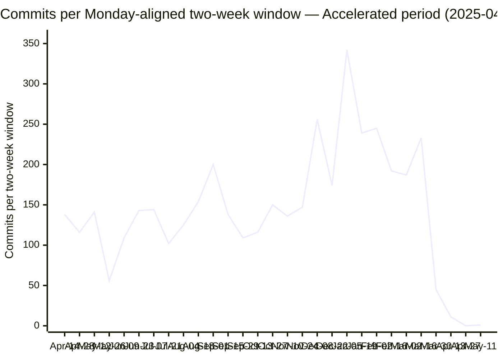

# Development Acceleration Measurement — `blitzy-cal`

A version-control measurement of development-velocity change attributable to the introduction of AI engineering tooling in the `blitzy-cal` repository. Twelve flow and operational metrics are computed over two periods — a baseline period and an accelerated period — split at a detected Tool Introduction Date, and each metric is reported as an after-versus-before comparison. The measurement is read-only: it reads git history and repository files and writes only this report (and its sibling executive presentation).

Every reported number carries a confidence tag (High / Medium / Low / Insufficient signal), a provenance chain, and a matching command in the Reproducibility Appendix (§11). Where a data source is unavailable, the value is stated as `Insufficient signal — [reason]` rather than estimated.

---

## §1 Executive Summary

The Tool Introduction Date is **2025-04-08**, the date of the earliest AI `Co-authored-by:` trailer in commit history (Devin AI; see §4.1). This date splits the history into a **Baseline** period (2021-03-10 → 2025-04-07; 12,699 commits) and an **Accelerated** period (2025-04-08 → 2026-05-15; 4,181 commits). The Accelerated period is further segmented into Ramp-Up (first 90 days) and Steady State (90+ days).

The headline figures below are reproduced in the per-metric deep-dives (§5), the traceability matrix (§6), and — where applicable — the acceleration curve (§8). Each value is identical across those sections (Rule 4).

| # | Metric | Before | After | Multiplier (after ÷ before) | Confidence |
|---|--------|--------|-------|------------------------------|------------|
| M1 | Flow Load — avg files changed per commit | 6.17 | 7.25 | 1.18× | Medium |
| M2 | Flow Velocity — commits per day | 8.52 | 10.37 | 1.22× | Medium |
| M3 | Flow Predictability — CV of windowed commit counts (proxy) | 0.445 | 0.535 | 1.20× | Low |
| M4 | Flow Active Time — median intra-session inter-commit interval (proxy) | 28.1 min | 28.6 min | 1.02× | Low |
| M5 | Flow Efficiency — active-day density (proxy) | 88.5% | 80.4% | 0.91× | Low |
| M6 | Flow Distribution — feature share of classified commits | 15.9% | 21.6% | 1.36× | Medium |
| M7 | Flow Time — median inter-release interval (proxy) | n/a (0 releases) | 4.7 days | 0 → N | Low |
| M8 | Problem Records in Release — revert commits | 147 | 71 | 0.48× (absolute) | Medium |
| M9 | Releases — changeset "Version Packages" commits | 0 | 22 | 0 → 22 | Medium-Low |
| M10 | Approved Exceptions | Insufficient signal | Insufficient signal | — | Insufficient |
| M11 | Escaped Defects — skipped/todo test files (snapshot) | Insufficient signal (historical) | 46 files / 114 call sites (snapshot) | — | Low |
| M12 | Defects Out of SLA | Insufficient signal | Insufficient signal | — | Insufficient |

Supporting observations, each detailed and sourced in §5:

- **Commit velocity** rose from 8.52 to 10.37 commits per day (1.22×), measured as commits divided by inclusive calendar days in each period (§5.2).
- The **AI actor cohort** authored **700** commits in the Accelerated period — **16.7%** of the period's 4,181 commits — making it the single highest-volume author identity; the cohort comprises Blitzy Agent (597 commits) and Devin (103 commits) (§5.2, §7).
- The AI actor's commits average **1.55 files per commit**, below both period-wide averages (6.17 before, 7.25 after) (§5.1).
- The **conventional-commit mix** shifted: the feature (`feat`) share rose from 15.9% to 21.6% of classified commits and the defect-fix (`fix`) share fell from 58.3% to 41.5% (§5.6).
- **Revert commits** fell in absolute terms from 147 to 71, while the per-commit revert rate rose from 1.16% to 1.70% (§5.8).
- **Changeset-driven releases** ("Version Packages" commits) went from 0 in the Baseline to 22 in the Accelerated period; the repository carries 0 git tags throughout (§5.9).
- Four metrics resolve to `Insufficient signal` for their strict definitions because the required data sources (issue-tracker / PR-review API, time-tracking, SLA policy) are unavailable: M10 and M12 fully, and the strict definitions of M3, M4, M5, and M7 (proxies are provided at Low confidence) (§3, §5, §10).

The highest sustained windowed commit velocity occurs in the Steady State phase (149.8 commits per two-week window, versus 119.0 in the Baseline; §8). This phase begins in late 2025 within the Devin-cohort era and continues through the first Blitzy Agent commit (2026-02-25); the attribution of the AI cohort is discussed in §10.

---

## §2 Environment Verification

This section documents the execution environment and repository identity before any metric is presented (Rule 6). All values are produced by the commands in §11.1 and were captured at the extraction timestamp below.

| Property | Value |
|----------|-------|
| Repository | `blitzy-cal` (Cal.com-derived scheduling monorepo) |
| `origin` URL (redacted) | `https://github.com/Blitzy-Sandbox/blitzy-cal.git` |
| git version | 2.51.0 |
| Analysis runtime | python3 3.13.7 |
| Total commits (`HEAD` = `main`) | 16,880 |
| Active remote branches (excluding `HEAD` alias) | 26 |
| Git tags | 0 |
| Submodules | None (`.gitmodules` absent) |
| Commit date range | 2021-03-10 → 2026-05-15 (≈5.2 years) |
| `HEAD` commit | `a116e152e4215cd97822ebd8ee435da8913887e6` |
| Extraction timestamp (UTC) | 2026-06-01T15:30:42Z |

Notes on the environment facts:

- **Credential redaction.** The live `origin` URL embeds an access credential. It is redacted to `https://github.com/Blitzy-Sandbox/blitzy-cal.git` everywhere it appears. The appendix lists the command `git remote get-url origin`, not its raw output; no credential string is reproduced in this report.
- **Branch count.** The command `git branch -r | grep -v HEAD | wc -l` returns 26 at the extraction timestamp. This count varies over time and by counting method: it includes ephemeral working branches (`blitzy-*`, `config-*`) that are created and removed during automated runs, and it excludes the `origin/HEAD` alias and local-only branches. A figure of 27 appears in the source Agent Action Plan and a figure of 25 was observed at an earlier extraction; the live command output (26) is reported here, with both alternative figures noted for transparency. The branch count is environment context only and is not an input to any of the twelve metrics.
- **Tags and releases.** The repository has 0 git tags. Releases are changeset-driven rather than tag-driven (see §3 and §5.9), so the absence of tags is expected and is not a gap.
- **Runtime versions.** The git and python3 versions above are the versions present in the analysis environment at extraction time and are the versions under which the §11 commands were executed.

---

## §3 Data Source Inventory

Every system consulted for this measurement is listed below with its access method and availability. Systems that were attempted and found unavailable are listed explicitly, together with the metric(s) they would have raised in confidence.

| Data source | Access method | Availability | Feeds |
|-------------|---------------|--------------|-------|
| Git history (`main` DAG) | `git log` / `git rev-list` | Available | M1–M9, M11; actor identities; windowing |
| `.changeset/config.json` | File read | Available | Release model context (M8, M9) |
| `.changeset/*.md` | File read / `ls` | Available | Pending release count (M9) |
| `.github/workflows/{draft-release,re-draft,post-release,release-docker,changesets}.y*ml` | File read / `ls` | Available | Release detection context (M9) |
| `.github/workflows/{all-checks,unit-tests,api-v2-unit-tests,integration-tests,e2e,e2e-*}.yml` | File read | Available | Test/CI context (M11) |
| CI test-result artifacts (blob reports, JUnit XML) | GitHub Actions artifact store | **Unavailable** — finite retention (7–30 days; e.g. `.github/workflows/e2e.yml` sets `retention-days: 30`) | Historical split of M11 |
| `.github/workflows/{cubic-devin-review,cubic-devin-review-trigger,devin-conflict-resolver,stale-pr-devin-completion,sync-agents-to-devin}.yml` | File read / `ls` | Available | Tool Introduction Date corroboration (§4.1) |
| `.github/CODEOWNERS` | File read | Available | Review-exemption context — test files exempt (M4, M5) |
| `.github/labeler.yml`, `.github/ISSUE_TEMPLATE/*`, `.github/PULL_REQUEST_TEMPLATE.md` | File read | Available | Work-type / actor / review context (M6, M10) |
| `AGENTS.md` | File read | Available | PR-size convention (M1) |
| `package.json` (`workspaces`) | File read | Available | Per-module workspace globs (§4.5) |
| `vitest.workspace.ts`, `playwright.config.ts` | File read | Available | Test-discovery / skip convention (M11) |
| `blitzy-docs/project-guide.md` | File read | Available | Accelerated-period narrative context |
| GitHub REST API — releases, pulls, issues, reviews | `gh` / `curl` + token | **Unavailable** — `gh`/`glab`/`jq` not installed and no read token configured | Higher-confidence M6 (labels), M9 (releases), M10 (approvals), M11 (CI history), M12 (SLA) |
| SLA / severity policy / runbook file | Repository file search | **Not found** — no such file exists | M12 |

Access-attempt notes:

- The GitHub REST API was treated as the preferred higher-confidence source for label-based distribution, release counts, PR approvals, historical CI results, and SLA timestamps. The API client tooling is not installed in the analysis environment and no read-only token is configured, so the API was not reachable. Each affected metric falls back to the documented git proxy at the confidence stated in §5, or is marked `Insufficient signal`.
- A repository-wide search for an SLA policy, a severity-classification policy, or an incident runbook returned no matching file. M12 is therefore reported as `Insufficient signal` (§5.12).
- Historical CI test-result artifacts (blob reports and JUnit XML) are produced by the test workflows but are retained only for a bounded window (the e2e workflow sets `retention-days: 30`; the API v2 e2e and atoms workflows set 7; the merged-reports workflow sets 14). A before/after split of actual test pass/fail counts across the ≈5.2-year history is therefore not derivable; M11 is reported as a current snapshot at Low confidence (§5.11).

> The source Agent Action Plan references a `blitzy-docs/technical-specifications.md` §6.6 as the basis for CI-artifact retention and testing-topology figures. The `technical-specifications.md` present in this repository is a feature-addition specification (Calendly-parity sprints) and does not contain a §6.6 or those figures. To preserve provenance (Rule 1), the retention basis cited here is taken directly from the workflow files' `retention-days` settings rather than from that document.

---

## §4 Methodology

The same extraction logic is applied to both periods; only the date range and, where relevant, the actor differ (the "identical methodology" requirement). The procedure is documented here and the exact commands appear in §11.

### §4.1 Tool Introduction Date detection

The pivot date is the **earliest AI `Co-authored-by:` trailer** in the commit history. The earliest such trailer naming the Devin AI integration is dated **2025-04-08** (commit `76a820f3ca154cb96849173021cac68e2f095656`, authored by `devin-ai-integration[bot]`). The pivot is corroborated by two independent signals:

1. **Institutionalized AI workflows.** Five dedicated Devin AI workflow files exist in `.github/workflows/`: `cubic-devin-review.yml`, `cubic-devin-review-trigger.yml`, `devin-conflict-resolver.yml`, `stale-pr-devin-completion.yml`, and `sync-agents-to-devin.yml`.
2. **Velocity inflection.** Windowed commit velocity is flat through the Ramp-Up phase and rises in the Steady State phase (§8).

A second AI actor identity, Blitzy Agent (`agent@blitzy.com`), first appears on 2026-02-25. The pivot uses the earliest AI trailer (Devin, 2025-04-08); the Accelerated-period actor population is framed as the full AI cohort with Blitzy as one actor row. This attribution choice is disclosed in §10.

### §4.2 Period split and day-count convention

| Period | Date range | Commits | Days (inclusive) | Commits/day |
|--------|------------|---------|------------------|-------------|
| Baseline (before) | 2021-03-10 → 2025-04-07 | 12,699 | 1,490 | 8.52 |
| Accelerated (after) | 2025-04-08 → 2026-05-15 | 4,181 | 403 | 10.37 |

Period length uses **inclusive calendar-day counting**: `days = (last_day − first_day) + 1`, applied identically to both periods. Under this single convention the Baseline spans 1,490 days and the Accelerated period spans 403 days. (An exclusive date-difference would yield 402 days for the Accelerated period; the inclusive convention is used uniformly here, and the multiplier rounds to 1.22× under either count.)

### §4.3 Windowing

A single deterministic windowing function is reused identically across both periods and all time-series metrics:

1. Normalize each commit's author date to the **Monday of its ISO week**: `monday = date − date.weekday() days`.
2. Anchor on the Monday of the earliest commit's ISO week (2021-03-08).
3. Assign each commit to a **14-day (two-week) bucket**: `window_index = (monday − anchor) // 14 days`.

Accelerated-period windows are classified by their start date: **Ramp-Up** = windows whose start falls in the first 90 days after the pivot (2025-04-08 → 2025-07-07); **Steady State** = windows whose start falls 90+ days after the pivot (2025-07-08 onward). The function appears in full in §11.12.

### §4.4 Actor framing

In the Accelerated period the AI tool is treated as an engineering **actor** that authors code while humans review. Working-time metrics (M4, M5) are computed from the actor's perspective, and actor-aggregated metrics (M2, M4, M5, M6, M10) include the AI actor as one row alongside human engineers. Baseline extraction uses identical logic with the human population as the actor set. Author identities are alias-deduplicated and bot identities are excluded from human rows before aggregation (§7).

### §4.5 Confidence model

Each metric is tagged to the actual source used:

- **High** — direct issue-tracker counts (none available in this measurement; no metric qualifies).
- **Medium** — git commit patterns (subjects, authorship, file statistics, revert markers).
- **Low** — indirect proxies (inter-commit timing, active-day density, release cadence, snapshot counts).
- **Insufficient signal** — the required source is unavailable; no value is derived.

Every Low-confidence and every Insufficient-signal metric carries an explicit caveat sentence in §5 (Rule 3).

### §4.6 Per-module aggregation

The repository is a Yarn + Turborepo monorepo whose `package.json` declares workspace globs `apps/*`, `apps/api/*`, `packages/*`, `packages/embeds/*`, `packages/features/*`, `packages/app-store`, `packages/app-store/*`, `packages/platform/*`, `packages/platform/examples/base`, and `example-apps/*`. Extraction is run per workspace and aggregated weighted by commit (file-touch) volume; the per-module table appears in §7.2.

### §4.7 Ratio handling

When the Baseline value is zero, the result is reported as `0 → N` and described as a new capability rather than as an infinite multiplier (applies to M9, where Baseline releases = 0, and to M7, where Baseline release cadence is undefined).

---

## §5 Metric Deep-Dives

All twelve metrics in the frozen set are presented below. For each metric: the before value, the after value, the multiplier, the confidence tag, the provenance chain, and any caveats. The corresponding commands are in §11.

### §5.1 M1 — Flow Load

- **Definition.** Work-in-progress proxied by commit size (files changed per commit).
- **Before:** 6.17 files/commit. **After:** 7.25 files/commit. **Multiplier:** 1.18×. **AI actor (Blitzy Agent):** 1.55 files/commit.
- **Confidence:** Medium (git commit-statistics proxy).
- **Provenance.** Requirement: quantify PR/commit size before vs after → Command: `git log <range> --shortstat` summed and divided by the count of commits carrying a diffstat (§11.7) → Raw output: ≈6.17 (before, over ≈12,230 diffstat commits), ≈7.25 (after, over ≈4,150 diffstat commits), 1.55 (AI actor, over 578 diffstat commits); the diffstat-commit count varies by one to two commits at the period boundary across runs while the averages are stable to two decimals → Derived: before 6.17; after 7.25; AI actor 1.55 → Reported: 6.17 → 7.25.
- **Context.** `AGENTS.md` states the PR-size guideline "Never create large PRs (>500 lines or >10 files)" and "Keep PRs under 500 lines of code" and "under 10 code files." The AI actor's per-commit footprint (1.55 files) is below both period-wide averages and below this guideline.[^agents-prsize]
- **Caveat.** Merge commits fell from 445 (before) to 8 (after); `--shortstat` emits no diffstat line for a merge commit, so merge commits are excluded from this average in both periods and merge-commit file counts are not used as an after-period PR-size proxy. The metric measures non-merge commit file counts.

[^agents-prsize]: The Agent Action Plan paraphrases this guideline as "5–7 files / 500-line." The literal `AGENTS.md` thresholds are ≤500 lines and ≤10 code files; those literal values are reported here.

### §5.2 M2 — Flow Velocity

- **Definition.** Completed items per period, proxied by commits per day.
- **Before:** 8.52 commits/day. **After:** 10.37 commits/day. **Multiplier:** 1.22×.
- **Confidence:** Medium (git commit counts).
- **Provenance.** Requirement: completed work per unit time before vs after → Command: `git rev-list --count` over each range, divided by inclusive calendar days (§11.4, §4.2) → Raw output: 12,699 commits / 1,490 days; 4,181 commits / 403 days → Derived: 8.52; 10.37 → Multiplier 10.37 ÷ 8.52 = 1.22× → Reported: 8.52 → 10.37 (1.22×).
- **Actor framing (actor-aggregated).** In the Accelerated period the AI actor cohort authored 700 commits (Blitzy Agent 597; Devin 103), which is 16.7% of the period's 4,181 commits and the highest volume of any single author identity. The top human author in the period authored 322 commits (§7).
- **Caveat.** Commit count is a volume proxy for completed work, not a count of closed issues or merged pull requests; a higher-confidence count would require the issue-tracker / PR API (§3).

### §5.3 M3 — Flow Predictability

- **Definition (strict).** Consistency of meeting commitments.
- **Strict result:** `Insufficient signal — no issue-tracker commitment data`. No source of planned-versus-delivered commitments is available.
- **Proxy (reported):** coefficient of variation (CV = population standard deviation ÷ mean) of commit counts per Monday-aligned two-week window. **Before:** 0.445. **After:** 0.535. **Multiplier:** 1.20× (a higher CV indicates lower consistency).
- **Confidence:** Low (windowed-stability proxy).
- **Provenance.** Requirement: stability of delivery cadence before vs after → Command: windowing function (§11.12) over each range, then CV of the per-window counts → Raw output: Baseline 107 windows mean 119.0; Accelerated 29 windows mean 143.1 → Derived: CV 0.445 (before), 0.535 (after) → Reported: 0.445 → 0.535.
- **Caveat (Low).** This proxy measures dispersion of commit volume, not adherence to commitments; it is not the strict definition. The final Accelerated windows fall near the data cutoff (2026-05-15) and contain partial counts (45, 11, 0, 1 commits; §8), which raise the Accelerated CV; the proxy should be read with that boundary effect in mind.

### §5.4 M4 — Flow Active Time

- **Definition (strict).** Active working time spent on an item, from the actor's perspective.
- **Strict result:** `Insufficient signal — no time-tracking source`. Git does not record active working time.
- **Proxy (reported):** median interval between consecutive commits by the same period population within an 8-hour session window. **Before:** 28.1 min. **After:** 28.6 min. **AI actor (Blitzy Agent):** 7.0 min. **Multiplier (before→after):** 1.02×.
- **Confidence:** Low (inter-commit-interval proxy).
- **Provenance.** Requirement: active time per actor before vs after → Command: extract commit epochs per range, compute gaps ≤ 8 h, take the median (§11.8) → Raw output: 11,364 intra-session gaps (before), 3,958 (after), 577 (AI actor) → Derived medians: 28.1 min; 28.6 min; 7.0 min → Reported: 28.1 → 28.6 min.
- **Caveat (Low).** Inter-commit interval is a cadence proxy, not active coding time; commits do not bracket continuous work, and the 8-hour session threshold is a chosen heuristic. The AI actor's shorter median interval (7.0 min) reflects more frequent commits within sessions, not a direct measurement of effort.

### §5.5 M5 — Flow Efficiency

- **Definition (strict).** Active time divided by total elapsed time (including wait).
- **Strict result:** `Insufficient signal — no work-item active/wait timing`. Per-item active and wait durations are not recorded in git.
- **Proxy (reported):** active-day density = distinct calendar days with at least one commit ÷ total inclusive days in the period. **Before:** 88.5% (1,318 ÷ 1,490). **After:** 80.4% (324 ÷ 403). **Multiplier:** 0.91×.
- **Confidence:** Low (activity-density proxy).
- **Provenance.** Requirement: ratio of active to elapsed time → Command: count distinct commit dates per range, divide by inclusive period days (§11.9, §4.2) → Raw output: 1,318 active days / 1,490 (before); 324 active days / 403 (after) → Derived: 88.5%; 80.4% → Reported: 88.5% → 80.4%.
- **Caveat (Low).** Active-day density measures how many days saw any commit, not the active-to-wait ratio of work items; it is not the strict definition. `.github/CODEOWNERS` (lines 41–47) exempts test files (`*.spec.*`, `*.test.*`, `*.test-suite.*`, `*.integration-test.*`) from review, which would affect any review-based "ready-for-review" timing were the PR API available.

### §5.6 M6 — Flow Distribution

- **Definition.** Mix of work types (features / defects / debt / risk), classified from conventional-commit subject prefixes.
- **Confidence:** Medium (git commit-subject patterns).
- **Result (share of classified commits).** Classified totals: 6,903 (before), 3,674 (after).

| Work type (mapping) | Before | After |
|---------------------|--------|-------|
| Features (`feat`) | 15.9% | 21.6% |
| Defects (`fix`) | 58.3% | 41.5% |
| Debt (`refactor` + `chore` + `perf`) | 20.8% | 27.7% |
| Risk (`revert`) | 2.1% | 1.6% |

- **Per-prefix raw counts.** Before — `fix` 4,024, `feat` 1,096, `chore` 1,081, `refactor` 196, `perf` 160, `revert` 145, `test` 125, `docs` 45, `ci` 12, `build` 11, `style` 8. After — `fix` 1,524, `feat` 793, `chore` 605, `refactor` 279, `docs` 208, `perf` 133, `revert` 59, `test` 48, `ci` 13, `style` 10, `build` 2.
- **Provenance.** Requirement: work-type mix before vs after → Command: `git log <range> --format='%s'`, match leading conventional prefix, tally (§11.6) → Raw output: per-prefix counts above → Derived: percentage shares over classified totals (6,903; 3,674) → Reported: feature share 15.9% → 21.6%; defect share 58.3% → 41.5%.
- **Actor framing.** This distribution is actor-aggregated over each period's full author population (AI actor included in the Accelerated period).
- **Caveat.** Percentages are computed over commits whose subject begins with a recognized conventional prefix; commits without such a prefix are excluded from the denominator. Label-based classification (higher confidence) would require the GitHub API (§3).

### §5.7 M7 — Flow Time

- **Definition (strict).** Elapsed time from work start to finish, including wait.
- **Strict result:** `Insufficient signal — no PR/issue open→close timestamps`. Branch first-commit-to-merge times are not reliably derivable from this history (the after period contains 8 merge commits; most work lands via squash), and issue/PR open and close timestamps require the GitHub API (§3).
- **Proxy (reported):** median interval between consecutive changeset "Version Packages" release commits in the Accelerated period. **Before:** not applicable — 0 release commits. **After:** 4.7 days (22 release commits). **Ratio:** `0 → N` (new capability).
- **Confidence:** Low (release-cadence proxy).
- **Provenance.** Requirement: cycle time before vs after → Command: epochs of "Version Packages" commits in the Accelerated range, median of consecutive differences (§11.10) → Raw output: 22 release commits; median inter-release interval 4.7 days → Reported: after 4.7 days; before undefined.
- **Caveat (Low).** Inter-release interval is a release-cadence proxy, not item flow time; it measures spacing between release commits, not the lifetime of individual work items. The Baseline has no changeset releases, so no before value exists.

### §5.8 M8 — Problem Records in Release (revert commits)

- **Definition.** Count of revert commits as a proxy for problem records.
- **Before:** 147. **After:** 71 (absolute). **Multiplier (absolute):** 0.48×.
- **Normalized:** per-day 0.099 → 0.176; per-commit 1.16% → 1.70%.
- **Confidence:** Medium (git revert markers).
- **Provenance.** Requirement: problem records before vs after → Command: `git log <range> -i --grep='^Revert'` counted (§11.5) → Raw output: 147 (before), 71 (after) → Derived: per-day 147 ÷ 1,490 = 0.099 and 71 ÷ 403 = 0.176; per-commit 147 ÷ 12,699 = 1.16% and 71 ÷ 4,181 = 1.70% → Reported: 147 → 71 absolute; 1.16% → 1.70% per-commit.
- **Caveat.** Absolute reverts fell (147 → 71) while the per-commit revert rate rose (1.16% → 1.70%); both views are reported and neither is presented as the sole figure. This message-based match (`^Revert` anywhere a line begins, case-insensitive) is broader than the subject-prefix `revert` count used in the M6 distribution (145 before, 59 after); the two counts measure different things and are reported separately. A combined short flag `-iE` is misparsed by the git option parser and returns 0; the working form uses separate `-i` (§11.5).

### §5.9 M9 — Releases

- **Definition.** Count of releases, proxied by changeset "Version Packages" commits.
- **Before:** 0. **After:** 22. **Ratio:** `0 → 22` (new capability).
- **Confidence:** Medium-Low (changeset-commit proxy).
- **Provenance.** Requirement: release count before vs after → Command: `git log <range> -i --grep='Version Packages'` counted; `ls .changeset/*.md` (§11.6) → Raw output: 0 (before), 22 (after); 1 pending changeset (`.changeset/tender-birds-think.md`) → Reported: 0 → 22.
- **Context.** `.changeset/config.json` configures `@changesets/changelog-github` against `calcom/cal.com`, `baseBranch: main`, and `privatePackages.tag: false`. The pending changeset `tender-birds-think.md` declares a `@calcom/atoms` patch ("fix: unlocked fields not saved for managed event type"). The repository carries 0 git tags throughout.
- **Caveat (Low component).** Because the release model is changeset-driven with `tag: false`, git tags are not the release signal; "Version Packages" commits are the proxy. A higher-confidence count would require the GitHub Releases API (`GET /repos/{owner}/{repo}/releases`), which is unavailable (§3).

### §5.10 M10 — Approved Exceptions

- **Definition.** Count of approved exceptions / review overrides.
- **Result:** `Insufficient signal — no PR-review/approval API access`.
- **Confidence:** Insufficient.
- **Provenance.** Requirement: approved exceptions before vs after → Intended source: GitHub PR reviews API (`GET /repos/{owner}/{repo}/pulls/{n}/reviews`) and branch-protection override events → Availability: unavailable (no API tooling or token; §3) → Reported: Insufficient signal.
- **Caveat (Insufficient).** Approval and override data resides in the PR-review system and is not recoverable from commit history; no git proxy faithfully represents an "approved exception," so no value is derived rather than substituting a misleading proxy.

### §5.11 M11 — Escaped Defects (newly skipped / failed tests)

- **Definition.** Defects escaping into the codebase, proxied by skipped/todo tests.
- **Historical before/after split:** `Insufficient signal — CI artifact retention 7–30 days`.
- **Current snapshot (reported):** 46 test files contain `.skip(`/`.todo(`; 114 call sites match `(it|test|describe).(skip|todo)(`.
- **Confidence:** Low (snapshot proxy).
- **Provenance.** Requirement: escaped defects before vs after → Command: `grep -rIl` over test globs for `\.(skip|todo)\(` (files) and `grep -rIoh` for the call-site pattern (§11.11) → Raw output: 46 files; 114 call sites → Reported: 46 files / 114 call sites (snapshot).
- **Caveat (Low).** This is a point-in-time snapshot, not a before/after series: CI test-result artifacts have bounded retention (the e2e workflow sets `retention-days: 30`; others 7–14), so historical pass/fail/skip counts across the ≈5.2-year window are not available. The repository follows a skip-with-TODO convention; the snapshot counts skipped/todo declarations present at `HEAD` only.

### §5.12 M12 — Defects Out of SLA

- **Definition.** Count of defects breaching a service-level agreement.
- **Result:** `Insufficient signal — no SLA/severity data source`.
- **Confidence:** Insufficient.
- **Provenance.** Requirement: defects out of SLA before vs after → Intended source: issue-tracker severity labels and SLA timestamps, or an in-repo SLA/severity/runbook policy → Availability: a repository search found no SLA, severity-policy, or runbook file, and the issue-tracker API is unavailable (§3) → Reported: Insufficient signal.
- **Caveat (Insufficient).** Neither a severity classification nor SLA timestamps exist in any available source; no value is derived and none is estimated.

---

## §6 Requirements Traceability Matrix

Each user requirement is mapped to the report section that satisfies it, the appendix command(s) that produce its evidence, and the derived value or status. Every figure in the Executive Summary (§1) appears here (Rule 1).

| Requirement | Section | Appendix command(s) | Derived value / status |
|-------------|---------|---------------------|------------------------|
| Repository discovery (redacted) | §2 | §11.1 (`git remote get-url origin`, redacted) | `https://github.com/Blitzy-Sandbox/blitzy-cal.git`; 16,880 commits; 26 branches; 0 tags |
| Tool Introduction Date detection | §4.1 | §11.2 | 2025-04-08 (commit `76a820f3…`) |
| Period split | §4.2 | §11.4 | Before 12,699 / 1,490 d; After 4,181 / 403 d |
| M1 Flow Load | §5.1 | §11.7 | 6.17 → 7.25 (1.18×); AI actor 1.55 — Medium |
| M2 Flow Velocity | §5.2 | §11.4 | 8.52 → 10.37 commits/day (1.22×) — Medium |
| M3 Flow Predictability | §5.3 | §11.12 | strict Insufficient; proxy CV 0.445 → 0.535 — Low |
| M4 Flow Active Time | §5.4 | §11.8 | strict Insufficient; proxy 28.1 → 28.6 min; AI actor 7.0 min — Low |
| M5 Flow Efficiency | §5.5 | §11.9 | strict Insufficient; proxy 88.5% → 80.4% — Low |
| M6 Flow Distribution | §5.6 | §11.6 | feature 15.9% → 21.6%; defect 58.3% → 41.5% — Medium |
| M7 Flow Time | §5.7 | §11.10 | strict Insufficient; proxy after 4.7 d; before n/a — Low |
| M8 Problem Records (reverts) | §5.8 | §11.5 | 147 → 71; 1.16% → 1.70% per commit — Medium |
| M9 Releases | §5.9 | §11.6 | 0 → 22; 0 tags — Medium-Low |
| M10 Approved Exceptions | §5.10 | §11.13 (API, unavailable) | Insufficient signal |
| M11 Escaped Defects | §5.11 | §11.11 | 46 files / 114 call sites (snapshot); historical Insufficient — Low |
| M12 Defects Out of SLA | §5.12 | §11.13 (API, unavailable) | Insufficient signal |
| Engineering-actor framing | §4.4, §5.2, §7 | §11.3 | AI cohort 700 (16.7%); Blitzy 597; Devin 103 |
| Temporal phase analysis | §4.3, §8 | §11.12 | Baseline 119.0 / Ramp-Up 117.2 / Steady 149.8 per window |
| Confidence model | §4.5, all §5 | n/a (tagging rule) | Tags present on all 12 metrics |
| Multi-module aggregation | §4.6, §7.2 | §11.14 | Per-module table; weighted by file-touch volume |
| Two deliverables | §1, §10 | n/a | This report + sibling reveal.js presentation |
| Credential redaction | §2 | §11.1 | Token scrubbed; redacted URL only |

---

## §7 Per-Engineer Acceleration

### §7.1 Author breakdown

Author identities are alias-deduplicated before aggregation: `zomars` is merged into Omar López; multiple spellings of Hariom Balhara are merged; `CarinaWolli` is merged into Carina Wollendorfer; multiple email addresses for the same person are consolidated. Bot identities are excluded from human rows (Crowdin Bot, `github-actions[bot]`, `dependabot[bot]`, `kodiakhq[bot]`, `coderabbitai[bot]`, `cubic-dev-ai[bot]`, and similar). The AI tool is represented as a labeled **AI actor** row, not as a human engineer.

Period author totals after de-duplication: Baseline — 11,477 human commits across 737 distinct human identities, plus 1,221 bot commits (excluded) and 1 AI-actor commit. Accelerated — 3,373 human commits across 200 distinct human identities, plus 108 bot commits (excluded) and 700 AI-actor commits.

**Baseline period — top human authors (commits):**

| Rank | Engineer | Commits |
|------|----------|---------|
| 1 | Omar López (incl. `zomars`) | 1,380 |
| 2 | Peer Richelsen | 929 |
| 3 | Alex van Andel | 826 |
| 4 | Hariom Balhara | 671 |
| 5 | sean-brydon | 497 |
| 6 | Agusti Fernandez Pardo | 465 |
| 7 | Udit Takkar | 455 |
| 8 | Carina Wollendorfer | 358 |
| 9 | Benny Joo | 342 |
| 10 | Syed Ali Shahbaz | 336 |

**Accelerated period — top human authors and AI actor (commits):**

| Rank | Author | Commits | Type |
|------|--------|---------|------|
| — | **AI cohort (Blitzy Agent + Devin)** | **700** | **AI actor** |
| — | • Blitzy Agent | 597 | AI actor |
| — | • Devin | 103 | AI actor |
| 1 | Anik Dhabal Babu | 322 | Human |
| 2 | Benny Joo | 214 | Human |
| 3 | Eunjae Lee | 207 | Human |
| 4 | Keith Williams | 200 | Human |
| 5 | sean-brydon | 184 | Human |
| 6 | Hariom Balhara | 183 | Human |
| 7 | Alex van Andel | 160 | Human |
| 8 | Joe Au-Yeung | 148 | Human |
| 9 | Morgan | 146 | Human |
| 10 | Lauris Skraucis | 132 | Human |

The AI cohort's 700 commits exceed the highest human author total in the period (322), and represent 16.7% of the period's 4,181 commits. Blitzy Agent alone (597) accounts for 14.3% and Devin (103) for 2.5%. In the Baseline period the AI cohort footprint is a single Devin-authored commit.

### §7.2 Per-module aggregation

Extraction is run per workspace and weighted by file-touch volume (§4.6). The Accelerated-period file-touch counts per top-level module are below, with Baseline counts shown for comparison.

| Module | Before (file-touches) | After (file-touches) |
|--------|-----------------------|----------------------|
| `apps/web` | 26,103 | 7,655 |
| `packages/features` | 9,373 | 7,154 |
| `apps/api` | 4,430 | 2,717 |
| `packages/trpc` | 3,364 | 2,200 |
| `packages/app-store` | 7,604 | 1,781 |
| `packages/lib` | 2,292 | 1,552 |
| `packages/platform` | 1,814 | 1,124 |
| `packages/prisma` | 1,473 | 584 |
| `packages/ui` | 3,299 | 349 |
| `packages/embeds` | 954 | 269 |
| `packages/emails` | 839 | 268 |

The two highest-volume Accelerated-period modules are `apps/web` (7,655 file-touches) and `packages/features` (7,154); these two modules dominate the commit-volume weighting and therefore contribute most to the aggregated metrics in §5. The per-module ordering is consistent across periods for the leading modules (`apps/web` first, `packages/features` second).

---

## §8 Acceleration Curve

Commit velocity is bucketed into Monday-aligned two-week windows (§4.3) and reported as commits per window. The windowing produces 136 windows across the full history: 107 Baseline, 6 Ramp-Up, and 23 Steady State. The two-week window that straddles the pivot starts on 2025-03-31 (before the pivot) and is therefore classified Baseline; the first Accelerated window starts 2025-04-14.

### §8.1 Phase summary

| Phase | Windows | Mean commits/window | Multiplier vs Baseline |
|-------|---------|---------------------|------------------------|
| Baseline | 107 | 119.0 | 1.00× (reference) |
| Ramp-Up (first 90 days) | 6 | 117.2 | 0.98× |
| Steady State (90+ days) | 23 | 149.8 | 1.26× |

### §8.2 Accelerated-period windowed velocity

The line chart shows commits per two-week window across the Accelerated period. The Baseline mean (119.0 commits/window) is the reference level stated in §8.1.



### §8.3 Windowed velocity data

The complete Accelerated-period series backing the chart (window start date, phase, commit count):

| Window start | Phase | Commits | Window start | Phase | Commits |
|--------------|-------|---------|--------------|-------|---------|
| 2025-04-14 | Ramp-Up | 138 | 2025-11-10 | Steady State | 136 |
| 2025-04-28 | Ramp-Up | 116 | 2025-11-24 | Steady State | 147 |
| 2025-05-12 | Ramp-Up | 141 | 2025-12-08 | Steady State | 256 |
| 2025-05-26 | Ramp-Up | 56 | 2025-12-22 | Steady State | 174 |
| 2025-06-09 | Ramp-Up | 109 | 2026-01-05 | Steady State | 342 |
| 2025-06-23 | Ramp-Up | 143 | 2026-01-19 | Steady State | 239 |
| 2025-07-07 | Steady State | 144 | 2026-02-02 | Steady State | 245 |
| 2025-07-21 | Steady State | 102 | 2026-02-16 | Steady State | 192 |
| 2025-08-04 | Steady State | 125 | 2026-03-02 | Steady State | 187 |
| 2025-08-18 | Steady State | 154 | 2026-03-16 | Steady State | 233 |
| 2025-09-01 | Steady State | 200 | 2026-03-30 | Steady State | 45 |
| 2025-09-15 | Steady State | 138 | 2026-04-13 | Steady State | 11 |
| 2025-09-29 | Steady State | 109 | 2026-04-27 | Steady State | 0 |
| 2025-10-13 | Steady State | 116 | 2026-05-11 | Steady State | 1 |
| 2025-10-27 | Steady State | 150 | | | |

The Ramp-Up phase mean (117.2 commits/window) is at the Baseline level (119.0). The Steady State phase mean (149.8) is 1.26× the Baseline. The highest windowed counts occur in the window starting 2026-01-05 (342) and the windows of December 2025 and January–March 2026. The final four windows (2026-03-30 onward: 45, 11, 0, 1) fall near the data cutoff (2026-05-15) and reflect a partial window boundary rather than a velocity change. The Steady State rise begins in December 2025 — within the Devin-cohort era — and continues through the first Blitzy Agent commit (2026-02-25); the cohort attribution is addressed in §10.

---

## §9 Risk Assessment

This section enumerates the risks to interpretation arising from every Low-confidence and Insufficient-signal gap, with the mitigation applied in this report.

| Risk | Affected metrics | Description | Mitigation |
|------|------------------|-------------|------------|
| Proxy-versus-definition gap | M3, M4, M5, M7 | The strict definitions require issue-tracker, time-tracking, or PR data that is unavailable; reported figures are git proxies | Strict definitions are marked `Insufficient signal`; proxies are tagged Low and carry an explicit caveat naming the substitution |
| Snapshot-only data | M11 | Skipped/todo test counts are a single point-in-time reading; no historical series exists | Reported as a `HEAD` snapshot at Low confidence; historical split marked `Insufficient signal` with the workflow `retention-days` basis cited |
| No source available | M10, M12 | Approval/override data and SLA/severity data have no available source | Reported as `Insufficient signal`; no proxy substituted and no value estimated |
| API unavailability | M6, M9, M10, M11, M12 | The GitHub REST API would raise confidence (labels, releases, reviews, CI history, SLA) but is unreachable | Documented access attempt in §3; git proxies used at stated confidence; would-be endpoints listed in §11.13 |
| Boundary/cutoff effects | M3, §8 | The final Accelerated windows are partial (near the 2026-05-15 cutoff), inflating the Accelerated CV and depressing the last windowed counts | Boundary effect disclosed in §5.3 and §8.3; per-day velocity (M2) computed on exact date ranges and unaffected |
| Day-count convention | M2, M5, M8 | Inclusive vs exclusive day counting changes per-day denominators | A single inclusive convention is applied identically to both periods and documented in §4.2 |
| Actor attribution ambiguity | M2, M6, §7 | Two AI signals (Devin, Blitzy) coexist in the Accelerated period | Pivot uses the earliest AI trailer; the actor population is framed as the full AI cohort with Blitzy as one row; disclosed in §10 |
| Volume-as-completion proxy | M2 | Commit count is a volume proxy, not a count of delivered work items | Tagged Medium; the proxy nature is stated in §5.2 |
| Per-prefix classification | M6 | Commits without a recognized conventional prefix are excluded from the distribution denominator | Denominator (classified commits) stated explicitly in §5.6 |

No metric in this report carries a High confidence tag, because no direct issue-tracker source was available; the highest tag used is Medium (git commit patterns). This ceiling is itself a risk to over-interpretation and is reflected in the tags throughout §5.

---

## §10 Limitations

- **Devin-versus-Blitzy attribution ambiguity.** Two AI signals coexist in the Accelerated period. Devin AI produced the earliest AI `Co-authored-by:` trailer (2025-04-08) and is used as the pivot; Blitzy Agent (`agent@blitzy.com`) first appears on 2026-02-25 and is the actor named in the originating request. This report uses the earliest AI trailer as the pivot and frames the Accelerated-period actor population as the **full AI cohort, with Blitzy as one actor row** (597 commits) alongside Devin (103 commits). Consequently, the Accelerated-period AI-attributed activity (700 commits) spans both tools, and the Steady-State velocity rise (§8) begins before the first Blitzy commit. Readers separating Blitzy-specific from Devin-specific effects should use the per-actor rows in §7.1 rather than the cohort total.
- **Confidence ceiling at Medium.** Because the GitHub REST API and issue tracker were unavailable, no metric reaches High confidence. Most metrics are Medium (git commit patterns) or Low (proxies). Figures should not be read as issue-tracker-grade counts.
- **Insufficient-signal metrics.** M10 (Approved Exceptions) and M12 (Defects Out of SLA) have no available source and are reported as `Insufficient signal`. The strict definitions of M3, M4, M5, and M7 are likewise `Insufficient signal`; only Low-confidence proxies are provided for those four.
- **M11 is a snapshot.** Escaped-defect data is a `HEAD` snapshot (46 files / 114 call sites); CI artifact retention (7–30 days per the workflow settings) precludes a historical before/after split.
- **M1 before-value and direction.** The Baseline files-per-commit value re-derives to 6.17 under the `--shortstat` method applied identically to both periods; the after value is 7.25. The period-wide average therefore rises slightly (1.18×), while the AI actor's own per-commit footprint (1.55 files) is below both period averages. The Agent Action Plan cited a Baseline of 8.39 for this metric; that value did not reproduce under the documented command and the reproducible 6.17 is reported (§5.1, §11.7).
- **Branch-count figure.** The live branch count is 26 (§2); figures of 27 (Agent Action Plan) and 25 (earlier extraction) differ because ephemeral working branches change over time. The branch count is environment context only and feeds no metric.
- **Day-count convention.** The Accelerated period spans 403 inclusive days under the single convention applied here; an exclusive date-difference yields 402. The velocity multiplier rounds to 1.22× under either count (§4.2).
- **Runtime versions.** Metrics were re-derived under git 2.51.0 and python3 3.13.7 (the environment present at extraction). The Agent Action Plan referenced git 2.43.0 and python3 3.12.3; the actual runtime versions are reported (§2).
- **Source-document reference.** The retention and testing-topology figures attributed in the Agent Action Plan to `blitzy-docs/technical-specifications.md` §6.6 are not present in that file as it exists in this repository; the workflow `retention-days` settings are cited instead (§3).

---

## §11 Reproducibility Appendix

The commands below are ordered and reference only this repository and documented sources (Rule 5). They were executed under git 2.51.0 and python3 3.13.7. Each command's output backs a value in §5/§6. All `git log` filters use `main`; `--before=2025-04-08` selects the Baseline and `--since=2025-04-08` selects the Accelerated period.

### §11.1 Environment verification (§2)

```bash
git --version
python3 --version
git rev-list --count main
git branch -r | grep -v HEAD | wc -l
git tag | wc -l
test -f .gitmodules && cat .gitmodules || echo "none"
git log --reverse --date=short --format='%ad' main | head -1   # earliest commit date
git log -1 --date=short --format='%ad' main                    # latest commit date
git rev-parse HEAD
git remote get-url origin | sed -E 's#(https://)[^@]*@#\1***REDACTED***@#'   # redact credential
date -u +"%Y-%m-%dT%H:%M:%SZ"                                  # extraction timestamp
```

### §11.2 Tool Introduction Date (§4.1)

```bash
# Earliest AI Co-authored-by: trailer (Devin) -> pivot date + commit hash
git log main --reverse --date=short --format='%ad %H' -i \
  --grep='Co-authored-by:.*devin-ai-integration' | head -1
# Earliest Blitzy author
git log main --reverse --date=short --format='%ad %H' --author='agent@blitzy.com' | head -1
# Confirm pivot commit identity
git show -s --format='%an <%ae> %ad %s' 76a820f3ca154cb96849173021cac68e2f095656
```

### §11.3 Actor identities and AI cohort (§5.2, §7.1)

```bash
# Blitzy author commit count (after period)
git log main --author='agent@blitzy.com' --oneline | wc -l          # 597
# Devin co-author trailers / Devin-as-author (after)
git log main --since=2025-04-08 -i --grep='Co-authored-by:.*devin' --oneline | wc -l   # 895
git log main --since=2025-04-08 --author='devin' -i --oneline | wc -l                   # 103
# Per-period author tallies (raw, before alias de-dup / bot exclusion)
git log main --before=2025-04-08 --format='%an' | sort | uniq -c | sort -rn | head -20
git log main --since=2025-04-08  --format='%an' | sort | uniq -c | sort -rn | head -20
# Author name|email pairs for alias de-dup (processed in python; see §11.12 pattern)
git log main --before=2025-04-08 --format='%an|%ae' > authors_before.txt
git log main --since=2025-04-08  --format='%an|%ae' > authors_after.txt
```

Alias de-duplication merges `zomars`→Omar López, Hariom spellings→Hariom Balhara, `CarinaWolli`→Carina Wollendorfer, and multiple emails per person; bot identities (`*[bot]`, Crowdin Bot, GitHub Actions) are excluded from human rows; Blitzy Agent and Devin are tagged as AI-actor rows.

### §11.4 Period counts and velocity (§4.2, §5.2)

```bash
git rev-list --count --before=2025-04-08 main    # 12699 (Baseline)
git rev-list --count --since=2025-04-08  main    # 4181  (Accelerated)
python3 - <<'PY'
from datetime import date
def incl_days(a,b): return (b-a).days + 1
b = incl_days(date(2021,3,10), date(2025,4,7))   # 1490
a = incl_days(date(2025,4,8),  date(2026,5,15))  # 403
print(round(12699/b,2), round(4181/a,2), round((4181/a)/(12699/b),2))  # 8.52 10.37 1.22
PY
```

### §11.5 M8 — revert commits (§5.8)

```bash
# Working form uses separate -i (a combined -iE token is misparsed by git and returns 0)
git log main --before=2025-04-08 -i --grep='^Revert' --oneline | wc -l   # 147
git log main --since=2025-04-08  -i --grep='^Revert' --oneline | wc -l   # 71
# Subject-prefix revert (the count used in the M6 distribution): 145 / 59
git log main --before=2025-04-08 --format='%s' | grep -ciE '^revert'     # 145
git log main --since=2025-04-08  --format='%s' | grep -ciE '^revert'     # 59
```

### §11.6 M6 — distribution and M9 — releases (§5.6, §5.9)

```bash
# Conventional-commit prefix tally per period
git log main --before=2025-04-08 --format='%s' \
  | grep -oiE '^(feat|fix|chore|refactor|docs|perf|test|ci|build|style|revert)' \
  | tr 'A-Z' 'a-z' | sort | uniq -c | sort -rn
git log main --since=2025-04-08 --format='%s' \
  | grep -oiE '^(feat|fix|chore|refactor|docs|perf|test|ci|build|style|revert)' \
  | tr 'A-Z' 'a-z' | sort | uniq -c | sort -rn
# Releases (changeset "Version Packages" commits) and pending changesets
git log main --before=2025-04-08 -i --grep='Version Packages' --oneline | wc -l   # 0
git log main --since=2025-04-08  -i --grep='Version Packages' --oneline | wc -l   # 22
ls .changeset/*.md
cat .changeset/config.json
```

### §11.7 M1 — Flow Load (§5.1)

```bash
flowload() { git log main "$@" --shortstat --pretty=tformat:'C' \
  | grep changed | sed -E 's/.* ([0-9]+) files? changed.*/\1/' \
  | awk '{s+=$1;k++} END{printf "%.2f over %d commits\n", s/k, k}'; }
flowload --before=2025-04-08              # 6.17  (over ~12,230 diffstat commits)
flowload --since=2025-04-08               # 7.25  (over ~4,150 diffstat commits)
flowload --author='agent@blitzy.com'      # 1.55  (over 578 diffstat commits, AI actor)
git log main --before=2025-04-08 --merges --oneline | wc -l   # 445 merges
git log main --since=2025-04-08  --merges --oneline | wc -l   # 8 merges
```

### §11.8 M4 — Flow Active Time proxy (§5.4)

```bash
python3 - <<'PY'
import subprocess, statistics
def med_gap(args, sess=8*3600):
    ep=sorted(int(x) for x in subprocess.run(
        ['git','log','main','--format=%at']+args,capture_output=True,text=True).stdout.split())
    g=[ep[i]-ep[i-1] for i in range(1,len(ep)) if 0 < ep[i]-ep[i-1] <= sess]
    return statistics.median(g)/60, len(g)
print(med_gap(['--before=2025-04-08']))    # ~28.1 min
print(med_gap(['--since=2025-04-08']))     # ~28.6 min
print(med_gap(['--author=agent@blitzy.com']))  # ~7.0 min (AI actor)
PY
```

### §11.9 M5 — Flow Efficiency proxy (§5.5)

```bash
git log main --before=2025-04-08 --date=short --format='%ad' | sort -u | wc -l   # 1318 active days
git log main --since=2025-04-08  --date=short --format='%ad' | sort -u | wc -l   # 324 active days
# density = active_days / inclusive_period_days : 1318/1490=88.5% ; 324/403=80.4%
```

### §11.10 M7 — Flow Time proxy (§5.7)

```bash
python3 - <<'PY'
import subprocess, statistics
rel=sorted(int(x) for x in subprocess.run(
    ['git','log','main','--since=2025-04-08','-i','--grep=Version Packages','--format=%at'],
    capture_output=True,text=True).stdout.split())
inter=[rel[i]-rel[i-1] for i in range(1,len(rel))]
print(len(rel), round(statistics.median(inter)/86400,1))   # 22 release commits, 4.7 days median
PY
```

### §11.11 M11 — Escaped Defects snapshot (§5.11)

```bash
# Test files containing a .skip( or .todo(
grep -rIl --include='*.test.ts' --include='*.test.tsx' \
  --include='*.e2e.ts' --include='*.spec.ts' -E '\.(skip|todo)\(' . \
  | grep -v node_modules | wc -l        # 46 files
# Call sites matching (it|test|describe).(skip|todo)(
grep -rIoh --include='*.test.ts' --include='*.test.tsx' \
  --include='*.e2e.ts' --include='*.spec.ts' -E '\b(it|test|describe)\.(skip|todo)\(' . \
  | grep -v node_modules | wc -l        # 114 call sites
# Retention basis for the "no historical split" caveat
grep -rniE 'retention-days' .github/workflows/    # e2e.yml=30, api-v2=7, merge-reports=14, atoms=7
```

### §11.12 Windowing function (§4.3, §5.3, §8)

```python
from datetime import date, timedelta
from collections import Counter
import statistics, subprocess

PIVOT = date(2025, 4, 8)
RAMP_END = PIVOT + timedelta(days=90)              # 2025-07-07

def monday_of(d): return d - timedelta(days=d.weekday())

dates = sorted(
    date(*map(int, ln.split('-')))
    for ln in subprocess.run(['git','log','main','--date=short','--format=%ad'],
                             capture_output=True, text=True).stdout.split()
)
anchor = monday_of(dates[0])                       # 2021-03-08
def window_index(d): return (monday_of(d) - anchor).days // 14

counts = Counter(window_index(d) for d in dates)

def phase(idx):
    start = anchor + timedelta(days=idx*14)
    if start < PIVOT:   return 'Baseline'
    if start < RAMP_END: return 'Ramp-Up'
    return 'Steady State'

def cv(v): return statistics.pstdev(v) / statistics.mean(v)

for ph in ('Baseline', 'Ramp-Up', 'Steady State'):
    vals = [c for i, c in counts.items() if phase(i) == ph]
    print(ph, len(vals), round(statistics.mean(vals), 1), round(cv(vals), 3))
# Baseline 107 119.0 0.445 ; Ramp-Up 6 117.2 0.258 ; Steady State 23 149.8 0.556
```

### §11.13 API-dependent metrics (attempted, unavailable) (§5.10, §5.12, §3)

The following read-only GitHub REST endpoints would raise confidence for the API-dependent metrics. The API client (`gh`/`glab`/`jq`) is not installed and no read token is configured, so these were not reachable; the metrics fall back to git proxies or `Insufficient signal` as stated in §5.

```bash
# Releases (M9, higher confidence than the changeset-commit proxy)
# GET /repos/{owner}/{repo}/releases
# PR reviews and approvals (M10)
# GET /repos/{owner}/{repo}/pulls/{number}/reviews
# Label-based work-type distribution (M6, higher confidence)
# GET /repos/{owner}/{repo}/issues?labels=...
# Historical CI test results (M11 before/after split)
# GET /repos/{owner}/{repo}/actions/runs  +  artifacts (retained 7-30 days)
# Issue severity / SLA timestamps (M12)
# GET /repos/{owner}/{repo}/issues?labels=severity:*    (no SLA source exists)
```

### §11.14 Per-module aggregation (§4.6, §7.2)

```bash
permodule() { git log main "$@" --name-only --format='' \
  | grep -E '^(apps|packages)/' | cut -d/ -f1-2 | sort | uniq -c | sort -rn | head -12; }
permodule --since=2025-04-08    # Accelerated-period file-touch counts
permodule --before=2025-04-08   # Baseline-period file-touch counts
# Workspace globs
python3 -c "import json; print(json.load(open('package.json'))['workspaces'])"
```

---

*End of report. This document and its sibling executive presentation are the only files written by this measurement; no repository file or git history was modified.*
