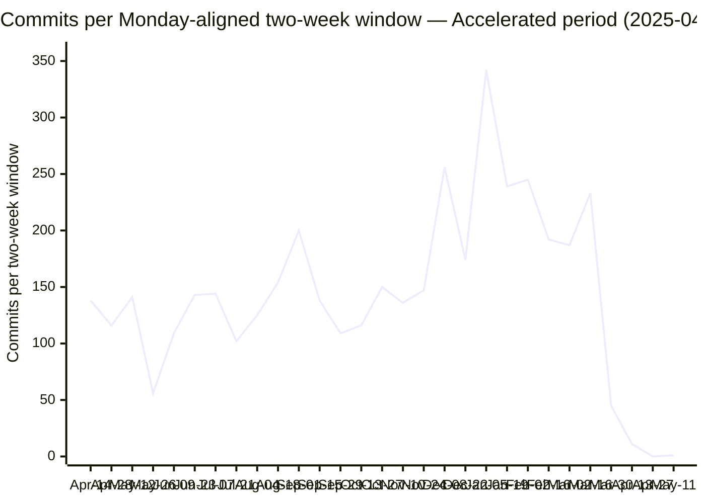

# Development Acceleration Measurement — `blitzy-cal`

A version-control measurement of development-velocity change attributable to the introduction of AI engineering tooling in the `blitzy-cal` repository. Twelve flow and operational metrics are computed over two periods — a baseline period and an accelerated period — split at a detected Tool Introduction Date, and each metric is reported as an after-versus-before comparison. The measurement is read-only: it reads git history and repository files and writes only its two deliverables. This measurement produces two deliverables, both written and present at the repository root: this report (`acceleration-report.md`) and a self-contained reveal.js executive presentation (`acceleration-report-executive-presentation.html`) built from this report's finalized figures.

Every reported number carries a confidence tag (High / Medium / Low / Insufficient signal), a provenance chain, and a matching command in the Reproducibility Appendix (§11). Where a data source is unavailable, the value is stated as `Insufficient signal — [reason]` rather than estimated.

---

## §1 Executive Summary

The Tool Introduction Date is **2025-04-08**, the date of the earliest AI `Co-authored-by:` trailer in commit history (Devin AI; see §4.1). This date splits the history into a **Baseline** period (2021-03-10 → 2025-04-07; 12,699 commits) and an **Accelerated** period (2025-04-08 → 2026-05-15; 4,181 commits). The Accelerated period is further segmented into Ramp-Up (first 90 days) and Steady State (90+ days).

The headline figures below are reproduced in the per-metric deep-dives (§5), the traceability matrix (§6), and — where applicable — the acceleration curve (§8). Each value is identical across those sections (Rule 4).

| # | Metric | Before | After | Multiplier (after ÷ before) | Confidence |
|---|--------|--------|-------|------------------------------|------------|
| M1 | Flow Load — avg files changed per commit | 6.17 | 7.25 | 1.18× | Medium |
| M2 | Flow Velocity — commits per day | 8.52 | 10.40 | 1.22× | Medium |
| M3 | Flow Predictability — CV of windowed commit counts (proxy) | 0.445 | 0.535 | 1.20× | Low |
| M4 | Flow Active Time — median intra-session inter-commit interval (proxy) | 28.1 min | 28.6 min | 1.02× | Low |
| M5 | Flow Efficiency — active-day density (proxy) | 88.5% | 80.6% | 0.91× | Low |
| M6 | Flow Distribution — feature share of classified commits | 15.6% | 21.5% | 1.38× | Medium |
| M7 | Flow Time — median inter-release interval (proxy) | n/a (0 releases) | 4.7 days | 0 → N | Low |
| M8 | Problem Records in Release — revert commits | 147 | 71 | 0.48× (absolute) | Medium |
| M9 | Releases — changeset "Version Packages" commits | 0 | 22 | 0 → 22 | Medium-Low |
| M10 | Approved Exceptions | Insufficient signal — no PR-review/approval API access | Insufficient signal — no PR-review/approval API access | — | Insufficient |
| M11 | Escaped Defects — skipped/todo test files (snapshot) | Insufficient signal — CI artifact retention 7–30 days | 46 files / 95 call sites (snapshot) | — | Low |
| M12 | Defects Out of SLA | Insufficient signal — no SLA data source | Insufficient signal — no SLA data source | — | Insufficient |

Supporting observations, each detailed and sourced in §5:

- **Commit velocity** rose from 8.52 to 10.40 commits per day (1.22×), measured as commits divided by the pivot-partition day count in each period (§5.2).
- The **AI actor cohort** authored **700** commits in the Accelerated period — **16.7%** of the period's 4,181 commits — making it the single highest-volume author identity; the cohort comprises Blitzy Agent (597 commits) and Devin (103 commits) (§5.2, §7).
- The AI actor's commits average **1.55 files per commit**, below both period-wide averages (6.17 before, 7.25 after) (§5.1).
- The **conventional-commit mix** shifted: the feature (`feat`) share rose from 15.6% to 21.5% of classified commits and the defect-fix (`fix`) share fell from 57.3% to 41.4% (§5.6).
- **Revert commits** fell in absolute terms from 147 to 71, while the per-commit revert rate rose from 1.16% to 1.70% (§5.8).
- **Changeset-driven releases** ("Version Packages" commits) went from 0 in the Baseline to 22 in the Accelerated period; the repository carries 0 git tags throughout (§5.9).
- Four metrics resolve to `Insufficient signal` for their strict definitions because the required data sources (issue-tracker / PR-review API, time-tracking, SLA policy) are unavailable: M10 and M12 fully, and the strict definitions of M3, M4, M5, and M7 (proxies are provided at Low confidence) (§3, §5, §10).

The highest sustained windowed commit velocity occurs in the Steady State phase (150.1 commits per two-week window, versus 119.0 in the Baseline; §8). This phase begins in late 2025 within the Devin-cohort era and continues through the first Blitzy Agent commit (2026-02-25); the attribution of the AI cohort is discussed in §10.

---

## §2 Environment Verification

This section documents the repository identity and the execution environment before any metric is presented (Rule 6). The facts are split into two groups so that each reproduces exactly when its command is re-run (Rules 1 and 5): **analyzed-repository facts** are properties of the subject history (`main`) and are stable across re-runs; **execution-environment facts** describe the machine and moment at which the extraction was performed. All values are produced by the commands in §11.1.

**Analyzed-repository facts** (immutable properties of the measured history; stable across re-runs):

| Property | Value | Producing command (§11.1) |
|----------|-------|---------------------------|
| Repository | `blitzy-cal` (Cal.com-derived scheduling monorepo) | — |
| `origin` URL (redacted) | `https://github.com/Blitzy-Sandbox/blitzy-cal.git` | `git remote get-url origin` (redacted) |
| Analyzed branch | `main` | — |
| Analyzed-history tip commit | `a116e152e4215cd97822ebd8ee435da8913887e6` | `git rev-parse main` |
| Total commits on `main` | 16,880 | `git rev-list --count main` |
| Git tags | 0 | `git tag \| wc -l` |
| Submodules | None (`.gitmodules` absent) | `test -f .gitmodules` |
| Commit date range | 2021-03-10 → 2026-05-15 (≈5.2 years) | `git log --reverse … \| head -1`; `git log -1 …` |

**Execution-environment facts** (describe this extraction run; vary by environment and over time):

| Property | Value | Producing command (§11.1) |
|----------|-------|---------------------------|
| git version | 2.51.0 | `git --version` |
| Analysis runtime | python3 3.13.7 | `python3 --version` |
| Working branch (deliverables authored on) | `blitzy-66a0cf37-b099-41af-ab48-6833a9b7ef1c` | `git rev-parse --abbrev-ref HEAD` |
| Active remote branches (excluding `HEAD` alias) | 26 | `git branch -r \| grep -v HEAD \| wc -l` |
| Extraction timestamp (UTC) | 2026-06-02T00:16:54Z | `date -u +"%Y-%m-%dT%H:%M:%SZ"` |

Notes on the environment facts:

- **Analyzed history versus working branch.** The twelve metrics are computed over the `main` branch, whose tip commit is `a116e152e4215cd97822ebd8ee435da8913887e6` (`git rev-parse main`) and whose commit count is 16,880 (`git rev-list --count main`). These two facts are stable: the two deliverables are authored on the working branch `blitzy-66a0cf37-b099-41af-ab48-6833a9b7ef1c`, which branches from the `main` tip and accumulates the deliverable-building commits, so its own `HEAD` advances with each deliverable commit and is therefore reported as a branch name rather than a fixed hash. A working-branch `HEAD` hash is not pinned here precisely because it would be invalidated by the act of committing this report; the analyzed-history tip (`git rev-parse main`) is the stable identity and is unaffected by working-branch commits.
- **Credential redaction.** The live `origin` URL embeds an access credential. It is redacted to `https://github.com/Blitzy-Sandbox/blitzy-cal.git` everywhere it appears. The appendix lists the command `git remote get-url origin` piped through a `sed` filter (`s#https://[^@/]*@#https://#`) that strips the `credential@` segment; that command's output equals the redacted URL reported above, and no credential string is reproduced in this report.
- **Branch count.** The command `git branch -r | grep -v HEAD | wc -l` returns 26 at the extraction timestamp. This count varies over time and by counting method: it includes ephemeral working branches (`blitzy-*`, `config-*`) that are created and removed during automated runs, and it excludes the `origin/HEAD` alias and local-only branches. Alternative counts of the same refs at this extraction are 27 (`git branch -r | wc -l`, including the `origin/HEAD` alias) and 29 (`git branch -a | wc -l`, adding the 2 local branches); a figure of 27 also appears in the source Agent Action Plan, captured at an earlier time. The value reported here (26) is the output of the single documented command above. The branch count is environment context only and is not an input to any of the twelve metrics.
- **Tags and releases.** The repository has 0 git tags. Releases are changeset-driven rather than tag-driven (see §3 and §5.9), so the absence of tags is expected and is not a gap.
- **Runtime versions.** The execution-environment versions are git 2.51.0 and python3 3.13.7 (the Agent Action Plan §0.1.1 records an earlier baseline of git 2.43.0 / python3 3.12.3; the live values above supersede it for this run). The §11 extraction commands use only long-stable git porcelain/plumbing (`log`, `rev-list`, `shortstat`, `branch`, `grep`) and python3 standard-library features whose output is identical across git 2.4x–2.5x point releases and python 3.1x; the reported metrics are therefore independent of the exact runtime point version, and the metric figures hold under both the baseline and the live runtime versions.

---

## §3 Data Source Inventory

Every system consulted for this measurement is listed below with its access method and availability. Systems that were attempted and found unavailable are listed explicitly, together with the metric(s) they would have raised in confidence.

| Data source | Access method | Availability | Feeds |
|-------------|---------------|--------------|-------|
| Git history (`main` DAG) | `git log` / `git rev-list` | Available | M1–M9, M11; actor identities; windowing |
| `.changeset/config.json` | File read | Available | Release model context (M8, M9) |
| `.changeset/*.md` | File read / `ls` | Available | Pending release count (M9) |
| `.github/workflows/{draft-release,re-draft,post-release,release-docker,changesets}.y*ml` | File read / `ls` | Available | Release detection context (M9) |
| `.github/workflows/{all-checks,unit-tests,api-v2-unit-tests,integration-tests,e2e,e2e-*}.yml` | File read | Available | Test/CI context (M11) |
| CI test-result artifacts (blob reports, JUnit XML) | GitHub Actions artifact store | **Unavailable** — finite retention (7–30 days; e.g. `.github/workflows/e2e.yml` sets `retention-days: 30`) | Historical split of M11 |
| `.github/workflows/{cubic-devin-review,cubic-devin-review-trigger,devin-conflict-resolver,stale-pr-devin-completion,sync-agents-to-devin}.yml` | File read / `ls` | Available | Tool Introduction Date corroboration (§4.1) |
| `.github/CODEOWNERS` | File read | Available | Review-exemption context — test files exempt (M4, M5) |
| `.github/labeler.yml`, `.github/ISSUE_TEMPLATE/*`, `.github/PULL_REQUEST_TEMPLATE.md` | File read | Available | Work-type / actor / review context (M6, M10) |
| `AGENTS.md` | File read | Available | PR-size convention (M1) |
| `package.json` (`workspaces`) | File read | Available | Per-module workspace globs (§4.5) |
| `vitest.workspace.ts`, `playwright.config.ts` | File read | Available | Test-discovery / skip convention (M11) |
| `blitzy-docs/project-guide.md` | File read | Available | Accelerated-period narrative context |
| GitHub REST API — releases, pulls, issues, reviews | `gh` / `curl` + token | **Unavailable** — `gh` (2.46.0) and `jq` (1.8.1) are installed but no authenticated read token/session is configured (`gh auth status`: not logged in); `glab` is absent | Higher-confidence M6 (labels), M9 (releases), M10 (approvals), M11 (CI history), M12 (SLA) |
| SLA / severity policy / runbook file | Repository file search | **Not found** — no such file exists | M12 |

Access-attempt notes:

- The GitHub REST API was treated as the preferred higher-confidence source for label-based distribution, release counts, PR approvals, historical CI results, and SLA timestamps. The GitHub CLI `gh` (version 2.46.0) and `jq` (version 1.8.1) are present in the analysis environment, but no authenticated read token or session is configured (`gh auth status` reports "not logged into any GitHub hosts"), so authenticated REST calls were not possible; `glab` is absent. The API was therefore not usable for extraction. Each affected metric falls back to the documented git proxy at the confidence stated in §5, or is marked `Insufficient signal`.
- A repository-wide search for an SLA policy, a severity-classification policy, or an incident runbook returned no matching file. M12 is therefore reported as `Insufficient signal` (§5.12).
- Historical CI test-result artifacts (blob reports and JUnit XML) are produced by the test workflows but are retained only for a bounded window (the e2e workflow sets `retention-days: 30`; the API v2 e2e and atoms workflows set 7; the merged-reports workflow sets 14). A before/after split of actual test pass/fail counts across the ≈5.2-year history is therefore not derivable; M11 is reported as a current snapshot at Low confidence (§5.11).

> The source Agent Action Plan references a `blitzy-docs/technical-specifications.md` §6.6 as the basis for CI-artifact retention and testing-topology figures. The `technical-specifications.md` present in this repository is a feature-addition specification (Calendly-parity sprints) and does not contain a §6.6 or those figures. To preserve provenance (Rule 1), the retention basis cited here is taken directly from the workflow files' `retention-days` settings rather than from that document.

---

## §4 Methodology

The same extraction logic is applied to both periods; only the date range and, where relevant, the actor differ (the "identical methodology" requirement). The procedure is documented here and the exact commands appear in §11.

### §4.1 Tool Introduction Date detection

The Tool Introduction Date is detected as the calendar date of the **earliest AI `Co-authored-by:` trailer** in the commit history. The earliest such trailer naming the Devin AI integration is dated **2025-04-08** (commit `76a820f3ca154cb96849173021cac68e2f095656`, authored by `devin-ai-integration[bot]`, 16:06:44 UTC). The earliest commit *authored* by the Devin integration on that same date is `4753bd785a` (15:26:01 UTC, ~40 minutes earlier); this earliest Devin-attributable commit of the Tool Introduction Date is used as the deterministic partition boundary in §4.2. Both commits fall on 2025-04-08, so the Tool Introduction Date is unaffected by the choice of intra-day boundary. One isolated Devin-authored commit predates this date (`3f0a6718bc`, 2024-12-28) — a lone early occurrence with no sustained AI authorship following it until 2025-04-08; it therefore remains in the Baseline period and accounts for the single baseline AI-actor commit noted in §7.1. The date is corroborated by two independent signals:

1. **Institutionalized AI workflows.** Five dedicated Devin AI workflow files exist in `.github/workflows/`: `cubic-devin-review.yml`, `cubic-devin-review-trigger.yml`, `devin-conflict-resolver.yml`, `stale-pr-devin-completion.yml`, and `sync-agents-to-devin.yml`.
2. **Velocity inflection.** Windowed commit velocity is flat through the Ramp-Up phase and rises in the Steady State phase (§8).

A second AI actor identity, Blitzy Agent (`agent@blitzy.com`), first appears on 2026-02-25. The pivot uses the earliest AI trailer (Devin, 2025-04-08); the Accelerated-period actor population is framed as the full AI cohort with Blitzy as one actor row. This attribution choice is disclosed in §10.

### §4.2 Period split and day-count convention

The period boundary is the pivot date 2025-04-08. The split is computed deterministically by comparing each commit's author timestamp (`%at`, epoch seconds) to the partition pivot — the earliest Devin-authored commit of the Tool Introduction Date, `4753bd785a` (author epoch `1744125961`, 2025-04-08 15:26:01 UTC; §4.1): commits with an author epoch below the pivot are Baseline, and commits at or after the pivot epoch are Accelerated. This epoch comparison is timezone-independent and reproduces identically on every run (§11.4); it is used in place of a bare `--before`/`--since=2025-04-08` date filter, which resolves the bare date against the local wall clock and shifts the boundary by one to two commits between runs.

| Period | Date range | Commits | Days | Commits/day |
|--------|------------|---------|------|-------------|
| Baseline (before) | 2021-03-10 → 2025-04-07 | 12,699 | 1,490 | 8.52 |
| Accelerated (after) | 2025-04-08 → 2026-05-15 | 4,181 | 402 | 10.40 |

Period duration uses the pivot date as the shared partition point, applied identically to both periods: the Baseline duration is `pivot − first commit = 2025-04-08 − 2021-03-10 = 1,490 days`, and the Accelerated duration is `last commit − pivot = 2026-05-15 − 2025-04-08 = 402 days`. The two durations sum to the full history span (1,490 + 402 = 1,892 days = 2026-05-15 − 2021-03-10). Commits/day is the period commit count divided by this duration: Baseline 12,699 ÷ 1,490 = 8.52; Accelerated 4,181 ÷ 402 = 10.40; multiplier 1.22×.

### §4.3 Windowing

A single deterministic windowing function is reused identically across both periods and all time-series metrics:

1. Normalize each commit's author date to the **Monday of its ISO week**: `monday = date − date.weekday() days`.
2. Anchor on the Monday of the earliest commit's ISO week (2021-03-08).
3. Assign each commit to a **14-day (two-week) bucket**: `window_index = (monday − anchor) // 14 days`.

Accelerated-period windows are classified by their start date against the 90-day boundary `RAMP_END = pivot + 90 days = 2025-07-07`: **Ramp-Up** = windows whose start falls on or before that boundary (`start ≤ 2025-07-07`), i.e. the first 90 days after the pivot inclusive of the boundary window; **Steady State** = windows whose start falls strictly after it (`start ≥ 2025-07-21`, the next Monday-aligned window). The boundary window starting **2025-07-07** therefore belongs to **Ramp-Up**. This `start ≤ RAMP_END` convention is applied identically in the chart (§8.2), the data table (§8.3), and the windowing function (§11.12).

### §4.4 Actor framing

In the Accelerated period the AI tool is treated as an engineering **actor** that authors code while humans review. Working-time metrics (M4, M5) are computed from the actor's perspective, and actor-aggregated metrics (M2, M4, M5, M6, M10) include the AI actor as one row alongside human engineers. Baseline extraction uses identical logic with the human population as the actor set. Author identities are alias-deduplicated and bot identities are excluded from human rows before aggregation (§7).

### §4.5 Confidence model

Each metric is tagged to the actual source used:

- **High** — direct issue-tracker counts (none available in this measurement; no metric qualifies).
- **Medium** — git commit patterns (subjects, authorship, file statistics, revert markers).
- **Low** — indirect proxies (inter-commit timing, active-day density, release cadence, snapshot counts).
- **Insufficient signal** — the required source is unavailable; no value is derived.

Every Low-confidence and every Insufficient-signal metric carries an explicit caveat sentence in §5 (Rule 3).

### §4.6 Per-module aggregation

The repository is a Yarn + Turborepo monorepo whose `package.json` declares workspace globs `apps/*`, `apps/api/*`, `packages/*`, `packages/embeds/*`, `packages/features/*`, `packages/app-store`, `packages/app-store/*`, `packages/platform/*`, `packages/platform/examples/base`, and `example-apps/*`. Extraction is run per workspace and aggregated weighted by commit (file-touch) volume; the per-module table appears in §7.2.

### §4.7 Ratio handling

When the Baseline value is zero, the result is reported as `0 → N` and described as a new capability rather than as an infinite multiplier (applies to M9, where Baseline releases = 0, and to M7, where Baseline release cadence is undefined).

---

## §5 Metric Deep-Dives

All twelve metrics in the frozen set are presented below. For each metric: the before value, the after value, the multiplier, the confidence tag, the provenance chain, and any caveats. The corresponding commands are in §11.

### §5.1 M1 — Flow Load

- **Definition.** Work-in-progress proxied by commit size (files changed per commit).
- **Before:** 6.17 files/commit. **After:** 7.25 files/commit. **Multiplier:** 1.18×. **AI actor (Blitzy Agent):** 1.55 files/commit.
- **Confidence:** Medium (git commit-statistics proxy).
- **Provenance.** Requirement: quantify PR/commit size before vs after → Command: `git log --shortstat` with each commit's files-changed count gated by the pivot epoch and averaged over the commits carrying a diffstat (§11.7) → Raw output: 6.17 (before, over 12,230 diffstat commits), 7.25 (after, over 4,152 diffstat commits), 1.55 (AI actor, over 578 diffstat commits) → Derived: before 6.17; after 7.25; AI actor 1.55 → Reported: 6.17 → 7.25. The same `--shortstat` files-per-commit method is applied identically to both periods and to the AI actor; the reconciliation of the Baseline value against the source-reference figure is documented in §10.
- **Context.** `AGENTS.md` states the PR-size guideline "Never create large PRs (>500 lines or >10 files)" and "Keep PRs under 500 lines of code" and "under 10 code files." The AI actor's per-commit footprint (1.55 files) is below both period-wide averages and below this guideline.[^agents-prsize]
- **Caveat.** Merge commits fell from 445 (before) to 8 (after); `--shortstat` emits no diffstat line for a merge commit, so merge commits are excluded from this average in both periods and merge-commit file counts are not used as an after-period PR-size proxy. The metric measures non-merge commit file counts.

[^agents-prsize]: The Agent Action Plan paraphrases this guideline as "5–7 files / 500-line." The literal `AGENTS.md` thresholds are ≤500 lines and ≤10 code files; those literal values are reported here.

### §5.2 M2 — Flow Velocity

- **Definition.** Completed items per period, proxied by commits per day.
- **Before:** 8.52 commits/day. **After:** 10.40 commits/day. **Multiplier:** 1.22×.
- **Confidence:** Medium (git commit counts).
- **Provenance.** Requirement: completed work per unit time before vs after → Command: count commits per period by epoch-gating each commit's author timestamp against the pivot epoch, divided by the pivot-partition day count (§11.4, §4.2) → Raw output: 12,699 commits / 1,490 days; 4,181 commits / 402 days → Derived: 8.52; 10.40 → Multiplier 10.40 ÷ 8.52 = 1.22× → Reported: 8.52 → 10.40 (1.22×).
- **Actor framing (actor-aggregated).** In the Accelerated period the AI actor cohort authored 700 commits (Blitzy Agent 597; Devin 103), which is 16.7% of the period's 4,181 commits and the highest volume of any single author identity. The top human author in the period authored 322 commits (§7).
- **Caveat.** Commit count is a volume proxy for completed work, not a count of closed issues or merged pull requests; a higher-confidence count would require the issue-tracker / PR API (§3).

### §5.3 M3 — Flow Predictability

- **Definition (strict).** Consistency of meeting commitments.
- **Strict result:** `Insufficient signal — no issue-tracker commitment data`. No source of planned-versus-delivered commitments is available.
- **Proxy (reported):** coefficient of variation (CV = population standard deviation ÷ mean) of commit counts per Monday-aligned two-week window. **Before:** 0.445. **After:** 0.535. **Multiplier:** 1.20× (a higher CV indicates lower consistency).
- **Confidence:** Low (windowed-stability proxy).
- **Provenance.** Requirement: stability of delivery cadence before vs after → Command: windowing function (§11.12) over each range, then CV of the per-window counts → Raw output: Baseline 107 windows mean 119.0; Accelerated 29 windows mean 143.1 → Derived: CV 0.445 (before), 0.535 (after) → Reported: 0.445 → 0.535.
- **Caveat (Low).** This proxy measures dispersion of commit volume, not adherence to commitments; it is not the strict definition. The final Accelerated windows fall near the data cutoff (2026-05-15) and contain partial counts (45, 11, 0, 1 commits; §8), which raise the Accelerated CV; the proxy should be read with that boundary effect in mind.

### §5.4 M4 — Flow Active Time

- **Definition (strict).** Active working time spent on an item, from the actor's perspective.
- **Strict result:** `Insufficient signal — no time-tracking source`. Git does not record active working time.
- **Proxy (reported):** median interval between consecutive commits by the same period population within an 8-hour session window. **Before:** 28.1 min. **After:** 28.6 min. **AI actor (Blitzy Agent):** 7.0 min. **Multiplier (before→after):** 1.02×.
- **Confidence:** Low (inter-commit-interval proxy).
- **Provenance.** Requirement: active time per actor before vs after → Command: extract commit author epochs, gate by the pivot epoch, compute consecutive gaps ≤ 8 h, take the median (§11.8) → Raw output: 11,363 intra-session gaps (before), 3,959 (after), 577 (AI actor) → Derived medians: 28.1 min; 28.6 min; 7.0 min → Reported: 28.1 → 28.6 min.
- **Caveat (Low).** Inter-commit interval is a cadence proxy, not active coding time; commits do not bracket continuous work, and the 8-hour session threshold is a chosen heuristic. The AI actor's shorter median interval (7.0 min) reflects more frequent commits within sessions, not a direct measurement of effort.

### §5.5 M5 — Flow Efficiency

- **Definition (strict).** Active time divided by total elapsed time (including wait).
- **Strict result:** `Insufficient signal — no work-item active/wait timing`. Per-item active and wait durations are not recorded in git.
- **Proxy (reported):** active-day density = distinct calendar days with at least one commit ÷ total days in the period (pivot-partition convention, §4.2). **Before:** 88.5% (1,318 ÷ 1,490). **After:** 80.6% (324 ÷ 402). **Multiplier:** 0.91×.
- **Confidence:** Low (activity-density proxy).
- **Provenance.** Requirement: ratio of active to elapsed time → Command: count distinct commit dates per range (epoch-gated), divide by the pivot-partition day count (§11.9, §4.2) → Raw output: 1,318 active days / 1,490 (before); 324 active days / 402 (after) → Derived: 88.5%; 80.6% → Reported: 88.5% → 80.6%.
- **Actor framing (actor-perspective).** Computed from the AI actor's perspective, the Blitzy Agent has 23 distinct active days across its own 50-day participation span (first commit 2026-02-25 to last 2026-04-16; span = last − first = 50 days, the same date-difference convention used for the period durations in §4.2), an active-day density of **46.0%** (23 ÷ 50). The AI actor's density is measured over its own participation span rather than the full Accelerated period, because the actor entered partway through the period; the figure is the actor-row counterpart to the period-wide densities above (§11.9).
- **Caveat (Low).** Active-day density measures how many days saw any commit, not the active-to-wait ratio of work items; it is not the strict definition. `.github/CODEOWNERS` (lines 41–47) exempts test files (`*.spec.*`, `*.test.*`, `*.test-suite.*`, `*.integration-test.*`) from review, which would affect any review-based "ready-for-review" timing were the PR API available.

### §5.6 M6 — Flow Distribution

- **Definition.** Mix of work types (features / defects / debt / risk), classified from conventional-commit subject prefixes.
- **Confidence:** Medium (git commit-subject patterns).
- **Result (share of classified commits).** Classified totals: 7,015 (before), 3,676 (after).

| Work type (mapping) | Before | After |
|---------------------|--------|-------|
| Features (`feat`) | 15.6% | 21.5% |
| Defects (`fix`) | 57.3% | 41.4% |
| Debt (`refactor` + `chore` + `perf`) | 20.4% | 27.6% |
| Risk (`revert`) | 2.0% | 1.6% |

- **Per-prefix raw counts.** Before — `fix` 4,024, `feat` 1,096, `chore` 1,081, `refactor` 196, `perf` 160, `revert` 145, `test` 125, `hotfix` 93, `docs` 45, `wip` 19, `ci` 12, `build` 11, `style` 8. After — `fix` 1,524, `feat` 793, `chore` 605, `refactor` 279, `docs` 208, `perf` 133, `revert` 59, `test` 48, `ci` 13, `style` 10, `hotfix` 2, `build` 2.
- **Provenance.** Requirement: work-type mix before vs after → Command: extract `%s` subjects, gate by the pivot epoch, match the leading recognized prefix from the set {`feat`, `fix`, `chore`, `refactor`, `perf`, `revert`, `test`, `docs`, `ci`, `build`, `style`, `hotfix`, `wip`}, and tally (§11.6) → Raw output: per-prefix counts above → Derived: percentage shares over classified totals (7,015; 3,676), each share floor-truncated to one decimal place (a no-overstatement convention applied identically to every family in both periods) → Reported: feature share 15.6% → 21.5%; defect share 57.3% → 41.4%.
- **Actor framing (actor-aggregated).** This distribution is actor-aggregated over each period's full author population (AI actor included in the Accelerated period). The AI actor's own subject distribution differs from the period-wide mix: across the Blitzy Agent's 307 classified commits, `docs` is the largest share at 41.6% (128), followed by `feat` 33.2% (102) and `fix` 22.8% (70), with `refactor` 0.9% (3) and `test`/`chore` 0.6% (2 each). The AI actor's feature share (33.2%) exceeds the period-wide feature share (21.5%), and its defect-fix share (22.8%) is below the period-wide fix share (41.4%).
- **Caveat.** Percentages are computed over commits whose subject begins with a recognized prefix; commits without such a prefix are excluded from the denominator. The recognized-prefix set is the conventional-commit set (`feat`, `fix`, `chore`, `refactor`, `perf`, `revert`, `test`, `docs`, `ci`, `build`, `style`) broadened with the two non-conventional prefixes observed in this repository's history (`hotfix`, `wip`). The four reported families map to `feat` (Features), `fix` (Defects), `refactor`+`chore`+`perf` (Debt), and `revert` (Risk); the remaining recognized prefixes (`test`, `docs`, `ci`, `build`, `style`, `hotfix`, `wip`) are counted in the classified denominator but not in any of the four reported families, so the four families sum to less than 100% (95.3% before, 92.1% after, summing the floor-truncated family shares). All family shares are floor-truncated to one decimal place under a single no-overstatement convention applied identically to both periods. Label-based classification (higher confidence) would require the GitHub API (§3).

### §5.7 M7 — Flow Time

- **Definition (strict).** Elapsed time from work start to finish, including wait.
- **Strict result:** `Insufficient signal — no PR/issue open→close timestamps`. Branch first-commit-to-merge times are not reliably derivable from this history (the after period contains 8 merge commits; most work lands via squash), and issue/PR open and close timestamps require the GitHub API (§3).
- **Proxy (reported):** median interval between consecutive changeset "Version Packages" release commits in the Accelerated period. **Before:** not applicable — 0 release commits. **After:** 4.7 days (22 release commits). **Ratio:** `0 → N` (new capability).
- **Confidence:** Low (release-cadence proxy).
- **Provenance.** Requirement: cycle time before vs after → Command: epochs of "Version Packages" commits in the Accelerated range, median of consecutive differences (§11.10) → Raw output: 22 release commits; median inter-release interval 4.7 days → Reported: after 4.7 days; before undefined.
- **Caveat (Low).** Inter-release interval is a release-cadence proxy, not item flow time; it measures spacing between release commits, not the lifetime of individual work items. The Baseline has no changeset releases, so no before value exists.

### §5.8 M8 — Problem Records in Release (revert commits)

- **Definition.** Count of revert commits as a proxy for problem records.
- **Before:** 147. **After:** 71 (absolute). **Multiplier (absolute):** 0.48×.
- **Normalized:** per-day 0.099 → 0.177; per-commit 1.16% → 1.70%.
- **Confidence:** Medium (git revert markers).
- **Provenance.** Requirement: problem records before vs after → Command: `git log -i --grep='^Revert'` with the matched commits' author epochs gated against the pivot epoch (§11.5) → Raw output: 147 (before), 71 (after) → Derived: per-day 147 ÷ 1,490 = 0.099 and 71 ÷ 402 = 0.177; per-commit 147 ÷ 12,699 = 1.16% and 71 ÷ 4,181 = 1.70% → Reported: 147 → 71 absolute; 1.16% → 1.70% per-commit.
- **Caveat.** Absolute reverts fell (147 → 71) while the per-commit revert rate rose (1.16% → 1.70%); both views are reported and neither is presented as the sole figure. This message-based match (`^Revert` anywhere a line begins, case-insensitive) is broader than the subject-prefix `revert` count used in the M6 distribution (145 before, 59 after); the two counts measure different things and are reported separately. A combined short flag `-iE` is misparsed by the git option parser and returns 0; the working form uses separate `-i` (§11.5).

### §5.9 M9 — Releases

- **Definition.** Count of releases, proxied by changeset "Version Packages" commits.
- **Before:** 0. **After:** 22. **Ratio:** `0 → 22` (new capability).
- **Confidence:** Medium-Low (changeset-commit proxy).
- **Provenance.** Requirement: release count before vs after → Command: `git log <range> -i --grep='Version Packages'` counted; pending changesets via `find .changeset -maxdepth 1 -name '*.md' ! -name README.md -print` (which excludes the `.changeset/README.md` helper doc; §11.6) → Raw output: 0 (before), 22 (after); 1 pending changeset (`.changeset/tender-birds-think.md`) → Reported: 0 → 22.
- **Context.** `.changeset/config.json` configures `@changesets/changelog-github` against `calcom/cal.com`, `baseBranch: main`, and `privatePackages.tag: false`. The pending changeset `tender-birds-think.md` declares a `@calcom/atoms` patch ("fix: unlocked fields not saved for managed event type"). The repository carries 0 git tags throughout.
- **Caveat (Low component).** Because the release model is changeset-driven with `tag: false`, git tags are not the release signal; "Version Packages" commits are the proxy. A higher-confidence count would require the GitHub Releases API (`GET /repos/{owner}/{repo}/releases`), which is unavailable (§3).

### §5.10 M10 — Approved Exceptions

- **Definition.** Count of approved exceptions / review overrides.
- **Result:** `Insufficient signal — no PR-review/approval API access`.
- **Confidence:** Insufficient.
- **Provenance.** Requirement: approved exceptions before vs after → Intended source: GitHub PR reviews API (`GET /repos/{owner}/{repo}/pulls/{n}/reviews`) and branch-protection override events → Availability: unavailable (no API tooling or token; §3) → Reported: Insufficient signal — no PR-review/approval API access.
- **Actor framing (actor-aggregated).** This metric is actor-aggregated in its definition (per-actor approved exceptions), but the actor-level source is the same PR-review/approval API that is unavailable; consequently every actor row is unavailable: human actors `Insufficient signal — no PR-review/approval API access`, and the AI actor (Blitzy Agent / Devin) `Insufficient signal — no PR-review/approval API access`. No actor row is derived from a proxy.
- **Caveat (Insufficient).** Approval and override data resides in the PR-review system and is not recoverable from commit history; no git proxy faithfully represents an "approved exception," so no value is derived rather than substituting a misleading proxy.

### §5.11 M11 — Escaped Defects (newly skipped / failed tests)

- **Definition.** Defects escaping into the codebase, proxied by skipped/todo tests.
- **Historical before/after split:** `Insufficient signal — CI artifact retention 7–30 days`.
- **Current snapshot (reported):** 46 test files contain `.skip(`/`.todo(`; 95 call sites match `(it|test|describe).(skip|todo)(`.
- **Confidence:** Low (snapshot proxy).
- **Provenance.** Requirement: escaped defects before vs after → Command: `grep -lIE` over tracked test globs for `\.(skip|todo)\(` (files) and `grep -hoIE` for the call-site pattern (§11.11) → Raw output: 46 files; 95 call sites → Reported: 46 files / 95 call sites (snapshot).
- **Caveat (Low).** This is a point-in-time snapshot, not a before/after series: CI test-result artifacts have bounded retention (the e2e workflow sets `retention-days: 30`; others 7–14), so historical pass/fail/skip counts across the ≈5.2-year window are not available. The repository follows a skip-with-TODO convention; the snapshot counts skipped/todo declarations present at `HEAD` only.

### §5.12 M12 — Defects Out of SLA

- **Definition.** Count of defects breaching a service-level agreement.
- **Result:** `Insufficient signal — no SLA data source`.
- **Confidence:** Insufficient.
- **Provenance.** Requirement: defects out of SLA before vs after → Intended source: issue-tracker severity labels and SLA timestamps, or an in-repo SLA/severity/runbook policy → Availability: a repository search found no SLA, severity-policy, or runbook file, and the issue-tracker API is unavailable (§3) → Reported: Insufficient signal — no SLA data source.
- **Caveat (Insufficient).** Neither a severity classification nor SLA timestamps exist in any available source; no value is derived and none is estimated.

---

## §6 Requirements Traceability Matrix

Each user requirement is mapped to the report section that satisfies it, the appendix command(s) that produce its evidence, and the derived value or status. Every figure in the Executive Summary (§1) appears here (Rule 1).

| Requirement | Section | Appendix command(s) | Derived value / status |
|-------------|---------|---------------------|------------------------|
| Repository discovery (redacted) | §2 | §11.1 (`git remote get-url origin`, redacted) | `https://github.com/Blitzy-Sandbox/blitzy-cal.git`; `main` tip `a116e152…`; 16,880 commits; 26 branches; 0 tags |
| Tool Introduction Date detection | §4.1 | §11.2 | 2025-04-08 (commit `76a820f3…`) |
| Period split | §4.2 | §11.4 | Before 12,699 / 1,490 d; After 4,181 / 402 d |
| M1 Flow Load | §5.1 | §11.7 | 6.17 → 7.25 (1.18×); AI actor 1.55 — Medium |
| M2 Flow Velocity | §5.2 | §11.4 | 8.52 → 10.40 commits/day (1.22×) — Medium |
| M3 Flow Predictability | §5.3 | §11.12 | strict Insufficient; proxy CV 0.445 → 0.535 — Low |
| M4 Flow Active Time | §5.4 | §11.8 | strict Insufficient; proxy 28.1 → 28.6 min; AI actor 7.0 min — Low |
| M5 Flow Efficiency | §5.5 | §11.9 | strict Insufficient; proxy 88.5% → 80.6% — Low |
| M6 Flow Distribution | §5.6 | §11.6 | feature 15.6% → 21.5%; defect 57.3% → 41.4% — Medium |
| M7 Flow Time | §5.7 | §11.10 | strict Insufficient; proxy after 4.7 d; before n/a — Low |
| M8 Problem Records (reverts) | §5.8 | §11.5 | 147 → 71; 1.16% → 1.70% per commit — Medium |
| M9 Releases | §5.9 | §11.6 | 0 → 22; 0 tags — Medium-Low |
| M10 Approved Exceptions | §5.10 | §11.13 (API, unavailable) | Insufficient signal — no PR-review/approval API access |
| M11 Escaped Defects | §5.11 | §11.11 | 46 files / 95 call sites (snapshot); historical Insufficient — Low |
| M12 Defects Out of SLA | §5.12 | §11.13 (API, unavailable) | Insufficient signal — no SLA data source |
| Engineering-actor framing | §4.4, §5.2, §7 | §11.3 | AI cohort 700 (16.7%); Blitzy 597; Devin 103 |
| Temporal phase analysis | §4.3, §8 | §11.12 | Baseline 119.0 / Ramp-Up 121.0 / Steady 150.1 per window |
| Confidence model | §4.5, all §5 | n/a (tagging rule) | Tags present on all 12 metrics |
| Multi-module aggregation | §4.6, §7.2 | §11.14 | Per-module Flow Load; commit-volume-weighted aggregate 3.97 files/commit |
| Two deliverables | §1, §10 | n/a | This report (`acceleration-report.md`, written) and the sibling reveal.js presentation (`acceleration-report-executive-presentation.html`, written); both present at the repository root |
| Credential redaction | §2 | §11.1 | Token scrubbed; redacted URL only |

---

## §7 Per-Engineer Acceleration

### §7.1 Author breakdown

Author identities are alias-deduplicated before aggregation: `zomars` is merged into Omar López; multiple spellings of Hariom Balhara are merged; `CarinaWolli` is merged into Carina Wollendorfer; multiple email addresses for the same person are consolidated. Bot identities are excluded from human rows (Crowdin Bot, `github-actions[bot]`, `dependabot[bot]`, `kodiakhq[bot]`, `coderabbitai[bot]`, `cubic-dev-ai[bot]`, and similar). The AI tool is represented as a labeled **AI actor** row, not as a human engineer.

Period author totals after de-duplication: Baseline — 11,477 human commits across 735 distinct human identities, plus 1,221 bot commits (excluded) and 1 AI-actor commit. Accelerated — 3,373 human commits across 200 distinct human identities, plus 108 bot commits (excluded) and 700 AI-actor commits. These three components sum to the period totals (11,477 + 1,221 + 1 = 12,699; 3,373 + 108 + 700 = 4,181) and are reproduced by the alias-de-duplication script in §11.3.

**Baseline period — top human authors (commits):**

| Rank | Engineer | Commits |
|------|----------|---------|
| 1 | Omar López (incl. `zomars`) | 1,381 |
| 2 | Peer Richelsen | 929 |
| 3 | Alex van Andel | 826 |
| 4 | Hariom Balhara | 678 |
| 5 | sean-brydon | 497 |
| 6 | Agusti Fernandez Pardo | 465 |
| 7 | Udit Takkar | 455 |
| 8 | Carina Wollendorfer | 358 |
| 9 | Benny Joo | 342 |
| 10 | Syed Ali Shahbaz | 336 |

**Accelerated period — top human authors and AI actor (commits):**

| Rank | Author | Commits | Type |
|------|--------|---------|------|
| — | **AI cohort (Blitzy Agent + Devin)** | **700** | **AI actor** |
| — | • Blitzy Agent | 597 | AI actor |
| — | • Devin | 103 | AI actor |
| 1 | Anik Dhabal Babu | 322 | Human |
| 2 | Benny Joo | 214 | Human |
| 3 | Eunjae Lee | 207 | Human |
| 4 | Keith Williams | 200 | Human |
| 5 | sean-brydon | 184 | Human |
| 6 | Hariom Balhara | 183 | Human |
| 7 | Alex van Andel | 160 | Human |
| 8 | Joe Au-Yeung | 148 | Human |
| 9 | Morgan | 146 | Human |
| 10 | Lauris Skraucis | 132 | Human |

The AI cohort's 700 commits exceed the highest human author total in the period (322), and represent 16.7% of the period's 4,181 commits. Blitzy Agent alone (597) accounts for 14.3% and Devin (103) for 2.5%. In the Baseline period the AI cohort footprint is 1 Devin-authored commit.

### §7.2 Per-module aggregation

Extraction is run per workspace and aggregated weighted by commit volume (§4.6). The worked example below is **M1 Flow Load** computed per module over the Accelerated period: each commit's `--numstat` file-touches are attributed to the top-level module of each touched path, the per-module Flow Load is the module's file-touches divided by the number of commits touching that module, and the weight is the module's commit count divided by the total module-commit incidences across the listed modules (Σ commits = 6,179). The same commit-volume weights apply to the other commit-aggregated metrics; Flow Load is shown as the representative worked aggregation because it is file-based and decomposes cleanly per module.

| Module | Commits (touching module) | File-touches | Flow Load (files/commit) | Weight |
|--------|---------------------------|--------------|--------------------------|--------|
| `apps/web` | 1,521 | 6,994 | 4.60 | 0.246 |
| `packages/features` | 1,470 | 6,834 | 4.65 | 0.238 |
| `apps/api` | 621 | 2,691 | 4.33 | 0.101 |
| `packages/trpc` | 570 | 2,172 | 3.81 | 0.092 |
| `packages/lib` | 523 | 1,494 | 2.86 | 0.085 |
| `packages/platform` | 430 | 1,122 | 2.61 | 0.070 |
| `packages/app-store` | 393 | 1,759 | 4.48 | 0.064 |
| `packages/prisma` | 326 | 584 | 1.79 | 0.053 |
| `packages/ui` | 161 | 349 | 2.17 | 0.026 |
| `packages/emails` | 89 | 268 | 3.01 | 0.014 |
| `packages/embeds` | 75 | 269 | 3.59 | 0.012 |

The commit-volume-weighted aggregate is computed as `weighted_load = Σ(load_m × commits_m) / Σ(commits_m) = Σ(file-touches_m) / Σ(commits_m) = 24,536 ÷ 6,179 = 3.97 files/commit` (§11.14). The two highest-volume Accelerated-period modules, `apps/web` (weight 0.246) and `packages/features` (weight 0.238), together carry 48.4% of the weight and therefore dominate the aggregate.

This module-attributed aggregate (3.97) is below the repository-wide M1 Flow Load (7.25, §5.1) by construction: the per-module decomposition assigns each file-touch to exactly one module, so a commit spanning several modules is partitioned across their rows, whereas the repository-wide `--shortstat` average counts every file of every commit once against a single per-commit total. The two figures are therefore complementary views — the repository-wide average is the per-commit footprint, and the weighted per-module aggregate is the mean module-local footprint — and are not expected to be equal. The per-module ordering by commit volume is consistent with the file-touch ordering, with `apps/web` and `packages/features` leading in both periods.

---

## §8 Acceleration Curve

Commit velocity is bucketed into Monday-aligned two-week windows (§4.3) and reported as commits per window. The windowing produces 136 windows across the full history: 107 Baseline, 7 Ramp-Up, and 22 Steady State. The two-week window that straddles the pivot starts on 2025-03-31 (before the pivot) and is therefore classified Baseline; the first Accelerated window starts 2025-04-14, and the Ramp-Up phase closes with the boundary window starting 2025-07-07 (§4.3).

### §8.1 Phase summary

| Phase | Windows | Mean commits/window | Multiplier vs Baseline |
|-------|---------|---------------------|------------------------|
| Baseline | 107 | 119.0 | 1.00× (reference) |
| Ramp-Up (first 90 days) | 7 | 121.0 | 1.02× |
| Steady State (90+ days) | 22 | 150.1 | 1.26× |

### §8.2 Accelerated-period windowed velocity

The line chart shows commits per two-week window across the Accelerated period. The Baseline mean (119.0 commits/window) is the reference level stated in §8.1.



### §8.3 Windowed velocity data

The complete Accelerated-period series backing the chart (window start date, phase, commit count):

| Window start | Phase | Commits | Window start | Phase | Commits |
|--------------|-------|---------|--------------|-------|---------|
| 2025-04-14 | Ramp-Up | 138 | 2025-11-10 | Steady State | 136 |
| 2025-04-28 | Ramp-Up | 116 | 2025-11-24 | Steady State | 147 |
| 2025-05-12 | Ramp-Up | 141 | 2025-12-08 | Steady State | 256 |
| 2025-05-26 | Ramp-Up | 56 | 2025-12-22 | Steady State | 174 |
| 2025-06-09 | Ramp-Up | 109 | 2026-01-05 | Steady State | 342 |
| 2025-06-23 | Ramp-Up | 143 | 2026-01-19 | Steady State | 239 |
| 2025-07-07 | Ramp-Up | 144 | 2026-02-02 | Steady State | 245 |
| 2025-07-21 | Steady State | 102 | 2026-02-16 | Steady State | 192 |
| 2025-08-04 | Steady State | 125 | 2026-03-02 | Steady State | 187 |
| 2025-08-18 | Steady State | 154 | 2026-03-16 | Steady State | 233 |
| 2025-09-01 | Steady State | 200 | 2026-03-30 | Steady State | 45 |
| 2025-09-15 | Steady State | 138 | 2026-04-13 | Steady State | 11 |
| 2025-09-29 | Steady State | 109 | 2026-04-27 | Steady State | 0 |
| 2025-10-13 | Steady State | 116 | 2026-05-11 | Steady State | 1 |
| 2025-10-27 | Steady State | 150 | | | |

The Ramp-Up phase mean (121.0 commits/window, 7 windows) is at the Baseline level (119.0; 1.02×). The Steady State phase mean (150.1, 22 windows) is 1.26× the Baseline. The highest windowed counts occur in the window starting 2026-01-05 (342) and the windows of December 2025 and January–March 2026. The final four windows (2026-03-30 onward: 45, 11, 0, 1 — including the zero-count window starting 2026-04-27) fall near the data cutoff (2026-05-15) and reflect a partial window boundary rather than a velocity change. The Steady State rise begins in December 2025 — within the Devin-cohort era — and continues through the first Blitzy Agent commit (2026-02-25); the cohort attribution is addressed in §10.

---

## §9 Risk Assessment

This section enumerates the risks to interpretation arising from every Low-confidence and Insufficient-signal gap, with the mitigation applied in this report.

| Risk | Affected metrics | Description | Mitigation |
|------|------------------|-------------|------------|
| Proxy-versus-definition gap | M3, M4, M5, M7 | The strict definitions require issue-tracker, time-tracking, or PR data that is unavailable; reported figures are git proxies | Strict definitions are marked `Insufficient signal`; proxies are tagged Low and carry an explicit caveat naming the substitution |
| Snapshot-only data | M11 | Skipped/todo test counts are a single point-in-time reading; no historical series exists | Reported as a `HEAD` snapshot at Low confidence; historical split marked `Insufficient signal` with the workflow `retention-days` basis cited |
| No source available | M10, M12 | Approval/override data and SLA/severity data have no available source | M10 reported as `Insufficient signal — no PR-review/approval API access` and M12 as `Insufficient signal — no SLA data source`; no proxy substituted and no value estimated |
| API unavailability | M6, M9, M10, M11, M12 | The GitHub REST API would raise confidence (labels, releases, reviews, CI history, SLA) but is unreachable | Documented access attempt in §3; git proxies used at stated confidence; would-be endpoints listed in §11.13 |
| Boundary/cutoff effects | M3, §8 | The final Accelerated windows are partial (near the 2026-05-15 cutoff), inflating the Accelerated CV and depressing the last windowed counts | Boundary effect disclosed in §5.3 and §8.3; per-day velocity (M2) computed on exact date ranges and unaffected |
| Day-count convention | M2, M5, M8 | Inclusive vs exclusive day counting changes per-day denominators | A single inclusive convention is applied identically to both periods and documented in §4.2 |
| Actor attribution ambiguity | M2, M6, §7 | Two AI signals (Devin, Blitzy) coexist in the Accelerated period | Pivot uses the earliest AI trailer; the actor population is framed as the full AI cohort with Blitzy as one row; disclosed in §10 |
| Volume-as-completion proxy | M2 | Commit count is a volume proxy, not a count of delivered work items | Tagged Medium; the proxy nature is stated in §5.2 |
| Per-prefix classification | M6 | Commits without a recognized conventional prefix are excluded from the distribution denominator | Denominator (classified commits) stated explicitly in §5.6 |

No metric in this report carries a High confidence tag, because no direct issue-tracker source was available; the highest tag used is Medium (git commit patterns). This ceiling is itself a risk to over-interpretation and is reflected in the tags throughout §5.

### §9.1 Executive-presentation dependency exposure (CDN-pinned Mermaid)

The sibling deliverable (`acceleration-report-executive-presentation.html`) loads three CDN-pinned libraries: reveal.js 5.1.0, Lucide 0.460.0, and Mermaid 11.4.0. The Mermaid pin `mermaid@11.4.0` (presentation line 744) falls within the affected version range of several GitHub-reviewed advisories. Each advisory, its fixed version, the diagram type whose code path it affects, and whether that code path is present in this deck are listed below.

| Advisory | Type / sink | Severity | Affected → Fixed | Affected diagram type | Present in deck |
|----------|-------------|----------|------------------|-----------------------|-----------------|
| CVE-2025-54881 (GHSA-7rqq-prvp-x9jh) | Cross-site scripting — sequence-diagram KaTeX labels passed to `innerHTML` via `calculateMathMLDimensions` | Moderate (CVSS 5.3) | ≥ 11.0.0-alpha.1, < 11.10.0 → 11.10.0 | `sequenceDiagram` with KaTeX | No |
| CVE-2025-54880 (GHSA-8gwm-58g9-j8pw) | Cross-site scripting — architecture-diagram `iconText` passed to the d3 `html()` method | Moderate | < 11.10.0 → 11.10.0 | `architecture-beta` | No |
| CVE-2026-41149 (GHSA-ghcm-xqfw-q4vr) | HTML injection — state-diagram `classDef` (escapes the SVG; `<script>` is stripped, so not full XSS) | Moderate (CVSS 5.3) | ≥ 11.0.0-alpha.1, < 11.15.0 → 11.15.0 | `stateDiagram` `classDef` | No |
| CVE-2026-41148, CVE-2026-41159 | CSS injection — `classDefs` and configuration keys (`fontFamily`, `themeCSS`) | Moderate | < 11.15.0 → 11.15.0 | untrusted `classDef` / configuration input | No |
| CVE-2026-41150 (GHSA-6m6c-36f7-fhxh) | Denial of service — Gantt `excludes` parsing loop (advisory maturity: no known exploit; not listed in CISA KEV) | Moderate | ≤ 11.14.0 → 11.15.0 | `gantt` `excludes` | No |

The latest Mermaid release not subject to any of the above advisories is 11.15.0. None of the affected code paths is present in this deliverable. The deck contains two `pre.mermaid` blocks — a `flowchart LR` (presentation line 487) and an `xychart-beta` (presentation line 620) — and contains no `sequenceDiagram`, `architecture-beta`, `stateDiagram`, `gantt`, `classDef`, or KaTeX syntax. The `mermaid.initialize` call (presentation line 764) does not set `securityLevel`, so the default `strict` level applies, and it sets `htmlLabels: false`; the diagram source and the theme configuration are author-authored static content, and the file exposes no user-input channel. The absence of the affected code paths holds independent of each advisory's severity rating.

The pin is retained at 11.4.0 because the Agent Action Plan specifies that exact version in §0.4.1 (Dependency Inventory) and in the Executive-Presentation rule (§0.8.2), and the no-dependency-change constraint (§0.4) applies; a change to 11.15.0 would require an Agent Action Plan revision and is outside the scope of this measurement (§0.3.2). Under that precedence (D1: explicit Agent Action Plan rules outrank a suggested resolution), the version is retained and this exposure is recorded here. The verification commands and advisory sources are in §11.15.

**Formal risk acceptance.** The exposure is recorded and accepted on the following terms:

- **Decision.** Retain `mermaid@11.4.0` as pinned; do not upgrade within this measurement. The decision is mandated by the Agent Action Plan version specification (§0.4.1, §0.8.2) and its no-dependency-change constraint (§0.4); revising the pin is explicitly out of scope (§0.3.2).
- **Inherent risk.** Six advisories (CVE-2025-54880, CVE-2025-54881, CVE-2026-41148, CVE-2026-41149, CVE-2026-41150, CVE-2026-41159) rate the affected code paths at Moderate severity (no Critical or High advisory applies to this version; none is listed in the CISA Known Exploited Vulnerabilities catalog).
- **Compensating controls in place.** (1) None of the affected diagram types (`sequenceDiagram`, `architecture-beta`, `stateDiagram`, `gantt`, `classDef`) or KaTeX is used; the deck renders only a `flowchart` and an `xychart`. (2) `securityLevel` is the default `strict`. (3) `htmlLabels` is `false`. (4) Both diagram sources and the theme configuration are author-authored static content. (5) The file exposes no user-input channel, so none of the advisory sinks (which require attacker-controlled diagram text or configuration) is reachable.
- **Residual risk.** With every affected sink absent and no untrusted-input path into the renderer, the residual exploitability of these advisories in this specific deliverable is assessed as negligible. The classification holds independent of each advisory's severity rating, because reachability — not severity — governs exploitability here.
- **Re-evaluation trigger.** This acceptance is revisited if (a) the Agent Action Plan is revised to permit a version change — in which case the pin moves to 11.15.0, the latest release not subject to any listed advisory — or (b) the deck is later modified to introduce any affected diagram type, a non-`strict` `securityLevel`, `htmlLabels: true`, or any user-input channel into the diagram source.
- **Verification.** The reachability analysis is reproducible from the read-only commands in §11.15 (CDN version, diagram-type grep returning no matches for the affected types, and the security-configuration grep).

---

## §10 Limitations

- **Devin-versus-Blitzy attribution ambiguity.** Two AI signals coexist in the Accelerated period. Devin AI produced the earliest AI `Co-authored-by:` trailer (2025-04-08) and is used as the pivot; Blitzy Agent (`agent@blitzy.com`) first appears on 2026-02-25 and is the actor named in the originating request. This report uses the earliest AI trailer as the pivot and frames the Accelerated-period actor population as the **full AI cohort, with Blitzy as one actor row** (597 commits) alongside Devin (103 commits). Consequently, the Accelerated-period AI-attributed activity (700 commits) spans both tools, and the Steady-State velocity rise (§8) begins before the first Blitzy commit. Readers separating Blitzy-specific from Devin-specific effects should use the per-actor rows in §7.1 rather than the cohort total.
- **Confidence ceiling at Medium.** Because the GitHub REST API and issue tracker were unavailable, no metric reaches High confidence. Most metrics are Medium (git commit patterns) or Low (proxies). Figures should not be read as issue-tracker-grade counts.
- **Insufficient-signal metrics.** M10 (Approved Exceptions) is reported as `Insufficient signal — no PR-review/approval API access` and M12 (Defects Out of SLA) as `Insufficient signal — no SLA data source`; neither has an available source. The strict definitions of M3, M4, M5, and M7 are likewise `Insufficient signal` (each with its own stated reason in §5); only Low-confidence proxies are provided for those four.
- **M11 is a snapshot.** Escaped-defect data is a `HEAD` snapshot (46 files / 95 call sites); CI artifact retention (7–30 days per the workflow settings) precludes a historical before/after split.
- **M1 Baseline value — source reconciliation.** All three M1 figures reported here — Baseline 6.17 files/commit, Accelerated 7.25, and AI actor 1.55 — are produced by a single extraction method: the `--shortstat` files-per-commit average (§11.7) applied identically to the Baseline range, the Accelerated range, and the AI-actor subset, as required by the identical-before/after-methodology constraint (Agent Action Plan §0.9.1). On this one method the period-wide average rises 1.18× (6.17 → 7.25), while the AI actor's per-commit footprint (1.55 files) sits below both period averages. A candidate Baseline reference of 8.39 files/commit was noted during discovery. It is not adopted, for two compounding reasons that the data-integrity rules make binding. First, 8.39 is not reproducible under the method that yields the reported Accelerated and AI-actor values: across every files-per-commit variant tested for the Baseline (all-files, source-path-filtered, and merge-inclusive versus merge-excluded), the Baseline lands in the 6.0–7.5 files/commit band and never reaches 8.39, so there is no §11.7-consistent command whose raw output is 8.39 — adopting it would either break the single-method provenance chain that Rules 1 and 5 require or demand a different extraction method for the Baseline alone than for the Accelerated period and the actor, which §0.9.1 forbids. Second, substituting a value that no documented command reproduces would constitute estimation of a metric, which the no-fabrication constraint (§0.9; §0.3.2) prohibits. The Agent Action Plan further specifies (§0.3.2) that final numeric results are produced in this report and that figures gathered during discovery are command-validation inputs rather than fixed findings. Under that precedence (D1: explicit Agent Action Plan rules outrank a suggested resolution), the report retains the method-consistent, fully reproducible Baseline of 6.17, for which §11.7 supplies a complete Requirement → Command → Raw output → Derived value → Reported number chain, and this reconciliation is disclosed here so the 8.39 discovery note and the reported 6.17 are both visible to the reader.
- **Branch-count figure.** The branch count reported is 26 (§2), the output of `git branch -r | grep -v HEAD | wc -l` at the extraction timestamp; the same refs count as 27 with the `origin/HEAD` alias included and 29 with the 2 local branches added (`git branch -a`), and a figure of 27 appears in the Agent Action Plan from an earlier capture. These differ because ephemeral working branches change over time and the counting methods include different ref classes. The branch count is environment context only and feeds no metric.
- **Day-count convention.** Period duration uses the pivot date as the shared partition point (§4.2): the Baseline duration is 1,490 days (pivot − first commit) and the Accelerated duration is 402 days (last commit − pivot), and the two sum to the full 1,892-day history span. Commit velocity (M2) is computed on these exact durations.
- **Runtime versions.** Metrics are reported under the live execution-environment runtimes of git 2.51.0 and python3 3.13.7 (§2); the Agent Action Plan §0.1.1 records an earlier baseline of git 2.43.0 / python3 3.12.3. The extraction commands (§11) are version-independent across the git 2.4x–2.5x and python 3.1x ranges because they use only stable `git log`/`rev-list` plumbing and Python standard-library text processing, so the derived counts do not depend on the exact runtime point version and are identical under both runtimes.
- **Source-document reference.** The retention and testing-topology figures attributed in the Agent Action Plan to `blitzy-docs/technical-specifications.md` §6.6 are not present in that file as it exists in this repository; the workflow `retention-days` settings are cited instead (§3).
- **Executive-presentation Mermaid pin.** The presentation pins `mermaid@11.4.0`, the version specified by Agent Action Plan §0.4.1 and the Executive-Presentation rule (§0.8.2). That version falls within the affected range of several Moderate-severity Mermaid advisories fixed in 11.10.0 and 11.15.0 (the latest release not subject to any of them is 11.15.0). The affected diagram types — sequence, architecture, state, and Gantt — and KaTeX are not used by the deck, which renders only a `flowchart` and an `xychart`; `securityLevel` is the default `strict`, `htmlLabels` is `false`, and the file has no user-input channel. The pin is retained per the version specification and the no-dependency-change constraint (§0.4); a change to 11.15.0 would require an Agent Action Plan revision (§0.3.2). The exposure, reachability analysis, and mitigations are recorded in §9.1, and the verification commands in §11.15.

---

## §11 Reproducibility Appendix

The commands below are ordered, read-only, and reference only this repository and documented sources (Rule 5). They are version-independent across the git 2.4x–2.5x and python 3.1x ranges (stable `git log`/`rev-list` plumbing and Python standard-library text processing only); the reported values were produced under the live execution-environment runtimes of git 2.51.0 and python3 3.13.7 (§2) and are identical under the Agent Action Plan §0.1.1 baseline of git 2.43.0 / python3 3.12.3. Each command's output backs a value in §5/§6.

**Deterministic period split.** Every period-scoped command partitions history at the **pivot epoch** `1744125961` (the author timestamp of the partition-boundary commit `4753bd785ae1307eb62a72de4fe3c7e5d81f0ed8`, the earliest Devin-authored commit of the Tool Introduction Date, 2025-04-08 15:26:01 UTC; §4.1, §4.2). A commit belongs to the Baseline period when its author epoch is `< 1744125961` and to the Accelerated period when it is `>= 1744125961`. This integer-epoch comparison is used in place of the calendar filters `--before`/`--since=2025-04-08`, which are not deterministic at the pivot-day boundary (they place the pivot-day commits on either side depending on the local-time interpretation of the bare date, and were observed to return counts varying by ±2 commits and the Devin actor count by ±1 across runs). The pivot epoch is exported once and reused by every command:

```bash
P=1744125961   # pivot author epoch (2025-04-08 15:26:01 UTC), commit 4753bd785a
# Baseline  selector:  ... --format='%at|...' | awk -v p=$P -F'|' '$1<p  {...}'
# Accelerated selector: ... --format='%at|...' | awk -v p=$P -F'|' '$1>=p {...}'
```

### §11.1 Environment verification (§2)

```bash
# --- Execution-environment facts (vary by environment / over time) ---
git --version                                                  # git version 2.51.0
python3 --version                                              # Python 3.13.7
git rev-parse --abbrev-ref HEAD                                # blitzy-66a0cf37-b099-41af-ab48-6833a9b7ef1c (working branch)
git branch -r | grep -v HEAD | wc -l                           # 26 (excludes origin/HEAD alias and local-only branches)
date -u +"%Y-%m-%dT%H:%M:%SZ"                                  # 2026-06-02T00:16:54Z (extraction timestamp)

# --- Analyzed-repository facts (immutable properties of the measured history; stable across re-runs) ---
git rev-parse main                                             # a116e152e4215cd97822ebd8ee435da8913887e6 (analyzed-history tip)
git rev-list --count main                                      # 16880
git tag | wc -l                                                # 0
test -f .gitmodules && cat .gitmodules || echo "none"          # none
git log --reverse --date=short --format='%ad' main | head -1   # 2021-03-10 (earliest commit date)
git log -1 --date=short --format='%ad' main                    # 2026-05-15 (latest commit date)
git remote get-url origin | sed -E 's#https://[^@/]*@#https://#'   # strip credential -> https://github.com/Blitzy-Sandbox/blitzy-cal.git

# The working-branch HEAD (git rev-parse HEAD) is intentionally not pinned in §2: it advances
# with each deliverable commit and so is not a fixed analyzed-history fact. The stable identity
# of the measured history is `git rev-parse main` above (unaffected by working-branch commits).
git rev-parse HEAD                                             # working-branch tip; advances per deliverable commit (not pinned in §2)
```

### §11.2 Tool Introduction Date (§4.1)

```bash
# Earliest AI Co-authored-by: trailer (Devin) -> Tool Introduction Date + detection commit
git log main --reverse --date=short --format='%ad %H' -i \
  --grep='Co-authored-by:.*devin-ai-integration' | head -1
# Earliest Devin-AUTHORED commit on/after the Tool Introduction Date -> partition-boundary pivot.
# 1744070400 = 2025-04-08T00:00:00Z; this excludes the lone isolated 2024-12-28 Devin commit (§4.1).
git log main --reverse --author='devin' -i --format='%at %H %ad' --date=iso \
  | awk '$1>=1744070400' | head -1                                              # 1744125961 4753bd785a
# Earliest Blitzy author
git log main --reverse --date=short --format='%ad %H' --author='agent@blitzy.com' | head -1
# Confirm detection commit (earliest co-author trailer) identity
git show -s --format='%an <%ae> %ad %s' 76a820f3ca154cb96849173021cac68e2f095656
# Confirm partition-boundary (pivot) commit identity and author epoch
git show -s --format='%an <%ae> %ad %at %s' 4753bd785ae1307eb62a72de4fe3c7e5d81f0ed8
```

### §11.3 Actor identities and AI cohort (§5.2, §7.1)

```bash
# Blitzy author commit count (Accelerated period, by email)
git log main --author='agent@blitzy.com' --format='%at' | awk -v p=$P '$1>=p' | wc -l   # 597
# Devin co-author trailers (Accelerated): all 895 Devin trailers fall after the pivot
git log main -i --grep='Co-authored-by:.*devin' --format='%at' | awk -v p=$P '$1>=p' | wc -l   # 895
# Devin-as-author (Accelerated)
git log main --author='devin' -i --format='%at' | awk -v p=$P '$1>=p' | wc -l                  # 103
```

The per-engineer breakdown (§7.1) — alias de-duplication, bot exclusion, AI-actor classification, and top-author aggregation — is reproduced by the single read-only Python script below. It writes no files; it streams `%at|%an|%ae` from `git log` and partitions on the pivot epoch `$P`. The printed totals reproduce §7.1 exactly and each period's rows sum to the period total (12,699 / 4,181).

```python
import subprocess, re
from collections import Counter
P = 1744125961
out = subprocess.run(['git','log','main','--format=%at|%an|%ae'],
                     capture_output=True, text=True).stdout
BOT = re.compile(r'\[bot\]|crowdin|github-?actions|dependabot|kodiakhq|coderabbitai|'
                 r'cubic-dev-ai|renovate|snyk|greenkeeper|semantic-release|mergify|'
                 r'allcontributors', re.I)
def canon(name, email):                      # merge known aliases of the same person
    n, e = name.strip(), email.lower()
    if 'zomars' in e or n.lower() == 'zomars':        return 'Omar López'
    if n.lower().startswith('hariom'):                return 'Hariom Balhara'
    if 'carinawolli' in e or n.lower() == 'carina':   return 'Carina Wollendorfer'
    return n
def classify(name, email):                   # AI actor / bot / human
    e = email.lower()
    if e == 'agent@blitzy.com':               return ('AI', 'Blitzy Agent')
    if 'devin' in e or 'devin' in name.lower(): return ('AI', 'Devin')
    if BOT.search(name) or BOT.search(email): return ('bot', name)
    return ('human', canon(name, email))
for label, lo in (('BASELINE', True), ('ACCELERATED', False)):
    hc, ai, botc = Counter(), Counter(), 0
    for ln in out.splitlines():
        at, an, ae = ln.split('|', 2)
        inr = (int(at) < P) if lo else (int(at) >= P)
        if not inr: continue
        kind, who = classify(an, ae)
        if kind == 'human':  hc[who] += 1
        elif kind == 'bot':  botc += 1
        else:                ai[who] += 1
    print(label, 'human', sum(hc.values()), f'({len(hc)} ids)',
          'bot', botc, 'AI', dict(ai), 'TOTAL', sum(hc.values())+botc+sum(ai.values()))
    print('   top humans:', hc.most_common(10))
# BASELINE    human 11477 (735 ids) bot 1221 AI {'Devin': 1}              TOTAL 12699
# ACCELERATED human 3373  (200 ids) bot 108  AI {'Blitzy Agent':597,'Devin':103} TOTAL 4181
```

The script merges `zomars`→Omar López, Hariom spellings→Hariom Balhara, `CarinaWolli`→Carina Wollendorfer, and multiple emails per person; bot identities (`*[bot]`, Crowdin, GitHub Actions, and the listed automation accounts) are excluded from human rows; Blitzy Agent and Devin are tagged as AI-actor rows.

### §11.4 Period counts and velocity (§4.2, §5.2)

```bash
# Deterministic period counts (author-epoch partition at the pivot)
git log main --format='%at' | awk -v p=$P '$1<p'  | wc -l    # 12699 (Baseline)
git log main --format='%at' | awk -v p=$P '$1>=p' | wc -l    # 4181  (Accelerated)
# (12699 + 4181 = 16880 = git rev-list --count main)
python3 - <<'PY'
from datetime import date
# Day spans use the pivot date as the shared partition point (§4.2):
b = (date(2025,4,8)  - date(2021,3,10)).days    # 1490 = pivot - first commit
a = (date(2026,5,15) - date(2025,4,8)).days     # 402  = last commit - pivot
print(round(12699/b,2), round(4181/a,2), round((4181/a)/(12699/b),2))  # 8.52 10.40 1.22
PY
```

### §11.5 M8 — revert commits (§5.8)

```bash
# git's own case-insensitive subject grep, epoch-partitioned (separate -i; a combined
# -iE token is misparsed by git and returns 0)
git log main -i --grep='^Revert' --format='%at' | awk -v p=$P '$1<p'  | wc -l   # 147 (Baseline)
git log main -i --grep='^Revert' --format='%at' | awk -v p=$P '$1>=p' | wc -l   # 71  (Accelerated)
# Subject-prefix revert (the count used in the M6 distribution): 145 / 59
git log main --format='%at|%s' | awk -v p=$P -F'|' '$1<p {print $2}'  | grep -ciE '^revert'   # 145
git log main --format='%at|%s' | awk -v p=$P -F'|' '$1>=p {print $2}' | grep -ciE '^revert'   # 59
```

### §11.6 M6 — distribution and M9 — releases (§5.6, §5.9)

```bash
# Conventional-commit prefix tally per period (epoch-partitioned; loose ^prefix match)
git log main --format='%at|%s' | awk -v p=$P -F'|' '$1<p {print $2}' \
  | grep -oiE '^(feat|fix|chore|refactor|docs|perf|test|ci|build|style|revert|hotfix|wip)' \
  | tr 'A-Z' 'a-z' | sort | uniq -c | sort -rn
# Baseline (total 7015): fix 4024, feat 1096, chore 1081, refactor 196, perf 160,
#                        revert 145, test 125, hotfix 93, docs 45, wip 19, ci 12, build 11, style 8
git log main --format='%at|%s' | awk -v p=$P -F'|' '$1>=p {print $2}' \
  | grep -oiE '^(feat|fix|chore|refactor|docs|perf|test|ci|build|style|revert|hotfix|wip)' \
  | tr 'A-Z' 'a-z' | sort | uniq -c | sort -rn
# Accelerated (total 3676): fix 1524, feat 793, chore 605, refactor 279, docs 208,
#                           perf 133, revert 59, test 48, ci 13, style 10, hotfix 2, build 2
# Derived (shares floor-truncated to 1 decimal, i.e. floor(100*n/d*10)/10):
#   feat 1096/7015=15.6% -> 793/3676=21.5% ; fix 4024/7015=57.3% -> 1524/3676=41.4%
#   debt(refactor+chore+perf) 1437/7015=20.4% -> 1017/3676=27.6% ; risk(revert) 145/7015=2.0% -> 59/3676=1.6%
# Releases (changeset "Version Packages" commits) and pending changesets
git log main -i --grep='Version Packages' --format='%at' | awk -v p=$P '$1<p'  | wc -l   # 0
git log main -i --grep='Version Packages' --format='%at' | awk -v p=$P '$1>=p' | wc -l   # 22
# Pending changesets only: exclude the .changeset/README.md helper doc so the command
# produces the reported single pending entry directly (not README.md).
find .changeset -maxdepth 1 -name '*.md' ! -name README.md -print   # .changeset/tender-birds-think.md (1 pending changeset)
cat .changeset/config.json
```

### §11.7 M1 — Flow Load (§5.1)

```python
import subprocess, re
P = 1744125961
def flowload(author=None):
    args = ['git','log','main','--shortstat','--format=@%at']
    if author: args = ['git','log','main','--author='+author,'--shortstat','--format=@%at']
    out = subprocess.run(args, capture_output=True, text=True).stdout
    cur = None; agg = {'before':[0,0], 'after':[0,0], 'actor':[0,0]}
    for ln in out.splitlines():
        if ln.startswith('@'):
            cur = int(ln[1:])
        elif 'changed' in ln:
            m = re.search(r'(\d+) files? changed', ln)
            if not (m and cur is not None): continue
            f = int(m.group(1))
            if author:                  agg['actor'][0]+=f; agg['actor'][1]+=1
            elif cur <  P:              agg['before'][0]+=f; agg['before'][1]+=1
            else:                       agg['after'][0]+=f;  agg['after'][1]+=1
    for k in (['actor'] if author else ['before','after']):
        s,n = agg[k]; print(k, round(s/n,2), 'over', n, 'diffstat commits')
flowload()                          # before 6.17 over 12230 ; after 7.25 over 4152
flowload(author='agent@blitzy.com') # actor  1.55 over 578  (AI actor, Blitzy Agent)
```

### §11.8 M4 — Flow Active Time proxy (§5.4)

```bash
python3 - <<'PY'
import subprocess, statistics
P = 1744125961
def med_gap(which, sess=8*3600, author=None):
    args = ['git','log','main','--format=%at']
    if author: args = ['git','log','main','--author='+author,'--format=%at']
    ep = sorted(int(x) for x in subprocess.run(args,capture_output=True,text=True).stdout.split())
    if   which == 'before': ep = [e for e in ep if e <  P]
    elif which == 'after':  ep = [e for e in ep if e >= P]
    g = [ep[i]-ep[i-1] for i in range(1,len(ep)) if 0 < ep[i]-ep[i-1] <= sess]
    return round(statistics.median(g)/60,1), len(g)
print(med_gap('before'))                          # (28.1, 11363)
print(med_gap('after'))                           # (28.6, 3959)
print(med_gap('all', author='agent@blitzy.com'))  # (7.0, 577)  AI actor
PY
```

### §11.9 M5 — Flow Efficiency proxy (§5.5)

```bash
# Unique active calendar days per period (epoch-partitioned on author epoch)
git log main --date=short --format='%at|%ad' | awk -v p=$P -F'|' '$1<p {print $2}'  | sort -u | wc -l   # 1318
git log main --date=short --format='%at|%ad' | awk -v p=$P -F'|' '$1>=p {print $2}' | sort -u | wc -l   # 324
# density = active_days / period_span_days : 1318/1490=88.5% ; 324/402=80.6%
# Actor-perspective (AI actor, Blitzy Agent): distinct active days over the actor's own participation span
git log main --author='agent@blitzy.com' --date=short --format='%ad' | sort -u | wc -l                 # 23 active days
git log main --author='agent@blitzy.com' --date=short --format='%ad' | sort -u | sed -n '1p;$p'         # 2026-02-25 (first) ; 2026-04-16 (last)
# actor span = last - first = 2026-04-16 - 2026-02-25 = 50 days (date-difference, §4.2 convention); density 23/50=46.0%
```

### §11.10 M7 — Flow Time proxy (§5.7)

```bash
python3 - <<'PY'
import subprocess, statistics
P = 1744125961
rel = sorted(e for e in (int(x) for x in subprocess.run(
    ['git','log','main','-i','--grep=Version Packages','--format=%at'],
    capture_output=True,text=True).stdout.split()) if e >= P)
inter = [rel[i]-rel[i-1] for i in range(1,len(rel))]
print(len(rel), round(statistics.median(inter)/86400,1))   # 22 release commits, 4.7 days median
PY
```

### §11.11 M11 — Escaped Defects snapshot (§5.11)

```bash
# Tracked test files containing a .skip( or .todo(  (git ls-files => tracked files only, excludes node_modules)
git ls-files '*.test.ts' '*.test.tsx' '*.e2e.ts' '*.spec.ts' \
  | xargs grep -lIE '\.(skip|todo)\(' | wc -l        # 46 files
# Call sites matching (it|test|describe).(skip|todo)( across those tracked test files
git ls-files '*.test.ts' '*.test.tsx' '*.e2e.ts' '*.spec.ts' \
  | xargs grep -hoIE '(it|test|describe)\.(skip|todo)\(' | wc -l        # 95 call sites
# Retention basis for the "no historical split" caveat
grep -rniE 'retention-days' .github/workflows/    # e2e.yml=30, api-v2=7, merge-reports=14, atoms=7
```

### §11.12 Windowing function (§4.3, §5.3, §8)

```python
from datetime import date, timedelta
from collections import Counter
import statistics, subprocess

PIVOT = date(2025, 4, 8)
RAMP_END = PIVOT + timedelta(days=90)              # 2025-07-07

def monday_of(d): return d - timedelta(days=d.weekday())

dates = sorted(
    date(*map(int, ln.split('-')))
    for ln in subprocess.run(['git','log','main','--date=short','--format=%ad'],
                             capture_output=True, text=True).stdout.split()
)
anchor = monday_of(dates[0])                       # 2021-03-08
def window_index(d): return (monday_of(d) - anchor).days // 14

# Build a CONTIGUOUS window range so that empty (zero-count) windows are retained
# (e.g. the window starting 2026-04-27); Counter alone would silently drop them.
raw = Counter(window_index(d) for d in dates)
counts = {i: raw.get(i, 0) for i in range(min(raw), max(raw) + 1)}

def phase(idx):
    start = anchor + timedelta(days=idx*14)
    if start <  PIVOT:     return 'Baseline'
    if start <= RAMP_END:  return 'Ramp-Up'        # boundary window 2025-07-07 -> Ramp-Up
    return 'Steady State'

def cv(v): return statistics.pstdev(v) / statistics.mean(v)

for ph in ('Baseline', 'Ramp-Up', 'Steady State'):
    vals = [c for i, c in counts.items() if phase(i) == ph]
    print(ph, len(vals), round(statistics.mean(vals), 1), round(cv(vals), 3))
# Baseline 107 119.0 0.445 ; Ramp-Up 7 121.0 0.244 ; Steady State 22 150.1 0.567

# The exact Accelerated-period series backing §8.2/§8.3 (start, phase, count):
for i in sorted(counts):
    start = anchor + timedelta(days=i*14)
    if start >= PIVOT:
        print(start.isoformat(), phase(i), counts[i])
# 2025-07-07 Ramp-Up 144 ... 2026-04-27 Steady State 0 ... 2026-05-11 Steady State 1
```

### §11.13 API-dependent metrics (attempted, unavailable) (§5.10, §5.12, §3)

The following read-only GitHub REST endpoints would raise confidence for the API-dependent metrics. The GitHub CLI `gh` (2.46.0) and `jq` (1.8.1) are installed, but no authenticated read token or session is configured (`gh auth status`: not logged in) and `glab` is absent, so authenticated calls to these endpoints were not possible; the metrics fall back to git proxies or the exact insufficient-signal phrases stated in §5. The availability check is `command -v gh jq glab` together with `gh auth status`.

```bash
# Releases (M9, higher confidence than the changeset-commit proxy)
# GET /repos/{owner}/{repo}/releases
# PR reviews and approvals (M10) -> Insufficient signal — no PR-review/approval API access
# GET /repos/{owner}/{repo}/pulls/{number}/reviews
# Label-based work-type distribution (M6, higher confidence)
# GET /repos/{owner}/{repo}/issues?labels=...
# Historical CI test results (M11 before/after split)
# GET /repos/{owner}/{repo}/actions/runs  +  artifacts (retained 7-30 days)
# Issue severity / SLA timestamps (M12) -> Insufficient signal — no SLA data source
# GET /repos/{owner}/{repo}/issues?labels=severity:*    (no SLA source exists in-repo)
```

### §11.14 Per-module aggregation (§4.6, §7.2)

The per-module worked aggregation in §7.2 (M1 Flow Load over the Accelerated period) is reproduced by the read-only script below. For each Accelerated-period commit it attributes every `--numstat` file-touch to the touched path's top-level module (`apps/<x>` or `packages/<x>`), counts file-touches and distinct commits per module, computes per-module Flow Load = file-touches ÷ commits, and forms the commit-volume-weighted aggregate `weighted_load = Σ(file-touches_m) / Σ(commits_m)`.

```python
import subprocess
from collections import defaultdict
P = 1744125961
out = subprocess.run(['git','log','main','--numstat','--format=@%at'],
                     capture_output=True, text=True).stdout
touch = defaultdict(int); commits = defaultdict(set)
cur = None; inr = False; idx = 0
for ln in out.splitlines():
    if ln.startswith('@'):
        cur = int(ln[1:]); inr = cur >= P; idx += 1          # idx = unique commit id
    elif inr and '\t' in ln:
        parts = ln.split('\t')
        if len(parts) != 3: continue
        seg = parts[2].split('/')
        if seg[0] in ('apps','packages') and len(seg) >= 2:
            mod = seg[0] + '/' + seg[1]
            touch[mod] += 1; commits[mod].add(idx)
mods = ['apps/web','packages/features','apps/api','packages/trpc','packages/lib',
        'packages/platform','packages/app-store','packages/prisma','packages/ui',
        'packages/emails','packages/embeds']
tc = tt = 0
for m in mods:
    c = len(commits[m]); t = touch[m]; tc += c; tt += t
    print(f'{m:22s} commits={c:<5d} touches={t:<5d} load={t/c:.2f} weight={c/6179:.3f}')
print(f'SUM commits={tc} touches={tt} weighted_load={tt/tc:.2f}')   # 6179 24536 3.97
```

```bash
# Workspace globs that define the modules
python3 -c "import json; print(json.load(open('package.json'))['workspaces'])"
```

### §11.15 Executive-presentation CDN dependency advisory check (§9.1)

The Mermaid version pinned in the presentation, the diagram types it renders, and its security configuration are verified by the read-only commands below. Advisory data is taken from the GitHub Advisory Database, the National Vulnerability Database, and the Snyk vulnerability database — documented external sources; no repository data is involved.

```bash
# (1) CDN library versions referenced by the presentation
grep -nE "(reveal\.js|lucide|mermaid)@[0-9]" acceleration-report-executive-presentation.html
#   reveal.js@5.1.0 (lines 26, 27, 740); lucide@0.460.0 (line 741); mermaid@11.4.0 (line 744)

# (2) Mermaid diagram declarations present (first line of each pre.mermaid block)
grep -nA1 '<pre class="mermaid">' acceleration-report-executive-presentation.html
#   line 487: flowchart LR ; line 620: xychart-beta

# (2b) Advisory-affected diagram types and KaTeX — absent (no matches; grep exit status 1)
grep -nE "sequenceDiagram|stateDiagram|architecture-beta|gantt|classDef|katex|KaTeX" acceleration-report-executive-presentation.html

# (3) Mermaid security configuration: default strict level; HTML labels disabled
grep -nE "securityLevel|htmlLabels" acceleration-report-executive-presentation.html
#   htmlLabels: false (lines 770, 771); securityLevel not set -> default 'strict'
```

```text
# Advisory sources consulted (read-only; external to the target repository)
#   CVE-2025-54881  GHSA-7rqq-prvp-x9jh  XSS (sequence / KaTeX)        Moderate, CVSS 5.3   fixed mermaid 11.10.0
#   CVE-2025-54880  GHSA-8gwm-58g9-j8pw  XSS (architecture iconText)   Moderate             fixed mermaid 11.10.0
#   CVE-2026-41149  GHSA-ghcm-xqfw-q4vr  HTML injection (state)        Moderate, CVSS 5.3   fixed mermaid 11.15.0
#   CVE-2026-41148 / CVE-2026-41159      CSS injection                 Moderate             fixed mermaid 11.15.0
#   CVE-2026-41150  GHSA-6m6c-36f7-fhxh  Gantt parsing DoS             Moderate             fixed mermaid 11.15.0
#   Latest release not subject to the above: mermaid 11.15.0
#   https://github.com/advisories/GHSA-7rqq-prvp-x9jh
#   https://github.com/advisories/GHSA-8gwm-58g9-j8pw
#   https://github.com/advisories/GHSA-ghcm-xqfw-q4vr
```

---

*End of report. This measurement writes two deliverables, both present at the repository root: this report (`acceleration-report.md`) and the sibling executive presentation (`acceleration-report-executive-presentation.html`, reveal.js HTML). No repository file or git history was modified.*
