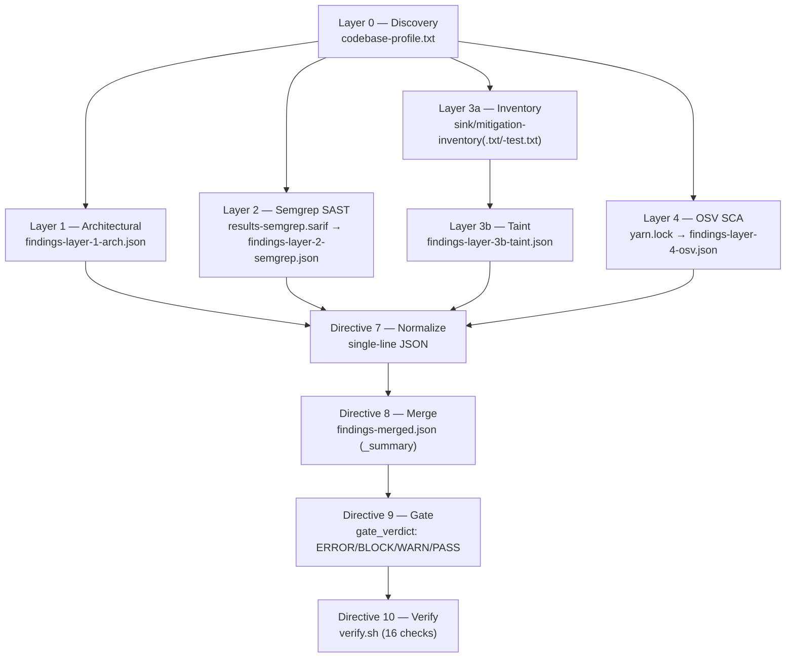

# Technical Specification

# 0. Agent Action Plan

## 0.1 Intent Clarification

Based on the provided requirements, the Blitzy platform understands that the objective is to execute a **deterministic, reproducible, five-layer read-only security audit** of the `blitzy-cal` monorepo and to emit a fixed set of machine-readable artifacts, a single merged cross-layer report, and a self-validating verification script — **without modifying any application, source, configuration, or CI code**. The task header is explicit on this point: `~0 files modified | 9 output files + 1 merged report + verify.sh`. This is fundamentally a **security-assessment and tooling task that produces report artifacts**, not a feature, refactor, or remediation task. The target codebase is the `blitzy-cal` Cal.com fork, a TypeScript Yarn Berry monorepo [package.json:packageManager], and every existing file in it is a **read-only reference input** to the audit, never an edit target.

### 0.1.1 Core Objective

The audit is structured as **twelve directives (0–11)** organized into **six analytical layers** plus a cross-layer consolidation stage. Each layer detects a structurally different vulnerability class, and the layers corroborate one another: a finding confirmed by two or more layers carries the highest confidence. The platform understands the layer model as follows:

| Layer | Method | Detects | Primary Output |
|-------|--------|---------|----------------|
| 0 — Discovery | Deterministic shell | Primary/secondary languages, frameworks, ecosystems, lockfiles, project layout, exclude dirs | `codebase-profile.txt` |
| 1 — Architectural | Agent reasoning | Composite attack chains across 10 categories (crypto/key mgmt, auth/session, transport/origin, request handling, container/CI-CD, webhook verification, business-domain validation, embed/cross-origin, API-version parity, framework misconfig) | `findings-layer-1-arch.json` |
| 2 — Pattern SAST | Semgrep CE | AST pattern matches (`p/security-audit`, `p/secrets`, `p/owasp-top-ten`) | `results-semgrep.sarif` → `findings-layer-2-semgrep.json` |
| 3a — Inventory | grep/find | 100%-recall inventory of all sink call sites (19 categories) + all mitigation call sites (9 categories) | `sink-inventory.txt`, `mitigation-inventory.txt` (+ test variants) |
| 3b — Taint | Agent dataflow | Exploitability triage over the L3a inventories across 19 CWE sink categories, with gate-blocking classification | `findings-layer-3b-taint.json` |
| 4 — SCA | OSV-Scanner | Known CVEs / malicious / outdated dependencies from lockfiles | `results-osv.json` → `findings-layer-4-osv.json` |

The platform will deliver the following concrete objectives, restated with technical precision:

- **Profile the codebase deterministically (Directive 0).** Produce `codebase-profile.txt` populating `primary_language`, `secondary_languages` (>5% share), `frameworks`, `package_ecosystems`, `lockfiles`, `source_file_count`, and `exclude_dirs`. The expected resolved profile is `primary_language=TypeScript` over ~7,399 first-party `.ts/.tsx/.js` files, ecosystem `npm` via Yarn Berry, lockfile `./yarn.lock` [package.json:packageManager]. If `primary_language` cannot be detected, set `layer_0_status:"ERROR"` and halt.
- **Audit architecture for composite vulnerabilities (Directive 1).** Reason over all 10 categories, trace each attack chain from entry point to impact, classify by the most-specific CWE, and emit per-category coverage summaries (`[Category N/10: <name>] — <files> examined, <findings> found`) under a per-category file budget of 50.
- **Run pattern SAST (Directives 2–3).** Install Semgrep Community Edition, download and locally pin the three rule packs for reproducibility, scan with `--sarif --metrics=off`, and normalize SARIF to JSON using the severity map `error→critical`, `warning→high`, `note→medium`, `info→low`.
- **Build exhaustive sink/mitigation inventories (Directive 4).** Using the JS/TS column of the pattern tables, deterministically enumerate every sink (19 categories) and mitigation (9 categories) call site with 100% recall, emitting `<file>:<line>:<category>:<text>` lines and routing test-file matches to separate `*-test.txt` inventories.
- **Triage exploitability via taint analysis (Directive 5).** Trace dataflow over the L3a inventories across all 19 CWE sink categories, considering both direct user input and untrusted-data-via-trusted-API sources, and attach a `gateBlocking` boolean plus a `demotionReason` (for advisory findings) to every finding per the gate-blocking truth table.
- **Catalog dependency CVEs (Directive 6).** Install OSV-Scanner, scan `./yarn.lock`, deduplicate by `(package_name, CVE_ID)`, and normalize to JSON with `line:0` for lockfile findings.
- **Normalize, merge, gate, and verify (Directives 7–10).** Compile each layer to single-line minified JSON with a non-empty `description` and integer `line` on every finding; merge into `findings-merged.json` with a `_summary` header; compute a CI/CD `gate_verdict` of `ERROR | BLOCK | WARN | PASS`; and generate and execute `verify.sh`, which encodes all 16 pass/fail checks deterministically and exits with the count of failures.

**Implicit requirements detected** (necessary but not stated as standalone tasks):

- The audit must be **non-destructive** — the deterministic layers run static text/AST analysis and the agent layers reason over source; no project build, no dependency installation into the project, and no execution of application code are required, because the target is analyzed statically.
- **Test isolation** is required end-to-end: test files (`*.test.*`, `*.spec.*`, `*.e2e.*`, `__tests__/`, `__mocks__/`, `fixtures/`) must be inventoried separately and excluded from primary exploitability triage so that test stubs do not inflate findings.
- **Corroboration and escalation logic** must be applied at merge time: same `file+line+CWE` across layers deduplicates to the higher severity with a `corroborated_by` annotation, and composite chains confirmed by both L1 and L3b escalate one severity tier.
- The audit must operate against **local source only**; it must never scan live Cal.com infrastructure (the repository's own `SECURITY.md` explicitly prohibits running automated scanners against their hosted infrastructure) [SECURITY.md:§Please-do-the-following].

**Prerequisites and dependencies:** Semgrep Community Edition (Python/pip) with the three pinned rule packs; OSV-Scanner V2 (prebuilt binary or Go); and a POSIX shell with `grep`, `find`, and `jq` for the deterministic layers and normalization. These are environment-local tooling additions, not project dependencies (see §0.6).

### 0.1.2 Task Categorization

- **Primary task type:** Security enhancement — specifically a static + agentic **security assessment / audit** producing read-only findings, not code changes.
- **Secondary aspects:** Tooling (provisioning Semgrep CE and OSV-Scanner), Build/Deploy (a CI/CD-style gate verdict), and Documentation (machine-readable report artifacts with per-category coverage summaries).
- **Scope classification:** Cross-cutting, read-only assessment spanning the entire monorepo (`apps/**`, `packages/**`, root configuration, `.github/workflows/**`, `./yarn.lock`) that produces **additive artifacts only**. No existing file is created, updated, or deleted.

### 0.1.3 Special Instructions and Constraints

The prompt's GLOBAL RULES, EXECUTION BOUNDS, and per-directive pass/fail criteria function as binding constraints (they are catalogued in full in §0.7 and §0.8). The most consequential are:

- **No silent failure.** No layer may silently drop a category. Pre-agent steps (Directives 0, 2, 4, 6) must record an explicit `OK` or `ERROR` status; agent steps (Directives 1, 5) must emit per-category coverage summaries; incomplete layers emit partial results flagged `"coverage":"partial"`.
- **Unified severity vocabulary.** Every severity field across every artifact uses only `critical | high | medium | low`.
- **ANSI hygiene.** All output files must be stripped of ANSI escape sequences.
- **Determinism vs. structural consistency.** Deterministic layers (0, 2, 3a, 4) must produce identical output on identical input; agent layers (1, 3b) must be structurally consistent (same categories, same schema, same gate-blocking criteria), with the gate-blocking classification serving as the reproducibility anchor.
- **Output discipline.** Each layer is compiled to single-line minified JSON; every finding carries a non-empty `description` (≤200 chars) and an integer `line`.
- **Execution bounds.** A total budget of 200k tokens of output or 60 minutes wall-clock, whichever comes first; at 80% of either limit, the pipeline emits all partial results with `"coverage":"partial"` and proceeds directly to the merge (Directive 8).

The gate-blocking classification is preserved verbatim because it is the explicit reproducibility anchor for the agent layers:

User Example — Gate-blocking truth table:

| Mitigation Status | Critical/High | Medium/Low |
| --- | --- | --- |
| None | gateBlocking: true | gateBlocking: true |
| Broken / bypassable | gateBlocking: true | gateBlocking: false (advisory) |
| Functional but limited | gateBlocking: false (advisory) | gateBlocking: false (advisory) |

### 0.1.4 Technical Interpretation

These requirements translate into the following technical implementation strategy, mapping each objective to concrete actions over the resolved TypeScript/Yarn monorepo:

| # | Requirement | Technical Action (create / run / read) |
|---|-------------|----------------------------------------|
| R1 | Layer 0 Discovery | To establish the analysis baseline, **run** deterministic shell probes (extension census, ecosystem/lockfile/framework detection, source count) and **create** `codebase-profile.txt`; every later layer reads this profile to select the JS/TS pattern column and `exclude_dirs`. |
| R2 | Layer 1 Architectural | To surface composite attack chains, **read** security-critical files across `apps/**`, `packages/**`, `Dockerfile` [Dockerfile], `.env*.example`, and `.github/workflows/**` and **create** `findings-layer-1-arch.json` with CWE-classified findings and 10 coverage summaries. |
| R3 | Layer 2 Semgrep | To enumerate pattern-matchable defects, **install** Semgrep CE, **pin** the three rule packs into a local `rules/` directory, **scan** the source tree, and **create** `results-semgrep.sarif` then normalize to `findings-layer-2-semgrep.json`. |
| R4 | Layer 3a Inventory | To guarantee zero missed sinks, **run** the JS/TS grep/find pattern table and **create** `sink-inventory.txt` + `mitigation-inventory.txt` (plus `*-test.txt` variants). |
| R5 | Layer 3b Taint | To determine exploitability, **read** the L3a inventories and **create** `findings-layer-3b-taint.json`, tracing source→sink paths and attaching `gateBlocking` + `demotionReason`. |
| R6 | Layer 4 OSV | To catalog known CVEs, **install** OSV-Scanner, **scan** `./yarn.lock`, and **create** `results-osv.json` → `findings-layer-4-osv.json`. |
| R7 | Directive 7 Normalize | To standardize outputs, **transform** all layer findings to single-line JSON with required fields and cross-layer dedupe. |
| R8 | Directive 8 Merge | To produce the consolidated view, **create** `findings-merged.json` with a `_summary` header, corroboration annotations, and composite-chain escalation. |
| R9 | Directive 9 Gate | To deliver a CI/CD decision, **compute** `gate_verdict` (`ERROR | BLOCK | WARN | PASS`) from layer status and gate-blocking counts. |
| R10 | Directive 10 Verify | To make the run self-validating, **create** and **execute** `verify.sh` encoding all 16 checks; exit with the failure count. |

## 0.2 Repository Scope Discovery

The Blitzy platform conducted an exhaustive scope discovery to determine the complete audit surface, the existing security infrastructure that the audit will inventory as mitigations, and the external tooling research required to execute the layers accurately.

### 0.2.1 Comprehensive File Analysis

The target is a Yarn Berry 4.12.0 + Turborepo monorepo. The first-party audit surface (excluding `node_modules`, `.next`, `dist`, `build`, `.turbo`, `.yarn`, `.git`, `coverage`) was measured directly:

| Area | First-party `.ts/.tsx/.js` files | Audit relevance |
|------|----------------------------------|-----------------|
| `apps/web` | 1,646 | Next.js main app: route handlers, `proxy.ts` edge middleware [apps/web/proxy.ts], `lib/csp.ts` [apps/web/lib/csp.ts], tRPC handlers, React components |
| `apps/api` | 1,187 | `apps/api/index.js` gateway proxy (port 3002), `apps/api/v1` (Next.js first-gen API), `apps/api/v2` (NestJS second-gen API) |
| `packages` | 4,566 | 21 shared workspaces (see below) |
| **Total** | **≈ 7,399** | Confirms `primary_language=TypeScript` |

The `packages/` workspace set comprises: `app-store`, `app-store-cli`, `config`, `coss-ui`, `dayjs`, `debugging`, `ee`, `emails`, `embeds`, `features`, `kysely`, `lib`, `platform`, `prisma`, `sms`, `testing`, `trpc`, `tsconfig`, `types`, `ui`. The highest-value security-critical workspaces are `packages/lib` (crypto), `packages/features` (webhooks, routing-forms, embeds, pbac, tasker, auth, sms), `packages/embeds`, and `packages/app-store` (third-party integration webhook handlers).

The search patterns the audit applies, by task surface, are:

- **Source code (L1, L2, L3a):** `apps/web/**/*.{ts,tsx,js}`, `apps/api/**/*.{ts,tsx,js}`, `packages/**/*.{ts,tsx,js}` — the JS/TS column of the 19-sink / 9-mitigation pattern tables drives L3a here (React `dangerouslySetInnerHTML`/`innerHTML`, `fetch`/`axios` SSRF, Next.js `redirect`/`NextResponse.redirect`, Prisma `$queryRaw`/`$executeRaw`, `JSON.parse`, `eval`/`Function`, `crypto.timingSafeEqual`, `zod` schema validation, etc.).
- **Configuration & secrets (L1 cat-1/5, L2 `p/secrets`):** `Dockerfile` [Dockerfile], `docker-compose.yml`, `app.json`, `Procfile`, `turbo.json`, and the three environment templates `.env.example`, `.env.appStore.example`, `example-apps/credential-sync/.env.example`.
- **CI/CD (L1 cat-5, L2):** `.github/workflows/**` (59 workflow files, including `pr.yml`, `all-checks.yml`, `lint.yml`, and the existing `security-audit.yml` [.github/workflows/security-audit.yml]) and `.github/actions/**` composite actions.
- **Dependency manifest (L4 SCA):** exactly one lockfile — `./yarn.lock` (no nested or secondary lockfiles) — scanned against the OSV.dev database for the npm ecosystem.

Related-file discovery confirmed that **no pre-existing audit artifacts** (`codebase-profile.txt`, `findings-*.json`, `results-*`, `*-inventory*.txt`, `verify.sh`) exist in the repository, so every CREATE output is net-new with no filename collisions. No `.blitzyignore` files exist in the repository, so no custom ignore patterns constrain the audit beyond the standard `exclude_dirs`.

### 0.2.2 Web Search Research Conducted

Research focused on validating the exact tool versions, install routes, and rule sources required for reproducible execution:

- **Semgrep Community Edition (Layer 2 SAST).** Verified that Semgrep OSS is now "Semgrep Community Edition" with the engine remaining LGPL 2.1, and that the current stable line is the `1.15x` series (e.g., `v1.152.0`, released February 2026). Confirmed installation via `pip install semgrep` and that the registry rule packs `p/security-audit`, `p/secrets`, and `p/owasp-top-ten` are downloadable and pinnable locally. Noted that Semgrep-maintained rules are now governed by the Semgrep Rules License v1.0 (internal, non-competing, non-SaaS use) — appropriate for an internal audit.
- **OSV-Scanner (Layer 4 SCA).** Verified the current major version is V2 with latest stable `v2.3.5` (March 2026), that the recommended install is a prebuilt binary from GitHub releases (or `go install github.com/google/osv-scanner/v2/cmd/osv-scanner@latest`), and that it parses `yarn.lock` for the npm ecosystem against OSV.dev.
- **Standards.** Confirmed the audit's classification and normalization rest on well-known standards: the **CWE** taxonomy for finding classification and **SARIF 2.1.0** for Semgrep output (its `runs[].results[].locations[].region.startLine` supplies the normalized `line`).

### 0.2.3 Existing Infrastructure Assessment

The codebase already implements an extensive, multi-layered security architecture (per Technical Specification §6.4). The audit treats these controls as the **mitigation set** that Layer 3a inventories and Layers 1/3b reason against:

- **Authentication:** four-credential `ApiAuthStrategy` (API key, OAuth2 access token, OAuth2 client credentials, NextAuth session, third-party token); TOTP MFA via `otplib` with backup codes; `bcryptjs.compare` for passwords; API keys stored only as SHA-256 hashes via `verifyApiKey.ts` [apps/api/v1/lib/helpers/verifyApiKey.ts].
- **Authorization:** a three-ring model (Transport `ApiAuthGuard` → Resource ownership guards across 15 guard folders → Capability PBAC via `PbacGuard` + `PermissionCheckService` with a Redis 5-minute positive-outcome cache), with legacy `MembershipRole` RBAC.
- **Cryptography:** legacy AES-256-CBC in `packages/lib/crypto.ts` [packages/lib/crypto.ts] (keyed by `CALENDSO_ENCRYPTION_KEY`, a 32-byte Latin1 buffer) alongside a modern AES-256-GCM keyring in `packages/lib/crypto/keyring.ts` [packages/lib/crypto/keyring.ts]; HMAC-SHA256 outbound webhook signing in `packages/features/webhooks/lib/sendPayload.ts` [packages/features/webhooks/lib/sendPayload.ts]; constant-time inbound webhook verification via `crypto.timingSafeEqual` in `apps/api/v2/src/vercel-webhook.guard.ts` [apps/api/v2/src/vercel-webhook.guard.ts] and the app-store handlers.
- **Edge & headers:** per-request CSP nonce + `strict-dynamic` in `apps/web/lib/csp.ts` [apps/web/lib/csp.ts] and `apps/web/proxy.ts` [apps/web/proxy.ts]; `helmet()`, CORS by `ALLOWED_ORIGINS`, and a `ValidationPipe({whitelist:true})` in `apps/api/v2/src/bootstrap.ts` [apps/api/v2/src/bootstrap.ts]; rate limiting via `CustomThrottlerGuard` (hashed tracker keys) and `@unkey/ratelimit`; bot protection via Cloudflare Turnstile, a URL scanner, and Iffy moderation.
- **Trust zones:** four zones (Public Internet → Edge → Application → Data), with all cross-cutting security enforced in the application tier.

The existing **CI security gate is limited to `npm audit`** (`security-audit.yml`, "report → fail on critical") [.github/workflows/security-audit.yml]; there is no SAST, deterministic sink/mitigation inventory, or agentic taint tooling present today. The five-layer audit is therefore a strict **superset** of the current SCA posture, and its Directive 9 gate verdict is the assessment-time analogue of (not a committed change to) the existing `security-audit` gate.

## 0.3 Implementation Design

This sub-section describes **how** the audit is executed — the logical flow between layers, the impact on system components, and the critical implementation details that govern correctness and reproducibility. It deliberately contains no temporal scheduling.

### 0.3.1 Technical Approach

The audit is built on a dependency-ordered pipeline in which a single deterministic foundation configures a set of largely independent detection layers, one dependent triage layer, and a consolidation tail:

- **First, establish the foundation** by running Layer 0 discovery and writing `codebase-profile.txt`. This artifact is the single source of truth for `primary_language`, file extensions, and `exclude_dirs`; all downstream layers read it so that pattern selection (the JS/TS column) and directory exclusions are consistent. If `primary_language` is not detected, the pipeline halts with `layer_0_status:"ERROR"` because no later layer can produce meaningful results on an unidentifiable codebase.
- **Next, run the independent detection layers,** each of which reads the source tree (or, for L4, the lockfile) and writes its own artifact: Layer 1 architectural reasoning (10 categories), Layer 2 Semgrep SAST (rule-pack scan → SARIF → normalized JSON), Layer 3a deterministic sink/mitigation inventory (100% recall), and Layer 4 OSV-Scanner SCA over `./yarn.lock`. These four layers have no inter-dependencies and may proceed in any order.
- **Then, run the dependent triage layer.** Layer 3b consumes the L3a inventories (not the raw tree), cross-references each inventoried sink against the inventoried mitigations, and emits exploitability findings with a `gateBlocking` boolean and, for advisory findings, a `demotionReason`.
- **Finally, ensure quality and consolidation** by normalizing every layer to single-line JSON (Directive 7), merging into `findings-merged.json` with a `_summary` header and corroboration/escalation logic (Directive 8), computing the CI/CD `gate_verdict` (Directive 9), and generating and executing `verify.sh` to self-validate all 16 pass/fail criteria (Directive 10).

### 0.3.2 Component Impact Analysis

- **Direct modifications to application, source, configuration, or CI components:** **none.** The task header mandates `~0 files modified`. Every file in `apps/**`, `packages/**`, the root configuration set, `.github/workflows/**`, and `./yarn.lock` is a read-only REFERENCE input.
- **New components introduced (all CREATE artifacts):** the nine layer/inventory artifacts, two raw intermediates (`results-semgrep.sarif`, `results-osv.json`), the merged report (`findings-merged.json`), the verification script (`verify.sh`), and a locally pinned Semgrep `rules/` directory. These are enumerated file-by-file in §0.4.
- **Indirect / conceptual impact:** the Directive 9 gate verdict is a **superset** of the existing `security-audit.yml` npm-audit gate concept [.github/workflows/security-audit.yml], but it is delivered as an **output** (the `gate_verdict` field plus stdout reporting), not as an edit to any workflow. No existing CI component is changed; the audit is purely additive.
- **Components read but unaffected:** the existing security controls catalogued in §0.2.3 (auth strategies/guards, crypto modules, webhook signing/verification, CSP/edge middleware, rate limiting) are inspected by Layers 1/3a/3b as the mitigation set, and their files are never edited.

### 0.3.3 Critical Implementation Details

- **Layer 0 → all layers contract.** Pattern selection and exclusions are read from `codebase-profile.txt`; the resolved profile drives use of the JS/TS pattern column and the standard `exclude_dirs` (`node_modules`, `.next`, `dist`, `build`, `.turbo`, `.yarn`, `.git`, `coverage`).
- **Semgrep reproducibility.** Rule packs are downloaded and pinned to a local `rules/` directory (`semgrep --config=p/security-audit --dump-config > rules/`) so that scans are reproducible across runs; the scan runs with `--metrics=off` and emits SARIF, and the SARIF severity is mapped `error→critical`, `warning→high`, `note→medium`, `info→low`, with CWE taken from rule metadata (inferred from the description when absent).
- **Semgrep suppression rules.** Auth guards returning `true` inside test files (`*.test.*`, `*.spec.*`) are treated as test stubs; shell execution with hardcoded arguments inside build directories is treated as build-time only.
- **Layer 3a determinism and recall.** The inventory is a 100%-recall text search; each line conforms exactly to `<file>:<line>:<category>:<text>`; the inventories must be non-empty and cover all applicable categories, or `layer_3a_status:"ERROR"`. Categories structurally inapplicable to a JS/TS stack may be empty without failing verification.
- **Layer 3b source model.** Sources include direct user input (params, query, body, cookies, headers, path segments, uploads, WebSocket/postMessage data, OAuth callback params, webhook payloads) **and** untrusted-data-via-trusted-API channels (third-party sync records, inbound feed/subscription content, incoming webhook payloads, OAuth profile data) — the latter being especially relevant to a calendar/scheduling platform that syncs external calendar events and processes provider webhooks.
- **Gate-blocking precision.** A missing mitigation on any sink, or a broken/bypassable mitigation on a critical/high sink, yields `gateBlocking:true`; a functional-but-limited mitigation, or a broken mitigation on a medium/low sink, yields `gateBlocking:false` with a mandatory `demotionReason`. Only `gateBlocking:true` blocks a merge.
- **Cross-layer dedupe and escalation.** Findings sharing `file+line+CWE` collapse to the higher severity with a `corroborated_by` annotation; composite chains confirmed by both L1 and L3b escalate one severity tier; gate-blocking + corroborated findings are the highest priority.
- **Normalized schemas (contracts).** The platform preserves the user-provided output schemas exactly:

User Example — Layers 1, 2, 4 schema:

<pre><code>[{"file":"&lt;path&gt;","line":&lt;int&gt;,"severity":"&lt;critical|high|medium|low&gt;","cwe":"&lt;CWE-ID&gt;","description":"&lt;max 200 chars&gt;","layer":&lt;1|2|4&gt;,"tool":"&lt;arch-audit|semgrep|osv-scanner&gt;"}]</code></pre>

User Example — Layer 3b schema:

<pre><code>[{"file":"&lt;path&gt;","line":&lt;int&gt;,"severity":"&lt;critical|high|medium|low&gt;","cwe":"&lt;CWE-ID&gt;","description":"&lt;max 200 chars&gt;","layer":3,"tool":"taint-analysis","gateBlocking":&lt;bool&gt;,"demotionReason":"&lt;if advisory&gt;"}]</code></pre>

- **OSV-Scanner invocation caveat.** Directive 6 lists the V1 Go import path `github.com/google/osv-scanner/cmd/osv-scanner@latest`; the current V2 path is `github.com/google/osv-scanner/v2/cmd/osv-scanner@latest`. The implementation should prefer the prebuilt binary or the `/v2/` path to obtain V2, and scan the single `./yarn.lock`, deduplicating by `(package_name, CVE_ID)` with `line:0` on lockfile findings.
- **Error handling and partial completion.** Every pre-agent step records `OK`/`ERROR`; agent steps emit per-category coverage; at 70% of the context window an agent layer emits partial results flagged `"coverage":"partial"` and continues; at 80% of the global budget the pipeline emits partials and jumps to merge. ANSI escape sequences are stripped from every artifact.

## 0.4 File Transformation Mapping

This sub-section maps every file the audit produces and the principal files it reads. Because the task is a read-only assessment, **all created files are audit artifacts and there are zero UPDATE or DELETE operations** on the existing codebase. All artifacts are co-located in a single audit output workspace at the repository root, preserving the canonical bare filenames exactly as the prompt and `verify.sh` reference them; `verify.sh` is executed from that same directory so its relative-path checks resolve.

Transformation modes: **CREATE** (new artifact), **REFERENCE** (audited / read-only, never modified).

### 0.4.1 File-by-File Execution Plan

The complete set of created artifacts (target file listed first):

| Target File | Transformation | Source / Reference | Purpose / Changes |
|-------------|----------------|--------------------|-------------------|
| `codebase-profile.txt` | CREATE | Layer 0 shell probes over the repo tree | Deterministic profile: `primary_language`, `secondary_languages`, `frameworks`, `package_ecosystems`, `lockfiles`, `source_file_count`, `exclude_dirs`, `layer_0_status` |
| `findings-layer-1-arch.json` | CREATE | `apps/**`, `packages/**`, `Dockerfile`, `docker-compose.yml`, `.env*.example`, `.github/workflows/**` (REFERENCE) | Architectural findings across all 10 categories with CWE classification and per-category coverage summaries |
| `rules/` (pinned Semgrep packs) | CREATE | `semgrep --config=p/security-audit\|p/secrets\|p/owasp-top-ten --dump-config` | Locally pinned rule packs for reproducible Layer 2 scans |
| `results-semgrep.sarif` | CREATE | Semgrep scan over source (REFERENCE) | Raw SARIF 2.1.0 scan output (intermediate) |
| `findings-layer-2-semgrep.json` | CREATE | `results-semgrep.sarif` | Normalized Semgrep findings (severity map, CWE, `message.text` description) |
| `sink-inventory.txt` | CREATE | `apps/**`, `packages/**` via JS/TS sink patterns | 19 sink categories; one line per sink `<file>:<line>:<category>:<text>` |
| `sink-inventory-test.txt` | CREATE | Test files (`*.test.*`, `*.spec.*`, `*.e2e.*`, `__tests__/`, `__mocks__/`, `fixtures/`) | Sinks located in test files (separated from primary triage) |
| `mitigation-inventory.txt` | CREATE | `apps/**`, `packages/**` via 9 mitigation patterns | 9 mitigation categories; same line format |
| `mitigation-inventory-test.txt` | CREATE | Test files | Mitigations located in test files (separated) |
| `findings-layer-3b-taint.json` | CREATE | `sink-inventory.txt` + `mitigation-inventory.txt` | Taint findings for all 19 sink categories with source→sink path, `gateBlocking`, and `demotionReason` |
| `results-osv.json` | CREATE | `./yarn.lock` | Raw OSV-Scanner output (intermediate) |
| `findings-layer-4-osv.json` | CREATE | `results-osv.json` | Normalized CVE findings (`line:0`, deduped by `package+CVE`) |
| `findings-merged.json` | CREATE | `findings-layer-1-arch.json`, `findings-layer-2-semgrep.json`, `findings-layer-3b-taint.json`, `findings-layer-4-osv.json` | Cross-layer merge with `_summary` header, corroboration annotations, severity escalation, and `gate_verdict` |
| `verify.sh` | CREATE | Directives 0–9 pass/fail criteria | Deterministic, re-runnable 16-check verification script; exits with the failure count |

The principal REFERENCE inputs (audited, never modified). These are the highest-priority targets drawn from §0.2.3; the actual audited surface is the entire first-party tree (~7,399 files) minus `exclude_dirs`:

| Target File / Path | Transformation | Purpose (which layer reads it) |
|--------------------|----------------|--------------------------------|
| `./yarn.lock` | REFERENCE | Sole SCA lockfile (Layer 4 OSV) |
| `Dockerfile`, `docker-compose.yml`, `app.json`, `Procfile` | REFERENCE | Container/CI-CD and default-secret targets (L1 cat-5, L2) |
| `.env.example`, `.env.appStore.example`, `example-apps/credential-sync/.env.example` | REFERENCE | Committed/default secret targets (L1 cat-1, L2 `p/secrets`) |
| `.github/workflows/**` (59), `.github/actions/**` | REFERENCE | CI/CD injection + action-pinning targets (L1 cat-5, L2) |
| `packages/lib/crypto.ts`, `packages/lib/crypto/keyring.ts` | REFERENCE | Crypto / key-management audit (L1 cat-1) |
| `packages/features/webhooks/lib/sendPayload.ts` | REFERENCE | Outbound webhook HMAC signing (L1 cat-4/6) |
| `apps/api/v2/src/vercel-webhook.guard.ts`, `packages/app-store/**/api/webhook.ts` | REFERENCE | Inbound webhook verification (L1 cat-6, L3b cat-4) |
| `apps/web/proxy.ts`, `apps/web/lib/csp.ts` | REFERENCE | Edge / CSP / CORS / redirect / origin (L1 cat-3/10) |
| `apps/api/v2/src/modules/auth/**`, `apps/api/v1/lib/helpers/verifyApiKey.ts` | REFERENCE | AuthN/Z, rate-limit fail-open, API-version parity (L1 cat-2/9) |
| `packages/embeds/**` | REFERENCE | Embed / postMessage cross-origin (L1 cat-8, L3b cat-8) |

### 0.4.2 New Files Detail

- **`codebase-profile.txt`** — Content type: discovery metadata (key-value). Based on: Layer 0 shell probes. Key sections: language/framework/ecosystem detection, lockfile paths, source counts, `exclude_dirs`, `layer_0_status`.
- **`findings-layer-1-arch.json`** — Content type: findings array (Layers 1/2/4 schema). Based on: agentic architectural review. Key sections: one object per finding (`file`, `line`, `severity`, `cwe`, `description`, `layer:1`, `tool:"arch-audit"`); 10 per-category coverage summaries.
- **`findings-layer-2-semgrep.json`** — Content type: findings array. Based on: `results-semgrep.sarif`. Key sections: normalized objects with `tool:"semgrep"`; severity mapped from SARIF level; `line` from `region.startLine`.
- **`sink-inventory.txt` / `mitigation-inventory.txt` (+ `-test` variants)** — Content type: line-oriented text. Based on: deterministic grep/find. Key sections: `<file>:<line>:<category>:<text>` lines spanning the 19 sink and 9 mitigation categories.
- **`findings-layer-3b-taint.json`** — Content type: findings array (Layer 3b schema). Based on: L3a inventories. Key sections: objects with `layer:3`, `tool:"taint-analysis"`, `gateBlocking`, and `demotionReason`; per-category coverage summaries for all 19 categories.
- **`results-osv.json` / `findings-layer-4-osv.json`** — Content type: raw + normalized CVE data. Based on: `./yarn.lock`. Key sections: vulnerability title + `package@version` descriptions; `line:0`.
- **`findings-merged.json`** — Content type: single-line JSON with leading `_summary` object. Based on: all four normalized layer files. Key sections: totals (`total_findings`, `unique_findings`, `corroborated`, `gate_blocking`), `by_layer`, `by_severity`, `layer_status`, `gate_verdict`, then the merged findings.
- **`verify.sh`** — Content type: POSIX shell script. Based on: Directives 0–9 pass/fail criteria. Key sections: 16 checks, each printing `PASS <N>` or `FAIL <N>`; exit code equals the failure count.
- **`rules/`** — Content type: pinned Semgrep rule configuration. Based on: registry packs `p/security-audit`, `p/secrets`, `p/owasp-top-ten`. Purpose: reproducible Layer 2 scans.

### 0.4.3 Cross-File Dependencies

- **Profile fan-out:** `codebase-profile.txt` is read by Layers 1, 2, 3a, and 4 to select patterns and exclusions.
- **Intermediate → normalized:** `results-semgrep.sarif` → `findings-layer-2-semgrep.json`; `results-osv.json` → `findings-layer-4-osv.json`.
- **Inventory → triage:** `sink-inventory.txt` + `mitigation-inventory.txt` are the sole inputs to `findings-layer-3b-taint.json`; every L3b finding must reference a `file:line` present in `sink-inventory.txt` (verify.sh check #16).
- **Normalized → merged:** the four `findings-layer-*.json` files feed `findings-merged.json`, whose `_summary` counts must equal the sum of the layer files (verify.sh check #11).
- **Everything → verification:** `verify.sh` reads all artifacts to validate existence, JSON validity, category coverage, schema fields, severity vocabulary, ANSI-cleanliness, non-empty descriptions, and the presence of `gate_verdict`.
- **No source import/reference updates** are required anywhere — the audit performs no code rewrites.

## 0.5 Scope Boundaries

This sub-section draws a hard line between what the audit reads/produces and what it deliberately does not touch. The governing principle is **read everything, modify nothing**: the entire first-party source tree is in-scope for *analysis*, while the only files written are the audit artifacts enumerated in §0.4.

### 0.5.1 Exhaustively In Scope

- **Audited source surface (read-only):** the complete first-party tree — approximately 7,399 files — minus `exclude_dirs`:
    - `apps/web/**` (Next.js main app, ~1,646 files) `[apps/web]`
    - `apps/api/**` (v1 Next.js, v2 NestJS, gateway proxy, ~1,187 files) `[apps/api]`
    - `packages/**` (21 workspaces, ~4,566 files: `lib`, `features`, `app-store`, `embeds`, `trpc`, `prisma`, `ui`, `emails`, `sms`, `ee`, `platform`, etc.) `[packages]`
- **Configuration & infrastructure surface (read-only):**
    - `Dockerfile`, `docker-compose.yml`, `app.json`, `Procfile` `[Dockerfile]`
    - `.env.example`, `.env.appStore.example`, and any nested `*.env.example` `[.env.example]`
    - `.github/workflows/**` (59 workflow files) and `.github/actions/**` `[.github/workflows]`
- **Dependency surface (read-only):** the single root lockfile `./yarn.lock` `[yarn.lock]` — the sole Layer 4 (OSV) input.
- **Created audit artifacts (write):** the 14 CREATE outputs listed in §0.4 (profile, four normalized layer files, two intermediate raw files, four inventory files, merged report, `verify.sh`, and the pinned `rules/` directory).
- **Audit tooling installation:** local, ephemeral installation of Semgrep CE and OSV-Scanner into the audit runtime (does not alter project dependency manifests; see §0.6).

### 0.5.2 Explicitly Out of Scope

- **No application code modification.** No file under `apps/**` or `packages/**` is edited, refactored, or reformatted. The header banner — `~0 files modified` — is a hard constraint.
- **No remediation.** The audit *reports* vulnerabilities; it does not fix them. No patches, no input sanitization, no signature-verification hardening, no CSP tightening.
- **No dependency upgrades or removals.** `./yarn.lock`, `package.json`, and all manifests remain byte-for-byte unchanged; OSV findings are recorded, not resolved.
- **No CI/CD wiring.** The `gate_verdict` is emitted into `findings-merged.json` as an analysis output; the audit does **not** add or modify `.github/workflows/**` (the existing `security-audit.yml` `[.github/workflows/security-audit.yml]` is read as a REFERENCE only).
- **No live-infrastructure or network scanning.** Consistent with the project's disclosure policy `[SECURITY.md]`, the audit runs only against local source; no DAST, no probing of running services, no scanner is pointed at any deployed environment.
- **No runtime/dynamic analysis.** Layer 3b is *static* taint reasoning over the L3a inventories — it does not execute the application or instrument requests.
- **No secret rotation or disclosure handling.** Committed/default secrets discovered in Layer 1/2 are reported by location; the audit does not rotate, redact, or transmit them.
- **No scope creep beyond the 12 directives.** Features, performance tuning, and unrelated refactors not described by Directives 0–11 are excluded.

## 0.6 Dependency Inventory

This audit introduces **no changes to the project's own dependencies**. The root `package.json` and `./yarn.lock` are read-only inputs (Layer 4), and no package is added, updated, or removed in any project manifest. The dependencies below are **audit-runtime tooling** installed ephemerally into the analysis environment only.

### 0.6.1 Key Audit Tooling Packages

| Registry | Package Name | Version | Purpose |
|----------|--------------|---------|---------|
| PyPI (pip) | `semgrep` | 1.152.0 | Layer 2 SAST engine; runs `p/security-audit`, `p/secrets`, `p/owasp-top-ten`; emits SARIF 2.1.0 |
| GitHub Releases / Go | `osv-scanner` | 2.3.5 | Layer 4 SCA; scans `./yarn.lock` against the OSV database; emits JSON |
| Semgrep Registry | `p/security-audit` | registry-pinned | General security ruleset (Layer 2) |
| Semgrep Registry | `p/secrets` | registry-pinned | Hardcoded-secret detection (Layer 2) |
| Semgrep Registry | `p/owasp-top-ten` | registry-pinned | OWASP Top 10 coverage (Layer 2) |
| System | Python | ≥ 3.9 | Runtime for Semgrep CE (host provides 3.12.3, which satisfies this) |

Notes on version selection:

- **Semgrep CE 1.152.0** is the latest stable community release; the analysis engine is LGPL 2.1 and the registry rules are distributed under the Semgrep Rules License v1.0 — compatible with read-only local scanning. Install via `pip install semgrep` `[Dockerfile]` (Python is already present on the host).
- **OSV-Scanner 2.3.5** is the V2 line. It is obtained as a prebuilt release binary; if built from source, the module path must be the **V2** path `github.com/google/osv-scanner/v2/cmd/osv-scanner@latest`. Directive 6 of the prompt lists the V1 path (without `/v2/`), which would fail to build a current version — this discrepancy is surfaced as a Special Instruction in §0.8.
- The three Semgrep rule packs are pinned locally into `rules/` (see §0.4) during Layer 2 so that re-runs are reproducible and not subject to upstream registry drift.

### 0.6.2 Project Dependency Changes

- **New dependencies to add:** None. No project manifest is modified.
- **Dependencies to update:** None. `./yarn.lock` `[yarn.lock]` is read-only; OSV findings are reported, not remediated.
- **Dependencies to remove:** None.
- **Import / reference updates:** None. The audit performs no source rewrites, so no import statements change anywhere in `apps/**` or `packages/**`.

Any vulnerable transitive packages discovered by Layer 4 are documented in `findings-layer-4-osv.json` and escalated in `findings-merged.json`; their upgrade or removal is explicitly **out of scope** per §0.5.2 and is left to a follow-on remediation effort.

## 0.7 Rules

No separate user-specified implementation rules were provided (the rules input was empty). However, the task prompt embeds a set of **GLOBAL RULES** and per-directive pass/fail criteria that are binding constraints on execution. They are restated here verbatim-in-intent so downstream agents treat them as mandatory:

- **No silent failure.** Every layer must emit an explicit status. If a deterministic layer (0, 2, 3a, 4) cannot complete, it records its failure rather than producing empty or absent output; agent layers (1, 3b) must still emit a structurally complete file.
- **Unified severity vocabulary.** Every finding across all layers uses exactly one of `critical`, `high`, `medium`, `low`. No tool-native severity strings (e.g., SARIF `error`/`warning`, OSV `MODERATE`) survive normalization.
- **Strip ANSI escape sequences.** All tool output captured into artifacts must have terminal color/control codes removed so files are clean, diffable text (`verify.sh` checks for residual escape codes).
- **Single-line JSON for findings.** Normalized findings (Directive 7) and the merged report (Directive 8) are emitted as single-line JSON so they are stream-parseable and stable to diff.
- **Non-empty description per finding.** Every finding object must carry a non-empty `description`; Semgrep descriptions derive from `message.text`, OSV from the vulnerability title + `package@version`.
- **Determinism / reproducibility.** Deterministic layers (0, 2, 3a, 4) must be byte-reproducible on re-run; rule packs are pinned locally into `rules/`. Agent layers (1, 3b) must be **structurally** consistent, with the gate-blocking triage criteria serving as the reproducibility anchor.
- **Schema conformance.** Layer 1/2/4 findings follow the `{file, line, severity, cwe, description, layer, tool}` shape; Layer 3b findings additionally carry `gateBlocking` and `demotionReason`. OSV findings use `line:0`.
- **Category coverage is mandatory.** Layer 1 must address all 10 architectural categories; Layer 3a/3b must cover all 19 sink categories and 9 mitigation categories — each with a coverage summary, including those with zero findings.
- **Deduplication.** OSV findings dedupe by `(package, CVE)`; the merged report deduplicates and annotates corroboration across layers.
- **Read-only / zero-modification.** Consistent with the `~0 files modified` banner, no file under `apps/**`, `packages/**`, or any manifest may be altered — the audit only creates artifacts (§0.5).
- **Canonical artifact names & location.** Output files must use the exact filenames the prompt specifies (e.g., `findings-merged.json`, `verify.sh`) and reside together so `verify.sh` relative checks resolve.
- **Gate verdict precision.** The CI/CD gate verdict (Directive 9) is computed strictly from the gate-blocking truth table reproduced in §0.1; it is emitted into `findings-merged.json` and stdout, not wired into CI.

## 0.8 Special Instructions

This sub-section captures execution-specific directives and boundaries that govern *how* the audit runs, beyond the binding rules in §0.7.

### 0.8.1 Special Execution Instructions

- **Audit-only, report-only.** This is a read-only security assessment that produces analysis artifacts. No remediation, no refactoring, no dependency upgrades, and no CI wiring are performed (see §0.5.2).
- **Execution bounds with graceful degradation.** The pipeline operates under a budget of ~200k tokens of output and ~60 minutes of wall-clock time. At ~80% of either bound, the executing agent must emit a **partial** result — each affected layer marks its coverage as `"partial"` rather than silently truncating — and still produce a valid `findings-merged.json` and `verify.sh`.
- **Tooling must be installed locally.** Semgrep CE and OSV-Scanner are absent from the host and must be installed into the audit runtime (pip for Semgrep; prebuilt binary for OSV-Scanner). The host's Python 3.12.3 satisfies Semgrep's ≥3.9 requirement.
- **OSV-Scanner V2 import-path caveat.** Directive 6 lists the V1 module path `github.com/google/osv-scanner/cmd/osv-scanner@latest` (without `/v2/`). The current stable line is V2 (v2.3.5); building from source requires the `/v2/` path, while the prebuilt release binary avoids the issue. Prefer the prebuilt binary; if compiling, correct the path to include `/v2/`.
- **Test-file separation.** Sinks and mitigations located in test files (`*.test.*`, `*.spec.*`, `*.e2e.*`, `__tests__/`, `__mocks__/`, `fixtures/`) are written to the `-test` inventory variants and kept separate from primary triage, so production risk is not diluted by test scaffolding.
- **Pin rule packs for reproducibility.** Dump the three Semgrep packs into a local `rules/` directory before scanning, so Layer 2 results are reproducible and decoupled from registry drift.
- **Determinism discipline.** Use stable sort orders and fixed traversal so deterministic layers re-run byte-identically; exclude `node_modules`, `.next`, `dist`, `build`, `.yarn`, `.git`, and `coverage` from analysis via `exclude_dirs`.

### 0.8.2 Constraints and Boundaries

- **Technical constraints:** TypeScript/Node 20 monorepo; single lockfile `./yarn.lock` is the sole SCA target; Layer 3a uses the JS/TS column of the multi-language sink/mitigation pattern tables.
- **Process constraints:** No live-infrastructure scanning, no DAST, no runtime instrumentation — static analysis only, consistent with the project disclosure policy `[SECURITY.md]`.
- **Output constraints:** Single-line JSON for findings and the merged report; unified four-level severity; ANSI-free text; canonical filenames; every finding carries a non-empty description; all required categories appear with coverage summaries even when empty.
- **Compatibility constraints:** Existing CI gates (lint/type-check/unit-test/`security-audit.yml`) remain untouched `[.github/workflows/security-audit.yml]`; the new 5-layer audit is a superset whose gate verdict is an emitted output, not a committed workflow change.
- **Off-limits:** The `/app` directory (agent runtime source) is never read or documented; only the target codebase at the repository root is in scope.

## 0.9 Attachments

No attachments were provided for this project.

- **File attachments:** None. `review_attachments` returned "No attachments found for this project," so there are no PDFs, images, or documents to summarize.
- **Figma screens:** None. No Figma frames or URLs were supplied; consequently no Figma Design Analysis was performed and no Design System Compliance mapping was required.
- **External reference packs:** The only external references are the Semgrep registry rule packs invoked by Layer 2 — `p/security-audit`, `p/secrets`, and `p/owasp-top-ten` — which are pinned locally into `rules/` (see §0.4 and §0.6). These are tooling configurations rather than user-supplied attachments.

All inputs that shaped this Agent Action Plan therefore derive from the task prompt, the empty rules set, and direct inspection of the target codebase at the repository root.

