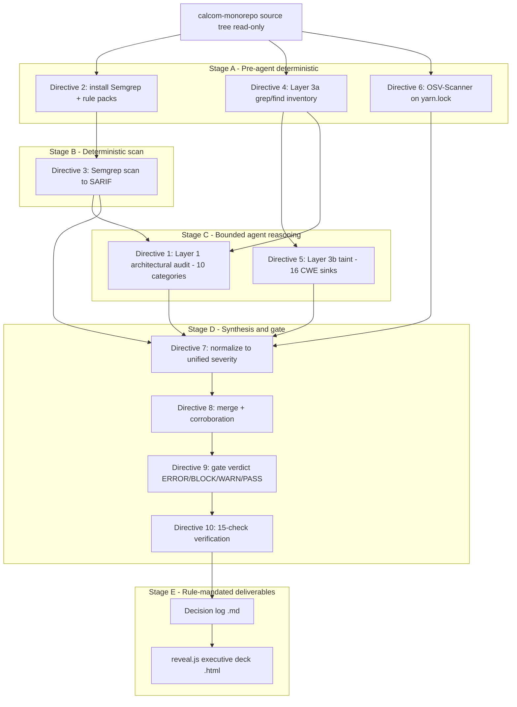

# Technical Specification

# 0. Agent Action Plan

## 0.1 Intent Clarification

### 0.1.1 Core Objective

Based on the provided requirements, the Blitzy platform understands that the objective is to **conduct a comprehensive, five-layer "Full Security Stack" audit of the Cal.com monorepo** and to emit a set of normalized, machine-readable finding artifacts that culminate in a single cross-correlated merged report and a CI/CD gate verdict. The target codebase is the `calcom-monorepo` Yarn Berry workspace [package.json:L2], a Node.js 20 monorepo [Dockerfile:L1] spanning the `apps/web` Next.js application, the `apps/api/v1` legacy Next.js API, the `apps/api/v2` NestJS API, and the shared `packages/*` libraries.

This is fundamentally an **analysis-and-reporting** task. The directive header explicitly fixes the modification budget at "~0 files modified": the existing application source tree is read exhaustively but is never altered. The only files written are net-new audit artifacts and the two deliverables mandated by the user-specified rules.

The user's requirement header is preserved verbatim:

- **User Example:** `[10 directives | ~0 files modified | 7 new files + 1 merged report | five-layer measurement | 10 Layer 1 categories | 16 Layer 3b sink categories | unified severity schema (critical/high/medium/low) across all layers]`

The ten directives, restated with technical precision:

- **Directive 1 — Layer 1 (Blitzy Architectural Audit).** Apply native agent reasoning across code, configuration, and architecture over ten mandatory security categories (enumerated in 0.1.4), bounded to a budget of up to 50 files read per category, emitting a coverage summary per category. Output: `findings-layer-1-blitzy.json`.
- **Directive 2 — Pre-agent (Semgrep setup).** Install the Semgrep CLI and download the `p/security-audit`, `p/secrets`, and `p/owasp` rule packs, running with `--metrics=off`. On any setup failure, set `layer_2_status: "ERROR"` so the pipeline degrades gracefully rather than silently skipping Layer 2.
- **Directive 3 — Layer 2 (Semgrep scan).** Execute the scan to SARIF (`results-semgrep.sarif`), then normalize using the severity map error→critical, warning→high, note→medium, info→low, suppressing test-fixture false positives. Output: `findings-layer-2-semgrep.json`.
- **Directive 4 — Pre-agent (Layer 3a Sink & Mitigation Inventory).** Run deterministic shell `grep`/`find` across `.ts`, `.tsx`, `.js`, and `.jsx` sources (excluding `node_modules`, `.next`, and `dist`) for 16 sink categories and 9 mitigation categories, formatting each hit as `file:line:category:text`. Outputs: `sink-inventory.txt`, `sink-inventory-test.txt`, `mitigation-inventory.txt`, `mitigation-inventory-test.txt`.
- **Directive 5 — Layer 3b (Blitzy Taint Analysis).** Apply AI dataflow analysis grounded in the Layer 3a inventories across the 16 CWE-mapped sink categories, bounded to 200 sinks per category. Every finding carries a `gateBlocking` boolean, with a `demotionReason` when a finding is advisory. Output: `findings-layer-3b-blitzy-taint.json`.
- **Directive 6 — Pre-agent (Layer 4 OSV-Scanner).** Scan all dependency lockfiles, deduplicating findings by the `(package, CVE)` tuple. Output: `findings-layer-4-osv.json`.
- **Directive 7 — Normalize.** Render each layer as single-line minified JSON under one unified severity schema (critical / high / medium / low).
- **Directive 8 — Cross-Layer Merged Report.** Produce `findings-merged.json` with a `_summary` header and cross-layer corroboration annotations that flag issues confirmed by more than one layer.
- **Directive 9 — CI/CD Gate Assessment.** Compute a single gate verdict drawn from ERROR, BLOCK, WARN, or PASS.
- **Directive 10 — Verification Suite.** Execute 15 pass/fail checks that validate the integrity and completeness of the produced artifacts.

Implicit requirements and prerequisites surfaced by this analysis:

- **Deterministic-before-agent ordering.** The pre-agent steps (Directives 2, 4, 6) must run before the agent-reasoning layers (Directives 1, 5) and synthesis (Directives 7–10). The machine-generated inventories and scan outputs bound and anchor the agent's reasoning, suppressing hallucination.
- **Inventory-as-source-of-truth.** Layer 3b taint findings must trace back to concrete `file:line` entries produced by Layer 3a; the agent does not invent sinks.
- **Bounded, auditable effort.** Per-category budgets (≤50 files for Layer 1, ≤200 sinks for Layer 3b) and mandatory coverage summaries make the audit's thoroughness measurable.
- **Unified severity and reproducibility.** A single severity vocabulary across all layers makes the merge and gate computable; `--metrics=off`, `(package, CVE)` dedupe, and minified single-line JSON ensure offline, deterministic outputs.
- **Rule-mandated deliverables.** The two user-specified rules require an additional decision-log Markdown file and a self-contained reveal.js executive-summary HTML deck, both of which are always included (see 0.8).

### 0.1.2 Task Categorization

- **Primary task type:** Security enhancement — specifically a security **audit/assessment** that detects and reports, rather than remediates.
- **Secondary aspects:** Tooling (orchestration of Semgrep and OSV-Scanner), Build/Deploy (the CI/CD gate verdict, which interfaces with the existing GitHub Actions fabric), and Documentation (the decision log, the executive deck, and the report artifacts themselves).
- **Scope classification:** Cross-cutting change — the analysis spans the entire monorepo read-only — that is **additive** in its output: it creates new artifacts without modifying any existing application source, test, configuration, or schema file.

### 0.1.3 Special Instructions and Constraints

- **Read-only over application source.** The "~0 files modified" budget is a hard directive: detection and reporting only, with no patching of vulnerable code.
- **Deterministic-first methodology.** Pre-agent shell/scanner steps must precede agent reasoning; the agent layers consume their outputs.
- **Test-fixture handling.** Sinks and mitigations found in test code are recorded in separate `*-test.txt` inventories, and Semgrep test-fixture false positives are suppressed, so the gate is not skewed by non-production code.
- **Offline determinism.** Semgrep runs with `--metrics=off`; OSV results are deduplicated by `(package, CVE)`; all normalized layer outputs are single-line minified JSON.
- **Rule-mandated outputs (verbatim intent preserved in 0.8).** Every non-trivial decision is logged in a Markdown decision log (Explainability rule), and a single self-contained reveal.js deck is always produced for non-technical leadership (Executive Presentation rule).
- **Web search requirements.** Current, valid versions of the audit tooling (Semgrep CLI and OSV-Scanner) and the pinned presentation libraries were researched so the Dependency Inventory in 0.4 carries exact, non-placeholder versions.

### 0.1.4 Technical Interpretation

These requirements translate to the following technical implementation strategy, expressed as a sequence of measurement layers over fixed regions of the repository:

- To **establish architectural ground truth**, we will *create* `findings-layer-1-blitzy.json` by reasoning over ten categories — Cryptographic & Key Management, Authentication & Session, Transport & Origin, Request Handling, Container & CI/CD, Incoming Webhook & Integration Verification, Business-Domain Input Validation, Embed & Cross-Origin Security, API Security Parity, and Framework-Specific Misconfigurations (Next.js) — anchored to concrete files such as `packages/lib/crypto.ts` and `apps/api/v2/src/modules/auth/strategies/api-auth/api-auth.strategy.ts`.
- To **capture pattern-level defects**, we will *create* `results-semgrep.sarif` and *normalize* it into `findings-layer-2-semgrep.json` by running the OWASP, secrets, and security-audit rule packs over the source tree.
- To **enumerate dataflow sinks deterministically**, we will *create* the four Layer 3a inventory text files by `grep`/`find` over the `.ts`/`.tsx`/`.js`/`.jsx` sources, then *create* `findings-layer-3b-blitzy-taint.json` by tracing taint from those inventoried sinks across the 16 CWE categories.
- To **detect vulnerable dependencies**, we will *create* `results-osv.json` and *normalize* it into `findings-layer-4-osv.json` by scanning the root `yarn.lock` [Dockerfile:L37].
- To **synthesize a decision**, we will *create* `findings-merged.json` by correlating all layers under one severity schema, then *derive* the ERROR/BLOCK/WARN/PASS gate verdict and run the 15-check verification suite.
- To **satisfy the governance rules**, we will *create* `security-audit-decision-log.md` and `security-audit-executive-presentation.html`, the latter reusing the established Blitzy brand theme.

## 0.2 Repository Scope Discovery

### 0.2.1 Comprehensive File Analysis

The audit reads the entire `calcom-monorepo` workspace tree [package.json:L5-L16], which declares the workspaces `apps/*`, `apps/api/*`, `packages/*`, `packages/embeds/*`, `packages/features/*`, `packages/app-store(/*)`, `packages/platform/*`, and `example-apps/*`. No `.blitzyignore` files exist anywhere in the repository, so no path patterns are excluded from read-only analysis (the only scan-time exclusions are `node_modules`, `.next`, and `dist`, per Directive 4). The following table maps each Layer 1 category to the concrete repository regions and anchor files that the audit inspects.

| Layer 1 Category | Primary Anchor Files / Regions (read-only) |
|------------------|---------------------------------------------|
| Cryptographic & Key Management | `packages/lib/crypto.ts` (legacy AES-256-CBC, `CALENDSO_ENCRYPTION_KEY` as a 32-byte Latin1 buffer); `packages/lib/crypto/keyring.ts` (modern AES-256-GCM keyring) |
| Authentication & Session | `packages/features/auth/lib/next-auth-options.ts` (NextAuth providers + JWT); `packages/features/auth/lib/verifyPassword.ts` (bcryptjs); `apps/api/v2/src/modules/auth/strategies/api-auth/api-auth.strategy.ts` (four-credential strategy); `apps/api/v2/src/modules/auth/guards/` (15 guard folders); `packages/features/pbac/`; `apps/web/app/api/auth/two-factor/totp/setup/route.ts` and `.../disable/route.ts` |
| Transport & Origin | `apps/web/proxy.ts` (edge middleware, CSP nonce); `apps/web/lib/csp.ts` (dev `'unsafe-inline'`/`'unsafe-eval'`); `apps/api/v2/src/bootstrap.ts` (`helmet()`, CORS, `ValidationPipe`); `apps/api/v2/src/lib/throttler-guard.ts` (prefers `cf-connecting-ip`) |
| Request Handling | `apps/api/v1/pages/api/**` (file-based `_get.ts`/`_post.ts`/`_patch.ts`/`_delete.ts` routes); `apps/api/v1/lib/**` (request-id, error capture, pagination, validation middleware) |
| Container & CI/CD | `Dockerfile` (default `ARG` secrets, no `USER` directive); `docker-compose.yml`; `.github/workflows/**` (58 workflows incl. `release-docker.yaml`, `pr.yml`, `security-audit.yml`, `all-checks.yml`); `apps/api/v1/scripts/vercel-deploy.sh` |
| Incoming Webhook & Integration Verification | `packages/features/webhooks/lib/sendPayload.ts` (outbound HMAC-SHA256, `"no-secret-provided"` fallback); `apps/api/v2/src/vercel-webhook.guard.ts`; `packages/app-store/*/api/webhook.ts` (Stripe, HitPay, BTCPay, Helpscout, Alby) |
| Business-Domain Input Validation | Zod schemas in `apps/api/v1/lib/`; `apps/api/v2` DTO validation under the global `ValidationPipe` whitelist |
| Embed & Cross-Origin Security | `packages/embeds/embed-core/src/**` (iframe init, SDK events, postMessage); `packages/embeds/embed-react/`; `packages/embeds/embed-snippet/`; `packages/embeds/LIFECYCLE.md` (parent↔iframe handshake) |
| API Security Parity | `apps/api/v1` (legacy Next.js middleware chain) vs. `apps/api/v2` (NestJS guard chain) — divergence in auth, rate limiting, and validation enforcement |
| Framework-Specific Misconfigurations (Next.js) | `apps/web` App Router (`app/`) and legacy (`pages/`); `next.config.js` files; `.env.example` and `.env.appStore.example` |

The 16 Layer 3b sink categories drive the Layer 3a `grep`/`find` inventory and the taint analysis: CWE-601 (open redirect), CWE-918 (SSRF), CWE-117 (log injection), CWE-807 (authentication on user-controllable input), CWE-338 (weak PRNG), CWE-843 (type confusion), CWE-862 (missing authorization), CWE-79 (cross-site scripting), CWE-134 (format string), CWE-250 (excessive privilege / property injection), CWE-912 (hidden functionality / filesystem write), CWE-1004/614/1275 (insecure cookie attributes), CWE-639 (IDOR), CWE-200 (information/availability disclosure), CWE-367 (TOCTOU, booking flows), and CWE-285 (improper authorization / OAuth scope). The deduplicated lockfile target for Layer 4 is the root `yarn.lock`, which the Dockerfile copies during the build [Dockerfile:L37].

### 0.2.2 Web Search Research Conducted

Research was performed to fix exact, valid tool and library versions for the Dependency Inventory and to validate the audit approach:

- **Semgrep CLI** — current-practice installation and the latest stable Community Edition release line (~1.163.0), confirming `--metrics=off` for offline runs, SARIF output support, the `p/security-audit` / `p/secrets` / `p/owasp` registry rule packs, and Yarn Berry lockfile parsing support.
- **OSV-Scanner** — the latest stable release (v2.3.5, Apache-2.0, Go), its install paths (prebuilt binary or `go install .../v2@v2`), and its support for `yarn.lock` and other lockfile formats with JSON output.
- **Presentation libraries** — confirmation that reveal.js 5.1.0, Mermaid 11.4.0, and Lucide 0.460.0 (the versions pinned by the Executive Presentation rule) are valid and match the libraries already used by the existing in-repo deck.

### 0.2.3 Existing Infrastructure Assessment

- **Project structure and conventions.** A Turborepo-orchestrated Yarn Berry monorepo (`turbo` 2.7.1, `packageManager: "yarn@4.12.0"`) [package.json:L178], TypeScript 5.9.3, Vitest 4.0.16, Biome 2.3.10, Playwright 1.57.0, with the Prisma schema at `packages/prisma/schema.prisma` [package.json:L174-L176].
- **Existing security controls (mitigation-inventory candidates).** The codebase already implements substantial defenses that the Layer 3a mitigation inventory catalogs and that Layer 3b credits when demoting findings: `crypto.timingSafeEqual` webhook verification, bcryptjs password hashing, SHA-256 API-key hashing, `helmet()`/CORS/`ValidationPipe` whitelisting in API v2, PBAC plus 15 authorization guard folders, CSP nonce middleware, Cloudflare Turnstile bot protection, `@unkey/ratelimit` 2.1.3 rate limiting, and the modern AES-256-GCM keyring.
- **Build and deployment configuration.** Multi-stage Docker build on `node:20` [Dockerfile:L1,L53,L77] with a `HEALTHCHECK` [Dockerfile:L91-L92]; a comprehensive GitHub Actions fabric whose `all-checks.yml` umbrella applies an `always()` required-job failure gate — the natural interface point for the Directive 9 gate verdict.
- **Testing infrastructure.** Vitest workspace plus Jest/`node-mocks-http` for API v1 and Jest unit/E2E for API v2; the existence of test code is why the inventory separates `*-test.txt` files.
- **Documentation system.** MkDocs (`mkdocs.yml`), a Backstage catalog (`catalog-info.yaml`), `SECURITY.md`, and `.well-known/security.txt` (RFC 9116) are present, alongside prior Blitzy deliverables (`acceleration-report.md` and `acceleration-report-executive-presentation.html`) that establish the report and presentation conventions reused here.

## 0.3 Scope Boundaries

### 0.3.1 Exhaustively In Scope

The audit's read surface is the entire monorepo; its write surface is strictly the net-new artifacts. The boundaries below use trailing patterns to express the inspected regions.

- **Read-only analysis targets (the audit inspects, never modifies):**
  - `apps/web/**/*.{ts,tsx,js,jsx}` — Next.js app, edge middleware (`apps/web/proxy.ts`), CSP generation (`apps/web/lib/csp.ts`), TOTP routes
  - `apps/api/v1/**/*.{ts,js}` — legacy API routes (`apps/api/v1/pages/api/**`), middleware and helpers (`apps/api/v1/lib/**`)
  - `apps/api/v2/**/*.ts` — NestJS bootstrap, auth strategies/guards, throttler, webhook guard
  - `packages/lib/**/*.ts` — cryptography (`packages/lib/crypto.ts`, `packages/lib/crypto/keyring.ts`)
  - `packages/features/**/*.ts` — auth, webhooks (`packages/features/webhooks/lib/sendPayload.ts`), PBAC, tasker cron
  - `packages/app-store/**/api/webhook.ts` — inbound integration webhook verifiers
  - `packages/embeds/**/*.{ts,tsx,js}` — embed-core, embed-react, embed-snippet, and `packages/embeds/LIFECYCLE.md`
  - `Dockerfile`, `docker-compose.yml`, `.dockerignore` — container configuration
  - `.github/workflows/**/*.{yml,yaml}` — CI/CD workflow definitions
  - `.env.example`, `.env.appStore.example`, `apps/api/v1/.env.example` — committed environment templates
  - `yarn.lock` — the dependency lockfile (Layer 4 SCA target)
- **Net-new artifacts written (the audit's only outputs):**
  - Audit findings: `findings-layer-1-blitzy.json`, `findings-layer-2-semgrep.json`, `findings-layer-3b-blitzy-taint.json`, `findings-layer-4-osv.json`, `findings-merged.json`
  - Layer 3a inventories: `sink-inventory.txt`, `sink-inventory-test.txt`, `mitigation-inventory.txt`, `mitigation-inventory-test.txt`
  - Intermediate scanner outputs: `results-semgrep.sarif`, `results-osv.json`
  - Rule-mandated deliverables: `security-audit-decision-log.md`, `security-audit-executive-presentation.html`
- **Tooling provisioning** in the execution/CI environment: installation of the Semgrep CLI, download of the rule packs, and installation of OSV-Scanner.

### 0.3.2 Explicitly Out of Scope

- **Remediation and code fixes.** This engagement detects, reports, and gates; it does not patch vulnerable code. (The platform's Hard Constraints reinforce this: webhook payload schema immutability and encryption-key continuity must not be disturbed, so the audit makes no crypto-key or webhook-payload changes.)
- **Modification of existing application source, tests, configuration, or schema.** No file under `apps/**`, `packages/**`, or root configuration is edited. The "~0 files modified" budget is honored absolutely.
- **Dependency upgrades, additions, or removals.** Even where Layer 4 (OSV-Scanner) flags vulnerable transitive dependencies, upgrading them is a separate follow-up; `package.json` and `yarn.lock` are not modified.
- **New application features, refactoring, or performance work** unrelated to the audit.
- **Mandatory CI wiring.** Directive 9 produces a gate *verdict*; integrating that verdict into `.github/workflows/security-audit.yml` or `all-checks.yml` is an optional, assessment-only recommendation, not a required edit in this engagement.
- **Scan-time exclusions.** `node_modules`, `.next`, and `dist` are excluded from the Layer 3a inventory; test-fixture matches are partitioned into `*-test.txt` and Semgrep test-fixture false positives are suppressed so they do not influence the gate.

## 0.4 Dependency Inventory

### 0.4.1 Key Private and Public Packages

The packages below are the **audit tooling** and the **executive-deck runtime libraries**. They are provisioned in the execution/CI environment (scanners) or loaded via CDN by the deck (presentation libraries). None of them are added to the target application's manifests.

| Registry | Package Name | Version | Purpose |
|----------|--------------|---------|---------|
| PyPI (pip) | semgrep | 1.163.0 | Layer 2 pattern-based SAST engine (run with `--metrics=off`, SARIF output) |
| GitHub Releases / Go | osv-scanner | 2.3.5 | Layer 4 software-composition analysis against `yarn.lock` |
| Semgrep Registry | p/security-audit | registry pack (rolling) | Layer 2 general security-audit ruleset |
| Semgrep Registry | p/secrets | registry pack (rolling) | Layer 2 hardcoded-secret detection |
| Semgrep Registry | p/owasp | registry pack (rolling) | Layer 2 OWASP Top 10 coverage |
| jsDelivr CDN | reveal.js | 5.1.0 | Executive deck presentation framework (pinned by rule) |
| jsDelivr CDN | mermaid | 11.4.0 | Executive deck architecture/data-flow diagrams (pinned by rule) |
| jsDelivr CDN | lucide | 0.460.0 | Executive deck iconography (pinned by rule) |

For context only — and **not changed by this audit** — the target application's `package.json` already security-pins several sensitive transitive dependencies through its `resolutions` block, including `axios` 1.13.5, `jsonwebtoken` 9.0.0, `node-forge` 1.3.2, `validator` 13.15.22, `tar` 7.5.7, `qs` 6.14.1, `lodash` 4.17.23, `js-yaml` 4.1.1, and `serialize-javascript` 6.0.2 [package.json:L120-L168]. Layer 4 reports against these resolved versions; it does not alter them.

### 0.4.2 Dependency Updates

- **New dependencies to add (application):** None. The audit introduces no runtime or build dependency into `package.json` or `yarn.lock`.
- **Dependencies to update (application):** None. OSV-Scanner may flag vulnerable packages, but upgrading them is explicitly out of scope (see 0.3.2); such items are reported as findings, not applied as changes.
- **Dependencies to remove (application):** None.
- **Environment-provisioned tooling (not committed to the repository):** The Semgrep CLI and its rule packs, and the OSV-Scanner binary, are installed in the execution/CI environment to perform Layers 2 and 4. They are operational prerequisites, not project dependencies.
- **Import/reference updates:** None. Because no application source is modified, there are no import statements, configuration references, or path aliases to update.

## 0.5 Design System Compliance

The Executive Presentation rule names the **Blitzy brand reveal.js design system** and supplies its full token contract. This sub-section catalogs that system and the compliance requirements that govern `security-audit-executive-presentation.html`. The system applies only to the mandated executive deck; the JSON/SARIF/TXT audit artifacts and the Markdown decision log are data and prose files with no design-system surface.

### 0.5.1 System Identification

- **Library / theme:** Blitzy brand reveal.js presentation theme (reveal.js 5.1.0, Mermaid 11.4.0, Lucide 0.460.0).
- **Status:** To-be-added as a new self-contained file. The theme itself is **already proven in-repo**: `acceleration-report-executive-presentation.html` embeds the complete Blitzy `:root` token catalog and slide/component classes inline [acceleration-report-executive-presentation.html:L36-L90].
- **Packages / source:** reveal.js, Mermaid, and Lucide loaded via pinned jsDelivr CDN links; Google Fonts (Inter, Space Grotesk, Fira Code) via `<link>` [acceleration-report-executive-presentation.html:L23].
- **Canonical theme file:** The rule references `blitzy-deck/references/blitzy-reveal-theme.css`. This path **does not exist as a standalone file** in the repository; the canonical theme instead lives inline in the existing deck. The new deck must therefore embed the full theme inline in a `<style>` block (see 0.5.4).

### 0.5.2 Component Mapping

The deck is composed exclusively from the established Blitzy slide types and component classes. Raw, unstyled HTML structures are not used where a brand class exists.

| Deck Element | Brand Class | Source | Usage Notes |
|--------------|-------------|--------|-------------|
| Title slide | `section.slide-title` | [acceleration-report-executive-presentation.html:L180-L189] | Hero gradient (`--gradient-hero`), white text, teal eyebrow |
| Section divider | `section.slide-divider` | [acceleration-report-executive-presentation.html:L192-L200] | Gradient background, centered 3rem heading, thematic Lucide icon |
| Content slide | `section` (default) | [acceleration-report-executive-presentation.html:L102-L107] | Lightest brand surface, left-aligned, ≤4 bullets / ≤40 words |
| Closing slide | `section.slide-closing` | [acceleration-report-executive-presentation.html:L203-L212] | Navy `--blitzy-primary-navy`, takeaway heading, brand lockup |
| KPI summary | `kpi-grid` + `kpi-card` (+ `kpi-value`, `kpi-label`, `kpi-icon`, `kpi-sub`) | [acceleration-report-executive-presentation.html:L248-L297] | Severity/coverage metrics; gradient top-bar accent |
| Eyebrow label | `eyebrow` | [acceleration-report-executive-presentation.html:L156-L168] | Fira Code uppercase context label |
| Focal icon | `hero-icon` | [acceleration-report-executive-presentation.html:L214-L217] | Large Lucide icon (8.5rem) on title/divider/closing |
| Gradient rule | `accent-bar` | [acceleration-report-executive-presentation.html:L219-L228] | Thin `--gradient-accent-bar` divider |
| Brand sign-off | `brand-lockup` + `brand-word` | [acceleration-report-executive-presentation.html:L230-L245] | Closing-slide branding with teal mark |
| Multi-item row | `icon-row` + `icon-cell` | [acceleration-report-executive-presentation.html:L299-L330] | Layer/category cards with caption + detail |
| Tabular data | `data-table` | [acceleration-report-executive-presentation.html:L332-L340] | Brand-tokenized findings/severity table |
| Architecture diagram | `<pre class="mermaid">` | Executive Presentation rule | `startOnLoad:false`; `mermaid.run()` on `ready` + `slidechanged` |

### 0.5.3 Token Mapping

No Figma source is provided, so the deck resolves directly against the canonical Blitzy `:root` tokens; every CSS value traces to one of these tokens (no hardcoded literals except `0`, `none`, `auto`, `inherit`, `currentColor`, `transparent`).

| Category | Brand Value | System Token | Resolution |
|----------|-------------|--------------|------------|
| Color | #5B39F3 | `--blitzy-primary` | Exact match [acceleration-report-executive-presentation.html:L37] |
| Color | #2D1C77 | `--blitzy-primary-dark` | Exact match |
| Color | #1A105F | `--blitzy-primary-navy` | Exact match (closing slide) |
| Color | #94FAD5 | `--blitzy-accent-teal` | Exact match (eyebrow/icon accents) |
| Gradient | 68deg hero | `--gradient-hero` | Exact match (title slide) |
| Gradient | 135deg divider | `--gradient-divider` | Exact match (divider slides) |
| Surface | #FFFFFF / #F4EFF6 / #F2F0FE | `--blitzy-surface-0/1/2` | Exact match |
| Typography | Inter / Space Grotesk / Fira Code | `--ff-body` / `--ff-display` / `--ff-mono` | Exact match |
| Radius | 1.25 / 0.875 / 0.5 rem | `--radius-lg/md/sm` | Exact match |
| Text (muted) | WCAG-AA muted | `--blitzy-text-muted-accessible` (#666666) | Exact match [acceleration-report-executive-presentation.html:L58-L61] |

### 0.5.4 Gaps Inventory

- **Gap — canonical theme CSS absent.** The rule cites `blitzy-deck/references/blitzy-reveal-theme.css`, which is not present in the repository. **Resolution:** embed the complete Blitzy theme inline in the new deck's `<style>` block, mirroring the proven inline theme of `acceleration-report-executive-presentation.html` [acceleration-report-executive-presentation.html:L36-L90]. This is the established, compliant pattern.
- **No component-level gaps.** Every required slide type and visual component (title, divider, content, closing, KPI cards, icon rows, styled tables, Mermaid diagrams, Lucide icons) is fully covered by the existing brand class set; no placeholder or custom-styled fallback is required.

### 0.5.5 Compliance Summary

The mandated executive deck is fully covered by the established Blitzy reveal.js design system: all four slide types and all component classes it needs already exist and are demonstrated in-repo, and every styling value resolves to a documented `:root` token. The single gap — the absent standalone theme CSS file — is resolved by the canonical inline-embedding pattern, which the existing deck already validates. The runtime dependencies that must be present (reveal.js 5.1.0, Mermaid 11.4.0, Lucide 0.460.0, Google Fonts) are loaded via pinned CDN links and require no repository installation. There are therefore zero unresolved design-system gaps and zero new committed dependencies for compliance.

## 0.6 Implementation Design

### 0.6.1 Technical Approach

The audit is implemented as a **deterministic-before-agent measurement pipeline**. Deterministic tooling establishes machine-generated ground truth first; bounded agent reasoning then interprets that ground truth; finally a synthesis stage normalizes, merges, gates, and verifies.

- First, **establish deterministic ground truth** by running the pre-agent steps: install Semgrep with the three rule packs, produce the Layer 3a sink/mitigation inventories via `grep`/`find`, and scan `yarn.lock` with OSV-Scanner. Rationale: machine-generated artifacts anchor the agent layers and prevent hallucinated findings.
- Next, **run the deterministic Semgrep scan** to `results-semgrep.sarif`. Rationale: pattern SAST is reproducible and independent of agent reasoning, so it belongs with the deterministic stage.
- Next, **apply bounded agent reasoning**: Layer 1 architectural review across the ten categories (≤50 files each, with a per-category coverage summary) and Layer 3b taint analysis anchored to the Layer 3a inventory across the 16 CWE categories (≤200 sinks each), tagging every finding with `gateBlocking` and a `demotionReason` when advisory. Rationale: budgets keep effort auditable; inventory anchoring keeps taint findings traceable.
- Next, **normalize** every layer into single-line minified JSON under one severity vocabulary (Semgrep error/warning/note/info → critical/high/medium/low; OSV severity banded likewise). Rationale: a shared schema is the precondition for a computable merge and gate.
- Finally, **synthesize and verify**: merge all layers into `findings-merged.json` with a `_summary` and cross-layer corroboration, derive the ERROR/BLOCK/WARN/PASS gate verdict, and run the 15-check verification suite — then produce the rule-mandated decision log and executive deck.

### 0.6.2 Component Impact Analysis

Because the audit is read-only over application code, there are **no modifications to existing components**. The "components" are the read-only inputs consumed and the new artifacts produced.

- **Read-only inputs (consumed, never changed):** the cryptography, authentication, transport, request-handling, webhook, embed, container, CI/CD, and lockfile regions enumerated in 0.2.1. Each Layer 1 category reads its anchor files; Layer 3b reads the Layer 3a inventory plus the sink files it references.
- **New logical components introduced (all are output artifacts or derived logic):**
  - The four Layer 3a inventory files and the four normalized layer-finding files — the raw and normalized evidence base.
  - `findings-merged.json` — the cross-layer correlation component that joins findings by location and CWE and annotates corroboration.
  - The **CI/CD gate verdict** — a derived decision component computed from the merged severities and `gateBlocking` flags; ERROR when a layer failed (e.g., `layer_2_status:"ERROR"`), BLOCK on gate-blocking critical/high findings, WARN on advisory findings, PASS otherwise.
  - The decision log and executive deck — the governance and communication components.
- **Indirect interface (assessment-only):** the existing `.github/workflows/security-audit.yml` and `all-checks.yml` are the points at which the gate verdict *could* be enforced; this engagement only assesses the verdict and documents the integration, without editing those workflows.

### 0.6.3 User Interface Design

The only UI surface is the mandated executive deck, `security-audit-executive-presentation.html`. Its goals and required content (per the Executive Presentation rule) are: communicate to non-technical leadership what was audited and why, present the five-layer architecture and the findings/severity picture through diagrams and KPI cards, summarize risks and their mitigations, and explain how the team consumes the results and continues remediation. It is a single self-contained reveal.js file of 12–18 slides (target 16) built from the four Blitzy slide types, with at least one non-text visual per slide, Lucide icons only (no emoji), and Mermaid architecture diagrams — all rendered with the brand theme cataloged in 0.5.

### 0.6.4 User-Provided Examples Integration

The user's directive header (preserved verbatim in 0.1.1) maps directly to the implementation:

- "10 directives" → the ten-step pipeline in 0.6.1.
- "~0 files modified" → the read-only scope boundary in 0.3.
- "7 new files + 1 merged report" → the seven primary finding/inventory artifacts plus `findings-merged.json` (the merged report), enumerated in 0.7.1.
- "five-layer measurement" → Layers 1, 2, 3a, 3b, and 4.
- "10 Layer 1 categories / 16 Layer 3b sink categories" → the category tables in 0.2.1.
- "unified severity schema (critical/high/medium/low) across all layers" → the normalization step (Directive 7) in 0.6.1.

### 0.6.5 Critical Implementation Details

- **Design patterns.** A staged pipeline with a strict deterministic→agent→synthesis ordering; an inventory-anchored taint pass (the agent reasons only over inventoried sinks); and a normalize-then-merge pattern that decouples per-tool formats from the unified schema.
- **Key algorithms.** Severity normalization via fixed maps; OSV deduplication by `(package, CVE)`; cross-layer corroboration by matching findings on `file:line`/CWE; gate computation as a precedence fold over `gateBlocking` and severity.
- **Integration strategy.** Each layer writes an independent artifact, so a failure in one layer (recorded as a status such as `layer_2_status:"ERROR"`) does not abort the others; the merge and gate tolerate partial inputs.
- **Data flow.** Source → (Semgrep SARIF, Layer 3a inventories, OSV JSON) → agent layers → per-layer normalized JSON → merged JSON → gate verdict → decision log → executive deck.
- **Error handling and edge cases.** Graceful degradation on tool-setup failure; suppression of test-fixture false positives; advisory findings demoted with a recorded `demotionReason`; budgets bound runaway analysis.
- **Performance and security considerations.** `--metrics=off` keeps Semgrep offline; OSV transmits only package coordinates, not source; scans exclude `node_modules`/`.next`/`dist`; all outputs are minified single-line JSON for compact, diffable storage.

## 0.7 File Transformation Mapping

### 0.7.1 File-by-File Execution Plan

The table lists every file the engagement writes (CREATE) and the representative read-only inputs it consumes (REFERENCE), with the target file listed first. There are **no UPDATE or DELETE operations** on any application file.

| Target File | Transformation | Source File/Reference | Purpose/Changes |
|-------------|----------------|-----------------------|-----------------|
| findings-layer-1-blitzy.json | CREATE | N/A (agent reasoning over source) | Layer 1 architectural findings across the 10 categories, with per-category coverage summaries |
| results-semgrep.sarif | CREATE | N/A (Semgrep scan output) | Raw SARIF from the Layer 2 scan with the three rule packs |
| findings-layer-2-semgrep.json | CREATE | results-semgrep.sarif | Normalized Layer 2 findings (error→critical, warning→high, note→medium, info→low), test FPs suppressed |
| sink-inventory.txt | CREATE | source `*.{ts,tsx,js,jsx}` | Layer 3a production sink inventory (16 categories), `file:line:category:text` |
| sink-inventory-test.txt | CREATE | source test files | Layer 3a sink inventory restricted to test fixtures |
| mitigation-inventory.txt | CREATE | source `*.{ts,tsx,js,jsx}` | Layer 3a production mitigation inventory (9 categories) |
| mitigation-inventory-test.txt | CREATE | source test files | Layer 3a mitigation inventory restricted to test fixtures |
| findings-layer-3b-blitzy-taint.json | CREATE | sink-inventory.txt, mitigation-inventory.txt | Layer 3b taint findings (16 CWE categories) with `gateBlocking` and `demotionReason` |
| results-osv.json | CREATE | yarn.lock | Raw OSV-Scanner output |
| findings-layer-4-osv.json | CREATE | results-osv.json | Normalized Layer 4 SCA findings, deduplicated by `(package, CVE)` |
| findings-merged.json | CREATE | findings-layer-1/2/3b/4-*.json | Cross-layer merged report: `_summary` header, corroboration annotations, gate verdict |
| security-audit-decision-log.md | CREATE | acceleration-report.md (style precedent) | Explainability decision log (Markdown table: decision / alternatives / rationale / risks) |
| security-audit-executive-presentation.html | CREATE | acceleration-report-executive-presentation.html (theme precedent) | Self-contained reveal.js executive deck (Blitzy brand theme) |
| packages/lib/crypto.ts | REFERENCE | packages/lib/crypto.ts | Cryptographic category input: legacy AES-256-CBC, Latin1 key buffer |
| packages/lib/crypto/keyring.ts | REFERENCE | packages/lib/crypto/keyring.ts | Cryptographic category input: AES-256-GCM keyring |
| packages/features/auth/lib/next-auth-options.ts | REFERENCE | packages/features/auth/lib/next-auth-options.ts | Auth & Session input: NextAuth providers + JWT |
| packages/features/auth/lib/verifyPassword.ts | REFERENCE | packages/features/auth/lib/verifyPassword.ts | Auth input: bcryptjs password comparison |
| apps/api/v2/src/modules/auth/strategies/api-auth/api-auth.strategy.ts | REFERENCE | (same) | Auth input: four-credential strategy (API key / OAuth2 / session) |
| apps/api/v1/lib/helpers/verifyApiKey.ts | REFERENCE | (same) | API Parity input: legacy API-key verification gate |
| apps/web/proxy.ts | REFERENCE | apps/web/proxy.ts | Transport input: edge middleware, CSP nonce, cookie clearance |
| apps/web/lib/csp.ts | REFERENCE | apps/web/lib/csp.ts | Transport input: CSP generation (dev `unsafe-inline`/`unsafe-eval`) |
| apps/api/v2/src/bootstrap.ts | REFERENCE | apps/api/v2/src/bootstrap.ts | Transport input: `helmet()`, CORS, `ValidationPipe` whitelist |
| apps/api/v2/src/lib/throttler-guard.ts | REFERENCE | (same) | Transport input: rate-limit IP trust (`cf-connecting-ip`) |
| packages/features/webhooks/lib/sendPayload.ts | REFERENCE | (same) | Webhook input: outbound HMAC-SHA256, `"no-secret-provided"` fallback |
| apps/api/v2/src/vercel-webhook.guard.ts | REFERENCE | (same) | Webhook input: inbound signature verification |
| packages/app-store/btcpayserver/api/webhook.ts | REFERENCE | (same) | Webhook input: app-store integration verifier (representative) |
| packages/embeds/embed-core/src/ | REFERENCE | packages/embeds/embed-core/src/ | Embed input: iframe init, SDK events, postMessage |
| packages/embeds/LIFECYCLE.md | REFERENCE | packages/embeds/LIFECYCLE.md | Embed input: parent↔iframe handshake protocol |
| Dockerfile | REFERENCE | Dockerfile | Container input: default `ARG` secrets, no `USER` directive |
| docker-compose.yml | REFERENCE | docker-compose.yml | Container input: local service composition |
| .github/workflows/security-audit.yml | REFERENCE | (same) | CI/CD input + optional gate-integration point |
| .github/workflows/all-checks.yml | REFERENCE | (same) | CI/CD input: umbrella `always()` required-job gate |
| .env.example | REFERENCE | .env.example | Secrets input: committed environment template |
| yarn.lock | REFERENCE | yarn.lock | Layer 4 SCA input: dependency lockfile |

### 0.7.2 New Files Detail

- **Per-layer finding artifacts** (`findings-layer-1-blitzy.json`, `findings-layer-2-semgrep.json`, `findings-layer-3b-blitzy-taint.json`, `findings-layer-4-osv.json`) — content type: machine-readable JSON; single-line minified; unified severity schema; Layer 1 includes per-category coverage summaries; Layer 3b includes `gateBlocking`/`demotionReason`.
- **Layer 3a inventories** (`sink-inventory.txt`, `sink-inventory-test.txt`, `mitigation-inventory.txt`, `mitigation-inventory-test.txt`) — content type: line-oriented text; `file:line:category:text`; production vs. test partitioned.
- **Intermediate scanner outputs** (`results-semgrep.sarif`, `results-osv.json`) — content type: native tool formats (SARIF, OSV JSON) retained as evidence and as the source for normalization.
- **`findings-merged.json`** — content type: JSON; the merged report with a `_summary` block, cross-layer corroboration annotations, and the computed gate verdict.
- **`security-audit-decision-log.md`** — content type: Markdown; based on the `acceleration-report.md` reporting convention; a decision table (what was decided / alternatives / rationale / risks) plus the bidirectional traceability mapping directive→artifact.
- **`security-audit-executive-presentation.html`** — content type: self-contained HTML; based on `acceleration-report-executive-presentation.html`; 12–18 reveal.js slides using the Blitzy brand theme, Mermaid diagrams, KPI cards, and Lucide icons.

### 0.7.3 Files to Modify Detail

None. The "~0 files modified" directive is honored absolutely — no existing application source, test, configuration, schema, or dependency manifest is modified, and no file is deleted.

### 0.7.4 Configuration and Documentation Updates

- **Configuration changes:** None. No `next.config.js`, `Dockerfile`, `docker-compose.yml`, `.env*`, `package.json`, or workflow file is edited. The container default-secret and missing-`USER` observations [Dockerfile:L11-L12,L77-L94] are reported as findings, not fixed.
- **Documentation updates:** The two new documents (`security-audit-decision-log.md`, `security-audit-executive-presentation.html`) are net-new; no existing documentation file is altered.

### 0.7.5 Cross-File Dependencies

- `results-semgrep.sarif` → `findings-layer-2-semgrep.json` (normalization).
- `sink-inventory.txt` + `mitigation-inventory.txt` → `findings-layer-3b-blitzy-taint.json` (taint anchoring).
- `results-osv.json` → `findings-layer-4-osv.json` (normalization + dedupe).
- `findings-layer-1/2/3b/4-*.json` → `findings-merged.json` → gate verdict → `security-audit-decision-log.md` and `security-audit-executive-presentation.html`.
- No import, path-alias, or configuration-reference synchronization is required, because no application source changes.

## 0.8 Rules

Two user-specified rules apply to this engagement. Both are **additive** to the security-audit prompt: they mandate two extra deliverables but do not alter the read-only nature of the audit. Each rule's binding requirements are restated below with the implementation commitment.

### 0.8.1 Explainability

- **Requirement.** Every non-trivial implementation decision must be documented with rationale — a decision is non-trivial if a competent engineer could reasonably have chosen differently. The rationale is delivered as a Markdown decision log table with four columns: what was decided, what alternatives existed, why this choice was made, and what risks it carries. Migrations and refactors additionally require a bidirectional traceability matrix mapping source constructs to target implementations at 100% coverage. Any deviation from a literal or obvious interpretation of the requirements must have an explicit decision-log entry; unexplained deviations are treated as defects. Rationale must not be embedded in code comments — the decision log is the single source of truth for "why".
- **Implementation commitment.** Produce `security-audit-decision-log.md` capturing every non-trivial choice, including: the deterministic-before-agent ordering, the output-file location and naming convention (bare-named artifacts at repository root plus `security-audit-`-prefixed deliverables), the severity-mapping table, the gate-verdict precedence rules, the test-fixture suppression approach, and the inline-theme-embedding decision for the deck (canonical CSS file absent). A traceability matrix maps each of the ten directives to its produced artifact(s), achieving full coverage of the directive set.

### 0.8.2 Executive Presentation

- **Requirement.** Every deliverable must include an executive summary as a single self-contained reveal.js HTML file, always included independent of other documentation, targeting non-technical leadership. It must cover: what was done, why (business value), what changed architecturally (component/data-flow diagrams), what risks exist and how they are mitigated, and how the team onboards and continues work. Slide constraints: 12–18 slides (target 16); four slide types (`slide-title`, `slide-divider`, default content, `slide-closing`); every slide includes at least one non-text visual; content slides limited to four bullets and 40 words; zero emoji (Lucide SVG icons only); no fenced code blocks in slides. Visual identity follows the Blitzy brand palette, typography (Inter, Space Grotesk, Fira Code), and pinned CDNs (reveal.js 5.1.0, Mermaid 11.4.0, Lucide 0.460.0), with the full theme embedded inline as CSS custom properties; reveal.js is configured with `hash:true`, `transition:'slide'`, `width:1920`, `height:1080`; Mermaid is embedded as `<pre class="mermaid">` initialized with `startOnLoad:false` and run on `ready` and every `slidechanged`; Lucide icons are created on `ready` and every `slidechanged`. The file must open in a browser, render all Mermaid diagrams and Lucide icons, and contain 12–18 `<section>` elements, each with at least one non-text visual.
- **Implementation commitment.** Produce `security-audit-executive-presentation.html` per the Design System Compliance catalog in 0.5, reusing the proven Blitzy theme from `acceleration-report-executive-presentation.html` [acceleration-report-executive-presentation.html:L36-L90]. Slides cover the five-layer architecture (Mermaid), the findings/severity picture (KPI cards and a `data-table`), the gate verdict, the top risks with their existing mitigations, and an onboarding/next-steps closing slide. Because the canonical `blitzy-deck/references/blitzy-reveal-theme.css` does not exist standalone, the full theme is embedded inline — a deviation recorded in the decision log per 0.8.1.

## 0.9 Special Instructions

### 0.9.1 Special Execution Instructions

- **Detection-only engagement.** Produce findings, a merged report, a gate verdict, and the two rule-mandated documents — do not remediate. No application source, test, configuration, schema, or dependency manifest is changed.
- **Strict layer ordering.** Run the deterministic pre-agent steps (Semgrep setup and scan, Layer 3a inventory, OSV scan) before the agent-reasoning layers, and run synthesis (normalize, merge, gate, verify) last.
- **Tooling explicitly required.** Semgrep with the `p/security-audit`, `p/secrets`, and `p/owasp` rule packs and `--metrics=off`; OSV-Scanner over `yarn.lock`; shell `grep`/`find` for the Layer 3a inventory.
- **Output discipline.** Each normalized layer is single-line minified JSON under the unified severity schema; OSV findings are deduplicated by `(package, CVE)`; the merged report carries a `_summary` and corroboration annotations.
- **Quality gate.** The 15-check verification suite (Directive 10) must pass against the produced artifacts; a tool-setup failure is recorded as a layer status (e.g., `layer_2_status:"ERROR"`) rather than silently dropped.
- **Governance outputs always included.** The decision log and the executive deck are produced regardless of findings volume.

### 0.9.2 Constraints and Boundaries

- **Technical constraints.** Read-only over the entire monorepo; scan-time exclusions of `node_modules`, `.next`, and `dist`; test fixtures partitioned into `*-test.txt` and excluded from gate-affecting counts via false-positive suppression.
- **Process constraints.** No remediation, refactoring, dependency upgrades, or feature work; CI-gate wiring is an assessment-only recommendation, not a mandated edit.
- **Output constraints.** Artifacts use the exact filenames specified by the directives; bare-named findings/inventory files are written at the repository root, and the two rule-mandated deliverables use the `security-audit-` prefix to mirror the existing `acceleration-report-*` convention (recorded in the decision log).
- **Compatibility constraints.** The executive deck pins reveal.js 5.1.0, Mermaid 11.4.0, and Lucide 0.460.0 and embeds the Blitzy theme inline, matching the existing in-repo deck so the brand presentation renders identically.
- **Platform constraints honored.** The audit does not alter encryption keys or webhook payload schemas, respecting the platform's encryption-key-continuity and webhook-payload-immutability hard constraints.

## 0.10 Attachments

No attachments were provided for this project.

- **Document/image attachments:** None. The `review_attachments` check returned no files, so there are no PDFs, images, or other documents to summarize.
- **Figma screens:** None. No Figma frames or URLs were supplied; consequently, no Figma-to-component design mapping was required, and the Design System Compliance analysis in 0.5 is grounded entirely in the Blitzy brand theme tokens defined by the Executive Presentation rule and the in-repo reference deck `acceleration-report-executive-presentation.html`.
- **In-repo references used in lieu of attachments:** `acceleration-report-executive-presentation.html` (the Blitzy reveal.js theme and slide/component precedent for the mandated executive deck) and `acceleration-report.md` (the report-style Markdown precedent for the decision log). These are existing repository files used as design and style references, not user-provided attachments.

