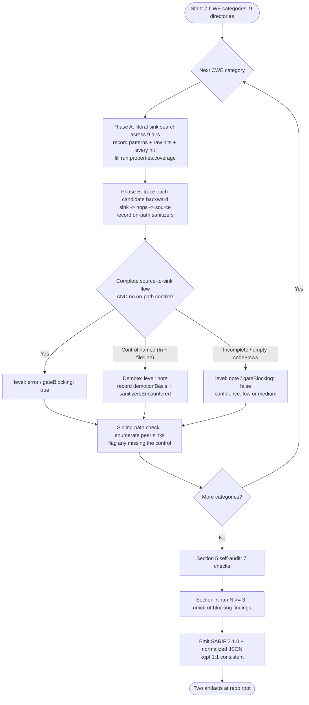

# Technical Specification

# 0. Agent Action Plan

## 0.1 Intent Clarification

### 0.1.1 Core Objective

Based on the provided requirements, the Blitzy platform understands that the objective is to **execute Layer 3 ("Blitzy Taint") of a four-layer security audit pipeline against the Cal.com monorepo** — a **read-only, cross-file, source-to-sink taint analysis that detects (never remediates) vulnerabilities** across seven CWE categories and emits exactly **two mutually-consistent report artifacts** that gate a downstream automated cross-layer merge.

This is fundamentally a **detection and reporting** task, not a code-change task. The platform reasons over the codebase as a human auditor would (the CodeQL/Joern analytical slot), tracing how untrusted data reaches dangerous operations, and records its conclusions in machine-readable form. The audit operates under a **precision-gate posture**: because the output feeds an automated gate, only fully-substantiated, high-confidence findings may be marked gate-blocking; everything suspected-but-unproven is recorded as advisory.

The requirements decompose into the following objectives, restated with technical precision:

- **R1 — Source-to-sink tracing.** Trace data flow from the directive's enumerated taint sources — HTTP query/body/path/route params, cookies, headers; tRPC inputs; API v1 `req.query`/`req.params`; API v2 DTO fields; file uploads; `postMessage`/WebSocket messages in the embed runtime; inbound webhook payloads (Stripe/Vercel/BTCPay/calendar providers); OAuth callback parameters and SAML assertions; **and second-order, database-laundered values** — to dangerous sinks.
- **R2 — Seven-category coverage.** Cover all seven sink categories without exception: **CWE-601 Open Redirect, CWE-918 SSRF, CWE-117 Log Injection, CWE-807 Authorization/Authentication Decision on Untrusted Input, CWE-338 Weak PRNG, CWE-843 Type Confusion, CWE-862 Missing Authorization**.
- **R3 — Two-phase, sequential methodology.** Process one category at a time. **Phase A** literally searches every sink pattern across the nine required directories, recording exact patterns, raw hit counts, and every hit. **Phase B** traces each candidate backward to a source, recording intermediate hops and any on-path sanitizers.
- **R4 — Precision gate.** Only fully-substantiated, high-confidence findings are `gateBlocking: true` / `level: error`; all others are `level: note` / `gateBlocking: false` / `confidence: low|medium`.
- **R5 — Evidence-bound demotion (§0a).** A finding may be lowered below gate-blocking **only** by naming a concrete on-path control (function + `file:line` on the exact path) that neutralizes it. Banned non-controls — "authenticated," "intended behaviour," "by design," "blind," "internal/admin-only," "low severity," "no known caller," "not reachable" — may never justify a demotion; a missing control **is** the finding.
- **R6 — Sibling-path consistency (§0b).** For each sink class, once a control is identified on one path, enumerate every sibling sink and verify the same control is present; any sibling lacking a peer's control is recorded as a candidate finding.
- **R7 — Two-file output contract.** Emit `findings-layer-3-blitzy-taint.sarif` (valid SARIF 2.1.0) and `findings-layer-3-blitzy-taint.json` (normalized, single-line minified JSON), kept mutually consistent.
- **R8 — Self-audit (§5).** Run a seven-check self-audit **before** writing the artifacts.
- **R9 — Reproducibility (§7).** Run the analysis N ≥ 3 times, emit the **union** of gate-blocking findings, and surface per-run variance as human-review items.

**Implicit requirements surfaced by the platform:**

- The two output files must be **strictly consistent**: every entry in the normalized JSON maps to exactly one SARIF result, and `severity` + `gateBlocking` mirror across both files.
- The SARIF must be **valid SARIF 2.1.0**: a single `run`, a single tool named **`Blitzy-Taint-Layer3`**, each CWE rule defined exactly once in `tool.driver.rules`, and `codeFlows[].threadFlows[].locations[]` ordered source → hop → sink.
- Every result must carry **all** required properties — `gateBlocking`, `severity`, `exploitScenario`, `confidence` (with reason), `sanitizersEncountered[]` (never omitted), `demotionBasis`, and `intermediateHopsSummary`.
- Per-category coverage must be recorded in `run.properties.coverage` (search patterns, raw hits, directories searched, candidates after triage, blocking findings, non-blocking notes, ruled-out items and reasons, status).
- A **hard rule**: a result with empty `codeFlows` may never be `level: error` / `gateBlocking: true`.
- The normalized JSON must strip ANSI sequences, cap `description` at 200 characters, set `line`/`file` to the **sink** location, and stamp `layer: 3` / `tool: "blitzy-taint"`.
- There is **no "warning" tier** — only `error` and `note`.
- Second-order (DB-laundered) taint requires **both legs** evidenced: the tainted-write leg and the read-to-sink leg.

**Prerequisites and dependencies:** read access to the full monorepo (available at the analysis root); working knowledge of the SARIF 2.1.0 schema (validated via research, see §0.2.2); and the ability to locate and cite existing security controls — the SSRF validator [`packages/lib/ssrfProtection.ts:L196`], the redirect sanitizer [`packages/lib/getSafeRedirectUrl.ts`], the API v2 guard stack, and the HMAC verifiers — as on-path controls for evidence-bound demotion.

### 0.1.2 Task Categorization

- **Primary task type:** Security enhancement — specifically **read-only static taint analysis (detection)**. This is a non-invasive specialization that produces audit artifacts rather than remediating code.
- **Secondary aspects:** Documentation/reporting (the SARIF and normalized-JSON artifacts constitute the deliverable) and Tooling (the artifacts are a feed for an automated quality gate).
- **Scope classification:** **Cross-cutting change (analysis scope)** — the analysis spans all nine required directories and the full taint-reachable surface — combined with **zero source mutation**. No runtime, build, or configuration component is altered; the only filesystem writes are the two report files.

### 0.1.3 Special Instructions and Constraints

- **CRITICAL — Read-only, detection-only:** *"Do not modify, create, or delete any source file. Do not refactor, patch, or fix anything. Do not run, build, test, lint, install dependencies, or execute the application or its test suite."* The only permitted write operations are producing the two output files.
- **Precision-gate directive:** Only emit fully-substantiated high-confidence findings as gate-blocking (`level: error`, `gateBlocking: true`); suspected-but-unproven findings go to `level: note`, `confidence: low|medium`, `gateBlocking: false`.
- **Methodological requirements:** Per-category sequential execution; complete each category's Phase A coverage block before its Phase B tracing; finish one CWE category entirely before starting the next; **anti-sampling** — no "and similar patterns elsewhere" shortcuts.
- **Web search requirement:** Validate the SARIF 2.1.0 output schema and CWE taint-analysis conventions (conducted; see §0.2.2).
- **User Example (preserved verbatim):** The directive provides the open-redirect nuance that in the return-to cookie path, *"`new URL(value, base)` follows the absolute value and ignores base"* — i.e., no same-origin enforcement — flagging [`apps/web/proxy.ts`] as a seed for CWE-601 analysis.
- **User Example (preserved verbatim):** The directive provides the sibling-consistency anchor that *"webhook applies `validateUrlForSSRFSync`/`validateWebhookUrl` — verify every other HTTP-client sink from a user URL applies an equivalent validator,"* directing comparison of the webhook write-time control against dispatch-time and CalDAV add-account paths.

### 0.1.4 Technical Interpretation

These requirements translate to the following technical implementation strategy. Because no source code is modified, "implementation" here means the **analysis methodology** and the **artifact-construction rules**, mapped requirement-to-action:

- **To trace taint across the codebase (R1/R3),** we will execute a per-category, two-phase sweep: literal sink enumeration across the nine directories (Phase A) followed by backward data-flow tracing to a confirmed source (Phase B), reasoning over imports, calls, and persistence boundaries by reading the relevant files.
- **To enforce the precision gate (R4/R5),** we will classify each candidate by completeness of evidence: a complete `source → hop → sink` code flow with no neutralizing on-path control yields `error`/`gateBlocking: true`; any demotion must cite a concrete control by function and `file:line`, recorded in `sanitizersEncountered` and `demotionBasis`.
- **To guarantee sibling consistency (R6),** we will, for each sink class, anchor on a known control (e.g., `validateUrlForSSRFSync` [`packages/lib/ssrfProtection.ts:L196`]) and enumerate every peer sink, flagging any that lack the control.
- **To produce the gate feed (R7),** we will construct a SARIF 2.1.0 document (single run, tool `Blitzy-Taint-Layer3`, CWE rules defined once, ordered code flows, full property bag, per-category coverage block) and a 1:1-consistent normalized JSON array.
- **To ensure rigor (R8/R9),** we will run a seven-check self-audit before emission and repeat the analysis N ≥ 3 times, emitting the union of gate-blocking findings and surfacing variance for human review.

## 0.2 Repository Scope Discovery

The analysis target is the Cal.com monorepo, rooted at the analysis workspace on git branch `main` (HEAD `e988138b24`). No `.blitzyignore` files exist anywhere in the repository, so the entire tree is searchable. There are no pre-existing `*.sarif` or `findings-layer*` artifacts, confirming that both Layer-3 outputs are net-new files.

### 0.2.1 Comprehensive File Analysis

A read-only sink enumeration was performed across the nine required directories — `apps/web`, `apps/api/v1`, `apps/api/v2`, `packages/features`, `packages/app-store`, `packages/embeds`, `packages/trpc`, `packages/lib`, `packages/prisma` — excluding `node_modules`, `dist`, `.next`, and `build`. The raw hit counts below characterize the scale of each category's analysis surface; the per-finding Phase-A search records the exact per-pattern counts in the SARIF coverage block.

| CWE Category | Sink Patterns Enumerated | Raw Hit Count | Primary Seed Locations |
|--------------|--------------------------|---------------|------------------------|
| CWE-338 Weak PRNG | `Math.random` | 76 | All call sites, contrasted against `crypto.randomBytes`/`getRandomValues` baseline |
| CWE-918 SSRF | `fetch(` (260), `axios` (36), `http(s).request`/`got(`/`node-fetch` (2) | ~298 | Webhook dispatch, `/api/router` proxy, calendar/CRM adapters |
| CWE-601 Open Redirect | `.redirect(`, `NextResponse.redirect`, `window.location` | 160 | OAuth/SAML routes, return-to cookie, booking/post-login URLs |
| CWE-117 Log Injection | `console.*`, `logger.*`, `log.*` | 3,444 | Loggers, middleware, exception filters, webhook logging (largest surface) |
| CWE-843 Type Confusion | `req.query.`, `req.params.` | 54 | API v1 Pages handlers (`string \| string[]` delivery) |
| CWE-862 Missing Authz | API v1 verb-handler files; tRPC `publicProcedure` | 46 files / 37 | API v1 `_post`/`_patch`/`_delete`/`_put`; tRPC mutations |
| CWE-807 Auth Decision | client-IP header trust (20); signature/`timingSafeEqual` (39) | 59 | `ApiAuthStrategy`, webhook/Vercel/BTCPay/Stripe signature guards, rate-limit IP trust |

The following specific source and sink locations were confirmed and will serve as cited anchors during tracing:

- **Webhook SSRF dispatch (CWE-918):** `subscriberUrl` is destructured [`packages/features/webhooks/lib/sendPayload.ts:L358`] and reaches the sink `fetch(subscriberUrl, ...)` [`packages/features/webhooks/lib/sendPayload.ts:L373`] with **no** local SSRF re-validation — a second-order candidate, since validation occurs at write-time, not dispatch read-time. The scheduled sibling selects `subscriberUrl` [`packages/features/webhooks/lib/handleWebhookScheduledTriggers.ts:L27`], reaches the sink `fetch(job.subscriberUrl, ...)` [`packages/features/webhooks/lib/handleWebhookScheduledTriggers.ts:L67`], and additionally logs the URL via `console.error` [`packages/features/webhooks/lib/handleWebhookScheduledTriggers.ts:L74`] — a combined SSRF-sibling and log-injection candidate.
- **CalDAV add-account (CWE-918 sibling-gap):** `{ username, password, url } = req.body` [`packages/app-store/caldavcalendar/api/add.ts:L12`] flows into `BuildCalendarService({...})` [`packages/app-store/caldavcalendar/api/add.ts:L38`] with no `validateUrlForSSRF` — a candidate gap versus the webhook paths.
- **Calendar adapters (CWE-918):** `subscribeToChanges` in [`packages/app-store/office365calendar/lib/CalendarService.ts`] and the Google equivalent in [`packages/app-store/googlecalendar/lib/CalendarService.ts`].
- **Routing-form proxy (CWE-918/601):** the `/api/router` submission proxy [`apps/web/pages/api/router/index.ts`].
- **Embed runtime source:** `postMessage`/`message` taint source surface (15 hits) under [`packages/embeds/embed-core/src`].
- **Open-redirect seeds (CWE-601):** the return-to cookie handler [`apps/web/proxy.ts`], OAuth token route [`apps/web/app/api/auth/oauth/token/route.ts`], and SAML authorize route [`apps/web/app/api/auth/saml/authorize/route.ts`].
- **API v1 surface (CWE-843/862):** 23 top-level resource directories under [`apps/api/v1/pages/api`].

### 0.2.2 Web Search Research Conducted

- **SARIF 2.1.0 output schema (authoritative).** The OASIS SARIF 2.1.0 specification (Errata 01, 28 August 2023; schema `https://json.schemastore.org/sarif-2.1.0.json`) confirms the structures the directive's §4 contract depends on: the log root is `{ "$schema", "version": "2.1.0", "runs": [...] }`; each `run.tool.driver` carries `name` and a `rules[]` array of `reportingDescriptor` objects (defining each CWE rule once); each `result` carries `ruleId`, `level`, `message`, `locations[]`, and `codeFlows[]`; a `codeFlow` contains `threadFlows[]` whose `locations[]` are a temporally ordered sequence of `threadFlowLocation` objects, each with `physicalLocation.artifactLocation.uri` and `region.startLine`; and a `properties` bag (key/value) is permitted at both run and result level. This validates that the directive's required custom properties (`gateBlocking`, `severity`, `exploitScenario`, `confidence`, `sanitizersEncountered`, `demotionBasis`, `intermediateHopsSummary`) and the `run.properties.coverage` block are spec-conformant. **Conclusion: the §4 output contract is valid SARIF 2.1.0 — no format conflict exists.**
- **CWE taint-analysis conventions.** The seven targeted CWEs (601, 918, 117, 807, 338, 843, 862) are standard source-to-sink taint categories; the `ruleId = CWE-###` convention and ordered `source → hop → sink` code-flow representation align with how taint engines (CodeQL, Semgrep) express data-flow results in SARIF.

### 0.2.3 Existing Infrastructure Assessment

The repository already implements substantial security infrastructure. These controls are the **sibling-consistency anchors** and the catalog of "existing controls" the analysis cites when applying evidence-bound demotion:

- **Authentication / Authorization (CWE-807/862 context).** A four-credential `ApiAuthStrategy` matrix [`apps/api/v2/src/modules/auth/strategies/api-auth/api-auth.strategy.ts`] (API key `cal_`-prefix → SHA-256 → repository lookup; OAuth2 access token; OAuth2 client `X-CAL-CLIENT-ID` + `X-CAL-SECRET-KEY`; NextAuth session JWT; third-party token); a three-ring authorization model (Ring 1 `ApiAuthGuard` transport, Ring 2 ownership guards such as `IsUserWebhookGuard`/`OAuthClientGuard`, Ring 3 `PbacGuard`/`PermissionCheckService`) implemented across **15 guard folders** [`apps/api/v2/src/modules/auth/guards/`]; the API v1 chain `extendRequest → captureErrors → verifyApiKey → rateLimitApiKey → addRequestId → captureUserId` [`apps/api/v1/lib/helpers/verifyApiKey.ts`]; legacy RBAC helpers `isTeamAdmin/Owner/Member` [`packages/lib/server/queries/teams/index.ts`]; and the tRPC `publicProcedure` versus `authedProcedure` distinction.
- **SSRF (CWE-918).** The canonical control `validateUrlForSSRFSync` [`packages/lib/ssrfProtection.ts:L196`] (with async `validateUrlForSSRF` [`packages/lib/ssrfProtection.ts:L170`], `isPrivateIP` [`packages/lib/ssrfProtection.ts:L60`], `isBlockedHostname` [`packages/lib/ssrfProtection.ts:L86`]) is applied at webhook **write-time** in the tRPC handlers [`packages/trpc/server/routers/viewer/webhook/create.handler.ts:L28`], [`packages/trpc/server/routers/viewer/webhook/edit.handler.ts:L38`], and [`packages/trpc/server/routers/viewer/webhook/testTrigger.handler.ts:L18`], plus the zod helper [`packages/lib/zod/ssrfSafeUrl.ts`]. Dispatch-time `fetch` calls perform no local re-validation — the second-order surface.
- **Open Redirect (CWE-601).** `getSafeRedirectUrl` [`packages/lib/getSafeRedirectUrl.ts`] (with test coverage) and the Edge middleware [`apps/web/proxy.ts`] (CSP nonce via `crypto.getRandomValues`, header sanitization, session-token clearance on logout).
- **Signature / auth-decision (CWE-807).** Outbound HMAC-SHA256 `X-Cal-Signature-256` via `createWebhookSignature` [`packages/features/webhooks/lib/sendPayload.ts`]; inbound verification with `crypto.timingSafeEqual` after a length pre-check — Vercel SHA-1 [`apps/api/v2/src/vercel-webhook.guard.ts`], BTCPay SHA-256 [`packages/app-store/btcpayserver/api/webhook.ts`], Stripe `constructEvent`, and the License API HMAC nonce [`packages/features/ee/common/server/private-api-utils.ts`]. The rate-limit tracker trusts `cf-connecting-ip` then `x-forwarded-for` [`apps/api/v2/src/lib/throttler-guard.ts`].
- **Weak PRNG baseline (CWE-338 contrast).** Secure generators are already in use — TOTP backup codes via `crypto.randomBytes(5)`, team-invite tokens via `randomBytes(32)`, and CSP nonce via `crypto.getRandomValues` — providing the contrast against which each `Math.random()` use is judged.
- **Log Injection (CWE-117).** Winston [`apps/api/v2/src/lib/logger.ts`] via `WinstonModule.createLogger` with `RequestId`/`AppLogger` middleware; tslog [`packages/lib/logger.ts`] which masks only `password`/`credentials` keys.
- **Type Confusion (CWE-843).** API v1 Pages handlers deliver `req.query.x`/`req.params.x` as `string | string[]`; the API v2 global `ValidationPipe({ whitelist: true, transform: true })` strips unknown properties.

This catalog is sufficient system context for the Agent Action Plan; no additional technical-specification sections are required for scoping.

## 0.3 Scope Boundaries

### 0.3.1 Exhaustively In Scope

- **Read-only analysis surface — the taint-reachable codebase across the nine required directories:**
    - `apps/web/**` — Next.js main application (routes, middleware, `/api/router` proxy, return-to handling)
    - `apps/api/v1/**` — Next.js Pages first-generation API (`req.query`/`req.params` handlers, verb handlers)
    - `apps/api/v2/**` — NestJS second-generation API (controllers, guards, strategies, loggers, filters)
    - `packages/features/**` — webhook dispatch, routing forms, notifications
    - `packages/app-store/**` — calendar/CRM/video/payment adapters (CalDAV, Office365, Google, BTCPay, Stripe)
    - `packages/embeds/**` — embed runtime (`postMessage`/message sources)
    - `packages/trpc/**` — tRPC routers and procedures (`publicProcedure` vs `authedProcedure`)
    - `packages/lib/**` — shared controls (`ssrfProtection.ts`, `getSafeRedirectUrl.ts`, loggers, crypto)
    - `packages/prisma/**` — schema and persistence boundaries (relevant to second-order taint)
- **All seven CWE categories,** each with a populated `run.properties.coverage` block: CWE-601, CWE-918, CWE-117, CWE-807, CWE-338, CWE-843, CWE-862.
- **The two net-new output artifacts at repository root** — the only files written:
    - `findings-layer-3-blitzy-taint.sarif` (SARIF 2.1.0)
    - `findings-layer-3-blitzy-taint.json` (normalized, single-line minified JSON)
- **Citing existing controls** (`validateUrlForSSRFSync`, `getSafeRedirectUrl`, the API v2 guard stack, the HMAC verifiers, `ValidationPipe`) as on-path controls for evidence-bound demotion (§0a) and as anchors for sibling-path enumeration (§0b).
- **Second-order (DB-laundered) taint paths,** documented with both the tainted-write leg and the read-to-sink leg.

### 0.3.2 Explicitly Out of Scope

- **Any source-file modification** — no creation, deletion, refactoring, patching, or fixing of source. This is detection only; remediation is a separate effort. *(Rule: read-only / no-build.)*
- **The other audit layers and the consolidation step** — Layer 1 (Blitzy Architectural), Layer 2 (Semgrep), and Layer 4 (OSV-Scanner) are separate layers with separate owners; the downstream cross-layer merge (Monty Directive 6/7) **consumes** these outputs but is not produced here.
- **Running, building, testing, linting, or installing dependencies,** executing the application or its test suite, and any git operation beyond writing the two output files; no repository-hook bypass.
- **A standalone decision-log Markdown file or external traceability matrix** — would violate the strict two-file output contract; explainability is satisfied inside the SARIF per-finding properties instead (see §0.8.2, Conflict 2).
- **Building runtime observability** (logging/tracing/metrics/health checks/dashboards) into a deliverable — no application is built; analysis-process observability is provided by `run.properties.coverage` instead (see §0.8.2, Conflict 1).
- **Figma, design-system, UI, or design-token work** — no attachments were provided and no component library was named; consequently there is no Design System Compliance sub-section.
- **CWE categories or sink types beyond the seven enumerated** in the directive's §3.

## 0.4 Dependency Inventory

This task introduces **no dependency changes of any kind** — zero additions, zero updates, zero removals. Because the directive is strictly read-only and forbids installing dependencies, no package manifest is touched: `package.json` and `yarn.lock` remain unmodified, and nothing is installed, upgraded, or removed.

The analysis **consumes** two output-format standards; these are specifications the artifacts conform to, not project dependencies that get added to the codebase:

| Registry | Package Name | Version | Purpose |
|----------|--------------|---------|---------|
| — (format spec) | SARIF (OASIS) | 2.1.0 | Output schema for `findings-layer-3-blitzy-taint.sarif` (validated against `https://json.schemastore.org/sarif-2.1.0.json`) |
| — (format spec) | Normalized findings JSON | Layer-3 contract | Single-line minified merge feed for `findings-layer-3-blitzy-taint.json` |

The host project's existing toolchain — Node.js 20.20.2, Yarn Berry 4.12.0, Turborepo 2.7.1, TypeScript 5.9.3, Next.js 16.1.5, React 18.2.0, Prisma 6.16.1, PostgreSQL 15+, Zod 3.25.76 — is **context only**. It is neither modified nor invoked during this analysis (no build, run, or install is performed).

- **New dependencies to add:** None.
- **Dependencies to update:** None.
- **Dependencies to remove:** None.
- **Import/reference updates:** None — no source file is edited, so no import statements change.

## 0.5 Implementation Design

Because no source code is changed, the "implementation" described here is the **analysis methodology** and the **artifact-construction rules**. The deliverable is two report files; the design governs how findings are discovered, classified, and serialized.

### 0.5.1 Technical Approach

- **Achieve complete sink coverage** by executing a per-category, two-phase sweep. In **Phase A**, literally search every sink pattern for the current CWE across all nine directories, recording exact patterns, raw hit counts, and every hit into the category's `run.properties.coverage` block. In **Phase B**, trace each candidate backward from sink to a confirmed source, recording intermediate hops and any on-path sanitizers.
- **Enforce the precision gate** by classifying each candidate strictly by evidence completeness: a complete `source → hop → sink` code flow with no neutralizing on-path control yields `level: error` / `gateBlocking: true`; anything less is `level: note` with `confidence: low|medium`. A result with empty `codeFlows` may never be gate-blocking.
- **Apply evidence-bound demotion (§0a)** by lowering a finding below gate-blocking only when a concrete on-path control is named (function + `file:line`) in `sanitizersEncountered` and `demotionBasis`; banned non-controls cannot demote.
- **Guarantee sibling consistency (§0b)** by anchoring each sink class on a known control and enumerating every peer sink, flagging any that lack the control.
- **Serialize two consistent artifacts** by constructing the SARIF document and deriving the normalized JSON from the same finding set so they remain 1:1.

The logical implementation flow (not a timeline) is:

- **First, establish the analysis frame** by confirming the nine in-scope directories and cataloging existing controls (`ssrfProtection.ts`, `getSafeRedirectUrl.ts`, the guard stack, HMAC verifiers) as demotion/sibling anchors.
- **Next, process each CWE category sequentially** through Phase A enumeration then Phase B tracing, never starting a new category until the current one's coverage block and tracing are complete.
- **Then, classify and self-audit** each candidate against the precision gate and the seven-check §5 self-audit before writing anything.
- **Finally, ensure reproducibility** by running the analysis N ≥ 3 times, emitting the union of gate-blocking findings, and serializing the SARIF and normalized JSON consistently.

### 0.5.2 Component Impact Analysis

- **Direct modifications required:** None. The analysis is read-only; no source, runtime, build, or configuration component is altered. The only filesystem writes are the two report artifacts at the repository root.
- **Indirect impacts and dependencies:** The two artifacts are **consumed** by the downstream cross-layer merge step (Monty Directive 6/7), which consolidates Layer 1 (Blitzy Architectural), Layer 2 (Semgrep), Layer 3 (this Blitzy Taint), and Layer 4 (OSV-Scanner). `gateBlocking: true` findings block the automated gate; `level: note` findings are advisory. No application component depends on or is changed by this analysis.
- **New components introduced:** None in the codebase. The two output files are the sole new artifacts, and they are reports rather than code.

### 0.5.3 User-Provided Examples Integration

- The user's example that `new URL(value, base)` *"follows the absolute value and ignores base"* maps directly to the CWE-601 analysis of the return-to cookie path in [`apps/web/proxy.ts`]: the analysis treats the absence of same-origin enforcement on that constructed URL as a candidate open-redirect, then checks whether `getSafeRedirectUrl` [`packages/lib/getSafeRedirectUrl.ts`] is applied on-path before demoting.
- The user's example that the *"webhook applies `validateUrlForSSRFSync`"* maps to the CWE-918 sibling-consistency check: the webhook write-time control [`packages/lib/ssrfProtection.ts:L196`] is the anchor against which the dispatch-time `fetch` [`packages/features/webhooks/lib/sendPayload.ts:L373`], the scheduled dispatch [`packages/features/webhooks/lib/handleWebhookScheduledTriggers.ts:L67`], and the CalDAV add-account path [`packages/app-store/caldavcalendar/api/add.ts:L38`] are each compared.

### 0.5.4 Critical Implementation Details

- **Detection patterns:** per-category literal sink search (e.g., `fetch(`/`axios` for SSRF, `.redirect(`/`window.location` for open redirect, `Math.random` for weak PRNG, `req.query.`/`req.params.` for type confusion) followed by backward data-flow reasoning to a §1 source.
- **Second-order taint handling:** for DB-laundered values, both legs must be evidenced — the request value persisted (tainted-write leg) and the stored value loaded and reaching the sink (read-to-sink leg) — and both are summarized in `intermediateHopsSummary`. The webhook `subscriberUrl` dispatch path is the archetypal example.
- **SARIF construction:** a single `run`; tool `Blitzy-Taint-Layer3`; each CWE rule defined once in `tool.driver.rules`; one `result` per finding with `ruleId = CWE-###`; `codeFlows[].threadFlows[].locations[]` ordered source → hop → sink; the full required property bag on every result; and a per-category `run.properties.coverage` block.
- **Normalized JSON construction:** a single-line minified array derived from the same finding set, each entry `{ file, line, severity, cwe, description, layer: 3, tool: "blitzy-taint", gateBlocking }` with ANSI stripped, `description` capped at 200 characters, and `line`/`file` set to the sink location.
- **Consistency and edge cases:** every normalized-JSON entry maps to exactly one SARIF result with mirrored `severity`/`gateBlocking`; there is no "warning" tier; and the empty-`codeFlows` hard rule is enforced before classification.

## 0.6 File Transformation Mapping

### 0.6.1 File-by-File Execution Plan

This task creates exactly **two** files and modifies **none**. Every source path below is `REFERENCE` only — read as part of the taint analysis surface, never written. There are no `UPDATE` or `DELETE` operations because the directive is strictly read-only.

| Target File | Transformation | Source File/Reference | Purpose/Changes |
|-------------|----------------|----------------------|-----------------|
| `findings-layer-3-blitzy-taint.sarif` | CREATE | (net-new) | Valid SARIF 2.1.0; one `run`; tool `Blitzy-Taint-Layer3`; 7 CWE rules defined once; one result per finding; ordered `source → hop → sink` code flows; full property bag; per-category `run.properties.coverage` |
| `findings-layer-3-blitzy-taint.json` | CREATE | (net-new) | Normalized single-line minified JSON array, 1:1 with SARIF results; `{file,line,severity,cwe,description,layer:3,tool:"blitzy-taint",gateBlocking}`; ANSI stripped; `line`/`file` = sink |
| `packages/lib/ssrfProtection.ts` | REFERENCE | same | CWE-918 canonical control anchor (`validateUrlForSSRFSync:L196`) for demotion and sibling enumeration |
| `packages/lib/zod/ssrfSafeUrl.ts` | REFERENCE | same | CWE-918 zod-level SSRF validator helper |
| `packages/trpc/server/routers/viewer/webhook/create.handler.ts` | REFERENCE | same | CWE-918 write-time control site (`L28`) |
| `packages/trpc/server/routers/viewer/webhook/edit.handler.ts` | REFERENCE | same | CWE-918 write-time control site (`L38`) |
| `packages/trpc/server/routers/viewer/webhook/testTrigger.handler.ts` | REFERENCE | same | CWE-918 write-time control site (`L18`) |
| `packages/features/webhooks/lib/sendPayload.ts` | REFERENCE | same | CWE-918 dispatch sink (`fetch:L373`); CWE-807 outbound HMAC `createWebhookSignature`; CWE-117 logging |
| `packages/features/webhooks/lib/handleWebhookScheduledTriggers.ts` | REFERENCE | same | CWE-918 sibling sink (`fetch:L67`) + CWE-117 `console.error:L74` |
| `packages/app-store/caldavcalendar/api/add.ts` | REFERENCE | same | CWE-918 sibling-gap candidate (`req.body:L12 → BuildCalendarService:L38`) |
| `packages/app-store/caldavcalendar/lib/CalendarService.ts` | REFERENCE | same | CWE-918 DAV client construction base |
| `packages/app-store/office365calendar/lib/CalendarService.ts` | REFERENCE | same | CWE-918 `subscribeToChanges` seed |
| `packages/app-store/googlecalendar/lib/CalendarService.ts` | REFERENCE | same | CWE-918 Google callback seed |
| `apps/web/pages/api/router/index.ts` | REFERENCE | same | CWE-918/601 `/api/router` submission proxy |
| `packages/lib/getSafeRedirectUrl.ts` | REFERENCE | same | CWE-601 redirect-sanitizer control anchor |
| `apps/web/proxy.ts` | REFERENCE | same | CWE-601 return-to cookie seed (`new URL(value, base)` ignores base) |
| `apps/web/app/api/auth/oauth/token/route.ts` | REFERENCE | same | CWE-601 OAuth token route redirect seed |
| `apps/web/app/api/auth/saml/authorize/route.ts` | REFERENCE | same | CWE-601 SAML authorize redirect seed |
| `apps/api/v2/src/modules/auth/oauth2/**` | REFERENCE | same | CWE-601 OAuth2 controller redirect surface |
| `packages/lib/logger.ts` | REFERENCE | same | CWE-117 tslog sink (masks only `password`/`credentials`) |
| `apps/api/v2/src/lib/logger.ts` | REFERENCE | same | CWE-117 Winston sink |
| `apps/api/v2/src/modules/auth/strategies/api-auth/api-auth.strategy.ts` | REFERENCE | same | CWE-807 four-credential auth-decision logic |
| `apps/api/v2/src/vercel-webhook.guard.ts` | REFERENCE | same | CWE-807 Vercel signature verification (`timingSafeEqual`) |
| `packages/app-store/btcpayserver/api/webhook.ts` | REFERENCE | same | CWE-807 BTCPay signature verification |
| `apps/api/v2/src/lib/throttler-guard.ts` | REFERENCE | same | CWE-807 client-IP header trust (`cf-connecting-ip`/`x-forwarded-for`) |
| `packages/features/ee/common/server/private-api-utils.ts` | REFERENCE | same | CWE-807 License API HMAC nonce |
| `apps/api/v1/lib/helpers/verifyApiKey.ts` | REFERENCE | same | CWE-862 API v1 authorization chain anchor |
| `apps/api/v1/pages/api/**` | REFERENCE | same | CWE-843/862 API v1 verb handlers + `req.query`/`req.params` surface (23 resource dirs) |
| `apps/api/v2/src/modules/auth/guards/**` | REFERENCE | same | CWE-862 three-ring guard stack (15 guard folders) |
| `packages/lib/server/queries/teams/index.ts` | REFERENCE | same | CWE-862 legacy RBAC helpers (`isTeamAdmin/Owner/Member`) |
| `packages/trpc/server/routers/**` | REFERENCE | same | CWE-862 tRPC `publicProcedure` mutation surface |
| `packages/embeds/embed-core/src/**` | REFERENCE | same | Taint source: `postMessage`/message surface (15 hits) |
| `packages/prisma/**` | REFERENCE | same | Second-order taint: persistence-boundary schema |

The wildcard entries (`**`) denote broad read-only analysis surfaces; the Phase-A coverage block records the exact per-file hits for each. No file in the repository is left as "pending" or "to be discovered" — the two CREATE targets are fully specified, and the REFERENCE surface is the enumerated taint-reachable codebase across the nine in-scope directories.

### 0.6.2 New Files Detail

- **`findings-layer-3-blitzy-taint.sarif`** (repository root)
    - Content type: machine-readable report (SARIF 2.1.0 JSON)
    - Based on: the OASIS SARIF 2.1.0 schema (`https://json.schemastore.org/sarif-2.1.0.json`)
    - Key sections: `$schema` + `version: "2.1.0"`; `runs[0].tool.driver` (`name: "Blitzy-Taint-Layer3"`, `rules[]` of seven CWE `reportingDescriptor`s); `runs[0].results[]` (one per finding, each with `ruleId`, `level`, ordered `codeFlows`, and the required property bag — `gateBlocking`, `severity`, `exploitScenario`, `confidence`, `sanitizersEncountered`, `demotionBasis`, `intermediateHopsSummary`); and `runs[0].properties.coverage` (per-category search patterns, raw hits, directories searched, candidates after triage, blocking findings, non-blocking notes, ruled-out items/reasons, status).
- **`findings-layer-3-blitzy-taint.json`** (repository root)
    - Content type: machine-readable merge feed (single-line minified JSON array)
    - Based on: the Layer-3 normalized-findings contract for the downstream Monty Directive 6/7 merge
    - Key sections: an array of `{ file, line, severity, cwe, description, layer: 3, tool: "blitzy-taint", gateBlocking }` entries, ANSI-stripped, `description` ≤ 200 chars, `line`/`file` = sink location, kept 1:1 consistent with the SARIF results.

### 0.6.3 Files to Modify Detail

None. The directive forbids modifying, creating (other than the two outputs), or deleting any source file.

### 0.6.4 Cross-File Dependencies

- **Artifact-to-artifact consistency:** the normalized JSON is derived from the same finding set as the SARIF, so every JSON entry must map to exactly one SARIF result with mirrored `severity` and `gateBlocking`.
- **No source cross-file updates:** because no source file is edited, there are no import, reference, or configuration-sync changes anywhere in the codebase.
- **Downstream consumption:** both artifacts are inputs to the cross-layer merge (Monty Directive 6/7); their internal consistency and schema validity are the only integration contracts that matter.

## 0.7 Rules

Three user-specified rules govern this task, alongside the directive's own §0 discipline. Each is documented below with how it binds the analysis. Two of the three create tension with a strictly read-only, two-file deliverable; those tensions and their resolutions are recorded in §0.8.2.

- **Rule 1 — Observability.** Mandates structured logging with correlation IDs, distributed tracing, a metrics endpoint, health/readiness checks, and a dashboard template on every deliverable, verified in local dev. **Application:** this task builds no runtime service and is forbidden from running locally, so the literal mandate has nothing to instrument. The applicable analog is **process observability** — the per-category `run.properties.coverage` block (search patterns, raw hits, directories searched, status) makes the detection process itself auditable. (Resolution in §0.8.2, Conflict 1.)
- **Rule 2 — Explainability.** Mandates that every non-trivial decision be documented with rationale (a decision-log table; a bidirectional traceability matrix for migrations/refactors), with rationale not embedded in code comments, and any deviation from a literal interpretation explicitly logged. **Application:** explainability is satisfied **inside the SARIF artifact** — each result's `exploitScenario`, `confidence` (with reason), `sanitizersEncountered` (control name + `file:line`), `demotionBasis`, and `intermediateHopsSummary` together form a per-finding decision log; the §0 demotion discipline plus the §5 self-audit are the explainability mechanism. A standalone `.md` decision log is intentionally **not** produced because it would breach the two-file contract. (Resolution in §0.8.2, Conflict 2.)
- **Rule 3 — CAL Layer 3 Project Rule.** Mirrors and reinforces the directive's §0:
    - **(a) Evidence-bound demotion** — a finding may be lowered below `gateBlocking: true` only by naming a specific control (function + `file:line`) applied on the exact path and stating what it neutralizes. The banned non-controls (authenticated, intended behaviour, by design, response not reflected/blind, internal/admin-only, low severity, no known caller, not currently reachable) must never be used to demote; a missing control is the finding, and genuinely uncertain reachability is a `note` with the uncertainty stated.
    - **(b) Sibling-path consistency** — once a control is identified on any path to a sink class, enumerate every other path to a same-class sink and verify the same control; any sibling lacking a peer's control is recorded explicitly, never silently assumed safe.
    - **(c) Sequential execution** — process one CWE category at a time; complete Phase A and its coverage block before Phase B; do not start the next category until the current coverage block is done; if a category cannot be completed, say so explicitly rather than sampling.
    - **(d) Read-only, no build** — do not modify/create/delete source files; do not run, build, test, lint, install dependencies, or git-commit beyond writing the two output files; do not bypass repository hooks.

**Directive-derived rules also in force:** the precision-gate posture (only fully-substantiated findings are gate-blocking); the hard rule that empty `codeFlows` may never be `error`/`gateBlocking: true`; the absence of any "warning" tier; second-order taint requiring both legs; and §7 reproducibility (N ≥ 3 runs, union of gate-blocking findings).

## 0.8 Special Instructions

### 0.8.1 Special Execution Instructions

- **Detection only, no remediation.** Produce findings; never fix, patch, or refactor. The deliverable is two report files and nothing else.
- **Sequential, anti-sampling execution.** Complete one CWE category fully (Phase A coverage block, then Phase B tracing) before starting the next; never substitute "and similar patterns elsewhere" for exhaustive enumeration.
- **Self-audit before emission.** Run the §5 seven-check self-audit prior to writing the artifacts; do not emit findings that fail the precision gate as gate-blocking.
- **Reproducibility.** Run the analysis N ≥ 3 times; emit the **union** of gate-blocking findings; surface per-run variance (blocking in some runs, note in others) as human-review items.
- **Two artifacts, kept consistent.** Write `findings-layer-3-blitzy-taint.sarif` and `findings-layer-3-blitzy-taint.json` at the repository root, derived from one finding set and kept 1:1 consistent.
- **Tooling posture.** No code-execution, build, or analysis-engine invocation is permitted; the analysis is performed by reasoning over read-only file contents.

### 0.8.2 Constraints and Boundaries

- **Technical constraints:** read-only file access only; no modify/create/delete of source; no run/build/test/lint/install; no git operation beyond writing the two outputs; no repository-hook bypass.
- **Output constraints:** exactly two files; valid SARIF 2.1.0; no "warning" tier; empty `codeFlows` may never be gate-blocking; normalized JSON must strip ANSI, cap `description` at 200 characters, and set `line`/`file` to the sink.
- **Process constraints:** evidence-bound demotion with banned non-controls; sibling-path consistency; sequential per-category execution.
- **Compatibility:** the SARIF must validate against the SARIF 2.1.0 schema, and the normalized JSON must conform to the Layer-3 merge contract consumed by Monty Directive 6/7.

**Two conflicts between the user rules and the directive were identified and resolved:**

- **Conflict 1 — Observability rule vs. read-only directive.** The Observability rule mandates building structured logging, tracing, metrics, health checks, and a dashboard into "every deliverable" and verifying them locally. This task builds no application and ships no runtime service; there is nothing to instrument and (per Rule 3d) nothing may be run locally. **Resolution:** the task-specific Layer-3 directive and Rule 3(d) take precedence (specific over general; Rule 3d explicitly forbids build/run/install), so the literal Observability mandate is inapplicable. The applicable analog — auditable observability of the *analysis process* — is delivered via the per-category `run.properties.coverage` block in the SARIF.
- **Conflict 2 — Explainability rule (separate decision-log `.md` + traceability matrix) vs. the strict two-file output contract.** A standalone decision-log file would violate the requirement to emit exactly two files. **Resolution:** rationale is embedded inside the SARIF per-finding properties (`exploitScenario`, `confidence` + reason, `sanitizersEncountered` with control name + `file:line`, `demotionBasis`, `intermediateHopsSummary`), which collectively constitute the per-finding decision log; the §0 demotion discipline and §5 self-audit are the explainability mechanism. This deviation from the rule's literal "separate `.md`" form is itself documented here, satisfying the Explainability rule's own requirement that deviations be explicitly logged.

No other conflicts were found; Rule 3 (CAL Layer 3) mirrors and reinforces the directive's §0.

## 0.9 Attachments

No attachments were provided for this project. The attachment review returned "No attachments found," confirming there are **no PDF or image attachments** and **no Figma frames**.

Consequences for this Agent Action Plan:

- No Figma design analysis was performed, and there is no "Figma Design Analysis" sub-section.
- No component library or design system was named in the directive and no Figma was supplied, so the Design System Alignment Protocol does not apply — there is no "Design System Compliance" sub-section and no Token Mapping.
- All requirements were derived solely from the user's prompt (the "Execute Layer 3 — Taint Analysis" directive) and the three user-specified rules.

