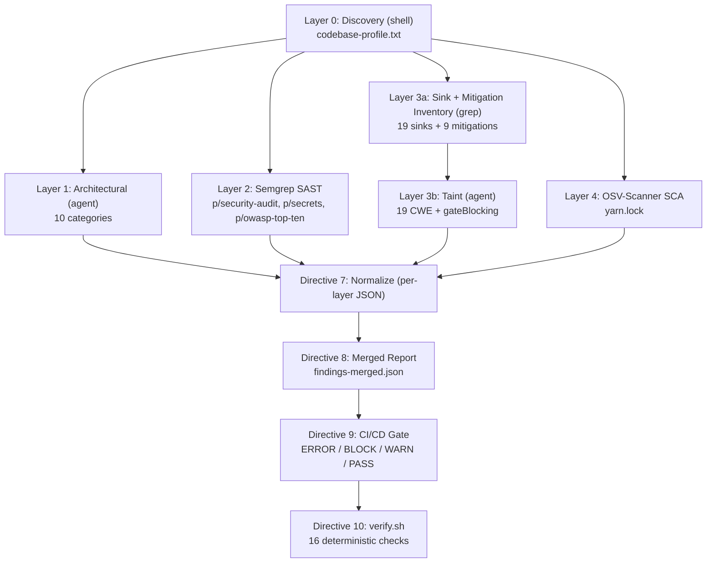

# Technical Specification

# 0. Agent Action Plan

## 0.1 Executive Intent and Core Security Objective

This Agent Action Plan is the interpretation layer between the security request and its execution against the `blitzy-cal` repository (a Cal.com-derived scheduling and booking monorepo, git HEAD `e988138b24`). It restates the request in precise technical terms, surfaces every implicit requirement, and maps the work to concrete components, tools, and output artifacts. The defining characteristic of this engagement is that it is a **read-only security audit**, not a source-remediation task: the deliverables are a structured corpus of report artifacts, and application source files are scanned but **not modified**.

### 0.1.1 Core Security Objective

Based on the security concern described, the Blitzy platform understands that the objective is **not to remediate a single named vulnerability** but to execute a deterministic, reproducible, five-layer (six including Layer 0) security audit of the target codebase and emit a structured, machine-readable findings corpus that a CI/CD gate and human reviewers can act on.

- **Vulnerability category:** Multiple / comprehensive. The engagement spans every structural vulnerability class simultaneously — architectural logic flaws, AST-level pattern matches, exhaustive sink/mitigation enumeration, dataflow taint with exploitability triage, and known dependency CVEs.
- **Severity model:** The audit itself **assigns** a unified `critical | high | medium | low` severity to each finding. The engagement's overall gate verdict is **BLOCK** whenever any Layer 3b finding is classified `gateBlocking: true`, independent of raw finding counts.
- **Restated security requirements:**
  - Cover all ten Layer 1 architectural categories with attack-chain narratives and CWE classifications.
  - Run Semgrep OSS Static Application Security Testing (SAST) with the `p/security-audit`, `p/secrets`, and `p/owasp-top-ten` rule packs.
  - Guarantee 100%-recall enumeration of all 19 sink categories and 9 mitigation categories via deterministic `grep`/`find`.
  - Triage exploitability across all 19 CWE sink categories with a `gateBlocking` flag and a `demotionReason` for advisories.
  - Catalog known dependency CVEs with OSV-Scanner against the project lockfile.
  - Consolidate the layers into per-layer normalized JSON, a cross-layer merged report, a CI/CD gate verdict, and an executable verification script.
- **Implicit requirements surfaced:**
  - Zero modification of application source — the deliverables are report artifacts only (`~0 files modified`).
  - No dependency remediation or version bumps; reporting CVEs is in scope, fixing them is not (this preserves the dependency freeze and encryption-key continuity discussed in 0.4.3).
  - Pattern selection must adapt to the detected `primary_language` (TypeScript) and skip structurally-inapplicable language columns **without failing**.
  - The new pipeline complements, and does not replace, the repository's existing `npm audit` gate.

### 0.1.2 Six-Layer Coverage Model

Each layer detects a structurally distinct vulnerability class; the layers are intentionally non-overlapping in method so that cross-layer corroboration signals the highest confidence.

| Layer | Tool / Method | Detects | Primary Output |
|-------|---------------|---------|----------------|
| 0 — Discovery | Shell (deterministic) | Primary/secondary languages, frameworks, ecosystems, lockfiles, layout, exclude dirs | `codebase-profile.txt` |
| 1 — Architectural | Agent (context-aware reasoning) | Fail-open logic, default secrets, key reuse, CORS/CSP, credential logging, timing side-channels, webhook gaps, embed origin, API version parity, framework misconfigs | `findings-layer-1-arch.json` |
| 2 — Pattern SAST | Semgrep OSS | CI/CD injection, committed secrets, container misconfig, XSS, hardcoded credentials, TLS bypass, postMessage origin | `results-semgrep.sarif` → `findings-layer-2-semgrep.json` |
| 3a — Inventory | `grep`/`find` (100% recall) | All sink call sites (19 categories) + all mitigation call sites (9 categories) | `sink-inventory.txt`, `mitigation-inventory.txt` (+ `-test` variants) |
| 3b — Taint | Agent (dataflow) | 19 CWE sink categories with gate-blocking triage | `findings-layer-3b-taint.json` |
| 4 — SCA | OSV-Scanner | Known CVEs, malicious packages, outdated transitives | `results-osv.json` → `findings-layer-4-osv.json` |

The execution and consolidation flow is:



### 0.1.3 Technical Interpretation

The security request translates into the following detection-strategy mapping, expressed as "to detect [class], we will [layer/tool] over [targets]":

- To detect **architectural logic flaws** (fail-open guards, default secrets, key reuse, CORS/CSP weaknesses, webhook verification gaps), the Layer 1 agent reasons over a budget of ≤50 files per category across 10 categories.
- To detect **AST-level pattern vulnerabilities** (XSS, hardcoded credentials, TLS bypass, injection), Layer 2 runs Semgrep OSS with three rule packs and emits SARIF.
- To guarantee **exhaustive enumeration** of sinks and mitigations, Layer 3a runs deterministic `grep`/`find` over the 19 sink and 9 mitigation categories using the JS/TS pattern column.
- To **triage exploitability** of every inventoried sink against inventoried mitigations, the Layer 3b agent performs taint analysis across 19 CWE categories, attaching `gateBlocking` and `demotionReason`.
- To **catalog known dependency CVEs**, Layer 4 runs OSV-Scanner over the single root `yarn.lock`.
- To **consolidate**, Directive 7 normalizes per-layer findings, Directive 8 merges them with corroboration and severity escalation, Directive 9 computes the gate verdict, and Directive 10 generates and executes `verify.sh`.

The user's understanding level is best characterized as an **explicit expert specification** rather than a symptom report: the request prescribes the exact tools, rule packs, the 19-category sink table across five language columns, the CWE taxonomy, the gate-blocking truth table, the per-layer JSON schemas, and the 16 verification checks. The Blitzy platform's role is therefore faithful, deterministic execution of that specification against the real codebase, not invention of a detection methodology.

## 0.2 Special Instructions and Constraints

Because the project supplied no separate rules list and no attachments, the user's directives are expressed entirely within the security specification itself. These directives are binding constraints on how every layer executes and how findings are recorded.

### 0.2.1 Global Rules and Execution Bounds

- **No silent failure or category drop.** No layer may silently fail or omit a category. Pre-agent steps (Directives 0, 2, 4, 6) record an explicit `OK` or `ERROR` status; agent steps (Directives 1, 5) emit per-category coverage summaries. A layer that cannot complete emits partial results flagged `"coverage":"partial"` — never silent omission.
- **Unified severity vocabulary.** Every `severity` field across all artifacts uses only `critical | high | medium | low`.
- **ANSI stripping.** All ANSI escape sequences (`\x1b`) must be stripped from every output file; their presence is a verification failure.
- **Description and line integrity.** Every finding must carry a non-empty `description` of at most 200 characters stating the vulnerability (not merely a rule ID or CVE number) and an integer `line`.
- **Execution bounds.** The total budget is 200k tokens of output / 60 minutes of wall-clock time, whichever is reached first. At 80% of either limit, the pipeline emits all partial results with `"coverage":"partial"` and proceeds directly to Directive 8 (merge).

### 0.2.2 Reproducibility and Gate-Blocking Anchor

- **Deterministic layers (0, 2, 3a, 4)** must produce identical outputs on identical inputs. Reproducibility for Layer 2 is reinforced by pinning the Semgrep rule packs to a local `rules/` directory before scanning.
- **Agent layers (1, 3b)** produce structurally consistent outputs — the same categories covered, the same schema, and the same gate-blocking criteria — even though individual findings may vary between runs.
- **The gate-blocking classification criteria are the reproducibility anchor.** Two runs must agree on which findings are gate-blocking, even if they surface different advisory findings. This makes the `gateBlocking` decision boundary, not the exact finding set, the contract that downstream CI/CD relies upon.

### 0.2.3 Change Scope

- **Change-scope preference: minimal / report-only.** The engagement modifies `~0` application source files. The only files created are the audit artifacts (enumerated in 0.6.1); the entire scanned codebase is treated as read-only reference.
- **No remediation by the pipeline.** Findings — including dependency CVEs from Layer 4 — are reported for downstream triage. The pipeline does not patch code, change configuration, or bump dependency versions, both because the deliverable is an assessment and because of the constraints detailed in 0.4.3.
- **Verbatim-preserved user directives.** The following directive strings are preserved exactly as specified and govern execution:
  - User Directive: `"No layer may silently fail or drop categories."`
  - User Directive: `"Strip ANSI escape sequences from all output."`
  - User Directive: `"At 80% of either limit, emit all partial results with \"coverage\":\"partial\" and proceed to Directive 8 (merge)."`
  - User Directive: `"The gate-blocking classification criteria are the reproducibility anchor."`
  - User Directive (header): `"[12 directives (0–11) | ~0 files modified | 9 output files + 1 merged report + verify.sh | 10 L1 categories | 19 L3b sink categories with multi-language patterns (JS/TS, Python, Go, Java) | unified severity schema]"`

## 0.3 Vulnerability Research and Analysis

This subsection records the initial assessment of the request, the external research performed to ground the tooling in authoritative current sources, and the full vulnerability taxonomy the audit must cover.

### 0.3.1 Initial Assessment

The request is an expert specification rather than a report of a specific exploit. Extracting the security-relevant signals:

- **CVE numbers mentioned by the user:** None. The user names no specific CVE; instead the engagement is mandated to discover dependency CVEs dynamically through Layer 4.
- **Vulnerability names / classes named:** A comprehensive set — open redirect, SSRF, log injection, weak PRNG, XSS, SQL/raw query, command execution, IDOR/tenant isolation, code injection, insecure deserialization, XXE, and more (the full 19-category CWE taxonomy in 0.3.3).
- **Affected packages:** Not pre-specified; the lockfile drives Layer 4.
- **Symptoms described:** None; the request is methodology-driven, not symptom-driven.
- **Security advisories referenced:** None directly; the audit relies on the OSV.dev aggregate database via OSV-Scanner.

The practical consequence is that the audit's value depends on faithful, exhaustive execution of every layer, since no single defect has been pre-identified to anchor the work.

### 0.3.2 Web Research Conducted

Research focused on confirming the current installation and invocation contracts for the two third-party tools the pipeline installs, because the local environment lacks both of them (and lacks the `go` toolchain). Findings:

- **OSV-Scanner (Layer 4 SCA).** <cite index="6-12,6-13">OSV-Scanner is Google's free, open-source vulnerability scanner for open-source dependencies that queries the OSV.dev database, the largest aggregated source of open-source vulnerability data, covering dozens of ecosystems with normalized advisory information from NVD, GitHub Advisories, and ecosystem-specific sources.</cite> <cite index="6-8">The CLI can be installed using Go, Homebrew, or by downloading a prebuilt binary from the GitHub releases page.</cite> Because `go` and Homebrew are absent in this environment, the prebuilt-binary path is the applicable install method; <cite index="10-15">SLSA3-compliant binaries for Linux, macOS, and Windows are available from the releases page.</cite> For invocation, <cite index="2-24,2-26">the `--output-file` flag saves results to a file and `osv-scanner scan -L package-lock.json --format json` specifies JSON output for a lockfile.</cite> The project's `yarn.lock` is a directly supported lockfile, <cite index="8-14">since OSV-Scanner scans manifest and lock files including `bun.lock`, `package-lock.json`, `pnpm-lock.yaml`, and `yarn.lock`.</cite> <cite index="6-16">The latest release, v2.3.5 (March 2026), enables transitive scanning for Python requirements.txt files.</cite>
- **Semgrep OSS (Layer 2 SAST).** <cite index="15-7,15-8">Semgrep CLI is a fast, open-source command-line tool for static analysis that finds bugs, security vulnerabilities, and anti-patterns, installable via pip, brew, and Docker.</cite> Multiple rule packs stack on a single invocation; <cite index="11-10">for example, `semgrep scan --config p/auto --config p/owasp-top-ten --config p/secrets --config p/security-audit` runs all four packs together.</cite> On the packs themselves: <cite index="17-21,17-22,17-23,17-24,17-25">`p/security-audit` is a broader collection that trades precision for coverage and produces more findings that require manual review, while `p/owasp-top-ten` maps rules directly to the OWASP Top 10 categories and is valuable for compliance-driven teams demonstrating OWASP coverage.</cite> For machine-readable output, <cite index="15-17">the `--sarif` flag produces SARIF format used by GitHub Code Scanning and other security platforms.</cite>
- **CWE / OWASP taxonomy.** The CWE identifiers for all 19 sink categories are enumerated within the specification itself, so no additional lookup was required; MITRE CWE and the OWASP Top 10 are cited as the authoritative reference frameworks in 0.10.

These results confirm that the specification's Directive 2/3 (Semgrep) and Directive 6 (OSV-Scanner) command contracts are accurate against current tool releases, and that the binary-install path is the correct choice given the absent `go` runtime.

### 0.3.3 Vulnerability Classification

The audit is organized around two complementary taxonomies. Layer 1 covers ten architectural categories; Layers 3a/3b cover nineteen CWE-keyed sink categories. Together they span injection, access control, cryptographic, transport, and supply-chain classes.

- **Layer 1 architectural categories (all 10 mandatory):** Cryptographic & Key Management; Authentication & Session; Transport & Origin; Request Handling; Container & CI/CD; Incoming Webhook & Integration Verification; Business-Domain Input Validation; Embed & Cross-Origin Security; API Version Security Parity; Framework-Specific Misconfigurations.
- **Layer 3b CWE sink categories (all 19 mandatory):**

| # | Category | CWE |
|---|----------|-----|
| 1 | Open Redirect | CWE-601 |
| 2 | SSRF | CWE-918 |
| 3 | Log Injection | CWE-117 |
| 4 | Auth Decision on User Input | CWE-807 |
| 5 | Weak PRNG | CWE-338 |
| 6 | Type Confusion | CWE-843 |
| 7 | Missing Authorization | CWE-862 |
| 8 | XSS / DOM Manipulation | CWE-79 |
| 9 | Format String Injection | CWE-134 |
| 10 | Property Injection | CWE-250 |
| 11 | File System Write | CWE-912 |
| 12 | Cookie Attributes | CWE-1004 / 614 / 1275 |
| 13 | IDOR / Tenant Isolation | CWE-639 |
| 14 | Information Disclosure via Query | CWE-200 |
| 15 | TOCTOU Race Conditions | CWE-367 |
| 16 | OAuth Scope Validation | CWE-285 |
| 17 | Code Injection | CWE-94 |
| 18 | Insecure Deserialization | CWE-502 |
| 19 | XML External Entity Injection | CWE-611 |

- **Attack vectors and sources.** Taint sources include both directly user-controlled inputs (HTTP params, query strings, body fields, cookies, headers, path segments, file uploads, WebSocket and postMessage data, OAuth callback parameters, webhook payloads) and untrusted-data-via-trusted-API sources (third-party calendar/contact sync records, inbound iCal/RSS feed content, signed webhook payloads where verification may be missing or weak, and OAuth profile display names/avatars). The latter category is emphasized because it bypasses naive "user input" detection while remaining attacker-controlled.
- **Exploitability dimension.** Severity (impact) and `gateBlocking` (exploitability) are treated as orthogonal: a high-severity sink with a sound mitigation may be advisory, while a broken mitigation on a critical/high sink is gate-blocking. This is formalized in the truth table reproduced in 0.7.2.

## 0.4 Security Scope Analysis

This subsection grounds the audit in the actual structure of the `blitzy-cal` repository, the existing security controls the audit will evaluate, and the dependency posture that constrains remediation.

### 0.4.1 Affected Component Discovery

Layer 0 discovery against the repository establishes the parameters that drive every other layer:

- **Primary language:** TypeScript (5,718 `.ts` + 1,678 `.tsx`). **Secondary:** SQL (594, Prisma migrations) and JavaScript (37). No Python, Go, Java, Ruby, Rust, or PHP source manifests exist anywhere in the tree.
- **Source file count (non-dependency):** 7,433.
- **Ecosystem:** Yarn Berry (`yarn@4.12.0`) workspaces monorepo with a single root lockfile `./yarn.lock` (~1.4 MB) and 119 workspace `package.json` files. Engines: `npm >= 7.0.0`, `yarn >= 4.12.0`.
- **Layout:** `apps/{web, api}` and ~20 `packages/*` workspaces. The `apps/api` workspace contains both a `v1/` surface (Next.js pages API) and a `v2/` surface (NestJS, with its own Dockerfile) — the canonical target for Layer 1 category 9 (API Version Security Parity).
- **Frameworks:** Next.js 16, React 18.2.0, NestJS, Prisma ORM, tRPC, Kysely, Zod, next-auth, with Vitest and Playwright for tests.
- **Containers / CI:** two Dockerfiles (`./Dockerfile`, `./apps/api/v2/Dockerfile`), `docker-compose.yml`, `.dockerignore`, 59 workflow files under `.github/workflows/`, plus `.env.example` (~21 KB) and `.env.appStore.example` (~4 KB).
- **`exclude_dirs` for all scans:** `node_modules`, `.next`, `dist`, `build`, `.yarn`, `.git`, `coverage`, `.turbo`. No `.blitzyignore` files exist in the repository.

A direct consequence: Layer 3a/3b use the **JS/TS pattern column only**. The Python/Go/Java sink columns are structurally inapplicable and are expected-empty — they must not trigger Directive 10 verification failures. A reconnaissance pass over first-party `.ts/.tsx/.js/.jsx` confirms every applicable category is populated (file-hit counts):

| Sink category | Hits | Mitigation category | Hits |
|---------------|------|---------------------|------|
| Redirect (CWE-601) | 279 | Timing-safe comparison | 3 |
| HTTP client / SSRF (CWE-918) | 195 | Auth middleware | 136 |
| Logging (CWE-117) | 810 | Rate limiting | 71 |
| Weak PRNG / `Math.random` (CWE-338) | 48 | CSRF protection | 17 |
| XSS (CWE-79) | 39 | Webhook signature | 26 |
| File-system write (CWE-912) | 14 | Schema validation (Zod) | 649 |
| SQL/raw query (CWE-89/CWE-943 family) | 28 | — | — |
| Command exec (CWE-94/CWE-78) | 11 | — | — |
| Data access / IDOR (CWE-639) | 716 | — | — |
| Code injection (`eval`/`Function`) | 1 | — | — |
| Deserialization (CWE-502) | 146 | — | — |
| XML / XXE (CWE-611) | 1 | — | — |

The 716 Prisma data-access call sites are the single largest sink surface and define the primary IDOR / tenant-isolation audit area; the ubiquity of Zod validation (649 hits) is the dominant mitigation surface.

### 0.4.2 Current State Assessment

The existing security controls documented in the technical specification are precisely the mitigations the audit evaluates. They give Layer 1 concrete file targets per category:

- **Cryptographic & Key Management (cat 1):** legacy AES-256-CBC in `packages/lib/crypto.ts` (an unauthenticated cipher mode, with `CALENDSO_ENCRYPTION_KEY` handled as a 32-byte Latin1 buffer — a key-encoding concern); modern AES-256-GCM keyring in `packages/lib/crypto/keyring.ts`; JWT handling in `apps/api/v2/src/modules/jwt/`; Helpscout HMAC reusing `CALENDSO_ENCRYPTION_KEY` (key reuse across contexts).
- **Authentication & Session (cat 2):** the four-credential `ApiAuthStrategy` in `apps/api/v2/src/modules/auth/strategies/api-auth/api-auth.strategy.ts`; NextAuth options in `packages/features/auth/lib/next-auth-options.ts`; the v1 `verifyApiKey` gate; `CustomThrottlerGuard` in `apps/api/v2/src/lib/throttler-guard.ts`.
- **Transport & Origin (cat 3):** CSP in `apps/web/lib/csp.ts` (production `script-src` includes `'unsafe-inline'` — a CSP weakness candidate); CORS/helmet wiring in `apps/api/v2/src/bootstrap.ts`; the edge proxy `apps/web/proxy.ts`; a rate-limit tracker that prefers `cf-connecting-ip` (IP-header-trust candidate).
- **Request Handling & Incoming Webhooks (cat 4/6):** outbound HMAC-SHA256 signing in `packages/features/webhooks/lib/sendPayload.ts` (with a `"no-secret-provided"` fallback when a secret is unset — a signature-omission candidate); inbound verifiers for Vercel, Stripe, HitPay/BTCPay, Helpscout, and Alby that use `crypto.timingSafeEqual` after a length precheck.
- **Embed & API parity (cat 8/9):** `packages/embeds/*` (embed-core/react/snippet) and the `apps/api/v1` vs `apps/api/v2` parity surface.

The repository already runs `.github/workflows/security-audit.yml` (an `npm audit` job that fails on critical) and a `security-audit` quality gate in `pr.yml`, with a `trust-check` gating external-contributor PRs. The new pipeline **adds** Semgrep SAST, OSV-Scanner SCA, architectural, and taint layers that complement this existing dependency-audit gate.

### 0.4.3 Version Compatibility and Dependency Posture

Layer 4 scans the single root `yarn.lock`, which resolves direct dependencies including Next.js 16, React 18.2.0, Prisma 6.16.1, Zod 3.25.76, Handlebars 4.7.x, nodemailer 7.0.12, `ical.js` 1.5.0, `ics` 2.37.0, `tsdav` 2.0.3, `rrule` 2.7.1, `bull` 4.15.1, `ioredis` 5.3.2, `pg` 8.16.0, `kysely` 0.28.2, `@unkey/ratelimit` 2.1.3, and `@nestjs/throttler` 6.2.1.

A hard constraint governs remediation: the technical specification's assumptions forbid introducing new public dependencies or version-bumping inherited critical dependencies during the active sprint window, and a separate hard constraint requires `CALENDSO_ENCRYPTION_KEY` continuity. The audit therefore **reports** dependency CVEs and cryptographic concerns but performs **no version bumps and no remediation** — any such change would violate the dependency freeze and risk breaking encryption-key continuity. This reinforces the read-only, report-only nature of the engagement: secure-version identification, if relevant, is documented as advisory output, not applied.

## 0.5 Audit Execution Design

The "fix" for this engagement is the execution of the audit itself. This subsection describes how each directive runs against the discovered codebase and why this constitutes the minimal intervention that fully satisfies the request.

### 0.5.1 Per-Directive Execution Plan

- **Directive 0 — Codebase Discovery (Layer 0, shell).** Run the five deterministic discovery commands (file-extension census, ecosystem detection, framework detection, lockfile detection, source-file count) and write `codebase-profile.txt` with `primary_language`, `secondary_languages`, `frameworks`, `package_ecosystems`, `lockfiles`, `source_file_count`, and `exclude_dirs`. For this repository the result is `primary_language: typescript`, `lockfiles: ./yarn.lock`, `source_file_count: 7433`. If `primary_language` were undetected, set `layer_0_status: "ERROR"` and halt.
- **Directive 1 — Architectural Security Audit (Layer 1, agent).** Reason over all 10 categories, tracing each attack chain from entry point to impact and classifying by the most specific CWE. Apply a per-category file budget of 50, prioritizing (1) files already in the sink inventory, (2) security-keyword matches, and (3) recently modified files. Emit a per-category coverage line and write `findings-layer-1-arch.json`.
- **Directive 2 — Install Semgrep (Layer 2 setup, shell).** Install Semgrep, download the three rule packs, and pin them locally via `--dump-config > rules/` for reproducibility; confirm `--metrics=off`. The pass/fail gate is `semgrep scan --metrics=off --config=<packs> --dry-run` exiting 0; on failure set `layer_2_status: "ERROR"`.
- **Directive 3 — Semgrep Scan (Layer 2).** Run the scan to SARIF, record exit code, duration, and files scanned, and apply the severity map `error→critical, warning→high, note→medium, info→low`. Honor the specified suppression rules (auth guards returning `true` in `*.test.*`/`*.spec.*` are stubs; shell execution with hardcoded args in build directories is build-time only). Normalize SARIF into `findings-layer-2-semgrep.json`.
- **Directive 4 — Sink & Mitigation Inventory (Layer 3a, shell).** Using the JS/TS column (selected by `primary_language`), enumerate all 19 sink and 9 mitigation categories across first-party source, excluding `exclude_dirs`, with each line formatted `file:::line:::matched-pattern`. Route test files (`*.test.*`, `*.spec.*`, `*.e2e.*`, `__tests__/`, `__mocks__/`, `fixtures/`) into the `-test.txt` variants. On failure set `layer_3a_status: "ERROR"`.
- **Directive 5 — Taint Analysis (Layer 3b, agent).** Consume the Layer 3a inventories (chunking by category if they exceed 2000 lines), evaluate each sink against inventoried mitigations across all 19 CWE categories with a 200-sink-per-category budget, and attach `gateBlocking` plus, for advisories, `demotionReason`. Emit per-category coverage and write `findings-layer-3b-taint.json`.
- **Directive 6 — Install & Run OSV-Scanner (Layer 4, shell).** Verify `osv-scanner --version`; since `go` is absent, install via the prebuilt binary from GitHub releases. Scan the lockfile(s) from `codebase-profile.txt` (`./yarn.lock`) to JSON, deduplicate by `(package_name, CVE_ID)`, and normalize into `findings-layer-4-osv.json`. On failure set `layer_4_status: "ERROR"`.
- **Directive 7 — Normalize.** Compile each layer into single-line minified JSON conforming to the schemas in 0.6.3, ensuring every finding has a non-empty `description` (≤200 chars) and an integer `line`, and deduplicating within the same `file+line+CWE` by keeping the higher severity and annotating `corroborated_by`.
- **Directive 8 — Merged Report.** Produce `findings-merged.json` with the `_summary` header (totals, by-layer, by-severity, and per-layer status). Annotate Layer 1 + Layer 3b corroboration as highest-confidence, and escalate composite attack chains by one severity tier.
- **Directive 9 — CI/CD Gate Assessment.** Compute the `ERROR | BLOCK | WARN | PASS` verdict per the precedence in 0.7.2 and embed `gate_verdict` in the merged report.
- **Directive 10 — Verification Suite.** Generate and execute `verify.sh` encoding the 16 deterministic checks (0.7.1); the script exits with the failure count and records `verification_status` in the merged report.

### 0.5.2 Minimal-Intervention Rationale and Coverage Handling

- **Why this is the minimal complete solution.** The smallest change that fully addresses the intent is to run the six detection layers plus the four consolidation directives and emit the artifact corpus. Application source receives zero edits because (a) the deliverable is an assessment, (b) the dependency freeze prohibits version changes, and (c) the encryption-key-continuity constraint prohibits crypto changes. Reporting, not remediation, is the correct and sufficient outcome.
- **Per-layer pass/fail criteria.** Each layer has an explicit gate: `codebase-profile.txt` populated with `primary_language` (L0); CWE-classified findings covering all 10 categories (L1); valid SARIF run array (L2/L3); non-empty inventories covering all categories with every line matching format (L3a); findings for all 19 categories each with `gateBlocking` (L3b); `results-osv.json` produced (L4).
- **Partial-coverage handling.** At 70% of the context window an agent layer emits partial results, flags the remainder `"coverage":"partial"`, and continues; at 80% of the global budget the pipeline emits all partials and jumps to Directive 8. A `"coverage":"partial"` flag on any agent category causes Directive 9 to return `ERROR`, ensuring partial runs are never mistaken for clean passes.
- **Language-adaptation handling.** Sink categories whose patterns are structurally inapplicable to TypeScript (e.g., Python/Go/Java columns) are expected-empty and explicitly excluded from verification failures, per Directive 10's language-aware check.

## 0.6 File Transformation and Dependency Inventory

Because this is a read-only audit, the transformation map is dominated by `CREATE` (artifacts) and `REFERENCE` (scanned inputs); there are no `UPDATE` or `DELETE` operations against application source.

### 0.6.1 File-by-File Transformation Map

Transformation modes: `CREATE` — generate a new audit artifact; `REFERENCE` — read/scan only, never modify. Target file is listed first.

| Target File | Transformation | Source / Reference | Purpose |
|-------------|----------------|--------------------|---------|
| `codebase-profile.txt` | CREATE | repo tree, 119 `package.json`, `yarn.lock` | Layer 0 discovery profile |
| `findings-layer-1-arch.json` | CREATE | 10-category source targets | Layer 1 architectural findings + coverage |
| `results-semgrep.sarif` | CREATE | first-party tree | Layer 2 raw SARIF (intermediate) |
| `findings-layer-2-semgrep.json` | CREATE | `results-semgrep.sarif` | Layer 2 normalized, severity-mapped findings |
| `rules/` (pinned Semgrep rules dir) | CREATE | Semgrep registry | Directive 2 reproducibility pin (intermediate) |
| `sink-inventory.txt` | CREATE | `.ts/.tsx/.js/.jsx` | Layer 3a non-test sink enumeration |
| `sink-inventory-test.txt` | CREATE | test files | Layer 3a test-file sink enumeration |
| `mitigation-inventory.txt` | CREATE | `.ts/.tsx/.js/.jsx` | Layer 3a non-test mitigation enumeration |
| `mitigation-inventory-test.txt` | CREATE | test files | Layer 3a test-file mitigation enumeration |
| `findings-layer-3b-taint.json` | CREATE | the two sink/mitigation inventories | Layer 3b taint findings with `gateBlocking`/`demotionReason` |
| `results-osv.json` | CREATE | `yarn.lock` | Layer 4 raw OSV-Scanner JSON (intermediate) |
| `findings-layer-4-osv.json` | CREATE | `results-osv.json` | Layer 4 normalized dependency CVEs (dedup by package+CVE) |
| `findings-merged.json` | CREATE | all 5 per-layer JSONs | Directives 7+8 normalized & merged corpus with `_summary` |
| `verify.sh` | CREATE | `findings-merged.json` + all artifacts | Directive 10 verification script (16 checks); writes `verification_status` |
| `yarn.lock` | REFERENCE | — | Sole lockfile for Layer 4 SCA |
| `package.json` (root + 119 workspaces) | REFERENCE | — | Layer 0 ecosystem/framework detection |
| `./Dockerfile`, `./apps/api/v2/Dockerfile`, `docker-compose.yml`, `.dockerignore` | REFERENCE | — | Layer 1 cat 5 container audit |
| `.github/workflows/*.yml` (59 files) | REFERENCE | — | Layer 1 cat 5 CI/CD audit |
| `.env.example`, `.env.appStore.example` | REFERENCE | — | Layer 1 cat 1/5 default/committed-secrets context |
| `packages/lib/crypto.ts`, `packages/lib/crypto/keyring.ts` | REFERENCE | — | Layer 1 cat 1 crypto targets |
| `apps/api/v2/src/modules/auth/strategies/api-auth/api-auth.strategy.ts`, `packages/features/auth/lib/next-auth-options.ts` | REFERENCE | — | Layer 1 cat 2 auth targets |
| `apps/web/lib/csp.ts`, `apps/api/v2/src/bootstrap.ts`, `apps/web/proxy.ts` | REFERENCE | — | Layer 1 cat 3 transport targets |
| `packages/features/webhooks/lib/sendPayload.ts` + app-store webhook handlers | REFERENCE | — | Layer 1 cat 4/6 webhook targets |
| `apps/api/v1` vs `apps/api/v2`, `packages/embeds/*` | REFERENCE | — | Layer 1 cat 9/8 parity & embed targets |
| full first-party `.ts/.tsx/.js/.jsx` tree (minus `exclude_dirs`) | REFERENCE | — | Layer 2 SAST + Layer 3a inventory inputs |

No `UPDATE` or `DELETE` of application source occurs (`~0` files modified). No file under `node_modules`, `.next`, `dist`, `build`, `.yarn`, `.git`, `coverage`, or `.turbo` is read or written.

### 0.6.2 Tooling and Dependency Inventory

This audit introduces **no application dependency changes**. The only software installed is the audit tooling, summarized below. <cite index="6-23">Semgrep installs via Go-equivalent package managers such as pip, brew, and Docker, while OSV-Scanner installs via Go, Homebrew, or a prebuilt binary.</cite>

| Tool / Source | Registry | Install Method (this environment) | Version | Purpose |
|---------------|----------|-----------------------------------|---------|---------|
| Semgrep OSS | PyPI | `pip install semgrep` (Python 3.12 present) | latest OSS (≥1.x) | Layer 2 SAST |
| Semgrep rule packs `p/security-audit`, `p/secrets`, `p/owasp-top-ten` | semgrep.dev registry | pulled at scan, pinned via `--dump-config > rules/` | registry-current | Layer 2 rule sources |
| OSV-Scanner | GitHub releases (`google/osv-scanner`) | prebuilt SLSA3 Linux binary (`go` and Homebrew absent) | v2.x (~v2.3.5, 2026) | Layer 4 SCA |
| OSV.dev database | osv.dev (GHSA, PyPA, RustSec, GSD, NVD) | queried by OSV-Scanner | live | Layer 4 advisory data |

Pre-existing runtimes requiring no installation: Node v22.22.2, npm, Python 3.12.3, `grep`, and `find` (the deterministic-layer toolchain). `go`, `java`, and `docker` are absent but unnecessary given the binary-install path for OSV-Scanner and the JS/TS-only codebase.

### 0.6.3 Output-Artifact Schemas

The following schemas are preserved exactly as specified and are the contract that Directive 7 normalization and Directive 10 verification enforce.

User Schema (Layers 1, 2, 4):

```json
[{"file":"<path>","line":<int>,"severity":"<critical|high|medium|low>","cwe":"<CWE-NNN>","description":"<max 200 chars>","layer":<1|2|4>,"tool":"<arch-audit|semgrep|osv-scanner>"}]
```

User Schema (Layer 3b — adds exploitability fields):

```json
[{"file":"<path>","line":<int>,"severity":"<critical|high|medium|low>","cwe":"<CWE-NNN>","description":"<max 200 chars>","layer":3,"tool":"taint-analysis","gateBlocking":<bool>,"demotionReason":"<string>"}]
```

User Schema (Directive 8 merged-report summary header):

```json
[{"_summary":{"total_findings":N,"unique_findings":N,"corroborated":N,"gate_blocking":N,"by_layer":{"arch-audit":N,"semgrep":N,"taint-analysis":N,"osv-scanner":N},"by_severity":{"critical":N,"high":N,"medium":N,"low":N},"layer_status":{"layer_0":"OK|ERROR","layer_1":"OK|ERROR","layer_2":"OK|ERROR","layer_3a":"OK|ERROR","layer_3b":"OK|ERROR","layer_4":"OK|ERROR"}}},"...findings..."]
```

User Format (Layer 3a inventory line): each line is `file:::line:::matched-pattern`. Severity reflects impact; `gateBlocking` reflects exploitability (orthogonal); only `gateBlocking: true` blocks a merge.

## 0.7 Impact Analysis and Testing Strategy

Validation for this engagement is not unit testing of application code but verification that the audit ran completely and produced well-formed, gate-ready artifacts. Two mechanisms enforce this: the `verify.sh` suite and the CI/CD gate verdict.

### 0.7.1 Verification Suite (verify.sh)

Directive 10 generates and executes a deterministic, re-runnable `verify.sh`. Each check prints `PASS: <description>` or `FAIL: <description>`, and the script exits with the count of failures. All 16 checks must pass:

- `codebase-profile.txt` exists with the `primary_language` field populated.
- `findings-layer-1-arch.json` exists, is a valid JSON array, and contains findings referencing all 10 L1 categories.
- `findings-layer-2-semgrep.json` exists and is a valid JSON array (or `layer_2_status` is a documented `ERROR`).
- `sink-inventory.txt` exists, is non-empty, every line matches `file:::line:::pattern`, and it covers all 19 sink categories applicable to the detected `primary_language` (categories structurally inapplicable to the language are expected-empty and do not trigger failure).
- `mitigation-inventory.txt` exists, is non-empty, and covers all 9 mitigation categories.
- `sink-inventory-test.txt` and `mitigation-inventory-test.txt` exist.
- `findings-layer-3b-taint.json` exists, is a valid JSON array, and contains findings for all 19 sink categories.
- Every L3b finding has a `gateBlocking` field; every finding where `gateBlocking` is `false` has a non-empty `demotionReason`.
- All `severity` fields across all JSON files use only `critical | high | medium | low`.
- `findings-layer-4-osv.json` exists and is a valid JSON array (or `layer_4_status` is a documented `ERROR`).
- `findings-merged.json` exists, is valid JSON, and its summary counts match the sum of the layer files.
- No ANSI escape sequences (`\x1b`) appear in any output file.
- No finding in any JSON file has an empty or missing `description` field.
- `findings-merged.json` contains a `gate_verdict` field with value `ERROR`, `BLOCK`, `WARN`, or `PASS`.
- No pre-agent step (`layer_0_status`, `layer_2_status`, `layer_3a_status`, `layer_4_status`) has a silent failure (a missing status is a `FAIL`).
- Every L3b finding references a `file:line` pair present in `sink-inventory.txt`.

If any check fails, the merged report records `verification_status: "FAIL"`.

### 0.7.2 CI/CD Gate Assessment

Directive 9 produces a single verdict using the following precedence:

- **ERROR** if any `layer_N_status` is `"ERROR"` (including `layer_0`), any output file is missing, any inventory category has zero entries, or any agent category is flagged `"coverage":"partial"`. ERROR means the pipeline is broken, not that a vulnerability was found.
- **BLOCK** if any Layer 3b finding has `gateBlocking: true`; each is listed with file, line, CWE, and a one-sentence exploit.
- **WARN** if there is no gate-blocking finding but total findings exceed the previous baseline by more than 20%.
- **PASS** if there is no gate-blocking finding, no errors, and findings are within baseline.

The `gateBlocking` decision (the reproducibility anchor) follows this truth table:

| Mitigation Status | Critical / High | Medium / Low |
|-------------------|-----------------|--------------|
| None | `gateBlocking: true` | `gateBlocking: true` |
| Broken / bypassable | `gateBlocking: true` | `gateBlocking: false` (advisory) |
| Functional but limited | `gateBlocking: false` (advisory) | `gateBlocking: false` (advisory) |

A broken mitigation on a critical/high sink is a gate-block with a `demotionReason` explaining the bypass — it is not a demotion.

### 0.7.3 Impact Assessment

- **Direct outcome:** A complete, machine-readable security posture snapshot of `blitzy-cal` across architectural, pattern, inventory, taint, and dependency dimensions, with a deterministic gate verdict suitable for CI/CD enforcement.
- **Side effects on existing functionality:** None. Application source, configuration, and dependencies are unchanged; no public API, build, or runtime behavior is altered. The audit is additive to the existing `security-audit.yml` `npm audit` gate rather than a replacement.
- **Verification methods available to reviewers:** the automated `verify.sh` suite (16 checks), the Directive 9 gate verdict, the per-layer coverage summaries, and — for any dependency finding — cross-checking the reported advisory ID against OSV.dev. Manual confirmation of a gate-blocking taint finding is supported by the recorded source-to-sink path.
- **Potential impacts to monitor:** false positives from the broad `p/security-audit` pack (mitigated by the specified test-stub and build-time suppression rules) and expected-empty non-JS/TS sink categories (explicitly excluded from verification failure).

## 0.8 Scope Boundaries

This subsection draws precise boundaries between what the audit reads/creates and what it must never touch, and records the one ambiguity surfaced during analysis.

### 0.8.1 Exhaustively In Scope

- **Source to scan:** the entire first-party source tree under the repository root, excluding `node_modules`, `.next`, `dist`, `build`, `.yarn`, `.git`, `coverage`, and `.turbo`.
- **Dependency manifest:** `./yarn.lock` (the sole lockfile) and the 119 `package.json` files for ecosystem detection.
- **Infrastructure & CI:** `./Dockerfile`, `./apps/api/v2/Dockerfile`, `docker-compose.yml`, `.dockerignore`, and all 59 `.github/workflows/*.yml` files (including the existing `security-audit.yml`).
- **Configuration & secrets context:** `.env.example` and `.env.appStore.example`.
- **Architectural targets:** the category-specific files listed in 0.4.2 (crypto, auth, transport, webhook, embed, API parity).
- **Artifacts to create:** the 11 primary artifacts plus the 3 intermediates enumerated in 0.6.1.
- **Tooling to install:** Semgrep OSS and OSV-Scanner (audit tooling only).

### 0.8.2 Explicitly Out of Scope

- Any modification of application source — there are zero `UPDATE`/`DELETE` operations on first-party code.
- Dependency version bumps, additions, removals, or any CVE remediation (forbidden by the dependency freeze and the encryption-key-continuity constraint described in 0.4.3).
- Editing, generating into, or scanning files under `node_modules` or any build/dependency directory.
- Non-security refactoring, performance optimization, and style/formatting changes.
- Fabricating a "Directive 11" to reconcile the header's directive count (see 0.8.3).
- Vendored or generated code, and test files except where Directive 4 routes them into the `-test.txt` inventory variants.

### 0.8.3 Ambiguities for Clarification

- **Directive-count discrepancy.** The specification header states `"12 directives (0–11)"`, but the body enumerates only 11 directives (Directive 0 through Directive 10). Resolution: treat the 11 enumerated directives (0–10) as authoritative, since they contain the complete executable content; no "Directive 11" is fabricated. This is flagged for clarification but does not block execution — every named output artifact, pass/fail gate, and verification check is fully specified within Directives 0–10.
- **No other cross-input conflicts exist.** With no attachments and no separate rules list, all scope and constraints derive solely from the specification, leaving no prompt-versus-rules or prompt-versus-attachment conflict to resolve.

## 0.9 Execution Parameters

This subsection records the concrete commands the deterministic layers run and the constraints that bound implementation.

### 0.9.1 Verification and Scan Commands

The deterministic layers execute the following commands (paths and flags preserved from the specification). The `<packs>` placeholder expands to `--config=p/security-audit --config=p/secrets --config=p/owasp-top-ten`.

Layer 0 discovery (representative commands):

```bash
find . -type f | grep -oE '\.[^./]+$' | sort | uniq -c | sort -rn | head -20
ls package.json yarn.lock pnpm-lock.yaml go.mod requirements.txt 2>/dev/null
```

Layer 2 — install, pin, and scan (Directives 2 and 3):

```bash
semgrep --config=p/security-audit --dump-config > rules/
semgrep scan --config=<packs> --sarif -o results-semgrep.sarif --metrics=off .
```

Layer 2 pass/fail gate (Directive 2): `semgrep scan --metrics=off --config=<packs> --dry-run` must exit 0.

Layer 4 — install (binary path, since `go` is absent) and scan (Directive 6):

```bash
osv-scanner --version  # if absent: download prebuilt binary from GitHub releases
osv-scanner --lockfile=./yarn.lock --format json > results-osv.json
```

Verification (Directive 10): generate `verify.sh`, then execute `bash verify.sh`; the script exits with the count of failed checks and the run records `verification_status` in `findings-merged.json`.

### 0.9.2 Implementation Constraints

- **Priority:** correct, complete audit execution first; minimal environmental disruption second. Only audit tooling is installed; no application code or dependency is altered.
- **No version bumps / no remediation:** dependency CVEs and cryptographic concerns are reported as findings only; the pipeline applies no upgrades or patches (dependency freeze and `CALENDSO_ENCRYPTION_KEY` continuity).
- **Backward compatibility:** fully maintained — the engagement is non-mutating to application behavior.
- **Determinism & telemetry:** Semgrep runs with `--metrics=off` and pinned rules; deterministic layers (0, 2, 3a, 4) must yield identical outputs on identical inputs.
- **Output hygiene:** all artifacts are ANSI-free, every finding carries a non-empty ≤200-char `description` and an integer `line`, and severities use only the unified vocabulary.
- **Budget:** 200k tokens / 60 minutes; at 80% emit partials and proceed to merge.
- **Deployment consideration:** the resulting `gate_verdict` is intended to be consumed by CI/CD as an additive gate alongside the existing `npm audit` workflow; a `BLOCK` verdict signals at least one gate-blocking taint finding requiring review before merge.

## 0.10 References

The following inputs informed this Agent Action Plan.

- **Technical Specification sections consulted:**
  - 1.2 System Overview — platform identity, stack versions, and sprint scope.
  - 3.3 Open Source Dependencies — the dependency set scanned by Layer 4 and the no-new-dependency/no-bump assumption.
  - 6.4 Security Architecture — the existing authentication, authorization, cryptography, webhook, transport, and embed controls that the audit evaluates.
  - 8.5 CI/CD Pipeline — the existing GitHub Actions workflows and the `security-audit.yml` / `npm audit` gate the new pipeline complements.

- **Repository paths examined or designated as scan targets** (read-only): `./yarn.lock`; root and workspace `package.json` (119); `./Dockerfile`, `./apps/api/v2/Dockerfile`, `docker-compose.yml`, `.dockerignore`; `.github/workflows/*.yml` (59 files, incl. `security-audit.yml`, `pr.yml`); `.env.example`, `.env.appStore.example`; `packages/lib/crypto.ts`, `packages/lib/crypto/keyring.ts`; `apps/api/v2/src/modules/auth/strategies/api-auth/api-auth.strategy.ts`; `packages/features/auth/lib/next-auth-options.ts`; `apps/web/lib/csp.ts`; `apps/api/v2/src/bootstrap.ts`; `apps/web/proxy.ts`; `packages/features/webhooks/lib/sendPayload.ts`; `apps/api/v1`, `apps/api/v2`; `packages/embeds/*`.

- **External tool documentation (web research):**
  - OSV-Scanner — `https://github.com/google/osv-scanner`, `https://google.github.io/osv-scanner/usage/`, `https://google.github.io/osv-scanner/usage/scan-source`, and the OSV database `https://osv.dev/`.
  - Semgrep OSS and rule packs — `https://semgrep.dev/p/owasp-top-ten` and `https://semgrep.dev/solutions/owasp-top-ten/`.

- **Security standards and taxonomies:**
  - MITRE CWE — authoritative definitions for the CWE identifiers used across Layers 1 and 3b (CWE-601, 918, 117, 807, 338, 843, 862, 79, 134, 250, 912, 1004/614/1275, 639, 200, 367, 285, 94, 502, 611).
  - OWASP Top 10 — the category framework underlying the Semgrep `p/owasp-top-ten` pack and several Layer 1 categories.
  - SARIF (OASIS) — the JSON interchange format emitted by Layer 2 and normalized in Directive 7.

- **Environment facts (Layer 0 reconnaissance):** target repository `/tmp/blitzy/blitzy-cal/main_0d6e40` at git HEAD `e988138b24`; runtimes present — Node v22.22.2, Python 3.12.3, `grep`, `find`; absent — `go`, `java`, `docker`; no `.blitzyignore` files present.

