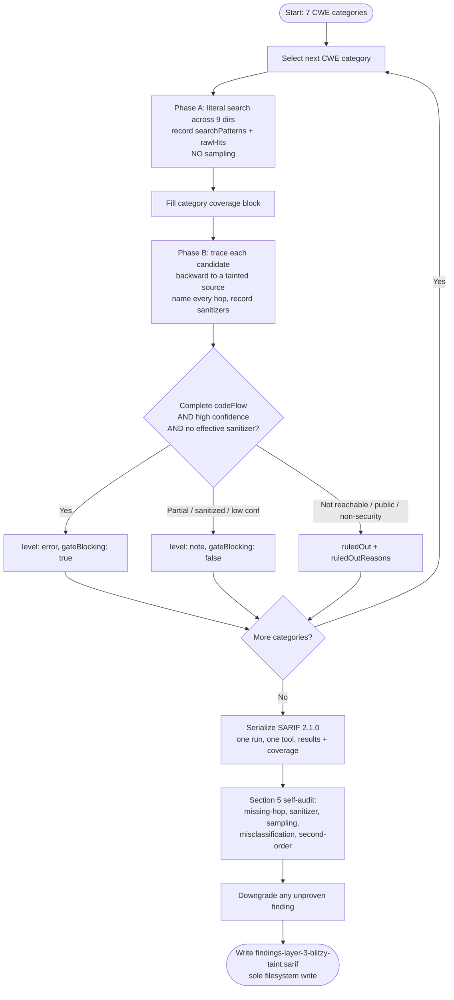

# Technical Specification

# 0. Agent Action Plan

## 0.1 Intent Clarification

### 0.1.1 Core Objective

Based on the provided requirements, the Blitzy platform understands that the objective is to perform an exhaustive, cross-file, source-to-sink **taint analysis** over the `blitzy-cal` repository — a Cal.com monorepo built on Yarn Berry and Turborepo — across **seven fixed CWE vulnerability classes**, and to emit the results as a single machine-readable artifact, `findings-layer-3-blitzy-taint.sarif` (valid SARIF 2.1.0), **without modifying any source file**.

This is a **read-only detection task**, not a remediation task. The deliverable is a static-analysis report that gates a downstream automated process; the platform reasons over the codebase to prove or disprove the reachability of untrusted input to dangerous sinks, and records the result. The seven in-scope vulnerability classes are fixed by the directive:

- **CWE-601** — URL Redirection to Untrusted Site (Open Redirect)
- **CWE-918** — Server-Side Request Forgery (SSRF)
- **CWE-117** — Improper Output Neutralization for Logs (Log Injection)
- **CWE-807** — Reliance on Untrusted Inputs in a Security Decision
- **CWE-338** — Use of Cryptographically Weak PRNG (in a security context)
- **CWE-843** — Access of Resource Using Incompatible Type (Type Confusion)
- **CWE-862** — Missing Authorization

The platform restates the requirement set with enhanced clarity below. Each requirement is assigned a stable identifier (R1–R9) and is traced to a concrete technical action in §0.3.

- **R1 — Detection-only / read-only:** No source file may be modified, created, or deleted; no refactoring, patching, or fixing is permitted. The only write operation is the production of `findings-layer-3-blitzy-taint.sarif`.
- **R2 — Coverage:** Every one of the nine required directories must be searched for each category; if a directory is intentionally skipped for a category, the reason must be stated in that category's coverage block.
- **R3 — Two-phase method:** Phase A enumerates every candidate call site via literal search and records exact patterns and raw hit counts; Phase B traces each candidate backward to a tainted source, naming every intermediate hop.
- **R4 — Precision gate:** Only fully-substantiated, high-confidence findings with a complete code flow are emitted as gate-blocking (`level: error`, `gateBlocking: true`); everything else is emitted as `level: note`, `gateBlocking: false`. A false positive is treated as worse than a miss.
- **R5 — Sanitizer-aware:** An effective sanitizer or validator on the path demotes a finding to a non-blocking note.
- **R6 — Second-order taint:** Database-laundered values (for example `subscriberUrl`, stored redirect/return URLs, routing-form field values) must be proven on **both** legs — the tainted write and the read-to-sink — or the finding is demoted.
- **R7 — Output contract:** The SARIF document must conform to the directive's structural contract (one run, one tool named `Blitzy-Taint-Layer3`, one result per finding, rule defined once per CWE, code-flow path locations, and the mandated `properties` on every result plus the per-category coverage block).
- **R8 — Self-audit before writing:** A five-point self-audit (missing-hop, sanitizer, sampling, misclassification, second-order) must run before the artifact is written, downgrading any insufficiently-proven finding.
- **R9 — Rule discipline:** Work proceeds strictly category-by-category; Phase A must be completed and the coverage block filled before Phase B begins for that category, and no category may begin until the previous one's coverage block is complete.

> **IMPORTANT — Scope of this section:** This document is the **Agent Action Plan** that interprets and plans the directive. Producing the SARIF artifact and executing the actual taint analysis is the downstream implementation activity; this section documents *how* that activity will be carried out, not the findings themselves.

### 0.1.2 Task Categorization

- **Primary task type:** Security enhancement — specifically a **security audit / static taint-analysis detection** task that is strictly read-only.
- **Secondary aspects:** Tooling / automation output — the deliverable is a SARIF artifact consumed by an automated **precision gate** that runs without human triage.
- **Scope classification:** **Cross-cutting**, repository-wide read-only analysis that produces exactly **one** new artifact file. It is explicitly *not* an infrastructure change and *not* a feature change; zero source code is modified.

### 0.1.3 Special Instructions and Constraints

The directive carries several non-negotiable directives that the platform captures verbatim in intent:

- **"Do not modify, create, or delete any source files in the repository. Do not refactor, patch, or fix anything you find. Your only write operation is producing the output file `findings-layer-3-blitzy-taint.sarif`."** — This is the controlling read-only constraint.
- **Precision-gate posture:** the output gates an automated process without human review, so only fully-substantiated, high-confidence findings may be gate-blocking; suspected-but-unproven candidates are recorded as non-blocking notes. **Under-reporting blocking findings is the intended failure mode.**
- **Anti-sampling rule:** phrases such as *"and similar patterns elsewhere"* or *"representative example"* are forbidden — Phase A must record every hit, not a sample.
- **Hard structural rule:** a result with an empty `codeFlows` array must never be `level: error` or `gateBlocking: true`.

These methodological requirements (two-phase per category, sanitizer-aware tracing, second-order both-legs proof, self-audit before write) are documented in full in §0.3 and §0.7.

### 0.1.4 Technical Interpretation

These requirements translate to the following technical implementation strategy. The mapping uses cause-and-effect language to connect each requirement to a concrete action.

- To **detect each CWE class** without sampling, the platform will run literal sink-pattern searches across the nine required directories (Phase A), recording the exact patterns and raw hit counts into the category's coverage block.
- To **prove exploitability**, the platform will trace each enumerated hit backward to an untrusted source (Phase B), naming every intermediate hop in a SARIF code flow.
- To **honor the precision gate**, the platform will record every sanitizer encountered and demote any path that passes through an effective control (for example, the open-redirect allowlist in `getSafeRedirectUrl` [packages/lib/getSafeRedirectUrl.ts:L5-L23]).
- To **classify each candidate**, the platform will assign it to one of three buckets — blocking `error`, non-blocking `note`, or `ruledOut` (with reasons) — and enforce the hard rule that empty code flows can never block.
- To **emit a gate-consumable artifact**, the platform will serialize all results and per-category coverage into SARIF 2.1.0, then run the five-point self-audit and downgrade insufficiently-proven findings before writing `findings-layer-3-blitzy-taint.sarif` at the repository root — the sole filesystem mutation.

## 0.2 Repository Scope Discovery

### 0.2.1 Comprehensive File Analysis

The directive mandates that **nine directories** be searched for every category. All nine were confirmed to exist in the monorepo, which is rooted at `apps/` and `packages/`. The table below records each required directory, its confirmed source-file count (`.ts`/`.tsx`/`.js`, excluding `node_modules`), and its role in the analysis. These counts establish the scale of the candidate surface and ground the per-category coverage blocks; they are illustrative of the search scope, while the implementing agent's exhaustive Phase A produces the authoritative raw-hit numbers.

| Required Directory | Source Files | Role in Analysis |
|--------------------|-------------:|------------------|
| `apps/web/` | 1,646 | Next.js front end and App/Pages route handlers — open-redirect, log-injection, and missing-authorization surface [apps/web/package.json:L110] |
| `apps/api/v1/` | 232 | Deprecated Next.js Pages API (port 3003) — type-confusion (`req.query`) and missing-authorization verb handlers [apps/api/v1/pages/api/] |
| `apps/api/v2/` | 954 | Active NestJS API (port 3004) — auth strategies, guard stack, loggers, filters [apps/api/v2/package.json:L53-L55] |
| `packages/features/` | 1,604 | Webhooks, routing forms, bookings — SSRF (`sendPayload`) and second-order taint surface |
| `packages/app-store/` | 850 | 111 top-level adapter directories — SSRF via provider callbacks and root URLs |
| `packages/embeds/` | 70 | Embed runtime and `postMessage` surface — open-redirect resource loads |
| `packages/trpc/` | 829 | tRPC routers and procedures — missing-authorization on mutations |
| `packages/lib/` | 286 | Shared utilities including the redirect sanitizer and the application logger [packages/lib/getSafeRedirectUrl.ts], [packages/lib/logger.ts] |
| `packages/prisma/` | 23 | Prisma schema and client — the persistence boundary for second-order taint |

The combined required surface is approximately **6,594 source files**. The per-category literal-search patterns, the raw hit counts that establish the candidate surface, and the specific seed locations are detailed in §0.3.2 (Category Impact Analysis).

A repository-wide search confirmed that **no `.blitzyignore` files exist**, so no path-pattern exclusions apply beyond the standard exclusion of `node_modules`. The output artifact `findings-layer-3-blitzy-taint.sarif` does **not** currently exist; it will be the sole file created.

### 0.2.2 Web Search Research Conducted

Because the deliverable must be consumed by an automated gate, the platform validated the **SARIF 2.1.0 output contract** against the authoritative OASIS specification before designing the serialization approach. The research confirmed:

- The top-level document shape is `{ $schema, version: "2.1.0", runs[] }`, where the authoritative schema is published at `docs.oasis-open.org/sarif/sarif/v2.1.0/errata01/os/schemas/sarif-schema-2.1.0.json`.
- Rule metadata lives once in `run.tool.driver.rules[]` as `reportingDescriptor` objects, and each `result` references its rule by `ruleId` — exactly the directive's "rule defined once per CWE" contract.
- A taint path is encoded as `result.codeFlows[].threadFlows[].locations[]`, a temporally ordered list of `threadFlowLocation` objects (source → hops → sink), each carrying a `location.physicalLocation` with an `artifactLocation.uri` and a `region`.
- The `level` enumeration is `error | warning | note | none`; the directive deliberately uses only `error` (blocking) and `note` (non-blocking), with no `warning` tier.
- Arbitrary `properties` bags are permitted on both `result` and `run`, which is where the mandated `gateBlocking`, `confidence`, `sanitizersEncountered`, `exploitScenario`, `intermediateHopsSummary`, and the per-category `coverage` block are carried.

This confirms the directive's field mapping is schema-valid and that a single-run, single-tool document with code-flow-backed results is the correct structure.

### 0.2.3 Existing Infrastructure Assessment

The codebase already implements several security controls that are decisive for sanitizer-aware classification. Recognizing them is what allows the platform to demote sanitized paths to non-blocking notes rather than over-reporting them as blocking.

- **Open-redirect sanitizer.** `getSafeRedirectUrl` [packages/lib/getSafeRedirectUrl.ts:L5-L23] throws if the URL is not an absolute `http(s)` URL, parses it, and overwrites it to `` `${WEBAPP_URL}/` `` when the origin is not in the `[CONSOLE_URL, WEBAPP_URL, WEBSITE_URL]` allowlist — an effective control. A companion, `isSafeUrlToLoadResourceFrom` [packages/lib/getSafeRedirectUrl.ts:L26-L50], enforces an `http/https` + TLD+1 allowlist for embed resource loads and is intentionally duplicated at `packages/embeds/embed-core/src/preview.ts`.
- **Log masking.** The shared tslog logger configures `maskValuesOfKeys` for `password`/`credentials` keys only [packages/lib/logger.ts:L7]; CRLF/newline injection into *other* logged fields is therefore not neutralized and remains the CWE-117 target. The NestJS API additionally uses a Winston logger [apps/api/v2/src/lib/logger.ts] and an HTTP logging middleware [apps/api/v2/src/middleware/app.logger.middleware.ts], with exception filters under `apps/api/v2/src/filters/`.
- **Authorization stack (CWE-807/862).** The NestJS API centralizes credential evaluation in a composite auth strategy [apps/api/v2/src/modules/auth/strategies/api-auth/api-auth.strategy.ts] and enforces access via a guard stack — `api-auth`, `pbac`, `roles`, `optional-api-auth`, `organization-roles`, and webhook-specific guards (`is-user-webhook`, `is-team-event-type-webhook`, `is-oauth-client-webhook`, `is-user-event-type-webhook`), plus `apps/api/v2/src/vercel-webhook.guard.ts` and `apps/api/v2/src/ee/bookings/2024-08-13/guards/booking-pbac.guard.ts`. Presence of an appropriate guard is the primary signal that demotes a CWE-862 candidate.
- **Webhook signing (CWE-807/918).** HMAC-SHA256 signing using the `X-Cal-Signature-256` header is implemented in the webhook dispatcher [packages/features/webhooks/lib/sendPayload.ts]; the same dispatcher's `subscriberUrl` handling is the primary second-order SSRF surface.
- **Secure PRNG baseline (CWE-338).** `crypto.randomBytes` is present in the codebase and represents the correct secure-random pattern against which `Math.random` uses are contrasted; a `Math.random` call is only a finding when it feeds a security-sensitive value.

These controls, the directory inventory, and the SARIF research collectively confirm that the directive's two-phase precision-gate methodology is well-matched to the codebase and can be executed without any environment build or dependency installation.

## 0.3 Implementation Design

### 0.3.1 Technical Approach

The platform will execute a **per-category, two-phase loop**, processing exactly one CWE class at a time in obedience to the rule discipline (R9). The logical flow — which is an order of operations, not a schedule — is:

- **First**, establish coverage for the current category by running every literal sink-pattern search across the nine required directories (Phase A), recording the exact `searchPatterns` and `rawHits` into that category's coverage block. No sampling is permitted.
- **Next**, prove reachability by tracing each enumerated candidate backward to an untrusted source (Phase B), naming every intermediate hop and recording every sanitizer encountered along the way.
- **Then**, classify each surviving candidate into one of three buckets — blocking `error`, non-blocking `note`, or `ruledOut` (with explicit reasons).
- **Only after** the current category's coverage block is complete does the loop advance to the next CWE class.
- **Finally**, once all seven categories are processed, serialize all results plus the per-category coverage into a single SARIF 2.1.0 document, run the five-point self-audit, downgrade any insufficiently-proven finding, and write `findings-layer-3-blitzy-taint.sarif` at the repository root — the only filesystem mutation.

### 0.3.2 Category Impact Analysis

Each CWE class has a distinct source set, sink seed locations, known controls, and second-order considerations. The table maps all seven. "Sink seeds" are the verified starting points for Phase A; "Controls / sanitizers" are the existing mitigations that, when present on a path, demote a finding per R5.

| CWE | Untrusted Sources | Sink Seed Locations | Controls / Sanitizers (demote) | Second-Order Leg |
|-----|-------------------|---------------------|--------------------------------|------------------|
| **601 Open Redirect** | redirect / `callbackUrl` / `returnTo` query params, OAuth callback params, SAML `RelayState`/assertion fields | `res.redirect`, `NextResponse.redirect`, `window.location`, `getSafeRedirectUrl` callers, [apps/web/app/api/auth/oauth/token/route.ts], [apps/web/app/api/auth/saml/authorize/route.ts], [apps/api/v2/src/modules/auth/oauth2/], booking/post-login return URLs | `getSafeRedirectUrl` allowlist [packages/lib/getSafeRedirectUrl.ts:L5-L23] | stored redirect/return URLs |
| **918 SSRF** | `subscriberUrl`, user-supplied URLs, app-store adapter root URLs, `/api/router` proxy target, embed prerender URL | `fetch` / `axios` / `node-fetch` callers, [packages/features/webhooks/lib/sendPayload.ts], [packages/features/webhooks/lib/handleWebhookScheduledTriggers.ts], app-store adapters (Office365 subscribe, Google callback, CalDAV root URL), Trigger.dev/Vercel webhook | URL validation/allowlist where present | `subscriberUrl` persisted then read-to-`fetch` (both legs) |
| **117 Log Injection** | HTTP params/headers/body logged unsanitized | `console.*` / `logger.*` calls, [apps/api/v2/src/middleware/app.logger.middleware.ts], `RequestIdMiddleware`, [apps/api/v2/src/filters/], `sendPayload` logging | tslog `maskValuesOfKeys` — password/credentials only [packages/lib/logger.ts:L7] | stored values later logged |
| **807 Auth Decision on Input** | API key header, `X-Cal-Signature-256` header, body fields driving auth | [apps/api/v2/src/modules/auth/strategies/api-auth/api-auth.strategy.ts] (5 auth-method branches, `isApiKey`/`cal_` prefix), webhook HMAC verify, Vercel/BTCPay guards, PBAC checks | HMAC-SHA256 signature verification | n/a |
| **338 Weak PRNG** | n/a (misuse of `Math.random`) | `Math.random` feeding tokens/secrets/nonces/reset codes; contrast `crypto.randomBytes` | use of `crypto.randomBytes` is the secure baseline | n/a |
| **843 Type Confusion** | `apps/api/v1` `req.query.*` (`string \| string[]`) | API v1 Pages handlers mishandling array-vs-string [apps/api/v1/pages/api/] | explicit narrowing/`Array.isArray` checks | n/a |
| **862 Missing Authz** | n/a (absence of a check) | v1 verb handlers (`_post`/`_patch`/`_delete`/`_get`), v2 endpoints missing `@UseGuards`, tRPC mutations missing `authedProcedure` | presence of an appropriate guard / authed procedure | n/a |

Two categories carry explicit **misclassification guards** flagged by the directive's self-audit: for **CWE-338**, a `Math.random` call used for non-security purposes (UI jitter, sampling, animation) must be recorded in `ruledOut`, not flagged; for **CWE-862**, intentionally-public endpoints must be recorded in `ruledOut` with a reason, not flagged as missing authorization.

### 0.3.3 User-Provided Examples Integration

The directive supplies concrete seed locations that anchor the analysis. These are preserved verbatim and mapped to their role:

- **User-provided seed (CWE-601):** `getSafeRedirectUrl` and its callers, the OAuth token route, the SAML authorize route, and the v2 `oauth2` module → these become the first Phase-A targets for open-redirect, with `getSafeRedirectUrl` recognized as the demoting sanitizer.
- **User-provided seed (CWE-918):** `sendPayload.ts` (`subscriberUrl`), `handleWebhookScheduledTriggers.ts`, the `/api/router` proxy, embed prerender, and named app-store adapters (Office365 `subscribeToChanges`, Google callback, CalDAV root URL) → these define the SSRF sink frontier, including the second-order `subscriberUrl` flow.
- **User-provided seed (CWE-807):** the composite `ApiAuthStrategy` with its five auth-method branches and the `isApiKey` / `cal_` prefix check → the focal point for security-decision-on-input analysis.
- **User-provided seed (CWE-862):** the v1 verb handlers and the v2 guard stack (`ApiAuthGuard`, `PbacGuard`, `RolesGuard`, `IsUserWebhookGuard`) plus tRPC mutations → the missing-authorization candidate surface.

### 0.3.4 Critical Implementation Details

- **Classification logic (the precision gate).** A candidate is emitted as `level: error` / `gateBlocking: true` **only** when it has a complete, proven `codeFlow` from a §1 source to a sink, `confidence: high`, and no effective sanitizer on the path. Any incomplete hop, any effective sanitizer, or any confidence below `high` forces `level: note` / `gateBlocking: false`. The **hard rule** is enforced structurally: a result whose `codeFlows` is empty can never be `error`/`gateBlocking: true`.
- **Required result properties.** Every `result` object carries `gateBlocking`, `exploitScenario`, `confidence` (`high|medium|low`), `sanitizersEncountered` (an array that is never omitted — empty when none), and `intermediateHopsSummary`.
- **Per-category coverage block.** `run.properties.coverage` records, for each CWE, the `searchPatterns` with `rawHits`, the `directoriesSearched`, `candidatesAfterTriage`, `blockingFindings`, `nonBlockingNotes`, `ruledOut`, and `ruledOutReasons` — the auditable evidence that Phase A was exhaustive.
- **Second-order proof obligation.** For DB-laundered values, both the tainted-write leg and the read-to-sink leg must appear as ordered locations in the same code flow; if either leg is missing, the finding is demoted.
- **Self-audit before write.** The five-point pass (missing-hop, sanitizer, sampling, misclassification with emphasis on CWE-338/862, and second-order) runs against the assembled result set, and any finding that fails a check is downgraded prior to serialization.
- **Determinism.** The artifact is a single SARIF run with one tool (`Blitzy-Taint-Layer3`) and one result per finding, with each CWE rule defined exactly once in `tool.driver.rules`, producing a stable, gate-consumable document.

## 0.4 File Transformation Mapping

### 0.4.1 File-by-File Execution Plan

Because this is a read-only detection task, the transformation map is deliberately asymmetric: there is exactly **one** `CREATE` (the SARIF artifact) and **no** `UPDATE` or `DELETE` anywhere. Every directory and file listed below is consumed as a **`REFERENCE`** (read-only analysis input). The transformation modes used are:

- **CREATE** — create a new file
- **REFERENCE** — read and analyze as an input; never modified

| Target File | Transformation | Source File / Reference | Purpose / Changes |
|-------------|----------------|-------------------------|-------------------|
| `findings-layer-3-blitzy-taint.sarif` | CREATE | — (assembled from the analysis of all referenced inputs) | The sole deliverable: a valid SARIF 2.1.0 document with one run, one tool (`Blitzy-Taint-Layer3`), one result per finding, seven CWE rules, code-flow paths, required result properties, and the per-category `run.properties.coverage` block |
| `apps/web/` | REFERENCE | `apps/web/` | Analyze route handlers and client code for CWE-601, CWE-117, CWE-862 |
| `apps/api/v1/` | REFERENCE | `apps/api/v1/pages/api/` | Analyze deprecated Pages API verb handlers for CWE-843 (`req.query` typing) and CWE-862 |
| `apps/api/v2/` | REFERENCE | `apps/api/v2/` | Analyze NestJS auth strategy, guard stack, loggers, and filters for CWE-807, CWE-862, CWE-117 |
| `packages/features/` | REFERENCE | `packages/features/webhooks/lib/sendPayload.ts`, `handleWebhookScheduledTriggers.ts` | Analyze webhooks/routing-forms for CWE-918 (incl. second-order `subscriberUrl`) and CWE-117 |
| `packages/app-store/` | REFERENCE | `packages/app-store/` (111 adapters) | Analyze provider adapters for CWE-918 (callback URLs, root URLs) |
| `packages/embeds/` | REFERENCE | `packages/embeds/embed-core/src/preview.ts` | Analyze embed runtime / `postMessage` for CWE-601 resource loads |
| `packages/trpc/` | REFERENCE | `packages/trpc/` | Analyze tRPC mutations for CWE-862 |
| `packages/lib/` | REFERENCE | `packages/lib/getSafeRedirectUrl.ts`, `packages/lib/logger.ts` | Recognize the redirect-allowlist sanitizer and the log-masking control |
| `packages/prisma/` | REFERENCE | `packages/prisma/` | Establish the persistence boundary for second-order taint (write/read legs) |
| `apps/web/app/api/auth/oauth/token/route.ts` | REFERENCE | same | CWE-601 seed — OAuth token redirect handling |
| `apps/web/app/api/auth/saml/authorize/route.ts` | REFERENCE | same | CWE-601 seed — SAML authorize redirect / `RelayState` |
| `apps/api/v2/src/modules/auth/oauth2/` | REFERENCE | same | CWE-601 seed — v2 OAuth2 redirect handling |
| `apps/api/v2/src/modules/auth/strategies/api-auth/api-auth.strategy.ts` | REFERENCE | same | CWE-807 seed — composite credential evaluation |
| `apps/api/v2/src/middleware/app.logger.middleware.ts` | REFERENCE | same | CWE-117 seed — HTTP request logging |
| `apps/api/v2/src/filters/` | REFERENCE | same | CWE-117 seed — exception-filter logging |
| `apps/api/v2/src/lib/logger.ts` | REFERENCE | same | CWE-117 seed — Winston logger configuration |

> Wildcard note: a directory row (for example `apps/api/v2/`) denotes recursive read-only analysis of all source files beneath it; the named file rows below it call out the specific seed locations that anchor Phase A. No file under any referenced directory is modified.

### 0.4.2 New Files Detail

- **`findings-layer-3-blitzy-taint.sarif`** — the single new file, written at the repository root.
  - Content type: machine-readable static-analysis report (JSON, SARIF 2.1.0).
  - Based on: the OASIS SARIF 2.1.0 schema (`docs.oasis-open.org/sarif/sarif/v2.1.0/.../sarif-schema-2.1.0.json`) and the directive's output contract.
  - Key sections: `$schema` + `version`; `runs[0].tool.driver` (name `Blitzy-Taint-Layer3` + seven CWE `rules`); `runs[0].results[]` (one per finding, each with `ruleId`, `level`, `message`, `locations`, `codeFlows`, and required `properties`); `runs[0].properties.coverage` (one block per CWE category).

### 0.4.3 Files to Modify and Cross-File Dependencies

- **Files to modify:** none. The read-only mandate (R1) prohibits any `UPDATE` or `DELETE`. No source file, manifest, lockfile, configuration, or test is altered.
- **Cross-file dependencies:** none introduced. No imports, references, or configuration are added or rewired. The only cross-file relationship that matters is *analytical* — second-order taint requires correlating a write site and a read site (for example, the `subscriberUrl` persistence in `packages/prisma/` with the `fetch` in [packages/features/webhooks/lib/sendPayload.ts]) — but this correlation is recorded in the SARIF code flow, not by changing any file.

## 0.5 Scope Boundaries

### 0.5.1 Exhaustively In Scope

- **Analysis surface — the nine required directories** (each searched for every category):
    - `apps/web/**`
    - `apps/api/v1/**`
    - `apps/api/v2/**`
    - `packages/features/**`
    - `packages/app-store/**` (all 111 adapter directories)
    - `packages/embeds/**`
    - `packages/trpc/**`
    - `packages/lib/**`
    - `packages/prisma/**`
- **All named seed locations** per CWE: `getSafeRedirectUrl` and its callers, the OAuth token and SAML authorize routes, the v2 `oauth2` module, `sendPayload.ts` / `handleWebhookScheduledTriggers.ts`, the `/api/router` proxy, the named app-store adapters, the loggers / logging middleware / exception filters, `api-auth.strategy.ts` and the guard stack, the v1 verb handlers, the tRPC mutations, and the `Math.random` vs `crypto.randomBytes` sites.
- **The seven CWE classes only:** CWE-601, CWE-918, CWE-117, CWE-807, CWE-338, CWE-843, CWE-862.
- **Both taint orders:** first-order (request → sink) and second-order (DB-laundered: `subscriberUrl`, stored redirect/return URLs, routing-form field values), with both legs required for the latter.
- **The single output artifact:** `findings-layer-3-blitzy-taint.sarif` (CREATE), including its per-category coverage blocks and `ruledOut` documentation.

### 0.5.2 Explicitly Out of Scope

- **Any source-code change:** refactoring, patching, fixing, remediation, or creating/deleting source files. Detection only — no fixes are produced (R1).
- **CWE classes outside the seven listed.** Other weakness types are not analyzed or reported, even if incidentally observed.
- **Build, compile, run, test, or deploy steps**, and **dependency installation** — none are required to produce the SARIF, and none are performed.
- **`node_modules` and other vendored/generated artifacts** (standard analysis exclusion). No `.blitzyignore` exists, so no additional path exclusions apply.
- **Emitting unproven findings as blocking.** Per the hard rule, a result with empty `codeFlows` is never `error`/`gateBlocking: true`; such candidates are demoted to notes, not dropped silently.
- **Flagging intentionally-public endpoints (CWE-862)** or **non-security `Math.random` uses (CWE-338).** These are recorded in `ruledOut` with reasons rather than reported as findings.
- **Modifying the technical specification or any document other than the SARIF artifact** as part of the detection task itself.

## 0.6 Dependency Inventory

### 0.6.1 Dependency Changes

There are **no dependency changes** of any kind. This is a read-only detection task whose sole artifact is a SARIF file: **no packages are added, updated, or removed**, and no manifest or lockfile (for example `package.json` or `yarn.lock`) is touched. There are correspondingly no new dependencies, no version bumps, no removals, and no import/reference rewrites.

### 0.6.2 Runtime and Tooling Context (Reference Only)

The following versions are documented purely to ground the analysis and the citations in this plan; **none of them is installed, modified, or required** to perform the detection or to emit the SARIF output.

| Registry | Package / Runtime | Version | Role (context only) |
|----------|-------------------|---------|---------------------|
| — | Node.js | 20.20.2 (engines ≥18.x) | Monorepo runtime [package.json:L170] |
| npm | yarn (Berry) | 4.12.0 | Package manager [package.json:L178] |
| npm | turbo (Turborepo) | 2.7.1 | Monorepo task runner |
| npm | typescript | 5.9.3 (strict) | Language / type system [package.json:L115] |
| npm | next | 16.1.7 | `apps/web` framework [apps/web/package.json:L110] |
| npm | @nestjs/core | 10.4.20 | `apps/api/v2` framework [apps/api/v2/package.json:L53-L55] |
| npm | @prisma/client / prisma | 6.16.1 | ORM / persistence boundary [packages/prisma/package.json:L27-L30] |
| npm | zod | 3.25.76 | Validation library (relevant to sanitizer recognition) |

No additional tooling or runtime is installed to perform the analysis. The implementing agent reasons over the source files directly and serializes findings; it does not execute the application or a separate analysis engine.

## 0.7 Rules and Special Instructions

### 0.7.1 User-Specified Rule (Verbatim)

One implementation rule was supplied for this project. It is preserved exactly as given:

> **CAL Layer 3 Project Rule:** "Work category by category. For each of the 7 CWE categories, complete Phase A (search + record every hit) fully before starting Phase B. Do not move to the next category until the current one's coverage block is filled. If you cannot complete a category, say so explicitly rather than summarizing or sampling. Produce only the SARIF file - change no source code."

This rule is fully consistent with the directive and tightens it in three ways, all of which govern execution:

- **Sequential, category-by-category execution** is mandatory — categories are not processed in parallel. Phase A must be complete and the coverage block filled before Phase B begins for that category, and the next category cannot start until the current coverage block is filled.
- **Honesty over completeness** — if a category cannot be completed, that fact is stated explicitly; the work is never summarized or sampled to appear complete.
- **Read-only / SARIF-only output** — the only artifact produced is `findings-layer-3-blitzy-taint.sarif`; no source code is changed. This restates the directive's read-only constraint with no conflict.

### 0.7.2 Methodological Requirements (from the Directive)

- **Two-phase per category (R3):** Phase A enumerates every call site via literal search and records exact patterns and raw hit counts (no sampling); Phase B traces each candidate backward to a source, names every hop, and records every sanitizer.
- **Precision-gate posture (R4):** only fully-substantiated, high-confidence findings with a complete code flow are `error`/`gateBlocking: true`; everything else is `note`/`gateBlocking: false`. A false positive is worse than a miss; under-reporting blocking findings is the intended failure mode.
- **Sanitizer-aware (R5):** an effective control on the path (for example, `getSafeRedirectUrl` [packages/lib/getSafeRedirectUrl.ts:L5-L23]) demotes a finding.
- **Second-order both-legs proof (R6):** DB-laundered taint must show both the write and the read-to-sink in the same code flow, or it is demoted.
- **Self-audit before write (R8):** the five checks — missing-hop, sanitizer, sampling, misclassification (with emphasis on CWE-338 and CWE-862), and second-order — run before serialization, downgrading any finding that fails.

### 0.7.3 Output and Process Constraints

- **Documentation-of-detection only:** the task generates a detection report; it does not generate fixes, tests, configuration, or any other code.
- **Output contract (R7):** SARIF 2.1.0; one run; one tool (`Blitzy-Taint-Layer3`); one result per finding; `ruleId` = CWE; each rule defined once in `tool.driver.rules`; `level` limited to `error` and `note` (no `warning` tier); required `properties` on every result (`gateBlocking`, `exploitScenario`, `confidence`, `sanitizersEncountered[]`, `intermediateHopsSummary`); per-category `run.properties.coverage` block.
- **Hard structural rule:** a result with an empty `codeFlows` array must never be `error` or `gateBlocking: true`.
- **No environment side effects:** no build, run, test, deploy, or dependency install is performed.

## 0.8 Attachments

### 0.8.1 Provided Attachments

- **`blitzy-layer-3-taint-prompt.md.pdf`** (application/pdf, 527,212 bytes, 7 pages) — the Layer 3 security-audit directive, titled *"Directive: Execute Layer 3 — Taint Analysis (Blitzy)."* Its content is the PDF rendering of the user's prompt and is **identical** to it; it introduces no new or conflicting information. The document specifies: the read-only, detection-only mandate; the precision-gate posture; the seven CWE classes (601, 918, 117, 807, 338, 843, 862); the untrusted-source taxonomy (§1, including second-order DB-laundered taint); the mandatory two-phase methodology (§2, Phase A enumerate / Phase B trace, with the anti-sampling rule); the nine required directories and the per-category sink seed locations (§3); the SARIF 2.1.0 output contract (§4, including the required result properties and the per-category coverage block); and the five-point self-audit to run before writing (§5).

### 0.8.2 Figma Screens

- None provided. No Figma frames or design-system references accompany this task, so no design-to-system mapping or UI design analysis applies.

