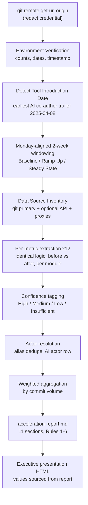

# Technical Specification

# 0. Agent Action Plan

## 0.1 Intent Clarification

This section restates the user's request in precise technical language, surfaces the implicit requirements that the request entails, and translates each objective into a concrete action. The work described here is a **read-only Development Acceleration Measurement** performed against the repository resolved by `git remote get-url origin`, which is the Cal.com‑derived scheduling monorepo `blitzy-cal` `[git remote:origin]`. The repository is a Yarn Berry + Turborepo monorepo `[package.json:workspaces]` with approximately 16,880 commits on `main` spanning 2021‑03‑10 to 2026‑05‑15 `[git history:rev-list main]`.

### 0.1.1 Core Objective

Based on the provided requirements, the Blitzy platform understands that the objective is to **quantify the development‑velocity acceleration attributable to the introduction of AI engineering tooling** in the `blitzy-cal` repository, by extracting twelve flow and operational metrics from version‑control history and ancillary engineering data sources, computing each metric as an *after ÷ before* ratio split at a detected **Tool Introduction Date**, and publishing the results as two deliverables: a traceable technical report (`acceleration-report.md`) and a self‑contained executive presentation (a reveal.js HTML file).

The explicit requirements, restated with enhanced clarity:

- **Repository discovery** — Identify the subject repository through `git remote get-url origin` and analyze the entire commit window (earliest commit through most recent) `[git history:rev-list main]`.
- **Tool Introduction Date detection** — Determine the pivot date that separates the *baseline* (before) period from the *accelerated* (after) period using the earliest `Co-authored-by:` AI trailer in commit history, corroborated by the sharpest sustained commit‑velocity inflection.
- **Twelve‑metric extraction** — Compute the following frozen metric set, each as an after‑vs‑before comparison: (1) Flow Load, (2) Flow Velocity, (3) Flow Predictability, (4) Flow Active Time, (5) Flow Efficiency, (6) Flow Distribution, (7) Flow Time, (8) Problem Records in Release (revert commits), (9) Releases, (10) Approved Exceptions, (11) Escaped Defects (newly skipped/failed tests), and (12) Defects Out of SLA.
- **Engineering‑actor framing** — In the after period, the AI tool is treated as an engineering *actor* that authors code on pull requests while humans review; working‑time metrics (4, 5) are computed from the actor's perspective, and actor‑aggregated metrics (2, 4, 5, 6, 10) include the AI actor as one row. Identical extraction logic is applied to both periods with only the date range and actor substituted.
- **Temporal phase analysis** — Segment the after period into *Ramp‑Up* (first 90 days post‑introduction) and *Steady State* (90+ days), against the *Baseline*; bucket all time series into two‑week windows aligned to Monday starts.
- **Confidence model** — Tag every derived metric High (direct issue‑tracker counts), Medium (git commit patterns), or Low (indirect proxies), per the actual data source used.
- **Multi‑module analysis** — Run extraction per workspace/module and aggregate weighted by commit volume, because the subject is a multi‑workspace monorepo `[package.json:workspaces]`.
- **Two deliverables** — Produce `acceleration-report.md` (eleven mandated sections including per‑metric before/after multipliers, per‑engineer breakdowns, a requirements traceability matrix, an acceleration curve, and a reproducibility appendix) and, per the user‑specified rule, a standalone reveal.js executive presentation.

Implicit requirements surfaced from the request:

- **Credential redaction** — The `origin` URL embeds an access credential; it must be scrubbed everywhere it is reported `[git remote:origin]`.
- **Actor identity resolution** — The per‑engineer breakdown requires mapping commit author identities to real engineers and de‑duplicating aliases and bot accounts before aggregation.
- **Tool‑attribution reconciliation** — Two AI signals coexist in the history: Devin (earliest co‑author trailer, 2025‑04‑08) and Blitzy (`agent@blitzy.com`, first appearing 2026‑02‑25). The pivot uses the earliest AI trailer; the after‑period actor population is the full AI cohort with Blitzy as one actor row. This ambiguity must be disclosed in the report's Limitations.
- **Deterministic windowing** — A single Monday‑aligned two‑week windowing function must be reused identically across both periods and all metrics to keep comparisons valid.
- **Graceful gap handling** — Where a data source is unavailable, the value must be reported as "Insufficient signal — [reason]" rather than estimated.
- **Cross‑deliverable consistency** — Every number on the presentation must equal the corresponding number in the report.

Dependencies and prerequisites: a working `git` toolchain and a numeric/scripting runtime are required for extraction and windowing math; both are present in the analysis environment (`git` 2.43.0, `python3` 3.12.3) `[analysis-environment:toolchain]`. Optional GitHub API tooling (`gh`/`jq`) is absent and, if needed for higher‑confidence metrics, would require installation plus an authentication token.

### 0.1.2 Task Categorization

- **Primary task type:** Documentation / Reporting — the deliverables are an analytics report and an executive presentation, not application code.
- **Secondary aspects:** Data analysis and metrics engineering (git‑history mining and ratio derivation); data visualization (an acceleration curve plus KPI and Mermaid slides); and design‑system‑compliant front‑end authoring (a reveal.js HTML deck).
- **Scope classification:** Additive, output‑only change — two net‑new files are created and **zero** existing repository files are modified or deleted. The change draws on **cross‑cutting, read‑only analysis** that spans the full ~5.2‑year history and every workspace, but its write footprint is isolated to the two deliverables.

### 0.1.3 Special Instructions and Constraints

The request carries several non‑negotiable directives, captured here and formalized in §0.8 (Rules) and §0.9 (Special Instructions):

- **Read‑only on the analyzed system** — The repository, its git history, and all external systems must not be modified.
- **No fabrication** — Values may not be estimated, extrapolated, or invented; missing data is reported as "Insufficient signal."
- **Frozen metric set** — Exactly the twelve metrics above; no additional metrics are introduced.
- **Identical methodology** — The same window alignment and extraction logic are used for the before and after periods, differing only in date range.
- **Factual‑neutral report tone** — The report body must contain zero subjective qualifiers.
- **Dual‑deliverable mandate** — The reveal.js executive presentation is always included, independent of any other documentation.
- **Web search requirement** — Methodology research (flow‑metric definitions and extraction conventions) was conducted to ground the approach; see §0.2.

User‑provided examples are preserved where they constrain implementation. The twelve metric names and their intended data signals (listed in §0.1.1) are preserved exactly as specified, as is the temporal‑phase definition (Ramp‑Up = first 90 days; Steady State = 90+ days) and the two‑week Monday‑aligned windowing requirement.

### 0.1.4 Technical Interpretation

These requirements translate to the following technical implementation strategy. Each requirement is mapped to a concrete action using cause‑and‑effect language (HOW, not WHEN):

| Requirement | Technical Action |
|-------------|------------------|
| Discover the subject repository | To identify the subject, we will run `git remote get-url origin`, redact the embedded credential, and capture repository identity facts `[git remote:origin]` |
| Establish a verifiable environment | To satisfy Environment‑First provenance, we will capture git version, commit/branch/tag counts, submodule state, date range, and an extraction timestamp before any metric is computed `[git history:rev-list/branch/tag]` |
| Detect the Tool Introduction Date | To split before/after, we will extract the earliest AI `Co-authored-by:` trailer (2025‑04‑08, Devin) and corroborate with the commit‑velocity inflection `[git log:Co-authored-by]` |
| Bucket time consistently | To keep comparisons valid, we will create a deterministic Monday‑aligned two‑week windowing function and classify after‑period windows into Ramp‑Up / Steady State |
| Extract each of the 12 metrics | To populate the metric set, we will run identical per‑module extraction commands over the before and after ranges and tag each result with a confidence level |
| Frame the AI actor | To honor actor framing, we will substitute the actor (human in baseline, AI cohort in after) in actor‑aggregated and working‑time metrics |
| Aggregate the monorepo | To reflect the multi‑module layout, we will compute per‑workspace results and aggregate weighted by commit volume `[package.json:workspaces]` |
| Assemble the report | To deliver `acceleration-report.md`, we will compose the eleven mandated sections and enforce the six report‑internal rules |
| Build the presentation | To deliver the executive deck, we will create a self‑contained reveal.js HTML file whose KPI values are drawn from the report's verified numbers |

## 0.2 Repository Scope Discovery

This section documents the exhaustive discovery of every data source the measurement will read, the research conducted to ground the methodology, and an assessment of the existing engineering infrastructure that shapes confidence levels and proxy selection. All paths below were validated to exist in the working tree; no source listed here is modified by the task (every entry is a read‑only input).

### 0.2.1 Comprehensive File Analysis

The data sources required to populate the twelve metrics were located by category. Each source is annotated with the metric(s) it feeds.

**Primary source — Git history (feeds metrics 1–9, 11):**

- The full commit DAG of `main` — 16,880 commits, 27 branches, **0 tags**, 2021‑03‑10 → 2026‑05‑15, no submodules `[git history:rev-list/branch/tag]`. Co‑author trailers, conventional‑commit subjects, author identities, timestamps, and revert markers are all extractable directly.

**Release / changelog sources (feed metrics 8, 9):**

- `.changeset/config.json` — declares the changelog generator `@changesets/changelog-github` pointing at `calcom/cal.com`, `baseBranch: main`, and `privatePackages.tag: false` `[.changeset/config.json:changelog]` `[.changeset/config.json:privatePackages]`. The `tag: false` setting, combined with the observed **0 git tags**, confirms releases in this fork are not tag‑driven.
- `.changeset/tender-birds-think.md` — a pending changeset entry `[.changeset/tender-birds-think.md]`.
- No root `CHANGELOG` file exists `[repo-root:CHANGELOG(absent)]`.
- Release workflows: `.github/workflows/draft-release.yml`, `re-draft.yml`, `post-release.yml`, `release-docker.yaml`, and `changesets.yml` `[.github/workflows/draft-release.yml]`.

**Test / CI sources (feed metric 11 and confidence assessment):**

- Workflows: `all-checks.yml`, `unit-tests.yml`, `api-v2-unit-tests.yml`, `integration-tests.yml`, `e2e.yml`, `e2e-api-v2.yml`, `e2e-app-store.yml`, `e2e-atoms.yml`, `e2e-embed.yml`, `e2e-embed-react.yml`, `e2e-report.yml`, `performance-tests.yml`, `security-audit.yml` `[.github/workflows/all-checks.yml]`.
- Test configuration: `vitest.workspace.ts`, `playwright.config.ts`, `apps/api/v2/jest.config.ts`, `apps/api/v2/jest-e2e.ts` `[vitest.workspace.ts]` `[playwright.config.ts]`.
- CI emits JUnit XML (`./test-results/junit.xml` for Jest, `./test-results/reports/results.xml` for Playwright), but blob report artifacts are retained only ~30 days `[blitzy-docs/technical-specifications.md:§6.6]`, so historical CI test results are unavailable across the multi‑year window.

**Tool‑introduction corroboration — Devin AI workflows:**

- `cubic-devin-review.yml`, `cubic-devin-review-trigger.yml`, `devin-conflict-resolver.yml`, `stale-pr-devin-completion.yml`, `sync-agents-to-devin.yml` `[.github/workflows/cubic-devin-review.yml]`. The technical specification independently classifies these as a dedicated "Devin AI Integration Workflows" category `[blitzy-docs/technical-specifications.md:§3.6.7.2]`.

**Distribution / label / actor sources (feed metrics 6, 10, and per‑engineer view):**

- `.github/labeler.yml` (auto‑labeling), `.github/ISSUE_TEMPLATE/{bug_report.md, feature_request.md, config.yml}`, `.github/PULL_REQUEST_TEMPLATE.md`, `.github/CODEOWNERS` `[.github/labeler.yml]` `[.github/CODEOWNERS]`. Note: `CODEOWNERS` exempts test files from review `[blitzy-docs/technical-specifications.md:§6.6]`, which affects "ready‑for‑review" detection in working‑time metrics.

**SLA / severity source (feeds metric 12):**

- **None found.** No dedicated SLA, severity‑policy, or runbook file exists in the repository; severity/SLA timestamps would require an issue‑tracker API. Metric 12 is therefore expected to resolve to "Insufficient signal — no SLA data source."

**Project‑context documents (interpretive context, not metric data):**

- `blitzy-docs/project-guide.md` (the Cal.com Calendly‑Parity project guide), `blitzy-docs/technical-specifications.md` (this specification), and `AGENTS.md` (engineering conventions, including a 5–7 file / 500‑line PR‑size guideline) `[AGENTS.md]` `[blitzy-docs/project-guide.md]`.

### 0.2.2 Web Search Research Conducted

Research was performed to validate the metric methodology and to confirm the standard definitions used by the report's Methodology section:

- **Flow‑metric definitions and conventions** — Metrics 1–7 align to the Flow Framework, formalized by Mik Kersten in *Project to Product* (2018), which defines Flow Velocity, Flow Time, Flow Efficiency, Flow Load, and Flow Distribution; the Scaled Agile Framework (SAFe) adds a sixth metric, Flow Predictability. Confirmed definitions: Velocity = completed items per period; Time = start→finish including wait; Efficiency = active ÷ total time; Load = work‑in‑progress; Distribution = mix of features/defects/risk/debt; Predictability = consistency of meeting commitments. Sources consulted: flowframework.org, scaledagile.com, and engineering‑metrics vendor documentation (LinearB, getDX, Multitudes).
- **Operational/compliance measures** — Metrics 8–12 (problem records, releases, approved exceptions, escaped defects, defects out of SLA) align to DORA‑adjacent operational and change‑management measures.
- **Extraction command validity** — Rather than relying solely on documentation, the candidate `git` extraction commands were validated empirically against the live repository (co‑author trailer dates, before/after commit counts, revert counts, changeset version‑bump counts, conventional‑commit distribution). GitHub REST endpoints for releases/PRs/issues are stable, well‑established knowledge; empirical validation provides stronger evidence for the reproducibility appendix.

### 0.2.3 Existing Infrastructure Assessment

- **Project structure** — A Yarn Berry (4.12.0) + Turborepo (2.7.1) monorepo with 20+ workspaces under `apps/*`, `apps/api/*`, `packages/*`, `packages/embeds/*`, `packages/features/*`, `packages/platform/*`, and `example-apps/*` `[package.json:workspaces]` `[blitzy-docs/technical-specifications.md:§3.6.2]`. This multi‑module layout mandates per‑module extraction aggregated by commit volume.
- **Languages** — Overwhelmingly TypeScript (≈5,718 `.ts` + 1,678 `.tsx`), with Prisma SQL, YAML workflows, and Markdown docs `[git ls-files:extensions]`.
- **Conventions** — Conventional‑commit subjects (feat/fix/chore/refactor/docs/perf/test/ci/build) are used consistently, enabling Flow Distribution classification from commit subjects `[git log:%s]`. Releases are changeset‑driven (`@changesets/cli` 2.29.4) rather than tag‑driven `[blitzy-docs/technical-specifications.md:§3.6.9.1]`.
- **Build / deploy** — 50+ GitHub Actions workflows orchestrated by `all-checks.yml`, with deployment to Heroku/Vercel/Docker `[blitzy-docs/technical-specifications.md:§3.6.7]`. These are context only; the measurement does not run them.
- **Testing infrastructure** — A six‑tier topology (Vitest 4.0.16, Jest 29.7.0, Playwright 1.57.0, k6, Checkly, Snyk) with a 253/253 in‑scope pass‑rate quality gate and a `test.skip`‑with‑TODO convention `[blitzy-docs/technical-specifications.md:§6.6]`. The skip convention is the most viable signal for metric 11 given the limited CI artifact retention.
- **Documentation system** — Product and specification docs live under `docs/`, `blitzy/`, and `blitzy-docs/`; these directories are not the home for this task's deliverables, which are placed at the repository root to match the prompt's bare filename.

## 0.3 Scope Boundaries

This section draws the precise boundary between what the task will and will not touch. Because the work is an additive, read‑only measurement, the **write** scope is limited to two new files while the **read** scope spans the entire repository history.

### 0.3.1 Exhaustively In Scope

**Deliverables to create (write scope):**

- `acceleration-report.md` — the eleven‑section measurement report at the repository root.
- `acceleration-report-executive-presentation.html` — the rule‑mandated self‑contained reveal.js executive presentation at the repository root.

**Read‑only analysis inputs (read scope — never written):**

- Git history — the full `main` DAG and all reachable refs `[git history:rev-list]`.
- Release sources — `.changeset/config.json`, `.changeset/*.md`, `.github/workflows/{draft-release,re-draft,post-release,release-docker,changesets}.y*ml` `[.changeset/config.json]`.
- Test / CI sources — `.github/workflows/{all-checks,unit-tests,api-v2-unit-tests,integration-tests,e2e*,performance-tests,security-audit}.yml`, `vitest.workspace.ts`, `playwright.config.ts`, `apps/api/v2/jest*.ts` `[.github/workflows/all-checks.yml]`.
- AI‑tooling corroboration — `.github/workflows/{cubic-devin-review,cubic-devin-review-trigger,devin-conflict-resolver,stale-pr-devin-completion,sync-agents-to-devin}.yml` `[.github/workflows/cubic-devin-review.yml]`.
- Distribution / actor sources — `.github/labeler.yml`, `.github/ISSUE_TEMPLATE/*`, `.github/PULL_REQUEST_TEMPLATE.md`, `.github/CODEOWNERS` `[.github/labeler.yml]`.
- Context docs — `AGENTS.md`, `blitzy-docs/project-guide.md`, `blitzy-docs/technical-specifications.md` `[AGENTS.md]`.

**Design reference (read‑only, inline‑embedded into the presentation):**

- `blitzy-deck/references/blitzy-reveal-theme.css` — the canonical Blitzy reveal.js theme (see §0.5).

**Analytical work products contained within the deliverables:** the Tool Introduction Date determination; the Monday‑aligned two‑week windowing; per‑metric before/after multipliers for all twelve metrics (or "Insufficient signal"); temporal‑phase segmentation; the per‑engineer breakdown; the requirements traceability matrix; the graphical acceleration curve; and the reproducibility appendix.

### 0.3.2 Explicitly Out of Scope

- **Any modification to existing repository files** — no `UPDATE` or `DELETE` of source, configuration, workflow, or documentation files; the analyzed codebase is strictly read‑only.
- **Git history alteration** — no rebases, amends, force‑pushes, or tag creation.
- **External‑system changes** — no writes to GitHub, CI/CD systems, or project‑management tools; API access (if used) is read‑only.
- **Data fabrication** — no estimating, extrapolating, or inventing values; unavailable measurements are reported as "Insufficient signal — [reason]" (anticipated for metric 12, and potentially metrics 8/9/11 where only proxies exist).
- **Metric expansion** — no metrics beyond the frozen set of twelve.
- **Runtime performance, customer satisfaction (CSAT), and revenue‑impact analysis** — explicitly excluded by the user request.
- **Building or running the Cal.com application** — the measurement reads history; it does not compile, deploy, or execute the product.
- **Repository dependency changes** — no edits to `package.json` or `yarn.lock`; the presentation's libraries are external CDN references, not installed packages (see §0.4).
- **Final metric computation inside this Agent Action Plan** — this plan defines the approach; the numeric results are produced in `acceleration-report.md`. (Proxy figures gathered during discovery were command‑validation only and are not reported here as findings.)
- **Unrelated refactoring, tooling, or future enhancements** not required to produce the two deliverables.

## 0.4 Dependency Inventory

This task makes **no changes to the repository's dependency manifests** (`package.json`, `yarn.lock`). The analyzed product's stack (Node.js 20.20.2, Yarn 4.12.0, TypeScript 5.9.3, Next.js 16.1.5, Prisma 6.16.1, etc. `[blitzy-docs/technical-specifications.md:§1.2.2.3]`) is interpretive context only and is neither installed nor modified. The dependencies below are the libraries the **deliverables themselves** require: external CDN‑pinned runtime libraries for the presentation, and host‑level tooling for the analysis.

### 0.4.1 Key Private and Public Packages

| Registry | Package Name | Version | Purpose |
|----------|--------------|---------|---------|
| CDN (npm) | reveal.js | 5.1.0 | Presentation framework for the executive deck (self‑contained HTML) |
| CDN (npm) | mermaid | 11.4.0 | Architecture and data‑flow diagrams rendered inside slides |
| CDN (npm) | lucide | 0.460.0 | SVG icon set (replaces emoji) for slide visuals |
| Google Fonts | Inter | n/a (web font) | Body typography for the presentation |
| Google Fonts | Space Grotesk | n/a (web font) | Display/heading typography for the presentation |
| Google Fonts | Fira Code | n/a (web font) | Monospace/eyebrow typography for the presentation |
| System (apt) | git | 2.43.0 | Primary extraction tool for commit‑history mining `[analysis-environment:git]` |
| System (apt) | python3 | 3.12.3 | Windowing math, ratio derivation, and chart generation `[analysis-environment:python3]` |
| System (apt) | gh / glab / jq | not installed (optional) | Higher‑confidence API extraction for label/release/SLA metrics; absent → git‑proxy fallback `[analysis-environment:toolchain]` |

### 0.4.2 Dependency Updates

- **New dependencies to add (repository manifests):** None. No package is added to `package.json` or `yarn.lock`.
- **New external references introduced (within the new presentation file only):** reveal.js 5.1.0, Mermaid 11.4.0, and Lucide 0.460.0 are loaded via pinned CDN URLs, and the three Google Fonts via a `<link>` tag, keeping the HTML self‑contained with no build step and no local file dependencies.
- **Dependencies to update:** None.
- **Dependencies to remove:** None.
- **Import / reference updates:** None — no repository source code is authored that imports internal modules, so there are no import‑transformation rules to apply.

The optional `gh`/`glab`/`jq` tooling is the only dependency whose presence would materially change outcomes: installing it (plus providing a read‑only API token) would raise confidence for the API‑dependent metrics (6 labels, 9 releases, 10 approved exceptions, 11 CI test history, 12 SLA). Absent it, those metrics fall back to git‑history proxies at lower confidence or "Insufficient signal," as documented in §0.6 and the report's Limitations.

## 0.5 Design System Compliance

The executive presentation must comply with the **Blitzy reveal.js brand theme**, a proprietary design system specified in the user's "Executive Presentation" rule. Because no public component library (Ant Design, MUI, etc.) is involved and no Figma source was provided, compliance is expressed as adherence to the theme's CSS custom properties, slide‑type classes, and component classes rather than to a third‑party component API.

### 0.5.1 System Identification

- **Library:** Blitzy reveal.js Brand Theme (proprietary). **Status:** to‑be‑embedded — the canonical theme file is not present in the analyzed repository and is inline‑embedded into the deliverable.
- **Runtime libraries (CDN‑pinned):** reveal.js 5.1.0, Mermaid 11.4.0, Lucide 0.460.0.
- **Canonical source:** `blitzy-deck/references/blitzy-reveal-theme.css` (Blitzy‑internal reference; not in `blitzy-cal`). The complete token set and class list are also specified verbatim in the user rule and are reproduced in §0.5.3.
- **Verification target:** the HTML opens in a browser with no build step, renders all Mermaid diagrams and Lucide icons, contains 12–18 `<section>` elements, and every `<section>` includes at least one non‑text visual.

### 0.5.2 Component Mapping

Each presentation UI element maps to a theme slide‑type or component class (cited by class name), not to raw HTML:

| UI Element | Theme Component | Class / Selector | Variant / Usage | Notes |
|------------|-----------------|------------------|-----------------|-------|
| Title slide | Title type | `section.slide-title` | hero gradient, white text | Eyebrow in Fira Code teal |
| Section divider | Divider type | `section.slide-divider` | dark `#2D1C77` or gradient | Large centered heading + thematic Lucide icon |
| Closing slide | Closing type | `section.slide-closing` | navy `#1A105F` | 3–6 word takeaway, ≤3 bullets, brand lockup, accent bar |
| Content slide | Default | `section` | ≤4 bullets / ≤40 words | Must contain ≥1 non‑text visual |
| KPI metric card | KPI card | `.kpi-card` in `.kpi-grid` | `.kpi-value` + `.kpi-label` + `.kpi-icon` | Used for before/after multipliers |
| Eyebrow label | Eyebrow | `.eyebrow` | Fira Code | Section context line |
| Accent bar | Accent bar | `.accent-bar` | `--gradient-accent-bar` | Closing/title accent |
| Brand lockup | Brand lockup | `.brand-lockup` | — | Closing slide branding |
| Hero icon | Hero icon | `.hero-icon` | Lucide SVG | Title/divider focal icon |
| Icon row | Icon row | `.icon-row` | Lucide SVG set | Multi‑icon content rows |
| Architecture / data‑flow diagram | Mermaid container | `pre.mermaid` | raw Mermaid syntax | `mermaid.run()` on ready + `slidechanged` |
| All icons | Lucide | `<i data-lucide="name">` | — | `lucide.createIcons()` on ready + `slidechanged`; zero emoji |

### 0.5.3 Token Catalog

No Figma source exists, so there are no design‑pixel values to resolve; instead the deck draws exclusively from the brand token set below (zero hardcoded values). All `<style>` declarations resolve to these custom properties.

| Category | Token | Value |
|----------|-------|-------|
| Color | `--blitzy-primary` | `#5B39F3` |
| Color | `--blitzy-primary-dark` | `#2D1C77` |
| Color | `--blitzy-primary-navy` | `#1A105F` |
| Color | `--blitzy-primary-light` | `#7A6DEC` |
| Color | `--blitzy-primary-deep` | `#4101DB` |
| Color | `--blitzy-accent-teal` | `#94FAD5` |
| Surface | `--blitzy-surface-0…3` | `#FFFFFF` / `#F4EFF6` / `#F2F0FE` / `#F5F5F5` |
| Border | `--blitzy-border` / `--blitzy-border-soft` | `#D9D9D9` / `rgba(91,57,243,0.18)` |
| Text | `--blitzy-text` / `--blitzy-text-muted` / `--blitzy-text-invert` | `#333333` / `#999999` / `#FFFFFF` |
| Typography | `--ff-body` / `--ff-display` / `--ff-mono` | Inter / Space Grotesk / Fira Code |
| Gradient | `--gradient-hero` | `linear-gradient(68deg, #7A6DEC 15.56%, #5B39F3 62.74%, #4101DB 84.44%)` |
| Gradient | `--gradient-divider` | `linear-gradient(135deg, #2D1C77 0%, #5B39F3 100%)` |
| Gradient | `--gradient-accent-bar` | `linear-gradient(90deg, #5B39F3 0%, #94FAD5 100%)` |
| Mermaid theme | primary / text / border / line / secondary | `#F2F0FE` / `#333333` / `#5B39F3` / `#999999` / `#F4EFF6` |

### 0.5.4 Gaps Inventory

- **Canonical theme file absent from repo** — Resolution: inline‑embed the full `:root` block, slide‑type classes, and component classes (specified in the user rule) directly in the HTML `<style>` tag. No external CSS dependency.
- **No native chart primitive for the acceleration curve** — The theme provides KPI cards and a Mermaid container but no dedicated line‑chart component. Resolution (graceful degradation): render the acceleration curve as a Mermaid `xychart` or as an inline SVG/styled table built from brand tokens, placed in the default content slide type.
- **No Figma token source** — Not a true gap for a data‑presentation deck; tokens are taken directly from the brand specification, so there is no design‑to‑token reconciliation required.

### 0.5.5 Compliance Summary

The Blitzy reveal.js theme fully covers the presentation's needs: title/divider/closing slide types, KPI cards for before/after multipliers, a Mermaid container for architecture and data‑flow diagrams, and Lucide icons for all non‑text visuals (satisfying the "≥1 visual per slide, zero emoji" constraint). One graceful‑degradation decision is required — rendering the acceleration curve via Mermaid `xychart` or token‑styled SVG, as the theme has no dedicated chart component. The only dependencies introduced are the three CDN‑pinned libraries (reveal.js 5.1.0, Mermaid 11.4.0, Lucide 0.460.0) and three Google Fonts; no repository dependency is added. With the theme inline‑embedded, the deck is fully brand‑compliant and self‑contained.

## 0.6 Implementation Design

This section describes how the two deliverables are produced — the technical approach and logical flow, the component impact, the presentation's UI design, how the user's examples map to implementation, and the critical implementation details that govern correctness.

### 0.6.1 Technical Approach

The primary objective — quantifying AI‑attributable acceleration — is achieved by extracting twelve metrics over two date ranges and expressing each as an after÷before ratio, then communicating the results through a factual report and an executive deck. The implementation proceeds as a logical pipeline (this is an ordering of dependencies, not a schedule):

- **First, establish the foundation** by capturing the execution environment — resolve `git remote get-url origin` (with the embedded credential redacted), and record git version, commit count, branch count, tag count, submodule state, the commit date range, and an extraction timestamp `[git history:rev-list/branch/tag]`. This satisfies the report's Environment Verification section and the Environment‑First rule before any metric is computed.
- **Next, detect the Tool Introduction Date** by extracting the earliest AI `Co-authored-by:` trailer (2025‑04‑08, Devin) and corroborating it with the commit‑velocity inflection and the institutionalized Devin workflows `[.github/workflows/cubic-devin-review.yml]` `[blitzy-docs/technical-specifications.md:§3.6.7.2]`. This pivot defines the before/after split for every metric.
- **Then, build a deterministic windowing function** that buckets commits into two‑week windows aligned to Monday starts and classifies after‑period windows into Ramp‑Up (first 90 days) and Steady State (90+ days). The ~13‑month after period guarantees all three temporal phases populate.
- **Then, enumerate data sources** with access methods and availability, falling back to documented proxies where API tooling is absent (§0.2).
- **Then, extract each metric** by running identical per‑module commands over both ranges, assigning a confidence tag to the actual source, and marking gaps as "Insufficient signal."
- **Then, resolve actor identities** (alias/bot de‑duplication) and compute the per‑engineer breakdown, including the AI actor as one row in the after period.
- **Then, aggregate** per‑module results weighted by commit volume and build the acceleration time series.
- **Finally, ensure quality and communication** by assembling the eleven report sections under the six report‑internal rules, then building the presentation strictly from the report's verified numbers.

### 0.6.2 Component Impact Analysis

- **Direct modifications to existing components:** None. The analyzed codebase is read‑only; existing files serve only as data inputs.
- **New components (created within the deliverables):** the report's eleven sections (Executive Summary, Environment Verification, Data Source Inventory, Methodology, twelve Metric Deep‑Dives, Requirements Traceability Matrix, Per‑Engineer Acceleration, Acceleration Curve, Risk Assessment, Limitations, Reproducibility Appendix) and the presentation's ~16 slides. The extraction logic lives as ordered commands in the reproducibility appendix rather than as separately committed scripts, keeping the write footprint to two files.
- **Indirect impacts and dependencies:** None on existing code. The sole dependency is cross‑deliverable: the presentation must be built after the report's numbers are finalized, and every KPI on a slide must equal its report counterpart.

### 0.6.3 User Interface Design

The reveal.js presentation is the task's only user‑facing UI. Its design goals, derived from the user rule: serve **non‑technical leadership** by communicating business value, risk, and operational readiness without requiring code literacy. Key requirements and actions:

- Scope the deck to the work performed: what was done, why (business value), what changed architecturally (diagrams), what risks exist and their mitigations, and how the team onboards.
- 12–18 slides (target 16) across four slide types (Title, Divider, Content, Closing), each with at least one non‑text visual; content slides capped at 4 bullets / 40 words.
- Lead with a KPI summary slide (before/after multipliers as `kpi-card`s) and an architecture slide (Mermaid), then alternate dividers and content for metric groups, per‑engineer acceleration, risks, and onboarding, closing with a 3–6 word takeaway.
- Brand‑compliant throughout (Blitzy tokens, Lucide icons, zero emoji); all numbers traceable to the report.

### 0.6.4 User‑Provided Examples Integration

The user's specifications map directly to implementation artifacts, preserving fidelity to intent:

- The **twelve metric definitions** map one‑to‑one to the twelve Metric Deep‑Dive subsections in report §5; each retains the user's intended data signal (e.g., metric 8 → revert commits, metric 11 → newly skipped/failed tests).
- The **temporal‑phase definition** (Ramp‑Up = first 90 days; Steady State = 90+ days) is implemented verbatim in the windowing classifier.
- The **confidence model** (High = issue‑tracker direct counts; Medium = git patterns; Low = proxies) is applied as the tagging rule on every derived value.
- The **engineering‑actor framing** (AI as actor in the after period; identical logic with actor substituted) governs metrics 2, 4, 5, 6, and 10.

### 0.6.5 Critical Implementation Details

- **Design patterns:** a *template‑method* extraction (one routine per metric, parameterized by date range and actor) guarantees the "identical methodology" rule; a *provenance chain* (Requirement → Extraction Command → Raw Output → Derived Value → Reported Number) backs every figure; a *confidence‑tag* annotation accompanies each derived value.
- **Key algorithms:** Monday‑aligned two‑week bucketing (normalize each commit timestamp to its ISO‑week Monday, integer‑divide into 14‑day buckets); velocity‑inflection corroboration (compare rolling commit rates around the pivot); ratio computation with explicit handling when the baseline value is zero; commit‑volume‑weighted aggregation across modules; and author‑alias de‑duplication for the per‑engineer view.
- **Integration strategy:** git is the primary integration; GitHub's read‑only REST API is used opportunistically where `gh`/`jq` and a token are available, otherwise documented git proxies are substituted. The presentation integrates with the report by consuming its finalized values.
- **Data‑flow modifications:** none to the system; the only data flow created is extraction → derivation → report → presentation (diagram in §0.6.1).
- **Error handling and edge cases:** unavailable sources yield "Insufficient signal — [reason]" (anticipated for metric 12); a baseline of zero is reported without a misleading infinite ratio; if the after period had fewer than 90 days the design falls back to Baseline‑vs‑Post‑Introduction (not triggered here, since the after period is ~13 months); credential strings are redacted before any output is written.
- **Performance and security:** history traversal uses targeted `git log` filters rather than full checkouts; no secrets are written to either deliverable (the `origin` credential is scrubbed); the operation performs zero writes to the analyzed repository or any external system.

## 0.7 File Transformation Mapping

This section enumerates every file the task touches, with the target file listed first. Transformation modes are **CREATE** (new file), **UPDATE** (modify existing), **DELETE** (remove), and **REFERENCE** (read‑only input — either a style/pattern source or a data source that is never written). Nothing is left pending or "to be discovered."

### 0.7.1 File‑by‑File Execution Plan

| Target File | Transformation | Source File / Reference | Purpose / Changes |
|-------------|----------------|-------------------------|-------------------|
| `acceleration-report.md` | CREATE | git history + data sources below | The eleven‑section Development Acceleration Measurement report at repo root |
| `acceleration-report-executive-presentation.html` | CREATE | `blitzy-deck/references/blitzy-reveal-theme.css` | Self‑contained Blitzy reveal.js executive deck (12–18 slides) at repo root |
| `blitzy-deck/references/blitzy-reveal-theme.css` | REFERENCE | (canonical Blitzy theme; not in repo) | Style source — inline‑embedded `:root` tokens + slide/component classes |
| git history (`main` DAG) | REFERENCE | — | Primary data input: metrics 1–9, 11; actor identities; windowing |
| `.changeset/config.json` | REFERENCE | — | Release model context (changeset‑driven; no tags) — metrics 8, 9 |
| `.github/workflows/draft-release.yml` (+ `re-draft`, `post-release`, `release-docker`, `changesets`) | REFERENCE | — | Release detection inputs — metric 9 |
| `.github/workflows/{unit-tests,api-v2-unit-tests,integration-tests,e2e*,all-checks}.yml` | REFERENCE | — | Test/CI context — metric 11 |
| `.github/workflows/{cubic-devin-review,cubic-devin-review-trigger,devin-conflict-resolver,stale-pr-devin-completion,sync-agents-to-devin}.yml` | REFERENCE | — | Tool Introduction Date corroboration |
| `.github/labeler.yml` | REFERENCE | — | Work‑type labeling — metric 6 (Distribution) |
| `.github/ISSUE_TEMPLATE/{bug_report.md,feature_request.md,config.yml}` | REFERENCE | — | Issue taxonomy — metrics 6, 10, 12 |
| `.github/PULL_REQUEST_TEMPLATE.md` | REFERENCE | — | PR metadata context — metrics 1, 4, 5 |
| `.github/CODEOWNERS` | REFERENCE | — | Review‑exemption context (test files) — metrics 4, 5 |
| `vitest.workspace.ts`, `playwright.config.ts`, `apps/api/v2/jest.config.ts` | REFERENCE | — | Test discovery/skip convention — metric 11 |
| `AGENTS.md` | REFERENCE | — | PR‑size convention (5–7 files / 500 lines) — metric 1 (Flow Load) |
| `blitzy-docs/project-guide.md` | REFERENCE | — | Project context for the report's narrative (after‑period scope) |

### 0.7.2 New Files Detail

- **`acceleration-report.md`** — Detailed purpose: the primary measurement deliverable.
  - Content type: documentation (Markdown report).
  - Based on: data derived from git history and the REFERENCE data sources above.
  - Key sections: (1) Executive Summary, (2) Environment Verification, (3) Data Source Inventory, (4) Methodology, (5) twelve Metric Deep‑Dives, (6) Requirements Traceability Matrix, (7) Per‑Engineer Acceleration, (8) Acceleration Curve (graphical), (9) Risk Assessment, (10) Limitations, (11) Reproducibility Appendix.
- **`acceleration-report-executive-presentation.html`** — Detailed purpose: the rule‑mandated executive deck.
  - Content type: self‑contained HTML (reveal.js).
  - Based on: `blitzy-deck/references/blitzy-reveal-theme.css` (inline‑embedded) and the finalized numbers in `acceleration-report.md`.
  - Key sections: Title slide; KPI headline; architecture/data‑flow Mermaid; alternating Divider + Content slides for metric groups, per‑engineer acceleration, and risk/onboarding; Closing slide. CDN‑pinned reveal.js 5.1.0 / Mermaid 11.4.0 / Lucide 0.460.0.

### 0.7.3 Files to Modify Detail

**None.** No existing file is modified. The task performs zero `UPDATE` and zero `DELETE` operations, in keeping with the read‑only‑on‑codebase constraint (§0.3).

### 0.7.4 Configuration and Documentation Updates

- **Configuration changes:** None. No workflow, changeset, lint, or build configuration is altered; configuration files appear only as REFERENCE inputs.
- **Documentation updates:** No existing documentation is edited. The two new files are themselves the documentation output and are added without cross‑referencing or modifying existing docs under `docs/`, `blitzy/`, or `blitzy-docs/`.

### 0.7.5 Cross‑File Dependencies

- The presentation depends on `acceleration-report.md`: every KPI and figure on a slide must equal the corresponding value in the report (internal‑consistency requirement).
- The presentation depends on the theme REFERENCE: its `<style>` block inline‑embeds the brand tokens and classes from `blitzy-deck/references/blitzy-reveal-theme.css`.
- The report depends on the git history and the REFERENCE data sources for every derived value, each backed by a reproducibility‑appendix command.
- No import or reference updates are required anywhere, since no repository source code is authored.

## 0.8 Rules

Two explicit rule sets govern this task: the six report‑internal rules that constrain the content and integrity of `acceleration-report.md`, and the user‑specified "Executive Presentation" rule that mandates and constrains the reveal.js deliverable. Both are binding.

### 0.8.1 Report‑Internal Data‑Integrity Rules

- **Rule 1 — Data Provenance:** Every numeric value must trace a full chain (Requirement → Extraction Command → Raw Output → Derived Value → Reported Number); every figure in the Executive Summary must have a matching appendix entry and traceability‑matrix row.
- **Rule 2 — Factual‑Neutral Tone:** The report body must contain zero subjective qualifiers (e.g., "impressive," "significant," "remarkable," "unfortunately"); a grep for such terms must return no matches.
- **Rule 3 — Confidence Transparency:** Every derived metric carries a High/Medium/Low tag, and Low‑confidence metrics require an explicit caveat.
- **Rule 4 — Internal Consistency:** A given metric value must be identical across the Executive Summary, the Metric Deep‑Dives, the Traceability Matrix, and the Acceleration Curve.
- **Rule 5 — Reproducibility:** The appendix must contain the complete, ordered, syntactically valid commands/API calls needed to re‑derive every metric, referencing only the target repository and documented sources.
- **Rule 6 — Environment First:** The execution environment (repository URL, git version, total commit count, active branch count, submodule state, commit date range, extraction timestamp) must be documented before any metric is extracted.

### 0.8.2 User‑Specified "Executive Presentation" Rule

Every deliverable must include an executive summary as a single self‑contained reveal.js HTML file, always included independent of any other documentation, addressed to non‑technical leadership. The presentation must cover: what was done (scope/deliverables), why (business value), what changed architecturally (component/data‑flow diagrams), what risks exist and how they are mitigated, and how the team onboards and continues development.

- **Slide constraints:** 12–18 slides (target 16); four slide types — Title (`slide-title`), Section Divider (`slide-divider`), Content (default), Closing (`slide-closing`); every slide includes at least one non‑text visual (Mermaid diagram, KPI card, styled table, or Lucide SVG icon) — no text‑only slides; content slides ≤4 bullets and ≤40 words body; zero emoji (Lucide SVG via `<i data-lucide="icon-name"></i>` only); no fenced code blocks in slides (inline Fira Code for short expressions only).
- **Visual identity:** the Blitzy brand palette, typography (Inter / Space Grotesk / Fira Code via Google Fonts), and gradients enumerated in §0.5.3; Title hero gradient, dark/gradient dividers, navy closing.
- **Mermaid:** embed as `<pre class="mermaid">` with raw syntax; initialize `startOnLoad: false`; call `mermaid.run()` after reveal.js `ready` and on every `slidechanged`; apply the theme variables in §0.5.3.
- **Technical delivery:** a single self‑contained HTML file with no build steps and no local file dependencies; CDN versions pinned to reveal.js 5.1.0, Mermaid 11.4.0, Lucide 0.460.0; reveal.js config `hash: true`, `transition: 'slide'`, `controlsTutorial: false`, `width: 1920`, `height: 1080`; call `lucide.createIcons()` after `ready` and on every `slidechanged`.
- **Inline CSS:** embed the full Blitzy reveal.js theme inline in a `<style>` tag with the required custom properties and the full set of slide‑type, component, and mermaid container classes (canonical source: `blitzy-deck/references/blitzy-reveal-theme.css`).
- **Slide ordering:** Title → Content (headline/KPI) → Content (architecture Mermaid) → alternating Section Dividers + Content for each major topic → Closing (key takeaway, next steps, brand lockup).
- **Verification:** the file opens in a browser, renders all Mermaid diagrams and Lucide icons, contains 12–18 `<section>` elements, and every `<section>` contains at least one non‑text visual element.

### 0.8.3 Rule Interaction

Rule 2 (Factual‑Neutral Tone) scopes to the `acceleration-report.md` body; the presentation may frame business value for leadership but remains data‑grounded and free of fabrication (the no‑fabrication boundary applies everywhere). Rule 4 (Internal Consistency) is extended across deliverables: presentation values must equal report values.

## 0.9 Special Instructions

This section captures execution‑level directives and constraints that govern *how* the work is carried out, complementing the formal rule sets in §0.8 and the scope boundaries in §0.3.

### 0.9.1 Special Execution Instructions

- **Output is documentation only** — the task produces two artifacts (a Markdown report and an HTML presentation) and writes nothing else; no application code, configuration, or test is generated or changed.
- **Read‑only execution** — all repository and external‑system access is read‑only; no deployment, rollout, or release action is performed.
- **Credential redaction** — the access credential embedded in the `origin` URL must be scrubbed from every output before writing `[git remote:origin]`.
- **Tool‑gap handling** — `gh`/`glab`/`jq` are absent; where an API metric cannot be obtained, document the access attempt and fall back to the best documented git proxy at the appropriate (lower) confidence, or mark "Insufficient signal — [reason]."
- **Identical before/after methodology** — apply the same windowing and extraction logic to both periods, changing only the date range and the actor.
- **Per‑module execution** — run extraction per workspace and aggregate weighted by commit volume `[package.json:workspaces]`.
- **Quality gates** — satisfy all eleven report quality gates (every metric populated or "Insufficient signal"; no numeric claim without an appendix + traceability entry; Environment Verification complete and timestamped before the first deep‑dive; confidence tags present; per‑engineer view with real names where applicable; temporal phases populated or justified N/A; risk assessment covering every Low‑confidence and insufficient‑signal gap; no value differing across sections; appendix commands valid and ordered; Rules 1–6 satisfied; Data Source Inventory listing every system accessed and every one unavailable).

### 0.9.2 Constraints and Boundaries

- **Technical constraints:** git is the primary and always‑available source; higher‑confidence sources require optional tooling plus a read‑only token; the ~5.2‑year history is fully traversable; releases are changeset‑driven with **0 git tags**, constraining metrics 8 and 9 `[.changeset/config.json:privatePackages]`; CI artifact retention (~30 days) constrains historical test‑result availability for metric 11 `[blitzy-docs/technical-specifications.md:§6.6]`; no SLA source exists, constraining metric 12.
- **Process constraints:** do not modify the repository, rewrite history, or alter external systems; do not fabricate or extrapolate; do not add metrics beyond the twelve; do not present Low‑confidence values as equal to High‑confidence ones; do not selectively omit contradicting data.
- **Output constraints:** the report body must be factual‑neutral (Rule 2); the presentation must be self‑contained, brand‑compliant, 12–18 slides, with ≥1 non‑text visual per slide and zero emoji (Rule set §0.8.2).
- **Dependency constraints:** introduce no repository dependencies; the presentation references CDN‑pinned libraries only (§0.4).
- **Compatibility constraints:** the presentation must open and render in a standard browser with no build step; the report must be valid Markdown.
- **Disclosure constraint:** the Devin‑vs‑Blitzy attribution ambiguity (the pivot uses the earliest AI trailer at 2025‑04‑08, while the prompt names Blitzy as the after‑period actor) must be disclosed in the report's Limitations, with the after‑period actor population framed as the full AI cohort and Blitzy as one actor row.

## 0.10 Attachments

No attachments were provided with this request.

- **Uploaded files:** None. The project contains no PDF or image attachments.
- **Figma frames:** None. No Figma screens, frames, or URLs were provided; consequently there is no design‑to‑token mapping and no Figma‑derived UI specification for the presentation.

For completeness, the only externally referenced asset cited in the inputs is the canonical Blitzy reveal.js theme at `blitzy-deck/references/blitzy-reveal-theme.css`, named in the user's "Executive Presentation" rule. This is a referenced path (a style source to be inline‑embedded into the presentation per §0.5 and §0.7), not an uploaded attachment, and it is not present in the analyzed repository.

