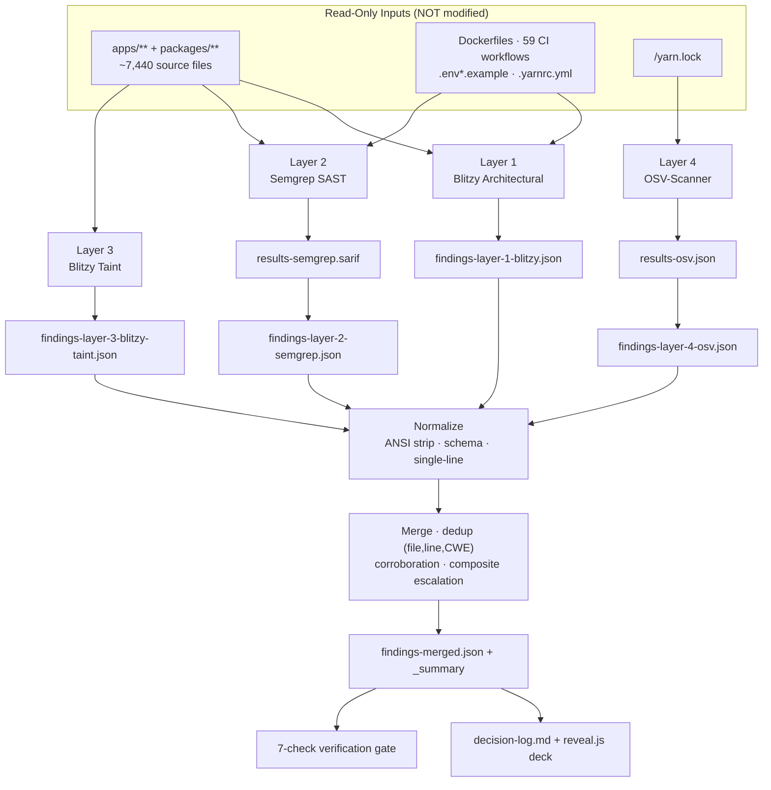

# Technical Specification

# 0. Agent Action Plan

## 0.1 Intent Clarification

### 0.1.1 Core Objective

Based on the provided requirements, the Blitzy platform understands that the objective is to perform a **read-only, four-layer security audit** of the Cal.com monorepo and **emit normalized, machine-readable findings artifacts** — *without* remediating or modifying any application source code. The task header frames the work explicitly as `[8 directives | ~0 files modified | 4 new files + 1 merged report | four-layer measurement]`, which confirms this is an assessment/measurement engagement, not a code change. An audit *measures*; it does not *fix*.

The audit composes four complementary detection layers, each producing a dedicated, single-line JSON findings file, followed by a consolidated cross-layer report:

- **Layer 1 — Blitzy Architectural Audit** (native agent reasoning over the whole codebase): fail-open logic, default/hardcoded secrets, encryption-key reuse, protocol/signature abuse, composite attack chains, CORS/CSP misconfiguration, container privilege escalation, credential logging, timing side-channels, JWT algorithm confusion, weak password policy, webhook signature omission, rate-limiter bypass, untrusted IP-header trust, and SAML/SSO insecure defaults → `findings-layer-1-blitzy.json`.
- **Layer 2 — Semgrep OSS pattern SAST** (rule packs `p/security-audit`, `p/secrets`, `p/owasp`): CI/CD injection, committed secrets/PEM keys, container misconfiguration, XSS, hardcoded credentials, over-privileged `GITHUB_TOKEN`, disabled TLS verification, and unchecked `postMessage` origins → `findings-layer-2-semgrep.json`.
- **Layer 3 — Blitzy Taint dataflow analysis** (AI-powered source→sink enumeration): Open Redirect (CWE-601), SSRF (CWE-918), Log Injection (CWE-117), authorization decision on user input (CWE-807), weak PRNG (CWE-338), type confusion (CWE-843), and missing authorization (CWE-862) → `findings-layer-3-blitzy-taint.json`.
- **Layer 4 — OSV-Scanner dependency SCA** (lockfiles/manifests): known CVEs across npm/PyPI/Go/Maven/Cargo ecosystems, malicious packages, and outdated transitive dependencies → `findings-layer-4-osv.json`.

The four layer files are then normalized, de-duplicated, and consolidated into a cross-layer `findings-merged.json` carrying a `_summary` header plus corroboration and composite-escalation annotations.

**Requirements restated with enhanced clarity (the eight directives):**

| # | Directive | Required Output |
|---|-----------|-----------------|
| 1 | Conduct the Layer-1 Blitzy architectural audit across all five vulnerability categories | `findings-layer-1-blitzy.json` |
| 2 | Install and configure Semgrep with telemetry disabled (`--metrics=off`) and local rule packs | Configured Semgrep CLI |
| 3 | Run the Semgrep scan, capture SARIF, then normalize it | `results-semgrep.sarif` → `findings-layer-2-semgrep.json` |
| 4 | Perform Layer-3 taint analysis covering all seven sink categories | `findings-layer-3-blitzy-taint.json` |
| 5 | Run OSV-Scanner over all lockfiles, capture JSON, then normalize it | `results-osv.json` → `findings-layer-4-osv.json` |
| 6 | Normalize every layer to single-line minified JSON on a strict schema, strip ANSI, de-duplicate with `corroborated_by` | Four normalized layer files |
| 7 | Produce the cross-layer merged report with `_summary`, corroboration, and composite escalation | `findings-merged.json` |
| 8 | Execute the verification suite (seven pass/fail checks) | Verification report |

**Implicit requirements and prerequisites surfaced:**

- **Read-only posture.** All scanned inputs — the ~7,440 TypeScript/JavaScript source files under `apps/**` and `packages/**`, the configuration files, both Dockerfiles, the 59 CI workflows, the eight `.env*.example` templates, and `/yarn.lock` — are *reference* inputs. None are mutated; remediation is out of scope.
- **Deterministic output format.** Each `findings-layer-*.json` and `findings-merged.json` must be a **single physical line** (minified, no embedded newlines) terminated by exactly one trailing newline, so the verification check `cat findings-layer-*.json | wc -l` evaluates to `4`.
- **Strict schema conformance.** Every finding object carries exactly `{file, line, severity, cwe, description, layer, tool}` (detailed in §0.3.5).
- **ANSI hygiene.** All ANSI escape sequences must be stripped from every string field before serialization, because the underlying scanners emit colorized output.
- **Severity normalization.** Semgrep severities map `error→critical`, `warning→high`, `note→medium`, `info→low`; the CWE is taken from rule metadata when present, otherwise inferred to the most specific applicable CWE.
- **False-positive suppression.** Drop `auth-guard-returns-true` matches in `*.test.*`/`*.spec.*`/`*.e2e-spec.*` test stubs, and drop hardcoded-argument shell-exec matches in build/script directories.
- **De-duplication semantics.** Within Layer 4, de-duplicate by `(package_name, CVE_ID)`; across layers, de-duplicate by `(file, line, CWE)`, keeping the higher severity and adding `corroborated_by:"<tool>"`.
- **Corroboration and escalation.** A vulnerability confirmed by both Layer 1 and Layer 3 is the highest-confidence class; an architectural weakness (Layer 1) plus a taint chain (Layer 3) that compose into an exploit chain are escalated one severity tier above the individual findings.
- **Telemetry off and offline-safe config.** Semgrep runs with `--metrics=off`; the configuration check uses the modern `--dryrun` flag, which exits cleanly without network access.
- **Exhaustiveness, not sampling.** Layer 1 must examine *every* file in each category; Layer 3 must *enumerate* every source→sink instance per sink category (no representative-only sampling).
- **Verification gate.** All seven Directive-8 checks must be run and reported (with failures identified by check number and reason) before completion is declared.
- **Rule-mandated deliverables.** A decision-log Markdown file (Explainability rule) and a single self-contained reveal.js HTML executive deck (Executive Presentation rule) are always produced in addition to the findings artifacts.

### 0.1.2 Task Categorization

- **Primary task type:** Security enhancement — specifically a security **audit/measurement** engagement. The deliverables quantify the security posture of the codebase; they do not change runtime behavior.
- **Secondary aspects:** **Tooling/Build** (install and configure the Semgrep and OSV-Scanner CLIs and pull the rule packs) and **Documentation** (the rule-mandated decision log and executive presentation).
- **Scope classification:** **Cross-cutting change** — the audit spans the entire monorepo (multiple applications and 20 workspace packages) and every layer of the stack (source, configuration, containers, CI, dependencies). It is explicitly **not** a code-modification task; `~0` application files are modified.

### 0.1.3 Special Instructions and Constraints

- **Audit-only directive (CRITICAL):** The engagement produces findings and documentation only. No discovered vulnerability is to be remediated, and no existing source, test, configuration, CI workflow, or dependency manifest is to be edited.
- **Output-format directive (CRITICAL):** Findings files must be single-line minified JSON on the exact schema, with ANSI stripped, so the deterministic `wc -l` and schema checks pass.
- **Methodological directive:** Layer 1 and Layer 3 are exhaustive (examine/enumerate everything, no sampling); Semgrep telemetry is disabled.
- **User-provided artifacts preserved verbatim** (these are reproduced exactly as specified by the requirements):
  - **User Example — canonical finding schema:**

```json
{"file":"<relative/path>","line":<int>,"severity":"critical|high|medium|low","cwe":"CWE-###","description":"<=200 chars","layer":1,"tool":"blitzy|semgrep|blitzy-taint|osv-scanner"}
```

  - **User Example — verification check (single-line invariant):** `cat findings-layer-*.json | wc -l` must return `4`.
- **Web-search requirements:** Confirm current Semgrep and OSV-Scanner CLI invocation, output formats (SARIF/JSON), exit-code semantics, and CWE mappings to validate the audit approach (completed; see §0.2.2).

### 0.1.4 Technical Interpretation

These requirements translate to the following technical implementation strategy. Each directive maps to a concrete technical action using a create/run/normalize pattern; no existing component is altered.

- To **establish the architectural baseline**, we will *reason over* every file across the five Layer-1 categories and *create* `findings-layer-1-blitzy.json`, grounding each finding in a concrete file and line (e.g., the unauthenticated AES-CBC construction in `packages/lib/crypto.ts` [packages/lib/crypto.ts:L3,L16-L18]).
- To **detect pattern-level defects**, we will *install* Semgrep, *run* it with `--metrics=off` over the three rule packs to *create* `results-semgrep.sarif`, then *normalize* that SARIF into `findings-layer-2-semgrep.json` (applying the severity map and FP-suppression rules).
- To **trace exploitable dataflow**, we will *enumerate* every source→sink pair across the seven sink categories and *create* `findings-layer-3-blitzy-taint.json` (e.g., the ~197 redirect sinks and ~289 HTTP-client sinks quantified in §0.2.1).
- To **assess dependency risk**, we will *run* OSV-Scanner against `/yarn.lock`, *create* `results-osv.json`, then *normalize and de-duplicate* it into `findings-layer-4-osv.json`.
- To **consolidate the picture**, we will *merge* all four layers — de-duplicating by `(file,line,CWE)`, annotating corroboration, escalating composite chains — and *create* `findings-merged.json` with its `_summary` header.
- To **satisfy governance rules**, we will *create* `decision-log.md` (documenting every non-trivial decision) and a self-contained reveal.js executive deck.
- To **prove completeness**, we will *run* the seven Directive-8 verification checks and report their pass/fail status.


## 0.2 Repository Scope Discovery

### 0.2.1 Comprehensive File Analysis

The target is the **Cal.com monorepo** (a Calendly-parity scheduling platform) managed with **Yarn 4.12.0 (Berry) + Turborepo** [package.json:packageManager]. It contains `apps/{web, api/{v1,v2}}` plus 20 workspace packages under `packages/` (app-store, app-store-cli, config, coss-ui, dayjs, debugging, ee, emails, embeds, features, kysely, lib, platform, prisma, sms, testing, trpc, tsconfig, types, ui). The static scan surface is **~7,440** `*.ts/*.tsx/*.js/*.jsx/*.mjs/*.cjs` files outside `node_modules`. Each audit layer targets a distinct slice of this surface:

| Layer | Search Patterns / Targets | Discovered Scope |
|-------|---------------------------|------------------|
| L1 Architectural | `apps/**`, `packages/**` source; `Dockerfile*`; `.github/workflows/*`; `.env*.example`; auth/crypto/CORS/CSP/JWT handlers | Whole codebase; concrete evidence grounded (below) |
| L2 Semgrep SAST | `**/*.{ts,tsx,js,jsx}`, `Dockerfile*`, `.github/workflows/**/*.yml`, `.env*` | Whole codebase via three rule packs |
| L3 Taint | redirect/SSRF/log/auth/PRNG/type/authorization sinks across `apps/**` + `packages/**` | Enumerated sink counts (below) |
| L4 OSV SCA | lockfiles/manifests | Exactly one lockfile: `/yarn.lock` (1.4 MB) |

**Layer-3 sink scope (enumeration targets — confirms exhaustive, non-sampled coverage):**

- Open Redirect (CWE-601): ~197 `redirect(` call sites and ~176 `NextResponse.redirect`/`res.redirect`/`window.location` sites; hotspots include OAuth callback/return-URL flows and `apps/web/app/api/auth/saml/authorize/route.ts`.
- SSRF (CWE-918): ~289 HTTP-client call sites (`fetch`/`axios`/`got`/`http.request`), concentrated in webhook dispatch (`packages/features/webhooks`) and 80+ app-store integration adapters.
- Log Injection (CWE-117): ~3,733 logger/console call sites.
- Weak PRNG (CWE-338): ~118 `Math.random` sites (many in `*.test.*`/`*integration-test*`; security-context usage must be distinguished from cosmetic usage).
- Missing Authorization (CWE-862): API route directories under `apps/api/v1/pages/api/**` (slots, payments, selected-calendars), `packages/app-store/*/api`, and `packages/platform/examples/base/src/pages/api`.

**Layer-1 architectural evidence (grounded and citable):**

- **Unauthenticated AES-CBC + latin1 key truncation** — `ALGORITHM = "aes256"` [packages/lib/crypto.ts:L3], key built via `Buffer.from(key, "latin1")` [packages/lib/crypto.ts:L16,L32], CBC `createCipheriv` with random IV [packages/lib/crypto.ts:L17-L18] → CWE-327/CWE-326.
- **CSP `unsafe-inline`/`unsafe-eval`** — production `script-src` includes `'unsafe-inline'` [apps/web/lib/csp.ts:L22]; development adds `'unsafe-eval'` [apps/web/lib/csp.ts:L24]; `style-src` allows `'unsafe-inline'` [apps/web/lib/csp.ts:L30] → CWE-1021/CWE-79.
- **Encryption-key reuse** — `CALENDSO_ENCRYPTION_KEY` serves AES-256-CBC, the TOTP-redirect JWT (HS256), and Helpscout HMAC-SHA1 → CWE-323; legacy HMAC-SHA1 (Vercel/Helpscout) coexists with HMAC-SHA256 peers → CWE-328.
- **Webhook signature default** — `X-Cal-Signature-256` uses the subscriber secret or a `"no-secret-provided"` default → CWE-347.
- **Weak password policy** — ≥7 characters (admin >14), below the NIST 8-character minimum → CWE-521 [packages/features/auth/lib/validPassword.ts; packages/lib/auth/isPasswordValid.ts].
- **Watchlist fail-open** — `getBlockedUsersMap` returns "unblocked" on service error [packages/features/watchlist/operations/check-user-blocking.ts] → CWE-636.
- **Turnstile bypass** — `checkCfTurnstileToken` is skipped when `CLOUDFLARE_TURNSTILE_SECRET` is unset or `NEXT_PUBLIC_IS_E2E` is set [packages/lib/server/checkCfTurnstileToken.ts] → CWE-697/CWE-287.
- **CORS dev wildcard** — `"*"` is used when `ALLOWED_ORIGINS` is unset [apps/api/v2/src/bootstrap.ts] → CWE-942.

**Container, CI, and configuration scope:**

- **Containers (2):** `/Dockerfile` and `apps/api/v2/Dockerfile`. Both declare **no `USER` directive** and therefore run as root → CWE-250/CWE-552. The root Dockerfile bakes default secrets: `ARG NEXTAUTH_SECRET=secret` [Dockerfile:L11] and `ARG CALENDSO_ENCRYPTION_KEY=secret` [Dockerfile:L12] → CWE-798/CWE-1188.
- **CI/CD:** `.github/workflows/` holds **59** workflow files. Action pinning is predominantly mutable major tags (`actions/checkout@v4` ×42, `actions/github-script@v7` ×18, `upload-artifact@v4` ×12, `docker/login-action@v3` ×8); only a few use SHA pins → CWE-1357/CWE-829.
- **Environment templates (8):** `/.env.example` (21 KB), `/.env.appStore.example`, `apps/api/v1/.env.example`, `apps/api/v2/.env.example`, `apps/web/test/.env.test.example`, `packages/platform/atoms/.env.example`, `packages/platform/examples/base/.env.example`, `example-apps/credential-sync/.env.example`.
- **Dependency suppression:** `.yarnrc.yml` sets `npmAuditIgnoreAdvisories: ["1113407"]` with a documented justification (fast-xml-parser 4.4.1 via `@boxyhq/saml-jackson` → `@aws-sdk/core`, parsing only trusted AWS responses) [.yarnrc.yml:npmAuditIgnoreAdvisories] — relevant to Layer 4 as a *justified* suppression.

No prior audit outputs (`findings-*.json`, `results-*.sarif/json`, executive deck) exist in the repository; all are net-new deliverables. No `.blitzyignore` files exist anywhere in the repository, so there are no ignore restrictions on analysis.

### 0.2.2 Web Search Research Conducted

Research validated the exact invocation, output formats, and exit semantics of both external scanners against current documentation:

- **Semgrep — SARIF output and rule packs (Layer 2):** The `--sarif` flag is confirmed to <cite index="4-3">output results in SARIF format</cite>, and the canonical invocation is <cite index="10-1">semgrep --config p/security-audit --sarif -o results.sarif</cite> against a target path. The <cite index="2-11">`p/` prefix indicates that the configuration should be pulled from the Semgrep Registry</cite>, confirming `p/security-audit`, `p/secrets`, and `p/owasp-top-ten` resolve as Registry packs. `p/security-audit` is characterized as <cite index="3-3">a broader security-focused set that includes rules with moderate confidence</cite>, which is appropriate for a comprehensive audit.
- **Semgrep — exit codes (interpretation guidance):** Semgrep <cite index="4-42">exits with: 0 OK, 1 some findings, 2 fatal error, 3 invalid target code, 4 invalid pattern</cite>. Consequently, exit code 1 indicates findings were present (the expected outcome of an audit) and is **not** treated as a failure; the SARIF artifact is captured regardless.
- **OSV-Scanner — lockfile scanning and JSON output (Layer 4):** The canonical command is <cite index="11-12">osv-scanner scan -L package-lock.json --format json</cite>, and `yarn.lock` is among the supported lockfile formats. When JSON output is requested, <cite index="13-16">only the JSON output will be printed to stdout, with all other outputs being directed to stderr</cite>, so the run redirects stdout to `results-osv.json`. OSV-Scanner <cite index="16-2">requires network access to query the OSV.dev database</cite> (verified reachable in this environment).
- **OSV-Scanner — alias grouping (supports Layer-4 de-duplication):** Vulnerabilities are grouped such that <cite index="12-6">if two vulnerability share the same alias, or alias each other, they are considered the same vulnerability</cite>, which directly supports the prompt's requirement to de-duplicate by `(package_name, CVE_ID)`.
- **CWE/severity mapping references:** Confirmed the CWE associations used for normalization (e.g., hardcoded credentials → CWE-798, weak randomness, injection families) align with the published security rule-pack metadata.

One naming nuance surfaced and is recorded for the decision log: the prompt names the OWASP pack `p/owasp`, whereas the canonical Registry identifier is `p/owasp-top-ten`; the audit resolves `p/owasp` to `p/owasp-top-ten`.

### 0.2.3 Existing Infrastructure Assessment

- **Project structure and organization:** A Yarn-workspaces + Turborepo monorepo with two runtime applications — `apps/web` (Next.js 16.1.5, port 3000), `apps/api/v1` (Next.js API routes, port 3003), and `apps/api/v2` (NestJS + Passport, port 3004) — plus 20 shared packages. Data is persisted in PostgreSQL 15+ via Prisma, with Redis/BullMQ for async work.
- **Patterns and conventions to follow:** Linting/formatting via **Biome** (`biome.json`); task orchestration via **Turborepo** (`turbo.json`); architectural import firewalls enforced at lint time (e.g., `packages/lib` may not import from `features`/`trpc`/`app-store`). These conventions inform the Layer-2 false-positive suppression strategy (test stubs and build scripts are recognized and filtered).
- **Build and deployment configurations:** Two multi-stage Dockerfiles (`FROM node:20` builder/runner stages) and 59 GitHub Actions workflows; both are read-only audit inputs.
- **Testing infrastructure present:** Vitest unit/integration tests and Playwright E2E suites; the `*.test.*`/`*.spec.*`/`*.e2e-spec.*` naming convention is exactly what the Layer-2 FP-suppression rule keys on.
- **Documentation system in use:** Existing `blitzy/documentation/` and `blitzy-docs/` Markdown plus a detailed Technical Specification (notably §6.4 Security Architecture, which corroborates the triple-stack authentication, crypto stack, and authorization model referenced throughout this plan). These are background context, not audit targets.


## 0.3 Implementation Design

### 0.3.1 Technical Approach

The audit is executed as a deterministic pipeline. Application code is consumed strictly as read-only input; the only files written are the net-new deliverables. The logical flow (a sequence of *stages*, not a time schedule) is:

- **Stage A — Acquire & configure.** Confirm Semgrep 1.164.0 and OSV-Scanner 2.3.8 are installed; pull the `p/security-audit`, `p/secrets`, and `p/owasp-top-ten` packs with `--metrics=off`.
- **Stage B — Layer 1 (architectural).** Reason over every file across the five categories and emit `findings-layer-1-blitzy.json` (`tool="blitzy"`, `layer=1`), grounding each finding in a file and line.
- **Stage C — Layer 2 (Semgrep).** Run the scan to `results-semgrep.sarif`, then normalize SARIF → `findings-layer-2-semgrep.json` (`tool="semgrep"`, `layer=2`) applying the severity map, CWE extraction, and FP suppression.
- **Stage D — Layer 3 (taint).** Enumerate every source→sink pair across the seven sink categories → `findings-layer-3-blitzy-taint.json` (`tool="blitzy-taint"`, `layer=3`).
- **Stage E — Layer 4 (OSV).** Scan `/yarn.lock` to `results-osv.json` (tolerating exit code 1 on CVEs), de-duplicate by `(package_name, CVE_ID)` → `findings-layer-4-osv.json` (`tool="osv-scanner"`, `layer=4`).
- **Stage F — Normalize.** Strip ANSI escapes, coerce to the strict schema, and minify each layer file to one physical line + one trailing newline.
- **Stage G — Merge.** Combine all four layers, de-duplicate cross-layer by `(file,line,CWE)` (keep higher severity + `corroborated_by`), apply composite escalation, and prepend the `_summary` header → `findings-merged.json`.
- **Stage H — Document.** Produce `decision-log.md` and the reveal.js executive deck.
- **Stage I — Verify.** Run all seven Directive-8 checks and report pass/fail.



### 0.3.2 Component / Layer Impact Analysis

Because no application code changes, "components" here are the stages of the audit pipeline, not product modules.

- **Direct work (new artifacts created):**
  - Layer-1 reasoning engine (Blitzy native) — no installation; consumes source, emits `findings-layer-1-blitzy.json`.
  - Layer-2 Semgrep CLI — installed; emits the SARIF intermediate that feeds normalization.
  - Layer-3 taint engine (Blitzy native) — no installation; enumerates dataflow.
  - Layer-4 OSV-Scanner CLI — installed; consumes `/yarn.lock`, emits the JSON intermediate.
  - Normalization + Merge transform — a deterministic processing step (ANSI strip, schema coercion, de-duplication, corroboration, escalation, `_summary`).
- **Indirect impacts / dependencies:** The merge stage depends on all four layer files being schema-conformant and single-line; the verification gate depends on the merge output and on the intermediate SARIF/JSON existing. The decision log and executive deck depend on the merged results being finalized.
- **New components introduced:** Two governance artifacts mandated by the user rules — `decision-log.md` (Explainability) and `blitzy-deck/executive-summary.html` (Executive Presentation). Rationale: these are required for every deliverable independent of the audit findings themselves.
- **Explicitly unaffected:** `package.json`, `yarn.lock`, all source, tests, CI workflows, and `.env` files remain byte-for-byte unchanged.

### 0.3.3 User Interface Design (Executive Presentation Deck)

The only UI artifact is the rule-mandated executive presentation — a **single self-contained reveal.js HTML file** for non-technical leadership. Key insights and actions:

- **Goal:** Communicate business value, risk, and operational readiness of the audit without requiring code literacy.
- **Required narrative (five beats):** what was done (four-layer audit scope), why (risk reduction/assurance), what changed architecturally (component and data-flow diagrams of the audit pipeline and the five security zones), what risks exist and how they are mitigated, and how the team onboards/continues.
- **Structure:** 12–18 slides (target 16) across four slide types — Title (`slide-title`), Section Divider (`slide-divider`), default Content, and Closing (`slide-closing`). Every slide carries at least one non-text visual (Mermaid diagram, KPI card, styled table, or Lucide SVG icon); content slides hold ≤4 bullets and ≤40 words.
- **Visuals:** Mermaid diagrams embedded as `<pre class="mermaid">` initialized with `startOnLoad:false` and re-run on `ready`/`slidechanged`; Lucide SVG icons via `<i data-lucide="...">`; zero emoji; no fenced code blocks inside slides.
- **Brand identity:** Blitzy palette (`#5B39F3` primary, `#2D1C77` dark, `#94FAD5` teal, `#1A105F` navy, gradients) and typography (Inter / Space Grotesk / Fira Code via Google Fonts), with the full `:root` custom-property set embedded inline.
- **Delivery:** No build step; CDN versions pinned to reveal.js 5.1.0, Mermaid 11.4.0, Lucide 0.460.0; reveal config `hash:true`, `transition:'slide'`, `controlsTutorial:false`, `width:1920`, `height:1080`.

The full slide-level design and brand contract are governed by the Executive Presentation rule, reproduced in §0.7.2.

### 0.3.4 User-Provided Examples Integration

- The **finding schema** provided in the requirements is implemented literally by the normalization stage: every emitted object contains exactly `{file, line, severity, cwe, description, layer, tool}` with `line` as an integer, `severity` from the four-value enum, `description` truncated to ≤200 characters, and `tool` from the four-value enum. (See §0.3.5.)
- The **single-line invariant example** (`cat findings-layer-*.json | wc -l` returns `4`) is enforced by writing each layer file as one minified line plus exactly one trailing newline, and is re-checked in the verification gate.

### 0.3.5 Critical Implementation Details

- **Canonical schema (per finding):**

```json
{"file":"...","line":42,"severity":"high","cwe":"CWE-601","description":"...","layer":3,"tool":"blitzy-taint"}
```

- **Semgrep severity map:** `error→critical`, `warning→high`, `note→medium`, `info→low`. CWE is read from rule metadata tags; when absent, the most specific applicable CWE is inferred.
- **False-positive suppression:** drop `auth-guard-returns-true` matches whose file matches `*.test.*`/`*.spec.*`/`*.e2e-spec.*`; drop hardcoded-argument shell-exec matches located in build/script directories.
- **De-duplication:** Layer 4 collapses on `(package_name, CVE_ID)` (aligned with OSV's alias grouping); cross-layer collapses on `(file, line, CWE)`, retaining the higher severity and recording `corroborated_by:"<tool>"`.
- **Corroboration & composite escalation:** findings confirmed by both Layer 1 and Layer 3 are flagged as the highest-confidence class; an architectural weakness plus a taint chain that compose into an exploit path receive a severity one tier above the individual findings.
- **ANSI hygiene & determinism:** every string field is stripped of ANSI escape sequences; each `findings-layer-*.json` and `findings-merged.json` is serialized minified onto a single physical line terminated by one newline.
- **`_summary` header:** `findings-merged.json` leads with a summary object capturing total findings, per-severity and per-layer counts, corroborated/composite counts, and the tool versions used.
- **Error/edge handling:** OSV-Scanner exit code 1 (CVEs present) and Semgrep exit code 1 (findings present) are treated as success; only exit code ≥2 is a hard failure. Empty-result layers still produce a valid single-line `[]` file.
- **Verification gate (seven checks):** the suite confirms the four layer files exist and are single-line, schema validity, ANSI absence, presence of `results-semgrep.sarif` and `results-osv.json`, the `_summary` header, and correct `corroborated_by`/composite annotations; failures are reported by check number and reason.


## 0.4 File Transformation Mapping

### 0.4.1 File-by-File Execution Plan

Transformation modes: **CREATE** (new file), **UPDATE** (modify existing), **DELETE** (remove obsolete), **REFERENCE** (read-only input / pattern source). This audit creates nine net-new deliverables and references the existing codebase; it performs **no UPDATE and no DELETE** on any existing file. The target file is listed first in every row.

| Target File | Transformation | Source File/Reference | Purpose / Changes |
|-------------|----------------|-----------------------|-------------------|
| `findings-layer-1-blitzy.json` | CREATE | `apps/**`, `packages/**`, `Dockerfile*`, `.github/workflows/*`, `.env*.example` (REFERENCE) | Layer-1 architectural findings; single-line minified JSON array; `tool="blitzy"`, `layer=1` |
| `findings-layer-2-semgrep.json` | CREATE | `results-semgrep.sarif` | Normalized Semgrep findings; severity-mapped, FP-suppressed, ANSI-stripped; `tool="semgrep"`, `layer=2` |
| `findings-layer-3-blitzy-taint.json` | CREATE | `apps/**`, `packages/**` (REFERENCE) | Layer-3 taint source→sink findings across 7 CWE categories; `tool="blitzy-taint"`, `layer=3` |
| `findings-layer-4-osv.json` | CREATE | `results-osv.json` | Normalized OSV findings; de-duplicated by `(package_name, CVE_ID)`; `tool="osv-scanner"`, `layer=4` |
| `findings-merged.json` | CREATE | the four `findings-layer-*.json` | Cross-layer merge with `_summary` header, `corroborated_by`, and composite-severity escalation |
| `results-semgrep.sarif` | CREATE | Semgrep run over `p/security-audit`+`p/secrets`+`p/owasp-top-ten` | Raw SARIF intermediate (Directive 3) |
| `results-osv.json` | CREATE | OSV-Scanner run over `/yarn.lock` | Raw OSV JSON intermediate (Directive 5) |
| `decision-log.md` | CREATE | this Agent Action Plan + audit decisions | Explainability decision log (table) + layer↔CWE↔directive coverage matrix |
| `blitzy-deck/executive-summary.html` | CREATE | `blitzy-deck/references/blitzy-reveal-theme.css` (REFERENCE, inlined) | Self-contained reveal.js executive deck (12–18 slides, Blitzy brand) |
| `apps/**/*.{ts,tsx,js,jsx,mjs,cjs}`, `packages/**/*.{ts,tsx,js,jsx}` | REFERENCE | — | Read-only L1/L2/L3 scan targets (~7,440 files); never modified |
| `/yarn.lock` | REFERENCE | — | Sole lockfile; read-only L4 input |
| `/Dockerfile`, `apps/api/v2/Dockerfile` | REFERENCE | — | Read-only L1/L2 container audit (root user, default secrets) |
| `.github/workflows/**/*.yml` | REFERENCE | — | Read-only L1/L2 CI audit (mutable action tags) — 59 files |
| `.env.example`, `.env.appStore.example`, `apps/api/{v1,v2}/.env.example`, `apps/web/test/.env.test.example`, `packages/platform/atoms/.env.example`, `packages/platform/examples/base/.env.example`, `example-apps/credential-sync/.env.example` | REFERENCE | — | Read-only L1/L2 secret/config audit (8 files) |
| `.yarnrc.yml` | REFERENCE | — | Read-only L4 audit of `npmAuditIgnoreAdvisories` (justified suppression) |
| `packages/lib/crypto.ts`, `apps/web/lib/csp.ts`, `apps/api/v2/src/bootstrap.ts`, `packages/lib/server/checkCfTurnstileToken.ts`, `packages/features/watchlist/operations/check-user-blocking.ts`, `packages/features/auth/lib/validPassword.ts`, `packages/lib/auth/isPasswordValid.ts` | REFERENCE | — | High-signal Layer-1 evidence files (grounded citations) |
| `blitzy-deck/references/blitzy-reveal-theme.css` | REFERENCE | — | Canonical Blitzy theme tokens; not present in repo → inlined into the deck |

All findings/intermediate files are emitted to the repository root (the audit working directory) so the verification glob `findings-layer-*.json` resolves; the executive deck is emitted under `blitzy-deck/`.

### 0.4.2 New Files Detail

- **`findings-layer-1-blitzy.json`** — Content: source/security findings. Based on: native architectural reasoning. Key contents: one object per architectural weakness (crypto, secrets, key reuse, CORS/CSP, container, JWT, password policy, fail-open, webhook signing, rate-limit/IP-trust, SAML defaults), each with grounded `file`+`line`.
- **`findings-layer-2-semgrep.json`** — Content: source findings. Based on: `results-semgrep.sarif`. Key contents: severity-mapped, FP-suppressed, ANSI-stripped objects with CWE from rule metadata.
- **`findings-layer-3-blitzy-taint.json`** — Content: source findings. Based on: enumerated dataflow. Key contents: one object per source→sink instance across CWE-601/918/117/807/338/843/862.
- **`findings-layer-4-osv.json`** — Content: dependency findings. Based on: `results-osv.json`. Key contents: one object per `(package, CVE)` with severity and CWE.
- **`findings-merged.json`** — Content: consolidated report. Based on: the four layer files. Key sections: leading `_summary` object then the merged finding array with corroboration/composite annotations.
- **`results-semgrep.sarif`** / **`results-osv.json`** — Content: raw tool output (intermediate). Based on: the Semgrep and OSV-Scanner runs.
- **`decision-log.md`** — Content: documentation. Based on: this plan. Key sections: decision table (decision / alternatives / rationale / risk) and a layer↔CWE↔directive coverage matrix.
- **`blitzy-deck/executive-summary.html`** — Content: documentation/UI. Based on: the inlined Blitzy reveal.js theme. Key sections: Title, headline findings/KPIs, audit-pipeline architecture diagram, alternating section dividers + content slides per layer/risk theme, and a closing slide.

### 0.4.3 Cross-File Dependencies

- `findings-layer-2-semgrep.json` requires `results-semgrep.sarif`; `findings-layer-4-osv.json` requires `results-osv.json`.
- `findings-merged.json` requires all four conformant, single-line `findings-layer-*.json` files.
- `decision-log.md` and `blitzy-deck/executive-summary.html` consume the finalized `findings-merged.json` `_summary`.
- The verification gate consumes the four layer files, the merged file, and both intermediates.
- No import/reference rewrites occur anywhere, because no application source is modified.


## 0.5 Scope Boundaries

### 0.5.1 Exhaustively In Scope

- **Read-only audit execution across the whole codebase:**
  - `apps/**/*.{ts,tsx,js,jsx,mjs,cjs}` and `packages/**/*.{ts,tsx,js,jsx}` (~7,440 files) — Layers 1/2/3.
  - `/yarn.lock` — Layer 4 (the sole lockfile).
  - `/Dockerfile` and `apps/api/v2/Dockerfile` — Layers 1/2 container audit.
  - `.github/workflows/**/*.yml` (59 files) — Layers 1/2 CI audit.
  - `.env.example`, `.env.appStore.example`, `apps/api/{v1,v2}/.env.example`, `apps/web/test/.env.test.example`, `packages/platform/atoms/.env.example`, `packages/platform/examples/base/.env.example`, `example-apps/credential-sync/.env.example` — Layers 1/2 secret/config audit.
  - `.yarnrc.yml` — Layer 4 suppression audit.
- **Deliverable creation (9 files):** `findings-layer-1-blitzy.json`, `findings-layer-2-semgrep.json`, `findings-layer-3-blitzy-taint.json`, `findings-layer-4-osv.json`, `findings-merged.json`, `results-semgrep.sarif`, `results-osv.json`, `decision-log.md`, `blitzy-deck/executive-summary.html`.
- **Tooling:** install/configure Semgrep and OSV-Scanner; pull `p/security-audit`, `p/secrets`, and `p/owasp-top-ten` with `--metrics=off`.
- **Processing logic:** ANSI stripping, schema coercion, single-line minification, Layer-4 de-duplication by `(package_name, CVE_ID)`, cross-layer de-duplication by `(file,line,CWE)`, corroboration annotation, composite-severity escalation, and the `_summary` header.
- **Verification:** the seven Directive-8 pass/fail checks, reported by check number.

### 0.5.2 Explicitly Out of Scope

- **All remediation/fixes** of discovered vulnerabilities — no source edits whatsoever (no change to `packages/lib/crypto.ts`, no CSP tightening in `apps/web/lib/csp.ts`, no `USER` directive added to either Dockerfile, no CI action SHA-pinning, no secret rotation). The engagement measures only; `~0` files modified.
- **Dependency changes:** no modification of `package.json` or `yarn.lock`; no dependency upgrade, downgrade, addition, or removal.
- **Editing existing tests, CI workflows, configuration, or `.env` files.**
- **Dynamic analysis:** no DAST, penetration testing, fuzzing, or runtime instrumentation — only the four static layers.
- **Container image scanning** (`osv-scanner scan image`) — scope is limited to the source lockfile.
- **Additional scanners or rule packs** beyond those named (e.g., Trivy, CodeQL, gitleaks, or `p/*` packs other than the three specified).
- **Fixing the `.yarnrc.yml` advisory suppression** (`1113407`) — it is already justified and is documented, not changed.
- **Triage beyond the two specified false-positive-suppression rules.**
- **Languages/ecosystems** the installed scanners do not auto-detect in this repository.
- **Performance optimization, refactoring, or feature work** unrelated to the audit.


## 0.6 Dependency Inventory

### 0.6.1 Key Private and Public Packages

The audit toolchain is **environment-local** (installed into the audit environment) and is distinct from the target project's own dependencies, which are not touched. Exact, verified versions are used — no placeholders:

| Registry | Package Name | Version | Purpose |
|----------|--------------|---------|---------|
| PyPI (pip) | semgrep | 1.164.0 | Layer-2 pattern SAST engine (SARIF output) |
| GitHub Releases | osv-scanner | 2.3.8 | Layer-4 dependency SCA (bundles osv-scalibr 0.4.5) |
| Semgrep Registry | p/security-audit | registry pack (no semver) | Broad security ruleset |
| Semgrep Registry | p/secrets | registry pack | Committed-secret / PEM-key detection |
| Semgrep Registry | p/owasp-top-ten | registry pack | OWASP Top-10 coverage (prompt's `p/owasp` resolves here) |
| CDN (jsDelivr/unpkg) | reveal.js | 5.1.0 | Executive deck framework (rule-pinned) |
| CDN | mermaid | 11.4.0 | Deck architecture / data-flow diagrams (rule-pinned) |
| CDN | lucide | 0.460.0 | Deck SVG icons (rule-pinned) |

Supporting runtimes already present in the environment: Node v22.22.2, Python 3.12.3, pip 25.3, and Yarn 4.12.0 (via corepack). Python 3 / `jq` are used for the deterministic JSON normalization and merge steps.

### 0.6.2 Dependency Updates

- **New dependencies to add (to the target project):** None. The scanners are installed into the audit environment only; no entry is added to `package.json` or `yarn.lock`.
- **Dependencies to update:** None.
- **Dependencies to remove:** None.

The audit is read-only with respect to the project's dependency manifests. The pre-existing, justified advisory suppression `npmAuditIgnoreAdvisories: ["1113407"]` in `.yarnrc.yml` [.yarnrc.yml:npmAuditIgnoreAdvisories] is reported by Layer 4 but left unchanged.

### 0.6.3 Import/Reference Updates

- **Files requiring import updates:** None. Because no application source is modified, there are no import statements to rewrite and no reference paths to update.
- **Import transformation rules:** Not applicable.


## 0.7 Rules

Two user-specified rules apply to this engagement. Both mandate additional deliverable files and are therefore reflected as CREATE entries in §0.4.

### 0.7.1 Explainability (Decision Log)

- Every non-trivial implementation decision MUST be documented with rationale, where a decision is non-trivial if a competent engineer could reasonably have chosen differently.
- The decision log is delivered as a **Markdown table** capturing: what was decided, what alternatives existed, why this choice was made, and what risks it carries.
- For migrations/refactors a bidirectional traceability matrix with 100% coverage is required. As this engagement performs no migration/refactor, that requirement maps to a **layer↔CWE↔directive coverage matrix** demonstrating that every directive and every CWE category is covered with no gaps.
- Any deviation from a literal or obvious interpretation of the requirements MUST have an explicit decision-log entry; unexplained deviations are treated as defects. Known deviations to record include: using `--dryrun` instead of the prompt's `--dry-run` (modern Semgrep flag); resolving `p/owasp` to the canonical Registry id `p/owasp-top-ten`; tolerating scanner exit code 1 (findings/CVEs present) as success; and installing Semgrep with `--break-system-packages` under PEP 668.
- Rationale MUST NOT be embedded in code comments — the decision log is the single source of truth for "why" decisions.

### 0.7.2 Executive Presentation

- Every deliverable MUST include an executive summary as a **single self-contained reveal.js HTML file**, always included independent of other documentation, aimed at non-technical leadership.
- The presentation MUST cover: (a) what was done — scope and deliverables; (b) why — business value; (c) what changed architecturally — component/data-flow diagrams; (d) risks and mitigations; (e) team onboarding/continuation.
- **Slide constraints:** 12–18 slides (target 16); four slide types — `slide-title`, `slide-divider`, default Content, `slide-closing`; every slide includes at least one non-text visual (Mermaid diagram, KPI card, styled table, or Lucide SVG icon) — no text-only slides; content slides hold ≤4 bullets and ≤40 words; zero emoji (Lucide SVG icons only via `<i data-lucide="...">`); no fenced code blocks inside slides (inline Fira Code only).
- **Visual identity (Blitzy brand):** palette `#5B39F3` (primary), `#2D1C77` (dark), `#94FAD5` (teal), `#1A105F` (navy), gradient stops `#7A6DEC`/`#4101DB`, plus neutrals; typography Inter (body), Space Grotesk (display), Fira Code (mono/eyebrows) via Google Fonts; hero/divider/closing background treatments as specified.
- **Mermaid:** embed as `<pre class="mermaid">` with `startOnLoad:false`; call `mermaid.run()` after the reveal.js `ready` event and on every `slidechanged`; theme variables `primaryColor:'#F2F0FE'`, `primaryTextColor:'#333333'`, `primaryBorderColor:'#5B39F3'`, `lineColor:'#999999'`, `secondaryColor:'#F4EFF6'`.
- **Technical delivery:** single self-contained HTML, no build step, no local file dependencies; CDN pinned to reveal.js 5.1.0, Mermaid 11.4.0, Lucide 0.460.0; reveal config `hash:true`, `transition:'slide'`, `controlsTutorial:false`, `width:1920`, `height:1080`; Lucide `lucide.createIcons()` after `ready` and on every `slidechanged`.
- **Inline CSS:** embed the full Blitzy reveal.js theme inline in a `<style>` tag, including the required `:root` custom properties and the slide-type/component classes. The canonical theme file is referenced at `blitzy-deck/references/blitzy-reveal-theme.css`; because that file is a Blitzy-internal reference and is **not present in the target repository**, the theme is embedded inline to satisfy the self-contained requirement.
- **Verification:** the HTML opens in a browser, renders all Mermaid diagrams and Lucide icons, contains 12–18 `<section>` elements, and every `<section>` contains at least one non-text visual element.


## 0.8 Special Instructions

### 0.8.1 Special Execution Instructions

- **Audit-only, additive output:** produce findings and documentation; never remediate. The only files written are the nine net-new deliverables in §0.4.
- **Telemetry disabled:** all Semgrep invocations use `--metrics=off`; rule packs are pulled from the Registry.
- **Exhaustive coverage:** Layer 1 examines every file in each of the five categories; Layer 3 enumerates every source→sink instance across the seven sink categories — no sampling.
- **Deterministic serialization:** each `findings-layer-*.json` and `findings-merged.json` is a single minified physical line with one trailing newline; all string fields are ANSI-stripped.
- **Exit-code tolerance:** scanner exit code 1 (findings/CVEs present) is success; only exit code ≥2 is a hard failure. Empty layers still emit a valid `[]` single-line file.
- **Verification before completion:** run all seven Directive-8 checks and report results (failures by check number and reason) before declaring the audit complete.
- **Tools explicitly used:** Semgrep 1.164.0 and OSV-Scanner 2.3.8 (plus native Blitzy reasoning for Layers 1 and 3). Tools explicitly excluded: any scanner or rule pack not named in the requirements.

### 0.8.2 Constraints and Boundaries

- **Technical constraints:** the audit runs against a Yarn 4.12.0 + Turborepo monorepo; the only lockfile is `/yarn.lock`; OSV-Scanner requires network access to OSV.dev (verified reachable).
- **Process constraints:** no modification of source, tests, CI, configuration, `.env` files, or dependency manifests; no dynamic/runtime testing; no container-image scanning.
- **Output constraints:** outputs must conform exactly to the finding schema and the single-line invariant; the decision log must be Markdown; the executive presentation must be a single self-contained reveal.js HTML file meeting the brand and slide-count constraints.
- **Compatibility requirements:** deck CDN versions are pinned (reveal.js 5.1.0, Mermaid 11.4.0, Lucide 0.460.0); the deck must render without any build step or local file dependency.


## 0.9 Attachments

No attachments were provided for this project. The attachment review returned "No attachments found," so there are:

- No PDF or image attachments to summarize.
- No Figma frames or screens (no frame names or URLs) to describe.

Because no Figma designs and no application component library/design system were supplied, the Design System Alignment Protocol is not triggered and no "Design System Compliance" sub-section applies. The only design-system constraint in this engagement is the Blitzy reveal.js brand theme governing the executive presentation, which is addressed in §0.3.3 and §0.7.2.


