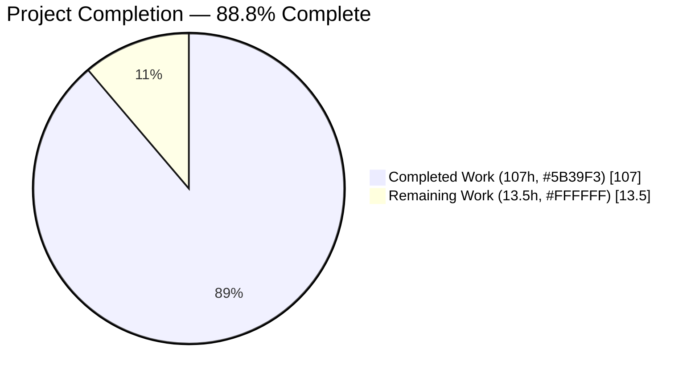
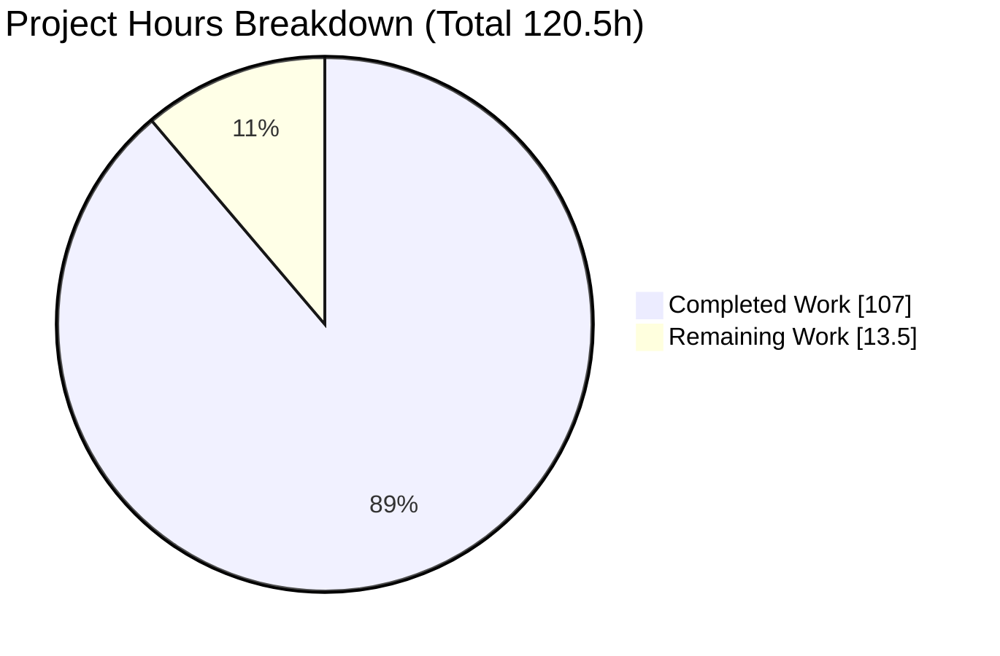
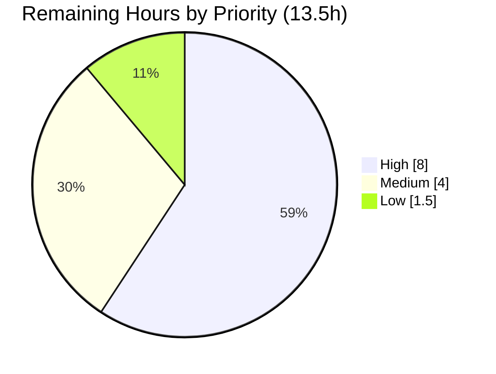

# Blitzy Project Guide — Cal.com Full Security Stack Audit

> **Brand color legend** — Completed / AI Work: **Dark Blue `#5B39F3`** · Remaining / Not Completed: **White `#FFFFFF`** · Headings / Accents: Violet‑Black `#B23AF2` · Highlight: Mint `#A8FDD9`

---

## 1. Executive Summary

### 1.1 Project Overview

This engagement delivered a comprehensive, **five‑layer "Full Security Stack" audit** of the Cal.com monorepo (`calcom-monorepo`, a Yarn Berry / Node 20 Turborepo spanning `apps/web`, `apps/api/v1`, `apps/api/v2`, and shared `packages/*`). It is an **analysis‑and‑reporting** task governed by a hard **"~0 files modified"** directive: the application source is read exhaustively but never altered. Across five measurement layers — architectural reasoning, Semgrep SAST, a deterministic sink/mitigation inventory, AI taint analysis, and OSV dependency scanning — the audit emits normalized, machine‑readable findings that culminate in a single cross‑correlated merged report and a CI/CD gate verdict. The business value is a reproducible, auditable, severity‑unified security posture for a large production codebase, communicated to both engineers and leadership.

### 1.2 Completion Status

The project is **88.8% complete** on an AAP‑scoped basis. All twelve mandated deliverables (ten directives + two governance rules → thirteen artifacts) are **complete and independently verified**. The remaining 13.5 hours are exclusively **human governance / path‑to‑production** activities (review, sign‑off, optional CI wiring, distribution). Remediation of the vulnerabilities the audit discovered is explicitly **out of scope** (AAP §0.3.2) and is therefore not counted against completion.



> Pie color convention — **Completed Work = Dark Blue `#5B39F3`**, **Remaining Work = White `#FFFFFF`**. Center value: **88.8% Complete**.

| Metric | Value |
|--------|-------|
| **Total Hours** | **120.5 h** |
| **Completed Hours (AI + Manual)** | **107 h** (AI/autonomous 107 h · Manual 0 h) |
| **Remaining Hours** | **13.5 h** |
| **Percent Complete** | **88.8 %** (107 ÷ 120.5) |

### 1.3 Key Accomplishments

- ✅ **All 13 audit artifacts delivered** at the repository root with zero application files modified (perfect read‑only compliance: 13 files added, 40,930 insertions, 0 deletions).
- ✅ **Layer 1 — Architectural Audit:** 10 mandatory security categories, each with a coverage summary, max 22 files read per category (≤50 budget), 29 findings.
- ✅ **Layer 2 — Semgrep SAST:** Semgrep OSS 1.163.0, 709 rules from 3 packs, 32 results, normalized with the exact `error→critical / warning→high / note→medium / info→low` map; 5 test‑fixture false positives suppressed.
- ✅ **Layer 3a — Sink & Mitigation Inventory:** deterministic `grep`/`find` over 16 CWE sink categories and 9 mitigation categories; production and test partitioned (zero test leakage into the production inventory).
- ✅ **Layer 3b — AI Taint Analysis:** 65 findings across 16 CWE categories, every finding grounded in the Layer 3a inventory, each carrying a `gateBlocking` boolean and (when advisory) a `demotionReason`.
- ✅ **Layer 4 — OSV Software Composition Analysis:** OSV‑Scanner 2.3.5 over `yarn.lock`; 257 raw records deduplicated to 172 unique findings (0 duplicate `(package, id)` tuples).
- ✅ **Synthesis:** unified single‑line minified JSON across all layers; `findings-merged.json` with a `_summary` header and 16 location‑anchored cross‑layer corroborations; **CI/CD gate verdict = `BLOCK`**; **15/15** verification checks pass.
- ✅ **Governance:** Explainability decision log (4‑column decision table + 10/10 bidirectional traceability) and a self‑contained 16‑slide reveal.js executive deck (Blitzy brand theme, pinned CDNs, 2 Mermaid diagrams, 34 Lucide icons, 0 emoji, 0 code fences).

### 1.4 Critical Unresolved Issues

There are **no unresolved defects in the audit deliverables** — all 13 artifacts passed every structural, semantic, cross‑consistency, and runtime check. The items below are **security findings the audit surfaced** (its intended output); they require human follow‑up but are **not** deliverable defects, and their remediation is out of scope for this detection‑only engagement.

| Issue | Impact | Owner | ETA |
|-------|--------|-------|-----|
| 1 **malicious** (`MAL‑`) + 6 **critical** (CVSS 9.8/9.3) transitive dependencies in `yarn.lock` | Supply‑chain compromise risk; drives the `BLOCK` verdict | Security / Platform team | Triage 2 h (H2); remediation = separate engagement |
| 80 gate‑blocking critical/high findings unremediated (12 critical + 68 high across Layers 2/3b/4) | Audit gate verdict = `BLOCK` | Security team | Review 6 h (H1) + triage 1 h (H4) |
| `BLOCK` verdict computed but not wired into CI | Audit not auto‑enforced on future builds | DevOps | 3 h (H3) |

### 1.5 Access Issues

No repository‑permission or credential access issues were encountered — all 16 commits are authored by `agent@blitzy.com` and the in‑scope tree is clean. The only access considerations are **network/CDN dependencies** of the runtime/scanner tooling:

| System / Resource | Type of Access | Issue Description | Resolution Status | Owner |
|-------------------|----------------|-------------------|-------------------|-------|
| jsDelivr CDN | Network (deck runtime) | Executive deck loads reveal.js 5.1.0, Mermaid 11.4.0, Lucide 0.460.0 and Google Fonts via CDN; will not fully render in an air‑gapped browser | Open (Low) — versions pinned; optionally vendor libraries locally for offline use | Frontend / DevOps |
| Semgrep registry | Network (rule packs) | Literal `p/owasp` pack returns HTTP 404 | Resolved — substituted canonical `p/owasp-top-ten`; intent preserved; logged in decision log §3/§7 | Security |
| OSV.dev database | Network (scanner) | OSV‑Scanner queries the OSV database; offline reproduction may differ | Accepted — raw `results-osv.json` retained as evidence | Security |

### 1.6 Recommended Next Steps

1. **[High]** Security‑engineer **review & sign‑off** of the 13 artifacts and 298 findings, prioritizing the 80 gate‑blocking and 16 corroborated findings (**6 h**, H1).
2. **[High]** **Triage the supply‑chain findings** — 6 critical (CVSS 9.8) plus 1 malicious package — into an urgent remediation backlog (**2 h**, H2).
3. **[Medium]** **Wire the `BLOCK` gate verdict** into the CI required‑job gate (`security-audit.yml` / `all-checks.yml`) using the documented integration point (**3 h**, H3).
4. **[Medium]** **Create remediation tickets and assign owners** for the remaining gate‑blocking findings — container hardening, secrets, and taint (**1 h**, H4).
5. **[Low]** **Distribute the executive deck** to leadership and verify CDN render in the target/offline environment (**1.5 h**, H5).

---

## 2. Project Hours Breakdown

### 2.1 Completed Work Detail

All hours below were delivered autonomously by Blitzy agents (AI). Each component traces to a specific AAP directive or rule.

| Component | Hours | Description |
|-----------|------:|-------------|
| D1 — Layer 1 Architectural Audit | 18 | 10 mandatory categories with coverage summaries, 29 findings, anchor‑file reasoning (≤50 files/category, max 22) |
| D2 — Semgrep setup (pre‑agent) | 3 | Install Semgrep 1.163.0 + 3 rule packs; `--metrics=off`; graceful‑degradation status path |
| D3 — Layer 2 scan + normalize | 6 | SARIF 2.1.0 (709 rules / 32 results); severity map; suppress 5 test‑fixture FPs |
| D4 — Layer 3a sink/mitigation inventory (pre‑agent) | 8 | `grep`/`find` over 16 sink + 9 mitigation categories; 4 files; production/test partition |
| D5 — Layer 3b AI taint analysis | 20 | 16 CWE categories, 65 findings grounded in inventory, `gateBlocking`/`demotionReason` (≤200 sinks/category) |
| D6 — Layer 4 OSV scan + dedupe (pre‑agent) | 4 | OSV‑Scanner 2.3.5 over `yarn.lock`; 257 → 172 deduped by `(package, CVE)` |
| D7 — Normalize unified severity | 4 | Single‑line minified JSON; unified critical/high/medium/low vocabulary across all layers |
| D8 — Cross‑layer merged report | 8 | `findings-merged.json` `_summary` + 16 location‑anchored corroborations |
| D9 — CI/CD gate verdict | 3 | Precedence fold over `gateBlocking`/severity → `BLOCK` |
| D10 — Verification suite | 5 | 15 pass/fail integrity & completeness checks |
| R1 — Explainability decision log | 8 | 4‑column decision table + bidirectional directive↔artifact traceability + reproducibility appendix |
| R2 — Executive reveal.js deck | 12 | 16‑slide self‑contained deck, Blitzy brand theme, 2 Mermaid diagrams, 34 Lucide icons |
| Validation & QA fix cycles | 8 | Independent 15‑check re‑derivation, runtime deck render, resolution of 5 MAJOR + 4 MINOR review findings |
| **Total Completed** | **107** | |

### 2.2 Remaining Work Detail

Each remaining item is human governance / path‑to‑production. Remediation of discovered vulnerabilities is a separate, out‑of‑scope engagement.

| Category | Hours | Priority |
|----------|------:|----------|
| H1 — Security‑engineer review & sign‑off of 13 artifacts + 298 findings (focus: 80 gate‑blocking + 16 corroborated) | 6.0 | High |
| H2 — Triage 6 critical (CVSS 9.8) + 1 malicious dependency → urgent remediation backlog | 2.0 | High |
| H3 — Wire `BLOCK` gate verdict into CI required‑job gate (`security-audit.yml` / `all-checks.yml`) | 3.0 | Medium |
| H4 — Create remediation tickets + assign owners for remaining gate‑blocking findings (container/secrets/taint) | 1.0 | Medium |
| H5 — Distribute executive deck + verify CDN render in target/offline environment | 1.5 | Low |
| **Total Remaining** | **13.5** | |

### 2.3 Hours Reconciliation

- **Section 2.1 (Completed) = 107 h** · **Section 2.2 (Remaining) = 13.5 h** · **Total = 120.5 h**.
- **Completion = 107 ÷ 120.5 = 88.8 %.**
- Cross‑section integrity: Remaining (13.5 h) is identical in §1.2, §2.2, and §7; §2.1 + §2.2 = §1.2 Total.

---

## 3. Test Results

All tests below originate from Blitzy's autonomous validation pipeline (Directive 10 suite) and the Final Validator's independent re‑derivation from the raw artifacts.

| Test Category | Framework | Total Tests | Passed | Failed | Coverage % | Notes |
|---------------|-----------|------------:|-------:|-------:|-----------:|-------|
| Artifact Integrity & Completeness (Directive 10) | Custom Python verifier | 15 | 15 | 0 | 100% | C1–C15; re‑derived from raw artifacts (not trusting embedded `_summary`) |
| Artifact Structural Validation | JSON / SARIF / format checks | 13 | 13 | 0 | 100% | All artifacts valid; 5 normalized layers + SARIF single‑line minified (0 newlines) |
| Runtime / Executive Deck Render | Chrome (headless) | 16 | 16 | 0 | 100% | 16 slides; 2 Mermaid SVG + 34 Lucide icons render; 0 console errors |
| Tooling Smoke Tests | Semgrep / OSV‑Scanner | 2 | 2 | 0 | 100% | semgrep 1.163.0 & osv-scanner 2.3.5 on PATH and functional |

**Scan executions (measurement instruments — produce findings, not pass/fail):**

| Scan | Framework | Volume | Outcome |
|------|-----------|--------|---------|
| Layer 2 SAST | Semgrep OSS 1.163.0 | 709 rules · 3 packs | 32 results (5 test‑fixture FPs suppressed; 27 gate‑affecting) |
| Layer 4 SCA | OSV‑Scanner 2.3.5 | `yarn.lock`, 257 raw records | 172 unique findings after `(package, CVE)` dedupe |

**Selected Directive‑10 check assertions (all PASS):** C2 `5 files single‑line` · C3 `all 298 findings use {critical,high,medium,low}` · C4 `298 = 29+32+65+172 = 18+96+110+74` · C6 `gateBlocking 80 = (0+27+1+52) = (12+68+0+0)` · C7 `advisory 218 = 298−80` · C8 `Layer 1 10 categories ≤50 files` · C9 `severity map exact, metrics off, 3 packs` · C10 `Layer 3b 16 CWE, grounded, ≤200/category` · C12 `all Layer‑3b files trace to sink-inventory.txt` · C13 `0 dup (package,cve), 257→172` · C14 `all 4 layer statuses OK` · C15 `gate_verdict = BLOCK = precedence fold`.

---

## 4. Runtime Validation & UI Verification

**Tooling runtime**
- ✅ **Operational** — Semgrep CLI 1.163.0 present on PATH and functional (matches AAP pin).
- ✅ **Operational** — OSV‑Scanner 2.3.5 present on PATH and functional (matches AAP pin).
- ✅ **Operational** — Python 3.13.7 verifier re‑derives 15/15 checks from raw artifacts.

**Artifact runtime**
- ✅ **Operational** — All 5 normalized JSON layers + merged report parse as valid JSON and are single‑line minified (0 newlines).
- ✅ **Operational** — `findings-merged.json._summary`: `gate_verdict = BLOCK`, `totalFindings = 298`, `gateBlockingTotal = 80`, verification `15/15 PASS`.

**Executive deck (UI verification — `security-audit-executive-presentation.html`)**
- ✅ **Operational** — Served over HTTP (`python3 -m http.server`) → HTTP 200, 41,339 bytes.
- ✅ **Operational** — 16 `<section>` slides; reveal.js config `hash:true / transition:'slide' / 1920×1080`.
- ✅ **Operational** — Both Mermaid diagrams render to SVG (five‑layer deterministic‑first pipeline; ERROR→BLOCK→WARN→PASS gate decision tree).
- ✅ **Operational** — 34 Lucide icons render to SVG; 0 broken glyphs; 0 console errors/warnings across repeated `slidechanged`.
- ✅ **Operational** — Brand theme applied inline (Blitzy `--blitzy-*` tokens, Space Grotesk headings, Fira Code captions, lavender surfaces); 0 emoji, 0 code fences.
- ⚠ **Partial** — Full render requires internet for the pinned CDNs; in an air‑gapped environment the deck degrades (tracked as risk T1; mitigation: vendor libraries locally).

*Evidence:* Final Validator screenshots in `blitzy/screenshots/` (e.g., `validate_deck_01_title.png`, `validate_deck_03_kpi_glance.png`, `validate_deck_05_mermaid_pipeline.png`, `validate_deck_12_mermaid_gate.png`, `validate_deck_16_closing.png`) plus per‑breakpoint responsive captures (375/768/1280/1920).

---

## 5. Compliance & Quality Review

AAP deliverables cross‑mapped to Blitzy quality/compliance benchmarks. All benchmarks pass.

| Benchmark / Requirement | Status | Progress | Notes |
|-------------------------|--------|----------|-------|
| Read‑only "~0 files modified" | ✅ PASS | ██████████ 100% | 13 files added, 0 application files modified/deleted |
| 10 directives delivered (D1–D10) | ✅ PASS | ██████████ 100% | Each directive maps to its produced artifact(s) |
| 2 governance rules (Explainability, Executive Presentation) | ✅ PASS | ██████████ 100% | Decision log + reveal.js deck both produced |
| Unified severity schema across layers | ✅ PASS | ██████████ 100% | 0 vocabulary violations across 298 findings |
| Single‑line minified normalized JSON (D7) | ✅ PASS | ██████████ 100% | 5 layer files, 0 newlines |
| OSV dedupe by `(package, CVE)` | ✅ PASS | ██████████ 100% | 257 → 172, 0 duplicate tuples |
| 16 sink + 9 mitigation categories (L3a) | ✅ PASS | ██████████ 100% | Confirmed; production inventory has 0 test leakage |
| Layer 1: 10 categories + coverage + ≤50‑file budget | ✅ PASS | ██████████ 100% | Max 22 files in any category |
| Layer 3b grounded + `gateBlocking`/`demotionReason` | ✅ PASS | ██████████ 100% | All 65 trace to inventory; all advisory carry a reason |
| 15‑check verification suite (D10) | ✅ PASS | ██████████ 100% | 15/15, independently re‑derived |
| Deck constraints (12–18 slides, pinned CDNs, 0 emoji, 0 code fences) | ✅ PASS | ██████████ 100% | 16 slides; brand theme inline |
| Explainability traceability (100% coverage) | ✅ PASS | ██████████ 100% | 10/10 forward + reverse no‑orphans |
| Platform hard constraints (encryption‑key continuity, webhook‑payload immutability) | ✅ PASS | ██████████ 100% | Not touched (read‑only audit) |

**Fixes applied during autonomous validation:** the producing agent resolved **5 MAJOR review findings** (deck accessibility/content, decision‑log accuracy, removal of orphan screenshots, cross‑layer corroboration semantics) and **4 MINOR QA findings** (inventory scope, deck word‑count, focus ring, mobile readability) prior to final validation. **Outstanding deliverable items: none.**

**Documented deviation (compliant):** the literal `p/owasp` Semgrep pack returns HTTP 404; the canonical `p/owasp-top-ten` pack was substituted to preserve the directive's OWASP Top 10 intent, recorded in decision log §3/§7 per the Explainability rule.

---

## 6. Risk Assessment

> **Important framing:** The audit deliverables themselves carry **zero defects**. The *Security* risks below are issues the audit **discovered in the audited Cal.com codebase** — surfacing them is the project's value. Remediation is out of scope (AAP §0.3.2); the residual risk is *pending human action*, not a deliverable flaw.

| Risk | Category | Severity | Probability | Mitigation | Status |
|------|----------|----------|-------------|------------|--------|
| S2 — 6 critical (CVSS 9.8) + 1 malicious (`MAL‑`) transitive dependency in `yarn.lock` | Security | Critical | High | Reported in Layer 4; urgent dependency‑upgrade follow‑up (separate engagement) | Open |
| S1 — 80 gate‑blocking critical/high findings unremediated | Security | High | High | `BLOCK` verdict raised; triage + remediation engagement required | Open (by design) |
| S3 — Container hardening gaps (default `ARG` secrets, no `USER`) | Security | High | High | Reported; corroborated by Layers 1 + 2 | Open |
| O1 — `BLOCK` verdict not wired into CI | Operational | Medium | Medium | Integration point (`all-checks.yml` `always()` gate) + precedence model documented; small follow‑up (H3) | Open (accepted) |
| O2 — Audit staleness (point‑in‑time snapshot) | Operational | Medium | Medium | Fully reproducible commands in decision log §9; re‑run on a cadence | Open |
| T1 — Deck CDN dependency (no air‑gapped render) | Technical | Low | Medium | Versions pinned; optionally vendor reveal.js/Mermaid/Lucide locally | Open (accepted) |
| T3 — Severity banding collapses CVSS to 4 bands | Technical | Low | Medium | Raw `cvssScore`/vector + native SARIF level retained per finding | Accepted |
| T2 — `results-osv.json` not minified (intermediate) | Technical | Low | Low | By design — only normalized layers must minify (D7); raw retained as evidence | Accepted |
| I2 — Tooling version drift (Semgrep/OSV) | Integration | Low | Medium | Versions pinned (1.163.0 / 2.3.5) and documented in §9 | Accepted |
| I1 — `p/owasp` → `p/owasp-top-ten` substitution | Integration | Low | Low | Canonical OWASP Top Ten pack; intent preserved; C9 PASS; logged | Resolved |
| I3 — OSV DB connectivity for reproduction | Integration | Low | Low | Raw `results-osv.json` retained for offline review | Accepted |

---

## 7. Visual Project Status

**Hours breakdown** — Completed Work = Dark Blue `#5B39F3`; Remaining Work = White `#FFFFFF`.



**Remaining work by priority** (13.5 h total): High = 8.0 h · Medium = 4.0 h · Low = 1.5 h.



**Remaining work by task (hours):**

| Task | Hours | Bar |
|------|------:|-----|
| H1 Review & sign‑off | 6.0 | ████████████ |
| H3 CI gate wiring | 3.0 | ██████ |
| H2 Supply‑chain triage | 2.0 | ████ |
| H5 Deck distribution | 1.5 | ███ |
| H4 Remediation ticketing | 1.0 | ██ |

> **Integrity:** the pie chart "Remaining Work" value (13.5) equals §1.2 Remaining Hours and the §2.2 Hours‑column sum.

---

## 8. Summary & Recommendations

**Achievements.** This detection‑only engagement is **88.8% complete** and delivered **all twelve mandated AAP deliverables** (ten directives + two governance rules → thirteen artifacts) with **perfect read‑only compliance** — 13 files added, zero application files modified. The five‑layer pipeline produced **298 normalized findings** under a single severity vocabulary, a cross‑layer merged report with 16 location‑anchored corroborations, a computed **`BLOCK`** gate verdict, and a **15/15** passing verification suite — all independently re‑derived by the Final Validator from the raw artifacts.

**Remaining gaps.** The outstanding **13.5 hours** are entirely human governance / path‑to‑production: security review & sign‑off (6 h), supply‑chain triage (2 h), CI gate wiring (3 h), remediation ticketing (1 h), and deck distribution (1.5 h). There are **no unresolved defects** in the deliverables.

**Critical path to production.** (1) Security‑engineer sign‑off of the findings → (2) urgent triage of the malicious + critical dependencies → (3) wire the `BLOCK` verdict into CI → (4) open the remediation backlog. Items 1–2 are the highest priority because the audit surfaced a malicious package and multiple CVSS‑9.8 dependencies.

**Success metrics.** 12/12 deliverables complete · 15/15 verification checks pass · 0 deliverable defects · 0 application files modified · 100% directive traceability.

**Production readiness.** The **audit artifacts are production‑ready** and accurately represent the security posture of the codebase. Note that the **audited application is *not* production‑ready** until the `BLOCK`‑level findings are remediated — but that remediation is a deliberately separate, out‑of‑scope engagement. The correct interpretation of `BLOCK` is a **successful audit outcome**, not a deliverable failure.

| Metric | Value |
|--------|------:|
| AAP‑scoped completion | 88.8% |
| Deliverables complete | 12 / 12 |
| Verification checks | 15 / 15 |
| Total findings | 298 |
| Gate verdict | BLOCK (expected) |
| Application files modified | 0 |

---

## 9. Development Guide

### 9.1 System Prerequisites

- **OS:** Linux/macOS (validated on Ubuntu 25.10).
- **Python:** 3.13+ (used for normalization and the verification suite).
- **Semgrep CLI:** 1.163.0 (Layer 2 SAST).
- **OSV‑Scanner:** 2.3.5 (Layer 4 SCA).
- **Modern browser:** Chrome/Firefox (to view the executive deck).
- **Internet:** required only for the deck CDNs and the OSV database; the rest of the pipeline runs offline.

### 9.2 Environment Setup

```bash
# Clone & enter the repository (branch contains the audit artifacts)
git clone <repo-url> calcom && cd calcom
git checkout blitzy-965b3ff2-85e1-47df-8b29-702457edef5b

# Install Semgrep (system Python on Ubuntu 25 uses PEP 668 — use --break-system-packages OR a venv)
pip install --break-system-packages semgrep==1.163.0
# Alternative (recommended): python3 -m venv .venv && source .venv/bin/activate && pip install semgrep==1.163.0

# Install OSV-Scanner 2.3.5 (prebuilt binary on PATH, or via Go)
go install github.com/google/osv-scanner/v2/cmd/osv-scanner@v2.3.5   # or download the release binary

# Verify tooling
semgrep --version        # -> 1.163.0
osv-scanner --version    # -> osv-scanner version: 2.3.5
python3 --version        # -> 3.13.x
```

### 9.3 Reproduce the Audit

```bash
# Layer 2 — Semgrep SAST to SARIF (offline; note p/owasp-top-ten substitutes the 404ing p/owasp)
semgrep scan --config p/security-audit --config p/secrets --config p/owasp-top-ten \
  --metrics=off --sarif --output results-semgrep.sarif

# Layer 3a — deterministic sink/mitigation inventory (excludes node_modules/.next/dist; partitions test files)
#   Each of 16 sink + 9 mitigation categories is grepped and emitted as file:line:category:text
#   (full per-category patterns are in decision-log §9.2)

# Layer 4 — OSV Software Composition Analysis over the root lockfile
osv-scanner scan source --lockfile=yarn.lock --format=json > results-osv.json
```

### 9.4 Verify the Artifacts

```bash
# Presence of all 13 artifacts
for f in findings-layer-1-blitzy.json results-semgrep.sarif findings-layer-2-semgrep.json \
         sink-inventory.txt sink-inventory-test.txt mitigation-inventory.txt mitigation-inventory-test.txt \
         findings-layer-3b-blitzy-taint.json results-osv.json findings-layer-4-osv.json \
         findings-merged.json security-audit-decision-log.md security-audit-executive-presentation.html; do
  [ -f "$f" ] && echo "PRESENT: $f" || echo "MISSING: $f"
done

# Validity + single-line minification of normalized layers
for f in findings-layer-1-blitzy.json findings-layer-2-semgrep.json findings-layer-3b-blitzy-taint.json \
         findings-layer-4-osv.json findings-merged.json; do
  python3 -c "import json;json.load(open('$f'))" && echo "$f valid, newlines=$(tr -cd '\n' < "$f" | wc -c)"
done

# Headline numbers (gate verdict + verification result)
python3 -c "import json;s=json.load(open('findings-merged.json'))['_summary'];print('gate_verdict:',s['gate_verdict'],'| total:',s['totalFindings'],'| gateBlocking:',s['gateBlockingTotal'],'| verification:',s['verification']['result'])"
```

Expected output: `gate_verdict: BLOCK | total: 298 | gateBlocking: 80 | verification: 15/15 PASS`.

### 9.5 View the Executive Deck

```bash
# Serve the repository root and open the deck (CDNs require internet)
python3 -m http.server 8099
# Browse to: http://localhost:8099/security-audit-executive-presentation.html
```

### 9.6 Troubleshooting

- **Deck shows unstyled boxes / missing icons** → no internet for the pinned CDNs (reveal.js / Mermaid / Lucide / Google Fonts). Connect to the internet, or vendor the libraries locally and update the `<script>`/`<link>` `src`/`href` to relative paths.
- **`error: externally-managed-environment` from pip** → Ubuntu 25 PEP 668. Use `pip install --break-system-packages …` or a virtual environment (recommended).
- **`A new version of Semgrep is available`** notice → benign; pin to 1.163.0 for reproducibility.
- **OSV‑Scanner returns no/different results** → ensure network access to the OSV database; the committed `results-osv.json` is the canonical offline evidence.
- **Semgrep `p/owasp` 404** → expected; use `p/owasp-top-ten` (documented deviation).

---

## 10. Appendices

### Appendix A — Command Reference

| Purpose | Command |
|---------|---------|
| Semgrep version | `semgrep --version` |
| OSV‑Scanner version | `osv-scanner --version` |
| Layer 2 scan | `semgrep scan --config p/security-audit --config p/secrets --config p/owasp-top-ten --metrics=off --sarif --output results-semgrep.sarif` |
| Layer 4 scan | `osv-scanner scan source --lockfile=yarn.lock --format=json > results-osv.json` |
| Verify gate/verification | `python3 -c "import json;s=json.load(open('findings-merged.json'))['_summary'];print(s['gate_verdict'],s['verification']['result'])"` |
| Serve deck | `python3 -m http.server 8099` |
| Diff vs base | `git diff --stat e988138b24..HEAD` |

### Appendix B — Port Reference

| Port | Service | Notes |
|------|---------|-------|
| 8099 | Local static HTTP server | Used only to preview the executive deck (any free port works) |

*No application services are started by this engagement; the audit is read‑only.*

### Appendix C — Key File Locations (all at repository root)

| File | Purpose |
|------|---------|
| `findings-layer-1-blitzy.json` | Layer 1 architectural findings (10 categories, 29 findings) |
| `results-semgrep.sarif` | Raw Layer 2 SARIF (709 rules, 32 results) |
| `findings-layer-2-semgrep.json` | Normalized Layer 2 findings |
| `sink-inventory.txt` / `sink-inventory-test.txt` | Layer 3a sink inventory (production / test) |
| `mitigation-inventory.txt` / `mitigation-inventory-test.txt` | Layer 3a mitigation inventory (production / test) |
| `findings-layer-3b-blitzy-taint.json` | Layer 3b taint findings (16 CWE, 65 findings) |
| `results-osv.json` | Raw OSV‑Scanner output (257 records) |
| `findings-layer-4-osv.json` | Normalized Layer 4 SCA findings (172) |
| `findings-merged.json` | Cross‑layer merged report + `_summary` + gate verdict |
| `security-audit-decision-log.md` | Explainability decision log + traceability |
| `security-audit-executive-presentation.html` | reveal.js executive deck |

### Appendix D — Technology Versions

| Tool / Library | Version | Role |
|----------------|---------|------|
| Semgrep OSS | 1.163.0 | Layer 2 SAST |
| OSV‑Scanner | 2.3.5 | Layer 4 SCA |
| Python | 3.13.7 | Normalization + verification |
| reveal.js | 5.1.0 | Executive deck framework (CDN) |
| Mermaid | 11.4.0 | Deck diagrams (CDN) |
| Lucide | 0.460.0 | Deck icons (CDN) |
| Node.js / Yarn (target repo) | 20 / 4.12.0 | Audited monorepo runtime |

### Appendix E — Environment Variable Reference

No environment variables are required to produce or verify the audit artifacts. The audited application defines its own variables in `.env.example` / `.env.appStore.example` (inspected read‑only as Layer 1 inputs; not set by this engagement).

### Appendix F — Developer Tools Guide

- **Semgrep rule packs:** `p/security-audit`, `p/secrets`, `p/owasp-top-ten` (substitutes the 404ing `p/owasp`).
- **OSV‑Scanner:** lockfile mode over `yarn.lock`; normalization dedupes by `(package, CVE)`.
- **Verification:** a standalone Python verifier recomputes all 15 checks from the raw artifacts (decision log §9.4) rather than trusting `findings-merged._summary`.
- **Decision log §9** is the canonical reproducibility appendix with exact commands.

### Appendix G — Glossary

| Term | Definition |
|------|------------|
| **Layer 1–4** | The five measurement layers: architectural (1), Semgrep SAST (2), sink/mitigation inventory (3a) + AI taint (3b), OSV SCA (4) |
| **Sink** | A code location where untrusted data can cause harm (e.g., redirect, SQL, HTML) |
| **Taint analysis** | Tracing untrusted input (source) to a dangerous operation (sink) |
| **`gateBlocking`** | Whether a finding contributes to the CI gate verdict (vs. advisory) |
| **`demotionReason`** | Why an otherwise‑blocking finding was demoted to advisory (e.g., compensating control) |
| **Corroboration** | Two or more layers reporting a finding at the exact same `file:line` |
| **Gate verdict** | The CI decision: ERROR > BLOCK > WARN > PASS (this audit = `BLOCK`) |
| **`MAL‑`** | An OSV identifier prefix denoting a known malicious package |
| **SARIF** | Static Analysis Results Interchange Format (Semgrep output) |
| **CWE** | Common Weakness Enumeration (vulnerability taxonomy) |

---

*This guide was generated by the Blitzy Project Guide agent. Completion percentage (88.8%) reflects AAP‑scoped work and path‑to‑production only. Completed = Dark Blue `#5B39F3`; Remaining = White `#FFFFFF`.*