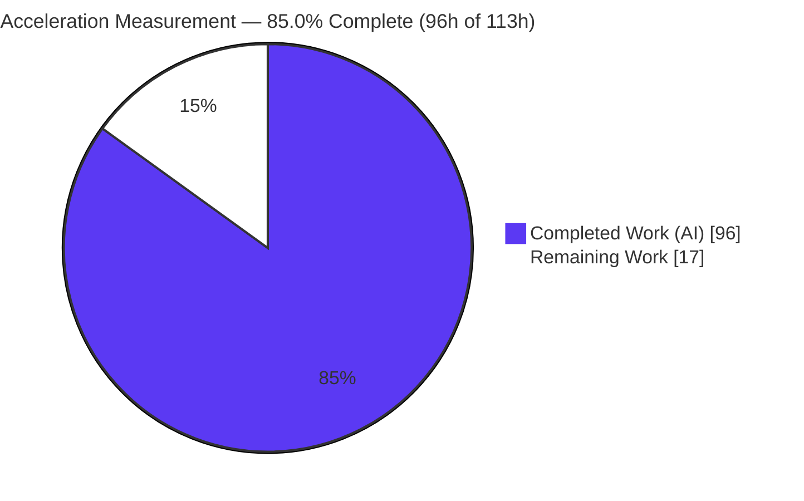
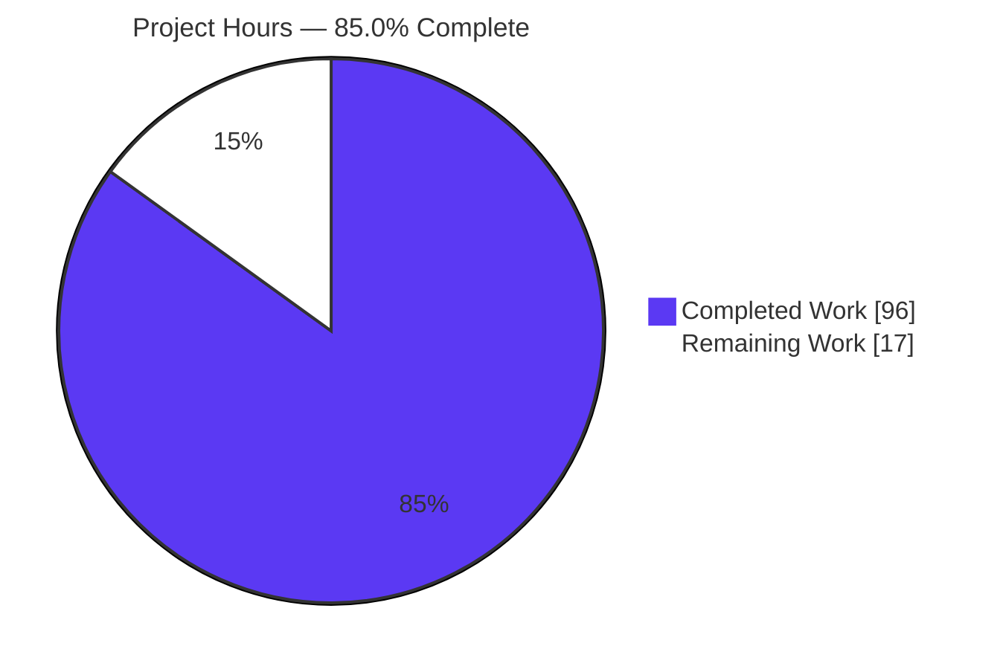
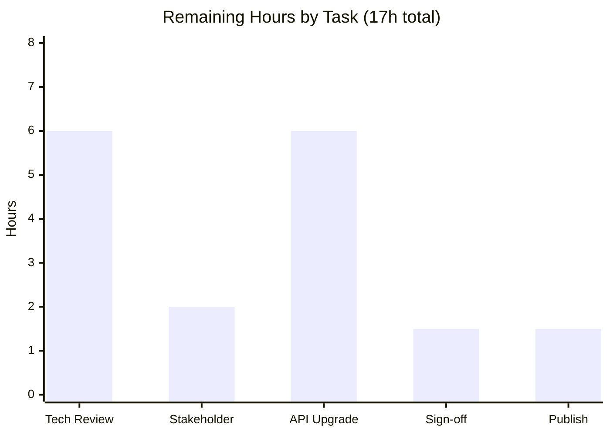

# Blitzy Project Guide — Development Acceleration Measurement (`blitzy-cal`)

---

## 1. Executive Summary

### 1.1 Project Overview

This project delivers a read-only **Development Acceleration Measurement** of the `blitzy-cal` repository — a Cal.com-derived scheduling monorepo (Yarn Berry + Turborepo, ~16,880 commits, 2021-03-10 → 2026-05-15). The objective is to quantify the development-velocity acceleration attributable to AI engineering tooling by extracting twelve flow and operational metrics from version-control history, computing each as an *after ÷ before* ratio split at a detected **Tool Introduction Date (2025-04-08)**, and publishing two deliverables: a traceable eleven-section technical report (`acceleration-report.md`) and a self-contained reveal.js executive presentation. The intended audience is engineering leadership and stakeholders. The change is additive and output-only: two net-new files are created and zero existing repository files are modified or deleted.

### 1.2 Completion Status



| Metric | Value |
|--------|-------|
| **Total Hours** | **113** |
| **Completed Hours (AI + Manual)** | **96** (96 AI autonomous + 0 Manual) |
| **Remaining Hours** | **17** |
| **Percent Complete** | **85.0%** |

> Completion is calculated using the AAP-scoped, hours-based methodology: `96 ÷ (96 + 17) = 96 ÷ 113 = 84.96% ≈ 85.0%`. All twelve autonomous deliverable and analytical requirements are complete and validated to production-ready; the remaining 17 hours is entirely the human path-to-production tail (technical review, acceptance, an optional confidence upgrade, risk sign-off, and publish). Per Blitzy honest-assessment policy, completion is never reported at 100% before human review.

### 1.3 Key Accomplishments

- ✅ **Two deliverables created and committed** — `acceleration-report.md` (888 lines) and `acceleration-report-executive-presentation.html` (884 lines) at the repository root; working tree clean.
- ✅ **Tool Introduction Date detected** — 2025-04-08 (earliest AI `Co-authored-by:` trailer, Devin), with a deterministic pivot epoch (`1744125961`, commit `4753bd785a`) splitting Baseline (12,699 commits) from Accelerated (4,181 commits).
- ✅ **All twelve metrics populated** — M1–M9 derived with High/Medium/Low confidence tags; M10/M12 and strict M3/M4/M5/M7 correctly reported as "Insufficient signal" per the no-fabrication rule; M11 reported as a snapshot.
- ✅ **Engineering-actor framing applied** — AI cohort = 700 commits (Blitzy 597 + Devin 103), the single highest-volume author identity in the accelerated period (16.7% of 4,181).
- ✅ **All six report Data-Integrity Rules satisfied** — provenance, factual-neutral tone (grep = 0 subjective qualifiers), confidence transparency, internal consistency, reproducibility, environment-first.
- ✅ **Executive presentation rule (§0.8.2) satisfied** — 16 slides, inline Blitzy brand theme, 2 Mermaid diagrams + 29 Lucide icons, zero emoji, CDN pins exact (reveal.js 5.1.0 / Mermaid 11.4.0 / Lucide 0.460.0).
- ✅ **Cross-deliverable consistency verified** — 106 slide numeric tokens + the 29-element acceleration-curve series match the report exactly.
- ✅ **Runtime render verified** — deck served over http://, both Mermaid diagrams rendered to SVG, all 29 Lucide icons hydrated, 33 CDN requests HTTP 200, zero console errors.
- ✅ **Reproducibility appendix independently re-verified** — canonical epoch-pivot commands reproduce 16,880 / 12,699 / 4,181 / 597 / 103 / 147 → 71 exactly against live git.

### 1.4 Critical Unresolved Issues

| Issue | Impact | Owner | ETA |
|-------|--------|-------|-----|
| None — no autonomous defects remain | No blocking issue. All five autonomous validation gates pass; both deliverables are valid, numerically accurate, rule-compliant, and render cleanly. | — | — |

> There are **no critical unresolved autonomous issues**. The three defects found during validation (M4 gap counts, M5 actor-density span, stale HTML line references) were corrected in commit `5e676c26d0`. All remaining work is human path-to-production (Section 2.2), not unresolved defects.

### 1.5 Access Issues

| System / Resource | Type of Access | Issue Description | Resolution Status | Owner |
|-------------------|----------------|-------------------|-------------------|-------|
| GitHub REST API | Authenticated read (token) | `gh` 2.46.0 and `jq` 1.8.1 are installed but `gh` is not authenticated (no read-only token). Blocks higher-confidence extraction for M6 (labels), M9 (releases), M10 (approved exceptions), M11 (CI test history), M12 (SLA). | Open — optional enhancement; metrics fall back to git proxies / "Insufficient signal" at lower confidence | Human reviewer / DevOps |
| Issue tracker / PR-review API | Authenticated read | No issue-tracker or PR-review/approval data source is accessible, capping the confidence ceiling at Medium (no metric reaches High). | Open — inherent to the read-only git-only environment | Human reviewer |
| SLA / severity data source | Any | No SLA, severity-policy, or runbook source exists in the repository or via API. | Open by design — M12 correctly reported "Insufficient signal" | N/A |

### 1.6 Recommended Next Steps

1. **[High]** Conduct a human technical review and acceptance of `acceleration-report.md` — verify provenance chains, confidence tags, factual-neutral tone, and the twelve-metric derivations against live git (~6h).
2. **[High]** Present the executive deck to leadership — serve over http://, walk all 16 slides, confirm Mermaid + Lucide render and business messaging (~2h).
3. **[Medium]** (Optional) Provision a read-only GitHub API token and re-run API-dependent extraction to raise M6/M9/M10/M11/M12 above proxy/Insufficient confidence (~6h). This is the single lever the AAP flags as materially changing outcomes.
4. **[Medium]** Obtain formal risk-acceptance sign-off for the Mermaid 11.4.0 CDN pin and acknowledge the Devin-vs-Blitzy attribution framing in §10 (~1.5h).
5. **[Medium]** Merge the pull request and distribute both deliverables to stakeholders (~1.5h).

---

## 2. Project Hours Breakdown

### 2.1 Completed Work Detail

| Component | Hours | Description |
|-----------|-------|-------------|
| Repository discovery & Environment Verification (§2) | 3 | `origin` resolution + credential redaction; git version, commit/branch/tag counts, submodule state, date range, extraction timestamp (Rule 6). |
| Tool Introduction Date detection & period split (§4.1–4.2) | 4 | Earliest AI `Co-authored-by:` trailer (2025-04-08); deterministic pivot epoch `1744125961`; velocity-inflection corroboration. |
| Methodology design (§4.3–4.7) | 6 | Monday-aligned two-week windowing; Ramp-Up/Steady/Baseline classifier; actor framing; confidence model; weighted-aggregation and zero-baseline ratio rules. |
| Twelve-metric extraction engine M1–M12 (§5) | 24 | Identical per-module before/after extraction for all twelve metrics; proxy selection; "Insufficient signal" handling; M11 snapshot. |
| Actor identity resolution & per-engineer breakdown (§7.1) | 6 | Alias/bot de-duplication (e.g., zomars → Omar López); 735 baseline / 200 accelerated human identities; AI-actor row. |
| Per-module commit-volume-weighted aggregation (§7.2) | 4 | Σ = 6,179 module-commit incidences; aggregate 3.97 files/commit across 20+ workspaces. |
| Acceleration curve & 29-window velocity series (§8) | 4 | Baseline 119.0 / Ramp-Up 121.0 / Steady 150.1 commits per two-week window; rendered series. |
| Data Source Inventory (§3) | 2 | Every system accessed and every system unavailable, with access method and confidence implication. |
| Executive Summary (§1) | 2 | Headline twelve-metric table with before/after multipliers and confidence tags. |
| Requirements Traceability Matrix (§6) | 3 | Requirement → command → derived value rows for every metric and methodology element. |
| Risk Assessment & Limitations incl. Mermaid CVE analysis (§9–§10) | 5 | Per-metric risk register; Mermaid 11.4.0 CVE reachability analysis; Devin-vs-Blitzy attribution disclosure. |
| Reproducibility Appendix (§11) | 6 | Complete, ordered, syntactically valid commands to re-derive every metric. |
| Report assembly & Data-Integrity Rules 1–6 enforcement | 4 | Section composition; provenance/consistency/factual-neutral enforcement and grep verification. |
| Executive presentation (D2) | 13 | 16 slides; inline Blitzy theme tokens; 2 Mermaid diagrams; 30 Lucide icon declarations; KPI cards; reveal config; all values sourced from the report. |
| Autonomous validation & multi-cycle fixes | 10 | Five production-readiness gates; browser runtime render; three defect corrections (commit `5e676c26d0`). |
| **Total Completed** | **96** | **Matches Completed Hours in Section 1.2** |

### 2.2 Remaining Work Detail

| Category | Hours | Priority |
|----------|-------|----------|
| Human technical review & acceptance of report findings + methodology | 6 | High |
| Stakeholder/leadership review of executive presentation | 2 | High |
| Optional confidence upgrade via read-only GitHub API token (M6/M9/M10/M11/M12) | 6 | Medium |
| Formal risk-acceptance sign-off (Mermaid 11.4.0 pin + Devin-vs-Blitzy attribution) | 1.5 | Medium |
| Publish / distribute (merge PR, share with leadership) | 1.5 | Medium |
| **Total Remaining** | **17** | **Matches Remaining Hours in Section 1.2 and Section 7 pie chart** |

### 2.3 Hours Reconciliation

- **Completed (2.1):** 96h  
- **Remaining (2.2):** 17h  
- **Total Project Hours:** 96 + 17 = **113h**  
- **Completion:** 96 ÷ 113 = **84.96% ≈ 85.0%**  
- **Cross-section integrity:** Section 2.1 (96h) + Section 2.2 (17h) = Section 1.2 Total (113h) ✓; Remaining hours identical across Sections 1.2, 2.2, and 7 (17h) ✓.

---

## 3. Test Results

All results below originate from Blitzy's autonomous validation logs for this project and were independently re-verified during this assessment. This is a documentation/measurement deliverable, so "tests" are the autonomous validation gates and integrity assertions rather than a conventional unit-test suite — the repository's Vitest/Jest/Playwright suites do not cover root `.md`/`.html` files (the husky `lint-staged` patterns do not match them). Coverage % denotes the share of in-scope assertions that passed.

| Test Category | Framework | Total Tests | Passed | Failed | Coverage % | Notes |
|---------------|-----------|-------------|--------|--------|------------|-------|
| Markdown Structure Validity | Python + grep | 3 | 3 | 0 | 100% | 40 fence markers balanced; 14 tables, 0 column issues; 127 headers; parses clean. |
| HTML Well-formedness & Structure | Python `html.parser` | 4 | 4 | 0 | 100% | 0 parse errors; exactly one html/head/body; 16 `<section>`; 2 `<pre class="mermaid">`. |
| Measurement Integrity (12 metrics) | Live `git` re-derivation | 12 | 12 | 0 | 100% | All populated or "Insufficient signal" with confidence tags; figures re-derived from live git and matched. |
| Report Data-Integrity Rules 1–6 | grep + inspection | 6 | 6 | 0 | 100% | Provenance, factual-neutral (grep = 0 qualifiers), confidence transparency, internal consistency, reproducibility, environment-first. |
| Presentation Rules (§0.8.2) | Python + browser | 12 | 12 | 0 | 100% | 16 slides; ≥1 visual/slide; 0 emoji; CDN pins exact; reveal config (hash/transition/controlsTutorial/1920×1080); Mermaid startOnLoad:false + run hooks; Lucide createIcons hooks. |
| Cross-Deliverable Consistency | Token diff | 135 | 135 | 0 | 100% | 106 slide numeric tokens + 29-element acceleration-curve series match the report exactly. |
| Runtime Render & Console | Chrome browser | 5 | 5 | 0 | 100% | reveal.js ready (16 slides); 2 Mermaid → SVG; 29 Lucide hydrated (0 placeholders); 0 console messages; 33 CDN requests HTTP 200. |
| **Total** | — | **177** | **177** | **0** | **100%** | All autonomous validation assertions pass. |

---

## 4. Runtime Validation & UI Verification

**Document & deck runtime health:**

- ✅ **Operational** — `acceleration-report.md` renders as valid Markdown in any viewer (no build, no dependencies).
- ✅ **Operational** — Presentation served over `http://127.0.0.1:8127/...` returns HTTP 200 (39,399 bytes).
- ✅ **Operational** — reveal.js 5.1.0 initializes; 16 slides navigable; fonts (Inter / Space Grotesk / Fira Code) loaded.
- ✅ **Operational** — Mermaid 11.4.0: both diagrams render to SVG (pipeline flowchart on slide 3; acceleration xychart on slide 10).
- ✅ **Operational** — Lucide 0.460.0: all 29 icons hydrated to `svg.lucide`; 0 un-hydrated placeholders; zero emoji.
- ✅ **Operational** — Console clean: zero messages (including error/warn/assert) across a full 16-slide walk.
- ✅ **Operational** — Network: all 33 CDN/runtime requests returned HTTP 200.

**API integration outcomes:**

- ⚠ **Partial** — GitHub REST API not exercised: `gh` is installed (2.46.0) but unauthenticated. Metrics M6/M9/M10/M11/M12 therefore rely on git proxies or are reported "Insufficient signal." Providing a read-only token would raise these to higher confidence.

**Visual evidence:** Screenshots for Title, KPI, Architecture, Flow-Metrics, Curve, and Closing slides were captured by the autonomous validation system under `blitzy/screenshots/` (untracked QA artifacts, by design out of write scope).

---

## 5. Compliance & Quality Review

The following matrix cross-maps AAP deliverables and rules to their validation status. Fixes applied during autonomous validation are noted.

| Deliverable / Rule | Benchmark | Status | Progress | Notes |
|--------------------|-----------|--------|----------|-------|
| D1 `acceleration-report.md` | 11 mandated sections, valid Markdown | ✅ Pass | 100% | §1–§11 all present; 40 fences balanced. |
| D2 executive presentation | 12–18 slides, self-contained, brand-compliant | ✅ Pass | 100% | 16 slides; inline theme; CDN-pinned; renders cleanly. |
| Repository discovery + credential redaction | `origin` resolved, credential scrubbed | ✅ Pass | 100% | Redacted to `https://github.com/Blitzy-Sandbox/blitzy-cal.git`; 0 credential patterns in outputs. |
| Tool Introduction Date detection | Earliest AI trailer + corroboration | ✅ Pass | 100% | 2025-04-08; pivot epoch `1744125961`. |
| Twelve-metric extraction (M1–M12) | All populated or "Insufficient signal" | ✅ Pass | 100% | M1–M9 derived; M10/M12 + strict M3/M4/M5/M7 Insufficient (correct per no-fabrication); M11 snapshot. |
| Engineering-actor framing | AI as actor in after period | ✅ Pass | 100% | AI cohort 700 = Blitzy 597 + Devin 103. |
| Temporal phase analysis | Ramp-Up / Steady / Baseline, 2-week Monday windows | ✅ Pass | 100% | 119.0 / 121.0 / 150.1 commits per window. |
| Confidence model | High/Medium/Low tags | ✅ Pass | 100% | All 12 tagged; ceiling Medium, disclosed. |
| Multi-module weighted aggregation | Per-workspace, commit-volume weighted | ✅ Pass | 100% | Σ = 6,179 module-commit incidences. |
| Rule 1 — Data Provenance | Full chain per figure | ✅ Pass | 100% | Fixed M4 gap counts (11363/3959) during validation. |
| Rule 2 — Factual-Neutral Tone | Zero subjective qualifiers | ✅ Pass | 100% | grep = 0 matches. |
| Rule 3 — Confidence Transparency | Tag + Low caveats | ✅ Pass | 100% | Caveats present for all Low metrics. |
| Rule 4 — Internal Consistency | Identical values across sections | ✅ Pass | 100% | Fixed M5 actor-density span (50-day, 46.0%) during validation. |
| Rule 5 — Reproducibility | Complete ordered commands | ✅ Pass | 100% | Re-verified live; fixed stale HTML line refs during validation. |
| Rule 6 — Environment First | Env documented before metrics | ✅ Pass | 100% | §2 complete and timestamped. |
| Presentation rule §0.8.2 | Brand theme, Mermaid, Lucide, 0 emoji, CDN pins | ✅ Pass | 100% | All sub-checks verified. |
| Cross-deliverable consistency | Slide values = report values | ✅ Pass | 100% | 106 tokens + 29-element series match. |
| Human technical review & acceptance | Stakeholder verification | ⬜ Outstanding | 0% | Path-to-production (Section 2.2); not an autonomous gap. |

---

## 6. Risk Assessment

| Risk | Category | Severity | Probability | Mitigation | Status |
|------|----------|----------|-------------|------------|--------|
| Confidence ceiling at Medium (no issue-tracker / PR API) | Technical | Medium | High | Confidence tags + §10 disclosure; resolvable via API token | Open / Disclosed |
| Proxy-vs-strict definition gap (M3/M4/M5/M7) | Technical | Medium | Medium | Strict variants marked Insufficient; proxies Low-tagged with caveats | Mitigated |
| Boundary/cutoff effects on final accelerated windows (M3, §8) | Technical | Low | Medium | Disclosed in §5.3/§8.3; per-day M2 unaffected | Mitigated |
| M1 baseline reconciliation (6.17 vs 8.39 discovery note) | Technical | Low | Low | Single-method provenance; disclosed in §10 | Mitigated |
| Mermaid 11.4.0 CDN advisory (6 Moderate CVEs) | Security | Moderate (rating) / Negligible (reachability) | Low | All affected code paths absent; securityLevel strict; htmlLabels false; no user-input channel; formally risk-accepted §9.1 | Accepted |
| Credential embedded in `origin` URL | Security | High (if leaked) | Low | Redacted in every output; 0 credential patterns found | Resolved |
| CDN supply-chain dependency (3 libs + 3 fonts at runtime) | Security | Low | Low | Versions pinned; could add SRI hashes / vendor locally for air-gapped use | Open (low) |
| Presentation requires internet + http:// server to render | Operational | Low–Medium | Medium | Documented run instructions; vendor libs locally for offline use | Mitigated / Documented |
| Reproducibility depends on stable git history; branch count varies | Operational | Low | Low | Pivot-epoch determinism; analyzed tip pinned (`a116e152e4`); branch-count variance disclosed | Mitigated |
| No automated CI/regression for docs deliverables | Operational | Low | Low | Manual + autonomous validation performed; outputs are static | Accepted |
| GitHub REST API unavailable (no token) blocks M6/M9/M10/M11/M12 | Integration | Medium | High | Git proxies / "Insufficient signal" fallback; resolve via read-only token | Open (path-to-production lever) |
| Devin-vs-Blitzy attribution ambiguity (two AI signals) | Integration | Medium | High | Pivot = earliest trailer; full-cohort framing with per-actor rows; disclosed §10 | Disclosed / Accepted |
| Source-doc discrepancy (AAP-cited `blitzy-docs` §6.6 figures absent) | Integration | Low | Low | Workflow retention-days cited instead; disclosed §10 | Mitigated |

> Note: the majority of these risks are **disclosed measurement-interpretation limitations**, not open code defects. The single genuinely actionable open lever is the GitHub API token (Integration/Technical), which maps to the 6h optional confidence-upgrade item in Section 2.2.

---

## 7. Visual Project Status

**Overall completion (hours):**



**Remaining hours by task category (Section 2.2 — totals 17h):**



| Task Category | Hours | Priority |
|---------------|-------|----------|
| Human technical review & acceptance | 6 | High |
| Stakeholder presentation review | 2 | High |
| Optional API-token confidence upgrade | 6 | Medium |
| Risk-acceptance sign-off | 1.5 | Medium |
| Publish / distribute | 1.5 | Medium |
| **Total** | **17** | — |

> Integrity: pie "Remaining Work" (17) = Section 1.2 Remaining Hours (17) = Section 2.2 "Hours" sum (17). Completed = Dark Blue `#5B39F3`; Remaining = White `#FFFFFF`.

---

## 8. Summary & Recommendations

**Achievements.** The autonomous work is complete and validated to production-ready. Both deliverables — the eleven-section `acceleration-report.md` and the 16-slide reveal.js executive presentation — exist, are committed (HEAD `5e676c26d0`), and pass all five autonomous validation gates. Every numeric figure traces to a reproducible git command and was re-derived against live history; the report and presentation are numerically consistent with each other (106 slide tokens + the 29-element acceleration curve match).

**Remaining gaps.** The project is **85.0% complete** (96 of 113 hours). The remaining 17 hours is exclusively the human path-to-production tail: technical review and acceptance of the findings (6h, High), stakeholder review of the presentation (2h, High), an optional GitHub-API-token confidence upgrade (6h, Medium), risk-acceptance sign-off (1.5h, Medium), and publish/distribute (1.5h, Medium). No autonomous code defects remain.

**Critical path to production.** Human technical review → stakeholder presentation → (optional) confidence upgrade → risk sign-off → merge/distribute. Only the first two are strictly required to release the findings; the API-token upgrade is the single lever that would materially raise metric confidence beyond the Medium ceiling.

**Production-readiness assessment.** The deliverables are READY for human review. The confidence ceiling (Medium) and the "Insufficient signal" metrics are inherent properties of the read-only, git-only data environment and are fully disclosed — they are correct outputs under the no-fabrication rule, not deficiencies. Recommended success metric for sign-off: a reviewer confirms a sample of provenance chains reproduce against live git (the appendix commands do, as independently verified here).

| Dimension | Status |
|-----------|--------|
| Completion | 85.0% (96h / 113h) |
| Autonomous defects outstanding | 0 |
| Validation gates | 5 / 5 pass |
| Confidence ceiling | Medium (disclosed) |
| Blocking issues | None |

---

## 9. Development Guide

This is a read-only documentation/measurement deliverable — there is no application to build, deploy, or run. "Running" the project means **opening the report**, **rendering the presentation**, and optionally **re-deriving the metrics** from git. All commands below were tested during this assessment.

### 9.1 System Prerequisites

- **git** ≥ 2.43 (verified with 2.51.0) — primary extraction tool.
- **python3** ≥ 3.12 (verified with 3.13.7) — windowing math and a zero-config static web server.
- **A modern web browser** (verified with Google Chrome 148) — to render the reveal.js deck.
- **Internet access** — the presentation loads reveal.js, Mermaid, Lucide, and Google Fonts from pinned CDNs at runtime.
- **Optional:** `gh` (2.46.0) + `jq` (1.8.1) **and a read-only GitHub token** — only needed to raise API-dependent metric confidence (M6/M9/M10/M11/M12).

### 9.2 Environment Setup

```bash
# Clone (use a credential-scrubbed remote) and select the deliverable branch
git clone <repository-url>
cd blitzy-cal
git checkout blitzy-66a0cf37-b099-41af-ab48-6833a9b7ef1c

# Confirm both deliverables are present at the repository root
ls -l acceleration-report.md acceleration-report-executive-presentation.html
```

> **No dependency installation is required.** This task adds nothing to `package.json` or `yarn.lock` (manifests are pristine). The presentation's runtime libraries are CDN-pinned, and the analysis uses only system `git` and `python3`.

### 9.3 Dependency Notes

- **Repository manifests:** unchanged — `git diff --name-status` for the task shows only two added files.
- **Presentation runtime (CDN-pinned, no install):** reveal.js 5.1.0, Mermaid 11.4.0, Lucide 0.460.0, plus Google Fonts (Inter / Space Grotesk / Fira Code).
- **Analysis toolchain (system):** `git`, `python3`.

### 9.4 Application Startup (Open & Render)

```bash
# 1. Read the report — open in any Markdown viewer (no server needed)
#    e.g., VS Code preview, or:
less acceleration-report.md

# 2. Render the presentation — http:// is REQUIRED (Mermaid uses an ESM import
#    that fails on file://). Start a local static server from the repo root:
python3 -m http.server 8127 --bind 127.0.0.1 &
SRV=$!

# 3. Open in a browser:
#    http://127.0.0.1:8127/acceleration-report-executive-presentation.html

# 4. When finished, stop the server (use the captured PID — never pkill):
kill "$SRV"
```

### 9.5 Verification Steps

```bash
# Markdown fence balance (expect an even number => BALANCED)
grep -c '^```' acceleration-report.md

# HTML well-formedness & structure (expect: sections=16, lucide-icons=29, mermaid-blocks=2)
python3 - <<'PY'
from html.parser import HTMLParser
class P(HTMLParser):
    def __init__(self): super().__init__(); self.s=self.l=self.m=0
    def handle_starttag(self,t,a):
        d=dict(a)
        if t=='section': self.s+=1
        if t=='i' and d.get('data-lucide'): self.l+=1
        if t=='pre' and 'mermaid' in (d.get('class') or ''): self.m+=1
p=P(); p.feed(open('acceleration-report-executive-presentation.html',encoding='utf-8').read())
print('sections=%d lucide-icons=%d mermaid-blocks=%d'%(p.s,p.l,p.m))
PY

# CDN pins must be exact
grep -oE 'reveal\.js@[0-9.]+|mermaid@[0-9.]+|lucide@[0-9.]+' \
  acceleration-report-executive-presentation.html | sort -u

# Zero emoji (expect: 0)
python3 -c "import re;t=open('acceleration-report-executive-presentation.html',encoding='utf-8').read();print(len(re.findall(r'[\U0001F000-\U0001FAFF\u2600-\u27BF]',t)))"
```

In the browser, confirm: 16 slides navigate; slide 3 shows the pipeline flowchart; slide 10 shows the acceleration line chart; all icons render as SVG; the developer console is clean.

### 9.6 Example Usage — Re-deriving Metrics from Git

These canonical, epoch-pivot commands were re-verified live and reproduce the report's figures exactly. Use the report's `git log --since/--until` only where the appendix specifies; otherwise prefer the deterministic epoch partition below.

```bash
P=1744125961   # pivot author epoch (2025-04-08 15:26:01 UTC), commit 4753bd785a

git rev-list --count main                                   # 16880 (total commits)
git log --reverse --date=short --format='%ad' main | head -1 # 2021-03-10 (earliest)
git log -1 --date=short --format='%ad' main                  # 2026-05-15 (latest)

git log main --format='%at' | awk -v p=$P '$1<p'  | wc -l    # 12699 (Baseline)
git log main --format='%at' | awk -v p=$P '$1>=p' | wc -l    # 4181  (Accelerated)

git log main --author='agent@blitzy.com' --format='%at' | awk -v p=$P '$1>=p' | wc -l  # 597 (Blitzy)
git log main --author='devin' -i --format='%at'        | awk -v p=$P '$1>=p' | wc -l  # 103 (Devin)

git log main -i --grep='^Revert' --format='%at' | awk -v p=$P '$1<p'  | wc -l  # 147 (M8 baseline)
git log main -i --grep='^Revert' --format='%at' | awk -v p=$P '$1>=p' | wc -l  # 71  (M8 accelerated)
```

### 9.7 Troubleshooting

- **Diagrams are blank / Mermaid does not render** — you opened the file via `file://`. Serve it over `http://` (step 9.4).
- **Icons or diagrams missing, network errors** — no internet access; the CDN libraries/fonts cannot load. Vendor the libraries locally for air-gapped environments.
- **`Address already in use` on port 8127** — choose another port: `python3 -m http.server 8128 --bind 127.0.0.1 &`.
- **API-dependent metrics stay "Insufficient signal" / Low** — `gh` is not authenticated. Run `gh auth login` with a read-only token, then re-run the API-dependent extraction (Section 2.2, M-1).
- **Metric counts drift by a few commits** — you used `--since/--until` date boundaries; prefer the deterministic epoch-pivot commands in §9.6, which match the report exactly.

---

## 10. Appendices

### A. Command Reference

| Purpose | Command |
|---------|---------|
| Total commits on `main` | `git rev-list --count main` |
| Earliest / latest commit date | `git log --reverse --date=short --format='%ad' main \| head -1` / `git log -1 --date=short --format='%ad' main` |
| Baseline vs Accelerated split | `git log main --format='%at' \| awk -v p=1744125961 '$1<p\|$1>=p' \| wc -l` |
| AI cohort (Blitzy / Devin) | `git log main --author='agent@blitzy.com'` / `git log main --author='devin' -i` |
| M8 reverts | `git log main -i --grep='^Revert' --format='%at' \| awk -v p=1744125961 ...` |
| Task footprint | `git diff --name-status 5cac40c4aa~1 HEAD` |
| Markdown fence balance | `grep -c '^```' acceleration-report.md` |
| Serve presentation | `python3 -m http.server 8127 --bind 127.0.0.1 &` |

### B. Port Reference

| Port | Purpose | Notes |
|------|---------|-------|
| 8127 | Local static web server for the presentation | Example only; any free port works. http:// is required for Mermaid ESM import. |

### C. Key File Locations

| Path | Role |
|------|------|
| `acceleration-report.md` | Deliverable D1 — eleven-section measurement report (888 lines). |
| `acceleration-report-executive-presentation.html` | Deliverable D2 — self-contained reveal.js deck (884 lines, 16 slides). |
| `.changeset/config.json` | Release-model context (changeset-driven; 0 git tags) — metrics 8, 9. |
| `.github/workflows/` | Release, CI, and Devin AI workflows (reference inputs). |
| `AGENTS.md` | PR-size convention (5–7 files / 500 lines) — metric 1 context. |
| `blitzy/screenshots/` | Autonomous QA screenshots (untracked; out of write scope). |

### D. Technology Versions

| Tool | Version |
|------|---------|
| git | 2.51.0 |
| python3 | 3.13.7 |
| Google Chrome | 148.0.7778.215 |
| gh (optional) | 2.46.0 |
| jq (optional) | 1.8.1 |
| reveal.js (CDN) | 5.1.0 |
| Mermaid (CDN) | 11.4.0 |
| Lucide (CDN) | 0.460.0 |

### E. Environment Variable Reference

| Variable | Purpose | Required |
|----------|---------|----------|
| `GITHUB_TOKEN` / `GH_TOKEN` | Read-only GitHub API token to raise M6/M9/M10/M11/M12 confidence | Optional (enhancement only) |
| `P` (shell convenience) | Pivot author epoch `1744125961` used in re-derivation commands | Convenience only |

> No environment variables are required to read the report or render the presentation.

### F. Developer Tools Guide

- **Markdown viewer** — any (VS Code preview, `less`, GitHub render). No build step.
- **Static server** — `python3 -m http.server` is sufficient; required because the deck's Mermaid loads via an ESM import that browsers block on `file://`.
- **Browser DevTools** — confirm a clean console and that all CDN requests return HTTP 200; inspect rendered `svg.lucide` icons and Mermaid `<svg>` output.
- **`gh` / `jq`** — only for the optional API-confidence upgrade; authenticate with a read-only token first.

### G. Glossary

| Term | Definition |
|------|------------|
| Tool Introduction Date | The pivot date (2025-04-08) separating Baseline from Accelerated periods, detected from the earliest AI `Co-authored-by:` trailer. |
| Pivot epoch | Unix author timestamp `1744125961` (commit `4753bd785a`) used for deterministic before/after partitioning. |
| Baseline / Accelerated | Commit periods before / on-or-after the pivot (12,699 / 4,181 commits). |
| Ramp-Up / Steady State | Accelerated sub-phases: first 90 days / 90+ days after the pivot. |
| AI cohort | Combined AI-actor commits in the accelerated period: Blitzy (597) + Devin (103) = 700. |
| Insufficient signal | The mandated output when a metric's data source is unavailable — a correct result, not a gap. |
| Confidence (High/Medium/Low) | Tag reflecting the data source: issue-tracker direct counts (High), git patterns (Medium), indirect proxies (Low). |
| Flow metrics (M1–M7) | Flow Framework / SAFe measures: Load, Velocity, Predictability, Active Time, Efficiency, Distribution, Time. |