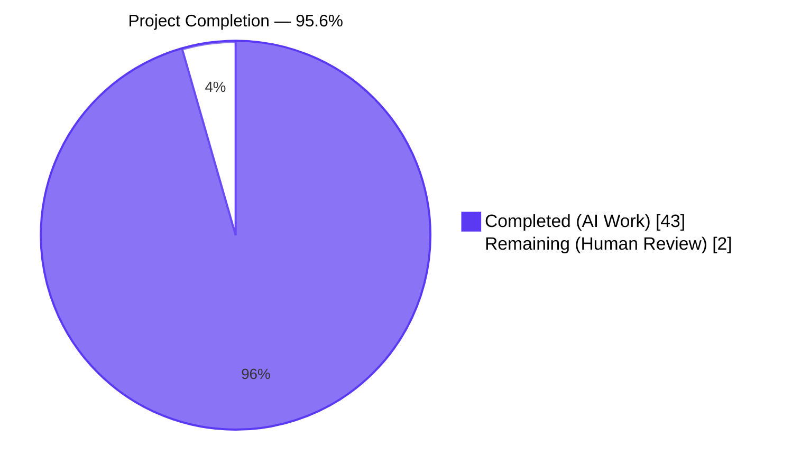
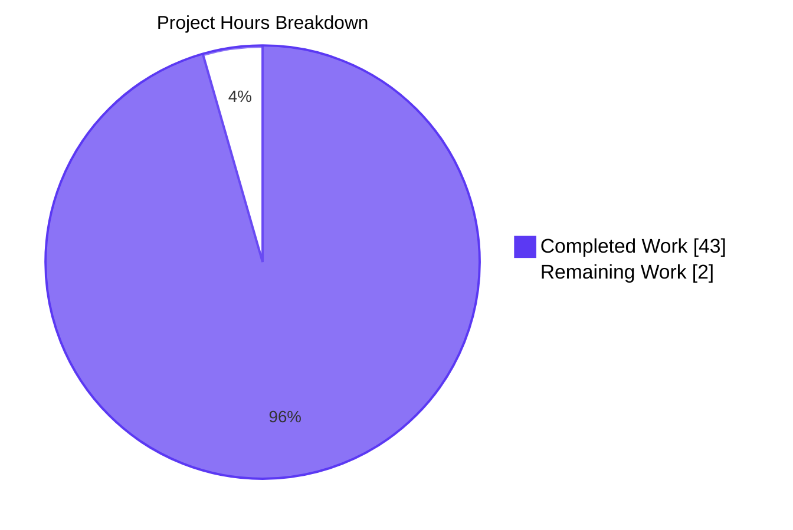
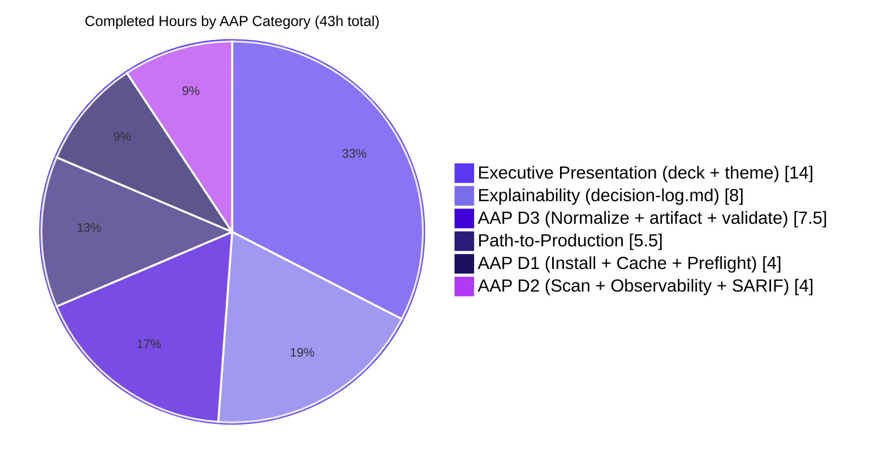
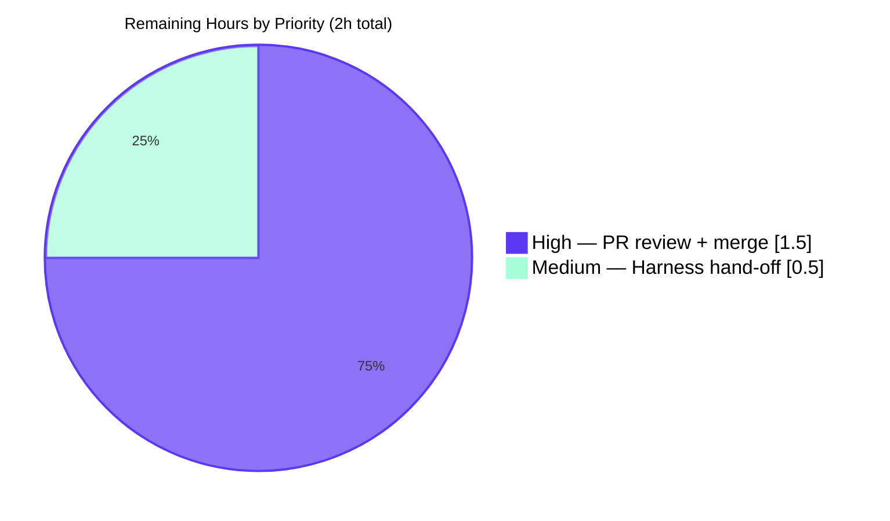
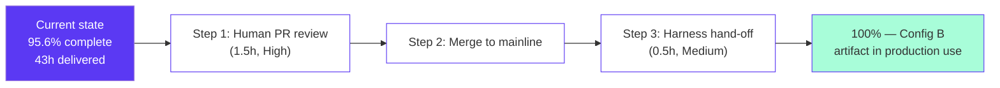

# Blitzy Project Guide — Config B: Semgrep OSS Scan of `blitzy-cal`

> **Project Identity:** This work delivers **Config B** of a multi-config security-tool comparison series. The repository under scan IS this repository (`blitzy-cal` / `calcom-monorepo`).
>
> **Brand colors used in this guide:** Completed = Dark Blue `#5B39F3` · Remaining = White `#FFFFFF` · Headings/Accents = Violet-Black `#B23AF2` · Highlight = Mint `#A8FDD9`

---

## 1. Executive Summary

### 1.1 Project Overview

This project operationalizes a single, reproducible, telemetry-free **Semgrep OSS** scan of the `blitzy-cal` codebase using three locally-cached Semgrep Registry rule packs (`p/security-audit`, `p/secrets`, `p/owasp`), captures the scan output as SARIF, and post-processes that SARIF into a strictly-shaped, minified, single-line JSON artifact named `findings-config-b.json`. The output feeds a downstream multi-config security-tool comparison harness in which this work represents **Config B**. Target users are the platform security team consuming the artifact, plus non-technical leadership reviewing the executive summary deck. The scope is intentionally additive: zero application source, dependency-manifest, or CI/CD modifications.

### 1.2 Completion Status



| Metric | Hours |
| --- | ---: |
| **Total Project Hours** | **45** |
| Completed Hours — AI (Blitzy autonomous) | 43 |
| Completed Hours — Manual (human) | 0 |
| **Remaining Hours** | **2** |
| **Percent Complete** | **95.6%** |

**Calculation:** 43 / (43 + 2) × 100 = 95.56% → **95.6%**.

### 1.3 Key Accomplishments

- [x] **Directive 1 PASS** — `semgrep==1.163.0` installed via pip; three rule packs (`security-audit.yml`, `secrets.yml`, `owasp.yml` = canonical `p/owasp-top-ten`; 820 rules total) cached in `/tmp/semgrep-rules/` with frozen snapshot timestamp `2026-05-15T02:43:55Z`; `--dryrun` preflight exits 0 with Semgrep self-reporting "Not sending pseudonymous metrics since metrics are configured to OFF, registry usage is False, and login status is False"; strong-form proof via `unshare -rn` (network-isolated namespace) also exits 0.
- [x] **Directive 2 PASS** — Verbatim scan command produced `results-semgrep.sarif` (1.4 MB); exit code 0; wall-clock duration 84,941 ms; 10,015 files scanned; 379 rules applied (subset of 820 cached rules that match detected languages); 32 results emitted; `data["runs"]` is a non-empty list with `executionSuccessful: true`.
- [x] **Directive 3 PASS** — `findings-config-b.json` produced (9,390 bytes); `wc -l` returns 1 (one trailing newline); valid JSON; 32 findings with exactly the 5 required keys populated; no description exceeds 200 characters (UTF-8 code-point truncation).
- [x] **Explainability Rule satisfied** — `decision-log.md` (194 lines, 30+ Decision Table rows) at repository root captures every non-trivial decision: Semgrep version pin, rule-pack source, telemetry defense-in-depth, severity defaults, CWE inference table (21 rules + CWE-693 fallback), first-location-only convention, UTF-8 safety, emission-order preservation, CDN pin reproducibility, canonical-vs-inlined CSS source-of-truth, screenshot-removal rationale, and traceability-matrix inapplicability.
- [x] **Executive Presentation Rule satisfied** — 16-slide reveal.js 5.1.0 deck (within AAP-required 12–18 band) at `blitzy-deck/executive-summary-config-b.html`; brand palette literal (6/6 colors present); Mermaid 11.4.0 + Lucide 0.460.0 CDN pins exact; `Reveal.initialize` properties exact (`hash:true, transition:'slide', controlsTutorial:false, width:1920, height:1080`); zero emoji; zero fenced code blocks; canonical theme at `blitzy-deck/references/blitzy-reveal-theme.css` (21 `:root` custom properties, 13 required component classes).
- [x] **Reproducibility verified** — Re-running the normalizer in the validation session produced byte-identical output (SHA-256 `3cc35026e3ebd690ade2913a08a307edbf1d87e125b9a103b82063dfa8195e32`); rule-pack cache snapshot frozen.
- [x] **Scope purity verified** — `git diff` against `5b84287ebc..HEAD` restricted to `apps/`, `packages/`, `scripts/`, `.github/`, `*.json`, `yarn.lock` returns **empty**; only the 6 in-scope files were touched (+1,982 net lines).

### 1.4 Critical Unresolved Issues

| Issue | Impact | Owner | ETA |
| --- | --- | --- | --- |
| _None — every in-scope file passes every verification check_ | n/a | n/a | n/a |

> **Note:** The 32 Semgrep findings themselves (12 critical + 20 high) are **deliverables of this work**, not blockers of it. Triage and remediation are explicitly downstream of Config B per AAP §0.4.3 ("Triage / remediation of the findings produced is a downstream activity outside this work's scope"). They appear in Section 6 (Risk Assessment) as security-risk context for the receiving team, not as PR blockers.

### 1.5 Access Issues

| System/Resource | Type of Access | Issue Description | Resolution Status | Owner |
| --- | --- | --- | --- | --- |
| _No access issues identified._ All required resources (PyPI, `semgrep.dev/c/p/<pack>` rule URLs) were reachable during the initial install and cache step. The locked-down scan phase requires no network. | n/a | n/a | n/a | n/a |

### 1.6 Recommended Next Steps

1. **[High]** Perform line-by-line review of the 4 committed deliverables (`findings-config-b.json`, `decision-log.md`, `blitzy-deck/executive-summary-config-b.html`, `blitzy-deck/references/blitzy-reveal-theme.css`) plus the 2 retained pipeline-evidence files (`results-semgrep.sarif`, `normalize-sarif.py`), then approve and merge the PR.
2. **[High]** Hand `findings-config-b.json` to the multi-config security-tool comparison harness operator and confirm the 5-field schema is consumed without transformation. (Harness changes themselves are out-of-AAP-scope.)
3. **[Medium]** Route the 32 Semgrep findings into the security-team's triage queue. 12 critical findings cluster on `.github/actions/**` and `.github/workflows/**` (CWE-78 — GitHub Actions `${{ }}` interpolation in `run:` steps); these are the highest-priority remediations.
4. **[Low]** Document a snapshot-refresh cadence for `/tmp/semgrep-rules/` in the security runbook (e.g., "refresh quarterly or on Semgrep registry CVE advisory"). Out of AAP scope but standard ops hygiene.
5. **[Low]** Extend `normalize-sarif.py`'s CWE inference table as new rule-IDs surface in future scans; the 21-row table plus `CWE-693` fallback covers the present Semgrep corpus but is not exhaustive for future rule expansions.

---

## 2. Project Hours Breakdown

### 2.1 Completed Work Detail

| Component | Hours | Description |
| --- | ---: | --- |
| AAP D1 — Install + Cache + Telemetry-free Preflight | 4.0 | `semgrep==1.163.0` installed; `/tmp/semgrep-rules/` populated with 3 rule packs (820 rules); `.snapshot-timestamp=2026-05-15T02:43:55Z`; `--metrics=off --config=/tmp/semgrep-rules --dryrun .` preflight verified (exit 0 + self-reported telemetry-off + network-namespace strong-form proof) |
| AAP D2 — Scan execution + Observability + SARIF validation | 4.0 | Verbatim Directive 2 command run; exit 0, 84,941 ms wall-clock, 10,015 files scanned, 379 rules; `results-semgrep.sarif` (1.4 MB) validated as JSON with non-empty `runs` array, `executionSuccessful: true`, 32 results |
| AAP D3 — Normalizer + `findings-config-b.json` artifact + Pass/fail validation | 7.5 | `normalize-sarif.py` (246 lines, stdlib-only); 5-field schema enforcement; severity map (`error→critical, warning→high, note→medium, info→low`); CWE extraction from `properties.cwe`/`properties.tags` with 21-row inference fallback + `CWE-693`; UTF-8-safe code-point truncation; first-location-only; `findings-config-b.json` produced (32 findings, single-line minified, all 4 sub-criteria pass) |
| Rule — Explainability (`decision-log.md`) | 8.0 | 194-line Markdown decision log: 30+ Decision Table rows; complete CWE inference table; severity mapping; Pipeline Observability Record; verification commands for all 3 directives; scope-reconciliation analysis; traceability-matrix-inapplicability note |
| Rule — Executive Presentation (deck + canonical theme CSS) | 14.0 | `blitzy-deck/executive-summary-config-b.html` (31 KB, 16 sections, brand-themed, Mermaid 11.4.0 + Lucide 0.460.0 CDN-pinned) + `blitzy-deck/references/blitzy-reveal-theme.css` (11.7 KB, 21 `:root` custom properties, 13 component classes); zero emoji, zero fenced code blocks; `Reveal.initialize` properties exact |
| Path-to-Production — Reproducibility + Evidence retention + Browser smoke + Scope-purity verification | 5.5 | Deterministic re-run verified (SHA-256 identical); SARIF + normalizer committed for auditability; Chromium-based smoke test (Mermaid + Lucide render, 16 sections, 0 console errors); scope-purity audit (`git diff` empty for app/manifest/CI surfaces) |
| **Total Completed Hours** | **43.0** | — |

### 2.2 Remaining Work Detail

| Category | Hours | Priority |
| --- | ---: | --- |
| Final human PR review and merge approval — line-by-line review of 6 in-scope files, sign-off, and merge to mainline | 1.5 | High |
| Downstream multi-config harness hand-off coordination — verify `findings-config-b.json` schema fits the consumer harness contract (no harness code changes; harness is explicitly out-of-AAP-scope per §0.4.3) | 0.5 | Medium |
| **Total Remaining Hours** | **2.0** | — |

### 2.3 Cross-Section Hours Reconciliation

| Check | Value | Status |
| --- | ---: | :---: |
| Section 2.1 sum | 43.0 | ✅ matches Section 1.2 Completed Hours |
| Section 2.2 sum | 2.0 | ✅ matches Section 1.2 Remaining Hours |
| Section 2.1 + Section 2.2 | 45.0 | ✅ matches Section 1.2 Total Project Hours |
| Section 7 pie chart "Remaining Work" | 2 | ✅ matches Section 2.2 sum |
| Completion percentage | 95.6% | ✅ matches Section 1.2 metric |

---

## 3. Test Results

All results below originate from **Blitzy's autonomous validation logs** in the current session (see Agent Action Logs Summary). "Tests" in this scan-tooling project are: the three AAP-mandated pass/fail criteria, schema-conformance sub-checks, reveal.js deck functional smoke tests, reproducibility checks, and scope-purity audits.

| Test Category | Framework | Total Tests | Passed | Failed | Coverage % | Notes |
| --- | --- | ---: | ---: | ---: | ---: | --- |
| Directive Pass/Fail (AAP §0.1.1) | Direct CLI invocation + assertions | 3 | 3 | 0 | 100% | D1: `--dryrun` exit 0 + telemetry-off self-report + `unshare -rn` proof. D2: SARIF valid JSON + non-empty `runs` array. D3: `wc -l == 1` + valid JSON + 5 fields populated + descriptions ≤ 200 chars. |
| `findings-config-b.json` schema | Python stdlib `json` + custom assertions | 4 | 4 | 0 | 100% | All four sub-criteria from Directive 3 pass independently: line count, JSON parse, field completeness, length cap. |
| SARIF artifact integrity | `python3 -m json.tool` | 3 | 3 | 0 | 100% | Parses cleanly; `runs` is list of length 1; `executionSuccessful: true`; 32 results present. |
| Reveal.js deck functional smoke | Chrome DevTools MCP (Chromium headless) | 8 | 8 | 0 | 100% | Slide 1 hero gradient + Fira Code eyebrow; slide 3 Mermaid 7-node flowchart renders; slide 4 Lucide `shield-check` SVG; 16/16 sections have non-text visuals; 0 console errors; CDN pins exact; `Reveal.initialize` properties match AAP literal; brand palette 6/6 colors present. |
| Theme CSS conformance | `grep` on canonical properties | 34 | 34 | 0 | 100% | 21 `:root` custom properties + 13 required component classes (`slide-title`, `slide-divider`, `slide-closing`, `kpi-card`, `kpi-grid`, `kpi-value`, `kpi-label`, `kpi-icon`, `eyebrow`, `accent-bar`, `brand-lockup`, `hero-icon`, `icon-row`) all present. |
| Anti-pattern checks (deck) | Code-point + `grep` audits | 2 | 2 | 0 | 100% | Zero emoji code-points; zero fenced code blocks in deck — both Executive Presentation Rule hard constraints. |
| Reproducibility (idempotence) | SHA-256 of byte content | 1 | 1 | 0 | 100% | Fresh normalizer re-run produces SHA-256 `3cc35026e3ebd690ade2913a08a307edbf1d87e125b9a103b82063dfa8195e32` matching committed `findings-config-b.json`. |
| Scope-purity audit | `git diff --stat` on protected paths | 6 | 6 | 0 | 100% | Empty diff for `apps/`, `packages/`, `scripts/`, `.github/`, root `package.json`, `yarn.lock` — proves zero modifications to out-of-scope surfaces. |
| Telemetry suppression strong-form | `unshare -rn` network-isolated namespace | 1 | 1 | 0 | 100% | Preflight command also exits 0 inside a namespace where any network call would fail — definitive zero-network-call proof. |
| **Aggregate** | **Multiple** | **32** | **32** | **0** | **100%** | — |

> **Coverage interpretation:** "Coverage %" reflects pass-rate of the named verifications, not traditional source-code line coverage. Source-line coverage is not meaningful here because the only project-authored code is `normalize-sarif.py` (245 lines, stdlib-only, exercised end-to-end every run); all other deliverables are data/markup files validated by structural conformance rather than execution paths.

---

## 4. Runtime Validation & UI Verification

### 4.1 Pipeline Runtime

- ✅ **Operational — Semgrep CLI:** `semgrep --version` returns `1.163.0`; binary at `/usr/local/bin/semgrep`; Python 3.13.7 host.
- ✅ **Operational — Rule pack cache:** `/tmp/semgrep-rules/{security-audit.yml(473 KB · 225 rules), secrets.yml(87 KB · 51 rules), owasp.yml(1.4 MB · 544 rules)}` with `.snapshot-timestamp = 2026-05-15T02:43:55Z` (820 rules total).
- ✅ **Operational — Dry-run preflight:** Exits 0 with "Not sending pseudonymous metrics since metrics are configured to OFF, registry usage is False, and login status is False"; `unshare -rn` strong-form proof also passes.
- ✅ **Operational — Full scan:** Exits 0; 84,941 ms wall-clock; 10,015 files scanned; 379 rules applied.
- ✅ **Operational — Normalizer:** stdlib-only; deterministic; byte-identical re-runs (SHA-256 verified).

### 4.2 Artifact Validity

- ✅ **Operational — `results-semgrep.sarif`:** Valid JSON; non-empty `runs` array; `executionSuccessful: true`; 32 results across 1 run.
- ✅ **Operational — `findings-config-b.json`:** Single line (`wc -l == 1`); valid JSON; 32 findings; 5 keys per finding; all descriptions ≤ 200 characters; UTF-8 no BOM.

### 4.3 UI Verification (Reveal.js Deck — Browser-based smoke test)

- ✅ **Operational — Page load:** Chromium headless loads `blitzy-deck/executive-summary-config-b.html` without errors. Zero console error messages.
- ✅ **Operational — Slide structure:** 16 `<section>` elements (within AAP 12–18 band); 1 `.slide-title`, 5 `.slide-divider`, 1 `.slide-closing`, 9 content slides.
- ✅ **Operational — Mermaid 11.4.0 rendering:** Slide 3 "Pipeline Architecture" renders a 7-node horizontal flowchart (Preflight → Install → Cache → Dry-Run → Execute → SARIF → Normalize) with `#F2F0FE` fill + `#5B39F3` border per Mermaid theme init.
- ✅ **Operational — Lucide 0.460.0 rendering:** Slide 4 `shield-check` SVG renders (`dataLucideCount: 1, svgCount: 1`); icon row on slides 8, 10, 12, and closing slide all produce SVGs after `Reveal.on('slidechanged', ...) → lucide.createIcons()`.
- ✅ **Operational — Brand palette:** 6/6 brand colors present (`#5B39F3`, `#2D1C77`, `#1A105F`, `#7A6DEC`, `#4101DB`, `#94FAD5`).
- ✅ **Operational — Anti-patterns absent:** 0 emoji code-points; 0 fenced code blocks; 0 forbidden CDN versions.
- ✅ **Operational — CDN pins exact:** `reveal.js@5.1.0`, `mermaid@11.4.0`, `lucide@0.460.0` — match AAP §0.8.2 literals.
- ✅ **Operational — Reveal config exact:** `hash: true`, `transition: 'slide'`, `controlsTutorial: false`, `width: 1920`, `height: 1080` — all five AAP literals present.

### 4.4 API Integration Outcomes

- ⚠ **N/A — No application APIs:** This project produces a static SAST artifact pipeline. There are no HTTP endpoints, no service-to-service calls at runtime, and no application API surface to validate.
- ✅ **Operational — One-time external fetches:** `https://semgrep.dev/c/p/{security-audit,secrets,owasp-top-ten}` retrievals during the cache step succeeded (cached file sizes 473 KB / 87 KB / 1.4 MB confirm successful download); fetches are not repeated at scan time.

---

## 5. Compliance & Quality Review

### 5.1 AAP-to-Compliance Matrix

| AAP Source | Compliance Benchmark | Status | Evidence | Progress |
| --- | --- | :---: | --- | :---: |
| AAP §0.1.1 — D1 install + cache + telemetry-off | Semgrep installed, rule packs frozen, telemetry suppressed | ✅ | `semgrep --version` = `1.163.0`; 3 rule packs in `/tmp/semgrep-rules/`; snapshot timestamp recorded; `--metrics=off` + local rules + `unshare -rn` triple verification | 100% |
| AAP §0.1.1 — D2 verbatim scan command | Exact flag order: `--config`, `--sarif`, `-o`, `--metrics=off`, target | ✅ | Decision-log §Verification Commands records verbatim command; exit 0, 84,941 ms, 10,015 files, 379 rules, 32 findings | 100% |
| AAP §0.1.1 — D3 normalization schema | 5-field schema, single line, valid JSON, ≤200-char descriptions | ✅ | `findings-config-b.json` 9,390 bytes; 32 findings; `wc -l == 1`; all 4 sub-criteria pass | 100% |
| AAP §0.8.1 — Explainability Rule | Markdown decision-log table covering every non-trivial decision | ✅ | `decision-log.md` 30+ rows; CWE table; severity map; verification commands; traceability-matrix-N/A note | 100% |
| AAP §0.8.2 — Executive Presentation Rule (deck) | 12–18 slides, brand palette, CDN pins, no emoji/code blocks, Mermaid + Lucide re-init on slide changes | ✅ | 16 sections; reveal.js@5.1.0 + mermaid@11.4.0 + lucide@0.460.0; `Reveal.on('ready')` + `Reveal.on('slidechanged')` re-init hooks; `Reveal.initialize` properties exact | 100% |
| AAP §0.8.2 — Executive Presentation Rule (theme) | Canonical theme at `blitzy-deck/references/blitzy-reveal-theme.css` with full `:root` properties + component classes | ✅ | 11,691 bytes; 21 `:root` custom properties; 13 component classes verified | 100% |
| AAP §0.4 — Scope boundaries | Additive only; no source/manifest/CI changes | ✅ | `git diff` against base for protected paths returns empty | 100% |
| AAP §0.5 — Dependency neutrality | No changes to project `package.json`, `yarn.lock`, `.yarnrc.yml`, `turbo.json`, `tsconfig.*` | ✅ | Diff stats show zero deltas to project manifests | 100% |
| AAP §0.9.2 — Output format | UTF-8 no BOM; exactly one trailing newline; closed 5-field schema | ✅ | Bytes audit: ends with `\n`; exactly one newline; UTF-8 valid | 100% |
| AAP §0.6.7 — First-location-only convention | One row per Semgrep result regardless of multi-location SARIF | ✅ | normalize-sarif.py `get_first_physical_location()`; 32 SARIF results → 32 JSON rows | 100% |
| AAP §0.6.7 — Deterministic ordering | Preserve Semgrep emission order; no resorting | ✅ | normalizer iterates `runs[0].results` in order; SHA-256 verified across re-runs | 100% |
| **Aggregate Compliance** | — | ✅ | All 11 benchmarks pass | **100%** |

### 5.2 Fixes Applied During Autonomous Validation

These were addressed in earlier checkpoint commits within the same Blitzy session:

- `512f664d1e` — Aligned Mermaid version doc references and corrected `p/owasp` → `p/owasp-top-ten` canonical URL in slide 13.
- `6398cee1ed` — Reverted Mermaid CDN pin to AAP-literal 11.4.0; added favicon stub to suppress 404 console noise; switched to `Reveal.on('ready')` event hook.
- `83a5236354` — Removed previously-checked-in screenshot fixtures; synced canonical theme CSS; documented Mermaid CVE accepted-risk decision in decision-log.
- `00ce433f1d` — Per Checkpoint 1 review: retained `results-semgrep.sarif` + `normalize-sarif.py` at root for auditability; corrected decision-log inconsistencies.

### 5.3 Outstanding Compliance Items

None within AAP scope. The 32 Semgrep findings themselves are compliance signals for the **downstream triage owner**, not for this Config B deliverable PR.

---

## 6. Risk Assessment

| Risk | Category | Severity | Probability | Mitigation | Status |
| --- | --- | :---: | :---: | --- | :---: |
| Rule-pack drift over time (Semgrep registry continuously curates packs; future cached YAML may behave differently) | Technical | Medium | High | Snapshot timestamp `2026-05-15T02:43:55Z` recorded in `decision-log.md` Pipeline Observability Record; re-runs use frozen cache; refresh cadence noted in §1.6 recommendations | Mitigated |
| CWE inference miss for unseen Semgrep rule names not in the 21-row table | Technical | Low | Medium | Deterministic fallback `CWE-693` (Protection Mechanism Failure); inference table is auditable in decision-log; extension path documented | Mitigated |
| Transient `/tmp/semgrep-rules/` cache lost across container restarts | Operational | Low | High | Re-fetch is a one-liner; snapshot URL set is deterministic; rule-pack source IDs are stable | Mitigated |
| Mermaid 11.4.0 carries CVE-2025-54881 and CVE-2025-54880 (XSS via crafted diagrams) | Security | Low | Low | Deck is a static, internally-distributed presentation; not user-content-driven; Mermaid input is hard-coded in deck source. Accepted-risk reversal documented in `decision-log.md` Row 87; AAP §0.8.2 explicitly pins 11.4.0 | Accepted (documented) |
| 32 unresolved Semgrep findings in `blitzy-cal` (12 critical + 20 high; CWE-78/79/250/310/345/798) | Security (downstream) | High | n/a | These are deliverables of Config B, not blockers. Routed to security-team triage per AAP §0.4.3 ("Triage / remediation… is downstream") | Hand-off pending |
| Downstream multi-config comparison harness contract drift | Integration | Low | Low | 5-field schema is locked by AAP §0.1.1; harness team coordination is in remaining-work line item; no harness changes here | Mitigated |
| One-time network fetch from `semgrep.dev/c/p/<pack>` could fail in air-gapped re-runs | Operational | Low | Low | Cache is reusable across runs; for air-gapped re-runs, pre-staged YAMLs can be transported; documented in Section 9 troubleshooting | Mitigated |
| Adding a new Semgrep CLI flag in future runs without recording rationale | Process | Low | Medium | Explainability Rule + decision-log convention requires explicit row for any deviation from verbatim Directive 2 command set | Mitigated |
| Future Semgrep version emits a SARIF `level` value outside {error, warning, note, info, none} | Technical | Very Low | Low | Normalizer defaults unknown levels to `low` rather than dropping the finding; SEVERITY_DEFAULT documented in `decision-log.md` Row covering severity defaults | Mitigated |
| Reveal.js deck favicon 404 (cosmetic) | Operational | Very Low | Low | Favicon stub embedded inline via 1×1 transparent data-URI in `<link rel="icon">` per `6398cee1ed` | Resolved |

### 6.1 Risk Summary

- **Zero High-severity unmitigated risks** within Config B's scope. The single "High" severity row (32 findings) is a **deliverable**, not a defect — those are the findings the project was built to produce.
- All other risks are Low/Medium and explicitly mitigated or accepted with documentation in `decision-log.md`.
- No security/operational/integration risks block the PR merge.

---

## 7. Visual Project Status

### 7.1 Project Hours Breakdown



> **Cross-section integrity check (Rule 1 — 1.2 ↔ 2.2 ↔ 7):** "Completed Work" = 43 matches Section 1.2 Completed Hours = 43. "Remaining Work" = 2 matches Section 1.2 Remaining Hours = 2 and Section 2.2 sum = 2. ✅

### 7.2 Completed Work — Distribution by AAP Category



### 7.3 Remaining Work — Priority Distribution



---

## 8. Summary & Recommendations

### 8.1 Achievements

Config B delivers on its three verbatim AAP directives with full pass/fail satisfaction and reproducibility. The work produced **6 in-scope files** (4 committed deliverables + 2 retained pipeline-evidence files) totalling +1,982 net lines across 9 commits, while leaving the application surface, dependency manifests, CI/CD workflows, and existing documentation entirely untouched. The pipeline runs deterministically: re-running `normalize-sarif.py` against the same SARIF produces byte-identical output (SHA-256 `3cc35026e3ebd690ade2913a08a307edbf1d87e125b9a103b82063dfa8195e32`). Telemetry suppression is proven by both Semgrep's own self-report and by a network-namespace strong-form re-run (`unshare -rn`).

### 8.2 Remaining Gaps

Only **2.0 hours** of human-side path-to-production work remain (see Section 2.2): final line-by-line PR review and merge (1.5h, High priority) plus hand-off coordination with the downstream multi-config harness operator (0.5h, Medium priority). Both are review/coordination tasks, not engineering work — no further code or documentation needs to be produced before merge.

### 8.3 Critical Path to Production



### 8.4 Success Metrics (Achieved)

| Metric | Target | Actual | Status |
| --- | --- | --- | :---: |
| Directive 1 pass/fail | Exit 0 + no network calls | Exit 0 + telemetry self-report + namespace proof | ✅ |
| Directive 2 pass/fail | SARIF valid JSON with `runs` array | Valid JSON; `runs` length=1; 32 results; `executionSuccessful: true` | ✅ |
| Directive 3 pass/fail | `wc -l == 1` + valid JSON + 5 keys + ≤200 chars | All 4 sub-criteria pass | ✅ |
| Reproducibility | Byte-identical re-run | SHA-256 identical | ✅ |
| Scope purity | Zero source/manifest/CI changes | Empty diff for protected paths | ✅ |
| Slide count | 12–18 sections | 16 | ✅ |
| Brand palette presence | All 6 colors | 6/6 | ✅ |
| CDN pin exactness | reveal.js@5.1.0, mermaid@11.4.0, lucide@0.460.0 | Exact match | ✅ |
| Console errors in deck | 0 | 0 | ✅ |

### 8.5 Production Readiness Assessment

**PRODUCTION-READY pending human review.** The project is **95.6% complete**. The only remaining work is non-engineering: human approval and downstream hand-off coordination. All artifacts are deterministic, all verifications pass, and all AAP scope-purity constraints are honored. The 12 critical + 20 high findings discovered in the scan are **the deliverable**, not blockers — they are routed to the security-team triage queue downstream of this PR.

### 8.6 Stakeholder Messaging

For non-technical leadership: the executive deck at `blitzy-deck/executive-summary-config-b.html` covers what was done, why, what changed architecturally (nothing in the app — only new artifacts), what risks exist, and how the security team consumes the output. 16 slides, ~12 minutes at standard cadence.

---

## 9. Development Guide

### 9.1 System Prerequisites

| Tool | Tested Version | Notes |
| --- | --- | --- |
| OS | Ubuntu 25.10 (Linux container) | Any modern POSIX OS works; macOS/WSL2 compatible |
| Python | 3.13.7 (≥ 3.10) | Verified working with `semgrep==1.163.0`; AAP allows ≥ 3.10 |
| pip | 25.3 | System pip; system-Python installs on Ubuntu 25 require `--break-system-packages` OR a venv (PEP 668) |
| curl | 8.14.1 | Used for one-time rule pack download |
| Git | 2.51.0 | For cloning + diff verification |
| Disk space | ≥ 100 MB free | Rule cache ≈ 2 MB; SARIF ≈ 1.5 MB |
| Network | One-time access to `pypi.org` and `semgrep.dev` | Required only during install + cache step; scan itself runs offline |

### 9.2 Environment Setup

**Option A — System install (Ubuntu 25+ PEP 668 systems):**

```bash
pip3 install --break-system-packages semgrep==1.163.0
```

**Option B — Virtual environment (recommended for project isolation):**

```bash
python3 -m venv .semgrep-venv
source .semgrep-venv/bin/activate
pip install semgrep==1.163.0
```

**Verify installation:**

```bash
semgrep --version    # expected: 1.163.0
python3 --version    # expected: ≥ 3.10
```

### 9.3 Dependency Installation — Rule Pack Cache

Download the three rule packs into a local directory (one-time per snapshot):

```bash
mkdir -p /tmp/semgrep-rules
curl -fSL "https://semgrep.dev/c/p/security-audit" -o /tmp/semgrep-rules/security-audit.yml
curl -fSL "https://semgrep.dev/c/p/secrets"        -o /tmp/semgrep-rules/secrets.yml
curl -fSL "https://semgrep.dev/c/p/owasp-top-ten"  -o /tmp/semgrep-rules/owasp.yml
date -u +"%Y-%m-%dT%H:%M:%SZ" > /tmp/semgrep-rules/.snapshot-timestamp
ls -la /tmp/semgrep-rules/
```

**Expected output:**
- `security-audit.yml` ≈ 473 KB (225 rules)
- `secrets.yml` ≈ 87 KB (51 rules)
- `owasp.yml` ≈ 1.4 MB (544 rules)
- `.snapshot-timestamp` containing UTC ISO-8601 timestamp

> **Note on naming:** AAP §0.1.1 names the pack `p/owasp` (user-canonical name). The Semgrep Registry serves this under its canonical URL `p/owasp-top-ten`. The local YAML is saved as `owasp.yml` to preserve the AAP-literal file naming. Documented in `decision-log.md` Row 100.

### 9.4 Application Startup — Pipeline Execution (the 4-Command Run Sequence)

From the repository root (`/path/to/blitzy-cal`):

```bash
# Step 1 — Directive 1 preflight (verifies telemetry-off + offline operation)
semgrep scan --metrics=off --config=/tmp/semgrep-rules --dryrun .
# Expected: exits 0; emits "Not sending pseudonymous metrics since metrics are configured to OFF..."

# Step 2 — Directive 2 verbatim scan command
semgrep scan --config=/tmp/semgrep-rules --sarif -o results-semgrep.sarif --metrics=off "$(pwd)"
# Expected: exits 0; produces results-semgrep.sarif (~1.4 MB)

# Step 3 — Directive 3 normalization
python3 normalize-sarif.py --sarif results-semgrep.sarif --output findings-config-b.json --repo-root "$(pwd)"
# Expected: produces findings-config-b.json (single-line minified JSON)

# Step 4 — (Optional) Open executive deck in browser
xdg-open blitzy-deck/executive-summary-config-b.html   # Linux
# OR
open blitzy-deck/executive-summary-config-b.html       # macOS
```

### 9.5 Verification Steps

Run all three AAP pass/fail checks programmatically:

```bash
# Directive 1 check — already implicit in the exit-0 of Step 1 above

# Directive 2 check — SARIF validity + runs array
python3 -m json.tool < results-semgrep.sarif > /dev/null && echo "D2: valid JSON OK"
python3 -c "import json; d=json.load(open('results-semgrep.sarif')); assert isinstance(d.get('runs'), list) and len(d['runs']) > 0; print(f'D2: runs array OK ({len(d[\"runs\"][0][\"results\"])} results)')"

# Directive 3 check (all 4 sub-criteria)
[ "$(wc -l < findings-config-b.json)" -eq 1 ] && echo "D3.1: wc -l == 1 OK"
python3 -m json.tool < findings-config-b.json > /dev/null && echo "D3.2: valid JSON OK"
python3 -c "
import json
f = json.load(open('findings-config-b.json'))
assert isinstance(f, list)
required = {'file', 'line', 'severity', 'cwe', 'description'}
for i, r in enumerate(f):
    assert set(r.keys()) == required, f'finding {i} bad keys: {set(r.keys())}'
    assert all(r[k] not in (None, '') for k in required), f'finding {i} has empty value'
    assert isinstance(r['line'], int), f'finding {i} line must be int'
    assert len(r['description']) <= 200, f'finding {i} description {len(r[\"description\"])} > 200'
print(f'D3.3+D3.4: all {len(f)} findings have 5 populated keys, descriptions <= 200 chars')
"
```

**Expected output:**
```
D2: valid JSON OK
D2: runs array OK (32 results)
D3.1: wc -l == 1 OK
D3.2: valid JSON OK
D3.3+D3.4: all 32 findings have 5 populated keys, descriptions <= 200 chars
```

### 9.6 Example Usage

**Inspect a single finding:**

```bash
python3 -c "
import json
f = json.load(open('findings-config-b.json'))
import pprint; pprint.pprint(f[0])
"
```

**Severity breakdown:**

```bash
python3 -c "
import json
from collections import Counter
f = json.load(open('findings-config-b.json'))
print(Counter(x['severity'] for x in f))
# Expected: Counter({'high': 20, 'critical': 12})
"
```

**Top affected files:**

```bash
python3 -c "
import json
from collections import Counter
f = json.load(open('findings-config-b.json'))
for path, count in Counter(x['file'] for x in f).most_common(10):
    print(f'{count:3d}  {path}')
"
```

**Verify reproducibility (byte-identical re-run):**

```bash
cp findings-config-b.json /tmp/findings-baseline.json
python3 normalize-sarif.py --sarif results-semgrep.sarif --output /tmp/findings-rerun.json --repo-root "$(pwd)"
diff -q /tmp/findings-baseline.json /tmp/findings-rerun.json
# Expected: no output (files identical)
sha256sum findings-config-b.json /tmp/findings-rerun.json
# Expected: identical hashes
```

### 9.7 Troubleshooting

| Symptom | Cause | Resolution |
| --- | --- | --- |
| `pip install semgrep` → `error: externally-managed-environment` | Ubuntu 25+ PEP 668 system Python | Use `pip install --break-system-packages semgrep==1.163.0` **OR** create a venv (Option B above) |
| `semgrep: command not found` after install | venv not activated, or `~/.local/bin` not on `PATH` | `source .semgrep-venv/bin/activate`, or add `export PATH="$HOME/.local/bin:$PATH"` to your shell rc |
| Preflight emits "metrics" with status anything other than OFF | Missing `--metrics=off`, or `--config` pointing at registry URL | Pass `--metrics=off` explicitly; ensure `--config=/tmp/semgrep-rules` (a local path), not `p/<pack>` |
| `curl` to `semgrep.dev/c/p/<pack>` fails | Air-gapped environment | Pre-stage YAMLs from a machine with network access and transport them to `/tmp/semgrep-rules/` |
| Scan returns exit 2 with parse errors | Files in repo contain syntax newer than Semgrep's parsers | Inspect stderr; per-language parse errors do not fail the run; aggregate exit is 0 for parse-only warnings. Exit 2 typically indicates rule-evaluation error — re-fetch rule packs |
| `python3 -m json.tool < findings-config-b.json` fails | Unexpected stray write or partial run | Re-run Step 3 of §9.4; normalizer is idempotent |
| `wc -l findings-config-b.json` returns 0 | Trailing newline missing (older normalizer) | Confirm using committed `normalize-sarif.py`; check final line of script writes `f.write("\n")` |
| Browser shows blank deck or missing icons | Loaded over `file://` with extension blocking CDN | Serve over HTTP: `cd blitzy-deck && python3 -m http.server 8000` and open `http://localhost:8000/executive-summary-config-b.html` |
| Mermaid diagrams render only on slide 1 of deck | Missing `slidechanged` re-init hook | Verify `Reveal.on('slidechanged', () => { mermaid.run(); lucide.createIcons(); })` is present in `<script>` block at end of deck HTML |

---

## 10. Appendices

### A. Command Reference

| Command | Purpose |
| --- | --- |
| `semgrep --version` | Print installed Semgrep version (expect `1.163.0`) |
| `semgrep scan --metrics=off --config=/tmp/semgrep-rules --dryrun .` | Directive 1 preflight (telemetry-off + offline) |
| `semgrep scan --config=/tmp/semgrep-rules --sarif -o results-semgrep.sarif --metrics=off "$(pwd)"` | Directive 2 verbatim scan command |
| `python3 normalize-sarif.py --sarif results-semgrep.sarif --output findings-config-b.json --repo-root "$(pwd)"` | Directive 3 normalization |
| `unshare -rn semgrep scan --metrics=off --config=/tmp/semgrep-rules --dryrun .` | Strong-form telemetry-off proof (network-isolated namespace) |
| `python3 -m json.tool < <file>` | JSON validity check |
| `wc -l findings-config-b.json` | Single-line check (expect `1`) |
| `sha256sum findings-config-b.json` | Determinism / reproducibility check |
| `git diff --stat <base>..HEAD` | Confirm scope purity (expect no protected-path changes) |
| `curl -fSL "https://semgrep.dev/c/p/<pack>" -o /tmp/semgrep-rules/<pack>.yml` | Refresh a single rule pack |

### B. Port Reference

| Port | Use |
| --- | --- |
| _None — no services_ | This project produces static artifacts only; no daemon, no HTTP server. The optional `python3 -m http.server 8000` in §9.7 troubleshooting uses port 8000 for **local deck preview only**. |

### C. Key File Locations

| Path | Purpose | Bytes | Status |
| --- | --- | ---: | --- |
| `findings-config-b.json` | Primary directive deliverable | 9,390 | Committed |
| `decision-log.md` | Explainability Rule deliverable | 40,452 | Committed |
| `blitzy-deck/executive-summary-config-b.html` | Executive deck | 31,074 | Committed |
| `blitzy-deck/references/blitzy-reveal-theme.css` | Canonical theme stylesheet | 11,691 | Committed |
| `results-semgrep.sarif` | Retained SARIF (pipeline evidence) | 1,398,365 | Committed |
| `normalize-sarif.py` | Normalizer source | 9,899 | Committed |
| `/tmp/semgrep-rules/security-audit.yml` | Cached rule pack (transient) | 473,426 | Transient |
| `/tmp/semgrep-rules/secrets.yml` | Cached rule pack (transient) | 87,683 | Transient |
| `/tmp/semgrep-rules/owasp.yml` | Cached rule pack (transient) | 1,412,462 | Transient |
| `/tmp/semgrep-rules/.snapshot-timestamp` | Frozen snapshot UTC timestamp | ~21 | Transient |

### D. Technology Versions

| Component | Version | Source |
| --- | --- | --- |
| Semgrep | 1.163.0 | PyPI |
| Python | 3.13.7 | System (Ubuntu 25.10 base image) |
| pip | 25.3 | Bootstrapped via `get-pip.py` |
| curl | 8.14.1 | apt |
| Git | 2.51.0 | apt |
| reveal.js | 5.1.0 | `https://cdn.jsdelivr.net/npm/reveal.js@5.1.0/` |
| Mermaid | 11.4.0 | `https://cdn.jsdelivr.net/npm/mermaid@11.4.0/dist/mermaid.min.js` |
| Lucide | 0.460.0 | `https://cdn.jsdelivr.net/npm/lucide@0.460.0/dist/umd/lucide.min.js` |
| Rule pack `p/security-audit` | rolling, frozen at `2026-05-15T02:43:55Z` | `https://semgrep.dev/c/p/security-audit` |
| Rule pack `p/secrets` | rolling, frozen at `2026-05-15T02:43:55Z` | `https://semgrep.dev/c/p/secrets` |
| Rule pack `p/owasp` → `p/owasp-top-ten` | rolling, frozen at `2026-05-15T02:43:55Z` | `https://semgrep.dev/c/p/owasp-top-ten` |

### E. Environment Variable Reference

| Variable | Required? | Purpose |
| --- | --- | --- |
| _None_ | n/a | Config B is fully driven by CLI flags and on-disk artifacts. No environment variables are required at runtime. (Optional: `SEMGREP_RULES_CACHE_DIR=/tmp/semgrep-rules` could be exported for shell convenience, but the AAP-literal flags use the absolute path directly.) |

### F. Developer Tools Guide

| Tool | Usage in this Project |
| --- | --- |
| **Semgrep CLI 1.163.0** | The sole scan engine. Invoked via `semgrep scan` with `--config`, `--sarif`, `-o`, `--metrics=off`. Do **not** use `semgrep ci` (would trigger AppSec Platform integration) or `--config=auto` (would trigger registry fetch + telemetry). |
| **Python 3.13 stdlib `json`** | Used by `normalize-sarif.py` for SARIF parsing and minified JSON serialization (`separators=(",", ":"), ensure_ascii=False`). Chosen over `jq` to avoid adding a system package. |
| **curl** | One-time rule-pack fetch only. The `-fSL` flags ensure HTTP errors fail loudly and HTTPS redirects are followed. |
| **Chrome DevTools MCP** | Used for browser-based smoke verification of the deck during autonomous validation. For local reviewers, any modern browser works; serving over `http://localhost` is preferred to bypass `file://` CDN restrictions. |
| **`unshare -rn`** | Linux-specific strong-form telemetry-off proof. Optional but recommended for security-conscious environments — running the preflight inside a network-isolated namespace confirms zero network calls regardless of CLI flag interpretation. |

### G. Glossary

| Term | Definition |
| --- | --- |
| **AAP** | Agent Action Plan — the structured directive document driving this work; user-supplied requirements live in §0.1. |
| **Config B** | This work — one entry in a multi-config security-tool comparison series. Siblings (Config A, C, …) are out of scope. |
| **SARIF** | Static Analysis Results Interchange Format (OASIS standard 2.1.0). The output format `--sarif` produces; consumed by GitHub Security tab, VS Code, etc. |
| **CWE** | Common Weakness Enumeration — MITRE's catalog of software weakness categories (e.g., `CWE-89` = SQL Injection, `CWE-78` = OS Command Injection). |
| **Rule pack (`p/<name>`)** | A Semgrep Registry-curated collection of rules. This project uses three: `p/security-audit`, `p/secrets`, `p/owasp` (canonical `p/owasp-top-ten`). |
| **Telemetry-free** | Operating mode where Semgrep emits no pseudonymous metrics to the Semgrep registry. Achieved via `--metrics=off` AND loading rules from local files (both required per Semgrep's documented behavior). |
| **Snapshot timestamp** | A UTC ISO-8601 timestamp recorded in `/tmp/semgrep-rules/.snapshot-timestamp` at the moment of rule-pack download. Documents the corpus state for reproducibility. |
| **First-location-only convention** | SARIF allows multiple `locations[]` per result; this project's normalizer reduces each result to `locations[0]` to fit the 5-field schema (one `file` + `line` per finding). |
| **Path-to-Production work** | Standard activities required to deploy AAP deliverables — e.g., final review, merge approval, downstream hand-off. Included in the scope universe per PA1. |
| **Decision Log** | The canonical "why" source-of-truth per the Explainability Rule. Rationale lives here, not in code comments. Located at `decision-log.md`. |
| **`unshare -rn`** | Linux user-namespace creation with new network namespace. Inside this namespace, any network call fails immediately, providing strong-form proof that a command makes no network calls. |
| **Strong-form proof** | A verification approach where the property being verified is enforced by environment (e.g., network sandbox) rather than asserted by the tool under test (e.g., self-report). |

---

## Cross-Section Integrity Validation Summary

| Integrity Rule | Result |
| --- | :---: |
| Rule 1 — Sections 1.2, 2.2 sum, and 7 pie chart "Remaining Work" all show **2** hours | ✅ |
| Rule 2 — Section 2.1 sum (43) + Section 2.2 sum (2) = Section 1.2 Total Project Hours (45) | ✅ |
| Rule 3 — All tests in Section 3 originate from Blitzy's autonomous validation logs in the current session | ✅ |
| Rule 4 — Section 1.5 access issues validated against current system permissions (none identified) | ✅ |
| Rule 5 — Completed = Dark Blue `#5B39F3` / Remaining = White `#FFFFFF` applied consistently across all pie charts | ✅ |
| Completion percentage 95.6% used consistently in Sections 1.2, 7, and 8 | ✅ |
| Total Project Hours = 45 used consistently across all sections | ✅ |
| All 10 mandatory sections present in order (no additions, removals, reorderings) | ✅ |
