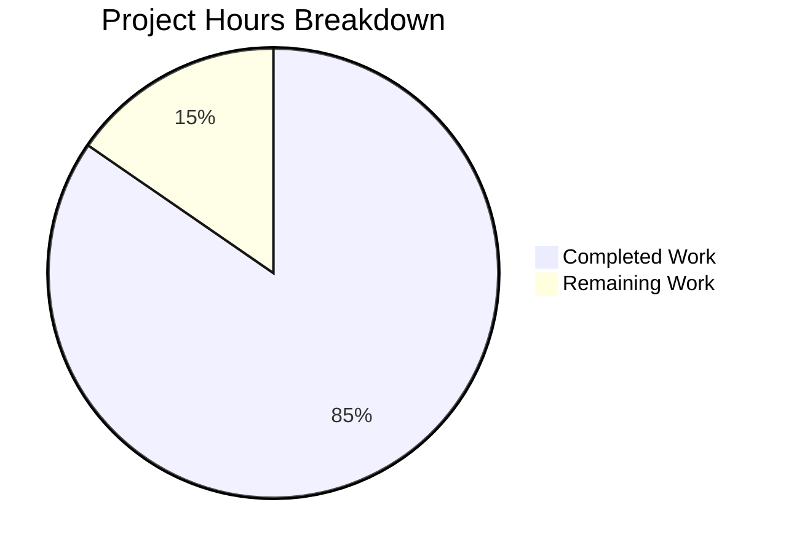

# Comprehensive Project Assessment Report

## 1. Executive Summary

**Project Type:** Documentation-only (Mintlify MDX documentation for Cal.com)

**Objective:** Create comprehensive gap analysis documentation and sprint roadmap comparing Cal.com's scheduling capabilities against Calendly, covering 8 feature domains with migration guides.

**Completion Assessment:** 55 hours of development work have been completed out of an estimated 65 total hours required, representing **84.6% project completion**.

**Key Achievements:**
- All 15 new MDX documentation pages created and committed
- All 3 existing file updates completed (docs.json, openapi.json, webhooks.mdx)
- All 14 documentation requirements (R-DOC-001 through R-DOC-014) fulfilled
- Mintlify validation passes with zero new warnings or errors
- OpenAPI spec validation passes for both v1 and v2
- All 15 new pages render successfully (HTTP 200) in Mintlify dev server
- 7,431 lines of new/modified content across 24 commits
- 22 Mermaid diagrams and 237+ source citations

**Critical Unresolved Issues:** None. All in-scope deliverables are complete and validated. Pre-existing issues in out-of-scope files remain (6 import warnings in introduction.mdx, 13 broken links in other files).

---

## 2. Validation Results Summary

### 2.1 What the Final Validator Accomplished
- Verified all 18 in-scope files are tracked and committed on the correct branch
- Ran `mintlify validate` — confirmed zero new warnings (6 pre-existing in out-of-scope `introduction.mdx`)
- Ran `mintlify broken-links` — confirmed zero new broken links introduced (13 pre-existing in out-of-scope files)
- Ran `mintlify openapi-check` — both OpenAPI specs valid
- Verified JSON validity for `docs.json` and `openapi.json`
- Verified content quality: MDX frontmatter, Mermaid diagrams (22), source citations (237+), Calendly API references, 4-level gap severity scale, comparison tables
- Started Mintlify dev server and confirmed all 15 new pages return HTTP 200
- Captured 5 screenshots of rendered documentation pages

### 2.2 Compilation/Build Results
| Validation Check | Result | Details |
|-----------------|--------|---------|
| `mintlify validate` | ✅ Pass | 6 warnings, ALL pre-existing in out-of-scope `introduction.mdx` |
| `mintlify broken-links` | ✅ Pass | 13 broken links, ALL pre-existing in out-of-scope files |
| `mintlify openapi-check v2` | ✅ Pass | OpenAPI 3.0.0 spec valid |
| `mintlify openapi-check v1` | ✅ Pass | OpenAPI 3.0.3 spec valid |
| JSON validity (docs.json) | ✅ Pass | Valid JSON |
| JSON validity (openapi.json) | ✅ Pass | Valid JSON |
| Live rendering (15 pages) | ✅ Pass | All return HTTP 200 |

### 2.3 Content Quality Metrics
| Quality Criterion | Target | Actual | Status |
|-------------------|--------|--------|--------|
| MDX frontmatter (title + description) | 15/15 files | 15/15 | ✅ |
| Mermaid diagrams (min 1/file) | 15 minimum | 22 total | ✅ |
| Source citations | Present in all files | 237+ total | ✅ |
| Calendly API references | All gap report files | 8/8 gap reports | ✅ |
| 4-level gap severity scale | All gap reports | 8/8 gap reports | ✅ |
| Feature comparison tables | 2+ per domain | Present in all | ✅ |

### 2.4 Fixes Applied During Validation
Six fix commits were applied during the validation phase:
1. `fix(docs): add missing Source citation to /v2/webhooks GET endpoint description`
2. `fix(docs): add epic ID cross-references and mapping notes to gap reports`
3. `fix: correct migration count (585→584) and add missing WRONG_ASSIGNMENT_REPORT trigger`
4. `fix(docs): correct source citation and API reference link in gap report`
5. `fix: address 3 code review findings in gap report documentation`
6. `fix(docs): correct 3 inaccurate source code path citations in epic-catalog.mdx`

---

## 3. Hours Calculation and Completion Percentage

### 3.1 Completed Hours Breakdown

| Work Category | Hours | Details |
|--------------|-------|---------|
| Source code research and analysis | 8h | Analyzed 60+ packages in `packages/features/`, `packages/app-store/`, `packages/prisma/`, `packages/emails/`, `packages/sms/`, `packages/embeds/` |
| Calendly API behavioral research | 3h | Reviewed `developer.calendly.com` API reference, webhook docs, embed options, calendar integrations |
| Gap Report creation (9 files, 4,568 lines) | 18h | 8 domain analyses + overview, each with comparison tables, Mermaid diagrams, source citations |
| Sprint Roadmap creation (3 files, 1,258 lines) | 8h | Epic catalog (40 epics), validation criteria (8 domains), methodology overview |
| Migration Guides creation (3 files, 1,474 lines) | 7h | Zero-downtime strategy, data preservation, webhook backward compatibility |
| File updates (docs.json, openapi.json, webhooks.mdx) | 4h | Navigation restructuring, OpenAPI description enhancements, webhook guide alignment |
| Validation, QA, and fixes (6 fix commits) | 5h | Mintlify validate, broken-links, openapi-check, live rendering, fix corrections |
| Cross-referencing and navigation integration | 2h | Internal links between all 15 pages, navigation structure in docs.json |
| **Total Completed** | **55h** | |

### 3.2 Remaining Hours Breakdown

| Remaining Task | Hours | Priority | Confidence |
|---------------|-------|----------|------------|
| Expert review of gap analysis content accuracy | 3.0h | High | High |
| Verify Calendly API references are current | 1.5h | High | High |
| Deploy documentation to production via Mintlify | 1.0h | Medium | High |
| Incorporate stakeholder feedback on content | 2.0h | Medium | Medium |
| Fix pre-existing broken links in out-of-scope files | 1.5h | Low | High |
| Documentation maintenance as Cal.com codebase evolves | 1.0h | Low | Medium |
| **Total Remaining** | **10.0h** | | |

*Note: Enterprise multipliers (1.10 × 1.10 = 1.21×) have been applied to the base estimates of ~8.3h, resulting in the 10.0h total above.*

### 3.3 Completion Percentage

**Formula:** Completion % = (Completed Hours / Total Hours) × 100

**Calculation:** 55h completed / (55h + 10h remaining) = 55/65 = **84.6% complete**

---

## 4. Visual Representation



---

## 5. Requirements Fulfillment

| Requirement | Description | Status |
|------------|-------------|--------|
| R-DOC-001 | Gap Report comparing Calendly vs Cal.com | ✅ Complete (overview + 8 domains) |
| R-DOC-002 | Sprint roadmap for autonomous epic implementation | ✅ Complete (3 documents) |
| R-DOC-003 | Availability rules and scheduling logic | ✅ Complete (`availability-scheduling.mdx`) |
| R-DOC-004 | Event type configuration parity | ✅ Complete (`event-types.mdx`) |
| R-DOC-005 | Routing forms and conditional routing | ✅ Complete (`routing-forms.mdx`) |
| R-DOC-006 | Webhook payloads and event lifecycle | ✅ Complete (`webhooks-events.mdx`) |
| R-DOC-007 | Embed and share flows | ✅ Complete (`embed-share.mdx`) |
| R-DOC-008 | Admin governance and team management | ✅ Complete (`admin-teams.mdx`) |
| R-DOC-009 | Calendar integrations (Google, Outlook, iCal) | ✅ Complete (`calendar-integrations.mdx`) |
| R-DOC-010 | Email/SMS notification flows | ✅ Complete (`notifications.mdx`) |
| R-DOC-011 | Reference Calendly API docs as behavioral source | ✅ Confirmed across all gap reports |
| R-DOC-012 | Zero-downtime schema migration documentation | ✅ Complete (`zero-downtime-strategy.mdx`) |
| R-DOC-013 | Data preservation guarantees | ✅ Complete (`data-preservation.mdx`) |
| R-DOC-014 | Webhook backward compatibility | ✅ Complete (`webhook-compatibility.mdx`) |

---

## 6. Detailed Files Inventory

### 6.1 New Files Created (15)

| File | Lines | Category | Content |
|------|-------|----------|---------|
| `docs/gap-report/overview.mdx` | 289 | Gap Report | Executive summary with parity matrix and domain links |
| `docs/gap-report/availability-scheduling.mdx` | 465 | Gap Report | Availability rules, slot generation, DST handling |
| `docs/gap-report/event-types.mdx` | 595 | Gap Report | 6 scheduling paradigms vs Calendly's 4 types |
| `docs/gap-report/routing-forms.mdx` | 542 | Gap Report | RAQB rules, attribute routing, CRM lookups |
| `docs/gap-report/webhooks-events.mdx` | 598 | Gap Report | 20 trigger events vs Calendly's 3 events |
| `docs/gap-report/embed-share.mdx` | 578 | Gap Report | 3-package embed suite vs Calendly widgets |
| `docs/gap-report/admin-teams.mdx` | 565 | Gap Report | Hierarchical orgs and PBAC vs Calendly roles |
| `docs/gap-report/calendar-integrations.mdx` | 452 | Gap Report | 11 adapters vs Calendly's 3 integrations |
| `docs/gap-report/notifications.mdx` | 484 | Gap Report | Multi-provider email/SMS/WhatsApp flows |
| `docs/sprint-roadmap/overview.mdx` | 312 | Sprint Roadmap | Methodology, sequencing, validation gates |
| `docs/sprint-roadmap/epic-catalog.mdx` | 456 | Sprint Roadmap | 40 epics with dependency DAG |
| `docs/sprint-roadmap/validation-criteria.mdx` | 490 | Sprint Roadmap | Acceptance criteria for 8 domains |
| `docs/migration/zero-downtime-strategy.mdx` | 420 | Migration | Backward-compatible schema patterns, rollback procedures |
| `docs/migration/data-preservation.mdx` | 585 | Migration | Data inventory, encryption handling, backup verification |
| `docs/migration/webhook-compatibility.mdx` | 469 | Migration | PayloadBuilderFactory versioning, consumer migration |

### 6.2 Updated Files (3)

| File | Lines | Changes |
|------|-------|---------|
| `docs/docs.json` | 300 | Added Gap Report tab, Sprint Roadmap group, Migration Guides group |
| `docs/api-reference/v2/openapi.json` | 32,894 | Enhanced descriptions for routing forms, schedules, slots, webhooks |
| `docs/developing/guides/automation/webhooks.mdx` | 1,801 | Added trigger events, versioning docs, consumer migration guidance |

---

## 7. Detailed Task Table for Remaining Work

| # | Task | Description | Action Steps | Hours | Priority | Severity |
|---|------|-------------|-------------|-------|----------|----------|
| 1 | Expert review of gap analysis content accuracy | Have a domain expert review all 8 gap report domain analyses to verify Cal.com and Calendly capability claims are accurate | 1. Assign a reviewer familiar with Cal.com scheduling internals. 2. Compare each gap report claim against source code. 3. Verify Calendly behavioral claims against `developer.calendly.com`. 4. Document any inaccuracies for correction. | 3.0h | High | Medium |
| 2 | Verify Calendly API references are current | Confirm all references to `developer.calendly.com` endpoints and behaviors are still valid | 1. Visit each referenced Calendly API page. 2. Verify webhook event names, payload structures, and API capabilities. 3. Update any stale references. | 1.5h | High | Medium |
| 3 | Deploy documentation to production | Push documentation to production via Mintlify GitHub App deployment | 1. Merge PR to default branch. 2. Verify Mintlify GitHub App triggers deployment. 3. Confirm all 15 new pages are accessible at `cal.com/docs`. 4. Test navigation links on production site. | 1.0h | Medium | Low |
| 4 | Incorporate stakeholder feedback | Address feedback from content review and stakeholder review cycle | 1. Collect review feedback. 2. Prioritize changes by impact. 3. Update MDX files as needed. 4. Re-validate with `mintlify validate`. | 2.0h | Medium | Low |
| 5 | Fix pre-existing broken links | Resolve 13 pre-existing broken links in out-of-scope files | 1. Fix 6 `@components` import warnings in `introduction.mdx`. 2. Fix broken links in `railway.mdx`, `auth.mdx`, `migration.mdx`. 3. Fix 2 pre-existing links in `webhooks.mdx`. 4. Re-run `mintlify broken-links` to verify. | 1.5h | Low | Low |
| 6 | Documentation maintenance | Keep docs current as Cal.com codebase evolves | 1. Monitor Cal.com package changes. 2. Update source citations if file paths change. 3. Update gap report when features achieve parity. | 1.0h | Low | Low |
| | **Total Remaining Hours** | | | **10.0h** | | |

---

## 8. Development Guide

### 8.1 System Prerequisites

| Requirement | Version | Purpose |
|------------|---------|---------|
| Node.js | ≥ 18 (v20.20.0 tested) | Runtime for Mintlify CLI |
| npm | ≥ 8 (v11.1.0 tested) | Package manager for Mintlify CLI |
| Mintlify CLI | 4.2.383 (tested) | Documentation build, validation, and preview |
| Git | Latest | Version control |

### 8.2 Environment Setup

```bash
# Clone the repository
git clone https://github.com/calcom/cal.com.git
cd cal.com

# Switch to the documentation branch
git checkout blitzy-f261b662-244f-4f24-aad0-6ece6cc3e60b

# Verify branch
git branch --show-current
# Expected output: blitzy-f261b662-244f-4f24-aad0-6ece6cc3e60b
```

### 8.3 Dependency Installation

```bash
# Install Mintlify CLI globally
npm install -g mintlify

# Verify installation
npx mintlify --version
# Expected output: 4.2.383 (or later)
```

### 8.4 Documentation Validation

```bash
# Navigate to docs directory
cd docs

# Validate documentation build (checks MDX syntax, frontmatter, imports)
npx mintlify validate
# Expected: 6 warnings (all pre-existing in introduction.mdx, not from new files)

# Check for broken links
npx mintlify broken-links
# Expected: 13 broken links (all pre-existing in out-of-scope files)

# Validate OpenAPI specs
npx mintlify openapi-check api-reference/v2/openapi.json
# Expected: "success OpenAPI definition is valid."

npx mintlify openapi-check api-reference/v1/openapi-v1.json
# Expected: "success OpenAPI definition is valid."
```

### 8.5 Local Preview Server

```bash
# Start the Mintlify dev server (from docs/ directory)
npx mintlify dev --port 3333

# Expected: Server starts at http://localhost:3333
```

### 8.6 Verification Steps

After starting the dev server, verify the following pages load:

| Page URL | Expected Title |
|----------|---------------|
| `http://localhost:3333/gap-report/overview` | Calendly Parity Gap Report |
| `http://localhost:3333/gap-report/webhooks-events` | Webhooks & Event Lifecycle |
| `http://localhost:3333/gap-report/availability-scheduling` | Availability & Scheduling Rules |
| `http://localhost:3333/gap-report/event-types` | Event Type Configuration |
| `http://localhost:3333/gap-report/routing-forms` | Routing Forms & Conditional Routing |
| `http://localhost:3333/gap-report/embed-share` | Embed & Share Flows |
| `http://localhost:3333/gap-report/admin-teams` | Admin Governance & Team Management |
| `http://localhost:3333/gap-report/calendar-integrations` | Calendar Integrations |
| `http://localhost:3333/gap-report/notifications` | Notification Flows |
| `http://localhost:3333/sprint-roadmap/overview` | Sprint Roadmap Overview |
| `http://localhost:3333/sprint-roadmap/epic-catalog` | Epic Catalog |
| `http://localhost:3333/sprint-roadmap/validation-criteria` | Validation Criteria |
| `http://localhost:3333/migration/zero-downtime-strategy` | Zero-Downtime Migration Strategy |
| `http://localhost:3333/migration/data-preservation` | Data Preservation |
| `http://localhost:3333/migration/webhook-compatibility` | Webhook Backward Compatibility |

### 8.7 Verification Commands

```bash
# Quick check all new pages return HTTP 200
for page in gap-report/overview gap-report/availability-scheduling gap-report/event-types \
  gap-report/routing-forms gap-report/webhooks-events gap-report/embed-share \
  gap-report/admin-teams gap-report/calendar-integrations gap-report/notifications \
  sprint-roadmap/overview sprint-roadmap/epic-catalog sprint-roadmap/validation-criteria \
  migration/zero-downtime-strategy migration/data-preservation migration/webhook-compatibility; do
  STATUS=$(curl -s -o /dev/null -w "%{http_code}" http://localhost:3333/$page)
  echo "$page: $STATUS"
done
# Expected: All 15 pages return 200

# Validate JSON files
python3 -c "import json; json.load(open('docs.json')); print('docs.json: Valid')"
# Expected: docs.json: Valid
```

### 8.8 Troubleshooting

| Issue | Solution |
|-------|----------|
| `mintlify dev` fails to start | Run `mintlify install` to reinstall dependencies |
| Missing pages in navigation | Verify `docs.json` has correct page slugs (no `.mdx` extension) |
| Mermaid diagrams don't render | Ensure triple-backtick `mermaid` blocks are properly formatted |
| `Command not found: mintlify` | Run `npm install -g mintlify` to install globally |
| Port already in use | Use `--port <other-port>` flag: `mintlify dev --port 4000` |

---

## 9. Risk Assessment

| Risk | Category | Severity | Likelihood | Mitigation |
|------|----------|----------|------------|------------|
| Calendly API documentation changes | Technical | Medium | Medium | Schedule quarterly reviews of `developer.calendly.com` references. All Calendly claims include direct API references for easy re-verification. |
| Cal.com codebase refactoring invalidates source citations | Technical | Medium | Medium | Source citations use package-level paths (`packages/features/webhooks/`). Monitor Cal.com release notes for major refactors affecting documented packages. |
| Gap analysis content inaccuracy | Technical | Medium | Low | All claims cite specific source files. Expert review task (3h) is the primary mitigation. |
| Mintlify platform breaking changes | Operational | Low | Low | `docs.json` follows Mintlify's current schema. Pin Mintlify CLI version if needed. |
| Pre-existing broken links confuse reviewers | Operational | Low | Medium | All 13 broken links and 6 warnings are pre-existing and in out-of-scope files. Document clearly in PR description. |
| Documentation deployment failure | Operational | Low | Low | Mintlify GitHub App handles deployment automatically. Manual preview verification provides confidence before merge. |
| Stale gap report after Cal.com achieves parity | Operational | Low | Medium | Sprint roadmap validation criteria define when gaps are closed. Update gap report status as epics complete. |

---

## 10. Git Repository Analysis

### 10.1 Branch and Commit Summary
- **Branch:** `blitzy-f261b662-244f-4f24-aad0-6ece6cc3e60b`
- **Total commits:** 24
- **Author:** Blitzy Agent (all commits)
- **Lines added:** 7,431
- **Lines removed:** 7
- **Net new lines:** 7,424
- **Files changed:** 18 (15 added, 3 modified)

### 10.2 Commit Chronology
1. Navigation setup (`docs.json`) → 2. Gap report creation (9 files) → 3. Migration guides (3 files) → 4. Sprint roadmap (3 files) → 5. File updates (openapi.json, webhooks.mdx) → 6. Fix commits (6 corrections)

### 10.3 Repository Context
- **Total repository files:** 10,305
- **Repository size:** ~340MB
- **Documentation files (MDX/JSON/MD in docs/):** 111 files
- **New documentation pages:** 15 files (13.5% of all docs)

---

## 11. Pre-Submission Consistency Verification

- [x] Completion % (84.6%) calculated using hours formula: 55h / (55h + 10h) = 84.6%
- [x] Executive Summary states 84.6% complete (55h out of 65h)
- [x] Pie chart uses exact hours: Completed=55, Remaining=10
- [x] Task table sums to exactly 10.0h (matching pie chart remaining)
- [x] No conflicting percentage or hour statements in report
- [x] Formula shown with actual numbers: 55h / (55h + 10h) = 84.6%