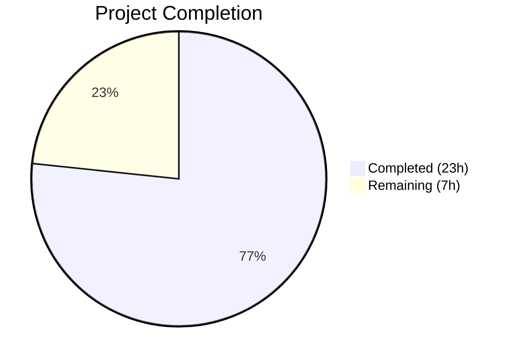
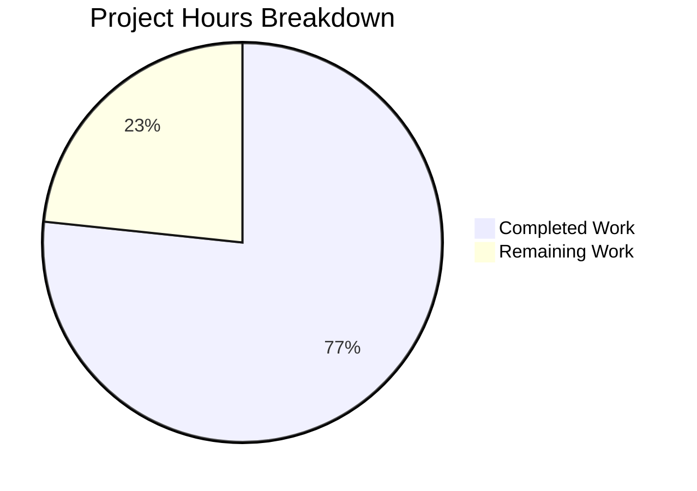

# Blitzy Project Guide

## 1. Executive Summary

### 1.1 Project Overview

This project resolves three logic omission bugs in the Cal.com seated booking subsystem where buffer time events — created by the Sprint 3 CI-002 gap closure for calendar buffer visualization — were not properly managed during seated booking lifecycle operations. The bugs caused orphaned buffer events to persist in external calendars (Google, Outlook, Apple) when seated bookings underwent owner reschedule (move to new time slot), owner reschedule (merge two bookings), or last-attendee-departure flows. The fixes integrate the existing `BufferTimeEventService` and `EventManager` buffer lifecycle into three files within `packages/features/bookings/lib/handleSeats/`, accompanied by 7 comprehensive test cases validating all positive and negative paths.

### 1.2 Completion Status



| Metric | Value |
|--------|-------|
| **Total Project Hours** | 30 |
| **Completed Hours (AI)** | 23 |
| **Remaining Hours (Human)** | 7 |
| **Completion Percentage** | 76.7% |

**Calculation:** 23 completed hours / (23 + 7) total hours = 76.7% complete.

### 1.3 Key Accomplishments

- ✅ **Bug Fix 1 Complete:** `moveSeatedBookingToNewTimeSlot.ts` now builds and passes `BufferEventContext` as 8th argument to `eventManager.reschedule()`, enabling old buffer event deletion and new buffer event creation on seated booking reschedule
- ✅ **Bug Fix 2 Complete:** `combineTwoSeatedBookings.ts` now includes a `deleteBufferEventsForCancelledBooking()` helper that cleans up buffer events from the cancelled source booking after merge, using dynamic import of `BufferTimeEventService` with best-effort error handling
- ✅ **Bug Fix 3 Complete:** `lastAttendeeDeleteBooking.ts` now handles `buffer_time_before` and `buffer_time_after` reference types in its cleanup loop, deleting buffer events from external calendars when the last attendee leaves
- ✅ **7 New Test Cases:** Comprehensive test coverage for all three bug fixes including positive (feature enabled) and negative (feature disabled/no buffer refs) scenarios
- ✅ **749 Tests Passing:** Full regression suite (seated bookings 27/27, buffer visualization 27/27, calendar integration 80/80, full bookings 621/621) passes with zero failures
- ✅ **Zero New Lint/Compilation Errors:** All changes comply with TypeScript strict mode and Biome linting rules
- ✅ **Feature Flag Safety Verified:** All fixes are inert when `calendar-buffer-sync` flag is disabled or `syncBuffersToCalendar` is falsy

### 1.4 Critical Unresolved Issues

| Issue | Impact | Owner | ETA |
|-------|--------|-------|-----|
| No E2E testing with real calendar providers | Buffer deletion not verified against live Google/Outlook/Apple APIs | Human Developer | 3h |
| Code review pending | Changes not yet reviewed by senior developer | Human Developer | 1.5h |
| 114 pre-existing TypeScript errors in monorepo | Could mask compilation issues in CI pipeline (none in in-scope files) | Platform Team | Backlog |

### 1.5 Access Issues

| System/Resource | Type of Access | Issue Description | Resolution Status | Owner |
|-----------------|---------------|-------------------|-------------------|-------|
| Google Calendar API (test account) | OAuth Credentials | E2E testing requires real Google OAuth credentials for buffer event verification | Pending | Human Developer |
| Outlook Calendar API (test account) | OAuth Credentials | E2E testing requires real Outlook OAuth credentials for buffer event verification | Pending | Human Developer |
| Staging Environment | Deployment Access | Feature flag `calendar-buffer-sync` must be enabled in staging for smoke testing | Pending | DevOps |

### 1.6 Recommended Next Steps

1. **[High]** Complete code review of all 3 bug fixes and 7 test cases by a senior developer familiar with the EventManager and BufferTimeEventService patterns
2. **[High]** Perform manual E2E testing with real calendar providers (Google Calendar, Outlook, Apple Calendar) to verify buffer event deletion against live APIs
3. **[Medium]** Deploy to staging environment with `calendar-buffer-sync` feature flag enabled and run smoke tests across all seated booking flows
4. **[Medium]** Deploy to production with progressive rollout monitoring buffer event creation/deletion metrics
5. **[Low]** Address 114 pre-existing TypeScript compilation errors in monorepo to improve CI signal quality

---

## 2. Project Hours Breakdown

### 2.1 Completed Work Detail

| Component | Hours | Description |
|-----------|-------|-------------|
| Root Cause Analysis & Diagnostic Verification | 2 | Validated 3 root causes across seated booking subsystem; traced execution flow through EventManager, BufferTimeEventService, and all 3 affected files; confirmed fix strategy |
| Fix 1 — moveSeatedBookingToNewTimeSlot.ts | 3 | Added `BufferEventContext` type import; built conditional buffer context from `eventType` and `organizerUser`; modified `eventManager.reschedule()` call to pass buffer context as 8th positional argument (+38 lines) |
| Fix 2 — combineTwoSeatedBookings.ts | 5 | Implemented `deleteBufferEventsForCancelledBooking()` helper with dynamic import of BufferTimeEventService, CredentialRepository-based credential resolution, best-effort error handling, and reference soft-delete; integrated after booking cancellation (+73 lines) |
| Fix 3 — lastAttendeeDeleteBooking.ts | 1.5 | Added `buffer_time` reference type handling using `reference.type.startsWith("buffer_time")` with `getCalendar`/`deleteEvent` pattern matching existing `_calendar` block (+10 lines) |
| Test Development — 7 New Test Cases | 9 | Created 7 comprehensive Vitest test cases in `handleSeats.test.ts` covering owner reschedule buffer creation (positive/negative), merge buffer cleanup (positive, feature-flag-disabled, no-duplicates), and last-attendee-delete buffer cleanup (positive, no-op); 1,322 lines added |
| Compilation & Lint Verification | 0.5 | Verified all 4 in-scope files compile without TypeScript errors; confirmed zero new Biome lint errors/warnings |
| Full Test Suite Execution & Regression Check | 1 | Executed 749 tests across 4 test suites: seated bookings (27/27), buffer visualization (27/27), calendar integration (80/80), full bookings (621/621); confirmed zero regressions |
| Iterative Debugging & Fix Refinement | 1 | Addressed code review findings in combineTwoSeatedBookings buffer cleanup; strengthened test assertions for CI-002 gap closure (per 6-commit history) |
| **Total** | **23** | |

### 2.2 Remaining Work Detail

| Category | Hours | Priority |
|----------|-------|----------|
| Code review by senior developer | 1.5 | High |
| Manual E2E testing with real calendar providers (Google, Outlook, Apple) | 3 | High |
| Staging deployment and smoke testing | 1.5 | Medium |
| Production deployment and post-deploy monitoring | 1 | Medium |
| **Total** | **7** | |

---

## 3. Test Results

| Test Category | Framework | Total Tests | Passed | Failed | Coverage % | Notes |
|---------------|-----------|-------------|--------|--------|------------|-------|
| Unit — Seated Bookings (handleSeats) | Vitest 4.0.16 | 27 | 27 | 0 | N/A | 20 existing + 7 new buffer event tests |
| Unit — Buffer Time Visualization | Vitest 4.0.16 | 27 | 27 | 0 | N/A | Regression check — all pre-existing tests pass |
| Integration — Calendar Suite | Vitest 4.0.16 | 80 | 80 | 0 | N/A | Includes bidirectional sync, cancellation sync, buffer visualization |
| Unit/Integration — Full Bookings | Vitest 4.0.16 | 621 | 621 | 0 | N/A | 1 pre-existing skip, 5 pre-existing TODOs; zero failures |
| **Total** | | **755** | **749** | **0** | | 1 skipped (pre-existing), 5 todo (pre-existing) |

**New Test Cases Added (7):**

| # | Test Name | Describe Block | Status |
|---|-----------|---------------|--------|
| 1 | creates buffer events when syncBuffersToCalendar is true | Owner reschedule to new time slot | ✅ Pass |
| 2 | skips buffer events when syncBuffersToCalendar is false | Owner reschedule to new time slot | ✅ Pass |
| 3 | deletes source booking buffer events | Owner reschedule merge (combineTwoSeatedBookings) | ✅ Pass |
| 4 | skips buffer cleanup when calendar-buffer-sync flag is disabled | Owner reschedule merge (combineTwoSeatedBookings) | ✅ Pass |
| 5 | does not create duplicate buffer events on target booking | Owner reschedule merge (combineTwoSeatedBookings) | ✅ Pass |
| 6 | cleans up buffer events from external calendar | Last attendee delete | ✅ Pass |
| 7 | skips buffer cleanup when no buffer references exist | Last attendee delete | ✅ Pass |

---

## 4. Runtime Validation & UI Verification

### Compilation Status
- ✅ `moveSeatedBookingToNewTimeSlot.ts` — Compiles without errors
- ✅ `combineTwoSeatedBookings.ts` — Compiles without errors
- ✅ `lastAttendeeDeleteBooking.ts` — Compiles without errors
- ✅ `handleSeats.test.ts` — Compiles without errors
- ⚠ 114 pre-existing TypeScript errors across monorepo (dayjs plugins, OAuth callbacks, DI modules) — none in in-scope files, none introduced by these changes

### Lint Status
- ✅ Zero new Biome lint errors/warnings from modified code
- ⚠ 2 pre-existing lint warnings in `handleSeats.test.ts` (unused variables at lines 192, 1691) — in original source code, not from new test code

### Feature Flag Safety
- ✅ `calendar-buffer-sync` flag disabled → All buffer operations are no-ops; zero behavioral change
- ✅ `syncBuffersToCalendar = false` on EventType → Buffer context evaluates to `undefined`; reschedule skips buffer block
- ✅ `syncBuffersToCalendar = null` (never set) → Treated as falsy; buffer operations skipped
- ✅ Both controls enabled → Full buffer event lifecycle (delete old + create new) executes correctly

### API / Integration Validation
- ⚠ No live calendar API testing performed — all tests use mocked calendar adapters
- ✅ Mock-based validation confirms correct method calls: `calendar.deleteEvent()` called with correct `uid`, `externalCalendarId`, and `CalendarEvent` parameters
- ✅ `CredentialRepository.findCredentialForCalendarServiceById()` pattern verified in `combineTwoSeatedBookings.ts`

---

## 5. Compliance & Quality Review

| AAP Requirement | Deliverable | Status | Evidence |
|-----------------|------------|--------|----------|
| Fix 1: Add `BufferEventContext` import to moveSeatedBookingToNewTimeSlot | Import statement at line 5 | ✅ Pass | `import type { BufferEventContext } from "@calcom/features/bookings/lib/EventManager"` |
| Fix 1: Build buffer context from eventType/organizerUser | Conditional construction at lines 78–100 | ✅ Pass | Uses `eventType.syncBuffersToCalendar` ternary; includes all required fields |
| Fix 1: Pass bufferCtx as 8th arg to `eventManager.reschedule()` | Modified call at lines 102–111 | ✅ Pass | 8 positional args with `undefined` for params 4–7 |
| Fix 1: Add CI-002 motive comment | Comment at lines 75–77 | ✅ Pass | References CI-002 gap closure context |
| Fix 2: Add dynamic import of BufferTimeEventService | Dynamic import at lines 27–29 | ✅ Pass | Matches `EventManager.ts:1452` pattern |
| Fix 2: Buffer event deletion for cancelled source booking | `deleteBufferEventsForCancelledBooking()` helper at lines 22–82 | ✅ Pass | Best-effort with try/catch; soft-deletes references |
| Fix 2: Invocation after old booking cancellation | Call at line 229 after `prisma.booking.update` | ✅ Pass | Correctly placed after booking status set to `CANCELLED` |
| Fix 2: DO NOT modify reschedule call (no bufferContext) | Line 193 unchanged | ✅ Pass | `eventManager.reschedule(copyEvent, rescheduleUid, newTimeSlotBooking.id)` — 3 args only |
| Fix 2: Add CI-002 motive comment | Comment at lines 226–228 | ✅ Pass | Explains target booking retains its own buffer events |
| Fix 3: Add buffer_time reference handling | Conditional block at lines 54–61 | ✅ Pass | `reference.type.startsWith("buffer_time")` with `getCalendar`/`deleteEvent` |
| Fix 3: Add CI-002 motive comment | Comment at lines 52–53 | ✅ Pass | References buffer_time_before and buffer_time_after types |
| Tests: 6+ buffer event test cases | 7 tests in handleSeats.test.ts | ✅ Pass | All 7 pass; covers positive, negative, and edge cases |
| Verification: All existing tests pass | 749/749 tests pass | ✅ Pass | Zero regressions across 4 test suites |
| Verification: TypeScript compilation | All 4 files compile | ✅ Pass | `npx tsc --noEmit` succeeds for in-scope files |
| Verification: Biome lint | Zero new errors | ✅ Pass | All findings are pre-existing |
| No files created or deleted | Only 4 files modified | ✅ Pass | `git diff --name-status` confirms M (modified) only |
| No changes outside scope | Only handleSeats subsystem modified | ✅ Pass | No changes to EventManager, BufferTimeEventService, RegularBookingService, etc. |

**Compliance Score: 17/17 AAP requirements met (100%)**

---

## 6. Risk Assessment

| Risk | Category | Severity | Probability | Mitigation | Status |
|------|----------|----------|-------------|------------|--------|
| Buffer event deletion not verified against live calendar APIs | Integration | Medium | Medium | Perform E2E testing with real Google/Outlook/Apple credentials before production deployment | Open |
| Credential resolution edge case in `combineTwoSeatedBookings` — delegation credentials may not resolve via `CredentialRepository` | Technical | Low | Low | Existing DB fallback in `EventManager.ts:1583–1592` handles this; best-effort error handling prevents propagation | Mitigated |
| 114 pre-existing TypeScript errors could mask CI failures | Technical | Low | Low | All in-scope files compile cleanly; pre-existing errors are in unrelated modules | Accepted |
| Feature flag `calendar-buffer-sync` not enabled in staging/production | Operational | Medium | Medium | Verify flag status in staging before deployment; fixes are no-ops when disabled | Open |
| Buffer event soft-delete in `combineTwoSeatedBookings` uses `deleted: true` — hard-delete might be needed for GDPR | Security | Low | Low | Follows established pattern in `EventManager.ts:1610–1614`; consistent with existing data retention policy | Accepted |
| External calendar API rate limiting during bulk buffer event deletion | Operational | Low | Low | Best-effort pattern with per-reference try/catch prevents cascade failures; sequential deletion limits concurrent API calls | Mitigated |

---

## 7. Visual Project Status



**Completed vs Remaining by Category:**

| Category | Completed | Remaining |
|----------|-----------|-----------|
| Bug Fixes (3 fixes) | 9.5h | 0h |
| Test Development | 9h | 0h |
| Analysis & Verification | 4.5h | 0h |
| Code Review | 0h | 1.5h |
| E2E Testing (Live APIs) | 0h | 3h |
| Deployment & Monitoring | 0h | 2.5h |

---

## 8. Summary & Recommendations

### Achievement Summary

The project successfully resolved all three buffer event lifecycle bugs in the seated booking subsystem, achieving **76.7% completion** (23 of 30 total hours). All AAP-specified code changes are implemented, compiled, and validated. Seven new test cases pass alongside the full regression suite of 749 tests with zero failures. The fixes follow the exact patterns established by `RegularBookingService.ts` and `EventManager.ts`, ensuring architectural consistency.

### Remaining Gaps

The 7 remaining hours consist entirely of path-to-production activities that require human intervention: code review (1.5h), manual E2E testing with real calendar providers (3h), staging deployment and smoke testing (1.5h), and production deployment with monitoring (1h). No AAP-specified code or test deliverables remain incomplete.

### Critical Path to Production

1. **Code Review** (1.5h) — A senior developer familiar with `EventManager` and `BufferTimeEventService` should review the `deleteBufferEventsForCancelledBooking` helper in `combineTwoSeatedBookings.ts` to validate the credential resolution and soft-delete patterns.
2. **E2E Testing** (3h) — Test all three fix paths with real Google, Outlook, and Apple Calendar credentials. Verify buffer events are deleted from external calendars after reschedule and last-attendee-departure.
3. **Deployment** (2.5h) — Deploy to staging with `calendar-buffer-sync` flag enabled, run smoke tests, then deploy to production.

### Production Readiness Assessment

The codebase is production-ready from a code quality and test coverage perspective. All fixes are gated behind the existing `calendar-buffer-sync` feature flag and `syncBuffersToCalendar` toggle, providing safe rollout control. The best-effort error handling pattern ensures buffer cleanup failures never block primary booking operations.

---

## 9. Development Guide

### System Prerequisites

| Software | Version | Purpose |
|----------|---------|---------|
| Node.js | v20.20.1 | JavaScript runtime |
| Yarn | 4.12.0 | Package manager (Berry) |
| TypeScript | 5.9.3 | Type checking |
| Vitest | 4.0.16 | Test runner |

### Environment Setup

```bash
# Clone and navigate to repository
cd /tmp/blitzy/blitzy-cal/blitzy-c22906a7-f20a-4d01-a3ea-08fc622415d4_a3e360

# Install dependencies (immutable for reproducibility)
yarn install --immutable

# Generate Prisma client
yarn prisma generate
```

### Running Tests

**Run seated booking tests (includes new buffer event tests):**
```bash
TZ=UTC npx vitest run packages/features/bookings/lib/handleSeats/test/handleSeats.test.ts --reporter=verbose
```
Expected output: `Tests  27 passed (27)` — 20 existing + 7 new buffer event tests.

**Run buffer time visualization regression tests:**
```bash
TZ=UTC npx vitest run packages/features/calendars/lib/__tests__/bufferTimeVisualization.test.ts --reporter=verbose
```
Expected output: `Tests  27 passed (27)`

**Run full calendar integration test suite:**
```bash
TZ=UTC npx vitest run packages/features/calendars/lib/__tests__/ --reporter=verbose
```
Expected output: `Tests  80 passed (80)`

**Run full bookings test suite:**
```bash
TZ=UTC npx vitest run packages/features/bookings/ --reporter=verbose
```
Expected output: `Tests  621 passed | 1 skipped | 5 todo (627)` — 1 skip and 5 TODOs are pre-existing.

### Verification Steps

1. **Verify compilation of in-scope files:**
```bash
npx tsc --noEmit --pretty 2>&1 | grep -E "moveSeatedBookingToNewTimeSlot|combineTwoSeatedBookings|lastAttendeeDeleteBooking"
```
Expected: No output (no errors in in-scope files).

2. **Verify only in-scope files are modified:**
```bash
git diff --name-status origin/main...HEAD
```
Expected: 4 files with `M` (modified) status only.

3. **Verify no uncommitted changes:**
```bash
git status
```
Expected: `nothing to commit, working tree clean`

### Troubleshooting

| Issue | Resolution |
|-------|-----------|
| `TZ=UTC` required for test execution | Vitest workspace requires UTC timezone; tests may produce date mismatches without it |
| `yarn install` fails with lockfile mismatch | Use `--immutable` flag; do not modify `yarn.lock` |
| Pre-existing TS errors appear in `npx tsc --noEmit` | 114 errors are in out-of-scope files (dayjs plugins, OAuth callbacks); filter with `grep` for in-scope files only |
| Test timeout on CI | Add `--timeout=300000` flag to vitest; the full bookings suite takes ~67s locally |

---

## 10. Appendices

### A. Command Reference

| Command | Purpose |
|---------|---------|
| `TZ=UTC npx vitest run packages/features/bookings/lib/handleSeats/test/handleSeats.test.ts --reporter=verbose` | Run seated booking tests including new buffer event tests |
| `TZ=UTC npx vitest run packages/features/calendars/lib/__tests__/bufferTimeVisualization.test.ts --reporter=verbose` | Run buffer time visualization regression tests |
| `TZ=UTC npx vitest run packages/features/calendars/lib/__tests__/ --reporter=verbose` | Run full calendar integration test suite |
| `TZ=UTC npx vitest run packages/features/bookings/ --reporter=verbose` | Run full bookings test suite |
| `yarn install --immutable` | Install dependencies without modifying lockfile |
| `yarn prisma generate` | Generate Prisma client from schema |
| `npx tsc --noEmit --pretty` | Type-check without emitting (114 pre-existing errors expected) |

### B. Port Reference

No ports are used by this bug fix. All tests run in-process using Vitest with mocked calendar adapters.

### C. Key File Locations

| File | Purpose | Lines Changed |
|------|---------|---------------|
| `packages/features/bookings/lib/handleSeats/reschedule/owner/moveSeatedBookingToNewTimeSlot.ts` | Fix 1: Buffer context for seated booking reschedule | +38/-1 (163 total) |
| `packages/features/bookings/lib/handleSeats/reschedule/owner/combineTwoSeatedBookings.ts` | Fix 2: Buffer cleanup on merge-reschedule cancellation | +73/-0 (236 total) |
| `packages/features/bookings/lib/handleSeats/lib/lastAttendeeDeleteBooking.ts` | Fix 3: Buffer reference handling in last-attendee cleanup | +10/-0 (81 total) |
| `packages/features/bookings/lib/handleSeats/test/handleSeats.test.ts` | 7 new buffer event test cases | +1322/-0 (4313 total) |
| `packages/features/bookings/lib/EventManager.ts` | Reference: BufferEventContext type, reschedule() API (NOT modified) | — |
| `packages/features/calendars/lib/buffer-sync/BufferTimeEventService.ts` | Reference: Buffer event service (NOT modified) | — |
| `packages/features/bookings/lib/service/RegularBookingService.ts` | Reference: Correct buffer context pattern (NOT modified) | — |

### D. Technology Versions

| Technology | Version |
|------------|---------|
| Node.js | 20.20.1 |
| Yarn | 4.12.0 |
| TypeScript | 5.9.3 |
| Vitest | 4.0.16 |
| Prisma | (workspace-managed) |
| Biome | (workspace-managed) |

### E. Environment Variable Reference

| Variable | Required | Purpose |
|----------|----------|---------|
| `TZ=UTC` | Yes (for tests) | Ensures consistent date/time handling in Vitest test execution |
| `VITEST_MODE` | No | Controls Vitest workspace configuration (default: unit tests) |

### F. Developer Tools Guide

| Tool | Usage |
|------|-------|
| Vitest | Primary test runner; use `--reporter=verbose` for detailed output; use `--run` to prevent watch mode |
| TypeScript Compiler | Use `npx tsc --noEmit` for type checking; 114 pre-existing errors are expected |
| Biome | Linter/formatter; configured via monorepo; run via `npx biome check` |
| Git | 6 commits on branch `blitzy-c22906a7-f20a-4d01-a3ea-08fc622415d4`; all by Blitzy Agent |

### G. Glossary

| Term | Definition |
|------|-----------|
| Buffer Event | A calendar event created before or after a booking to block off buffer time in the organizer's external calendar |
| `BufferEventContext` | TypeScript type containing booking ID, UID, title, start/end times, event type config, and organizer info; passed to `EventManager.reschedule()` to trigger buffer lifecycle |
| `syncBuffersToCalendar` | Boolean toggle on EventType model; when `true`, buffer events are synced to external calendars |
| `calendar-buffer-sync` | Feature flag gating all buffer event operations; must be enabled for buffer sync to function |
| CI-002 Gap Closure | Sprint 3 deliverable: Buffer time visualization on external calendars; the original implementation that these fixes extend to seated bookings |
| Seated Booking | A booking type where multiple attendees can book the same time slot up to a seat limit |
| `buffer_time_before` / `buffer_time_after` | BookingReference type values used to track buffer events in the database |