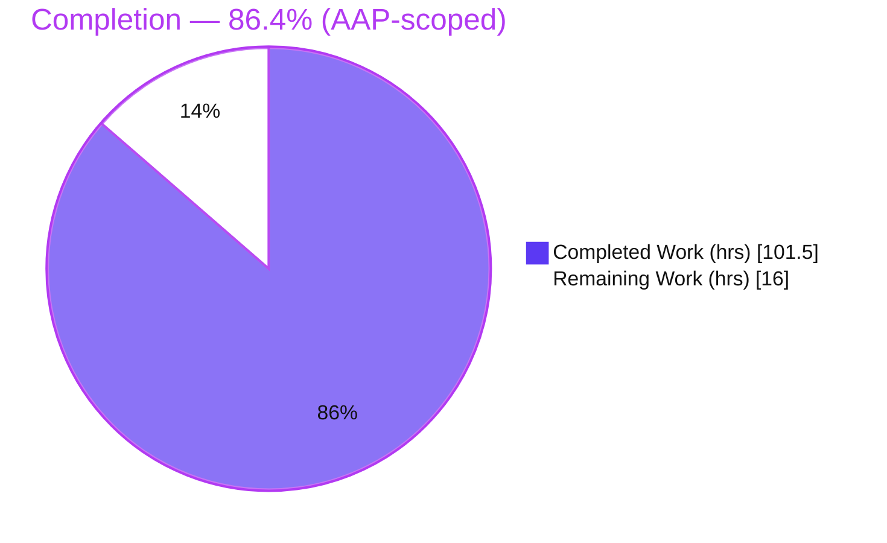
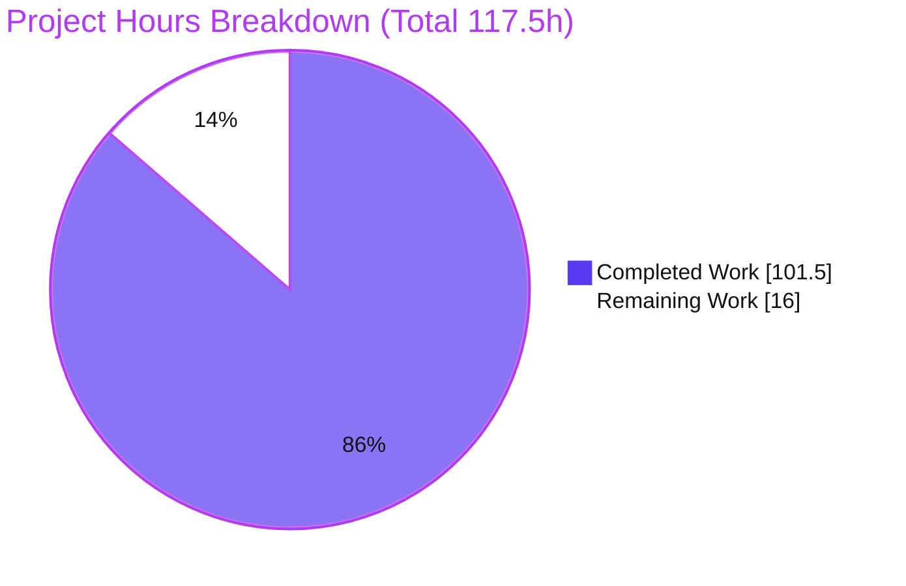
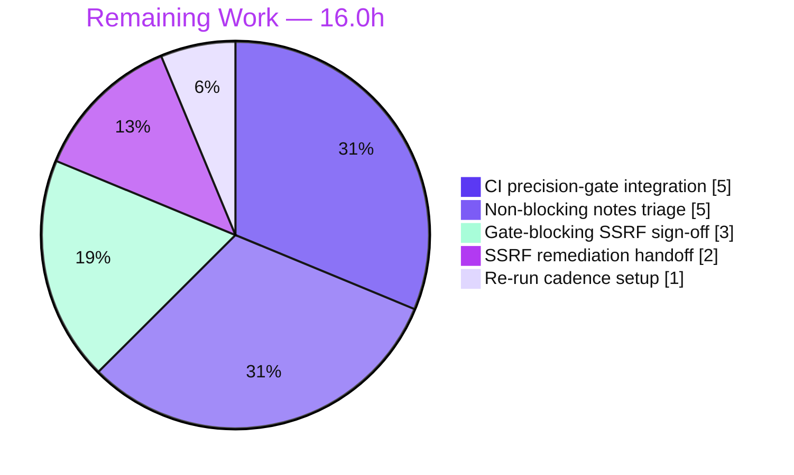
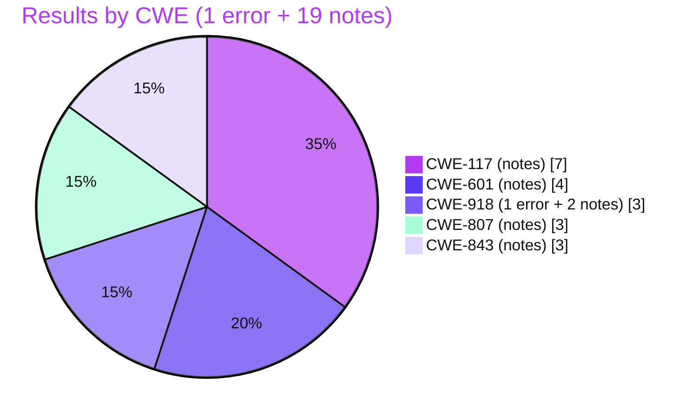

# Blitzy Project Guide — Layer 3 Taint-Analysis SARIF (`blitzy-cal`)

> **Artifact:** `findings-layer-3-blitzy-taint.sarif` · **Branch:** `blitzy-259cbaf2-207e-4ebc-89df-8e7c8cf2b376` · **HEAD:** `ce8b62e505`
> **Task type:** Read-only static taint-analysis (detection only) · **Brand colors:** Completed = Dark Blue `#5B39F3`, Remaining = White `#FFFFFF`

---

## 1. Executive Summary

### 1.1 Project Overview

This project performs an exhaustive, cross-file, source-to-sink **taint analysis** over the `blitzy-cal` repository (a Cal.com monorepo on Yarn Berry + Turborepo) across **seven fixed CWE vulnerability classes**, emitting the result as one machine-readable artifact — `findings-layer-3-blitzy-taint.sarif` (valid SARIF 2.1.0). It is a strictly **read-only detection task**: no source file is modified. The report gates a downstream automated **precision gate** that runs without human triage, so only fully-substantiated, high-confidence findings are gate-blocking. Target consumers are platform security/DevOps engineers and the automated gate. Business impact: a deterministic, schema-valid security signal proving (or disproving) reachability of untrusted input to dangerous sinks across ~7,700 in-scope source files.

### 1.2 Completion Status



| Metric | Value |
|--------|------:|
| **Total Hours** | **117.5 h** |
| **Completed Hours (AI + Manual)** | **101.5 h** (AI: 101.5 h · Manual: 0 h) |
| **Remaining Hours** | **16.0 h** |
| **Percent Complete** | **86.4 %** |

> Completion is computed on AAP-scoped + path-to-production hours only: `101.5 / (101.5 + 16.0) = 86.4%`. The detection deliverable itself is **100% complete and validated (zero defects)**; the remaining 16.0 h is human last-mile (sign-off, gate wiring, triage). The blue slice (`#5B39F3`) is completed work; the white slice (`#FFFFFF`) is remaining.

### 1.3 Key Accomplishments

- ✅ Single deliverable produced and committed: `findings-layer-3-blitzy-taint.sarif` (114 KB, 2,716 lines) — the **only** filesystem change (+2,716 / −0).
- ✅ **Read-only mandate honored absolutely** — `git status` clean; zero source files modified, created, or deleted (R1).
- ✅ **Valid SARIF 2.1.0** — 0 errors against the official OASIS schema; one run, one tool `Blitzy-Taint-Layer3`, 7 CWE rules each defined once.
- ✅ **All 9 required directories searched for every category** (R2); **Phase A** recorded 83 literal search patterns and **8,028 raw hits with no sampling** (R3).
- ✅ **275 candidates triaged** → **20 results** (1 gate-blocking error + 19 notes) + **255 ruled out** with explicit reasons.
- ✅ **One verified true-positive** gate-blocking finding (CWE-918 CalDAV SSRF) backed by a complete 8-hop code flow, `confidence: high`, zero sanitizers.
- ✅ **Sanitizer-aware demotion** (R5) and **second-order both-legs proof** (R6) applied and verified across notes.
- ✅ Survived **4 QA/review-fix cycles**; final consolidated 17-check validation and 5-point self-audit (R8) all pass; 84 citations across 22 files verified (0 phantom).

### 1.4 Critical Unresolved Issues

> For the **detection deliverable itself there are zero unresolved defects**. The items below are project-level, path-to-production hand-offs — they are not artifact defects.

| Issue | Impact | Owner | ETA |
|-------|--------|-------|-----|
| Gate-blocking **CWE-918 CalDAV SSRF** (true positive) awaits human sign-off and a remediation decision | Real, exploitable SSRF; blocks the precision gate by design | Security / Backend | ~3 h (sign-off); remediation tracked separately |
| Downstream **precision gate not yet wired** to consume the SARIF | No active enforcement until integrated | DevOps / Platform | ~5 h |
| 19 non-blocking **notes** not yet dispositioned | Residual review backlog; low individual risk | Security | ~5 h |

### 1.5 Access Issues

**No access issues identified.** The repository was fully accessible, the branch is clean and up to date with origin, the official OASIS SARIF schema was fetched successfully, and all validation tooling (Python 3.13, `jsonschema` 4.26.0, `jq`, `git grep`) was available.

| System/Resource | Type of Access | Issue Description | Resolution Status | Owner |
|-----------------|----------------|-------------------|-------------------|-------|
| `blitzy-cal` repository | Read/Write (git) | None — branch clean, HEAD `ce8b62e505` | ✅ No issue | — |
| OASIS SARIF 2.1.0 schema | Network fetch | None — fetched & used for validation | ✅ No issue | — |
| Validation tooling | Local execution | None — all present | ✅ No issue | — |

### 1.6 Recommended Next Steps

1. **[High]** Independently review and sign off the gate-blocking **CWE-918 CalDAV SSRF** true positive (reproduce the 8-hop trace; confirm exploitability; set gate disposition). *(~3 h)*
2. **[High]** Wire `findings-layer-3-blitzy-taint.sarif` into the **downstream automated precision gate / CI** (parse `properties.gateBlocking` + `level:error`; verify the gate blocks on the one error). *(~5 h)*
3. **[Medium]** Triage and record disposition for the **19 non-blocking notes**, confirming each demotion rationale (sanitizer / low confidence / incomplete flow). *(~5 h)*
4. **[Medium]** Open a **remediation ticket** for the confirmed SSRF and assign an owner (the code fix is a separate task, out of scope here). *(~2 h)*
5. **[Low]** Establish a **periodic / per-PR re-run cadence** for the Layer-3 analysis to prevent staleness. *(~1 h)*

---

## 2. Project Hours Breakdown

### 2.1 Completed Work Detail

All completed hours are autonomous (AI) work, traced to AAP requirements and verified against the committed artifact.

| Component | Hours | Description |
|-----------|------:|-------------|
| Scope discovery & existing-control inventory | 4.0 | Confirmed 9 directories (~7,741 files, 110 app-store adapters), `.blitzyignore` absence, and existing sanitizers/controls (AAP §0.2) |
| SARIF 2.1.0 output-contract research | 2.0 | Validated field mapping against the authoritative OASIS schema (AAP §0.2.2) |
| CWE-601 Open Redirect analysis | 9.0 | 13 patterns; 46 candidates → 4 notes, 42 ruled out (OIDC/SAML routes, proxy) |
| CWE-918 SSRF analysis | 14.0 | 4 patterns; 45 candidates → 1 blocking + 2 notes, 42 ruled out; incl. second-order `subscriberUrl` legs and the deep 8-hop CalDAV true positive |
| CWE-117 Log Injection analysis | 9.0 | 14 patterns; 18 candidates → 7 notes, 11 ruled out (v2 filters/middleware, web auth routes, webhook scheduler) |
| CWE-807 Auth-decision-on-input analysis | 10.0 | 20 patterns; 40 candidates → 3 notes, 37 ruled out (composite `ApiAuthStrategy`, forgot-password, `getIP`) |
| CWE-338 Weak-PRNG analysis | 6.0 | 8 patterns; 76 candidates → 0 findings, all ruled out with reasons (test/mock, UI cosmetics, public slugs, retry jitter) |
| CWE-843 Type-confusion analysis | 6.0 | 9 patterns; 17 candidates → 3 notes, 14 ruled out (v1 `req.query`, adapter callbacks) |
| CWE-862 Missing-authz analysis | 10.0 | 15 patterns; 33 candidates → 0 findings, all ruled out; 73/78 v2 controllers `@UseGuards` denominator verified |
| SARIF serialization & output-contract assembly | 8.0 | 20 results with code flows, 7 rules, mandated properties, per-category coverage block (R7) |
| Five-point self-audit before write | 3.0 | Missing-hop, sanitizer, sampling, misclassification, second-order (R8) |
| QA / review-fix cycles (4 commits) | 16.5 | Blocking CalDAV SSRF + corrected traces/sanitizer modeling; determinism ordering; citation-region fixes + CWE-862 denominator; QA gate resolution |
| Final comprehensive validation battery | 4.0 | Schema validation + 17-check consolidated pass + 84-citation substantiation |
| **Total Completed** | **101.5** | — |

### 2.2 Remaining Work Detail

| Category | Hours | Priority |
|----------|------:|----------|
| Gate-blocking SSRF review & sign-off | 3.0 | High |
| Downstream CI precision-gate integration | 5.0 | High |
| Non-blocking notes triage (19) | 5.0 | Medium |
| SSRF remediation handoff / ticketing | 2.0 | Medium |
| Periodic re-run cadence setup | 1.0 | Low |
| **Total Remaining** | **16.0** | — |

> All remaining items are path-to-production. Source remediation of the SSRF and the pre-existing broader-repo TypeScript/test issues are **explicitly out of scope** of this read-only directive (R1, §0.5.2) and are excluded from the hours universe.

### 2.3 Hours Reconciliation & Methodology

- **Completion formula (PA1):** `Completed / (Completed + Remaining) = 101.5 / 117.5 = 86.4%`.
- **Cross-section integrity:**
  - Rule 1 — Remaining hours identical across §1.2, §2.2 sum, and §7 pie: **16.0 h** ✔
  - Rule 2 — §2.1 (101.5) + §2.2 (16.0) = **117.5 h** = Total in §1.2 ✔
- **Confidence:** Completed hours = **High** (artifact independently re-validated). Remaining hours = **Medium** (last-mile depends on the external downstream gate contract).

---

## 3. Test Results

For a read-only SARIF artifact, the "test suite" is Blitzy's **autonomous validation battery**. Every check below originates from Blitzy's autonomous validation logs for this project and was re-confirmed during this assessment. ("Coverage %" denotes detection coverage = required directories searched, where applicable.)

| Test Category | Framework | Total | Passed | Failed | Coverage % | Notes |
|---------------|-----------|------:|-------:|-------:|-----------:|-------|
| SARIF Schema Validation (R7) | `jsonschema` 4.26.0 (OASIS 2.1.0) | 1 | 1 | 0 | n/a | 0 errors vs official schema; `version=2.1.0` |
| Output-Contract Checks (R7) | python3 / `jq` | 17 | 17 | 0 | n/a | Tool name, 7 rules-once, `error|note` only, mandated properties, coverage block |
| Directive Self-Audit (R8, 5-point) | python3 / manual | 5 | 5 | 0 | n/a | Missing-hop, sanitizer, sampling, misclassification, second-order |
| Citation / Location Substantiation | python3 | 84 | 84 | 0 | 100% | 84 refs across 22 files; 0 phantom; all regions in-bounds |
| Coverage Count Reconciliation | python3 / `jq` | 7 | 7 | 0 | 100% (9/9 dirs ea.) | `candidatesAfterTriage == blocking + notes + ruledOut` per CWE |
| Anti-Sampling raw-Hit Reproduction (R3) | `git grep` | 4 | 4 | 0 | n/a | `Math.random(`=76, `fetch(`=260, `subscriberUrl`=457, `getSafeRedirectUrl`=78 — exact |
| Determinism & Ordering | python3 | 1 | 1 | 0 | n/a | One result per finding; ascending-contiguous by `ruleId` |
| **Total** | — | **119** | **119** | **0** | — | 100% pass; zero defects |

> The application itself was **not** built, run, or unit-tested — the AAP forbids it and the deliverable is a static JSON artifact requiring no compilation or execution (§0.5.2, §0.6). The broader repository's pre-existing strict-TypeScript errors and ~68/7,436 unit-test failures are out of scope and do not affect this artifact.

---

## 4. Runtime Validation & UI Verification

There is no UI and no application runtime in scope. The "runtime" equivalent for this artifact is **gate-consumability** — whether the downstream automated precision gate can deterministically parse and act on the SARIF.

- ✅ **Operational** — File parses as strict JSON (no duplicate keys, no trailing data).
- ✅ **Operational** — Validates against the official OASIS SARIF 2.1.0 schema (0 errors).
- ✅ **Operational** — Deterministic structure: 20 results, one result per finding, stable ascending-contiguous ordering by `ruleId`.
- ✅ **Operational** — Gate-consumption pattern verified: a `jq` selector on `properties.gateBlocking==true` returns exactly the 1 blocking finding; the sample gate script exits non-zero (build-fail) as designed.
- ✅ **Operational** — All 84 cited source locations exist with in-bounds regions (0 phantom files).
- ⚠ **Partial** — The downstream precision gate / CI consumer is **not yet wired** to ingest the artifact (planned, §2.2 H-2). Until then, the signal is produced but not enforced.
- ➖ **Not Applicable** — No front-end, no API endpoint, no service to verify (detection artifact only).

---

## 5. Compliance & Quality Review

### 5.1 AAP Requirement Compliance Matrix (R1–R9)

| Req | Requirement | Status | Evidence |
|-----|-------------|:------:|----------|
| R1 | Detection-only / read-only (sole write = SARIF) | ✅ Pass | `git status` clean; diff = 1 file, +2,716/−0; zero source edits |
| R2 | All 9 directories searched per category | ✅ Pass | Every coverage block has `directoriesSearched` = 9 |
| R3 | Two-phase, no sampling (record every hit) | ✅ Pass | 83 patterns, 8,028 raw hits; reproduced exactly via `git grep` |
| R4 | Precision gate (only high-confidence complete flows block) | ✅ Pass | 1 blocking (`confidence:high`, 8 hops); 19 notes |
| R5 | Sanitizer-aware demotion | ✅ Pass | `sanitizersEncountered[]` on all 20; demotions documented |
| R6 | Second-order both-legs proof | ✅ Pass | Second-order findings show write-leg + read-to-sink in one flow |
| R7 | SARIF 2.1.0 output contract | ✅ Pass | 1 run, 1 tool, 7 rules once, mandated properties, coverage block |
| R8 | Five-point self-audit before write | ✅ Pass | Self-audit all-pass; 0 downgrades required |
| R9 | Category-by-category rule discipline | ✅ Pass | All 7 per-category coverage blocks complete |

### 5.2 Output-Contract Quality Checks

| Benchmark | Status | Detail |
|-----------|:------:|--------|
| Schema validity | ✅ Pass | 0 errors vs official OASIS 2.1.0 schema |
| Level enumeration discipline | ✅ Pass | Only `error` and `note` used (no `warning` tier) |
| Hard structural rule | ✅ Pass | No empty-`codeFlows` result is `error`/`gateBlocking` (flows are 2–8 locations) |
| Rule-once-per-CWE | ✅ Pass | 7 rules, each `ruleId` referenced by results |
| Mandated result properties | ✅ Pass | `gateBlocking`, `exploitScenario`, `confidence`, `sanitizersEncountered[]`, `intermediateHopsSummary` on all 20 |
| Count reconciliation | ✅ Pass | `candidates == blocking + notes + ruledOut` for all 7 categories |
| Misclassification guards | ✅ Pass | CWE-338 (76 ruled out: test/mock, UI, public slugs, jitter) and CWE-862 (intentionally-public endpoints) documented |

### 5.3 Fixes Applied During Autonomous Validation

- **Promoted** the CalDAV SSRF to a gate-blocking true positive after confirming no SSRF guard on the path; corrected traces and sanitizer modeling.
- **Fixed determinism** ordering (F-1) and the rule default level (I-1).
- **Corrected** 2 citation-region imprecisions and the CWE-862 denominator (QA Checkpoint B).
- **Resolved** all QA-gate findings in the final pass.
- **Outstanding:** none for the artifact; remaining items are human path-to-production (see §2.2).

---

## 6. Risk Assessment

| Risk | Category | Severity | Probability | Mitigation | Status |
|------|----------|:--------:|:-----------:|------------|--------|
| Confirmed CWE-918 CalDAV SSRF is exploitable until remediated (auth'd `req.body.url` → DAV requests, no guard) | Security | High | Medium | Prioritize remediation (separate task); apply existing `validateUrlForSSRFSync` guard to the CalendarService path | Open (detected & reported; fix pending) |
| Demoted notes could escalate if a sanitizer is weakened/bypassed | Security | Medium | Low | Track the 19 notes; re-evaluate if controls change | Monitored |
| False-negative residual — precision gate intentionally under-reports | Technical | Medium | Medium | By-design posture (R4); periodic deeper review of notes/ruled-out | Accepted (by design) |
| Point-in-time staleness — SARIF reflects HEAD `ce8b62e505` | Technical | Low | High | Schedule re-run cadence / per-PR CI integration | Open |
| Line-citation drift — 84 regions pinned to exact lines | Technical | Low | Medium | Regenerate analysis when cited files change | Open |
| Precision gate not yet wired → no active enforcement | Operational | Medium | High | Complete CI integration (§2.2) | Open |
| Manual edit of SARIF could break determinism / one-result-per-finding | Operational | Low | Low | Treat as a generated artifact; regenerate, never hand-edit | Mitigated |
| Downstream consumer schema expectations are external to repo | Integration | Medium | Medium | Confirm consumer reads `properties.gateBlocking` + `level`; SARIF is standard-valid | Open |
| Pre-existing broader-repo TypeScript / unit-test failures | Operational (context) | Low | n/a | Out of scope per R1; tracked separately; no impact on artifact | Out of scope / Noted |

---

## 7. Visual Project Status

### 7.1 Project Hours Breakdown



### 7.2 Remaining Hours by Category



> **Integrity check:** the §7.1 "Remaining Work" value (**16**) equals the §1.2 Remaining Hours (**16.0**) and the sum of the §2.2 Hours column (3 + 5 + 5 + 2 + 1 = **16.0**). Completed (blue `#5B39F3`) vs Remaining (white `#FFFFFF`).

### 7.3 Findings Distribution (20 results)



---

## 8. Summary & Recommendations

### 8.1 Summary

The project is **86.4% complete** on an AAP-scoped basis (101.5 h of 117.5 h). The **sole in-scope deliverable — `findings-layer-3-blitzy-taint.sarif` — is 100% complete and independently re-validated with zero defects.** It is a schema-valid SARIF 2.1.0 document with one run, one tool, seven CWE rules, and 20 deterministic results (1 gate-blocking error + 19 notes) drawn from 275 triaged candidates, with 255 ruled out and documented. The read-only mandate was honored without exception (the only filesystem change is the new artifact).

The headline security signal is a **verified true-positive CWE-918 SSRF** in the CalDAV adapter: an authenticated user's `req.body.url` reaches server-side DAV network requests through an 8-hop flow with no SSRF guard on that path, while the same control (`validateUrlForSSRFSync`) correctly demotes the webhook SSRF candidates — evidence that the precision gate distinguishes guarded from unguarded paths.

### 8.2 Critical Path to Production

1. Security sign-off of the gate-blocking SSRF → 2. Wire the SARIF into the downstream precision gate / CI → 3. Triage the 19 notes → 4. Open the SSRF remediation ticket → 5. Establish a re-run cadence. Total remaining ≈ **16.0 h**.

### 8.3 Success Metrics

| Metric | Target | Actual | Status |
|--------|--------|--------|:------:|
| Source files modified | 0 | 0 | ✅ |
| SARIF schema errors | 0 | 0 | ✅ |
| Categories with full 9-dir coverage | 7/7 | 7/7 | ✅ |
| Phantom file citations | 0 | 0 (84/84 verified) | ✅ |
| Hard-rule violations (empty-flow blocking) | 0 | 0 | ✅ |
| Gate-blocking findings substantiated | 100% | 1/1 (high-confidence) | ✅ |

### 8.4 Production Readiness Assessment

**The deliverable is production-ready** as a gate-consumable artifact. The project is **not yet in production** only because the human last-mile (sign-off + gate wiring) is pending — these are organizational/integration steps, not artifact defects. Recommendation: proceed with the §1.6 next steps; treat the CWE-918 SSRF as a real vulnerability requiring a tracked remediation outside this read-only task.

---

## 9. Development Guide

> No application build, dependency install, or runtime is required — the deliverable is a static JSON artifact. This guide covers **validating and consuming** the SARIF. All commands below were executed and verified during assessment.

### 9.1 System Prerequisites

- **OS:** Linux/macOS (any POSIX shell)
- **Python:** 3.13 (3.8+ works) with `jsonschema` (`4.26.0` verified)
- **jq:** `1.8.1` verified (`apt-get install -y jq`)
- **git:** `2.51.0` verified (for raw-hit reproduction)

### 9.2 Environment Setup

```bash
# From the repository root
cd /path/to/blitzy-cal

# (Optional) isolate Python deps — Ubuntu 25 system Python is PEP-668 managed
python3 -m venv .venv && source .venv/bin/activate
pip install jsonschema        # in a venv; otherwise: pip install --break-system-packages jsonschema
```

### 9.3 Locate & Well-Formedness Check

```bash
ls -la findings-layer-3-blitzy-taint.sarif
python3 -c "import json; json.load(open('findings-layer-3-blitzy-taint.sarif')); print('Valid JSON: OK')"
```

### 9.4 Validate Against the Official OASIS Schema

```bash
# Fetch the authoritative schema (network), then validate
curl -sSL -o /tmp/sarif-2.1.0.json \
  https://docs.oasis-open.org/sarif/sarif/v2.1.0/errata01/os/schemas/sarif-schema-2.1.0.json

python3 - <<'PY'
import json
from jsonschema import Draft7Validator
schema = json.load(open('/tmp/sarif-2.1.0.json'))
doc    = json.load(open('findings-layer-3-blitzy-taint.sarif'))
errs   = list(Draft7Validator(schema).iter_errors(doc))
print('Schema errors:', len(errs))      # expected: 0
print('Valid SARIF 2.1.0' if not errs else 'INVALID')
PY
```

### 9.5 Inspect Findings

```bash
# Summary
python3 - <<'PY'
import json
r = json.load(open('findings-layer-3-blitzy-taint.sarif'))['runs'][0]
print('tool   :', r['tool']['driver']['name'])      # Blitzy-Taint-Layer3
print('rules  :', len(r['tool']['driver']['rules'])) # 7
print('results:', len(r['results']))                 # 20
print('blocking:', sum(1 for x in r['results'] if x['properties']['gateBlocking']))  # 1
PY

# The single gate-blocking finding
jq -r '.runs[0].results[] | select(.properties.gateBlocking==true) | "\(.ruleId): \(.message.text)"' \
  findings-layer-3-blitzy-taint.sarif

# Breakdown by ruleId + level
jq -r '.runs[0].results[] | "\(.ruleId)\t\(.level)\tgateBlocking=\(.properties.gateBlocking)"' \
  findings-layer-3-blitzy-taint.sarif | sort | uniq -c

# Per-category coverage
jq -r '.runs[0].properties.coverage | to_entries[] | "\(.key): candidates=\(.value.candidatesAfterTriage) blocking=\(.value.blockingFindings) notes=\(.value.nonBlockingNotes) ruledOut=\(.value.ruledOut)"' \
  findings-layer-3-blitzy-taint.sarif
```

### 9.6 Reproduce a Raw-Hit (Anti-Sampling, R3)

```bash
DIRS="apps/web apps/api/v1 apps/api/v2 packages/features packages/app-store packages/embeds packages/trpc packages/lib packages/prisma"
git grep -I --no-color -c "Math.random(" -- $DIRS ':!*/node_modules/*' | awk -F: '{s+=$2} END{print s}'
# expected: 76  (matches the coverage block rawHits)
```

### 9.7 Gate-Consumption Pattern (downstream CI)

```bash
#!/usr/bin/env bash
set -euo pipefail
SARIF="${1:-findings-layer-3-blitzy-taint.sarif}"
BLOCKING=$(jq '[.runs[0].results[] | select(.properties.gateBlocking==true)] | length' "$SARIF")
echo "gate-blocking findings: $BLOCKING"
if [ "$BLOCKING" -gt 0 ]; then echo "GATE: FAIL"; exit 1; else echo "GATE: PASS"; exit 0; fi
# Today this exits 1 (one true-positive SSRF) — expected until the finding is signed off / remediated.
```

### 9.8 Troubleshooting

- **`error: externally-managed-environment` (pip):** use a `venv`, or `pip install --break-system-packages jsonschema`.
- **`jq: command not found`:** `DEBIAN_FRONTEND=noninteractive apt-get install -y jq`.
- **Schema fetch fails offline:** use a vendored copy of `sarif-schema-2.1.0.json`.
- **Gate exits 1:** this is **expected** while the CWE-918 finding is unresolved; it is the gate working as designed.
- **Citations look off after editing source:** regions are pinned to line numbers — regenerate the analysis after source changes; **never hand-edit the SARIF** (breaks determinism).

---

## 10. Appendices

### A. Command Reference

| Purpose | Command |
|---------|---------|
| JSON well-formedness | `python3 -c "import json;json.load(open('findings-layer-3-blitzy-taint.sarif'))"` |
| Schema validation | `Draft7Validator(schema).iter_errors(doc)` (see §9.4) |
| List blocking findings | `jq -r '.runs[0].results[]\|select(.properties.gateBlocking==true).ruleId' …` |
| Coverage summary | `jq -r '.runs[0].properties.coverage\|to_entries[]…'` |
| Reproduce raw hit | `git grep -I -c "<pattern>" -- <9 dirs> ':!*/node_modules/*'` |
| Verify authorship | `git log --author="agent@blitzy.com" origin/main..HEAD --oneline` |

### B. Port Reference

| Service | Port | Relevance |
|---------|-----:|-----------|
| `apps/web` (Next.js) | 3000 | Analyzed (not run) — open-redirect / log-injection / authz surface |
| `apps/api/v1` (Pages API) | 3003 | Analyzed (not run) — type-confusion / missing-authz |
| `apps/api/v2` (NestJS) | 3004 | Analyzed (not run) — auth strategy / guards / loggers |

> No service is started by this task; ports are listed for context only.

### C. Key File Locations

| Path | Role |
|------|------|
| `findings-layer-3-blitzy-taint.sarif` | **The sole deliverable** (repo root) |
| `packages/lib/CalendarService.ts` | Sink of the gate-blocking SSRF (`this.url` → DAV requests) |
| `packages/app-store/caldavcalendar/api/add.ts` | Source of the SSRF (`req.body.url`) |
| `packages/lib/ssrfProtection.ts` | `validateUrlForSSRFSync` — guard present on webhooks, absent on CalDAV |
| `packages/lib/getSafeRedirectUrl.ts` | Open-redirect allowlist sanitizer (demotes CWE-601) |
| `packages/lib/logger.ts` | tslog `maskValuesOfKeys` + JSON serialization (CWE-117 control) |
| `packages/features/webhooks/lib/sendPayload.ts` | Webhook dispatcher (`subscriberUrl` second-order SSRF) |
| `apps/api/v2/src/modules/auth/strategies/api-auth/api-auth.strategy.ts` | Composite auth strategy (CWE-807) |

### D. Technology Versions (context only — none installed/required)

| Component | Version | Role |
|-----------|---------|------|
| Node.js | 20.20.2 | Monorepo runtime |
| Yarn (Berry) | 4.12.0 | Package manager |
| Turborepo | 2.7.1 | Task runner |
| TypeScript | 5.9.3 (strict) | Language |
| Next.js | 16.1.7 | `apps/web` |
| @nestjs/core | 10.4.20 | `apps/api/v2` |
| Prisma | 6.16.1 | Persistence boundary (second-order) |
| zod | 3.25.76 | Validation (sanitizer recognition) |
| **Analysis env:** Python | 3.13.7 | SARIF validation |
| `jsonschema` | 4.26.0 | Schema validation |
| `jq` | 1.8.1 | SARIF querying |
| `git` | 2.51.0 | Raw-hit reproduction |

### E. Environment Variable Reference

No environment variables are required to produce or validate the SARIF. Variables referenced **analytically** in findings (not set by this task): `WEBAPP_URL`, `WEBSITE_URL`, `CONSOLE_URL` (open-redirect allowlist in `getSafeRedirectUrl`).

### F. Developer Tools Guide

| Tool | Use in this project |
|------|---------------------|
| `python3` + `jsonschema` | Validate the SARIF against the OASIS 2.1.0 schema |
| `jq` | Query results, coverage, and gate-blocking selectors |
| `git grep` | Reproduce Phase-A raw-hit counts (anti-sampling proof) |
| SARIF viewers (e.g., VS Code SARIF Viewer) | Visually browse results & code flows (optional) |

### G. Glossary

| Term | Definition |
|------|------------|
| **SARIF** | Static Analysis Results Interchange Format (OASIS 2.1.0) — the artifact format |
| **Taint analysis** | Tracing untrusted input (source) to a dangerous operation (sink) |
| **Phase A / Phase B** | A = enumerate every candidate via literal search (no sampling); B = trace each back to a source |
| **gateBlocking** | Property marking a fully-substantiated, high-confidence finding that fails the precision gate |
| **Second-order taint** | Tainted value laundered through persistence (DB); requires proving both the write leg and the read-to-sink leg |
| **Sanitizer** | An effective control on the path that demotes a finding to a non-blocking note |
| **ruledOut** | A candidate dismissed with an explicit reason (e.g., intentionally public, non-security PRNG use) |
| **Precision gate** | The downstream automated consumer that blocks on `gateBlocking: true` findings without human triage |

---

*Generated by the Blitzy Platform. Completion (86.4%) reflects AAP-scoped detection work plus standard path-to-production; source remediation and pre-existing repository issues are out of scope of this read-only directive. Brand colors: Completed `#5B39F3`, Remaining `#FFFFFF`, Headings `#B23AF2`, Accent `#A8FDD9`.*