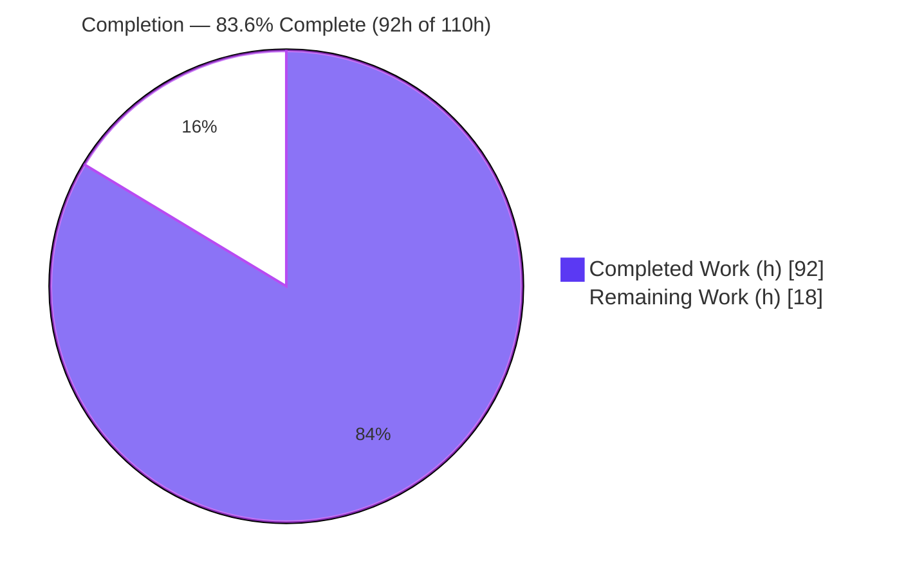
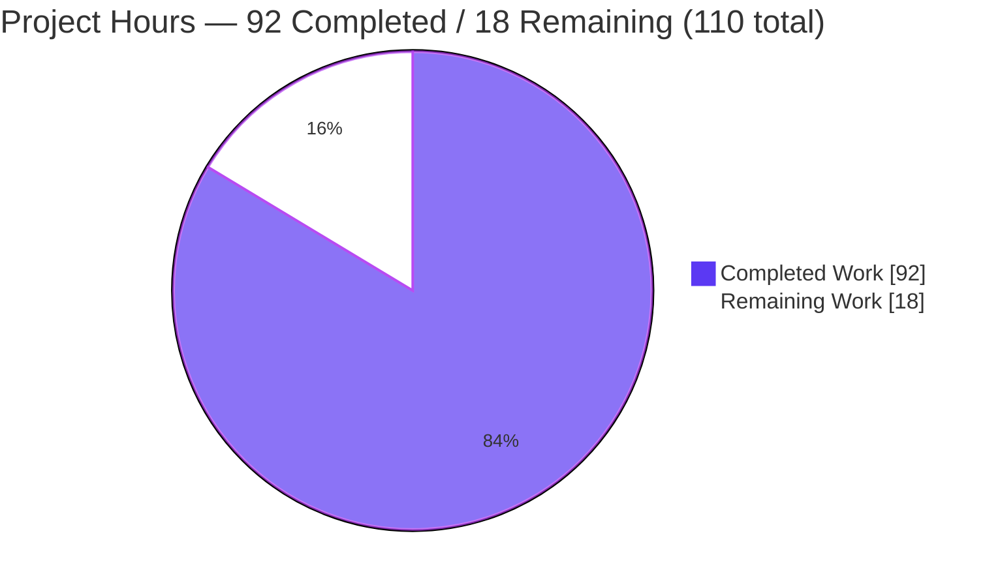
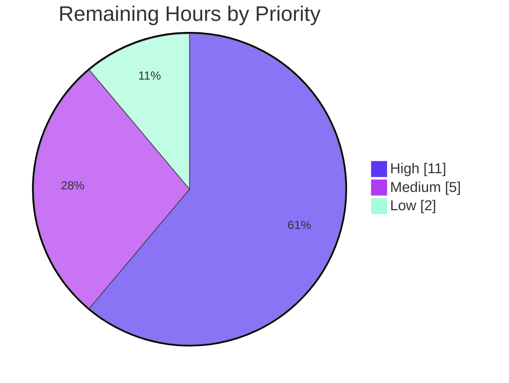

# Blitzy Project Guide — Five-Layer Read-Only Security Audit of `blitzy-cal`

> **Brand legend:** <span style="color:#5B39F3">■ Completed / Autonomous Work (Dark Blue `#5B39F3`)</span> · <span style="background:#FFFFFF;border:1px solid #ccc">□ Remaining Work (White `#FFFFFF`)</span> · <span style="color:#B23AF2">Headings/Accents `#B23AF2`</span> · <span style="background:#A8FDD9">Highlights `#A8FDD9`</span>

---

## 1. Executive Summary

### 1.1 Project Overview

This project executes a **deterministic, reproducible, read-only security audit** of the `blitzy-cal` (Cal.com fork) — a TypeScript / Yarn Berry 4.12.0 + Turborepo monorepo of ~7,433 first-party source files. The audit is organized as twelve directives across six analytical layers (Discovery, Architectural, Pattern SAST, Sink/Mitigation Inventory, Taint Triage, SCA) plus a cross-layer merge, CI/CD-style gate verdict, and a self-validating verification script. It targets platform security engineers and the repository's release-gate owners. The defining constraint — `~0 files modified` — means the deliverable is a set of **additive, machine-readable report artifacts only**; no application, configuration, or CI code is changed. Business impact: a complete, auditable, re-runnable security posture assessment that supersedes the repository's prior `npm audit`-only gate.

### 1.2 Completion Status



| Metric | Value |
|---|---|
| **Total Hours** | **110** |
| Completed Hours — Autonomous (AI) | 92 |
| Completed Hours — Manual (Human) | 0 |
| **Completed Hours (AI + Manual)** | **92** |
| **Remaining Hours** | **18** |
| **Percent Complete** | **83.6%** |

> Completion is computed per the AAP-scoped (PA1) methodology: `Completed ÷ (Completed + Remaining) = 92 ÷ 110 = 83.6%`. All AAP deliverables are **complete and validated**; the remaining 18 hours are exclusively **human path-to-production review** of a complete, `BLOCK`-verdict audit.

### 1.3 Key Accomplishments

- ✅ **All 14 audit artifacts delivered** and committed (19 physical files; `rules/` = 6 files). Git diff vs. merge base = 19 files **Added**, 170,451 insertions, **0 deletions / 0 modifications**.
- ✅ **`verify.sh` passes 16/16 checks (exit 0)** — independently re-run and confirmed; runs on both jq and python3 engines.
- ✅ **Layer 0** profile resolved `primary_language=TypeScript`, `source_file_count=7433` (re-derived live, exact match), `layer_0_status=OK`.
- ✅ **Layer 1** architectural review: 24 CWE-classified findings, **10/10** category coverage summaries.
- ✅ **Layer 2** Semgrep CE SAST: SARIF 2.1.0 (`executionSuccessful=true`), 32 normalized findings, 3 rule packs pinned locally for reproducibility.
- ✅ **Layer 3a** inventory: **25,480 lines**, 19 sink + 9 mitigation categories, 100% recall, test/prod separation.
- ✅ **Layer 3b** taint triage: 47 findings, **19/19** categories, gate-blocking truth table applied (5 blocking / 42 advisory; every advisory carries `demotionReason`).
- ✅ **Layer 4** SCA: 172 unique `(package, CVE)` findings, deduplicated, `line:0`; **OSV re-scan reproduces the exact 172** (determinism proven live).
- ✅ **Merge & Gate**: `findings-merged.json` `_summary` reconciles exactly (275 total / 156 unique / 7 corroborated / 5 gate-blocking); 3 composite chains escalated +1 tier; **`gate_verdict=BLOCK`** emitted.
- ✅ **Zero application/config/CI modifications** — read-only mandate satisfied exactly.

### 1.4 Critical Unresolved Issues

There are **no unresolved issues in the audit deliverable itself** — `verify.sh` is 16/16 and every artifact validates. The items below are **security findings the audit surfaced about the target codebase** that require human decision before the release gate can clear `BLOCK`.

| Issue | Impact | Owner | ETA |
|---|---|---|---|
| `gate_verdict=BLOCK` driven by **5 gate-blocking findings** (exploitable sinks with missing/broken mitigations) | Release gate blocks until reviewed | Security Eng. | 1 day |
| **7 cross-layer corroborated findings**, incl. 3 escalated composite chains (CWE-346/918→critical, CWE-601→high) | Highest-confidence risks, prioritized | Security Eng. | 1 day |
| **172 dependency CVEs** (4 critical, 72 high) from `./yarn.lock` | Supply-chain exposure; remediation is a follow-on effort | Platform/DevOps | 2–3 days |
| **Layer 2 partial coverage** — 15 production files unparsable by Semgrep OSS | Minor AST blind spot (documented) | Security Eng. | 0.5 day |

### 1.5 Access Issues

| System/Resource | Type of Access | Issue Description | Resolution Status | Owner |
|---|---|---|---|---|
| Audit repository & branch | Read/Write (git) | Branch checked out; all artifacts committed at HEAD `f0a6194325` | ✅ Resolved | Blitzy Agent |
| Semgrep CE & rule packs | Tooling / registry | Installed (`1.152.0`); 3 packs pinned to `rules/` — runs offline | ✅ Resolved | Blitzy Agent |
| OSV-Scanner & OSV.dev DB | Tooling / DB | Installed (`2.3.5`); local DB present, re-scan reproduces 172 findings | ✅ Resolved | Blitzy Agent |

> No access issues impede the in-scope deliverable. Live infrastructure scanning is **intentionally not performed** (prohibited by the project's `SECURITY.md`); the audit is local-source only.

### 1.6 Recommended Next Steps

1. **[High]** Review the `BLOCK` gate verdict and triage the 5 gate-blocking + 7 corroborated findings in `findings-merged.json`; decide remediate / risk-accept / false-positive and assign owners.
2. **[High]** Triage the 172 OSV dependency CVEs (validate applicability, prioritize an upgrade plan). Remediation execution is a separate follow-on (out of audit scope, AAP §0.5.2).
3. **[Medium]** *(Optional)* Wire the Directive 9 `gate_verdict` into CI (e.g., extend `.github/workflows/security-audit.yml` to run the pipeline + `verify.sh` and fail on `BLOCK`).
4. **[Medium]** Close the Layer 2 parse-coverage gap on the 15 production files (re-scan with a newer Semgrep / alternate TS parser).
5. **[Low]** Operationalize a periodic re-run cadence and pin tool versions in a reproducible container.

---

## 2. Project Hours Breakdown

### 2.1 Completed Work Detail

All rows below are autonomous (AI) work, each tracing to a specific AAP requirement/directive. **Total = 92 hours.**

| Component | Hours | Description |
|---|---|---|
| Layer 0 — Discovery (`codebase-profile.txt`) | 4 | Deterministic extension census, framework/ecosystem/lockfile detection, `exclude_dirs`, byte-reproducible profile (R1/D0) |
| Layer 1 — Architectural review (`findings-layer-1-arch.json`) | 16 | 24 findings across 10 categories; attack-chain tracing entry→impact; most-specific CWE classification; 10 coverage summaries (R2/D1) |
| Layer 2 — Semgrep SAST (`rules/`, SARIF, normalized JSON) | 10 | Install CE 1.152.0; pin 3 rule packs; scan `--sarif --metrics=off`; severity map; partial-coverage handling + 34-file documentation (R3/D2–3) |
| Layer 3a — Sink/mitigation inventory (4 files) | 12 | 100% recall over 7,433 files; 25,480 lines; 19 sink + 9 mitigation categories; test/prod separation (R4/D4) |
| Layer 3b — Taint exploitability triage (`findings-layer-3b-taint.json`) | 14 | 47 findings; 19 categories; source→sink dataflow; gate-blocking truth table; `demotionReason` on every advisory (R5/D5) |
| Layer 4 — OSV SCA (raw + normalized) | 5 | Install scanner 2.3.5; scan `./yarn.lock`; 172 CVEs; dedupe by `(package, CVE)`; normalize `line:0` (R6/D6) |
| Directive 7 — Normalization | 5 | Single-line JSON; schema conformance; unified severity vocabulary; ANSI stripping across all layers (R7) |
| Directive 8 — Cross-layer merge (`findings-merged.json`) | 8 | `_summary` header; corroboration annotations; +1-tier composite escalation; cross-layer dedupe (R8) |
| Directive 9 — Gate verdict | 2 | Compute `ERROR\|BLOCK\|WARN\|PASS` from gate-blocking truth table → `BLOCK` (R9) |
| Directive 10 — `verify.sh` harness | 8 | 16-check, dual-engine (jq + python3), shellcheck-clean; exit = failure count (R10) |
| QA, determinism testing & end-to-end re-validation | 8 | 3 QA-fix commits; reproducibility tests; full independent re-validation of all 6 layers + merge/gate/verify |
| **Total Completed** | **92** | |

### 2.2 Remaining Work Detail

All remaining work is **human path-to-production** review/operationalization of the completed audit. **Total = 18 hours.**

| Category | Hours | Priority |
|---|---|---|
| Review `BLOCK` verdict + triage 5 gate-blocking & 7 corroborated findings (incl. 3 escalated chains) | 6 | High |
| Review/triage 172 OSV dependency CVEs + prioritize remediation plan | 5 | High |
| *(Optional)* Integrate Directive 9 `gate_verdict` into CI pipeline | 3 | Medium |
| Investigate/close Layer 2 parse-coverage gap (15 production files) | 2 | Medium |
| Operationalize re-run cadence + stakeholder handoff; pin tool versions | 2 | Low |
| **Total Remaining** | **18** | |

### 2.3 Hours Reconciliation & Methodology

| Quantity | Hours |
|---|---|
| Section 2.1 — Completed | 92 |
| Section 2.2 — Remaining | 18 |
| **Total Project Hours** | **110** |

- **Completion formula (PA1):** `92 ÷ (92 + 18) = 92 ÷ 110 = 83.6%`.
- **Cross-section integrity:** Remaining = **18h** is identical in §1.2 (metrics + pie), §2.2 (sum), and §7 (pie). §2.1 (92) + §2.2 (18) = §1.2 Total (110). ✔
- **Scope note:** Pre-existing application TypeScript/vitest errors are **excluded** — they reside in out-of-scope code byte-identical to the merge base and are forbidden to fix (AAP §0.5.2); they are not AAP remaining work.

---

## 3. Test Results

All tests below originate from **Blitzy's autonomous validation logs** for this project. The audit's own test suite is the Directive 10 `verify.sh` harness; reproducibility/determinism checks supplement it. (The target application's own unit suite is **not** a test of this deliverable and is addressed as out-of-scope context in §4.)

| Test Category | Framework | Total Tests | Passed | Failed | Coverage % | Notes |
|---|---|---|---|---|---|---|
| Artifact Verification | `verify.sh` (POSIX bash; jq + python3) | 16 | 16 | 0 | 100% | Self-validating 16-check harness; exit code = failure count = 0 |
| Determinism / Reproducibility | Shell re-derivation | 3 | 3 | 0 | 100% | Layer 0 census → 7433; Layer 3a recall_gap=0; Layer 4 OSV re-scan → identical 172 |
| Schema / Vocabulary Conformance | jq + python3 assertions | 6 | 6 | 0 | 100% | Single-line JSON, severity vocab, non-empty descriptions, integer lines, ANSI-free, L3b→sink traceability |
| **Total** | | **25** | **25** | **0** | **100%** | |

**`verify.sh` check inventory (all PASS):**

| # | Check | # | Check |
|---|---|---|---|
| 1 | Layer 0 profile present, `primary_language` set, status ≠ ERROR | 9 | `_summary` exposes all 8 required keys |
| 2 | Layer 1 valid JSON, 10/10 category markers | 10 | `gate_verdict` ∈ {ERROR,BLOCK,WARN,PASS} (=BLOCK) |
| 3 | Layer 2 SARIF `runs[]` + normalized JSON array | 11 | `total_findings` (275) = Σ layer findings (275) |
| 4 | Layer 3a inventories non-empty, correctly formatted | 12 | Severity vocab limited to {critical,high,medium,low} |
| 5 | Layer 3a test-variant inventories present | 13 | Every finding: non-empty description (≤200) + integer line |
| 6 | Layer 3b valid JSON, 19/19 categories, boolean `gateBlocking` | 14 | No ANSI escape sequences in any artifact |
| 7 | Layer 4 raw valid JSON; normalized `line:0`, `tool:osv-scanner` | 15 | Findings + merged report are single-line JSON |
| 8 | Merged report valid JSON | 16 | Every L3b `file:line` traceable to `sink-inventory.txt` |

---

## 4. Runtime Validation & UI Verification

> **No graphical UI exists** — this deliverable is a static, read-only, artifact-producing audit pipeline (CLI + machine-readable JSON/text outputs). "Runtime" validation therefore covers pipeline/tooling execution and the verification harness.

- ✅ **Operational** — `verify.sh` executes cleanly and exits 0 (16/16 PASS).
- ✅ **Operational** — Semgrep CE 1.152.0 validates the pinned rule packs (`--validate`, exit 0) and scans **offline** against `rules/`.
- ✅ **Operational** — OSV-Scanner 2.3.5 scans `./yarn.lock` and reproduces 172 unique findings; exit code `1` is **by design** when vulnerabilities are found (the pipeline captures JSON, not the exit code).
- ✅ **Operational** — Layer 0 census and Layer 4 re-scan are **byte-deterministic** on re-run.
- ✅ **Operational** — `findings-merged.json` `_summary` arithmetic reconciles exactly (275 / 156 / 7 / 5).
- ⚠ **Partial (documented)** — Layer 2 Semgrep OSS could not parse 34 files (15 production, 18 test, 1 `.d.ts`); flagged `coverage:partial` and fully enumerated per AAP §0.8.1 graceful degradation. This is a tool-parser limitation, not a scan failure.
- ⚪ **Out of scope (context only)** — The target application reports 9 pre-existing TypeScript compile errors and 19 vitest runtime errors. These are byte-identical to the AAP merge base (100% inherited), reside in out-of-scope application code, and are **forbidden to modify** (AAP §0.5.2). They do not affect any in-scope artifact.

---

## 5. Compliance & Quality Review

Cross-mapping of AAP directives and GLOBAL RULES (§0.7) to delivered status.

| AAP Deliverable / Rule | Benchmark | Status | Evidence |
|---|---|---|---|
| D0 Layer 0 Discovery | Profile with 8 fields, status OK | ✅ Pass | `codebase-profile.txt`; `source_file_count=7433` (live match) |
| D1 Layer 1 Architectural | 10/10 categories, CWE-classified | ✅ Pass | 24 findings, 10 coverage markers |
| D2–3 Layer 2 SAST | SARIF + normalized, rules pinned | ✅ Pass (coverage partial, sanctioned) | SARIF 2.1.0, 32 findings, `rules/` ×3 packs |
| D4 Layer 3a Inventory | 19 sink + 9 mitigation, 100% recall | ✅ Pass | 25,480 lines, 0 malformed, test/prod split |
| D5 Layer 3b Taint | 19 categories, `gateBlocking`+`demotionReason` | ✅ Pass | 47 findings; 5 blocking / 42 advisory |
| D6 Layer 4 SCA | Dedupe `(package,CVE)`, `line:0` | ✅ Pass | 172 findings; re-scan reproduces 172 |
| D7 Normalize | Single-line JSON, schema, severity vocab | ✅ Pass | verify #12,#13,#15 |
| D8 Merge | `_summary`, corroboration, escalation | ✅ Pass | reconciles 275/156; 7 corroborated; 3 escalated |
| D9 Gate | `ERROR\|BLOCK\|WARN\|PASS` | ✅ Pass | `gate_verdict=BLOCK` (correct) |
| D10 Verify | 16 checks, exit = failures | ✅ Pass | 16/16, exit 0 |
| Rule: No silent failure | Explicit status per layer | ✅ Pass | `layer_*_status` recorded; L2 `partial` flagged |
| Rule: Unified severity vocabulary | {critical,high,medium,low} only | ✅ Pass | verify #12 (0 violations) |
| Rule: Strip ANSI | No escape codes in artifacts | ✅ Pass | verify #14 (0 affected) |
| Rule: Non-empty description | Every finding | ✅ Pass | verify #13 |
| Rule: Read-only / zero-modification | No app/config/CI edits | ✅ Pass | git diff: 19 files Added, 0 modified |
| Rule: Canonical names & co-location | Exact filenames, same dir | ✅ Pass | all artifacts at repo root |

**Fixes applied during autonomous validation:** 3 QA-resolution commits (`7c56d1a905` Layers 0–4 detection/normalization review; `6d73996995` Directive 8 summary consistency & gate-blocking prioritization; `f0a6194325` resolve 3 QA findings) plus a Check-14 ANSI-scan extension across all 16 canonical artifacts (`1a276d2043`).

**Outstanding compliance items:** none for the deliverable. The `BLOCK` verdict is the intended assessment output, not a compliance gap.

---

## 6. Risk Assessment

Risks are split between **(A) the audit deliverable** (low; mitigated) and **(B) security risks the audit surfaced about the target** (open; require human action — these are the audit's findings, not deliverable defects).

| Risk | Category | Severity | Probability | Mitigation | Status |
|---|---|---|---|---|---|
| Layer 2 Semgrep partial coverage (34 files unparsed) | Technical | Low | Occurred (known) | Documented + enumerated; re-scan newer Semgrep | ⚠ Accepted (graceful degradation) |
| Agent-layer (L1/L3b) structural — not byte — reproducibility | Technical | Low | Low | Gate-blocking classification is the reproducibility anchor | ✅ Mitigated by design |
| `gate_verdict=BLOCK` from 5 gate-blocking findings (exploitable sinks, missing/broken mitigations) | Security | High | Medium | Human triage; remediation follow-on | 🔴 Open (awaiting review) |
| 172 known dependency CVEs (4 critical, 72 high) | Security | High | High | Upgrade plan; OSV re-scan to confirm fixes | 🔴 Open (reported) |
| 3 composite L1∩L3b chains escalated +1 tier + 7 corroborated | Security | Critical | Medium | Prioritize as highest-confidence findings | 🔴 Open (reported) |
| `gate_verdict` emitted as output, not wired into CI (per §0.5.2) | Operational | Medium | Medium | Optional CI integration (path-to-production) | 🟡 Open by design |
| No automated re-run cadence (point-in-time snapshot) | Operational | Low | Medium | Schedule periodic re-runs | 🟡 Open |
| Audit tooling host-local/ephemeral — version drift on re-run | Integration | Medium | Low | `rules/` pinned; pin tool versions in container | 🟡 Partially mitigated |
| OSV-Scanner V1-vs-V2 import-path caveat (Directive 6 lists V1) | Integration | Low | Low | Prebuilt binary / `/v2/` path used (2.3.5) | ✅ Mitigated |

---

## 7. Visual Project Status

**Project hours breakdown** (Completed = `#5B39F3`, Remaining = `#FFFFFF`):



**Remaining work by priority** (18h total):



**Findings severity distribution (156 unique, post-merge):**

| Severity | Count | Bar |
|---|---|---|
| Critical | 25 | ████████ |
| High | 64 | ████████████████████ |
| Medium | 35 | ███████████ |
| Low | 32 | ██████████ |

> **Integrity:** the pie chart "Remaining Work" = **18**, identical to §1.2 Remaining Hours and the §2.2 sum. "Completed Work" = **92** = §2.1 sum.

---

## 8. Summary & Recommendations

**Achievements.** The five-layer read-only security audit is **fully delivered, internally consistent, byte-deterministic, and committed clean**. All 14 AAP artifacts exist and pass the Directive 10 `verify.sh` harness (16/16, exit 0). The change set is purely additive (19 files Added, 0 modified), satisfying the `~0 files modified` mandate exactly. The audit produced 156 unique findings across all layers and a correct CI/CD `gate_verdict=BLOCK`, superseding the repository's prior `npm audit`-only posture.

**Remaining gaps.** None in the deliverable. The remaining **18 hours** are human path-to-production work: reviewing the `BLOCK` verdict, triaging the 5 gate-blocking + 7 corroborated findings and the 172 dependency CVEs, and optional operationalization (CI wiring, re-run cadence, closing the Layer 2 parse gap).

**Critical path to production.** (1) Security review of the gate-blocking + corroborated findings → (2) CVE triage and remediation planning → (3) optional CI gate integration → (4) re-run `verify.sh` to confirm continued conformance.

**Success metrics.** `verify.sh` 16/16 PASS · 0 in-scope defects · determinism re-proven (7433 census, 172 CVE re-scan) · 0 application/config/CI files modified.

**Production readiness.** The **audit deliverable is production-ready** (complete and validated). The **target codebase is not yet release-ready** — by the audit's own design, the `BLOCK` verdict signals that human security review must clear the gate-blocking findings first. Overall project completion: **83.6%** (92h of 110h), with the residual being human review that the autonomous pipeline cannot — and per AAP scope, must not — perform itself.

---

## 9. Development Guide

> All commands below were executed and verified in the project environment. Run from the **repository root** (where the artifacts and `verify.sh` are co-located).

### 9.1 System Prerequisites

- **OS:** Linux or macOS (POSIX shell with `grep`, `find`).
- **Python:** ≥ 3.9 (validated on 3.13.7) — runtime for Semgrep CE.
- **jq:** ≥ 1.6 (validated on 1.8.1) — primary JSON engine for `verify.sh` (python3 is the automatic fallback).
- **Disk:** ~2 GB free (rule packs + OSV DB cache).
- **Optional:** Go ≥ 1.21 if building OSV-Scanner from source.
- **Not required:** building, installing, or running the target application — this is a static read-only audit.

### 9.2 Environment Setup

```bash
# From the repository root on the audit branch:
git rev-parse --abbrev-ref HEAD        # -> blitzy-bd97caf4-4094-463f-9c34-406703896640
ls codebase-profile.txt verify.sh      # confirm artifacts are present
```

### 9.3 Tooling Installation

```bash
# Semgrep Community Edition (Layer 2)
pip install --break-system-packages "semgrep==1.152.0"   # or use a venv
semgrep --version                                         # -> 1.152.0

# OSV-Scanner V2 (Layer 4) — prefer the prebuilt binary; if building, use the /v2/ path:
#   go install github.com/google/osv-scanner/v2/cmd/osv-scanner@latest
osv-scanner --version                                     # -> 2.3.5

jq --version                                              # -> jq-1.8.1
```

### 9.4 Re-running the Pipeline (optional reproduction)

```bash
# Layer 0 — deterministic source census (must print 7433)
LC_ALL=C git ls-files '*.ts' '*.tsx' '*.js' \
  | grep -vE '(node_modules|\.next|dist|build|\.turbo|\.yarn|coverage)/' | wc -l

# Layer 2 — Semgrep SAST using the locally pinned rule packs (offline)
semgrep --config rules/ --sarif --metrics=off \
  --output results-semgrep.sarif apps/ packages/

# Layer 4 — OSV SCA over the single lockfile (exit code 1 = vulns found, expected)
osv-scanner --lockfile yarn.lock --format json --output results-osv.json
```

### 9.5 Verification

```bash
bash verify.sh
# Expected tail:  "verify.sh: 0 failed check(s) of 16"   (exit code 0)
echo "exit=$?"
```

### 9.6 Interpreting Results

```bash
# Gate verdict and headline summary
jq -r '(.[0]._summary // ._summary).gate_verdict' findings-merged.json   # -> BLOCK
jq '(.[0]._summary // ._summary) | {total_findings,unique_findings,corroborated,gate_blocking}' findings-merged.json

# List the gate-blocking findings to triage first
jq '[.[] | select(.gateBlocking==true)]' findings-layer-3b-taint.json
```

`gate_verdict` precedence: **ERROR** (a layer failed) ▸ **BLOCK** (≥1 gate-blocking finding) ▸ **WARN** ▸ **PASS**.

### 9.7 Troubleshooting

- **`osv-scanner` exits non-zero:** Exit `1` is **expected** when vulnerabilities are found — capture the JSON output, do not gate on the exit code.
- **Semgrep "34 files failed to parse":** A Semgrep OSS parser limitation on certain TS/`.d.ts`/HTML constructs; the affected files are enumerated in `codebase-profile.txt` and the SARIF `toolExecutionNotifications`. Coverage is correctly flagged `partial`.
- **`jq: command not found`:** `verify.sh` automatically falls back to a python3 engine — no action needed if python3 is present.
- **Non-deterministic counts on re-run:** Ensure `LC_ALL=C` and the standard `exclude_dirs`; agent layers (1/3b) are structurally — not byte — reproducible by design.

---

## 10. Appendices

### Appendix A — Command Reference

| Purpose | Command |
|---|---|
| Run verification | `bash verify.sh` |
| Read gate verdict | `jq -r '(.[0]._summary // ._summary).gate_verdict' findings-merged.json` |
| Source census (Layer 0) | `LC_ALL=C git ls-files '*.ts' '*.tsx' '*.js' \| grep -vE '(node_modules\|\.next\|dist\|build\|\.turbo\|\.yarn\|coverage)/' \| wc -l` |
| Semgrep scan (Layer 2) | `semgrep --config rules/ --sarif --metrics=off --output results-semgrep.sarif apps/ packages/` |
| OSV scan (Layer 4) | `osv-scanner --lockfile yarn.lock --format json --output results-osv.json` |
| List gate-blocking findings | `jq '[.[] \| select(.gateBlocking==true)]' findings-layer-3b-taint.json` |
| Inventory line count | `wc -l sink-inventory.txt mitigation-inventory.txt` |

### Appendix B — Port Reference

**Not applicable.** This is a static, read-only audit; it starts no services and binds no ports. (The target app's runtime ports — e.g., web/api gateways — are referenced as audit inputs only and are never launched.)

### Appendix C — Key File Locations

All artifacts reside at the repository root (co-located so `verify.sh` relative checks resolve).

| Artifact | Layer/Directive | Size |
|---|---|---|
| `codebase-profile.txt` | Layer 0 | 4.3 KB |
| `findings-layer-1-arch.json` | Layer 1 | 8.3 KB |
| `rules/` (security-audit, secrets, owasp-top-ten × `.yml`/`.yaml`) | Layer 2 | ~3.8 MB |
| `results-semgrep.sarif` | Layer 2 (raw) | 1.36 MB |
| `findings-layer-2-semgrep.json` | Layer 2 (norm.) | 13.1 KB |
| `sink-inventory.txt` / `sink-inventory-test.txt` | Layer 3a | 435 KB / 198 KB |
| `mitigation-inventory.txt` / `mitigation-inventory-test.txt` | Layer 3a | 2.0 MB / 726 KB |
| `findings-layer-3b-taint.json` | Layer 3b | 19.8 KB |
| `results-osv.json` | Layer 4 (raw) | 1.93 MB |
| `findings-layer-4-osv.json` | Layer 4 (norm.) | 36.4 KB |
| `findings-merged.json` | Directives 7–9 | 62.7 KB |
| `verify.sh` | Directive 10 | 19.5 KB |

### Appendix D — Technology Versions

| Component | Version | Role |
|---|---|---|
| Semgrep CE | 1.152.0 | Layer 2 SAST engine |
| OSV-Scanner | 2.3.5 (V2) | Layer 4 SCA |
| jq | 1.8.1 | JSON processing / `verify.sh` primary engine |
| Python | 3.13.7 | Semgrep runtime / `verify.sh` fallback engine |
| Yarn | 4.12.0 (Berry) | Target package manager (lockfile source) |
| Node.js | 20 LTS | Target runtime (reference only) |
| SARIF | 2.1.0 | Layer 2 output schema |

### Appendix E — Environment Variable Reference

**Not applicable to the audit runtime** — the pipeline and `verify.sh` require no environment variables. (Secrets such as `CALENDSO_ENCRYPTION_KEY` appear only as *audited references* in the target's `.env*.example` files and are reported by location, never consumed.)

### Appendix F — Developer Tools Guide

- **Semgrep:** Use the pinned local `rules/` directory (`--config rules/`) for reproducible, offline scans; add `--metrics=off`. Validate packs with `semgrep --validate --config rules/<pack>.yaml`.
- **OSV-Scanner:** Use `--lockfile yarn.lock --format json`; prefer the prebuilt V2 binary (or the `/v2/` Go path). Treat exit `1` as "vulnerabilities found," not an error.
- **jq / python3:** `verify.sh` is dual-engine; jq is primary, python3 is the automatic fallback — keep at least one installed.

### Appendix G — Glossary

| Term | Definition |
|---|---|
| **SAST** | Static Application Security Testing — AST/pattern analysis of source without execution (Layer 2). |
| **SCA** | Software Composition Analysis — scanning dependencies for known CVEs (Layer 4). |
| **Taint analysis** | Tracing untrusted data from a source to a dangerous sink to judge exploitability (Layer 3b). |
| **Sink / Mitigation** | A dangerous operation (sink) vs. a control that neutralizes it (mitigation); inventoried in Layer 3a. |
| **`gateBlocking`** | Boolean marking a finding as release-blocking per the gate-blocking truth table; only `true` blocks a merge. |
| **`demotionReason`** | Mandatory justification attached to an advisory (non-blocking) finding. |
| **Corroboration** | Same `file+line+CWE` confirmed by ≥2 layers → deduped to higher severity with `corroborated_by`. |
| **CWE** | Common Weakness Enumeration — the taxonomy used to classify every finding. |
| **SARIF** | Static Analysis Results Interchange Format (2.1.0) — Semgrep's structured output. |
| **`gate_verdict`** | CI/CD decision: `ERROR` ▸ `BLOCK` ▸ `WARN` ▸ `PASS`. This run = `BLOCK`. |
| **Graceful degradation** | Emitting partial results flagged `coverage:partial` rather than failing silently (AAP §0.8.1). |