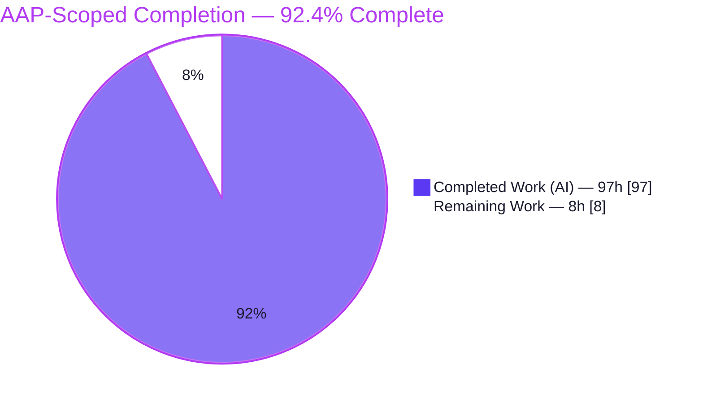
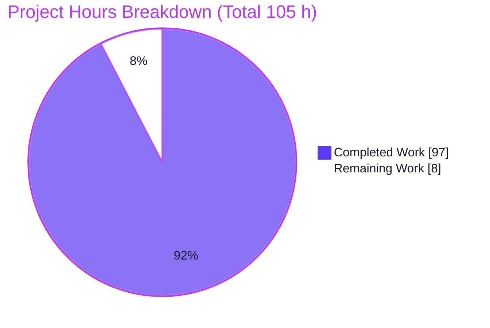
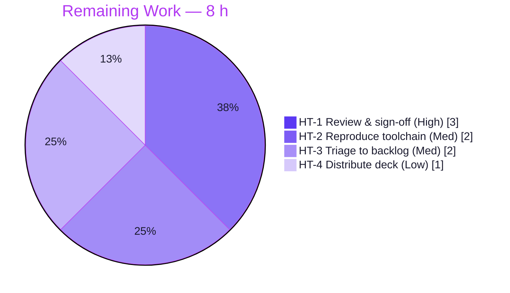
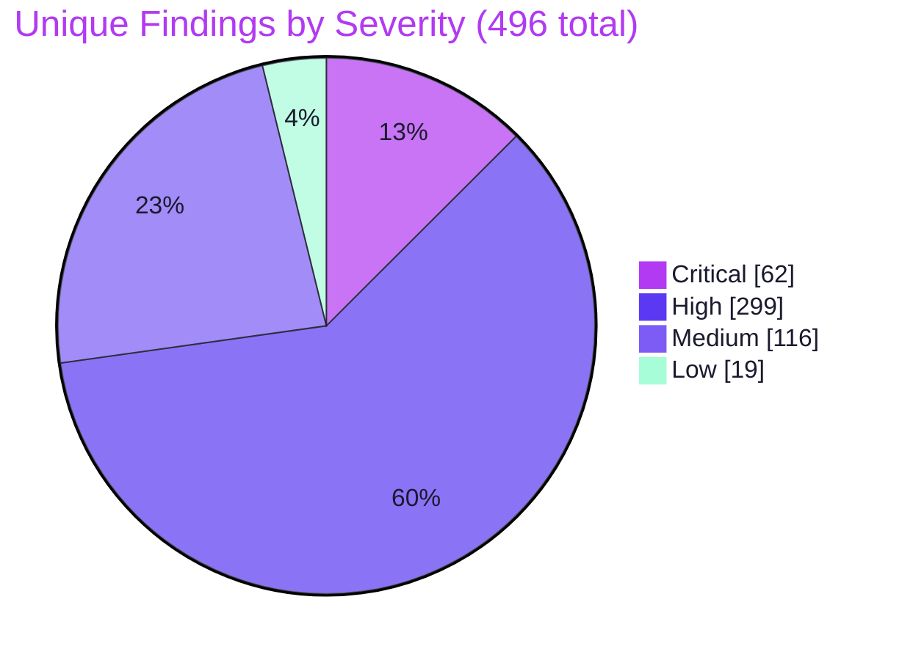

# Blitzy Project Guide — blitzy-cal Four-Layer Security Audit

## 1. Executive Summary

### 1.1 Project Overview

This project delivers a **non-invasive, four-layer security audit** of `blitzy-cal` — the `calcom-monorepo` (a Cal.com parity fork): a 100% TypeScript/JavaScript Yarn Berry + Turborepo monorepo of ~7,433 source files across 119 workspace manifests. The objective was to **measure, not remediate** the codebase's security posture by reading the entire tree through four complementary techniques — Blitzy native expert reasoning (Layer 1), Semgrep AST patterns (Layer 2), Joern Code Property Graph dataflow (Layer 3), and OSV-Scanner dependency matching (Layer 4) — then normalize, deduplicate, and merge the results into a single machine-readable cross-layer report. Governed by a strict `~0 files modified` mandate, every output is a net-new artifact; zero application source or configuration was changed. The audit surfaced **527 findings (496 unique, 31 cross-layer corroborated)** for the security team to triage.

### 1.2 Completion Status

The completion percentage is calculated using the **PA1 AAP-scoped methodology**: only work defined in the Agent Action Plan (the eight directives R1–R8 plus the two user rules) and standard path-to-production activities are counted. Remediation of the discovered vulnerabilities is **explicitly out of scope (AAP §0.3.2)** and excluded from the denominator — the findings are the audit's measurement *output*, not defects in the deliverable.



| Metric | Hours | Notes |
|--------|-------|-------|
| **Total Project Hours** | **105 h** | AAP-scoped (R1–R8 + Rule 1 + Rule 2) + path-to-production |
| **Completed Hours (AI + Manual)** | **97 h** | AI-delivered: 97 h · Manual (human): 0 h |
| **Remaining Hours** | **8 h** | Path-to-production human work (review, reproduce, triage, distribute) |
| **Percent Complete** | **92.4 %** | 97 ÷ 105 = 0.924 |

> Completion formula: **97 completed ÷ (97 completed + 8 remaining) = 97 ÷ 105 = 92.4 %.**

### 1.3 Key Accomplishments

- ✅ **All four scanning layers delivered and validated** — Layer 1 (8 findings), Layer 2 Semgrep (262), Layer 3 Joern (99), Layer 4 OSV-Scanner (158); **527 total findings**.
- ✅ **Cross-layer merged report** (`findings-merged.json`) with `_summary` header — 496 unique findings, 31 cross-layer corroborations (Layer 1 ∩ Layer 2/3 = highest confidence).
- ✅ **All directive pass/fail gates pass** — R7 `wc -l == 4`; R2 Semgrep dry-run exits 0 with **proven zero network**; R4 CPG indexed 6,782 files; R5 Joern queries deterministic.
- ✅ **Full toolchain provisioned & runnable** — OpenJDK 21.0.11, Semgrep 1.164.0, Joern 4.0.551, OSV-Scanner 2.3.8; 35-rule offline Semgrep cache (14+11+10).
- ✅ **Read-only mandate verifiably honored** — 15 net-new files added, **0 existing files modified, 0 deleted** (32,086 insertions across 21 agent commits).
- ✅ **Explainability decision log** (`decision-log.md`, 573 lines, 15 sections) and **self-contained reveal.js executive deck** (16 slides, 5 Mermaid, pinned CDNs) delivered per Rules 1 & 2.
- ✅ **100% schema conformance** across all four layers (0 violations) and single-line minified determinism.

### 1.4 Critical Unresolved Issues

There are **no unresolved issues that block delivery or validation of the audit**. All deliverables passed every autonomous validation gate. The items below are inherent properties of an audit deliverable, not blockers.

| Issue | Impact | Owner | ETA |
|-------|--------|-------|-----|
| Discovered vulnerabilities are unremediated (by design) | 62 critical + 299 high findings remain in `blitzy-cal`; remediation is out of audit scope | Security / Eng team | Post-triage (separate effort) |
| `cpg.bin` (140 MB) not committed | Layer 3 re-run requires CPG rebuild | Reproducing engineer | Within HT-2 (2 h) |
| Deck requires CDN egress at view time | Renders blank in air-gapped environments until assets are vendored | Reviewer | Within HT-4 (1 h) |

### 1.5 Access Issues

**No access issues identified.** The audit ran entirely against the local source tree with no dependency on external repository permissions or service credentials for its core deliverables.

| System / Resource | Type of Access | Issue Description | Resolution Status | Owner |
|-------------------|----------------|-------------------|-------------------|-------|
| Semgrep Registry | Network (egress) | One-time rule-pack download; subsequently cached locally for offline `--metrics=off` scans | Resolved — 35 rules cached in-repo | N/A |
| OSV.dev database | Network (egress) | Re-running Layer 4 needs OSV.dev access or a downloaded offline database | Resolved — documented; offline-DB fallback available | Reproducing engineer |
| CDN (reveal.js/Mermaid/Lucide) | Network (egress) | Deck loads pinned CDN assets at view time | Open (Low) — vendor assets for air-gapped use (HT-4) | Reviewer |

### 1.6 Recommended Next Steps

1. **[High]** Conduct human security review & sign-off of the four-layer findings — validate the 8 Layer-1 expert findings and the 31 corroborated highest-confidence pairs (HT-1, 3 h).
2. **[Medium]** Reproduce the scan in the target/CI environment — install the pinned toolchain and re-run the directive gates to confirm parity (HT-2, 2 h).
3. **[Medium]** Triage the 496 unique findings into a prioritized remediation backlog — separate true/false positives, group by CWE/severity, create tracked issues (HT-3, 2 h).
4. **[Low]** Distribute the executive deck — serve over HTTP and optionally vendor CDN assets for air-gapped viewing (HT-4, 1 h).
5. **[Low]** *(Out-of-scope follow-up)* Scope a remediation programme for the 62 critical / 299 high findings and 158 dependency CVEs, and consider wiring the scan into CI/CD for continuous coverage.

---

## 2. Project Hours Breakdown

### 2.1 Completed Work Detail

All completed work was delivered autonomously by Blitzy agents (AI = 97 h; human/manual = 0 h). Each component traces to a specific AAP directive or user rule.

| Component | Hours | Description |
|-----------|-------|-------------|
| Toolchain provisioning | 8 | Install & verify OpenJDK 21.0.11, Semgrep 1.164.0 (isolated venv), Joern 4.0.551, OSV-Scanner 2.3.8 prebuilt binary (R2/R4/R6 install legs) |
| Layer 1 — Blitzy native expert audit (R1) | 14 | Context-aware reasoning over code+config+architecture; 8 CWE-classified logic/config/key-reuse findings scanners structurally miss |
| Layer 2 — Semgrep (R2 cache + R3) | 11 | Curate 35-rule local cache (security-audit/secrets/owasp); scan → `results-semgrep.sarif` (272 results); transform → 262 normalized findings via severity map |
| Layer 3 — Joern (R4 build + R5) | 18 | Build `cpg.bin` (6,782 files / 69,591 methods / 965,630 calls); author `security-queries.sc` (212 lines, 5 query families); run → 99 normalized findings |
| Layer 4 — OSV-Scanner (R6) | 5 | Scan `yarn.lock` → `results-osv.json`; transform → 158 findings deduped by (package, CVE) |
| R7 — Normalization & dedup | 9 | Fixed schema, single-line minified, cross-layer dedup (file+line+CWE), corroboration annotation, OSV dedup, `wc -l == 4` gate |
| R8 — Merged cross-layer report | 5 | `findings-merged.json` with `_summary` (total/unique/corroborated/by_layer/by_severity) + corroboration highlighting |
| Rule 1 — Decision log | 6 | `decision-log.md` (573 lines, 15 sections): toolchain, severity maps, query design, dedup, gate evidence, R1–R8 trace, risk narrative |
| Rule 2 — Executive deck | 10 | Self-contained `executive-summary.html` reveal.js deck (16 slides, 5 Mermaid, 33 Lucide icons, inline Blitzy theme, pinned CDNs) |
| Validation & QA hardening | 11 | 5 production-readiness gates, transform-fidelity proofs, schema conformance, CP1/CP2 + QA FIN-B/FIN-C fixes, Chrome deck render verification |
| **Total Completed** | **97** | |

### 2.2 Remaining Work Detail

All remaining work is **path-to-production human activity**; it does not include remediation (out of scope per AAP §0.3.2).

| Category | Hours | Priority |
|----------|-------|----------|
| HT-1 — Human security review & sign-off of 4-layer findings | 3 | High |
| HT-2 — Reproduce toolchain in target/CI env + re-run R2/R4/R5/OSV gates | 2 | Medium |
| HT-3 — Triage 496 unique findings into a prioritized remediation backlog | 2 | Medium |
| HT-4 — Distribute executive deck / vendor CDN assets for air-gapped viewing | 1 | Low |
| **Total Remaining** | **8** | |

> **Reconciliation:** Section 2.1 (97 h) + Section 2.2 (8 h) = **105 h** = Total Project Hours in Section 1.2. Remaining (8 h) matches Section 1.2 and Section 7.

### 2.3 Out-of-Scope Follow-Up (0 h — Awareness Only)

The following are deliberately excluded from the hour totals because they fall outside the AAP scope. They are listed so stakeholders understand the natural work that *follows* the audit:

- **Remediating the discovered vulnerabilities** — 62 critical + 299 high first-party findings and 158 dependency CVEs (3 critical). A separate engineering programme, scoped after triage.
- **Wiring the four-layer scan into CI/CD** — continuous re-scanning was not requested and the existing `.github/workflows/security-audit.yml` was deliberately left unmodified.

---

## 3. Test Results

Because this is a **read-only measurement task with no buildable application change**, "tests" are the directive pass/fail gates, schema-conformance checks, and transform-fidelity verifications executed by Blitzy's autonomous validation system. Every row below originates from Blitzy's autonomous validation logs and was independently re-confirmed during this assessment.

| Test Category | Framework / Method | Total Checks | Passed | Failed | Coverage % | Notes |
|---------------|--------------------|--------------|--------|--------|------------|-------|
| Directive Pass/Fail Gates | Shell / scanner CLIs | 4 | 4 | 0 | 100% | R7 `wc -l == 4`; R2 dry-run exit 0 (zero network); R4 CPG 6,782 files > 0; R5 queries exit 0 |
| Schema Conformance | Python JSON validator | 4 | 4 | 0 | 100% | Layers 1–4: every row `{file,line,severity,cwe,description,layer,tool}`; sev ∈ {critical,high,medium,low}; CWE `^CWE-\d+$`; desc ≤ 200 — **0 violations** |
| Transform Fidelity | Deterministic re-derivation | 4 | 4 | 0 | 100% | L2: SARIF 272 → 262 exact; L3: 99 → 99 exact; L4: 158 = 158 distinct (pkg,CVE); R8 merged 527/496/31 recompute exactly |
| Artifact Validity | JSON/SARIF parse + structure | 9 | 9 | 0 | 100% | 5 findings JSON + 3 raw intermediates valid & single-line minified; `security-queries.sc` braces 32/32, parens 110/110, single `@main` |
| Runtime / Deck | Chrome (headless) render | 1 | 1 | 0 | 100% | 16 slides, 5 Mermaid → SVG, 33 Lucide icons, all CDN HTTP 200, **0 console errors/warnings** |
| **Total** | | **22** | **22** | **0** | **100%** | All Blitzy autonomous validation checks pass |

**Tooling baseline (all runnable):** OpenJDK 21.0.11 · Semgrep 1.164.0 · Joern 4.0.551 · OSV-Scanner 2.3.8 · 35-rule offline Semgrep cache (0 config errors).

---

## 4. Runtime Validation & UI Verification

**Scanner / artifact runtime health:**

- ✅ **Semgrep dry-run (R2)** — Operational. Exits 0 against the local 35-rule cache with `--metrics=off`; re-run with egress blocked (dead proxy) → still exit 0, zero network/error lines.
- ✅ **Joern CPG build (R4)** — Operational. `cpg.bin` loads (exit 0), 6,782 source files indexed, 69,591 methods, 965,630 calls, language = JSSRC.
- ✅ **Joern queries (R5)** — Operational. `security-queries.sc` executes against `cpg.bin` (exit 0), 811 route/request taint sources, 99 findings; output content-identical to committed `results-joern.json` (deterministic).
- ✅ **OSV-Scanner (R6)** — Operational. Scans `yarn.lock` → 158 findings; exit code 1 indicates vulnerabilities found (expected behavior, not an error).
- ✅ **R7 / R8 aggregation** — Operational. `wc -l == 4`; merged `_summary` recomputes total=527, unique=496, corroborated=31 exactly.

**Executive deck (UI) verification — rendered in Chrome:**

- ✅ **Structure** — 16 `<section>` slides; 4 slide types (`slide-title`, `slide-divider`, default content, `slide-closing`) present.
- ✅ **Diagrams & icons** — All 5 Mermaid diagrams render to full-size SVG under realistic navigation; 33 Lucide SVG icons render (zero emoji per rule).
- ✅ **Resources** — All pinned CDN resources return HTTP 200 (reveal.js 5.1.0, Mermaid 11.4.0, Lucide 0.460.0); only browser-default `favicon.ico` 404 (harmless).
- ✅ **Console** — Zero console errors/warnings; brand palette, typography, and inline `:root` theme correct.
- ⚠ **Air-gapped caveat** — Deck depends on CDN egress at view time; vendor assets locally for offline viewing (HT-4).

---

## 5. Compliance & Quality Review

### 5.1 Directive & Rule Compliance Matrix

| Requirement | Deliverable | Status | Evidence |
|-------------|-------------|--------|----------|
| **R1** Layer 1 Blitzy native audit | `findings-layer-1-blitzy.json` | ✅ Pass | 8 CWE-classified findings (logic/config/key-reuse) |
| **R2** Install Semgrep + local rule packs + telemetry-off | Semgrep 1.164.0 + `semgrep-rules/` | ✅ Pass | 35 rules cached; dry-run exit 0, proven no-network |
| **R3** Run Semgrep + severity map | `results-semgrep.sarif` → `findings-layer-2-semgrep.json` | ✅ Pass | 272 → 262; `error→critical/warning→high/note→medium/info→low` |
| **R4** Install Joern + build CPG | `cpg.bin` | ✅ Pass | OpenJDK 21 + Joern 4.0.551; 6,782 files indexed (> 0) |
| **R5** Run Joern queries + severity map | `security-queries.sc` → `results-joern.json` → `findings-layer-3-joern.json` | ✅ Pass | 3 verbatim primitives; 99 findings; `high→critical/...` |
| **R6** Run OSV-Scanner | `results-osv.json` → `findings-layer-4-osv.json` | ✅ Pass | 158 findings from `yarn.lock`; (package,CVE) dedup |
| **R7** Normalize + dedup + gate | All `findings-layer-*.json` | ✅ Pass | Fixed schema, single-line minified, `wc -l == 4` |
| **R8** Merged report | `findings-merged.json` | ✅ Pass | `_summary` {total/unique/corroborated/by_layer/by_severity} + corroboration |
| **Rule 1** Explainability | `decision-log.md` | ✅ Pass | 573 lines, 15 sections, R1–R8 coverage trace |
| **Rule 2** Executive Presentation | `blitzy-deck/executive-summary.html` | ✅ Pass | 16 slides, 5 Mermaid, pinned CDNs, inline theme |
| **Read-only mandate** (`~0 files modified`) | Git diff | ✅ Pass | 15 files added, **0 modified, 0 deleted** |
| **Output determinism** | Schema validator | ✅ Pass | 0 schema violations; single-line minified; desc ≤ 200 |

### 5.2 Layer 1 Findings — Expert-Reasoning Value (scanners structurally cannot detect)

| # | Severity | CWE | Location | Finding |
|---|----------|-----|----------|---------|
| 1 | High | CWE-636 | `check-user-blocking.ts:58` | Fail-open authorization: watchlist catch block returns all users unblocked on service error |
| 2 | Medium | CWE-358 | `checkCfTurnstileToken.ts:10` | Turnstile bot-protection skipped (returns success) when secret unset or in E2E mode |
| 3 | Medium | CWE-79 | `csp.ts:22` | Production CSP `script-src` includes `'unsafe-inline'` |
| 4 | Medium | CWE-328 | `vercel-webhook.guard.ts:44` | Webhook signature verification uses weak HMAC-SHA1 |
| 5 | High | CWE-328 | `route.ts:42` | HelpScout webhook HMAC-SHA1 **and** reuses global `CALENDSO_ENCRYPTION_KEY` |
| 6 | Medium | CWE-208 | `route.ts:46` | HMAC signature compared with non-constant-time `!==` (timing leak) |
| 7 | High | CWE-323 | `route.ts:39` | `CALENDSO_ENCRYPTION_KEY` reused across 3+ crypto purposes (AES key, JWT, HMAC) |
| 8 | Medium | CWE-327 | `crypto.ts:3` | Legacy unauthenticated AES-256-CBC still active for credential/2FA encryption |

### 5.3 Quality Notes

- **Fixes applied during autonomous validation:** CP1 review findings (F1–F6); CP2 Semgrep-cache isolation + Layer-2 regeneration; QA FIN-B (R5 verbatim Joern route primitive) and FIN-C (Rule 2 deck `.kicker` CSS specificity + Lucide literal).
- **Outstanding (non-blocking):** Deck carries 10 biome style/complexity warnings outside every applicable project lint gate (lint-staged/turbo lint scope only workspaces/JS-TS) and partly AAP-required (`!important` overrides for reveal.js). Intentionally not modified to avoid regressing a verified read-only deliverable.

---

## 6. Risk Assessment

Two risk classes are distinguished: **(A) deliverable risks** (the audit artifacts' robustness) and **(B) discovered-posture risks** (the audit's reported output — security exposure in `blitzy-cal` that humans must act on; remediation is out of scope).

| Risk | Category | Severity | Probability | Mitigation | Status |
|------|----------|----------|-------------|------------|--------|
| T1 — Finding line numbers drift as code evolves | Technical | Low | Medium | Raw intermediates retained; re-scan after changes | Mitigated |
| T2 — `cpg.bin` not committed → Layer 3 needs rebuild | Technical | Low | Medium | Rebuild command + `JAVA_HOME`/`-Xmx` documented | Mitigated |
| T3 — Joern TS/JS frontend type-recovery limits | Technical | Low | Medium | Layers 1 & 2 compensate (multi-layer design) | Accepted |
| T4 — False positives in automated layers need triage | Technical | Medium | High | Corroboration flags highest-confidence; triage = HT-3 | Open |
| S1 — 62 critical + 299 high findings in codebase | Security | High | N/A (measured) | Triage + remediate (out of audit scope) | Reported |
| S2 — 158 dependency CVEs (3 critical) in `yarn.lock` | Security | High | N/A (measured) | Dependency upgrades (out of audit scope) | Reported |
| S3 — Layer-1 logic/crypto flaws (fail-open authz, key reuse, weak HMAC) | Security | High | N/A (measured) | Human review + remediation (out of scope) | Reported |
| O1 — Deck needs CDN egress at view time | Operational | Low | Medium | Vendor CDN assets locally (HT-4) | Mitigated |
| O2 — OSV re-scan needs OSV.dev egress | Operational | Low | Low | Offline OSV database documented | Mitigated |
| O3 — Point-in-time snapshot goes stale (not in CI) | Operational | Medium | High | Optional CI integration (out of scope) | Accepted |
| I1 — Scan not wired into CI/CD | Integration | Low | N/A | Out of scope by design | Accepted |
| I2 — Toolchain in Blitzy env only → reinstall to reproduce | Integration | Low | Medium | Pinned versions + run commands in decision log (HT-2) | Mitigated |
| I3 — Finding line refs pinned to HEAD `50b9dc1440` | Integration | Low | Medium | Raw intermediates + commit pin | Mitigated |

---

## 7. Visual Project Status

### 7.1 AAP-Scoped Hours



### 7.2 Remaining Hours by Category (Section 2.2)



### 7.3 Findings by Severity (Audit Output — post-dedup)



> **Integrity:** "Remaining Work" (8 h) in §7.1 equals Section 1.2 Remaining Hours and the Section 2.2 sum. "Completed Work" (97 h) equals Section 2.1. Brand colors: Completed = Dark Blue `#5B39F3`, Remaining = White `#FFFFFF`.

---

## 8. Summary & Recommendations

**Achievements.** The four-layer security audit of `blitzy-cal` is **92.4% complete** on an AAP-scoped basis (97 of 105 hours). All eight directives (R1–R8) and both user rules (Explainability, Executive Presentation) were delivered as 15 net-new artifacts and passed every autonomous validation gate: directive pass/fail gates, schema conformance (0 violations), transform fidelity (exact re-derivation), and runtime rendering (deck, 0 console errors). The audit produced **527 findings (496 unique, 31 cross-layer corroborated)**, combining automated breadth (Semgrep 262, Joern 99, OSV 158) with Blitzy native depth (8 logic/config/key-reuse findings that pattern scanners structurally cannot detect).

**Remaining gaps (8 h, all human path-to-production).** What stands between "validated" and "accepted in production" is human acceptance work, not engineering rework: review & sign-off (HT-1), environment reproduction (HT-2), triage into a remediation backlog (HT-3), and deck distribution (HT-4).

**Critical path to production.** HT-1 (review & sign-off) → HT-2 (reproduce) in parallel → HT-3 (triage) → hand off the prioritized backlog to the remediation programme. The audit deliverable itself is production-ready; the path forward is acceptance and action on the findings.

**Production-readiness assessment.** The deliverable is **production-ready as a measurement artifact**: it is internally consistent, deterministic, reproducible from documented commands, and verifiably non-invasive (0 files modified). The **codebase's security posture is not production-ready** — 62 critical and 299 high first-party findings plus 158 dependency CVEs require a remediation effort that is explicitly out of this audit's scope.

| Success Metric | Target | Actual | Status |
|----------------|--------|--------|--------|
| AAP directives delivered (R1–R8) | 8/8 | 8/8 | ✅ |
| User rules delivered | 2/2 | 2/2 | ✅ |
| Directive gates passing | All | 4/4 | ✅ |
| Schema violations | 0 | 0 | ✅ |
| Files modified (read-only mandate) | ~0 | 0 | ✅ |
| AAP-scoped completion | ~99% max | 92.4% | ✅ |

---

## 9. Development Guide

### 9.1 System Prerequisites

- **OS:** Linux x86-64 (validated on Ubuntu 25.10 container).
- **Python:** 3.12+ (present) — Semgrep runtime.
- **Java:** OpenJDK 21 — Joern JVM prerequisite (not present by default; install required).
- **Disk:** ~200 MB headroom for `cpg.bin` (~140 MB) + intermediates.
- **Memory:** ≥ 8 GB RAM recommended for CPG construction over ~7,433 files.
- **Network:** Egress required once for Semgrep rule-pack download, OSV.dev queries, and deck CDN assets; offline fallbacks documented below.

### 9.2 Environment & Toolchain Setup

```bash
# Repository root
cd /path/to/blitzy-cal

# 1) Java (Joern prerequisite)
export JAVA_HOME=/usr/lib/jvm/java-21-openjdk-amd64
java -version          # expect: openjdk version "21.0.11"

# 2) Semgrep in an isolated venv (PEP-668 safe)
python3 -m venv /opt/audit-venv
/opt/audit-venv/bin/pip install --upgrade pip
/opt/audit-venv/bin/pip install semgrep==1.164.0
/opt/audit-venv/bin/semgrep --version    # expect: 1.164.0

# 3) Joern (prebuilt)
joern --version </dev/null   # expect: Version: 4.0.551  (NOTE: </dev/null prevents the interactive shell from hanging)

# 4) OSV-Scanner (prebuilt binary)
osv-scanner --version        # expect: osv-scanner version: 2.3.8
```

### 9.3 Reproducing the Four Layers

```bash
# --- Layer 2: Semgrep (R2 gate + R3 scan) ---
# R2 dry-run gate (telemetry off, local rules) — must exit 0 with no network:
/opt/audit-venv/bin/semgrep scan --metrics=off --config=security-audit/semgrep-rules/ --dryrun .
# R3 full scan to SARIF:
/opt/audit-venv/bin/semgrep scan --config=security-audit/semgrep-rules/ --sarif \
  -o security-audit/results-semgrep.sarif --metrics=off .

# --- Layer 3: Joern (R4 build + R5 queries) ---
export JAVA_HOME=/usr/lib/jvm/java-21-openjdk-amd64
joern-parse . --output security-audit/cpg.bin            # R4: builds CPG (> 0 files)
joern --script security-audit/security-queries.sc \
  --param cpgFile=security-audit/cpg.bin \
  --param out=security-audit/results-joern.json </dev/null   # R5: runs queries

# --- Layer 4: OSV-Scanner (R6) ---
osv-scanner --lockfile=yarn.lock --format json > security-audit/results-osv.json
# NOTE: exit code 1 == vulnerabilities found == EXPECTED (not an error)
```

### 9.4 Verification Steps

```bash
# R7 pass/fail gate — must print exactly 4:
cat security-audit/findings-layer-*.json | wc -l

# Validate every findings file is parseable JSON:
for f in security-audit/findings-layer-*.json security-audit/findings-merged.json; do
  python3 -c "import json; json.load(open('$f')); print('VALID:', '$f')"
done

# Inspect the merged summary header:
python3 -c "import json; print(json.load(open('security-audit/findings-merged.json'))['_summary'])"
# expect: total_findings=527, unique_findings=496, corroborated=31,
#         by_layer={1:8,2:262,3:99,4:158}, by_severity={critical:62,high:299,medium:116,low:19}
```

### 9.5 Viewing the Executive Deck

```bash
cd blitzy-deck
python3 -m http.server 8099
# Open http://localhost:8099/executive-summary.html  (HTTP 200; title "Security Audit: blitzy-cal — Executive Summary")
# Requires CDN egress for reveal.js 5.1.0 / Mermaid 11.4.0 / Lucide 0.460.0.
```

### 9.6 Troubleshooting

| Symptom | Cause | Resolution |
|---------|-------|------------|
| `joern`/`joern --version` hangs | Launches interactive JVM shell awaiting stdin | Append `</dev/null` to every non-interactive Joern invocation |
| OSV-Scanner exits with code 1 | Vulnerabilities found | **Expected** — the JSON output is still valid; do not treat as failure |
| `pip install` fails "externally-managed-environment" | PEP-668 system Python | Use the `/opt/audit-venv` venv (or `--break-system-packages` for global) |
| `joern-parse` OOM / slow | CPG build over ~7,433 files is memory-intensive | Set `JAVA_HOME` and raise heap: `joern-parse … -J-Xmx8g`; ensure vendored paths excluded |
| `cpg.bin` missing | Gitignored (140 MB > 100 MB limit) | Rebuild with `joern-parse` (§9.3) before running R5 |
| Deck renders blank | No CDN egress (air-gapped) | Vendor reveal.js/Mermaid/Lucide assets locally and update `<script>`/`<link>` tags (HT-4) |
| Semgrep dry-run makes network calls | Wrong config path or registry config | Always pass the **local** `--config=security-audit/semgrep-rules/` with `--metrics=off` |

---

## 10. Appendices

### Appendix A — Command Reference

| Purpose | Command |
|---------|---------|
| R2 dry-run gate | `semgrep scan --metrics=off --config=security-audit/semgrep-rules/ --dryrun .` |
| R3 Semgrep scan | `semgrep scan --config=security-audit/semgrep-rules/ --sarif -o security-audit/results-semgrep.sarif --metrics=off .` |
| R4 build CPG | `joern-parse . --output security-audit/cpg.bin` |
| R5 run queries | `joern --script security-audit/security-queries.sc --param cpgFile=security-audit/cpg.bin --param out=security-audit/results-joern.json </dev/null` |
| R6 OSV scan | `osv-scanner --lockfile=yarn.lock --format json > security-audit/results-osv.json` |
| R7 gate | `cat security-audit/findings-layer-*.json \| wc -l` (→ 4) |
| Merged summary | `python3 -c "import json; print(json.load(open('security-audit/findings-merged.json'))['_summary'])"` |
| Serve deck | `cd blitzy-deck && python3 -m http.server 8099` |

### Appendix B — Port Reference

| Port | Service | Notes |
|------|---------|-------|
| 8099 | Static HTTP server for executive deck | Example only; any static server/port works |

*No application services are started by this audit; the project is analyzed statically.*

### Appendix C — Key File Locations

| Path | Description |
|------|-------------|
| `security-audit/findings-layer-1-blitzy.json` | Layer 1 — Blitzy native (8 findings) |
| `security-audit/findings-layer-2-semgrep.json` | Layer 2 — Semgrep (262 findings) |
| `security-audit/findings-layer-3-joern.json` | Layer 3 — Joern (99 findings) |
| `security-audit/findings-layer-4-osv.json` | Layer 4 — OSV-Scanner (158 findings) |
| `security-audit/findings-merged.json` | Cross-layer merged report + `_summary` |
| `security-audit/results-semgrep.sarif` | Raw Semgrep SARIF (intermediate) |
| `security-audit/results-joern.json` | Raw Joern output (intermediate) |
| `security-audit/results-osv.json` | Raw OSV-Scanner output (intermediate, 1.8 MB) |
| `security-audit/security-queries.sc` | Joern JQL/Scala query script (212 lines) |
| `security-audit/semgrep-rules/*.yml` | Local rule cache (security-audit 14 / secrets 11 / owasp 10) |
| `security-audit/.semgrepignore` | Scan-exclusion list |
| `security-audit/decision-log.md` | Explainability decision log (573 lines) |
| `security-audit/cpg.bin` | Joern CPG (gitignored, ~140 MB — rebuild locally) |
| `blitzy-deck/executive-summary.html` | Executive reveal.js deck (16 slides) |

### Appendix D — Technology Versions

| Tool / Runtime | Version | Source |
|----------------|---------|--------|
| OpenJDK | 21.0.11 | apt / Adoptium |
| Semgrep | 1.164.0 | PyPI (isolated venv) |
| Joern | 4.0.551 | GitHub Releases (Apache 2.0) |
| OSV-Scanner | 2.3.8 | GitHub Releases (prebuilt SLSA3 binary) |
| Python | 3.12.x | Environment |
| reveal.js | 5.1.0 | CDN (pinned) |
| Mermaid | 11.4.0 | CDN (pinned) |
| Lucide | 0.460.0 | CDN (pinned) |

### Appendix E — Environment Variable Reference

| Variable | Purpose | Example |
|----------|---------|---------|
| `JAVA_HOME` | JDK location for Joern | `/usr/lib/jvm/java-21-openjdk-amd64` |

*No application `.env` configuration is required; the audit operates on static source. (`.env.example` and `.env.appStore.example` are read-only Layer-2 scan inputs, not audit configuration.)*

### Appendix F — Developer Tools Guide

- **Re-normalization:** Raw intermediates (`results-*.sarif`/`.json`) are retained so findings can be re-derived deterministically if the severity maps or dedup keys are revisited.
- **Severity maps (verbatim):** Semgrep `error→critical, warning→high, note→medium, info→low`; Joern `high→critical, medium→high, low→medium, info→low`.
- **Dedup keys:** cross-layer `file + line + CWE` (keep higher severity, annotate `corroborated_by`); OSV `(package_name, CVE_ID)`.
- **CWE mapping (Layer 3 families):** command-exec → CWE-78; ORM raw-SQL → CWE-89; authz-bypass → CWE-862.

### Appendix G — Glossary

| Term | Definition |
|------|------------|
| **AAP** | Agent Action Plan — the authoritative requirements specification (R1–R8 + Rules 1–2) |
| **CPG** | Code Property Graph — Joern's unified AST + CFG + PDG representation |
| **SARIF** | Static Analysis Results Interchange Format — Semgrep's structured output |
| **Corroboration** | A finding flagged by ≥ 2 layers on the same `file+line+CWE`; Layer 1 ∩ Layer 2/3 = highest confidence |
| **Fail-open** | A control that grants access / returns success when its check errors (CWE-636) |
| **Read-only mandate** | The `~0 files modified` constraint: measure, never remediate |
| **Path-to-production** | Standard activities to deploy/accept a deliverable (here: review, reproduce, triage, distribute) |