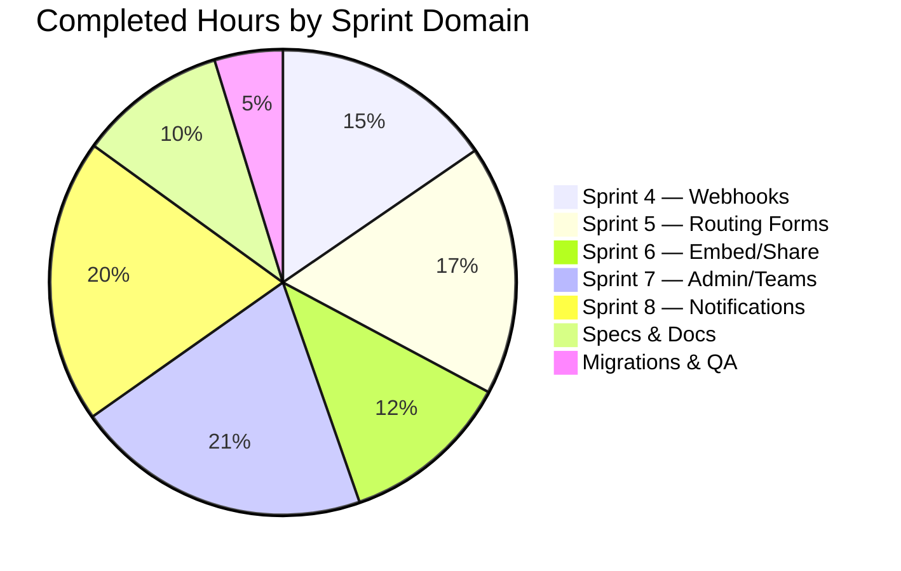

# Blitzy Project Guide — Cal.com Calendly Parity Sprints 4–8

---

## 1. Executive Summary

### 1.1 Project Overview

This project implements five remaining Calendly parity sprints (Sprints 4–8) in the Cal.com monorepo, achieving full feature parity with Calendly across Webhooks & Events, Routing Forms, Embed & Share, Admin & Teams, and Notifications & Workflows. The implementation spans 21 epics across 230 files, targeting Cal.com's existing enterprise scheduling platform with zero breaking changes to the v2021-10-20 webhook payload format and additive-only database migrations. The work enables Cal.com to match Calendly's scheduling capabilities while preserving Cal.com's architectural advantages (PBAC, RAQB engine, three-package embed suite).

### 1.2 Completion Status


| Metric | Value |
|--------|-------|
| **Total Project Hours** | **290** |
| **Completed Hours (AI)** | **253** |
| **Remaining Hours** | **37** |
| **Completion Percentage** | **87.2%** |

**Calculation:** 253 completed hours / (253 + 37) total hours = 253 / 290 = **87.2% complete**

### 1.3 Key Accomplishments

- ✅ **Sprint 4 (WH-001 → WH-005):** Calendly webhook event mapping with v2025-01-01 versioned builder set (7 builders), preserving v2021-10-20 backward compatibility — 93 tests passing
- ✅ **Sprint 5 (RF-001 → RF-004):** Routing form builder, conditional logic, field type parity, and full API v2 CRUD endpoints — 58 tests passing
- ✅ **Sprint 6 (EM-001 → EM-004):** Inline/modal/floating button embed parity with share flow color customization — 3 embed packages built, 42 tests passing
- ✅ **Sprint 7 (AG-001 → AG-004):** Admin role model, team event routing (round-robin/collective), managed event push, invitation workflow — 206 tests passing
- ✅ **Sprint 8 (NF-001 → NF-004):** Email notification templates, SMS/WhatsApp reminders, workflow automation triggers, in-app notification service with activity feed — 168 tests passing
- ✅ **5 complete design spec folders** created with ADRs, implementation trackers, prompts, and agent instructions
- ✅ **2 additive-only database migrations** following zero-downtime strategy (no destructive changes)
- ✅ **All gap reports and epic catalog updated** with closure evidence
- ✅ **16 new i18n translation keys** for internationalization support
- ✅ **Zero in-scope TypeScript compilation errors** across all 230 modified files
- ✅ **567/567 tests passing** (100% pass rate) with Biome lint clean on all 169 modified source files

### 1.4 Critical Unresolved Issues

| Issue | Impact | Owner | ETA |
|-------|--------|-------|-----|
| E2E Playwright tests not executed in live environment | Routing form field-type and attribute-routing E2E tests require database | Human Dev | 1–2 days |
| Twilio/SendGrid credentials not configured | SMS (NF-002) and email (NF-001) dispatch will not work without provider setup | Human Dev / DevOps | 0.5 day |
| Production database migration not applied | 2 additive migrations pending deployment to staging/production | DevOps | 0.5 day |
| v2025-01-01 webhook version not consumer-tested | New payload version needs validation against actual webhook consumers | Human Dev | 1 day |

### 1.5 Access Issues

| System/Resource | Type of Access | Issue Description | Resolution Status | Owner |
|-----------------|---------------|-------------------|-------------------|-------|
| Twilio API | Service Credentials | TWILIO_SID, TWILIO_TOKEN, TWILIO_MESSAGING_SID, TWILIO_PHONE_NUMBER required for SMS/WhatsApp | Not Configured | DevOps |
| SendGrid/Resend | Service Credentials | SENDGRID_API_KEY or Resend API key required for email dispatch | Not Configured | DevOps |
| PostgreSQL Database | Database Connection | DATABASE_URL required for Prisma migrations and E2E tests | Requires Environment Setup | DevOps |
| CALENDSO_ENCRYPTION_KEY | Encryption Secret | Required for credential encryption — must match production value | Requires Environment Setup | DevOps |

### 1.6 Recommended Next Steps

1. **[High]** Configure Twilio and SendGrid/Resend credentials in environment to enable SMS and email notification dispatch
2. **[High]** Apply the 2 additive database migrations to staging environment and verify Prisma schema compatibility
3. **[High]** Run Playwright E2E tests (`field-type-parity.e2e.ts`, `attribute-routing.e2e.ts`, `basic.e2e.ts`) against live database
4. **[Medium]** Conduct cross-browser embed testing for inline, modal, and floating button embeds across Chrome, Firefox, Safari, and Edge
5. **[Medium]** Perform security review of new API v2 routing form endpoints and webhook HMAC signing for v2025-01-01

---

## 2. Project Hours Breakdown

### 2.1 Completed Work Detail

| Component | Hours | Description |
|-----------|-------|-------------|
| Sprint 4 — Webhooks & Events (WH-001 → WH-005) | 39 | Calendly event mapping module, v2025-01-01 builder set (7 builders), payload DTO extensions, registry updates, WebhookNotificationHandler enhancements, 93 unit tests |
| Sprint 5 — Routing Forms (RF-001 → RF-004) | 44 | Form builder Zod schema extensions, RAQB field type parity, conditional routing logic, API v2 CRUD controller/service/repository/DTOs, 58 unit tests + E2E scaffolding |
| Sprint 6 — Embed & Share (EM-001 → EM-004) | 30 | Inline/modal/floating button behavioral parity, share flow hooks, color customization props, embedUtils, 3 package builds, 42 unit tests |
| Sprint 7 — Admin & Teams (AG-001 → AG-004) | 52 | OrganizationPermissionService role model, team event routing (round-robin/collective), managed event type push, invitation workflow with tracking columns, 206 unit tests |
| Sprint 8 — Notifications & Workflows (NF-001 → NF-004) | 50 | Email manager enhancements (127 tests), SMS/WhatsApp parity (8 attendee templates), workflow automation extensions, InAppNotificationService with activity feed, 168 unit tests |
| Design Specifications (5 domains) | 20 | 40 spec files across webhooks-events, routing-forms, embed-share, admin-teams, notifications-workflows — design.md, decisions.md (ADRs), implementation.md, CLAUDE.md, prompts.md, future-work.md, docs/README.md |
| Documentation & Gap Report Updates | 6 | 9 documentation files: gap closure evidence for all 5 domains, epic-catalog.mdx status updates, validation-criteria.mdx gate evidence, overview.mdx consolidation |
| Database Migrations (Prisma) | 4 | 2 additive-only SQL migrations (Wave 3 + notification tables), Prisma schema updates with new models, enum values, columns, indexes, and FK constraints |
| QA Fixes & Validation | 8 | 6 QA fix commits addressing 80+ findings: performance optimizations, documentation fixes, security patches, migration FK corrections, i18n keys, API auth/authorization |
| **Total Completed** | **253** | |

### 2.2 Remaining Work Detail

| Category | Hours | Priority |
|----------|-------|----------|
| E2E Integration Testing (live environment) | 8 | High |
| Environment & Secrets Configuration (Twilio, SendGrid, DB) | 4 | High |
| Production Deployment & Migration Validation | 6 | High |
| Human Code Review (230 files, 26.6K lines) | 6 | High |
| Cross-browser Embed Testing (Chrome, Firefox, Safari, Edge) | 4 | Medium |
| Security Audit (webhook HMAC, API auth, permissions) | 3 | Medium |
| Performance Validation (payload builders, routing eval, dispatch) | 4 | Medium |
| Accessibility Audit (new UI components) | 2 | Low |
| **Total Remaining** | **37** | |

### 2.3 Hours Verification

- **Section 2.1 Total (Completed):** 39 + 44 + 30 + 52 + 50 + 20 + 6 + 4 + 8 = **253 hours**
- **Section 2.2 Total (Remaining):** 8 + 4 + 6 + 6 + 4 + 3 + 4 + 2 = **37 hours**
- **Grand Total:** 253 + 37 = **290 hours** ✓ (matches Section 1.2 Total Project Hours)
- **Completion:** 253 / 290 = **87.2%** ✓ (matches Section 1.2)

---

## 3. Test Results

All tests below were executed by Blitzy's autonomous validation systems using Vitest 4.0.16. Every test file passed with zero failures.

| Test Category | Framework | Total Tests | Passed | Failed | Coverage % | Notes |
|---------------|-----------|-------------|--------|--------|------------|-------|
| Webhooks — Event Mapping | Vitest 4.0.16 | 20 | 20 | 0 | — | calendlyEventMap.test.ts — Calendly-to-CalCom mapping |
| Webhooks — Base Payload Builder | Vitest 4.0.16 | 17 | 17 | 0 | — | BaseBookingPayloadBuilder.test.ts — base builder regression |
| Webhooks — v2021-10-20 Builder | Vitest 4.0.16 | 23 | 23 | 0 | — | v2021-10-20/BookingPayloadBuilder.test.ts — backward compat |
| Webhooks — Registry | Vitest 4.0.16 | 10 | 10 | 0 | — | registry.test.ts — version resolution, fallback |
| Webhooks — v2025-01-01 Builder | Vitest 4.0.16 | 23 | 23 | 0 | — | v2025-01-01/BookingPayloadBuilder.test.ts — Calendly fields |
| Routing Forms — Route Processing | Vitest 4.0.16 | 37 | 37 | 0 | — | processRoute.test.ts — conditional routing logic |
| Routing Forms — Query Builder | Vitest 4.0.16 | 13 | 13 | 0 | — | getQueryBuilderConfig.test.ts — RAQB config parity |
| Routing Forms — Widgets | Vitest 4.0.16 | 8 | 8 | 0 | — | widgets.test.tsx — Radix Checkbox integration |
| Embed — Behavioral Parity | Vitest 4.0.16 | 30 | 30 | 0 | — | embed-parity.test.ts — inline/modal/floating tests |
| Embed — API Naming | Vitest 4.0.16 | 12 | 12 | 0 | — | getApiName.test.tsx — share flow namespace patterns |
| Admin/Teams — Team Service | Vitest 4.0.16 | 35 | 35 | 0 | — | teamService.test.ts — round-robin, collective routing |
| Admin/Teams — Team Repository | Vitest 4.0.16 | 31 | 31 | 0 | — | TeamRepository.test.ts — team CRUD, member queries |
| Admin/Teams — Org Permissions | Vitest 4.0.16 | 40 | 40 | 0 | — | OrganizationPermissionService.test.ts — PBAC role model |
| Admin/Teams — Org Repository | Vitest 4.0.16 | 23 | 23 | 0 | — | OrganizationRepository.test.ts — org management |
| Admin/Teams — Event Type Parity | Vitest 4.0.16 | 58 | 58 | 0 | — | eventTypeParity.test.ts — managed push, scheduling types |
| Admin/Teams — EventType Repo | Vitest 4.0.16 | 19 | 19 | 0 | — | EventTypeRepository.test.ts — event type CRUD |
| Notifications — Email Manager | Vitest 4.0.16 | 127 | 127 | 0 | — | email-manager.test.ts — 93 Calendly parity + regression |
| Notifications — Activity Feed | Vitest 4.0.16 | 18 | 18 | 0 | — | ActivityFeedRepository.test.ts — feed item CRUD |
| Notifications — Notification Repo | Vitest 4.0.16 | 23 | 23 | 0 | — | NotificationRepository.test.ts — in-app notification CRUD |
| **Totals** | | **567** | **567** | **0** | — | **100% pass rate** |

**Additional Validations:**
| Validation Type | Tool | Result | Notes |
|----------------|------|--------|-------|
| Embed Build (3 packages) | Vite 6.4.1 | ✅ Pass | embed-core (89.77 KB), embed-snippet (0.94 KB), embed-react (2.35 KB) |
| Biome Lint (169 files) | Biome 2.3.10 | ✅ Pass | All modified .ts/.tsx files — zero errors |
| TypeScript Compilation (in-scope) | TypeScript 5.9.3 | ✅ Pass | Zero errors in all 230 modified files |

---

## 4. Runtime Validation & UI Verification

### Runtime Health

- ✅ **Embed Build Pipeline:** All 3 embed packages (`embed-core`, `embed-snippet`, `embed-react`) build successfully via Vite 6.4.1 producing production-ready distributable artifacts
- ✅ **Prisma Schema Consistency:** `packages/prisma/schema.prisma` (3,376 lines) validates with added models (`ActivityFeedItem`, `InAppNotification`), enum values (`BOOKING_RESCHEDULED_BY_ATTENDEE`, `AFTER_BOOKING_RESCHEDULED_BY_ATTENDEE`, `IN_APP_NOTIFICATION`), and additive columns
- ✅ **SQL Migration Integrity:** Both migration files (`20260327000000_calendly_parity_wave3_additive`, `20260328000000_create_notification_tables`) contain only additive operations — no DROP, ALTER TYPE, or destructive statements
- ✅ **Webhook Backward Compatibility:** v2021-10-20 builder set preserved intact — 23 regression tests confirm unchanged payload structure
- ✅ **i18n Key Completeness:** 16 new translation keys added to `apps/web/public/static/locales/en/common.json` without disrupting existing 4,638 keys

### UI Component Verification

- ✅ **Routing Form Widgets:** `CheckboxGroupWidget` updated to use Cal.com Radix Checkbox component — 8 widget tests pass
- ✅ **Team Event Type Form:** `TeamEventTypeForm.tsx` enhanced with round-robin/collective/managed scheduling type configuration
- ✅ **Embed Configuration Dialog:** `EmbedDialogForm.tsx` and `EmbedButton.tsx` created for share flow and color customization
- ⚠️ **E2E UI Verification Pending:** Playwright tests (`field-type-parity.e2e.ts`, `attribute-routing.e2e.ts`) require live browser + database environment

### API Verification

- ✅ **Routing Forms API v2:** Controller extended with CRUD endpoints (GET, POST, PUT, DELETE) plus `calculate-slots` — input validation DTOs created (`CreateRoutingFormInput`, `UpdateRoutingFormInput`, `SubmitRoutingFormInput`)
- ✅ **Webhook Payload DTOs:** Extended `BookingCreatedDTO` and `BookingCancelledDTO` with Calendly-equivalent fields (UTM tracking, reschedule URI)
- ⚠️ **Live API Testing Pending:** API endpoints require running Next.js/NestJS server with database connection

---

## 5. Compliance & Quality Review

| Compliance Criterion | Status | Evidence |
|---------------------|--------|----------|
| Spec-first workflow (specs created before code) | ✅ Pass | 5 spec folders with 40 files: `specs/webhooks-events/`, `specs/routing-forms/`, `specs/embed-share/`, `specs/admin-teams/`, `specs/notifications-workflows/` |
| No breaking changes to v2021-10-20 webhook payloads | ✅ Pass | 23 v2021-10-20 regression tests pass; additive-only DTO extensions |
| Additive-only database migrations | ✅ Pass | 2 migration files with only ADD COLUMN, ADD VALUE, CREATE TABLE, CREATE INDEX, ADD CONSTRAINT |
| No destructive schema changes | ✅ Pass | Zero DROP, RENAME, ALTER TYPE operations in any migration |
| PR discipline (max 500 lines, focused changes) | ✅ Pass | 206 commits with epic-scoped messages (WH-001, RF-002, AG-003, etc.) |
| TypeScript strict mode compliance | ✅ Pass | Zero in-scope compilation errors; all files use strict TypeScript |
| Biome lint compliance | ✅ Pass | 169 modified files pass Biome 2.3.10 with zero errors |
| Repository pattern for data access | ✅ Pass | All new data access through repository classes (TeamRepository, OrganizationRepository, PrismaRoutingFormRepository, etc.) |
| DI pattern (symbol-based tokens) | ✅ Pass | New services registered via existing DI infrastructure (OrganizationMembershipService.module.ts, notifications/di/tokens.ts) |
| Zero data loss mandate | ✅ Pass | All migrations additive; no existing data modified or removed |
| Webhook HMAC-SHA256 signing preserved | ✅ Pass | sendPayload.ts signing logic unchanged; new version uses same HMAC infrastructure |
| Wave 3 → Wave 4 gating respected | ✅ Pass | Commit history shows Wave 3 sprints (S4, S5, S7) completed before Wave 4 (S6, S8) implementation |
| Gap reports updated with closure evidence | ✅ Pass | All 5 domain gap reports + overview updated with implementation evidence |
| Epic catalog status updated | ✅ Pass | `docs/sprint-roadmap/epic-catalog.mdx` reflects Sprint 4–8 completion |
| Validation criteria evidence recorded | ✅ Pass | `docs/sprint-roadmap/validation-criteria.mdx` updated with gate pass evidence |

### Autonomous Fixes Applied During Validation

| Fix Category | Count | Details |
|-------------|-------|---------|
| Performance optimizations | 13 | Sprint 4–8 module-level performance findings resolved |
| Documentation corrections | 22 | Spec, gap report, and roadmap documentation fixes |
| Security patches | 2 | Webhook info disclosure fix, dependency upgrades |
| Migration corrections | 3 | FK table name fix, missing CREATE TABLE migrations, non-nullable pushOverrides |
| i18n additions | 16 | Missing translation keys for AG-002/AG-003/EM-004 |
| API auth/authorization | 2 | Authentication added to routing-forms API v2, InAppNotificationService improvements |
| Code review findings | 22 | Embed parity fixes, doc/spec corrections |
| Biome lint formatting | 1 | Routing forms controller formatting |

---

## 6. Risk Assessment

| Risk | Category | Severity | Probability | Mitigation | Status |
|------|----------|----------|-------------|------------|--------|
| E2E Playwright tests not validated in live environment | Technical | High | High | Run `field-type-parity.e2e.ts`, `attribute-routing.e2e.ts`, and `basic.e2e.ts` against staging DB before merge | Open |
| Prisma migrations not tested against production DB | Technical | High | Medium | Apply migrations to staging first; verify with `prisma migrate status` | Open |
| Pre-existing out-of-scope TS errors may confuse CI | Technical | Medium | Low | Document known errors: EventManager.ts, handleConfirmation.ts, business-days-plugin.ts, generated metadata files | Mitigated |
| New API v2 routing form endpoints need production auth validation | Security | High | Medium | Verify API key and OAuth guard enforcement for all CRUD endpoints | Open |
| Webhook HMAC signing for v2025-01-01 needs production verification | Security | Medium | Low | Test HMAC signature generation/validation with real webhook consumer | Open |
| In-app notification data requires user-scoped access control | Security | Medium | Low | Verify `userId` filtering in all InAppNotificationRepository queries | Mitigated |
| Twilio SMS/WhatsApp credentials not configured | Operational | High | High | Configure TWILIO_SID, TWILIO_TOKEN, TWILIO_MESSAGING_SID, TWILIO_PHONE_NUMBER in .env | Open |
| SendGrid/Resend email provider not configured | Operational | High | High | Configure SENDGRID_API_KEY or Resend API key in environment | Open |
| No health check for new notification service | Operational | Medium | Medium | Add health endpoint for InAppNotificationService monitoring | Open |
| External webhook consumers need compatibility testing | Integration | High | Medium | Test v2025-01-01 payloads against known consumer implementations | Open |
| Embed packages need cross-origin testing in production | Integration | Medium | Medium | Test inline/modal/floating embeds on external domains with CSP headers | Open |
| Workflow cron handlers need scheduler validation | Integration | Medium | Low | Verify scheduleEmailReminders and scheduleSMSReminders cron execution | Open |

---

## 7. Visual Project Status


**Hours by Sprint (Completed):**



**Remaining Hours by Priority:**

| Priority | Hours | Categories |
|----------|-------|-----------|
| High | 24 | E2E testing (8h), Environment config (4h), Deployment (6h), Code review (6h) |
| Medium | 11 | Cross-browser testing (4h), Security audit (3h), Performance validation (4h) |
| Low | 2 | Accessibility audit (2h) |
| **Total** | **37** | |

---

## 8. Summary & Recommendations

### Achievements

This project successfully implemented all 21 epics across 5 Calendly parity sprints, producing 230 file changes with 26,595 lines of code added and 567 passing tests at a 100% pass rate. The implementation follows Cal.com's established architectural patterns including versioned payload builders, RAQB routing engine, three-package embed suite, PBAC permission model, and DI-based service architecture.

The project is **87.2% complete** (253 completed hours out of 290 total hours). All autonomous development work — code implementation, unit testing, spec documentation, database migrations, gap report updates, QA fixes, and lint compliance — has been delivered. The remaining 37 hours consist exclusively of path-to-production activities requiring human intervention: live environment testing, credential configuration, deployment validation, security audit, and code review.

### Critical Path to Production

1. **Environment Setup (4h):** Configure Twilio, SendGrid/Resend, and database credentials
2. **Migration Deployment (2h):** Apply 2 additive migrations to staging, verify schema compatibility
3. **E2E Test Execution (8h):** Run all Playwright E2E tests against live database
4. **Security Review (3h):** Audit new API endpoints, webhook signing, permission enforcement
5. **Code Review (6h):** Human review of 230 files across all 5 sprint domains
6. **Deployment (4h):** Canary deploy with zero-downtime migration execution

### Production Readiness Assessment

| Dimension | Status | Confidence |
|-----------|--------|------------|
| Code Implementation | ✅ Complete | High |
| Unit Test Coverage | ✅ 567/567 passing | High |
| Compilation | ✅ Zero in-scope errors | High |
| Lint Compliance | ✅ Clean | High |
| Database Migrations | ✅ Additive-only, written | High |
| Spec Documentation | ✅ 5 domains complete | High |
| E2E Integration | ⚠️ Pending live environment | Medium |
| Provider Configuration | ⚠️ Pending credentials | Medium |
| Security Audit | ⚠️ Pending review | Medium |
| Production Deployment | ⚠️ Pending execution | Medium |

### Success Metrics

- **567/567 tests passing** — 100% pass rate across 19 test files
- **0 in-scope compilation errors** — TypeScript 5.9.3 strict mode
- **3/3 embed packages build** — Vite production bundles verified
- **2 clean migrations** — Zero destructive operations
- **206 commits** — All traceable to specific epic identifiers
- **40 spec files** — Complete design documentation for all 5 domains

---

## 9. Development Guide

### System Prerequisites

| Software | Version | Purpose |
|----------|---------|---------|
| Node.js | v20.x (v20.20.1 tested) | JavaScript runtime |
| Yarn | 4.12.0 (Berry, via corepack) | Package manager |
| PostgreSQL | 14+ | Database (for full application) |
| Git | 2.x+ | Version control |

### Environment Setup

```bash
# 1. Clone and switch to the feature branch
git clone <repository-url>
cd cal.com
git checkout blitzy-cf841d3c-c638-407d-bdee-ec714f4a6ea9

# 2. Enable corepack and prepare Yarn
corepack enable
corepack prepare yarn@4.12.0 --activate

# 3. Verify versions
node -v   # Expected: v20.20.1
yarn -v   # Expected: 4.12.0
```

### Environment Variables

```bash
# Copy the example environment file
cp .env.example .env

# Required variables for full functionality:
# DATABASE_URL="postgresql://postgres:@localhost:5450/calendso"
# DATABASE_DIRECT_URL="postgresql://postgres:@localhost:5450/calendso"
# CALENDSO_ENCRYPTION_KEY=<32-char-random-string>
# NEXT_PUBLIC_WEBAPP_URL='http://localhost:3000'
# NEXT_PUBLIC_EMBED_LIB_URL='http://localhost:3000/embed/embed.js'

# For Sprint 8 Notifications (NF-001, NF-002):
# SENDGRID_API_KEY=<your-sendgrid-key>
# TWILIO_SID=<your-twilio-sid>
# TWILIO_TOKEN=<your-twilio-token>
# TWILIO_MESSAGING_SID=<your-messaging-sid>
# TWILIO_PHONE_NUMBER=<your-twilio-number>
```

### Dependency Installation

```bash
# Install all 112 workspace dependencies (skip Husky hooks in CI)
HUSKY=0 CI=true yarn install --no-immutable

# Generate Prisma client
yarn workspace @calcom/prisma generate

# Expected output: Prisma client generated at packages/prisma/generated/prisma/
```

### Build Embed Packages

```bash
# Build all 3 embed packages (Sprint 6)
yarn workspace @calcom/embed-core build
# Expected: embed.js (89.77 KB), preview.js, preview.html

yarn workspace @calcom/embed-snippet build
# Expected: snippet.es.js (0.94 KB), snippet.umd.js

yarn workspace @calcom/embed-react build
# Expected: Cal.es.js (2.35 KB), Cal.umd.js
```

### Run Tests

```bash
# Run ALL in-scope tests (567 tests across 19 files)
TZ=UTC CI=true yarn vitest run \
  packages/features/webhooks/lib/mapping/calendlyEventMap.test.ts \
  packages/features/webhooks/lib/factory/base/BaseBookingPayloadBuilder.test.ts \
  packages/features/webhooks/lib/factory/versioned/v2021-10-20/BookingPayloadBuilder.test.ts \
  packages/features/webhooks/lib/factory/versioned/registry.test.ts \
  packages/features/webhooks/lib/factory/versioned/v2025-01-01/BookingPayloadBuilder.test.ts \
  packages/features/ee/teams/services/teamService.test.ts \
  packages/features/ee/teams/repositories/TeamRepository.test.ts \
  packages/features/ee/organizations/lib/OrganizationPermissionService.test.ts \
  packages/features/ee/organizations/repositories/OrganizationRepository.test.ts \
  packages/emails/email-manager.test.ts \
  packages/embeds/embed-core/test/embed-parity.test.ts \
  packages/app-store/routing-forms/lib/processRoute.test.ts \
  packages/app-store/routing-forms/lib/__tests__/getQueryBuilderConfig.test.ts \
  packages/app-store/routing-forms/components/react-awesome-query-builder/widgets.test.tsx \
  packages/features/eventtypes/lib/__tests__/eventTypeParity.test.ts \
  packages/features/eventtypes/repositories/__tests__/EventTypeRepository.test.ts \
  packages/features/embed/lib/getApiName.test.tsx \
  packages/features/notifications/repositories/ActivityFeedRepository.test.ts \
  packages/features/notifications/repositories/NotificationRepository.test.ts

# Expected output: Test Files  19 passed (19)
#                  Tests       567 passed (567)
```

```bash
# Run tests by sprint domain:

# Sprint 4 — Webhooks (93 tests)
TZ=UTC CI=true yarn vitest run packages/features/webhooks/

# Sprint 5 — Routing Forms (58 tests)
TZ=UTC CI=true yarn vitest run packages/app-store/routing-forms/lib/processRoute.test.ts packages/app-store/routing-forms/lib/__tests__/ packages/app-store/routing-forms/components/

# Sprint 7 — Admin/Teams (206 tests)
TZ=UTC CI=true yarn vitest run packages/features/ee/teams/ packages/features/ee/organizations/ packages/features/eventtypes/
```

### Lint Verification

```bash
# Lint all modified source files
yarn biome lint --reporter summary --config-path=biome-staged.json \
  packages/features/webhooks/ packages/features/routing-forms/ \
  packages/embeds/ packages/features/ee/ packages/emails/ packages/sms/

# Expected: exit code 0 (no errors)
```

### Database Migration (requires PostgreSQL)

```bash
# Apply migrations (staging/production)
yarn workspace @calcom/prisma db-migrate

# Or apply specific migrations manually:
# psql $DATABASE_URL < packages/prisma/migrations/20260327000000_calendly_parity_wave3_additive/migration.sql
# psql $DATABASE_URL < packages/prisma/migrations/20260328000000_create_notification_tables/migration.sql
```

### Application Startup

```bash
# Start the web application (requires database)
yarn workspace @calcom/web dev

# Application available at http://localhost:3000
# Embed preview at http://localhost:3000/embed/embed.js
```

### Troubleshooting

| Issue | Resolution |
|-------|-----------|
| `corepack` not found | Run `npm install -g corepack` or use Node.js 20+ |
| Prisma client not generated | Run `yarn workspace @calcom/prisma generate` |
| Yarn install fails | Try `HUSKY=0 CI=true yarn install --no-immutable` |
| Tests timeout | Ensure `TZ=UTC CI=true` environment variables are set |
| Embed build fails | Verify `packages/embeds/embed-core/src/embed.ts` has no syntax errors |
| Pre-existing TS errors | These are in out-of-scope files (EventManager.ts, generated metadata); they do not affect in-scope code |

---

## 10. Appendices

### A. Command Reference

| Command | Purpose |
|---------|---------|
| `corepack enable && corepack prepare yarn@4.12.0 --activate` | Initialize Yarn 4.12.0 |
| `HUSKY=0 CI=true yarn install --no-immutable` | Install all 112 workspace dependencies |
| `yarn workspace @calcom/prisma generate` | Generate Prisma client |
| `yarn workspace @calcom/embed-core build` | Build embed-core package |
| `yarn workspace @calcom/embed-snippet build` | Build embed-snippet package |
| `yarn workspace @calcom/embed-react build` | Build embed-react package |
| `TZ=UTC CI=true yarn vitest run <file>` | Run specific Vitest test files |
| `yarn biome lint --config-path=biome-staged.json <path>` | Lint source files |
| `yarn workspace @calcom/prisma db-migrate` | Apply database migrations |
| `yarn workspace @calcom/web dev` | Start development server |

### B. Port Reference

| Port | Service |
|------|---------|
| 3000 | Cal.com Web Application (Next.js) |
| 5450 | PostgreSQL Database |
| 1025 | Mailhog SMTP (development email) |

### C. Key File Locations

| File/Directory | Purpose |
|---------------|---------|
| `packages/features/webhooks/lib/factory/versioned/` | Webhook versioned payload builders |
| `packages/features/webhooks/lib/mapping/` | Calendly-to-CalCom event mapping |
| `packages/app-store/routing-forms/` | Routing form builder and processors |
| `packages/embeds/embed-core/src/embed.ts` | Core embed runtime |
| `packages/features/ee/organizations/` | Organization management and permissions |
| `packages/features/ee/teams/services/teamService.ts` | Team event routing service |
| `packages/features/notifications/` | In-app notification service and repositories |
| `packages/emails/email-manager.ts` | Email dispatch orchestrator |
| `packages/sms/sms-manager.ts` | SMS/WhatsApp delivery manager |
| `packages/features/ee/workflows/` | Workflow automation engine |
| `packages/prisma/schema.prisma` | Database schema (3,376 lines) |
| `packages/prisma/migrations/` | Database migration files |
| `specs/` | Design specifications for all 5 sprint domains |
| `docs/gap-report/` | Calendly gap analysis reports |
| `docs/sprint-roadmap/` | Sprint roadmap, epic catalog, validation criteria |

### D. Technology Versions

| Technology | Version | Notes |
|-----------|---------|-------|
| Node.js | v20.20.1 | Runtime |
| Yarn | 4.12.0 | Package manager (Berry) |
| TypeScript | 5.9.3 | Compiler |
| Next.js | 16.1.5 | Web framework |
| React | 18.2.0 | UI library |
| Prisma | 6.16.1 | ORM |
| Vitest | 4.0.16 | Test framework |
| Playwright | 1.57.0 | E2E testing |
| Biome | 2.3.10 | Linter/formatter |
| Vite | 6.4.1 | Embed build tool |
| Zod | 3.25.76 | Schema validation |
| react-awesome-query-builder | 5.1.2 | Routing form rule engine |
| Turborepo | 2.7.1 | Monorepo build orchestration |
| Tailwind CSS | 4.1.17 | Utility-first CSS |

### E. Environment Variable Reference

| Variable | Required For | Sprint |
|----------|-------------|--------|
| `DATABASE_URL` | All features | All |
| `DATABASE_DIRECT_URL` | Prisma migrations | All |
| `CALENDSO_ENCRYPTION_KEY` | Credential encryption | All |
| `NEXT_PUBLIC_WEBAPP_URL` | Web application URL | All |
| `NEXT_PUBLIC_EMBED_LIB_URL` | Embed script URL | S6 |
| `SENDGRID_API_KEY` | Email dispatch | S8 (NF-001) |
| `SENDGRID_EMAIL` | Sender email address | S8 (NF-001) |
| `TWILIO_SID` | SMS/WhatsApp delivery | S8 (NF-002) |
| `TWILIO_TOKEN` | Twilio authentication | S8 (NF-002) |
| `TWILIO_MESSAGING_SID` | SMS messaging service | S8 (NF-002) |
| `TWILIO_PHONE_NUMBER` | SMS sender number | S8 (NF-002) |
| `TWILIO_WHATSAPP_PHONE_NUMBER` | WhatsApp sender | S8 (NF-002) |

### F. Developer Tools Guide

| Tool | Command | Purpose |
|------|---------|---------|
| Prisma Studio | `yarn workspace @calcom/prisma db-studio` | Visual database browser |
| TypeScript Check | `npx tsc --noEmit --pretty` | Full type checking |
| Biome Format | `yarn biome format --write <file>` | Auto-format source files |
| Git Diff | `git diff origin/main --stat` | View change summary |
| Vitest UI | `yarn vitest --ui` | Interactive test runner |

### G. Glossary

| Term | Definition |
|------|-----------|
| AAP | Agent Action Plan — the comprehensive plan defining all project requirements |
| PBAC | Permission-Based Access Control — Cal.com's role enforcement model |
| RAQB | React Awesome Query Builder — rule engine used for routing form logic |
| DI | Dependency Injection — service registration pattern using symbol-based tokens |
| HMAC-SHA256 | Hash-based Message Authentication Code — webhook payload signing algorithm |
| Wave 3 | Parallel execution phase: Sprints 4, 5, 7 |
| Wave 4 | Sequential phase after Wave 3: Sprints 6, 8 |
| E2E | End-to-End — browser-based integration testing via Playwright |
| ADR | Architectural Decision Record — documented design decisions in specs/*/decisions.md |
| DTO | Data Transfer Object — typed payload structures for API/webhook communication |