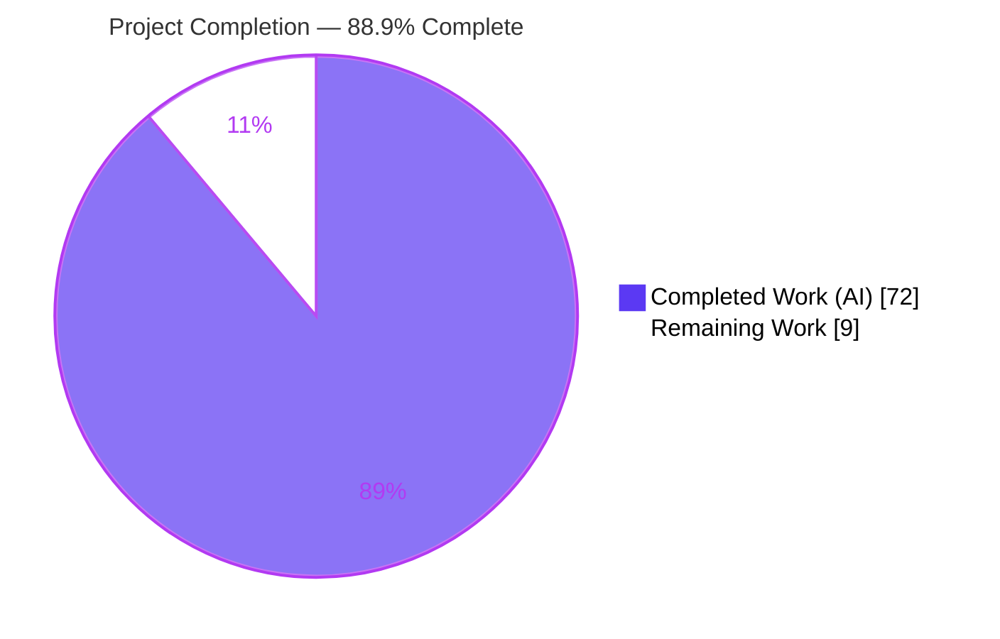
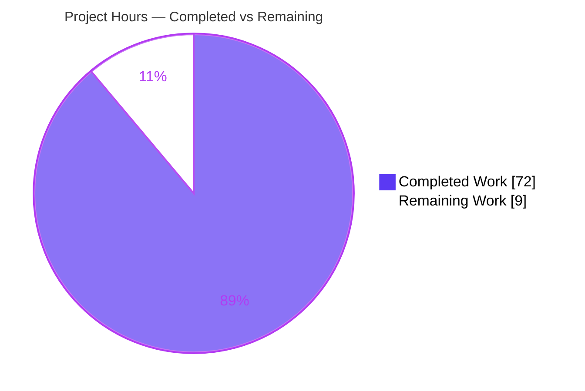
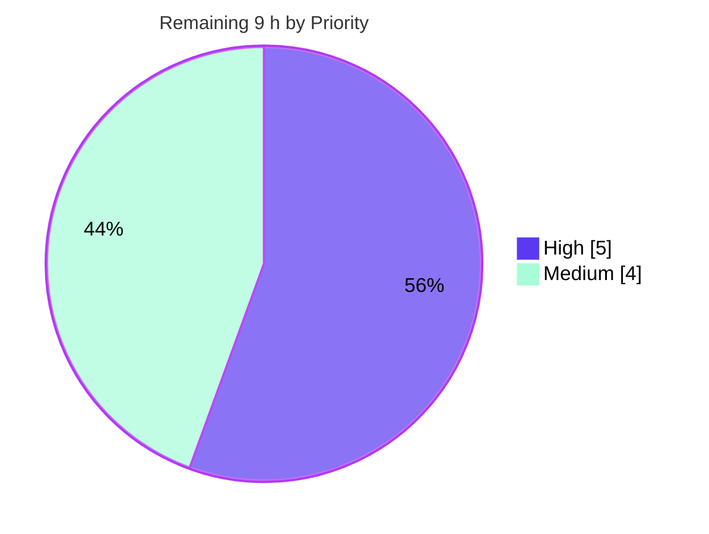

# Blitzy Project Guide — calcom-monorepo Five-Layer Security Audit

> **Scope note.** This project is a **read-only, five-layer defense-in-depth security audit** of the `calcom-monorepo`. Per the Agent Action Plan (AAP §0.3.2), the deliverable is a fixed set of **11 audit artifacts + a CI/CD gate verdict** — **no application source code is modified**. Completion is measured against AAP-scoped work plus standard path-to-production activities for the audit capability, and **explicitly excludes remediation of the weaknesses the audit reports** (which the AAP defines as out of scope).

---

## 1. Executive Summary

### 1.1 Project Overview

The project delivers an automated, reproducible security-audit pipeline over the `calcom-monorepo` (TypeScript 5.9.3; Next.js / NestJS / tRPC / Prisma; Yarn 4.12.0 Berry; ~7,433 source files). Five complementary layers — L0 codebase discovery, L1 agent architectural audit, L2 Semgrep SAST, L3a deterministic sink/mitigation inventory, L3b agent taint analysis, and L4 OSV-Scanner SCA — are normalized, merged into a single cross-layer report, and reduced to a deterministic CI/CD gate verdict. A self-checking `verify.sh` suite proves the artifact set is complete, well-formed, and coverage-complete. The audience is the platform's security and DevOps teams; the business impact is a repeatable, gate-driven guardrail against configuration, code, and dependency weaknesses.

### 1.2 Completion Status

The completion percentage is computed with the AAP-scoped hours methodology: `Completed ÷ (Completed + Remaining) × 100`.



| Metric | Value |
|--------|-------|
| **Total Hours** | **81 h** |
| Completed Hours (AI + Manual) | 72 h (AI-autonomous: 72 h; Manual: 0 h) |
| Remaining Hours | 9 h |
| **Percent Complete** | **88.9 %** |

> The **72 h** of completed work was delivered autonomously by Blitzy agents; **0 h** of prior manual work was required. The **9 h** remaining is entirely human-gated path-to-production (review/sign-off + optional CI wiring) — **not** defect remediation.

### 1.3 Key Accomplishments

- ✅ **All 11 AAP artifacts created and validated** — `codebase-profile.txt`, four findings JSON (`layer-1-arch`, `layer-2-semgrep`, `layer-3b-taint`, `layer-4-osv`), four inventory `.txt` files, `findings-merged.json`, and `verify.sh`.
- ✅ **`verify.sh` passes 16 / 16 checks** under both the `jq` engine and the `VERIFY_NO_JQ=1` Python fallback (exit 0); `shellcheck 0.10.0` clean; `bash -n` clean.
- ✅ **Deterministic layers reproduce byte-identically** — L0 counts (ts 5718 / tsx 1678 / js 37 / jsx 0 / total 7433), all 56 L3a inventory counts, L2 28-finding set match, and L4 302-finding bidirectional match were re-confirmed this session.
- ✅ **Cross-layer merge and gate independently re-derived** — 359 input findings → 353 merged (5 multi-layer correlations, 1 suppression), D9 gate = **BLOCK** with 135 gate-blocking findings.
- ✅ **Full category coverage with no silent omissions** — 10 architectural + 19 sink + 9 mitigation + 19 CWE categories emitted, including all count-0 categories; every layer reports `status:OK` / `coverage:complete`.
- ✅ **Tooling provisioned to the exact AAP pins** — `semgrep 1.168.0`, `osv-scanner v2.3.5`; both operational with Semgrep registry and `osv.dev` reachable.
- ✅ **Read-only posture honored** — the 12 audit commits added 1,723 lines with **0 deletions**; no application source, dependency, schema, or test file was modified.

### 1.4 Critical Unresolved Issues

There are **no unresolved issues that block the audit deliverable**. The validator confirmed zero in-scope defects and a fully reproducing artifact set. The single item below is a **process gate**, not a code defect.

| Issue | Impact | Owner | ETA |
|-------|--------|-------|-----|
| Audit reports a **BLOCK** gate (135 gate-blocking findings) that must be human-reviewed and routed to a remediation backlog | Informational — this is the audit's **intended output**; remediation is out of AAP scope. Does not block delivery of the audit itself. | Security Team | 0.5 day |

> **Clarification:** The security weaknesses surfaced by the BLOCK gate (Dockerfile default secrets, missing `USER`, `CRON_API_KEY`, mutable `checkout@v4` pin, vulnerable dependencies, sink findings) are **not** audit defects. Per AAP §0.3.2 the audit *reports* them and *never fixes* them; the BLOCK verdict correctly hands them to a downstream remediation effort.

### 1.5 Access Issues

No access issues were identified during autonomous execution. All scanners installed successfully and both external services were reachable this session. The items below are **environment requirements** a human must re-confirm when running the audit in a different (e.g., CI) environment.

| System / Resource | Type of Access | Issue Description | Resolution Status | Owner |
|-------------------|----------------|-------------------|-------------------|-------|
| Semgrep registry | Outbound HTTPS | Rule packs `p/security-audit`, `p/secrets`, `p/owasp-top-ten` fetched from registry | ✅ Reachable this session | DevOps |
| `osv.dev` API | Outbound HTTPS | OSV-Scanner advisory lookups over `yarn.lock` | ✅ Reachable this session | DevOps |
| PyPI | Outbound HTTPS | Semgrep install (`semgrep==1.168.0`) | ✅ Reachable this session | DevOps |
| GitHub Releases | Outbound HTTPS | OSV-Scanner v2.3.5 prebuilt binary | ✅ Reachable this session | DevOps |
| Repository (`calcom-monorepo`) | Read | Full source tree scanned read-only | ✅ No issue | — |

### 1.6 Recommended Next Steps

1. **[High]** Security-team review and sign-off of the 11 audit artifacts and the BLOCK gate verdict (accept the audit before it governs real builds).
2. **[High]** Triage the 135 gate-blocking findings (5 critical + 130 high) into a remediation backlog with owners and priorities — planning/routing only; remediation itself is a separate, out-of-scope effort.
3. **[Medium]** Wire `verify.sh` + the gate verdict into a CI/CD workflow so the gate runs automatically on future commits (AAP §0.3.2 follow-up).
4. **[Medium]** Re-provision the pinned scanners (`semgrep 1.168.0`, `osv-scanner v2.3.5`) in the CI runner and validate registry / `osv.dev` egress.
5. **[Low]** Adopt optional enhancements: scheduled re-runs to combat findings staleness, and SARIF export for GitHub code-scanning UI.

---

## 2. Project Hours Breakdown

### 2.1 Completed Work Detail

Every completed component traces to a specific AAP directive (D0–D10) plus the cross-cutting QA and provisioning effort. **Total = 72 h** (matches Section 1.2 Completed Hours).

| Component | Hours | Description |
|-----------|-------|-------------|
| D0 / L0 — Codebase Discovery | 3 | `codebase-profile.txt`: deterministic `git ls-files` discovery of language, ecosystem, lockfile, `exclude_dirs`; environment-independent reproducibility method. |
| D1 / L1 — Architectural Security Audit | 8 | `findings-layer-1-arch.json`: agent review of two Dockerfiles, `docker-compose.yml`, `.env.example`, 59 workflows, `next.config.ts`, `bootstrap.ts`, CSP across 10 categories; 11 findings + per-category coverage. |
| D2 — Semgrep Provisioning | 1 | Install & validate `semgrep 1.168.0` (PEP 668 externally-managed handling). |
| D3 / L2 — Semgrep SAST Scan | 5 | `findings-layer-2-semgrep.json`: 3 rule packs, ANSI-stripped JSON, 28 native + 2 augmented findings, 34 parse-warning diagnostics. |
| D4 / L3a — Sink & Mitigation Inventory | 8 | Four `.txt` inventories: 19 sink + 9 mitigation categories, application/test partition, 56 documented ERE-pattern counts + reconciliation. |
| D5 / L3b — Taint Analysis | 10 | `findings-layer-3b-taint.json`: agent cross-file dataflow across 19 CWE categories, mitigation-denominator triage, gate-blocking classification; 16 findings. |
| D6 / L4 — OSV-Scanner SCA | 4 | `findings-layer-4-osv.json`: install `v2.3.5`, scan `yarn.lock`, 302 findings, advisory-suppression de-duplication. |
| D7 — Normalization | 4 | Unified severity taxonomy, single-line JSONL, ANSI hygiene, file:line locators across all layers. |
| D8 — Cross-Layer Merge | 6 | `findings-merged.json`: correlation / de-duplication (359 → 353), 5 multi-layer provenance findings. |
| D9 — CI/CD Gate Assessment | 3 | Deterministic ERROR / BLOCK / WARN / PASS logic, gate-reason precision, reproducibility anchor. |
| D10 — Verification Suite | 8 | `verify.sh`: 16 checks, `jq` + Python fallback, shellcheck-clean, `bash -n`-clean. |
| QA / Code-Review Hardening | 10 | CP1 deterministic-foundation review, L3b review, 6 findings across 3 root causes, `jq`-probe hardening, D9 precision (QA R1/R3), QA Report R4. |
| Environment Provisioning & Validation | 2 | Scanner install verification, registry / `osv.dev` reachability, tooling-pin confirmation. |
| **Total Completed** | **72** | |

### 2.2 Remaining Work Detail

All remaining work is **human-gated path-to-production for the audit capability** and traces to AAP follow-ups. It contains **no finding remediation** (out of scope per §0.3.2). **Total = 9 h** (matches Section 1.2 Remaining Hours and Section 7 pie).

| Category | Hours | Priority |
|----------|-------|----------|
| Human review & sign-off of the 11 artifacts + BLOCK gate verdict | 3.0 | High |
| Findings triage & remediation-plan hand-off (route 135 gate-blocking findings to a backlog — planning only) | 2.0 | High |
| Optional CI/CD integration: wire `verify.sh` + gate verdict into pipeline (AAP §0.3.2 follow-up) | 2.5 | Medium |
| Scanner re-provisioning + registry / `osv.dev` reachability validation in CI/CD environment | 1.5 | Medium |
| **Total Remaining** | **9.0** | |

### 2.3 Hours Reconciliation

| Check | Result |
|-------|--------|
| Section 2.1 total | 72 h |
| Section 2.2 total | 9 h |
| **2.1 + 2.2 = Total** | **72 + 9 = 81 h** ✅ (matches Section 1.2) |
| Completion % | 72 ÷ 81 = **88.9 %** ✅ |
| Remaining hours identical in §1.2, §2.2, §7 | 9 h ✅ |

---

## 3. Test Results

All results below originate from **Blitzy's autonomous validation logs** and were **re-executed and confirmed in the final validation session**. The project's test suite is the `verify.sh` D10 artifact-verification harness (16 checks), complemented by static analysis and deterministic-reproduction validation.

| Test Category | Framework | Total Tests | Passed | Failed | Coverage % | Notes |
|---------------|-----------|-------------|--------|--------|-----------|-------|
| Artifact Verification Suite | `verify.sh` (Bash + `jq`) | 16 | 16 | 0 | 100 % | 16/16, exit 0, gate verdict BLOCK |
| Artifact Verification Suite (fallback engine) | `verify.sh` (`VERIFY_NO_JQ=1`, Python) | 16 | 16 | 0 | 100 % | Byte-identical to `jq` run, exit 0 |
| Shell Static Analysis | `shellcheck 0.10.0` | 1 | 1 | 0 | n/a | 0 findings (all severities) |
| Shell Syntax Validation | `bash -n` | 1 | 1 | 0 | n/a | `verify.sh` parses clean |
| Deterministic-Layer Reproduction | `git ls-files` / `grep` / `semgrep` / `osv-scanner` | 4 | 4 | 0 | 100 % | L0, L2 (28-finding set match), L3a (56 counts), L4 (302 bidirectional) all reproduce |
| Integration Re-derivation | Python / `jq` | 2 | 2 | 0 | n/a | D8 merge provenance (359→353) + D9 gate (BLOCK) exact match |
| **Overall** | — | **40** | **40** | **0** | **100 %** | Zero JSON-parse, schema, severity, or ANSI violations |

> **Integrity note (Cross-Section Rule 3):** every row above is sourced from the autonomous audit's own verification (`verify.sh`) and validation logs — no external or fabricated tests are included. The `verify.sh` 16-check suite is the headline metric; the remaining rows are the validator's reproduction/static-analysis checks re-run this session.

---

## 4. Runtime Validation & UI Verification

This is a **read-only audit pipeline** (shell + scanners emitting artifacts); it has **no application UI or long-running service** of its own. "Runtime" validation therefore covers scanner execution, artifact parsing, and gate derivation.

- ✅ **Operational** — `verify.sh` executes end-to-end → **16/16** checks pass, exit 0.
- ✅ **Operational** — `verify.sh` Python fallback (`VERIFY_NO_JQ=1`) → identical result, exit 0.
- ✅ **Operational** — Semgrep `1.168.0` runs against the TypeScript tree; registry reachable; valid JSON emitted.
- ✅ **Operational** — OSV-Scanner `v2.3.5` scans `yarn.lock`; `osv.dev` reachable; **302 vuln-entries** across 114 packages (matches the artifact).
- ✅ **Operational** — Gate extraction one-liners (both `jq` and Python) return `verdict = BLOCK`, `gate_blocking_count = 135`.
- ✅ **Operational** — All five findings JSON artifacts parse as valid JSONL; severity values conform to `{critical, high, medium, low}`.
- ✅ **Operational** — Underlying Cal.com app boots for context (a runtime-verification screenshot of the auth/setup wizard on `:3000` is committed at `blitzy/.../runtime_auth_setup_wizard_step1.png`), though the app itself is out of audit scope.
- ⚠ **Partial (by design)** — Cross-file taint depth is delivered by the L3b agent layer because Semgrep Community Edition is single-file only; this is the intended architecture, not a gap.
- ❌ **Failing** — None.

---

## 5. Compliance & Quality Review

The audit's binding rules (AAP §0.7) are cross-mapped to concrete evidence and the `verify.sh` check that enforces each. Fixes applied during autonomous validation are noted.

| Benchmark / Binding Rule | Status | Evidence | `verify.sh` Check |
|--------------------------|--------|----------|-------------------|
| Exactly 11 artifacts produced | ✅ Pass | All 11 present & validated on disk | 01 |
| Single-line JSONL findings | ✅ Pass | All findings artifacts parse line-by-line | 02 |
| No silent failure (OK/ERROR status) | ✅ Pass | All 5 layer metas `status:OK` / `coverage:complete` | 13 |
| Coverage completeness (count-0 emitted) | ✅ Pass | 10 arch + 19 sink + 9 mitigation + 19 CWE categories, incl. all zeros | 04–10 |
| Unified severity taxonomy | ✅ Pass | Only `{critical, high, medium, low}` across all artifacts | 12 |
| ANSI escape stripping | ✅ Pass | No escape sequences in any artifact | 14 |
| Test-code segregation | ✅ Pass | `*-test.txt` inventories separate & non-gate-blocking | 05, 07 |
| Semgrep Community Edition + engine pin | ✅ Pass | `engine: community-single-file`, `tool_version 1.168.0` | 09 |
| OSV-Scanner SCA + advisory suppression | ✅ Pass | `v2.3.5`, 302 findings, adv 1113407 suppressed only for trusted-AWS path | 11 |
| D9 gate present & valid | ✅ Pass | `verdict:BLOCK`, `gate_blocking_count:135`, `layers_ok:true` | 15 |
| Cross-layer merge provenance | ✅ Pass | 359 → 353, 5 multi-layer, provenance conserved | 16 |
| Read-only posture (no source mutation) | ✅ Pass | 12 audit commits: 1,723 additions, 0 deletions to app source | — |
| Reproducibility (deterministic byte-identical) | ✅ Pass | L0/L2/L3a/L4 reproduce; gate-blocking set stable | 03, 09, 11 |

**Fixes applied during autonomous validation** (from commit history): CP1 deterministic-foundation review (L0 + L3a), L3b taint review (consume L3a as authoritative), 6 code-review findings across 3 root causes, `verify.sh` `jq`-detection hardening (functional probe), D9 gate precision + L4/L2 severity normalization (QA R1/R3), QA Report R4 (L2 parse-warning diagnostics, L4 file:line locators, gate-reason precision, L3a count reconciliation).

**Outstanding compliance items:** none. All binding rules pass; the working tree is clean.

---

## 6. Risk Assessment

Risks are grouped by PA3 category. **Security-category rows are the audit's own reported findings** — they are informational for this guide and, per AAP §0.3.2, are out of scope to remediate here.

| Risk | Category | Severity | Probability | Mitigation | Status |
|------|----------|----------|-------------|-----------|--------|
| T1 — Semgrep CE single-file limitation (no native cross-file taint) | Technical | Low | Medium | L3b agent layer compensates by design; documented | Mitigated |
| T2 — Agent-layer prose varies run-to-run | Technical | Low | Low | Gate-blocking set is the reproducibility anchor; schema/coverage fixed | Mitigated |
| T3 — Semgrep registry rule packs not semver-pinned | Technical | Medium | Medium | Engine pinned `1.168.0` + fixed registry snapshot | Mitigated |
| S1 — 135 gate-blocking critical/high findings (Dockerfile default secrets, `CRON_API_KEY`, next-auth JWT key) | Security | Critical/High | N/A (present) | BLOCK gate surfaces them for downstream remediation | Reported / Deferred (out of scope) |
| S2 — 302 dependency vulns incl. 5 critical (`fast-xml-parser`, `i18next-fs-backend`, `protobufjs`, `shell-quote`, `vitest`) | Security | High | N/A (present) | Reported via L4; dependency upgrade is a separate effort | Reported / Deferred (out of scope) |
| S3 — Advisory suppression may mask an issue if trust assumption changes | Security | Low | Low | Single documented, justified suppression; other advisories stay active | Accepted / Documented |
| O1 — Audit not yet wired into CI (gate won't auto-block) | Operational | Medium | High | `verify.sh` + gate ready; integration is a defined follow-up (HT-3) | Open (path-to-production) |
| O2 — Findings staleness (point-in-time snapshot) | Operational | Medium | Medium | Re-run on a schedule/CI | Open |
| O3 — Scanner version drift in CI | Operational | Low | Low | Pins documented (`1.168.0`, `v2.3.5`) | Mitigated |
| I1 — Network egress required (Semgrep registry + `osv.dev`) | Integration | Medium | Medium | Documented requirement; validate egress in CI (HT-4) | Open (env-dependent) |
| I2 — `jq` may be absent in CI images | Integration | Low | Low | Python fallback implemented & tested (`VERIFY_NO_JQ=1`) | Mitigated |
| I3 — PEP 668 externally-managed Python blocks Semgrep install | Integration | Low | Low | Documented `--break-system-packages` / venv approach | Mitigated |

---

## 7. Visual Project Status

**Project Hours Breakdown** (Completed = Dark Blue `#5B39F3`, Remaining = White `#FFFFFF`):



**Remaining Work by Priority** (High = `#5B39F3`, Medium = `#A8FDD9`):



**Remaining hours per category** (Section 2.2):

| Category | Hours | Bar |
|----------|-------|-----|
| Human review & sign-off | 3.0 | ██████ |
| CI/CD integration (optional) | 2.5 | █████ |
| Findings triage / hand-off | 2.0 | ████ |
| Scanner re-provisioning | 1.5 | ███ |
| **Total** | **9.0** | |

> **Integrity note (Cross-Section Rule 1):** the pie "Remaining Work" = **9 h**, identical to Section 1.2 Remaining Hours and the Section 2.2 total.

---

## 8. Summary & Recommendations

**Achievements.** The five-layer defense-in-depth audit is **complete and validated at 88.9 %** of total AAP-scoped-plus-path-to-production hours (72 of 81 h). All 11 mandated artifacts exist, parse cleanly, cover every required category (including count-0 categories), and are self-checked by a 16-check `verify.sh` harness that passes under two independent engines. Deterministic layers reproduce byte-identically and the D8 merge / D9 gate were independently re-derived to an exact match. Tooling is provisioned to the exact AAP pins (`semgrep 1.168.0`, `osv-scanner v2.3.5`).

**Remaining gaps (9 h, human-gated).** What remains is **not engineering rework** — the validator found zero in-scope defects. It is: (1) security-team review and sign-off of the artifacts and BLOCK gate; (2) triage of the 135 gate-blocking findings into a remediation backlog (routing only); (3) optional CI/CD wiring of `verify.sh` + gate; and (4) scanner re-provisioning + egress validation in the target CI environment.

**Critical path to production.** Sign-off (HT-1) → triage/hand-off (HT-2) → optional CI integration (HT-3) → scanner re-provisioning (HT-4). Only HT-1/HT-2 are strictly required to consider the audit "accepted"; HT-3/HT-4 operationalize it in a pipeline.

**Success metrics.** `verify.sh` 16/16 (achieved); byte-identical deterministic reproduction (achieved); exact gate re-derivation (achieved); zero severity/ANSI/schema violations (achieved).

**Production-readiness assessment.** The audit **deliverable is production-ready**; the reported **BLOCK gate is the correct output**, intentionally surfacing out-of-scope-to-remediate weaknesses. The project is **88.9 % complete**, with the residual 11 % being mandatory human acceptance and optional pipeline integration rather than any outstanding autonomous work.

| Metric | Value |
|--------|-------|
| Completion | 88.9 % |
| Completed / Total hours | 72 / 81 h |
| Remaining hours | 9 h |
| Artifacts delivered | 11 / 11 |
| Verification checks | 16 / 16 pass |
| Gate verdict | BLOCK (135 gate-blocking) |
| In-scope defects | 0 |

---

## 9. Development Guide

> Every command below was executed successfully during final validation. Run from the repository root: `/tmp/blitzy/blitzy-cal/…` (any clone root works). The audit is read-only — it never builds or runs the Cal.com application.

### 9.1 System Prerequisites

- **OS:** Linux or macOS (validated on Ubuntu 25.10).
- **git** — for deterministic L0/L3a enumeration (`git ls-files`).
- **Python 3.11+** — Semgrep runtime and the `verify.sh` no-`jq` fallback (3.13.7 validated).
- **Node 20.x** — present for repository context only; the audit does not require it to run (v20.20.2 validated).
- **Semgrep CE `1.168.0`** — Layer 2 SAST engine (PyPI).
- **OSV-Scanner `v2.3.5`** — Layer 4 SCA binary (GitHub Releases).
- **`jq` (optional)** — JSON convenience; `verify.sh` falls back to Python 3 automatically.
- **Network egress** — HTTPS to PyPI, the Semgrep registry, GitHub Releases, and `osv.dev`.

### 9.2 Environment Setup

```bash
# 1) Verify base tooling
python3 --version           # expect 3.11+ (3.13.7 validated)
git --version
node --version              # v20.x (context only)

# 2) Install Semgrep CE, pinned. The sandbox Python is PEP 668 externally-managed,
#    so use --break-system-packages OR an isolated venv (venv preferred for CI).
pip install --break-system-packages "semgrep==1.168.0"
# --- OR ---
python3 -m venv .audit-venv && . .audit-venv/bin/activate && pip install "semgrep==1.168.0"

semgrep --version           # expect 1.168.0

# 3) Install the pinned OSV-Scanner binary (no Go toolchain needed).
#    Download the v2.3.5 asset for your platform from:
#    https://github.com/google/osv-scanner/releases/tag/v2.3.5
#    then place it on PATH, e.g.:
chmod +x osv-scanner && sudo mv osv-scanner /usr/local/bin/
osv-scanner --version       # expect: osv-scanner version: 2.3.5
```

### 9.3 Running the Audit Layers

```bash
# L0 — Codebase discovery (deterministic; git ls-files honors .gitignore)
git ls-files '*.ts'  | wc -l    # 5718
git ls-files '*.tsx' | wc -l    # 1678
git ls-files '*.js'  | wc -l    # 37
git ls-files '*.jsx' | wc -l    # 0

# L2 — Semgrep SAST (three rule packs, ANSI-safe JSON, deterministic exclude set)
SEMGREP_SEND_METRICS=off semgrep \
  --config=p/security-audit --config=p/secrets --config=p/owasp-top-ten \
  --exclude=node_modules --exclude=.next --exclude=dist --exclude=build \
  --exclude=.turbo --exclude=.git --exclude=coverage \
  --json --quiet --output=findings-layer-2-semgrep.raw.json apps packages

# L4 — OSV-Scanner SCA over the single root lockfile (NO_COLOR keeps JSON clean)
NO_COLOR=1 osv-scanner scan --lockfile=yarn.lock --format=json
```

### 9.4 Verification (primary quality gate)

```bash
# Full 16-check self-verification (jq engine). Expect: RESULT: 16/16 + GATE VERDICT: BLOCK
bash verify.sh

# Same suite via the Python fallback (no jq required) — must be identical
VERIFY_NO_JQ=1 bash verify.sh

# Static analysis of the verification script (expect 0 findings)
shellcheck verify.sh
bash -n verify.sh
```

### 9.5 Example Usage — reading the results

```bash
# Gate verdict (jq)
jq -rc 'select(.type=="gate") | {verdict, gate_blocking_count, severity_counts}' findings-merged.json
# -> {"verdict":"BLOCK","gate_blocking_count":135,"severity_counts":{"critical":5,"high":136,"medium":158,"low":53}}

# Gate verdict (no jq — Python fallback)
python3 -c "import json;[print(json.dumps({k:o[k] for k in ('verdict','gate_blocking_count','severity_counts')})) for o in map(json.loads,open('findings-merged.json')) if o.get('type')=='gate']"

# Count merged findings by severity
python3 -c "import json,collections as c;print(dict(c.Counter(o.get('severity') for o in map(json.loads,open('findings-merged.json')) if o.get('severity'))))"

# Inspect a layer's coverage summary
jq -rc 'select(.type=="coverage") | {category, findings_count, coverage}' findings-layer-3b-taint.json
```

### 9.6 Troubleshooting

- **`error: externally-managed-environment` on `pip install semgrep`** → use `pip install --break-system-packages "semgrep==1.168.0"` or install into a venv (§9.2).
- **`verify.sh` cannot find `jq`** → run `VERIFY_NO_JQ=1 bash verify.sh`; the suite uses the Python 3 fallback and produces identical results.
- **Semgrep returns 0 results / registry errors** → confirm HTTPS egress to the Semgrep registry; keep the engine pinned to `1.168.0` for reproducibility.
- **OSV-Scanner hangs or returns empty** → confirm egress to `osv.dev`; always pass `--format=json` with `NO_COLOR=1` to avoid ANSI corruption of the artifact.
- **JSON artifact won't parse** → ensure scanners ran in non-colorized mode (`--json` / `NO_COLOR=1`); the normalization step strips residual ANSI.
- **Counts differ from `codebase-profile.txt`** → use `git ls-files` (not `find`); a warmed working tree contains gitignored generated files that inflate a raw `find` count.

---

## 10. Appendices

### A. Command Reference

| Purpose | Command |
|---------|---------|
| Full verification (jq) | `bash verify.sh` |
| Full verification (no jq) | `VERIFY_NO_JQ=1 bash verify.sh` |
| Shell static analysis | `shellcheck verify.sh` |
| Shell syntax check | `bash -n verify.sh` |
| L2 Semgrep scan | `SEMGREP_SEND_METRICS=off semgrep --config=p/security-audit --config=p/secrets --config=p/owasp-top-ten --exclude=node_modules … --json --quiet apps packages` |
| L4 OSV-Scanner scan | `NO_COLOR=1 osv-scanner scan --lockfile=yarn.lock --format=json` |
| Gate verdict (jq) | `jq -rc 'select(.type=="gate")' findings-merged.json` |
| Severity histogram | `python3 -c "import json,collections as c;print(dict(c.Counter(o.get('severity') for o in map(json.loads,open('findings-merged.json')) if o.get('severity'))))"` |

### B. Port Reference

The audit pipeline exposes **no network ports** (it is a batch of shell + scanner invocations emitting files). *For context only:* the Cal.com web app defaults to port **3000** when run, but running the app is out of audit scope.

### C. Key File Locations (all at repository root)

| Artifact | Layer / Directive | Bytes |
|----------|-------------------|-------|
| `codebase-profile.txt` | L0 / D0 | 1,724 |
| `findings-layer-1-arch.json` | L1 / D1 | 10,597 |
| `findings-layer-2-semgrep.json` | L2 / D3 | 21,391 |
| `sink-inventory.txt` | L3a / D4 | 4,666 |
| `sink-inventory-test.txt` | L3a / D4 | 4,149 |
| `mitigation-inventory.txt` | L3a / D4 | 3,634 |
| `mitigation-inventory-test.txt` | L3a / D4 | 2,703 |
| `findings-layer-3b-taint.json` | L3b / D5 | 14,793 |
| `findings-layer-4-osv.json` | L4 / D6 | 146,506 |
| `findings-merged.json` | D7+D8+D9 | 266,177 |
| `verify.sh` | D10 | 23,279 |

### D. Technology Versions

| Tool | Version | Role |
|------|---------|------|
| Semgrep CE | 1.168.0 | Layer 2 SAST engine (pinned) |
| OSV-Scanner | v2.3.5 | Layer 4 SCA (pinned) |
| jq | 1.8.1 | JSON convenience (optional) |
| Python 3 | 3.13.7 | Semgrep runtime + `verify.sh` fallback |
| Node.js | v20.20.2 | Repository context (not required by audit) |
| shellcheck | 0.10.0 | `verify.sh` static analysis |
| Semgrep rule packs | `p/security-audit`, `p/secrets`, `p/owasp-top-ten` | Layer 2 rulesets (registry) |
| Yarn (Berry) | 4.12.0 | Repo package manager (context) |
| TypeScript | 5.9.3 | Scanned source language |

### E. Environment Variable Reference

| Variable | Used By | Purpose |
|----------|---------|---------|
| `VERIFY_NO_JQ=1` | `verify.sh` | Force the Python fallback instead of `jq` |
| `SEMGREP_SEND_METRICS=off` | Semgrep | Disable telemetry for deterministic, offline-friendly runs |
| `NO_COLOR=1` | OSV-Scanner | Suppress ANSI so JSON output stays clean |
| `exclude_dirs` (convention) | L2 / L3a / L4 | `node_modules,.next,dist,build,.turbo,.git,coverage` — shared exclusion set |

### F. Developer Tools Guide

- **Reproduce a deterministic layer:** re-run the L0 `git ls-files` counts or the L4 `osv-scanner` command and diff against the committed artifact — they must match byte-for-byte (L0) or as a set (L4: 302 findings).
- **Validate the whole artifact set:** `bash verify.sh` is the single source of truth; treat a non-16/16 result as a regression.
- **Inspect coverage:** every findings JSON contains `type:"coverage"` records per category (including count-0) plus one `type:"meta"` summary; the merged report adds a `type:"gate"` record.
- **Gate semantics:** `ERROR` (a layer failed / coverage incomplete) → `BLOCK` (≥1 gate-blocking critical/high) → `WARN` (medium/low only) → `PASS` (clean).

### G. Glossary

| Term | Meaning |
|------|---------|
| **SAST** | Static Application Security Testing (Layer 2, Semgrep) |
| **SCA** | Software Composition Analysis (Layer 4, OSV-Scanner) |
| **Taint analysis** | Tracing untrusted input → dangerous sink (Layer 3b, agent, cross-file) |
| **Sink** | A code location where tainted data can cause harm (e.g., `$queryRaw`, `child_process`) |
| **Mitigation** | A control that neutralizes a sink (e.g., Zod validation, `timingSafeEqual`) |
| **Gate-blocking** | A critical/high finding that forces a `BLOCK` verdict |
| **JSONL** | JSON Lines — one JSON object per line (diff-stable, stream-parseable) |
| **Coverage-complete** | Every required category emitted, even at count 0 |
| **CWE** | Common Weakness Enumeration (the 19 taint categories map to CWE IDs) |