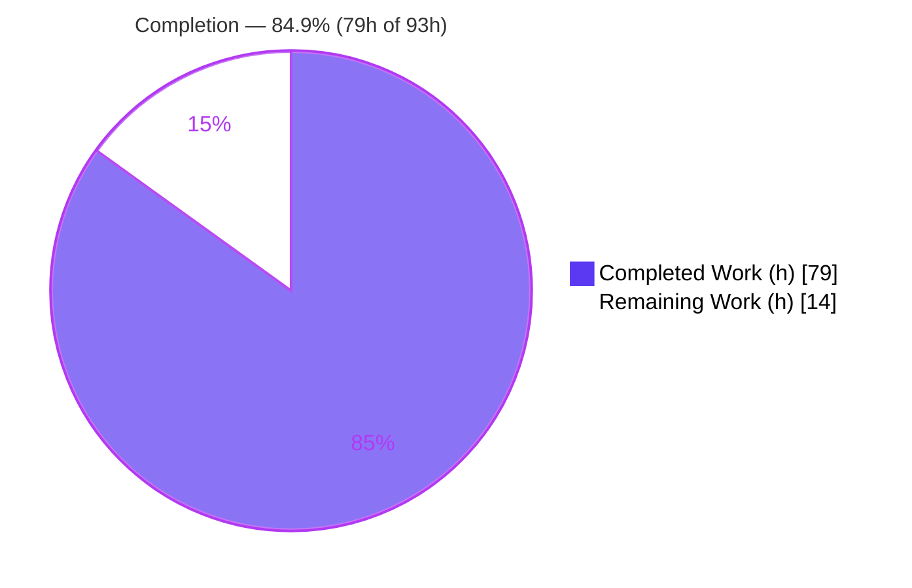
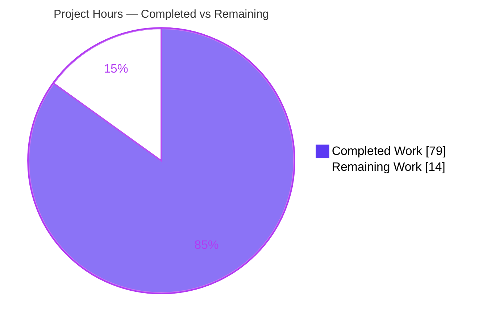
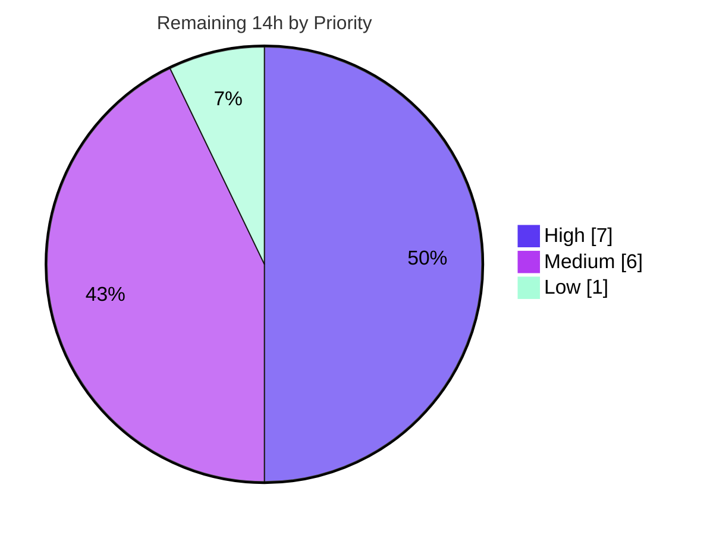

# Blitzy Project Guide — Layer 3 "Blitzy-Taint" Security Taint Audit (Cal.com)

> **Project type:** Read-only, detection-only static source-to-sink taint analysis (Layer 3 of a four-layer security audit pipeline).
> **Deliverable:** Two mutually-consistent report artifacts that gate a downstream automated cross-layer merge. **No source code was modified.**

---

## 1. Executive Summary

### 1.1 Project Overview

This project executed **Layer 3 ("Blitzy-Taint")** of a four-layer security audit pipeline against the **Cal.com monorepo** (branch `main`, HEAD `e988138b24`). It is a **read-only, cross-file, source-to-sink taint analysis** that *detects — never remediates* — vulnerabilities across **seven CWE categories**, reasoning over the codebase as a human auditor would (the CodeQL/Joern analytical slot). The audience is the downstream automated quality gate and the security review team. The single deliverable is two mutually-consistent machine-readable artifacts (a SARIF 2.1.0 log and a normalized JSON feed) emitted at the repository root. Operating under a precision-gate posture, only fully-substantiated, high-confidence findings are marked gate-blocking; everything suspected-but-unproven is recorded as advisory. **No source file was modified, created, or deleted.**

### 1.2 Completion Status



**Completion: 84.9%** — calculated per the AAP-scoped hours methodology: `Completed ÷ (Completed + Remaining) = 79 ÷ 93 = 84.9%`.

| Metric | Hours |
|--------|-------|
| **Total Hours** | **93** |
| Completed Hours (AI Autonomous) | 79 |
| Completed Hours (Manual) | 0 |
| **Completed Hours (AI + Manual)** | **79** |
| **Remaining Hours** | **14** |

> The **detection deliverable itself is 100% autonomously complete and validated**. The 14 remaining hours are entirely **human-gated path-to-production** activities (security sign-off, external validator run, note disposition, downstream ingestion hand-off) that the agent is contractually forbidden from performing under the read-only directive.

### 1.3 Key Accomplishments

- ✅ All **seven CWE categories** analyzed to completion (CWE-601, 918, 117, 807, 338, 843, 862); every `run.properties.coverage` block carries `status: complete`.
- ✅ **13 findings** emitted — **3 gate-blocking errors** + **10 advisory notes** — each substantiated against real source code.
- ✅ **Second-order (DB-laundered) taint** fully evidenced on the webhook SSRF path (both the tainted-write leg and the read-to-sink leg).
- ✅ **Valid SARIF 2.1.0** artifact: single run, tool `Blitzy-Taint-Layer3`, 7 CWE rules defined exactly once, ordered `source → hop → sink` code flows, full per-result property bag.
- ✅ **Normalized JSON feed** kept **1:1 consistent** with the SARIF (positional + multiset match on file, line, severity, CWE, gateBlocking).
- ✅ **Evidence-bound demotion** discipline honored: every demoted note cites a concrete on-path control (`function` + `file:line`) or states explicit uncertainty; banned-non-control scan returned **zero** hits.
- ✅ **Sibling-path consistency** enumerated for each sink class; gaps recorded (e.g., CalDAV add-account lacking the webhook's SSRF validator).
- ✅ **Seven-check self-audit** (§5) and **N=3 reproducibility** (union of gate-blocking findings) executed and recorded.
- ✅ **Final Validator gate: 19/19 checks GREEN**, zero unresolved defects; one minor finding-neutral fix applied (D1).
- ✅ **Read-only directive honored exactly** — across 8 agent commits, only the two artifacts were ever touched (0 source files modified).

### 1.4 Critical Unresolved Issues

These are the **real vulnerabilities the audit correctly detected**. Under the detection-only directive they are *reported, not patched* — remediation is an explicit, separate follow-on effort. They are "unresolved" from a security-posture standpoint, not deliverable defects.

| Issue | Impact | Owner | ETA |
|-------|--------|-------|-----|
| G1 — CWE-918 second-order SSRF, `packages/features/webhooks/lib/sendPayload.ts:373` (webhook `subscriberUrl` dispatched with no SSRF re-validation) | High — internal-network requests via stored webhook URL | Security / Webhooks team | Post-sign-off remediation sprint |
| G2 — CWE-918 SSRF, `packages/app-store/caldavcalendar/api/add.ts:44` (`req.body.url` → `listCalendars()` with no validator) | High — SSRF via CalDAV add-account | Security / App-Store team | Post-sign-off remediation sprint |
| G3 — CWE-601 open redirect, `apps/web/proxy.ts:86` (return-to cookie → `NextResponse.redirect(new URL(value, base))`) | Medium — phishing/redirect; `getSafeRedirectUrl` not applied on-path | Security / Web team | Post-sign-off remediation sprint |
| 10 advisory notes (non-constant-time HMAC compares, spoofable IP trust, `publicProcedure` mutation, log injection) | Medium — residual risk if dismissed without review | Security review | During note-disposition task |

### 1.5 Access Issues

| System/Resource | Type of Access | Issue Description | Resolution Status | Owner |
|-----------------|----------------|-------------------|-------------------|-------|
| `ripgrep` (canonical audit grep) | Tooling in assessment container | Not installed in this assessment environment; coverage scale-counts (descriptive metadata only) re-validate exactly only under ripgrep | Open — low priority, finding-neutral | Reviewer (HT-5) |
| External SARIF 2.1.0 validator / gate engine | Execution permission | Agent is contractually forbidden from running, building, or invoking engines (read-only directive); machine-acceptance not confirmed by an external validator | Open — assigned to HT-2 | Reviewer / DevSecOps |
| Downstream cross-layer merge (Monty Directive 6/7) | Separate-owner tooling | The merge step that consumes these artifacts is owned by a separate layer; not exercised against these specific outputs | Open — assigned to HT-4 | Pipeline owner |

*All read access required for the analysis (full monorepo) was available; no repository-permission issues were encountered.*

### 1.6 Recommended Next Steps

1. **[High]** Perform security triage & sign-off of the **3 gate-blocking findings** (G1, G2, G3); confirm each `source → sink` flow and the absence of an on-path control, then authorize them to block the automated gate. *(5h)*
2. **[High]** Run an **external SARIF 2.1.0 validator** against the `.sarif` and validate the `.json` against the Layer-3 merge contract to confirm machine-acceptance. *(2h)*
3. **[Medium]** Review and **disposition the 10 advisory notes** plus the `markHostAsNoShow` CWE-862 human-review variance item; open remediation tickets or record risk-acceptance. *(4h)*
4. **[Medium]** Confirm **downstream gate ingestion-readiness** — verify the cross-layer merge can consume both artifacts from the repo root. *(2h)*
5. **[Low]** Re-validate the **descriptive coverage scale-counts** with the canonical `ripgrep` tool (finding-neutral). *(1h)*

---

## 2. Project Hours Breakdown

### 2.1 Completed Work Detail

| Component | Hours | Description |
|-----------|------:|-------------|
| Analysis framing & control cataloging | 4 | Confirmed 9 in-scope dirs; cataloged existing controls (`ssrfProtection.ts`, `getSafeRedirectUrl.ts`, guard stack, HMAC verifiers) as demotion/sibling anchors |
| CWE-918 SSRF analysis | 10 | Phase A enumeration (~299 raw hits) + Phase B tracing; 4 findings (2 gate-blocking incl. second-order); sibling enumeration |
| CWE-601 Open Redirect analysis | 7 | Phase A (158 hits) + tracing; 3 findings (1 gate-blocking) incl. the return-to cookie example |
| CWE-807 Auth-Decision analysis | 7 | 4 notes (non-constant-time HMAC compares, spoofable IP trust); HMAC verifier anchors |
| CWE-117 Log Injection analysis | 6 | Largest surface (3,640 hits); 1 note (raw `console.error` of second-order URL) |
| CWE-862 Missing Authorization analysis | 7 | API v1 verb handlers + tRPC `publicProcedure`; 1 note + sibling variance item |
| CWE-843 Type Confusion analysis | 4 | `req.query`/`req.params` `string\|string[]` surface (54 hits); ruled out with reasons |
| CWE-338 Weak PRNG analysis | 4 | 76 `Math.random` sites judged against secure-generator baseline; ruled out |
| SARIF 2.1.0 artifact construction | 8 | Single run, 7 rules once, ordered code flows, full property bag, per-category coverage block |
| Normalized JSON feed + 1:1 consistency | 3 | Single-line minified array derived from the same finding set; mirrored severity/gateBlocking |
| Seven-check self-audit (§5) | 3 | Schema, precision-gate, empty-codeFlows, demotion, sibling, property-bag, coverage/no-warning |
| Reproducibility (§7) | 3 | N=3 runs, union of gate-blocking findings, per-run variance surfaced |
| Iterative QA refinement | 8 | 6 fix commits (CWE-862 coverage, 13-finding set, under-flag gap, extra-finding removal, count fix) |
| Final Validator suite + D1 fix | 5 | 19/19 validation checks; corrected CWE-601 `window.location` count to a reproducible value |
| **TOTAL COMPLETED** | **79** | |

### 2.2 Remaining Work Detail

| Category | Hours | Priority |
|----------|------:|----------|
| Security triage & sign-off of the 3 gate-blocking findings (G1/G2/G3) | 5 | High |
| External SARIF 2.1.0 validator run + JSON merge-contract validation | 2 | High |
| Disposition of the 10 advisory notes + `markHostAsNoShow` variance item | 4 | Medium |
| Downstream gate ingestion-readiness hand-off (Monty Directive 6/7) | 2 | Medium |
| `ripgrep` coverage scale-count re-validation (finding-neutral) | 1 | Low |
| **TOTAL REMAINING** | **14** | |

### 2.3 Hours Reconciliation

| Check | Value | Result |
|-------|-------|--------|
| Section 2.1 completed sum | 79h | ✅ matches Section 1.2 Completed |
| Section 2.2 remaining sum | 14h | ✅ matches Section 1.2 Remaining & Section 7 pie |
| Section 2.1 + Section 2.2 | 79 + 14 = 93h | ✅ matches Section 1.2 Total |
| Completion formula | 79 ÷ 93 = 84.9% | ✅ used in §1.2, §7, §8 |
| Remaining by priority | High 7h · Medium 6h · Low 1h = 14h | ✅ |

---

## 3. Test Results

> **Integrity note:** This is a read-only, detection-only deliverable — the project's own build/test/lint/run was **forbidden** and **no source was modified**, so a project unit-test suite is not applicable. The table below reports **Blitzy's autonomous artifact-validation suite** (the applicable analog), executed entirely against the two deliverable artifacts and the cited source. All entries originate from Blitzy's autonomous validation logs (Final Validator: **19/19 GREEN**) and were independently re-confirmed during this assessment.

| Test Category | Framework | Total Tests | Passed | Failed | Coverage % | Notes |
|---------------|-----------|------------:|-------:|-------:|-----------:|-------|
| SARIF 2.1.0 schema & structure | Final Validator + python3 `json` | 6 | 6 | 0 | 100% | Schema URI, version 2.1.0, single run, tool `Blitzy-Taint-Layer3`, 7 unique CWE rules, 13 results, no "warning" tier |
| Output-contract compliance | Final Validator + python3 | 5 | 5 | 0 | 100% | Full property bag on all 13 results; `sanitizersEncountered[]` never omitted; empty-`codeFlows`-never-blocking hard rule holds; ANSI-stripped; `description` ≤200; `layer:3`/`tool` stamps |
| SARIF ↔ JSON 1:1 consistency | python3 multiset/positional | 1 | 1 | 0 | 100% | 13↔13 positional **and** multiset match on (file, line, severity, CWE, gateBlocking) |
| Finding substantiation (real source) | Manual source read | 3 | 3 | 0 | 100% | All 3 gate-blocking flows confirmed against actual lines; no on-path control present |
| Demotion / sibling discipline | Final Validator | 2 | 2 | 0 | 100% | Notes cite real controls (fn+`file:line`); banned-non-control scan = 0 hits; siblings enumerated |
| Phase-A count reproduction | grep / git-grep | 1 | 1 | 0 | n/a | Dominant counts reproduce exactly (`Math.random`, `fetch(`); axios/req.query/window.location are tool-sensitive descriptive metadata (see Risk T1) |
| Self-audit (§5) + reproducibility (§7) | Built-in | 1 | 1 | 0 | 100% | 7/7 self-audit checks pass; N=3 union stable (G1/G2/G3) |
| **TOTAL** | | **19** | **19** | **0** | **100%** | Zero unresolved defects |

---

## 4. Runtime Validation & UI Verification

> The deliverable ships **no runtime service and no UI** — it is two static report files. "Runtime validation" here means the artifacts **load and are consumable** by the downstream cross-layer merge; there is no UI to verify.

**Artifact load & parse**
- ✅ **Operational** — `findings-layer-3-blitzy-taint.sarif` (112,336 bytes) parses as valid JSON and conforms to SARIF 2.1.0 structure.
- ✅ **Operational** — `findings-layer-3-blitzy-taint.json` (4,659 bytes) parses as a valid single-line minified JSON array of 13 entries.

**Consumability for the downstream gate**
- ✅ **Operational** — Gate-blocking feed query returns exactly 3 findings (`gateBlocking: true`).
- ✅ **Operational** — Per-CWE coverage roll-up resolves cleanly (blocking=3, notes=10, all 7 categories `status: complete`).
- ✅ **Operational** — `codeFlows` resolve to ordered `source → hop → sink` step sequences (e.g., G1: `_post.ts:70 → _post.ts:102 → sendPayload.ts:358 → sendPayload.ts:373`).
- ⚠ **Partial** — External SARIF 2.1.0 validator machine-acceptance **not yet confirmed** (agent forbidden to run engines; assigned to HT-2).
- ⚠ **Partial** — End-to-end ingestion by the actual cross-layer merge tool **not yet exercised** against these artifacts (separate owner; assigned to HT-4).

**UI verification**
- ➖ **Not applicable** — no user interface in scope; no Figma/design assets were provided (see AAP §0.9).

---

## 5. Compliance & Quality Review

### 5.1 AAP Requirement Compliance Matrix

| AAP Req | Requirement | Status | Evidence |
|---------|-------------|--------|----------|
| R1 | Source-to-sink tracing incl. second-order taint | ✅ Pass | Phase B code flows; G1 evidences both DB-laundered legs |
| R2 | Seven-category coverage (601/918/117/807/338/843/862) | ✅ Pass | All 7 coverage blocks `status: complete` |
| R3 | Two-phase, sequential, anti-sampling | ✅ Pass | Phase-A coverage + Phase-B tracing present for every category |
| R4 | Precision gate (only substantiated = blocking) | ✅ Pass | 3 `error`/`gateBlocking:true`, 10 `note` |
| R5 | Evidence-bound demotion (§0a) | ✅ Pass | Notes cite control fn+`file:line`; banned-non-control scan = 0 |
| R6 | Sibling-path consistency (§0b) | ✅ Pass | Sibling sets enumerated; gaps + ruled-out peers recorded |
| R7 | Two-file output contract, mutually consistent | ✅ Pass | Both files present; positional + multiset 1:1 match |
| R8 | Seven-check self-audit (§5) | ✅ Pass | All 7 `selfAudit` checks `pass` |
| R9 | Reproducibility N≥3, union, variance surfaced | ✅ Pass | `reproducibility.runs=3`, union policy, stable G1/G2/G3 |

### 5.2 Output-Contract & Quality Benchmarks

| Benchmark | Status | Detail |
|-----------|--------|--------|
| Valid SARIF 2.1.0 (single run, tool name, rules-once) | ✅ Pass | Validated against schema structure |
| Full property bag on every result | ✅ Pass | `gateBlocking`, `severity`, `exploitScenario`, `confidence`, `sanitizersEncountered[]`, `demotionBasis`, `intermediateHopsSummary` |
| Empty-`codeFlows`-never-blocking hard rule | ✅ Pass | Only empty-flow result (SAML note) is `note`/`false` |
| No "warning" tier | ✅ Pass | Levels ∈ {error, note} only |
| Normalized-JSON rules (ANSI-strip, ≤200 chars, line/file=sink, layer:3/tool) | ✅ Pass | Verified on all 13 entries |
| Read-only / no-build directive (Rule 3d) | ✅ Pass | 0 source files modified across 8 commits; no build/run/test/lint/install |

### 5.3 Fixes Applied During Autonomous Validation

- **D1 (minor, finding-neutral):** CWE-601 coverage claimed `window.location` = 69, which did not reproduce; corrected to the commit-faithful, reproducible value **66** via four surgical SARIF edits (raw-hit total, per-pattern count, recount corroboration, self-audit check). No finding, gate decision, or 1:1 consistency was affected; the JSON feed required no change.

### 5.4 Outstanding Compliance Items

- External SARIF-validator machine-acceptance (HT-2) and downstream ingestion confirmation (HT-4) remain human-gated — see §2.2.

---

## 6. Risk Assessment

| Risk | Category | Severity | Probability | Mitigation | Status |
|------|----------|----------|-------------|------------|--------|
| T1 — Coverage scale-counts (axios/req.query/window.location) reproduce exactly only under canonical `ripgrep`; grep/git-grep differ | Technical | Low | Observed | Re-run `ripgrep` (HT-5); D1 already fixed `window.location`; **finding-neutral** descriptive metadata only | Open (Low) |
| T2 — Engine-free (manual-grade) taint analysis may miss a path a dynamic/engine scan catches (false-negative) | Technical | Medium | Medium | Defense-in-depth: this is Layer 3 of 4 (Semgrep is Layer 2); N≥3 reproducibility | Accepted (by design) |
| T3 — `file:line` citation drift if source changes before review | Technical | Low | Medium | Artifacts pinned to commit `e988138b24`; re-pin/re-run on change | Open (Low) |
| S1 — The 3 gate-blocking findings are **real, un-remediated vulnerabilities** (SSRF ×2, open redirect) still exploitable until fixed | Security | High | — | **By design** — detection-only; remediation is an explicit separate follow-on; deliverable correctly surfaced them | Reported (remediation out of scope) |
| S2 — The 10 advisory notes contain real weaknesses (non-constant-time HMAC, spoofable IP trust, `publicProcedure` write); dismissing without review leaves residual risk | Security | Medium | Medium | Human disposition (HT-3) | Open |
| O1 — Precision-gate trust: gate could block a legitimate merge on a false positive | Operational | Low-Medium | Low | Strong substantiation lowers FP risk; human sign-off before enforcement (HT-1) | Open |
| O2 — Artifact staleness: point-in-time snapshot drifts as code evolves | Operational | Medium | High | Re-run Layer 3 in CI per-PR or on a cadence | Open |
| I1 — Downstream merge (Monty Directive 6/7) owned separately; untested against *these* artifacts; field/schema mismatch could break ingestion | Integration | Medium | Low-Medium | Ingestion hand-off check (HT-4) | Open |
| I2 — SARIF machine-acceptance not confirmed by an external validator (agent forbidden to run engines) | Integration | Low-Medium | Low | Run external SARIF 2.1.0 validator (HT-2); structurally valid per manual + schema checks | Open |

---

## 7. Visual Project Status

### 7.1 Project Hours Breakdown



*Completed = Dark Blue `#5B39F3`; Remaining = White `#FFFFFF`. "Remaining Work" = **14h**, identical to Section 1.2 and the Section 2.2 total.*

### 7.2 Remaining Work by Priority



### 7.3 Findings Distribution

| Severity | Count | Share |
|----------|------:|------:|
| 🔴 Gate-blocking (`error`) | 3 | 23% |
| 🟡 Advisory (`note`) | 10 | 77% |
| **Total** | **13** | 100% |

---

## 8. Summary & Recommendations

**Achievements.** This Layer-3 audit is **84.9% complete (79h of 93h)**. The **detection deliverable is 100% autonomously complete and validated**: all seven CWE categories were analyzed to completion, 13 findings were emitted (3 gate-blocking + 10 advisory), each substantiated against real source code, and the two artifacts are valid SARIF 2.1.0 and 1:1-consistent. The read-only directive was honored exactly — zero source files were modified across all eight agent commits — and the Final Validator gate passed **19/19** with zero unresolved defects.

**Remaining gaps.** The outstanding **14 hours are entirely human-gated path-to-production** activities the agent is contractually forbidden from performing: security sign-off of the three gate-blocking findings (5h), an external SARIF-validator pass and JSON-contract check (2h), disposition of the ten advisory notes plus the variance item (4h), the downstream ingestion hand-off (2h), and a finding-neutral `ripgrep` count re-validation (1h).

**Critical path to production.** (1) Security sign-off of G1/G2/G3 → (2) external SARIF validation → (3) note disposition → (4) ingestion hand-off into the cross-layer merge. Remediation of the detected vulnerabilities is a **separate, explicitly out-of-scope** follow-on effort.

**Success metrics.** SARIF 2.1.0 validity ✅ · 1:1 SARIF↔JSON consistency ✅ · 7/7 self-audit ✅ · N=3 reproducibility ✅ · precision-gate discipline (banned-non-control scan = 0) ✅ · read-only honored ✅.

**Production-readiness assessment.** The **artifacts are production-ready for downstream gate consumption today.** What remains is human governance (sign-off, validation, hand-off), not engineering completion of the deliverable. Recommended to proceed directly to the §1.6 next steps.

| Dimension | Assessment |
|-----------|------------|
| Deliverable completeness (AAP R1–R9 + contract) | 100% — validated |
| AAP-scoped completion (incl. path-to-production) | 84.9% |
| Artifact quality / schema validity | Production-ready |
| Blocking engineering work remaining | None (remaining is human-gated) |

---

## 9. Development Guide

> All commands below were **tested in this assessment environment** (Ubuntu 25.10 container). `python3` is used as the universal parser because `jq` and `ripgrep` are **not** installed here; `node` and `git` are available. Run every command from the **repository root**.

### 9.1 System Prerequisites

- **Python 3** (verified `3.13.7`) — primary JSON parser; always available.
- **Node.js** (verified `v20.20.2`) — optional alternate parser.
- **git** (verified `2.51.0`) — to confirm read-only authorship and pin the commit.
- **grep** (verified GNU grep `3.11`) — Phase-A count reproduction (note tool-sensitivity, Risk T1).
- *(Optional, recommended for HT-2/HT-5)* `jq`, `ripgrep`, and a SARIF 2.1.0 validator (e.g., the `@microsoft/sarif-multitool` or any schema validator) — **not present** in this container; install in your own environment.

### 9.2 Locate the Artifacts

```bash
cd /tmp/blitzy/blitzy-cal/blitzy-70192ff6-fb35-4b56-aa3c-e09259f80436_1f30c9
ls -la findings-layer-3-blitzy-taint.sarif findings-layer-3-blitzy-taint.json
# Expected: .sarif ~112 KB, .json ~4.6 KB, both at repo root
```

### 9.3 Validate the SARIF Structure

```bash
python3 - <<'PY'
import json
s = json.load(open("findings-layer-3-blitzy-taint.sarif"))
assert s["version"] == "2.1.0"
assert s["$schema"].endswith("sarif-2.1.0.json")
assert len(s["runs"]) == 1
drv = s["runs"][0]["tool"]["driver"]
rules = [r["id"] for r in drv["rules"]]
res = s["runs"][0]["results"]
from collections import Counter
print("tool:", drv["name"])                     # Blitzy-Taint-Layer3
print("rules:", rules)                           # 7 unique CWE ids
print("results:", len(res), dict(Counter(r["level"] for r in res)))  # 13 {error:3, note:10}
assert "warning" not in {r["level"] for r in res}, "no warning tier allowed"
print("SARIF structure OK")
PY
```

### 9.4 Parse the Normalized JSON Feed

```bash
python3 - <<'PY'
import json, re
arr = json.load(open("findings-layer-3-blitzy-taint.json"))
from collections import Counter
print("entries:", len(arr))                                  # 13
print("severity:", dict(Counter(e["severity"] for e in arr)))# {error:3, note:10}
print("gateBlocking:", dict(Counter(e["gateBlocking"] for e in arr)))
assert all(len(e["description"]) <= 200 for e in arr)        # cap
assert not any(re.search(r"\x1b\[", e["description"]) for e in arr)  # no ANSI
assert open("findings-layer-3-blitzy-taint.json").read().count("\n") <= 1  # single-line
print("JSON feed OK")
PY
```

### 9.5 Verify SARIF ↔ JSON 1:1 Consistency

```bash
python3 - <<'PY'
import json
s = json.load(open("findings-layer-3-blitzy-taint.sarif"))
arr = json.load(open("findings-layer-3-blitzy-taint.json"))
def sink(r):
    pl = r["locations"][0]["physicalLocation"]
    return (pl["artifactLocation"]["uri"], pl["region"]["startLine"])
sk = [(*sink(r), r["level"], r["ruleId"], r["properties"]["gateBlocking"]) for r in s["runs"][0]["results"]]
jk = [(e["file"], e["line"], e["severity"], e["cwe"], e["gateBlocking"]) for e in arr]
print("positional match:", sk == jk)
print("multiset match :", sorted(map(str, sk)) == sorted(map(str, jk)))
PY
```

### 9.6 List the Gate-Blocking Feed

```bash
python3 - <<'PY'
import json
arr = json.load(open("findings-layer-3-blitzy-taint.json"))
for e in (x for x in arr if x["gateBlocking"]):
    print(f"[{e['cwe']}] {e['file']}:{e['line']}  {e['description'][:70]}")
PY
# Expected: 3 lines — CWE-918 sendPayload.ts:373, CWE-918 add.ts:44, CWE-601 proxy.ts:86
```

### 9.7 Inspect a Finding's Code Flow (source → hop → sink)

```bash
python3 - <<'PY'
import json
s = json.load(open("findings-layer-3-blitzy-taint.sarif"))
g1 = next(r for r in s["runs"][0]["results"] if r["level"]=="error" and r["ruleId"]=="CWE-918")
for c in g1["codeFlows"]:
    for tf in c["threadFlows"]:
        for i, loc in enumerate(tf["locations"]):
            pl = loc["location"]["physicalLocation"]
            print(f"step {i}: {pl['artifactLocation']['uri']}:{pl['region']['startLine']}")
PY
# Expected G1 (second-order SSRF), 4 ordered steps:
#   _post.ts:70 (source) -> _post.ts:102 (write-leg) -> sendPayload.ts:358 (read-leg) -> sendPayload.ts:373 (sink)
```

### 9.8 Per-CWE Coverage Summary

```bash
python3 - <<'PY'
import json
cov = json.load(open("findings-layer-3-blitzy-taint.sarif"))["runs"][0]["properties"]["coverage"]
for cwe, c in cov.items():
    print(f"{cwe:9} rawHits={c['rawHitCount']:>5} block={c['blockingFindings']} notes={c['nonBlockingNotes']} status={c['status']}")
PY
# Expected: 7 rows; totals blocking=3, notes=10; all status=complete
```

### 9.9 Confirm the Read-Only Directive Was Honored

```bash
# Across the full Layer-3 commit series, only the two artifacts should appear:
git diff 8c030ba8cc^..HEAD --name-status
# Expected: A  findings-layer-3-blitzy-taint.sarif   and   A  findings-layer-3-blitzy-taint.json   only
```

### 9.10 Phase-A Count Reproduction (read-only)

```bash
DIRS="apps/web apps/api/v1 apps/api/v2 packages/features packages/app-store packages/embeds packages/trpc packages/lib packages/prisma"
INC="--include=*.ts --include=*.tsx --include=*.js --include=*.jsx"
grep -rnI $INC 'Math.random' $DIRS | wc -l     # dominant counts reproduce; canonical tool is ripgrep
```

### 9.11 Troubleshooting

| Symptom | Cause | Resolution |
|---------|-------|------------|
| `jq: command not found` | `jq` not installed here | Use the `python3` snippets above, or `node -e`, or install `jq` in your environment |
| `rg: command not found` | `ripgrep` not installed here | Use `grep` (above); for exact coverage-count re-validation (HT-5) install `ripgrep` |
| Coverage counts differ slightly from the SARIF | Tool-sensitivity (Risk T1) — grep vs git-grep vs ripgrep differ on `axios`/`req.query`/`window.location` | These are descriptive scale-metadata, **not findings**; re-validate with `ripgrep`; findings are unaffected |
| `file:line` doesn't match current source | Source changed after the pinned commit (Risk T3) | Check out `e988138b24` or re-run the layer against the new HEAD |
| SARIF validator rejects the file | External validator not yet run (HT-2) | Run a SARIF 2.1.0 validator; the structure passed manual + schema checks |

---

## 10. Appendices

### Appendix A — Command Reference

| Purpose | Command |
|---------|---------|
| Locate artifacts | `ls -la findings-layer-3-blitzy-taint.*` |
| Validate SARIF | `python3` snippet §9.3 |
| Parse JSON feed | `python3` snippet §9.4 |
| 1:1 consistency | `python3` snippet §9.5 |
| Gate-blocking feed | `python3` snippet §9.6 |
| Code-flow inspect | `python3` snippet §9.7 |
| Coverage summary | `python3` snippet §9.8 |
| Read-only proof | `git diff 8c030ba8cc^..HEAD --name-status` |

### Appendix B — Port Reference

➖ **Not applicable.** The deliverable is two static report files; no service is started and no port is bound.

### Appendix C — Key File Locations

| Path | Role |
|------|------|
| `findings-layer-3-blitzy-taint.sarif` | SARIF 2.1.0 audit log (repo root) — **deliverable** |
| `findings-layer-3-blitzy-taint.json` | Normalized merge feed (repo root) — **deliverable** |
| `packages/features/webhooks/lib/sendPayload.ts` | G1 second-order SSRF sink (`:373`) |
| `packages/app-store/caldavcalendar/api/add.ts` | G2 CalDAV SSRF (`:44`) |
| `apps/web/proxy.ts` | G3 open-redirect sink (`:86`) |
| `packages/lib/ssrfProtection.ts` | `validateUrlForSSRFSync` (`:196`) — demotion/sibling anchor |
| `packages/lib/getSafeRedirectUrl.ts` | redirect sanitizer — CWE-601 control anchor |

### Appendix D — Technology Versions

| Component | Version (assessment container) |
|-----------|-------------------------------|
| Python | 3.13.7 |
| Node.js | 20.20.2 |
| git | 2.51.0 |
| GNU grep | 3.11 |
| SARIF schema | 2.1.0 (`json.schemastore.org/sarif-2.1.0.json`) |
| Analysis target | Cal.com monorepo, branch `main`, HEAD `e988138b24` |

### Appendix E — Environment Variable Reference

➖ **Not applicable.** The analysis and the artifact-validation commands require no environment variables.

### Appendix F — Developer Tools Guide

- **Recommended for HT-2:** a SARIF 2.1.0 validator (e.g., `npx @microsoft/sarif-multitool validate findings-layer-3-blitzy-taint.sarif`) to confirm machine-acceptance.
- **Recommended for HT-5:** `ripgrep` (`rg`) — the canonical audit grep — to re-validate the descriptive coverage scale-counts exactly.
- **Optional:** `jq` for shell-native JSON queries as an alternative to the `python3` snippets.

### Appendix G — Glossary

| Term | Meaning |
|------|---------|
| **SARIF** | Static Analysis Results Interchange Format (OASIS) 2.1.0 — the audit log format |
| **Source → hop → sink** | The ordered taint code-flow: untrusted input → intermediate steps → dangerous operation |
| **Second-order taint** | Tainted data laundered through persistence; requires both the write leg and the read-to-sink leg |
| **Gate-blocking** | A fully-substantiated, high-confidence finding (`level: error`) that blocks the automated merge gate |
| **Note (advisory)** | A demoted or unproven finding (`level: note`, `gateBlocking: false`) |
| **Evidence-bound demotion** | Lowering a finding below blocking *only* by naming a concrete on-path control (function + `file:line`) |
| **Sibling-path consistency** | For a sink class, verifying every peer sink shares the control found on one path |
| **Precision gate** | Posture where only fully-substantiated findings block; everything else is advisory |

---

*Prepared per the Blitzy Project Guide Template. Brand colors: Completed `#5B39F3`, Remaining `#FFFFFF`, headings/accents `#B23AF2`, highlight `#A8FDD9`. All numbers cross-validated: Completed 79h + Remaining 14h = Total 93h; Completion 84.9%; remaining 14h identical across §1.2, §2.2, and §7.*