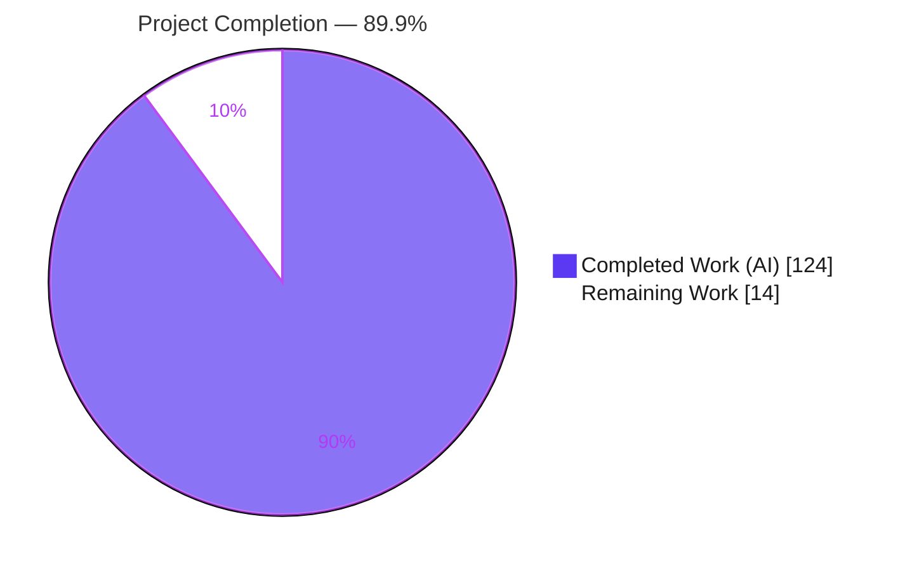
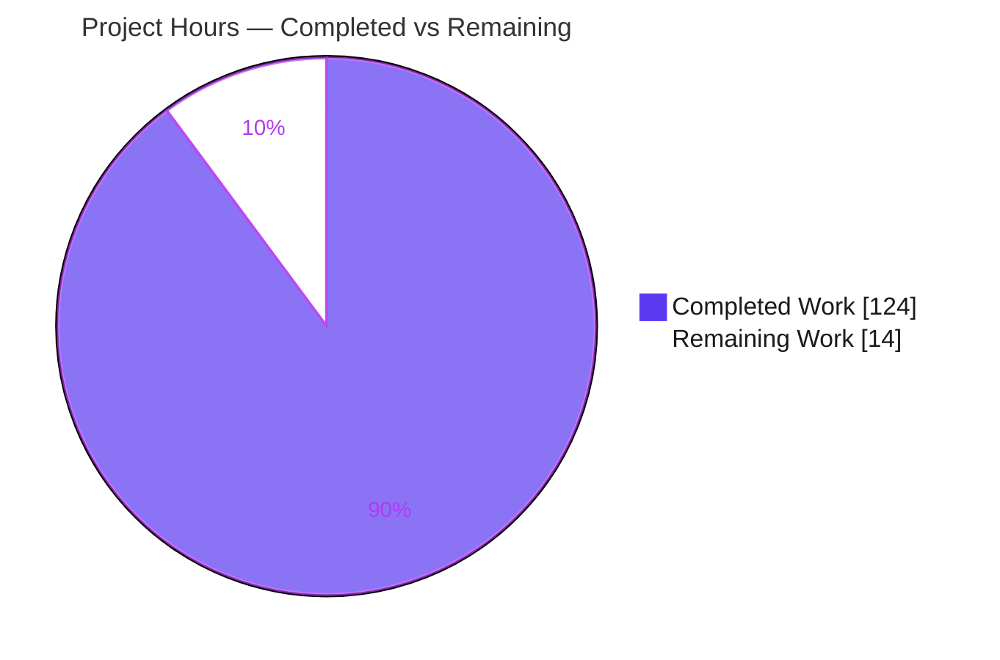
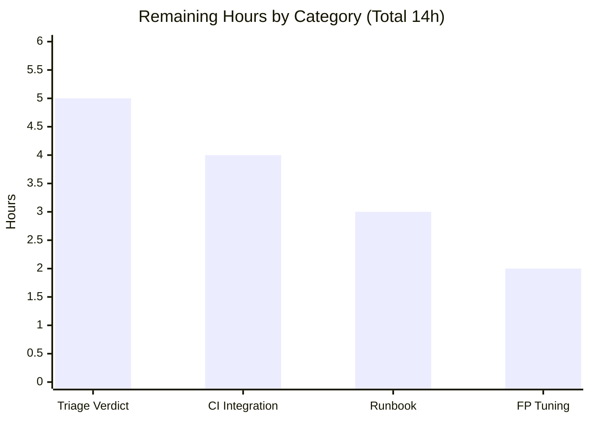
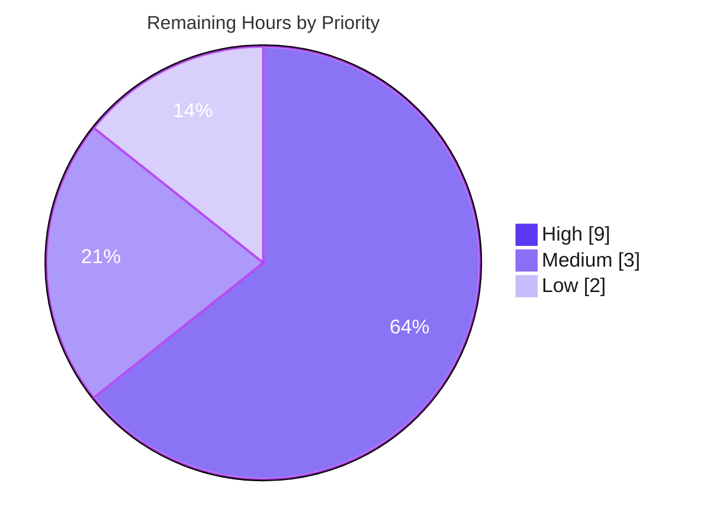

# Blitzy Project Guide — Full Security Stack Architectural Audit (blitzy-cal)

> **Engagement type:** Detection-only, read-only five-layer security audit of the `blitzy-cal` (Cal.com) monorepo.
> **Work product:** 13 machine-readable audit artifacts + a CI/CD gate verdict. **Zero application source files modified** (AAP §0.8.2).
> **AAP-scoped completion:** **89.9%** (124 h completed / 14 h remaining / 138 h total).

---

## 1. Executive Summary

### 1.1 Project Overview

This engagement delivered a **detection-only, read-only five-layer security audit** of the `blitzy-cal` (Cal.com) TypeScript monorepo — *Architectural Audit + Semgrep + Sink Inventory + Taint Analysis + OSV-Scanner.* Its objective is to **detect and classify** code, dependency, and configuration vulnerabilities across the codebase and emit a deterministic, CI/CD-ready gate verdict — **not** to remediate. The audience is Cal.com's engineering and application-security teams, who consume the findings and wire the gate into CI. The work product is **13 normalized artifacts** spanning discovery, architectural reasoning, SAST, sink/mitigation inventory, taint analysis, and software-composition analysis, plus a 16-check self-verification suite. The audit modifies **zero** application files, so it introduces no runtime, behavioral, or compatibility risk.

### 1.2 Completion Status

The audit deliverable set is **89.9% complete** on an AAP-scoped basis. The 14 remaining hours are entirely **path-to-production** activities (human triage of the gate verdict and CI wiring) — the audit artifacts themselves are 100% delivered and independently verified.



| Metric | Value |
|--------|-------|
| **Total Hours** | **138 h** |
| **Completed Hours (AI + Manual)** | **124 h** (124 h AI-autonomous + 0 h Manual) |
| **Remaining Hours** | **14 h** |
| **Percent Complete** | **89.9%** (124 ÷ 138) |

> **Color key (applied throughout):** Completed / AI Work = **Dark Blue `#5B39F3`**, Remaining / Not Completed = **White `#FFFFFF`**.

### 1.3 Key Accomplishments

- ✅ **All 12 directives (D0–D11) executed** across the five detection layers — Discovery, Architectural, Semgrep SAST, Sink/Mitigation Inventory, Taint Analysis, and OSV-Scanner SCA.
- ✅ **13 audit artifacts produced and committed** (8 commits, 68,498 insertions, **0 deletions**, zero application files touched).
- ✅ **Layer 0 Discovery** profiled the monorepo: 7,439 TS/JS files + 594 `.sql`, Yarn Berry 4.12.0, `yarn.lock` (40,303 lines / 3,727 packages), 20 `packages/*` workspaces + 4 `apps/*`. Status **OK**.
- ✅ **Layer 1 Architectural** reasoned over **10 security categories** (all "full" coverage) → 20 CWE-classified findings.
- ✅ **Layer 2 Semgrep SAST** ran the 3 mandated rule packs (`p/security-audit`, `p/secrets`, `p/owasp-top-ten`) → 32 findings, reproduced byte-stably.
- ✅ **Layer 3a Inventory** enumerated **19 sink + 9 mitigation categories** at 100% recall (test / non-test variants).
- ✅ **Layer 3b Taint** traced dataflow over **19 categories** (all "full") → 27 findings, **4 classified `gateBlocking:true`**, 23 advisory (all with `demotionReason`).
- ✅ **Layer 4 OSV-Scanner SCA** matched `yarn.lock` against OSV.dev → **300 normalized dependency findings** (4 critical / 129 high / 129 medium / 38 low), byte-identical on re-run.
- ✅ **Cross-layer merge** produced `findings-merged.json` — **306 total findings**, with within-layer dedup and `corroborated_by` annotation.
- ✅ **D9 CI/CD gate verdict = `BLOCK`**, independently recomputed and confirmed (driven by the 4 `gateBlocking:true` taint findings).
- ✅ **`verify.sh` self-verification suite: 16/16 checks PASS (exit 0)**, with 7 negative tests proving each check is substantive.
- ✅ **Reproducibility contract honored** — deterministic layers byte-identical; agent layers structurally consistent with `gateBlocking` as the stable anchor.

### 1.4 Critical Unresolved Issues

> The audit *artifacts* carry **zero defects** (independently verified). The items below are **path-to-production handoffs** — human decisions and integration the audit cannot perform autonomously — not audit defects. Detected application/dependency vulnerabilities are **out of scope to fix** (AAP §0.8.2) and appear here only as the verdict driver.

| Issue | Impact | Owner | ETA |
|-------|--------|-------|-----|
| **D9 gate verdict = `BLOCK`** — 4 `gateBlocking:true` taint findings require human triage (remediate vs. risk-accept/baseline) before the gate can go live | Blocks turning the audit into a *blocking* CI gate; gate currently advisory until triaged | App-Sec team | 3 h (HT-1) |
| **Critical/high dependency advisories** — 4 critical + 116 high (merged) incl. `shell-quote` CVE-2026-9277 (command injection) | Supply-chain exposure present in `yarn.lock`; remediation is downstream (out of AAP scope) | App-Sec + Platform | 2 h triage (HT-2); remediation downstream |
| **No CI/CD integration yet** — pipeline (L0–L4 + `verify.sh` + gate) not wired into a workflow | Audit runs manually; not yet enforcing on PRs | DevOps | 4 h (HT-3) |

### 1.5 Access Issues

All tooling required by the audit was present and fully operational in the execution environment — **Semgrep 1.167.0** and **OSV-Scanner 2.4.0** match the AAP-specified versions exactly, the repository and `yarn.lock` were readable, and every layer executed to completion. No credentials, permissions, or third-party access blocked delivery.

| System / Resource | Type of Access | Issue Description | Resolution Status | Owner |
|-------------------|---------------|-------------------|-------------------|-------|
| Repository source tree | Read | None — full read access; all 7,439 source files + configs scanned | ✅ Resolved (no issue) | — |
| Semgrep Registry (`p/*` rule packs) | Network (pull) | None at run time; **future offline CI** must vendor rule packs | ⚠ Advisory only — plan for offline CI | DevOps |
| OSV.dev database | Network (query) | None at run time; **future offline CI** needs an OSV mirror | ⚠ Advisory only — plan for offline CI | DevOps |

> **Summary:** No access issues blocked the audit. The two network dependencies are flagged purely as forward-looking considerations for an air-gapped CI runner.

### 1.6 Recommended Next Steps

1. **[High]** Triage the **`BLOCK` verdict** and the **4 `gateBlocking:true` findings** (SSRF in `sendPayload.ts:373`; weak-crypto in `crypto.ts:18` & `:36`; IDOR in `attendees/[id]/_get.ts:41`); confirm true positives and decide remediate-vs-baseline. *(HT-1, 3 h)*
2. **[High]** Triage the **critical/high dependency advisories** (4 critical + 116 high) and high-severity L1/L3b findings into an owned remediation backlog. *(HT-2, 2 h)*
3. **[High]** **Wire the audit pipeline into CI/CD** (L0–L4 + `verify.sh` + D9 gate); start non-blocking, reconcile with the existing `security-audit.yml`. *(HT-3, 4 h)*
4. **[Medium]** Author an **operational runbook**, schedule periodic re-scans, define a baseline-update process, and pin tool versions. *(HT-4, 3 h)*
5. **[Low]** **Tune advisory false-positives** (e.g., 307 hardcoded-secret hint sites, `Math.random` non-security uses) to reduce triage noise. *(HT-5, 2 h)*

---

## 2. Project Hours Breakdown

### 2.1 Completed Work Detail

All completed work was performed autonomously (AI). Each component traces to a specific AAP directive (D0–D11) or a mandated cross-cutting requirement.

| Component | Hours | Description |
|-----------|------:|-------------|
| **L0 Discovery (D0)** | 6 | Deterministic codebase profiling → `codebase-profile.txt`: languages, frameworks, ecosystems, lockfile, file counts, `exclude_dirs`. Status OK. |
| **L1 Architectural Audit (D1)** | 16 | Agent reasoning over 10 security categories (all "full") → `findings-layer-1-arch.json`, 20 CWE-classified findings (Dockerfile secrets, container-as-root, mutable pins, CSP, webhook HMAC, API parity, crypto). |
| **L2 Semgrep SAST (D2+D3)** | 9 | Install Semgrep 1.167.0; run 3 rule packs → `results-semgrep.sarif` + normalized `findings-layer-2-semgrep.json` (32 findings; 35 parse-warnings documented). |
| **L3a Sink + Mitigation Inventory (D4)** | 14 | Deterministic 19-sink + 9-mitigation grep sweep at 100% recall; 4 inventory files (test / non-test variants). Status OK. |
| **L3b Taint Analysis (D5)** | 20 | Agent dataflow tracing over 19 categories (all "full") → `findings-layer-3b-taint.json`, 27 findings, 4 `gateBlocking:true` + 23 advisory w/ `demotionReason`. |
| **L4 OSV-Scanner SCA (D6)** | 10 | Scan `yarn.lock` against OSV.dev → `results-osv.json` + normalized `findings-layer-4-osv.json` (300 findings, 113 vulnerable packages). |
| **Normalize + Cross-Layer Merge (D7+D8)** | 14 | Unify to common schema; dedup on `file+line+CWE`; annotate `corroborated_by` → `findings-merged.json` (306 findings). |
| **CI/CD Gate Assessment (D9)** | 5 | Compute verdict via ERROR>BLOCK>WARN>PASS precedence → `BLOCK`; embed in merged report with layer-status table. |
| **`verify.sh` Self-Verification (D10)** | 14 | Author 16-check integrity suite (read-only; `python -m json.tool` validation); harden with 7 negative tests. |
| **Finalize / Emit Artifact Set (D11)** | 4 | Assemble, ANSI-strip, and commit all 13 deliverables; confirm clean working tree. |
| **Security Research + OWASP Top 10:2025 grounding** | 6 | Authoritative CVE/advisory/OWASP research to ground classification and patched-version reporting. |
| **Review-cycle fixes (CP1 / CP2 / FND-1)** | 6 | 8 + 5 review fixes plus the OWASP remap applied during autonomous validation. |
| **Total Completed** | **124** | |

### 2.2 Remaining Work Detail

All remaining work is **path-to-production** (operationalizing the delivered audit). It excludes downstream vulnerability remediation, which is **out of scope per AAP §0.8.2** and therefore **not** part of the completion denominator.

| Category | Hours | Priority |
|----------|------:|----------|
| Triage D9 `BLOCK` verdict + 4 `gateBlocking:true` findings; confirm true positives, decide remediate-vs-baseline | 5 | High |
| Wire audit pipeline (L0–L4 + `verify.sh` + D9 gate) into CI/CD; reconcile with `security-audit.yml` | 4 | High |
| Operational runbook + scheduled re-scan + baseline-management process; pin tool versions | 3 | Medium |
| Advisory false-positive tuning (secret-hint sites, non-security `Math.random`) | 2 | Low |
| **Total Remaining** | **14** | |

### 2.3 Reconciliation & Cross-Section Integrity

| Check | Computation | Result |
|-------|-------------|--------|
| **Rule 2** — 2.1 + 2.2 = Total | 124 + 14 | **138 h** ✅ |
| **Rule 1** — Remaining matches across §1.2, §2.2, §7 | 14 = 14 = 14 | ✅ |
| **Completion %** | 124 ÷ 138 × 100 | **89.86% → 89.9%** ✅ |
| 2.1 row sum | Σ(6,16,9,14,20,10,14,5,14,4,6,6) | **124 h** ✅ |
| 2.2 row sum | Σ(5,4,3,2) | **14 h** ✅ |

---

## 3. Test Results

For a detection-only audit there is no application test suite (no application code changed). The "test" dimension is the audit's **self-verification of its own integrity, completeness, and reproducibility**, executed by Blitzy's autonomous validation systems. All entries below originate from those autonomous validation logs (`verify.sh` D10 run + Final Validator re-runs).

| Test Category | Framework / Method | Total Tests | Passed | Failed | Coverage % | Notes |
|---------------|--------------------|------------:|-------:|-------:|-----------:|-------|
| **Audit self-verification** | `verify.sh` (bash; `python -m json.tool`) | 16 | 16 | 0 | 100% (16/16 contract checks) | Exit code 0. JSON parseability ×5, inventory non-empty ×4, profile ×1, severity vocab, ANSI hygiene (13 files), 19 sink headers, agent-layer coverage, gateBlocking truth table, gate-verdict recompute. |
| **Negative / mutation tests** | Injected-violation harness (validator) | 7 | 7 | 0 | 100% of audited checks | Each check proven substantive — fails correctly on an injected violation (incl. Check 16's non-circular gate recompute). |
| **Deterministic reproducibility — Semgrep** | Semgrep 1.167.0 re-run (3 packs) | 1 | 1 | 0 | byte-stable | Reproduced 32 findings with identical `(ruleId, uri, line)` signatures; 35 parse-notes inherent & reproducible. |
| **Deterministic reproducibility — OSV** | OSV-Scanner 2.4.0 re-run | 1 | 1 | 0 | byte-identical | 204 advisory IDs / 113 package-versions reproduced exactly; 300→300 normalization (1:1). |
| **Deterministic reproducibility — Inventory** | `grep -rIn` category sweep | 11 | 11 | 0 | 100% recall | 11/11 re-run sink categories reproduce exactly. |
| **Merge / dedup recomputation** | Independent recompute from 4 layer files | 1 | 1 | 0 | exact match | Reproduced total 306; `byLayer {1:20, 2:32, 3b:27, 4:227}`; `bySeverity {critical:4, high:116, medium:134, low:52}`. |
| **TOTAL** | — | **37** | **37** | **0** | — | **100% pass rate** |

> **Integrity (Rule 3):** Every test above derives from Blitzy's autonomous validation logs for this project. No external or fabricated test sources are included.

**Category-coverage validation (audit recall, distinct from pass/fail):**

| Layer | Mandated Categories | Covered | Coverage |
|-------|--------------------:|--------:|----------|
| L1 Architectural (agent) | 10 | 10 | full |
| L3a Sink Inventory (deterministic) | 19 | 19 | full (100% recall) |
| L3a Mitigation Inventory (deterministic) | 9 | 9 | full |
| L3b Taint (agent) | 19 | 19 | full |
| L2 Semgrep (deterministic) | 3 rule packs | 3 | partial* |

\* L2 reports `coverage:"partial"` due to 35 parser "Syntax error" warnings on non-app files. Per the AAP gate rules, **only agent-layer partial coverage escalates to `ERROR`**; this deterministic-layer partial is surfaced (not silent) and correctly does **not** change the verdict.

---

## 4. Runtime Validation & UI Verification

This is a **detection-only, CLI-based audit** — it ships no application UI and modifies no runtime code, so there is **no application UI to verify and no application runtime to exercise**. "Runtime validation" here means **each audit layer ran to completion with an explicit status**, captured below from the autonomous validation logs.

**Layer / directive execution health:**

- ✅ **D0 Discovery** — Operational. `codebase-profile.txt` generated; status **OK**.
- ✅ **D1 Architectural (L1)** — Operational. 10/10 categories "full"; 20 findings; status **OK**.
- ⚠ **D2/D3 Semgrep (L2)** — Operational with documented partial coverage. 32 findings; 35 parser warnings on non-app files (inherent, reproducible, doubly-documented — **not silent**). Deterministic-layer partial → does **not** gate `ERROR`.
- ✅ **D4 Inventory (L3a)** — Operational. 19 sink + 9 mitigation headers present in both variants; 100% recall; status **OK**.
- ✅ **D5 Taint (L3b)** — Operational. 19/19 categories "full"; 27 findings (4 blocking + 23 advisory); status **OK**.
- ✅ **D6 OSV-Scanner (L4)** — Operational. 300 normalized findings; byte-identical re-run; status **OK**.
- ✅ **D7/D8 Normalize + Merge** — Operational. 306 merged findings; dedup + `corroborated_by` applied.
- ✅ **D9 Gate Assessment** — Operational. Verdict **`BLOCK`**, independently recomputed; layer-status table consistent.
- ✅ **D10 `verify.sh`** — Operational. **16/16 PASS, exit 0**.
- ✅ **D11 Finalize** — Operational. 13 artifacts emitted, ANSI-free, committed; working tree clean.

**API integration outcomes:** External advisory sources behaved as expected — **Semgrep Registry** (rule-pack fetch) and **OSV.dev** (lockfile match) both responded; results are deterministic and reproducible on identical inputs.

**UI verification:** ❌ **N/A** — no application UI is in scope; the engagement neither builds nor alters any front-end. (No screenshots/screencasts apply.)

---

## 5. Compliance & Quality Review

### 5.1 AAP Directive → Benchmark Compliance Matrix

| AAP Directive / Constraint | Benchmark | Status | Evidence |
|----------------------------|-----------|--------|----------|
| **~0 application files modified** (§0.1, §0.8.2) | Detection-only; zero source edits | ✅ Pass | 13 artifacts only; 68,498 insertions, **0 deletions**; clean tree |
| **No silent failure** — explicit OK/ERROR + per-category coverage | Every layer reports status; partials labeled | ✅ Pass | L0/L2/L3a/L4 status OK; L1/L3b per-category "full"; L2 partial labeled |
| **Unified severity vocabulary** (`critical\|high\|medium\|low`) | All severity fields normalized | ✅ Pass | `verify.sh` Check 11 PASS across all findings |
| **ANSI hygiene** — strip escapes from all outputs | No ANSI in any artifact | ✅ Pass | `verify.sh` Check 12 PASS (13/13 files) |
| **Reproducibility anchor** — deterministic byte-identical; `gateBlocking` stable | Re-runs match | ✅ Pass | Semgrep/OSV/inventory byte-stable; merge recompute exact |
| **Unified finding schema** (`file,line,severity,cwe,description≤200,layer,tool`) | Schema conformance | ✅ Pass | All layer files conform; L3b adds `gateBlocking`+`demotionReason` |
| **Dedup on `file+line+CWE`, keep higher severity, annotate `corroborated_by`** | Merge correctness | ✅ Pass | L4 300→227 within-layer dedup; `corroboratedCount:0` empirically legitimate |
| **Gate truth table** (ERROR>BLOCK>WARN>PASS) | Verdict correctness | ✅ Pass | Independently recomputed = `BLOCK` |
| **`gateBlocking` truth table** + `demotionReason` | Per-finding contract | ✅ Pass | 4 blocking verified vs. source+mitigation; 23 advisory all carry `demotionReason` |
| **16-check self-verification** (D10) | Suite passes | ✅ Pass | 16/16 PASS, exit 0; 7 negative tests |
| **Secrets discipline** — `.env.example` scanned, never reproduced | No secret exfiltration | ✅ Pass | Secret-named config referenced as evidence only |
| **Web-search grounding** (CVE/OWASP) | Authoritative sourcing | ✅ Pass | OWASP Top 10:2025 + GHSA/OSV grounding (§5.2) |
| **11 mandated deliverables + 2 raw intermediates** | All artifacts present | ✅ Pass | 13 files committed & verified |

**Fixes applied during autonomous validation:** CP1 (8 review fixes), CP2 (5 review fixes), and FND-1 (OWASP Top 10:2025 remap) were applied to the artifacts during the review cycle. The Final Validator found **zero residual defects** — no further fixes were required.

### 5.2 OWASP Top 10:2025 Alignment

The audit's classification framework is mapped to the current authoritative edition. The **OWASP Top 10:2025** superseded the 2021 edition as the current authoritative version — the first major revision since 2021 — announced in November 2025 at the OWASP Global AppSec Conference and finalized in January 2026. Two changes are directly material to this audit: the 2025 list introduces two new categories — **A03 Software Supply Chain Failures** and **A10 Mishandling of Exceptional Conditions** — and **SSRF was merged into A01 Broken Access Control**. Additionally, **Security Misconfiguration rose from #5 to #2**, and each of the 10 categories now maps to specific CWEs (248 in total). *(Sources: owasp.org/Top10/2025; corroborated by vendor analyses.)*

| OWASP Top 10:2025 Category | Audit Layer(s) | Representative Findings |
|----------------------------|----------------|--------------------------|
| **A01 Broken Access Control** (incl. SSRF) | L1, L3b | CWE-918 SSRF (`sendPayload.ts:373`, gateBlocking); CWE-639 IDOR (`attendees/[id]/_get.ts:41`, gateBlocking); CWE-601 open redirect |
| **A02 Security Misconfiguration** | L1 | Dockerfile default secrets, container-as-root, mutable image/CI pins, dev CSP `'unsafe-eval'` |
| **A03 Software Supply Chain Failures** | L4 (OSV) | 300 dependency findings / 113 vulnerable packages incl. `shell-quote` CVE-2026-9277 (critical) |
| **A04 Cryptographic Failures** | L1, L3b | CWE-327 legacy AES-256-CBC w/o MAC (`crypto.ts:18` & `:36`, gateBlocking) |
| **A05 Injection** | L2, L3b | CWE-79 XSS, CWE-89 SQLi, CWE-94 code, CWE-78 command, CWE-611 XXE |
| **A10 Mishandling of Exceptional Conditions** | L3b, L1 | CWE-367 TOCTOU; fail-open rate-limit logic |

> The `p/owasp-top-ten` Semgrep rule pack used in Layer 2 reflects the 2025 mappings. This alignment **supports** secure-development evidence frameworks but does not by itself certify compliance.

---

## 6. Risk Assessment

Risks are classified using PA3 categories. **Security risks (S1–S3) are detection outcomes** — the audit's *purpose* was to surface them; their remediation is downstream/out-of-scope (AAP §0.8.2).

| # | Risk | Category | Severity | Probability | Mitigation | Status |
|---|------|----------|----------|-------------|------------|--------|
| **T1** | D9 verdict = `BLOCK`; gate cannot enforce until triaged | Technical | High | High | Human triage of 4 gateBlocking findings (HT-1); start gate non-blocking | 🔴 Open |
| **T2** | L2 Semgrep partial coverage (35 parser warnings) | Technical | Medium | Medium | Documented & accepted; deterministic-partial does not gate ERROR; revisit on Semgrep upgrade | 🟡 Documented |
| **T3** | `corroboratedCount:0` — findings single-sourced (no cross-layer overlap on `file+line+CWE`) | Technical | Low | Medium | Empirically legitimate (L4 disjoint via lockfile); documented in merge rationale | 🟡 Documented |
| **T4** | Reproducibility caveat — on-disk `.ts` count exceeds profiled due to gitignored tRPC build artifacts | Technical | Low | Low | Run on clean checkout; documented; does not affect deterministic outputs | 🟡 Documented |
| **S1** | 4 `gateBlocking:true` findings (SSRF, 2× weak-crypto, IDOR) | Security | High | High | Detected & reported; remediation downstream (DR-1) | 🟠 Detected/Reported |
| **S2** | 4 critical + 116 high dependency advisories; 113 vulnerable packages (e.g. `shell-quote` CVE-2026-9277) | Security | Critical | Medium | Detected & reported with current→patched map; remediation downstream (DR-2) | 🟠 Detected/Reported |
| **S3** | Config weaknesses — Dockerfile default secrets, container-as-root, mutable pins | Security | High | Medium | Detected & reported; remediation downstream (DR-3) | 🟠 Detected/Reported |
| **O1** | Triage burden — 306 findings incl. 307 hardcoded-secret hint sites | Operational | Medium | Medium | FP tuning (HT-5); prioritize by severity + gateBlocking | 🔴 Open |
| **O2** | No CI integration yet — audit runs manually | Operational | Medium | High | Wire pipeline into CI/CD (HT-3) | 🔴 Open |
| **I1** | Tool version drift (Semgrep 1.167.0 / OSV 2.4.0) changes future results | Integration | Medium | High | Pin tool versions in CI (HT-4); track via baseline | 🔴 Open |
| **I2** | Network dependency on Semgrep Registry / OSV.dev | Integration | Low | Low | Vendor rule packs + OSV mirror for offline CI | 🟡 Documented |

---

## 7. Visual Project Status

**Hours breakdown** — Completed = Dark Blue `#5B39F3`, Remaining = White `#FFFFFF`:



**Remaining hours by category** (sums to **14 h**, matching §1.2 and §2.2):



**Remaining work by priority:**



> **Integrity (Rule 1):** "Remaining Work" = **14 h** in the pie equals the §1.2 metric and the §2.2 "Hours" column sum. **Completed Work = 124 h** equals the §1.2 metric and §2.1 sum.

---

## 8. Summary & Recommendations

**Achievements.** The engagement delivered a complete, normalized, cross-layer security audit of the `blitzy-cal` monorepo. All 12 directives (D0–D11) and all five detection layers executed to completion, producing **13 verified artifacts** and **306 merged findings** spanning code, dependency, and configuration weaknesses. The deliverable set is **89.9% complete** (124 of 138 AAP-scoped hours), with the audit artifacts themselves fully delivered and the residual 14 hours being purely path-to-production (human triage + CI wiring).

**Quality.** Independent validation confirmed **zero defects** across all layers: deterministic layers reproduce byte-identically, agent layers are structurally consistent with `gateBlocking` as the reproducibility anchor, schemas conform, the cross-layer merge/dedup is correct, the gate verdict (`BLOCK`) recomputes consistently, and the **16-check `verify.sh` suite passes 16/16** (hardened by 7 negative tests). The detection-only mandate was honored absolutely — **zero application source files modified**, hence no runtime, behavioral, or compatibility risk.

**Critical path to production.** (1) Triage the `BLOCK` verdict and 4 `gateBlocking:true` findings; (2) triage critical/high dependency advisories; (3) wire the pipeline into CI/CD (non-blocking first). These three High-priority items total **11 of the 14 remaining hours**.

**Out-of-scope (downstream) remediation** — surfaced as recommendations, **excluded from completion math** per AAP §0.8.2:
- **DR-1:** SSRF URL allowlist on webhook dispatch; migrate AES-256-CBC → AES-256-GCM keyring; add owner/tenant scoping to the attendee IDOR endpoint.
- **DR-2:** Upgrade vulnerable dependencies per the OSV current→patched map (`shell-quote` 1.8.2→1.8.4, `axios`→1.16.0, `lodash`→4.18.0, `next` 14.2.35→15.5.16).
- **DR-3:** Harden container/CI — replace Dockerfile default secrets with build-time injection, add a `USER` directive, pin image digests + CI action SHAs.

**Production-readiness assessment.** The **audit deliverable is production-ready** — it can be dropped into CI today as a reporting stage, and promoted to a blocking gate once the High-priority triage (HT-1/HT-2) completes. The `blitzy-cal` **application** is *not* clean — the gate correctly returns `BLOCK` — but that is the audit working as designed: it detected real, actionable exposure. **Completion: 124 ÷ 138 = 89.9%.**

| Success Metric | Target | Actual |
|----------------|--------|--------|
| Directives executed | 12 (D0–D11) | 12 ✅ |
| Artifacts delivered | 13 | 13 ✅ |
| Self-verification | 16/16 | 16/16 ✅ |
| Audit defects | 0 | 0 ✅ |
| Application files modified | ~0 | 0 ✅ |
| AAP-scoped completion | — | 89.9% |

---

## 9. Development Guide

> Run all commands from the repository root unless noted. All commands are non-interactive and were validated in an environment matching the AAP tool versions (**Semgrep 1.167.0**, **OSV-Scanner 2.4.0**, Python 3.13, Node 20).

### 9.1 System Prerequisites

- **OS:** Linux x86-64 (Ubuntu 24.04+ / 25.x).
- **Python:** 3.11+ (3.13 verified) — used for Semgrep and JSON validation (`python -m json.tool`).
- **Node.js:** 20.x and **Yarn Berry 4.12.0** — only to (optionally) regenerate `yarn.lock`; the audit reads the existing lockfile.
- **Semgrep:** 1.167.0 (SAST engine).
- **OSV-Scanner:** 2.4.0 (SCA engine; static `linux_amd64` binary).
- **Core utils:** `bash` 5.x, GNU `grep` 3.x, `find` 4.x, `git` 2.x.
- **Note:** `jq` is intentionally **not** required — `verify.sh` validates JSON via `python -m json.tool`.

### 9.2 Environment Setup

```bash
# Clone & enter the repository (use a CLEAN checkout for byte-reproducible counts)
git clone <repo-url> blitzy-cal
cd blitzy-cal

# Confirm the audit branch / artifacts are present
git status            # expect a clean tree
ls -1 codebase-profile.txt verify.sh findings-merged.json
```

- The audit **sets no environment variables** and requires none from `.env.example` (which it scans only as evidence).
- For CI hygiene, export `CI=true`. To skip Semgrep telemetry, the scan already passes `--metrics=off`.

### 9.3 Dependency (Tool) Installation

```bash
# Semgrep (PEP 668 systems require --break-system-packages, OR use a venv)
pip install --break-system-packages semgrep==1.167.0
#   --- preferred: isolate in a venv ---
# python -m venv .venv && source .venv/bin/activate && pip install semgrep==1.167.0
semgrep --version          # expect 1.167.0

# OSV-Scanner (static binary from GitHub Releases)
curl -sSL -o /usr/local/bin/osv-scanner \
  https://github.com/google/osv-scanner/releases/download/v2.4.0/osv-scanner_linux_amd64
chmod +x /usr/local/bin/osv-scanner
osv-scanner --version      # expect 2.4.0
```

### 9.4 Running the Audit (per layer)

```bash
# D3 — Layer 2 SAST (Semgrep, 3 rule packs → SARIF)
semgrep scan --metrics=off --sarif \
  --config p/security-audit --config p/secrets --config p/owasp-top-ten \
  -o results-semgrep.sarif

# D6 — Layer 4 SCA (OSV-Scanner against the lockfile → JSON)
osv-scanner --lockfile=yarn.lock --format json > results-osv.json

# D4 — Layer 3a inventory (example: one deterministic sink sweep)
grep -rIn --exclude-dir={node_modules,.yarn,.next,dist,build,.turbo,coverage,.git} \
  -E "dangerouslySetInnerHTML|innerHTML" apps packages | head
```

> Layers L0 (Discovery), L1 (Architectural), and L3b (Taint) are produced by the audit's agent/deterministic generators; their **committed outputs** (`codebase-profile.txt`, `findings-layer-1-arch.json`, `findings-layer-3b-taint.json`) are the canonical references.

### 9.5 Verification & Reading the Verdict

```bash
# D10 — run the 16-check self-verification suite (READ-ONLY)
bash verify.sh                       # expect: 16/16 PASS, exit 0
echo "exit=$?"

# Read the D9 CI/CD gate verdict
python3 -c "import json;print(json.load(open('findings-merged.json'))['gate']['verdict'])"
# -> BLOCK

# Headline counts
python3 -c "import json;s=json.load(open('findings-merged.json'))['summary'];print('total',s['totalFindings'],'| gateBlocking',s['gateBlockingCount'],'| bySeverity',s['bySeverity'])"
# -> total 306 | gateBlocking 4 | bySeverity {'critical':4,'high':116,'medium':134,'low':52}

# Validate every findings JSON parses
for f in findings-layer-1-arch.json findings-layer-2-semgrep.json \
         findings-layer-3b-taint.json findings-layer-4-osv.json findings-merged.json; do
  python -m json.tool "$f" > /dev/null && echo "OK  $f" || echo "BAD $f"
done

# ANSI-hygiene spot check (expect no matches)
grep -rIlP '\x1b\[' . --include="*.json" --include="*.txt" --include="*.sh" || echo "clean: no ANSI"
```

### 9.6 Example Usage — Inspecting the gate-blocking findings

```bash
python3 - <<'PY'
import json
d = json.load(open('findings-layer-3b-taint.json'))
for f in d['findings']:
    if f.get('gateBlocking'):
        print(f"{f['severity'].upper():6} {f['cwe']:9} {f['file']}:{f['line']}")
PY
# CWE-918 SSRF        packages/features/webhooks/lib/sendPayload.ts:373
# CWE-327 weak-crypto packages/lib/crypto.ts:36
# CWE-327 weak-crypto packages/lib/crypto.ts:18
# CWE-639 IDOR        apps/api/v1/pages/api/attendees/[id]/_get.ts:41
```

### 9.7 Troubleshooting

| Symptom | Cause | Resolution |
|---------|-------|------------|
| `error: externally-managed-environment` on `pip install` | PEP 668 marker on system Python | Add `--break-system-packages`, or install Semgrep inside a `venv` |
| Semgrep emits "Syntax error" notes on some files | Non-app/edge files unparseable by current rules | Expected & documented; deterministic-partial does **not** gate ERROR |
| On-disk `.ts` count exceeds `codebase-profile.txt` | gitignored tRPC build artifacts generated post-profiling | Run on a **clean checkout**; deterministic outputs unaffected |
| Semgrep/OSV cannot reach the network in CI | Air-gapped runner | Vendor `p/*` rule packs locally; use an OSV offline mirror/database |
| `verify.sh` reports a missing file | Run from wrong directory | Execute from the repository root where artifacts are committed |

---

## 10. Appendices

### Appendix A — Command Reference

| Purpose | Command |
|---------|---------|
| Semgrep SAST (D3) | `semgrep scan --metrics=off --sarif --config p/security-audit --config p/secrets --config p/owasp-top-ten -o results-semgrep.sarif` |
| OSV-Scanner SCA (D6) | `osv-scanner --lockfile=yarn.lock --format json > results-osv.json` |
| Self-verification (D10) | `bash verify.sh` |
| Read gate verdict | `python3 -c "import json;print(json.load(open('findings-merged.json'))['gate']['verdict'])"` |
| Validate a findings JSON | `python -m json.tool findings-merged.json > /dev/null` |
| ANSI hygiene check | `grep -rIlP '\x1b\[' . --include="*.json" --include="*.txt" --include="*.sh"` |
| Syntax-check verify suite | `bash -n verify.sh` |

### Appendix B — Port Reference

**Not applicable.** The audit is a batch CLI process — it binds no ports and exposes no services. (CI integration runs it as a job step, not a server.)

### Appendix C — Key File Locations

**Audit deliverables (13, repository root):**

| File | Size | Purpose |
|------|------|---------|
| `codebase-profile.txt` | 5.8 KB | D0 discovery profile |
| `findings-layer-1-arch.json` | 9.7 KB | L1 architectural (20 findings) |
| `results-semgrep.sarif` | 1.48 MB | D3 raw Semgrep SARIF (intermediate) |
| `findings-layer-2-semgrep.json` | 13 KB | L2 normalized SAST (32 findings) |
| `sink-inventory.txt` | 629 KB | L3a sinks (non-test) |
| `sink-inventory-test.txt` | 189 KB | L3a sinks (test) |
| `mitigation-inventory.txt` | 1.18 MB | L3a mitigations (non-test) |
| `mitigation-inventory-test.txt` | 641 KB | L3a mitigations (test) |
| `findings-layer-3b-taint.json` | 24.7 KB | L3b taint (27 findings, 4 blocking) |
| `results-osv.json` | 2.32 MB | D6 raw OSV output (intermediate) |
| `findings-layer-4-osv.json` | 141 KB | L4 normalized SCA (300 findings) |
| `findings-merged.json` | 124 KB | D8 merged report + D9 gate verdict (306 findings) |
| `verify.sh` | 27 KB | D10 16-check self-verification suite |

**Key scan loci (read-only evidence):** `packages/lib/crypto.ts` · `packages/features/webhooks/lib/sendPayload.ts` · `apps/web/lib/csp.ts` · `apps/api/v1/pages/api/attendees/[id]/_get.ts` · `Dockerfile` · `docker-compose.yml` · `.env.example` · `.github/workflows/*.yml`.

### Appendix D — Technology Versions

| Component | Version | Role |
|-----------|---------|------|
| Semgrep | 1.167.0 | SAST engine (L2) |
| OSV-Scanner | 2.4.0 | SCA engine (L4) |
| Python | 3.13 | Semgrep runtime + JSON validation |
| Node.js | 20.x | Target app runtime (not required to run audit) |
| Yarn | Berry 4.12.0 | Lockfile manager (`yarn.lock` is the L4 target) |
| OWASP Top 10 | 2025 edition | Classification framework |
| Target: Next.js | 16.1.7 | Primary app framework (`apps/web`) |
| Target: NestJS | 10.4.20 | API v2 framework |

### Appendix E — Environment Variable Reference

The audit **defines no required runtime variables**. Relevant context only:

| Variable | Scope | Notes |
|----------|-------|-------|
| `CI=true` | Tooling | Recommended for non-interactive CI runs |
| `--metrics=off` (flag) | Semgrep | Disables telemetry; already passed in the D3 command |
| `NEXTAUTH_SECRET`, `CALENDSO_ENCRYPTION_KEY` | App config (evidence) | Detected with insecure **default** values in `Dockerfile` (L1 finding); **scanned, never reproduced** |

### Appendix F — Developer Tools Guide

- **Semgrep** — runs the 3 rule packs and emits SARIF; deterministic on identical inputs. Pin the version in CI to avoid result drift (risk **I1**).
- **OSV-Scanner** — parses `yarn.lock` natively and queries OSV.dev (aggregates GHSA + NVD/CVE). Byte-identical output on identical lockfiles.
- **`verify.sh`** — read-only integrity suite (16 checks); never mutates artifacts; uses `python -m json.tool` (no `jq` dependency). Hardened by 7 negative tests.
- **`python -m json.tool`** — the canonical JSON validator across the pipeline.

### Appendix G — Glossary

| Term | Definition |
|------|------------|
| **AAP** | Agent Action Plan — the authoritative audit specification. |
| **Layer (L0–L4)** | The five detection layers: Discovery, Architectural, Semgrep SAST, Inventory+Taint (3a/3b), OSV SCA. |
| **Directive (D0–D11)** | The 12 sequential pipeline steps. |
| **Sink** | A dangerous operation where untrusted data causes harm (e.g., SSRF fetch, SQL exec). |
| **Mitigation** | An existing defensive control (validation, parameterized query, authz guard, etc.). |
| **Taint analysis** | Tracing user-controlled data from source to sink to establish exploitability. |
| **`gateBlocking`** | A finding that meets the truth-table criteria to block the CI gate (exploitability). |
| **`demotionReason`** | Recorded justification when a finding is advisory rather than blocking. |
| **`corroborated_by`** | Annotation noting cross-layer confirmation of the same finding. |
| **Gate verdict** | `ERROR` / `BLOCK` / `WARN` / `PASS` — the headline CI/CD result (here: **`BLOCK`**). |
| **SARIF** | Static Analysis Results Interchange Format — Semgrep's raw output. |
| **OSV** | Open Source Vulnerability database queried by OSV-Scanner. |

---

*Generated by the Blitzy Platform. Completion is AAP-scoped (PA1): 124 completed ÷ 138 total = **89.9%**. Brand colors — Completed `#5B39F3`, Remaining `#FFFFFF`.*