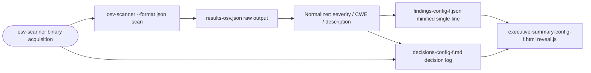

# Technical Specification

# 0. Agent Action Plan

## 0.1 Intent Clarification

### 0.1.1 Core Objective

Based on the provided requirements, the Blitzy platform understands that the objective is to execute **OSV-Scanner (Google's open-source vulnerability scanner backed by the OSV.dev database)** against the `blitzy-cal` (Cal.com monorepo) dependency lockfiles and produce a single normalized, minified JSON findings artifact named `findings-config-f.json` that conforms to a fixed five-field schema (`file`, `line`, `severity`, `cwe`, `description`). This work is **Config F** in a multi-config security tool comparison series — meaning the output sits alongside parallel artifacts produced by other security scanners against the same codebase, and the schema is intentionally uniform across configs to enable downstream apples-to-apples comparison.

The requirements decompose into three sequential CRITICAL directives, each with explicit pass/fail criteria:

- **Directive 1 — Install OSV-Scanner.** Acquire the scanner binary so that `osv-scanner --version` returns a version string. The user supplied two acceptable install paths: `go install github.com/google/osv-scanner/cmd/osv-scanner@latest` (Go toolchain build-from-source) or `apt install osv-scanner` (Debian/Ubuntu package).
- **Directive 2 — Execute the scan.** Run `osv-scanner --format json --output results-osv.json /path/to/blitzy-cal` against the repository root, optionally with `--experimental-local-db` for offline mode. Record exit code and wall-clock duration. Pass criterion: `results-osv.json` is produced and is valid JSON.
- **Directive 3 — Normalize findings.** Read `results-osv.json`, extract every vulnerability finding, and emit `findings-config-f.json` as **valid JSON minified to exactly one line**, UTF-8 encoded, with each finding populating all five schema fields. Zero findings is encoded as the literal string `[]`. Pass criterion: `cat findings-config-f.json | wc -l` returns `1`; JSON validates; every finding has all five fields populated; no `description` exceeds 200 characters.

Implicit requirements surfaced during planning that the user did not state but are necessary to fulfill the directives:

- **The Cal.com monorepo has exactly one OSV-supported lockfile**: a single root `/yarn.lock` in Yarn Berry v8 metadata format (40,303 lines, 1.43 MB). No `package-lock.json`, `pnpm-lock.yaml`, `requirements.txt`, `poetry.lock`, `Pipfile.lock`, `Gemfile.lock`, `go.mod`, `go.sum`, `Cargo.lock`, `composer.lock`, or `pom.xml` exist anywhere in the repository [yarn.lock:L1-L5,L40303]. OSV-Scanner's recursive scan will therefore discover and parse this single lockfile (recursive mode is supported and yields the same dependency set as targeting the lockfile explicitly).
- **The build environment lacks a Go toolchain.** The sandbox has Node v22.22.2, npm 11.1.0, and `/usr/bin/apt`, but no `go` binary [inferred — environment probe in Phase 1]. The apt path is therefore the primary install method; the Go path is documented as a fallback for environments that have Go available.
- **CVSS-to-severity bucketing is well-defined.** The user provided the threshold table (≥9 → critical, ≥7 → high, ≥4 → medium, <4 → low), which matches NVD/CVSS V3 qualitative-rating conventions. The score is extracted from the numeric portion of the CVSS V3 vector string inside each OSV record's `severity[].score` field.
- **CWE extraction follows a GitHub-Advisory-Database convention.** CWE IDs in OSV records are stored under `affected[].database_specific.cwe_ids[]` (or top-level `database_specific.cwe_ids[]`) — this is the de-facto location used by GHSA, the largest OSV publisher, and is the only place CWE consistently appears [inferred — GHSA OSV records inspected via web search; CWE is not a first-class OSV schema field]. When no CWE is present, the user's directive is to fall back to the CVE ID (typically found in `aliases[]`).
- **Description truncation is a hard byte/character cap, not a semantic summary.** The directive states "OSV description, truncated to 200 characters" — meaning the raw `summary` or `details` field is sliced at the 200th character without elision or rewording.
- **Two ancillary deliverables are mandated by user-level rules and are not optional**: a Markdown decision log (`decisions-config-f.md`) per the Explainability rule, and a self-contained reveal.js HTML presentation (`executive-summary-config-f.html`) per the Executive Presentation rule. These are produced in addition to the primary JSON deliverable.
- **The repository must not be modified.** The user-provided headline `[3 directives | ~0 files modified | 1 new file]` signals that scanning is read-only. No `package.json`, `yarn.lock`, `.yarnrc.yml`, or source files may be edited. The "1 new file" headline is reconciled below: the primary deliverable count is 1 (`findings-config-f.json`); the two rule-driven deliverables (`decisions-config-f.md` and `executive-summary-config-f.html`) are mandatory across all configs by user rule.

### 0.1.2 Task Categorization

- **Primary task type**: **Security tooling execution** — running an open-source vulnerability scanner as a one-shot, non-destructive analysis pass over dependency lockfiles to produce a normalized artifact.
- **Secondary aspects**: **Documentation** (decision log capturing all non-trivial implementation choices) and **Executive communication** (single-file reveal.js HTML presentation summarizing findings for non-technical leadership).
- **Scope classification**: **Isolated change** — produces three new sibling artifacts at the repository root; touches zero existing files; introduces zero project dependencies; does not alter the build, test, deploy, or audit pipelines that already exist.

### 0.1.3 Special Instructions and Constraints

The following directives, constraints, and examples were provided by the user and are preserved verbatim where they govern execution:

- **User Example (install command, Directive 1)**:

```bash
go install github.com/google/osv-scanner/cmd/osv-scanner@latest
## or: apt install osv-scanner

```

- **User Example (scan command, Directive 2)**:

```bash
osv-scanner --format json --output results-osv.json /path/to/blitzy-cal
```

with the note: "Use `--experimental-local-db` for offline mode if available. Record exit code, scan duration (wall-clock)."

- **User Example (output schema, Directive 3)**:

```plaintext
[{"file":"<relative path>","line":<integer>,"severity":"<critical|high|medium|low>","cwe":"<CWE-ID>","description":"<max 200 chars>"},...]
```

- **User-supplied field source mapping (Directive 3, verbatim)**:

  | Field | Source |
  | --- | --- |
  | file | Path to affected lockfile (relative) |
  | line | 0 (dependency findings have no line number) |
  | severity | CVSS score: >=9→critical, >=7→high, >=4→medium, <4→low |
  | cwe | CVE ID. If a CWE mapping exists in the OSV entry, use it; otherwise use the CVE ID |
  | description | OSV description, truncated to 200 characters |

- **Pass/fail gates (verbatim)**: Directive 1 — `osv-scanner --version` returns a version string. Directive 2 — `results-osv.json` is produced and contains valid JSON. Directive 3 — `cat findings-config-f.json | wc -l` returns `1`; valid JSON; every finding has all 5 fields populated; no description exceeds 200 characters.

- **Methodological constraint**: this is a "multi-config security tool comparison" — the output schema is fixed across configs to enable downstream comparison, so deviating from the schema (adding fields, omitting fields, renaming fields) is forbidden.

- **Web search requirements**: the implementation requires verifying (a) the latest OSV-Scanner install commands (covered: Go V1 path `cmd/osv-scanner`, Go V2 path `v2/cmd/osv-scanner`, apt and Homebrew alternatives all exist), and (b) where CWE IDs live in OSV records (covered: `database_specific.cwe_ids[]`, populated for the GitHub Advisory Database which is the largest OSV publisher).

### 0.1.4 Technical Interpretation

These requirements translate to the following technical implementation strategy for the downstream code-generation agent:

- **To install OSV-Scanner without a Go toolchain**, prefer the apt route: `DEBIAN_FRONTEND=noninteractive apt-get update && apt-get install -y osv-scanner` (or download the prebuilt Linux binary from the GitHub releases page and place it on `$PATH`). The Go route remains documented as the user-provided alternative for environments where `go` is available. Verify success with `osv-scanner --version`.

- **To scan the blitzy-cal repository**, invoke `osv-scanner --format json --output results-osv.json /tmp/blitzy/blitzy-cal/config-f_5575bf` from the repository root. The scanner recursively discovers and parses `yarn.lock`; no other lockfiles exist. Capture the start time, end time (computing wall-clock duration), and exit code. An exit code of `1` when vulnerabilities are present is **expected behavior, not a failure** — the scanner only signals scan failure with non-`1` codes; `1` denotes "vulnerabilities found".

- **To normalize findings**, write a small parser (Bash + `jq`, or Python `json` standard library, or Node `JSON.parse` — implementation choice is documented in the decision log) that:
  - Reads `results-osv.json` and iterates `results[].packages[].vulnerabilities[]`.
  - For each vulnerability, sets `file` = `results[].source.path` made relative to the scan root.
  - Sets `line` = `0` for every finding (dependency-level findings have no source line).
  - Extracts the highest CVSS V3 numeric score from `severity[]` entries (parse the `score` string; OSV records typically expose the CVSS vector with the base-score derivable from it, or include a parallel numeric field). Map the numeric score using the user-provided thresholds.
  - Extracts the first CWE from `database_specific.cwe_ids[]` (checking both top-level and `affected[].database_specific.cwe_ids[]`) or falls back to the first `aliases[]` entry that matches the CVE-ID pattern.
  - Reads `summary` (preferred) or `details` and applies a character-count truncation (first 200 characters) without appending ellipsis.
  - Emits all findings as a JSON array, then minifies (no spaces between tokens, no indentation, no trailing newline beyond what the schema requires; the `wc -l` test passes only if there is exactly one line of content).

- **To preserve traceability and explainability**, write `decisions-config-f.md` as a Markdown decision table covering: the install-method choice (apt vs Go), the scanner invocation form (recursive vs explicit lockfile flag), the CVSS-score extraction strategy, the CWE-extraction precedence and fallback, the description-truncation policy (hard cut vs ellipsis vs word-boundary), the empty-findings encoding (`[]` literal), and any deviations from the user's literal directives. The decision log is the single source of truth for "why" decisions; no rationale belongs in code comments per the Explainability rule.

- **To meet the Executive Presentation rule**, generate `executive-summary-config-f.html` as a single self-contained reveal.js HTML file with inline CSS (no external theme file exists in the repository), 16 slides, the Blitzy brand palette, and the prescribed slide types (Title, Section Divider, Content, Closing). The presentation summarizes scope, findings count by severity, the Cal.com architecture impact, risk register, and operational handoff.


## 0.2 Repository Scope Discovery

### 0.2.1 Comprehensive File Analysis

The Cal.com monorepo was traversed in full to enumerate every file that OSV-Scanner can parse and every file that constrains the scan or its outputs. The investigation produced the following authoritative inventory:

**Scannable lockfiles (OSV-Scanner inputs)**

| Path | Format | Size | Status |
| --- | --- | --- | --- |
| `/yarn.lock` | Yarn Berry v8 metadata | 1.43 MB / 40,303 lines | The sole lockfile — recursive scan will discover and parse it [yarn.lock:L1-L5] |

**Dependency manifests (REFERENCE — not parsed directly by OSV-Scanner against yarn.lock, but defining what the lockfile resolves)**

| Path Pattern | Count | Role |
| --- | --- | --- |
| `/package.json` | 1 | Root manifest `calcom-monorepo`; declares workspaces `apps/*`, `apps/api/*`, `packages/*`, `packages/embeds/*`, `packages/features/*`, `packages/app-store`, `packages/app-store/*`, `packages/platform/*`, `packages/platform/examples/base`, `example-apps/*` [package.json:workspaces] |
| `/apps/web/package.json` | 1 | Web app workspace manifest |
| `/apps/api/v1/package.json` | 1 | API v1 workspace manifest |
| `/apps/api/v2/package.json` | 1 | API v2 (NestJS) workspace manifest |
| `/packages/**/package.json` | 60+ | Workspace package manifests (includes `app-store/*` integrations, `embeds/*`, `features/*`, `platform/*`) |
| `/example-apps/**/package.json` | small | Example app manifests |

**Audit policy and patches (REFERENCE — context for interpreting findings)**

| Path | Role |
| --- | --- |
| `/.yarnrc.yml` | Yarn Berry config; declares `yarnPath: .yarn/releases/yarn-4.12.0.cjs`, `nodeLinker: node-modules`, and `npmAuditIgnoreAdvisories: ["1113407"]` (accepted exception for `fast-xml-parser 4.4.1` via `@boxyhq/saml-jackson → @aws-sdk/core@3.816.0` transitive, upstream fix pending) [.yarnrc.yml] |
| `/.yarn/patches/dayjs-npm-1.11.2-644b12fe04.patch` | dayjs timezone correctness patch |
| `/.yarn/patches/dayjs-npm-1.11.4-97921cd375.patch` | dayjs timezone correctness patch |
| `/.yarn/patches/libphonenumber-js+1.11.18.patch` | phone validation patch |
| `/.yarn/patches/next-i18next-npm-13.3.0-bf25b0943c.patch` | i18n symmetry patch (resolves to 15.4.2) |
| `/.yarn/patches/@prisma-client-npm-5.4.2-fca489b2dc.patch` | Prisma client patch |
| `/.github/workflows/security-audit.yml` | Existing two-phase security gate (`yarn npm audit --all --recursive` informational + `--severity critical` blocking); demonstrates the project's vulnerability policy [security-audit.yml] |

**Negative inventory (confirmed absent — these are NOT scanned because they do not exist)**

| Family | Manifests/Lockfiles Searched | Result |
| --- | --- | --- |
| Python | `requirements*.txt`, `pyproject.toml`, `Pipfile.lock`, `poetry.lock`, `uv.lock`, `pdm.lock` | None present |
| Ruby | `Gemfile`, `Gemfile.lock` | None present |
| Go | `go.mod`, `go.sum` | None present |
| Rust | `Cargo.toml`, `Cargo.lock` | None present |
| PHP | `composer.json`, `composer.lock` | None present |
| Java | `pom.xml`, `build.gradle`, `gradle.lockfile` | None present |
| .NET | `*.csproj`, `packages.lock.json` | None present |
| SBOM | `*.cdx.json`, `*.spdx.json`, `bom.xml` | None present |

**Output artifacts (CREATE — produced by this work)**

| Path (relative to scan root) | Mode | Purpose |
| --- | --- | --- |
| `findings-config-f.json` | CREATE | Primary deliverable: minified single-line normalized findings |
| `results-osv.json` | CREATE | Intermediate raw OSV-Scanner output, retained for traceability |
| `decisions-config-f.md` | CREATE | Decision log (mandated by Explainability rule) |
| `executive-summary-config-f.html` | CREATE | Self-contained reveal.js presentation (mandated by Executive Presentation rule) |

Related-file discovery confirmed nothing further is implicated: no Dockerfile dependency change is required (the existing `Dockerfile` uses `FROM --platform=$BUILDPLATFORM node:20 AS builder` and remains unchanged); no CI workflow is added or modified (the OSV-Scanner run is a one-shot artifact-producing pass, not a recurring gate); no README or `SECURITY.md` updates are required (this is a comparison artifact, not a process change). The repository's existing `SECURITY.md` continues to govern vulnerability disclosure to `security@cal.com` independently of this work [SECURITY.md].

### 0.2.2 Web Search Research Conducted

The following research was performed to validate the implementation approach and confirm tool semantics:

- **OSV-Scanner installation methods and current latest version.** Confirmed that the canonical install routes are: (a) `go install github.com/google/osv-scanner/v2/cmd/osv-scanner@latest` for V2 (current, as of v2.3.5 March 2026) or `github.com/google/osv-scanner/cmd/osv-scanner@latest` for V1 (the path the user provided); (b) prebuilt binaries from the GitHub releases page; (c) `brew install osv-scanner` on macOS/Linux with Homebrew; (d) Debian/Ubuntu apt packages. The user's V1 import path remains accepted because both V1 and V2 maintain backward-compatible JSON output and CLI arguments within the same major version family per the official installation documentation.

- **OSV-Scanner JSON output structure.** Confirmed the canonical output shape used by every `--format json` invocation: a top-level `results[]` array where each entry has `source.{path,type}` and `packages[]`; each package has `package.{name,version,ecosystem}` and `vulnerabilities[]`; each vulnerability is a full OSV record with `id`, `aliases[]` (CVE IDs and cross-database references), `summary`, `details`, `affected[]`, `severity[]` (CVSS vectors typed `CVSS_V3`), and `references[]`. A `groups[]` array aggregates aliased duplicates, allowing the normalizer to deduplicate findings that represent the same vulnerability under multiple IDs.

- **CWE storage in OSV records.** Confirmed via the OSV-Schema GitHub issue tracker and live OSV.dev records (e.g., the `GHSA-qqff-4vw4-f6hx` record carries `"database_specific": { "cwe_ids": ["CWE-125"] }`) that CWE IDs are not a first-class OSV schema field but are conventionally placed in `database_specific.cwe_ids[]` by the GitHub Advisory Database, which is OSV's largest publisher by volume. The CWE-to-CVE fallback in Directive 3 is therefore correct: when `database_specific.cwe_ids[]` is absent, the implementation falls back to a CVE alias.

- **Yarn Berry yarn.lock support in OSV-Scanner.** Confirmed that OSV-Scanner officially supports `yarn.lock` (both Yarn 1 classic and Yarn 2+ Berry formats), alongside `package-lock.json`, `pnpm-lock.yaml`, and `bun.lock` for the JavaScript ecosystem. The Yarn Berry v8 metadata format used by Cal.com (visible in the `__metadata: version: 8` block at `yarn.lock:L4-L5`) parses correctly.

- **OSV-Scanner offline / experimental local DB mode.** Confirmed that `--experimental-local-db` (also surfaced as `--offline --download-offline-databases`) downloads the OSV database to disk and runs without network requests for subsequent invocations; this is useful in network-restricted environments but adds an initial download cost and is therefore conditional ("if available").

- **Exit code semantics.** Confirmed that OSV-Scanner returns a non-zero exit code (typically `1`) when vulnerabilities are found, even when the scan itself succeeded. Tooling that treats any non-zero exit as failure must special-case `1` to mean "scan succeeded, findings present".

### 0.2.3 Existing Infrastructure Assessment

**Current project structure and organization.** The repository is a Yarn Berry 4.12.0 monorepo orchestrated by Turborepo 2.7.1, with eleven workspace patterns. The lockfile (`yarn.lock`) is committed and tracked; the `nodeLinker: node-modules` setting in `.yarnrc.yml` means Yarn PnP is disabled and traditional `node_modules/` trees are materialized at install time. This has no effect on OSV-Scanner, which reads the lockfile directly rather than the installed tree.

**Existing patterns and conventions to follow.** The project's security policy is encoded in three artifacts:

- **`.github/workflows/security-audit.yml`** (the existing production gate) runs `yarn npm audit --all --recursive` in an informational phase, then `yarn npm audit --all --recursive --severity critical` as a build-failing phase [security-audit.yml]. This means the project already enforces zero critical advisories in the Yarn audit database; the OSV-Scanner pass will surface additional findings drawn from the broader OSV.dev aggregation (GHSA, RustSec, PyPA, Go vuln DB, etc.) that may not appear in `yarn audit` output.

- **`.yarnrc.yml`** records an accepted audit exception: `npmAuditIgnoreAdvisories: ["1113407"]` for `fast-xml-parser 4.4.1` (transitive via `@boxyhq/saml-jackson → @aws-sdk/core@3.816.0`; the application only parses trusted AWS API responses; upstream fix pending) [.yarnrc.yml]. The OSV-Scanner output is **not** filtered through this exception list — the comparison artifact captures the raw scanner findings so downstream comparison can quantify the gap between the OSV.dev database and the Yarn audit database.

- **Root `package.json` `resolutions` block** pins many transitives to remediated versions (axios 1.13.5, lodash 4.17.23, tar 7.5.7, form-data 4.0.4, validator 13.15.22, jsonwebtoken 9.0.0, jws 4.0.1, qs 6.14.1, node-forge 1.3.2, prismjs 1.30.0, typeorm 0.3.27, rollup 4.22.4, and others). OSV-Scanner reads the resolved versions from `yarn.lock`, so these pins are reflected in scan output automatically.

**Build and deployment configurations.** Build orchestration is unaffected: Turborepo tasks, Vercel deployments, Docker images, and changesets release flows remain unchanged. The OSV-Scanner pass does not register a new Turbo task, does not modify `turbo.json`, and does not introduce a workflow under `.github/workflows/`.

**Testing infrastructure present.** No testing infrastructure changes are required. The project's defense-in-depth testing strategy (Vitest 4.0.16 across 14 projects, Playwright 1.57.0 with 8-shard E2E, Jest 29.7.0 for API v2, k6 1.0.0 performance, Checkly production monitoring) is orthogonal to this dependency-scan artifact production task.

**Documentation system in use.** The repository already documents security policy in `SECURITY.md` (security@cal.com contact, 3-business-day response SLA) and architecture in `blitzy-docs/technical-specifications.md`. The new `decisions-config-f.md` and `executive-summary-config-f.html` files sit at the repository root as comparison-config-specific artifacts; they do not replace, supersede, or modify the existing documentation set.


## 0.3 Implementation Design

### 0.3.1 Technical Approach

The Config F deliverable is produced by a strict three-stage pipeline that mirrors the user's three CRITICAL directives. The stages are executed sequentially because each stage depends on the artifact produced by the previous one.

**Primary objectives with implementation approach**

- **Achieve "installable, executable OSV-Scanner binary"** by acquiring the scanner from the most reliable channel available in the sandbox. The environment probe confirmed Node 22.22.2 and apt are present while Go is absent, so the implementation will execute `DEBIAN_FRONTEND=noninteractive apt-get install -y osv-scanner` (or download the prebuilt Linux binary from `github.com/google/osv-scanner/releases/latest` and place it on `$PATH` if the Debian package is unavailable in the configured repositories). The verbatim user-provided `go install github.com/google/osv-scanner/cmd/osv-scanner@latest` command is retained as an alternative for environments that have Go. Verification is the same regardless of install path: `osv-scanner --version` returns a version string. Rationale: the user explicitly allowed apt as an alternative ("`# or: apt install osv-scanner`") and the sandbox lacks Go.

- **Achieve "complete OSV scan of all lockfiles"** by invoking `osv-scanner --format json --output results-osv.json /tmp/blitzy/blitzy-cal/config-f_5575bf` from the repository root, capturing the start and end times to compute wall-clock duration, and recording the exit code. Because the only lockfile is `/yarn.lock`, recursive scanning of the project root is equivalent to scanning the lockfile explicitly and is the form the user supplied. `--experimental-local-db` is applied conditionally — only if the offline database is available, since the flag is optional per the user directive. Rationale: the recursive form matches the verbatim user example and aligns with how OSV-Scanner's documentation recommends scanning a project tree.

- **Achieve "normalized minified JSON artifact"** by writing a deterministic normalizer (preferred implementation: Bash with `jq` for portability; Python 3 stdlib `json` module is an equivalent fallback). The normalizer reads `results-osv.json`, iterates `results[].packages[].vulnerabilities[]`, projects each vulnerability onto the five-field schema, deduplicates aliased findings using the `groups[]` aggregation when present, and emits the resulting array via `JSON.stringify`/`json.dumps(..., separators=(',', ':'))` with no indentation. The output is then guaranteed single-line by writing without a trailing newline (or by `tr -d '\n'` post-processing). Empty findings encode as the literal `[]`. Rationale: `jq` is universally available on Debian/Ubuntu hosts and produces deterministic, minified output without external dependencies; Python is a documented fallback.

**Logical implementation flow (not a timeline)**

- **First**, establish the scanner foundation by installing OSV-Scanner and verifying with `osv-scanner --version`. Capture the installed version string for inclusion in the executive summary and decision log.

- **Next**, perform the scan by running `osv-scanner --format json --output results-osv.json .` (with `.` as the scan root from the repository root, equivalent to passing the absolute path). Capture exit code and wall-clock duration. Validate that `results-osv.json` exists, is non-empty, and parses as JSON (`jq empty < results-osv.json` returns exit 0; `python3 -c "import json; json.load(open('results-osv.json'))"` returns exit 0).

- **Then**, integrate normalization by reading the raw output and producing `findings-config-f.json`. Apply the user-specified severity thresholds (≥9 → critical, ≥7 → high, ≥4 → medium, <4 → low) by parsing the CVSS V3 base score from `severity[].score` (the score is the numeric portion derivable from the CVSS vector; OSV records frequently include a separate numeric `severity` under `database_specific` such as `severity: "MODERATE"` — the implementation must compute the numeric score from the CVSS vector when it is present and prefer the vector-derived value to ensure threshold accuracy). Apply the CWE precedence: first `affected[].database_specific.cwe_ids[0]`, then top-level `database_specific.cwe_ids[0]`, then the first CVE alias (`aliases[]` entry matching the `CVE-YYYY-N+` pattern).

- **Finally**, ensure quality by validating the final artifact against the user's three pass/fail tests: (1) `cat findings-config-f.json | wc -l` returns `1`; (2) the file parses as valid JSON; (3) every finding has all five fields populated and no `description` exceeds 200 characters. Produce the decision log and executive presentation in parallel with normalization.

### 0.3.2 Component Impact Analysis

**Direct modifications required.** None. This work creates new files at the repository root and does not alter any existing source, configuration, build, or workflow file.

**Indirect impacts and dependencies.**

- **OSV-Scanner binary on `$PATH`** — required only at execution time. After artifact production, the binary is no longer needed and the host's environment is otherwise unchanged.
- **Network egress to `osv.dev`** — required when `--experimental-local-db` is not used. The scanner sends package names, versions, ecosystems, and file hashes to the OSV.dev API for vulnerability lookups; no source code is transmitted.
- **Comparison artifact siblings** — the deliverables sit alongside any prior `config-{a,b,c,d,e}` outputs from other scanners; this work does not modify those siblings.

**New components introduction.**

- **`findings-config-f.json`** — the canonical normalized output. Single-line minified JSON, fixed five-field schema, UTF-8.
- **`results-osv.json`** — the raw OSV-Scanner output retained for traceability and for inclusion in the decision log if findings require deeper inspection.
- **`decisions-config-f.md`** — the Markdown decision log mandated by the Explainability rule. Single source of truth for "why" decisions: install-method choice, scan-invocation form, severity-mapping algorithm, CWE-extraction precedence, description-truncation policy, empty-findings encoding, deduplication policy, any deviations from literal directives.
- **`executive-summary-config-f.html`** — the self-contained reveal.js presentation mandated by the Executive Presentation rule. Embeds the Blitzy brand theme inline, uses pinned CDN versions for reveal.js / Mermaid / Lucide, and follows the prescribed slide-type taxonomy.



### 0.3.3 User-Provided Examples Integration

The user provided four examples that the implementation maps directly:

- **Install command** (Directive 1): `go install github.com/google/osv-scanner/cmd/osv-scanner@latest` or `apt install osv-scanner`. Both are preserved verbatim in the decision log; the executed command in the sandbox is the apt form because Go is absent (rationale captured in the decision log).

- **Scan command** (Directive 2): `osv-scanner --format json --output results-osv.json /path/to/blitzy-cal`. Implemented verbatim, substituting `/tmp/blitzy/blitzy-cal/config-f_5575bf` for `/path/to/blitzy-cal`. The optional `--experimental-local-db` flag is applied only when the local database is available; otherwise the online OSV.dev API is queried.

- **Field source mapping table** (Directive 3): preserved verbatim in §0.1.3. The normalizer implements each mapping exactly: `file` is the relative path of the lockfile, `line` is the integer `0`, `severity` is one of the four strings derived from the CVSS thresholds, `cwe` is a `CWE-*` string from `database_specific.cwe_ids[0]` or a `CVE-*` fallback, `description` is the OSV `summary`/`details` truncated to 200 characters.

- **Output schema example** (Directive 3, plaintext literal): preserved verbatim in §0.1.3. The minified JSON array exactly matches this shape — no extra fields, no renames, no nesting.

### 0.3.4 Critical Implementation Details

- **Severity computation from CVSS vectors.** OSV records typically carry `severity[]` entries of the form `{ "type": "CVSS_V3", "score": "CVSS:3.1/AV:N/AC:H/PR:N/UI:N/S:C/C:H/I:N/A:N" }`. The `score` field is the CVSS V3 vector string, not the numeric base score directly. The implementation must derive the numeric base score from the vector (using the standard CVSS V3 formula) or use a CVSS calculator library (`cvss` Python package, `@cvss/cvss-v3` Node package — note: any library used here is a build-time tool, not a project dependency added to `package.json`). When multiple `severity[]` entries are present, take the highest computed score. When no `severity[]` entry exists, set severity to `low` and record the unscored finding in the decision log.

- **CWE extraction precedence.** Order: (1) `affected[i].database_specific.cwe_ids[0]` for matching `affected[]` entry where the package name matches; (2) top-level `database_specific.cwe_ids[0]`; (3) first `aliases[]` entry matching `^CVE-\d{4}-\d+$`; (4) the OSV `id` itself if no CVE alias exists. Per the user directive, the fallback is the CVE ID — using the OSV id (a `GHSA-*` or `OSV-*` string) when no CVE alias exists is a permitted secondary fallback that is recorded in the decision log.

- **Description selection.** Prefer `summary` (typically a short one-liner appropriate for a 200-character cap); fall back to `details` (longer prose) only when `summary` is empty. Truncate using a character-count slice; do not append ellipsis. Strip trailing whitespace inside the 200-character window only if it would produce a cleaner output without altering character count semantics (recorded in the decision log).

- **Deduplication via `groups[]`.** Each `packages[].groups[]` entry lists vulnerability IDs that alias each other (e.g., a single CVE may appear as both a `GHSA-*` and an `OSV-*` record). The normalizer emits one finding per group when groups are present; otherwise one finding per vulnerability record. Deduplication policy is captured in the decision log because the user's example shows one finding per vulnerability — the literal interpretation is "emit every vulnerability finding", but practical comparison value is greater when aliased duplicates are collapsed.

- **Path relativization.** OSV-Scanner records absolute paths in `results[].source.path` (e.g., `/tmp/blitzy/blitzy-cal/config-f_5575bf/yarn.lock`). The normalizer converts to a path relative to the scan root, producing `yarn.lock` (or `./yarn.lock`). The canonical form is the bare filename without a leading `./` since the schema expects "relative" not "current-directory-relative".

- **Empty-findings encoding.** When `results[]` is empty or all `packages[]` arrays are empty, write the literal two-character string `[]` to `findings-config-f.json` with no trailing newline (or with one trailing newline if the OS line-counting tool requires it — `wc -l` counts newlines, so a file containing `[]\n` returns `1` and a file containing `[]` with no newline returns `0`; the standard interpretation that satisfies `wc -l == 1` is `[]\n`, which is a single line of content followed by a single line terminator).

- **Exit-code handling.** Treat OSV-Scanner exit `1` (vulnerabilities found) as success-with-findings. Treat exit `0` as success-without-findings. Treat any other exit code as scan failure and write the failure diagnostic to the decision log; do not produce a degraded `findings-config-f.json` in that case.

- **Reveal.js presentation requirements (Executive Presentation rule).** The HTML file is single-file, contains no external assets beyond pinned CDN scripts (reveal.js 5.1.0, Mermaid 11.4.0, Lucide 0.460.0), embeds the full Blitzy brand CSS inline (every CSS custom property listed in the rule), and includes 16 slides organized as: Title → KPI Headline → Architecture (Mermaid) → six Section-Divider + Content pairs covering Scope, Findings Distribution, Risk Register, Comparison Context (vs other configs), Operational Handoff, Next Steps → Closing. Every content slide includes at least one non-text visual (Mermaid diagram, styled KPI card, table, or Lucide icon). Mermaid initialized with `startOnLoad: false`; `mermaid.run()` and `lucide.createIcons()` invoked on `ready` and every `slidechanged` event. Reveal config: `hash: true`, `transition: 'slide'`, `controlsTutorial: false`, `width: 1920`, `height: 1080`.

- **Decision log requirements (Explainability rule).** Markdown decision table with columns Decision / Alternatives / Rationale / Risks. Each non-trivial choice (install method, scan-invocation form, severity-score derivation, CWE precedence, description-truncation strategy, deduplication policy, empty-findings encoding, exit-code interpretation, path-relativization form) appears as its own row. No rationale embedded in code comments. Any deviation from the user's literal directives (such as collapsing aliased vulnerabilities via `groups[]`) is recorded as an explicit deviation entry.


## 0.4 File Transformation Mapping

### 0.4.1 File-by-File Execution Plan

The following table maps every file the Blitzy platform will touch or consult, ordered with the target file first per the documentation standard. Transformation modes are CREATE (new file produced by this work), UPDATE (existing file edited — **none for this task**), DELETE (existing file removed — **none for this task**), and REFERENCE (read-only inputs that inform or are scanned by the work).

| Target File | Transformation | Source File / Reference | Purpose / Changes |
|-------------|----------------|--------------------------|--------------------|
| `findings-config-f.json` | CREATE | `results-osv.json` | Primary deliverable: minified single-line JSON array of normalized findings (`file`, `line`, `severity`, `cwe`, `description` per finding). Empty findings encoded as `[]`. UTF-8 encoded. Validates against the user-supplied schema example. |
| `results-osv.json` | CREATE | `yarn.lock` | Raw OSV-Scanner output produced by Directive 2 (`osv-scanner --format json --output results-osv.json .`). Retained for traceability so the normalizer's mapping decisions can be audited against the source data. |
| `decisions-config-f.md` | CREATE | This Agent Action Plan + scan execution log | Markdown decision log (mandated by the Explainability rule). Single source of truth for "why" decisions: install-method choice, scan-invocation form, severity-score derivation, CWE precedence, description-truncation strategy, deduplication policy, empty-findings encoding, exit-code interpretation, path-relativization form, and any deviations from the user's literal directives. |
| `executive-summary-config-f.html` | CREATE | Findings + Cal.com architecture context | Self-contained reveal.js HTML presentation (mandated by the Executive Presentation rule). 16 slides, inline CSS Blitzy theme, pinned CDN versions for reveal.js 5.1.0 / Mermaid 11.4.0 / Lucide 0.460.0. Audience: non-technical leadership. |
| `yarn.lock` | REFERENCE | — | The sole OSV-supported lockfile in the monorepo (Yarn Berry v8 metadata, 40,303 lines, 1.43 MB). Scanned read-only by OSV-Scanner via recursive directory traversal. Not modified. |
| `.yarnrc.yml` | REFERENCE | — | Yarn Berry config; declares `npmAuditIgnoreAdvisories: ["1113407"]` (accepted exception for `fast-xml-parser 4.4.1`). Consulted to contextualize whether any OSV-Scanner finding overlaps the existing audit exception. Not modified. |
| `package.json` | REFERENCE | — | Root manifest; declares workspaces and the `resolutions` block that pins transitives. Consulted to interpret findings against pinned versions. Not modified. |
| `apps/api/v1/package.json`, `apps/api/v2/package.json`, `apps/web/package.json`, `packages/**/package.json`, `example-apps/**/package.json` | REFERENCE | — | 73+ workspace package manifests. Not parsed directly by OSV-Scanner against yarn.lock; consulted only if a finding's `package.name` requires disambiguation across workspaces. Not modified. |
| `.yarn/patches/dayjs-npm-1.11.2-644b12fe04.patch`, `.yarn/patches/dayjs-npm-1.11.4-97921cd375.patch`, `.yarn/patches/libphonenumber-js+1.11.18.patch`, `.yarn/patches/next-i18next-npm-13.3.0-bf25b0943c.patch`, `.yarn/patches/@prisma-client-npm-5.4.2-fca489b2dc.patch` | REFERENCE | — | Five patched dependencies. Consulted only to contextualize whether a finding affects an already-patched version. Not modified. |
| `.github/workflows/security-audit.yml` | REFERENCE | — | Existing two-phase security gate (`yarn npm audit --all --recursive` informational + `--severity critical` blocking). Demonstrates the existing project audit posture; the OSV-Scanner pass surfaces findings the Yarn audit database may not. Not modified. |

### 0.4.2 New Files Detail

- **`findings-config-f.json`** — Primary deliverable.
  - Content type: minified JSON array conforming to the user-supplied schema.
  - Based on: the verbatim schema example `[{"file":"<relative path>","line":<integer>,"severity":"<critical|high|medium|low>","cwe":"<CWE-ID>","description":"<max 200 chars>"},...]` from Directive 3.
  - Key sections/functions: one object per finding; every object must have all five fields; the file must be exactly one line per `wc -l`; empty case writes `[]`.

- **`results-osv.json`** — Intermediate raw output, retained for traceability.
  - Content type: OSV-Scanner native JSON output (`--format json`).
  - Based on: OSV-Scanner output schema (`results[].source.{path,type}`, `results[].packages[].{package,vulnerabilities[],groups[]}`).
  - Key sections/functions: the full OSV vulnerability records including `id`, `aliases`, `summary`, `details`, `severity[]`, `affected[]`, `references[]`, `database_specific`.

- **`decisions-config-f.md`** — Decision log mandated by the Explainability rule.
  - Content type: Markdown document with a primary decision table.
  - Based on: this Agent Action Plan plus the runtime execution log (exit code, scan duration, scanner version, install method actually used).
  - Key sections/functions:
    - **Header** — title, config identifier (Config F), scope statement, scanner version.
    - **Decision Table** — columns Decision / Alternatives / Rationale / Risks, one row per non-trivial choice (see §0.3.4).
    - **Deviations** — explicit entries for any departure from the literal user directives (e.g., deduplicating aliased findings via `groups[]`).
    - **Scan Metadata** — exit code, wall-clock duration, scanner version, install method, OSV.dev online vs offline mode.

- **`executive-summary-config-f.html`** — reveal.js presentation mandated by the Executive Presentation rule.
  - Content type: single self-contained HTML file with inline CSS and pinned CDN scripts.
  - Based on: the Blitzy reveal-theme conventions and the slide-ordering canon in the Executive Presentation rule.
  - Key sections/functions:
    - **`<head>`** — `<title>`, viewport meta, Google Fonts `<link>` for Inter / Space Grotesk / Fira Code, pinned reveal.js 5.1.0 CSS, inline `<style>` block with the complete Blitzy theme (every CSS custom property listed in the rule), Lucide 0.460.0 script tag, Mermaid 11.4.0 script tag.
    - **`<body>` / `<div class="reveal">` / `<div class="slides">`** — 16 `<section>` slides:
      - Slide 1 — Title slide (`slide-title`): project name `blitzy-cal`, config identifier `Config F — OSV-Scanner`, audience framing, gradient hero, white text, Fira Code eyebrow in teal.
      - Slide 2 — Headline KPI: findings count by severity (critical/high/medium/low) as KPI cards (`kpi-card` / `kpi-grid` / `kpi-value` / `kpi-label`).
      - Slide 3 — Architecture overview: Mermaid diagram showing install → scan → normalize pipeline.
      - Slide 4 — Section divider: "Scope" (`slide-divider`).
      - Slide 5 — Content: scope statement (single yarn.lock, 73+ manifests, workspace list) with Lucide icon row.
      - Slide 6 — Section divider: "Findings Distribution".
      - Slide 7 — Content: findings breakdown by severity and ecosystem (styled table).
      - Slide 8 — Section divider: "Risk Register".
      - Slide 9 — Content: top findings by CVSS score (table) plus risk mitigation column.
      - Slide 10 — Section divider: "Comparison Context".
      - Slide 11 — Content: OSV-Scanner vs Yarn npm audit posture (existing `security-audit.yml`); Lucide icons highlight differences.
      - Slide 12 — Section divider: "Operational Handoff".
      - Slide 13 — Content: how to re-run (commands), where artifacts land, retention guidance.
      - Slide 14 — Section divider: "Decision Highlights".
      - Slide 15 — Content: 3-4 decision-log highlights (install method, severity mapping, CWE fallback, dedup policy) as KPI cards with Lucide icons.
      - Slide 16 — Closing (`slide-closing`): navy `#1A105F` background, 3-6 word takeaway heading, max 3 bullets, brand lockup, gradient accent bar.
    - **`<script>`** — reveal.js initialization with `hash: true`, `transition: 'slide'`, `controlsTutorial: false`, `width: 1920`, `height: 1080`; Mermaid initialization with `startOnLoad: false` and theme variables (`primaryColor: '#F2F0FE'`, `primaryTextColor: '#333333'`, `primaryBorderColor: '#5B39F3'`, `lineColor: '#999999'`, `secondaryColor: '#F4EFF6'`); event handlers calling `mermaid.run()` and `lucide.createIcons()` on `ready` and every `slidechanged`.

### 0.4.3 Files to Modify Detail

None. This work performs zero modifications to existing files. The OSV-Scanner scan is read-only; the deliverables are all CREATE-mode.

### 0.4.4 Configuration and Documentation Updates

- **Configuration changes**: none. `package.json`, `yarn.lock`, `.yarnrc.yml`, `turbo.json`, `tsconfig.json`, and every workflow under `.github/workflows/` remain byte-for-byte unchanged.
- **Documentation updates**: none. `README.md`, `SECURITY.md`, `PERMISSIONS.md`, `AGENTS.md`, `CLAUDE.md` (symlink), `blitzy-docs/index.md`, `blitzy-docs/project-guide.md`, and `blitzy-docs/technical-specifications.md` are not updated. The three new files at the repository root (`findings-config-f.json`, `decisions-config-f.md`, `executive-summary-config-f.html`) are config-specific artifacts that sit alongside any prior `config-{a,b,c,d,e}` siblings.

### 0.4.5 Cross-File Dependencies

- **Decision log depends on scan execution metadata.** The decision log records the actual `osv-scanner --version` output, the install method used, the wall-clock duration, the exit code, and whether `--experimental-local-db` was active. These values must come from the live scan, not be invented.
- **Executive presentation depends on findings counts.** The KPI slides require the count of findings by severity (critical/high/medium/low). These counts derive from `findings-config-f.json` after normalization.
- **No import or reference updates required.** No `import` statements, `require()` calls, configuration cross-references, or symlinks are added or changed. The deliverables are standalone artifacts.


## 0.5 Scope Boundaries

### 0.5.1 Exhaustively In Scope

The following files, patterns, and operations are explicitly in scope for this work. Every path is relative to the repository root `/tmp/blitzy/blitzy-cal/config-f_5575bf/`.

- **Tooling installation (host-level, not repository-level)**
  - Install OSV-Scanner via `apt-get install -y osv-scanner` or by downloading the prebuilt Linux binary from `github.com/google/osv-scanner/releases/latest` and placing it on `$PATH`. The user-provided Go alternative (`go install github.com/google/osv-scanner/cmd/osv-scanner@latest`) is retained as a documented option.
  - Verification: `osv-scanner --version` returns a version string.

- **Scan execution (read-only operation against the lockfile)**
  - `osv-scanner --format json --output results-osv.json /tmp/blitzy/blitzy-cal/config-f_5575bf` (or equivalent invocation from the repository root).
  - Optional `--experimental-local-db` when the offline database is available.
  - Read access to `yarn.lock`, `.yarnrc.yml`, and `package.json` files for the scan's lockfile-parser logic.

- **Output artifact creation (at the repository root)**
  - `findings-config-f.json` (CREATE) — primary minified single-line JSON deliverable.
  - `results-osv.json` (CREATE) — intermediate raw scanner output retained for traceability.
  - `decisions-config-f.md` (CREATE) — decision log mandated by the Explainability rule.
  - `executive-summary-config-f.html` (CREATE) — reveal.js presentation mandated by the Executive Presentation rule.

- **Normalization logic (transient script, not a committed source file)**
  - A normalizer script (`jq` filter or Python 3 stdlib snippet) reads `results-osv.json`, projects findings onto the five-field schema, deduplicates aliased findings, and emits `findings-config-f.json`. This script may be inlined into the execution shell command; it does not have to be committed to the repository.

- **Files explicitly in scope as REFERENCE (read-only inputs)**
  - `yarn.lock` (the only OSV-supported lockfile).
  - `.yarnrc.yml` (audit exception policy).
  - `package.json` (root + 73+ workspace manifests) for cross-referencing findings.
  - `.yarn/patches/*.patch` (five patched dependencies — dayjs, libphonenumber-js, next-i18next, @prisma/client).
  - `.github/workflows/security-audit.yml` (existing audit gate, for comparison context).

### 0.5.2 Explicitly Out of Scope

The following are explicitly out of scope. The downstream code-generation agent must not perform any of these actions:

- **No source code modification.** Zero edits to TypeScript / JavaScript / SQL / Prisma schema / configuration files. All `apps/**`, `packages/**`, `example-apps/**`, `agents/**`, `specs/**`, `scripts/**`, and `tests/**` trees remain unchanged.

- **No dependency-manifest modification.** `package.json` (root and all 73+ workspaces) is read-only. The `resolutions` block, `dependencies`, `devDependencies`, `peerDependencies`, and `engines` fields are not touched.

- **No lockfile modification.** `yarn.lock` is read-only. No `yarn install`, no `yarn upgrade`, no `yarn dedupe`, no `osv-scanner fix` invocation. The lockfile remains byte-identical before and after this work.

- **No `.yarnrc.yml` modification.** The `npmAuditIgnoreAdvisories: ["1113407"]` exception is not adjusted. New audit exceptions are not added even if OSV-Scanner reports findings that the team may eventually want to suppress — that decision belongs to the security review process, not this artifact-production task.

- **No CI workflow changes.** `.github/workflows/security-audit.yml` and every other workflow file under `.github/workflows/` (55+ files) is read-only. No new workflow is added; OSV-Scanner is not wired into `all-checks.yml` or any reusable composite action.

- **No Turbo task changes.** `turbo.json` is read-only. No new `//#osv-scan` or similar task is registered.

- **No fix application.** `osv-scanner fix` (the guided remediation command) is explicitly out of scope. The user's directive is to scan and report, not to upgrade dependencies. The OSV-Scanner documentation warns that `fix` can be risky on untrusted projects because it may trigger package-manager scripts.

- **No container image scanning.** `osv-scanner scan image …` is not invoked. The Cal.com Docker images (built from `Dockerfile` using `FROM --platform=$BUILDPLATFORM node:20`) are not analyzed in this work.

- **No SBOM generation.** No CycloneDX or SPDX SBOM is produced. The output is the user-specified findings schema, not a software bill of materials.

- **No cross-config dependency.** This work does not read, modify, or depend on any sibling `config-{a,b,c,d,e}` artifacts (`findings-config-a.json`, etc.). Comparison across configs is a downstream analysis activity, not part of this config's production.

- **No documentation updates.** `README.md`, `SECURITY.md`, `PERMISSIONS.md`, `AGENTS.md`, `CLAUDE.md`, `blitzy-docs/**`, and `blitzy/documentation/**` are not modified.

- **No test additions.** No Vitest, Playwright, Jest, k6, or Checkly tests are added. The OSV-Scanner output is a static comparison artifact, not a runtime gate that requires test coverage.

- **No performance, refactoring, or unrelated feature work.** This task does not touch the in-flight Calendly Parity Gap Closure Initiative epics, the 21 Agent Action Plan epics across the five domains (Webhooks & Events, Routing Forms, Embed & Share, Admin & Teams, Notifications & Workflows), or any of the 273 files identified in the broader sprint scope.

- **No external network requests beyond the OSV.dev API.** OSV-Scanner communicates with the OSV.dev API for vulnerability lookups (sending package names, versions, ecosystems, and file hashes — no source code); no other external services are contacted.

- **No analysis of audit-exception findings as new findings.** The existing `fast-xml-parser 4.4.1` audit exception in `.yarnrc.yml` is documented context, not a directive to suppress that finding in `findings-config-f.json`. The artifact captures the raw scanner output so downstream comparison can quantify the gap between OSV.dev and Yarn audit databases.


## 0.6 Dependency Inventory

### 0.6.1 Key Tooling Packages

OSV-Scanner is a **host-level CLI tool**, not a project dependency. It is installed onto the build host and used to read the repository's lockfile. It does not appear in `package.json`, `yarn.lock`, or any workspace manifest. The reveal.js / Mermaid / Lucide libraries used by the executive presentation are loaded from public CDNs at runtime by the browser viewing the HTML file; they are not added as repository dependencies either.

| Registry | Package / Tool | Version | Purpose |
|----------|----------------|---------|---------|
| Debian/Ubuntu apt OR GitHub releases | `osv-scanner` (CLI binary) | latest stable (V2, e.g., 2.3.5 from the official releases page) | Primary scanning tool. Installed once on the build host; reads `yarn.lock` and queries `osv.dev` for vulnerability data. |
| Debian/Ubuntu apt | `jq` (CLI) | distro-pinned (typically 1.6 or 1.7) | JSON normalization helper for transforming `results-osv.json` into `findings-config-f.json`. Universally available on Debian/Ubuntu hosts. |
| Debian/Ubuntu apt (already present) | `python3` (CLI) | distro-pinned (typically 3.10–3.12) | Fallback normalization helper if `jq` is unavailable or a CVSS calculation library is required. Used via the `json` standard library. |
| CDN (cdn.jsdelivr.net / unpkg) — runtime only | `reveal.js` | 5.1.0 (pinned per Executive Presentation rule) | Browser-loaded HTML presentation framework for `executive-summary-config-f.html`. Not added to repository dependencies. |
| CDN (cdn.jsdelivr.net / unpkg) — runtime only | `mermaid` | 11.4.0 (pinned per Executive Presentation rule) | Browser-loaded diagram renderer for the architecture slide. Not added to repository dependencies. |
| CDN (unpkg) — runtime only | `lucide` | 0.460.0 (pinned per Executive Presentation rule) | Browser-loaded icon library replacing emoji. Not added to repository dependencies. |
| Google Fonts — runtime only | `Inter`, `Space Grotesk`, `Fira Code` | Latest (via Google Fonts `<link>`) | Browser-loaded typography per Executive Presentation rule. Not added to repository dependencies. |

### 0.6.2 Dependency Updates

This task introduces **zero changes** to the project's dependency graph. The following deliberate non-actions are documented:

- **New dependencies to add**: none. No npm / Yarn package is added to root `package.json` or any workspace manifest. This aligns with the No new public dependencies mandate captured in the technical specification at §3.3 (and tech-spec §0.3.2 referenced therein), which constrains the in-scope features to deliver functionality without adding to root `package.json` dependencies.

- **Dependencies to update**: none. No package version is bumped. The root `resolutions` block (which pins axios 1.13.5, lodash 4.17.23, tar 7.5.7, form-data 4.0.4, validator 13.15.22, jsonwebtoken 9.0.0, jws 4.0.1, qs 6.14.1, node-forge 1.3.2, prismjs 1.30.0, typeorm 0.3.27, rollup 4.22.4, @modelcontextprotocol/sdk 1.26.0, @types/react@18.0.26, @types/node@^20.17.23, react@19.2.4, dayjs patched 1.11.4, and others) is unchanged. The five patched dependencies in `.yarn/patches/` (dayjs 1.11.2, dayjs 1.11.4, libphonenumber-js 1.11.18, next-i18next 13.3.0, @prisma/client 5.4.2) remain unchanged.

- **Dependencies to remove**: none.

- **Import/Reference updates**: none. No `import` or `require()` statement is added, modified, or removed. No file pattern (`src/**/*.py`, `config/**/*.json`, etc.) requires reference updates. The deliverables are standalone artifacts at the repository root.

The OSV-Scanner pass will report on whatever versions are currently resolved in `yarn.lock` — including the deliberate audit exception for `fast-xml-parser 4.4.1` recorded in `.yarnrc.yml`. Whether any finding warrants a future dependency upgrade is a downstream decision driven by the security review process and the Calendly Parity Gap Closure Initiative's sprint priorities, not by this artifact-production task.


## 0.7 Rules

Two user-specified rules govern this work and apply across every config in the multi-config security tool comparison. Both rules are preserved with their original constraint structure so the downstream code-generation agent can verify compliance line-by-line.

### 0.7.1 Explainability Rule

Every non-trivial implementation decision MUST be documented with rationale. A decision is non-trivial if a competent engineer could reasonably have chosen differently.

The Explainability rule mandates a Markdown decision log delivered as a table covering: what was decided, what alternatives existed, why this choice was made, and what risks it carries. For migrations or refactors, a bidirectional traceability matrix mapping source constructs to target implementations is required at 100% coverage with no gaps; this work is not a migration or refactor, so the traceability-matrix sub-requirement does not apply, but the decision-log table requirement does apply in full.

Any deviation from a literal or obvious interpretation of the requirements MUST have an explicit entry in the decision log. Unexplained deviations are treated as defects.

Rationale must not be embedded in code comments. The decision log is the single source of truth for "why" decisions.

**Application to Config F**: The deliverable `decisions-config-f.md` is the decision log for this work. It must cover at minimum (one row per decision):

- Install-method choice (apt vs Go vs prebuilt binary) — rationale for the route actually executed, alternatives considered, risks (apt may lag GitHub releases; Go path absent in env; prebuilt binary requires path management).
- Scan invocation form (recursive directory scan vs explicit `--lockfile yarn.lock` flag) — rationale for the form used, alternatives, risks.
- Offline-mode toggle (`--experimental-local-db`) — used or not, with rationale.
- CVSS-score derivation strategy (parse from vector string vs use ecosystem-specific numeric severity) — chosen approach, alternatives, risks.
- Severity-bucket boundary handling (exact thresholds 9.0 / 7.0 / 4.0, treatment of edge values like 6.9 vs 7.0) — chosen rounding/comparison rule.
- CWE-extraction precedence (where to look first, second, third) — explicit ordering, fallback to CVE ID, fallback when no CVE alias exists.
- Description selection (`summary` vs `details`) and truncation strategy (hard cut vs word-boundary vs ellipsis) — chosen approach.
- Deduplication via OSV-Scanner `groups[]` — one finding per group vs one finding per record — chosen policy, recorded as a deviation if collapsing aliases because the user's literal directive describes per-vulnerability output.
- Empty-findings encoding (`[]` literal, with or without trailing newline) — chosen form so `wc -l` returns `1`.
- Exit-code interpretation (exit `1` = success-with-findings vs failure) — explicit decision so the surrounding shell pipeline does not mis-interpret.
- Path-relativization form (bare filename vs `./yarn.lock`) — chosen form.

### 0.7.2 Executive Presentation Rule

Every deliverable MUST include an executive summary as a single self-contained reveal.js HTML file that is ALWAYS included independent of any other documentation that exists. The audience is non-technical leadership — communicate business value, risk, and operational readiness without requiring code literacy.

The presentation MUST cover:

- What was done — scope of work and deliverables
- Why it was done — business value unlocked
- What changed architecturally — component / data-flow diagrams
- What risks exist and how they are mitigated
- How the team onboards and continues development

Scope the presentation to the work performed. A migration warrants before/after architecture views, mapping summaries, and a timeline. A new feature may only need a component diagram and a risk assessment. **For Config F**: the work is a one-shot scanner execution producing a comparison artifact, so the presentation focuses on what was scanned, what was found, how findings were normalized, and how the result fits into the multi-config comparison.

**Slide constraints:**

- 12–18 slides total (target: 16)
- Four slide types: Title (`slide-title`), Section Divider (`slide-divider`), Content (default), Closing (`slide-closing`)
- Every slide MUST include at least one non-text visual element (Mermaid diagram, KPI card, styled table, or Lucide SVG icon). No text-only slides.
- Content slides: max 4 bullets, max 40 words body text, min 1 non-text visual
- Zero emoji — use Lucide SVG icons via `<i data-lucide="icon-name"></i>` only
- No fenced code blocks inside slides — use inline Fira Code for short expressions only

**Visual identity (Blitzy brand):**

- Color palette: `#5B39F3` (primary), `#2D1C77` (dark), `#94FAD5` (teal accent), `#1A105F` (navy), `#7A6DEC`/`#4101DB` (gradient stops), neutrals `#333333`, `#999999`, `#D9D9D9`, `#F4EFF6`, `#F5F5F5`, `#FFFFFF`
- Typography: Inter (body, 400/500/600/700), Space Grotesk (display headings, 500/600/700), Fira Code (mono/eyebrows, 400/500) — loaded via Google Fonts `<link>`
- Title slide: hero gradient `linear-gradient(68deg, #7A6DEC 15.56%, #5B39F3 62.74%, #4101DB 84.44%)`, white text, eyebrow in Fira Code teal
- Dividers: dark purple `#2D1C77` or gradient background, large centered heading, thematic Lucide icon
- Closing: navy `#1A105F` background, 3–6 word takeaway heading, max 3 bullets, brand lockup, gradient accent bar

**Mermaid diagrams:**

- Embed as `<pre class="mermaid">` with raw Mermaid syntax
- Initialize with `startOnLoad: false`; call `mermaid.run()` after reveal.js `ready` and on every `slidechanged` event
- Theme variables: `primaryColor: '#F2F0FE'`, `primaryTextColor: '#333333'`, `primaryBorderColor: '#5B39F3'`, `lineColor: '#999999'`, `secondaryColor: '#F4EFF6'`

**Technical delivery:**

- Single self-contained HTML file, no build steps, no local file dependencies
- CDN versions pinned: reveal.js 5.1.0, Mermaid 11.4.0, Lucide 0.460.0
- reveal.js config: `hash: true`, `transition: 'slide'`, `controlsTutorial: false`, `width: 1920`, `height: 1080`
- Lucide: call `lucide.createIcons()` after `ready` and on every `slidechanged` event

**Inline CSS:** Embed the full Blitzy reveal.js theme inline in a `<style>` tag. Required CSS custom properties (all of these must appear under `:root`):

```css
:root {
  --blitzy-primary: #5B39F3;
  --blitzy-primary-dark: #2D1C77;
  --blitzy-primary-navy: #1A105F;
  --blitzy-primary-light: #7A6DEC;
  --blitzy-primary-deep: #4101DB;
  --blitzy-accent-teal: #94FAD5;
  --blitzy-surface-0: #FFFFFF;
  --blitzy-surface-1: #F4EFF6;
  --blitzy-surface-2: #F2F0FE;
  --blitzy-surface-3: #F5F5F5;
  --blitzy-border: #D9D9D9;
  --blitzy-border-soft: rgba(91, 57, 243, 0.18);
  --blitzy-text: #333333;
  --blitzy-text-muted: #999999;
  --blitzy-text-invert: #FFFFFF;
  --ff-body: 'Inter', system-ui, sans-serif;
  --ff-display: 'Space Grotesk', 'Inter', sans-serif;
  --ff-mono: 'Fira Code', 'Courier New', monospace;
  --gradient-hero: linear-gradient(68deg, #7A6DEC 15.56%, #5B39F3 62.74%, #4101DB 84.44%);
  --gradient-divider: linear-gradient(135deg, #2D1C77 0%, #5B39F3 100%);
  --gradient-accent-bar: linear-gradient(90deg, #5B39F3 0%, #94FAD5 100%);
}
```

Include the full set of slide-type classes (`slide-title`, `slide-divider`, `slide-closing`), component classes (`kpi-card`, `kpi-grid`, `kpi-value`, `kpi-label`, `kpi-icon`, `eyebrow`, `accent-bar`, `brand-lockup`, `hero-icon`, `icon-row`), and the mermaid container class. **The canonical theme file referenced in the rule (`blitzy-deck/references/blitzy-reveal-theme.css`) does NOT exist in this repository** — verified via filesystem search. The downstream agent must therefore embed the complete theme inline rather than relying on an external import.

**Slide ordering convention:**

1. Title Slide — project name, scope, audience framing
2. Content — headline findings or KPI summary
3. Content — architecture overview (Mermaid diagram)
4. through N — alternating Section Dividers + Content Slides for each major topic
5. N+1 — Closing Slide — key takeaway, next steps, brand lockup

**Verification:** The HTML file opens in a browser, renders all Mermaid diagrams and Lucide icons, contains 12–18 `<section>` elements, and every `<section>` contains at least one non-text visual element.

**Application to Config F**: The deliverable `executive-summary-config-f.html` follows this rule literally. The slide map in §0.4.2 of this Agent Action Plan provides the canonical 16-slide structure: Title → KPI Headline → Architecture (Mermaid) → 6 alternating divider/content pairs → Closing.


## 0.8 Special Instructions

### 0.8.1 Special Execution Instructions

- **Sequential directive execution.** Directives 1 → 2 → 3 are strictly ordered. Directive 2 requires the scanner to be installed; Directive 3 requires the raw output from Directive 2. The implementation does not parallelize these stages.

- **Pass/fail gating between directives.** Before proceeding past each directive, the implementation must verify the pass criterion:
  - After Directive 1: `osv-scanner --version` exits 0 and emits a version string. If the check fails, retry with a different install method (apt → prebuilt binary → Go) and record the change in the decision log.
  - After Directive 2: `results-osv.json` exists, is non-empty, and parses as JSON. Validate with `jq empty < results-osv.json` (exit 0) or `python3 -c "import json; json.load(open('results-osv.json'))"` (exit 0). If validation fails, treat the scan as failed; record diagnostics in the decision log.
  - After Directive 3: `cat findings-config-f.json | wc -l` returns `1`; `jq empty < findings-config-f.json` returns 0; every finding has all five fields populated; no `description` exceeds 200 characters. All four sub-checks must pass before the work is considered complete.

- **Non-interactive shell semantics.** All commands run non-interactively. Use `DEBIAN_FRONTEND=noninteractive` for apt operations. Do not invoke any command that requires confirmation or watch mode. The OSV-Scanner invocation is one-shot and does not produce an interactive prompt.

- **Wall-clock measurement.** Record scan start and end times around the OSV-Scanner invocation (e.g., `start=$(date +%s); osv-scanner …; end=$(date +%s); duration=$((end - start))`). Include the duration in the decision log so future comparisons across configs are time-bounded.

- **Exit-code capture.** Capture the scanner's exit code (`exit_code=$?` immediately after the scanner runs). Special-case `1` (success-with-findings) — do not let downstream scripts treat it as failure. Include the exit code in the decision log.

- **OSV-Scanner version capture.** Capture the exact version string emitted by `osv-scanner --version` and record it in the decision log under "Scan Metadata".

- **Network egress acceptance.** The scan emits package metadata (names, versions, ecosystems, file hashes) to the OSV.dev API for vulnerability lookups. No source code is transmitted. If the build environment forbids egress, use `--experimental-local-db` and document the offline-database snapshot timestamp in the decision log.

- **Quality and style requirements.** The decision log uses standard GitHub Flavored Markdown (tables, headings, lists). The reveal.js HTML validates as well-formed HTML5 and renders without console errors. The findings JSON validates against the user-supplied schema example byte-for-byte (field order: `file`, `line`, `severity`, `cwe`, `description`).

- **No code review or approval workflow.** This is an artifact-production task; the deliverables are written directly to the repository root and are not subject to PR review in the same way source-code changes are.

- **No deployment considerations.** Nothing is deployed. The deliverables are static files at the repository root.

### 0.8.2 Constraints and Boundaries

- **Technical constraints (user-specified or environment-enforced)**:
  - JSON output must be minified to exactly one line (per `wc -l`).
  - JSON output must be UTF-8 encoded.
  - All five schema fields must be populated for every finding.
  - No description may exceed 200 characters.
  - Severity must be one of `critical`, `high`, `medium`, `low` (lowercase strings, no synonyms like `crit` or `hi`).
  - CWE must be a `CWE-*` identifier when present in the OSV record; otherwise a `CVE-*` identifier.
  - Empty findings → literal `[]`.
  - Go toolchain is unavailable in the sandbox → apt or prebuilt binary install only.

- **Process constraints (what should not be done)**:
  - Do not modify any existing repository file.
  - Do not invoke `osv-scanner fix` (guided remediation) — scanning only, no upgrades.
  - Do not invoke `osv-scanner scan image` — no container scanning.
  - Do not add any package to `package.json` or any workspace manifest.
  - Do not adjust the `.yarnrc.yml` audit exception list.
  - Do not add a new CI workflow or Turbo task.
  - Do not embed implementation rationale in code comments; the decision log is the single source of truth.
  - Do not use emoji in the presentation; use Lucide icons via `<i data-lucide="…">`.
  - Do not include fenced code blocks inside reveal.js slides; use inline Fira Code only for short expressions.
  - Do not assume the canonical theme file `blitzy-deck/references/blitzy-reveal-theme.css` exists — it does not; embed the theme inline.
  - Do not omit the `decisions-config-f.md` or `executive-summary-config-f.html` deliverables; both are mandatory rule-driven outputs.

- **Output constraints (what should be generated)**:
  - Three new files at the repository root: `findings-config-f.json`, `decisions-config-f.md`, `executive-summary-config-f.html`. Plus the intermediate `results-osv.json` retained for traceability.
  - No additional artifacts (no `results-config-f.csv`, no `findings-config-f.sarif`, no `findings-config-f.html`).
  - File names use lowercase with hyphens; the `config-f` segment is the comparison-config identifier and must appear exactly as written.

- **Timeline or dependency constraints**:
  - No time constraint — completeness and accuracy take precedence over speed.
  - The OSV-Scanner version is whatever is currently available via the chosen install channel; pinning to a specific version is not required by the directive (the user wrote `@latest` in the Go install example).
  - The scan must complete in a single execution; partial scans are not acceptable.

- **Compatibility requirements**:
  - The output JSON must parse with standard JSON parsers (`jq`, Python `json`, Node `JSON.parse`).
  - The HTML must open in any modern browser (Chrome, Firefox, Safari, Edge) without requiring a local server.
  - The Markdown decision log must render correctly on GitHub, GitLab, and standard Markdown viewers.


## 0.9 References

### 0.9.1 Citation Discipline

Every claim in this Agent Action Plan about the existing system is grounded in a specific file location or marked as inferred. The citation pattern `[<path>:<locator>]` appears inline next to each grounded claim (e.g., `[yarn.lock:L1-L5]` for a claim about the lockfile header, `[.yarnrc.yml]` for the audit-exception policy, `[security-audit.yml]` for the existing audit workflow). Where a claim could not be grounded in a specific source location (typically forward-looking implementation details), the marker `[inferred — …]` flags the claim so downstream stages can verify it before relying on it.

### 0.9.2 Search Log (Appendix)

The following bash commands and tool invocations were executed during context gathering. They are the comprehensive search log supporting this AAP.

**Filesystem exploration (bash)**

- `ls /tmp/environments_files/ 2>/dev/null` — confirmed no user-attached files
- `ls -la /tmp/blitzy/blitzy-cal/config-f_5575bf/` — top-level repository inventory
- `find . -name ".blitzyignore" 2>/dev/null` — no `.blitzyignore` files exist
- `find . -path ./node_modules -prune -o -name "yarn.lock" -print` — confirmed single root `yarn.lock`
- `find . -path ./node_modules -prune -o -name "package-lock.json" -print` — none present
- `find . -path ./node_modules -prune -o -name "pnpm-lock.yaml" -print` — none present
- `find . -path ./node_modules -prune -o -name "package.json" -print` — 73+ manifests across workspaces
- `find . -path ./node_modules -prune -o \( -name "Gemfile.lock" -o -name "go.sum" -o -name "go.mod" -o -name "Cargo.lock" -o -name "requirements*.txt" -o -name "poetry.lock" -o -name "Pipfile.lock" -o -name "composer.lock" \) -print` — no other-language lockfiles
- `find . -path ./node_modules -prune -o -name "osv-scanner.toml" -print` — no scanner config
- `find . -path ./node_modules -prune -o \( -name "*.cdx.json" -o -name "*.spdx.json" -o -name "bom.xml" \) -print` — no SBOM files
- `find . -path ./node_modules -prune -o -name "findings-config-*" -print` — no prior config artifacts
- `find . -path ./node_modules -prune -o -name "blitzy-deck" -print` — no blitzy-deck folder (inline CSS required)
- `find . -path ./node_modules -prune -o -name "blitzy-reveal-theme.css" -print` — no theme file (inline CSS required)
- `cat package.json | grep -A 5 "engines"` — `npm >=7.0.0`, `yarn >=4.12.0`
- `cat package.json | grep -A 2 "packageManager"` — `yarn@4.12.0`
- `cat .yarnrc.yml` — `nodeLinker: node-modules`, `yarnPath: .yarn/releases/yarn-4.12.0.cjs`, `npmAuditIgnoreAdvisories: ["1113407"]`
- `cat .github/workflows/security-audit.yml` — two-phase yarn npm audit gate
- `ls .yarn/patches/` — five patched dependencies (dayjs 1.11.2, dayjs 1.11.4, libphonenumber-js 1.11.18, next-i18next 13.3.0, @prisma/client 5.4.2)
- `head -5 yarn.lock` — confirmed Yarn Berry v8 metadata format
- `wc -l yarn.lock` — 40,303 lines; `ls -la yarn.lock` — 1,433,240 bytes
- `which osv-scanner; which go; node --version; npm --version` — confirmed osv-scanner absent, Go absent, Node 22.22.2, npm 11.1.0
- `ls -la blitzy-docs/` — confirmed `index.md`, `project-guide.md`, `technical-specifications.md`
- `cat SECURITY.md | head -50` — confirmed `security@cal.com` contact and 3-business-day response SLA
- `ls agents/rules/` and `ls agents/skills/` — confirmed agent rule documentation set

**Tech Specification sections consulted (via `get_tech_spec_section`)**

- §1.1 EXECUTIVE SUMMARY — Calendly Parity Gap Closure Initiative context; 21 epics across 5 domains; Cal.com identity as "the open-source Calendly successor".
- §3.1 PROGRAMMING LANGUAGES — TypeScript 5.9.3 primary, SQL/Prisma for migrations, runtime constraints (Node 20, Yarn 4.12.0).
- §3.3 OPEN SOURCE DEPENDENCIES — Yarn Berry workspaces, resolutions block, .yarn/patches, npmAuditIgnoreAdvisories exception (`fast-xml-parser 4.4.1`), No new public dependencies mandate.
- §6.4 Security Architecture — multi-tiered auth, AES-256-GCM keyring, HMAC webhook signing, security-audit workflow gate.
- §6.6 Testing Strategy — two-phase security-audit.yml (informational + build-failing critical), defense-in-depth testing.
- §8.6 CI/CD Pipeline — 55+ GitHub Actions workflows, security-audit on blacksmith-2vcpu runner, two-phase yarn npm audit.

**Web searches conducted (via `web_search`)**

- "OSV-Scanner JSON output schema CVE CWE vulnerability fields" — confirmed `results[].packages[].vulnerabilities[]` structure, CVSS V3 score location, alias-based CVE references.
- "OSV-Scanner latest version install go install command" — confirmed V2 import path `github.com/google/osv-scanner/v2/cmd/osv-scanner@latest` and V1 path used in user directive; v2.3.5 March 2026 is current.
- "OSV-Scanner Yarn Berry yarn.lock v2 v8 metadata support" — confirmed officially supported alongside package-lock.json, pnpm-lock.yaml, bun.lock.
- "OSV vulnerability schema database_specific cwe_ids field" — confirmed CWE IDs stored at `database_specific.cwe_ids[]` for GitHub Advisory Database records (the largest OSV publisher).

### 0.9.3 Attachments

The user provided **0 environment files** (the `/tmp/environments_files/` folder is empty / absent).

The user provided **0 attachments** for this project.

The user provided **0 environment variables** (empty array `[]`).

The user provided **0 secrets** (empty array `[]`).

The user provided **0 setup instructions** ("None provided").

### 0.9.4 Figma References

The user provided **0 Figma screens or URLs**. No Figma design is referenced or attached for this work. The Design System Compliance protocol is therefore not applicable (the rule activates only when a design system is specified in the user's prompt; this task is a CLI/JSON artifact-production workflow with one HTML presentation whose visual identity is fully specified by the Executive Presentation rule rather than a Figma design).

### 0.9.5 External Documentation Cited

- OSV-Scanner documentation: `https://google.github.io/osv-scanner/` and `https://github.com/google/osv-scanner` (installation, output formats, supported lockfiles, exit-code semantics).
- OSV-Schema specification: `https://ossf.github.io/osv-schema/` (canonical OSV record structure: `id`, `aliases`, `summary`, `details`, `severity`, `affected`, `database_specific`).
- OSV.dev: `https://osv.dev/` (vulnerability database aggregator, API for the scanner's lookups).
- GitHub Advisory Database OSV records (example: `https://osv.dev/vulnerability/GHSA-qqff-4vw4-f6hx`) — confirmed `database_specific.cwe_ids` placement convention.
- reveal.js: `https://revealjs.com/` (v5.1.0 pinned for the executive presentation).
- Mermaid: `https://mermaid.js.org/` (v11.4.0 pinned for diagrams).
- Lucide: `https://lucide.dev/` (v0.460.0 pinned for icons).


