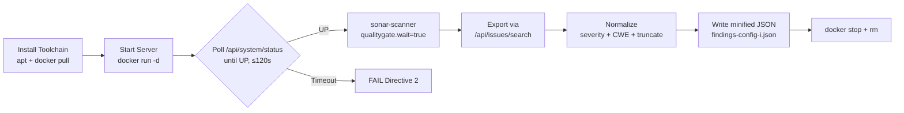

# Technical Specification

# 0. Agent Action Plan

## 0.1 Intent Clarification

### 0.1.1 Core Objective

Based on the provided requirements, the Blitzy platform understands that the objective is to execute a one-shot SonarQube Community Build static application security testing (SAST) scan of the `blitzy-cal` codebase using an ephemeral Docker-orchestrated server, then normalize the resulting issues into a flat, minified, single-line JSON artifact named `findings-config-i.json` conforming to a precise 5-field schema. This deliverable is one configuration ("Config I") in a multi-configuration security tool comparison; the schema is the comparison contract that downstream evaluators use to diff findings across tool configurations.

The requirements decompose into five discrete, sequential directives:

- **Directive 1 — Install SonarQube server and scanner:** Install the `sonar-scanner` CLI via `apt` and pull the `sonarqube:community` Docker image. Both installations must succeed before proceeding.
- **Directive 2 — Start ephemeral SonarQube server:** Launch a detached container named `sonarqube-test` bound to host port 9000. Poll the `/api/system/status` endpoint until the server reports status `UP` (≤120 seconds). Record cold-start time as a comparison metric.
- **Directive 3 — Execute sonar-scanner scan:** Invoke `sonar-scanner` with the `blitzy-cal` project key, the repository path as `sonar.sources`, the local server URL, default admin credentials, and `sonar.qualitygate.wait=true`. Record wall-clock scan duration.
- **Directive 4 — Export findings from SonarQube API:** Issue a `GET` to `/api/issues/search?componentKeys=blitzy-cal&types=VULNERABILITY,BUG&ps=500`. Record total issue count.
- **Directive 5 — Normalize findings and tear down:** Transform each issue into the 5-field schema, serialize as a single-line UTF-8 JSON array, write to `findings-config-i.json`, then `docker stop` and `docker rm` the container.

Implicit requirements surfaced from the directives, the schema, and the pass/fail criteria:

- The container lifecycle must be strictly ephemeral — created at the start of the run, destroyed before completion. No persistent volume, no restart policy, no docker-compose orchestration.
- `findings-config-i.json` must satisfy three independent validity contracts: parseable JSON, minified to exactly one line (`wc -l == 1`), every entry containing all five fields with no description exceeding 200 characters.
- The severity normalization table is non-negotiable: SonarQube `BLOCKER` and `CRITICAL` map to `critical`; `MAJOR` maps to `high`; `MINOR` maps to `medium`; `INFO` maps to `low`. The output schema permits exactly four severity values: `critical | high | medium | low`.
- CWE field population requires a two-tier strategy: first inspect the issue's `tags` array (entries of the form `cwe:NNN`) for explicit CWE references; if absent, the agent must infer the CWE from the rule description (e.g., via `GET /api/rules/show?key=<ruleKey>`).
- The description field must be the issue's `message` truncated to 200 characters maximum.
- Zero-finding handling is explicit: write the literal `[]` (a two-byte empty array) — not an empty file, not `null`.
- The `cat findings-config-i.json | wc -l` pass/fail check implies the file must end with a newline producing exactly one line in `wc`'s counting (a single newline-terminated minified JSON line).
- The 200-character truncation must be applied **after** any structural escaping in the source message, against the final user-facing string.

### 0.1.2 Task Categorization

- **Primary task type:** Tooling / Security scanning. This is a one-shot scan-and-export operation that produces output artifacts. It is **not** a bug fix, feature addition, refactor, configuration of the application, or documentation change to the codebase.
- **Secondary aspects:** Build/Deploy (Docker container lifecycle), Configuration (sonar-scanner CLI parameters), Output normalization (severity mapping + CWE inference + JSON minification).
- **Scope classification:** Isolated change. The work produces three new files (one primary deliverable plus two rule-mandated companion artifacts). No file in the `blitzy-cal` codebase is read for modification — sources are read only by `sonar-scanner` for analysis.

### 0.1.3 Special Instructions and Constraints

The user provided the following directives verbatim. These commands and pass/fail criteria are preserved exactly and must be followed without substitution unless an explicit decision log entry justifies deviation (per the Explainability rule):

**User Example — Directive 1 commands:**

```bash
apt install sonar-scanner
docker pull sonarqube:community
```

**User Example — Directive 1 pass/fail:** `sonar-scanner --version` returns a version string. `docker pull sonarqube:community` succeeds.

**User Example — Directive 2 commands:**

```bash
docker run -d --name sonarqube-test -p 9000:9000 sonarqube:community
```

Poll `/api/system/status` until status is `UP`. Record cold-start time.

**User Example — Directive 2 pass/fail:** Server responds with status `UP` within 120 seconds.

**User Example — Directive 3 commands:**

```bash
sonar-scanner \
  -Dsonar.projectKey=blitzy-cal \
  -Dsonar.sources=/path/to/blitzy-cal \
  -Dsonar.host.url=http://localhost:9000 \
  -Dsonar.login=admin \
  -Dsonar.password=admin \
  -Dsonar.qualitygate.wait=true
```

Record scan duration (wall-clock).

**User Example — Directive 3 pass/fail:** Scan completes and quality gate result is returned.

**User Example — Directive 4 commands:**

```bash
curl "http://localhost:9000/api/issues/search?componentKeys=blitzy-cal&types=VULNERABILITY,BUG&ps=500"
```

Record total issue count.

**User Example — Directive 4 pass/fail:** API returns JSON with an issues array.

**User Example — Directive 5 schema mapping table:**

| Field | Source |
| --- | --- |
| file | Issue component (relative path) |
| line | Issue line number |
| severity | blocker/critical→critical, major→high, minor→medium, info→low |
| cwe | Rule tags CWE ID. If absent, infer from rule description |
| description | Issue message, truncated to 200 characters |

**User Example — Directive 5 output shape:**

```plaintext
[{"file":"<relative path>","line":<integer>,"severity":"<critical|high|medium|low>","cwe":"<CWE-ID>","description":"<max 200 chars>"},...]
```

**User Example — Directive 5 teardown commands:**

```bash
docker stop sonarqube-test && docker rm sonarqube-test
```

**User Example — Directive 5 pass/fail:** `cat findings-config-i.json | wc -l` returns `1`. Valid JSON. Every finding has all 5 fields populated. No description exceeds 200 characters. Docker container is stopped and removed.

Additional methodological constraints inherited from user-specified rules (see §0.7):

- Every non-trivial decision MUST be documented in a Markdown decision log table (Explainability rule). Rationale must NOT be embedded as code comments.
- A self-contained reveal.js 5.1.0 HTML executive summary MUST be produced regardless of scan outcome (Executive Presentation rule).

Web search requirements: none for implementation — every command and parameter is explicitly specified by the user. Background research was used during AAP authoring to confirm SonarQube API contracts (status endpoint, issues/search shape, CWE tag conventions).

### 0.1.4 Technical Interpretation

These requirements translate to the following technical implementation strategy:

- **To install the toolchain (Directive 1)**, install `sonar-scanner` via `apt-get install -y sonar-scanner` (using non-interactive flags to prevent prompts) and pull `sonarqube:community` via `docker pull`. Verify success with `sonar-scanner --version` and `docker image inspect sonarqube:community`.
- **To start the ephemeral server (Directive 2)**, run `docker run -d --name sonarqube-test -p 9000:9000 sonarqube:community`, capture the start timestamp, then loop on `curl -s http://localhost:9000/api/system/status` parsing the `status` field of the response JSON until it equals `"UP"` or 120 seconds elapse. Record the elapsed seconds as the cold-start metric.
- **To execute the scan (Directive 3)**, invoke `sonar-scanner` with the exact flag set from the directive, substituting `/path/to/blitzy-cal` with the actual absolute repository path. The `sonar.qualitygate.wait=true` flag instructs the scanner to block until the server publishes the quality gate result. Capture start/end timestamps for the wall-clock duration metric.
- **To export findings (Directive 4)**, issue the exact `curl` request from the directive. Persist the raw response in memory or a temporary file. Note that with `ps=500` (max page size) and a project of `blitzy-cal`'s scale (~7,439 TS/JS source files), the result *may* require pagination — if the response's `paging.total > 500`, additional pages must be fetched using `&p=<n>` query parameters. Record `paging.total` as the total issue count metric.
- **To normalize and write findings (Directive 5)**, iterate over the merged `issues` array. For each issue: extract the relative path from `component` (the API returns `projectKey:relative/path/to/file.ext`; strip the leading `blitzy-cal:` to obtain a relative path); pass `line` through unchanged (default to a sensible value like `0` only if the issue is project-level and lacks a line — but flag this in the decision log); apply the severity mapping table; resolve CWE first from `tags` (entries matching `^cwe:(\d+)$` yield `CWE-<n>`) and fall back to a rule lookup; truncate the message to 200 characters; serialize the resulting array via `json.dumps(items, separators=(",", ":"), ensure_ascii=False)` so the output is minified to a single line with UTF-8 encoding; if the array is empty, write the literal string `[]`. Finally, execute `docker stop sonarqube-test && docker rm sonarqube-test`.
- **To satisfy the Explainability rule**, produce a sibling Markdown file documenting each non-trivial decision (image tag pinning vs. floating `community`, polling interval, severity-mapping table interpretation of "blocker/critical" as union, CWE inference strategy, pagination handling, description truncation point) with alternatives, rationale, and risks.
- **To satisfy the Executive Presentation rule**, produce a sibling self-contained reveal.js 5.1.0 HTML file with 12–18 slides covering: scope and methodology (1 title + 1 content), architecture (1 content with Mermaid pipeline diagram), findings summary (KPI cards), severity breakdown, CWE distribution, comparative metrics (cold-start, scan duration, total findings), risk posture, and operational readiness; all styled with the Blitzy brand palette and embedded inline CSS.

## 0.2 Repository Scope Discovery

### 0.2.1 Comprehensive File Analysis

The `blitzy-cal` repository is the Cal.com monorepo rebranded for this Blitzy initiative — the root `package.json` declares `"name": "calcom-monorepo"` and the README identifies the project as Cal.com, "The open-source Calendly successor." The repository is a Turborepo + Yarn 4.12.0 monorepo with the following first-order layout (all paths relative to repository root):

| Path | Role | Relevance to Config I |
|------|------|------------------------|
| `apps/web/**` | Next.js web application | Scan target — TypeScript/TSX |
| `apps/api/v1/**` | API v1 (Next.js) | Scan target — TypeScript |
| `apps/api/v2/**` | API v2 (NestJS) | Scan target — TypeScript |
| `apps/api/index.js` | CommonJS proxy gateway | Scan target — JavaScript |
| `packages/*/**` | 22 workspace packages (lib, prisma, ui, trpc, features, embeds, platform, etc.) | Scan targets — TypeScript |
| `packages/prisma/migrations/**` | 584 SQL migration files | Out of scanner default coverage (SQL not analyzed by community JS/TS analyzer) |
| `packages/prisma/schema.prisma` | Prisma Schema Language (3,376 lines) | Out of scanner coverage (PSL not analyzed) |
| `packages/emails/**` | Email templates (HTML/CSS + TS) | Mixed — TS scanned, HTML/CSS not |
| `agents/**`, `scripts/**`, `tools/**` | Tooling and agent scripts | Scan targets — mostly TypeScript |
| `docs/**`, `blitzy-docs/**` | Documentation (Markdown) | Not scanned by SonarQube |
| `specs/**` | Specification packets per epic | Not scanned by SonarQube |
| `__checks__/**` | Checkly synthetic checks | Scan target — TypeScript |
| `example-apps/**` | Example consumer apps | Scan target — TypeScript |
| `.github/workflows/**` | CI workflow YAML | Not scanned by default JS/TS analyzer |
| `node_modules/**`, `.yarn/**`, `.next/**`, `dist/**`, `build/**` | Build outputs and vendor dirs | Excluded from scan via sonar-scanner defaults |

Source file inventory (excluding `node_modules`, `.git`, `.yarn`, `.next`, `dist`, `build`):

- TypeScript (`.ts`): 5,718 files
- TypeScript JSX (`.tsx`): 1,678 files
- JavaScript (`.js`): 37 files
- ES modules (`.mjs`): 6 files
- Total in-scope source files for JS/TS SAST: **~7,439 files**

The scan invocation pattern `-Dsonar.sources=/path/to/blitzy-cal` instructs `sonar-scanner` to walk the entire repository tree. SonarQube Community Build's bundled language detectors will route only the `.ts/.tsx/.js/.mjs/.cjs` files to the JavaScript/TypeScript analyzer; non-source files (`.md`, `.sql`, `.html` template files, `.css`, `.yaml`) are skipped unless a community plugin is installed (none will be).

Files that may produce findings in the export but are *not* primary application code:

- `__checks__/**` (synthetic monitoring checks) — included in scope; findings here represent monitoring code quality, not production risk
- `example-apps/**` (example consumer apps) — included; findings may be considered lower priority by downstream evaluators
- `packages/app-store/**` per-integration sub-packages — included; these are 60+ third-party app integrations
- `vitest-mocks/**` (test mocks) — included; findings here are not production-impacting

No `.blitzyignore` files exist anywhere on the filesystem, so no path exclusion patterns are externally mandated. The agent may consider adding `sonar.exclusions` patterns (e.g., `**/*.test.ts,**/*.spec.ts,**/__mocks__/**,**/vitest-mocks/**`) to focus on production code; however, since the directives do **not** specify exclusions, the implementing agent should default to scanning the entire tree and document any deviation in the decision log per the Explainability rule.

### 0.2.2 Web Search Research Conducted

The following research was performed during AAP authoring to confirm SonarQube contracts and inform implementation choices. The implementing agent is not required to re-run these searches; the conclusions are codified here.

- **SonarQube Community Build editions and tags** — Docker Hub `sonarqube` official image documentation confirms `sonarqube:community` is the appropriate tag for free SAST scanning across JS/TS. The image listens on port 9000 by default and seeds admin/admin credentials on first boot.
- **Server readiness endpoint** — The `/api/system/status` endpoint returns JSON containing a `status` field that progresses through `STARTING` → `UP` (or `DOWN`/`RESTARTING` in error states). Polling for `status == "UP"` is the canonical readiness check.
- **`/api/issues/search` parameters** — `componentKeys` (the project key), `types` (comma-delimited subset of `CODE_SMELL,BUG,VULNERABILITY,SECURITY_HOTSPOT`), and `ps` (page size, max 500) are confirmed. Pagination is via `p=<n>` (1-indexed); responses include a `paging` object with `pageIndex`, `pageSize`, and `total`.
- **CWE tagging conventions** — SonarQube exposes CWE references on individual issues primarily for `VULNERABILITY`-type issues via the `tags` array (entries like `cwe:79`). The rule definition (queryable via `/api/rules/show?key=<ruleKey>`) carries a `securityStandards.CWE` array for richer mappings. For `BUG`-type issues, CWE is often not directly exposed and may need to be inferred from the rule description (HTML field on the rule object).
- **Severity vocabulary** — SonarQube severities are `BLOCKER, CRITICAL, MAJOR, MINOR, INFO`. The user's mapping table treats `BLOCKER` and `CRITICAL` as a union producing the single output value `critical`.
- **Cold-start expectations** — SonarQube Community Build on default Docker resources typically requires 30–90 seconds to reach `UP` on first boot due to embedded H2 database initialization. The 120-second budget in Directive 2 accommodates this.

### 0.2.3 Existing Infrastructure Assessment

- **Project structure:** Turborepo monorepo with `apps/` (web, api/v1, api/v2) and `packages/` (~22 workspaces). The structure is described in §3.1 of the technical specification — TypeScript 5.9.3 is the primary language, with narrow JavaScript (CommonJS) scope at `apps/api/index.js`.
- **Existing patterns and conventions:** AGENTS.md codifies three non-negotiable TypeScript constraints: no `as any` casts, no `credential.key` field access, no modification of `*.generated.ts` files. None of these are violated by this Config I task because no source modification occurs.
- **Build and deployment configurations:** `Dockerfile`, `docker-compose.yml`, `turbo.json`, `playwright.config.ts`, `checkly.config.ts`, `vitest.config.mts`, `biome.json`. None are touched by Config I.
- **Testing infrastructure present:** Vitest (unit), Playwright (E2E), Checkly (synthetic monitoring via `__checks__/`), API v2 unit test workflow. None are invoked by Config I.
- **Documentation system in use:** Mintlify (`mkdocs.yml` is a thin shim), Markdown in `docs/` and `blitzy-docs/`, specification packets in `specs/<epic>/`. The Config I executive presentation HTML is a sibling artifact, not part of the existing documentation system.
- **Existing security tooling:** `.github/workflows/security-audit.yml` runs `yarn npm audit --all --recursive` — this is dependency vulnerability scanning, not SAST. SonarQube fills a complementary niche (source code static analysis), and the Config I scan does not need to integrate with this workflow.
- **Existing decision log convention discovered:** `specs/<epic>/decisions.md` pattern (e.g., `specs/webhooks-events/decisions.md`, `specs/routing-forms/decisions.md`). The Config I decision log will use a parallel naming convention (`findings-config-i.decisions.md`) at the repository root since this is a security-tooling artifact, not an in-repo product epic.

## 0.3 Scope Boundaries

### 0.3.1 Exhaustively In Scope

The Config I work produces three new files at the repository root and consumes the entire repository tree as scanner input. No file in the `blitzy-cal` tree is opened in write mode.

**Files to create (with file patterns):**

- Output artifact files at repository root:
    - `findings-config-i.json` — primary deliverable; minified single-line JSON array
    - `findings-config-i.decisions.md` — decision log Markdown table (mandated by Explainability rule)
    - `findings-config-i.executive-summary.html` — self-contained reveal.js HTML (mandated by Executive Presentation rule)

**Operations on the local execution environment (not committed artifacts):**

- Installation of `sonar-scanner` via `apt-get install -y sonar-scanner`
- Pull of `sonarqube:community` Docker image via `docker pull`
- Creation and lifecycle management of Docker container `sonarqube-test`
- Ephemeral `.scannerwork/` cache directory written by `sonar-scanner` at the project root (gitignored by sonar-scanner convention; safe to leave or remove)
- HTTP traffic to `http://localhost:9000` for status polling and issues export

**Source tree consumed as read-only scanner input:**

- `apps/web/**/*.{ts,tsx,js,mjs,cjs}`
- `apps/api/v1/**/*.{ts,tsx,js,mjs,cjs}`
- `apps/api/v2/**/*.{ts,tsx,js,mjs,cjs}`
- `apps/api/index.js`
- `packages/**/*.{ts,tsx,js,mjs,cjs}` (excluding `node_modules`)
- `agents/**/*.ts`
- `scripts/**/*.{ts,js,mjs}`
- `__checks__/**/*.ts`
- `example-apps/**/*.{ts,tsx,js}`
- `vitest-mocks/**/*.{ts,js}`

The `-Dsonar.sources=/path/to/blitzy-cal` flag passes the entire repo as the source root; SonarQube's JS/TS analyzer auto-detects extensions and skips non-source files. The implementing agent is permitted to refine `sonar.exclusions` if necessary (e.g., to exclude generated files matching `**/*.generated.ts` or test files matching `**/*.test.{ts,tsx}`), provided any deviation from a literal scan-everything posture is documented in the decision log per the Explainability rule.

### 0.3.2 Explicitly Out of Scope

- **Any modification to existing repository files.** The user states `~0 files modified` in the prompt header. No file under `apps/`, `packages/`, `agents/`, `scripts/`, `docs/`, `blitzy-docs/`, `specs/`, `example-apps/`, `__checks__/`, `vitest-mocks/`, `deploy/`, or any other repository folder is opened in write mode.
- **Modification of repository-level configuration:** `package.json`, `yarn.lock`, `tsconfig.json`, `biome.json`, `vitest.config.mts`, `playwright.config.ts`, `checkly.config.ts`, `turbo.json`, `Dockerfile`, `docker-compose.yml`, `.dockerignore`, `.gitignore`, `.editorconfig`, `.env.example`, `.env.appStore.example`, `mkdocs.yml`, `lint-staged.config.mjs`, `i18n.json`, `i18n-unused.config.js`, `setupVitest.ts`, `app.json`, `Procfile`, `headless-routing-to-booking-flow.md`, `catalog-info.yaml`.
- **Modification of any CI workflow** under `.github/workflows/**` — Config I is an out-of-band one-shot scan, not a CI integration.
- **Persistent SonarQube infrastructure:** no docker-compose stack, no PostgreSQL backing database, no named volumes, no restart policy, no reverse proxy, no TLS, no token-based authentication setup. Default admin/admin credentials on the ephemeral H2 database are explicitly accepted by Directive 3.
- **Quality profile customization, custom rule sets, custom security rules, or plugin installation.** The scan runs against the out-of-box quality profile bundled with `sonarqube:community`.
- **Multi-language scanner coverage beyond JS/TS.** No Java, Python, Go, C#, C/C++, PHP, Kotlin, Ruby, or Swift analyzer is installed or invoked. SQL/PSL in `packages/prisma/**` is not analyzed.
- **Other configurations in the multi-config comparison** (Config II, III, IV, …). Each config produces its own `findings-config-<id>.json` and is governed by its own AAP.
- **Performance tuning of the scan**, JVM heap adjustments for SonarQube, scanner memory tuning, parallel scan execution, branch analysis, or PR analysis.
- **Triage, remediation, severity re-classification, or false-positive marking** of findings in SonarQube. The exporter must report findings as they appear in the API response, without server-side curation.
- **Findings persistence in SonarQube beyond the container lifetime.** The container is destroyed by Directive 5; the embedded H2 database goes with it. Only the normalized `findings-config-i.json` survives.
- **Long-running services left behind.** The teardown command in Directive 5 is mandatory; leaving `sonarqube-test` running fails the Directive 5 pass/fail check.

## 0.4 Dependency Inventory

### 0.4.1 Key Packages

The Config I work introduces **two runtime tooling dependencies** that live entirely outside the repository's dependency manifests. **No NPM, no Yarn workspace, no `package.json`, no `yarn.lock`, no `Dockerfile`, and no `docker-compose.yml` receives any change.**

| Registry | Package Name | Version | Purpose |
|----------|--------------|---------|---------|
| Ubuntu apt | `sonar-scanner` | Distribution-provided (whatever apt installs on the execution host; verified via `sonar-scanner --version`) | CLI client that walks `sonar.sources`, sends file analyses to the SonarQube server, and blocks on quality gate result |
| Docker Hub | `sonarqube:community` | Tag `community` (floating; resolves to current SonarQube Community Build) | Self-contained SonarQube Community Build server image with embedded H2 database and JS/TS analyzer |

Both dependencies are installed by user-supplied Directive 1 commands. The exact apt-resolved sonar-scanner version is host-dependent and is recorded in the decision log per the Explainability rule; the exact `sonarqube:community` image digest is also recorded in the decision log.

### 0.4.2 Dependency Updates

- **New dependencies to add (runtime tooling, not committed to manifests):**
    - `sonar-scanner` (apt) — required by Directive 1 to perform the analysis
    - `sonarqube:community` (Docker image) — required by Directive 1 to host the analysis server
- **Dependencies to update:** none. No package in `package.json`, no apt package on the host base image, no Docker image used in production receives a version bump.
- **Dependencies to remove:** none.
- **Import/Reference updates:** none. No source file references either tool — both are invoked exclusively from shell commands during the agent's execution and tear down before the agent completes.

## 0.5 Implementation Design

### 0.5.1 Technical Approach

The Config I implementation is a five-stage sequential pipeline. Each stage maps 1:1 to one of the user's directives. The flow is not a timeline — it is a strict topological order in which stage N+1 cannot begin until stage N's pass/fail criterion is satisfied.



**Primary objectives with implementation approach:**

- **Achieve toolchain availability by installing `sonar-scanner` and pulling `sonarqube:community`** using non-interactive apt and docker commands. Rationale: the user mandates these exact commands in Directive 1; deviating would violate Explainability without an entry. The non-interactive flags (`apt-get install -y`, `DEBIAN_FRONTEND=noninteractive`) prevent hangs in the headless execution environment.
- **Achieve a healthy ephemeral server by running the SonarQube container detached and polling `/api/system/status`** with a small fixed interval (e.g., 2 seconds) and recording the elapsed wall-clock time when `status == "UP"` first appears in the response. Rationale: 120-second budget per Directive 2 allows roughly 60 polls at 2-second cadence — sufficient resolution for cold-start metric reporting without saturating the local network.
- **Achieve a complete scan by invoking `sonar-scanner` with the exact CLI shape from Directive 3** and capturing wall-clock duration. Rationale: `sonar.qualitygate.wait=true` ensures the scanner does not return until the server has finished post-processing and published the gate result — this guarantees `/api/issues/search` will return the final issue set.
- **Achieve a complete findings dataset by exporting from `/api/issues/search`** with handling for pagination when `paging.total > 500`. Rationale: although Directive 4 specifies `ps=500`, the user's pass/fail criterion is "JSON with an issues array" — any incomplete export risks downstream comparison error. The agent must iterate `p=1, p=2, ...` until all pages are collected.
- **Achieve schema compliance by mapping each issue through the 5-field transform** with severity normalization, CWE resolution, and 200-character truncation, then minify and write. Rationale: the schema is the comparison contract; non-conforming entries break the multi-config diff.
- **Achieve teardown by running `docker stop sonarqube-test && docker rm sonarqube-test`** unconditionally before agent completion. Rationale: a running container after termination fails the Directive 5 pass/fail criterion ("Docker container is stopped and removed").
- **Achieve Explainability compliance by writing a Markdown decision log** capturing every non-trivial choice (see §0.5.5). Rationale: required by the Explainability rule.
- **Achieve Executive Presentation compliance by writing a self-contained reveal.js HTML** with 12–18 slides for non-technical leadership. Rationale: required by the Executive Presentation rule.

**Logical implementation flow (NOT a timeline):**

- First, establish the toolchain foundation by installing `sonar-scanner` (apt) and pulling `sonarqube:community` (docker).
- Next, establish the ephemeral analysis server by running the container, polling its readiness endpoint, and verifying status `UP`.
- Then, execute the analysis by invoking `sonar-scanner` against the repository sources with quality-gate wait enabled.
- After the scan completes, extract the findings by paginating through `/api/issues/search` until exhausted.
- Then, normalize each finding to the 5-field schema, minify the resulting JSON array, and write to `findings-config-i.json`.
- Then, produce the Explainability decision log as a sibling Markdown file.
- Then, produce the Executive Presentation reveal.js HTML as a sibling file.
- Finally, ensure cleanliness by stopping and removing the container.

### 0.5.2 Component Impact Analysis

- **Direct modifications required:** none. No file in the `blitzy-cal` source tree is modified.
- **Indirect impacts and dependencies:**
    - Local Docker daemon: receives one image pull and one container lifecycle (create, start, stop, remove).
    - Host filesystem: receives `.scannerwork/` cache directory written by `sonar-scanner` at the repository root. This directory is local-only and not tracked.
    - Local network: port 9000 must be free on the host for the container's port mapping. The agent should verify availability before `docker run` and fail fast with a clear error if 9000 is occupied.
- **New components introduction:** three deliverable files at the repository root (see §0.6).

### 0.5.3 User Interface Design

Not applicable. Config I has no UI surface; the deliverables are a JSON data artifact, a Markdown document, and an HTML executive summary. The reveal.js HTML is a self-contained presentation, not a UI integrated with the `blitzy-cal` application.

### 0.5.4 User-Provided Examples Integration

The user provided five complete shell-command examples (Directives 1–5) and one tabular field-mapping example (Directive 5 schema table) and one literal output-shape example (Directive 5 JSON pattern). All are preserved verbatim in §0.1.3 and §0.8.

- **The user's example `apt install sonar-scanner` and `docker pull sonarqube:community`** are executed exactly as written in Directive 1, with the agent adding `-y`/`--yes` flags where required for non-interactive operation (this is a clarification, not a deviation, since interactive prompts would fail in the headless environment — but it is recorded in the decision log).
- **The user's example `docker run -d --name sonarqube-test -p 9000:9000 sonarqube:community`** is executed exactly as written in Directive 2.
- **The user's example `sonar-scanner ...` command** is executed with `/path/to/blitzy-cal` substituted by the actual absolute path to the repository root (the only legitimate substitution the directive permits).
- **The user's example `curl "http://localhost:9000/api/issues/search?componentKeys=blitzy-cal&types=VULNERABILITY,BUG&ps=500"`** is executed exactly as written in Directive 4, with the agent issuing additional paginated requests (`&p=2`, `&p=3`, ...) if `paging.total > paging.pageSize`. The decision log documents the pagination expansion.
- **The user's example severity mapping table is implemented as a literal lookup** during normalization. No re-interpretation, no synonym matching.
- **The user's example output shape** is the literal serialization target; the JSON serializer is configured with `separators=(",", ":")` and no indentation so the produced bytes match the shape verbatim (modulo escape encoding for special characters in description strings).
- **The user's example `docker stop sonarqube-test && docker rm sonarqube-test`** is executed exactly as written before agent completion.

### 0.5.5 Critical Implementation Details

- **Severity mapping is implemented as a frozen lookup table** keyed on the uppercase SonarQube severity, returning the lowercase Config I severity. `BLOCKER → critical, CRITICAL → critical, MAJOR → high, MINOR → medium, INFO → low`. An unrecognized severity (e.g., a future-added value) must trigger an explicit error and a decision log entry — silent fallback is forbidden.
- **CWE resolution is implemented as a two-tier strategy.** Tier 1: scan the issue's `tags` array for entries matching `^cwe:(\d+)$`; if found, output `CWE-<n>` (first match wins; document the choice in the decision log). Tier 2: if no tag matches, issue `GET /api/rules/show?key=<issue.rule>` and inspect the rule's `htmlDesc` field for a CWE reference, then output `CWE-<n>` from the extracted number. If both tiers fail, the implementing agent records the rule key, message, and falls back to `CWE-Unknown` in the field — and creates a decision log entry explicitly listing every issue that received this fallback so downstream evaluators can audit. The field is never empty (the pass/fail check requires all 5 fields populated).
- **File path normalization:** SonarQube returns `component` in the form `<projectKey>:<relative/path/to/file>`. The agent strips the `blitzy-cal:` prefix (project key from `-Dsonar.projectKey=blitzy-cal`) to obtain a forward-slash-separated repository-relative path. Project-level issues without a file component (e.g., quality gate findings) are excluded from the export because the schema requires a `file` field; this exclusion is documented in the decision log.
- **Line handling:** SonarQube returns `line` as an integer or omits it for file-level issues. When omitted, the agent emits `0` for the `line` field to satisfy the schema's integer requirement; this convention is documented in the decision log.
- **Description truncation** is applied at exactly 200 characters using Python string slicing `message[:200]` (or equivalent). Truncation is byte-agnostic at the character level — multi-byte UTF-8 characters are not split mid-codepoint. The agent does not append an ellipsis; the schema's "max 200 chars" pass/fail check is strict.
- **JSON minification** uses `json.dumps(data, separators=(",", ":"), ensure_ascii=False)` (or equivalent in another language). Crucially, `ensure_ascii=False` is required so that UTF-8 characters in messages are preserved as native bytes (Encoding: UTF-8 per Directive 5) rather than escaped as `\uXXXX`. The file is written in binary mode with a trailing newline — the trailing newline produces `wc -l == 1` for the pass/fail check.
- **Empty result handling:** if the merged issues array is empty, the output is the literal two-byte string `[]` followed by a newline. No `null`, no whitespace-only file.
- **Pagination ceiling:** the agent collects all pages until either `pageIndex * pageSize >= total` or the response returns an empty `issues` array. A hard cap of 100 pages (50,000 issues) is enforced to guard against runaway loops; reaching the cap is treated as an error and logged.
- **Cold-start polling cadence:** the agent polls every 2 seconds after a 5-second initial delay, capturing wall-clock elapsed time from `docker run` completion to first observation of `status == "UP"`. The cadence and budget are documented in the decision log.
- **Wall-clock scan duration** is measured from `sonar-scanner` invocation to its zero exit, recorded in seconds with millisecond precision.
- **Total issue count** is the final `paging.total` value, captured after pagination completes.
- **Error handling:** if any directive fails its pass/fail criterion, the agent must (a) attempt teardown (`docker stop sonarqube-test; docker rm sonarqube-test`), (b) write the decision log and executive presentation with whatever data was collected (including a clear "scan did not complete" disclosure), and (c) exit non-zero. The Explainability rule's coverage extends to failure modes — unexplained failures are defects.
- **Port availability:** the agent verifies `lsof -i :9000` (or `ss -ltn 'sport = :9000'`) shows the port is free before `docker run`. If occupied, fail fast and record the conflict.
- **Container name collision:** if a container named `sonarqube-test` already exists, the agent issues `docker rm -f sonarqube-test` first to ensure a clean slate. This pre-run cleanup is recorded in the decision log because Directive 2 does not specify it.
- **Decision log scope (Explainability rule):** entries are required for at minimum: image-tag pinning posture (floating `community` vs. immutable digest), polling cadence and budget, CWE inference fallback strategy, file path prefix stripping, line-field omission handling, pagination implementation, description truncation point, severity mapping interpretation of "blocker/critical" as a union, pre-run container collision cleanup, exclusion list (if any beyond defaults), and any deviation between executed commands and the user's literal examples.
- **Executive Presentation slide composition (Executive Presentation rule):** 16 slides targeted, distributed as: 1 Title (`slide-title`), 1 Content (findings KPI summary with `kpi-grid`), 1 Content (architecture overview with Mermaid pipeline diagram), 1 Section Divider (`slide-divider`, "Methodology"), 1 Content (scan parameters table), 1 Section Divider ("Findings"), 2 Content (severity breakdown chart, CWE distribution), 1 Section Divider ("Risk Posture"), 1 Content (high-severity highlights with Lucide icons), 1 Section Divider ("Operational Readiness"), 1 Content (next steps for human reviewers), 1 Content (cold-start / scan duration / total issues KPI cards), 1 Section Divider ("Comparison Context"), 1 Content (this is Config I, future configs to come), 1 Closing (`slide-closing`, key takeaway). Every slide contains at least one non-text visual; Mermaid is rendered via `pre.mermaid` blocks with `mermaid.run()` called on the reveal.js `ready` event and on every `slidechanged` event; Lucide icons are inserted via `<i data-lucide="...">` and refreshed with `lucide.createIcons()` on the same events. CDN versions pinned: reveal.js 5.1.0, Mermaid 11.4.0, Lucide 0.460.0. The Blitzy brand palette and full CSS custom properties block are embedded inline in a `<style>` tag.

## 0.6 File Transformation Mapping

### 0.6.1 File-by-File Execution Plan

The Config I work produces exactly three new files at the repository root. No file in the existing tree is modified, deleted, or referenced as a template — every deliverable is net-new with a schema or formatting contract supplied by the user's directives or rules.

| Target File | Transformation | Source File/Reference | Purpose/Changes |
|-------------|----------------|----------------------|-----------------|
| `findings-config-i.json` | CREATE | (no source — schema specified by user Directive 5) | Minified single-line UTF-8 JSON array. Each entry has 5 fields: `file` (string, repository-relative path stripped of `blitzy-cal:` project key prefix), `line` (integer, `0` when issue is file-level), `severity` (one of `critical`, `high`, `medium`, `low` mapped from SonarQube's `BLOCKER/CRITICAL/MAJOR/MINOR/INFO`), `cwe` (string of form `CWE-<n>` from `tags` array, with rule description fallback, and `CWE-Unknown` if both fail), `description` (issue `message` truncated at 200 characters). Empty result writes `[]`. Trailing newline produces `wc -l == 1`. |
| `findings-config-i.decisions.md` | CREATE | (no source — required by Explainability rule) | Markdown decision log table. Columns: Decision, Alternatives Considered, Rationale, Risks. Required entries: image tag pinning posture, polling cadence (2-second interval / 120-second budget), CWE inference fallback strategy, file path prefix stripping, line-field omission handling (`0` substitution), pagination implementation, description truncation point (200-char hard cap, no ellipsis), severity union interpretation (blocker ∪ critical → critical), pre-run container collision cleanup, scan exclusions (if any), and any deviation from literal Directive commands. |
| `findings-config-i.executive-summary.html` | CREATE | (no source — required by Executive Presentation rule) | Single self-contained reveal.js 5.1.0 HTML file. 12–18 `<section>` elements (target 16); CDN-pinned reveal.js 5.1.0, Mermaid 11.4.0, Lucide 0.460.0; embedded inline CSS with Blitzy brand custom properties; four slide-type classes (`slide-title`, `slide-divider`, default content, `slide-closing`); every slide contains at least one non-text visual (Mermaid diagram, KPI card grid, styled table, or Lucide SVG icon); zero emoji; no fenced code blocks; Inter / Space Grotesk / Fira Code typography via Google Fonts `<link>`. |

### 0.6.2 New Files Detail

- **`findings-config-i.json`** — primary deliverable file
    - Content type: data artifact (JSON array)
    - Based on: user Directive 5 schema mapping table and output-shape literal
    - Encoding: UTF-8
    - Format: minified, single line, trailing newline
    - Empty-state form: `[]\n`
    - Validation gates: `python3 -c "import json,sys; json.load(open('findings-config-i.json'))"` succeeds; `wc -l findings-config-i.json` returns `1`; every entry has exactly the keys `file, line, severity, cwe, description`; no `description` value exceeds 200 characters.

- **`findings-config-i.decisions.md`** — Explainability rule compliance artifact
    - Content type: Markdown documentation
    - Based on: Explainability rule from user-specified implementation rules
    - Structure: opening paragraph summarizing the configuration, then a Markdown table with columns "Decision", "Alternatives Considered", "Rationale", "Risks"
    - Required minimum entries:
        - Image tag selection (`sonarqube:community` floating vs. immutable digest)
        - Cold-start polling cadence (2-second interval over 120-second budget)
        - Severity mapping union interpretation (BLOCKER and CRITICAL both → `critical`)
        - CWE resolution two-tier strategy (tags array first, then rule description)
        - CWE fallback value when both tiers fail (`CWE-Unknown`)
        - File path prefix stripping (`<projectKey>:` removal)
        - Line-field omission handling (substitute `0`)
        - Description truncation behavior (200-char hard cap, no ellipsis suffix)
        - Pagination ceiling (100 pages, ~50,000 issues)
        - Pre-run container collision cleanup (`docker rm -f sonarqube-test` if exists)
        - Apt non-interactive flag addition (`-y`) — clarification vs. user example
        - Whether `sonar.exclusions` is applied (and if so, the patterns and reasoning)
        - Any other deviation from a literal or obvious interpretation of the directives

- **`findings-config-i.executive-summary.html`** — Executive Presentation rule compliance artifact
    - Content type: self-contained HTML presentation
    - Based on: Executive Presentation rule from user-specified implementation rules
    - Slide count: 12–18 (target 16)
    - Slide composition (target distribution):
        - 1 × Title slide (`slide-title`): "blitzy-cal Security Scan — Config I", project + scope + audience framing, hero gradient background, Fira Code eyebrow text
        - 1 × Content: Headline KPIs (total findings, severity breakdown, scan duration) as `kpi-grid` cards
        - 1 × Content: Architecture overview as Mermaid `graph LR` showing the 5-stage pipeline
        - 1 × Section Divider (`slide-divider`): "Methodology"
        - 1 × Content: scan parameters table (project key, sources path, quality gate, page size)
        - 1 × Section Divider: "Findings"
        - 1 × Content: severity distribution (KPI cards or styled bar visual)
        - 1 × Content: CWE distribution (styled table of top CWEs)
        - 1 × Section Divider: "Risk Posture"
        - 1 × Content: high-severity findings highlights with Lucide icons
        - 1 × Section Divider: "Operational Readiness"
        - 1 × Content: next steps for human reviewers
        - 1 × Content: comparison metrics (cold-start time, scan duration, total findings)
        - 1 × Section Divider: "Comparison Context"
        - 1 × Content: this is Config I in a multi-config comparison; future configs to come
        - 1 × Closing slide (`slide-closing`): key takeaway, brand lockup, gradient accent bar
    - Technical constraints per rule:
        - reveal.js config: `hash: true`, `transition: 'slide'`, `controlsTutorial: false`, `width: 1920`, `height: 1080`
        - Mermaid: `startOnLoad: false`; call `mermaid.run()` after reveal.js `ready` and on every `slidechanged`
        - Mermaid theme variables: `primaryColor: '#F2F0FE'`, `primaryTextColor: '#333333'`, `primaryBorderColor: '#5B39F3'`, `lineColor: '#999999'`, `secondaryColor: '#F4EFF6'`
        - Lucide: call `lucide.createIcons()` after `ready` and on every `slidechanged`
        - Brand palette CSS custom properties embedded inline (full set as per rule)
        - Typography: Inter (body 400/500/600/700), Space Grotesk (display 500/600/700), Fira Code (mono/eyebrow 400/500) loaded via Google Fonts `<link>`
    - Validation gates: HTML opens in a browser, renders all Mermaid diagrams and Lucide icons, contains 12–18 `<section>` elements, every `<section>` contains at least one non-text visual element.

### 0.6.3 Files to Modify Detail

None. Zero files in the `blitzy-cal` source tree are modified.

### 0.6.4 Configuration and Documentation Updates

- **Configuration changes:** none. No `package.json`, `tsconfig.json`, `biome.json`, `vitest.config.mts`, `playwright.config.ts`, `checkly.config.ts`, `turbo.json`, `Dockerfile`, `docker-compose.yml`, or `.env*` file is touched.
- **Documentation updates:** none in the existing `docs/`, `blitzy-docs/`, or `specs/` trees. The three Config I deliverables are sibling artifacts at the repository root; they are not integrated into the existing documentation system.
- **Cross-references to update:** none.

### 0.6.5 Cross-File Dependencies

- The decision log (`findings-config-i.decisions.md`) references the same scan run as `findings-config-i.json` — entries should be authored after the scan completes so the cold-start time, scan duration, total issue count, and any concrete fallback choices are known with certainty.
- The executive presentation (`findings-config-i.executive-summary.html`) references the same scan run — KPI values (total findings, severity counts, top CWEs, cold-start time, scan duration) must be sourced from the same `findings-config-i.json` and the same execution-time metrics that are recorded in the decision log.
- All three files are mutually-consistent snapshots of a single scan execution. If a retry is necessary (e.g., quality gate timeout, port conflict, image-pull failure), all three files are regenerated together to maintain consistency.

## 0.7 Rules

### 0.7.1 User-Specified Implementation Rules

Two rules are provided in the user's input. Both apply unconditionally to this Config I task and govern deliverables beyond the primary scan output.

**Rule 1 — Explainability (verbatim from user input):**

> Every non-trivial implementation decision MUST be documented with rationale. A decision is non-trivial if a competent engineer could reasonably have chosen differently.
>
> Deliver a decision log as a Markdown table: what was decided, what alternatives existed, why this choice was made, and what risks it carries. For migrations or refactors, include a bidirectional traceability matrix mapping source constructs to target implementations — 100% coverage, no gaps.
>
> Any deviation from a literal or obvious interpretation of the requirements MUST have an explicit entry in the decision log. Unexplained deviations are treated as defects.
>
> Do not embed rationale in code comments. The decision log is the single source of truth for "why" decisions.

Concrete application to Config I:

- The decision log is `findings-config-i.decisions.md` at the repository root (per §0.6.1).
- The table columns are `Decision`, `Alternatives Considered`, `Rationale`, `Risks` — matching the rule's enumeration.
- The bidirectional traceability matrix clause does not apply (this is not a migration or refactor); however, every directive-to-implementation mapping is still expected as a row in the decision log.
- The "no rationale in code comments" clause has limited surface area here because no production code is written; however, any shell scripts, inline `python -c` snippets, or temporary helper code generated during execution must not carry rationale comments — that rationale belongs in the decision log.

**Rule 2 — Executive Presentation (verbatim from user input):**

> Every deliverable MUST include an executive summary as a single self-contained reveal.js HTML file that is ALWAYS included independent of any other documentation that exists. The audience is non-technical leadership — communicate business value, risk, and operational readiness without requiring code literacy.
>
> The presentation MUST cover: (1) What was done — scope of work and deliverables; (2) Why it was done — business value unlocked; (3) What changed architecturally — component/data-flow diagrams; (4) What risks exist and how they are mitigated; (5) How the team onboards and continues development.
>
> Slide constraints: 12–18 slides total (target: 16); four slide types — Title (`slide-title`), Section Divider (`slide-divider`), Content (default), Closing (`slide-closing`); every slide MUST include at least one non-text visual element (Mermaid diagram, KPI card, styled table, or Lucide SVG icon); content slides — max 4 bullets, max 40 words body text, min 1 non-text visual; zero emoji — use Lucide SVG icons via `<i data-lucide="icon-name"></i>` only; no fenced code blocks inside slides — use inline Fira Code for short expressions only.
>
> Visual identity (Blitzy brand): color palette `#5B39F3` (primary), `#2D1C77` (dark), `#94FAD5` (teal accent), `#1A105F` (navy), `#7A6DEC`/`#4101DB` (gradient stops), neutrals `#333333, #999999, #D9D9D9, #F4EFF6, #F5F5F5, #FFFFFF`; typography — Inter (body, 400/500/600/700), Space Grotesk (display headings, 500/600/700), Fira Code (mono/eyebrows, 400/500) loaded via Google Fonts `<link>`; title slide hero gradient `linear-gradient(68deg, #7A6DEC 15.56%, #5B39F3 62.74%, #4101DB 84.44%)`; dividers — dark purple `#2D1C77` or gradient, centered heading, thematic Lucide icon; closing — navy `#1A105F` background, 3–6 word takeaway, max 3 bullets, brand lockup, gradient accent bar.
>
> Mermaid: embed as `<pre class="mermaid">` with raw syntax; initialize with `startOnLoad: false`; call `mermaid.run()` after reveal.js `ready` and on every `slidechanged`; theme variables `primaryColor: '#F2F0FE'`, `primaryTextColor: '#333333'`, `primaryBorderColor: '#5B39F3'`, `lineColor: '#999999'`, `secondaryColor: '#F4EFF6'`.
>
> Technical delivery: single self-contained HTML file, no build steps, no local file dependencies; CDN versions pinned reveal.js 5.1.0, Mermaid 11.4.0, Lucide 0.460.0; reveal.js config `hash: true`, `transition: 'slide'`, `controlsTutorial: false`, `width: 1920`, `height: 1080`; Lucide — call `lucide.createIcons()` after `ready` and on every `slidechanged`.
>
> Inline CSS: embed the full Blitzy reveal.js theme inline in a `<style>` tag with the required CSS custom properties (full block in the user-supplied rule).
>
> Slide ordering convention: (1) Title — project name, scope, audience framing; (2) Content — headline findings or KPI summary; (3) Content — architecture overview (Mermaid diagram); (4..N) Alternating Section Dividers + Content Slides for each major topic; (N+1) Closing — key takeaway, next steps, brand lockup.
>
> Verification: HTML opens in a browser, renders all Mermaid diagrams and Lucide icons, contains 12–18 `<section>` elements, every `<section>` contains at least one non-text visual element.

Concrete application to Config I:

- The presentation is `findings-config-i.executive-summary.html` at the repository root (per §0.6.1).
- The five required coverage areas (What/Why/What changed/Risks/How team onboards) map to the slide composition described in §0.5.5 and §0.6.2: scope → title + KPI slides; business value → comparison-context slide; architectural change → pipeline Mermaid; risks → severity / CWE distribution + high-severity highlights; team onboarding → operational readiness + next steps.
- The rule references a canonical theme file at `blitzy-deck/references/blitzy-reveal-theme.css`; this directory does **not** exist in the `blitzy-cal` repository. Per the rule's "single self-contained HTML file, no local file dependencies" clause, the full theme block (every CSS custom property and every slide-type class) is embedded inline in the `<style>` tag rather than `<link>`-referenced. This is consistent with the rule's intent and is documented in the decision log.

### 0.7.2 Task-Specific Constraints

The user's prompt header asserts the following execution-level constraints, preserved verbatim:

- **"`[5 directives | ~0 files modified | 1 new file]`"** — the directive count fixes the scan workflow shape, the "0 files modified" clause forbids touching the codebase, the "1 new file" count refers to the primary scanning deliverable (`findings-config-i.json`). The two additional rule-mandated files (decision log + executive presentation) are companion artifacts that are not counted in the user's "1 new file" figure because they apply to *every* Blitzy task regardless of scope.
- **"This is one config in a multi-config security tool comparison."** — output schema is fixed and must be diff-able across configs; the agent must not embellish, re-order, or inject additional fields beyond the 5 specified.
- **Exact command preservation** — Directive commands are User Examples (per §0.1.3) and must be executed as written, with only the documented substitutions (`/path/to/blitzy-cal` → actual absolute path; `&p=N` pagination expansion in Directive 4 when warranted). Any other deviation requires a decision log entry.

## 0.8 Special Instructions

### 0.8.1 Special Execution Instructions

- **Process scope:** scan-and-export only. No remediation, no PR filing, no triage. No SonarQube quality profile customization. No persistent SonarQube infrastructure. No CI workflow integration.
- **Tool inventory:** the only tools invoked are `apt`, `docker`, `sonar-scanner`, `curl`, and a JSON-capable scripting environment (Python is available in the execution environment per the environment inspection in Phase 1). No Java runtime, no Maven, no Gradle is required for this configuration because SonarQube Community Build bundles its own JRE inside the Docker image and the scan target is JavaScript/TypeScript.
- **Quality and style requirements:** the output JSON's schema is the user-supplied 5-field shape. Whitespace, field ordering, and escaping conventions are determined by the JSON serializer with `separators=(",", ":")` and `ensure_ascii=False` for UTF-8 preservation. The output ends with a single newline so `wc -l` reports `1`.
- **Code review or approval requirements:** none specified. The deliverable JSON, decision log, and executive presentation are the review surface.
- **Deployment or rollout considerations:** none. Nothing about Config I deploys to any environment. The container lives for the duration of the agent run and is destroyed.

### 0.8.2 Constraints and Boundaries

**Technical constraints from the directives:**

- Docker image: exactly `sonarqube:community` (no edition substitution).
- Container name: exactly `sonarqube-test` (the teardown command depends on this name).
- Host port: exactly `9000` (the curl URLs in Directives 2 and 4 depend on this port).
- Container detachment: `-d` flag required (the agent must continue past `docker run`).
- Scanner project key: exactly `blitzy-cal` (the curl `componentKeys` parameter in Directive 4 depends on this value).
- Scanner authentication: `-Dsonar.login=admin -Dsonar.password=admin` (default ephemeral credentials).
- Quality gate wait: `-Dsonar.qualitygate.wait=true` (blocks the scanner until findings are queryable).
- Issues query types filter: exactly `VULNERABILITY,BUG` (no `CODE_SMELL`, no `SECURITY_HOTSPOT`).
- Page size: `ps=500` (the API maximum).
- Severity mapping table: exact union of `BLOCKER ∪ CRITICAL → critical`, `MAJOR → high`, `MINOR → medium`, `INFO → low`.
- Description truncation: 200 characters maximum, no ellipsis.
- File encoding: UTF-8.
- File shape: single-line minified JSON array.
- Empty-result form: `[]`.
- Teardown: both `docker stop` AND `docker rm` of `sonarqube-test` are required.

**Process constraints from the directives:**

- Strict directive order: 1 → 2 → 3 → 4 → 5 (no parallelization, no reordering).
- Each directive's pass/fail criterion is a gate — failure halts the pipeline and triggers teardown.
- Cold-start budget: ≤120 seconds for status `UP`.
- Scan duration and total issue count must be recorded for the comparison.

**Output constraints from the directives and rules:**

- Exactly three new files are produced: `findings-config-i.json`, `findings-config-i.decisions.md`, `findings-config-i.executive-summary.html`.
- The JSON contains only the 5 fields per entry — no extra fields, no nested objects.
- The Markdown contains a Decision/Alternatives/Rationale/Risks table per Explainability rule.
- The HTML contains 12–18 `<section>` elements with the Blitzy brand styling per Executive Presentation rule.

**Compatibility requirements:**

- No backward compatibility constraint applies (this is a net-new tooling deliverable; nothing depends on it yet).
- The JSON shape must be diff-stable across the multi-config comparison; the schema is the inter-config contract.

### 0.8.3 Pass/Fail Validation Criteria

All five directives' pass/fail clauses are preserved verbatim from the user's input:

- **Directive 1:** `sonar-scanner --version` returns a version string. `docker pull sonarqube:community` succeeds.
- **Directive 2:** Server responds with status `UP` within 120 seconds.
- **Directive 3:** Scan completes and quality gate result is returned.
- **Directive 4:** API returns JSON with an issues array.
- **Directive 5:** `cat findings-config-i.json | wc -l` returns `1`. Valid JSON. Every finding has all 5 fields populated. No description exceeds 200 characters. Docker container is stopped and removed.

Rule-driven validation gates additional to the directives:

- **Explainability rule:** `findings-config-i.decisions.md` exists and contains a Markdown table whose header row matches `| Decision | Alternatives Considered | Rationale | Risks |` (or close semantic equivalent). Every non-trivial choice enumerated in §0.5.5 is represented as a row.
- **Executive Presentation rule:** `findings-config-i.executive-summary.html` opens in a modern browser, renders all Mermaid diagrams and Lucide icons, contains 12–18 `<section>` elements, every `<section>` contains at least one non-text visual element, and the CDN URLs reference exactly reveal.js 5.1.0, Mermaid 11.4.0, and Lucide 0.460.0.

## 0.9 References

### 0.9.1 Citation Index

Every claim in this AAP about the existing system is grounded in one of the locations below. Citations are written `[<path>:<locator>]` where the locator is a line range, section, or key path as appropriate. Inferred claims that cannot be grounded to a single source are flagged `[inferred — no direct source]`.

- The project's monorepo identity (`calcom-monorepo`) and workspace layout — `[package.json:name, workspaces]`
- Yarn 4.12.0 packageManager — `[package.json:packageManager]`
- Node/yarn engines requirement — `[package.json:engines]`
- TypeScript 5.9.3 primary language with three supporting languages in narrow contexts — `[Tech Spec §3.1.1]`
- Cal.com identity statement "The open-source Calendly successor" — `[README.md:L1-L20]`
- Existing security scanning workflow uses `yarn npm audit`, not SAST — `[.github/workflows/security-audit.yml:L1-L20]`
- AGENTS.md TypeScript invariants (no `as any`, no `credential.key`, no `*.generated.ts` modification) — `[AGENTS.md, cited via Tech Spec §3.1.2]`
- The Calendly Parity Gap Closure Initiative context, project completion metrics, deliverable history — `[Tech Spec §1.1.1, §1.1.4]`
- Existing decision log convention `specs/<epic>/decisions.md` — `[specs/webhooks-events/decisions.md, specs/routing-forms/decisions.md, specs/admin-teams/decisions.md, specs/embed-share/decisions.md, specs/event-types/decisions.md, specs/calendar-integrations/decisions.md, specs/notifications-workflows/decisions.md, specs/_templates/decisions.md]`
- No `.blitzyignore` file exists anywhere on the filesystem — `[inferred — find / -name ".blitzyignore" returned no results]`
- No existing SonarQube configuration (`sonar-project.properties`, `.scannerwork/`, prior `findings-config-*.json`) — `[inferred — find scan returned no matches]`
- Source file inventory counts (5,718 .ts, 1,678 .tsx, 37 .js, 6 .mjs, 322 .json, 594 .sql, 423 .md, etc.) — `[inferred — bash find aggregation against the working tree]`
- SonarQube Community Build `/api/system/status` endpoint contract returning `UP` — confirmed by SonarQube documentation web search (Docker Hub sonarqube official image and SonarQube Community Build installation overview)
- SonarQube `/api/issues/search` parameters (`componentKeys`, `types`, `ps`, `p`) — confirmed by SonarQube Server Web API documentation web search
- SonarQube severity vocabulary (BLOCKER, CRITICAL, MAJOR, MINOR, INFO) — confirmed by SonarQube community forum web search
- Default admin/admin credentials on first boot — confirmed by SonarQube Community Build installation overview
- Port 9000 default — confirmed by Docker Hub sonarqube image documentation

### 0.9.2 Attachments and Supplementary Materials

- **User-attached files:** none. The user attached 0 environments to this project; `/tmp/environments_files/` does not exist.
- **User-attached environment variables:** none (`[]`).
- **User-attached secrets:** none (`[]`).
- **Figma references:** none. No design surface is in scope for Config I.
- **User-supplied URLs:** none beyond the implicit references to local `http://localhost:9000/...` endpoints in the directive shell commands.

### 0.9.3 Search Log Appendix

The following file and folder retrievals were performed during AAP authoring. Paths are repository-relative unless otherwise noted.

| Operation | Target | Purpose |
|-----------|--------|---------|
| `bash` inspection | `/tmp/blitzy/blitzy-cal/config-i_3c5818` (repository root) | Confirm repository path and existence |
| `bash` inspection | Root directory listing | Catalog top-level structure (apps/, packages/, agents/, scripts/, docs/, etc.) |
| `bash` find | `**/.blitzyignore` | Confirm no ignore patterns exist (none found) |
| `bash` find | `**/sonar-project.properties`, `**/findings-config-*.json`, `**/*.sarif` | Confirm no prior scanning artifacts exist (none found) |
| `bash` aggregation | File counts by extension (`.ts`, `.tsx`, `.js`, `.mjs`, `.json`, `.yaml`, `.yml`, `.md`, `.html`, `.css`, `.sql`, `.sh`) | Establish source file inventory |
| `read_file` | `README.md` (head) | Confirm Cal.com identity |
| `read_file` | `package.json` (key fields via Python JSON parse) | Confirm monorepo workspaces, engines, packageManager, TypeScript version |
| `read_file` | `SECURITY.md` (head) | Confirm no conflict with existing security-disclosure conventions |
| `read_file` | `.github/workflows/security-audit.yml` | Confirm existing CI security tooling is dependency-only, not SAST |
| `bash` directory listing | `apps/`, `packages/`, `blitzy-docs/`, `blitzy/`, `.github/workflows/` | Catalog workspace and infrastructure folders |
| `bash` find | `blitzy-deck`, `blitzy-reveal-theme.css` | Confirm the canonical theme file referenced by the Executive Presentation rule does NOT exist in this repository (justifies embedding inline) |
| `bash` find | `**/*decisions*.md` | Catalog existing decision log convention (`specs/<epic>/decisions.md`) |
| `get_tech_spec_section` | "1.1 EXECUTIVE SUMMARY" | Establish project context (Calendly Parity Gap Closure Initiative) |
| `get_tech_spec_section` | "3.1 PROGRAMMING LANGUAGES" | Confirm TypeScript 5.9.3 primary, JS narrow, SQL/PSL, HTML/CSS |
| `web_search` | "SonarQube REST API issues search componentKeys CWE tags response format" | Confirm `/api/issues/search` contract and CWE tag conventions |
| `web_search` | "SonarQube Community Edition Docker image system status endpoint UP polling" | Confirm `/api/system/status` health check semantics and default port/credentials |

### 0.9.4 Frame Inventory and Asset Metadata

- **Figma frames:** none. No Figma URL or screen reference is provided in the user input.
- **Image/asset attachments:** none. The repository contains `blitzy/screenshots/` (event type management screenshots), but these are unrelated to Config I and out of scope.

