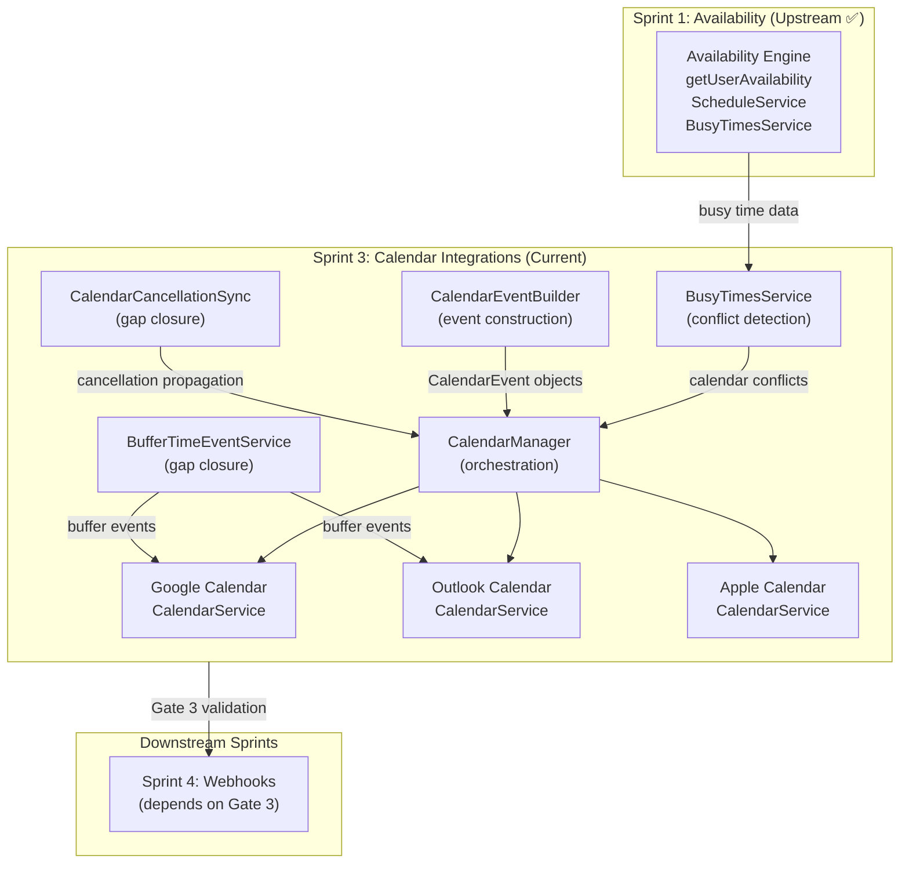

# Technical Specification

# 0. Agent Action Plan

## 0.1 Intent Clarification

### 0.1.1 Core Feature Objective

Based on the prompt, the Blitzy platform understands that the new feature requirement is to **complete Sprint 3: Calendar Integrations (F-003)** of the Calendly gap closure initiative for Cal.com. This sprint targets behavioral parity between Cal.com's calendar integration subsystem and Calendly's native calendar connections across Google Calendar, Outlook/Office 365, and Apple Calendar/iCloud.

The sprint roadmap defines Sprint 3 as one of three foundational sprints (blue tier), with a direct dependency on Sprint 1 (Availability & Scheduling) having already passed Gate 1. The sprint encompasses five cataloged epics from the Epic Catalog:

- **CI-001** — Google Calendar sync behavioral parity (Priority: Medium, Complexity: M) — Ensure `GoogleCalendarService` bi-directional sync matches Calendly's Google Calendar integration behavior using Google Calendar API v3 and FreeBusy API
- **CI-002** — Outlook/Office 365 sync behavioral parity (Priority: Medium, Complexity: M) — Ensure `Office365CalendarService` bi-directional sync matches Calendly's Outlook integration behavior using Microsoft Graph API v1.0
- **CI-003** — iCloud/Apple Calendar sync parity (Priority: Medium, Complexity: M) — Ensure `AppleCalendarService` sync behavior matches Calendly's (now-discontinued for new users) iCloud integration via CalDAV protocol
- **CI-004** — Conflict detection behavior alignment (Priority: High, Complexity: L) — Align Cal.com's busy time aggregation across all connected calendars with Calendly's conflict detection model, including configurable status filtering (Busy/Tentative/Away/Working Elsewhere)
- **CI-005** — Bi-directional sync verification (Priority: High, Complexity: L) — End-to-end verification that booking creation, rescheduling, and cancellation propagate correctly to/from external calendars for Google and Outlook adapters

Additionally, the gap report identifies two Medium-severity gap closure items:

- **CI-001 (gap)** — Calendar-driven cancellation sync: Implement detection of event deletions/declines in external calendars (Outlook via Microsoft Graph change notifications, Google via push notification channels) to propagate cancellations back to Cal.com
- **CI-002 (gap)** — Buffer time visualization in external calendars: Optionally write buffer periods as separate calendar events for visual clarity, with a user-configurable toggle

The sprint must also satisfy **Gate 3** validation criteria before Sprint 4 (Webhooks & Events) can begin, verifying that calendar sync reads correct availability and bi-directional event creation works for Google, Outlook, and Apple adapters.

### 0.1.2 Implicit Requirements Detected

- **Spec-first development workflow**: Per `specs/README.md`, a design spec must be created at `specs/calendar-integrations/` before any implementation begins, including `design.md`, `implementation.md`, `decisions.md`, and `docs/` artifacts
- **Zero-downtime migration compliance**: Any schema changes must follow the additive-only patterns documented in `docs/migration/zero-downtime-strategy.mdx` — no column renames, type changes, or NOT NULL without defaults
- **Data preservation guarantees**: All existing `Credential` records (AES-256 encrypted via `CALENDSO_ENCRYPTION_KEY`), `SelectedCalendar` entries, and `DestinationCalendar` associations must remain intact after any migrations
- **Webhook backward compatibility**: Existing `v2021-10-20` webhook payloads must not change — any calendar-related booking events (`BOOKING_CREATED`, `BOOKING_CANCELLED`, `BOOKING_RESCHEDULED`) must continue producing identical payloads
- **PR size constraints**: Each PR must contain max 5–7 files changed (excluding tests), max 500 lines changed, and one focused change per PR
- **Validation gate dimensions**: All five dimensions must pass — behavioral testing, regression testing, data preservation, webhook compatibility, and cross-domain integration testing

### 0.1.3 Special Instructions and Constraints

- **Source of truth documents must be read in full before any code**: The user explicitly requires reading all referenced docs plus any documents they reference
- **Autonomous execution protocol**: Sprint 3 operates as a self-contained cycle — gap analysis review → epic selection → spec-first design → implementation → migration safety → validation → documentation update
- **Calendly API as behavioral benchmark**: All parity validation references `developer.calendly.com` as the authoritative behavioral source
- **Existing Cal.com advantages must be preserved**: Cal.com's 11+ calendar adapters, per-event-type calendar selection, unlimited connections, delegation credentials, and AES-256 encryption must not regress
- **Feature flag gating**: New functionality must be gated behind disabled-by-default feature flags per the migration strategy patterns

### 0.1.4 Technical Interpretation

These feature requirements translate to the following technical implementation strategy:

- To **achieve Google Calendar sync parity (CI-001)**, we will verify and enhance `packages/app-store/googlecalendar/lib/CalendarService.ts` to ensure `createEvent`, `updateEvent`, `deleteEvent`, and `getAvailability` operations match Calendly's documented behavior, including FreeBusy API chunking for 90-day windows, recurring event support, and Google Meet integration
- To **achieve Outlook sync parity (CI-002)**, we will verify and enhance `packages/app-store/office365calendar/lib/CalendarService.ts` to ensure Microsoft Graph API interactions match Calendly's Outlook behavior, including `showAs` status filtering (Busy/Tentative/Away/Working Elsewhere), batch API requests, and retry-after handling
- To **achieve Apple Calendar sync parity (CI-003)**, we will verify `packages/app-store/applecalendar/lib/CalendarService.ts` CalDAV operations against Calendly's (now-discontinued) iCloud behavior
- To **align conflict detection (CI-004)**, we will modify `packages/features/busyTimes/services/getBusyTimes.ts` and the individual adapter `getAvailability` implementations to support configurable status-based filtering matching Calendly's "What's considered unavailable?" dropdown behavior
- To **verify bi-directional sync (CI-005)**, we will create end-to-end integration tests exercising the full `CalendarEventBuilder.fromBooking()` → `CalendarManager.processEvent()` → `CalendarService.createEvent/updateEvent/deleteEvent` pipeline for Google and Outlook adapters
- To **implement calendar-driven cancellation sync (CI-001 gap)**, we will create new subscription handlers for Microsoft Graph change notifications and Google Calendar push notifications in the respective adapter packages, with cancellation propagation through the existing booking cancellation flow
- To **implement buffer time visualization (CI-002 gap)**, we will extend the `createEvent` flow in Google and Outlook adapters to optionally create additional buffer time events, gated behind a user-configurable toggle stored on the `EventType` or `User` model

## 0.2 Repository Scope Discovery

### 0.2.1 Comprehensive File Analysis — Existing Modules to Modify

The following existing source files require modification or verification to complete Sprint 3: Calendar Integrations.

**Calendar Adapter Core Files (Primary Targets)**

| File Path | Purpose | Sprint 3 Action |
|-----------|---------|-----------------|
| `packages/app-store/googlecalendar/lib/CalendarService.ts` | Google Calendar adapter — OAuth2, FreeBusy API, event CRUD, recurring events, Meet integration | Verify behavioral parity (CI-001); extend for push notification subscription (CI-001 gap); add buffer event creation (CI-002 gap) |
| `packages/app-store/googlecalendar/lib/CalendarAuth.ts` | Google OAuth2 credential management and token refresh via `OAuthManager` | Verify token refresh reliability for parity testing |
| `packages/app-store/googlecalendar/lib/getGoogleAppKeys.ts` | Google API key retrieval | Verify configuration for push notification channel setup |
| `packages/app-store/googlecalendar/lib/googleCredentialSchema.ts` | Zod schema for Google credential validation | May extend for push notification channel metadata |
| `packages/app-store/office365calendar/lib/CalendarService.ts` | Outlook/O365 adapter — Microsoft Graph API, batch requests, retry handling, Teams integration | Verify behavioral parity (CI-002); extend for Graph change notification subscription (CI-001 gap); add buffer event creation (CI-002 gap) |
| `packages/app-store/office365calendar/lib/getOfficeAppKeys.ts` | Microsoft Azure AD app key retrieval | Verify configuration for change notification subscription |
| `packages/app-store/office365calendar/types/Office365Calendar.ts` | TypeScript type definitions for Office 365 calendar data shapes | May extend for change notification types |
| `packages/app-store/applecalendar/lib/CalendarService.ts` | Apple Calendar adapter — CalDAV protocol via `caldav.icloud.com` | Verify behavioral parity (CI-003) |
| `packages/app-store/applecalendar/api/add.ts` | Apple Calendar credential add flow with AES-256 encryption | Verify credential encryption integrity |

**Calendar Feature Infrastructure**

| File Path | Purpose | Sprint 3 Action |
|-----------|---------|-----------------|
| `packages/features/calendars/lib/CalendarManager.ts` | Credential resolution, event processing orchestration, availability aggregation | Modify for configurable status-based conflict detection (CI-004); verify bi-directional sync pipeline (CI-005) |
| `packages/features/CalendarEventBuilder.ts` | Fluent builder for constructing `CalendarEvent` objects from booking data | Verify builder produces correct data for all adapters; may extend for buffer event construction (CI-002 gap) |
| `packages/features/calendars/repositories/DestinationCalendarRepository.ts` | Destination calendar persistence and queries | Verify per-event-type calendar selection functions correctly |
| `packages/features/calendars/lib/getConnectedDestinationCalendars.ts` | Retrieves connected destination calendars for a user | Verify correct calendar listing for multi-calendar scenarios |
| `packages/features/calendars/lib/getCalendarsEvents.ts` | Fetches calendar events across connected providers | Verify correct event aggregation for conflict detection |
| `packages/features/selectedCalendar/repositories/SelectedCalendarRepository.ts` | Selected calendar CRUD for per-user conflict checking scope | Verify selected calendar scoping for CI-004 conflict detection |
| `packages/features/busyTimes/services/getBusyTimes.ts` | Busy time aggregation from all connected calendars, bookings, and limits | Modify for configurable status filtering (CI-004); verify buffer time application |
| `packages/features/busyTimes/lib/getBusyTimesFromLimits.ts` | Booking/duration limit enforcement in busy time calculation | Verify no regression during CI-004 changes |
| `packages/features/availability/lib/getUserAvailability.ts` | Orchestration layer combining schedules, travel, busy times, holidays, OOO | Verify calendar busy times feed correctly into availability pipeline |

**Calendar Subscription and Sync Infrastructure**

| File Path | Purpose | Sprint 3 Action |
|-----------|---------|-----------------|
| `packages/features/calendar-subscription/adapters/GoogleCalendarSubscription.adapter.ts` | Google Calendar subscription adapter | May extend for push notification channel management (CI-001 gap) |
| `packages/features/calendar-subscription/adapters/Office365CalendarSubscription.adapter.ts` | Office 365 calendar subscription adapter | May extend for Graph change notification management (CI-001 gap) |
| `packages/features/calendar-subscription/adapters/AdaptersFactory.ts` | Factory for creating subscription adapters | May extend to support cancellation-sync subscription types |
| `packages/features/calendar-subscription/lib/CalendarSubscriptionService.ts` | Core subscription service orchestrating calendar subscriptions | Potential integration point for calendar-driven cancellation (CI-001 gap) |
| `packages/features/calendar-subscription/lib/sync/CalendarSyncService.ts` | Calendar synchronization service | Potential integration point for bi-directional cancellation propagation |
| `packages/features/calendars/lib/tasker/CalendarsSyncTasker.ts` | Background sync task executor | May process cancellation-sync events asynchronously |
| `packages/features/calendars/lib/tasker/CalendarsTriggerTasker.ts` | Event-driven calendar task triggering | May trigger on external calendar change notifications |
| `packages/features/calendars/di/tasker/*.module.ts` | DI module definitions for calendar taskers | May register new cancellation-sync services |

**Booking Lifecycle Touchpoints**

| File Path | Purpose | Sprint 3 Action |
|-----------|---------|-----------------|
| `packages/features/bookings/lib/handleCancelBooking.ts` | Booking cancellation handler | Integration point for calendar-driven cancellation (CI-001 gap) |
| `packages/features/bookings/lib/handleNewBooking/createBooking.ts` | Booking creation handler | Verify calendar event creation in external calendars (CI-005) |
| `packages/features/bookings/lib/handleNewBooking/ensureAvailableUsers.ts` | Availability check during booking creation | Verify busy time aggregation from connected calendars |

**API v2 Calendar Endpoints**

| File Path | Purpose | Sprint 3 Action |
|-----------|---------|-----------------|
| `apps/api/v2/src/ee/calendars/controllers/calendars.controller.ts` | REST controller for calendar operations | Verify endpoints function correctly for connected calendars, busy times |
| `apps/api/v2/src/ee/calendars/services/calendars.service.ts` | Calendar service for API v2 | Verify service layer integrations |
| `apps/api/v2/src/ee/calendars/services/gcal.service.ts` | Google Calendar-specific API v2 service | Verify Google-specific endpoint behavior |
| `apps/api/v2/src/ee/calendars/services/outlook.service.ts` | Outlook-specific API v2 service | Verify Outlook-specific endpoint behavior |
| `apps/api/v2/src/ee/calendars/services/apple-calendar.service.ts` | Apple Calendar-specific API v2 service | Verify Apple-specific endpoint behavior |
| `apps/api/v2/src/ee/calendars/processors/calendars.processor.ts` | Calendar event processor for API v2 | Verify processor handles calendar operations correctly |

**Schema and Type Definitions**

| File Path | Purpose | Sprint 3 Action |
|-----------|---------|-----------------|
| `packages/prisma/schema.prisma` | Database schema — `Credential`, `SelectedCalendar`, `DestinationCalendar`, `Booking`, `Feature` models | Add nullable columns for buffer-sync toggle and cancellation-sync metadata; add feature flag rows |
| `packages/prisma/selects/credential.ts` | Prisma select projections for credentials | Verify `credentialForCalendarServiceSelect` includes all needed fields |
| `packages/types/Calendar.d.ts` | `Calendar` interface, `CalendarEvent`, `CalendarServiceEvent`, `EventBusyDate` type definitions | May extend `GetAvailabilityParams` for configurable status filtering (CI-004) |

### 0.2.2 Test Files to Update or Create

**Existing Test Files Requiring Verification/Extension**

| File Path | Purpose | Sprint 3 Action |
|-----------|---------|-----------------|
| `packages/app-store/googlecalendar/lib/__tests__/CalendarService.test.ts` | Unit tests for Google Calendar adapter | Extend with parity-specific test scenarios (CI-001) |
| `packages/app-store/googlecalendar/lib/__tests__/CalendarService.auth.test.ts` | Auth-specific tests for Google adapter | Verify no regression |
| `packages/app-store/googlecalendar/tests/google-calendar.e2e.ts` | E2E tests for Google Calendar | Extend with bi-directional sync scenarios (CI-005) |
| `packages/features/calendars/lib/CalendarManager.test.ts` | CalendarManager unit tests | Extend with conflict detection alignment tests (CI-004) |
| `packages/features/CalendarEventBuilder.test.ts` | CalendarEventBuilder unit tests | Verify builder output for all adapters |
| `packages/features/busyTimes/services/getBusyTimes.test.ts` | BusyTimes service unit tests | Extend with configurable status filtering tests (CI-004) |
| `packages/features/busyTimes/services/getBusyTimes.integration-test.ts` | BusyTimes integration tests | Extend with multi-calendar aggregation scenarios |
| `packages/features/calendar-subscription/adapters/__tests__/GoogleCalendarSubscriptionAdapter.test.ts` | Google subscription adapter tests | Extend for push notification scenarios (CI-001 gap) |
| `packages/features/calendar-subscription/adapters/__tests__/Office365CalendarSubscriptionAdapter.test.ts` | Office 365 subscription adapter tests | Extend for Graph change notification scenarios (CI-001 gap) |
| `packages/features/calendar-subscription/lib/__tests__/CalendarSubscriptionService.test.ts` | Subscription service tests | Extend for cancellation-sync service tests |
| `apps/api/v2/src/ee/calendars/controllers/calendars.controller.e2e-spec.ts` | API v2 calendar controller E2E tests | Extend with parity-relevant endpoint tests |

**New Test Files to Create**

| File Path | Purpose |
|-----------|---------|
| `packages/app-store/googlecalendar/lib/__tests__/CalendarService.parity.test.ts` | Calendly parity-specific behavioral tests for Google Calendar adapter |
| `packages/app-store/office365calendar/lib/__tests__/CalendarService.test.ts` | Unit tests for Outlook adapter (currently absent) |
| `packages/app-store/office365calendar/lib/__tests__/CalendarService.parity.test.ts` | Calendly parity-specific behavioral tests for Outlook adapter |
| `packages/app-store/applecalendar/lib/__tests__/CalendarService.test.ts` | Unit tests for Apple Calendar adapter (currently absent) |
| `packages/features/calendars/lib/__tests__/conflictDetection.test.ts` | Conflict detection alignment tests across all providers (CI-004) |
| `packages/features/calendars/lib/__tests__/bidirectionalSync.integration.test.ts` | End-to-end bi-directional sync verification (CI-005) |
| `packages/features/calendar-subscription/lib/__tests__/CalendarCancellationSync.test.ts` | Calendar-driven cancellation sync tests (CI-001 gap) |
| `packages/features/calendars/lib/__tests__/bufferTimeVisualization.test.ts` | Buffer time calendar event creation tests (CI-002 gap) |

### 0.2.3 New File Requirements

**Spec-First Development Artifacts**

| File Path | Purpose |
|-----------|---------|
| `specs/calendar-integrations/design.md` | Design specification — source of truth for Sprint 3 implementation |
| `specs/calendar-integrations/implementation.md` | Progress tracking for session continuity across Sprint 3 |
| `specs/calendar-integrations/decisions.md` | Architecture Decision Records for calendar integration trade-offs |
| `specs/calendar-integrations/CLAUDE.md` | Agent instructions for working on calendar integrations |
| `specs/calendar-integrations/prompts.md` | Reusable prompts for calendar integration tasks |
| `specs/calendar-integrations/future-work.md` | Deferred enhancements beyond Sprint 3 scope |
| `specs/calendar-integrations/docs/README.md` | Internal documentation with screenshots |

**Gap Closure Source Files**

| File Path | Purpose |
|-----------|---------|
| `packages/features/calendars/lib/cancellation-sync/CalendarCancellationSyncService.ts` | Service handling cancellation propagation from external calendar event deletions/declines back to Cal.com bookings |
| `packages/features/calendars/lib/cancellation-sync/handlers/GoogleCancellationHandler.ts` | Handler for Google Calendar push notification events indicating event deletion or status change |
| `packages/features/calendars/lib/cancellation-sync/handlers/OutlookCancellationHandler.ts` | Handler for Microsoft Graph change notification events indicating event deletion or decline |
| `packages/features/calendars/lib/buffer-sync/BufferTimeEventService.ts` | Service for creating, updating, and deleting buffer time events in external calendars alongside booking events |

**Database Migration Files**

| File Path | Purpose |
|-----------|---------|
| `packages/prisma/migrations/[timestamp]_calendar_integration_gap_closure/migration.sql` | Additive schema changes — nullable columns for buffer-sync toggle, cancellation-sync metadata, and feature flag rows |

### 0.2.4 Configuration and Documentation Files

| File Path | Purpose | Sprint 3 Action |
|-----------|---------|-----------------|
| `.env.example` | Environment variable template | Add any new environment variables for push notification/change notification endpoints |
| `docs/gap-report/calendar-integrations.mdx` | Calendar integrations gap report | Update parity status for completed gaps after implementation |
| `docs/sprint-roadmap/epic-catalog.mdx` | Epic catalog | Mark CI-001 through CI-005 epics as completed |
| `docs/sprint-roadmap/validation-criteria.mdx` | Validation criteria | Record validation evidence for Gate 3 criteria |

### 0.2.5 Web Search Research Conducted

No additional web search research is required at this stage. The source of truth documents comprehensively reference:
- Calendly's API documentation at `developer.calendly.com` as the behavioral benchmark
- Calendly Help Center for UI-level behavioral references
- Google Calendar API v3, Microsoft Graph API v1.0, and CalDAV protocol specifications — all well-established and documented APIs whose behavior is captured in the existing Cal.com adapter implementations

## 0.3 Dependency Inventory

### 0.3.1 Key Packages Relevant to Sprint 3

The following table lists all key private (workspace) and public packages relevant to the Calendar Integrations feature addition exercise.

**Private (Workspace) Packages**

| Registry | Package Name | Version | Purpose |
|----------|-------------|---------|---------|
| workspace | `@calcom/googlecalendar` | `0.0.0` | Google Calendar adapter — OAuth2, FreeBusy API, event CRUD |
| workspace | `@calcom/office365calendar` | `0.0.0` | Outlook/Office 365 adapter — Microsoft Graph API, batch requests |
| workspace | `@calcom/applecalendar` | `0.0.0` | Apple Calendar adapter — CalDAV protocol via iCloud |
| workspace | `@calcom/prisma` | `workspace:*` | Prisma ORM, schema, migrations, type-safe client |
| workspace | `@calcom/types` | `workspace:*` | Shared TypeScript types — `Calendar` interface, `CalendarEvent`, `EventBusyDate` |
| workspace | `@calcom/lib` | `workspace:*` | Shared utilities — encryption, OAuthManager, logging |
| workspace | `@calcom/features` | `workspace:*` | Feature modules — calendars, busyTimes, availability, bookings |
| workspace | `@calcom/app-store` | `workspace:*` | Integration adapter registry and CLI tooling |

**Public (External) Packages**

| Registry | Package Name | Version | Purpose |
|----------|-------------|---------|---------|
| npm | `@googleapis/calendar` | `9.7.9` | Google Calendar API v3 client library (used by `@calcom/googlecalendar`) |
| npm | `msw` | `2.7.0` | Mock Service Worker for API mocking in Outlook adapter tests |
| npm | `windows-iana` | `5.1.0` | Windows timezone to IANA timezone conversion (used by `@calcom/office365calendar`) |
| npm | `react-hook-form` | `7.43.3` | Form handling for Apple Calendar credential input UI |
| npm | `@prisma/client` | `6.16.1` | Prisma generated client for database queries |
| npm | `prisma` | `6.16.1` | Prisma CLI for schema management and migration deployment |
| npm | `zod` | `3.25.76` | Runtime schema validation for credential and event data |
| npm | `dayjs` | (from `@calcom/dayjs`) | Date/time manipulation used extensively in availability and slot generation |
| npm | `vitest` | (from `vitest.workspace.ts`) | Test framework for unit and integration tests |

### 0.3.2 Dependency Updates

**Import Updates**

Files requiring new internal imports for gap closure features:

- `packages/features/calendars/lib/CalendarManager.ts` — Import new `BufferTimeEventService` for buffer-sync gap closure
- `packages/features/bookings/lib/handleCancelBooking.ts` — Import new `CalendarCancellationSyncService` for calendar-driven cancellation propagation
- `packages/features/calendars/lib/tasker/CalendarsTriggerTasker.ts` — Import cancellation notification handlers for Google and Outlook adapters
- `packages/features/calendars/di/tasker/*.module.ts` — Register new DI bindings for cancellation-sync and buffer-sync services

Import transformation rules for new service integrations:

- New: `import { CalendarCancellationSyncService } from "../cancellation-sync/CalendarCancellationSyncService"`
- New: `import { BufferTimeEventService } from "../buffer-sync/BufferTimeEventService"`
- Apply to: All files in `packages/features/calendars/lib/` and `packages/features/bookings/lib/` that orchestrate calendar operations

**External Reference Updates**

| File Pattern | Update Type | Purpose |
|-------------|------------|---------|
| `packages/prisma/schema.prisma` | Model additions | Add nullable fields for buffer-sync toggle, cancellation-sync notification channel metadata |
| `.env.example` | New variables | Document any new environment variables required for push notification endpoints (e.g., `GOOGLE_CALENDAR_PUSH_NOTIFICATION_URL`, `OUTLOOK_GRAPH_NOTIFICATION_URL`) |
| `packages/app-store/googlecalendar/package.json` | No change expected | `@googleapis/calendar@9.7.9` already supports push notifications via the `channels` resource |
| `packages/app-store/office365calendar/package.json` | No change expected | Microsoft Graph change notifications are accessed via the same `@calcom/lib` HTTP client |

### 0.3.3 No New External Dependencies Required

The current dependency set is sufficient for Sprint 3 implementation. Google Calendar push notifications use the existing `@googleapis/calendar@9.7.9` library's `channels` resource. Microsoft Graph change notifications are accessed via standard HTTP calls through the existing OAuth2 infrastructure in `@calcom/lib`. No new npm packages need to be installed.

## 0.4 Integration Analysis

### 0.4.1 Existing Code Touchpoints

**Direct Modifications Required**

- **`packages/features/busyTimes/services/getBusyTimes.ts`**: Extend busy time aggregation to support configurable event status filtering. Currently, Google uses the FreeBusy API (which returns aggregate busy windows) and Outlook uses `calendarView` with `showAs` filtering. The modification must align the status interpretation logic with Calendly's "What's considered unavailable?" behavior, where Tentative, Away, Out of Office, and Working Elsewhere statuses are all configurable
- **`packages/features/calendars/lib/CalendarManager.ts`**: Extend `getCalendarCredentials` to support the new cancellation-sync subscription lifecycle. Extend `processEvent` to optionally trigger buffer event creation when the user has enabled buffer-sync
- **`packages/features/CalendarEventBuilder.ts`**: Extend the builder to construct buffer event `CalendarEvent` objects with appropriate metadata (title prefix, busy/free status, relationship to parent booking) for the buffer-sync gap closure
- **`packages/features/bookings/lib/handleCancelBooking.ts`**: Add integration point for calendar-driven cancellation — when a cancellation is initiated from an external calendar change notification, invoke the existing cancellation flow with a `source: "external_calendar"` indicator
- **`packages/types/Calendar.d.ts`**: Extend `GetAvailabilityParams` interface to include optional `statusFilter` property for configurable conflict detection behavior. May also extend `Calendar` interface with optional `subscribeToChanges` and `unsubscribeFromChanges` methods

**Dependency Injection Touchpoints**

- **`packages/features/calendars/di/tasker/CalendarsTaskService.module.ts`**: Register new `CalendarCancellationSyncService` as a DI-bound service
- **`packages/features/calendars/di/tasker/CalendarsTriggerTasker.module.ts`**: Register cancellation notification trigger handlers
- **`packages/features/calendars/di/tasker/tokens.ts`**: Add new DI tokens for `CALENDAR_CANCELLATION_SYNC_SERVICE` and `BUFFER_TIME_EVENT_SERVICE`

**Database/Schema Updates**

- **`packages/prisma/schema.prisma`**: 
  - Add nullable `syncBuffersToCalendar` Boolean field to `EventType` or `User` model (Pattern 2: nullable column, no default required) — controls whether buffer time events are written to external calendars
  - Add nullable `externalCancellationSyncEnabled` Boolean field to `Credential` model — controls whether this credential has active cancellation-sync subscriptions
  - Add `Feature` flag row for `calendar-cancellation-sync` (disabled by default, Pattern 5)
  - Add `Feature` flag row for `calendar-buffer-sync` (disabled by default, Pattern 5)
- **`packages/prisma/migrations/[timestamp]_calendar_integration_gap_closure/migration.sql`**: Migration file implementing the above schema additions using exclusively zero-downtime-safe patterns

### 0.4.2 Cross-Domain Integration Points

Sprint 3 interacts with several upstream and downstream domains. The following diagram illustrates the integration boundaries:

### 0.4.3 Booking Lifecycle Integration

The calendar integration touchpoints within the booking lifecycle are critical for CI-005 (bi-directional sync verification):

- **Booking Creation**: `handleNewBooking` → `CalendarEventBuilder.fromBooking()` → `CalendarManager.processEvent()` → `CalendarService.createEvent()` on each connected destination calendar
- **Booking Rescheduling**: `handleNewBooking` (with reschedule context) → `CalendarService.updateEvent()` modifies the existing external event with new times
- **Booking Cancellation**: `handleCancelBooking` → `CalendarService.deleteEvent()` removes the external calendar event. For calendar-driven cancellation (CI-001 gap), the flow is reversed: external event deletion → change notification → `CalendarCancellationSyncService` → `handleCancelBooking`
- **Availability Query**: Slot generation → `getUserAvailability` → `getBusyTimes` → `CalendarService.getAvailability()` per connected calendar → busy time aggregation → slot subtraction

### 0.4.4 API v2 Integration Surface

The NestJS-based API v2 at `apps/api/v2/src/ee/calendars/` exposes calendar operations that must be verified for Sprint 3:

- **`GET /v2/calendars`** — Lists connected calendars via `calendars.controller.ts`
- **`GET /v2/calendars/busy-times`** — Returns busy times for conflict checking via `busy-times.output.ts`
- **`POST /v2/calendars/credentials`** — Manages calendar credential CRUD
- **`DELETE /v2/calendars/credentials`** — Removes calendar credentials via `delete-calendar-credentials.input.ts`
- **Provider-specific services**: `gcal.service.ts`, `outlook.service.ts`, `apple-calendar.service.ts` — each wrapping the corresponding `@calcom/app-store` adapter for API v2 consumption

These endpoints serve as the programmatic surface for calendar operations and must produce correct behavior after all Sprint 3 modifications.

## 0.5 Technical Implementation

### 0.5.1 File-by-File Execution Plan

**Group 1 — Spec-First Design Artifacts (Must Be Created First)**

- CREATE: `specs/calendar-integrations/design.md` — Source of truth for Sprint 3 implementation covering all 5 epics (CI-001 through CI-005) and 2 gap closures, with technical design for database changes, API modifications, UI changes, edge cases, and out-of-scope items
- CREATE: `specs/calendar-integrations/implementation.md` — Progress tracking with Status header, Completed/In Progress/Blocked/Next Steps sections
- CREATE: `specs/calendar-integrations/decisions.md` — ADRs for key trade-offs (e.g., push vs. polling for cancellation sync, buffer event naming conventions, status filter storage location)
- CREATE: `specs/calendar-integrations/CLAUDE.md` — Agent instructions referencing `design.md`, `implementation.md`, and relevant directory paths
- CREATE: `specs/calendar-integrations/prompts.md` — Lifecycle prompts for sync status, test generation, code review, and doc generation
- CREATE: `specs/calendar-integrations/future-work.md` — Deferred items (e.g., CalDAV cancellation sync, Lark/Feishu push notifications)
- CREATE: `specs/calendar-integrations/docs/README.md` — Internal docs with Overview, How to Use, Configuration Options, Common Use Cases

**Group 2 — Database Migration (Additive-Only, Zero-Downtime)**

- CREATE: `packages/prisma/migrations/[timestamp]_calendar_integration_gap_closure/migration.sql` — Contains:
  - `ALTER TABLE "EventType" ADD COLUMN "syncBuffersToCalendar" BOOLEAN;` (nullable, Pattern 2)
  - `ALTER TABLE "Credential" ADD COLUMN "externalCancellationSyncEnabled" BOOLEAN;` (nullable, Pattern 2)
  - `INSERT INTO "Feature" ... VALUES ('calendar-cancellation-sync', false, ...) ON CONFLICT DO NOTHING;` (Pattern 5)
  - `INSERT INTO "Feature" ... VALUES ('calendar-buffer-sync', false, ...) ON CONFLICT DO NOTHING;` (Pattern 5)
- MODIFY: `packages/prisma/schema.prisma` — Add the new nullable fields to `EventType` and `Credential` models; add nothing that breaks backward compatibility

**Group 3 — Core Parity Verification (CI-001, CI-002, CI-003)**

- MODIFY: `packages/app-store/googlecalendar/lib/CalendarService.ts` — Verify and align `createEvent`, `updateEvent`, `deleteEvent`, `getAvailability` behavior with Calendly's documented Google Calendar behavior. Ensure FreeBusy API chunking handles 90-day windows correctly, recurring event instances are located properly, and Google Meet conference data is attached when applicable
- MODIFY: `packages/app-store/office365calendar/lib/CalendarService.ts` — Verify and align Microsoft Graph API interactions. Ensure `calendarView` correctly filters events by `showAs` status (Busy, Tentative, Away, WorkingElsewhere, Oof), batch API requests handle pagination via `@odata.nextLink`, and retry-after logic respects HTTP 429 responses
- MODIFY: `packages/app-store/applecalendar/lib/CalendarService.ts` — Verify CalDAV event CRUD operations produce correct results. Ensure `getAvailability` correctly queries busy times via CalDAV `REPORT` method

**Group 4 — Conflict Detection Alignment (CI-004)**

- MODIFY: `packages/types/Calendar.d.ts` — Extend `GetAvailabilityParams` with optional `statusFilter?: string[]` property to enable configurable status-based conflict detection
- MODIFY: `packages/features/busyTimes/services/getBusyTimes.ts` — Pass `statusFilter` through to individual calendar adapter `getAvailability` calls, enabling per-user configuration of which event statuses block availability
- MODIFY: `packages/app-store/office365calendar/lib/CalendarService.ts` — Enhance `getAvailability` to accept and apply `statusFilter` parameter when querying `calendarView`, filtering by configurable `showAs` values instead of hardcoded ones
- MODIFY: `packages/features/calendars/lib/CalendarManager.ts` — Thread `statusFilter` from user preferences through the calendar credential resolution pipeline to each adapter's `getAvailability` call

**Group 5 — Bi-Directional Sync Verification (CI-005)**

- CREATE: `packages/features/calendars/lib/__tests__/bidirectionalSync.integration.test.ts` — End-to-end integration tests verifying the complete outbound pipeline (booking → `CalendarEventBuilder` → `CalendarManager` → adapter → external calendar) and inbound pipeline (external calendar → `getAvailability` → busy time aggregation → slot subtraction)
- MODIFY: `packages/features/CalendarEventBuilder.ts` — Verify `fromBooking` produces correct `CalendarEvent` objects for all three primary adapters (Google, Outlook, Apple)

**Group 6 — Gap Closure: Calendar-Driven Cancellation Sync (CI-001 gap)**

- CREATE: `packages/features/calendars/lib/cancellation-sync/CalendarCancellationSyncService.ts` — Core service handling the flow: external calendar event deletion detected → lookup corresponding Cal.com booking by external event UID → invoke `handleCancelBooking` with `source: "external_calendar"` indicator → dispatch attendee notifications and webhook events
- CREATE: `packages/features/calendars/lib/cancellation-sync/handlers/GoogleCancellationHandler.ts` — Handler processing Google Calendar push notification payloads, verifying the event was deleted or declined, and delegating to `CalendarCancellationSyncService`
- CREATE: `packages/features/calendars/lib/cancellation-sync/handlers/OutlookCancellationHandler.ts` — Handler processing Microsoft Graph change notification payloads for event deletion and decline detection
- MODIFY: `packages/features/bookings/lib/handleCancelBooking.ts` — Accept optional `source` parameter to distinguish user-initiated vs. calendar-driven cancellations

**Group 7 — Gap Closure: Buffer Time Calendar Visualization (CI-002 gap)**

- CREATE: `packages/features/calendars/lib/buffer-sync/BufferTimeEventService.ts` — Service that, when the `syncBuffersToCalendar` toggle is enabled, creates additional calendar events for pre-event and post-event buffer periods alongside the main booking event. On cancellation, deletes buffer events alongside the main event. Buffer events are marked as "Busy" with a distinctive title pattern (e.g., "Buffer: [Event Title]")
- MODIFY: `packages/features/CalendarEventBuilder.ts` — Add `buildBufferEvent(booking, bufferType: "before" | "after")` method to construct `CalendarEvent` objects for buffer time periods

**Group 8 — Tests and Documentation**

- CREATE: `packages/app-store/googlecalendar/lib/__tests__/CalendarService.parity.test.ts` — Parity-specific tests for Google Calendar adapter
- CREATE: `packages/app-store/office365calendar/lib/__tests__/CalendarService.test.ts` — Unit tests for Outlook adapter
- CREATE: `packages/features/calendars/lib/__tests__/conflictDetection.test.ts` — Conflict detection alignment tests
- CREATE: `packages/features/calendar-subscription/lib/__tests__/CalendarCancellationSync.test.ts` — Cancellation sync tests
- CREATE: `packages/features/calendars/lib/__tests__/bufferTimeVisualization.test.ts` — Buffer sync tests
- MODIFY: `docs/gap-report/calendar-integrations.mdx` — Update parity status for completed gaps
- MODIFY: `docs/sprint-roadmap/epic-catalog.mdx` — Mark CI-001 through CI-005 as completed

### 0.5.2 Implementation Approach per File

The implementation follows the autonomous execution protocol defined in the sprint roadmap:

- **Establish foundation** by creating spec artifacts (`specs/calendar-integrations/`) and executing the database migration with zero-downtime patterns
- **Verify core parity** by systematically testing each adapter (Google, Outlook, Apple) against Calendly's documented behavior, modifying adapter code only where behavioral gaps are confirmed
- **Align conflict detection** by extending the busy time aggregation pipeline with configurable status filtering, threading the configuration from user preferences through the DI system to each adapter
- **Verify bi-directional sync** by creating end-to-end integration tests that exercise the complete booking lifecycle across all three primary adapters
- **Close gaps** by implementing calendar-driven cancellation sync and buffer time visualization behind feature flags, using the existing calendar subscription and tasker infrastructure
- **Validate comprehensively** by executing all five Gate 3 validation dimensions — behavioral testing (CI-VAL-001 through CI-VAL-008), regression testing (existing CalendarService and CalendarManager tests pass at 100%), data preservation (row counts, credential decryption), webhook compatibility (v2021-10-20 payloads unchanged), and cross-domain integration (calendar busy times feed correctly into availability engine)

### 0.5.3 User Interface Considerations

Sprint 3 has minimal UI surface. The primary UI touchpoints are:

- **Calendar Settings Page** (`apps/web/app/(use-page-wrapper)/settings/(settings-layout)/my-account/calendars/page.tsx`) — May need a new toggle for "Sync buffer times to calendar" if the buffer-sync gap closure is implemented with a per-user setting
- **Event Type Settings** — May need a toggle for `syncBuffersToCalendar` if the setting is per-event-type
- **Calendar Onboarding** (`apps/web/app/(use-page-wrapper)/onboarding/personal/calendar/page.tsx`) — No changes expected; existing onboarding flow handles calendar connection
- **Destination Calendar Selector** (`packages/features/calendars/components/DestinationCalendarSelector.tsx`) — No changes expected; per-event-type calendar selection already supported

## 0.6 Scope Boundaries

### 0.6.1 Exhaustively In Scope

**Calendar Adapter Source Files**

- `packages/app-store/googlecalendar/**/*.ts` — All Google Calendar adapter files including CalendarService, CalendarAuth, API routes, credential schema, and tests
- `packages/app-store/office365calendar/**/*.ts` — All Outlook/O365 adapter files including CalendarService, API routes, types, and tests
- `packages/app-store/applecalendar/**/*.ts` — All Apple Calendar adapter files including CalendarService, API routes, and tests

**Calendar Feature Infrastructure**

- `packages/features/calendars/lib/CalendarManager.ts` — Calendar credential resolution and event orchestration
- `packages/features/calendars/lib/getConnectedDestinationCalendars.ts` — Connected calendar retrieval
- `packages/features/calendars/lib/getCalendarsEvents.ts` — Cross-provider event fetching
- `packages/features/calendars/repositories/DestinationCalendarRepository.ts` — Destination calendar persistence
- `packages/features/calendars/lib/tasker/**/*.ts` — Calendar sync and trigger taskers
- `packages/features/calendars/di/tasker/**/*.ts` — DI modules for calendar services
- `packages/features/CalendarEventBuilder.ts` — Event construction builder
- `packages/features/selectedCalendar/repositories/SelectedCalendarRepository.ts` — Selected calendar CRUD
- `packages/features/calendar-subscription/**/*.ts` — Calendar subscription adapters and services

**Busy Time and Availability**

- `packages/features/busyTimes/services/getBusyTimes.ts` — Busy time aggregation service
- `packages/features/busyTimes/lib/getBusyTimesFromLimits.ts` — Limit-based busy time enforcement
- `packages/features/availability/lib/getUserAvailability.ts` — Availability orchestration layer

**Booking Lifecycle**

- `packages/features/bookings/lib/handleCancelBooking.ts` — Cancellation handler (for calendar-driven cancellation integration)
- `packages/features/bookings/lib/handleNewBooking/createBooking.ts` — Booking creation (for calendar event creation verification)
- `packages/features/bookings/lib/handleNewBooking/ensureAvailableUsers.ts` — Availability verification during booking

**Type Definitions**

- `packages/types/Calendar.d.ts` — `Calendar` interface, `CalendarEvent`, `GetAvailabilityParams`, `EventBusyDate`

**Schema and Migration**

- `packages/prisma/schema.prisma` — Credential, SelectedCalendar, DestinationCalendar, EventType, Feature models
- `packages/prisma/migrations/[timestamp]_calendar_integration_gap_closure/**` — New migration directory
- `packages/prisma/selects/credential.ts` — Credential select projections

**API v2 Calendar Surface**

- `apps/api/v2/src/ee/calendars/**/*.ts` — Calendar controllers, services, processors, inputs, outputs
- `apps/api/v2/src/modules/cal-unified-calendars/**/*.ts` — Unified calendar endpoints
- `apps/api/v2/src/modules/selected-calendars/**/*.ts` — Selected calendar management
- `apps/api/v2/src/modules/destination-calendars/**/*.ts` — Destination calendar management

**Tests**

- `packages/app-store/googlecalendar/lib/__tests__/**/*.ts` — Google adapter tests
- `packages/app-store/googlecalendar/tests/**/*.ts` — Google E2E tests
- `packages/features/calendars/lib/CalendarManager.test.ts` — CalendarManager tests
- `packages/features/CalendarEventBuilder.test.ts` — CalendarEventBuilder tests
- `packages/features/busyTimes/services/getBusyTimes.test.ts` — BusyTimes tests
- `packages/features/busyTimes/services/getBusyTimes.integration-test.ts` — BusyTimes integration tests
- `packages/features/calendar-subscription/adapters/__tests__/**/*.ts` — Subscription adapter tests
- `packages/features/calendar-subscription/lib/__tests__/**/*.ts` — Subscription service tests
- `apps/api/v2/src/ee/calendars/controllers/calendars.controller.e2e-spec.ts` — API v2 E2E tests

**Spec Artifacts**

- `specs/calendar-integrations/**/*` — All design, implementation, decisions, docs artifacts

**Documentation**

- `docs/gap-report/calendar-integrations.mdx` — Gap report update
- `docs/sprint-roadmap/epic-catalog.mdx` — Epic status update
- `docs/sprint-roadmap/validation-criteria.mdx` — Validation evidence recording

**Configuration**

- `.env.example` — Environment variable additions if needed

### 0.6.2 Explicitly Out of Scope

- **Non-primary calendar adapters**: CalDAV (`caldavcalendar`), Exchange 2013 (`exchange2013calendar`), Exchange 2016 (`exchange2016calendar`), Lark (`larkcalendar`), Feishu (`feishucalendar`), Zoho (`zohocalendar`), ICS Feed (`ics-feedcalendar`), and generic Exchange (`exchangecalendar`) — these adapters are not part of Calendly's native integrations and are explicitly Cal.com advantages; no parity work needed
- **Sprint 1 (Availability & Scheduling)**: Assumed complete with Gate 1 passed — `packages/features/schedules/`, `packages/features/holidays/`, `packages/features/travelSchedule/` are not modified
- **Sprint 2 (Event Types)**: Not in scope — `packages/features/eventtypes/` is not modified beyond verifying event-type-level calendar selection works
- **Sprint 4+ features (Webhooks, Routing Forms, Embed, Admin, Notifications)**: Downstream sprints depend on Gate 3 passing but are not implemented in this sprint
- **Webhook payload modifications**: No changes to `packages/features/webhooks/` — existing `v2021-10-20` payloads must remain unchanged
- **Performance optimization**: Beyond what is needed for parity — no refactoring of existing adapter code for performance unless it directly affects behavioral parity
- **UI redesign**: The existing calendar settings UI is functional — only minor additions (buffer-sync toggle) are in scope, not visual redesign
- **Embed system**: `packages/embeds/` is not in scope for Sprint 3
- **Email/SMS notification changes**: `packages/emails/` and `packages/sms/` are not modified — notification behavior is Sprint 8 scope
- **Pricing/payment integration**: No changes to Stripe/PayPal payment flows

## 0.7 Rules for Feature Addition

### 0.7.1 Spec-First Development Workflow

- Every implementation change must be preceded by a design spec in `specs/calendar-integrations/design.md` that documents what to build and how
- Progress must be tracked in `specs/calendar-integrations/implementation.md` for session continuity
- All architectural trade-offs must be documented in `specs/calendar-integrations/decisions.md` using the ADR format (Context, Options Considered with pros/cons, Decision, Consequences)
- The spec folder must be created by copying `specs/_templates` before any code changes begin

### 0.7.2 Zero-Downtime Migration Compliance

- All schema changes must use exclusively backward-compatible patterns from `docs/migration/zero-downtime-strategy.mdx`
- Permitted patterns: additive columns with defaults (Pattern 1), nullable columns (Pattern 2), enum creation with column addition (Pattern 4), feature flag gating (Pattern 5), concurrent index creation (Pattern 7)
- Prohibited operations: column renames, column type changes, NOT NULL without defaults, column drops in same deployment, table drops with active foreign keys, enum value removal
- Every migration must include a rollback SQL script tested in staging
- Row count verification and credential decryption spot-checks must pass before and after migration

### 0.7.3 Data Preservation Requirements

- All existing `Credential` records with AES-256 encrypted keys must remain decryptable with the existing `CALENDSO_ENCRYPTION_KEY` — the encryption algorithm, key derivation, and storage format must not be modified
- All existing `SelectedCalendar` entries must be preserved — no deletions or modifications to existing calendar selection configurations
- All existing `DestinationCalendar` associations must be preserved — per-user and per-event-type calendar assignments remain intact
- All existing `Booking` records and their `BookingReference` entries (containing external calendar event UIDs) must be preserved
- No orphaned records may be created — all foreign key relationships must remain consistent

### 0.7.4 Webhook Backward Compatibility

- Existing `v2021-10-20` webhook payloads must not change — no field removals, renames, or type changes in any `WebhookTriggerEvents` payload
- Booking events triggered by calendar-driven cancellation must fire the same `BOOKING_CANCELLED` webhook event with the same payload structure as user-initiated cancellations
- The `PayloadBuilderFactory` versioning system must not be modified during Sprint 3
- All existing webhook subscribers must continue receiving correct payloads without any code changes on their side

### 0.7.5 PR Size and Review Constraints

- Every PR must be reviewable in under 10 minutes
- Maximum 5–7 files changed per PR (excluding tests)
- Maximum 500 lines changed per PR
- One focused change per PR — do not combine parity verification with gap closure features
- Suggested PR decomposition for Sprint 3:
  - PR 1: Spec artifacts creation
  - PR 2: Database migration (schema additions + feature flags)
  - PR 3: Google Calendar parity verification (CI-001)
  - PR 4: Outlook parity verification (CI-002)
  - PR 5: Apple Calendar parity verification (CI-003)
  - PR 6: Conflict detection alignment (CI-004)
  - PR 7: Bi-directional sync verification tests (CI-005)
  - PR 8: Calendar-driven cancellation sync (CI-001 gap)
  - PR 9: Buffer time visualization (CI-002 gap)
  - PR 10: Documentation updates and Gate 3 validation evidence

### 0.7.6 Feature Flag Gating

- New gap closure features (calendar-driven cancellation sync, buffer time visualization) must be gated behind disabled-by-default feature flags
- Feature flag `calendar-cancellation-sync` controls the calendar-driven cancellation sync behavior
- Feature flag `calendar-buffer-sync` controls the buffer time visualization behavior
- Flags are inserted via the migration using `ON CONFLICT ("slug") DO NOTHING` for idempotent re-deployment
- Features are not user-facing until the flags are explicitly enabled after validation passes

### 0.7.7 Validation Gate Requirements

Sprint 3 must pass Gate 3 before Sprint 4 (Webhooks & Events) can begin. The gate verifies five dimensions:

- **Behavioral Validation**: All CI-VAL-001 through CI-VAL-008 acceptance criteria pass — Google/Outlook/Apple event creation, busy time reading, conflict detection, multi-calendar support, per-event-type calendar selection, and credential encryption
- **Regression Testing**: All existing CalendarService, CalendarManager, CalendarEventBuilder, and BusyTimes tests pass at 100% — zero test failures
- **Data Preservation**: Row counts for `Credential`, `SelectedCalendar`, `DestinationCalendar`, `Booking` tables match pre-migration counts; credential decryption spot-check passes
- **Webhook Compatibility**: Existing webhook subscribers receive unchanged `v2021-10-20` payloads for `BOOKING_CREATED`, `BOOKING_CANCELLED`, and `BOOKING_RESCHEDULED` events
- **Cross-Domain Integration**: Calendar busy times feed correctly into the availability engine (AV-VAL-008 dependency); booking creation through event types correctly creates external calendar events

### 0.7.8 Calendly Behavioral Benchmark

- All parity validation must reference Calendly's actual behavior at `developer.calendly.com`, not assumed behavior
- Where Cal.com exceeds Calendly's capabilities (11+ adapters, per-event-type selection, unlimited connections, delegation credentials), document the advantage and ensure backward compatibility
- Calendly's recent discontinuation of iCloud Calendar support (August 2024) means Cal.com's continued Apple Calendar support via CalDAV is a competitive advantage to be preserved, not a gap to close

## 0.8 References

### 0.8.1 Source of Truth Documents Retrieved

The following documents were read in full as the definitive source of truth for Sprint 3 planning:

| Document | Path | Summary |
|----------|------|---------|
| Sprint Roadmap Overview | `docs/sprint-roadmap/overview.mdx` | Defines the 8-sprint sequencing strategy, autonomous execution protocol, validation gate workflow, and risk management. Sprint 3 (Calendar Integrations, F-003) depends on Sprint 1 (Availability & Scheduling) and must pass Gate 3 before Sprint 4 (Webhooks) can begin. |
| Epic Catalog | `docs/sprint-roadmap/epic-catalog.mdx` | Comprehensive registry of 40 epics across 8 domains. Sprint 3 contains 5 epics: CI-001 (Google sync, Medium/M), CI-002 (Outlook sync, Medium/M), CI-003 (Apple sync, Medium/M), CI-004 (Conflict detection, High/L), CI-005 (Bi-directional sync, High/L). |
| Validation Criteria | `docs/sprint-roadmap/validation-criteria.mdx` | Defines 8 Calendar Integration acceptance criteria (CI-VAL-001 through CI-VAL-008) covering event creation, busy time reading, conflict detection, multi-calendar support, credential encryption, and calendar selection per event type. |
| Calendar Integrations Gap Report | `docs/gap-report/calendar-integrations.mdx` | Detailed gap analysis comparing Cal.com's 11+ calendar adapters against Calendly's 3 native integrations. Identifies 2 Medium-severity gaps (calendar-driven cancellation sync, buffer time visualization) and 8 Cal.com advantages. |
| Gap Report Overview | `docs/gap-report/overview.mdx` | Executive summary of Cal.com's Calendly parity status across 8 feature domains. Calendar Integrations rated as "Exceeds Parity" with Low gap severity. |
| Availability & Scheduling Gap Report | `docs/gap-report/availability-scheduling.mdx` | Upstream domain analysis confirming Cal.com's availability engine exceeds Calendly. Documents the slot generation pipeline, DST normalization, and busy time aggregation that calendar integrations depend on. |
| Zero-Downtime Migration Strategy | `docs/migration/zero-downtime-strategy.mdx` | Defines 7 safe migration patterns, blue-green deployment approach, anti-patterns, rollback procedures, and the migration pipeline flow. All Sprint 3 schema changes must use these patterns exclusively. |
| Data Preservation Guide | `docs/migration/data-preservation.mdx` | Documents the data inventory (Booking, EventType, Credential, User, etc.), encryption key handling (`CALENDSO_ENCRYPTION_KEY`), migration safeguards, backup procedures, and formal preservation guarantees. |
| Webhook Backward Compatibility | `docs/migration/webhook-compatibility.mdx` | Defines the `PayloadBuilderFactory` versioned architecture, `v2021-10-20` payload preservation guarantees, additive-only payload field rules, and consumer migration path. |
| Spec-First Development Workflow | `specs/README.md` | Defines the spec-first development protocol: template duplication, design review before coding, implementation tracking, ADR logging, documentation with screenshots, and PR size constraints (5–7 files, 500 lines). |

### 0.8.2 Repository Files and Folders Searched

The following repository paths were explored and analyzed to derive conclusions for this Agent Action Plan:

**Root-Level Files**

- `package.json` — Monorepo configuration, Yarn 4 workspaces, script definitions, engine requirements (npm >=7.0.0, yarn >=4.12.0)
- `turbo.json` — Turborepo task definitions and environment variable whitelist
- `.env.example` — Environment variable template including `CALENDSO_ENCRYPTION_KEY`

**Calendar Adapter Packages**

- `packages/app-store/googlecalendar/` — 20 files including `CalendarService.ts`, `CalendarAuth.ts`, `getGoogleAppKeys.ts`, credential schema, API routes, mock files, and test files
- `packages/app-store/office365calendar/` — 11 files including `CalendarService.ts`, `getOfficeAppKeys.ts`, API routes, and type definitions
- `packages/app-store/applecalendar/` — 7 files including `CalendarService.ts` (extends CalDAV base), API routes

**Calendar Feature Packages**

- `packages/features/calendars/` — 30+ files including `CalendarManager.ts`, `DestinationCalendarRepository.ts`, `DestinationCalendarSelector.tsx`, tasker infrastructure, DI modules, weekly view components, and tests
- `packages/features/calendar-subscription/` — 20 files including `GoogleCalendarSubscription.adapter.ts`, `Office365CalendarSubscription.adapter.ts`, `CalendarSubscriptionService.ts`, cache and sync layers
- `packages/features/CalendarEventBuilder.ts` — Builder pattern for constructing calendar events from booking data
- `packages/features/selectedCalendar/` — 3 files — `SelectedCalendarRepository.ts`, interface, and tests
- `packages/features/busyTimes/` — 4 files — `getBusyTimes.ts`, `getBusyTimesFromLimits.ts`, and tests
- `packages/features/availability/` — `getUserAvailability.ts` and related modules

**Schema and Types**

- `packages/prisma/schema.prisma` — Full schema with `Credential` (line 304), `DestinationCalendar` (line 346), `SelectedCalendar` (line 994), `Webhook` (line 1162), `Feature` (line 1733) models
- `packages/prisma/selects/credential.ts` — `credentialForCalendarServiceSelect` and `safeCredentialSelect` projections
- `packages/types/Calendar.d.ts` — `Calendar` interface (line 294), `CalendarEvent` (line 163), `CalendarServiceEvent` (line 290)

**API v2 Calendar Surface**

- `apps/api/v2/src/ee/calendars/` — 20+ files including controllers, services (gcal, outlook, apple-calendar, calendars-cache), processors, inputs, outputs, and E2E tests
- `apps/api/v2/src/modules/cal-unified-calendars/` — Unified calendar endpoints and pipes
- `apps/api/v2/src/modules/selected-calendars/` — Selected calendar controller and tests
- `apps/api/v2/src/modules/destination-calendars/` — Destination calendar controller and tests

**Web Application Calendar Pages**

- `apps/web/app/(use-page-wrapper)/settings/(settings-layout)/my-account/calendars/page.tsx` — Calendar settings page
- `apps/web/app/(use-page-wrapper)/onboarding/personal/calendar/page.tsx` — Calendar onboarding page

**Booking Lifecycle**

- `packages/features/bookings/lib/handleCancelBooking.ts` — Cancellation handler
- `packages/features/bookings/lib/handleNewBooking/createBooking.ts` — Booking creation handler
- `packages/features/bookings/lib/handleNewBooking/ensureAvailableUsers.ts` — Availability check during booking

**Spec Templates**

- `specs/README.md` — Spec-first workflow documentation
- `specs/_templates/` — Template artifacts for new feature specs

### 0.8.3 Technical Specification Sections Retrieved

The following sections from the existing Technical Specification document were retrieved for additional context:

- **1.1 Executive Summary** — Project overview confirming Cal.com is a TypeScript monorepo (`calcom-monorepo`) at version `@calcom/web v6.2.0`, serving as the open-source Calendly successor with 38.1k+ GitHub stars
- **5.2 Component Details** — Detailed component documentation including App Store architecture (100+ integration adapters), feature services layer (80+ domain modules), Prisma data layer (100+ models, Prisma 6.16.1), DI system (`@evyweb/ioctopus` IoC container), and tRPC communication layer

### 0.8.4 Attachments

No attachments were provided for this project. No Figma URLs or design files were referenced.

