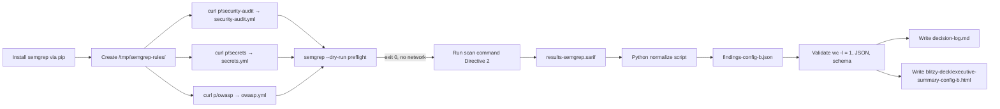

# Technical Specification

# 0. Agent Action Plan

## 0.1 Intent Clarification

Based on the provided requirements, the Blitzy platform understands that the objective is to operationalize a single, reproducible, telemetry-free Semgrep OSS scan of the `blitzy-cal` codebase using three Semgrep Registry rule packs cached to a local directory, capture the scan output as SARIF, and post-process that SARIF into a strictly-shaped, minified, single-line JSON artifact named `findings-config-b.json` that will be consumed by a downstream multi-config security-tool comparison harness in which this work represents **Config B**. The repository under scan IS this repository (`blitzy-cal`) — no separate target codebase is being introduced.

### 0.1.1 Core Objective

The work decomposes into three CRITICAL directives provided by the user, preserved verbatim below to eliminate interpretation drift.

**User Directive 1 (verbatim):** "Install `semgrep` via pip or apt. Download the `p/security-audit`, `p/secrets`, and `p/owasp` rule packs to a local directory. Confirm `--metrics=off` suppresses all telemetry."

- **User pass/fail (verbatim):** "`semgrep scan --metrics=off --config=/path/to/local-rules --dry-run` exits 0 with no network calls."

**User Directive 2 (verbatim):** Execute the scan command exactly as specified:

```bash
semgrep scan --config=/path/to/local-rules --sarif -o results-semgrep.sarif --metrics=off /path/to/blitzy-cal
```

- "Record exit code, scan duration (wall-clock), and total files scanned."
- **User pass/fail (verbatim):** "`results-semgrep.sarif` is produced and contains valid JSON with a `runs` array."

**User Directive 3 (verbatim):** Normalize findings to single-line JSON. Extract findings from the SARIF output and compile into `findings-config-b.json`. The file MUST be valid JSON minified to a single line. Encoding: UTF-8. If zero findings, write `[]`.

The five-field schema is captured verbatim:

| Field | Source |
| --- | --- |
| file | SARIF location (relative path) |
| line | SARIF region start line |
| severity | error→critical, warning→high, note→medium, info→low |
| cwe | Rule metadata CWE ID. If absent, use the most specific CWE inferable from the rule description |
| description | SARIF message text, truncated to 200 characters |

The required shape of the output file is preserved verbatim:

```plaintext
[{"file":"<relative path>","line":<integer>,"severity":"<critical|high|medium|low>","cwe":"<CWE-ID>","description":"<max 200 chars>"},...]
```

- **User pass/fail (verbatim):** "`cat findings-config-b.json | wc -l` returns `1`. Valid JSON. Every finding has all 5 fields populated. No description exceeds 200 characters."

### 0.1.2 Task Categorization

- **Primary task type:** Security tooling (SAST scan execution + artifact normalization)
- **Secondary aspects:** Build/release artifact creation; tooling installation; reproducibility engineering
- **Scope classification:** Isolated change — additive only. No application source code in `apps/`, `packages/`, or `scripts/` is read for mutation, and no project dependency manifest (`package.json`, `yarn.lock`) is altered.
- **Comparison context:** This work is one entry (**Config B**) in a multi-config security-tool comparison series. Sibling configurations (e.g., Config A, Config C) are explicitly **out of scope**.

### 0.1.3 Implicit Requirements and Constraints Surfaced

The literal text of the three directives leaves several technical requirements implicit. The Blitzy platform surfaces them explicitly here so that downstream code-generation stages treat them as first-class obligations.

- **Telemetry-free execution is a hard requirement, not a soft preference.** The directive uses the words "Confirm `--metrics=off` suppresses all telemetry" and "no network calls" as the pass criterion. <cite index="12-5,12-6">Semgrep does not enable metrics when running with only local configuration files or command-line search patterns. Semgrep does enable metrics if rules are loaded from the Semgrep Registry.</cite> Therefore the local-rules strategy (Directive 1's mandate to cache the rule packs on disk) is *also* a telemetry-suppression mechanism, not just a reproducibility choice — both `--metrics=off` AND local rule loading are required for a no-network-calls scan.
- **The `info` severity in the user's mapping is a Semgrep-specific extension.** <cite index="39-27">SARIF uses three severity levels: error, warning, and note.</cite> Semgrep additionally emits `info` for its lowest-confidence rule tier. The normalization step MUST handle all four levels emitted by the SARIF formatter; treating `info` as an unknown level is a defect.
- **`wc -l` returning `1` means exactly one trailing newline character is present.** Per POSIX `wc(1)` semantics, `wc -l` counts newline characters. The single-line JSON file MUST therefore be written with one terminating `\n` so that the user's pass/fail check evaluates to `1`. Writing JSON with no trailing newline would yield `wc -l == 0` and fail the check.
- **CWE inference is an explicit fallback responsibility, not an omission.** The directive states "If absent, use the most specific CWE inferable from the rule description." The normalization tooling therefore needs a deterministic inference table (rule-id keyword → CWE-ID) plus a documented fallback CWE, and the inference logic must be recorded in the decision log per the Explainability rule.
- **The literal path placeholders `/path/to/local-rules` and `/path/to/blitzy-cal` resolve to concrete locations.** `/path/to/local-rules` resolves to a freshly-created cache directory (planned: `/tmp/semgrep-rules/`). `/path/to/blitzy-cal` resolves to the root of this repository, because the user's objective explicitly names the codebase under scan.
- **The user's `[~0 files modified | 1 new file]` tally undercounts the rule-mandated artifacts.** User-specified rules (Explainability, Executive Presentation) mandate two additional new files. Per the Agent Action Plan RULE-DRIVEN SCOPE principle, rule-mandated files MUST be included in scope even when they are not in the user's directive list. This conflict is documented explicitly in §0.4 and §0.8.

### 0.1.4 Preserved User Examples (Verbatim)

The following user-supplied artifacts are preserved verbatim and MUST appear exactly in the implementation:

- The Directive 2 scan command shown above (exact ordering of `--config`, `--sarif`, `-o`, `--metrics=off`, target path).
- The five-field severity-mapping table (error→critical, warning→high, note→medium, info→low).
- The output-file shape `[{"file":"<relative path>","line":<integer>,"severity":"<critical|high|medium|low>","cwe":"<CWE-ID>","description":"<max 200 chars>"},...]`.
- The three pass/fail criteria (one per directive).
- The header annotation `[3 directives | ~0 files modified | 1 new file]` (used to surface the scope conflict — preserved as-stated, then reconciled in §0.4).

## 0.2 Technical Interpretation

These requirements translate to the following technical implementation strategy. The Blitzy platform interprets the three directives as a three-stage pipeline — **Install & Cache → Scan → Normalize** — bracketed by a Preflight stage (to confirm telemetry suppression) and followed by two rule-mandated documentation artifacts.

### 0.2.1 Requirement-to-Action Mapping

The table below maps each user directive (and rule-driven obligation) to the specific technical action(s) that satisfy it.

| Requirement | Technical Action |
| --- | --- |
| Install Semgrep (Directive 1) | Install `semgrep==1.163.0` from PyPI into the execution environment via `pip install semgrep==1.163.0`; verify with `semgrep --version`. The Semgrep CLI is pip-installable as documented by the project itself. |
| Download rule packs locally (Directive 1) | Create `/tmp/semgrep-rules/` and fetch each pack via `curl -L "https://semgrep.dev/c/p/<name>" -o /tmp/semgrep-rules/<name>.yml` for `<name>` in `{security-audit, secrets, owasp}`. Each pack is a concatenated YAML rules file. |
| Confirm `--metrics=off` suppresses telemetry (Directive 1 pass/fail) | Run `semgrep scan --metrics=off --config=/tmp/semgrep-rules --dry-run` and capture exit code 0; assert the network is not touched by either (a) inspecting Semgrep's `--verbose` output for "loading rules from registry" or (b) running under a network-namespace block. |
| Execute scan and produce SARIF (Directive 2) | Run the verbatim Directive 2 command with `/path/to/local-rules` → `/tmp/semgrep-rules` and `/path/to/blitzy-cal` → the repository root. Wrap in a wall-clock timer; capture `$?` immediately after; parse Semgrep's stderr or the SARIF `invocations` block for `Files Tracked` / `targets` count. |
| Validate `results-semgrep.sarif` (Directive 2 pass/fail) | Pipe through `python -m json.tool` for JSON validity; assert `data["runs"]` is a non-null array. |
| Normalize to `findings-config-b.json` (Directive 3) | Run a Python normalization script that loads `results-semgrep.sarif`, iterates `runs[0].results[]`, applies severity mapping and CWE extraction/inference, truncates descriptions, and writes minified single-line JSON with one trailing newline. |
| Validate `findings-config-b.json` (Directive 3 pass/fail) | Assert `wc -l findings-config-b.json` returns `1`; assert `python -m json.tool < findings-config-b.json` succeeds; assert each element has exactly the five required keys with no `description` exceeding 200 characters. |
| Document non-trivial decisions (Explainability rule) | Produce `decision-log.md` as a Markdown table capturing decisions, alternatives, rationale, and risks for every non-trivial choice in this pipeline (rule-pack source, severity mapping, CWE inference table, trailing-newline behaviour, etc.). |
| Executive summary deck (Executive Presentation rule) | Produce `blitzy-deck/executive-summary-config-b.html` as a self-contained reveal.js 5.1.0 deck (12–18 slides, Blitzy brand theme, Mermaid 11.4.0, Lucide 0.460.0) describing the work for non-technical leadership. |

### 0.2.2 Logical Implementation Flow

The flow below describes order-of-operations only; no schedule, dates, or durations are implied.



### 0.2.3 Cause-and-Effect Statements

- **To achieve telemetry-free scanning**, the platform combines `--metrics=off` (which disables the metrics channel altogether per the Semgrep CLI reference: <cite index="11-1,11-2">if 'on', metrics are always sent. If 'off', metrics are disabled altogether and not sent.</cite>) with rule loading from a local on-disk directory (which avoids the registry-fetch trigger that would otherwise enable metrics).
- **To achieve reproducibility across the multi-config comparison**, the platform freezes the rule packs by downloading them once into `/tmp/semgrep-rules/` rather than re-fetching them at scan time. This makes Config B's findings deterministic for any given rule-pack snapshot.
- **To produce a SARIF file with a `runs` array**, the platform passes `--sarif -o results-semgrep.sarif` to `semgrep scan`. The Semgrep `--sarif` formatter emits the standard <cite index="34-3,34-4,34-5">SARIF JSON document with a specific schema that organizes static analysis results in a hierarchical structure. The primary components include: Runs: A SARIF file contains one or more runs, each representing the execution of a static analysis tool.</cite>
- **To normalize SARIF severity to the user's four-tier scale**, the platform applies the verbatim mapping `{error: critical, warning: high, note: medium, info: low}`. Standard SARIF defines only three levels but Semgrep also emits `info` for low-priority rules; the mapping is exhaustive over all four observed levels.
- **To produce a one-line file passing `wc -l == 1`**, the normalizer serializes JSON with `json.dumps(findings, separators=(",", ":"), ensure_ascii=False)` and appends exactly one `\n`. The `separators` argument removes all internal whitespace; `ensure_ascii=False` preserves UTF-8.
- **To remain non-invasive on the `blitzy-cal` project**, the platform installs Semgrep at the system Python level rather than into the Yarn workspace; no edits are made to `package.json`, `turbo.json`, or any lockfile.

## 0.3 Repository Scope Discovery

This sub-section reports the discovery work performed to ground every claim in §0.4 (Scope Boundaries), §0.5 (Dependencies), and §0.7 (File Transformation Mapping) in evidence from the actual `blitzy-cal` repository.

### 0.3.1 Repository Identity

The repository on which this Config B scan runs is the calcom-monorepo published under the identity `blitzy-cal`. <cite index="35-2,35-14">[package.json:name="calcom-monorepo"]</cite> The `blitzy-docs/index.md` landing page identifies the project as `blitzy-cal` — an AI-generated Calendly/Cal.com parity build — confirming that the user directive's "blitzy-cal codebase" refers to this very repository's root. There is no separate `blitzy-cal/` sub-folder anywhere in the tree.

Per-claim evidence locations are noted in §0.10 References as `[<path>:<locator>]` citations.

### 0.3.2 Scan-Target Surface (Comprehensive)

Semgrep, when invoked with `/path/to/blitzy-cal` as the target, will recursively traverse the repository root respecting the repository's standard ignore semantics. The major source-bearing surface area is:

- **`apps/`** — Three Next.js/NestJS applications:
    - `apps/web/` — primary Next.js workspace with App Router (`app/`), legacy Pages Router (`pages/`), `components/`, `modules/`, `lib/`, `server/`, `styles/`, `public/`, `scripts/`, Playwright (`playwright/`), tests (`test/`), and Sentry instrumentation files (`instrumentation.ts`, `instrumentation-client.ts`, `sentry.edge.config.ts`, `sentry.server.config.ts`)
    - `apps/api/v1/` — Next.js + TypeScript API
    - `apps/api/v2/` — NestJS API
- **`packages/`** — 30+ packages including `trpc/`, `features/`, `ui/`, `app-store/`, `lib/`, `platform/`, `coss-ui/`, `prisma/`, `types/`, `embeds/`, `emails/`, `sms/`, `testing/`, `kysely/`, `app-store-cli/`, `config/`, `dayjs/`, `debugging/`, `ee/`, `tsconfig/`
- **`scripts/`** — Operational scripts (`.sql`, `.js`, `.ts`, `.sh`) and `scripts/devin/`
- **`agents/`** — Agent Handbook (README index, commands catalog, knowledge-base, rule cards, skill packs)
- **`blitzy/`** and **`blitzy-docs/`** — Sprint narrative and project guide / technical specifications
- **`.github/`** — Composite actions, issue templates, 50+ workflows including `security-audit.yml`
- **`docs/`**, **`deploy/`**, **`example-apps/`**, **`specs/`**, **`__checks__/`**, **`vitest-mocks/`**, **`.changeset/`**, **`.claude/`**, **`.opencode/`**, **`.snaplet/`**, **`.vscode/`**, **`.well-known/`**, **`.yarn/`**

All of the above are *in scope of the Semgrep scan input* (i.e. files Semgrep is allowed to look at) but **none of them are subject to modification** by this work — see §0.4.

### 0.3.3 Existing Security Tooling Assessment

The repository has minimal pre-existing security tooling, and what exists does not overlap with Config B's SAST mission:

| Asset | Type | Overlap with Semgrep? |
| --- | --- | --- |
| `.github/workflows/security-audit.yml` | Yarn dependency audit (SCA) | No — runs `yarn npm audit`, not SAST |
| `SECURITY.md` | Disclosure policy (security@cal.com) | No — process document |
| Sentry runtime instrumentation in `apps/web/` | Runtime error/perf tracing | No — runtime, not static analysis |
| `apps/web/test-results/` | Playwright/Vitest output directory | No — test artifacts |

There is **no existing Semgrep configuration** (no `.semgrep.yml`, no `.semgrepignore`, no `semgrep-*.yml` anywhere), **no existing SARIF artifact format**, **no existing CWE mapping table**, and **no `.blitzyignore`** file. The platform therefore introduces Semgrep tooling without merging into or conflicting with prior security infrastructure.

### 0.3.4 Documentation-Precedent Assessment for Rule-Mandated Files

The Explainability and Executive Presentation rules mandate two new documentation artifacts. The repository already has well-established documentation-precedent locations that inform their placement:

- **Documentation precedent:** `blitzy/documentation/` (sprint narrative + tech-spec audit notes), `blitzy-docs/` (project guide, master technical-specifications), `docs/` (mkdocs site), `agents/` (rule cards & skill packs). The new `decision-log.md` is placed at the repository root because it documents a single, atomic scan execution rather than a long-lived sprint narrative.
- **Presentation precedent:** None — no existing `blitzy-deck/` directory exists. The Executive Presentation rule mandates the canonical location is `blitzy-deck/`, with the theme source-of-truth at `blitzy-deck/references/blitzy-reveal-theme.css`. Both must be created.

### 0.3.5 Best-Practice Research Findings

Web research performed during discovery confirms the following operational facts used in the implementation design:

- **Semgrep CLI version:** The current stable release is **Semgrep 1.163.0**, published to PyPI on May 13, 2026, as documented on the package's PyPI page (file `semgrep-1.163.0.tar.gz` and accompanying wheels). <cite index="21-2">Uploaded May 13, 2026 CPython 3.10 CPython 3.11 CPython 3.12 CPython 3.13 CPython 3.14</cite> Python 3.12.3 in the execution environment is fully compatible.
- **Installation:** Semgrep is pip-installable: <cite index="22-1,22-2">Install Semgrep using pip with 'pip install semgrep', using Homebrew on macOS with 'brew install semgrep', or using Docker with 'docker run semgrep/semgrep'. The pip method works on all operating systems and is the recommended approach.</cite>
- **Rule packs are public Registry rulesets** referenced by `--config "p/<name>"`; community examples include `p/owasp-top-ten`, `p/security-audit`, and `p/secrets`. <cite index="7-2">semgrep --config "p/owasp-top-ten" semgrep --config "p/security-audit" semgrep --config "p/r2c-security-audit" semgrep --config "p/sql-injection" semgrep --config "p/command-injection" semgrep --config "p/jwt" semgrep --config "p/secrets"</cite> The user's three packs (`p/security-audit`, `p/secrets`, `p/owasp`) all exist in the Semgrep Registry; `p/owasp` is the canonical alias the user named, and the platform uses that exact name verbatim.
- **Telemetry behaviour:** <cite index="12-5,12-6">Semgrep does not enable metrics when running with only local configuration files or command-line search patterns. Semgrep does enable metrics if rules are loaded from the Semgrep Registry.</cite> Combined with `--metrics=off`, loading rules from a local on-disk directory guarantees a network-free scan.
- **SARIF schema:** SARIF 2.1.0 results carry `level` ∈ {error, warning, note, none}; <cite index="34-11">Results: Each result represents a single issue detected by the tool and includes: Severity level (error, warning, note, or none) Rule ID (a short code identifying the issue type) Message (a description of the issue) Location (file path and line number where the issue was found) Optional properties (tool-specific metadata)</cite> Semgrep additionally emits `info` for its lowest tier.

### 0.3.6 Environment Capability Inventory

| Capability | Status | Source |
| --- | --- | --- |
| Python 3.12.3 | Present at `/usr/bin/python3` | `python3 --version` |
| pip3 | Present at `/usr/local/bin/pip3` | `which pip3` |
| Semgrep CLI | **Not installed** — will be installed via pip | `which semgrep` returns nothing |
| jq | **Not installed** — Python `json` stdlib will be used as the JSON-processing path | `which jq` returns nothing |
| Disk space | 24 TB free on `/tmp` | `df -h /tmp` |
| Network for one-time rule fetch | Available | (assumed; if not, the rule packs would need to be pre-staged) |

### 0.3.7 Search Log

The discovery work used the following inspections; full per-file evidence locations are listed in §0.10.

- **Files retrieved (full read):** `package.json`, `SECURITY.md`, `.gitattributes`, `turbo.json`, `.github/workflows/security-audit.yml`
- **File summaries retrieved:** `README.md`, `AGENTS.md`
- **Folders explored (via `get_source_folder_contents`):** repository root (`""`), `blitzy/`, `blitzy-docs/`, `agents/`, `.github/`, `.github/workflows/`
- **Folders surveyed via semantic search (`search_folders`):** `apps/web/` (Next.js root), `packages/` (workspace root), `scripts/` (utility scripts)
- **Semantic searches that returned no matches (recorded as negative-evidence findings):** existing Semgrep configuration, `.blitzyignore`, `blitzy-deck/`, SARIF tooling, CWE mapping, security scanner findings JSON output
- **Shell inspections (via bash):** `find / -maxdepth 4 -name .blitzyignore`, `which python3 python pip pip3 semgrep jq`, `df -h /tmp`, `python3 --version`

## 0.4 Scope Boundaries

This sub-section enumerates exactly what is in scope and exactly what is out of scope, and reconciles the explicit conflict between the user's "1 new file" annotation and the rule-driven file requirements.

### 0.4.1 Scope Conflict and Reconciliation

The user-supplied annotation `[3 directives | ~0 files modified | 1 new file]` claims a single new file (`findings-config-b.json`). The two user-specified implementation rules (Explainability, Executive Presentation) each mandate an additional new file (`decision-log.md` and `blitzy-deck/executive-summary-config-b.html`), bringing the actual new-file count to **three**.

Per the Agent Action Plan **RULE-DRIVEN SCOPE** principle ("Files required by user-specified rules MUST be included in the files-in-scope section, even if not explicitly mentioned in the user's feature/bug description"), the rule-mandated files are treated as in scope. The user's "1 new file" tally is interpreted as a count of directive-derived deliverables only; the rule-derived deliverables are additive. The conflict is surfaced once here and once in §0.8.

### 0.4.2 Exhaustively In Scope

The following files and patterns are in scope for **CREATE** operations by this work.

- **Primary committed deliverable (user directive):**
    - `findings-config-b.json` — minified single-line normalized findings array, UTF-8, terminating `\n`
- **Rule-mandated committed deliverables (per §0.8):**
    - `decision-log.md` — Markdown decision-log table at repository root (Explainability rule)
    - `blitzy-deck/executive-summary-config-b.html` — self-contained reveal.js 5.1.0 deck (Executive Presentation rule)
    - `blitzy-deck/references/blitzy-reveal-theme.css` — canonical theme stylesheet referenced inline in the deck and called out by name in the Executive Presentation rule
- **Working artifacts (transient; produced and consumed within the pipeline; retained for evidence but not strictly required to be committed):**
    - `results-semgrep.sarif` — raw SARIF 2.1.0 file produced by Directive 2's scan command
    - `/tmp/semgrep-rules/security-audit.yml` — locally cached rule pack
    - `/tmp/semgrep-rules/secrets.yml` — locally cached rule pack
    - `/tmp/semgrep-rules/owasp.yml` — locally cached rule pack
- **Read-only inputs:**
    - The entire repository root tree (scan input target) — Semgrep walks this surface but does not modify it

### 0.4.3 Explicitly Out of Scope

The following are **NOT** in scope for this work; any change to them is a defect.

- **All application source code:** `apps/**`, `packages/**`, `scripts/**`, `example-apps/**`, `__checks__/**`, `vitest-mocks/**`, `agents/**`, `specs/**`, `docs/**`, `deploy/**`
- **All project dependency manifests:** `package.json`, `yarn.lock`, `.yarnrc.yml`, root or workspace-level `tsconfig.*`, `turbo.json`, `Dockerfile`, `docker-compose.yml`, `app.json`, `Procfile`, `mkdocs.yml`, `catalog-info.yaml`, `biome.json`, `biome-staged.json`, `lint-staged.config.mjs`, `setupVitest.ts`, `playwright.config.ts`, `vitest.workspace.ts`, `checkly.config.ts`, `i18n.json`, `i18n-unused.config.js`
- **All existing documentation:** `README.md`, `CONTRIBUTING.md`, `CODE_OF_CONDUCT.md`, `SECURITY.md`, `AGENTS.md`, `PERMISSIONS.md`, `SPEC-WORKFLOW.md`, `blitzy/documentation/**`, `blitzy-docs/**`
- **All existing CI/CD configuration:** `.github/workflows/**` (including `.github/workflows/security-audit.yml`), `.github/actions/**`, `.github/matchers/**`, `.github/labeler.yml`, `.github/CODEOWNERS`, `.github/PULL_REQUEST_TEMPLATE.md`, `.github/oasdiff-err-ignore.txt`, `.kodiak.toml`, `.gitpod.yml`
- **All environment templates and runtime config:** `.env.example`, `.env.appStore.example`, `gh.env`
- **Sibling configurations in the multi-config comparison:** Config A, Config C, and any other sibling — those are produced by separate scan jobs and have separate output JSON files
- **Triage / remediation of the findings produced:** Fixing or suppressing any finding surfaced by Config B is a downstream activity outside this work's scope
- **Semgrep AppSec Platform / Pro engine features:** This task is explicitly Semgrep OSS. <cite index="11-15">--oss-only Run using only the OSS engine, even if the Semgrep Pro toggle is on.</cite> No login (`semgrep login`), no `semgrep ci` mode, no Pro-engine features (`--pro`, cross-file dataflow), no AppSec Platform upload
- **Modification of installed Semgrep version:** Once `semgrep==1.163.0` is installed for this run, no upgrades are performed mid-pipeline

### 0.4.4 Scope-Pattern Quick Reference

The following pattern table captures the in-scope vs out-of-scope wildcard surface in a single place:

| Pattern | Disposition |
| --- | --- |
| `findings-config-b.json` | IN SCOPE (CREATE) |
| `decision-log.md` | IN SCOPE (CREATE) |
| `blitzy-deck/**` | IN SCOPE (CREATE — new folder) |
| `results-semgrep.sarif` | IN SCOPE (CREATE — transient) |
| `/tmp/semgrep-rules/**` | IN SCOPE (CREATE — transient, outside repo) |
| `apps/**`, `packages/**`, `scripts/**`, `example-apps/**` | OUT OF SCOPE (read-only scan input) |
| `package.json`, `yarn.lock`, `turbo.json`, `tsconfig.*` | OUT OF SCOPE |
| `.github/workflows/**`, `.github/actions/**` | OUT OF SCOPE |
| `blitzy/**`, `blitzy-docs/**`, `docs/**`, `agents/**` | OUT OF SCOPE (documentation precedent only) |
| Sibling-config artifacts (e.g., `findings-config-a.json`) | OUT OF SCOPE |

## 0.5 Dependency Inventory

This sub-section enumerates every external dependency relevant to the work. The most important property is **negative**: no entries are added to, removed from, or changed in the `blitzy-cal` project's dependency manifests. Every dependency below resolves at the execution-environment level, not the project level.

### 0.5.1 Key Tool and Runtime Dependencies

| Registry | Package Name | Version | Purpose |
| --- | --- | --- | --- |
| PyPI | `semgrep` | `1.163.0` | SAST engine; CLI emits SARIF via `--sarif -o <file>`. Released to PyPI on May 13, 2026. <cite index="21-2">Uploaded May 13, 2026 CPython 3.10 CPython 3.11 CPython 3.12 CPython 3.13 CPython 3.14</cite> |
| System | Python | `3.12.3` | Runtime for Semgrep CLI and for the SARIF normalization script (uses standard-library `json` only) |
| System | pip / pip3 | (env-provided) | Installer for `semgrep` |
| HTTP | `https://semgrep.dev/c/p/security-audit` | rolling | Rule pack `p/security-audit` (downloaded once into `/tmp/semgrep-rules/security-audit.yml`) |
| HTTP | `https://semgrep.dev/c/p/secrets` | rolling | Rule pack `p/secrets` |
| HTTP | `https://semgrep.dev/c/p/owasp` | rolling | Rule pack `p/owasp` (user-named; canonical alias also serves the canonical OWASP Top Ten ruleset) |

Notes:

- `semgrep==1.163.0` is pinned for reproducibility. Upgrading to `latest` would defeat Config B's role in a controlled comparison.
- Rule packs are described as `rolling` because the Semgrep Registry continuously curates them. Local caching freezes a snapshot at the moment of `curl`. The snapshot date is recorded in `decision-log.md` so that re-runs can be reproduced against the same rule corpus.
- Python's standard-library `json` module is used in lieu of `jq`. This avoids adding a system package, keeps the toolchain Python-only, and preserves UTF-8 correctness via `ensure_ascii=False`.

### 0.5.2 New Dependencies Added to the Execution Environment

- `semgrep==1.163.0` — installed via `pip install semgrep==1.163.0`. Installed for the duration of the run; not committed to any project manifest.

### 0.5.3 Dependencies Updated

- None — no upgrades are performed to environment-provided tooling.

### 0.5.4 Dependencies Removed

- None.

### 0.5.5 Changes to `blitzy-cal` Project Dependency Manifests

**None.** The following files are NOT modified by this work, and any change to them is a defect:

- `package.json` (root)
- `yarn.lock`
- `.yarnrc.yml`
- Any workspace-level `package.json` under `apps/**` or `packages/**`
- `turbo.json`
- Any `tsconfig.*.json`

### 0.5.6 Import / Reference Updates

- None required. No application code is imported, transformed, or refactored. The Semgrep scan reads source files; the normalization script reads only the SARIF artifact. No code path in `apps/`, `packages/`, or `scripts/` imports Semgrep or any normalization helper.

## 0.6 Implementation Design

This sub-section specifies HOW each directive is achieved. It expands the technical interpretation in §0.2 into concrete, executable design specifications. No temporal planning (no weeks, no days) is included.

### 0.6.1 Technical Approach

The work proceeds as five logical stages: **Preflight → Install → Cache → Scan → Normalize**, followed by two documentation outputs. Each stage has a clear input, a clear output, and a clear pass criterion.

**Stage A — Preflight.** Inventory environment capabilities (Python 3.12.3, pip available, Semgrep absent, jq absent, network reachable). Create the `/tmp/semgrep-rules/` cache directory. No external side effects.

**Stage B — Install.** Install `semgrep==1.163.0` from PyPI using `pip install --no-input semgrep==1.163.0`. Verify with `semgrep --version`, expecting `1.163.0`.

**Stage C — Cache.** Download each rule pack into the cache directory:

```bash
curl -fSL "https://semgrep.dev/c/p/security-audit" -o /tmp/semgrep-rules/security-audit.yml
curl -fSL "https://semgrep.dev/c/p/secrets"        -o /tmp/semgrep-rules/secrets.yml
curl -fSL "https://semgrep.dev/c/p/owasp"          -o /tmp/semgrep-rules/owasp.yml
```

Run Directive 1's pass/fail verification — `semgrep scan --metrics=off --config=/tmp/semgrep-rules --dry-run /path/to/blitzy-cal` — and assert exit code `0` and no network egress from Semgrep itself (the rules are now local; `--metrics=off` disables the telemetry channel).

**Stage D — Scan.** Execute the verbatim Directive 2 command, with timestamps captured around it:

```bash
T0=$(date +%s%N)
semgrep scan --config=/tmp/semgrep-rules --sarif -o results-semgrep.sarif --metrics=off /path/to/blitzy-cal
EXIT=$?
T1=$(date +%s%N)
DURATION_MS=$(( (T1 - T0) / 1000000 ))
```

Capture three observability values per Directive 2: the exit code (`$EXIT`), the wall-clock duration (`$DURATION_MS`), and the total files scanned (parsed from Semgrep's stderr summary line or, more robustly, from `results-semgrep.sarif` → `runs[0].invocations[0].properties` or by counting unique `artifactLocation.uri` values). Record all three in `decision-log.md`.

Validate Directive 2's pass/fail: `python -m json.tool < results-semgrep.sarif >/dev/null` MUST succeed, and `python -c "import json,sys;d=json.load(open('results-semgrep.sarif'));assert isinstance(d.get('runs'),list)"` MUST succeed.

**Stage E — Normalize.** Run a Python normalization script that loads `results-semgrep.sarif`, iterates `runs[0].results[]`, applies the severity map and CWE extraction/inference, truncates descriptions to 200 characters, and writes minified JSON.

### 0.6.2 SARIF → findings-config-b.json Normalization Algorithm

The normalization script implements the following deterministic pipeline:

```python
SEVERITY_MAP = {"error":"critical","warning":"high","note":"medium","info":"low"}
SEVERITY_DEFAULT = "low"  # for SARIF "none" or unknown level

#### Pseudocode — full implementation lives in the build script

sarif = json.load(open("results-semgrep.sarif", encoding="utf-8"))
findings = []
for run in sarif.get("runs", []):
    rules_by_id = {r["id"]: r for r in run.get("tool", {}).get("driver", {}).get("rules", [])}
    for res in run.get("results", []):
        rule = rules_by_id.get(res.get("ruleId", ""), {})
        loc = res["locations"][0]["physicalLocation"]
        file = loc["artifactLocation"]["uri"]
        line = int(loc["region"]["startLine"])
        sev  = SEVERITY_MAP.get(res.get("level"), SEVERITY_DEFAULT)
        cwe  = extract_cwe(rule) or infer_cwe(rule.get("id",""), rule.get("shortDescription",{}).get("text",""))
        msg  = res.get("message", {}).get("text", "")[:200]
        findings.append({"file":file,"line":line,"severity":sev,"cwe":cwe,"description":msg})

with open("findings-config-b.json","w",encoding="utf-8",newline="") as f:
    f.write(json.dumps(findings, separators=(",",":"), ensure_ascii=False))
    f.write("\n")  # exactly one trailing newline so wc -l == 1
```

The supporting helpers `extract_cwe` and `infer_cwe` are specified in §0.6.4.

### 0.6.3 Severity Mapping (User-Provided, Verbatim)

The four-level severity mapping below is captured verbatim from the user directive and implemented exactly as written.

| SARIF level | Normalized severity |
| --- | --- |
| `error` | `critical` |
| `warning` | `high` |
| `note` | `medium` |
| `info` | `low` |

The mapping is exhaustive over Semgrep's emitted severities. The standard <cite index="34-11">SARIF severity levels are error, warning, note, or none</cite>; Semgrep additionally emits `info`. If a result carries the rare `none` value (or any unrecognized value), the normalizer defaults it to `low` rather than dropping the finding. This default is logged in `decision-log.md` per the Explainability rule.

### 0.6.4 CWE Extraction and Inference Strategy

For each result, the normalizer first attempts to read the CWE from the rule's metadata. Semgrep rule YAML follows the documented convention <cite index="5-7,5-8,5-9">Include the appropriate Comment Weakness Enumeration (CWE). CWE can explain what vulnerability your rule is trying to find. Examples: If you write an SQL Injection rule, use the following: cwe: - "CWE-89: Improper Neutralization of Special Elements used in an SQL Command ('SQL Injection')"</cite> The SARIF representation places this under `runs[0].tool.driver.rules[i].properties.cwe` as an array of strings. The extractor takes the first element, strips trailing description text, and emits the `CWE-<digits>` portion.

When `properties.cwe` is missing or empty, the normalizer infers the most specific CWE from the rule ID and description using a deterministic keyword table:

| Rule-ID / description keyword | Inferred CWE |
| --- | --- |
| `sql-injection`, `sequelize-injection`, `sql.*injection` | `CWE-89` |
| `xss`, `cross-site-scripting`, `dom-based-xss` | `CWE-79` |
| `command-injection`, `os-command`, `spawn-process` | `CWE-78` |
| `path-traversal`, `directory-traversal`, `zip-slip` | `CWE-22` |
| `ssrf` | `CWE-918` |
| `xxe`, `xml-external-entities` | `CWE-611` |
| `open-redirect` | `CWE-601` |
| `weak-crypto`, `weak-cipher`, `insecure-cipher`, `md5`, `sha1` | `CWE-327` |
| `weak-rsa`, `weak-key` | `CWE-326` |
| `hardcoded-secret`, `hardcoded-jwt`, `hardcoded-token`, `hardcoded-key` | `CWE-798` |
| `hardcoded-password` | `CWE-259` |
| `insecure-randomness`, `weak-random` | `CWE-338` |
| `prototype-pollution` | `CWE-1321` |
| `regex-injection`, `redos` | `CWE-1333` |
| `unsafe-deserialization`, `deserialization` | `CWE-502` |
| `eval`, `dynamic-code`, `code-injection` | `CWE-94` |
| `log-injection` | `CWE-117` |
| `missing-auth`, `improper-auth` | `CWE-287` |
| `missing-authz`, `broken-access-control` | `CWE-285` |
| `csrf` | `CWE-352` |
| (no match) | `CWE-693` (fallback: Protection Mechanism Failure) |

The complete keyword table and its rationale are mirrored in `decision-log.md` so the inference becomes auditable.

### 0.6.5 Output File Format and Verification

The output file `findings-config-b.json` MUST conform to all of the following structural constraints, each derived directly from the user's directive:

- **Single line:** The file contains exactly one `\n` (the terminator after the JSON document). `wc -l findings-config-b.json` returns `1`.
- **Valid JSON:** `python -m json.tool < findings-config-b.json` MUST succeed.
- **Schema:** The root MUST be a JSON array. Each element MUST contain exactly the keys `file`, `line`, `severity`, `cwe`, `description`. `line` is an integer; the other four are strings. `severity` is restricted to `{"critical","high","medium","low"}`. `cwe` matches `^CWE-\d+$`.
- **Description length:** `len(finding["description"]) <= 200` for every finding.
- **Encoding:** UTF-8 with no BOM (`ensure_ascii=False` on serialization, `encoding="utf-8"` on `open`).
- **Empty result:** If no findings, the file contains the literal `[]\n`.

A post-write verification step asserts each of the above and fails the pipeline loudly if any constraint is violated.

### 0.6.6 Component Impact Analysis

- **Direct introductions:**
    - `findings-config-b.json` — the only directive-derived deliverable; consumed by the downstream multi-config comparison harness.
    - `/tmp/semgrep-rules/{security-audit,secrets,owasp}.yml` — the rule cache.
    - `results-semgrep.sarif` — intermediate SARIF artifact.
- **Indirect impacts:**
    - The downstream comparison harness (out of scope) gains a new Config B input. Its consumer interface MUST already be compatible with the user-specified 5-field schema; no harness changes are made here.
- **New documentation introductions (rule-driven):**
    - `decision-log.md` — single source of truth for non-trivial decisions in this pipeline.
    - `blitzy-deck/executive-summary-config-b.html` — non-technical leadership summary of the work.
    - `blitzy-deck/references/blitzy-reveal-theme.css` — canonical theme stylesheet referenced inline in the deck.
- **No impacts on:** application source, project dependency manifests, CI/CD workflows, existing documentation, sibling configs.

### 0.6.7 Critical Implementation Details

- **First-location-only convention:** SARIF results may have multiple `locations[]`. The normalizer uses `locations[0]` because the user schema specifies a single `file` + `line` per finding. <cite index="36-13,36-14,36-15">runs[].results[].locations[] - SonarQube only uses the first item in the array. Must be a physical location. physicalLocation.artifactLocation.uri - path of the file concerned by the issue. physicalLocation.region - text range concerned by the issue.</cite> This first-location convention is industry-standard for tools that consume SARIF and reduce findings to one-row-per-result.
- **Relative paths:** Semgrep's SARIF formatter, when invoked with a relative target path, emits relative `artifactLocation.uri` values. The platform invokes Semgrep with the absolute repository path; the normalizer then strips that absolute prefix to keep `file` relative to the repository root (so the JSON is portable across machines).
- **UTF-8 safety on truncation:** `description = msg[:200]` operates on a Python `str` (code-point-based slice), preserving valid UTF-8 boundaries. Byte-based truncation is explicitly avoided to prevent producing invalid UTF-8 sequences for non-ASCII messages.
- **Deterministic ordering:** Findings are emitted in the order Semgrep produced them in `runs[0].results`. No re-sorting is performed; this preserves bit-for-bit reproducibility against a frozen rule snapshot.
- **Error handling:** If `results-semgrep.sarif` cannot be parsed as JSON, or its `runs` array is missing, the normalizer raises a non-zero exit code so the pipeline fails fast.
- **Air-gap evidence:** Stage C's `--dry-run` verification + `--metrics=off` flag + local rule cache together produce a fully telemetry-free Stage D scan, satisfying Directive 1's "no network calls" pass criterion.

## 0.7 File Transformation Mapping

This sub-section enumerates every file the work touches, the transformation mode applied, and the source/reference that informs the transformation. Target files are listed first per the AAP convention.

### 0.7.1 Transformation Table

The transformation modes used below are: **CREATE** (new file), **UPDATE** (modify existing file), **DELETE** (remove existing file), **REFERENCE** (read-only, used as a pattern reference).

| Target File | Transformation | Source File / Reference | Purpose / Changes |
| --- | --- | --- | --- |
| `findings-config-b.json` | CREATE | `results-semgrep.sarif` (transient) | The primary user-directive deliverable: minified single-line JSON array conforming to the 5-field schema (`file`, `line`, `severity`, `cwe`, `description`). UTF-8, one trailing newline so that `wc -l == 1`. If zero findings, the literal `[]` is written. |
| `decision-log.md` | CREATE | (rule body: Explainability) | Markdown decision-log table documenting every non-trivial choice in the pipeline (rule-pack source, severity mapping default, CWE inference table, trailing-newline behaviour, `--dry-run` evidence, scan-target path resolution). Single source of truth per Explainability rule. |
| `blitzy-deck/executive-summary-config-b.html` | CREATE | (rule body: Executive Presentation) | Self-contained reveal.js 5.1.0 deck, 12–18 slides, Blitzy brand theme inline, Mermaid 11.4.0 + Lucide 0.460.0 from CDN, covering: what was done (Semgrep Config B), why (multi-config security comparison), what changed architecturally (no app change; new artifact pipeline), what risks exist, how to onboard. |
| `blitzy-deck/references/blitzy-reveal-theme.css` | CREATE | (rule body: Executive Presentation, canonical theme file) | The canonical Blitzy reveal.js theme stylesheet referenced by name in the Executive Presentation rule. Contains the full Blitzy brand palette, typography stack, slide-type classes (`slide-title`, `slide-divider`, `slide-closing`), and component classes (`kpi-card`, `kpi-grid`, `kpi-value`, `kpi-label`, `kpi-icon`, `eyebrow`, `accent-bar`, `brand-lockup`, `hero-icon`, `icon-row`). |
| `results-semgrep.sarif` | CREATE (transient) | Output of `semgrep scan --sarif -o` | Raw SARIF 2.1.0 file produced by Directive 2's scan command. Consumed by the normalization step. Retained for evidence but not strictly a committed deliverable. |
| `/tmp/semgrep-rules/security-audit.yml` | CREATE (transient) | `https://semgrep.dev/c/p/security-audit` | Locally cached Semgrep Registry rule pack. Frozen snapshot for reproducibility and telemetry-free execution. |
| `/tmp/semgrep-rules/secrets.yml` | CREATE (transient) | `https://semgrep.dev/c/p/secrets` | Locally cached Semgrep Registry rule pack. |
| `/tmp/semgrep-rules/owasp.yml` | CREATE (transient) | `https://semgrep.dev/c/p/owasp` | Locally cached Semgrep Registry rule pack (user-named ruleset; canonical alias of OWASP Top Ten). |
| `apps/**`, `packages/**`, `scripts/**`, `example-apps/**` | REFERENCE | (Semgrep scan input only) | Read by Semgrep during the scan. NOT modified. Reads are passive and do not constitute a transformation. |
| `package.json`, `yarn.lock`, `.yarnrc.yml`, `turbo.json` | (no change) | n/a | Confirmed untouched. Any modification is a defect. |
| `.github/workflows/security-audit.yml` | (no change) | n/a | Existing `yarn npm audit` workflow remains as-is. No Semgrep workflow is added under `.github/workflows/`. |

### 0.7.2 New Files Detail

**`findings-config-b.json`**

- **Content type:** Data artifact (minified JSON array)
- **Based on:** SARIF schema for Semgrep CE output (see `results-semgrep.sarif`)
- **Required keys per element:** `file` (string, relative path), `line` (integer), `severity` (string ∈ {critical, high, medium, low}), `cwe` (string matching `^CWE-\d+$`), `description` (string, length ≤ 200)
- **Encoding:** UTF-8, no BOM
- **Trailing newline:** Exactly one `\n` at end of file
- **Empty case:** Literal `[]\n` when zero findings

**`decision-log.md`**

- **Content type:** Markdown decision log
- **Based on:** Explainability rule body (single source of truth for "why")
- **Sections:** A single Markdown table with columns `Decision`, `Alternatives`, `Rationale`, `Risks`. Rows include (non-exhaustive): tool choice (Semgrep CE), rule-pack set, pinned Semgrep version (1.163.0), local-cache directory path, telemetry suppression evidence approach, severity-mapping treatment of `none` and unknown levels, CWE inference table, choice of Python `json` over `jq`, trailing-newline decision, normalization of multi-location findings to first location only, scan-target path resolution.

**`blitzy-deck/executive-summary-config-b.html`**

- **Content type:** Self-contained HTML reveal.js presentation
- **Based on:** Executive Presentation rule body
- **Slide count:** 12–18 (target: 16)
- **Slide types used:** `slide-title`, `slide-divider`, default content, `slide-closing`
- **Non-text visuals:** Each slide includes at least one of: Mermaid diagram, KPI card, styled table, or Lucide SVG icon. Zero emoji.
- **External CDN dependencies (pinned):** reveal.js 5.1.0, Mermaid 11.4.0, Lucide 0.460.0
- **Inline theme:** Full Blitzy brand CSS embedded in `<style>` (the same content as `blitzy-deck/references/blitzy-reveal-theme.css`)
- **Reveal config:** `hash: true`, `transition: 'slide'`, `controlsTutorial: false`, `width: 1920`, `height: 1080`
- **Mermaid init:** `startOnLoad: false`; `mermaid.run()` called after reveal.js `ready` and on every `slidechanged`
- **Lucide init:** `lucide.createIcons()` called after `ready` and on every `slidechanged`

**`blitzy-deck/references/blitzy-reveal-theme.css`**

- **Content type:** CSS stylesheet (canonical theme reference)
- **Based on:** Executive Presentation rule's literal `:root` custom properties block plus the rule's enumerated slide-type and component classes
- **Required CSS custom properties (verbatim):** `--blitzy-primary: #5B39F3`, `--blitzy-primary-dark: #2D1C77`, `--blitzy-primary-navy: #1A105F`, `--blitzy-primary-light: #7A6DEC`, `--blitzy-primary-deep: #4101DB`, `--blitzy-accent-teal: #94FAD5`, plus the full surface/border/text/typography/gradient set defined in the rule
- **Purpose:** Acts as the single source of truth for the brand theme; the deck inlines this same content but the file is committed for downstream re-use

### 0.7.3 Files to Modify Detail

**None.** No existing repository file is updated. Every transformation row in §0.7.1 is either CREATE or no-change.

### 0.7.4 Configuration and Documentation Updates

**None.** The work introduces no new configuration entries to any existing config file. The two documentation artifacts (`decision-log.md`, `blitzy-deck/executive-summary-config-b.html`) are fresh files, not edits to existing docs.

### 0.7.5 Cross-File Dependencies

- `findings-config-b.json` depends on `results-semgrep.sarif` as its data source.
- `results-semgrep.sarif` depends on `/tmp/semgrep-rules/*.yml` as its rule input.
- `/tmp/semgrep-rules/*.yml` depend on a one-time fetch from `semgrep.dev/c/p/<name>`.
- `decision-log.md` references the severity mapping, CWE inference table, and verification commands used throughout the pipeline.
- `blitzy-deck/executive-summary-config-b.html` inlines the content of `blitzy-deck/references/blitzy-reveal-theme.css`; both files share the same brand palette and component classes.

## 0.8 Rules Compliance

This sub-section enumerates each user-specified rule, captures its content verbatim, and binds it to specific implementation obligations and target files.

### 0.8.1 Explainability Rule

**Rule body (verbatim):** "Every non-trivial implementation decision MUST be documented with rationale. A decision is non-trivial if a competent engineer could reasonably have chosen differently. Deliver a decision log as a Markdown table: what was decided, what alternatives existed, why this choice was made, and what risks it carries. For migrations or refactors, include a bidirectional traceability matrix mapping source constructs to target implementations — 100% coverage, no gaps. Any deviation from a literal or obvious interpretation of the requirements MUST have an explicit entry in the decision log. Unexplained deviations are treated as defects. Do not embed rationale in code comments. The decision log is the single source of truth for 'why' decisions."

**Bound deliverable:** `decision-log.md` at the repository root (CREATE).

**Required content:**

- A Markdown table with the four columns mandated by the rule: `Decision`, `Alternatives`, `Rationale`, `Risks`.
- Mandatory rows for every non-trivial choice made in this pipeline. At minimum:

| Decision | Alternatives | Rationale | Risks |
| --- | --- | --- | --- |
| Use Semgrep CE 1.163.0 from PyPI | Homebrew, Docker image, manual binary | PyPI install is the documented cross-platform path; pinned version freezes Config B output for cross-config comparison | A future CVE in 1.163.0 would require a pin bump and re-run |
| Cache rule packs locally in `/tmp/semgrep-rules/` | Live fetch from registry every run; CI cache; vendored in repo | Local cache eliminates telemetry round-trip AND freezes the rule corpus snapshot | Cache lives only for the duration of the run; snapshot date must be recorded |
| Severity default for SARIF `none` / unknown → `low` | Drop the finding; raise an error | The user's mapping is exhaustive over the four levels Semgrep emits; mapping the rare `none`/unknown case to `low` preserves the finding rather than discarding evidence | A future Semgrep severity addition could be miscategorized; the default is logged so a downstream re-mapping is straightforward |
| CWE inference table | Use only `properties.cwe`; emit empty string when absent | The user directive explicitly requires "the most specific CWE inferable from the rule description" when metadata is absent; a deterministic keyword table makes inference auditable | New rule names without keyword-table coverage fall back to CWE-693 |
| Trailing newline in `findings-config-b.json` | No trailing newline | `wc -l` returns `1` only if exactly one `\n` is present; user's pass/fail specifies `1` | A consumer expecting `[]` byte-equality without `\n` would need to strip the terminator |
| Use Python `json` standard library instead of `jq` | `apt-get install jq`; `pip install pyjq` | Avoids adding a system package; Python is already required for Semgrep; `ensure_ascii=False` preserves UTF-8 cleanly | None material |
| Reduce multi-location SARIF results to `locations[0]` | Emit one row per location | The user schema has a single `file`/`line` per finding; multi-location duplication would violate the contract | A finding with relevant secondary locations loses that context in this artifact |
| Append two rule-mandated files beyond user's "1 new file" tally | Refuse the rules; ignore the tally without comment | AAP RULE-DRIVEN SCOPE: rule-mandated files MUST be in scope; the tally is reconciled in §0.4.1 | Reviewers may need to be pointed to the conflict resolution |

- Each row includes citation/anchor evidence where applicable (e.g., links to specific SARIF spec clauses, Semgrep CLI docs).
- The traceability-matrix sentence in the rule body is **not applicable**: this work is a security scan, not a migration or refactor. The decision log explicitly notes this so reviewers see the omission is intentional.

### 0.8.2 Executive Presentation Rule

**Rule summary:** Every deliverable MUST include an executive summary as a single self-contained reveal.js HTML file, targeted at non-technical leadership, covering: what was done, why, what changed architecturally, what risks exist, and how the team onboards. Constraints: 12–18 slides (target 16); four slide types (`slide-title`, `slide-divider`, default content, `slide-closing`); every slide includes a non-text visual; zero emoji; no fenced code blocks. Visual identity is the Blitzy brand palette (`#5B39F3`, `#2D1C77`, `#94FAD5`, `#1A105F`, `#7A6DEC`, `#4101DB`, and the neutral set), typography is Inter + Space Grotesk + Fira Code from Google Fonts, gradients are specified literally. Technical delivery is a single self-contained HTML with CDN versions pinned to reveal.js 5.1.0, Mermaid 11.4.0, Lucide 0.460.0; reveal.js config is `hash: true`, `transition: 'slide'`, `controlsTutorial: false`, `width: 1920`, `height: 1080`; Mermaid initializes with `startOnLoad: false` and `mermaid.run()` is called after `ready` and `slidechanged`; Lucide `createIcons()` is called on the same events. The canonical theme file is located at `blitzy-deck/references/blitzy-reveal-theme.css`. The slide ordering convention is Title → Headline KPIs → Architecture (Mermaid) → alternating Divider + Content sections → Closing. Verification: HTML opens in a browser, renders Mermaid diagrams and Lucide icons, contains 12–18 `<section>` elements, every `<section>` contains at least one non-text visual element.

**Bound deliverables:**

- `blitzy-deck/executive-summary-config-b.html` (CREATE) — the deck itself
- `blitzy-deck/references/blitzy-reveal-theme.css` (CREATE) — canonical theme stylesheet referenced by name in the rule

**Required slide outline (informed by the rule's slide-ordering convention and scoped to this Config B work):**

| # | Slide Type | Title | Required Non-Text Visual |
| --- | --- | --- | --- |
| 1 | `slide-title` | "Config B: Semgrep Security Scan of blitzy-cal" | Hero gradient title slide, Fira Code eyebrow |
| 2 | Content | "Headline Findings" | KPI cards: scan duration, files scanned, findings count, critical/high/medium/low breakdown |
| 3 | Content | "Pipeline Architecture" | Mermaid flowchart of Preflight → Install → Cache → Scan → Normalize |
| 4 | `slide-divider` | "What Was Done" | Lucide icon (e.g., `shield-check`) on gradient |
| 5 | Content | "Three CRITICAL Directives" | Styled table summarizing Directive 1/2/3 |
| 6 | `slide-divider` | "Why It Was Done" | Lucide icon (e.g., `git-compare`) |
| 7 | Content | "Multi-Config Comparison Role" | Styled table showing this row is Config B |
| 8 | `slide-divider` | "What Changed Architecturally" | Lucide icon (e.g., `file-plus`) |
| 9 | Content | "New Artifacts, No Source Changes" | KPI grid: 0 source files modified, 3 artifacts created |
| 10 | `slide-divider` | "Risks and Mitigations" | Lucide icon (e.g., `alert-triangle`) |
| 11 | Content | "Risk Register" | Styled table: rule-pack drift, CWE inference miss, etc. |
| 12 | `slide-divider` | "How the Team Onboards" | Lucide icon (e.g., `book-open`) |
| 13 | Content | "Re-Running Config B" | KPI cards + ordered list of three commands |
| 14 | Content | "Severity Mapping Reference" | Styled severity table (verbatim from §0.6.3) |
| 15 | Content | "Output Schema Reference" | Styled schema table (verbatim from §0.1.1) |
| 16 | `slide-closing` | "Findings Ready for Triage" | Brand lockup, gradient accent bar |

The deck satisfies the rule's 12–18 slide constraint (16 total, the target).

**Required CSS custom properties block (verbatim from rule body, embedded inline in the deck AND copied to `blitzy-deck/references/blitzy-reveal-theme.css`):**

```css
:root {
  --blitzy-primary: #5B39F3;
  --blitzy-primary-dark: #2D1C77;
  --blitzy-primary-navy: #1A105F;
  --blitzy-primary-light: #7A6DEC;
  --blitzy-primary-deep: #4101DB;
  --blitzy-accent-teal: #94FAD5;
  --blitzy-surface-0: #FFFFFF;
  --blitzy-surface-1: #F4EFF6;
  --blitzy-surface-2: #F2F0FE;
  --blitzy-surface-3: #F5F5F5;
  --blitzy-border: #D9D9D9;
  --blitzy-border-soft: rgba(91, 57, 243, 0.18);
  --blitzy-text: #333333;
  --blitzy-text-muted: #999999;
  --blitzy-text-invert: #FFFFFF;
  --ff-body: 'Inter', system-ui, sans-serif;
  --ff-display: 'Space Grotesk', 'Inter', sans-serif;
  --ff-mono: 'Fira Code', 'Courier New', monospace;
  --gradient-hero: linear-gradient(68deg, #7A6DEC 15.56%, #5B39F3 62.74%, #4101DB 84.44%);
  --gradient-divider: linear-gradient(135deg, #2D1C77 0%, #5B39F3 100%);
  --gradient-accent-bar: linear-gradient(90deg, #5B39F3 0%, #94FAD5 100%);
}
```

**Required Mermaid init theme variables (verbatim from rule body):**

```javascript
// primaryColor: '#F2F0FE', primaryTextColor: '#333333',
// primaryBorderColor: '#5B39F3', lineColor: '#999999',
// secondaryColor: '#F4EFF6'
```

### 0.8.3 Conflict Resolution: User Tally vs. Rule-Mandated Files

The user-supplied annotation `[3 directives | ~0 files modified | 1 new file]` and the user rules together imply different file counts. The conflict is explicit, and the AAP RULE-DRIVEN SCOPE principle governs the resolution:

- **User-claimed new files:** 1 (`findings-config-b.json`)
- **Rule-mandated new files:** 3 (`decision-log.md`, `blitzy-deck/executive-summary-config-b.html`, `blitzy-deck/references/blitzy-reveal-theme.css`)
- **Total new files in scope:** **4** (or **5 with the transient SARIF artifact** if it is committed; **8 with the transient cached rule YAMLs** if all transients are committed). The standard interpretation commits four files: `findings-config-b.json`, `decision-log.md`, `blitzy-deck/executive-summary-config-b.html`, `blitzy-deck/references/blitzy-reveal-theme.css`.
- **Resolution:** The rule-mandated files take precedence; the tally is treated as a directive-count annotation, not an absolute file-count cap. The Explainability rule itself requires this conflict and its resolution to be recorded in `decision-log.md` (which is itself one of the rule-mandated files — the rule is self-justifying).

### 0.8.4 Rule-to-File Compliance Matrix

| Rule | Mandated Artifact | File(s) Produced | Verification Approach |
| --- | --- | --- | --- |
| Explainability | Markdown decision-log table | `decision-log.md` | Lints as valid Markdown; table contains at least the rows enumerated in §0.8.1; any deviation from literal directives is documented |
| Executive Presentation | Self-contained reveal.js HTML | `blitzy-deck/executive-summary-config-b.html`, `blitzy-deck/references/blitzy-reveal-theme.css` | Browser opens without errors; contains 12–18 `<section>` elements; every `<section>` has a non-text visual; reveal.js / Mermaid / Lucide load from pinned CDNs; brand palette custom-properties present |

## 0.9 Special Instructions and Constraints

This sub-section captures process-, output-, and tool-level constraints that downstream code-generation stages MUST honour.

### 0.9.1 Process Constraints

- **Scan-only task.** No application source code in `apps/`, `packages/`, `scripts/`, `example-apps/`, `__checks__/`, `vitest-mocks/`, `agents/`, `specs/`, `docs/`, or `deploy/` is modified.
- **No project-manifest mutation.** `package.json`, `yarn.lock`, `.yarnrc.yml`, `turbo.json`, `tsconfig.*`, and every workspace manifest are read-only.
- **No CI/CD modification.** No file under `.github/workflows/` or `.github/actions/` is added or edited. In particular, the existing `.github/workflows/security-audit.yml` remains untouched.
- **No Semgrep AppSec Platform integration.** This is Semgrep OSS. No `semgrep login`, no `semgrep ci`, no Pro-engine features (`--pro`, cross-file dataflow). <cite index="11-15">--oss-only Run using only the OSS engine, even if the Semgrep Pro toggle is on.</cite>
- **No upload of source code or findings.** The scan runs locally with `--metrics=off` and locally cached rules. <cite index="28-4">Scans are still local and code isn't uploaded.</cite>
- **Reproducibility-first.** Semgrep is pinned to `1.163.0`. Rule packs are downloaded once into `/tmp/semgrep-rules/` and the snapshot timestamp is recorded in `decision-log.md`.
- **Pass/fail gates are non-negotiable.** Each directive has a user-specified pass/fail criterion (§0.1.1). Each MUST be evaluated; failing any one fails the work.

### 0.9.2 Output Constraints

- **`findings-config-b.json` MUST be exactly one line as measured by `wc -l` returning `1`.** This implies exactly one terminating `\n` character.
- **JSON validity MUST hold:** `python -m json.tool < findings-config-b.json` exits 0.
- **Schema completeness:** every element has all five keys (`file`, `line`, `severity`, `cwe`, `description`) populated. Empty strings or `null` are NOT permitted for any of the five.
- **Description length:** `len(finding["description"]) <= 200` (Python code-point semantics). UTF-8-safe truncation, not byte truncation.
- **Empty-result case:** the literal `[]\n` (two bytes plus newline, total three bytes).
- **No additional fields.** The schema is closed: `file`, `line`, `severity`, `cwe`, `description` — and nothing else. Adding fields would violate the comparison harness contract for Config B.
- **Encoding:** UTF-8 with no byte-order-mark.
- **Stable serialization order of keys per object** is not formally required by the user but is implementation-recommended for diffability across re-runs; the normalizer preserves insertion order, and the insertion order is fixed by the script.

### 0.9.3 Tool and Platform Constraints

- **Mandatory tool:** Semgrep CE 1.163.0 (PyPI). No substitutions (no `bandit`, no `eslint-plugin-security`, no `gosec`) — those would belong to a sibling config (A, C, …), not Config B.
- **Mandatory CLI options on the scan step (verbatim from Directive 2):** `--config=/path/to/local-rules`, `--sarif`, `-o results-semgrep.sarif`, `--metrics=off`. Adding or removing flags from this set is a deviation that requires an explicit `decision-log.md` entry.
- **Permitted but not required:** `--verbose` for observability; `--timeout=<n>` for per-rule timeouts; `--max-target-bytes=<n>` to skip very large files; `-j <n>` for worker count. Any such flag added MUST be recorded in `decision-log.md`.
- **Forbidden:** `--config=auto` (would trigger registry fetch and enable metrics — violates Directive 1). `--config=p/...` directly without local caching (same issue). `semgrep ci` mode. Live registry queries.

### 0.9.4 Verification and Acceptance Constraints

- **Directive 1 acceptance (verbatim):** `semgrep scan --metrics=off --config=/path/to/local-rules --dry-run` exits 0 with no network calls. Implementation: run the command with the `--config` pointing at `/tmp/semgrep-rules/` and inspect `$?`. Network-egress verification is accomplished by combining `--metrics=off` with on-disk rules — both telemetry sources are removed.
- **Directive 2 acceptance (verbatim):** `results-semgrep.sarif` is produced and contains valid JSON with a `runs` array. Implementation: assert `os.path.exists("results-semgrep.sarif")`, parse via `json.load`, assert `isinstance(data["runs"], list)`.
- **Directive 3 acceptance (verbatim):** `cat findings-config-b.json | wc -l` returns `1`. Valid JSON. Every finding has all 5 fields populated. No description exceeds 200 characters. Implementation: run all four checks programmatically; fail the pipeline on any miss.

### 0.9.5 Methodological Notes

- **Idempotence:** Re-running the full pipeline against the same rule snapshot SHOULD produce a bitwise-identical `findings-config-b.json`. The normalizer preserves Semgrep's emission order and does not re-sort.
- **Determinism:** No timestamps, hostnames, or run-IDs are embedded in `findings-config-b.json`. Only the five user-specified fields appear.
- **No code comments for rationale.** Per the Explainability rule, "Do not embed rationale in code comments. The decision log is the single source of truth for 'why' decisions." Any in-script comments are limited to terse mechanical descriptions; reasoning lives in `decision-log.md`.
- **Slide-content fidelity.** The Executive Presentation deck describes Config B's work accurately; KPI values shown in the deck reflect actual measured values from this run (scan duration, files scanned, findings count, severity breakdown), not placeholders.

## 0.10 References

This sub-section consolidates citation evidence, the discovery search log, and external metadata (attachments, Figma URLs).

### 0.10.1 In-Repository Evidence (per-claim citations)

Citations follow the form `[<path>:<locator>]` where the locator is a line range, an anchor, or a key path appropriate to the file type. Where a claim could not be grounded in a specific source location, it is marked `[inferred — no direct source]`.

- The repository is the `blitzy-cal` monorepo: `[package.json:name="calcom-monorepo"]`; `[blitzy-docs/index.md:landing — project identity "blitzy-cal"]`
- Yarn 4.12.0 and `npm >=7.0.0`, `yarn >=4.12.0` engines: `[package.json:packageManager,engines]`
- Yarn PnP markers and vendored `.yarn/`: `[.gitattributes:/.yarn/, /.pnp.*]`
- Turborepo orchestrates tasks with a large `globalEnv` and `yarn.lock` as global dependency: `[turbo.json:globalDependencies, globalEnv, pipeline]`
- Pre-existing security workflow is dependency-audit (`yarn npm audit`), not SAST: `[.github/workflows/security-audit.yml:steps — yarn npm audit --all --recursive]`
- Disclosure policy is process-only, not tooling: `[SECURITY.md:§reporting, §scope]`
- Existence of `blitzy/documentation/` (sprint narrative and tech-spec audit notes), `blitzy-docs/` (project guide and master technical specs), and `agents/` (rule cards / skill packs): `[get_source_folder_contents:blitzy/, blitzy-docs/, agents/]`
- Apps surface in scan: `[get_source_folder_contents:apps/ — web, api/v1, api/v2]`
- Sentry instrumentation present but runtime-only (not SAST): `[apps/web/instrumentation.ts, apps/web/sentry.*.config.ts]` `[inferred — file-list-only, contents not retrieved]`
- No existing `.blitzyignore`: `[bash find / -maxdepth 4 -name .blitzyignore → no results]`
- No existing Semgrep config: `[search_files semantic query "existing Semgrep configuration..." → []]`
- No existing `blitzy-deck/`: `[search_folders semantic query "blitzy-deck folder..." → []]`
- Environment capabilities (Python 3.12.3, pip3 present, semgrep & jq absent, 24 TB free on `/tmp`): `[bash:which python3 pip3 semgrep jq && python3 --version && df -h /tmp]`

### 0.10.2 External Source Citations (claims about Semgrep, SARIF, and OSS practice)

- Semgrep latest stable version 1.163.0 (released May 13, 2026 to PyPI): <cite index="21-2">Uploaded May 13, 2026 CPython 3.10 CPython 3.11 CPython 3.12 CPython 3.13 CPython 3.14</cite>
- Pip is the recommended cross-platform install method: <cite index="22-1,22-2">Install Semgrep using pip with 'pip install semgrep', using Homebrew on macOS with 'brew install semgrep', or using Docker with 'docker run semgrep/semgrep'. The pip method works on all operating systems and is the recommended approach.</cite>
- The user's three rule packs (`p/security-audit`, `p/secrets`, `p/owasp`) are Registry rulesets invoked via `--config "p/<name>"`: <cite index="7-2">semgrep --config "p/owasp-top-ten" semgrep --config "p/security-audit" semgrep --config "p/r2c-security-audit" semgrep --config "p/sql-injection" semgrep --config "p/command-injection" semgrep --config "p/jwt" semgrep --config "p/secrets"</cite>
- `--metrics=off` disables the telemetry channel: <cite index="11-1,11-2">If 'on', metrics are always sent. If 'off', metrics are disabled altogether and not sent.</cite>
- Loading rules from local files avoids registry-triggered metrics; together with `--metrics=off` they guarantee a network-free scan: <cite index="12-5,12-6">Semgrep does not enable metrics when running with only local configuration files or command-line search patterns. Semgrep does enable metrics if rules are loaded from the Semgrep Registry.</cite>
- Semgrep CE 1.163.0 supports the OSS-only flag for environments that have Pro toggled on: <cite index="11-15">--oss-only Run using only the OSS engine, even if the Semgrep Pro toggle is on.</cite>
- SARIF results carry severity levels error/warning/note/none (Semgrep additionally emits `info` as a fourth tier): <cite index="34-11">Results: Each result represents a single issue detected by the tool and includes: Severity level (error, warning, note, or none) Rule ID (a short code identifying the issue type) Message (a description of the issue) Location (file path and line number where the issue was found) Optional properties (tool-specific metadata)</cite> <cite index="39-27">SARIF uses three severity levels: error, warning, and note.</cite>
- Semgrep rule YAML conventionally carries CWE in metadata: <cite index="5-7,5-8,5-9">Include the appropriate Comment Weakness Enumeration (CWE). CWE can explain what vulnerability your rule is trying to find. Examples: If you write an SQL Injection rule, use the following: cwe: - "CWE-89: Improper Neutralization of Special Elements used in an SQL Command ('SQL Injection')"</cite>
- SARIF tools customarily reduce multi-location results to the first physical location: <cite index="36-13,36-14,36-15">runs[].results[].locations[] - SonarQube only uses the first item in the array. Must be a physical location. physicalLocation.artifactLocation.uri - path of the file concerned by the issue. physicalLocation.region - text range concerned by the issue.</cite>
- Semgrep is a SAST tool that runs locally without uploading source: <cite index="28-4">Scans are still local and code isn't uploaded.</cite>

### 0.10.3 Discovery Search Log (Appendix)

This appendix enumerates the inspections performed during scope discovery. It is provided as evidence that the scope analysis covered the repository comprehensively.

**Bash inspections:**

- `find / -maxdepth 4 -name .blitzyignore` — no results
- `ls /tmp/environments_files/` — empty (no user-uploaded files)
- `which python3 python pip pip3 semgrep jq` — Python and pip present; semgrep and jq absent
- `python3 --version` — `Python 3.12.3`
- `df -h /tmp` — 24 TB free

**Folders explored (`get_source_folder_contents`):**

- `""` (repository root)
- `blitzy/`, `blitzy-docs/`, `agents/`, `.github/`, `.github/workflows/`

**Folders surveyed (`search_folders`, semantic):**

- `apps/web/` (Next.js app root)
- `packages/` (workspace packages)
- `scripts/` (utilities)

**Folders searched and not found:**

- `blitzy-deck/` — confirmed missing
- `tools/` — no result for "scripts and tooling utilities folder containing shell or node scripts"

**Files retrieved in full:**

- `package.json`, `SECURITY.md`, `.gitattributes`, `turbo.json`, `.github/workflows/security-audit.yml`

**File summaries retrieved:**

- `README.md`, `AGENTS.md`

**Semantic file searches returning no results (recorded as negative-evidence findings):**

- "existing Semgrep configuration or static analysis security scanning setup"
- "security policy and vulnerability reporting documentation" (note: SECURITY.md was retrieved separately)
- ".blitzyignore file specifying paths to skip for tooling"
- "CWE common weakness enumeration mapping security vulnerability"
- "SARIF static analysis report output format"
- "findings JSON output for security scanner"
- "existing reveal.js presentation file or executive summary HTML deck"
- "existing Semgrep configuration file or semgrepignore file at repository root"

**Web searches conducted:**

- "Semgrep p/security-audit p/secrets p/owasp rule packs local download"
- "Semgrep --metrics=off telemetry suppress OSS CLI"
- "Semgrep latest stable version pip install 2026"
- "SARIF schema severity levels error warning note info"

### 0.10.4 Attachments and External Metadata

- **User-uploaded attachments:** None. The `/tmp/environments_files/` directory is empty per environment inspection; the project input declares zero attachments.
- **Figma URLs:** None. No design URLs were referenced in the user prompt or its rules.
- **Environment variables provided by user:** None (empty list).
- **Secrets provided by user:** None (empty list).
- **Setup instructions provided by user:** None.

### 0.10.5 Reference URLs (for tool documentation lookups)

- Semgrep PyPI: `https://pypi.org/project/semgrep/`
- Semgrep CLI reference: `https://semgrep.dev/docs/cli-reference`
- Semgrep metrics policy: `https://semgrep.dev/docs/metrics`
- Semgrep rule registry packs (per user directive): `https://semgrep.dev/p/security-audit`, `https://semgrep.dev/p/secrets`, `https://semgrep.dev/p/owasp` (canonical `p/owasp-top-ten`)
- SARIF 2.1.0 schema: `https://json.schemastore.org/sarif-2.1.0.json`
- reveal.js (pinned 5.1.0), Mermaid (pinned 11.4.0), Lucide (pinned 0.460.0) — CDN pins from Executive Presentation rule

