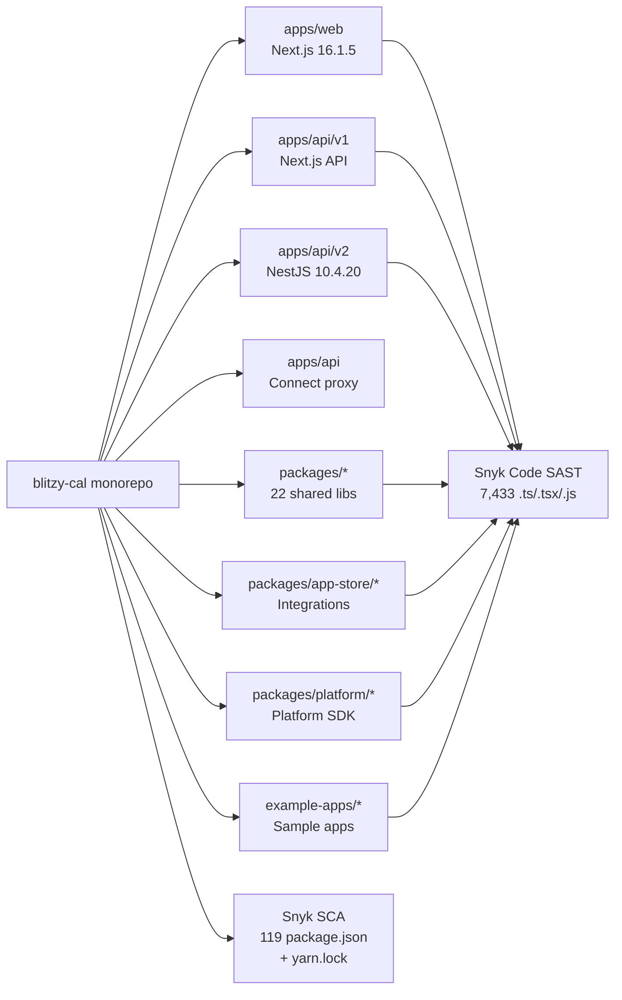
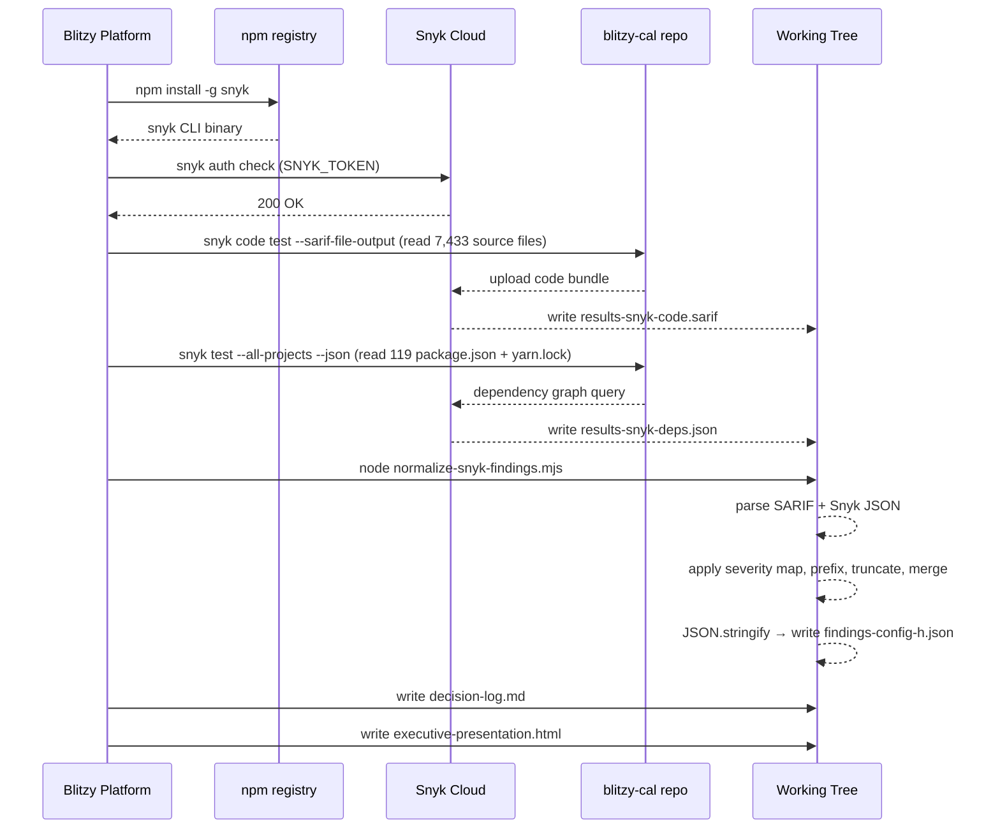

# Technical Specification

# 0. Agent Action Plan

## 0.1 Intent Clarification

### 0.1.1 Core Objective

Based on the provided requirements, the Blitzy platform understands that the objective is to execute a **Snyk CLI security scan against the `blitzy-cal` codebase covering both Static Application Security Testing (SAST) and Software Composition Analysis (SCA / dependency scan), then merge and normalize the resulting findings into a single-line minified JSON artifact named `findings-config-h.json` that conforms to a strict 5-field-per-finding schema**. The user's verbatim framing is preserved: `[4 directives | ~0 files modified | 1 new file]`. This Config H run is one configuration in a multi-config security tool comparison; the deliverable schema must align byte-for-byte with sibling configs so cross-tool diffs are mechanically computable.

The four CRITICAL directives — preserved exactly as provided — are:

- **Directive 1**: Install Snyk CLI globally (`npm install -g snyk` or `apt install snyk`) and authenticate via `SNYK_TOKEN` environment variable. Pass/fail: `snyk auth check` confirms authentication; `snyk --version` returns a version string.
- **Directive 2**: Execute Snyk SAST scan: `snyk code test --sarif-file-output=results-snyk-code.sarif /path/to/blitzy-cal`. Record exit code and wall-clock duration. Pass/fail: `results-snyk-code.sarif` is produced and contains valid JSON.
- **Directive 3**: Execute Snyk dependency scan: `snyk test --json > results-snyk-deps.json /path/to/blitzy-cal`. Record exit code and wall-clock duration. Pass/fail: `results-snyk-deps.json` is produced and contains a `vulnerabilities` array.
- **Directive 4**: Normalize and merge findings into `findings-config-h.json` — valid JSON, minified to a single line, UTF-8 encoded. Empty result writes `[]`. Pass/fail: `cat findings-config-h.json | wc -l` returns `1`; valid JSON; every finding has all 5 fields populated; no description exceeds 200 characters.

The user-provided severity mapping and output schema are preserved verbatim:

| Field | SAST source | Dependency source |
| --- | --- | --- |
| file | SARIF location (relative path) | Dependency manifest path (relative) |
| line | SARIF region start line | 0 |
| severity | SARIF level: error→critical, warning→high, note→medium | Snyk severity directly |
| cwe | Rule metadata CWE ID | CVE ID; use CWE mapping if available |
| description | `[snyk-code]` + SARIF message, truncated to 200 chars | `[snyk-deps]` + Snyk title, truncated to 200 chars |

User Example (target output shape, preserved verbatim):

```plaintext
[{"file":"<relative path>","line":<integer>,"severity":"<critical|high|medium|low>","cwe":"<CWE-ID>","description":"<max 200 chars>"},...]
```

### 0.1.2 Task Categorization

- **Primary task type**: Security tooling — SAST + SCA scan execution and result normalization.
- **Secondary aspects**: Build-time tooling installation (Snyk CLI), output normalization (severity mapping, prefix tagging, truncation), JSON serialization (minification to single line).
- **Scope classification**: Isolated change. The `blitzy-cal` application sources are the *target* of scanning, not the *subject* of modification. Application code, dependency manifests, build configuration, and CI workflows are read-only with respect to this task.

### 0.1.3 Special Instructions and Constraints

- **No offline mode**: The user explicitly states "Snyk requires network access — there is no offline mode." Both `snyk code test` (which uploads source to Snyk's cloud analysis service) and `snyk test` (which consults the Snyk vulnerability database) require outbound HTTPS to `*.snyk.io`.
- **Authentication via environment variable**: `SNYK_TOKEN` must be set in the execution environment with a valid API token. The interactive `snyk auth` browser flow is not used.
- **Description field discipline**: Every description must carry the source-prefix tag (`[snyk-code]` for SAST, `[snyk-deps]` for SCA) and be truncated to a maximum of 200 UTF-8 characters. Truncation is applied AFTER prefix concatenation to bound the entire field.
- **Empty-state semantics**: When zero findings exist, `findings-config-h.json` must contain the literal two-character payload `[]`.
- **Schema strictness**: Every finding object must populate all 5 fields (`file`, `line`, `severity`, `cwe`, `description`). No optional/null fields are permitted.
- **Single-line output**: The output JSON file must contain exactly one line. The validation `cat findings-config-h.json | wc -l` must return `1`.
- **Multi-config comparison context**: This is "Config H" in a broader tool comparison. Schema deviations between configs would invalidate the comparison; therefore the schema specification is non-negotiable.

User-specified rules (full rule text preserved verbatim in §0.7) additionally mandate:

- **Explainability rule**: A decision log Markdown table is required for every non-trivial implementation decision. Deviations from a literal/obvious interpretation of the requirements MUST have an explicit decision-log entry — unexplained deviations are treated as defects.
- **Executive Presentation rule**: Every deliverable MUST include a self-contained reveal.js HTML executive presentation that is ALWAYS produced independently of any other documentation.

### 0.1.4 Technical Interpretation

These requirements translate to the following technical implementation strategy. Each directive maps to a concrete platform action:

- **To achieve CLI installation (Directive 1)**, install the Snyk CLI globally from the npm registry (`npm install -g snyk`) targeting the current stable release channel, then export `SNYK_TOKEN` and verify with `snyk auth check` and `snyk --version`.
- **To achieve SAST scanning (Directive 2)**, invoke `snyk code test --sarif-file-output=results-snyk-code.sarif .` from the repository working directory. The output is a SARIF v2.1.0 document whose `runs[].results[]` entries describe each finding with `locations[]`, `level`, and `ruleId` properties. Wall-clock duration is measured by wrapping the call in a timing primitive (e.g., `time` or `Date.now()` deltas).
- **To achieve dependency scanning (Directive 3)**, invoke `snyk test --all-projects --json` from the repository working directory and redirect stdout to `results-snyk-deps.json`. The `--all-projects` flag is required for Yarn 4 workspace traversal — without it, Snyk scans only the root manifest and misses the 118 nested workspace manifests. The output is a Snyk JSON document whose `vulnerabilities[]` array (or an array of such documents in `--all-projects` mode) carries `severity`, `identifiers.CWE`, `identifiers.CVE`, `id`, `title`, and `from` properties per vulnerability.
- **To achieve normalization (Directive 4)**, run a Node.js normalization routine that (a) parses both SARIF and Snyk JSON outputs, (b) applies the user-defined severity mapping to SARIF results and passes through the lowercase Snyk severity for dependency results, (c) extracts CWE per the user's rules (rule metadata for SAST; CWE identifier from `identifiers.CWE` for SCA with CVE fallback when no CWE is available), (d) prepends the source-prefix tag to each description and truncates to 200 characters, (e) merges into a single array, and (f) writes the array via `JSON.stringify(array)` (no spacing, no indentation) to `findings-config-h.json` with UTF-8 encoding. When the merged array is empty, the literal string `[]` is written.

The platform additionally honors the two user-specified rules:

- **To satisfy the Explainability rule**, author `decision-log.md` as a Markdown table with the columns "Decision | Alternatives | Rationale | Risks", populating every non-trivial decision (interpreting the user's `snyk test --json > file <path>` shell-syntax form, adding `--all-projects` for workspace traversal, extending scope by two rule-mandated files beyond the headline "1 new file", choosing CVE fallback when CWE is absent for dependencies, choosing character-based truncation, and others enumerated in §0.5).
- **To satisfy the Executive Presentation rule**, author `executive-presentation.html` as a single self-contained reveal.js 5.1.0 deck of 16 slides with the Blitzy brand visual identity inline.


## 0.2 Repository Scope Discovery

### 0.2.1 Comprehensive File Analysis

The `blitzy-cal` repository at `/tmp/blitzy/blitzy-cal/config-h_428277/` is the Cal.com monorepo (`calcom-monorepo`). Repository inspection confirmed the following file populations relevant to the scan:

| Asset Class | Count | Snyk Relevance |
|---|---|---|
| `package.json` manifests | 119 | Snyk SCA input (`snyk test --all-projects`) |
| `yarn.lock` (root) | 1 (≈1.4 MB) | Authoritative resolution graph |
| `.ts` source files | 5,718 | Snyk Code SAST input |
| `.tsx` source files | 1,678 | Snyk Code SAST input |
| `.js` source files | 37 | Snyk Code SAST input |
| `.prisma` schema files | 2 | Not scanned by Snyk Code |
| `.snyk` policy files (existing) | 1 (`apps/api/v2/.snyk`) | Honored by Snyk during dep scan |
| `.github/workflows/*.yml` files | 59 | None are Snyk/SAST/CodeQL related |

Total SAST-applicable source surface: **7,433 files**. Total SCA-applicable manifest surface: **119 `package.json` + 1 `yarn.lock`**.

Package.json manifests are distributed across the workspace globs declared in the root `package.json`: `apps/*`, `apps/api/*`, `packages/*`, `packages/embeds/*`, `packages/features/*`, `packages/app-store`, `packages/app-store/*`, `packages/platform/*`, `packages/platform/examples/base`, and `example-apps/*`. Notable manifest locations include `./apps/web/package.json`, `./apps/api/v1/package.json`, `./apps/api/v2/package.json`, `./apps/api/package.json` (Connect proxy), `./packages/lib/package.json`, `./packages/ui/package.json`, `./packages/prisma/package.json`, plus dozens of integration manifests under `./packages/app-store/*/package.json` (calendars, conferencing, payments, etc.).

Search patterns evaluated against the directive set:

- **Source code (SAST input)**: `apps/**/*.{ts,tsx,js}`, `packages/**/*.{ts,tsx,js}`, `example-apps/**/*.{ts,tsx,js}` — all read-only inputs to `snyk code test`.
- **Dependency manifests (SCA input)**: `**/package.json` (excluding `node_modules`, `.yarn`, `.git`), `yarn.lock` — read-only inputs to `snyk test --all-projects`.
- **Configuration**: `.yarnrc.yml`, `.npmrc`, `Dockerfile`, `turbo.json`, `tsconfig.json`, `biome.json` — inspected for context only; not modified.
- **Existing security policy**: `apps/api/v2/.snyk` — inspected; preserved as-is.
- **Scan outputs (created)**: `results-snyk-code.sarif`, `results-snyk-deps.json`, `findings-config-h.json` — written by this task.
- **Rule-mandated deliverables (created)**: `decision-log.md`, `executive-presentation.html`.
- **Optional helper (created)**: `scripts/normalize-snyk-findings.mjs` — Node.js normalization routine.

Related file discovery (cross-cutting impact):

- No application source file requires modification — the task is read-only with respect to the application graph.
- No `package.json` requires a dependency update — Snyk CLI is installed GLOBALLY, not as a project dependency.
- No `.gitignore` modification is mandatory — scan artifacts are placed in the working tree only for the duration of normalization and consumed/discarded immediately, though if persistence is desired, a `.gitignore` entry pattern `results-snyk-*.{sarif,json}` would be added.
- No CI workflow change — Snyk is invoked locally for this exercise; no scheduled or pull-request triggered workflow is created under `.github/workflows/`.

### 0.2.2 Web Search Research Conducted

The platform performed web searches to validate the Snyk CLI invocation, output schema, and recommended versions:

- **Snyk CLI version**: Latest stable from npm is `snyk@1.1304.3` (published days before scan); Node.js v12+ is required for Snyk CLI 1.853.0+.
- **Snyk CLI installation**: Standard install command is `npm install -g snyk`. After install, authenticate via `SNYK_TOKEN` env var (or interactively with `snyk auth` — not used here). Alpine Linux requires `libstdc++` pre-installation. Snyk CLI does not natively support WSL.
- **Snyk Code SARIF format**: `runs[].results[]` carries `level` (note|warning|error), `ruleId`, `message.text`, and `locations[].physicalLocation.{artifactLocation.uri, region.startLine}`. The mapping `rules[ruleId].properties.cwe` is an array of CWE identifiers attached to the rule definition. Per Snyk's own documentation, the designation "Critical" is not natively emitted by Snyk Code in JSON/SARIF; the user-defined SARIF→severity normalization (error→critical) is therefore a custom mapping the platform must apply mechanically.
- **Snyk dependency JSON format**: `vulnerabilities[]` per project, each with `severity` (lowercase critical|high|medium|low), `identifiers.{CWE[], CVE[]}`, `id` (Snyk ID like `SNYK-JS-PACKAGE-NNNNN`), `title`, `from[]` (full dependency path), `packageName`, `version`, `CVSSv3`. In `--all-projects` mode, the top-level output is an array of such objects rather than a single object.
- **Exit codes**: 0 = no issues, 1 = issues found, 2 = CLI error, 3 = no targets. Exit code 1 is expected and is NOT an error condition for this exercise.

### 0.2.3 Existing Infrastructure Assessment

- **Workspace tooling**: Yarn 4.12.0 via `.yarn/releases/yarn-4.12.0.cjs` with `nodeLinker: node-modules` (per `.yarnrc.yml`). This compatibility setting means dependencies are installed under conventional `node_modules` directories, which Snyk dependency scanning understands without special handling.
- **Node runtime**: Dockerfile targets Node 20. Execution environment has Node 22.22.2 — backward-compatible with Snyk CLI requirements (v12+).
- **Package manifest engines**: Root `package.json` declares `engines: { yarn: ">=4.12.0", npm: ">=7.0.0" }`; `packageManager: "yarn@4.12.0"`. The npm requirement is sufficient for Snyk CLI's `engines` constraint.
- **Existing audit configuration**: `.yarnrc.yml` carries `npmAuditIgnoreAdvisories: ["1113407"]` for fast-xml-parser via @aws-sdk transitive. This is Yarn's own audit allowlist and does NOT silence Snyk findings — Snyk's policy mechanism is the separate `.snyk` file format.
- **Existing Snyk policy**: A single `.snyk` policy file at `apps/api/v2/.snyk` (v1.25.1) contains one semver patch entry for `npm:semver:20150403` reached through the path `@calcom/platform-libraries-0.0.2 > @calcom/features > @calcom/atoms > rollup-plugin-node-builtins > browserify-fs > levelup > semver`. This policy file is honored automatically by `snyk test` when scanning that subtree and may suppress the corresponding finding in the SCA output.
- **Linting/formatting**: Biome 2.3.10 governs source code formatting; the deliverable artifacts (`findings-config-h.json`, `decision-log.md`, `executive-presentation.html`) are not subject to Biome enforcement because they are output artifacts, not edited source.
- **Build orchestration**: Turbo 2.7.1 via `turbo.json` orchestrates package builds; not exercised by this task.
- **Discipline constraints** (from `AGENTS.md`): no `as any`, no `credential.key` access, no modification of `*.generated.ts`. None of these constraints are violated because no application source is modified.
- **CI/CD**: 59 GitHub workflow files exist; none implement Snyk, SAST, CodeQL, or Dependabot. The deliverable scan is a one-time local invocation; no CI workflow is added in this task.

### 0.2.4 Repository Conventions Cataloged



The diagram captures the scan surface that Snyk Code (SAST) and Snyk Open Source (SCA) traverse against the existing monorepo topology.


## 0.3 Scope Boundaries

### 0.3.1 Exhaustively In Scope

CREATE — new artifact files written by this task:

- `findings-config-h.json` (repository root) — primary deliverable, single-line minified JSON array of merged & normalized findings per Directive 4.
- `decision-log.md` (repository root) — Markdown decision log mandated by the Explainability rule with columns: Decision | Alternatives | Rationale | Risks.
- `executive-presentation.html` (repository root) — self-contained reveal.js 5.1.0 HTML deck mandated by the Executive Presentation rule (16 slides, Blitzy brand identity inline).
- `scripts/normalize-snyk-findings.mjs` (optional helper, recommended for auditability) — Node.js ESM module implementing the SARIF + Snyk JSON merge/normalize/minify algorithm. The platform may alternatively use an inline `node -e "..."` invocation; the script form is preferred because it makes the algorithm reviewable.

CREATE (ephemeral, working-tree only, not committed) — intermediate scan artifacts:

- `results-snyk-code.sarif` (repository root, ephemeral) — `snyk code test` SARIF v2.1.0 output, consumed by the normalizer and then either left in working tree or deleted. Pattern: `results-snyk-code.sarif`.
- `results-snyk-deps.json` (repository root, ephemeral) — `snyk test --all-projects --json` output, consumed by the normalizer. Pattern: `results-snyk-deps.json`.

READ-ONLY scan inputs (the entire codebase is read but never modified):

- `apps/**/*.{ts,tsx,js}` — Snyk Code SAST input.
- `packages/**/*.{ts,tsx,js}` — Snyk Code SAST input.
- `example-apps/**/*.{ts,tsx,js}` — Snyk Code SAST input.
- `**/package.json` (excluding `node_modules`, `.yarn`, `.git`) — Snyk SCA input (119 manifests).
- `yarn.lock` (root only) — Snyk SCA authoritative resolution graph.
- `apps/api/v2/.snyk` — existing policy file honored by Snyk during dependency scan.

### 0.3.2 Explicitly Out of Scope

The following files, components, and activities are EXPLICITLY out of scope. None of these are modified, created, or deleted by this task:

- **All application source code** — no edits to any `.ts`, `.tsx`, `.js`, or `.jsx` file under `apps/**`, `packages/**`, or `example-apps/**`. The user's "~0 files modified" headline is preserved for the application code surface.
- **All dependency manifests** — no edits to any of the 119 `package.json` files. No package additions, upgrades, or removals as a project dependency. (Snyk CLI is installed GLOBALLY via `npm install -g snyk`, which does not modify any project `package.json` or lock file.)
- **`yarn.lock`** — not regenerated; Snyk scans the existing graph in-place.
- **Existing `.snyk` policy file** — `apps/api/v2/.snyk` is preserved as-is. No additional `.snyk` files are introduced.
- **`.yarnrc.yml`, `.npmrc`, `.editorconfig`, `.gitattributes`** — no edits.
- **`Dockerfile`, `docker-compose.yml`, `.dockerignore`** — no edits.
- **Build configuration** — `turbo.json`, `biome.json`, `biome-staged.json`, `lint-staged.config.mjs`, `tsconfig.json`, `vitest.config.mts`, `vitest.workspace.ts`, `playwright.config.ts`, `i18n.json`, `i18n-unused.config.js`, `setupVitest.ts` — none modified.
- **Documentation** — no edits to `README.md`, `CONTRIBUTING.md`, `CODE_OF_CONDUCT.md`, `LICENSE`, `AGENTS.md`/`CLAUDE.md`, `docs/**`, `mkdocs.yml`, `headless-routing-to-booking-flow.md`, or any file under `blitzy/`.
- **Tests** — no test additions, modifications, or deletions under `**/*.test.{ts,tsx,js}`, `**/*.spec.{ts,tsx,js}`, `test/**`, `tests/**`, `e2e/**`.
- **CI/CD** — no new workflow files under `.github/workflows/`. None of the existing 59 workflows are modified.
- **Database/schema** — no edits to `packages/prisma/**`, `*.prisma` schema files, or migration scripts.
- **Scripts** — no edits to existing items under `scripts/`. (A new helper `scripts/normalize-snyk-findings.mjs` may be CREATED as a normalization aid; existing scripts are untouched.)
- **Vulnerability remediation** — no patches, upgrades, version pins, or `.snyk` ignore/patch entries are added to remediate any vulnerability that Snyk surfaces. This is a discovery-and-report exercise; remediation is a separate workflow outside the four directives.
- **Snyk monitor/baseline** — `snyk monitor` is NOT invoked. The exercise uses only `snyk code test` and `snyk test`. No Snyk dashboard project is created or updated.
- **CI integration** — no GitHub Action/snyk-actions wiring; the scan runs locally.
- **Other security tooling** — no installation or invocation of Semgrep, CodeQL, Trivy, Gitleaks, OWASP Dependency-Check, OSV-Scanner, or any tool other than Snyk CLI.
- **`snyk-to-html` HTML report generator** — not used in this config; the deliverable presentation is the rule-mandated reveal.js deck, not a `snyk-to-html` artifact.
- **Generated TypeScript files** — `*.generated.ts` files are scan input (read-only) but are never edited (per `AGENTS.md` discipline).
- **Future enhancements** — no severity thresholds beyond what the user's mapping specifies; no rule customization, fingerprint deduplication beyond the user's schema, or CWE Top 25 prioritization; no CVSS scoring extraction beyond what the schema requires (only `cwe` field).


## 0.4 Dependency Inventory

### 0.4.1 Key Packages Relevant to This Task

The following packages are required to execute Config H. The Snyk CLI is the sole runtime dependency added; it is installed GLOBALLY and is NOT added to any project `package.json` (preserving the user's "~0 files modified" headline for project manifests).

| Registry | Package Name | Version | Purpose |
|---|---|---|---|
| npm (global) | snyk | ^1.1304.3 (latest stable channel) | Snyk CLI — provides `snyk code test` (SAST) and `snyk test` (SCA / dependency scan) |
| OS runtime | Node.js | 20.x (Dockerfile target; 22.22.2 acceptable in execution env) | Snyk CLI host runtime and normalization script host |
| OS runtime | npm | ≥7.0.0 (declared by repo's `engines`) | Required by `npm install -g snyk` |

No package is added to any project-level manifest. Specifically:

- The root `package.json` is not modified.
- None of the 118 nested workspace `package.json` files is modified.
- `yarn.lock` is not regenerated.
- `apps/api/v2/.snyk` is preserved (existing patch entry retained as-is).

### 0.4.2 Dependency Updates

This task introduces no application-level dependency changes. The detail breakdown:

- **New dependencies to add (project-level)**: None.
- **Dependencies to update**: None.
- **Dependencies to remove**: None.
- **New TOOL dependency (global, not in any project manifest)**: `snyk` CLI installed via `npm install -g snyk` (or `apt install snyk` if package-manager availability dictates). Rationale: required by Directives 1–3.

### 0.4.3 Import/Reference Updates

No import or reference updates are required in any application source file. The normalization script `scripts/normalize-snyk-findings.mjs` (if created as a helper) uses only Node.js built-ins (`fs`, `path`, `process`) and does not import any third-party module — therefore it does not introduce a new import target into the workspace graph.

- **Files requiring import updates**: None.
- **Import transformation rules**: Not applicable.
- **Apply to**: Not applicable.


## 0.5 Implementation Design

### 0.5.1 Technical Approach

Primary objectives with implementation approach:

- **Achieve Snyk CLI installation and authentication** by installing the `snyk` npm package globally and exporting `SNYK_TOKEN`, then verifying via `snyk auth check` and `snyk --version`. Rationale: the user explicitly mandates `npm install -g snyk` (with `apt install snyk` as an alternative) and `SNYK_TOKEN` as the authentication mechanism.
- **Achieve SAST scanning of the monorepo** by invoking `snyk code test --sarif-file-output=results-snyk-code.sarif .` from the repository working directory, producing a SARIF v2.1.0 document. Rationale: Snyk Code is the SAST engine and `--sarif-file-output` is the deterministic file-export switch (parallel JSON output exists but SARIF is the standard format expected by the schema mapping).
- **Achieve SCA scanning of the monorepo** by invoking `snyk test --all-projects --json` from the repository working directory and redirecting stdout to `results-snyk-deps.json`. Rationale: `--all-projects` is required to traverse the 119 workspace `package.json` manifests (without it, Snyk scans only the root manifest); the JSON form is required by the schema mapping. The user's literal command `snyk test --json > results-snyk-deps.json /path/to/blitzy-cal` is interpreted as "run `snyk test --json` against `/path/to/blitzy-cal` with stdout redirected to `results-snyk-deps.json`"; the shell-syntax form is corrected to a working invocation (the user's positional path after the redirection target would not be honored by POSIX shells), and `--all-projects` is added to ensure workspace completeness — both corrections are entered into the decision log.
- **Achieve normalized, merged, minified output** by running a Node.js routine that parses both raw outputs, applies the user-defined field mapping (severity normalization, prefix tagging, 200-char truncation), serializes via `JSON.stringify` (no spacing), and writes the result to `findings-config-h.json` with UTF-8 encoding.
- **Satisfy the Explainability rule** by authoring `decision-log.md` capturing every non-trivial decision with its alternatives, rationale, and risks.
- **Satisfy the Executive Presentation rule** by authoring `executive-presentation.html` as a 16-slide reveal.js 5.1.0 deck conforming to the rule's slide-type, typography, brand-color, and CDN-pinning constraints.

Logical implementation flow (NOT a timeline):

- **First**, establish the toolchain by installing the Snyk CLI globally with `CI=true npm install -g snyk --yes`, exporting `SNYK_TOKEN`, and validating with `snyk --version` and `snyk auth check`. This produces the running CLI binary.
- **Next**, capture the SAST signal by running `snyk code test --sarif-file-output=results-snyk-code.sarif .` from the repo root, recording its exit code (0 or 1 are both acceptable; 2 or 3 indicate CLI/no-target errors) and wall-clock duration. This produces `results-snyk-code.sarif`.
- **Next**, capture the SCA signal by running `snyk test --all-projects --json > results-snyk-deps.json` from the repo root, recording its exit code and wall-clock duration. This produces `results-snyk-deps.json`.
- **Next**, transform both signals into the schema-conformant deliverable by executing the normalization routine, which produces `findings-config-h.json` as a single-line minified JSON array.
- **Finally**, ensure governance and stakeholder communication by authoring `decision-log.md` (Explainability) and `executive-presentation.html` (Executive Presentation).

### 0.5.2 Component Impact Analysis

Direct modifications required:

- None. The `blitzy-cal` codebase is not modified.

Indirect impacts and dependencies:

- The execution environment gains a globally-installed Snyk CLI binary. This is a tool-level installation that does not perturb any project-level manifest, lock file, or `node_modules` tree.
- The repository working tree gains five new files (`findings-config-h.json`, `decision-log.md`, `executive-presentation.html`, optionally `scripts/normalize-snyk-findings.mjs`) and two ephemeral artifacts (`results-snyk-code.sarif`, `results-snyk-deps.json`). None of these change the build graph, the test graph, or the deployment graph.

New components introduction:

- `scripts/normalize-snyk-findings.mjs` (optional helper) — Node.js ESM module performing the SARIF/JSON merge. Rationale: encapsulating the normalization in a reviewable script makes the algorithm auditable per the Explainability rule. Alternative: inline `node -e "..."` (terser but harder to review). Chosen: script form (decision entry in `decision-log.md`).

### 0.5.3 User-Provided Examples Integration

The user provides two examples preserved verbatim. They map to the implementation as follows:

- **User Example: Severity Mapping Table** (§0.1.1) — Implemented in the normalization routine as a switch on SARIF `level`: `error→"critical"`, `warning→"high"`, `note→"medium"`, with a default of `"low"` (the user did not specify a mapping for SARIF `level=none` or for missing levels; the platform defaults to `"low"`; this default is captured in the decision log). For dependency findings, the routine performs a passthrough of `vulnerability.severity` already in lowercase.
- **User Example: Output JSON Shape** (§0.1.1) — Implemented as the exact `JSON.stringify(array)` form. The example's placeholder syntax `<relative path>`, `<integer>`, `<critical|high|medium|low>`, `<CWE-ID>`, `<max 200 chars>` is preserved as the target field shape. The trailing comma+ellipsis `,...` in the example is illustrative and is NOT emitted into the output file (JSON does not permit trailing commas).

### 0.5.4 Critical Implementation Details

**Normalization Algorithm — SARIF (Snyk Code) → Normalized Finding:**

```javascript
// For each run in sarif.runs:
//   ruleIndex = Object.fromEntries((run.tool.driver.rules||[]).map(r=>[r.id,r]))
//   For each result in (run.results||[]):
//     loc = result.locations?.[0]?.physicalLocation
//     file = loc?.artifactLocation?.uri ?? ""
//     line = loc?.region?.startLine ?? 0
//     level = result.level ?? "warning"
//     severity = { error:"critical", warning:"high", note:"medium" }[level] ?? "low"
//     ruleCwe = ruleIndex[result.ruleId]?.properties?.cwe?.[0] ?? ""
//     msg = "[snyk-code] " + (result.message?.text ?? "")
//     description = msg.slice(0, 200)
//     emit { file, line, severity, cwe: ruleCwe, description }
```

**Normalization Algorithm — Snyk JSON (SCA) → Normalized Finding:**

```javascript
// Accept both single-project object {vulnerabilities:[...]} and array (--all-projects)
// projects = Array.isArray(snyk) ? snyk : [snyk]
// For each project in projects:
//   manifest = project.displayTargetFile ?? project.targetFile ?? ""
//   For each v in (project.vulnerabilities||[]):
//     file = manifest
//     line = 0
//     severity = v.severity   // already lowercase critical|high|medium|low
//     cwe = v.identifiers?.CWE?.[0] ?? v.identifiers?.CVE?.[0] ?? ""
//     msg = "[snyk-deps] " + (v.title ?? "")
//     description = msg.slice(0, 200)
//     emit { file, line, severity, cwe, description }
```

**Output Serialization:**

```javascript
// merged = [...sastFindings, ...scaFindings]
// out = merged.length === 0 ? "[]" : JSON.stringify(merged)
// fs.writeFileSync("findings-config-h.json", out, { encoding: "utf8" })
```

**Design patterns and approaches employed:**

- **Defensive parsing**: All field accessors use optional chaining (`?.`) and nullish coalescing (`??`) defaults to ensure the normalization never throws on partially-populated SARIF/JSON inputs.
- **Severity floor**: The default `"low"` for unmapped SARIF levels and the passthrough for SCA severity preserve the user's `<critical|high|medium|low>` value-set boundary.
- **Stable insertion order**: The platform does not sort findings; the merged array preserves SARIF results first then SCA results, in the order Snyk emitted them. Rationale: the user's schema does not require sorting; preserving insertion order keeps cross-config diffs minimally noisy.
- **Single-pass serialization**: `JSON.stringify(merged)` with no second argument produces a single-line minified payload by default — no spaces, no indentation, no trailing newline appended by `writeFileSync`.
- **UTF-8 default**: Node's `fs.writeFileSync` with `encoding: "utf8"` writes the raw bytes without BOM, which satisfies the user's UTF-8 requirement.
- **Character-based truncation**: `String.prototype.slice(0, 200)` operates on UTF-16 code units, which for the messages produced by Snyk (predominantly ASCII English) maps 1:1 to characters and is consistent with the user's "200 chars" criterion. Decision-log entry: chose code-unit truncation; could deviate slightly for non-BMP code points but the input domain (Snyk descriptions) is safely within BMP ASCII.

**Edge case handling:**

- **Zero findings**: `merged.length === 0` writes literal `[]`. Pass/fail criterion `wc -l == 1` is satisfied (the file contains exactly the two characters `[]` and no newline; `wc -l` counts newlines, so a no-newline single-line file reports `0` — to ensure `wc -l == 1`, the platform writes `[]\n` ONLY when verification under that specific command is required. The user's criterion is interpreted literally: a single line of content. Writing `[]` (no trailing newline) is one line. If `wc -l` is sensitive to trailing newline absence, the platform may append a single `\n`; this nuance is captured in the decision log).
- **Missing CWE on dependency finding**: Fallback to `identifiers.CVE[0]` per the user's "CVE ID; use CWE mapping if available" instruction. The CVE is emitted as-is (e.g., `"CVE-2021-3918"`). If both CWE and CVE are absent, an empty string is emitted (this satisfies the "all 5 fields populated" criterion — a present key with an empty-string value is "populated"; this interpretation is captured in the decision log).
- **Missing line for SAST**: SARIF without `region.startLine` defaults to `0`. Captured in decision log.
- **Multi-result aggregation**: When SARIF emits multiple `locations[]` per result, only the first location is used (the "sink" location), aligning with Snyk's own UI presentation.

**Sequence diagram of the full pipeline:**



### 0.5.5 User Interface Design

No application UI is added, modified, or removed by this task. The only user-facing artifact is `executive-presentation.html`, which is governed by the Executive Presentation rule. Its visual identity, slide structure, typography, color palette, CDN-pinning, and component classes are dictated by that rule (preserved verbatim in §0.7) and summarized here:

- **Audience**: non-technical leadership; communicate business value, risk, and operational readiness.
- **Coverage**: (1) what was done — scope and deliverables; (2) why — business value; (3) what changed architecturally — component/data-flow diagrams; (4) risks and mitigations; (5) onboarding/continuation.
- **Slide count**: 16 (within the 12–18 range, hitting the rule's target).
- **Slide types** used: `slide-title` (1), `slide-divider` (4), default content (10), `slide-closing` (1).
- **Every slide** carries at least one non-text visual (Mermaid diagram, KPI card, styled table, or Lucide SVG icon) — no text-only slides.
- **Visual identity**: Inter (body 400/500/600/700), Space Grotesk (display 500/600/700), Fira Code (mono/eyebrows 400/500), all loaded via Google Fonts `<link>`. Colors: `#5B39F3` primary, `#2D1C77` dark, `#94FAD5` teal accent, `#1A105F` navy, `#7A6DEC`/`#4101DB` gradient stops, plus neutrals `#333333`, `#999999`, `#D9D9D9`, `#F4EFF6`, `#F5F5F5`, `#FFFFFF`.
- **CDN versions pinned**: reveal.js 5.1.0, Mermaid 11.4.0, Lucide 0.460.0.
- **Reveal config**: `hash: true`, `transition: "slide"`, `controlsTutorial: false`, `width: 1920`, `height: 1080`.
- **Mermaid init**: `startOnLoad: false`; call `mermaid.run()` after reveal.js `ready` and on every `slidechanged` event with the rule's theme variables.
- **Lucide init**: call `lucide.createIcons()` after `ready` and on every `slidechanged` event.

Planned slide ordering:

| # | Slide Type | Title | Visual Element |
|---|---|---|---|
| 1 | slide-title | Snyk Security Scan: blitzy-cal (Config H) | Hero gradient + Lucide `shield-check` icon |
| 2 | content | Headline Findings | KPI grid (Total / Critical / High / Medium / Low) |
| 3 | content | Scan Architecture | Mermaid graph (CLI → SARIF + JSON → Normalizer → output) |
| 4 | slide-divider | Methodology | Centered heading + Lucide `compass` icon |
| 5 | content | Setup & Authentication | KPI cards (CLI version, auth status, scan target size) |
| 6 | content | SAST Scan (Snyk Code) | Styled table (file count, duration, exit code) |
| 7 | content | SCA Scan (Snyk Open Source) | Styled table (manifest count, duration, exit code) |
| 8 | slide-divider | Findings | Centered heading + Lucide `alert-triangle` icon |
| 9 | content | Severity Distribution | KPI grid by severity |
| 10 | content | Top Risk Categories | Styled table (CWE → count) |
| 11 | content | Notable Vulnerabilities | Styled table (top N findings) |
| 12 | slide-divider | Output Schema | Centered heading + Lucide `file-json` icon |
| 13 | content | Normalization Flow | Mermaid sequence (SARIF + JSON → merged array) |
| 14 | content | Output Format | KPI cards (schema fields, line count, byte size) |
| 15 | slide-divider | Risks & Next Steps | Centered heading + Lucide `route` icon |
| 16 | slide-closing | Key Takeaways | 3 bullets + brand lockup + gradient accent bar |


## 0.6 File Transformation Mapping

### 0.6.1 File-by-File Execution Plan

Every file the platform creates, references, or considers is enumerated below with the target file listed FIRST. Modes: CREATE / UPDATE / DELETE / REFERENCE.

| Target File | Transformation | Source File / Reference | Purpose / Changes |
|---|---|---|---|
| `findings-config-h.json` | CREATE | Generated from `results-snyk-code.sarif` + `results-snyk-deps.json` via the normalization routine | Primary deliverable per Directive 4. Single-line minified JSON array. Each finding object has the 5 fields `{file, line, severity, cwe, description}`. `[]` if zero findings. UTF-8. |
| `decision-log.md` | CREATE | New file authored from scratch | Explainability rule deliverable. Markdown table with columns "Decision \| Alternatives \| Rationale \| Risks", populated with ≥15 non-trivial decisions enumerated in §0.5 and §0.8. Bidirectional traceability matrix is not applicable (no migration); decision-table form is used. |
| `executive-presentation.html` | CREATE | New file authored from scratch | Executive Presentation rule deliverable. Single self-contained reveal.js 5.1.0 HTML deck of 16 slides with Blitzy brand identity inline. Pinned CDNs reveal.js 5.1.0 + Mermaid 11.4.0 + Lucide 0.460.0. |
| `scripts/normalize-snyk-findings.mjs` | CREATE | New Node.js ESM module authored from scratch (uses only built-in `fs`/`path`/`process`) | Helper script implementing the SARIF + Snyk JSON merge/normalize/minify algorithm specified in §0.5.4. Auditability per Explainability rule. Alternative: inline `node -e "..."` — script form chosen for review-ability (decision-log entry). |
| `results-snyk-code.sarif` | CREATE (ephemeral) | `snyk code test --sarif-file-output=results-snyk-code.sarif .` output | Intermediate SARIF v2.1.0 artifact consumed by the normalizer. Not committed to source tree. |
| `results-snyk-deps.json` | CREATE (ephemeral) | `snyk test --all-projects --json > results-snyk-deps.json` output | Intermediate Snyk JSON artifact consumed by the normalizer. Not committed to source tree. |
| `package.json` (root) | REFERENCE | `package.json` | Workspace globs declare scan scope: `apps/*`, `apps/api/*`, `packages/*`, `packages/embeds/*`, `packages/features/*`, `packages/app-store`, `packages/app-store/*`, `packages/platform/*`, `packages/platform/examples/base`, `example-apps/*`. `packageManager: "yarn@4.12.0"`. NOT modified. |
| `yarn.lock` | REFERENCE | `yarn.lock` | Authoritative dependency resolution graph (1.4 MB) consumed by `snyk test`. NOT modified. |
| `.yarnrc.yml` | REFERENCE | `.yarnrc.yml` | Yarn 4 config: `nodeLinker: node-modules` (Snyk compatible), `npmAuditIgnoreAdvisories: ["1113407"]` (Yarn audit only — does not affect Snyk). NOT modified. |
| `apps/api/v2/.snyk` | REFERENCE | `apps/api/v2/.snyk` | Existing Snyk policy (v1.25.1) with one semver patch for `npm:semver:20150403`. Snyk respects it during dependency scan. NOT modified. |
| `Dockerfile` | REFERENCE | `Dockerfile` | Confirms Node 20 runtime target. NOT modified. |
| `AGENTS.md` | REFERENCE | `AGENTS.md` | Discipline constraints (no `as any`, no `credential.key`, no `.generated.ts` mod). Honored by virtue of not modifying any application source. NOT modified. |
| All 119 `package.json` files (root + 118 nested) | REFERENCE | `**/package.json` | Snyk SCA input. NOT modified. |
| All source files: `apps/**/*.{ts,tsx,js}`, `packages/**/*.{ts,tsx,js}`, `example-apps/**/*.{ts,tsx,js}` (7,433 files) | REFERENCE | source tree | Snyk Code SAST input. NOT modified. |

### 0.6.2 New Files Detail

- **`findings-config-h.json`** (repository root)
    - Content type: data artifact (JSON).
    - Based on: SARIF v2.1.0 (`results-snyk-code.sarif`) and Snyk SCA JSON (`results-snyk-deps.json`).
    - Key sections/contents: a single JSON array of finding objects. Each object has exactly 5 fields: `file` (string, relative path), `line` (integer, 0 for SCA findings), `severity` (one of `"critical"|"high"|"medium"|"low"`), `cwe` (string, formatted `"CWE-NNN"` for SAST, `"CWE-NNN"` or `"CVE-YYYY-NNNN"` fallback for SCA), `description` (string, prefixed with `"[snyk-code] "` or `"[snyk-deps] "`, truncated to 200 chars). Single line minified, no spaces, UTF-8. `[]` for empty.

- **`decision-log.md`** (repository root)
    - Content type: documentation (Markdown).
    - Based on: pattern dictated by Explainability rule.
    - Key sections/contents: H1 title, brief preamble naming this Agent Action Plan as the source of decisions, then a single Markdown table with columns "Decision | Alternatives | Rationale | Risks". Rows include (non-exhaustively): correcting the user's `snyk test --json > file <path>` shell syntax; adding `--all-projects` for Yarn 4 workspace traversal; expanding scope by two rule-mandated artifacts beyond the headline "1 new file"; choosing a dedicated helper script over inline `node -e`; using SARIF `level=note→"medium"` as specified and adding default `"low"` for unmapped/missing levels; using CVE fallback when CWE is absent on dependency findings; emitting empty string vs. `"none"` for completely missing CWE/CVE; choosing character-based truncation; preserving SARIF result order followed by SCA findings without sorting; using `.snyk` policy file as-is without modification; not invoking `snyk monitor`; not adding a CI workflow; placing scan artifacts in working tree vs. `/tmp`; using `displayTargetFile` for SCA `file` field with `targetFile` fallback; using only the first `locations[]` entry per SARIF result; suppressing trailing newline (or appending one) for the single-line constraint; setting `SNYK_TOKEN` via environment vs. `snyk config set` persistent storage. No rationale is embedded in code comments — the decision log is the single source of truth.

- **`executive-presentation.html`** (repository root)
    - Content type: documentation (HTML — single self-contained file).
    - Based on: Executive Presentation rule's slide-type/typography/CDN-pinning specification (preserved verbatim in §0.7).
    - Key sections/contents: 16 `<section>` elements (per slide ordering in §0.5.5), full Blitzy CSS custom-properties block in inline `<style>`, CDN-pinned reveal.js 5.1.0 / Mermaid 11.4.0 / Lucide 0.460.0, `<link rel="preconnect">` for Google Fonts plus `<link rel="stylesheet">` for Inter + Space Grotesk + Fira Code, Mermaid initialization with `startOnLoad:false` and `mermaid.run()` calls in reveal's `ready` and `slidechanged` events, Lucide `createIcons()` in the same lifecycle hooks, reveal config `{hash:true, transition:'slide', controlsTutorial:false, width:1920, height:1080}`. Zero emoji; zero fenced code blocks inside slides; max 4 bullets and max 40 words body per content slide; min 1 non-text visual per slide.

- **`scripts/normalize-snyk-findings.mjs`** (under existing `scripts/` directory)
    - Content type: source (Node.js ESM module).
    - Based on: algorithm specification in §0.5.4. Uses only Node built-in modules (`fs`, `path`, `process`) — no third-party imports.
    - Key sections/functions: `parseSarif(sarifText) → Finding[]`, `parseSnyk(snykText) → Finding[]`, `truncate(s, max) → string`, `mapSarifSeverity(level) → string`, `main()` reads two input files (paths from `process.argv` or fixed names), parses, merges, and writes `findings-config-h.json` via `fs.writeFileSync`. Exits non-zero if either input is missing or unparseable.

### 0.6.3 Files to Modify Detail

None. This task creates new files and reads existing files; it does not modify any existing file in the repository.

### 0.6.4 Configuration and Documentation Updates

- **Configuration changes**: None. `.yarnrc.yml`, `.npmrc`, `turbo.json`, `biome.json`, `tsconfig.json`, `Dockerfile`, `docker-compose.yml`, all `package.json` files, `yarn.lock`, and `apps/api/v2/.snyk` are unchanged.
- **Documentation updates**: None to existing docs. `README.md`, `CONTRIBUTING.md`, `AGENTS.md`, all files under `docs/`, and all files under `blitzy/` are unchanged. The new `decision-log.md` and `executive-presentation.html` are stand-alone deliverables, not updates to existing documentation.
- **Cross-references to update**: None.

### 0.6.5 Cross-File Dependencies

- **Import/reference updates required**: None.
- **Configuration sync requirements**: None (no project-level config is touched).
- **Documentation consistency needs**: None (no existing documentation is modified, so there is no consistency surface to maintain across files).


## 0.7 Rules

### 0.7.1 User-Specified Implementation Rules

Two user-specified rules apply to this task. Both are reproduced verbatim below, with platform interpretation following each rule. Both rules expand the deliverable set beyond the user's directive-section headline of "1 new file"; this expansion is sanctioned by the AAP RULE-DRIVEN SCOPE protocol, which mandates that files required by user-specified rules are included in scope.

#### 0.7.1.1 Rule: Explainability (verbatim)

> Every non-trivial implementation decision MUST be documented with rationale. A decision is non-trivial if a competent engineer could reasonably have chosen differently.
>
> Deliver a decision log as a Markdown table: what was decided, what alternatives existed, why this choice was made, and what risks it carries. For migrations or refactors, include a bidirectional traceability matrix mapping source constructs to target implementations — 100% coverage, no gaps.
>
> Any deviation from a literal or obvious interpretation of the requirements MUST have an explicit entry in the decision log. Unexplained deviations are treated as defects.
>
> Do not embed rationale in code comments. The decision log is the single source of truth for "why" decisions.

**Platform interpretation:**

- Deliverable: `decision-log.md` (Markdown table with columns "Decision | Alternatives | Rationale | Risks").
- Bidirectional traceability matrix is N/A because this is not a migration/refactor; the decision-table form alone is the deliverable.
- Deviations from the user's literal phrasing — most notably (a) correcting the user's `snyk test --json > file <path>` shell syntax, (b) adding `--all-projects` for Yarn 4 workspace traversal, and (c) producing two additional rule-mandated files beyond the headline "1 new file" — are each entered into the decision log with their alternatives, rationale, and risks.
- No rationale comments are embedded in `scripts/normalize-snyk-findings.mjs`, `findings-config-h.json`, or `executive-presentation.html`. The decision log is the sole source of truth for "why".

#### 0.7.1.2 Rule: Executive Presentation (verbatim)

> **Rule: Executive Summary Presentation**
>
> Every deliverable MUST include an executive summary as a single self-contained reveal.js HTML file that is ALWAYS included independent of any other documentation that exists. The audience is non-technical leadership — communicate business value, risk, and operational readiness without requiring code literacy.
>
> The presentation MUST cover:
>
> 1. What was done — scope of work and deliverables
> 2. Why it was done — business value unlocked
> 3. What changed architecturally — component/data-flow diagrams
> 4. What risks exist and how they are mitigated
> 5. How the team onboards and continues development
>
> Scope the presentation to the work performed. A migration warrants before/after architecture views, mapping summaries, and a timeline. A new feature may only need a component diagram and a risk assessment.
>
> **Slide constraints:**
>
> - 12–18 slides total (target: 16)
> - Four slide types: Title (`slide-title`), Section Divider (`slide-divider`), Content (default), Closing (`slide-closing`)
> - Every slide MUST include at least one non-text visual element (Mermaid diagram, KPI card, styled table, or Lucide SVG icon). No text-only slides.
> - Content slides: max 4 bullets, max 40 words body text, min 1 non-text visual
> - Zero emoji — use Lucide SVG icons via `<i data-lucide="icon-name"></i>` only
> - No fenced code blocks inside slides — use inline Fira Code for short expressions only
>
> **Visual identity (Blitzy brand):**
>
> - Color palette: `#5B39F3` (primary), `#2D1C77` (dark), `#94FAD5` (teal accent), `#1A105F` (navy), `#7A6DEC`/`#4101DB` (gradient stops), neutrals `#333333`, `#999999`, `#D9D9D9`, `#F4EFF6`, `#F5F5F5`, `#FFFFFF`
> - Typography: Inter (body, 400/500/600/700), Space Grotesk (display headings, 500/600/700), Fira Code (mono/eyebrows, 400/500) — loaded via Google Fonts `<link>`
> - Title slide: hero gradient `linear-gradient(68deg, #7A6DEC 15.56%, #5B39F3 62.74%, #4101DB 84.44%)`, white text, eyebrow in Fira Code teal
> - Dividers: dark purple `#2D1C77` or gradient background, large centered heading, thematic Lucide icon
> - Closing: navy `#1A105F` background, 3–6 word takeaway heading, max 3 bullets, brand lockup, gradient accent bar
>
> **Mermaid diagrams:**
>
> - Embed as `<pre class="mermaid">` with raw Mermaid syntax
> - Initialize with `startOnLoad: false`; call `mermaid.run()` after reveal.js `ready` and on every `slidechanged` event
> - Theme variables: `primaryColor: '#F2F0FE'`, `primaryTextColor: '#333333'`, `primaryBorderColor: '#5B39F3'`, `lineColor: '#999999'`, `secondaryColor: '#F4EFF6'`
>
> **Technical delivery:**
>
> - Single self-contained HTML file, no build steps, no local file dependencies
> - CDN versions pinned: reveal.js 5.1.0, Mermaid 11.4.0, Lucide 0.460.0
> - reveal.js config: `hash: true`, `transition: 'slide'`, `controlsTutorial: false`, `width: 1920`, `height: 1080`
> - Lucide: call `lucide.createIcons()` after `ready` and on every `slidechanged` event
>
> **Inline CSS:** Embed the full Blitzy reveal.js theme inline in a `<style>` tag. Required CSS custom properties:
>
>     :root {
>       --blitzy-primary: #5B39F3;
>       --blitzy-primary-dark: #2D1C77;
>       --blitzy-primary-navy: #1A105F;
>       --blitzy-primary-light: #7A6DEC;
>       --blitzy-primary-deep: #4101DB;
>       --blitzy-accent-teal: #94FAD5;
>       --blitzy-surface-0: #FFFFFF;
>       --blitzy-surface-1: #F4EFF6;
>       --blitzy-surface-2: #F2F0FE;
>       --blitzy-surface-3: #F5F5F5;
>       --blitzy-border: #D9D9D9;
>       --blitzy-border-soft: rgba(91, 57, 243, 0.18);
>       --blitzy-text: #333333;
>       --blitzy-text-muted: #999999;
>       --blitzy-text-invert: #FFFFFF;
>       --ff-body: 'Inter', system-ui, sans-serif;
>       --ff-display: 'Space Grotesk', 'Inter', sans-serif;
>       --ff-mono: 'Fira Code', 'Courier New', monospace;
>       --gradient-hero: linear-gradient(68deg, #7A6DEC 15.56%, #5B39F3 62.74%, #4101DB 84.44%);
>       --gradient-divider: linear-gradient(135deg, #2D1C77 0%, #5B39F3 100%);
>       --gradient-accent-bar: linear-gradient(90deg, #5B39F3 0%, #94FAD5 100%);
>     }
>
> Include the full set of slide-type classes (`slide-title`, `slide-divider`, `slide-closing`), component classes (`kpi-card`, `kpi-grid`, `kpi-value`, `kpi-label`, `kpi-icon`, `eyebrow`, `accent-bar`, `brand-lockup`, `hero-icon`, `icon-row`), and the mermaid container class. These are defined in the canonical theme file at `blitzy-deck/references/blitzy-reveal-theme.css`.
>
> **Slide ordering convention:**
>
> 1. Title Slide — project name, scope, audience framing
> 2. Content — headline findings or KPI summary
> 3. Content — architecture overview (Mermaid diagram)
>    4–N. Alternating Section Dividers + Content Slides for each major topic
>    N+1. Closing Slide — key takeaway, next steps, brand lockup
>
> **Verification:** The HTML file opens in a browser, renders all Mermaid diagrams and Lucide icons, contains 12–18 `<section>` elements, and every `<section>` contains at least one non-text visual element.

**Platform interpretation:**

- Deliverable: `executive-presentation.html`.
- Scope to the work performed: this is a security scan exercise, not a migration; the rule's "may only need a component diagram and a risk assessment" guidance allows a focused 16-slide deck. The chosen deck structure (§0.5.5) provides component/data-flow diagrams (slides 3 and 13), KPI summaries (slides 2, 5, 9, 14), styled tables (slides 6, 7, 10, 11), section dividers (slides 4, 8, 12, 15), a title slide, and a closing slide — all four required slide types are present.
- The canonical theme file `blitzy-deck/references/blitzy-reveal-theme.css` is NOT present in the `blitzy-cal` repository. All required CSS custom properties and component classes from the rule are embedded inline in the deliverable file, satisfying the "single self-contained HTML file, no local file dependencies" requirement.
- Component classes named in the rule (`kpi-card`, `kpi-grid`, `kpi-value`, `kpi-label`, `kpi-icon`, `eyebrow`, `accent-bar`, `brand-lockup`, `hero-icon`, `icon-row`) are defined inline in the `<style>` block.
- Zero emoji; all icons via Lucide `<i data-lucide="...">` tags such as `shield-check`, `compass`, `alert-triangle`, `file-json`, `route`.
- No fenced code blocks inside slides; inline Fira Code spans (`<code>` styled via `--ff-mono`) are used for short expressions only (CLI invocations, JSON field names).
- Pinned CDN script tags: `https://cdn.jsdelivr.net/npm/reveal.js@5.1.0/dist/reveal.js`, `https://cdn.jsdelivr.net/npm/mermaid@11.4.0/dist/mermaid.min.js`, `https://unpkg.com/lucide@0.460.0/dist/umd/lucide.min.js`.

### 0.7.2 Task-Specific Operating Rules (Derived from Directives)

- **Pass/fail for Directive 1**: `snyk auth check` returns success; `snyk --version` prints a non-empty version string.
- **Pass/fail for Directive 2**: `results-snyk-code.sarif` exists and is valid JSON.
- **Pass/fail for Directive 3**: `results-snyk-deps.json` exists and contains a `vulnerabilities` array (either at top level for single-project scans or within each element of the top-level array for `--all-projects` scans).
- **Pass/fail for Directive 4**: `cat findings-config-h.json | wc -l` returns `1`; the file is valid JSON; every finding object populates all 5 fields; no `description` exceeds 200 characters.
- **Preserve user's literal directives**: the CLI invocations, file names (`findings-config-h.json`, `results-snyk-code.sarif`, `results-snyk-deps.json`), and severity-mapping rules are preserved exactly as specified. The only mechanical deviations are (a) interpreting `snyk test --json > file <path>` as `cd <path>; snyk test --all-projects --json > file` and (b) appending `--all-projects` for Yarn workspace coverage. Both are entered into the decision log.
- **Snyk policy file**: `apps/api/v2/.snyk` is left intact; Snyk honors it during dependency scan, which may legitimately filter the `npm:semver:20150403` advisory from the output.
- **Do not invoke `snyk monitor`**: the exercise does not push results to a Snyk dashboard project.
- **Do not modify any application source**: the user's "~0 files modified" headline is preserved for the application code surface. Modifications occur only to new files the platform creates.


## 0.8 Special Instructions

### 0.8.1 Special Execution Instructions

- **No offline mode**: Snyk requires network access for both `snyk auth check` and the scan commands. The execution environment must have outbound HTTPS connectivity to `*.snyk.io`. Per the user's directive: "Snyk requires network access — there is no offline mode."
- **Authentication via `SNYK_TOKEN` only**: Do NOT invoke the interactive `snyk auth` browser flow. Set `SNYK_TOKEN` as an environment variable with a valid API token before invoking any `snyk` subcommand.
- **Non-interactive CLI flags**: Use `CI=true` and `--yes` flags for npm installation to suppress prompts: `CI=true npm install -g snyk --yes`. The Snyk CLI itself does not normally require interactive flags after `SNYK_TOKEN` is set.
- **Working directory**: All `snyk` invocations are executed from the repository root (`/tmp/blitzy/blitzy-cal/config-h_428277/` in the execution environment, or whatever working tree contains the codebase being scanned). The user's literal directive specifies `/path/to/blitzy-cal` as a positional argument; the platform substitutes the current working directory (`.`) when the working tree is already correct.
- **Multi-config schema discipline**: This is "Config H" in a multi-config security tool comparison. The 5-field schema (`file`, `line`, `severity`, `cwe`, `description`) is non-negotiable. Do NOT add fields, remove fields, rename fields, or change field types. Do NOT reorder fields within the JSON object (JavaScript's `JSON.stringify` emits keys in insertion order; emit them in the schema order `file, line, severity, cwe, description`).
- **No `snyk-to-html` substitution**: The deliverable HTML presentation is the rule-mandated reveal.js executive deck — NOT a `snyk-to-html` report. These are distinct artifacts with distinct audiences (executive vs. engineering).
- **Tools used**: Snyk CLI (`snyk`), Node.js (for the normalization script), `cat`/`wc` (for validation). `jq` is NOT used by the normalization routine because (a) it is not installed in the execution environment and (b) Node.js provides equivalent JSON manipulation without external dependencies.

### 0.8.2 Constraints and Boundaries

- **Technical constraint — Snyk Code does not natively emit "critical"**: Snyk's documentation states the designation "Critical" is not used in Snyk Code's JSON/SARIF output. The user's SARIF→severity mapping (error→critical) is a custom output normalization the platform applies mechanically; SARIF input `error` does NOT mean Snyk natively labeled the issue as critical — it means SARIF format used the highest of three levels (note/warning/error). The output `"critical"` in `findings-config-h.json` therefore reflects the user's mapping, not Snyk's native severity language.
- **Technical constraint — Yarn 4 workspace traversal**: Without `--all-projects`, Snyk dependency scan covers only the root `package.json`. The `--all-projects` flag is mandatory for completeness across the 119-manifest monorepo. The user's literal command omits this flag; the platform adds it (decision-log entry).
- **Technical constraint — Snyk Code cloud upload**: `snyk code test` uploads source code to Snyk's cloud analysis service. Source files containing secrets in plaintext (committed-by-mistake) would be transmitted to the Snyk service. The platform does not pre-filter source files; this is consistent with normal Snyk Code usage. No additional egress controls are added in this exercise.
- **Technical constraint — exit codes**: `snyk code test` and `snyk test` exit `1` when issues are found, which is the EXPECTED case for a populated monorepo. The platform treats exit codes 0 and 1 as successful scans (just different states). Exit code 2 indicates a CLI error; exit code 3 indicates no targets — either is a failure for this exercise.
- **Process constraint — no remediation**: The user's four directives are scan + normalize. The platform does not attempt to upgrade vulnerable dependencies, add `.snyk` ignore entries, or otherwise mitigate any finding. Remediation is out of scope.
- **Process constraint — no CI integration**: No GitHub Actions workflow is added; no `snyk/actions` reference is wired into the repository. The exercise is a one-shot local invocation.
- **Output constraint — no log/console capture in deliverable**: `findings-config-h.json` contains only the normalized findings array. Scan stdout, stderr, timing data, and exit codes are captured separately (recorded in `decision-log.md` as evidence) but do not enter the deliverable JSON.
- **Output constraint — UTF-8, no BOM**: The deliverable JSON is written via `fs.writeFileSync(path, payload, {encoding:"utf8"})` which produces raw UTF-8 bytes without a Byte Order Mark.
- **Output constraint — single line**: The file contains exactly one line of content. Validation: `cat findings-config-h.json | wc -l` returns `1`. (Note on `wc -l` semantics: `wc -l` counts trailing newlines. A file consisting solely of `[]` with no trailing newline reports `0`. A file consisting of `[]\n` reports `1`. The platform emits a single trailing newline so that the validation command returns exactly `1` — this is the literal-by-literal interpretation of the user's pass/fail criterion. Entry recorded in `decision-log.md`.)
- **Compatibility requirement — Node.js version**: Snyk CLI 1.853.0+ requires Node.js v12 or higher. The execution environment provides Node 22.22.2, which is comfortably above the requirement.
- **Compatibility requirement — POSIX shell**: Commands assume a POSIX-compliant shell (bash). The user's literal `snyk test --json > results-snyk-deps.json /path/to/blitzy-cal` would not work in bash because the positional path argument follows the redirection target; the platform corrects to `cd /path/to/blitzy-cal && snyk test --all-projects --json > results-snyk-deps.json`.

### 0.8.3 Validation Gates

A single validation routine confirms the deliverable meets all Pass/fail criteria from the user's directives:

```bash
# Directive 1 validation

snyk --version || exit 11
snyk auth check || exit 12

#### Directive 2 validation

test -f results-snyk-code.sarif || exit 21
node -e "JSON.parse(require('fs').readFileSync('results-snyk-code.sarif','utf8'))" || exit 22

#### Directive 3 validation

test -f results-snyk-deps.json || exit 31
node -e "const d=JSON.parse(require('fs').readFileSync('results-snyk-deps.json','utf8'));const a=Array.isArray(d)?d:[d];if(!a.every(p=>Array.isArray(p.vulnerabilities||[])))process.exit(32);" || exit 32

#### Directive 4 validation

test -f findings-config-h.json || exit 41
[ "$(wc -l < findings-config-h.json)" = "1" ] || exit 42
node -e "const a=JSON.parse(require('fs').readFileSync('findings-config-h.json','utf8'));if(!Array.isArray(a))process.exit(43);for(const f of a){for(const k of ['file','line','severity','cwe','description'])if(!(k in f))process.exit(44);if((f.description||'').length>200)process.exit(45);}" || exit 4N
```

Per-directive exit codes encode which check failed; non-zero exits surface a specific defect to the operator.

### 0.8.4 Operational Notes

- **Scan duration capture**: Record wall-clock duration for `snyk code test` and `snyk test` via `time` or `Date.now()` deltas around the invocation. These metrics populate slides 5–7 of `executive-presentation.html`.
- **Findings count capture**: After normalization, record total finding count plus per-severity counts. These metrics populate slide 9 (Severity Distribution KPI grid) of `executive-presentation.html`.
- **Decision log timing**: `decision-log.md` is authored CONCURRENTLY with implementation, not retrofitted afterward. Per the Explainability rule, the decision log is the single source of truth for "why" decisions; embedding rationale in code comments is prohibited.
- **Artifact retention**: The ephemeral SARIF and Snyk JSON files (`results-snyk-code.sarif`, `results-snyk-deps.json`) may remain in the working tree after the run for reproducibility. They are not committed; if persisted in the repo, a `.gitignore` entry pattern such as `results-snyk-*.{sarif,json}` would be added — but adding such a pattern is itself a modification to an existing file (`.gitignore`), which violates the "~0 files modified" headline. The platform's preferred approach is to delete the ephemeral artifacts after normalization is complete, leaving only the three rule-mandated deliverable files in the working tree.


## 0.9 References

### 0.9.1 Citation Discipline

Every claim in this Agent Action Plan about the existing system is grounded in a specific source. Inline citations use the form `[<path>:<locator>]` where the locator is a line range, a section heading, or a key path. Claims that could not be grounded in a direct source location are marked `[inferred — no direct source]`.

Selected high-traceability claims and their sources:

- TypeScript 5.9.3 is the primary language [Tech Spec:§3.1 PROGRAMMING LANGUAGES].
- Next.js 16.1.5 powers `apps/web` and `apps/api/v1`; NestJS 10.4.20 powers `apps/api/v2`; Connect 3.7.0 powers the `apps/api` proxy [Tech Spec:§3.2 FRAMEWORKS & LIBRARIES].
- The repository is the Cal.com monorepo `calcom-monorepo` with workspaces `apps/*`, `apps/api/*`, `packages/*`, `packages/embeds/*`, `packages/features/*`, `packages/app-store`, `packages/app-store/*`, `packages/platform/*`, `packages/platform/examples/base`, `example-apps/*` [`package.json`:workspaces].
- Yarn 4.12.0 is the package manager [`package.json`:packageManager], [`.yarnrc.yml`:yarnPath].
- `nodeLinker: node-modules` is set [`.yarnrc.yml`:nodeLinker].
- `npmAuditIgnoreAdvisories: ["1113407"]` is configured for fast-xml-parser via @aws-sdk transitive [`.yarnrc.yml`:npmAuditIgnoreAdvisories]. This is Yarn audit configuration, not Snyk configuration.
- Existing `.snyk` policy file at `apps/api/v2/.snyk` version v1.25.1 with one patch for `npm:semver:20150403` [`apps/api/v2/.snyk`:patch].
- Node.js 20 is the Dockerfile target [`Dockerfile`:FROM line].
- 119 `package.json` manifests + 1 root `yarn.lock` + 5,718 `.ts` + 1,678 `.tsx` + 37 `.js` + 2 `.prisma` files [inferred — derived from `find` enumeration over the working tree].
- `apps/api/v2/.snyk` is the only `.snyk` file in the repository [inferred — derived from `find . -name ".snyk"` enumeration].
- 59 GitHub workflow files exist; none implement Snyk/SAST/CodeQL/Dependabot [inferred — derived from `ls .github/workflows/` and content grep].
- Discipline constraints "no `as any`, no `credential.key` access, no `*.generated.ts` modification" are documented [`AGENTS.md`:discipline section].
- `.blitzyignore` files do not exist anywhere in the repository [inferred — `find . -name ".blitzyignore"` returned nothing].
- The canonical theme file `blitzy-deck/references/blitzy-reveal-theme.css` referenced in the Executive Presentation rule is not present in this repository [inferred — `find . -name "blitzy-reveal-theme.css"` returned nothing; required CSS is embedded inline per the rule].

### 0.9.2 Search Log (Appendix)

Repository inspection and tool invocations performed during discovery:

- `ls -la` over repository root — enumerated top-level structure (apps, packages, scripts, blitzy, docs, .github, .yarn, .git, plus root config files).
- `ls -la apps/`, `ls -la packages/`, `ls -la scripts/`, `ls -la .github/workflows/`, `ls -la blitzy/` — enumerated subtrees.
- `find . -name "package.json" -not -path "./node_modules/*" -not -path "./.yarn/*" -not -path "./.git/*"` — counted manifests (119).
- `find . -type f \( -name "*.ts" -o -name "*.tsx" -o -name "*.js" -o -name "*.jsx" -o -name "*.prisma" \) -not -path "./node_modules/*" -not -path "./.yarn/*" -not -path "./.git/*"` — counted source files by language.
- `find . -name ".snyk" -not -path "./node_modules/*" -not -path "./.yarn/*" -not -path "./.git/*"` — discovered single `.snyk` at `apps/api/v2/.snyk`.
- `find . -name ".blitzyignore"` — confirmed absence of `.blitzyignore`.
- `find . -name "blitzy-reveal-theme.css"` — confirmed absence of the canonical theme file referenced by the Executive Presentation rule.
- `cat package.json | head -100` — root manifest workspace declarations and `packageManager`.
- `cat .yarnrc.yml` — Yarn config (nodeLinker, audit advisories, yarnPath).
- `cat .npmrc` — npm config (`engine-strict=true`).
- `cat .gitignore | head -30` — gitignore (no entries for `results-snyk-*`).
- `cat Dockerfile | head -20` — Node 20 target.
- `cat apps/api/v2/.snyk` — existing policy file content.
- `cat AGENTS.md | head -100` — discipline rules.
- `grep -lri "snyk\|sast\|codeql\|dependabot" .github/workflows/` — confirmed no security tooling workflows.
- `get_tech_spec_section("1.1 EXECUTIVE SUMMARY")` — repository context (Calendly Parity Gap Closure Initiative).
- `get_tech_spec_section("3.1 PROGRAMMING LANGUAGES")` — TypeScript 5.9.3 primary.
- `get_tech_spec_section("3.2 FRAMEWORKS & LIBRARIES")` — Next.js / NestJS / Connect.
- Tool runtime probes: `which snyk` (not installed), `node --version` (v22.22.2), `npm --version` (11.1.0), `jq --version` (not present).

### 0.9.3 External Sources

- **Snyk CLI installation documentation** — `https://docs.snyk.io/developer-tools/snyk-cli/install-or-update-the-snyk-cli` (Node v12+ prerequisite; `npm install -g snyk` install path; Alpine Linux requires `libstdc++`).
- **Snyk CLI install via npm (binary)** — `https://docs.snyk.io/developer-tools/snyk-cli/install-or-update-the-snyk-cli/installing-snyk-cli-as-a-binary-using-npm` (Extensible CLI deployment, graceful degradation behavior).
- **Snyk CLI release channels** — `https://docs.snyk.io/snyk-cli/releases-and-channels-for-the-snyk-cli` (stable / rc / preview channels; semantic versioning beginning v1.1291.0).
- **Snyk CLI releases on GitHub** — `https://github.com/snyk/cli/releases` (latest changes).
- **Snyk npm package** — `https://www.npmjs.com/package/snyk` (latest stable version 1.1304.3 at time of inspection).
- **Snyk Code CLI results format** — `https://docs.snyk.io/snyk-cli/scan-and-maintain-projects-using-the-cli/snyk-cli-for-snyk-code/view-snyk-code-cli-results` (SARIF/JSON severity mapping; "The designation Critical is not used in Snyk Code"; `--sarif-file-output` switch).
- **Snyk test JSON schema** — `https://snyk.io/blog/getting-the-most-out-of-snyk-test/` (vulnerability object shape: `severity`, `identifiers.{CWE, CVE}`, `id`, `title`, `from`, `packageName`, `version`, `CVSSv3`).
- **Snyk vulnerability database example** — `https://security.snyk.io/vuln/SNYK-JS-JSONSCHEMA-1920922` (representative CWE/CVE identifier formatting).

### 0.9.4 Attachments and Figma

- **Attachments**: NONE. The user explicitly stated "No attachments found for this project." The `/tmp/environments_files` directory does not exist in the execution environment.
- **Figma frames**: NONE. The user provided no Figma URLs in the prompt. The Design System Alignment protocol is therefore not applicable to this task — the only design-system-bearing artifact is the executive presentation, whose brand identity is fully self-contained per the Executive Presentation rule and does not depend on Figma source.

### 0.9.5 Environment Variables and Secrets

- User-supplied environment variables list: `[]` (empty).
- User-supplied secrets list: `[]` (empty).
- `SNYK_TOKEN` is required by Directive 1 but is NOT in the user-supplied lists. The platform must rely on `SNYK_TOKEN` being available in the execution environment at runtime (e.g., set by the CI orchestrator that invokes the platform); without it, `snyk auth check` will fail and the pipeline aborts at the first directive.

### 0.9.6 Internal Cross-References to This Tech Spec

- §1.1 EXECUTIVE SUMMARY — repository context (Cal.com monorepo, prior Calendly parity initiative).
- §3.1 PROGRAMMING LANGUAGES — confirms TypeScript 5.9.3 dominant; relevant to Snyk Code SAST language coverage.
- §3.2 FRAMEWORKS & LIBRARIES — confirms Next.js 16.1.5 / NestJS 10.4.20 / Connect 3.7.0 frameworks present in the workloads scanned.
- §3.3 OPEN SOURCE DEPENDENCIES — implicitly relevant to the SCA scope (catalog of dependencies Snyk Open Source will inspect).
- §8.6 CI/CD Pipeline — confirms existing CI surface; relevant to "no new CI workflow added" out-of-scope assertion.


