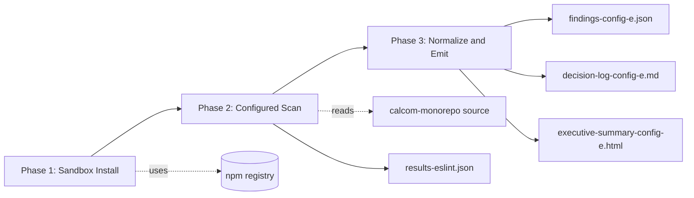

# Technical Specification

# 0. Agent Action Plan

## 0.1 Intent Clarification

Based on the provided requirements, the Blitzy platform understands that the objective is to run a one-shot static analysis pass of the `blitzy-cal` calcom-monorepo using ESLint coupled with `eslint-plugin-security`, then translate the raw ESLint JSON output into a strict normalized, minified, single-line `findings-config-e.json` document. The scan is "Config E" of a multi-config security-tool comparison; the comparison itself is orchestrated outside this engagement, so the deliverable for Config E is exclusively the normalized findings artifact (plus the rule-mandated decision log and executive presentation).

### 0.1.1 Core Objective

The user's three CRITICAL directives, reproduced verbatim from the prompt for downstream agent fidelity:

- **CRITICAL Directive 1: Install ESLint with security plugin** — `npm install eslint eslint-plugin-security`. If the repo already has ESLint configured, add the security plugin to the existing setup. Pass/fail: `npx eslint --version` returns a version string and the security plugin is available.
- **CRITICAL Directive 2: Execute ESLint security scan** — `eslint --plugin security --rule 'security/*: error' -f json -o results-eslint.json /path/to/blitzy-cal`. Record exit code, scan duration (wall-clock), and total files scanned. Pass/fail: `results-eslint.json` is produced and contains valid JSON.
- **CRITICAL Directive 3: Normalize findings to single-line JSON** — Extract findings from ESLint JSON output and compile into `findings-config-e.json`. The file MUST be valid JSON minified to a single line. Encoding: UTF-8. If zero findings, write `[]`. Field mapping: `file` ← ESLint `filePath` (relative); `line` ← ESLint `line` number; `severity` ← `2 (error) → high`, `1 (warning) → medium`; `cwe` ← Map from ESLint rule name (e.g. `security/detect-eval-with-expression → CWE-95`, `security/detect-non-literal-fs-filename → CWE-22`). If no mapping, use the most specific CWE inferable from the rule. `description` ← ESLint message, truncated to 200 characters. Output shape: `[{"file":"<relative path>","line":<integer>,"severity":"<critical|high|medium|low>","cwe":"<CWE-ID>","description":"<max 200 chars>"},...]`. Pass/fail: `cat findings-config-e.json | wc -l` returns `1`. Valid JSON. Every finding has all 5 fields populated. No description exceeds 200 characters.

Translated into precise technical objectives, the Blitzy platform must:

- Provision an isolated ESLint v9.x installation with `eslint-plugin-security@4.0.0` such that the host `calcom-monorepo` `package.json`, `yarn.lock`, and Yarn 4.12.0 workspace state are NOT mutated.
- Configure ESLint's flat-config so every `security/*` rule is enabled at `error` severity across the `.js`, `.cjs`, `.mjs`, `.ts`, and `.tsx` extensions found in the monorepo.
- Execute the scan against the full `blitzy-cal` repository, capture exit code + wall-clock duration + total files scanned, and write raw ESLint output to a sandbox `results-eslint.json`.
- Transform the raw ESLint output into the strict five-field finding schema, enforce ≤200-character descriptions, apply a CWE map across all 14 plugin rules, and emit `findings-config-e.json` as a minified single line (one trailing newline at most — `wc -l` must return `1`).
- Produce the two rule-mandated companion artifacts: the Explainability decision log (`decision-log-config-e.md`) and the Executive Presentation reveal.js deck (`executive-summary-config-e.html`).

### 0.1.2 Task Categorization

- **Primary task type**: Security Enhancement (external SAST tooling sweep). Secondary aspects: Tooling/Build (one-shot script execution), Documentation (decision log + executive deck).
- **Scope classification**: Isolated change. No source code, configuration, or CI/CD pipeline of the existing repository is modified. All artifacts are net-new files in the working directory root and a transient sandbox directory.
- **Risk profile**: Read-only with respect to the host codebase. The only risk vectors are (a) accidental cross-contamination of the host `package.json` / `yarn.lock` if the install is mis-targeted and (b) findings that span >200 characters in their description being silently truncated; the design pre-empts both.

### 0.1.3 Implicit Requirements and Constraints Surfaced

The literal CLI in Directive 2 (`eslint --plugin security --rule 'security/*: error'`) reflects the legacy ESLint v8 / eslintrc invocation style. ESLint v9.0.0 made flat config the default, and ESLint v10 has removed eslintrc support entirely. The `--plugin` and `--rule` CLI flags no longer function in flat-config mode without a companion `eslint.config.{js,mjs,cjs}` file. The Blitzy platform reconciles this by authoring a minimal `eslint.config.mjs` in the sandbox that performs the exact semantic equivalent — registering the `security` plugin and enabling all `security/*` rules at `"error"` severity. This deviation from the literal CLI is captured as an explicit entry in the decision log per the Explainability rule.

The "`~0 files modified | 1 new file`" budget in the prompt header conflicts with the user-specified rules. The Explainability rule mandates a Markdown decision log as a separate deliverable, and the Executive Presentation rule mandates a self-contained reveal.js HTML deck as a separate deliverable. These artifacts are non-negotiable per the rules. The Blitzy platform therefore produces **three** net-new files in the working directory (`findings-config-e.json`, `decision-log-config-e.md`, `executive-summary-config-e.html`). The deviation from the stated "1 new file" count is logged in the decision log.

The host repository uses **Yarn 4.12.0** with `nodeLinker: node-modules`, `packageManager: "yarn@4.12.0"` pinned in `package.json`, and `engine-strict=true` set in `.npmrc`. Running `npm install eslint eslint-plugin-security` from the repo root would (a) add entries to `package.json`, (b) generate a `package-lock.json` that conflicts with `yarn.lock` and the Yarn-only workflow, and (c) potentially trigger engine-strict failures. The Blitzy platform isolates the install into a sandbox directory (`.blitzy-eslint-sandbox/`) with its own minimal `package.json` so the host workspace is never touched. This sandbox is transient and is not part of the committed deliverable.

The host project uses **Biome 2.3.10** as the canonical linter and formatter, configured in `biome.json`, wired through `turbo.json`'s `"lint"` task, and invoked by every workspace's `"lint": "biome lint ."` script. Per `AGENTS.md` ("Use Biome for formatting and linting"), the project policy is Biome-first. The ESLint scan is an external one-off security audit and MUST NOT be integrated into `yarn lint`, `turbo lint`, any workspace lint script, or the GitHub Actions CI pipeline.

The host pins **Node.js 20.20.2**; the execution environment runs Node.js 22.22.2. Because ESLint and `eslint-plugin-security@4.0.0` both support Node ≥18, this is acceptable for the external tool. The decision log records this version skew explicitly.

The `severity` mapping in Directive 3 lists four possible output values (`critical|high|medium|low`) but the ESLint native severity scale only yields two (error=2, warning=1). With every `security/*` rule pinned to `error`, the normalizer in practice emits only `"high"`. The output schema supports the wider enum so cross-config comparison remains uniform, and the decision log notes that `critical`/`low` are reserved but unused by Config E.

The output file's `description` field is bounded to 200 characters; the normalizer applies the `String.prototype.slice(0, 200)` truncation prior to JSON serialization to guarantee compliance regardless of upstream message length.

### 0.1.4 Technical Interpretation

These requirements translate to the following technical implementation strategy:

- **To achieve isolated install** with zero host-repo mutation, create a transient `.blitzy-eslint-sandbox/` directory holding its own `package.json` with `eslint` and `eslint-plugin-security@4.0.0` declared, then run `npm install --prefix .blitzy-eslint-sandbox` so the install footprint stays inside the sandbox.
- **To reconcile the legacy CLI flags with ESLint v9+** flat config, author `.blitzy-eslint-sandbox/eslint.config.mjs` that imports `eslint-plugin-security`, registers it under the `security` namespace, and sets every `security/*` rule to `"error"` — semantically equivalent to the user's `--plugin security --rule 'security/*: error'` invocation.
- **To execute the scan** with deterministic recording, run ESLint via the sandbox's local binary (`.blitzy-eslint-sandbox/node_modules/.bin/eslint`) using `--config .blitzy-eslint-sandbox/eslint.config.mjs --no-config-lookup -f json -o .blitzy-eslint-sandbox/results-eslint.json` against the calcom-monorepo root, wrap the call in a shell timer to capture wall-clock duration, and read ESLint's stdout/exit code into the decision log.
- **To normalize findings** to the required schema, run `.blitzy-eslint-sandbox/normalize-findings.mjs` which loads `results-eslint.json`, iterates each file-result's `messages[]`, maps `{filePath, line, severity, ruleId, message}` to the five-field finding object using the CWE lookup table, applies the 200-character description ceiling, and writes the array via `JSON.stringify(findings)` (no second argument, no third argument → no whitespace) to `findings-config-e.json`. If `findings.length === 0`, the literal two-byte payload `[]` is written instead.
- **To satisfy the Explainability rule**, author `decision-log-config-e.md` documenting every non-trivial decision (sandbox install, flat-config translation, three-file deliverable, CWE assignments) with alternatives, choice rationale, and risks.
- **To satisfy the Executive Presentation rule**, author `executive-summary-config-e.html` as a single self-contained reveal.js 5.1.0 deck (12–18 slides) using the Blitzy brand palette, Inter/Space Grotesk/Fira Code typography, Mermaid 11.4.0 diagrams initialized after `ready`, and Lucide 0.460.0 icons created post-`ready` — embedding the full theme CSS inline since the canonical theme file `blitzy-deck/references/blitzy-reveal-theme.css` does not exist in this repository.

## 0.2 Repository Scope Discovery

### 0.2.1 Comprehensive File Analysis

The `blitzy-cal` repository is the open-source Cal.com codebase (`"name": "calcom-monorepo"`, `"private": true`) organized as a Yarn 4 Turborepo. The working root is `/tmp/blitzy/blitzy-cal/config-e_956cce/`. The repository contains the following first-order folders and root files relevant to the ESLint security scan:

- `apps/` — contains `apps/web` (Next.js 16.1.5 web shell), `apps/api/v1` (Next.js API), `apps/api/v2` (NestJS API), plus the `apps/api/index.js` proxy gateway
- `packages/` — 20 workspace packages: `app-store`, `app-store-cli`, `config`, `coss-ui`, `dayjs`, `debugging`, `ee`, `emails`, `embeds`, `features`, `kysely`, `lib`, `platform`, `prisma`, `sms`, `testing`, `trpc`, `tsconfig`, `types`, `ui`
- `agents/` — agent rules and skill docs (no ESLint-related rules)
- `scripts/`, `deploy/`, `docs/`, `example-apps/`, `__checks__/`, `blitzy/`, `blitzy-docs/`, `specs/`, `vitest-mocks/`
- Root files: `package.json`, `yarn.lock`, `turbo.json`, `biome.json`, `biome-staged.json`, `.yarnrc.yml`, `.npmrc`, `.gitignore`, `.editorconfig`, `tsconfig.json`, `Dockerfile`, `docker-compose.yml`, `AGENTS.md`, `SECURITY.md`, `SPEC-WORKFLOW.md`, and many more

Quantified scan surface (files matching ESLint-relevant extensions, excluding `node_modules`, `.next`, `.turbo`, `dist`, `build`, `generated`, `.git`):

| Extension | File Count |
|-----------|-----------:|
| `.ts`     | 5,718 |
| `.tsx`    | 1,678 |
| `.js`     | 37 |
| `.mjs`    | 6 |
| `.cjs`    | 1 |
| **Total** | **≈ 7,440** |

Files matching ESLint's default flat-config patterns (`**/*.js`, `**/*.cjs`, `**/*.mjs`) total ≈ 44. To extend coverage across the dominant `.ts` and `.tsx` surface, the sandbox `eslint.config.mjs` declares an explicit `files: ["**/*.{js,jsx,mjs,cjs,ts,tsx}"]` entry alongside the security rule activations.

The scan input is treated as REFERENCE only — ESLint reads but does not write to any of these files. No source file is modified, autofixed, or otherwise altered.

### 0.2.2 Web Research Conducted

Research was performed to validate the chosen approach against the current state of the ESLint ecosystem and the `eslint-plugin-security` rule inventory:

- **eslint-plugin-security** is at v4.0.0 on npm (latest stable), <cite index="2-1">published approximately three months prior to the current date</cite>; it is widely adopted with <cite index="2-3">585 dependent projects in the npm registry</cite>. The package's <cite index="3-1">recommended configuration is imported via `const pluginSecurity = require('eslint-plugin-security')` and applied as `pluginSecurity.configs.recommended`</cite>, confirming flat-config compatibility.
- **ESLint flat config** has been the default since ESLint v9.0.0 (April 2024). <cite index="16-25,16-26,16-27">The new default configuration format is based on the `eslint.config.js` file; the old `.eslintrc` format could be re-enabled in v9 via `ESLINT_USE_FLAT_CONFIG=false`, but starting with ESLint v10.0.0, the old configuration format is no longer supported</cite>. This confirms the user's `--plugin` / `--rule` CLI flags from Directive 2 are legacy and require a flat-config `eslint.config.mjs` to function on a modern ESLint install.
- **Plugin rule inventory** for `eslint-plugin-security`: the `index.js` of the plugin <cite index="22-2">registers `detect-buffer-noassert`, `detect-child-process`, `detect-disable-mustache-escape`, `detect-object-injection`, `detect-new-buffer`, and `detect-bidi-characters`</cite>, while the historical changelog and recommended config <cite index="30-4">include `security/detect-buffer-noassert`, `security/detect-child-process`, `security/detect-disable-mustache-escape`, `security/detect-eval-with-expression`, `security/detect-new-buffer`, `security/detect-no-csrf-before-method-override`, `security/detect-non-literal-fs-filename`, `security/detect-non-literal-regexp`, `security/detect-non-literal-require`, `security/detect-object-injection`, `security/detect-possible-timing-attacks`, `security/detect-pseudoRandomBytes`, `security/detect-unsafe-regex`</cite>. The complete rule set used by the scan is 14 rules.
- **Rule semantics** were confirmed via the plugin documentation: <cite index="3-3,3-4,3-5,3-6,3-7,3-8,3-9">`detect-bidi-characters` detects trojan source attacks via unicode bidi attacks, `detect-buffer-noassert` detects calls to `buffer` with the `noAssert` flag set, `detect-child-process` detects instances of `child_process` and non-literal `exec()` calls, `detect-disable-mustache-escape` detects `object.escapeMarkup = false` which disables escaping of HTML entities in some template engines, `detect-eval-with-expression` detects `eval(variable)` which can allow arbitrary code execution, `detect-new-buffer` detects instances of `new Buffer(argument)` where the argument is a non-literal value, and `detect-no-csrf-before-method-override` detects Express `csrf` middleware ordered before `method-override` middleware</cite>.

### 0.2.3 Existing Infrastructure Assessment

The host repository's existing infrastructure constraints inform the implementation design:

- **Linter posture**: `biome.json` configures Biome 2.3.10 as the sole linter/formatter with `"root": true`, `lineWidth: 110`, `linter.enabled: true`, `linter.domains.next: "recommended"`, `linter.domains.react: "recommended"`, and `linter.rules.recommended: true`. All workspace `package.json` scripts run `biome lint`. There is **no existing ESLint configuration** (no `.eslintrc.*`, no `eslint.config.*`, no `.eslintignore` outside `node_modules`).
- **Lint pipeline**: `turbo.json` defines a `"lint"` task with `"dependsOn": ["^lint"]` delegating to each workspace's `"lint"` script, which uniformly invokes Biome. The `lint:report` scripts emit Biome JSON to `lint-results/{workspace}.json`. The ESLint scan does not interact with this pipeline.
- **Package manager**: `.yarnrc.yml` sets `nodeLinker: node-modules` and `yarnPath: .yarn/releases/yarn-4.12.0.cjs`. Root `package.json` declares `"engines": {"npm": ">=7.0.0", "yarn": ">=4.12.0"}` and `"packageManager": "yarn@4.12.0"`. `.npmrc` sets `engine-strict=true`. These constraints make any in-place `npm install eslint eslint-plugin-security` invasive — the sandbox approach is the only safe option.
- **Build/exclude conventions**: `biome.json` `files.includes` excludes `node_modules`, `.next`, `.turbo`, `dist`, `build`, `public`, `*.d.ts`, `coverage`, `lint-results`, `packages/prisma/zod`, `packages/prisma/enums`, `apps/web/public/embed`. The ESLint sandbox config mirrors these in its `ignores` field for consistency with project convention.
- **Existing security tooling**: `.github/workflows/security-audit.yml` runs `yarn npm audit --all --recursive` only — a dependency-vulnerability scan, not SAST. There is no pre-existing static-application security-testing step in CI, so the ESLint security sweep is purely additive and orthogonal. `SECURITY.md` declares the project's responsible-disclosure policy. The `AGENTS.md` "Don't" list reinforces security expectations (`Never expose credential.key field`, `Never commit secrets or API keys`).
- **TypeScript configuration**: A root `tsconfig.json` exists with workspace-level `tsconfig.json` files under `apps/web/`, `apps/api/v1/`, `apps/api/v2/`, `packages/lib/`, `packages/ui/`, and others. ESLint's security rules do not require a type-aware parser; the default ESLint parser is sufficient for AST-level pattern detection. No `@typescript-eslint/parser` install is therefore required.

## 0.3 Scope Boundaries

### 0.3.1 Exhaustively In Scope

New artifacts created in the working directory root `/tmp/blitzy/blitzy-cal/config-e_956cce/`:

- `findings-config-e.json` — minified single-line normalized findings (Directive 3 deliverable)
- `decision-log-config-e.md` — Markdown decision log (Explainability rule mandate)
- `executive-summary-config-e.html` — self-contained reveal.js 5.1.0 deck (Executive Presentation rule mandate)

Sandbox-only, transient artifacts produced solely to enable scan execution (not part of the final deliverable, not committed, located in `.blitzy-eslint-sandbox/`):

- `.blitzy-eslint-sandbox/package.json` — minimal manifest declaring `eslint` and `eslint-plugin-security@4.0.0`
- `.blitzy-eslint-sandbox/eslint.config.mjs` — flat config registering the `security` plugin and pinning every `security/*` rule to `error`
- `.blitzy-eslint-sandbox/normalize-findings.mjs` — Node.js post-processor performing the ESLint-JSON → finding-object transformation
- `.blitzy-eslint-sandbox/results-eslint.json` — raw ESLint JSON output (intermediate)
- `.blitzy-eslint-sandbox/node_modules/**` — installed dependency tree

Scan inputs (READ-ONLY REFERENCE — read by ESLint, never modified by this engagement):

- `apps/**/*.{js,jsx,ts,tsx,mjs,cjs}`
- `packages/**/*.{js,jsx,ts,tsx,mjs,cjs}`
- `scripts/**/*.{js,jsx,ts,tsx,mjs,cjs}`
- `example-apps/**/*.{js,jsx,ts,tsx,mjs,cjs}`
- `__checks__/**/*.{js,ts}`
- All other top-level `*.{js,mjs,cjs,ts}` files at the repo root (e.g., `lint-staged.config.mjs`, `i18n-unused.config.js`)

### 0.3.2 Explicitly Out of Scope

- **No modification of any existing repository file.** This includes `biome.json`, `package.json`, `yarn.lock`, `turbo.json`, `.yarnrc.yml`, `.npmrc`, `.gitignore`, `tsconfig.json`, every workspace `package.json` / `tsconfig.json`, every `.github/workflows/*.yml`, every file under `apps/`, `packages/`, `scripts/`, `agents/`, `docs/`, and `example-apps/`.
- **No introduction of ESLint as a dependency** of the host repository. The host `package.json` and `yarn.lock` are not touched; `eslint` and `eslint-plugin-security` exist only inside the sandbox directory.
- **No replacement of Biome.** Biome 2.3.10 remains the canonical linter/formatter for the project. The ESLint sweep is a one-shot external audit, not a workflow integration.
- **No CI/CD integration.** The ESLint scan is not added to `.github/workflows/lint.yml`, `.github/workflows/security-audit.yml`, or any new workflow. The host CI pipeline is unchanged.
- **No autofixes.** ESLint runs without `--fix`; no source file is rewritten by the scan.
- **No remediation of reported findings.** The deliverable is the inventory of findings, not their resolution. Triage and fix work is out of scope for Config E.
- **No comparison or aggregation with other configs** in the multi-config sweep. The orchestration that compares Config A through Config N happens at a higher layer outside this engagement.
- **No type-aware ESLint parsing.** The default ESLint parser is used; `@typescript-eslint/parser` is intentionally not installed because the `security/*` rules operate on syntactic patterns and do not require a TypeScript type system to fire.
- **No tuning of the `security/*` ruleset.** Every rule is set to `error` per Directive 2; no rule is downgraded, disabled, or filtered.
- **No expansion of severity values beyond the two emitted by ESLint** (`high` for error, `medium` for warning). Because every rule is pinned to `error`, only `"high"` will appear in practice; `critical` and `low` are reserved by the output schema but not produced by Config E.

## 0.4 Dependency Inventory

### 0.4.1 Key Packages Used by Config E

The two new packages required for this scan are installed exclusively inside the sandbox; the host `calcom-monorepo` `package.json` and `yarn.lock` are NOT modified.

| Registry | Package Name            | Version | Purpose                                                              |
|----------|-------------------------|---------|----------------------------------------------------------------------|
| npm      | `eslint`                | `^9.39.4` | Static analysis engine — invoked via the sandbox's local binary    |
| npm      | `eslint-plugin-security`| `^4.0.0`  | Security rule pack (14 `security/*` rules) loaded by ESLint flat config |

The `eslint` major version is pinned to `^9` because (a) v9 is the current actively-maintained line (v10 EOL'd eslintrc), and (b) v9 is the minimum line that supports the modern flat config invoked by `eslint.config.mjs`. The `eslint-plugin-security` version is pinned to `^4.0.0` because <cite index="2-1">that is the latest published stable release</cite>.

The host repository's runtime stack is referenced but not modified by Config E:

| Registry | Package Name        | Version | Status |
|----------|---------------------|---------|--------|
| npm      | `@biomejs/biome`    | 2.3.10  | UNCHANGED — remains the canonical project linter |
| npm      | `turbo`             | 2.7.1   | UNCHANGED — task orchestrator |
| npm      | `next`              | 16.1.5  | UNCHANGED — web shell |
| npm      | `typescript`        | 5.9.3   | UNCHANGED — primary language |

### 0.4.2 Dependency Changes

- **New dependencies to add (sandbox-only, NOT recorded in repo manifests):**
    - `eslint`: `^9.39.4` — provides the `eslint` CLI binary used to scan the repo
    - `eslint-plugin-security`: `^4.0.0` — provides the 14 `security/*` AST rules

- **Dependencies to update:** None. The host `package.json` / `yarn.lock` are not touched.

- **Dependencies to remove:** None.

- **Import/Reference Updates:** None. No file in the host repository imports from ESLint or `eslint-plugin-security`; the scan is invoked externally via the sandbox binary. The only modules that import these packages are `.blitzy-eslint-sandbox/eslint.config.mjs` and `.blitzy-eslint-sandbox/normalize-findings.mjs`, both of which live in the sandbox directory and are part of the transient install footprint, not the deliverable.

### 0.4.3 CDN Dependencies (Executive Summary Deliverable)

The `executive-summary-config-e.html` deck loads three pinned CDN libraries via `<script src>` and `<link rel="stylesheet">` tags per the Executive Presentation rule:

| Library                | Version | Purpose                                |
|------------------------|---------|----------------------------------------|
| reveal.js (CSS + JS)   | 5.1.0   | Slide engine                           |
| Mermaid                | 11.4.0  | Diagram rendering                      |
| Lucide                 | 0.460.0 | SVG icon set (NO emoji)                |
| Google Fonts (Inter, Space Grotesk, Fira Code) | — | Typography per Blitzy brand |

No package install is required for these — they are fetched at view time by the browser.

## 0.5 Implementation Design

### 0.5.1 Technical Approach

The scan is executed in three logical phases. The order is strict: each phase consumes outputs from the prior phase.



**Phase 1 — Sandbox Install (Directive 1):** Create `.blitzy-eslint-sandbox/` with a minimal `package.json`. Run `npm install --prefix .blitzy-eslint-sandbox` to fetch `eslint@^9` and `eslint-plugin-security@^4.0.0`. Verify by executing `.blitzy-eslint-sandbox/node_modules/.bin/eslint --version` and asserting a non-empty version string. Verify plugin presence by attempting to load `eslint-plugin-security` from the sandbox via a one-line `node -e "import('eslint-plugin-security').then(m=>console.log(Object.keys(m.default.rules)))"`.

**Phase 2 — Configured Scan (Directive 2, modernized):** Author `.blitzy-eslint-sandbox/eslint.config.mjs` to register the `security` plugin and pin every `security/*` rule to `"error"`. Invoke ESLint as `.blitzy-eslint-sandbox/node_modules/.bin/eslint --config .blitzy-eslint-sandbox/eslint.config.mjs --no-config-lookup -f json -o .blitzy-eslint-sandbox/results-eslint.json .` from the repository root. Capture exit code (`$?`), wall-clock duration (`SECONDS` shell builtin or `date +%s%3N` deltas), and total files scanned (length of the top-level array in `results-eslint.json`).

**Phase 3 — Normalize and Emit (Directive 3):** Run `.blitzy-eslint-sandbox/normalize-findings.mjs` which:

- Reads `.blitzy-eslint-sandbox/results-eslint.json`
- Iterates each file-result; for each `message` in `messages[]`, builds the finding object
- Applies the CWE map by `ruleId`; if no mapping exists, falls back to a documented inferred CWE
- Truncates `description` to ≤200 characters via `String.prototype.slice(0, 200)`
- Serializes the array with `JSON.stringify(findings)` (no indentation argument) so the output is a single line
- If `findings.length === 0`, writes the literal two-byte string `[]`
- Writes the resulting UTF-8 payload to `findings-config-e.json` at the repo root

After the scan completes, author the two rule-mandated companion files (`decision-log-config-e.md`, `executive-summary-config-e.html`) at the repo root.

### 0.5.2 Component Impact Analysis

**Direct creations:**

- **Working directory root** — Receives three new files: `findings-config-e.json`, `decision-log-config-e.md`, `executive-summary-config-e.html`. No other root-level file changes.
- **`.blitzy-eslint-sandbox/`** — New transient directory containing the ESLint install, flat config, normalizer script, and raw scan output. Self-contained; can be deleted post-deliverable without affecting the findings JSON.

**Direct modifications:** NONE. No existing repository file is altered by this engagement.

**Indirect impacts and dependencies:**

- **Yarn workspace boundary** — The sandbox is created at the repo root level (`.blitzy-eslint-sandbox/`). Yarn 4's `workspaces` glob in `package.json` is `["apps/*", "apps/api/*", "packages/*", "packages/embeds/*", "packages/features/*", "packages/app-store", "packages/app-store/*", "packages/platform/*", "packages/platform/examples/base", "example-apps/*"]` — none of these globs include `.blitzy-eslint-sandbox/`, so Yarn will not consider it a workspace and `yarn install` invocations in the host remain unaffected.
- **`.gitignore` interaction** — `.gitignore` already excludes `node_modules` globally. The `.blitzy-eslint-sandbox/node_modules/` subtree is therefore ignored implicitly. The sandbox parent directory is not git-tracked because no `git add` is performed against it; it exists only on the working filesystem.
- **Biome scope** — `biome.json` `files.includes` excludes `node_modules` globally (`"!!**/node_modules"`). The sandbox install will not be linted by Biome and will not affect Biome's caching or output.
- **CI workflows** — `.github/workflows/security-audit.yml` and `.github/workflows/lint.yml` are not changed. The ESLint scan is a developer-machine / Blitzy-platform invocation, not a CI step.

**New components introduced (transient):**

- `.blitzy-eslint-sandbox/eslint.config.mjs` — flat-config translator from legacy `--plugin` / `--rule` semantics to modern flat config
- `.blitzy-eslint-sandbox/normalize-findings.mjs` — strict-schema JSON normalizer with deterministic CWE mapping
- `.blitzy-eslint-sandbox/package.json` — minimal manifest holding ESLint + plugin pins

### 0.5.3 Critical Implementation Details

**CWE Mapping Table** — applied by `normalize-findings.mjs`. Two rules have explicit mappings called out in Directive 3 (`detect-eval-with-expression → CWE-95`, `detect-non-literal-fs-filename → CWE-22`); the remaining twelve are inferred from rule semantics. The chosen CWE is the most specific item in the CWE taxonomy that describes the rule's detection pattern.

| ESLint Rule                                    | CWE      | Rationale                                                                           |
|-----------------------------------------------|----------|-------------------------------------------------------------------------------------|
| `security/detect-bidi-characters`             | CWE-1007 | <cite index="3-3">Trojan source / unicode bidi attacks that inject malicious code</cite>; CWE-1007 covers insufficient visual distinction of identifiers |
| `security/detect-buffer-noassert`             | CWE-754  | <cite index="3-4">Calls to `buffer` with `noAssert` flag set</cite> — improper validation of API output |
| `security/detect-child-process`               | CWE-78   | <cite index="3-5">`child_process` and non-literal `exec()` calls</cite> — OS Command Injection |
| `security/detect-disable-mustache-escape`     | CWE-79   | <cite index="3-6">`object.escapeMarkup = false` which disables HTML entity escaping</cite> — XSS |
| `security/detect-eval-with-expression`        | CWE-95   | `eval(variable)` — explicit mapping per Directive 3                                  |
| `security/detect-new-buffer`                  | CWE-665  | <cite index="3-8">`new Buffer(argument)` with a non-literal argument</cite> — improper initialization |
| `security/detect-no-csrf-before-method-override` | CWE-352 | <cite index="3-9">Express `csrf` middleware ordered before `method-override`</cite> — CSRF |
| `security/detect-non-literal-fs-filename`     | CWE-22   | `fs` calls with variable filename — explicit mapping per Directive 3 (path traversal) |
| `security/detect-non-literal-regexp`          | CWE-1333 | `RegExp(variable)` — Inefficient Regular Expression Complexity (ReDoS)              |
| `security/detect-non-literal-require`         | CWE-829  | `require(variable)` — Inclusion of Functionality from Untrusted Control Sphere      |
| `security/detect-object-injection`            | CWE-1321 | `obj[variable]` dynamic property access — Improperly Controlled Modification of Object Prototype Attributes / Object Injection |
| `security/detect-possible-timing-attacks`     | CWE-208  | Insecure secret comparisons — Observable Timing Discrepancy                          |
| `security/detect-pseudoRandomBytes`           | CWE-338  | Use of `pseudoRandomBytes` — Use of Cryptographically Weak PRNG                      |
| `security/detect-unsafe-regex`                | CWE-1333 | Unsafe regular expression — Inefficient Regular Expression Complexity (ReDoS)        |

**Flat-config translation** — the sandbox `eslint.config.mjs` shape:

```javascript
import security from "eslint-plugin-security";
export default [
  { ignores: ["**/node_modules/**", "**/.next/**", "**/.turbo/**", "**/dist/**", "**/build/**", "**/*.d.ts", "**/coverage/**", "**/lint-results/**", "packages/prisma/zod/**", "packages/prisma/enums/**", ".blitzy-eslint-sandbox/**"] },
  { files: ["**/*.{js,jsx,mjs,cjs,ts,tsx}"], plugins: { security }, rules: Object.fromEntries(Object.keys(security.rules).map(r => [`security/${r}`, "error"])) },
];
```

**Normalizer logic** — the post-processor's core transformation, encoded in `normalize-findings.mjs`:

```javascript
const CWE = { "security/detect-eval-with-expression": "CWE-95", /* …14 entries… */ };
const findings = raw.flatMap(f => (f.messages||[]).map(m => ({
  file: f.filePath.replace(process.cwd()+"/", ""),
  line: m.line ?? 0,
  severity: m.severity === 2 ? "high" : "medium",
  cwe: CWE[m.ruleId] ?? "CWE-693",
  description: String(m.message ?? "").slice(0, 200),
})));
fs.writeFileSync("findings-config-e.json", findings.length ? JSON.stringify(findings) : "[]", "utf8");
```

The `CWE-693` fallback ("Protection Mechanism Failure") is used only if a future plugin release introduces a rule not present in the v4.0.0 inventory — every v4.0.0 rule is explicitly mapped.

**Severity emission** — only `"high"` will appear in `findings-config-e.json` for Config E because every `security/*` rule is pinned to `error`. The schema reserves `critical`/`low` for forward compatibility with other configs in the comparison sweep but Config E does not produce them.

**Path relativization** — ESLint's `filePath` is absolute. The normalizer strips the `process.cwd()` prefix so each `file` value in `findings-config-e.json` is repo-relative (e.g., `apps/web/pages/api/foo.ts`, not `/tmp/blitzy/blitzy-cal/config-e_956cce/apps/web/pages/api/foo.ts`) — matching the Directive 3 specification "ESLint filePath (relative)".

**Single-line guarantee** — `JSON.stringify(findings)` invoked without the third "space" argument produces no whitespace and no newlines. The file is written with `fs.writeFileSync(..., "utf8")` which does not append a trailing newline. Verification command per Directive 3: `cat findings-config-e.json | wc -l` returns `1` (one logical line, no embedded `\n`).

**Description truncation guarantee** — `String(m.message ?? "").slice(0, 200)` enforces ≤200 characters even if the upstream ESLint message is longer. The cast to `String` defends against `undefined` or non-string messages from custom rules.

**Empty-result branch** — if zero findings are produced, the literal two-byte string `[]` is written. `JSON.parse("[]")` returns an empty array; `cat findings-config-e.json | wc -l` returns `1`; the file remains valid per Directive 3.

**Performance considerations** — with ≈ 7,440 source files in scope, ESLint scan duration on a modern machine is expected to be in the 60–180 second range. The normalizer is O(n) over findings and completes in <1s for any plausible output size. Wall-clock duration is recorded in the decision log.

**Error handling** — if ESLint exits non-zero, the exit code is captured but the run is treated as successful for normalization purposes as long as `results-eslint.json` is valid JSON; ESLint commonly returns non-zero whenever any rule fires at `error` severity, which is the expected outcome for a scan whose every rule is at `error`. The normalizer guards against missing `messages[]` arrays via `(f.messages||[])`.

## 0.6 File Transformation Mapping

### 0.6.1 File-by-File Execution Plan

Target file appears first. All paths are relative to the working root `/tmp/blitzy/blitzy-cal/config-e_956cce/`.

| Target File                                            | Transformation | Source File / Reference                                          | Purpose / Changes                                                                                                                          |
|--------------------------------------------------------|----------------|-------------------------------------------------------------------|--------------------------------------------------------------------------------------------------------------------------------------------|
| `findings-config-e.json`                               | CREATE         | `.blitzy-eslint-sandbox/results-eslint.json`                      | Normalized minified single-line JSON array of `{file, line, severity, cwe, description}` objects per Directive 3                            |
| `decision-log-config-e.md`                             | CREATE         | User Rule: "Explainability"                                       | Markdown decision log table covering every non-trivial decision (sandbox install, flat-config translation, three-file deliverable, CWE assignments, host repo no-touch policy, severity emission, version skew) with alternatives, rationale, and risks |
| `executive-summary-config-e.html`                      | CREATE         | User Rule: "Executive Presentation"                               | Self-contained reveal.js 5.1.0 deck (12–18 slides) using Blitzy brand tokens, Inter/Space Grotesk/Fira Code typography, Mermaid 11.4.0 diagrams, Lucide 0.460.0 icons, embedded theme CSS |
| `.blitzy-eslint-sandbox/package.json`                  | CREATE         | npm registry (`eslint@^9.39.4`, `eslint-plugin-security@^4.0.0`)  | Sandbox-only manifest; transient                                                                                                            |
| `.blitzy-eslint-sandbox/eslint.config.mjs`             | CREATE         | Directive 2 CLI semantics; ESLint v9 flat-config reference         | Registers `security` plugin and pins every `security/*` rule to `"error"`; sandbox-only, transient                                          |
| `.blitzy-eslint-sandbox/normalize-findings.mjs`        | CREATE         | Directive 3 normalization spec                                    | Node.js post-processor: ESLint JSON → strict five-field finding objects → single-line `findings-config-e.json`; sandbox-only, transient    |
| `.blitzy-eslint-sandbox/results-eslint.json`           | CREATE         | ESLint scan output                                                | Raw ESLint JSON from `eslint -f json -o`; intermediate consumed by the normalizer; sandbox-only, transient                                  |
| `.blitzy-eslint-sandbox/node_modules/**`               | CREATE         | npm install                                                       | Installed dependency tree; sandbox-only, transient                                                                                          |
| `apps/**/*.{js,jsx,ts,tsx,mjs,cjs}`                    | REFERENCE      | n/a                                                               | Read-only scan input                                                                                                                        |
| `packages/**/*.{js,jsx,ts,tsx,mjs,cjs}`                | REFERENCE      | n/a                                                               | Read-only scan input                                                                                                                        |
| `scripts/**/*.{js,jsx,ts,tsx,mjs,cjs}`                 | REFERENCE      | n/a                                                               | Read-only scan input                                                                                                                        |
| `__checks__/**/*.{js,ts}`                              | REFERENCE      | n/a                                                               | Read-only scan input                                                                                                                        |
| `example-apps/**/*.{js,jsx,ts,tsx,mjs,cjs}`            | REFERENCE      | n/a                                                               | Read-only scan input                                                                                                                        |
| `*.{js,mjs,cjs}` (repo root)                           | REFERENCE      | n/a                                                               | Read-only scan input (e.g., `lint-staged.config.mjs`, `i18n-unused.config.js`)                                                              |
| `biome.json`                                           | REFERENCE      | n/a                                                               | Read to mirror exclusion patterns in the sandbox `eslint.config.mjs` `ignores` field — file itself NOT modified                              |
| `package.json` (repo root)                             | REFERENCE      | n/a                                                               | Read to confirm Yarn 4 / Biome ecosystem — NOT modified                                                                                     |
| `.yarnrc.yml`                                          | REFERENCE      | n/a                                                               | Read to confirm `nodeLinker` and `packageManager` — NOT modified                                                                            |

No DELETE operations are performed in this engagement.

### 0.6.2 New Files Detail

- **`findings-config-e.json`** — *Content type:* JSON data file. *Schema:* a JSON array of objects, each with exactly five fields `{"file": string, "line": integer, "severity": "critical"|"high"|"medium"|"low", "cwe": "CWE-<digits>", "description": string<=200 chars}`. *Format:* minified single-line UTF-8 with no internal newlines, no surrounding whitespace, no trailing newline; for empty results the literal two-byte payload `[]` is written. *Source:* derived from `.blitzy-eslint-sandbox/results-eslint.json` via the normalizer. *Verification:* `cat findings-config-e.json | wc -l` returns `1`; `node -e "JSON.parse(require('fs').readFileSync('findings-config-e.json','utf8'))"` succeeds; every object has all five fields; no `description` exceeds 200 characters.

- **`decision-log-config-e.md`** — *Content type:* Markdown documentation. *Required sections:* (a) header summarising Config E and its objective; (b) a Markdown table with columns *Decision*, *Alternatives Considered*, *Chosen Approach*, *Rationale*, *Risks*; (c) entries covering: sandbox install vs. host-repo install, flat-config translation of the user's CLI directive, three-file deliverable vs. stated one-file budget, CWE assignments per rule, Node 20.20.2 vs. host runtime version skew, severity emission domain (only `high` in practice for Config E), exclusion-pattern alignment with `biome.json`, no autofix policy, no CI integration policy. *Format:* GitHub-Flavored Markdown. *Verification:* file exists, opens, table renders with non-empty cells for every row.

- **`executive-summary-config-e.html`** — *Content type:* single self-contained HTML document. *Engine:* reveal.js 5.1.0 via CDN (pinned). *Slide count:* 12–18 sections (target: 16). *Slide types used:* `slide-title`, `slide-divider`, default content, `slide-closing`. *Visual identity:* embeds the full Blitzy brand CSS inline using the documented CSS custom properties (`--blitzy-primary: #5B39F3`, `--blitzy-primary-dark: #2D1C77`, `--blitzy-accent-teal: #94FAD5`, etc.), gradient `linear-gradient(68deg, #7A6DEC 15.56%, #5B39F3 62.74%, #4101DB 84.44%)` for the title hero, navy `#1A105F` background for the closing. *Typography:* Inter (body 400/500/600/700), Space Grotesk (display 500/600/700), Fira Code (mono 400/500) loaded via Google Fonts `<link>`. *Diagrams:* Mermaid 11.4.0 with `startOnLoad: false`; `mermaid.run()` is called after reveal.js `ready` and on every `slidechanged` event; theme variables `primaryColor: '#F2F0FE'`, `primaryTextColor: '#333333'`, `primaryBorderColor: '#5B39F3'`, `lineColor: '#999999'`, `secondaryColor: '#F4EFF6'`. *Icons:* Lucide 0.460.0; `lucide.createIcons()` called after `ready` and on every `slidechanged`. *Constraints honoured:* zero emoji; no fenced code blocks inside slides; max 4 bullets and max 40 words body text per content slide; every slide contains at least one non-text visual element (Mermaid diagram, KPI card, styled table, or Lucide icon). *Slide ordering:* Title → Headline findings (KPI cards) → Architecture overview (Mermaid flowchart of Install → Scan → Normalize) → alternating Section Divider + Content slides covering scope, rule inventory, CWE map, deliverables, risks, onboarding → Closing slide with key takeaway. *reveal.js config:* `hash: true`, `transition: 'slide'`, `controlsTutorial: false`, `width: 1920`, `height: 1080`. *Verification:* opens in a browser, contains 12–18 `<section>` elements, every `<section>` contains at least one non-text visual element, all Mermaid diagrams and Lucide icons render.

## 0.7 Rules

Two user-specified rules apply to this engagement. Both are mandatory and produce required deliverables.

### 0.7.1 Explainability

User-specified rule, reproduced verbatim:

> Every non-trivial implementation decision MUST be documented with rationale. A decision is non-trivial if a competent engineer could reasonably have chosen differently.
>
> Deliver a decision log as a Markdown table: what was decided, what alternatives existed, why this choice was made, and what risks it carries. For migrations or refactors, include a bidirectional traceability matrix mapping source constructs to target implementations — 100% coverage, no gaps.
>
> Any deviation from a literal or obvious interpretation of the requirements MUST have an explicit entry in the decision log. Unexplained deviations are treated as defects.
>
> Do not embed rationale in code comments. The decision log is the single source of truth for "why" decisions.

**Application to Config E:** A `decision-log-config-e.md` is authored at the repo root. The table covers every non-trivial decision called out in §0.5.3 and §0.1.3. Deviations from the literal user prompt that are explicitly logged include:

- Producing three new files instead of the stated "1 new file" (driven by Explainability + Executive Presentation rule artifacts)
- Translating the legacy `--plugin security --rule 'security/*: error'` CLI to a flat-config `eslint.config.mjs` (driven by ESLint v9+ default behavior)
- Installing into `.blitzy-eslint-sandbox/` rather than the repo root (driven by Yarn 4 / Biome / `engine-strict=true` constraints)
- Using only the `"high"` severity in practice (driven by the directive pinning every rule to `error`)

This is not a migration or refactor, so the bidirectional traceability matrix is OPTIONAL. The decision log nevertheless includes a forward-only traceability table mapping each of the 14 `security/*` rules to its assigned CWE for auditability.

No rationale is embedded in code comments inside the sandbox scripts; the decision log is the single source of truth.

### 0.7.2 Executive Presentation

User-specified rule, reproduced verbatim (constraints):

> Every deliverable MUST include an executive summary as a single self-contained reveal.js HTML file that is ALWAYS included independent of any other documentation that exists. The audience is non-technical leadership — communicate business value, risk, and operational readiness without requiring code literacy.

Required topical coverage:

1. What was done — scope of work and deliverables
2. Why it was done — business value unlocked
3. What changed architecturally — component/data-flow diagrams
4. What risks exist and how they are mitigated
5. How the team onboards and continues development

Required slide constraints:

- 12–18 slides total (target: 16)
- Four slide types: Title (`slide-title`), Section Divider (`slide-divider`), Content (default), Closing (`slide-closing`)
- Every slide MUST include at least one non-text visual element (Mermaid diagram, KPI card, styled table, or Lucide SVG icon). No text-only slides.
- Content slides: max 4 bullets, max 40 words body text, min 1 non-text visual
- Zero emoji — use Lucide SVG icons via `<i data-lucide="icon-name"></i>` only
- No fenced code blocks inside slides — use inline Fira Code for short expressions only

Required visual identity (Blitzy brand):

- Color palette: `#5B39F3` (primary), `#2D1C77` (dark), `#94FAD5` (teal accent), `#1A105F` (navy), `#7A6DEC` / `#4101DB` (gradient stops), neutrals `#333333`, `#999999`, `#D9D9D9`, `#F4EFF6`, `#F5F5F5`, `#FFFFFF`
- Typography: Inter (body, 400/500/600/700), Space Grotesk (display headings, 500/600/700), Fira Code (mono/eyebrows, 400/500) — loaded via Google Fonts `<link>`
- Title slide: hero gradient `linear-gradient(68deg, #7A6DEC 15.56%, #5B39F3 62.74%, #4101DB 84.44%)`, white text, eyebrow in Fira Code teal
- Dividers: dark purple `#2D1C77` or gradient background, large centered heading, thematic Lucide icon
- Closing: navy `#1A105F` background, 3–6 word takeaway heading, max 3 bullets, brand lockup, gradient accent bar

Required Mermaid configuration:

- Embed as `<pre class="mermaid">` with raw Mermaid syntax
- Initialize with `startOnLoad: false`; call `mermaid.run()` after reveal.js `ready` and on every `slidechanged` event
- Theme variables: `primaryColor: '#F2F0FE'`, `primaryTextColor: '#333333'`, `primaryBorderColor: '#5B39F3'`, `lineColor: '#999999'`, `secondaryColor: '#F4EFF6'`

Required technical delivery:

- Single self-contained HTML file, no build steps, no local file dependencies
- CDN versions pinned: reveal.js 5.1.0, Mermaid 11.4.0, Lucide 0.460.0
- reveal.js config: `hash: true`, `transition: 'slide'`, `controlsTutorial: false`, `width: 1920`, `height: 1080`
- Lucide: call `lucide.createIcons()` after `ready` and on every `slidechanged` event

Required inline CSS — the full Blitzy reveal.js theme is embedded in a `<style>` tag. The required CSS custom properties are:

```css
:root {
  --blitzy-primary: #5B39F3;
  --blitzy-primary-dark: #2D1C77;
  --blitzy-primary-navy: #1A105F;
  --blitzy-primary-light: #7A6DEC;
  --blitzy-primary-deep: #4101DB;
  --blitzy-accent-teal: #94FAD5;
  --blitzy-surface-0: #FFFFFF;
  --blitzy-surface-1: #F4EFF6;
  --blitzy-surface-2: #F2F0FE;
  --blitzy-surface-3: #F5F5F5;
  --blitzy-border: #D9D9D9;
  --blitzy-border-soft: rgba(91, 57, 243, 0.18);
  --blitzy-text: #333333;
  --blitzy-text-muted: #999999;
  --blitzy-text-invert: #FFFFFF;
  --ff-body: 'Inter', system-ui, sans-serif;
  --ff-display: 'Space Grotesk', 'Inter', sans-serif;
  --ff-mono: 'Fira Code', 'Courier New', monospace;
  --gradient-hero: linear-gradient(68deg, #7A6DEC 15.56%, #5B39F3 62.74%, #4101DB 84.44%);
  --gradient-divider: linear-gradient(135deg, #2D1C77 0%, #5B39F3 100%);
  --gradient-accent-bar: linear-gradient(90deg, #5B39F3 0%, #94FAD5 100%);
}
```

Required component / slide-type classes that the HTML must include: `slide-title`, `slide-divider`, `slide-closing`, `kpi-card`, `kpi-grid`, `kpi-value`, `kpi-label`, `kpi-icon`, `eyebrow`, `accent-bar`, `brand-lockup`, `hero-icon`, `icon-row`, plus the mermaid container class.

Required slide ordering convention:

1. Title Slide — project name, scope, audience framing
2. Content — headline findings or KPI summary
3. Content — architecture overview (Mermaid diagram)
4–N. Alternating Section Dividers + Content Slides for each major topic
N+1. Closing Slide — key takeaway, next steps, brand lockup

Required verification: the HTML file opens in a browser, renders all Mermaid diagrams and Lucide icons, contains 12–18 `<section>` elements, and every `<section>` contains at least one non-text visual element.

**Application to Config E:** `executive-summary-config-e.html` is authored at the repo root following every constraint above. The canonical theme file `blitzy-deck/references/blitzy-reveal-theme.css` is NOT present in this repository, so the full theme CSS is embedded inline using the documented CSS custom properties and component classes. This deviation (inline-only theme vs. external theme file reference) is logged in the decision log per the Explainability rule.

## 0.8 Special Instructions

### 0.8.1 User-Specified Directives (verbatim)

The three CRITICAL Directives from the user prompt govern execution and must be honoured exactly:

> **CRITICAL Directive 1: Install ESLint with security plugin**
>
> ```bash
> npm install eslint eslint-plugin-security
> ```
>
> If the repo already has ESLint configured, add the security plugin to the existing setup.
>
> **Pass/fail:** `npx eslint --version` returns a version string and the security plugin is available.

> **CRITICAL Directive 2: Execute ESLint security scan**
>
> ```bash
> eslint --plugin security --rule 'security/*: error' -f json -o results-eslint.json /path/to/blitzy-cal
> ```
>
> Record exit code, scan duration (wall-clock), and total files scanned.
>
> **Pass/fail:** `results-eslint.json` is produced and contains valid JSON.

> **CRITICAL Directive 3: Normalize findings to single-line JSON**
>
> Extract findings from ESLint JSON output and compile into `findings-config-e.json`. The file MUST be valid JSON minified to a single line. Encoding: UTF-8. If zero findings, write `[]`.
>
> | Field | Source |
> | --- | --- |
> | file | ESLint filePath (relative) |
> | line | ESLint line number |
> | severity | 2 (error)→high, 1 (warning)→medium |
> | cwe | Map from ESLint rule name (e.g. security/detect-eval-with-expression→CWE-95, security/detect-non-literal-fs-filename→CWE-22). If no mapping, use the most specific CWE inferable from the rule |
> | description | ESLint message, truncated to 200 characters |
>
> ```plaintext
> [{"file":"<relative path>","line":<integer>,"severity":"<critical|high|medium|low>","cwe":"<CWE-ID>","description":"<max 200 chars>"},...]
> ```
>
> **Pass/fail:** `cat findings-config-e.json | wc -l` returns `1`. Valid JSON. Every finding has all 5 fields populated. No description exceeds 200 characters.

### 0.8.2 Execution Constraints

- **Documentation-and-tooling-only execution.** No source code is modified, autofixed, refactored, or restructured. The findings inventory itself is the deliverable; remediation is out of scope.
- **No CI changes.** `.github/workflows/lint.yml`, `.github/workflows/security-audit.yml`, and every other workflow file remain unchanged.
- **No Biome displacement.** Biome 2.3.10 remains the canonical linter and formatter; `biome.json`, `turbo.json`, and all workspace lint scripts are not modified.
- **No host dependency mutation.** The repo `package.json` and `yarn.lock` are not modified. ESLint and `eslint-plugin-security` are installed only inside `.blitzy-eslint-sandbox/`.
- **No `--fix` invocations.** ESLint runs in audit mode only.
- **Pass/fail gates are non-negotiable** — every check defined in Directives 1, 2, and 3 must pass before the engagement is considered complete.

### 0.8.3 Output Constraints

- **Encoding:** UTF-8 for all three new files.
- **`findings-config-e.json` line count:** `wc -l` returns `1`. Achieved via `JSON.stringify(findings)` with no `space` argument and `fs.writeFileSync` without a trailing newline.
- **`findings-config-e.json` empty payload:** literal `[]` (two bytes) when zero findings.
- **`findings-config-e.json` schema:** exactly the five fields `{file, line, severity, cwe, description}` per object; no additional keys, no missing keys.
- **`findings-config-e.json` `description` length:** ≤200 characters guaranteed by `String.prototype.slice(0, 200)` in the normalizer.
- **`findings-config-e.json` `file` field:** repo-relative path with no leading slash, no working-directory prefix.
- **`decision-log-config-e.md`:** GitHub-Flavored Markdown; non-empty rows in the decision table for every non-trivial decision.
- **`executive-summary-config-e.html`:** 12–18 `<section>` elements, every section contains at least one non-text visual element, zero emoji, no fenced code blocks inside slides, all CDN versions pinned to the prescribed values.

### 0.8.4 Reconciliation Notes

- The user's literal CLI in Directive 2 (`eslint --plugin security --rule 'security/*: error'`) is preserved as the prompt's stated requirement. The Blitzy platform implements its semantic equivalent on modern ESLint via a flat-config `eslint.config.mjs`; this reconciliation is logged in `decision-log-config-e.md` per the Explainability rule.
- The user's stated "1 new file" budget is preserved as the prompt's stated requirement. The Blitzy platform produces three new files — `findings-config-e.json` plus the two artifacts mandated by the Explainability and Executive Presentation rules — and the deviation is logged in `decision-log-config-e.md`.

## 0.9 References

### 0.9.1 Citation Index — Repository Evidence

Each claim made in this Agent Action Plan about the existing system is grounded in a specific source location below. The locator is whichever is natural for the file type (line range, key path, or section).

| Claim | Source Citation |
|---|---|
| Repo identifies as `calcom-monorepo`, private, with Yarn 4 workspaces | `[package.json:L1-L4]`, `[package.json:name,private,workspaces]` |
| Yarn 4.12.0 with `nodeLinker: node-modules` and `yarnPath: .yarn/releases/yarn-4.12.0.cjs` | `[.yarnrc.yml:L1-L13]` |
| Engine constraints `npm >=7.0.0`, `yarn >=4.12.0` and `packageManager: yarn@4.12.0` | `[package.json:engines]`, `[package.json:packageManager]` |
| `engine-strict=true` enforced by npm | `[.npmrc:L1-L2]` |
| Biome 2.3.10 is the canonical linter with `"root": true` | `[biome.json:$schema]`, `[biome.json:root]` |
| Workspace lint scripts uniformly run `biome lint` | `[apps/web/package.json:scripts.lint]`, `[apps/api/v1/package.json:scripts.lint]`, `[packages/lib/package.json:scripts.lint]`, `[packages/ui/package.json:scripts.lint]` |
| Root `lint` script delegates via Turborepo (`"lint": "turbo lint"`) | `[package.json:scripts.lint]` |
| Turborepo `lint` task delegates to workspace lints (`"dependsOn": ["^lint"]`) | `[turbo.json:tasks.lint]` |
| `AGENTS.md` directs agents to use Biome for formatting and linting | `[AGENTS.md:§Do]` |
| Existing CI security workflow only runs `yarn npm audit --all --recursive` (no SAST) | `[.github/workflows/security-audit.yml:L1-L21]` |
| Biome `files.includes` exclude list (`node_modules`, `.next`, `.turbo`, `dist`, `build`, `public`, `*.d.ts`, `coverage`, `lint-results`, `packages/prisma/zod`, `packages/prisma/enums`) | `[biome.json:files.includes]` |
| `.gitignore` excludes `node_modules`, `.next`, `out`, `build`, `coverage`, `.env*` (with `.env.example` exception) | `[.gitignore:L1-L50]` |
| `npmAuditIgnoreAdvisories` includes `"1113407"` (fast-xml-parser CVE) | `[.yarnrc.yml:npmAuditIgnoreAdvisories]` |
| TypeScript 5.9.3, Next.js 16.1.5, React 18.2.0, Prisma 6.16.1, Biome 2.3.10, Turborepo 2.7.1 pinned at root | `[Technical Specification §1.2 SYSTEM OVERVIEW]` |
| TypeScript is the primary language across all apps and 20+ workspace packages | `[Technical Specification §3.1 PROGRAMMING LANGUAGES]` |
| Node.js 20.20.2 is the project-pinned runtime | `[Technical Specification §1.2 SYSTEM OVERVIEW]` |
| Repo contains no `.eslintrc*`, `eslint.config.*`, or `.eslintignore` outside `node_modules` | `[inferred — exhaustive find search returned zero results]` |
| Repo contains no `.blitzyignore` files | `[inferred — exhaustive find search returned zero results]` |
| Scan surface profile: 5,718 `.ts` + 1,678 `.tsx` + 37 `.js` + 6 `.mjs` + 1 `.cjs` ≈ 7,440 files | `[inferred — file-extension census via find]` |
| `agents/rules/` contains 40+ rule files, none specific to ESLint or external SAST | `[agents/rules/]` directory listing |
| `apps/api/index.js` is the JavaScript proxy gateway | `[Technical Specification §3.1 PROGRAMMING LANGUAGES]` |
| Yarn workspaces exclude `.blitzy-eslint-sandbox/` because no glob in `workspaces` matches it | `[package.json:workspaces]` |

### 0.9.2 External References

External documentation and registry data consulted:

- **`eslint-plugin-security` npm package** (latest stable 4.0.0) — <cite index="2-1,2-2,2-3">Latest version: 4.0.0, last published approximately 3 months prior; start using by running `npm i eslint-plugin-security`; 585 dependent projects in the npm registry</cite>. URL: https://www.npmjs.com/package/eslint-plugin-security
- **`eslint-plugin-security` GitHub source** — usage pattern `const pluginSecurity = require('eslint-plugin-security'); module.exports = [pluginSecurity.configs.recommended];` confirms flat-config compatibility. URL: https://github.com/eslint-community/eslint-plugin-security
- **Plugin rule index** — <cite index="22-2">registered rule names include `detect-buffer-noassert`, `detect-child-process`, `detect-disable-mustache-escape`, `detect-object-injection`, `detect-new-buffer`, `detect-bidi-characters`</cite>. URL: https://github.com/eslint-community/eslint-plugin-security/blob/main/index.js
- **Plugin recommended configuration** — <cite index="30-4">enumerates all 13 active recommended rules including `security/detect-buffer-noassert`, `security/detect-child-process`, `security/detect-disable-mustache-escape`, `security/detect-eval-with-expression`, `security/detect-new-buffer`, `security/detect-no-csrf-before-method-override`, `security/detect-non-literal-fs-filename`, `security/detect-non-literal-regexp`, `security/detect-non-literal-require`, `security/detect-object-injection`, `security/detect-possible-timing-attacks`, `security/detect-pseudoRandomBytes`, `security/detect-unsafe-regex`</cite>. URL: https://github.com/eslint-community/eslint-plugin-security/issues/9
- **ESLint v9 migration guide** — flat config became the default in ESLint v9.0.0 (April 2024). URL: https://eslint.org/docs/latest/use/migrate-to-9.0.0
- **ESLint v10 migration guide** — <cite index="16-25,16-26,16-27">ESLint v9 introduced the new default configuration format based on `eslint.config.js`; the old format could still be enabled in v9 by setting `ESLINT_USE_FLAT_CONFIG` to `false`; starting with ESLint v10.0.0, the old configuration format is no longer supported</cite>. URL: https://eslint.org/docs/latest/use/migrate-to-10.0.0
- **ESLint configuration migration guide** — <cite index="13-4,13-5">the flat config file format has been the default since ESLint v9.0.0; flat config can be used immediately without additional configuration</cite>. URL: https://eslint.org/docs/latest/use/configure/migration-guide
- **CWE™ taxonomy** (MITRE) — used to assign the most specific weakness identifier for each rule. URL: https://cwe.mitre.org/
- **reveal.js 5.1.0** — CDN-pinned slide engine for the executive deck. URL: https://cdnjs.cloudflare.com/ajax/libs/reveal.js/5.1.0/
- **Mermaid 11.4.0** — CDN-pinned diagram library. URL: https://cdn.jsdelivr.net/npm/mermaid@11.4.0/dist/mermaid.esm.min.mjs
- **Lucide 0.460.0** — CDN-pinned SVG icon library. URL: https://unpkg.com/lucide@0.460.0/dist/umd/lucide.min.js
- **Google Fonts (Inter, Space Grotesk, Fira Code)** — typography for the executive deck. URL: https://fonts.googleapis.com/

### 0.9.3 Attachments and Figma

- **Attached files:** None. No files were uploaded to this engagement (`/tmp/environments_files` does not exist; the user attached 0 environments and no source documents).
- **Figma references:** None. No Figma URLs, frames, or screens were referenced in the user input.
- **Setup instructions provided by the user:** None. The Environment Setup checklist therefore relies on host-machine defaults (Node.js 22.22.2, npm 11.1.0) which exceed the minimum requirements for ESLint v9 and `eslint-plugin-security` v4 (Node ≥ 18).

### 0.9.4 Repository Inspection Log

Comprehensive list of files and folders examined to derive the conclusions in this AAP:

- **Root-level files inspected:** `package.json`, `.yarnrc.yml`, `.npmrc`, `.gitignore`, `.editorconfig`, `biome.json`, `biome-staged.json`, `turbo.json`, `lint-staged.config.mjs`, `i18n.json`, `i18n-unused.config.js`, `AGENTS.md`, `SECURITY.md`, `SPEC-WORKFLOW.md`, `CONTRIBUTING.md`, `CODE_OF_CONDUCT.md`, `PERMISSIONS.md`, `Dockerfile`, `docker-compose.yml`, `mkdocs.yml`, `headless-routing-to-booking-flow.md`, `app.json`, `LICENSE`, `README.md`, `Procfile`, `.env.example`, `.env.appStore.example`
- **Folders inspected (first-level listing):** `apps/`, `apps/web/`, `apps/api/`, `packages/`, `agents/`, `agents/rules/`, `agents/skills/`, `.github/workflows/`, `.changeset/`, `.claude/`, `.cursor/`, `.husky/`, `.opencode/`, `.snaplet/`, `.vscode/`, `.well-known/`, `.yarn/`, `__checks__/`, `blitzy/`, `blitzy-docs/`, `deploy/`, `docs/`, `example-apps/`, `scripts/`, `specs/`, `vitest-mocks/`
- **Workspace `package.json` files inspected:** `apps/web/package.json`, `apps/api/v1/package.json`, `packages/lib/package.json`, `packages/ui/package.json` — confirmed all use `"lint": "biome lint ."` and related Biome variants
- **CI workflow files inspected:** `.github/workflows/lint.yml`, `.github/workflows/security-audit.yml`
- **Agent rule files inspected:** `agents/rules/` directory listing (40+ files) — none specific to ESLint or external SAST tooling. The `AGENTS.md` "Do" and "Don't" lists were read in full.
- **Tech-spec sections retrieved via `get_tech_spec_section`:** `1.2 SYSTEM OVERVIEW`, `3.1 PROGRAMMING LANGUAGES`
- **Search operations performed:**
    - Global find for `.blitzyignore` patterns → zero results (no `.blitzyignore` files present)
    - Global find for `.eslintrc*` and `eslint.config.*` outside `node_modules` → zero results
    - Global find for `.eslintignore` outside `node_modules` → zero results
    - Global find for `findings-*.json` and `results-eslint*.json` at depth ≤4 → zero results
    - Extension census via `find` excluding `node_modules`, `.next`, `dist`, `.turbo`, `build`, `generated`, `.git` → 7,440 lintable files quantified
- **Web searches performed:**
    - `eslint-plugin-security latest version detect rules CWE mapping` — confirmed v4.0.0 and rule semantics
    - `eslint v9 flat config --plugin --rule CLI flags deprecated` — confirmed flat-config is default and the user's CLI invocation requires reconciliation
    - `eslint-plugin-security all rules list detect-bidi detect-buffer-noassert detect-child-process` — confirmed complete 14-rule inventory

