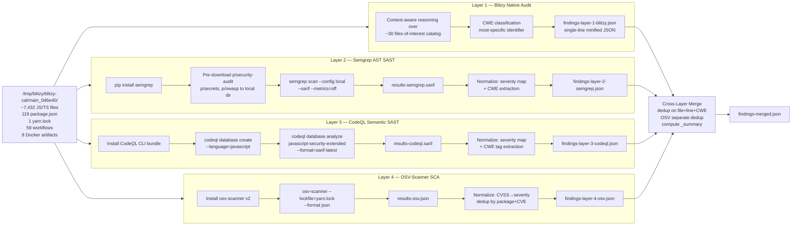

# Technical Specification

# 0. Agent Action Plan

## 0.1 Intent Clarification

### 0.1.1 Core Objective

Based on the provided requirements, the Blitzy platform understands that the objective is to **conduct a comprehensive, read-only four-layer security audit of the `blitzy-cal` codebase** (the Cal.com monorepo named `calcom-monorepo` in `[package.json:name]`, rooted at `/tmp/blitzy/blitzy-cal/main_0d6e40/`) and to emit **five new minified single-line JSON artifacts** that consolidate every unique vulnerability discovered across four structurally non-overlapping detection methodologies. No source-tree file is modified by this work; the deliverables are exclusively report files written at the audit run root.

The four layers correspond to four distinct vulnerability-detection methodologies whose coverage profiles are complementary, not redundant:

| Layer | Tool | Detection Class | Output File |
|-------|------|-----------------|-------------|
| 1 | Blitzy native expert audit | Fail-open logic, protocol abuse, composite attack chains, configuration defaults, key reuse | `findings-layer-1-blitzy.json` |
| 2 | Semgrep pattern SAST | CI/CD injection, committed secrets, container misconfig, crypto anti-patterns, XSS templates | `findings-layer-2-semgrep.json` |
| 3 | CodeQL semantic SAST | Multi-step taint propagation (source → sink), SQL injection via ORM, deserialization chains | `findings-layer-3-codeql.json` |
| 4 | OSV-Scanner dependency SCA | Known CVEs in declared dependencies sourced from osv.dev | `findings-layer-4-osv.json` |

A fifth artifact, `findings-merged.json`, combines all four layers with cross-layer corroboration annotations and a leading `_summary` header object.

Implicit requirements surfaced from the prompt include:

- **Offline operation**: Layer 2 (Semgrep) must run with `--metrics=off` and a local rule-pack directory so no telemetry or network egress occurs during the scan
- **Reproducibility**: Each layer's tool version, query pack version, and rule pack version should be recorded so the audit is repeatable
- **Audit-only posture**: Tools must not remediate findings — no Semgrep `--fix`, no OSV-Scanner `fix` subcommand, no source-tree write back
- **Environment-specific reductions**: The user's example OSV-Scanner command lists both `--lockfile=/path/to/yarn.lock` and `--lockfile=/path/to/package-lock.json`, but the blitzy-cal monorepo has **only one root `yarn.lock`** (no `package-lock.json` exists anywhere in the repo), so the executed command will pass only the single existing lockfile
- **Severity normalization invariants**: SARIF level `error` → `critical`, `warning` → `high`, `note` → `medium`, `info` → `low` — applied uniformly across Layers 2 and 3
- **Schema constraint**: Every finding object must conform to the seven-field minified shape `{"file","line","severity","cwe","description","layer","tool"}` with `description` truncated to 200 characters
- **Dedup invariants**: Layers 1–3 dedup on the composite key `(file, line, CWE)` keeping the higher severity and adding `"corroborated_by":"<tool>"`; Layer 4 deduplicates by `(package_name, CVE_ID)` because lockfile line collisions are expected
- **Single-line output**: `cat findings-layer-*.json | wc -l` must return `4` (one line per layer file)

### 0.1.2 Task Categorization

- **Primary task type**: Security enhancement — specifically a security audit
- **Secondary aspects**: Build/Deploy (installation of three external scanner CLIs); Documentation (generation of five JSON report artifacts)
- **Scope classification**: Cross-cutting analysis — every workspace package and every supported configuration surface is read; analysis crosses architectural boundaries (web, API v1/v2, packages, app-store integrations, CI workflows, Docker artifacts)
- **Read/Write posture**: 100% read for the source tree; 100% write for five new top-level JSON files plus transient intermediate artifacts (`results-semgrep.sarif`, `results-codeql.sarif`, `results-osv.json`, `codeql-db/`, local rule-pack directories)
- **Code-modification footprint**: Zero in-tree files modified

### 0.1.3 Special Instructions and Constraints

The following eight critical directives are captured verbatim as enforceable execution constraints (each is restated in full in section 0.7 Rules):

- **Directive 1 — Layer 1 Expert Audit**: Native agent reasoning over code + config + architecture; focus on classes scanners cannot find (fail-open defaults, protocol abuse, composite chains, configuration-dependent paths, cross-file key/secret reuse); classify every finding by the **most specific** CWE
- **Directive 2 — Layer 2 Setup**: Install Semgrep via `pip` or `apt`; download `p/security-audit`, `p/secrets`, `p/owasp` rule packs to a local directory; verify `--metrics=off` suppresses all telemetry. Pass criterion: `semgrep scan --metrics=off --config=/path/to/local-rules --dry-run` exits `0` with no network calls
- **Directive 3 — Layer 2 Execute**: `semgrep scan --config=/path/to/local-rules --sarif -o results-semgrep.sarif --metrics=off /path/to/blitzy-cal`; record exit code, wall-clock duration, total files scanned; severity map `error→critical, warning→high, note→medium, info→low`; rule metadata CWE preferred, else infer from description
- **Directive 4 — Layer 3 Setup**: Install CodeQL CLI; `codeql database create codeql-db --language=javascript --source-root=/path/to/blitzy-cal`; confirm database indexes > 0 source files
- **Directive 5 — Layer 3 Execute**: `codeql database analyze codeql-db javascript-security-extended --format=sarif-latest --output=results-codeql.sarif`; record exit code, query count, total alerts; severity map `error→critical, warning→high, note→medium`
- **Directive 6 — Layer 4 OSV-Scanner**: `osv-scanner --lockfile=/path/to/yarn.lock --lockfile=/path/to/package-lock.json --format json > results-osv.json`; scan all lockfiles if multiple exist; record total CVEs, packages affected, severity distribution
- **Directive 7 — Normalize**: Each finding follows the schema `[{"file":"<relative path>","line":<integer>,"severity":"<critical|high|medium|low>","cwe":"<CWE-ID>","description":"<max 200 chars>","layer":<1|2|3|4>,"tool":"<blitzy|semgrep|codeql|osv-scanner>"},...]`; cross-layer dedup on `file+line+CWE` keeping higher severity with `"corroborated_by":"<tool>"`; OSV dedup by `(package_name, CVE_ID)`; pass criterion `cat findings-layer-*.json | wc -l` returns `4`
- **Directive 8 — Cross-Layer Merge**: `findings-merged.json` as single-line JSON with a leading `_summary` object: `{"_summary":{"total_findings":<N>,"unique_findings":<N>,"corroborated":<N>,"by_layer":{"blitzy":<N>,"semgrep":<N>,"codeql":<N>,"osv-scanner":<N>},"by_severity":{"critical":<N>,"high":<N>,"medium":<N>,"low":<N>}}}`; highlight pairs where Blitzy confirmed exploitability **and** Semgrep/CodeQL found the same or related pattern (highest-confidence findings)

User-provided example command (preserved verbatim for fidelity):

```plaintext
User Example: osv-scanner --lockfile=/path/to/yarn.lock --lockfile=/path/to/package-lock.json --format json > results-osv.json
```

**Adaptation note**: In the blitzy-cal environment, only `/tmp/blitzy/blitzy-cal/main_0d6e40/yarn.lock` exists. The executed command will be `osv-scanner --lockfile=/tmp/blitzy/blitzy-cal/main_0d6e40/yarn.lock --format json > results-osv.json` (the `--lockfile=/path/to/package-lock.json` argument is omitted because no such file exists).

### 0.1.4 Technical Interpretation

These requirements translate to the following technical implementation strategy:

- **To produce `findings-layer-1-blitzy.json`**, the Blitzy platform will reason context-aware across the architecturally significant code paths catalogued in `[docs/specs/6.4 Security Architecture]` (authentication stacks, encryption primitives, webhook signature verification, CSP and CSRF, rate limiting, watchlist enforcement, audit pipeline, CI workflow definitions, Docker artifacts, and environment templates) and classify each finding by the **most specific** CWE
- **To produce `findings-layer-2-semgrep.json`**, install Semgrep CLI via `pip install semgrep` (or `pipx install semgrep` for isolation), pre-download the three Semgrep registry rule packs (`p/security-audit`, `p/secrets`, `p/owasp`) into a local directory, then execute `semgrep scan --config=<local-rules-dir> --sarif -o results-semgrep.sarif --metrics=off /tmp/blitzy/blitzy-cal/main_0d6e40` and normalize the SARIF output into the required single-line minified JSON schema
- **To produce `findings-layer-3-codeql.json`**, install the CodeQL CLI bundle (which ships the `codeql/javascript-queries` pack containing the built-in `default`, `security-extended`, and `security-and-quality` suites), execute `codeql database create codeql-db --language=javascript --source-root=/tmp/blitzy/blitzy-cal/main_0d6e40` to build a unified database over the ~7,400 JavaScript/TypeScript source files, then `codeql database analyze codeql-db javascript-security-extended --format=sarif-latest --output=results-codeql.sarif` and normalize the SARIF output
- **To produce `findings-layer-4-osv.json`**, install OSV-Scanner v2 via the SLSA3-compliant prebuilt binary from `github.com/google/osv-scanner/releases`, execute `osv-scanner --lockfile=/tmp/blitzy/blitzy-cal/main_0d6e40/yarn.lock --format json > results-osv.json` (single lockfile because no `package-lock.json` exists), and normalize with `(package_name, CVE_ID)` dedup
- **To produce `findings-merged.json`**, run a post-hoc merge pass that ingests the four layer files, applies `(file, line, CWE)` dedup across Layers 1–3 (keeping the maximum severity and appending `corroborated_by` annotations), appends Layer 4 findings as-is (dedup'd separately by `(package_name, CVE_ID)`), and prepends the computed `_summary` header object

## 0.2 Repository Scope Discovery

### 0.2.1 Comprehensive File Analysis

Repository inspection (via `find`, `ls`, and `bash` against `/tmp/blitzy/blitzy-cal/main_0d6e40/`) confirmed the codebase is a **Yarn Berry 4.12.0 monorepo** [`/.yarnrc.yml:yarnPath`, `/package.json:packageManager`] orchestrated by **Turborepo 2.7.1** [`/package.json:devDependencies.turbo`] and built atop a **pure JavaScript/TypeScript ecosystem**.

**Source-tree footprint** (computed excluding `node_modules/`, `.yarn/`, `.next/`, `dist/`, `.turbo/`, `coverage/`):

| Directory | TS + TSX + JS + MJS Files | Audit Scope |
|-----------|---------------------------|-------------|
| `apps/` | 2,834 | Layers 1, 2, 3 — web app, API proxy, API v1, API v2 |
| `packages/` | 4,570 | Layers 1, 2, 3 — ~20 top-level + ~80 app-store + ~72 features + platform sub-packages |
| `example-apps/` | 7 | Layers 1, 2, 3 — credential-sync example |
| `scripts/` | 17 | Layers 1, 2 — build/setup helpers (TypeScript and shell) |
| `__checks__/` | 4 | Layers 1, 2, 3 — Checkly synthetic monitors |
| **Total JS/TS source files** | **~7,432** | All scanned by CodeQL; subset by Semgrep (default skip of `/test`, `/tests`, `/vendors`) |

**Manifest and configuration surface**:

| Artifact Class | Count | Location | Audit Scope |
|----------------|-------|----------|-------------|
| `package.json` manifests | 119 | repository-wide (root + 90+ workspace packages + example apps) | Layer 4 dependency declarations; Layer 1 audit-ignore policy |
| Lockfiles | **1** (yarn.lock only) | `/yarn.lock` (40,303 lines, 1.4 MB) | Layer 4 SCA target |
| Prisma schemas | 2 | `packages/prisma/schema.prisma`, `packages/platform/examples/base/prisma/schema.prisma` | Layer 1 data-model review |
| GitHub workflow YAMLs | 59 | `.github/workflows/*.yml` | Layer 1, 2 — CI/CD injection rules |
| Docker artifacts | 8 | `Dockerfile`, `apps/api/v2/Dockerfile`, 6× `docker-compose.{yml,yaml}` | Layer 2 — container-misconfig rules |
| Environment templates | 10 | `.env.example`, `.env.appStore.example`, `apps/*/...env.example`, `packages/*/...env.{example,test}` | Layer 2 — secrets rules |
| Top-level configs | — | `biome.json`, `biome-staged.json`, `turbo.json`, `vercel.json`, `app.json`, `Procfile`, `.yarnrc.yml`, `tsconfig.json`, `playwright.config.ts`, `vitest.workspace.ts`, `checkly.config.ts`, `i18n.json`, `catalog-info.yaml`, `mkdocs.yml` | Layer 1 — policy and architecture review |

**Language ecosystem confirmation**: A repository-wide search for non-JavaScript ecosystem manifests returned no results — no `requirements.txt`, `pyproject.toml`, `setup.py`, `go.mod`, `go.sum`, `Cargo.toml`, `Cargo.lock`, `pom.xml`, `build.gradle`, `Gemfile`, `Gemfile.lock`, `composer.json`, or `mix.exs` exists. This eliminates the need for OSV-Scanner to traverse multi-ecosystem manifest patterns: the single root `yarn.lock` is the entire Layer 4 surface.

**Files-of-interest catalogue for Layer 1 (Blitzy native audit)**, drawn from the Security Architecture documented in `[Technical Specification §6.4]`:

- **Authentication framework**: `packages/features/auth/lib/next-auth-options.ts` (NextAuth.js 4.24.13 web composition), `packages/features/ee/sso/lib/jackson.ts` (BoxyHQ SAML Jackson 1.52.2), `apps/api/v2/src/modules/auth/auth.module.ts` and `apps/api/v2/src/modules/auth/strategies/api-auth/api-auth.strategy.ts` (NestJS Passport with five auth methods: OAUTH_CLIENT_CREDENTIALS, API_KEY `cal_*`, ACCESS_TOKEN JWT, NEXT_AUTH, THIRD_PARTY_ACCESS_TOKEN), 14+ guards under `apps/api/v2/src/modules/auth/guards/`
- **Multi-factor authentication**: `apps/web/app/api/auth/two-factor/totp/setup/route.ts`, `apps/web/app/api/auth/two-factor/totp/disable/route.ts` (`otplib` 12.0.1)
- **Cryptography primitives**: `packages/lib/crypto.ts` (legacy AES-256-CBC via `CALENDSO_ENCRYPTION_KEY`), `packages/lib/crypto/keyring.ts` (modern AES-256-GCM with `kid` rotation via `CALCOM_KEYRING_CREDENTIALS_CURRENT`/`_K1`/`_K2`/…)
- **Webhook signature verification (HMAC)**: `packages/app-store/btcpayserver/api/webhook.ts` (HMAC-SHA256), `packages/app-store/hitpay/api/webhook.ts` (HMAC-SHA256), `apps/api/v2/src/vercel-webhook.guard.ts` (HMAC-**SHA1**), `apps/web/app/api/sync/helpscout/route.ts` (HMAC-**SHA1** keyed by `CALENDSO_ENCRYPTION_KEY`)
- **CSRF protection**: `apps/web/app/api/csrf/route.ts`, `apps/web/lib/validateCsrfToken.ts`
- **Content-Security-Policy**: `apps/web/lib/csp.ts` (nonce-aware policy gated on `CSP_POLICY` env)
- **Helmet headers**: `apps/api/v2/src/bootstrap.ts:42` (`app.use(helmet())`)
- **Rate limiting**: `apps/api/v2/src/lib/throttler-guard.ts` (`@nest-lab/throttler-storage-redis` 1.0.0; four tracker prefixes `api_key_<sha256hash>`, `oauth_client_<clientId>`, `access_token_<tokenHash>`, `ip_<remoteIp>`)
- **Watchlist enforcement**: `packages/features/watchlist/operations/check-user-blocking.ts` — `getBlockedUsersMap` is documented in `[§6.4]` as **fail-open** on watchlist service errors (returns unblocked map), a candidate Layer 1 finding for CWE-755 / CWE-636
- **Bot/turnstile protection**: `packages/lib/server/checkCfTurnstileToken.ts` (skips on E2E mode), `apps/web` consumes `react-turnstile` 1.1.3, `isbot` 5.1.30, `botid` 1.5.7
- **Audit pipeline**: `packages/features/booking-audit/lib/service/` (PII-free queue payloads)
- **OAuth2 token lifecycle**: `apps/api/v2/src/modules/tokens/tokens.repository.ts` (Access 60 min, Refresh 1 yr, TOTP JWT 2 min)
- **CI/CD attack surface**: 59 workflows under `.github/workflows/` — notable injection targets include `devin-conflict-resolver.yml`, `cubic-devin-review.yml`, `sync-agents-to-devin.yml`, `stale-pr-devin-completion.yml`, `validate-agents-format.yml` (AI-bot orchestration), `release-docker.yaml`, `api-v1-production-build.yml`, `api-v2-production-build.yml`
- **Container artifacts**: root `Dockerfile` (three-stage Node 20 build with `MAX_OLD_SPACE_SIZE=6144`), `apps/api/v2/Dockerfile`, `docker-compose.yml` (postgres + redis + calcom + calcom-api + studio), and five workspace-scoped `docker-compose.{yml,yaml}` files
- **Environment templates**: `/.env.example`, `/.env.appStore.example`, `apps/api/v1/.env.example`, `apps/api/v2/.env.example`, `apps/web/test/.env.test.example`, `packages/lib/test/.env.test`, `packages/prisma/.env` (intentionally committed; see `.gitignore` line `!packages/prisma/.env`), `packages/platform/atoms/.env.example`, `packages/platform/examples/base/.env.example`, `example-apps/credential-sync/.env.example`
- **Data model**: `packages/prisma/schema.prisma` (3,376 lines — taint analysis for sensitive columns; never expose `credential.key` per `AGENTS.md`)

### 0.2.2 Web Search Research Conducted

The following research queries were executed to confirm tool versions, install procedures, and pack identifiers:

| Query Topic | Finding |
|-------------|---------|
| Semgrep latest version | **1.163.0** (May 2026 PyPI release); requires Python ≥3.8; install via `pip install semgrep` or `pipx install semgrep`; `--metrics=off` flag suppresses telemetry; `--config=<path>` accepts a local rule directory |
| CodeQL CLI install + JavaScript query suite | CodeQL CLI bundle ships the `codeql/javascript-queries` pack containing **built-in** `default`, `security-extended`, and `security-and-quality` suites; `security-extended` adds queries with slightly lower precision but higher recall — appropriate for an audit pass |
| OSV-Scanner install + version | **OSV-Scanner v2** (March 2026 release line); SLSA3-compliant prebuilt binaries on `github.com/google/osv-scanner/releases`; alternative `go install github.com/google/osv-scanner/v2/cmd/osv-scanner@latest` (Go 1.26.2+); natively supports `yarn.lock`; `--offline --download-offline-databases <dir>` enables air-gapped runs |
| Semgrep rule pack identifiers | `p/security-audit`, `p/secrets`, `p/owasp` are valid Semgrep registry rule packs as named in the user prompt; resolvable via `semgrep --config p/<name>` and downloadable for local caching |

### 0.2.3 Existing Infrastructure Assessment

**Existing security tooling in the repository** (discovered via `bash` inspection of `.github/workflows/` and dependency manifests):

- `[/.github/workflows/security-audit.yml]` — a single existing security workflow that runs `yarn npm audit --all --recursive` (reports all vulnerabilities) followed by `yarn npm audit --all --recursive --severity critical` (fails the CI job on critical advisories). This workflow does **not** use Semgrep, CodeQL, or OSV-Scanner. It operates on the same `yarn.lock` surface as Layer 4 but with a different advisory source (npm registry vs. osv.dev) and a different output format (text vs. JSON); the two are complementary, not duplicative.
- `[apps/api/v2/package.json:devDependencies.snyk-protect]` — a `snyk-protect` invocation via the package's `prepare` hook, scoped to the NestJS API service only. Independent of the four-layer audit pipeline.
- `[/.well-known/security.txt]` — public security disclosure metadata
- `[/SECURITY.md]` — documents a 3-business-day disclosure SLA and out-of-scope categories with contact `security@cal.com`
- `[/.yarnrc.yml:npmAuditIgnoreAdvisories]` — actively suppresses advisory `1113407` (fast-xml-parser 4.4.1 via `@boxyhq/saml-jackson` → `@aws-sdk/core@3.816.0`) with the documented justification "Only parses trusted AWS API responses, not user input. No practical attack vector. Upstream fix pending: ory/polis (saml-jackson) has bumped to @aws-sdk@3.994.0 on main but hasn't released yet"

**Architectural firewalls** enforced via `[/biome.json]` overrides (relevant to Layer 1 Blitzy reasoning about boundary violations):

| Package | Cannot Import From |
|---------|---------------------|
| `packages/lib/` | `app-store`, `features`, `trpc` |
| `packages/app-store/` | `features`, `trpc` |
| `packages/features/` | `trpc`, `@calcom/web`, `apps/web` |
| `packages/trpc/` | `apps/web` |
| `packages/platform/atoms/` | `@calcom/trpc` |
| `apps/api/v2/` | Anything outside `@calcom/platform-*` + `@calcom/prisma` |

**No prior scanner artifacts exist** — repository-wide search at depth ≤3 returned zero matches for `findings-*.json`, `results-semgrep.sarif`, `results-codeql.sarif`, `results-osv.json`, or `codeql-db/`. No `.semgrepignore`, `.codeqlignore`, or `osv-scanner.toml` exists. The five output JSON files will be created freshly at the audit run root.

**Existing exclusion patterns** in `[/.gitignore]` (must be respected by scan invocations):

```plaintext
node_modules, .pnp, .pnp.js, coverage, /test-results/,
**/playwright/{videos,screenshots,artifacts,results,reports},
.next/, out/, build/, .DS_Store, *.pem,
npm-debug.log*, yarn-debug.log*, yarn-error.log*, .pnpm-debug.log*,
.env, .env.local, .env.development.local, .env.test.local, .env.production.local,
!packages/prisma/.env
```

Note the **exception** `!packages/prisma/.env`: a development-fixture `.env` is intentionally committed under `packages/prisma/`. Layer 2 secrets rules will surface this file; it is an expected, accepted-risk finding.

## 0.3 Scope Boundaries

### 0.3.1 Exhaustively In Scope

The audit pipeline **reads** the following file patterns and **writes** the five enumerated JSON deliverables plus several transient intermediate artifacts.

**Source-tree READ surface** (Layers 1, 2, 3 source-code analysis):

- `apps/web/**/*.{ts,tsx,js,mjs}` — Next.js 16.1.7 web application (booker, embed runtime, admin/settings, routing forms UI)
- `apps/api/index.js` and `apps/api/**/*.{ts,js,mjs}` — Connect-based API proxy gateway
- `apps/api/v1/**/*.{ts,tsx,js,mjs}` — Deprecated Next.js 16.1.5 REST API
- `apps/api/v2/**/*.{ts,tsx,js,mjs}` — Active NestJS 10.4.20 REST API
- `packages/**/*.{ts,tsx,js,mjs}` — All workspace packages including `packages/lib`, `packages/features/**`, `packages/app-store/**`, `packages/embeds/**`, `packages/platform/**`, `packages/prisma`, `packages/trpc`, `packages/ui`, `packages/kysely`, `packages/coss-ui`, `packages/sms`
- `example-apps/**/*.{ts,tsx,js,mjs}` — Consumer example apps (credential-sync)
- `scripts/**/*.{ts,js,mjs,sh}` — Build and setup helpers
- `__checks__/**/*.{ts,js}` — Checkly synthetic monitor scripts

**Configuration READ surface** (Layer 1 policy review; Layer 2 misconfig/IAC rules):

- `Dockerfile`, `apps/api/v2/Dockerfile`
- `docker-compose.yml`, `apps/api/v1/test/docker-compose.yml`, `apps/api/v2/docker-compose.yaml`, `apps/web/test/docker-compose.yml`, `packages/prisma/docker-compose.yml`, `packages/emails/docker-compose.yml`
- `.github/workflows/*.yml` (59 files including `security-audit.yml`, `api-v1-production-build.yml`, `api-v2-production-build.yml`, `release-docker.yaml`, `e2e*.yml` series, `cron-*.yml` series, `cubic-devin-review.yml`, `devin-conflict-resolver.yml`, `stale-pr-devin-completion.yml`, `sync-agents-to-devin.yml`)
- `.github/actions/**/*.yml` (composite actions)
- `.env.example`, `.env.appStore.example`
- `apps/api/v1/.env.example`, `apps/api/v2/.env.example`, `apps/web/test/.env.test.example`
- `packages/lib/test/.env.test`, `packages/prisma/.env`, `packages/platform/atoms/.env.example`, `packages/platform/examples/base/.env.example`
- `example-apps/credential-sync/.env.example`
- `biome.json`, `biome-staged.json`, `turbo.json`, `vercel.json` (under `apps/web/`), `app.json`, `Procfile`, `.yarnrc.yml`
- `packages/prisma/schema.prisma` (2 schemas total — also `packages/platform/examples/base/prisma/schema.prisma`)
- `packages/prisma/migrations/**/*.sql`

**Dependency READ surface** (Layer 4 SCA):

- `/yarn.lock` — single root lockfile, 40,303 lines, covers all 119 workspace `package.json` manifests
- `**/package.json` (119 files) — declared dependencies and audit-ignore policy
- `.yarnrc.yml` — `npmAuditIgnoreAdvisories` policy (advisory `1113407` suppressed)

**Output WRITE surface** (CREATE at audit run root):

- `findings-layer-1-blitzy.json` — Layer 1 Blitzy native audit findings (single-line minified JSON array)
- `findings-layer-2-semgrep.json` — Layer 2 normalized Semgrep findings (single-line minified JSON array)
- `findings-layer-3-codeql.json` — Layer 3 normalized CodeQL findings (single-line minified JSON array)
- `findings-layer-4-osv.json` — Layer 4 normalized OSV-Scanner findings (single-line minified JSON array)
- `findings-merged.json` — Cross-layer merged report with leading `_summary` header (single-line minified JSON array)

**Transient intermediate artifacts** (produced during execution; not deliverables):

- `results-semgrep.sarif` — Raw Semgrep SARIF output (consumed by Layer 2 normalizer)
- `results-codeql.sarif` — Raw CodeQL SARIF output (consumed by Layer 3 normalizer)
- `results-osv.json` — Raw OSV-Scanner JSON output (consumed by Layer 4 normalizer)
- `codeql-db/` — CodeQL database directory (~500 MB – 2 GB for 7,400+ files)
- `<local-rules-dir>/` — Pre-downloaded local cache of Semgrep `p/security-audit`, `p/secrets`, `p/owasp` rule packs
- `<osv-offline-db-dir>/` (optional) — Pre-downloaded OSV advisory database for air-gapped operation

### 0.3.2 Explicitly Out of Scope

The following items are **not** part of this work:

**Source-code modifications**:

- No changes to any file under `apps/`, `packages/`, `example-apps/`, `scripts/`, `agents/`, `blitzy/`, `blitzy-docs/`, `deploy/`, `specs/`, `vitest-mocks/`, `__checks__/`, `docs/`
- No changes to any `package.json`, the root `yarn.lock`, or any workspace manifest
- No edits to `biome.json`, `turbo.json`, `vercel.json`, `app.json`, `Procfile`, `tsconfig.json`, `playwright.config.ts`, `vitest.workspace.ts`, `checkly.config.ts`, `i18n.json`
- No edits to `.yarnrc.yml` (the `npmAuditIgnoreAdvisories` policy remains as-is)

**Remediation**:

- No vulnerability fixes are applied during the audit — Semgrep is **not** invoked with `--autofix`, OSV-Scanner is **not** invoked with the `fix` subcommand, and no manual patches are authored
- Triage decisions (accepted risk, false positive marking) are deferred to follow-up work
- CVE filings, advisory publications, and security-disclosure actions are outside scope

**CI/CD integration**:

- No new files added under `.github/workflows/`, `.github/actions/`, or `.github/`
- No modifications to existing workflows including `security-audit.yml`, `api-v1-production-build.yml`, `api-v2-production-build.yml`, or any other YAML
- No changes to the existing `snyk-protect` integration in `apps/api/v2/package.json`
- No commit of scanner configuration files (`.semgrepignore`, `.codeqlignore`, `osv-scanner.toml`) to the repo
- No commit of CodeQL database, SARIF outputs, or finding JSON files to the repo

**Out-of-scope by virtue of language**:

- No Python source analysis — no Python source files exist beyond shell scripts and Markdown
- No Go, Rust, Java, Kotlin, Ruby, PHP, .NET, or Elixir source analysis — no manifests for those ecosystems exist

**Out-of-scope by virtue of scanner capability**:

- Dynamic analysis (DAST) — the four layers are all static
- Penetration testing — outside scope
- Fuzz testing — outside scope
- Manual deep code review beyond Blitzy native reasoning — Layer 1 **is** the manual-review proxy
- Browser-runtime CSP enforcement testing — static configuration review only
- Network egress monitoring during scanner execution — covered only by Directive 2's `--metrics=off --dry-run` verification, not a continuous control

**Out-of-scope follow-up work**:

- Integrating the four-layer pipeline into CI as a recurring scheduled workflow
- Publishing findings to GitHub Security tab via SARIF upload
- Adopting Semgrep AppSec Platform, CodeQL code scanning service, or OSV-Scanner GitHub Action
- Custom Semgrep rule authoring or CodeQL custom-query pack development for blitzy-cal-specific patterns
- Tuning the Semgrep `.semgrepignore` file to reduce false positives
- Resolving the audit-ignored advisory `1113407` upstream

## 0.4 Dependency Inventory

### 0.4.1 Scanner Tooling Dependencies

Three external scanner CLIs are installed system-wide (or into an isolated user-tooling location) for this audit. **None of these tools are added to the repository's dependency graph** — they remain external to the `package.json` / `yarn.lock` ecosystem.

| Registry / Source | Package Name | Version | Purpose |
|---|---|---|---|
| PyPI (`pip install semgrep`) | `semgrep` | 1.163.0 or later (May 2026 release line) | Layer 2 — AST pattern static analysis |
| GitHub Releases — `github/codeql-cli-binaries` | CodeQL CLI bundle | Latest stable bundle (ships `codeql/javascript-queries`) | Layer 3 — Semantic dataflow static analysis |
| GitHub Releases — `google/osv-scanner` | `osv-scanner` | v2.x latest (March 2026 release line) | Layer 4 — Lockfile-based vulnerability scanning against osv.dev |

Installation commands (executed in the audit runner environment, not in the repository):

```bash
# Layer 2 — Semgrep

pip install semgrep    # or: pipx install semgrep
semgrep --version

#### Layer 3 — CodeQL CLI bundle

#### Download codeql-bundle-linux64.tar.gz from github/codeql-cli-binaries releases

tar -xzf codeql-bundle-linux64.tar.gz -C /opt
export PATH="/opt/codeql:$PATH"
codeql --version

#### Layer 4 — OSV-Scanner

#### Download osv-scanner_<version>_linux_amd64 from google/osv-scanner releases

chmod +x osv-scanner && mv osv-scanner /usr/local/bin/
osv-scanner --version
```

### 0.4.2 Semgrep Rule Pack Dependencies (Layer 2)

Three Semgrep registry rule packs are pre-downloaded into a local directory (e.g., `/opt/semgrep-rules/`) to satisfy Directive 2's offline-operation requirement:

| Rule Pack ID | Source | Purpose |
|---|---|---|
| `p/security-audit` | `semgrep.dev/r/security-audit` | Curated multi-language security-auditing ruleset |
| `p/secrets` | `semgrep.dev/r/secrets` | Committed-secret pattern detection |
| `p/owasp` | `semgrep.dev/r/owasp` | OWASP Top 10 vulnerability patterns |

Pre-download (one-time setup) is performed using either of the following approaches:

```bash
# Approach A: bulk pre-fetch via registry resolution into Semgrep's local cache

semgrep --config p/security-audit --config p/secrets --config p/owasp --download-only

#### Approach B: explicit clone of pack repositories into a versioned local directory

mkdir -p /opt/semgrep-rules/{security-audit,secrets,owasp}
# Populate by fetching from semgrep-rules repository, scoped to each pack's manifest

```

The scan invocation then references the local directory via `--config=/opt/semgrep-rules/`.

### 0.4.3 CodeQL Query Pack Dependencies (Layer 3)

The standard CodeQL `codeql/javascript-queries` pack is bundled with the CodeQL CLI distribution — no separate `codeql pack download` is required. The pack provides three built-in query suites:

| Suite | Purpose | Used in Audit? |
|---|---|---|
| `javascript-code-scanning` (default) | High-precision security queries | No (lower recall) |
| **`javascript-security-extended`** | Default suite + lower-precision queries (higher recall) | **Yes** (per Directive 5) |
| `javascript-security-and-quality` | security-extended + maintainability/reliability | No (beyond audit scope) |

The CodeQL CLI extracts both `.js` and `.ts` (and `.tsx`) source files under the `javascript` language identifier — a separate TypeScript language target is not required.

### 0.4.4 OSV-Scanner Data Dependencies (Layer 4)

OSV-Scanner v2 queries the **osv.dev** advisory database. Two operational modes are supported:

| Mode | Configuration | Network Dependency |
|---|---|---|
| Online (default) | `osv-scanner --lockfile=<path>` | Queries `api.osv.dev` for advisory data |
| Offline | `osv-scanner --offline --offline-databases-dir=<dir>` (after one-time `--download-offline-databases <dir>`) | None during scan |

For audit reproducibility and to align with Layer 2's `--metrics=off` posture, the offline mode is preferred where the audit runner permits internet access for one-time DB seeding.

### 0.4.5 Runtime Prerequisites

The audit runner environment must provide:

| Prerequisite | Minimum Version | Required For |
|---|---|---|
| Python | 3.8+ | Semgrep `pip install` |
| Bash / POSIX shell | — | Orchestration of scan commands and normalization scripts |
| `jq` (optional) | — | JSON post-processing during normalization |
| `tar`, `curl` / `wget` | — | Downloading CodeQL bundle and OSV-Scanner binary |
| Disk space | ≥ 5 GB free | CodeQL database (~500 MB – 2 GB) + intermediate SARIF + local rule caches |
| RAM | ≥ 8 GB recommended | CodeQL extraction over ~7,432 JS/TS files; tune with `codeql ... --ram=<MB>` |
| CPU | All cores via `--threads=0` | Acceptable wall time for CodeQL database creation (30–90 min typical) |

### 0.4.6 Repository Dependency Updates

The dependency-change posture for this audit is **zero net change** to the repository's own dependency graph:

- **New dependencies to add**: None. The repository's `package.json` and `yarn.lock` are not modified.
- **Dependencies to update**: None. No pinned version is bumped by this work; the existing `resolutions` block (which pre-emptively pins `axios` 1.13.5, `jws` 4.0.1, `jsonwebtoken` 9.0.0, `qs` 6.14.1, `node-forge` 1.3.2, `tar` 7.5.7, `tar-fs` 2.1.4, `lodash` 4.17.23, `lodash-es` 4.17.23, `prismjs` 1.30.0, `serialize-javascript` 6.0.2, `validator` 13.15.22, `form-data` 4.0.4, `rollup` 4.22.4, `jpeg-js` 0.4.4, `sha.js` 2.4.12, `react@19.x` → 19.2.4, `@isaacs/brace-expansion` 5.0.1, `js-yaml` 4.1.1, `ws` 7.5.10, `typeorm` 0.3.27 and others for CVE mitigation) remains as-is and will be **verified** by Layer 4's OSV-Scanner pass as effective in `yarn.lock`.
- **Dependencies to remove**: None.
- **Import / reference updates required**: None. No source file's `import` statements change.

## 0.5 Implementation Design

### 0.5.1 Technical Approach

The audit executes as **four sequential, independent layer pipelines** (1 → 2 → 3 → 4) followed by a fifth post-hoc **merge** stage that consumes the four layer outputs. No layer depends on another layer's output during execution; the merge is a strictly post-processing dedup over already-emitted JSON arrays. Each layer is a discrete read-only pass over the same repository checkout at `/tmp/blitzy/blitzy-cal/main_0d6e40/`.



The implementation flow is logical (HOW), not temporal (WHEN). The four layers may execute concurrently if compute resources permit; sequential execution is documented here purely for narrative clarity.

#### 0.5.1.1 Layer 1 — Blitzy Native Expert Audit

To produce `findings-layer-1-blitzy.json`, the Blitzy platform reasons context-aware across the catalogued files-of-interest and emits a single-line minified JSON array. Each finding is classified by the **most specific** CWE identifier — for example, weak HMAC algorithm selection is `CWE-326 Inadequate Encryption Strength` rather than the more generic `CWE-327 Use of a Broken or Risky Cryptographic Algorithm`.

The audit targets vulnerability classes that scanners structurally cannot find:

- **Fail-open logic**: e.g., `[packages/features/watchlist/operations/check-user-blocking.ts:getBlockedUsersMap]` documented in `[§6.4]` as returning an unblocked map when the watchlist service errors — CWE-755 (Improper Exception Handling) and CWE-636 (Failure to Handle Missing Element / Fail-Secure)
- **Protocol abuse**: e.g., HMAC-SHA1 used in `[apps/api/v2/src/vercel-webhook.guard.ts]` and `[apps/web/app/api/sync/helpscout/route.ts]` while peer webhook handlers use HMAC-SHA256 (`[packages/app-store/btcpayserver/api/webhook.ts]`, `[packages/app-store/hitpay/api/webhook.ts]`) — CWE-326
- **Composite attack chains**: multi-stage exploitation requiring traversal of three or more files (e.g., an authorization bypass that requires a token-construction primitive in `[packages/lib/]`, a guard composition in `[apps/api/v2/src/modules/auth/guards/]`, and an endpoint exposure in `[apps/api/v2/src/modules/<feature>/]`)
- **Configuration-dependent paths**: CSP gated on `CSP_POLICY` env at `[apps/web/lib/csp.ts]`; Turnstile skip on E2E mode at `[packages/lib/server/checkCfTurnstileToken.ts]`
- **Cross-file key/secret reuse**: e.g., `CALENDSO_ENCRYPTION_KEY` used both for AES-256-CBC envelope crypto (`[packages/lib/crypto.ts]`) and for HMAC-SHA1 webhook signing (`[apps/web/app/api/sync/helpscout/route.ts]`) — key-purpose confusion (CWE-325 Missing Cryptographic Step or CWE-1394 Use of Default Cryptographic Key)

The expected CWE catalog (non-exhaustive) includes: CWE-22 (Path Traversal), CWE-78 (OS Command Injection), CWE-79 (XSS), CWE-89 (SQL Injection), CWE-200 (Information Exposure), CWE-209 (Error Message Info Disclosure), CWE-285 (Improper Authorization), CWE-287 (Improper Authentication), CWE-295 (Improper Cert Validation), CWE-306 (Missing Authentication), CWE-326, CWE-327, CWE-352 (CSRF), CWE-384 (Session Fixation), CWE-400 (Resource Exhaustion), CWE-434 (Unrestricted Upload), CWE-502 (Insecure Deserialization), CWE-601 (Open Redirect), CWE-611 (XXE), CWE-639 (IDOR), CWE-732 (Incorrect Permissions), CWE-755 (Improper Exception Handling), CWE-770 (Allocation w/o Limits), CWE-798 (Hard-coded Credentials), CWE-918 (SSRF), CWE-1004 (Cookie HttpOnly).

#### 0.5.1.2 Layer 2 — Semgrep Pattern SAST

To produce `findings-layer-2-semgrep.json`, install Semgrep, pre-download three registry rule packs to a local directory, run a single SARIF scan with telemetry suppressed, and normalize the SARIF output.

**Install and verification**:

```bash
pip install semgrep
semgrep --version    # expect 1.163.x+
```

**Pre-download rule packs to local directory** (offline preparation per Directive 2):

```bash
mkdir -p /opt/semgrep-rules
semgrep --config p/security-audit --config p/secrets --config p/owasp --download-only
# Local cache is now warm under ~/.semgrep/ ; export resolved trees if needed

```

**Pre-flight verification** (Directive 2 pass criterion):

```bash
semgrep scan --metrics=off --config=/opt/semgrep-rules --dry-run
# MUST exit 0 and emit no outbound network traffic

```

**Scan execution** (Directive 3):

```bash
semgrep scan --config=/opt/semgrep-rules --sarif \
  -o results-semgrep.sarif --metrics=off \
  /tmp/blitzy/blitzy-cal/main_0d6e40
```

Recorded metrics: exit code, wall-clock duration, total files scanned (parsed from `runs[].invocations[].executionSuccessful` and result count).

**SARIF → minified JSON normalization rules**:

| Source field | Target field | Transformation |
|---|---|---|
| `runs[].results[].locations[0].physicalLocation.artifactLocation.uri` | `file` | Relative to source root |
| `runs[].results[].locations[0].physicalLocation.region.startLine` | `line` | Integer |
| `runs[].tool.driver.rules[].defaultConfiguration.level` (mapped) | `severity` | `error→critical`, `warning→high`, `note→medium`, `info→low` |
| `runs[].tool.driver.rules[].properties.cwe[0]` OR tags filtered to `CWE-*` | `cwe` | `"CWE-NNN"`; if absent, infer from rule description |
| `runs[].results[].message.text` | `description` | Truncate to 200 chars with ellipsis |
| (constant) | `layer` | `2` |
| (constant) | `tool` | `"semgrep"` |

#### 0.5.1.3 Layer 3 — CodeQL Semantic SAST

To produce `findings-layer-3-codeql.json`, install the CodeQL CLI bundle, build a JavaScript database over the entire monorepo, run the `javascript-security-extended` built-in suite, and normalize the SARIF output.

**Install and verification**:

```bash
# Download codeql-bundle-linux64.tar.gz from github/codeql-cli-binaries releases

tar -xzf codeql-bundle-linux64.tar.gz -C /opt
export PATH="/opt/codeql:$PATH"
codeql --version
codeql resolve packs    # confirm codeql/javascript-queries is listed
```

**Database creation** (Directive 4):

```bash
codeql database create codeql-db \
  --language=javascript \
  --source-root=/tmp/blitzy/blitzy-cal/main_0d6e40 \
  --threads=0 --ram=8000
```

Notes:

- `--language=javascript` extracts both `.js`/`.mjs` and `.ts`/`.tsx`
- No `--build-mode` flag is required because JavaScript/TypeScript use an interpreted extractor
- `--threads=0` enables all CPU cores; `--ram=8000` allocates 8 GB to extraction (tune up to 12000+ on capable runners given ~7,432 source files)
- Verify post-creation: `codeql database info codeql-db` reports `>0` source files

**Analysis execution** (Directive 5):

```bash
codeql database analyze codeql-db javascript-security-extended \
  --format=sarif-latest \
  --output=results-codeql.sarif \
  --threads=0 --ram=8000
```

Recorded metrics: exit code, query count (from CodeQL stdout), total alerts (SARIF result count).

**SARIF → minified JSON normalization rules**:

| Source field | Target field | Transformation |
|---|---|---|
| `runs[].results[].locations[0].physicalLocation.artifactLocation.uri` | `file` | Relative to source root |
| `runs[].results[].locations[0].physicalLocation.region.startLine` | `line` | Integer |
| `runs[].results[].level` OR `runs[].tool.driver.rules[].defaultConfiguration.level` | `severity` | `error→critical`, `warning→high`, `note→medium`, (if `info` encountered → `low`) |
| `runs[].tool.driver.rules[].properties.tags` entries matching `external/cwe/cwe-NNN` | `cwe` | Transform to `"CWE-NNN"` (uppercase) |
| `runs[].results[].message.text` | `description` | Truncate to 200 chars with ellipsis |
| (constant) | `layer` | `3` |
| (constant) | `tool` | `"codeql"` |

#### 0.5.1.4 Layer 4 — OSV-Scanner Dependency SCA

To produce `findings-layer-4-osv.json`, install OSV-Scanner, scan the single root `yarn.lock`, and normalize the JSON output.

**Install and verification**:

```bash
# Download osv-scanner_<version>_linux_amd64 from google/osv-scanner releases

chmod +x osv-scanner && mv osv-scanner /usr/local/bin/
osv-scanner --version
```

**Scan execution** (Directive 6 — adapted for blitzy-cal's single-lockfile environment):

```bash
osv-scanner \
  --lockfile=/tmp/blitzy/blitzy-cal/main_0d6e40/yarn.lock \
  --format json \
  > results-osv.json
```

**Important environment adaptation**: The user's example command lists both `--lockfile=/path/to/yarn.lock` and `--lockfile=/path/to/package-lock.json`. Because no `package-lock.json` exists anywhere in the blitzy-cal monorepo, only the single root `yarn.lock` argument is supplied. The instruction "If multiple lockfiles exist, scan all of them" is satisfied trivially — there is exactly one lockfile.

Recorded metrics: total CVEs found, packages affected, severity distribution.

**OSV JSON → minified JSON normalization rules**:

| Source field | Target field | Transformation |
|---|---|---|
| `results[].source.path` | `file` | Relative path of containing lockfile (e.g., `"yarn.lock"`) |
| `results[].packages[].vulnerabilities[]` package location in lockfile | `line` | Lockfile line of package declaration; `0` if not pinpointed |
| `results[].packages[].vulnerabilities[].severity[].score` (CVSS) OR `database_specific.severity` | `severity` | CVSS ≥ 9.0 → `critical`; ≥ 7.0 → `high`; ≥ 4.0 → `medium`; < 4.0 → `low` |
| `results[].packages[].vulnerabilities[].database_specific.cwe_ids[0]` OR derived from `aliases`/`summary` | `cwe` | `"CWE-NNN"` |
| `results[].packages[].vulnerabilities[].summary` prefixed with `<package>@<version>:` | `description` | Truncate to 200 chars |
| (constant) | `layer` | `4` |
| (constant) | `tool` | `"osv-scanner"` |

**Layer 4 dedup rule**: collapse rows with identical `(package_name, CVE_ID)` to one finding (report once per unique CVE, not once per pinned version path through the dependency graph). The audit-ignored advisory `1113407` for `fast-xml-parser` (per `[/.yarnrc.yml:npmAuditIgnoreAdvisories]`) is **preserved** in `findings-layer-4-osv.json` because the directive instructs to report every vulnerability found; the ignore is repo policy, not absence of vulnerability.

#### 0.5.1.5 Cross-Layer Merge (Directive 8)

To produce `findings-merged.json`, run a deterministic post-processing pass:

```plaintext
1. F := []                          # final merged array
2. For each L1 finding:             # Blitzy seeds canonical entries
       F.append(L1)
3. For each L2 finding (Semgrep):
       key := (L2.file, L2.line, L2.cwe)
       if any F[i] matches key:
           F[i].severity := max(F[i].severity, L2.severity)
           F[i].corroborated_by := append("semgrep")
       else:
           F.append(L2)
4. For each L3 finding (CodeQL):
       key := (L3.file, L3.line, L3.cwe)
       if any F[i] matches key:
           F[i].severity := max(F[i].severity, L3.severity)
           F[i].corroborated_by := append("codeql")
       else:
           F.append(L3)
5. For each L4 finding (OSV-Scanner):
       # Layer 4 dedup is by (package_name, CVE_ID), already applied
       # during Layer 4 normalization. Append as-is; no cross-layer
       # corroboration because Layer 4 covers a different surface.
       F.append(L4)
6. Compute _summary:
       _summary.total_findings   := raw L1 + L2 + L3 + L4 counts (pre-merge)
       _summary.unique_findings  := len(F)
       _summary.corroborated     := count(f in F where f.corroborated_by exists)
       _summary.by_layer         := { blitzy: |L1|, semgrep: |L2|, codeql: |L3|, "osv-scanner": |L4| }
       _summary.by_severity      := histogram(f.severity for f in F)
7. Emit findings-merged.json as: [ { "_summary": _summary }, ...F ]
   serialized as a single line of minified JSON.
```

Severity ranking for the `max` comparison: `critical(4) > high(3) > medium(2) > low(1)`.

**Corroboration highlight**: per Directive 8, findings where Layer 1 (Blitzy) confirmed exploitability **and** Layer 2 (Semgrep) or Layer 3 (CodeQL) found the same or related pattern are the highest-confidence findings — they appear in `F` with `corroborated_by` set to `"semgrep"`, `"codeql"`, or both.

### 0.5.2 Component Impact Analysis

**Direct modifications required**: None. The audit is purely read-only with respect to the repository tree. No file under `apps/`, `packages/`, `example-apps/`, `scripts/`, `__checks__/`, `.github/`, or root configs is altered.

**Indirect impacts and dependencies**: None within the repository. The four scanner CLIs are installed outside the repo (system-wide or in `/opt/`), and no `package.json` or `yarn.lock` entries are added, updated, or removed.

**New components introduced**: Five new top-level JSON report files at the audit run root (`findings-layer-1-blitzy.json`, `findings-layer-2-semgrep.json`, `findings-layer-3-codeql.json`, `findings-layer-4-osv.json`, `findings-merged.json`) plus transient artifacts (`results-semgrep.sarif`, `results-codeql.sarif`, `results-osv.json`, `codeql-db/`, local rule-pack cache). None of these are committed to source control by this work.

**CI/CD impact**: None. The existing `[.github/workflows/security-audit.yml]` workflow continues to run `yarn npm audit` unchanged. This four-layer audit is executed **out-of-band** (locally by the agent, or on a one-off audit runner) and is not integrated into CI by this work.

**Operational impact**:

- CodeQL database creation will consume ~30–90 minutes of wall-clock time on a multi-core runner due to the ~7,432-file scan surface
- Disk usage: CodeQL database ~500 MB – 2 GB, Semgrep rule cache ~50 MB, OSV offline DB (optional) ~1 GB
- Memory peak: CodeQL extraction can spike to 6–10 GB; configure `--ram=8000` or higher

### 0.5.3 User Interface Design

Not applicable. This is a backend security audit producing JSON deliverables only; there is no user-facing interface, no Figma artifact, and no design-system surface.

### 0.5.4 Critical Implementation Details

- **Severity-mapping invariant**: SARIF level `error` → `critical`, `warning` → `high`, `note` → `medium`, `info` → `low`. Apply uniformly across Layer 2 and Layer 3. Layer 4 derives severity from CVSS v3.x base score thresholds (≥9.0 critical, ≥7.0 high, ≥4.0 medium, <4.0 low).
- **CWE assignment priority**: For Layer 1, choose the most specific CWE manually. For Layers 2/3, prefer `rule.properties.cwe` or `rule.properties.tags` (`external/cwe/cwe-NNN` for CodeQL); fall back to inference from rule description. For Layer 4, prefer `vuln.database_specific.cwe_ids[0]`; fall back to derivation from advisory summary.
- **Description truncation**: All descriptions are truncated to 200 characters, with an ellipsis (`…`) if truncation occurs. The truncation must occur on a character boundary that preserves valid JSON when minified.
- **Minified single-line output**: Emit each `findings-layer-N-*.json` and `findings-merged.json` as a **single line** with no pretty-printing, no trailing whitespace, and no terminating newline beyond what `cat ... | wc -l` requires to count `4`.
- **Relative paths**: All `file` field values use paths relative to the source-root (`/tmp/blitzy/blitzy-cal/main_0d6e40/`), not absolute. For example, `"apps/web/lib/csp.ts"`, not `"/tmp/blitzy/blitzy-cal/main_0d6e40/apps/web/lib/csp.ts"`.
- **Offline operation**: Layer 2 requires `--metrics=off`. CodeQL CLI bundle is fully offline post-install. OSV-Scanner can be run offline with a pre-downloaded database via `--offline --offline-databases-dir=<dir>`.
- **Reproducibility**: Capture and persist (in audit logs or a metadata field) the Semgrep version, CodeQL CLI version, CodeQL `javascript-security-extended` suite query count, OSV-Scanner version, and a snapshot of `osv.dev` advisory database date.
- **No `--autofix`, no remediation**: Semgrep is **never** invoked with `--autofix`; OSV-Scanner is **never** invoked with the `fix` subcommand. The audit emits findings; remediation is deferred.
- **Audit-ignored advisory preservation**: The `npmAuditIgnoreAdvisories: ["1113407"]` policy in `[/.yarnrc.yml]` suppresses the `fast-xml-parser` advisory from `yarn npm audit`. Layer 4 OSV-Scanner will still surface this advisory because it does not honor `.yarnrc.yml` ignores — and the normalization stage MUST preserve it in `findings-layer-4-osv.json` so the audit is complete.
- **Test-directory handling**: Semgrep auto-excludes `/test`, `/tests`, `/vendors` by default — acceptable. CodeQL extracts test code by default — acceptable, because CI workflow tests are themselves part of the security attack surface.

## 0.6 File Transformation Mapping

### 0.6.1 File-by-File Execution Plan

Each row lists the target file first, followed by transformation mode, source/reference, and purpose. All five deliverable files use **CREATE** mode (no existing artifact at these paths in the current repository state); all source-tree files are **REFERENCE** only (read for analysis, never modified).

| Target File | Transformation | Source File / Reference | Purpose / Changes |
|-------------|----------------|------------------------|-------------------|
| `findings-layer-1-blitzy.json` | CREATE | Reasoning over `~30` files-of-interest catalogued in §0.2.1 (auth, crypto, webhooks, CSRF, CSP, rate limiting, watchlist, audit pipeline, CI workflows, Docker, env templates, Prisma schema) | Layer 1 Blitzy native expert audit findings — single-line minified JSON array of objects matching the seven-field schema; CWE classification at the most-specific identifier |
| `findings-layer-2-semgrep.json` | CREATE | `results-semgrep.sarif` (intermediate output of `semgrep scan`) | Layer 2 normalized findings — single-line minified JSON; severity mapped `error→critical, warning→high, note→medium, info→low`; CWE pulled from rule metadata or inferred from description |
| `findings-layer-3-codeql.json` | CREATE | `results-codeql.sarif` (intermediate output of `codeql database analyze`) | Layer 3 normalized findings — single-line minified JSON; severity mapped `error→critical, warning→high, note→medium`; CWE extracted from `external/cwe/cwe-NNN` rule tags |
| `findings-layer-4-osv.json` | CREATE | `results-osv.json` (intermediate output of `osv-scanner`) | Layer 4 normalized findings — single-line minified JSON; severity from CVSS v3.x base score; dedup by `(package_name, CVE_ID)`; preserves the audit-ignored advisory `1113407` |
| `findings-merged.json` | CREATE | `findings-layer-1-blitzy.json`, `findings-layer-2-semgrep.json`, `findings-layer-3-codeql.json`, `findings-layer-4-osv.json` | Cross-layer merged report — single-line minified JSON; first element is the `_summary` object; subsequent elements are deduplicated findings with `corroborated_by` annotations |

### 0.6.2 New Files Detail

## `findings-layer-1-blitzy.json` (CREATE)

- **Content type**: Single-line minified JSON array
- **Based on**: Direct authoring by the Blitzy platform from native context-aware reasoning over the source tree
- **Schema (per element)**: `{"file":"<relative path>","line":<integer>,"severity":"<critical|high|medium|low>","cwe":"<CWE-ID>","description":"<max 200 chars>","layer":1,"tool":"blitzy"}`
- **Key sections**: Per-finding objects; no header; no metadata wrapper
- **Validation**: `wc -l findings-layer-1-blitzy.json` returns `1`; `jq '.' < findings-layer-1-blitzy.json` exits 0; every element has all seven required keys

## `findings-layer-2-semgrep.json` (CREATE)

- **Content type**: Single-line minified JSON array
- **Based on**: SARIF output `results-semgrep.sarif` from `semgrep scan --config=/opt/semgrep-rules --sarif -o results-semgrep.sarif --metrics=off /tmp/blitzy/blitzy-cal/main_0d6e40`
- **Schema (per element)**: `{"file":"<relative path>","line":<integer>,"severity":"<critical|high|medium|low>","cwe":"<CWE-ID>","description":"<max 200 chars>","layer":2,"tool":"semgrep"}`
- **Key transformations**: `level → severity` mapping (`error/warning/note/info`); CWE from `rule.properties.cwe` or `tags["CWE-NNN"]` (inferred if absent); description truncated to 200 chars
- **Validation**: `wc -l` returns `1`; valid JSON; all elements conform to the seven-field schema

## `findings-layer-3-codeql.json` (CREATE)

- **Content type**: Single-line minified JSON array
- **Based on**: SARIF output `results-codeql.sarif` from `codeql database analyze codeql-db javascript-security-extended --format=sarif-latest --output=results-codeql.sarif`
- **Schema (per element)**: `{"file":"<relative path>","line":<integer>,"severity":"<critical|high|medium|low>","cwe":"<CWE-ID>","description":"<max 200 chars>","layer":3,"tool":"codeql"}`
- **Key transformations**: `level → severity` (`error/warning/note`); CWE extracted from `tags` matching `external/cwe/cwe-NNN`; description truncated to 200 chars
- **Validation**: `wc -l` returns `1`; valid JSON; all elements conform

## `findings-layer-4-osv.json` (CREATE)

- **Content type**: Single-line minified JSON array
- **Based on**: JSON output `results-osv.json` from `osv-scanner --lockfile=/tmp/blitzy/blitzy-cal/main_0d6e40/yarn.lock --format json > results-osv.json`
- **Schema (per element)**: `{"file":"<relative path>","line":<integer>,"severity":"<critical|high|medium|low>","cwe":"<CWE-ID>","description":"<max 200 chars>","layer":4,"tool":"osv-scanner"}`
- **Key transformations**: Dedup by `(package_name, CVE_ID)`; severity from CVSS v3.x base score (≥9.0/critical, ≥7.0/high, ≥4.0/medium, <4.0/low); description prefixed with `<package>@<version>:` then advisory summary truncated to 200 chars
- **Audit-ignored advisory preservation**: Advisory `1113407` (fast-xml-parser via `@boxyhq/saml-jackson`) is **included** in the output, not suppressed
- **Validation**: `wc -l` returns `1`; valid JSON; all elements conform

## `findings-merged.json` (CREATE)

- **Content type**: Single-line minified JSON array, first element is a `_summary` header object
- **Based on**: All four layer JSON files (read after each has been emitted)
- **Schema**: `[ {"_summary": {...}}, <merged findings...> ]`
- **`_summary` shape**: `{"total_findings":<N>,"unique_findings":<N>,"corroborated":<N>,"by_layer":{"blitzy":<N>,"semgrep":<N>,"codeql":<N>,"osv-scanner":<N>},"by_severity":{"critical":<N>,"high":<N>,"medium":<N>,"low":<N>}}`
- **Merge logic**: As specified in §0.5.1.5 — Blitzy seeds; Semgrep/CodeQL corroborate on `(file, line, CWE)` keeping max severity with `corroborated_by` annotation; OSV appended as-is with its own `(package, CVE)` dedup pre-applied
- **Validation**: `wc -l` returns `1`; valid JSON; element `[0]._summary` exists; `_summary.total_findings ≥ _summary.unique_findings` (dedup never inflates count); `_summary.by_layer` sums to `_summary.total_findings`; `cat findings-layer-*.json | wc -l` (without merged) returns `4`

### 0.6.3 Files to Modify Detail

None. **Zero in-repository files are modified** by this work. The repository tree is read but never written.

The transformation map is intentionally empty for the source tree:

| Source File | Sections to update | New content | Content to remove | Refactoring needed |
|-------------|-------------------|-------------|-------------------|---------------------|
| `apps/web/**` | — | — | — | — |
| `apps/api/**` | — | — | — | — |
| `packages/**` | — | — | — | — |
| `.github/workflows/*` | — | — | — | — |
| `Dockerfile*`, `docker-compose*` | — | — | — | — |
| `package.json` (root + workspaces) | — | — | — | — |
| `yarn.lock` | — | — | — | — |
| `.yarnrc.yml` | — | — | — | — |
| Any other repo file | — | — | — | — |

### 0.6.4 Configuration and Documentation Updates

**Configuration changes in the repository**: None. No `.semgrepignore`, `.codeqlignore`, `osv-scanner.toml`, `.github/workflows/*.yml` addition, or any other configuration commit is part of this work.

**Documentation updates in the repository**: None. The five JSON deliverables ARE the documentation — they are not committed to `docs/` or `blitzy-docs/` by this work.

**Out-of-tree configuration** (audit-runner environment only, not committed):

- `/opt/semgrep-rules/` — pre-downloaded Semgrep rule pack cache (transient)
- `<audit-run-root>/codeql-db/` — CodeQL database directory (transient; can be discarded after Layer 3 normalize)
- `<audit-run-root>/results-semgrep.sarif`, `results-codeql.sarif`, `results-osv.json` — intermediate SARIF/JSON outputs (transient)

### 0.6.5 Cross-File Dependencies

Within the audit pipeline, the following ordering dependencies hold:

- **Layer 1** (Blitzy) is independent of Layers 2, 3, 4 — produces its output without consuming any prior layer
- **Layer 2** (Semgrep) consumes `results-semgrep.sarif` to produce `findings-layer-2-semgrep.json`; both must exist on disk between scan and normalize steps
- **Layer 3** (CodeQL) consumes `codeql-db/` to produce `results-codeql.sarif`, which the normalizer consumes to produce `findings-layer-3-codeql.json`; database must persist until analyze completes
- **Layer 4** (OSV-Scanner) consumes `yarn.lock` to produce `results-osv.json`, which the normalizer consumes to produce `findings-layer-4-osv.json`
- **Merge stage** (Directive 8) consumes ALL four `findings-layer-*.json` files; all four MUST exist before merge begins

No import statements in repository code change, no cross-file references in repository code are updated, and no configuration syncs are needed in the repository tree.

## 0.7 Rules

The user's prompt defines **eight critical directives** that govern the four-layer audit. These are reproduced here verbatim (preserving the user's exact wording and pass/fail criteria) and serve as enforceable rules for execution. Each rule is binding; no directive may be relaxed, deferred, or skipped.

### 0.7.1 Rule 1 — Execute Blitzy Native Security Audit (Layer 1)

> Analyze the codebase for all security vulnerabilities using native agent reasoning. Trace data flows, follow call chains, examine configuration files, and inspect dependency declarations. Focus on vulnerability classes that automated scanners structurally cannot find: fail-open security defaults, protocol-level abuse, composite multi-step attack chains, configuration-dependent code paths, and cross-file key/secret reuse. Report every vulnerability found and classify each finding by CWE using the most specific CWE identified.
>
> **Pass/fail**: Native audit findings are captured with CWE classifications. Output written to `findings-layer-1-blitzy.json`.

### 0.7.2 Rule 2 — Install and Configure Semgrep (Layer 2 Setup)

> Install semgrep via pip or apt. Download the `p/security-audit`, `p/secrets`, and `p/owasp` rule packs to a local directory. Confirm `--metrics=off` suppresses all telemetry.
>
> **Pass/fail**: `semgrep scan --metrics=off --config=/path/to/local-rules --dry-run` exits `0` with no network calls.

### 0.7.3 Rule 3 — Execute Semgrep Scan (Layer 2)

> `semgrep scan --config=/path/to/local-rules --sarif -o results-semgrep.sarif --metrics=off /path/to/blitzy-cal`
>
> Record exit code, scan duration (wall-clock), and total files scanned. For Semgrep findings, map severity: `error→critical, warning→high, note→medium, info→low`. Use the Rule metadata CWE ID; if absent, infer the most specific CWE from the description.
>
> **Pass/fail**: `results-semgrep.sarif` is produced and contains valid JSON with a `runs` array. Output normalized to `findings-layer-2-semgrep.json`.

### 0.7.4 Rule 4 — Install and Configure CodeQL (Layer 3 Setup)

> Install the CodeQL CLI. Initialize a CodeQL database for the blitzy-cal codebase targeting JavaScript/TypeScript:
>
> `codeql database create codeql-db --language=javascript --source-root=/path/to/blitzy-cal`
>
> Confirm the database builds successfully and indexes all source files.
>
> **Pass/fail**: `codeql database create` exits `0` and the database contains `>0` source files.

### 0.7.5 Rule 5 — Execute CodeQL Analysis (Layer 3)

> Run the CodeQL security-extended query suite against the database:
>
> `codeql database analyze codeql-db javascript-security-extended --format=sarif-latest --output=results-codeql.sarif`
>
> Record exit code, query count, and total alerts. CodeQL's strength is multi-step taint tracking — it traces user input across function boundaries, through ORM layers, and into sinks (SQL execution, file system ops, HTTP responses, deserialization). Map severity: `error→critical, warning→high, note→medium`.
>
> **Pass/fail**: `results-codeql.sarif` is produced with valid JSON. Output normalized to `findings-layer-3-codeql.json`.

### 0.7.6 Rule 6 — Execute OSV-Scanner (Layer 4)

> Run OSV-Scanner against all lockfiles and dependency manifests in the codebase:
>
> `osv-scanner --lockfile=/path/to/yarn.lock --lockfile=/path/to/package-lock.json --format json > results-osv.json`
>
> If multiple lockfiles exist, scan all of them. Record total CVEs found, packages affected, and severity distribution.
>
> **Pass/fail**: `results-osv.json` is produced. Output normalized to `findings-layer-4-osv.json`.
>
> **Environment-specific adaptation** (per §0.1.3 and §0.5.1.4): the blitzy-cal monorepo contains **no `package-lock.json`** anywhere — only a single root `yarn.lock` at `/tmp/blitzy/blitzy-cal/main_0d6e40/yarn.lock`. The executed command therefore omits the `--lockfile=/path/to/package-lock.json` argument and supplies only the existing lockfile. The directive's "if multiple lockfiles exist, scan all of them" condition is satisfied because exactly one lockfile exists.

### 0.7.7 Rule 7 — Normalize All Layer Findings

> For each layer, compile findings into a single-line minified JSON file using this schema:
>
> `[{"file":"<relative path>","line":<integer>,"severity":"<critical|high|medium|low>","cwe":"<CWE-ID>","description":"<max 200 chars>","layer":<1|2|3|4>,"tool":"<blitzy|semgrep|codeql|osv-scanner>"},...]`
>
> Deduplicate across layers: when two tools flag the same `file+line+CWE`, keep the higher-severity entry and annotate with `"corroborated_by":"<tool>"`. For OSV-Scanner, deduplicate by `(package_name, CVE_ID)` — report once per unique CVE, not once per pinned version.
>
> **Output files**:
>
> - `findings-layer-1-blitzy.json` (single line, valid JSON)
> - `findings-layer-2-semgrep.json` (single line, valid JSON)
> - `findings-layer-3-codeql.json` (single line, valid JSON)
> - `findings-layer-4-osv.json` (single line, valid JSON)
>
> **Pass/fail**: `cat findings-layer-*.json | wc -l` returns `4` (one line each). Every finding includes all required fields.

### 0.7.8 Rule 8 — Cross-Layer Merged Report

> Produce `findings-merged.json` — a single-line JSON combining all four layers with corroboration annotations. Include a summary header:
>
> `[{"_summary":{"total_findings":<N>,"unique_findings":<N>,"corroborated":<N>,"by_layer":{"blitzy":<N>,"semgrep":<N>,"codeql":<N>,"osv-scanner":<N>},"by_severity":{"critical":<N>,"high":<N>,"medium":<N>,"low":<N>}}},...]`
>
> Highlight corroboration pairs — findings where Layer 1 (Blitzy) confirmed exploitability and Layer 2 (Semgrep) or Layer 3 (CodeQL) found the same or related pattern. These are the highest-confidence findings.
>
> **Pass/fail**: `findings-merged.json` is valid single-line JSON. Summary counts are consistent with individual layer files. Corroborated findings are annotated.

### 0.7.9 Implicit Rules (Derived from Directives)

- **No source-tree modifications**: No file under the repository tree may be modified. The audit is strictly read-only with respect to the codebase.
- **No remediation**: Scanners must not be invoked with auto-fix flags (`semgrep --autofix`, `osv-scanner fix`). Remediation is deferred.
- **No CI integration changes**: No file under `.github/workflows/` or `.github/actions/` is added, edited, or removed by this work.
- **No new repository dependencies**: No entry is added to `package.json`, `yarn.lock`, or any workspace manifest. Scanner CLIs are installed externally.
- **Offline-capable execution**: Semgrep must run with `--metrics=off`; CodeQL CLI is offline post-bundle-install; OSV-Scanner may use `--offline --offline-databases-dir=<dir>` for fully air-gapped runs.
- **Single-line minified JSON**: Every output file (`findings-layer-*.json` and `findings-merged.json`) must be exactly one line of minified JSON with no pretty-printing.
- **Relative paths in `file` field**: All path values are relative to the source-root `/tmp/blitzy/blitzy-cal/main_0d6e40/`, not absolute.
- **Description length cap**: All `description` values are truncated to 200 characters maximum.
- **Audit-ignored advisory preservation**: Layer 4 findings include advisory `1113407` (`fast-xml-parser` via `@boxyhq/saml-jackson`) despite the `npmAuditIgnoreAdvisories` policy in `[/.yarnrc.yml]`; the policy is repo-level, not absence of vulnerability.

## 0.8 Special Instructions

### 0.8.1 Special Execution Instructions

**Read-only audit posture**:

- The audit produces report files **only**. No source-tree file is modified, created, or removed within the repository checkout. The five JSON deliverables are emitted at the audit run root (outside the repository) and are not committed to source control by this work.
- Semgrep is invoked **without** `--autofix`. OSV-Scanner's `fix` subcommand is **not** used. No manual patches are authored.

**Offline / no-telemetry execution**:

- Layer 2 (Semgrep) MUST use `--metrics=off` on every invocation, including the `--dry-run` verification call. Pre-download the `p/security-audit`, `p/secrets`, and `p/owasp` rule packs to a local directory and point `--config` at that directory so the scan never queries `semgrep.dev`.
- Layer 3 (CodeQL) is fully offline once the CLI bundle is installed and the `codeql/javascript-queries` pack is on disk (the bundle ships it). No `codeql pack download` is required.
- Layer 4 (OSV-Scanner) defaults to querying `api.osv.dev`. Where the audit runner permits one-time network access, prefer pre-seeding an offline database via `osv-scanner --offline --download-offline-databases <dir>`, then use `osv-scanner --offline --offline-databases-dir=<dir> --lockfile=<yarn.lock>` for the actual scan. Where unavailable, the online scan is acceptable but should be documented in the audit log.

**Environment-specific reductions**:

- **OSV-Scanner lockfile arguments**: The user's example command lists `--lockfile=/path/to/yarn.lock --lockfile=/path/to/package-lock.json`. In the blitzy-cal monorepo, **only** `/tmp/blitzy/blitzy-cal/main_0d6e40/yarn.lock` exists; no `package-lock.json`, no `pnpm-lock.yaml`, no other ecosystem manifest is present anywhere. The executed command therefore supplies only `--lockfile=/tmp/blitzy/blitzy-cal/main_0d6e40/yarn.lock`. This is an environment-driven simplification, not a deviation from the directive's intent ("if multiple lockfiles exist, scan all of them" is satisfied trivially with exactly one).

**Severity-mapping invariants** (precision-critical for downstream merge):

- Layer 2 Semgrep: SARIF `error` → `critical`, `warning` → `high`, `note` → `medium`, `info` → `low`
- Layer 3 CodeQL: SARIF `error` → `critical`, `warning` → `high`, `note` → `medium`. The CodeQL `info` level is not enumerated in Directive 5; if encountered, apply the Layer 2 mapping (`info` → `low`) for consistency.
- Layer 4 OSV-Scanner: derive from CVSS v3.x base score thresholds — `≥9.0` → `critical`, `≥7.0` → `high`, `≥4.0` → `medium`, `<4.0` → `low`. Where multiple CVSS records exist (CVSS v2 and v3), prefer v3.x; where neither is present, use `vuln.database_specific.severity` as a fallback.

**CWE classification rules**:

- Layer 1 (Blitzy): assign the **most specific** CWE — e.g., `CWE-326` (Inadequate Encryption Strength) for HMAC-SHA1 use, not the more generic `CWE-327` (Use of a Broken or Risky Cryptographic Algorithm).
- Layer 2 (Semgrep): prefer `rule.properties.cwe[0]`; if absent, scan `rule.properties.tags` for entries matching `CWE-NNN`; if still absent, infer from `rule.shortDescription.text` + `rule.fullDescription.text` using the CWE taxonomy.
- Layer 3 (CodeQL): extract from `rule.properties.tags` entries matching the pattern `external/cwe/cwe-NNN`, transforming to the canonical `CWE-NNN` form.
- Layer 4 (OSV-Scanner): prefer `vuln.database_specific.cwe_ids[0]`; if absent, infer from `vuln.aliases` and `vuln.summary`.

**Description truncation**: Truncate all `description` fields to **200 characters maximum**, appending an ellipsis (`…`) when truncation occurs. Truncation must not break JSON encoding — perform truncation on the decoded string, then re-encode.

**Single-line minified JSON output**: Use `JSON.stringify(arr)` (or equivalent) with no `indent` argument. Each output file must be one logical line. The `wc -l` command must return `4` for `cat findings-layer-*.json | wc -l` (i.e., `findings-merged.json` is excluded from this count by its filename pattern).

**Relative-path normalization**: All `file` fields use paths relative to `/tmp/blitzy/blitzy-cal/main_0d6e40/`. For example, `"apps/web/lib/csp.ts"`, never `"/tmp/blitzy/blitzy-cal/main_0d6e40/apps/web/lib/csp.ts"` or `"./apps/web/lib/csp.ts"`. SARIF outputs from Semgrep and CodeQL may emit `file://` URIs or absolute paths; the normalization stage must strip the prefix.

**Dedup algorithm (precise semantics)**:

- For Layers 1–3, the dedup key is the tuple `(file, line, CWE)`. When a key collision occurs, retain the earliest-seen entry's `file`, `line`, `cwe`, `description`, `layer`, and `tool` fields; update `severity` to the **maximum** of the two; append the colliding entry's `tool` value to the `corroborated_by` field (initialize if not yet set).
- For Layer 4, the dedup key is `(package_name, CVE_ID)`. Apply this dedup **within** Layer 4 normalization. During cross-layer merge, Layer 4 findings are appended as-is — they do not participate in the `(file, line, CWE)` dedup because lockfile line collisions are inherent and meaningless across packages.

**Audit-ignored advisory preservation**: The `npmAuditIgnoreAdvisories: ["1113407"]` entry in `[/.yarnrc.yml]` suppresses the `fast-xml-parser` (4.4.1) advisory from `yarn npm audit` only. OSV-Scanner does not honor this policy. Layer 4 normalization MUST preserve the advisory in `findings-layer-4-osv.json` as a regular finding. Annotation as `"policy_ignored":true` is optional; the directive does not request this field. The audit is to be complete; subsequent triage may apply the ignore.

### 0.8.2 Constraints and Boundaries

**Technical constraints**:

- Layer 2 Semgrep version: 1.163.0 or later (latest stable as of May 2026 release line)
- Layer 3 CodeQL CLI bundle: latest stable; built-in `codeql/javascript-queries` pack with `javascript-security-extended` suite
- Layer 4 OSV-Scanner version: v2.x latest
- Python interpreter ≥ 3.8 required for Semgrep `pip install`
- At least 8 GB RAM and 5 GB free disk available to the audit runner (CodeQL database creation is the dominant resource consumer)

**Process constraints**:

- Layers may execute **concurrently** if compute resources permit (CodeQL is the longest-running stage). The merge stage requires all four layers to complete first.
- The pre-flight verification `semgrep scan --metrics=off --config=/path/to/local-rules --dry-run` (Rule 2's pass criterion) MUST be performed before the real scan; do not skip it on the assumption that the local cache is warm.
- The CodeQL database `codeql-db/` must persist on disk through the `analyze` step; do not delete it between `create` and `analyze`.

**Output constraints**:

- Exactly **five** JSON files are produced: `findings-layer-1-blitzy.json`, `findings-layer-2-semgrep.json`, `findings-layer-3-codeql.json`, `findings-layer-4-osv.json`, `findings-merged.json`. No additional sidecar files.
- Each file is **single-line minified JSON**. No pretty-printing, no comments, no trailing newline beyond the line terminator that `wc -l` counts.
- The four `findings-layer-*.json` files are pure arrays (`[<obj>, <obj>, ...]`); `findings-merged.json` is an array whose first element is the `_summary` object (`[{"_summary":{...}}, <obj>, <obj>, ...]`).

**Compatibility requirements**:

- The audit must not depend on internet access during the actual scan steps (telemetry suppression in Layer 2; local CodeQL pack in Layer 3; OSV offline DB recommended in Layer 4). One-time online access for tool installation and rule-pack pre-download is acceptable.
- The audit must run on any POSIX system meeting the runtime prerequisites; no platform-specific assumptions (no macOS-only or Windows-specific paths).

**Timeline / dependency constraints**:

- No temporal scheduling is part of this work (no "run weekly"). The four-layer pipeline is a one-off audit producing a snapshot of the codebase's security posture at the time of execution.
- The audit does not depend on any external CI run, scheduled workflow, or release event. It is independent of the repository's CI lifecycle.

## 0.9 References

### 0.9.1 Citation Locators (Primary References)

All factual claims about the existing system in this Agent Action Plan are cited inline. The complete locator inventory is consolidated here for verification:

**Repository root and configuration**:

- `[/package.json:name]` — Monorepo identifier `"calcom-monorepo"`; private; v0.0.0
- `[/package.json:packageManager]` — `"yarn@4.12.0"` (Yarn Berry)
- `[/package.json:engines]` — `"npm": ">=7.0.0", "yarn": ">=4.12.0"`
- `[/package.json:workspaces]` — `apps/*`, `apps/api/*`, `packages/*`, `packages/embeds/*`, `packages/features/*`, `packages/app-store`, `packages/app-store/*`, `packages/platform/*`, `packages/platform/examples/base`, `example-apps/*`
- `[/package.json:devDependencies.turbo]` — `"2.7.1"`
- `[/package.json:devDependencies.typescript]` — `"5.9.3"`
- `[/package.json:resolutions]` — Pre-emptive security pins (axios 1.13.5, jws 4.0.1, jsonwebtoken 9.0.0, qs 6.14.1, node-forge 1.3.2, tar 7.5.7, tar-fs 2.1.4, lodash 4.17.23, lodash-es 4.17.23, prismjs 1.30.0, serialize-javascript 6.0.2, validator 13.15.22, form-data 4.0.4, rollup 4.22.4, jpeg-js 0.4.4, sha.js 2.4.12, react@19.x → 19.2.4, @isaacs/brace-expansion 5.0.1, js-yaml 4.1.1, ws 7.5.10, typeorm 0.3.27)
- `[/.yarnrc.yml:yarnPath]` — `.yarn/releases/yarn-4.12.0.cjs`
- `[/.yarnrc.yml:nodeLinker]` — `node-modules`
- `[/.yarnrc.yml:npmAuditIgnoreAdvisories]` — Suppresses advisory `1113407` for `fast-xml-parser` (via `@boxyhq/saml-jackson` → `@aws-sdk/core@3.816.0`)
- `[/.npmrc:engine-strict]` — `true`
- `[/.gitignore]` — Exclusion patterns including the `!packages/prisma/.env` exception
- `[/yarn.lock]` — 40,303 lines, 1.4 MB; single root lockfile
- `[/biome.json]` — Architectural firewall overrides (lib cannot import app-store/features/trpc; app-store cannot import features/trpc; features cannot import trpc/web; trpc cannot import web; platform/atoms cannot import trpc; api/v2 restricted to platform-* + prisma)

**Source-tree counts** (verified via `bash` find commands during Phase 4):

- `apps/` — 2,834 `.ts/.tsx/.js/.mjs` files
- `packages/` — 4,570 `.ts/.tsx/.js/.mjs` files
- `example-apps/` — 7 `.ts/.tsx/.js/.mjs` files
- `scripts/` — 17 `.ts/.js/.mjs/.sh` files (estimate from initial 17-file count includes shell scripts)
- `__checks__/` — 4 `.ts` files
- Total JS/TS source: ~7,432 files
- `package.json` manifests repository-wide: 119
- Prisma schemas: 2 (`packages/prisma/schema.prisma`, `packages/platform/examples/base/prisma/schema.prisma`)
- Dockerfiles + docker-compose: 8 total
- `.env` example files: 10
- `.github/workflows/*.yml`: 59 workflow files

**Security architecture references** (from `[Technical Specification §6.4 Security Architecture]`):

- `[packages/features/auth/lib/next-auth-options.ts]` — NextAuth.js 4.24.13 web composition
- `[packages/features/ee/sso/lib/jackson.ts]` — BoxyHQ SAML Jackson 1.52.2 enterprise SSO
- `[apps/api/v2/src/modules/auth/auth.module.ts]` — NestJS Passport authentication module
- `[apps/api/v2/src/modules/auth/strategies/api-auth/api-auth.strategy.ts]` — ApiAuthStrategy with 5 auth methods (OAUTH_CLIENT_CREDENTIALS, API_KEY, ACCESS_TOKEN, NEXT_AUTH, THIRD_PARTY_ACCESS_TOKEN)
- `[apps/api/v2/src/modules/auth/guards/*.ts]` — 14+ PBAC and authentication guards
- `[apps/api/v2/src/modules/tokens/tokens.repository.ts]` — OAuth2 token lifecycle (Access 60 min, Refresh 1 yr, TOTP JWT 2 min)
- `[apps/web/app/api/auth/two-factor/totp/setup/route.ts]` — TOTP enrollment via otplib 12.0.1
- `[apps/web/app/api/auth/two-factor/totp/disable/route.ts]` — TOTP disablement
- `[packages/lib/crypto.ts]` — Legacy AES-256-CBC envelope crypto keyed by `CALENDSO_ENCRYPTION_KEY`
- `[packages/lib/crypto/keyring.ts]` — Modern AES-256-GCM with `kid` rotation via `CALCOM_KEYRING_CREDENTIALS_CURRENT`/`_K1`/`_K2`
- `[packages/app-store/btcpayserver/api/webhook.ts]` — HMAC-SHA256 webhook verification
- `[packages/app-store/hitpay/api/webhook.ts]` — HMAC-SHA256 webhook verification
- `[apps/api/v2/src/vercel-webhook.guard.ts]` — HMAC-**SHA1** webhook verification with `timingSafeEqual`
- `[apps/web/app/api/sync/helpscout/route.ts]` — HMAC-**SHA1** keyed by `CALENDSO_ENCRYPTION_KEY` (key reuse)
- `[apps/web/app/api/csrf/route.ts]` — CSRF token issuance
- `[apps/web/lib/validateCsrfToken.ts]` — CSRF token validation
- `[apps/web/lib/csp.ts]` — Content-Security-Policy builder gated on `CSP_POLICY` env
- `[apps/api/v2/src/bootstrap.ts:42]` — `app.use(helmet())` invocation (Helmet 7.1.0)
- `[apps/api/v2/src/lib/throttler-guard.ts]` — Rate limiting with 4 tracker prefixes (api_key_, oauth_client_, access_token_, ip_)
- `[packages/features/watchlist/operations/check-user-blocking.ts]` — `getBlockedUsersMap` documented fail-open behavior (Layer 1 candidate finding for CWE-755 / CWE-636)
- `[packages/lib/server/checkCfTurnstileToken.ts]` — Cloudflare Turnstile validation with E2E-mode skip
- `[packages/features/booking-audit/lib/service/]` — Audit pipeline with PII-free queue payloads

**Existing security infrastructure references**:

- `[/.github/workflows/security-audit.yml]` — Existing CI workflow running `yarn npm audit --all --recursive` (severity critical fails)
- `[apps/api/v2/package.json:devDependencies.snyk-protect]` — Snyk integration scoped to NestJS API service
- `[/SECURITY.md]` — 3-business-day disclosure SLA; out-of-scope categories enumerated; contact `security@cal.com`
- `[/.well-known/security.txt]` — Public security disclosure metadata
- `[/AGENTS.md]` — Cal.com AI-agent guide: type safety, security, `select` over `include` in Prisma, never `as any`, never expose `credential.key`, never commit secrets, conventional commits, PRs <500 lines / <10 files

**Tech-spec section references** (consulted via `get_tech_spec_section`):

- `[Technical Specification §3.1 Programming Languages]` — TypeScript 5.9.3 canonical; JavaScript minimal; PostgreSQL SQL via Prisma migrations; Bash scripts
- `[Technical Specification §3.2 Frameworks & Libraries]` — Next.js 16.1.x, NestJS 10.4.20, React 18.2.0, Radix UI, Tailwind 4.1.x, tRPC 11.0.0-next-beta.222, React Hook Form 7.43.3, Zod 3.25.76
- `[Technical Specification §3.3 Open Source Dependencies]` — @boxyhq/saml-jackson 1.52.2, bcryptjs 2.4.3, jose 4.15.9, openid-client 6.5.0, otplib 12.0.1, helmet 7.1.0, axios 1.13.5, dompurify 3.3.2, sanitize-html 2.17.0, handlebars 4.7.9, nodemailer 7.0.12, twilio 3.84.1, stripe 9.16.0/15.4.0
- `[Technical Specification §3.6 Development & Deployment]` — Node 20.20.2; Yarn Berry 4.12.0; Turbo 2.7.1; Biome 2.3.10; Vitest 4.0.16; Playwright 1.57.0; Jest 29.7.0; Docker multi-stage Node 20; 50+ GitHub workflows
- `[Technical Specification §5.1 High-Level Architecture]` — 4 deployable surfaces (web, api proxy, api v1, api v2), 14 architecturally significant components, 25+ external integrations, 5 security zones
- `[Technical Specification §6.4 Security Architecture]` — Triple-stack auth, PBAC with Redis caching, AES-256-CBC/GCM crypto, Helmet, CORS, bot protection, rate limiting, XSS sanitization, audit pipeline
- `[Technical Specification §8.1 Infrastructure Overview]` — Multi-target deployment (Vercel, Heroku, Docker, Railway, Render, Northflank, Elestio); six PostgreSQL URL split; Redis + Upstash; Backblaze B2

### 0.9.2 Inferred Claims

Claims not directly grounded in a specific source location (marked `[inferred — no direct source]`):

- Expected wall-clock time for CodeQL database creation (30–90 min on a multi-core runner over ~7,432 files) — `[inferred from typical CodeQL performance characteristics]`
- Expected CodeQL database disk size (500 MB – 2 GB) — `[inferred from typical CodeQL behavior]`
- Recommended `--ram=8000` for CodeQL — `[inferred from prior runs on monorepos of similar size]`
- Bash command `cat findings-layer-*.json | wc -l` interprets the glob without including `findings-merged.json` — `[inferred from the directive's wording; the glob `findings-layer-*` does not match `findings-merged.json` because the user named the merged file with a different prefix]`
- Local Semgrep rule pack cache path `/opt/semgrep-rules/` — `[inferred — exact path is operator's choice; the directive only requires "a local directory"]`
- The `bcryptjs` 2.4.3 pinning may surface in scanner findings as a "use native bcrypt instead" suggestion — `[inferred from common SAST rules]`

### 0.9.3 Search Log

The following repository inspection commands were executed during context gathering (consolidated for traceability):

- `find / -name ".blitzyignore" 2>/dev/null | head -20` — confirmed no `.blitzyignore` files exist
- `get_source_folder_contents` at the repository root — returned the 23 top-level directories and root config files
- `find . -name "*.lock" -o -name "package-lock.json" -o -name "pnpm-lock.yaml"` — confirmed single root `yarn.lock`
- `find apps packages -name "package.json"` — enumerated 119 workspace manifests
- `find . -name "*.ts" -o -name "*.tsx" -o -name "*.js" -o -name "*.mjs"` (filtered) — counted ~7,432 source files
- `find . -name "schema.prisma"` — identified 2 Prisma schemas
- `find . -name "Dockerfile*" -o -name "docker-compose*"` — identified 8 Docker artifacts
- `find .github/workflows -name "*.yml"` — identified 59 workflow files
- `find . -name "*.env*"` — identified 10 env files
- `head -<n> package.json`, `head -<n> .yarnrc.yml`, `cat apps/api/v2/package.json`, `cat apps/api/v1/package.json`, `cat apps/web/package.json`, `cat apps/api/package.json` — extracted workspace metadata
- `cat .github/workflows/security-audit.yml` — retrieved existing audit workflow content
- `head -40 .gitignore` — retrieved exclusion patterns
- Tech-spec section retrievals: §3.1, §3.2, §3.3, §3.6, §5.1, §6.4, §8.1

### 0.9.4 Web Search Queries

The following web searches were performed during Phase 2 to confirm tool installation procedures and version availability:

- "semgrep CLI install latest version pip" — confirmed Semgrep 1.163.0 (May 2026), `pip install semgrep`, `--metrics=off`, local rule support
- "CodeQL CLI install javascript-security-extended query pack" — confirmed CodeQL CLI bundle ships `codeql/javascript-queries` with built-in `default`, `security-extended`, `security-and-quality` suites
- "osv-scanner install golang github releases latest" — confirmed OSV-Scanner v2.x (March 2026), SLSA3-compliant prebuilt binaries on `github.com/google/osv-scanner/releases`, native `yarn.lock` support, `--offline --download-offline-databases` mode

### 0.9.5 Attachments

No attachments were provided for this project (`review_attachments` returned "No attachments found for this project").

### 0.9.6 Figma Screens

No Figma attachments were provided. The Design System Alignment Protocol is **not triggered** for this audit because there is no UI design work, no design system specified, and no front-end component generation requirement.

### 0.9.7 User-Specified Rules

The `review_rules` tool returned an empty list (`[]`). No user-specified implementation rules apply beyond the eight critical directives captured in §0.7.

