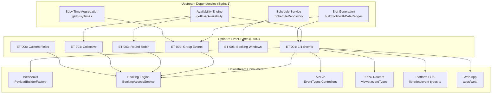

# Technical Specification

# 0. Agent Action Plan

## 0.1 Intent Clarification

### 0.1.1 Core Feature Objective

Based on the prompt, the Blitzy platform understands that the new feature requirement is to **complete Sprint 2: Event Types (F-002)** as defined in the Calendly gap closure sprint roadmap for Cal.com's open-source scheduling platform. This sprint encompasses the systematic closure of all identified behavioral gaps between Cal.com's event type system and Calendly's event type capabilities, as documented across eight source-of-truth documents.

The specific feature requirements are:

- **ET-001 — 1:1 Event Type Behavioral Parity (Medium, M):** Ensure one-on-one event types produce bookable flows that match Calendly's documented one-on-one event behavior — single host paired with a single invitee, correct host assignment, and confirmation workflow. Depends on availability engine (AV-001).
- **ET-002 — Group Event Type Parity via `seatsPerTimeSlot` (Medium, M):** Verify and align group event behavior where multiple attendees book the same time slot, matching Calendly's group event type semantics. Depends on ET-001.
- **ET-003 — Round-Robin Distribution Parity (High, L):** Align Cal.com's `SchedulingType.ROUND_ROBIN` distribution logic — including host weights, priority, and segment-based filtering — with Calendly's equitable round-robin assignment behavior. This is the highest-priority epic in Sprint 2. Depends on ET-001.
- **ET-004 — Collective Scheduling Parity (Medium, M):** Ensure `SchedulingType.COLLECTIVE` correctly requires all hosts to be simultaneously available before presenting bookable slots, matching Calendly's collective event behavior. Depends on ET-001.
- **ET-005 — Booking Window Configuration Alignment (Medium, S):** Verify that event-type-level booking window settings (minimum notice, maximum advance) integrate correctly with availability rules and match Calendly's date-range restrictions. Depends on AV-005.
- **ET-006 — Custom Fields/Questions Parity (Low, M):** Align custom booking field types and capture behavior with Calendly's supported question types (text, radio, checkbox, phone, dropdown). Depends on ET-001.

Implicit requirements detected:

- **Spec-First Workflow Compliance:** Before implementing any gap closure changes, a design spec must be created following `specs/README.md` conventions — `cp -r specs/_templates specs/event-types` — with `design.md`, `implementation.md`, `decisions.md`, and `docs/` artifacts.
- **Validation Gate Readiness (Gate 2):** Sprint 2 must pass Gate 2 before Sprint 3 (Calendar Integrations) can begin. All five validation dimensions — behavioral testing, regression testing, data preservation, webhook compatibility, and cross-domain integration — must pass.
- **Zero-Downtime Migration Safety:** Any schema changes required by event type epics must follow additive-only patterns from `docs/migration/zero-downtime-strategy.mdx`. No column renames, type changes, or NOT NULL additions without defaults.
- **Webhook Backward Compatibility:** Event type changes must not alter existing `v2021-10-20` webhook payloads. The `BOOKING_CREATED`, `BOOKING_RESCHEDULED`, and `BOOKING_CANCELLED` events must continue producing identical payload structures.
- **PR Size Constraints:** Every PR must be reviewable in under 10 minutes — max 5–7 files changed (excluding tests), max 500 lines changed, one focused change per PR.

### 0.1.2 Special Instructions and Constraints

- **Read All Docs Before Coding:** The user explicitly requires reading all source-of-truth documents in full before writing any code. If referenced documents point to additional documents, those must be read as well.
- **Sprint Dependency Prerequisite:** Sprint 2 depends on Sprint 1 (Availability & Scheduling, F-004) having passed Gate 1. Event type slot generation, buffer enforcement, and booking windows all rely on the availability engine producing correct results.
- **Follow Existing Cal.com Conventions:** All implementations must adhere to established architectural patterns — `@evyweb/ioctopus` DI, Prisma repositories, Zod validation, `@calcom/dayjs`, and Vitest testing.
- **Maintain Backward Compatibility:** Platform SDK (`packages/platform/`), API v1 (`apps/api/v1/`), API v2 (`apps/api/v2/`), and web consumers (`apps/web/`) must all continue functioning without regression.
- **Calendly API as Behavioral Source of Truth:** All behavioral targets reference Calendly's API documentation at `developer.calendly.com` as the authoritative benchmark for expected scheduling platform behavior.

### 0.1.3 Technical Interpretation

These feature requirements translate to the following technical implementation strategy:

- To **achieve 1:1 event type parity (ET-001)**, we will verify and harden the default event type booking flow in `packages/features/eventtypes/` where `schedulingType` is `null` (one-on-one implicit type), ensuring correct host assignment, attendee capture, and confirmation behavior aligned with Calendly's documented 1:1 flow.
- To **achieve group event parity (ET-002)**, we will verify and align the `seatsPerTimeSlot` behavior in `packages/features/eventtypes/` and the booking engine, ensuring that multiple attendees can book the same slot up to the seat limit, and the (N+1)th attendee is correctly rejected.
- To **achieve round-robin parity (ET-003)**, we will audit and align the `SchedulingType.ROUND_ROBIN` distribution logic in `packages/features/ee/round-robin/`, verifying equitable host assignment against Calendly's documented behavior, including weight/priority handling and the `isRRWeightsEnabled`/`rrSegmentQueryValue` configurations in the Prisma schema.
- To **achieve collective scheduling parity (ET-004)**, we will verify that `SchedulingType.COLLECTIVE` in `packages/features/availability/lib/getAggregatedAvailability/` correctly computes the intersection of all fixed hosts' schedules and presents only mutually available slots.
- To **achieve booking window alignment (ET-005)**, we will verify the `periodType`, `periodDays`, `periodStartDate`, `periodEndDate`, and `minimumBookingNotice` fields on the `EventType` Prisma model enforce date-range restrictions matching Calendly's three booking window options (days into future, date range, indefinitely).
- To **achieve custom fields parity (ET-006)**, we will audit the `bookingFields` configuration and `customInputs` system in `packages/features/eventtypes/lib/types.ts` to ensure Cal.com supports all Calendly question types (text, radio, checkbox, phone, dropdown) and captures responses correctly.

## 0.2 Repository Scope Discovery

### 0.2.1 Comprehensive File Analysis

The following is an exhaustive catalog of all repository files and folders affected by Sprint 2: Event Types (F-002). Files are grouped by their role in the implementation.

**Core Event Type Feature Files**

| File/Pattern | Type | Purpose |
|---|---|---|
| `packages/features/eventtypes/eventtypes.repository.interface.ts` | MODIFY | Central interface for `IEventTypesRepository` — may need additional method signatures for parity verification |
| `packages/features/eventtypes/repositories/eventTypeRepository.ts` | MODIFY | Primary Prisma-backed persistence layer — verify query projections, authorization, and metadata validation for all 6 paradigms |
| `packages/features/eventtypes/repositories/EventRepository.ts` | VERIFY | Static `getPublicEvent` wrapper — confirm correct behavior for all event type paradigms |
| `packages/features/eventtypes/lib/getEventTypeById.ts` | MODIFY | Central server-side helper assembling event type data — verify enrichment for group/RR/collective types |
| `packages/features/eventtypes/lib/getEventTypesByViewer.ts` | VERIFY | Viewer-scoped event type listing — ensure all paradigms represented correctly |
| `packages/features/eventtypes/lib/getEventTypesPublic.ts` | VERIFY | Public event type resolution — verify public-facing behavior for all types |
| `packages/features/eventtypes/lib/getPublicEvent.ts` | VERIFY | Public event resolution with slug/team handling — confirm parity flows |
| `packages/features/eventtypes/lib/getTeamEventType.ts` | VERIFY | Team event type resolution — critical for RR and collective types |
| `packages/features/eventtypes/lib/types.ts` | MODIFY | `FormValues`, `EventTypeUpdateInput`, and all TypeScript contracts — ensure all paradigm-specific fields are typed |
| `packages/features/eventtypes/lib/schemas.ts` | MODIFY | Zod schemas for event type creation/duplication — verify validation rules |
| `packages/features/eventtypes/lib/defaultEvents.ts` | VERIFY | Default event type templates — verify default configurations |
| `packages/features/eventtypes/lib/bookingFieldsManager.ts` | MODIFY | Booking field normalization — extend for custom field parity (ET-006) |
| `packages/features/eventtypes/lib/checkForEmptyAssignment.ts` | VERIFY | Host assignment validation — relevant for RR/collective |
| `packages/features/eventtypes/lib/getDefinedBufferTimes.ts` | VERIFY | Buffer time retrieval — verify integration with booking windows |
| `packages/features/eventtypes/lib/eventNaming.ts` | VERIFY | Event naming template engine — verify correct rendering for all paradigms |

**Event Type UI Components**

| File/Pattern | Type | Purpose |
|---|---|---|
| `packages/features/eventtypes/components/CreateEventTypeForm.tsx` | MODIFY | Event type creation form — verify all paradigm options available |
| `packages/features/eventtypes/components/AssignAllTeamMembers.tsx` | VERIFY | Team member assignment toggle — relevant for RR/collective |
| `packages/features/eventtypes/components/CheckedTeamSelect.tsx` | VERIFY | Team member multi-select — host selection for team events |
| `packages/features/eventtypes/components/ChildrenEventTypeSelect.tsx` | VERIFY | Managed event type children — parent/child paradigm |
| `packages/features/eventtypes/components/dialogs/HostEditDialogs.tsx` | VERIFY | Host editing modals — weight/priority for RR |
| `packages/features/eventtypes/components/dialogs/ManagedEventDialog.tsx` | VERIFY | Managed event type dialog — admin template flows |
| `packages/features/eventtypes/components/tabs/limits/EventLimitsTab.tsx` | MODIFY | Booking limits and windows — ET-005 alignment |
| `packages/features/eventtypes/components/tabs/recurring/EventRecurringTab.tsx` | VERIFY | Recurring event configuration — verify parity |
| `packages/features/eventtypes/components/WeightDescription.tsx` | VERIFY | RR weight description component — ET-003 |

**Round-Robin Enterprise Module**

| File/Pattern | Type | Purpose |
|---|---|---|
| `packages/features/ee/round-robin/**/*.ts` | MODIFY | RR rescheduling, reassignment, booking manager, event manager, host priority/weight, slot validation, assignment reason recording — ET-003 |

**Availability Integration (Upstream Dependency)**

| File/Pattern | Type | Purpose |
|---|---|---|
| `packages/features/availability/lib/getUserAvailability.ts` | VERIFY | Orchestrator for availability pipeline — verify correct integration with event types |
| `packages/features/availability/lib/getAggregatedAvailability/*.ts` | VERIFY | Team availability aggregation — critical for ET-003 (RR) and ET-004 (Collective) |
| `packages/features/schedules/lib/slots.ts` | VERIFY | Slot generation — verify correct slot production for all event type paradigms |
| `packages/features/schedules/lib/date-ranges.ts` | VERIFY | Date range calculation with DST — upstream dependency |
| `packages/features/busyTimes/services/getBusyTimes.ts` | VERIFY | Busy time aggregation — verify seated event handling for group events |

**Prisma Schema and Database**

| File/Pattern | Type | Purpose |
|---|---|---|
| `packages/prisma/schema.prisma` | MODIFY | `EventType` model, `SchedulingType` enum, `BookingSeat` model — potential schema additions for parity |
| `packages/prisma/selects/event-types.ts` | VERIFY | `bookEventTypeSelect`, `availiblityPageEventTypeSelect` — verify projections cover all fields |
| `packages/prisma/selects/booking.ts` | VERIFY | Booking select projections — verify group/seated booking fields |
| `packages/prisma/selects/user.ts` | VERIFY | User select for availability — verify host data projections |
| `packages/prisma/migrations/` | CREATE | New migration files for any schema changes (additive-only patterns) |

**API v2 (NestJS)**

| File/Pattern | Type | Purpose |
|---|---|---|
| `apps/api/v2/src/ee/event-types/event-types_2024_06_14/**/*.ts` | MODIFY | Latest versioned EE event type CRUD — verify all paradigm support |
| `apps/api/v2/src/ee/event-types/event-types_2024_04_15/**/*.ts` | VERIFY | Previous version — maintain backward compatibility |
| `apps/api/v2/src/modules/teams/event-types/**/*.ts` | MODIFY | Team event type repository/service — verify RR/collective flows |
| `apps/api/v2/src/modules/organizations/event-types/**/*.ts` | VERIFY | Organization-scoped event types — verify managed type propagation |
| `apps/api/v2/src/modules/atoms/services/event-types-atom.service.ts` | VERIFY | Atoms event type orchestration — verify all paradigm support |

**tRPC Routers**

| File/Pattern | Type | Purpose |
|---|---|---|
| `packages/trpc/server/routers/viewer/eventTypes/**/*.ts` | MODIFY | Viewer-scoped event type tRPC routes — verify create/update/list for all paradigms |

**Platform SDK**

| File/Pattern | Type | Purpose |
|---|---|---|
| `packages/platform/libraries/event-types.ts` | VERIFY | Re-export surface — ensure new helpers are surfaced |
| `packages/platform/atoms/event-types/**/*.ts` | VERIFY | Atom types and wrappers — verify paradigm coverage |

**Webhook System (Backward Compatibility)**

| File/Pattern | Type | Purpose |
|---|---|---|
| `packages/features/webhooks/lib/factory/versioned/v2021-10-20/**/*.ts` | VERIFY | Existing payload builders — ensure no changes to booking payloads |
| `packages/features/webhooks/lib/factory/versioned/PayloadBuilderFactory.ts` | VERIFY | Factory routing — verify trigger mapping remains intact |

**Spec Workflow Artifacts**

| File/Pattern | Type | Purpose |
|---|---|---|
| `specs/event-types/design.md` | CREATE | Design spec documenting what to build and how |
| `specs/event-types/implementation.md` | CREATE | Progress tracking for session continuity |
| `specs/event-types/decisions.md` | CREATE | Architecture Decision Records for trade-offs |
| `specs/event-types/CLAUDE.md` | CREATE | AI agent instructions for this feature |
| `specs/event-types/AGENTS.md` | CREATE | Agent guidelines for this feature |
| `specs/event-types/prompts.md` | CREATE | Reusable prompts for common tasks |
| `specs/event-types/future-work.md` | CREATE | Deferred ideas and enhancements |
| `specs/event-types/docs/README.md` | CREATE | Internal documentation |

### 0.2.2 Web Search Research Conducted

No external web search is required for this sprint. All behavioral targets are documented in the source-of-truth files within the repository:

- Calendly behavioral benchmarks are captured in `docs/gap-report/event-types.mdx`
- Acceptance criteria are defined in `docs/sprint-roadmap/validation-criteria.mdx` (ET-VAL-001 through ET-VAL-009)
- Migration patterns are documented in `docs/migration/zero-downtime-strategy.mdx`
- Webhook compatibility rules are in `docs/migration/webhook-compatibility.mdx`

### 0.2.3 New File Requirements

**New spec files to create:**
- `specs/event-types/design.md` — Comprehensive design spec for Sprint 2 event type parity closure
- `specs/event-types/implementation.md` — Progress tracker for all 6 epics (ET-001 through ET-006)
- `specs/event-types/decisions.md` — ADRs for any architectural trade-offs during parity work
- `specs/event-types/CLAUDE.md` — AI agent instructions scoped to event types
- `specs/event-types/AGENTS.md` — Agent guidelines scoped to event types
- `specs/event-types/prompts.md` — Reusable prompts for event type tasks
- `specs/event-types/future-work.md` — Deferred items (e.g., ET-001 Meeting Polls gap)
- `specs/event-types/docs/README.md` — Internal documentation with screenshots

**New test files to create:**
- `packages/features/eventtypes/lib/__tests__/eventTypeParity.test.ts` — Behavioral parity tests for all 6 scheduling paradigms
- `packages/features/eventtypes/lib/__tests__/bookingWindowParity.test.ts` — Booking window alignment tests (ET-005)
- `packages/features/eventtypes/lib/__tests__/customFieldsParity.test.ts` — Custom field type coverage tests (ET-006)
- `packages/features/ee/round-robin/__tests__/distributionParity.test.ts` — Round-robin equitable distribution tests (ET-003)

**New migration files (if schema changes needed):**
- `packages/prisma/migrations/[timestamp]_event_type_parity_fields/migration.sql` — Additive-only columns for any missing parity fields

## 0.3 Dependency Inventory

### 0.3.1 Private and Public Packages

The following table lists all key packages relevant to the Sprint 2 event type parity implementation. Versions are sourced from the repository's dependency manifests.

| Registry | Package | Version | Purpose |
|---|---|---|---|
| Workspace | `@calcom/features` | Workspace | Event type feature modules, availability, schedules, busy times, round-robin |
| Workspace | `@calcom/prisma` | Workspace | Prisma ORM client, schema, migrations, selects, auto-migrations |
| Workspace | `@calcom/trpc` | Workspace | tRPC server routers for event type CRUD operations |
| Workspace | `@calcom/lib` | Workspace | Utility functions — slug generation, timezone, formatting |
| Workspace | `@calcom/ui` | Workspace | Shared UI component library for event type forms and dialogs |
| Workspace | `@calcom/dayjs` | Workspace | Day.js with plugins for scheduling (BusinessDays, UTC, timezone) |
| Workspace | `@calcom/platform` | Workspace | Platform SDK — atoms, types, utils, constants, libraries |
| Workspace | `@calcom/emails` | Workspace | Email templates for booking confirmations |
| Workspace | `@calcom/types` | Workspace | Shared TypeScript type declarations |
| Workspace | `@calcom/ee` | Workspace | Enterprise DI modules for round-robin, managed types |
| Workspace | `@calcom/testing` | Workspace | Vitest fixtures, mocks, performance harnesses |
| npm | `@prisma/client` | Per lockfile | Prisma ORM runtime client |
| npm | `prisma` | Per lockfile | Prisma CLI for migrations and schema management |
| npm | `zod` | Per lockfile | Schema validation for event type inputs, metadata, booking fields |
| npm | `next` | Per lockfile | Next.js framework for web application |
| npm | `react` | Per lockfile | UI rendering for event type components |
| npm | `react-hook-form` | Per lockfile | Form state management for event type configuration UI |
| npm | `@trpc/server` | next-beta 11 | tRPC server framework for typed API routes |
| npm | `@trpc/react-query` | Per lockfile | React Query integration for tRPC client |
| npm | `vitest` | Per lockfile | Test runner for unit and integration tests |
| npm | `@nestjs/core` | Per lockfile | NestJS framework for API v2 event type modules |
| npm | `superjson` | Per lockfile | JSON serialization for tRPC responses |
| npm | `@evyweb/ioctopus` | Per lockfile | Dependency injection container |
| npm | `handlebars` | Per lockfile | Webhook payload template rendering |
| npm | `yarn` | 4.12.0 | Package manager (pinned via `.yarnrc.yml`) |

### 0.3.2 Dependency Updates

**Import Updates**

Files requiring import updates follow the event type feature's modular structure:

- `packages/features/eventtypes/**/*.ts` — Internal imports for new parity test utilities, type extensions, and schema modifications
- `packages/features/ee/round-robin/**/*.ts` — RR module imports for distribution alignment helpers
- `specs/event-types/**/*.md` — New spec folder referencing existing design patterns from `specs/_templates/`

**Import Transformation Rules:**

- Existing: `from '@calcom/features/eventtypes/lib/types'` — No changes, preserve existing import paths
- New tests: `from '@calcom/features/eventtypes/lib/types'` and `from '@calcom/testing'` for test fixtures
- Spec references: Follow `specs/_templates/` patterns exactly

**External Reference Updates:**

- `docs/gap-report/event-types.mdx` — Update gap inventory status after parity closure
- `docs/sprint-roadmap/epic-catalog.mdx` — Mark ET-001 through ET-006 completion status
- `docs/sprint-roadmap/validation-criteria.mdx` — Record validation evidence for ET-VAL criteria
- `README.md` — No changes expected unless new user-facing features are added

## 0.4 Integration Analysis

### 0.4.1 Existing Code Touchpoints

**Direct Modifications Required:**

- `packages/features/eventtypes/lib/getEventTypeById.ts` — Verify enrichment pipeline correctly handles all 6 scheduling paradigms (one-on-one, group, RR, collective, managed, dynamic); ensure metadata parsing, booking field assembly, and location configuration are correct for each type
- `packages/features/eventtypes/lib/bookingFieldsManager.ts` — Extend booking field normalization to support all Calendly question types (text, radio, checkbox, phone, dropdown) for ET-006
- `packages/features/eventtypes/lib/types.ts` — Verify `FormValues` covers all paradigm-specific properties; ensure `EventTypeUpdateInput` includes all necessary optional fields
- `packages/features/eventtypes/components/tabs/limits/EventLimitsTab.tsx` — Align booking window UI controls with Calendly's three booking window options for ET-005
- `packages/features/ee/round-robin/**/*.ts` — Audit and align distribution algorithm, weight handling, priority assignment, and fairness logic for ET-003
- `packages/features/eventtypes/components/CreateEventTypeForm.tsx` — Verify paradigm selection options and form validation

**Dependency Injections:**

- `packages/features/di/` — Verify DI container registrations for event type services include all required repository and service bindings
- `packages/features/ee/round-robin/` — Verify enterprise DI module wiring for round-robin booking manager, event manager, and assignment services

**Availability Integration (Upstream):**

- `packages/features/availability/lib/getUserAvailability.ts` — Verify the `UserAvailabilityService` orchestrator correctly feeds into event type booking flows for all paradigms
- `packages/features/availability/lib/getAggregatedAvailability/getAggregatedAvailability.ts` — Critical for ET-003 (RR grouping) and ET-004 (collective intersection) — verify fixed-host intersection and round-robin grouping by `groupId`
- `packages/features/schedules/lib/slots.ts` — Verify `buildSlotsWithDateRanges` correctly handles `seatsPerTimeSlot` for group events (ET-002)
- `packages/features/busyTimes/services/getBusyTimes.ts` — Verify seated event handling and buffer application for group events

**Database/Schema Touchpoints:**

- `packages/prisma/schema.prisma` — The `EventType` model contains all relevant fields: `schedulingType` (enum: ROUND_ROBIN, COLLECTIVE, MANAGED), `seatsPerTimeSlot`, `minimumBookingNotice`, `beforeEventBuffer`, `afterEventBuffer`, `periodType`, `periodDays`, `periodStartDate`, `periodEndDate`, `bookingLimits`, `durationLimits`, `isRRWeightsEnabled`, `rrSegmentQueryValue`, `assignAllTeamMembers`, `assignRRMembersUsingSegment`, `bookingFields`, `customInputs`, and related fields. Any new columns must follow additive-only migration patterns.
- `packages/prisma/selects/event-types.ts` — Verify `bookEventTypeSelect` and `availiblityPageEventTypeSelect` include all fields needed by parity tests
- `packages/prisma/migrations/` — New migration directory for any required schema additions

### 0.4.2 Cross-Feature Integration Map

### 0.4.3 API Surface Impact

**tRPC Routes (Viewer Scope):**
- `viewer.eventTypes.create` — Verify creation supports all 6 paradigms with correct validation
- `viewer.eventTypes.update` — Verify update handles paradigm-specific fields
- `viewer.eventTypes.get` — Verify retrieval returns enriched data for all paradigms
- `viewer.eventTypes.list` — Verify listing includes paradigm metadata

**API v2 (NestJS):**
- `POST /v2/event-types` — Verify full paradigm support with correct DTOs
- `PATCH /v2/event-types/:id` — Verify update preserves paradigm-specific configurations
- `GET /v2/event-types` — Verify listing and filtering across paradigms
- `DELETE /v2/event-types/:id` — Verify safe deletion with booking handling

**Webhook Events Affected:**
- `BOOKING_CREATED` — Must fire with correct payload for all event type paradigms
- `BOOKING_RESCHEDULED` — Must include old/new booking details for all paradigms
- `BOOKING_CANCELLED` — Must fire for all paradigm types
- All `v2021-10-20` payloads must remain unchanged (additive-only extensions permitted)

## 0.5 Technical Implementation

### 0.5.1 File-by-File Execution Plan

Every file listed below MUST be created or modified as part of Sprint 2 execution. Files are grouped by implementation priority.

**Group 1 — Spec-First Design Artifacts (Pre-Implementation)**

- CREATE: `specs/event-types/design.md` — Comprehensive design spec covering all 6 epics with technical approach, affected modules, and acceptance criteria drawn from `docs/sprint-roadmap/validation-criteria.mdx`
- CREATE: `specs/event-types/implementation.md` — Progress tracker with status for ET-001 through ET-006 (Status, Completed, In Progress, Blocked, Next Steps, Session Notes)
- CREATE: `specs/event-types/decisions.md` — ADR scaffold for architectural trade-offs (e.g., whether to add new schema columns vs. metadata-based approaches)
- CREATE: `specs/event-types/CLAUDE.md` — Agent instructions referencing `design.md`, `implementation.md`, and relevant source directories
- CREATE: `specs/event-types/AGENTS.md` — Agent guidelines with project context and preparatory checklist
- CREATE: `specs/event-types/prompts.md` — Lifecycle prompts for sync, test generation, code review, and documentation
- CREATE: `specs/event-types/future-work.md` — Deferred items including Meeting Polls (ET-001 gap from gap report) and RR fairness visualization (ET-002 gap)
- CREATE: `specs/event-types/docs/README.md` — Internal documentation template with screenshot placeholders

**Group 2 — Core Event Type Parity (ET-001, ET-002)**

- MODIFY: `packages/features/eventtypes/lib/getEventTypeById.ts` — Verify and harden enrichment pipeline for 1:1 and group event types; ensure correct host assignment, seat handling, and metadata parsing
- MODIFY: `packages/features/eventtypes/lib/getPublicEvent.ts` — Verify public event resolution returns correct data for seated (group) events including remaining seat count
- VERIFY: `packages/features/eventtypes/repositories/eventTypeRepository.ts` — Confirm `findForSlots` and `findByIdForUserAvailability` return correct projections for group events
- VERIFY: `packages/features/schedules/lib/slots.ts` — Confirm `buildSlotsWithDateRanges` correctly handles `seatsPerTimeSlot` and out-of-office overlay for seated events
- CREATE: `packages/features/eventtypes/lib/__tests__/eventTypeParity.test.ts` — Behavioral parity test suite covering ET-VAL-001 through ET-VAL-004

**Group 3 — Round-Robin Distribution Parity (ET-003)**

- MODIFY: `packages/features/ee/round-robin/**/*.ts` — Audit distribution algorithm against Calendly's equitable round-robin behavior; verify weight/priority handling, segment-based filtering via `rrSegmentQueryValue`, and assignment reason recording
- VERIFY: `packages/features/availability/lib/getAggregatedAvailability/getAggregatedAvailability.ts` — Confirm RR hosts grouped by `groupId` with at-least-one-available logic
- VERIFY: `packages/features/eventtypes/components/dialogs/HostEditDialogs.tsx` — Confirm host weight/priority editing UI is correct
- VERIFY: `packages/features/eventtypes/components/WeightDescription.tsx` — Confirm weight description text is accurate
- CREATE: `packages/features/ee/round-robin/__tests__/distributionParity.test.ts` — Distribution fairness test suite verifying equitable assignment across hosts

**Group 4 — Collective Scheduling Parity (ET-004)**

- VERIFY: `packages/features/availability/lib/getAggregatedAvailability/getAggregatedAvailability.ts` — Confirm fixed-host intersection correctly computes mutual availability for `SchedulingType.COLLECTIVE`
- VERIFY: `packages/features/eventtypes/components/AssignAllTeamMembers.tsx` — Confirm collective host assignment toggle behavior
- VERIFY: `packages/features/eventtypes/components/CheckedTeamSelect.tsx` — Confirm team member selection for collective events

**Group 5 — Booking Window Alignment (ET-005)**

- MODIFY: `packages/features/eventtypes/components/tabs/limits/EventLimitsTab.tsx` — Align booking window configuration with Calendly's three options (days into future with calendar/business day support, date range, indefinitely)
- VERIFY: `packages/prisma/schema.prisma` — Confirm `periodType` enum (`UNLIMITED`, `RANGE`, `ROLLING`) covers all Calendly equivalents
- CREATE: `packages/features/eventtypes/lib/__tests__/bookingWindowParity.test.ts` — Booking window behavioral tests covering ET-VAL-006

**Group 6 — Custom Fields/Questions Parity (ET-006)**

- MODIFY: `packages/features/eventtypes/lib/bookingFieldsManager.ts` — Verify and extend field type support to cover all Calendly question types (text, radio, checkbox, phone, dropdown)
- VERIFY: `packages/features/eventtypes/lib/types.ts` — Confirm `FormValues.bookingFields` schema supports all required field types
- CREATE: `packages/features/eventtypes/lib/__tests__/customFieldsParity.test.ts` — Custom field type coverage test suite covering ET-VAL-005

**Group 7 — Validation Gate Preparation**

- MODIFY: `docs/gap-report/event-types.mdx` — Update gap inventory status after parity closure; mark completed gaps
- MODIFY: `docs/sprint-roadmap/epic-catalog.mdx` — Record completion status for ET-001 through ET-006
- CREATE: `specs/event-types/docs/validation-report.md` — Gate 2 validation evidence report with pass/fail for all ET-VAL criteria

### 0.5.2 Implementation Approach per File

The implementation follows a six-step progression aligned with the autonomous execution protocol defined in `docs/sprint-roadmap/overview.mdx`:

- **Step 1 — Gap Analysis Review:** Read `docs/gap-report/event-types.mdx` and `docs/gap-report/availability-scheduling.mdx` to fully understand all identified gaps, their severity, and the current Cal.com implementation state for each event type paradigm
- **Step 2 — Epic Selection:** Select all 6 epics (ET-001 through ET-006) from `docs/sprint-roadmap/epic-catalog.mdx`, respecting the internal dependency ordering (ET-001 → ET-002/ET-003/ET-004/ET-006, AV-005 → ET-005)
- **Step 3 — Spec-First Design:** Create the `specs/event-types/` folder by cloning `specs/_templates/` and populate `design.md` with the technical approach for all 6 epics
- **Step 4 — Implementation:** Execute implementation following design spec, adhering to Cal.com conventions (`@evyweb/ioctopus` DI, Prisma repositories, Zod validation, `@calcom/dayjs`, Vitest), with max 5–7 files per PR, max 500 lines per PR, and one focused change per PR
- **Step 5 — Migration Safety:** Apply zero-downtime migration patterns for any schema changes: additive-only columns with defaults, nullable columns, feature flag gating. Follow `docs/migration/zero-downtime-strategy.mdx` patterns
- **Step 6 — Validation:** Verify against all ET-VAL behavioral acceptance criteria from `docs/sprint-roadmap/validation-criteria.mdx`, then run regression tests, data preservation checks, webhook compatibility checks, and cross-domain integration tests

### 0.5.3 User Interface Design

The Sprint 2 event type parity work primarily involves verification and alignment of existing UI rather than new UI creation. Key UI considerations:

- **Event Type Creation Flow:** The `CreateEventTypeForm.tsx` must present all 6 scheduling paradigm options correctly — one-on-one (default), group (via seats toggle), round-robin, collective, managed (for team admins), and dynamic
- **Booking Window Configuration:** The `EventLimitsTab.tsx` must expose Calendly-equivalent booking window options — days into future (with calendar vs. business day distinction per AVL-GAP-001), date range picker, and indefinite option
- **Custom Fields Builder:** The booking field configuration UI must support text, radio, checkbox, phone, and dropdown field types to match Calendly's question type taxonomy
- **Round-Robin Host Configuration:** The host editing dialogs must expose weight and priority controls with clear descriptions of distribution impact
- **Validation Feedback:** All event type forms must provide clear validation feedback through Zod schema-driven error messages

## 0.6 Scope Boundaries

### 0.6.1 Exhaustively In Scope

**All Event Type Feature Source Files:**
- `packages/features/eventtypes/**/*.ts` — Core event type logic, types, schemas, repositories, and tests
- `packages/features/eventtypes/**/*.tsx` — UI components for event type configuration and management

**Round-Robin Enterprise Module:**
- `packages/features/ee/round-robin/**/*.ts` — Distribution algorithm, rescheduling, reassignment, host priority/weight

**Availability Integration Points:**
- `packages/features/availability/lib/getUserAvailability.ts` — Orchestrator verification
- `packages/features/availability/lib/getAggregatedAvailability/**/*.ts` — Team availability aggregation (RR/collective)
- `packages/features/schedules/lib/slots.ts` — Slot generation for seated events
- `packages/features/busyTimes/services/getBusyTimes.ts` — Busy time handling for group events

**Database and Schema:**
- `packages/prisma/schema.prisma` — `EventType` model, `SchedulingType` enum, `BookingSeat` model
- `packages/prisma/selects/event-types.ts` — Event type select projections
- `packages/prisma/selects/booking.ts` — Booking select projections
- `packages/prisma/migrations/[timestamp]_*` — New additive-only migration files

**API Surfaces:**
- `apps/api/v2/src/ee/event-types/**/*.ts` — NestJS event type CRUD modules
- `apps/api/v2/src/modules/teams/event-types/**/*.ts` — Team event type management
- `packages/trpc/server/routers/viewer/eventTypes/**/*.ts` — tRPC event type routes

**Platform SDK:**
- `packages/platform/libraries/event-types.ts` — Re-export surface verification
- `packages/platform/atoms/event-types/**/*.ts` — Atom types verification

**Webhook Compatibility Verification:**
- `packages/features/webhooks/lib/factory/versioned/v2021-10-20/**/*.ts` — Payload preservation verification
- `packages/features/webhooks/lib/factory/versioned/PayloadBuilderFactory.ts` — Factory routing verification

**Spec Workflow Artifacts:**
- `specs/event-types/**/*` — All spec-first design documents

**Test Files:**
- `packages/features/eventtypes/**/*.test.ts` — Existing and new unit/integration tests
- `packages/features/ee/round-robin/**/*.test.ts` — Round-robin distribution tests
- `packages/features/eventtypes/repositories/__tests__/**/*.ts` — Repository tests

**Documentation Updates:**
- `docs/gap-report/event-types.mdx` — Gap inventory status updates
- `docs/sprint-roadmap/epic-catalog.mdx` — Epic completion status
- `docs/sprint-roadmap/validation-criteria.mdx` — Validation evidence

**Configuration Files:**
- `.env.example` — If new environment variables are required
- `packages/prisma/docker-compose.yml` — PostgreSQL 13 local development verification

### 0.6.2 Explicitly Out of Scope

- **Sprint 1 (Availability & Scheduling) rework** — Sprint 1 must already be complete and Gate 1 passed. No availability engine modifications unless bugs are discovered during event type validation.
- **Sprint 3+ feature domains** — Calendar Integrations (F-003), Webhooks (F-013), Routing Forms (F-015), Embed (F-008), Admin/Teams (F-009), and Notifications (F-018) are all out of scope for Sprint 2.
- **Meeting Polls (ET-001 gap)** — The gap report identifies Meeting Polls as a Medium priority gap. This is explicitly deferred to `specs/event-types/future-work.md` as it represents net-new functionality rather than behavioral parity.
- **RR Fairness Cap Visualization (ET-002 gap)** — Low priority UI enhancement for round-robin distribution analytics. Deferred to future work.
- **Performance optimizations** — No performance tuning beyond what is required for correct parity behavior.
- **Refactoring of existing code** — No structural refactoring unrelated to parity alignment.
- **New webhook payload versions** — No new `PayloadBuilderFactory` versions. Only verify backward compatibility of existing `v2021-10-20` payloads.
- **Email/SMS template changes** — Notification content is out of scope (Sprint 8).
- **Embed behavior changes** — Embed rendering is out of scope (Sprint 6).
- **Admin/team governance changes** — Role model and team routing changes are out of scope (Sprint 7).

## 0.7 Rules for Feature Addition

### 0.7.1 Spec-First Development Compliance

- Every implementation change MUST be preceded by a design spec in `specs/event-types/design.md` following the repository's spec-first workflow defined in `specs/README.md`
- Progress MUST be tracked in `specs/event-types/implementation.md` for session continuity across Claude sessions
- Architectural trade-offs MUST be documented as ADRs in `specs/event-types/decisions.md` with Context, Options Considered (with pros/cons), Decision rationale, and Consequences sections

### 0.7.2 PR Size and Focus Constraints

- Every PR MUST be reviewable in under 10 minutes
- Max 5–7 files changed per PR (excluding test files)
- Max 500 lines changed per PR
- One focused change per PR — e.g., one epic per PR or one sub-task within an epic
- If a change is larger, it MUST be split into multiple focused PRs

### 0.7.3 Zero-Downtime Migration Rules

- All schema migrations MUST use backward-compatible patterns only: additive columns with defaults, nullable columns, feature flag gating
- NEVER rename columns, change column types, add NOT NULL columns without defaults, or drop columns in the same deployment as code changes
- NEVER rename or remove enum values from `SchedulingType` or any other Prisma enum
- All migrations MUST include a rollback SQL script tested in staging
- All migrations MUST follow the blue-green deployment approach: schema first, then application, then backfill
- Migration SQL must be placed in `packages/prisma/migrations/[timestamp]_descriptive_name/migration.sql`

### 0.7.4 Webhook Backward Compatibility Rules

- Existing `v2021-10-20` webhook payloads MUST NOT be modified — no field removals, renames, or type changes
- The `V20211020BookingEventPayload` type with its legacy `assignmentReason` format MUST be preserved exactly
- New optional fields MAY be added to payloads (Rule R-1 from webhook compatibility guide)
- `DEFAULT_WEBHOOK_VERSION` MUST remain `V_2021_10_20`
- `TRIGGER_TO_BUILDER_CATEGORY` mapping MUST remain exhaustive for all 20 `WebhookTriggerEvents`

### 0.7.5 Validation Gate Requirements

- Sprint 2 completion requires passing Gate 2 across all five validation dimensions:
  - **Behavioral Validation:** All ET-VAL-001 through ET-VAL-009 criteria met
  - **Regression Testing:** Zero test failures across all affected packages — `packages/features/eventtypes/`, `packages/features/ee/round-robin/`, `packages/features/availability/`
  - **Data Preservation:** Zero data loss — all existing event types, bookings, users, credentials, and schedules intact after any migrations
  - **Webhook Compatibility:** All existing webhook consumers receive unchanged `v2021-10-20` payloads
  - **Cross-Domain Integration:** Booking creation through all event type paradigms triggers correct webhooks and uses correct availability schedules

### 0.7.6 Cal.com Architectural Conventions

- Use `@evyweb/ioctopus` for dependency injection — follow existing DI container patterns in `packages/features/di/`
- Use Prisma repositories for all database access — never query Prisma directly from service or UI layers
- Use Zod schemas for all input validation — validate at the API boundary and parse metadata with `EventTypeMetaDataSchema`
- Use `@calcom/dayjs` for all date/time operations — never use native `Date` or raw `dayjs` imports
- Use Vitest for all tests — follow existing test patterns with `vi.mock` for Prisma mocking
- Use `useLocale()` / `ServerTrans` for all user-facing strings — maintain i18n compliance
- Maintain backward compatibility with Platform SDK, API v1, API v2, and web consumers

### 0.7.7 Calendly Behavioral Source of Truth

- All behavioral targets MUST reference Calendly's API documentation at `developer.calendly.com` as the authoritative benchmark
- Where Cal.com exceeds Calendly capabilities (managed types, dynamic links, 6 vs 4 paradigms), document the advantage and ensure backward compatibility
- Use the gap severity classification consistently: Critical (blocks parity), High (significant behavioral gap), Medium (minor behavioral difference), Low (cosmetic or edge case)

## 0.8 References

### 0.8.1 Source-of-Truth Documents Reviewed

The following documents were read in full as directed by the user and form the basis of this Agent Action Plan:

**Sprint Roadmap:**

| Document | Path | Summary |
|---|---|---|
| Sprint Roadmap Overview | `docs/sprint-roadmap/overview.mdx` | Defines methodology, dependency-first sequencing strategy across 8 feature domains, autonomous execution protocol with 7 steps (gap review → epic selection → spec-first design → implementation → migration safety → validation → documentation update), validation gates between sprints, and risk management matrix |
| Epic Catalog | `docs/sprint-roadmap/epic-catalog.mdx` | Comprehensive registry of 40 epics across 8 domains with stable IDs, priority (Critical/High/Medium/Low), complexity estimates (S/M/L/XL), dependency chains, and cross-domain DAG. Sprint 2 contains 6 epics: ET-001 through ET-006 |
| Validation Criteria | `docs/sprint-roadmap/validation-criteria.mdx` | Defines 71 behavioral acceptance criteria across all domains. Event Types domain: ET-VAL-001 through ET-VAL-009 covering 1:1, group, RR, collective, custom fields, booking windows, locations, managed types, and dynamic links |

**Gap Analysis:**

| Document | Path | Summary |
|---|---|---|
| Gap Report Overview | `docs/gap-report/overview.mdx` | Executive summary showing Cal.com exceeds Calendly across 7 of 8 domains (Low severity); only Notifications has Medium severity gaps. Documents Cal.com advantages: 20 vs 3 webhooks, 11+ vs 3 calendars, 6 vs 4 scheduling paradigms |
| Availability & Scheduling Gap Report | `docs/gap-report/availability-scheduling.mdx` | Detailed analysis of availability engine with 3 minor gaps (AVL-GAP-001 business-day windows, AVL-GAP-002 slot diagnostics, AVL-GAP-003 buffer-to-calendar sync) and 7 Cal.com advantages. All gaps rated Low severity |
| Event Types Gap Report | `docs/gap-report/event-types.mdx` | Documents 2 gaps (ET-001 Meeting Polls at Medium, ET-002 RR Fairness Visualization at Low) and 8 Cal.com advantages (managed types, dynamic links, full API management, recurring events, booking limits, 6 paradigms, segment-based RR, cancel/reschedule controls). Feature comparison matrix shows full parity or Cal.com advantage across all 24 analyzed features |

**Migration Safety:**

| Document | Path | Summary |
|---|---|---|
| Zero-Downtime Migration Strategy | `docs/migration/zero-downtime-strategy.mdx` | Defines 7 backward-compatible schema change patterns proven across 584 Cal.com migrations, blue-green deployment approach, anti-patterns list, rollback procedures, and gap closure migration checklist |
| Data Preservation | `docs/migration/data-preservation.mdx` | Documents complete user data inventory (bookings, event types, schedules, webhooks, credentials, users, teams, organizations, payments, workflows), encryption key handling (CALENDSO_ENCRYPTION_KEY for AES-256), migration safeguards pipeline, and formal preservation guarantees for each entity |
| Webhook Backward Compatibility | `docs/migration/webhook-compatibility.mdx` | Defines `PayloadBuilderFactory` versioning architecture, `v2021-10-20` payload preservation guarantees, additive-only field rules (R-1 through R-6), consumer migration path, and rollback procedures |

**Spec Workflow:**

| Document | Path | Summary |
|---|---|---|
| Spec-First Development README | `specs/README.md` | Defines the spec-first workflow: template duplication, Claude review, implementation tracking, ADR logging, documentation with screenshots, and PR review constraints (5–7 files, ≤500 lines, one change per PR) |

### 0.8.2 Repository Files and Folders Searched

The following repository paths were explored during context gathering to derive the conclusions in this Action Plan:

**Root-Level Files:**
- `package.json` — Yarn 4.12.0 monorepo configuration, workspaces, engines
- `turbo.json` — Turborepo pipeline configuration
- `.yarnrc.yml` — Yarn configuration with node_modules linker

**Feature Packages:**
- `packages/features/eventtypes/` — Complete event type feature module (interface, components, lib, repositories)
- `packages/features/eventtypes/eventtypes.repository.interface.ts` — IEventTypesRepository contract
- `packages/features/eventtypes/repositories/eventTypeRepository.ts` — Primary Prisma persistence layer
- `packages/features/eventtypes/repositories/EventRepository.ts` — Static getPublicEvent wrapper
- `packages/features/eventtypes/lib/types.ts` — FormValues, EventTypeUpdateInput contracts
- `packages/features/eventtypes/lib/getEventTypeById.ts` — Central enrichment helper
- `packages/features/eventtypes/lib/schemas.ts` — Zod validation schemas
- `packages/features/eventtypes/components/**/*.tsx` — UI components for event type configuration

**Prisma:**
- `packages/prisma/schema.prisma` — EventType model (lines 200–280), SchedulingType enum (lines 42–46)
- `packages/prisma/selects/event-types.ts` — bookEventTypeSelect, availiblityPageEventTypeSelect
- `packages/prisma/selects/booking.ts` — bookingMinimalSelect, bookingDetailsSelect
- `packages/prisma/selects/user.ts` — availabilityUserSelect, userSelect
- `packages/prisma/selects/credential.ts` — credentialForCalendarServiceSelect

**API v2:**
- `apps/api/v2/src/ee/event-types/` — Versioned event type CRUD modules
- `apps/api/v2/src/modules/teams/event-types/` — Team event type repository/service
- `apps/api/v2/src/modules/organizations/event-types/` — Organization event type service
- `apps/api/v2/src/modules/atoms/services/event-types-atom.service.ts` — Atoms orchestration

**Platform SDK:**
- `packages/platform/libraries/event-types.ts` — Re-export aggregator
- `packages/platform/atoms/event-types/types.ts` — AtomEventTypeListItem, AtomEventTypesResponse

**Documentation:**
- `docs/sprint-roadmap/overview.mdx` — Sprint sequencing methodology
- `docs/sprint-roadmap/epic-catalog.mdx` — 40 epics across 8 domains
- `docs/sprint-roadmap/validation-criteria.mdx` — 71 behavioral criteria
- `docs/gap-report/overview.mdx` — Executive parity summary
- `docs/gap-report/availability-scheduling.mdx` — Availability domain analysis
- `docs/gap-report/event-types.mdx` — Event types domain analysis
- `docs/migration/zero-downtime-strategy.mdx` — Migration patterns
- `docs/migration/data-preservation.mdx` — Data preservation guarantees
- `docs/migration/webhook-compatibility.mdx` — Webhook versioning strategy

**Blitzy Sprint 1 Artifacts:**
- `blitzy/documentation/Project Guide.md` — Sprint 1 deliverable dossier
- `blitzy/documentation/Technical Specifications.md` — Sprint 1 agent action plan

**Spec Templates:**
- `specs/README.md` — Spec-first development workflow
- `specs/_templates/` — Template folder for new feature specs

### 0.8.3 Attachments

No attachments were provided for this project. No Figma URLs were specified.

