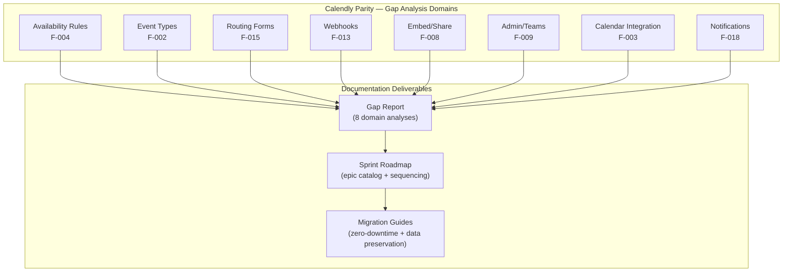

# Technical Specification

# 0. Agent Action Plan

## 0.1 Intent Clarification

### 0.1.1 Core Documentation Objective

Based on the provided requirements, the Blitzy platform understands that the documentation objective is to **create comprehensive, production-ready gap analysis documentation and sprint roadmap documentation** that closes all Calendly capability gaps in the Cal.com OSS codebase. The documentation scope encompasses producing a complete Gap Report referencing Calendly's behavioral surface as the source of truth, paired with a sprint roadmap that guides autonomous epic implementation toward Calendly feature parity.

- **Documentation Category:** Create new documentation | Update existing documentation | Fix documentation gaps
- **Documentation Type:** Gap Report, Sprint Roadmap, Architecture Documentation, API Reference Documentation, Migration Guides, Technical Specifications
- **Requirements with Enhanced Clarity:**
  - **R-DOC-001**: Produce a Gap Report that systematically compares Calendly's scheduling capabilities against Cal.com's existing implementation for each in-scope feature domain (availability rules, event types, routing forms, webhooks, embeds, admin/teams, calendar integrations, notifications)
  - **R-DOC-002**: Generate a sprint roadmap document that sequences autonomous epic implementation runs, organizing work by feature domain priority and dependency order
  - **R-DOC-003**: Document availability rules and scheduling logic, mapping Cal.com's `packages/features/availability/` and `packages/features/schedules/` against Calendly's availability behaviors (weekly hours, date overrides, buffer times, minimum notice)
  - **R-DOC-004**: Document event type configuration parity (1:1, group, round-robin) comparing Cal.com's `SchedulingType` enum and `packages/features/eventtypes/` against Calendly's event type taxonomy
  - **R-DOC-005**: Document routing forms and conditional routing logic in `packages/features/routing-forms/` and `packages/app-store/routing-forms/` against Calendly's routing form submission workflows
  - **R-DOC-006**: Document webhook payloads and event lifecycle, comparing `packages/features/webhooks/` (14+ trigger events, versioned payload builders) against Calendly's `invitee.created`, `invitee.canceled`, and `routing_form_submission.created` webhook events
  - **R-DOC-007**: Document embed and share flows across `packages/embeds/` (embed-core, embed-react, embed-snippet) against Calendly's inline embed, popup widget, and floating button embed options
  - **R-DOC-008**: Document admin governance and team management in `packages/features/ee/organizations/` and `packages/features/ee/teams/` against Calendly's admin management, team event routing, and member roles
  - **R-DOC-009**: Document calendar integrations (Google, Outlook, iCal) through `packages/app-store/` calendar adapters against Calendly's native Google/Outlook/iCloud integrations
  - **R-DOC-010**: Document email/SMS notification flows across `packages/emails/` and `packages/sms/` against Calendly's confirmation, reminder, and follow-up notification lifecycle
  - **R-DOC-011**: All gap analysis documentation must reference Calendly API docs (`developer.calendly.com`) as the behavioral source of truth
  - **R-DOC-012**: Schema migration documentation must address zero-downtime requirements
  - **R-DOC-013**: Document data preservation guarantees for existing Cal.com user data through all migrations
  - **R-DOC-014**: Webhook payload backward compatibility documentation ensuring existing consumer integrations are not broken

- **Implicit Documentation Needs:**
  - Feature comparison matrices for each in-scope domain
  - Mermaid diagrams illustrating Calendly-to-Cal.com capability mapping
  - Migration path documentation for schema changes that preserve data
  - Webhook payload versioning documentation to maintain backward compatibility
  - Integration testing guidelines for each gap closure

### 0.1.2 Special Instructions and Constraints

- **Behavioral Source of Truth**: All gap analysis must reference Calendly API documentation at `developer.calendly.com` and `developer.calendly.com/api-docs` as the authoritative benchmark for expected behavior
- **Zero-Downtime Schema Migrations**: Documentation for database schema changes must include migration strategies that ensure zero-downtime deployment, referencing `packages/prisma/` migration patterns
- **Data Preservation**: All documentation covering migration paths must explicitly address how existing Cal.com user data (bookings, event types, availability schedules, webhook subscriptions, calendar credentials) is preserved
- **Webhook Backward Compatibility**: Webhook payload documentation must maintain the existing versioned payload structure (`v2021-10-20` and beyond) and ensure existing consumer integrations continue functioning through the `PayloadBuilderFactory` and `WebhookVersion` mechanisms
- **Documentation Style**: Follow existing Mintlify documentation patterns established in `docs/docs.json`, using MDX format with Mermaid diagrams for architecture and flow visualizations
- **Spec-First Workflow**: Align with the repository's spec-first development process documented in `specs/README.md`, where each feature begins with a design spec before implementation

### 0.1.3 Technical Interpretation

These documentation requirements translate to the following technical documentation strategy:

- To document availability rules gaps, we will create gap analysis documentation comparing Cal.com's `ScheduleService`, `ScheduleRepository`, slot generation in `slots.ts`, and `date-ranges.ts` DST handling against Calendly's availability management behaviors
- To document event type configuration gaps, we will create comparison documentation mapping Cal.com's six scheduling paradigms (one-on-one, group, collective, round-robin, managed, dynamic) against Calendly's event type taxonomy (1:1, group, round-robin, collective)
- To document routing forms gaps, we will analyze `packages/features/routing-forms/` with its `jsonLogic` and `react-awesome-query-builder` rule engine against Calendly's routing form submission webhook (`routing_form_submission.created`)
- To document webhook parity, we will map Cal.com's 14+ `WebhookTriggerEvents` and versioned `PayloadBuilderFactory` against Calendly's three core webhook events (`invitee.created`, `invitee.canceled`, `routing_form_submission.created`)
- To document embed and share flows, we will compare Cal.com's three-package embed suite (`embed-core`, `embed-react`, `embed-snippet`) with inline/modal/floating modes against Calendly's inline embed, popup widget, and text/button embeds
- To document admin governance, we will analyze Cal.com's hierarchical organization model (`OrganizationOnboardingRepository`, `OrganizationSettingsRepository`, PBAC) against Calendly's admin/owner/user role model with organization-wide scope management
- To document calendar integrations, we will compare Cal.com's 11 calendar adapters with bi-directional sync against Calendly's Google, Outlook, and iCal integrations
- To document notification flows, we will map Cal.com's multi-channel notification infrastructure (`packages/emails/`, `packages/sms/`, `SMSManager`) against Calendly's email confirmation, reminder, and follow-up workflows

### 0.1.4 Inferred Documentation Needs

- Based on code analysis: The `packages/features/webhooks/lib/factory/versioned/` directory contains only the `v2021-10-20` payload version, suggesting documentation is needed for future webhook payload versioning strategy to maintain backward compatibility during gap closure
- Based on structure: The routing forms feature spans `packages/features/routing-forms/`, `packages/app-store/routing-forms/`, and `apps/web/app/(use-page-wrapper)/apps/routing-forms/`, requiring consolidated gap documentation
- Based on dependencies: The integration between `packages/features/bookings/` (Booking Engine) and `packages/features/webhooks/` (Webhook system) via `getWebhookPayloadForBooking.ts` requires interface documentation for payload generation during booking lifecycle events
- Based on Calendly comparison: Calendly's API does not support programmatic event type creation or availability management, while Cal.com does — this represents a Cal.com advantage that should be documented as part of the gap report
- Based on user journey: The gap report requires a setup guide for evaluating current feature parity, a methodology section for systematic gap identification, and a validation checklist for confirming parity after implementation

## 0.2 Documentation Discovery and Analysis

### 0.2.1 Existing Documentation Infrastructure Assessment

Repository analysis reveals a **Mintlify-based documentation infrastructure** with moderate coverage across API references and developer guides, but significant gaps in feature-level documentation, gap analysis artifacts, and migration documentation.

- **Documentation Framework**: Mintlify (using `docs.json` configuration schema)
- **Documentation Generator Configuration**: `docs/docs.json` — defines navigation tabs, theme, colors, OpenAPI sources, and API authentication settings
- **API Documentation Tools**:
  - OpenAPI 3.0.3 spec for API v1: `docs/api-reference/v1/openapi-v1.json`
  - OpenAPI 3.0.0 spec for API v2: `docs/api-reference/v2/openapi.json`
  - NestJS Swagger integration in `apps/api/v2/` for auto-generated v2 API docs
- **Diagram Tools Detected**: Mermaid diagrams used extensively throughout the codebase (in `packages/embeds/LIFECYCLE.md`, `specs/` templates, and Mintlify MDX pages)
- **Documentation Hosting**: Mintlify GitHub App-powered deployment; production docs served at `cal.com/docs`

**Current Navigation Structure (from `docs/docs.json`):**

| Tab | Groups | Content Status |
|-----|--------|---------------|
| API v2 Reference | Getting Started (introduction, OAuth, v1-v2 differences) + OpenAPI-generated endpoints | Active — auto-generated from OpenAPI spec |
| Developing | Local Development, Open Source Contribution, Guides (API, App Store, Auth, Automation, Atoms, Email, Embeds, Insights) | Partially complete — multiple guide stubs |
| Self Hosting | Installation, Migrations, Docker, License, Deployments (8 platforms), Apps (10 integrations), White Labeling, Organizations | Reasonably complete for deployment |
| API v1 Reference [Deprecated] | Introduction, Authentication, Errors, Rate Limit + OpenAPI-generated endpoints | Deprecated — maintenance mode |

**Spec-First Documentation Workflow (from `specs/README.md`):**
- Templates in `specs/_templates/` define design specs, implementation tracking, decisions, and documentation structure
- Documentation promotion path: internal `specs/{feature}/docs/` → public `docs/{feature}.mdx`
- Screenshot-based documentation with `docs/screenshots/` convention

### 0.2.2 Repository Code Analysis for Documentation

**Search patterns used for code to document:**
- Booking engine: `packages/features/bookings/` — DI-based architecture with `BookingAccessService`, `BookingAttendeesService`, `BookingDetailsService`
- Event types: `packages/features/eventtypes/` — `IEventTypesRepository`, `PrismaEventTypeRepository`, `SchedulingType` enum (one-on-one, group, collective, roundRobin, managed, dynamic)
- Availability/schedules: `packages/features/availability/`, `packages/features/schedules/` — `ScheduleService`, `ScheduleRepository`, slot generation, DST normalization
- Calendar integrations: `packages/app-store/` (11 calendar adapters: Google, Office 365, Apple, CalDAV, Exchange 2013/2016, Lark, Feishu, Zoho, ICS Feed)
- Webhooks: `packages/features/webhooks/` — `WebhookService`, `WebhookNotifier`, `WebhookTaskConsumer`, `PayloadBuilderFactory`, 14+ trigger events
- Routing forms: `packages/features/routing-forms/`, `packages/app-store/routing-forms/` — JSON Logic, RAQB, attribute-based routing
- Embeds: `packages/embeds/` (embed-core, embed-react, embed-snippet), `packages/features/embed/`
- Organizations/teams: `packages/features/ee/organizations/`, `packages/features/ee/teams/`, `packages/features/membership/`
- Notifications: `packages/emails/`, `packages/sms/` — multi-channel email/SMS/WhatsApp with template rendering, ICS attachments
- Workflows: `packages/features/ee/workflows/` — trigger-action pipelines for automated communication

**Key directories examined:**
- `docs/` — Mintlify documentation bundle (docs.json, API reference OpenAPI specs, images, logos)
- `specs/` — Spec-first templates and workflow governance
- `apps/api/v1/` — Legacy Next.js REST API
- `apps/api/v2/` — Modern NestJS REST API with Swagger
- `packages/features/` — 60+ business feature modules
- `packages/app-store/` — 80+ integration adapters
- `packages/prisma/` — ORM, migrations, schema, extensions
- `agents/skills/calcom-api/references/` — Agent-facing webhook reference documentation

**Related documentation found:**
- `agents/skills/calcom-api/references/webhooks.md` — Comprehensive webhook API v2 guide with CRUD operations, trigger events, payload examples, signature verification, and retry policy
- `packages/embeds/README.md` — Detailed embed architecture, initialization flow, prerendering, message protocol, and configuration guide
- `packages/embeds/LIFECYCLE.md` — Canonical embed lifecycle technical narrative with handshake protocol, event details, and error handling
- `packages/app-store/routing-forms/README.md` — RAQB vocabulary, queryValue structure, and test execution guidance
- `packages/app-store/routing-forms/DESCRIPTION.md` — User-facing feature description
- `packages/app-store/routing-forms/TODO.md` — Outstanding backlog items for routing forms
- `README.md` — Root project overview, prerequisites, quick start
- `CONTRIBUTING.md`, `AGENTS.md`, `SPEC-WORKFLOW.md`, `PERMISSIONS.md`, `SECURITY.md` — Governance and process documentation

### 0.2.3 Web Search Research Conducted

- **Calendly API Documentation**: Calendly Developer Portal at `developer.calendly.com` provides REST API v2 with endpoints for users, event types, availability, scheduled events, and webhooks. Webhook events limited to `invitee.created`, `invitee.canceled`, and `routing_form_submission.created`. Calendly's API does not support programmatic event type creation, availability management, or event rescheduling via API
- **Calendly Webhook Payloads**: Webhooks deliver real-time data when events are booked/canceled. Organization-scoped or user-scoped subscriptions. Payload includes event URI, invitee details, and tracking parameters (UTM). Signature verification not natively provided by Calendly (unlike Cal.com's `X-Cal-Signature-256`)
- **Mintlify Documentation Platform**: Cal.com uses the modern `docs.json` configuration format (introduced February 2025), supporting recursive navigation structure, OpenAPI auto-generation, MDX components, and AI-powered search. The Mintlify CLI (`npm i -g mintlify`) provides local preview via `mintlify dev`
- **Documentation Best Practices for Scheduling Platforms**: Gap analysis documentation should include feature-by-feature comparison matrices, behavioral specification for each scheduling scenario, migration path documentation with rollback strategies, and API contract documentation with versioning

## 0.3 Documentation Scope Analysis

### 0.3.1 Code-to-Documentation Mapping

**Modules requiring documentation:**

- **Module: `packages/features/availability/` + `packages/features/schedules/`**
  - Public APIs: `ScheduleService`, `ScheduleRepository`, `getAggregatedAvailability`, `calculateHolidayBlockedDates`, slot generation (`GetSlots`, `TimeFrame`), DST normalization (`date-ranges.ts`), busy times (`packages/features/busyTimes`)
  - Current documentation: Missing — no dedicated availability gap analysis or Calendly comparison exists
  - Documentation needed: Gap report comparing Calendly availability behavior, scheduling logic specification, migration guide for any schema additions

- **Module: `packages/features/eventtypes/`**
  - Public APIs: `IEventTypesRepository`, `PrismaEventTypeRepository`, `CreateEventTypeForm`, `BulkEditDefaultForEventsModal`, six scheduling paradigms via `SchedulingType` enum
  - Current documentation: Partial — API v2 OpenAPI spec covers event type endpoints
  - Documentation needed: Feature comparison matrix (Calendly 1:1/group/round-robin vs. Cal.com six types), configuration guide, managed event type documentation

- **Module: `packages/features/routing-forms/` + `packages/app-store/routing-forms/`**
  - Public APIs: `findMatchingRoute`, `getRoutedUrl`, `processRoute`, RAQB query builder integration, attribute-based routing, `RoutingFormsController` (API v2)
  - Current documentation: Internal README with RAQB vocabulary; agent reference missing gap analysis
  - Documentation needed: Gap analysis against Calendly routing forms, conditional routing specification, form builder documentation, API endpoint reference

- **Module: `packages/features/webhooks/`**
  - Public APIs: `WebhookService`, `WebhookNotifier`, `WebhookNotificationHandler`, `PayloadBuilderFactory`, `WebhookTaskConsumer`, 14+ trigger events, versioned payload builders, `sendOrSchedulePayload`, signature verification
  - Current documentation: Agent reference at `agents/skills/calcom-api/references/webhooks.md` covers CRUD operations and payload examples
  - Documentation needed: Calendly-to-Cal.com webhook event mapping, backward compatibility specification, payload versioning guide, consumer migration documentation

- **Module: `packages/embeds/` (embed-core, embed-react, embed-snippet)**
  - Public APIs: `Cal.inline()`, `Cal.modal()`, `Cal.floatingButton()`, `getCalApi`, `postMessage` handshake protocol, `CalApi` class
  - Current documentation: Comprehensive — `packages/embeds/README.md` and `packages/embeds/LIFECYCLE.md` cover architecture and lifecycle
  - Documentation needed: Calendly embed comparison, share flow documentation, configuration reference aligned to Mintlify docs

- **Module: `packages/features/ee/organizations/` + `packages/features/ee/teams/` + `packages/features/membership/`**
  - Public APIs: `OrganizationOnboardingRepository`, `OrganizationSettingsRepository`, team member administration, PBAC authorization, SSO/SCIM integration
  - Current documentation: Mintlify self-hosting guides cover organization setup
  - Documentation needed: Admin governance gap analysis, team management comparison with Calendly, role-based access documentation

- **Module: `packages/app-store/` (calendar adapters: googlecalendar, office365calendar, applecalendar)**
  - Public APIs: `CalendarService` implementations per provider, `CalendarEventBuilder`, credential encryption (AES-256), `packages/features/selectedCalendar`
  - Current documentation: Mintlify self-hosting guides cover Google/Microsoft/Zoom integration setup
  - Documentation needed: Calendly calendar integration comparison, bi-directional sync specification, credential management documentation

- **Module: `packages/emails/` + `packages/sms/`**
  - Public APIs: `renderEmail`, `BaseEmail` helpers, `SMSManager`, ICS attachment generation, rate limiting, credit gating, fallback mechanisms
  - Current documentation: Mintlify guide for email testing with Mailtrap
  - Documentation needed: Notification lifecycle comparison with Calendly, email template catalog, SMS/WhatsApp notification specification

**Configuration options requiring documentation:**
- `.env.example` — 100+ environment variables spanning all subsystems
- `docs/docs.json` — Mintlify navigation and site configuration
- `packages/app-store/routing-forms/config.json` — Routing forms feature configuration

### 0.3.2 Documentation Gap Analysis

Given the requirements and repository analysis, documentation gaps include:

- **Undocumented Gap Analysis Artifacts**: No existing Calendly-vs-Cal.com feature comparison documentation exists anywhere in the repository
- **Missing Sprint Roadmap**: No structured roadmap document exists for sequential gap closure
- **Incomplete Webhook Lifecycle Documentation**: While `agents/skills/calcom-api/references/webhooks.md` covers CRUD operations, it lacks behavioral comparison with Calendly's webhook model and backward compatibility specification
- **Missing Routing Form Gap Documentation**: The internal `packages/app-store/routing-forms/README.md` covers technical vocabulary but has no Calendly comparison or conditional routing specification
- **Absent Availability Specification**: No documentation maps Cal.com's availability engine (DST handling, travel timezone overrides, multi-host aggregation) against Calendly's simpler availability model
- **Incomplete Embed Comparison**: While `packages/embeds/README.md` is comprehensive for Cal.com internals, no comparison document exists measuring Cal.com's embed capabilities against Calendly's embeddable widget options
- **Missing Migration Documentation**: No zero-downtime migration guide exists for schema changes required to close capability gaps
- **Missing Notification Flow Comparison**: No documentation compares Cal.com's multi-channel notification infrastructure against Calendly's email/SMS reminder and confirmation workflows
- **Undocumented Admin Governance Comparison**: No document maps Cal.com's organization/team hierarchy against Calendly's admin/owner/user role model

## 0.4 Documentation Implementation Design

### 0.4.1 Documentation Structure Planning

```
docs/
├── docs.json (UPDATE — add new navigation entries)
├── README.md (existing Mintlify README)
├── api-reference/
│   ├── v1/openapi-v1.json (existing — no changes)
│   └── v2/openapi.json (UPDATE — extend with gap closure endpoints)
├── gap-report/
│   ├── overview.mdx (executive summary of Calendly parity status)
│   ├── availability-scheduling.mdx (availability rules gap analysis)
│   ├── event-types.mdx (event type configuration gap analysis)
│   ├── routing-forms.mdx (routing forms and conditional routing gaps)
│   ├── webhooks-events.mdx (webhook payloads and event lifecycle gaps)
│   ├── embed-share.mdx (embed and share flow gaps)
│   ├── admin-teams.mdx (admin governance and team management gaps)
│   ├── calendar-integrations.mdx (calendar integration gaps)
│   └── notifications.mdx (email/SMS notification flow gaps)
├── sprint-roadmap/
│   ├── overview.mdx (roadmap methodology and sequencing)
│   ├── epic-catalog.mdx (all epics with priority and dependencies)
│   └── validation-criteria.mdx (parity validation checklists)
├── migration/
│   ├── zero-downtime-strategy.mdx (migration approach)
│   ├── data-preservation.mdx (existing data guarantees)
│   └── webhook-compatibility.mdx (backward compatibility guide)
├── developing/
│   ├── guides/
│   │   └── automation/
│   │       └── webhooks (UPDATE — align with gap closure)
│   └── local-development (existing — no changes)
└── self-hosting/
    └── (existing structure preserved)
```

### 0.4.2 Content Generation Strategy

**Information Extraction Approach:**
- Extract API signatures from `packages/features/*/` using repository inspection to catalog all public interfaces per in-scope module
- Generate gap comparison tables by cross-referencing Calendly API documentation (`developer.calendly.com`) against Cal.com's feature catalog (F-001 through F-021)
- Create architecture diagrams by mapping component relationships across `packages/features/`, `packages/app-store/`, and `apps/api/`
- Derive examples from existing test suites in `packages/features/webhooks/lib/factory/base/BaseBookingPayloadBuilder.test.ts` and `packages/app-store/routing-forms/playwright/tests/`

**Documentation Standards:**
- Markdown/MDX formatting with Mintlify components (callouts, cards, steps, accordions, code groups)
- Mermaid diagram integration using triple-backtick mermaid blocks for all architecture and flow visualizations
- Code examples using triple-backtick language blocks with TypeScript syntax highlighting
- Source citations using inline references: `Source: packages/features/webhooks/lib/types/webhookTask.ts`
- Tables for all feature comparison matrices, parameter descriptions, and gap summaries
- Consistent terminology aligned with Cal.com codebase naming (e.g., `SchedulingType`, `WebhookTriggerEvents`, `CalendarService`)

### 0.4.3 Diagram and Visual Strategy

**Mermaid diagrams to create:**
- **Gap Overview Flowchart**: High-level visualization of all capability domains with gap/parity status indicators
- **Webhook Event Lifecycle Sequence Diagram**: Cal.com's 14+ trigger events mapped against Calendly's 3 webhook events, showing payload flow from `BookingEngine → WebhookService → PayloadBuilderFactory → sendOrSchedulePayload → Consumer`
- **Embed Architecture Comparison**: Side-by-side Cal.com embed lifecycle (postMessage handshake) vs. Calendly embed options (inline/popup/floating)
- **Calendar Integration Flow**: Bi-directional sync diagram showing Cal.com's `CalendarEventBuilder` pipeline vs. Calendly's calendar connection model
- **Routing Form Decision Tree**: Flowchart showing RAQB-based conditional routing evaluation logic in `findMatchingRoute`
- **Sprint Roadmap Dependency Graph**: Epic sequencing diagram showing dependencies between feature domains
- **Notification Flow Diagram**: Multi-channel dispatch flow through `renderEmail`, `SMSManager`, and `WorkflowAction` triggers
- **Migration Strategy Diagram**: Zero-downtime migration pipeline with rollback checkpoints



## 0.5 Documentation File Transformation Mapping

### 0.5.1 File-by-File Documentation Plan

| Target Documentation File | Transformation | Source Code/Docs | Content/Changes |
|---------------------------|----------------|------------------|-----------------|
| `docs/gap-report/overview.mdx` | CREATE | `packages/features/**`, Calendly API docs | Executive summary of Calendly parity status with feature-by-feature gap matrix, priority ranking, and aggregate parity percentage |
| `docs/gap-report/availability-scheduling.mdx` | CREATE | `packages/features/availability/`, `packages/features/schedules/`, `packages/features/busyTimes/` | Availability rules gap analysis: weekly schedules, date overrides, holiday blocking, travel timezone overrides, DST normalization, buffer times, minimum notice, slot generation |
| `docs/gap-report/event-types.mdx` | CREATE | `packages/features/eventtypes/`, `packages/prisma/selects/event-types.ts` | Event type configuration gap analysis: 1:1, group, collective, round-robin, managed, dynamic types vs. Calendly's taxonomy; booking windows, custom fields, pricing |
| `docs/gap-report/routing-forms.mdx` | CREATE | `packages/features/routing-forms/`, `packages/app-store/routing-forms/`, `apps/api/v2/src/modules/routing-forms/` | Routing forms and conditional routing gap analysis: RAQB rule engine, attribute-based matching, CRM lookups, form field types, API v2 slot calculation |
| `docs/gap-report/webhooks-events.mdx` | CREATE | `packages/features/webhooks/`, `agents/skills/calcom-api/references/webhooks.md` | Webhook event lifecycle gap analysis: 14+ Cal.com trigger events vs. Calendly's 3 events, payload versioning, signature verification, retry policy, Handlebars templates |
| `docs/gap-report/embed-share.mdx` | CREATE | `packages/embeds/`, `packages/features/embed/`, `apps/web/modules/embed/` | Embed and share flow gap analysis: inline/modal/floating modes, React wrapper, vanilla JS snippet, postMessage handshake, prefill, prerendering vs. Calendly embed options |
| `docs/gap-report/admin-teams.mdx` | CREATE | `packages/features/ee/organizations/`, `packages/features/ee/teams/`, `packages/features/membership/` | Admin governance and team management gap analysis: hierarchical organizations, sub-teams, roles, managed event types, branding, PBAC vs. Calendly admin/owner/user model |
| `docs/gap-report/calendar-integrations.mdx` | CREATE | `packages/app-store/googlecalendar/`, `packages/app-store/office365calendar/`, `packages/app-store/applecalendar/`, `packages/features/calendars/` | Calendar integration gap analysis: 11 Cal.com adapters vs. Calendly Google/Outlook/iCloud, bi-directional sync, conflict detection, credential encryption |
| `docs/gap-report/notifications.mdx` | CREATE | `packages/emails/`, `packages/sms/`, `packages/features/ee/workflows/` | Email/SMS notification flow gap analysis: multi-provider email (SMTP, SendGrid, Resend), SMS/WhatsApp via Twilio, workflow automation, ICS attachments vs. Calendly notifications |
| `docs/sprint-roadmap/overview.mdx` | CREATE | All gap report sources | Sprint roadmap methodology: sequencing approach, dependency ordering, autonomous execution protocol, validation gates |
| `docs/sprint-roadmap/epic-catalog.mdx` | CREATE | Gap report deliverables | Comprehensive epic catalog: all identified gaps organized by domain, priority, estimated complexity, and dependency graph |
| `docs/sprint-roadmap/validation-criteria.mdx` | CREATE | Calendly API docs, gap report | Parity validation checklists: behavioral acceptance criteria per feature domain, regression test requirements, integration verification |
| `docs/migration/zero-downtime-strategy.mdx` | CREATE | `packages/prisma/`, `packages/prisma/migrations/` | Zero-downtime migration strategy: backward-compatible schema changes, blue-green migration patterns, rollback procedures |
| `docs/migration/data-preservation.mdx` | CREATE | `packages/prisma/selects/`, `.env.example` | Data preservation guide: existing user data inventory, migration safeguards, encryption key handling, backup verification |
| `docs/migration/webhook-compatibility.mdx` | CREATE | `packages/features/webhooks/lib/factory/versioned/`, `packages/features/webhooks/lib/dto/types.ts` | Webhook backward compatibility guide: versioned payload strategy, `PayloadBuilderFactory` extension patterns, consumer migration path |
| `docs/docs.json` | UPDATE | `docs/docs.json` | Add navigation entries for Gap Report tab, Sprint Roadmap group, and Migration Guides group to the Mintlify navigation structure |
| `docs/api-reference/v2/openapi.json` | UPDATE | `apps/api/v2/`, gap analysis findings | Extend OpenAPI spec with any new endpoints identified during gap closure (routing forms, webhook enhancements, availability extensions) |
| `docs/developing/guides/automation/webhooks.mdx` | UPDATE | `agents/skills/calcom-api/references/webhooks.md`, gap analysis | Align public webhook documentation with gap closure changes, ensure all new trigger events are documented with payload examples |
| `agents/skills/calcom-api/references/webhooks.md` | REFERENCE | N/A | Use as structural reference for webhook documentation patterns (CRUD operations, trigger enumeration, payload examples, best practices, retry policy) |
| `packages/embeds/README.md` | REFERENCE | N/A | Use as architectural reference for embed documentation structure (lifecycle, handshake protocol, configuration, prerendering) |
| `packages/embeds/LIFECYCLE.md` | REFERENCE | N/A | Use as lifecycle reference for embed event documentation (parent-iframe messaging, command queue, event tracking system) |
| `specs/_templates/docs/README.md` | REFERENCE | N/A | Use as template for internal feature documentation structure (Overview, How to Use, Configuration Options, Common Use Cases, FAQ) |
| `packages/app-store/routing-forms/README.md` | REFERENCE | N/A | Use as technical reference for routing forms vocabulary (RaqbField vs. Field, queryValue structure) |

### 0.5.2 New Documentation Files Detail

```
File: docs/gap-report/overview.mdx
Type: Gap Analysis Summary
Source Code: packages/features/**, Calendly API docs
Sections:
    - Executive Summary (overall parity status with percentage metrics)
    - Feature Domain Matrix (table: domain, Cal.com status, Calendly equivalent, gap severity)
    - Priority Ranking (critical/high/medium gap severity per domain)
    - Methodology (how gap analysis was conducted, reference to Calendly API docs)
    - Quick Reference Links (to each domain-specific gap report)
Diagrams:
    - Aggregate parity heatmap
    - Domain priority bubble chart
Key Citations: All packages/features/ modules, developer.calendly.com
```

```
File: docs/gap-report/webhooks-events.mdx
Type: Feature Gap Analysis
Source Code: packages/features/webhooks/, agents/skills/calcom-api/references/webhooks.md
Sections:
    - Overview (webhook system architecture comparison)
    - Trigger Event Mapping (Cal.com 14+ events vs. Calendly 3 events)
    - Payload Structure Comparison (versioned builders vs. Calendly flat payload)
    - Signature Verification (Cal.com X-Cal-Signature-256 vs. Calendly no native signing)
    - Delivery Semantics (Tasker async dispatch, retry policy comparison)
    - Backward Compatibility Requirements (versioned payload factory pattern)
    - Identified Gaps (any Calendly webhook behaviors not yet replicated)
    - Recommendations (implementation approach for each gap)
Diagrams:
    - Webhook delivery sequence diagram
    - Payload versioning architecture diagram
Key Citations: packages/features/webhooks/lib/factory/, packages/features/webhooks/lib/dto/types.ts
```

```
File: docs/sprint-roadmap/epic-catalog.mdx
Type: Implementation Roadmap
Source Code: All gap report deliverables
Sections:
    - Epic Registry (table: epic ID, domain, title, priority, complexity, dependencies)
    - Dependency Graph (which epics must be completed before others)
    - Autonomous Execution Protocol (how each run closes a subset of gaps)
    - Validation Gates (parity checkpoints per epic completion)
Diagrams:
    - Epic dependency DAG
    - Sprint burn-down projection
Key Citations: All docs/gap-report/*.mdx files
```

### 0.5.3 Documentation Files to Update Detail

- **`docs/docs.json`** — Add Gap Report navigation tab
  - New tab: "Gap Report" with groups for Overview, Feature Domains, and Methodology
  - New group under existing Developing tab: "Migration Guides" with zero-downtime, data preservation, and webhook compatibility pages
  - New group: "Sprint Roadmap" with overview, epic catalog, and validation criteria pages
  - Update Self Hosting tab if new deployment considerations arise from gap closure

- **`docs/api-reference/v2/openapi.json`** — Extend with gap closure endpoints
  - Add any new routing form endpoints identified during gap analysis
  - Extend webhook subscription endpoints with new trigger event documentation
  - Update availability endpoints if new scheduling logic is added

- **`docs/developing/guides/automation/webhooks.mdx`** — Align with gap closure
  - Add any new webhook trigger events identified in gap report
  - Update payload examples to reflect backward-compatible extensions
  - Add consumer migration guidance for payload changes

### 0.5.4 Documentation Configuration Updates

- **`docs/docs.json`**: Primary configuration requiring navigation restructuring to accommodate gap report, sprint roadmap, and migration guide sections
- No `mkdocs.yml`, `docusaurus.config.js`, or `.readthedocs.yml` applies — Cal.com uses Mintlify exclusively

### 0.5.5 Cross-Documentation Dependencies

- **Shared Content**: Gap report domain analyses must cross-reference each other (e.g., webhook gaps reference notification flow gaps for delivery semantics)
- **Navigation Links**: All gap report pages link to corresponding API v2 reference endpoints and source code packages
- **Table of Contents**: `docs/gap-report/overview.mdx` serves as the central index linking to all domain-specific gap analyses
- **Index Updates**: `docs/docs.json` navigation must be updated atomically to include all new pages

## 0.6 Dependency Inventory

### 0.6.1 Documentation Dependencies

| Registry | Package Name | Version | Purpose |
|----------|--------------|---------|---------|
| npm | mintlify | latest (CLI) | Mintlify documentation CLI for local preview and development (`mintlify dev`) |
| npm | @calcom/embed-core | workspace | Embed SDK core documentation source — inline, modal, floating button entry points |
| npm | @calcom/embed-react | workspace | React embed wrapper documentation source |
| npm | @calcom/embed-snippet | workspace | Lightweight JS snippet loader documentation source |
| npm (monorepo) | typescript | 5.9.3 | Primary language — all code examples and type references in documentation |
| npm (monorepo) | prisma | 6.16.2 | ORM for schema migration documentation, model references |
| npm (monorepo) | next | 16.x | Frontend framework context for developer guide documentation |
| npm (monorepo) | @nestjs/core | workspace | API v2 framework context for API reference documentation |
| pip/docs | mermaid | (Mintlify-native) | Diagram rendering within Mintlify MDX pages — no separate installation needed |
| External | Calendly API v2 | v2 (current) | Behavioral source of truth for gap analysis — referenced at `developer.calendly.com` |

### 0.6.2 Documentation Reference Updates

**Documentation files requiring link updates:**

- `docs/docs.json` — Add navigation links for all new gap report, sprint roadmap, and migration guide pages
- `docs/gap-report/overview.mdx` — Internal links to each domain-specific gap analysis page
- `docs/sprint-roadmap/overview.mdx` — Links to epic catalog and validation criteria
- `docs/migration/zero-downtime-strategy.mdx` — Links to data preservation and webhook compatibility pages

**Link transformation rules:**
- All new gap report pages use consistent path pattern: `gap-report/{domain-slug}`
- All new sprint roadmap pages use path pattern: `sprint-roadmap/{page-slug}`
- All new migration pages use path pattern: `migration/{guide-slug}`
- Cross-references between gap report and API reference use format: `[API Reference](/api-reference/v2/{endpoint-slug})`
- Source code citations link to GitHub repository: `[Source](https://github.com/calcom/cal.com/tree/main/{package-path})`

## 0.7 Coverage and Quality Targets

### 0.7.1 Documentation Coverage Metrics

**Current coverage analysis:**

| Coverage Domain | Documented | Total | Percentage | Status |
|----------------|-----------|-------|------------|--------|
| Calendly parity gap analysis (feature domains) | 0/8 | 8 | 0% | Not started |
| Sprint roadmap documents | 0/3 | 3 | 0% | Not started |
| Migration guides | 0/3 | 3 | 0% | Not started |
| API v2 endpoints documented (OpenAPI) | ~85% | ~100% | ~85% | Partial |
| Webhook trigger events documented (public) | 14/14 | 14 | 100% | Complete (agent reference) |
| Embed architecture documented (internal) | 3/3 | 3 | 100% | Complete (README + LIFECYCLE) |
| Self-hosting deployment guides | 8/8 | 8 | 100% | Complete |
| Developer contribution guides | 4/4 | 4 | 100% | Complete |
| Calendar integration setup guides | 3/10 | 10 | 30% | Partial (Google, Microsoft, Zoom) |

**Target coverage: 100%** across all in-scope documentation domains

**Coverage gaps to address:**
- Gap Report documents: Currently 0% documented, target 100% — all 8 feature domains require complete Calendly parity analysis
- Sprint Roadmap: Currently 0%, target 100% — overview, epic catalog, and validation criteria required
- Migration Guides: Currently 0%, target 100% — zero-downtime strategy, data preservation, and webhook compatibility required
- Calendar integration guides: Currently 30%, target coverage for Google, Outlook, and iCal specifically (the 3 integrations in scope)

### 0.7.2 Documentation Quality Criteria

**Completeness requirements:**
- Every gap report domain analysis includes: overview, Calendly behavior specification, Cal.com current state, identified gaps table, severity classification, implementation recommendations, and acceptance criteria
- Every sprint roadmap epic includes: title, domain, priority, complexity estimate, dependency list, and validation criteria
- Every migration guide includes: strategy description, step-by-step procedure, rollback plan, data verification checklist, and timing estimates

**Accuracy validation:**
- All Calendly behavior references must be verified against `developer.calendly.com` API documentation
- All Cal.com capability statements must cite specific source code files (e.g., `Source: packages/features/webhooks/lib/types/webhookTask.ts`)
- All webhook payload examples must be validated against the existing `BaseBookingPayloadBuilder.test.ts` test expectations
- All feature comparison claims must reference the tech spec feature catalog (F-001 through F-021)

**Clarity standards:**
- Technical accuracy with progressive disclosure — each gap report starts with executive summary before diving into technical details
- Feature comparison matrices use consistent column structure: Feature, Calendly Behavior, Cal.com Status, Gap Severity, Notes
- All gap severity classifications use a 4-level scale: Critical (blocks parity), High (significant behavioral gap), Medium (minor behavioral difference), Low (cosmetic or edge case)
- Consistent terminology aligned with both Cal.com codebase naming and Calendly API terminology

**Maintainability:**
- Source citations for every technical claim enable traceability when code evolves
- Gap report pages structured to be independently updatable as gaps are closed
- Sprint roadmap uses epic IDs for cross-referencing between documents
- Mintlify `docs.json` navigation keeps all pages discoverable and organized

### 0.7.3 Example and Diagram Requirements

- Minimum 1 Mermaid diagram per gap report domain analysis (architecture comparison, flow comparison, or decision tree)
- Minimum 2 feature comparison tables per domain (capability matrix + gap inventory)
- Code examples limited to 2-3 lines each showing key API signatures or payload structures
- Sprint roadmap includes 1 epic dependency DAG diagram
- Migration guides include 1 migration pipeline flow diagram each

## 0.8 Scope Boundaries

### 0.8.1 Exhaustively In Scope

**New documentation files:**
- `docs/gap-report/**/*.mdx` — All 9 gap report documents (overview + 8 domain analyses)
- `docs/sprint-roadmap/**/*.mdx` — All 3 sprint roadmap documents (overview, epic catalog, validation criteria)
- `docs/migration/**/*.mdx` — All 3 migration guides (zero-downtime, data preservation, webhook compatibility)

**Documentation file updates:**
- `docs/docs.json` — Navigation restructuring to add Gap Report, Sprint Roadmap, and Migration Guides sections
- `docs/api-reference/v2/openapi.json` — Extensions for any new endpoints identified during gap analysis
- `docs/developing/guides/automation/webhooks.mdx` — Alignment with gap closure webhook changes

**Documentation assets:**
- `docs/images/gap-report/**/*` — Diagrams and visual assets for gap report pages
- Mermaid diagrams embedded within MDX files (no separate image files needed for Mermaid)

**Feature domains covered:**
- Availability rules and scheduling logic (`packages/features/availability/`, `packages/features/schedules/`)
- Event type configuration — 1:1, group, round-robin (`packages/features/eventtypes/`)
- Routing forms and conditional routing (`packages/features/routing-forms/`, `packages/app-store/routing-forms/`)
- Webhook payloads and event lifecycle (`packages/features/webhooks/`)
- Embed and share flows (`packages/embeds/`, `packages/features/embed/`)
- Admin governance and team management (`packages/features/ee/organizations/`, `packages/features/ee/teams/`)
- Calendar integrations — Google, Outlook, iCal (`packages/app-store/googlecalendar/`, `packages/app-store/office365calendar/`, `packages/app-store/applecalendar/`)
- Email/SMS notification flows (`packages/emails/`, `packages/sms/`, `packages/features/ee/workflows/`)

**Behavioral reference source:**
- Calendly API v2 documentation at `developer.calendly.com` — used as the source of truth for expected scheduling platform behavior

### 0.8.2 Explicitly Out of Scope

- **Payment processing integrations** (Phase 1) — `packages/features/ee/payments/`, Stripe/PayPal/BTCPay adapters
- **Enterprise SSO** (Phase 1) — `packages/features/ee/sso/`, BoxyHQ Jackson integration
- **Custom app marketplace plugins** — Third-party App Store adapter development
- **Source code modifications** — No code changes; documentation only unless explicitly required for docstring additions
- **Test file modifications** — No changes to test suites
- **Feature additions or code refactoring** — Documentation describes gaps, does not implement solutions
- **Deployment configuration changes** — No changes to Docker, Vercel, or other deployment configs unless related to documentation deployment
- **API v1 documentation** — Legacy API is in maintenance mode and marked deprecated in `docs/docs.json`
- **Video conferencing integration documentation** — While relevant, not specifically called out in user's in-scope list
- **AI/Voice integration documentation** — Feature F-020 is in development and not in scope
- **Internationalization documentation** — Feature F-016 is not in the user's requirements
- **Insights/Analytics documentation** — Feature F-010 is not explicitly requested
- **Self-hosting deployment documentation** — Already reasonably complete in existing Mintlify docs
- **Open source contribution documentation** — Already complete in `CONTRIBUTING.md` and Mintlify developing guides

## 0.9 Execution Parameters

### 0.9.1 Documentation-Specific Instructions

- **Documentation build command**: `cd docs && mintlify dev` (requires `npm i -g mintlify` and Node.js ≥19)
- **Documentation preview command**: `mintlify dev` — runs local preview server from the `docs/` directory where `docs.json` is located
- **Diagram generation command**: Mermaid diagrams are natively rendered by Mintlify within MDX files — no separate generation step required
- **Documentation deployment command**: Automatic via Mintlify GitHub App — push to the default branch triggers deployment to `cal.com/docs`
- **Default format**: MDX (Markdown + JSX components) with Mermaid diagrams, following Mintlify's docs.json schema
- **Citation requirement**: Every technical claim must reference specific source files using `Source: {file-path}` notation
- **Style guide**: Follow existing Mintlify patterns established in the current `docs/docs.json` navigation structure, using tab-based organization with grouped pages
- **Documentation validation**: Run `mintlify dev` locally to verify all pages render correctly, navigation links resolve, and Mermaid diagrams display properly; also validate `docs.json` against the Mintlify schema at `https://mintlify.com/docs.json`
- **Troubleshooting**: If `mintlify dev` fails, run `mintlify install` to re-install dependencies; ensure the command is executed from the directory containing `docs.json`

## 0.10 Rules for Documentation

- All gap analysis must reference Calendly API docs at `developer.calendly.com` as the behavioral source of truth — no assumptions about Calendly behavior without API documentation backing
- Schema migration documentation must specify zero-downtime strategies; never propose migrations that require application downtime or data loss
- Existing Cal.com user data must be documented as preserved through all migrations — every migration guide must include explicit data preservation verification steps
- Webhook payloads must maintain backward compatibility with existing consumer integrations — document the `PayloadBuilderFactory` versioning pattern and ensure no breaking changes to existing `v2021-10-20` payloads
- Follow the existing Mintlify documentation style and structure established in `docs/docs.json` — use the same tab/group/page hierarchy conventions
- Include Mermaid diagrams for all architecture comparisons, workflow visualizations, and dependency graphs — minimum one diagram per gap report domain
- Provide source code citations for all technical details using the format `Source: {package-path}/{filename}` so claims are traceable
- Feature comparison matrices must use consistent 4-level gap severity: Critical, High, Medium, Low
- All gap report pages must be independently navigable and updatable — each domain analysis is self-contained with its own introduction, analysis, and recommendations
- Use consistent Calendly-to-Cal.com terminology mapping throughout all documentation (e.g., Calendly "invitee" = Cal.com "attendee", Calendly "Event Type" = Cal.com "Event Type")
- Sprint roadmap epic IDs must be stable and cross-referenced across gap report and validation criteria documents
- Migration guides must include rollback procedures for every proposed schema change
- No source code modifications unless explicitly adding inline documentation comments or docstrings to support the documentation output
- All new MDX pages must include Mintlify-compatible frontmatter with title and description metadata

## 0.11 References

### 0.11.1 Codebase Files and Folders Searched

**Root-level files examined:**
- `package.json` — Monorepo workspace definitions, scripts, and dependency versions
- `README.md` — Project overview, prerequisites (Node 18+, PostgreSQL 13+, Yarn), deployment partners
- `.env.example` — 100+ environment variables across all subsystems
- `CONTRIBUTING.md`, `AGENTS.md`, `SPEC-WORKFLOW.md`, `PERMISSIONS.md`, `SECURITY.md` — Governance documentation

**Documentation infrastructure:**
- `docs/docs.json` — Mintlify configuration: navigation tabs, theme, colors, OpenAPI sources, API auth settings
- `docs/README.md` — Mintlify CLI setup and local development workflow
- `docs/api-reference/v1/openapi-v1.json` — OpenAPI 3.0.3 spec for legacy API v1
- `docs/api-reference/v2/openapi.json` — OpenAPI 3.0.0 spec for modern API v2
- `docs/images/` — SVG assets for documentation site (logos, badges, deployment icons)
- `docs/logo/` — Light and dark Cal.com logotype SVGs

**Spec-first workflow templates:**
- `specs/README.md` — Spec-first development playbook with lifecycle steps
- `specs/_templates/` — All template files: `AGENTS.md`, `CLAUDE.md`, `design.md`, `decisions.md`, `implementation.md`, `future-work.md`, `prompts.md`, `docs/README.md`

**Feature packages analyzed:**
- `packages/features/bookings/` — Booking engine with DI architecture, PBAC authorization
- `packages/features/eventtypes/` — Event type management with six scheduling paradigms
- `packages/features/availability/` — Availability schedules, slot generation, DST normalization
- `packages/features/schedules/` — Schedule service and repository
- `packages/features/busyTimes/` — Busy time aggregation
- `packages/features/webhooks/` — Webhook service, notifier, payload factory, task consumer, 14+ trigger events
- `packages/features/routing-forms/` — Routing form logic with RAQB integration
- `packages/features/embed/` — Backend embed feature logic
- `packages/features/ee/organizations/` — Enterprise organization management
- `packages/features/ee/teams/` — Enterprise team management
- `packages/features/ee/workflows/` — Workflow automation
- `packages/features/membership/` — Team membership management
- `packages/features/calendars/` — Calendar management
- `packages/features/selectedCalendar/` — Per-user calendar selection
- `packages/features/calendar-subscription/` — Calendar subscription support

**Embed packages analyzed:**
- `packages/embeds/README.md` — Embed architecture, initialization, prerendering, message protocol
- `packages/embeds/LIFECYCLE.md` — Embed lifecycle technical narrative with full event catalog
- `packages/embeds/embed-core/` — Vanilla JS embed with iframe bootstrap
- `packages/embeds/embed-react/` — React wrapper with Cal component and hooks
- `packages/embeds/embed-snippet/` — Lightweight JS loader

**Integration packages analyzed:**
- `packages/app-store/` — 80+ integration adapters with generated registries
- `packages/app-store/routing-forms/` — Routing forms App Store entry with config, README, DESCRIPTION, TODO, zod schemas
- `packages/app-store/googlecalendar/` — Google Calendar adapter
- `packages/app-store/office365calendar/` — Office 365/Outlook adapter
- `packages/app-store/applecalendar/` — Apple Calendar adapter

**Communication packages analyzed:**
- `packages/emails/` — Email template workspace with multi-provider support
- `packages/sms/` — SMS manager with Twilio, rate limiting, credit gating

**Application layer analyzed:**
- `apps/api/` — Connect middleware proxy (port 3002) routing to v1 and v2
- `apps/api/v1/` — Legacy Next.js REST API (port 3003)
- `apps/api/v2/` — Modern NestJS REST API (port 3004) with Swagger
- `apps/api/v2/src/modules/webhooks/` — Webhook output DTOs
- `apps/api/v2/src/modules/routing-forms/` — Routing forms controller
- `apps/web/` — Next.js frontend with modules for bookings, settings, embed, and more
- `apps/web/modules/embed/` — Embed dialog and button components

**Webhook system files specifically analyzed:**
- `packages/features/webhooks/lib/types/webhookTask.ts` — Zod schemas for all webhook task payloads
- `packages/features/webhooks/lib/types/params.ts` — TypeScript param definitions for webhook events
- `packages/features/webhooks/lib/dto/types.ts` — Complete DTO surface for webhook payloads
- `packages/features/webhooks/lib/factory/types.ts` — Payload interfaces for WebhookPayload union
- `packages/features/webhooks/lib/factory/base/BaseBookingPayloadBuilder.ts` — Abstract booking payload builder
- `packages/features/webhooks/lib/factory/base/BaseBookingPayloadBuilder.test.ts` — Test suite for payload builder
- `packages/features/webhooks/lib/factory/versioned/PayloadBuilderFactory.ts` — Version-aware builder dispatch
- `packages/features/webhooks/lib/factory/versioned/v2021-10-20/types.ts` — V1 versioned payload type
- `packages/features/webhooks/lib/service/WebhookNotificationHandler.ts` — Webhook notification orchestrator
- `packages/features/webhooks/lib/sendPayload.ts` — Webhook dispatch with Handlebars templating
- `packages/features/webhooks/lib/sendOrSchedulePayload.ts` — Tasker toggle for async delivery
- `packages/features/webhooks/lib/schedulePayload.ts` — Tasker-based scheduling helper
- `packages/features/bookings/lib/getWebhookPayloadForBooking.ts` — Booking-to-webhook payload transformer
- `agents/skills/calcom-api/references/webhooks.md` — Agent-facing webhook reference documentation

### 0.11.2 External References

| Reference | URL | Purpose |
|-----------|-----|---------|
| Calendly Developer Portal | `https://developer.calendly.com/` | Primary behavioral source of truth for gap analysis |
| Calendly API Reference | `https://developer.calendly.com/api-docs` | API endpoint reference for capability comparison |
| Calendly Getting Started | `https://developer.calendly.com/getting-started` | Authentication and API basics reference |
| Calendly Webhook Documentation | `https://developer.calendly.com/receive-data-from-scheduled-events-in-real-time-with-webhook-subscriptions` | Webhook subscription and payload structure reference |
| Calendly Webhook Reschedule Payloads | `https://developer.calendly.com/see-how-webhook-payloads-change-when-invitees-reschedule-events` | Reschedule payload behavior reference |
| Calendly API Use Cases | `https://developer.calendly.com/api-use-cases` | Integration pattern reference |
| Calendly Help Center — API Overview | `https://help.calendly.com/hc/en-us/articles/26595353029271-Calendly-API-overview` | Role-based API access and scope documentation |
| Calendly Help Center — Webhooks Overview | `https://help.calendly.com/hc/en-us/articles/223195488-Webhooks-overview` | Webhook setup and payload documentation |
| Cal.com Public Documentation | `https://cal.com/docs` | Existing Cal.com documentation site (Mintlify-hosted) |
| Cal.com Webhook Docs | `https://cal.com/docs/developing/guides/automation/webhooks` | Published webhook documentation with payload examples |
| Mintlify docs.json Blog | `https://www.mintlify.com/blog/refactoring-mint-json-into-docs-json` | Mintlify configuration schema migration reference |
| Mintlify npm Package | `https://www.npmjs.com/package/mintlify` | CLI installation and version requirements |
| Mintlify Documentation | `https://www.mintlify.com/docs` | Official Mintlify platform documentation |

### 0.11.3 Attachments

No attachments were provided by the user for this project. All analysis is derived from the Cal.com OSS codebase repository inspection, the technical specification document, and publicly accessible Calendly API documentation.

