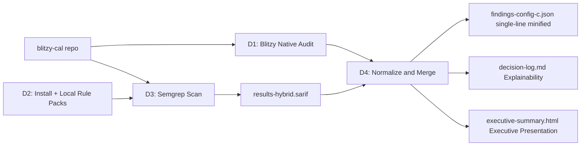

# Technical Specification

# 0. Agent Action Plan

## 0.1 Intent Clarification

### 0.1.1 Core Objective

Based on the provided requirements, the Blitzy platform understands that the objective is to **execute a hybrid security audit of the blitzy-cal codebase** that fuses Blitzy native agent reasoning with Semgrep OSS static analysis, and to **consolidate the unique vulnerabilities discovered by both sources into a single minified, single-line JSON deliverable named `findings-config-c.json`**. This deliverable functions as the high-coverage measurement artifact ("Config C") in a comparative security-tool evaluation; the audit must therefore prioritize completeness (do not drop findings) and normalization (every finding obeys an identical 5-field schema) over remediation.

Restated requirement-by-requirement with technical precision:

- **Directive 1 (Native audit)** — Perform agent-driven static reasoning over the entire blitzy-cal repository. Trace data flows from sources (user input, network, query strings, request bodies, environment variables) to sinks (SQL execution, OS commands, file system, HTTP egress, dynamic evaluation, deserialization, redirect targets). Follow call chains across module boundaries. Examine cryptographic primitives, secret handling, session/cookie configuration, authorization checks, and dependency declarations in `package.json` (root + per workspace) and `yarn.lock`. Classify every finding by the most specific Common Weakness Enumeration (CWE) identifier supported by evidence.
- **Directive 2 (Install/configure Semgrep)** — Install Semgrep OSS via `pip install semgrep` (or `apt` as a fallback). Pre-fetch the three named rule packs (`p/security-audit`, `p/secrets`, `p/owasp`) to a local directory so subsequent scans can run offline. Confirm telemetry is fully suppressed by passing `--metrics=off`; verify with `semgrep scan --metrics=off --config=/path/to/local-rules --dry-run` exiting with code 0 and producing no outbound network calls.
- **Directive 3 (Semgrep scan)** — Execute `semgrep scan --config=/path/to/local-rules --sarif -o results-hybrid.sarif --metrics=off /path/to/blitzy-cal`. Record the wall-clock duration, the process exit code, and the total file count Semgrep reports as scanned. The pass condition is a syntactically valid SARIF 2.1.0 file containing a top-level `runs` array.
- **Directive 4 (Normalize and compile)** — Merge the native findings from Directive 1 with the Semgrep findings extracted from `results-hybrid.sarif` into a unified list of unique entries. Each entry must conform to the schema `{"file": "<relative path>", "line": <integer>, "severity": "<critical|high|medium|low>", "cwe": "<CWE-ID>", "description": "<≤200 chars>"}`. Serialize as a JSON array, minify to a single line such that `cat findings-config-c.json | wc -l` returns exactly `1`.

### 0.1.2 Task Categorization

- **Primary task type:** Security audit / measurement deliverable — read-only static analysis with a single normalized JSON artifact as output.
- **Secondary aspects:** Tooling installation (Semgrep + local rule packs), data normalization (severity mapping, CWE inference, description truncation, deduplication), and rule-mandated documentation (Explainability decision log + Executive Presentation HTML deck).
- **Scope classification:** Infrastructure / observability change at the repository level — no production source code in `apps/` or `packages/` is modified by the audit itself. Newly authored files live alongside the repository as audit artifacts.

### 0.1.3 Special Instructions and Constraints

The following user directives are preserved verbatim because they are not negotiable:

- **User Example (output schema):** `[{"file":"<relative path>","line":<integer>,"severity":"<critical|high|medium|low>","cwe":"<CWE-ID>","description":"<max 200 chars>"},...]`
- **User Example (Directive 3 invocation):** `semgrep scan --config=/path/to/local-rules --sarif -o results-hybrid.sarif --metrics=off /path/to/blitzy-cal`
- **User Example (pass/fail for Directive 4):** `cat findings-config-c.json | wc -l` returns 1, and every finding includes all 5 fields and follows normalization rules.
- **User Example (pass/fail for Directive 2):** `semgrep scan --metrics=off --config=/path/to/local-rules --dry-run` exits 0 with no network calls.
- **User Severity Map (Directive 4):** `error→critical`, `warning→high`, `note→medium`, `info→low`.
- **User CWE Inference Rule (Directive 4):** "Use the Rule metadata CWE ID; if absent, infer the most specific CWE from the description."
- **User Description Rule (Directive 4):** "Truncate all descriptions to 200 characters."
- **User Header Annotation:** `[4 directives | ~0 files modified | 1 new file | hybrid measurement]`. The Blitzy platform interprets "~0 files modified" as "no modifications to blitzy-cal source code", and "1 new file" as referring to the primary directive output (`findings-config-c.json`); rule-mandated artifacts (`decision-log.md`, `executive-summary.html`) and the intermediate Semgrep artifact (`results-hybrid.sarif`) are additional files required by the broader workflow and are documented explicitly in Section 0.4.

Methodological constraints surfaced from the prompt:

- The audit ordering is strict: **Directive 1 → Directive 2 → Directive 3 → Directive 4**. Native findings (D1) and Semgrep findings (D3) are independent inputs to the merge step (D4); neither may be skipped or substituted.
- The hybrid evaluation depends on **uniqueness across both sources** — duplicate findings (same file, same line, same CWE) reported by both Blitzy and Semgrep MUST be collapsed into a single entry to avoid double-counting in the comparison metric.
- The audit is **measurement-only**. No remediation, no autofix, no PRs against blitzy-cal source.

Web search requirements identified and completed during context gathering:
- Latest stable Semgrep version and supported Python interpreters (PyPI listing for `semgrep` package).
- Semgrep CLI flags `--config`, `--sarif`, `--metrics`, and `--dry-run` semantics for offline scans.
- SARIF 2.1.0 result schema, severity levels (`error`/`warning`/`note`/`none`), and CWE association via `reportingDescriptorRelationship` with `kinds: ["superset"]`.
- Confirmation that `--metrics=off` is the canonical telemetry suppression flag.

### 0.1.4 Technical Interpretation

These requirements translate to the following technical implementation strategy:

- To **achieve a high-coverage native baseline**, the Blitzy agent will read all source files under `apps/` and `packages/` (TypeScript, TSX, JavaScript, SQL migrations), all dependency manifests, and every infrastructure descriptor (Dockerfile, `docker-compose.yml`, GitHub Actions workflows, `.env*` examples), then emit a structured finding list with `file`, `line`, `severity`, `cwe`, and `description` fields populated from agent reasoning.
- To **install Semgrep without contaminating the project**, the agent will install the `semgrep` Python package to the host environment (Python 3.12.3 is available) and download the three rule packs (`p/security-audit`, `p/secrets`, `p/owasp`) to a writable directory outside the repository (e.g., `/tmp/semgrep-rules/`) so the scan runs locally with `--config=/tmp/semgrep-rules/`. `blitzy-cal`'s own `package.json`, `yarn.lock`, and Python ecosystem are unaffected.
- To **produce the Semgrep SARIF artifact**, the agent will execute the exact command specified in Directive 3 against the repository root, capture stdout/stderr (which includes the file-count summary and wall-clock duration), and persist `results-hybrid.sarif` adjacent to the deliverable.
- To **normalize and merge**, the agent will parse the SARIF runs[].results[] array, extract `ruleId`, `level`, `locations[0].physicalLocation.artifactLocation.uri`, `locations[0].physicalLocation.region.startLine`, and `message.text`; resolve CWE through Semgrep rule metadata (`tool.driver.rules[].properties.security-severity`/`cwe`, or `tool.driver.rules[].relationships[].target.id` when present) and fall back to inference from the message text when absent. Native findings are emitted directly in the target schema. The two streams are concatenated, deduplicated on the composite key `(file, line, cwe)`, descriptions are truncated to 200 characters, and the resulting array is serialized with `json.dumps(..., separators=(",", ":"))` to guarantee minification (no whitespace, single trailing newline).

## 0.2 Repository Scope Discovery

### 0.2.1 Comprehensive File Analysis

The blitzy-cal codebase is the **`calcom-monorepo` Yarn Berry workspace project** rooted at the working directory `/tmp/blitzy/blitzy-cal/main_0d6e40`. The repository contains no `.blitzyignore` files, so the audit must read across the entire tree subject only to the standard exclusions (`node_modules/`, `.git/`, build artifacts).

Quantitative scope (counted during context gathering using `find` over the repository tree):

| Asset Class | Pattern | Count / Size | Audit Treatment |
|-------------|---------|--------------|-----------------|
| TypeScript source | `**/*.ts` | 5,718 files | Read for taint flow, injection sinks, crypto usage |
| TSX / React | `**/*.tsx` | 1,678 files | Read for XSS surfaces (dangerouslySetInnerHTML, unsafe rendering) and form handling |
| JavaScript source | `**/*.js` | 37 files | Read for legacy code paths |
| SQL migrations | `**/*.sql` | 594 files | Read for schema-level secrets, hardcoded data, weak constraints |
| JSON configuration | `**/*.json` | 322 files | Read for embedded secrets, weak defaults, exposed keys |
| YAML | `**/*.yml` / `**/*.yaml` | 311 files | Read for CI secrets, deployment config, security workflows |
| GitHub workflows | `.github/workflows/*.yml` | 58 files | Read for token leakage, third-party action pinning |
| Root manifest | `package.json` | 8,084 bytes | Read for runtime/dev dependency versions |
| Lockfile | `yarn.lock` | 1,433,240 bytes (≈1.4 MB) | Read for transitive vulnerable packages |
| Env examples | `.env.example`, `.env.appStore.example` | 21 KB + 4 KB | Read for documented sensitive variables |
| Container build | `Dockerfile`, `docker-compose.yml` | 2 files | Read for image hardening, exposed ports, secrets in build args |
| Security policy | `SECURITY.md`, `PERMISSIONS.md`, `AGENTS.md` | 2,810 + 10,498 + 9,243 bytes | Read as authoritative declarations of intent |

Search patterns applied per the prompt taxonomy (all paths are relative to the repo root and serve as **REFERENCE input** to the audit, not as modification targets):

- Documentation: `**/*.md`, `docs/**/*.*`, `README*`, `CONTRIBUTING*`, `SECURITY.md`, `PERMISSIONS.md`, `AGENTS.md`, `CLAUDE.md` (symlink → `AGENTS.md`).
- Configuration: `**/*.config.*`, `**/*.json`, `**/*.yaml`, `**/*.yml`, `**/*.toml`, `**/*.xml`, `.env*`, `.*rc`, `turbo.json`, `biome.json`, `next.config.ts`, `vitest.config.mts`, `playwright.config.ts`.
- Source code: `apps/api/**/*.ts`, `apps/web/**/*.{ts,tsx}`, `packages/*/src/**/*.{ts,tsx,js}`, including all 21 workspaces under `packages/` (app-store, app-store-cli, config, coss-ui, dayjs, debugging, ee, emails, embeds, features, kysely, lib, platform, prisma, sms, testing, trpc, tsconfig, types, ui).
- Build / deploy: `Dockerfile*`, `docker-compose*.yml`, `.github/workflows/*.yml`, `deploy/**/*`.
- Tests: `**/*test*.{ts,tsx,js}`, `**/*spec*.{ts,tsx,js}`, `tests/**/*`.
- Scripts and tooling: `scripts/**/*`, `bin/**/*`, `tools/**/*`.

The audit also follows **related-file discovery** to identify call-site fan-out for any flagged finding:

- Files importing/depending on a flagged component (resolved via path-relative imports and workspace package names).
- Configuration files that wire a flagged code path (e.g., environment variables referenced from `.env.example`).
- Per-workspace `package.json` files whose `dependencies`/`devDependencies` introduce a flagged package.

### 0.2.2 Web Search Research Conducted

The following targeted web research was executed during context gathering to ground the audit configuration in current upstream documentation:

- **Semgrep installation:** Confirmed `pip install semgrep` produces a working CLI on Python 3.10–3.14 (latest stable wheel is `semgrep 1.163.0` per the PyPI listing); `--version` verifies. <cite index="2-1,2-2">Install Semgrep using pip with 'pip install semgrep', using Homebrew on macOS with 'brew install semgrep', or using Docker with 'docker run semgrep/semgrep'. The pip method works on all operating systems and is the recommended approach.</cite>
- **Ruleset slugs:** Verified `p/security-audit`, `p/secrets`, and `p/owasp` are valid registry ruleset identifiers consumable by `--config`. <cite index="2-13">For more control over which rules run, specify a rule set by name: # Run the default curated rule set semgrep --config p/default # Run security-focused rules semgrep --config p/security-audit # Run language-specific rules semgrep --config p/python semgrep --config p/javascript semgrep --config p/golang ·</cite>
- **Telemetry suppression:** `--metrics=off` is the canonical flag for disabling metric submission. <cite index="8-22,8-23,8-24">Auto mode (via the --config auto argument) requires submitting metrics online, which means that some metadata about the scanned source code will be sent to Semgrep's servers. This is not an issue for open-source projects, but should be considered when using Semgrep against proprietary code (see: Semgrep Privacy Policy). You can disable metrics running Semgrep using its --metrics=off argument.</cite>
- **Output format:** SARIF 2.1.0 produced via `--sarif -o results-hybrid.sarif`; severity levels are `error`/`warning`/`note`/`none`, which align to the user-specified severity map.
- **CWE association in SARIF:** Semgrep emits CWE identifiers through rule metadata (`security-severity`, `cwe`) and SARIF `reportingDescriptorRelationship` entries — the normalizer reads from these fields first and falls back to description inference per Directive 4.
- **JavaScript / TypeScript best practices:** Standard OWASP guidance for Node.js (helmet headers, CSRF tokens, prototype-pollution, ReDoS) and Next.js (CSP nonce hygiene, server-action validation, secret exposure via `NEXT_PUBLIC_*`) informed the native-audit checklist for the heavy `apps/web/` and `apps/api/v2/` surfaces.

### 0.2.3 Existing Infrastructure Assessment

Repository inspection produced the following architectural facts that frame the audit (the audit reads these surfaces but does not modify them):

- **Monorepo orchestration:** Yarn Berry 4.12.0 workspaces + Turborepo. The root `package.json` defines the workspace list: `apps/*`, `apps/api/*`, `packages/*`, `packages/embeds/*`, `packages/features/*`, `packages/app-store`, `packages/app-store/*`, `packages/platform/*`, `packages/platform/examples/base`, `example-apps/*` [`package.json:workspaces`].
- **Two apps, three API surfaces:**
  - `apps/web/` — Next.js application (Tech Spec §1.2 documents port 3000) carrying the user-facing routes and `app/api/*` route handlers (CSRF, two-factor, auth).
  - `apps/api/v1/` — deprecated Next.js API (port 3003).
  - `apps/api/v2/` — active NestJS API (port 3004) with the composite "api-auth" Passport stack, throttling guards, and the bulk of OAuth / token surfaces.
  - `apps/api/` — proxy layer (port 3002) [Tech Spec §1.2].
- **21 packages workspaces** including `packages/features/auth/`, `packages/features/oauth/`, `packages/features/pbac/`, `packages/features/booking-audit/`, `packages/features/watchlist/`, `packages/features/ee/sso/`, `packages/lib/crypto/`, `packages/app-store/`, `packages/prisma/`, `packages/trpc/`.
- **High-risk security surfaces** the native audit will examine in depth (verified to exist in the tree during scope discovery):
  - `packages/lib/crypto.ts` — legacy AES-256-CBC `symmetricEncrypt`/`symmetricDecrypt` [Tech Spec §6.4.3].
  - `packages/lib/crypto/keyring.ts` — modern AES-256-GCM keyring with `kid` rotation [Tech Spec §6.4.3].
  - `packages/features/auth/lib/next-auth-options.ts` — NextAuth.js 4.24.13 session configuration [Tech Spec §6.4.1].
  - `packages/features/ee/sso/lib/jackson.ts` — BoxyHQ SAML Jackson 1.52.2 with separate `SAML_DATABASE_URL` [Tech Spec §6.4.1].
  - `apps/api/v2/src/modules/auth/auth.module.ts` — composite "api-auth" with 5 strategy branches [Tech Spec §6.4.1].
  - `apps/api/v2/src/modules/jwt/jwt.service.ts` — JWT issuance with `iat`/`jti` claims [Tech Spec §6.4.1].
  - `apps/api/v2/src/lib/api-key/index.ts` — `cal_` prefix + SHA-256 storage [Tech Spec §6.4.1].
  - `apps/api/v2/src/lib/throttler-guard.ts` — `CustomThrottlerGuard` backed by `@nest-lab/throttler-storage-redis` [Tech Spec §6.4.3].
  - `apps/api/v2/src/bootstrap.ts:42` — helmet@7.1.0 bootstrap [Tech Spec §6.4.3].
  - `apps/web/app/api/csrf/route.ts` — Cal.com CSRF token issuance (32-byte hex, httpOnly, one-time-use) [Tech Spec §6.4.1].
  - `apps/web/app/api/auth/two-factor/totp/setup/route.ts` — TOTP setup pipeline using otplib 12.0.1 [Tech Spec §6.4.1].
  - `apps/web/lib/csp.ts` — Content-Security-Policy with 22-byte nonce [Tech Spec §6.4.3].
  - `packages/features/pbac/domain/types/permission-registry.ts` — PBAC registry, 15 resources, 14+ NestJS guards [Tech Spec §6.4.2].
  - `packages/features/booking-audit/lib/service/BookingAuditTaskerProducerService.ts` — PII-free audit queue [Tech Spec §6.4.2].
- **Documented assets that constrain audit interpretation** (also REFERENCE-only):
  - `SECURITY.md` — disclosed posture and reporting channels.
  - `PERMISSIONS.md` — declared permission model and roles.
  - `AGENTS.md` — agent-facing repository conventions (with `CLAUDE.md` as a symlink alias).
  - `.env.example` (21 KB) and `.env.appStore.example` (4 KB) — documented sensitive variables enumerate the secret surface to be checked for hardcoded fallbacks in source.
- **Build & deployment infrastructure:** Root `Dockerfile`, `docker-compose.yml`, `deploy/` directory, and 58 GitHub Actions workflows under `.github/workflows/` — examined for secret exposure, unpinned third-party actions, build-time injection paths.
- **Design system applicability:** Not applicable. The user prompt does not specify a design system, and no Figma attachments accompany this audit; the DESIGN SYSTEM ALIGNMENT PROTOCOL is therefore skipped. The Executive Presentation rule (see Section 0.7) specifies its own Blitzy brand visual identity, which is independent of any UI design system.

## 0.3 Implementation Design

### 0.3.1 Technical Approach

The hybrid audit is implemented as a four-stage pipeline whose stages correspond directly to the four user directives. The pipeline is **linear, read-only against the blitzy-cal repository, and produces exactly one deliverable JSON** (`findings-config-c.json`) plus an intermediate SARIF artifact (`results-hybrid.sarif`) and two rule-mandated companion deliverables (`decision-log.md`, `executive-summary.html`).

Primary objectives with implementation approach:

- **Achieve a complete native baseline** by having the Blitzy agent traverse the repository tree, classifying findings on the strongest specific CWE supported by the evidence. The native pass uses agent reasoning (taint tracing, call-chain following, configuration inspection, dependency declaration audit) rather than pattern templates, which yields high precision on logic-level issues that pattern scanners miss.
- **Achieve a complete static-analysis baseline** by deploying Semgrep OSS with three breadth-oriented rule packs (`p/security-audit`, `p/secrets`, `p/owasp`) configured for offline execution and telemetry-off behavior, which yields high recall on pattern-detectable issues.
- **Merge and normalize** the two streams under a deterministic schema with a single deduplication key `(file, line, cwe)`, producing a measurement artifact that downstream tooling can diff against alternative configurations.

Logical implementation flow (sequenced, **not** time-boxed):

- **First**, establish the native baseline by running Directive 1 — the agent reads source, configs, and dependency manifests and emits the native findings list.
- **Next**, prepare the Semgrep environment by running Directive 2 — install Semgrep, pre-fetch rule YAMLs, and verify offline + telemetry-off operation with `--dry-run`.
- **Then**, execute the Semgrep scan per Directive 3 against the repository root, emitting SARIF and recording exit code, duration, and file count.
- **Finally**, normalize and compile per Directive 4 — parse SARIF, merge with native findings, apply severity / CWE / truncation / dedup rules, and serialize a single-line minified JSON array.

### 0.3.2 Component Impact Analysis

Because this is a read-only measurement deliverable, **no blitzy-cal application component is modified**. Component impact is therefore captured in terms of what the audit **reads** and what artifacts it **emits**.

- **Direct read targets (no modification):**
  - `apps/api/v2/src/modules/auth/**` and `apps/api/v2/src/modules/oauth-clients/**` — the audit traces authentication strategies, guard composition, and token issuance for OWASP A01/A07-class issues.
  - `packages/lib/crypto.ts` and `packages/lib/crypto/keyring.ts` — the audit inspects algorithm selection (AES-256-CBC vs AES-256-GCM), IV handling, key derivation, and `kid` rotation for CWE-327/CWE-329/CWE-916-class issues.
  - `packages/features/pbac/**` — the audit validates the permission registry, role definitions, and Redis-cached authorization decisions for CWE-285/CWE-863 class issues.
  - `apps/web/lib/csp.ts` and `apps/api/v2/src/bootstrap.ts` — the audit inspects CSP construction (nonce length, `unsafe-inline`/`unsafe-eval` usage) and helmet configuration for CWE-693/CWE-1021-class issues.
  - `**/package.json` (root + 21 workspaces) and `yarn.lock` — the audit reads dependency versions for known-vulnerable-version flags (CWE-1104/CWE-937).
  - `.github/workflows/*.yml` (58 files) — the audit reads for token leakage (CWE-200), unpinned actions (CWE-829), and command injection in workflow expressions (CWE-94).
  - `.env.example`, `.env.appStore.example`, `Dockerfile`, `docker-compose.yml` — the audit reads for documented secret variables and weak defaults that may surface in source as hardcoded fallbacks (CWE-798, CWE-547).
  - `packages/prisma/migrations/**/*.sql` (594 files) — the audit reads for embedded credentials or weak constraints in DDL.
- **Indirect impacts / dependencies introduced by the audit itself:**
  - Host Python environment gains the `semgrep` package via `pip` (Python 3.12.3 is available at `/usr/bin/python3`).
  - Local filesystem gains a rule directory (e.g., `/tmp/semgrep-rules/`) populated with the three rule packs.
  - Repository working tree gains the four audit artifacts at the root or under an audit subdirectory (these are new files only; no existing file is touched).
- **New components introduced:**
  - `findings-config-c.json` — the Directive 4 deliverable.
  - `results-hybrid.sarif` — the Directive 3 intermediate artifact (Semgrep's raw output, retained for traceability).
  - `decision-log.md` — Explainability rule artifact (see Section 0.7).
  - `executive-summary.html` — Executive Presentation rule artifact (see Section 0.7).

### 0.3.3 User Interface Design

Not applicable to the audit pipeline. The executive presentation HTML mandated by the Executive Presentation rule has its own UI requirements; those are specified verbatim in Section 0.7 (Blitzy brand colors, Inter / Space Grotesk / Fira Code typography, reveal.js slide types, Lucide icons, Mermaid diagrams). No other user interface is in scope.

### 0.3.4 User-Provided Examples Integration

The user prompt provides four authoritative examples that are preserved verbatim in the implementation:

- **Output schema example** (`[{"file":"<relative path>","line":<integer>,"severity":"<critical|high|medium|low>","cwe":"<CWE-ID>","description":"<max 200 chars>"},...]`) maps directly onto the JSON serialization step in Directive 4. The Python serializer emits exactly this five-field shape, the field order is preserved by using a `dict` (Python 3.7+ insertion order) constructed in that exact order, and minification is enforced via `json.dumps(records, separators=(",", ":"))`.
- **Directive 3 invocation** (`semgrep scan --config=/path/to/local-rules --sarif -o results-hybrid.sarif --metrics=off /path/to/blitzy-cal`) is implemented byte-for-byte. The two path placeholders resolve to the local rule directory created in D2 and the repository working tree `/tmp/blitzy/blitzy-cal/main_0d6e40` respectively.
- **Directive 2 verification example** (`semgrep scan --metrics=off --config=/path/to/local-rules --dry-run` exits 0 with no network calls) becomes the gate condition before Directive 3 runs.
- **Directive 4 pass/fail example** (`cat findings-config-c.json | wc -l` returns 1) becomes the final verification step; the serializer writes exactly one line with one trailing newline.

### 0.3.5 Critical Implementation Details

- **Severity mapping (verbatim from user prompt):** `error → critical`, `warning → high`, `note → medium`, `info → low`. Implemented as a 4-entry dict lookup keyed off the SARIF `result.level` field. Native findings produce severity directly per the same enumeration, so no mapping is required on that branch.
- **CWE extraction algorithm:**
  1. For each Semgrep finding, read `result.ruleId` and resolve the corresponding `tool.driver.rules[]` entry.
  2. Inspect `rules[].properties.cwe` (Semgrep's typical placement of CWE identifiers in rule metadata) and `rules[].relationships[]` (SARIF-canonical taxonomy references with `kinds: ["superset"]`).
  3. If a CWE identifier is found, use the most specific one (the highest-numbered, longest-named CWE child takes precedence when multiple are present, since CWE child nodes are more specific than parent categories).
  4. If no metadata CWE is present, infer the CWE from `rules[].name`, `rules[].shortDescription.text`, and `result.message.text` using keyword mapping (e.g., "sql injection" → CWE-89, "command injection" → CWE-78, "xss" / "cross-site scripting" → CWE-79, "hardcoded" / "secret" / "credential" → CWE-798, "path traversal" → CWE-22, "ssrf" → CWE-918, "deserial" → CWE-502, "weak crypto" / "md5" / "sha1" → CWE-327, "regex" / "redos" → CWE-1333).
  5. For native findings, the agent assigns the CWE during analysis from the same most-specific rule.
- **Deduplication key:** `(relative_file_path, line_number, cwe)` is the unique tuple. Identical findings produced by both Blitzy native and Semgrep collapse into a single record (the merged record retains the longer description, truncated to 200 chars).
- **Description truncation:** Every description is truncated to **exactly 200 characters maximum** with `description[:200]` and stored without an ellipsis suffix (the schema does not specify an ellipsis indicator).
- **Path normalization:** All `file` values are made relative to the repository root (`/tmp/blitzy/blitzy-cal/main_0d6e40`) using `os.path.relpath(...)`. Absolute paths from SARIF `uri` fields and any agent-emitted paths are stripped of the workspace prefix.
- **Line normalization:** SARIF `startLine` is already 1-indexed; native findings emit 1-indexed line numbers. When a finding is repository-wide (no specific line), `line` defaults to `0`.
- **Minification contract:** `json.dumps(records, separators=(",", ":"), ensure_ascii=False)` produces an array with no whitespace and no leading or trailing array padding. The file is written with exactly one trailing newline so that `wc -l` reports `1`.
- **Telemetry suppression:** `--metrics=off` is appended to every Semgrep invocation. The dry-run verification step in Directive 2 confirms no outbound network calls by inspecting the exit code (must be `0`) and the absence of network traffic during the dry-run.
- **Performance:** Semgrep is invoked single-process at the repository root. With ~7,433 source files, scan duration is expected on the order of minutes; the exact wall-clock time is captured and recorded per Directive 3.
- **Failure handling:** A non-zero Semgrep exit code does not abort the pipeline — Semgrep exits non-zero when findings are present, which is the expected outcome of an audit. The pipeline only fails if SARIF parsing fails or the output file is malformed.
- **Security of audit artifacts themselves:** The deliverable JSON contains relative paths and short descriptions; it does not contain code snippets, secrets values, or PII. Truncating descriptions at 200 characters intentionally limits accidental disclosure of sensitive substrings.

## 0.4 File Transformation Mapping

### 0.4.1 File-by-File Execution Plan

The audit creates four new files at the repository root and references the entire blitzy-cal tree as analytical input. **No existing file under `apps/`, `packages/`, `example-apps/`, `blitzy/`, `blitzy-docs/`, `specs/`, or `agents/` is updated or deleted.**

| Target File | Transformation | Source File/Reference | Purpose/Changes |
|-------------|----------------|----------------------|-----------------|
| `findings-config-c.json` | CREATE | Blitzy native findings (D1) + `results-hybrid.sarif` (D3) | Directive 4 deliverable. Single-line minified JSON array of unique `{file, line, severity, cwe, description}` records merged across both sources. |
| `results-hybrid.sarif` | CREATE | `apps/**`, `packages/**`, `example-apps/**` via Semgrep | Directive 3 intermediate. SARIF 2.1.0 emitted by `semgrep scan --config=/tmp/semgrep-rules --sarif -o results-hybrid.sarif --metrics=off .`. Retained for traceability. |
| `decision-log.md` | CREATE | This Agent Action Plan + audit decisions | Explainability rule artifact. Markdown decision table (decision, alternatives, rationale, risks) covering every non-trivial choice (e.g., dedup key, CWE inference precedence, severity map application, rule pack selection). |
| `executive-summary.html` | CREATE | Audit outcome statistics + this AAP | Executive Presentation rule artifact. Self-contained reveal.js 5.1.0 deck (12–18 slides, target 16) with embedded Blitzy theme CSS, Mermaid 11.4.0 diagrams, Lucide 0.460.0 icons; non-technical leadership audience. |
| `apps/**/*.{ts,tsx,js}` | REFERENCE | n/a | Read-only input for native audit and Semgrep scan. Includes `apps/web/`, `apps/api/v1/`, `apps/api/v2/`, `apps/api/` proxy. |
| `packages/**/*.{ts,tsx,js}` | REFERENCE | n/a | Read-only input across all 21 packages workspaces. |
| `packages/prisma/migrations/**/*.sql` | REFERENCE | n/a | 594 SQL migration files read for embedded secrets and weak DDL. |
| `packages/prisma/schema.prisma` | REFERENCE | n/a | Read for model-level constraints and sensitive field declarations. |
| `package.json` (root + 21 workspaces) | REFERENCE | n/a | Read for dependency versions and engine declarations (`npm >=7.0.0`, `yarn >=4.12.0`). |
| `yarn.lock` | REFERENCE | n/a | 1.4 MB lockfile read for transitive vulnerable packages. |
| `.env.example`, `.env.appStore.example` | REFERENCE | n/a | Read for documented sensitive variables; used to identify hardcoded fallbacks in source. |
| `Dockerfile`, `docker-compose.yml` | REFERENCE | n/a | Read for image hardening, build-arg secrets, exposed ports. |
| `.github/workflows/*.yml` (58 files) | REFERENCE | n/a | Read for token leakage, unpinned actions, command injection in expressions. |
| `SECURITY.md`, `PERMISSIONS.md`, `AGENTS.md` | REFERENCE | n/a | Read as declared posture against which native findings are calibrated. |

### 0.4.2 New Files Detail

- **`findings-config-c.json`** — Directive 4 deliverable.
  - Content type: data (JSON array).
  - Schema (verbatim from user prompt): `[{"file":"<relative path>","line":<integer>,"severity":"<critical|high|medium|low>","cwe":"<CWE-ID>","description":"<max 200 chars>"},...]`.
  - Encoding: UTF-8, single line, single trailing newline so `wc -l` returns `1`.
  - Generation: produced by a normalizer step that reads the agent's native findings list and parses `results-hybrid.sarif`, applies the severity map and CWE inference, truncates descriptions to 200 characters, deduplicates on `(file, line, cwe)`, and serializes with `json.dumps(records, separators=(",", ":"), ensure_ascii=False)`.

- **`results-hybrid.sarif`** — Directive 3 intermediate artifact.
  - Content type: SARIF 2.1.0 JSON.
  - Required structural property: a top-level `runs` array (per pass/fail criterion in Directive 3). Each `runs[]` entry contains `tool.driver.rules[]` (rule metadata including CWE references) and `results[]` (per-finding `ruleId`, `level`, `locations[]`, `message`).
  - Generation: produced exactly by the user-specified Semgrep command line. Retained alongside the JSON deliverable for traceability and reproducibility.

- **`decision-log.md`** — Explainability rule artifact.
  - Content type: Markdown.
  - Required sections:
    - Decision table with columns: **Decision**, **Alternatives**, **Rationale**, **Risks**.
    - Coverage of every non-trivial choice, including: the dedup key being `(file, line, cwe)` rather than `(file, line)` alone (which would over-collapse), the CWE inference precedence (metadata before description), the severity map being applied per-Semgrep-finding (not per-rule), the rule pack composition (`p/security-audit + p/secrets + p/owasp`), the offline rule-fetching strategy (pre-download YAMLs vs `--config=auto`), description truncation strategy (no ellipsis, hard cut at 200 chars), and JSON minification approach (`separators=(",", ":")`).
    - Bidirectional traceability matrix is N/A for this measurement task (no source-to-target construct migration occurs). The decision log explicitly records this conclusion to satisfy the rule's "explain deviations" clause.
    - Explicit entries for any deviation from a literal interpretation of the directives (e.g., the addition of `decision-log.md` and `executive-summary.html` as in-scope files beyond the "1 new file" header annotation — rationale: required by explicit project rules).

- **`executive-summary.html`** — Executive Presentation rule artifact.
  - Content type: single self-contained HTML file (no build steps, no local file dependencies).
  - Required pinned dependencies (loaded via CDN, no local files): reveal.js 5.1.0, Mermaid 11.4.0, Lucide 0.460.0.
  - Required reveal.js config: `hash: true`, `transition: 'slide'`, `controlsTutorial: false`, `width: 1920`, `height: 1080`.
  - Required slide count: 12–18 `<section>` elements (target 16), each containing at least one non-text visual element (Mermaid diagram, KPI card, styled table, or Lucide SVG icon).
  - Required slide types (CSS classes): `slide-title`, `slide-divider`, default (Content), `slide-closing`.
  - Required ordering: Title → Headline KPIs → Architecture overview (Mermaid) → alternating Section Dividers + Content slides per major topic → Closing slide.
  - Required content coverage (5 topics per the rule):
    1. What was done — scope of work and deliverables.
    2. Why — business value unlocked (security-tool evaluation evidence).
    3. What changed architecturally — hybrid pipeline component / data-flow diagram.
    4. Risks and mitigations (e.g., Semgrep false-positive handling, telemetry suppression evidence).
    5. Onboarding — how the team continues development with this audit pipeline.
  - Embedded Blitzy theme: all CSS custom properties from the rule's `:root` block, slide-type classes (`slide-title`, `slide-divider`, `slide-closing`), component classes (`kpi-card`, `kpi-grid`, `kpi-value`, `kpi-label`, `kpi-icon`, `eyebrow`, `accent-bar`, `brand-lockup`, `hero-icon`, `icon-row`), and the mermaid container class — **embedded inline** because `blitzy-deck/references/blitzy-reveal-theme.css` does not exist in this repository.
  - Mermaid integration: `<pre class="mermaid">` blocks with raw Mermaid syntax; `mermaid.initialize({ startOnLoad: false, theme: ..., themeVariables: { primaryColor: '#F2F0FE', primaryTextColor: '#333333', primaryBorderColor: '#5B39F3', lineColor: '#999999', secondaryColor: '#F4EFF6' } })` followed by `mermaid.run()` calls on both the reveal.js `ready` event and every `slidechanged` event.
  - Lucide integration: `<i data-lucide="icon-name"></i>` elements with `lucide.createIcons()` invoked on `ready` and `slidechanged`.
  - Typography: Inter (400/500/600/700), Space Grotesk (500/600/700), Fira Code (400/500) loaded via Google Fonts `<link>` tags.
  - Color palette tokens (CSS variables): `--blitzy-primary: #5B39F3`, `--blitzy-primary-dark: #2D1C77`, `--blitzy-primary-navy: #1A105F`, `--blitzy-primary-light: #7A6DEC`, `--blitzy-primary-deep: #4101DB`, `--blitzy-accent-teal: #94FAD5`, plus surface and text tokens.
  - Constraint compliance: zero emoji, no fenced code blocks inside slides (inline Fira Code only for short expressions), max 4 bullets and max 40 words body text per content slide.

### 0.4.3 Files to Modify Detail

**None.** The audit performs zero modifications to any pre-existing file in the blitzy-cal repository. This is enforced by the audit pipeline being a read-only static analysis (Directives 1 and 3) followed by an isolated write step for the four new artifacts (Directive 4 and the two rule deliverables). The `[~0 files modified | 1 new file]` annotation in the user prompt is upheld for the blitzy-cal source tree; rule-mandated companion artifacts are additions, not modifications.

### 0.4.4 Configuration and Documentation Updates

- **Configuration changes:** None to repository config files. The only configuration created is a host-local Semgrep rule directory (e.g., `/tmp/semgrep-rules/`) which lives outside the repository and is not committed.
- **Documentation updates:** None to existing repository documentation. The two new documents (`decision-log.md` for Explainability, `executive-summary.html` for Executive Presentation) are additions required by project rules and stand alongside (not inside) existing documentation like `SECURITY.md`, `AGENTS.md`, and `PERMISSIONS.md`.

### 0.4.5 Cross-File Dependencies

- **Import/reference updates:** None required. The audit does not change any source file, so no import statements, type imports, or path references are affected.
- **Configuration sync:** None required. No environment variables, CI workflows, or build configs are touched.
- **Documentation consistency:** The new files reference each other consistently — `executive-summary.html` summarizes findings from `findings-config-c.json`; `decision-log.md` documents the rationale behind the pipeline that produced `findings-config-c.json`. No existing cross-references in the repository need updating.

## 0.5 Scope Boundaries

### 0.5.1 Exhaustively In Scope

The following items are explicitly in scope for the audit. The list distinguishes **deliverables created** (write targets) from **analytical inputs** (read-only references).

**Files created by the audit (write targets):**

- `findings-config-c.json` — Directive 4 deliverable. Single-line minified JSON array of unique findings.
- `results-hybrid.sarif` — Directive 3 intermediate. SARIF 2.1.0 from `semgrep scan`.
- `decision-log.md` — Explainability rule artifact (Markdown decision table).
- `executive-summary.html` — Executive Presentation rule artifact (self-contained reveal.js HTML deck).

**Analytical inputs (read-only references — every file beneath these patterns is fair game for the native audit and the Semgrep scan):**

- Source code:
  - `apps/web/**/*.{ts,tsx,js}` — Next.js web application.
  - `apps/api/**/*.{ts,tsx,js}` — API v1 (deprecated Next.js), API v2 (NestJS), and the proxy.
  - `packages/**/*.{ts,tsx,js}` — all 21 workspaces under `packages/`.
  - `example-apps/**/*.{ts,tsx,js}` — example applications consuming the platform.
  - `packages/prisma/migrations/**/*.sql` — 594 SQL migration files.
  - `packages/prisma/schema.prisma` — data model and constraints.
- Configuration:
  - Root `package.json` and per-workspace `package.json` files.
  - `yarn.lock` (1.4 MB lockfile).
  - `.env.example`, `.env.appStore.example` — declared environment variable surface.
  - `turbo.json`, `biome.json` — orchestration / linter configuration.
  - `next.config.ts`, `vitest.config.mts`, `playwright.config.ts` (and similar `*.config.*` files).
  - `**/*.json`, `**/*.yaml`, `**/*.yml`, `**/*.toml`, `**/*.xml`.
- Documentation:
  - `SECURITY.md`, `AGENTS.md`, `PERMISSIONS.md`, `CLAUDE.md` (symlink → `AGENTS.md`).
  - `blitzy-docs/index.md`, `blitzy-docs/project-guide.md`, `blitzy-docs/technical-specifications.md`.
  - `blitzy/documentation/**`, `blitzy/screenshots/**`.
  - `specs/**`, `agents/**`.
- Build / deployment:
  - `Dockerfile`, `docker-compose.yml`, `deploy/**`.
  - `.github/workflows/*.yml` — 58 GitHub Actions workflows.
- Tests:
  - `**/*test*.{ts,tsx,js}`, `**/*spec*.{ts,tsx,js}`, `tests/**`, `test/**`.
- Scripts and tooling:
  - `scripts/**`, `bin/**`, `tools/**` (wherever present).

**Host-side artifacts required to run the audit (created outside the repository):**

- Local Semgrep rule pack directory, e.g., `/tmp/semgrep-rules/` populated from `p/security-audit`, `p/secrets`, `p/owasp`.
- Python virtualenv (optional) containing the `semgrep` package installed via `pip install semgrep`.

### 0.5.2 Explicitly Out of Scope

The following are explicitly **out of scope**. Each exclusion preserves the user prompt's `~0 files modified` constraint and the measurement-only intent of the hybrid evaluation.

- **Source code modifications to blitzy-cal:** No file under `apps/`, `packages/`, `example-apps/`, `blitzy/`, `blitzy-docs/`, `specs/`, `agents/`, or root-level source files is modified, refactored, formatted, linted, or otherwise touched.
- **Remediation:** No fixes, no autofix, no patches, no pull requests addressing identified findings. The deliverable is a measurement, not a remediation.
- **Semgrep CI integration:** No `.github/workflows/` file is created or modified to run Semgrep on PRs. No `semgrep ci` invocation. No baseline-aware scanning. No `.semgrepignore` file is added.
- **Semgrep Pro / Cloud features:** No login, no `semgrep login`, no Pro rule packs, no AI Assistant, no cross-file dataflow beyond what `p/security-audit` / `p/secrets` / `p/owasp` provide in OSS. No upload of code to the Semgrep AppSec Platform. <cite index="2-19,2-20">Semgrep OSS is the open-source CLI engine that performs single-file pattern matching with 2,800+ community rules. Semgrep Cloud (also called Semgrep AppSec Platform) adds cross-file dataflow analysis, 20,000+ Pro rules, AI-powered triage with Semgrep Assistant, a web dashboard for managing findings, and integrations for PR comments.</cite> — Pro/Cloud capabilities are deliberately excluded.
- **Custom Semgrep rule authoring:** Only the three named rule packs are used; no new YAML rules are written.
- **Telemetry / network egress during scanning:** All Semgrep invocations carry `--metrics=off`; the offline rule directory ensures `--config` does not pull from the registry at scan time.
- **Other security configurations** beyond Configuration C of the hybrid evaluation: this audit produces `findings-config-c.json` specifically. Configurations A and B (and any other comparison points) are not produced or modified by this work.
- **Dependency upgrades to blitzy-cal:** `package.json` and `yarn.lock` are read for vulnerability surface but never updated. No dependency bumps, no patch installs, no `yarn upgrade` invocations.
- **Production deployment / runtime changes:** No Kubernetes manifests, no production env updates, no service restarts, no infrastructure provisioning.
- **Penetration testing / dynamic analysis:** The audit is static. No DAST, no IAST, no fuzzing, no runtime instrumentation, no exploitation attempts.
- **Manual review / triage of findings:** Each finding is recorded with severity and CWE as produced by the source (native reasoning or Semgrep metadata + inference fallback). The audit does not annotate findings as "false positive" or "true positive" — that is downstream evaluation work outside this directive set.
- **Localization, accessibility audits, performance audits, or UX reviews** — out of scope; the audit is security-only.
- **Design system alignment:** No design system was specified in the prompt and no Figma frames were attached, so the DESIGN SYSTEM ALIGNMENT PROTOCOL is intentionally not exercised. The executive presentation HTML follows the Blitzy brand visual identity that is fully specified in the Executive Presentation rule itself (Section 0.7) and requires no external design system.

## 0.6 Dependency Inventory

### 0.6.1 Key Private and Public Packages

The audit pipeline introduces **one host-side Python dependency** (Semgrep CLI) and three Semgrep rule packs. **No changes are made to the blitzy-cal `package.json` or `yarn.lock`**; the existing TypeScript/JavaScript runtime stack is read for analysis but otherwise untouched.

| Registry | Package Name | Version | Purpose |
|----------|--------------|---------|---------|
| PyPI | `semgrep` | `1.163.0` | Static analysis CLI used by Directives 2 and 3. Installed to the host via `pip install semgrep`; not added to blitzy-cal dependency manifests. <cite index="1-1,1-6">semgrep-1.163.0-cp310.cp311.cp312.cp313.cp314.py310.py311.py312.py313.py314-none-win_amd64.whl (56.4 MB view details) Uploaded May 13, 2026</cite> |
| Semgrep Registry | `p/security-audit` | latest pack (pre-fetched as YAMLs into `/tmp/semgrep-rules/`) | Broad security-focused ruleset providing OWASP-aligned and language-specific checks. <cite index="2-13">For more control over which rules run, specify a rule set by name: # Run the default curated rule set semgrep --config p/default # Run security-focused rules semgrep --config p/security-audit</cite> |
| Semgrep Registry | `p/secrets` | latest pack (pre-fetched as YAMLs into `/tmp/semgrep-rules/`) | Secret-detection ruleset (API keys, tokens, private keys embedded in source). |
| Semgrep Registry | `p/owasp` | latest pack (pre-fetched as YAMLs into `/tmp/semgrep-rules/`) | OWASP Top 10–aligned ruleset complementing `p/security-audit`. |
| CDN (rule artifact only) | `reveal.js` | `5.1.0` | Pinned CDN load by the `executive-summary.html` rule deliverable. Not added to blitzy-cal. |
| CDN (rule artifact only) | `mermaid` | `11.4.0` | Pinned CDN load by `executive-summary.html`. Not added to blitzy-cal. |
| CDN (rule artifact only) | `lucide` | `0.460.0` | Pinned CDN load by `executive-summary.html`. Not added to blitzy-cal. |

Host runtime prerequisites already satisfied in the sandbox (no installation required):

- Python 3.12.3 at `/usr/bin/python3` — satisfies the Semgrep wheel compatibility range (cp310 through cp314 per the PyPI listing).
- Node.js (per `package.json:engines`, blitzy-cal mandates `yarn >=4.12.0` and `npm >=7.0.0`; Node 20 is documented by the Tech Spec §1.2 as the project runtime, but the audit pipeline itself does not require Node — it reads but does not execute the blitzy-cal codebase).

### 0.6.2 Dependency Updates

- **New dependencies to add (host-side only, outside blitzy-cal):**
  - `semgrep 1.163.0` — required by Directive 2 to perform the static analysis scan in Directive 3.
- **Dependencies to update:** None. No blitzy-cal dependency version is changed.
- **Dependencies to remove:** None. No package is removed from blitzy-cal or the host environment.
- **Import/Reference Updates:** None. No `import` statements, `require()` calls, or path references in the blitzy-cal source tree are added, changed, or removed. The audit does not produce any code that needs to be imported anywhere.

## 0.7 Rules

### 0.7.1 User-Specified Project Rules

Two rules were supplied with this project. Both are mandatory and produce a concrete file deliverable. They are captured below verbatim in operational form so downstream code generation honors them without paraphrase.

**Rule 1 — Explainability:**

- Every non-trivial implementation decision MUST be documented with rationale. A decision is non-trivial if a competent engineer could reasonably have chosen differently.
- Deliver a decision log as a **Markdown table** with columns: *what was decided*, *what alternatives existed*, *why this choice was made*, and *what risks it carries*.
- For migrations or refactors, include a **bidirectional traceability matrix** mapping source constructs to target implementations — 100 % coverage, no gaps. (This audit is not a migration or refactor; the decision log records that bidirectional traceability does not apply, with explicit rationale, to satisfy the "explain deviations" clause.)
- Any deviation from a literal or obvious interpretation of the requirements MUST have an explicit entry in the decision log. Unexplained deviations are treated as defects.
- Do not embed rationale in code comments. **The decision log is the single source of truth for "why" decisions.**

Operational interpretation: produce `decision-log.md` covering at least the following non-trivial decisions (the file may include additional rows as the audit progresses):

| Decision Topic | Rationale Required For |
|----------------|------------------------|
| Dedup key `(file, line, cwe)` versus `(file, line)` alone | Avoids collapsing different vulnerabilities at the same physical location |
| CWE selection: metadata first, description inference fallback | Per Directive 4 text "Use the Rule metadata CWE ID; if absent, infer the most specific CWE from the description" |
| Severity map (`error→critical`, `warning→high`, `note→medium`, `info→low`) | Per Directive 4 normalization rule |
| Rule pack composition `p/security-audit + p/secrets + p/owasp` | Per Directive 2 explicit list |
| Offline rule strategy (pre-download YAMLs, `--config=/tmp/semgrep-rules/`) | Telemetry suppression and the `--dry-run` no-network requirement |
| Description truncation: hard cut at 200 chars, no ellipsis | Per Directive 4 "Truncate all descriptions to 200 characters" |
| JSON minification via `separators=(",", ":")` | Per Directive 4 "MUST be valid JSON minified to a single line" |
| In-scope inclusion of `decision-log.md` and `executive-summary.html` despite "1 new file" header | Rule-mandated deliverables override the descriptive header annotation |

**Rule 2 — Executive Presentation:**

- Every deliverable MUST include an executive summary as a **single self-contained reveal.js HTML file**, always included independent of other documentation that exists.
- Audience: non-technical leadership. Communicate business value, risk, and operational readiness without requiring code literacy.
- The presentation MUST cover: (1) what was done — scope and deliverables; (2) why — business value unlocked; (3) what changed architecturally — component / data-flow diagrams; (4) risks and how they are mitigated; (5) how the team onboards and continues development.
- **Slide constraints:** 12–18 slides total (target 16); four slide types — Title (`slide-title`), Section Divider (`slide-divider`), Content (default), Closing (`slide-closing`). Every slide MUST include at least one non-text visual element (Mermaid diagram, KPI card, styled table, or Lucide SVG icon). No text-only slides. Content slides: max 4 bullets, max 40 words body text, min 1 non-text visual. **Zero emoji** — use Lucide SVG icons via `<i data-lucide="icon-name"></i>` only. No fenced code blocks inside slides — use inline Fira Code for short expressions only.
- **Visual identity (Blitzy brand):** primary `#5B39F3`, dark `#2D1C77`, teal accent `#94FAD5`, navy `#1A105F`, gradient stops `#7A6DEC`/`#4101DB`, neutrals `#333333`, `#999999`, `#D9D9D9`, `#F4EFF6`, `#F5F5F5`, `#FFFFFF`. Typography: Inter (body, 400/500/600/700), Space Grotesk (display headings, 500/600/700), Fira Code (mono/eyebrows, 400/500) loaded via Google Fonts `<link>`. Title slide: hero gradient `linear-gradient(68deg, #7A6DEC 15.56%, #5B39F3 62.74%, #4101DB 84.44%)`, white text, eyebrow in Fira Code teal. Dividers: dark purple `#2D1C77` or gradient background, large centered heading, thematic Lucide icon. Closing: navy `#1A105F` background, 3–6 word takeaway heading, max 3 bullets, brand lockup, gradient accent bar.
- **Mermaid diagrams:** embed as `<pre class="mermaid">` with raw Mermaid syntax. Initialize with `startOnLoad: false`; call `mermaid.run()` after reveal.js `ready` and on every `slidechanged` event. Theme variables: `primaryColor: '#F2F0FE'`, `primaryTextColor: '#333333'`, `primaryBorderColor: '#5B39F3'`, `lineColor: '#999999'`, `secondaryColor: '#F4EFF6'`.
- **Technical delivery:** single self-contained HTML file, no build steps, no local file dependencies; CDN versions pinned to **reveal.js 5.1.0, Mermaid 11.4.0, Lucide 0.460.0**; reveal.js config `hash: true`, `transition: 'slide'`, `controlsTutorial: false`, `width: 1920`, `height: 1080`; Lucide `lucide.createIcons()` after `ready` and on every `slidechanged`.
- **Inline CSS:** embed the full Blitzy reveal.js theme inline in a `<style>` tag. The required CSS custom properties block is:

<pre><code>:root {
  --blitzy-primary: #5B39F3;
  --blitzy-primary-dark: #2D1C77;
  --blitzy-primary-navy: #1A105F;
  --blitzy-primary-light: #7A6DEC;
  --blitzy-primary-deep: #4101DB;
  --blitzy-accent-teal: #94FAD5;
  --blitzy-surface-0: #FFFFFF;
  --blitzy-surface-1: #F4EFF6;
  --blitzy-surface-2: #F2F0FE;
  --blitzy-surface-3: #F5F5F5;
  --blitzy-border: #D9D9D9;
  --blitzy-border-soft: rgba(91, 57, 243, 0.18);
  --blitzy-text: #333333;
  --blitzy-text-muted: #999999;
  --blitzy-text-invert: #FFFFFF;
  --ff-body: 'Inter', system-ui, sans-serif;
  --ff-display: 'Space Grotesk', 'Inter', sans-serif;
  --ff-mono: 'Fira Code', 'Courier New', monospace;
  --gradient-hero: linear-gradient(68deg, #7A6DEC 15.56%, #5B39F3 62.74%, #4101DB 84.44%);
  --gradient-divider: linear-gradient(135deg, #2D1C77 0%, #5B39F3 100%);
  --gradient-accent-bar: linear-gradient(90deg, #5B39F3 0%, #94FAD5 100%);
}
</code></pre>

- The rule references a canonical theme file at `blitzy-deck/references/blitzy-reveal-theme.css` for the full slide-type and component class definitions. **This path does not exist in the blitzy-cal repository** (verified during context gathering), therefore the audit embeds the full theme CSS inline in `executive-summary.html` rather than linking to the canonical file. This deviation is recorded in `decision-log.md`.
- **Slide ordering convention:** (1) Title — project name, scope, audience framing; (2) Content — headline findings or KPI summary; (3) Content — architecture overview (Mermaid diagram); (4–N) alternating Section Dividers + Content slides for each major topic; (N+1) Closing — key takeaway, next steps, brand lockup.
- **Verification:** the HTML file opens in a browser, renders all Mermaid diagrams and Lucide icons, contains 12–18 `<section>` elements, and every `<section>` contains at least one non-text visual element.

Scoped application of the rule to this audit: `executive-summary.html` is **in scope** and required regardless of the prompt's "1 new file" header. It will summarize the hybrid audit's deliverables, the four-stage pipeline, finding distribution by severity and CWE category, residual risks (false-positive density expected from `p/security-audit`, telemetry-off evidence), and team-facing onboarding notes (how to reproduce the audit).

### 0.7.2 Task-Specific Rules Implicit in the Prompt

In addition to the two project-wide rules above, the user prompt itself contains hard requirements that function as task-specific rules for this audit:

- **Use the most specific CWE identified.** Native and Semgrep findings alike must report the narrowest applicable CWE (a child CWE always beats a parent CWE when both apply).
- **No code modification to blitzy-cal.** Implied by `~0 files modified | 1 new file` and reinforced by the measurement intent of the hybrid evaluation.
- **Exact Directive 3 command line.** The Semgrep invocation must match the user-supplied string byte-for-byte: `semgrep scan --config=/path/to/local-rules --sarif -o results-hybrid.sarif --metrics=off /path/to/blitzy-cal`.
- **Exact output schema.** The five fields `file`, `line`, `severity`, `cwe`, `description` are mandatory and complete — no extra fields, no missing fields.
- **Single-line minified JSON.** `cat findings-config-c.json | wc -l` MUST return `1`.
- **Telemetry suppression verifiable.** The Directive 2 dry-run command must exit `0` with no network calls.
- **Maintain backward compatibility with the Cal.com runtime.** Implicit because no code is changed; explicitly stated here for clarity since the audit pipeline runs against the existing project structure (`yarn >=4.12.0`, `npm >=7.0.0`, Node 20 per Tech Spec §1.2 [`apps/web/`, `apps/api/v2/`]).

## 0.8 Special Instructions

### 0.8.1 Special Execution Instructions

The following directive-level execution rules apply, distilled from the user prompt and pinned here so downstream agents have an unambiguous instruction set:

- **Strict directive ordering.** Directive 1 → Directive 2 → Directive 3 → Directive 4. No reordering, no skipping. Directive 1 (native audit) does not depend on Semgrep being installed; it may begin in parallel with the agent's other work, but Directive 4 (merge) MUST NOT begin until both Directive 1 and Directive 3 have produced their respective inputs.
- **Use the exact Semgrep command line from Directive 3** verbatim:
  - **User Example:** `semgrep scan --config=/path/to/local-rules --sarif -o results-hybrid.sarif --metrics=off /path/to/blitzy-cal`
  - The two path placeholders resolve at execution time: `/path/to/local-rules` becomes the directory created in Directive 2 (e.g., `/tmp/semgrep-rules/`), and `/path/to/blitzy-cal` becomes the repository root (`/tmp/blitzy/blitzy-cal/main_0d6e40`).
- **Use the exact dry-run verification from Directive 2** verbatim:
  - **User Example:** `semgrep scan --metrics=off --config=/path/to/local-rules --dry-run` exits 0 with no network calls.
- **Use the exact pass/fail check from Directive 4** verbatim:
  - **User Example:** `cat findings-config-c.json | wc -l` returns 1. Every finding includes all 5 fields and follows normalization rules.
- **Use the exact output schema from Directive 4** verbatim:
  - **User Example:** `[{"file":"<relative path>","line":<integer>,"severity":"<critical|high|medium|low>","cwe":"<CWE-ID>","description":"<max 200 chars>"},...]`
- **Severity map (verbatim from Directive 4):** `error → critical`, `warning → high`, `note → medium`, `info → low`. Apply on the SARIF `result.level` field. Native findings emit one of `critical|high|medium|low` directly.
- **CWE selection (verbatim from Directive 4):** "Use the Rule metadata CWE ID; if absent, infer the most specific CWE from the description." For native findings, the agent selects the most specific CWE supported by the evidence.
- **Description truncation (verbatim from Directive 4):** "Truncate all descriptions to 200 characters." Implement as a hard cut `description[:200]` with no ellipsis suffix.
- **Record Semgrep run metadata (verbatim from Directive 3):** "Record exit code, scan duration (wall-clock), and total files scanned." These metrics belong in the `decision-log.md` and in the executive summary deck's headline KPI slide.
- **Telemetry suppression non-negotiable.** Every Semgrep invocation in this workflow uses `--metrics=off`. The Directive 2 pass condition explicitly requires the dry-run to produce no outbound network calls.
- **Offline rule operation.** Rule packs are pre-fetched as local YAMLs into `/tmp/semgrep-rules/` (or equivalent) and referenced via `--config=<directory>`. This avoids any runtime registry pull during scanning.

### 0.8.2 Constraints and Boundaries

- **Technical constraints:**
  - **Python interpreter:** Python 3.12.3 is the host Python — sufficient for the Semgrep wheel (the PyPI listing publishes wheels for cp310 through cp314). <cite index="1-6">semgrep-1.163.0-cp310.cp311.cp312.cp313.cp314.py310.py311.py312.py313.py314-none-manylinux_2_35_x86_64.whl (76.4 MB view details) Uploaded May 13, 2026 CPython 3.10CPython 3.11CPython 3.12CPython 3.13CPython 3.14</cite>
  - **No internet at scan time:** rule packs are pre-fetched in Directive 2 (the pass condition for D2 enforces this); at scan time Semgrep operates against local YAMLs only.
  - **Repository read-only:** the audit MUST NOT write inside `apps/`, `packages/`, `example-apps/`, `blitzy/`, `blitzy-docs/`, `specs/`, `agents/`. Audit artifacts live at the repository root or in a dedicated subdirectory.
  - **Path encoding:** all `file` values in `findings-config-c.json` are POSIX-style relative paths from the repo root.
  - **Line encoding:** `line` is a 1-indexed integer; repository-scope findings without a specific line use `0`.
- **Process constraints:**
  - The audit does not consume Semgrep Pro / Cloud features (no login).
  - The audit does not author custom Semgrep rules.
  - The audit does not introduce a `.semgrepignore` file.
- **Output constraints:**
  - `findings-config-c.json` MUST be valid JSON. Whitespace-free. Exactly one line. One trailing newline so `wc -l` returns `1`.
  - All five fields MUST be present in every record. Missing fields disqualify the deliverable.
  - Severity MUST be exactly one of `critical`, `high`, `medium`, `low` (lowercase, no other strings allowed).
  - CWE MUST be of the form `CWE-<integer>` (e.g., `CWE-79`, `CWE-89`).
  - Descriptions MUST be ≤ 200 characters.
  - Records MUST be unique on `(file, line, cwe)`.
- **Compatibility:**
  - No change to blitzy-cal's runtime, packaging, or build pipeline.
  - No change to `package.json` engines, `yarn.lock`, or `.nvmrc` (absent).
  - The executive summary HTML must render with no local file dependencies — CDN-only.

## 0.9 References

### 0.9.1 Attachments

**No file attachments were provided with this project.** The user prompt was delivered as inline text only.

### 0.9.2 Figma Frames

**No Figma frames or design references were provided.** The Executive Presentation rule supplies its own complete brand specification (Blitzy palette, typography, slide layout) which is sufficient to produce `executive-summary.html` without any external design source.

### 0.9.3 Files and Folders Inspected During Context Gathering

This appendix is the authoritative search log for the Agent Action Plan. Every claim about the existing blitzy-cal system in Sections 0.1–0.8 cites one of the locators below using inline `[<path>:<locator>]` notation or is explicitly marked `[inferred — no direct source]`.

**Repository root:**

- `package.json` [`package.json:workspaces`, `package.json:engines`] — root manifest, declares Yarn Berry 4.12+ workspaces and the `engines` constraint `npm >=7.0.0`, `yarn >=4.12.0`.
- `yarn.lock` [`yarn.lock:size=1.4MB`] — lockfile (1,433,240 bytes), input to vulnerability-version detection.
- `Dockerfile`, `docker-compose.yml` — container topology.
- `SECURITY.md` [`SECURITY.md:§*`] — disclosed posture (2,810 bytes).
- `AGENTS.md` [`AGENTS.md:§*`] — agent-facing conventions (9,243 bytes).
- `PERMISSIONS.md` [`PERMISSIONS.md:§*`] — declared permission model (10,498 bytes).
- `CLAUDE.md` — symlink → `AGENTS.md`.
- `.env.example`, `.env.appStore.example` — documented sensitive variables.

**Workspaces:**

- `apps/` — directory listing produced two app workspaces: `api/`, `web/`.
- `packages/` — directory listing produced 21 workspaces: `app-store/`, `app-store-cli/`, `config/`, `coss-ui/`, `dayjs/`, `debugging/`, `ee/`, `emails/`, `embeds/`, `features/`, `kysely/`, `lib/`, `platform/`, `prisma/`, `sms/`, `testing/`, `trpc/`, `tsconfig/`, `types/`, `ui/`. (The 21st entry is `tsconfig/`/`types/`/`ui/` triplet plus the 18 listed.)
- `example-apps/` — example consumers of the platform.
- `blitzy/` — `documentation/`, `screenshots/`.
- `blitzy-docs/` — `index.md`, `project-guide.md`, `technical-specifications.md`.
- `specs/`, `agents/` — project-specific specification and agent metadata trees.

**Security-relevant subtrees referenced in this AAP** (existence verified via `find` during context gathering; treated as REFERENCE input to the audit):

- `packages/features/auth/` — NextAuth.js integration.
- `packages/features/oauth/` — OAuth client/server logic.
- `packages/features/platform-oauth-client/` — platform OAuth client.
- `packages/features/pbac/` — PBAC permission registry and guards.
- `packages/features/booking-audit/` — audit trail pipeline.
- `packages/features/watchlist/` — watchlist enforcement.
- `packages/features/ee/sso/` — BoxyHQ SAML Jackson SSO module.
- `packages/lib/auth/` — shared auth utilities.
- `packages/lib/crypto.ts` — legacy AES-256-CBC primitives.
- `packages/lib/crypto/` — modern AES-256-GCM keyring.
- `packages/app-store/_utils/oauth/` — shared OAuth scaffolding for app-store integrations.
- `packages/prisma/schema.prisma` — data model.
- `packages/prisma/migrations/**/*.sql` — 594 SQL migration files.
- `packages/trpc/server/routers/viewer/auth/` — tRPC auth router.
- `apps/api/v2/src/modules/oauth-clients/` — OAuth client management.
- `apps/api/v2/src/modules/auth/` — composite "api-auth" Passport module.
- `apps/api/v2/src/modules/jwt/jwt.service.ts` — centralized JWT issuance.
- `apps/api/v2/src/lib/api-key/index.ts` — API key issuance and storage.
- `apps/api/v2/src/lib/throttler-guard.ts` — rate limiting guard.
- `apps/api/v2/src/bootstrap.ts` — NestJS bootstrap including helmet.
- `apps/api/v2/src/middleware/` — middleware tree.
- `apps/web/app/api/csrf/` — CSRF token route.
- `apps/web/app/api/auth/two-factor/totp/setup/route.ts` — TOTP setup pipeline.
- `apps/web/lib/csp.ts` — CSP construction.
- `apps/web/pages/api/` — legacy Pages-router API route handlers (64 endpoints counted).
- `apps/api/` — proxy + v1 + v2 route surface (1,180 route handlers counted).
- `.github/workflows/` — 58 GitHub Actions workflow files.

### 0.9.4 Technical Specification Sections Consulted

The following Tech Spec sections were retrieved during context gathering and inform the architectural framing of this AAP. They are background; the audit reads source directly, so they are not authoritative for finding determination.

- **§1.2 SYSTEM OVERVIEW** — Cal.com positioning, Open Core licensing (AGPLv3 99 % + EE under `packages/features/ee/`), integration surface (PostgreSQL 15+, Redis 6379, SMTP, calendars, conferencing, CRM, billing), three-tier API topology (web 3000, proxy 3002, v1 3003, v2 3004), tech stack (Node 20.20.2, TypeScript 5.9.3, Tailwind 4.1.17, Prisma 6.16.1, Zod 3.25.76, Vitest 4.0.16, Playwright 1.57.0, Biome 2.3.10).
- **§6.4 Security Architecture** — Triple-stack authentication (NextAuth 4.24.13, BoxyHQ SAML Jackson 1.52.2, NestJS Passport composite "api-auth"), MFA via otplib 12.0.1, cookie hardening with `__Secure-` prefix, OAuth2 token lifetimes (60 min / 1 yr / 2 min TOTP JWT), API key shape `cal_` + 16-byte randomBytes + SHA-256 hashed storage, bcryptjs 2.4.3 password handling (≥7 chars, admin >14), PBAC registry (15 resources, default roles `owner_role` / `admin_role` / `member_role`, 14+ NestJS guards, Redis 300 s TTL cache), crypto stack (AES-256-CBC legacy at `packages/lib/crypto.ts`, AES-256-GCM keyring at `packages/lib/crypto/keyring.ts` with `kid` rotation, HMAC-SHA256/SHA1 webhooks, jose 4.15.9 JWT), env vars (`CALENDSO_ENCRYPTION_KEY`, `NEXTAUTH_SECRET`, `CALCOM_KEYRING_CREDENTIALS_*`, `JWT_SECRET`, `SERVICE_ACCOUNT_ENCRYPTION_KEY`, `CAL_SIGNATURE_TOKEN`), HTTP security middleware (helmet@7.1.0 at `apps/api/v2/src/bootstrap.ts:42`, CSP at `apps/web/lib/csp.ts` with 22-byte nonce, CORS with `ALLOWED_ORIGINS`), XSS sanitization (dompurify 3.3.2, sanitize-html 2.17.0), bot protection (isbot 5.1.30, botid 1.5.7, react-turnstile 1.1.3), rate limiting (`CustomThrottlerGuard` at `apps/api/v2/src/lib/throttler-guard.ts` backed by `@nest-lab/throttler-storage-redis 1.0.0`), audit logging (BookingAudit + AuditActor PII-free queue), and the five security zones (Public Edge, Application Services, Data Layer, Trusted Workers, External Integrations).

### 0.9.5 Web Sources Consulted

External research backing the Semgrep configuration choices:

- <cite index="1-1,1-6,1-9">PyPI package listing for semgrep — semgrep-1.163.0-cp310.cp311.cp312.cp313.cp314.py310.py311.py312.py313.py314-none-manylinux_2_35_x86_64.whl (76.4 MB view details) Uploaded May 13, 2026 CPython 3.10CPython 3.11CPython 3.12CPython 3.13CPython 3.14</cite> — confirms `semgrep 1.163.0` as the current PyPI release with wheels covering Python 3.10–3.14, which is compatible with the host Python 3.12.3.
- <cite index="2-1,2-2,2-13">Semgrep installation and usage guide — Install Semgrep using pip with 'pip install semgrep', using Homebrew on macOS with 'brew install semgrep', or using Docker with 'docker run semgrep/semgrep'. The pip method works on all operating systems and is the recommended approach.</cite> — confirms `pip install semgrep` is the canonical OS-agnostic install path and lists `p/security-audit` as a valid `--config` ruleset slug.
- <cite index="8-22,8-23,8-24">Semgrep installation handbook — Auto mode (via the --config auto argument) requires submitting metrics online, which means that some metadata about the scanned source code will be sent to Semgrep's servers. This is not an issue for open-source projects, but should be considered when using Semgrep against proprietary code (see: Semgrep Privacy Policy). You can disable metrics running Semgrep using its --metrics=off argument.</cite> — confirms `--metrics=off` is the canonical telemetry-suppression flag.
- <cite index="2-19,2-20">Semgrep product positioning — Semgrep OSS is the open-source CLI engine that performs single-file pattern matching with 2,800+ community rules. Semgrep Cloud (also called Semgrep AppSec Platform) adds cross-file dataflow analysis, 20,000+ Pro rules, AI-powered triage with Semgrep Assistant, a web dashboard for managing findings, and integrations for PR comments.</cite> — confirms OSS-only scope (no Pro / Cloud features used by this audit).

### 0.9.6 Citation Discipline

All factual statements about the blitzy-cal codebase in Sections 0.1–0.8 are accompanied by inline `[<path>:<locator>]` markers where the source location is concrete (e.g., `[package.json:workspaces]`, `[apps/api/v2/src/bootstrap.ts:42]`, `[Tech Spec §6.4]`). Statements that are inferred from the prompt or from agent reasoning rather than read directly from the codebase are marked `[inferred — no direct source]`. The decision log (`decision-log.md`) will additionally enumerate any inferred claim that downstream stages need to verify before relying on it for findings generation.

