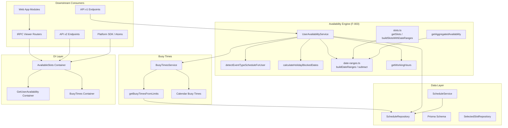

# Technical Specification

# 0. Agent Action Plan

## 0.1 Intent Clarification

### 0.1.1 Core Feature Objective

Based on the prompt, the Blitzy platform understands that the new feature requirement is to **complete Sprint 1: Availability & Scheduling (F-004)** — the foundational availability engine for the Cal.com scheduling platform. The user explicitly identifies this as the bedrock upon which every downstream domain operates.

The specific feature requirements, restated with enhanced clarity, are:

- **Slot Generation Engine**: Implement the deterministic algorithm that transforms user-defined schedules (weekly working hours + date overrides) into concrete bookable time slots, respecting event duration, frequency intervals, and the `NEXT_PUBLIC_AVAILABILITY_SCHEDULE_INTERVAL` environment configuration. The slot builder in `packages/features/schedules/lib/slots.ts` must produce invitee-timezone-aware results via `getSlots` / `buildSlotsWithDateRanges`.
- **Buffer Time Enforcement**: Ensure before-event and after-event buffer windows are correctly applied during busy-time calculation in `packages/features/busyTimes/services/getBusyTimes.ts`, extending booking start/end boundaries so adjacent meetings never overlap the configured gap.
- **Minimum Notice Period Enforcement**: The slot generation pipeline must respect `minimumBookingNotice` by filtering out any candidate slot whose start time falls within the notice window relative to the current UTC moment, as implemented in `packages/features/schedules/lib/slots.ts`.
- **DST Normalization**: All date-range processing in `packages/features/schedules/lib/date-ranges.ts` must correctly handle Daylight Saving Time transitions via `processWorkingHours`, `getAdjustedTimezone`, and the travel-schedule override path, ensuring zero-length or shifted intervals are dropped and overlapping ranges are deduplicated through `mergeOverlappingRanges`.
- **Busy Time Aggregation**: The `BusyTimesService` in `packages/features/busyTimes/services/getBusyTimes.ts` and its limit-enforcement layer in `packages/features/busyTimes/lib/getBusyTimesFromLimits.ts` must aggregate booking-based and calendar-based conflicts, apply per-user and team-level booking/duration limits, and produce a normalized `EventBusyDetails[]` that the availability engine subtracts from working hours.
- **Aggregated Multi-Host Availability**: The `getAggregatedAvailability` routine in `packages/features/availability/lib/getAggregatedAvailability/` must correctly intersect fixed-host and round-robin participant windows, respecting group semantics, OOO exclusions, and deterministic deduplication.

**Implicit requirements detected:**

- The `UserAvailabilityService` orchestrator in `packages/features/availability/lib/getUserAvailability.ts` must correctly compose all sub-systems (schedule detection, holiday blocking, busy-time fetching, date-range arithmetic) into a unified availability response.
- Schedule CRUD operations via `ScheduleRepository` and `ScheduleService` in `packages/features/schedules/repositories/` and `packages/features/schedules/services/` must be fully operational for the availability engine to read and modify schedules.
- The `detectEventTypeScheduleForUser` resolver in `packages/features/availability/lib/detectEventTypeScheduleForUser.ts` must follow the priority hierarchy: event-type schedule → host override → user default → `DEFAULT_SCHEDULE_DATA` fallback.
- Holiday blocking via `calculateHolidayBlockedDates` must integrate with Google Calendar API holiday data.
- The `useTimesForSchedule` hook in `packages/features/schedules/hooks/` must produce deterministic ISO time windows for booker layouts across all timezone scenarios.

### 0.1.2 Special Instructions and Constraints

- **Source Directive**: The user explicitly identifies `packages/features/availability/` and `packages/features/schedules/` as the primary source packages. All implementation work must center on these directories and their transitive dependencies.
- **Foundational Priority**: The user emphasizes that "every downstream domain — from event types to notifications — ultimately depends on the availability engine producing correct bookable slots." This means correctness and determinism take precedence over performance optimization.
- **Existing Architecture Compliance**: All changes must follow the established Cal.com patterns:
  - Dependency injection via `@evyweb/ioctopus` (v1.2.0) as configured in `packages/features/di/`
  - Prisma-backed repository pattern (`ScheduleRepository`, `PrismaSelectedSlotRepository`)
  - Zod schema validation for all tRPC procedure inputs
  - `@calcom/dayjs` for all date/time operations (patched Day.js 1.11.4)
  - Vitest for all unit and integration tests
- **Backward Compatibility**: The availability engine feeds into the Platform SDK (`packages/platform/libraries/schedules.ts`), API v1 (`apps/api/v1/`), API v2 (`apps/api/v2/`), and the web application — all existing consumers must continue to receive consistent data contracts.

### 0.1.3 Technical Interpretation

These feature requirements translate to the following technical implementation strategy:

- To **implement slot generation**, we will validate and extend the `getSlots` / `buildSlotsWithDateRanges` functions in `packages/features/schedules/lib/slots.ts`, ensuring correct interval snapping, optimized-mode rounding, notice window enforcement, and out-of-office metadata propagation.
- To **enforce buffer times**, we will validate the buffer expansion logic in `BusyTimesService._getBusyTimes` that extends booking start/end by `beforeEventBuffer` and `afterEventBuffer` minutes, and confirm that `getDefinedBufferTimes` in the calendar busy-time path correctly applies these windows.
- To **normalize DST transitions**, we will validate `processWorkingHours` in `packages/features/schedules/lib/date-ranges.ts` for correct UTC offset calculations, travel timezone overrides via `getAdjustedTimezone`, overlapping interval deduplication via `endTimeToKeyMap`, and boundary handling at 23:59.
- To **aggregate busy times**, we will validate the full `BusyTimesService` pipeline including batch-fetched limit checks (`fetchBookingsForLimitChecksBatched`), booking-count and duration-based limit enforcement, and team-level busy-time aggregation.
- To **deliver aggregated multi-host availability**, we will validate the `getAggregatedAvailability` routine's intersection logic for fixed hosts, round-robin group semantics, and the `uniqueAndSortedDateRanges` / `filterRedundantDateRanges` utilities.
- To **orchestrate the full availability query**, we will validate `UserAvailabilityService` in `getUserAvailability.ts`, ensuring it correctly composes schedule detection, holiday blocking, busy-time services, and date-range arithmetic (via `buildDateRanges`, `subtract`, `getWorkingHours`) into a complete availability response.

## 0.2 Repository Scope Discovery

### 0.2.1 Comprehensive File Analysis

The following exhaustive inventory catalogs every file and module within the availability and scheduling feature surface, organized by functional role.

#### Core Availability Business Logic (`packages/features/availability/`)

| File Path | Type | Purpose |
|-----------|------|---------|
| `packages/features/availability/lib/getUserAvailability.ts` | MODIFY | Orchestration core — Zod request schemas, `UserAvailabilityService` class composing schedule detection, holiday blocking, busy-time services, date-range arithmetic, Redis caching, and OOO data |
| `packages/features/availability/lib/detectEventTypeScheduleForUser.ts` | MODIFY | Schedule priority resolver — `DEFAULT_SCHEDULE_DATA`, event-type → host → user → fallback hierarchy with timezone propagation |
| `packages/features/availability/lib/detectEventTypeScheduleForUser.test.ts` | MODIFY | Vitest behavioral spec covering priority hierarchy, timezone propagation, default flags |
| `packages/features/availability/lib/findUsersForAvailabilityCheck.ts` | MODIFY | Async Prisma user enrichment helper with `availabilityUserSelect`, calendar normalization, delegation credential injection |
| `packages/features/availability/lib/calculateHolidayBlockedDates.test.ts` | MODIFY | Vitest suite for holiday blocking matrix validation |
| `packages/features/availability/lib/getAggregatedAvailability/getAggregatedAvailability.ts` | MODIFY | Deterministic aggregation for multi-host availability — fixed/round-robin intersection, group semantics, deduplication |
| `packages/features/availability/lib/getAggregatedAvailability/getAggregatedAvailability.test.ts` | MODIFY | Vitest regression suite for aggregation logic |
| `packages/features/availability/lib/getAggregatedAvailability/date-range-utils/` | MODIFY | `filterRedundantDateRanges.ts`, `mergeOverlappingDateRanges.ts` and their test suites |
| `packages/features/availability/components/SkeletonLoader.tsx` | MODIFY | Client-side skeleton UI for availability loading states |

#### Core Scheduling Engine (`packages/features/schedules/`)

| File Path | Type | Purpose |
|-----------|------|---------|
| `packages/features/schedules/lib/date-ranges.ts` | MODIFY | Timezone-aware date-range processing — `processWorkingHours`, `processDateOverride`, `processOOO`, DST normalization, travel overrides, `intersect`/`subtract`/`mergeOverlappingRanges` |
| `packages/features/schedules/lib/date-ranges.test.ts` | MODIFY | Comprehensive Vitest battery for DST, travel, override, subtract, intersect edge cases |
| `packages/features/schedules/lib/slots.ts` | MODIFY | Slot generator — `GetSlots`/`TimeFrame` types, `buildSlotsWithDateRanges`, interval snapping, optimized rounding, notice enforcement, OOO metadata merging |
| `packages/features/schedules/lib/slots.test.ts` | MODIFY | Vitest suite covering 24-hour distributions, notice, timezone offsets, performance, metadata propagation |
| `packages/features/schedules/repositories/ScheduleRepository.ts` | MODIFY | Prisma-backed schedule CRUD with permission enforcement, default schedule lifecycle, Atom-compatible payloads |
| `packages/features/schedules/repositories/ScheduleRepository.test.ts` | MODIFY | Vitest regression suite with prismaMock for all repository methods |
| `packages/features/schedules/services/ScheduleService.ts` | MODIFY | Zod input schema (`ZUpdateInputSchema`), ownership/permission enforcement, transactional schedule update with availability normalization |
| `packages/features/schedules/hooks/useTimesForSchedule.ts` | MODIFY | Scheduling window hook — ISO window calculation tied to BookerStoreContext, layout-driven prefetch |
| `packages/features/schedules/hooks/useTimesForSchedule.timezone.test.ts` | MODIFY | Timezone regression suite covering month/week/column/mobile layouts |
| `packages/features/schedules/components/DateOverrideInputDialog.tsx` | MODIFY | Modal for date-specific override editing with locale-aware calendar |
| `packages/features/schedules/components/DateOverrideList.tsx` | MODIFY | Sorted, localized override list with inline edit/delete |
| `packages/features/schedules/components/ScheduleComponent.tsx` | MODIFY | Weekly availability grid — React Hook Form, `DayRanges`, `parseTimeString`, `CopyTimes` |
| `packages/features/schedules/components/ScheduleListItem.tsx` | MODIFY | Schedule row for master list with localized summaries and dropdown actions |
| `packages/features/schedules/components/parse-time-string.test.ts` | MODIFY | Vitest suite for `parseTimeString` across timezone scenarios |

#### Shared Library Utilities (`packages/lib/`)

| File Path | Type | Purpose |
|-----------|------|---------|
| `packages/lib/availability.ts` | MODIFY | Canonical constants (`DEFAULT_SCHEDULE`, `defaultDayRange`), `getAvailabilityFromSchedule`, `getWorkingHours`, `availabilityAsString` |
| `packages/lib/schedules/transformers/for-atom.ts` | MODIFY | Atom API adapters — `transformWorkingHoursForAtom`, `transformAvailabilityForAtom`, `transformDateOverridesForAtom` |
| `packages/lib/schedules/transformers/index.ts` | MODIFY | Barrel exports for schedule transformers |
| `packages/lib/schedules/transformers/getScheduleListItemData.ts` | MODIFY | Data transformer for schedule list item rendering |

#### Busy Times Feature (`packages/features/busyTimes/`)

| File Path | Type | Purpose |
|-----------|------|---------|
| `packages/features/busyTimes/services/getBusyTimes.ts` | MODIFY | `BusyTimesService` — buffer expansion, booking fetch, calendar busy-time aggregation, seat reference tracking |
| `packages/features/busyTimes/services/getBusyTimes.test.ts` | MODIFY | Unit test suite for busy-time generation and limit checks |
| `packages/features/busyTimes/services/getBusyTimes.integration-test.ts` | MODIFY | Prisma-backed integration test for batched limit checks |
| `packages/features/busyTimes/lib/getBusyTimesFromLimits.ts` | MODIFY | Limit enforcement pipeline — booking-count, duration, team-level limits via `LimitManager` |

#### Dependency Injection Wiring (`packages/features/di/`)

| File Path | Type | Purpose |
|-----------|------|---------|
| `packages/features/di/containers/AvailableSlots.ts` | MODIFY | DI container bootstrapping for `AvailableSlotsService` with all repository and service modules |
| `packages/features/di/containers/GetUserAvailability.ts` | MODIFY | DI container for `UserAvailabilityService` with Prisma, repositories, Redis |
| `packages/features/di/containers/BusyTimes.ts` | MODIFY | DI container for `BusyTimesService` with Prisma and booking repository |
| `packages/features/di/modules/AvailableSlots.ts` | MODIFY | Module binding for `AvailableSlotsService` with 15+ dependency tokens |
| `packages/features/di/modules/GetUserAvailability.ts` | MODIFY | Module binding for `UserAvailabilityService` |
| `packages/features/di/modules/SelectedSlots.ts` | MODIFY | Module binding for `PrismaSelectedSlotRepository` |

#### tRPC Routers and Handlers (`packages/trpc/`)

| File Path | Type | Purpose |
|-----------|------|---------|
| `packages/trpc/server/routers/viewer/availability/_router.tsx` | MODIFY | Viewer availability router — `list`, `user`, `listTeam`, `schedule`, `calendarOverlay` procedures |
| `packages/trpc/server/routers/viewer/availability/schedule/_router.tsx` | MODIFY | Schedule sub-router — `get`, `create`, `delete`, `update`, `duplicate`, user/event slug lookups, bulk reset |
| `packages/trpc/server/routers/viewer/availability/schedule/get.handler.ts` | MODIFY | GET handler delegating to `ScheduleRepository.findDetailedScheduleById` |
| `packages/trpc/server/routers/viewer/availability/schedule/create.handler.ts` | MODIFY | CREATE handler — ownership check, normalized availability, default schedule backfill |
| `packages/trpc/server/routers/viewer/availability/schedule/update.handler.ts` | MODIFY | UPDATE handler delegating to `ScheduleService.update` |
| `packages/trpc/server/routers/viewer/availability/list.handler.ts` | MODIFY | LIST handler with default schedule resolution and backfill |
| `packages/trpc/server/routers/viewer/slots/_router.tsx` | MODIFY | Viewer slots router — `getSchedule`, `reserveSlot`, `isAvailable`, `removeSelectedSlotMark` |
| `packages/trpc/server/routers/viewer/slots/getSchedule.handler.ts` | MODIFY | Schedule handler delegating to `getAvailableSlotsService` |
| `packages/trpc/server/routers/viewer/slots/types.ts` | MODIFY | Zod schemas for scheduling, reservation, availability inputs |

#### Web Application Modules (`apps/web/`)

| File Path | Type | Purpose |
|-----------|------|---------|
| `apps/web/modules/availability/availability-view.tsx` | MODIFY | `/availability` page — `AvailabilityList` and `AvailabilityCTA` with TRPC mutations |
| `apps/web/modules/availability/[schedule]/schedule-view.tsx` | MODIFY | `/availability/[schedule]` page — schedule editing with cache invalidation |
| `apps/web/modules/availability/troubleshoot/troubleshoot-view.tsx` | MODIFY | Client-only availability troubleshooting wrapper |
| `apps/web/modules/schedules/components/NewScheduleButton.tsx` | MODIFY | FAB/Dialog for schedule creation with TRPC mutation |
| `apps/web/modules/schedules/components/Schedule.tsx` | MODIFY | React Hook Form adapter for `ScheduleComponent` |
| `apps/web/modules/schedules/hooks/useSchedule.ts` | MODIFY | Availability fetching between legacy TRPC and API v2 |
| `apps/web/modules/schedules/hooks/useEvent.ts` | MODIFY | Booker context hooks for event/schedule queries |
| `apps/web/modules/schedules/hooks/useNonEmptyScheduleDays.ts` | MODIFY | Memoized slot day filtering |
| `apps/web/modules/schedules/hooks/useSlotsForDate.ts` | MODIFY | Per-date slot lookups with confirmation toggle |
| `apps/web/modules/schedules/lib/types.ts` | MODIFY | TRPC-derived type aliases (`Slots`, `Slot`, `GetSchedule`) |
| `apps/web/app/(use-page-wrapper)/availability/[schedule]/page.tsx` | MODIFY | Server component for schedule detail route |
| `apps/web/app/(use-page-wrapper)/(main-nav)/availability/page.tsx` | MODIFY | Server component for availability listing route |
| `apps/web/modules/event-types/components/tabs/availability/` | MODIFY | Event type availability tab components and wrapper |

#### Prisma Schema and Types

| File Path | Type | Purpose |
|-----------|------|---------|
| `packages/prisma/schema.prisma` (models: `Schedule`, `Availability`, `SelectedSlots`) | MODIFY | Core data models for scheduling |
| `packages/types/schedule.d.ts` | MODIFY | Shared TypeScript types — `TimeRange`, `Schedule`, `WorkingHours`, `TravelSchedule` |
| `packages/platform/atoms/availability/types.ts` | MODIFY | Platform atom type contracts for availability forms |

#### API Surface

| File Path | Type | Purpose |
|-----------|------|---------|
| `apps/web/pages/api/trpc/availability/[trpc].ts` | MODIFY | Next.js API route for availability TRPC namespace |
| `apps/api/v1/lib/validations/availability.ts` | MODIFY | Zod validation schemas for API v1 availability endpoints |
| `apps/api/v1/lib/validations/schedule.ts` | MODIFY | Zod validation schemas for API v1 schedule endpoints |
| `apps/api/v2/src/ee/schedules/schedules_2024_04_15/` | MODIFY | API v2 EE schedule module — repository, outputs, service |
| `apps/api/v2/src/lib/services/available-slots.service.ts` | MODIFY | NestJS provider extending `BaseAvailableSlotsService` |
| `apps/api/v2/src/lib/services/busy-times.service.ts` | MODIFY | NestJS provider extending `BaseBusyTimesService` |
| `apps/api/v2/src/lib/modules/available-slots.module.ts` | MODIFY | NestJS module aggregating all availability DI providers |

### 0.2.2 Integration Point Discovery

- **API Endpoints**: `/api/trpc/availability/*` (TRPC), `/api/availabilities` (REST v1), `/api/v2/ee/schedules/*` (REST v2)
- **Database Models**: `Schedule`, `Availability`, `SelectedSlots`, `SelectedCalendar`, `Booking` (for busy-time queries)
- **Service Classes**: `UserAvailabilityService`, `BusyTimesService`, `AvailableSlotsService`, `ScheduleService`, `ScheduleRepository`
- **Controllers/Handlers**: Viewer availability/schedule TRPC router handlers, API v1 availability controllers, API v2 schedule controllers
- **Middleware**: Authentication via `authedProcedure` (TRPC), `authMiddleware` (API routes), permission checks via `hasReadPermissionsForUserId` / `hasEditPermissionForUserID`

### 0.2.3 New File Requirements

No entirely new source files are required for this sprint. The availability and scheduling engine is an existing, mature codebase (`F-003` is marked as "Completed" in the feature catalog). This sprint focuses on **validating, hardening, and completing** the existing implementation to ensure all sub-systems produce correct results. Any new files would be limited to:

- Additional test fixtures if specific edge cases are discovered during validation
- Potential new Vitest test files for any untested integration paths between the sub-systems

## 0.3 Dependency Inventory

### 0.3.1 Private and Public Packages

The following table catalogs all key packages relevant to the availability and scheduling feature addition, with exact names and versions sourced from the repository's dependency manifests.

| Registry | Package | Version | Purpose |
|----------|---------|---------|---------|
| workspace | `@calcom/features` | 1.0.0 | Main feature collocation package housing `availability/`, `schedules/`, `busyTimes/`, `selectedSlots/` |
| workspace | `@calcom/lib` | workspace:* | Platform-wide utilities including `availability.ts`, `schedules/transformers/`, holiday helpers, timezone utilities |
| workspace | `@calcom/dayjs` | workspace:* | Patched Day.js (1.11.4) wrapper with UTC, timezone, locale, and custom format plugins |
| workspace | `@calcom/trpc` | workspace:* | Shared tRPC contract with viewer availability/schedule/slots routers |
| workspace | `@calcom/ui` | workspace:* | React design system with `SkeletonText`, `Button`, `Dialog`, `Switch`, `Select` primitives |
| workspace | `@calcom/prisma` | workspace:* | ORM tooling — Prisma 6.16.1 client, schema with `Schedule`/`Availability`/`SelectedSlots` models |
| workspace | `@calcom/types` | workspace:* | Ambient type declarations — `TimeRange`, `Schedule`, `WorkingHours`, `TravelSchedule` |
| workspace | `@calcom/atoms` | workspace:* | Platform Atoms UI components including `AvailabilitySettings`, `CreateSchedule`, `ListSchedules` |
| workspace | `@calcom/testing` | workspace:* | Vitest fixtures, mocks, and test helpers |
| workspace | `@calcom/platform-libraries` | workspace:* | Platform schedule/availability re-exports from features packages |
| npm | `@evyweb/ioctopus` | 1.2.0 | Dependency injection container library used in `packages/features/di/` |
| npm | `zustand` | 4.5.2 | State management for `BookerStoreContext` consumed by schedule hooks |
| npm | `zod` | 3.25.76 | Runtime schema validation for all tRPC inputs, schedule schemas, availability validators |
| npm | `react-hook-form` | 7.43.3 | Form management for `ScheduleComponent`, `DateOverrideInputDialog`, schedule CRUD forms |
| npm | `date-fns-tz` | 3.2.0 | Timezone-aware date formatting used in `DateOverrideList` via `formatInTimeZone` |
| npm | `framer-motion` | 10.12.8 | Animations for availability list transitions |
| npm | `react-select` | 5.8.0 | Advanced select inputs for schedule/timezone pickers |
| npm | `city-timezones` | 1.2.1 | City timezone lookup for `packages/features/cityTimezones/` |
| npm | `vitest` | 4.0.16 | Test runner for all availability/schedules unit and integration tests |
| npm | `prismock` | 1.35.3 | Prisma mock for repository test suites |
| npm | `typescript` | 5.9.3 | Language compiler |
| npm | `next` | >=14.0.0 (peer) | Web framework (actual: 16.1.5 in `apps/web`) |
| npm | `react` | ^18.0.0 (peer) | UI library (actual: 18.2.0 in `apps/web`) |

### 0.3.2 Dependency Updates

#### Import Updates

Files requiring import verification across the availability surface (using wildcards):

- `packages/features/availability/**/*.ts` — Internal imports from `@calcom/lib`, `@calcom/prisma`, `@calcom/dayjs`, `@calcom/app-store`
- `packages/features/schedules/**/*.ts` — Internal imports from `@calcom/lib`, `@calcom/prisma`, `@calcom/dayjs`, `@calcom/ui`
- `packages/features/busyTimes/**/*.ts` — Internal imports from `@calcom/lib`, `@calcom/prisma`, `@calcom/features/schedules`
- `packages/features/di/**/*.ts` — Token and module imports across the DI graph
- `packages/trpc/server/routers/viewer/availability/**/*.ts` — Handler imports from `@calcom/features`, `@calcom/prisma`
- `packages/trpc/server/routers/viewer/slots/**/*.ts` — Handler imports from `@calcom/features/di/containers`
- `apps/web/modules/availability/**/*.tsx` — TRPC hooks, `@calcom/features`, `@calcom/ui` imports
- `apps/web/modules/schedules/**/*.tsx` — TRPC hooks, component imports from `@calcom/features/schedules`

#### External Reference Updates

- `packages/features/package.json` — Verify all workspace dependency versions align
- `packages/prisma/schema.prisma` — Ensure `Schedule`, `Availability`, `SelectedSlots` models are current
- `packages/types/schedule.d.ts` — Verify type definitions match runtime implementations
- `.env.example` — Confirm availability-related environment variables are documented (`NEXT_PUBLIC_AVAILABILITY_SCHEDULE_INTERVAL`, `PUBLIC_QUERY_AVAILABLE_SLOTS_INTERVAL_SECONDS`, `calendar-cache` feature flag)

## 0.4 Integration Analysis

### 0.4.1 Existing Code Touchpoints

#### Direct Modifications Required

- **`packages/features/availability/lib/getUserAvailability.ts`**: The availability orchestration core. Validate that `UserAvailabilityService` correctly sequences: (1) schedule detection via `detectEventTypeScheduleForUser`, (2) holiday blocking via `calculateHolidayBlockedDates`, (3) busy-time fetching via `BusyTimesService`, (4) date-range arithmetic via `buildDateRanges`/`subtract`/`getWorkingHours`, and (5) Redis caching integration. Ensure Zod request schemas cover all edge cases and the service correctly reports seat counts, timezone delegation, and OOO data.

- **`packages/features/schedules/lib/slots.ts`**: The slot generation engine. Validate `buildSlotsWithDateRanges` for: interval alignment via `getCorrectedSlotStartTime`, five-/15-minute boundary snapping in optimized mode, `NEXT_PUBLIC_AVAILABILITY_SCHEDULE_INTERVAL` environment override, notice window enforcement (`minimumBookingNotice`), event-length fit checks before range end, deduplication via ISO-keyed Map, and out-of-office metadata merging (user IDs, reasons, emoji, `showNotePublicly`).

- **`packages/features/schedules/lib/date-ranges.ts`**: The timezone-aware date-range processor. Validate `processWorkingHours` for DST normalization, `getAdjustedTimezone` for travel schedule overrides, `processDateOverride` for one-off overrides, `processOOO` for zero-length OOO markers, and the `intersect`/`subtract`/`mergeOverlappingRanges` utilities for sorted, deterministic behavior.

- **`packages/features/busyTimes/services/getBusyTimes.ts`**: The busy-time aggregation service. Validate buffer expansion, booking fetch, calendar busy-time queries, seat reference tracking, and the batched limit check pipeline (`fetchBookingsForLimitChecksBatched`).

- **`packages/features/busyTimes/lib/getBusyTimesFromLimits.ts`**: The limit enforcement layer. Validate `LimitManager`-based evaluation for booking-count, duration, and team-scoped constraints with `withReporting` instrumentation.

- **`packages/features/availability/lib/getAggregatedAvailability/getAggregatedAvailability.ts`**: Multi-host aggregation. Validate fixed-host intersection, round-robin group semantics, OOO exclusion handling, and the `uniqueAndSortedDateRanges`/`filterRedundantDateRanges` pipeline.

#### Dependency Injection Touchpoints

- **`packages/features/di/containers/AvailableSlots.ts`**: The DI container that bootstraps the `AvailableSlotsService`. Ensure all 15+ repository and service modules are correctly loaded in dependency order: Prisma → Redis → repositories (OOO, schedule, selected slots, team, user, booking, event type, routing form, features, membership, holiday) → services (booking limits, available slots, user availability, busy times, filter hosts, qualified hosts, no-slots notification).

- **`packages/features/di/containers/GetUserAvailability.ts`**: The DI container for `UserAvailabilityService`. Validate module load order: Prisma → OOO repository → booking repository → event type repository → holiday repository → GetUserAvailability service → busy times service → Redis.

- **`packages/features/di/modules/AvailableSlots.ts`**: Module binding with `satisfies Record<keyof IAvailableSlotsService, symbol>` compile-time guard. Verify all dependency tokens are current.

#### Database/Schema Touchpoints

- **`packages/prisma/schema.prisma`**: The `Schedule` model (fields: `id`, `userId`, `name`, `timeZone`, `availability[]`, `eventType[]`, `Host[]`) and `Availability` model (fields: `id`, `userId`, `eventTypeId`, `days[]`, `startTime`, `endTime`, `date`, `scheduleId`) must remain consistent with repository select projections.

- **`packages/prisma/selects/`**: The `availabilityUserSelect` projection must include all fields required by `findUsersForAvailabilityCheck` — schedules with nested availability, selectedCalendars, and credential relations.

- **`SelectedSlots` model** (fields: `id`, `eventTypeId`, `userId`, `slotUtcStartDate`, `slotUtcEndDate`, `uid`, `releaseAt`, `isSeat`): Used by the slot reservation system with unique constraint on `(userId, slotUtcStartDate, slotUtcEndDate, uid)`.

### 0.4.2 Cross-Feature Integration Map

### 0.4.3 Platform SDK Integration

The `packages/platform/libraries/schedules.ts` file re-exports the following from the availability and schedules feature packages, establishing the public API contract for third-party consumers:

- `ScheduleRepository` and `FindDetailedScheduleByIdReturnType` from `@calcom/features/schedules/repositories/ScheduleRepository`
- `updateSchedule` and `UpdateScheduleResponse` from `@calcom/features/schedules/services/ScheduleService`
- `UserAvailabilityService` from `@calcom/features/availability/lib/getUserAvailability`
- TRPC handlers: `createScheduleHandler`, `getAvailabilityListHandler`, `duplicateScheduleHandler`, `getScheduleByEventSlugHandler`
- Validation schemas: `CreateScheduleSchema` (from TRPC create schema)

Any changes to the function signatures or return types of these exports would break the platform SDK contract and must be validated for backward compatibility.

## 0.5 Technical Implementation

### 0.5.1 File-by-File Execution Plan

Every file listed below must be validated, hardened, or extended as part of this sprint. Files are grouped by execution priority to ensure foundational layers are solid before higher-level orchestration is addressed.

#### Group 1 — Core Date/Time Foundation

- **MODIFY: `packages/features/schedules/lib/date-ranges.ts`** — Validate `processWorkingHours` for all DST transition scenarios. Confirm `getAdjustedTimezone` correctly applies travel schedule overrides by comparing `travelSchedules` against the current date. Verify `processDateOverride` handles midnight-bounding overrides and `processOOO` emits zero-length markers. Ensure `intersect` uses sorted two-pointer traversal with numeric caching and `subtract` correctly subtracts exclusion ranges with metadata passthrough. Confirm `mergeOverlappingRanges` operates on non-Dayjs Date objects for deterministic merging.

- **MODIFY: `packages/features/schedules/lib/date-ranges.test.ts`** — Extend the Vitest battery to cover any untested edge cases discovered during validation: travel timezone recalculations, zero-length span drops, midnight-bounding overrides, and multi-range timezone-mixed exclusions.

- **MODIFY: `packages/lib/availability.ts`** — Validate `DEFAULT_SCHEDULE` (seven weekday buckets with 9-5 Mon-Fri), `getAvailabilityFromSchedule` (deduplication + day grouping), `getWorkingHours` (UTC offset calculation, overflow handling for cross-midnight and cross-day scenarios), and `availabilityAsString` (locale-aware formatting).

- **MODIFY: `packages/types/schedule.d.ts`** — Confirm `TimeRange`, `Schedule`, `WorkingHours`, and `TravelSchedule` type definitions match their runtime implementations across the codebase.

#### Group 2 — Busy Time Aggregation

- **MODIFY: `packages/features/busyTimes/services/getBusyTimes.ts`** — Validate `BusyTimesService._getBusyTimes`: buffer expansion by `beforeEventBuffer`/`afterEventBuffer` minutes, booking fetch with Prisma, seat reference counting, calendar busy-time integration via `getBusyCalendarTimes` when credentials exist and `bypassBusyCalendarTimes` is false, and the `subtract`/`getDefinedBufferTimes` pipeline for calendar-based windows.

- **MODIFY: `packages/features/busyTimes/services/getBusyTimes.test.ts`** — Verify unit tests cover ordinary booking constraints, buffer extensions, seat-limited blocking, batch limit checks with 75/100/150 userIds, rescheduleUid exclusions, and null propagation.

- **MODIFY: `packages/features/busyTimes/lib/getBusyTimesFromLimits.ts`** — Validate `_getBusyTimesFromLimits` orchestration: `LimitManager` instantiation, booking-limit enforcement (descending interval keys, skip already-busy, yearly delegation to `getCheckBookingLimitsService`), duration-limit enforcement (sum overlapping minutes per unit), and team-level limit enforcement (team booking fetch, managed event inclusion).

#### Group 3 — Schedule Detection and Holiday Blocking

- **MODIFY: `packages/features/availability/lib/detectEventTypeScheduleForUser.ts`** — Validate the priority hierarchy: (1) event-type schedule → (2) host override → (3) stored user schedule via `defaultScheduleId` → (4) `DEFAULT_SCHEDULE_DATA` fallback. Confirm timezone propagation (`eventType.timeZone` → `user.timeZone`), `isDefaultSchedule`/`isTimezoneSet` flags, and host assignment reuse.

- **MODIFY: `packages/features/availability/lib/detectEventTypeScheduleForUser.test.ts`** — Verify all branches of the resolver's decision tree are covered.

- **MODIFY: `packages/features/availability/lib/calculateHolidayBlockedDates.test.ts`** — Validate the holiday blocking matrix: missing settings, null country codes, normalized day boundaries, metadata merging, weekday filtering, multi-schedule coverage, disabled holiday IDs.

- **MODIFY: `packages/features/availability/lib/findUsersForAvailabilityCheck.ts`** — Validate Prisma user enrichment with `availabilityUserSelect`, `selectedCalendars` relations, `withSelectedCalendars` normalization, and `enrichUserWithDelegationCredentialsIncludeServiceAccountKey`.

#### Group 4 — Slot Generation

- **MODIFY: `packages/features/schedules/lib/slots.ts`** — Validate `buildSlotsWithDateRanges`: sort DateRange inputs, determine working interval via `NEXT_PUBLIC_AVAILABILITY_SCHEDULE_INTERVAL`, snap to UTC now + notice window, deduplicate via ISO-keyed Map, convert to invitee timezone, apply offsets, enforce eventLength fit before range end, merge adjacent boundaries, and merge OOO metadata (user IDs, reasons, emoji, `showNotePublicly`).

- **MODIFY: `packages/features/schedules/lib/slots.test.ts`** — Verify tests cover 24-hour distributions, booking notice, unordered overlaps, fractional durations, timezone offsets, optimized flag behavior, performance across thousands of ranges, environment-driven interval overrides, and cross-timezone OOO metadata.

#### Group 5 — Availability Orchestration

- **MODIFY: `packages/features/availability/lib/getUserAvailability.ts`** — Validate the `UserAvailabilityService` orchestration: Zod request schema validation, typed query interfaces, composition of `detectEventTypeScheduleForUser` → `calculateHolidayBlockedDates` → `BusyTimesService` → `buildDateRanges`/`subtract`/`getWorkingHours` → normalized response (busy slots, computed ranges, working hours, date overrides, seat summaries, OOO data). Verify Redis caching, timezone delegation helpers, and seat-count reporters.

- **MODIFY: `packages/features/availability/lib/getAggregatedAvailability/getAggregatedAvailability.ts`** — Validate: fixed-host filtering via metadata, collective semantics forcing all participants as fixed, round-robin grouping by `groupId` or `DEFAULT_GROUP_ID`, intersection enforcement (every group must contribute), and the `uniqueAndSortedDateRanges` → `filterRedundantDateRanges` pipeline.

- **MODIFY: `packages/features/availability/lib/getAggregatedAvailability/getAggregatedAvailability.test.ts`** — Verify regression coverage: overlapping exclusions, reversed timestamps, fixed-host merging, mixed fixed/round-robin with OOO, deduplication, grouped round-robin, empty-group edge cases, and group-contribution enforcement.

#### Group 6 — Data Access and Services

- **MODIFY: `packages/features/schedules/repositories/ScheduleRepository.ts`** — Validate `findDetailedScheduleById` (default schedule resolution, permission guard via `hasReadPermissionsForUserId`, ownership check, Atom transformation, timezone fallback), `getDefaultScheduleId`, `hasDefaultSchedule`, `setupDefaultSchedule`, and lightweight read methods.

- **MODIFY: `packages/features/schedules/services/ScheduleService.ts`** — Validate `ZUpdateInputSchema` (Zod), ownership/edit permission enforcement, default schedule toggle delegation, name-less update short-circuit, transactional `prisma.schedule.update` (timezone, name, availability delete/recreate), and `transformScheduleToAvailabilityForAtom` conversion.

#### Group 7 — UI Components and Hooks

- **MODIFY: `packages/features/schedules/components/ScheduleComponent.tsx`** — Validate weekly grid: React Hook Form integration, `DayRanges` with `useFieldArray`, `parseTimeString` for 12/24-hour format normalization, `Switch` toggles restoring `DEFAULT_DAY_RANGE`, `CopyTimes` dropdown, and `LazySelect` time picker.

- **MODIFY: `packages/features/schedules/hooks/useTimesForSchedule.ts`** — Validate ISO window calculation: `selectedDate`/`month`/`dayCount` resolution, `usePrefetch` layout heuristics, start/end time computation based on layout-driven prefetch, and integration with `BookerStoreContext`.

- **MODIFY: `apps/web/modules/availability/availability-view.tsx`** — Validate TRPC mutation hooks (delete, update, bulk-update, duplicate), cache invalidation via `trpc.useUtils`, shared revalidation helpers, and toast feedback.

### 0.5.2 Implementation Approach per File

- **Establish correctness foundation**: Start with `date-ranges.ts` and `availability.ts` since every higher-level component depends on timezone-aware interval arithmetic being deterministic.
- **Validate busy-time aggregation**: Ensure `BusyTimesService` and `getBusyTimesFromLimits` correctly produce the exclusion set that feeds into availability subtraction.
- **Confirm schedule detection chain**: Validate the `detectEventTypeScheduleForUser` resolver and holiday blocking before integrating with the orchestrator.
- **Harden slot generation**: With correct date ranges and busy times confirmed, validate `slots.ts` for correct interval snapping, notice enforcement, and metadata propagation.
- **Verify orchestration**: Validate `UserAvailabilityService` as the composition point for all sub-systems.
- **Confirm UI fidelity**: Validate that all React components and hooks consume the availability data correctly and present deterministic results.

### 0.5.3 User Interface Design

The availability and scheduling UI consists of the following key surfaces:

- **Availability List Page** (`/availability`): Renders `AvailabilityList` with schedule rows (`ScheduleListItem`), each displaying localized availability summaries, timezone badges, and dropdown actions (set default, duplicate, delete). Uses `NewScheduleButton` FAB for creation.
- **Schedule Editor** (`/availability/[schedule]`): Renders `AvailabilitySettings` with the weekly grid (`ScheduleComponent`), date override management (`DateOverrideInputDialog`/`DateOverrideList`), timezone selection, and a troubleshooting link.
- **Event Type Availability Tab**: Renders `EventAvailabilityTab` with schedule/restriction selectors, team availability per host, and `SettingsToggle`-wrapped schedule controls.
- **Booker Slot Display**: The `useSchedule` and `useSlotsForDate` hooks feed slot data to the Booker component for public-facing time slot selection.
- **Skeleton Loading States**: `SkeletonLoader` (availability list) and `AvailabilityScheduleSkeleton` (schedule editor) provide consistent loading UX.

## 0.6 Scope Boundaries

### 0.6.1 Exhaustively In Scope

#### Feature Source Files

- `packages/features/availability/**/*.ts` — All availability business logic, tests, and components
- `packages/features/schedules/**/*.ts` — All scheduling engine logic, components, hooks, repositories, services, and tests
- `packages/features/busyTimes/**/*.ts` — Busy time services and limit enforcement logic
- `packages/features/selectedSlots/**/*.ts` — Selected slot repositories and DTOs

#### Shared Library Utilities

- `packages/lib/availability.ts` — Canonical schedule constants and working hours helpers
- `packages/lib/schedules/transformers/**/*.ts` — Atom API transformers and schedule list data
- `packages/types/schedule.d.ts` — Shared TypeScript type definitions

#### Dependency Injection

- `packages/features/di/containers/AvailableSlots.ts` — DI container for slot availability
- `packages/features/di/containers/GetUserAvailability.ts` — DI container for user availability
- `packages/features/di/containers/BusyTimes.ts` — DI container for busy times
- `packages/features/di/modules/AvailableSlots.ts` — Module binding for `AvailableSlotsService`
- `packages/features/di/modules/GetUserAvailability.ts` — Module binding for `UserAvailabilityService`
- `packages/features/di/modules/SelectedSlots.ts` — Module binding for `PrismaSelectedSlotRepository`
- `packages/features/di/modules/NoSlotsNotification.ts` — Module binding for `NoSlotsNotificationService`

#### tRPC Routers and Handlers

- `packages/trpc/server/routers/viewer/availability/**/*.ts` — All availability router procedures and handlers
- `packages/trpc/server/routers/viewer/slots/**/*.ts` — All slot router procedures, types, and handlers

#### Web Application

- `apps/web/modules/availability/**/*.tsx` — Availability page views and actions
- `apps/web/modules/schedules/**/*.tsx` — Schedule components, hooks, and types
- `apps/web/app/(use-page-wrapper)/availability/**/*.tsx` — App Router pages, skeletons, actions
- `apps/web/app/(use-page-wrapper)/(main-nav)/availability/**/*.tsx` — Navigation-scoped availability pages
- `apps/web/modules/event-types/components/tabs/availability/**/*.tsx` — Event type availability tab
- `apps/web/pages/api/trpc/availability/**/*.ts` — Next.js API route for availability TRPC
- `apps/web/test/lib/getAvailabilityFromSchedule.test.ts` — Availability grouping test suite

#### API Surface

- `apps/api/v1/lib/validations/availability.ts` — API v1 availability validation schemas
- `apps/api/v1/lib/validations/schedule.ts` — API v1 schedule validation schemas
- `apps/api/v1/pages/api/availabilities/**/*.ts` — API v1 availability endpoints
- `apps/api/v2/src/ee/schedules/**/*.ts` — API v2 EE schedule module
- `apps/api/v2/src/lib/services/available-slots.service.ts` — API v2 available slots NestJS provider
- `apps/api/v2/src/lib/services/busy-times.service.ts` — API v2 busy times NestJS provider
- `apps/api/v2/src/lib/modules/available-slots.module.ts` — API v2 available slots NestJS module
- `apps/api/v2/src/modules/slots/**/*.ts` — API v2 versioned slot modules

#### Prisma and Database

- `packages/prisma/schema.prisma` (models: `Schedule`, `Availability`, `SelectedSlots`, `SelectedCalendar`)
- `packages/prisma/selects/` — `availabilityUserSelect` and related projections
- `packages/prisma/migrations/` — Availability-related migrations (`20210630014738`, `20211115182559`, `20220305233635`)

#### Platform SDK

- `packages/platform/libraries/schedules.ts` — Platform re-exports of schedule/availability services
- `packages/platform/atoms/availability/types.ts` — Atom availability type contracts
- `packages/platform/atoms/hooks/schedules/types.ts` — Atom schedule hook types

#### Configuration

- `.env.example` — `NEXT_PUBLIC_AVAILABILITY_SCHEDULE_INTERVAL`, `PUBLIC_QUERY_AVAILABLE_SLOTS_INTERVAL_SECONDS`
- `packages/features/package.json` — Feature package dependencies

### 0.6.2 Explicitly Out of Scope

- **Booking Lifecycle Management (F-002)**: Booking creation, confirmation, rescheduling, and cancellation flows — except where they intersect with busy-time generation
- **Event Type Management (F-001)**: Event type CRUD operations — except where event types reference schedules
- **Calendar Integrations (F-004 App Store)**: Individual calendar provider implementations (Google Calendar, Outlook, Apple) — only the aggregated busy-time interface is in scope
- **Enterprise Features**: Organization multi-tenancy (F-006), SSO (F-007), Directory Sync (F-008), Workflow Automation (F-009), Round-Robin Assignment (F-019) — except where they consume availability data
- **Communication Stack (F-010)**: Email and SMS notification flows
- **Performance Optimizations**: Redis caching strategies beyond functional correctness validation
- **Embed Distribution (F-013)**: Embed widget rendering — except the shared hooks consumed by embeds
- **Refactoring**: Any structural refactoring of existing code unrelated to availability correctness
- **New Feature Development**: Features not specified in the sprint scope (e.g., restriction schedules, new API endpoints)
- **Infrastructure**: CI/CD pipeline changes, Docker configuration, deployment scripts

## 0.7 Rules for Feature Addition

### 0.7.1 Architecture and Pattern Compliance

- **Dependency Injection First**: All new services and repositories must be registered through the `@evyweb/ioctopus` DI container system. Directly instantiating services is prohibited. New modules must follow the token-based pattern established in `packages/features/di/modules/` with `satisfies Record<keyof Interface, symbol>` compile-time guards.
- **Repository Pattern Enforcement**: All database access must go through repository abstractions. No direct Prisma calls from service or handler code. Repository interfaces must be defined separately from their Prisma implementations to preserve testability.
- **tRPC Router Conventions**: New availability or scheduling procedures must be added to the existing viewer routers at `packages/trpc/server/routers/viewer/availability/` or `packages/trpc/server/routers/viewer/slots/`. Every handler must have a co-located Zod schema in a `*.schema.ts` file and a separate `*.handler.ts` file.
- **Zod Validation at Boundaries**: All external inputs (tRPC inputs, API request bodies, configuration parsing) must be validated with Zod 3.25.76 schemas. Internal function signatures may use TypeScript types inferred from Zod schemas via `z.infer<>`.

### 0.7.2 Timezone and Date-Time Handling

- **dayjs as the Canonical Library**: All date-time manipulation must use `@calcom/dayjs` (the project's extended dayjs instance), never raw `Date` objects or alternative libraries. The `@calcom/dayjs` package includes timezone, UTC, and localization plugins.
- **DST Normalization**: Every function that processes working hours or date ranges must call through `processWorkingHours` in `packages/features/schedules/lib/date-ranges.ts`, which handles DST boundary shifts. Never manually adjust UTC offsets.
- **Timezone Storage Convention**: User schedules store an optional `timeZone` field on the `Schedule` model. When absent, the system falls back to the user's profile timezone. All slot calculations must normalize to UTC before comparison and convert to the requested display timezone for output.
- **Date Range Arithmetic**: Use the `DateRange` class and its `intersect`, `subtract`, and `merge` utilities from `date-ranges.ts` for all interval math. Do not implement custom overlap logic.

### 0.7.3 Testing Requirements

- **Test Framework**: All tests must use Vitest 4.0.16 as the test runner, consistent with the monorepo root configuration. Do not introduce Jest or Mocha.
- **Co-located Tests**: Unit tests should be co-located alongside their source files using the `*.test.ts` naming convention (e.g., `date-ranges.test.ts` next to `date-ranges.ts`).
- **Coverage Requirements**: Every new utility function, service method, and repository method must have corresponding unit tests. Edge cases for DST transitions, midnight boundaries, multi-day spans, and empty availability must be explicitly tested.
- **Integration Tests**: tRPC handler changes must be validated with integration-style tests that exercise the handler through the router context, not by calling internal functions directly.
- **Existing Test Preservation**: All existing tests must continue to pass. Modifications to existing test files must maintain backward compatibility with the assertions already in place.

### 0.7.4 Backward Compatibility

- **Platform SDK Contract**: The re-exports in `packages/platform/libraries/schedules.ts` define the public API surface for third-party platform consumers. Any change to function signatures, return types, or export names of `ScheduleRepository`, `updateSchedule`, or `UserAvailabilityService` constitutes a breaking change and must be avoided or handled via deprecation.
- **tRPC Response Shape Stability**: Existing tRPC procedure response shapes consumed by the web app and embeds must not change. New fields may be added, but existing fields must not be renamed, removed, or have their types changed.
- **Database Migration Safety**: New Prisma migrations must be additive only — new columns with defaults, new tables, new indexes. No column renames, type changes, or deletions on the `Schedule`, `Availability`, or `SelectedSlots` models without a two-phase migration strategy.

### 0.7.5 Performance Considerations

- **Slot Generation Efficiency**: The slot generation algorithm in `slots.ts` uses optimized interval snapping and rounding. Any modifications must preserve O(n) complexity relative to the number of time slots in the requested range.
- **Busy Time Aggregation**: `BusyTimesService` performs batch limit checks and buffer expansion. New busy-time sources must be added through the service interface, not by modifying the aggregation loop directly.
- **Redis Cache Awareness**: `UserAvailabilityService` uses Redis caching for computed availability. Any change to the availability computation logic must invalidate or version the cache key to prevent stale data.

### 0.7.6 Security Requirements

- **Permission Enforcement**: `ScheduleRepository` enforces ownership via `userId` checks on all CRUD operations. New repository methods must include equivalent permission guards. No schedule or availability data may be returned without verifying the requesting user's access.
- **Input Sanitization**: All user-supplied timezone strings must be validated against the IANA timezone database before use. Invalid timezones must be rejected with descriptive error messages, not silently defaulted.
- **Rate Limiting Awareness**: Public-facing slot availability endpoints are rate-limited. New endpoints that expose availability data must integrate with the existing rate-limiting middleware.

## 0.8 References

### 0.8.1 Repository Files and Folders Explored

The following files and folders were systematically searched and analyzed to derive the conclusions in this Agent Action Plan:

**Root Configuration**
- `package.json` — Monorepo root, Yarn 4.12.0, workspaces, devDependencies (TypeScript 5.9.3, Vitest 4.0.16, Turbo 2.7.1, Biome 2.3.10, Playwright 1.57.0)

**Core Availability Engine**
- `packages/features/availability/lib/getUserAvailability.ts` — Orchestration core with Zod schemas and UserAvailabilityService composition
- `packages/features/availability/lib/detectEventTypeScheduleForUser.ts` — Schedule resolution priority chain
- `packages/features/availability/lib/findUsersForAvailabilityCheck.ts` — Multi-user lookup for team availability
- `packages/features/availability/lib/calculateHolidayBlockedDates.test.ts` — Holiday blocking test suite
- `packages/features/availability/lib/getAggregatedAvailability/` — Multi-host availability intersection (index.ts, types.ts, utils.ts, test file)
- `packages/features/availability/components/SkeletonLoader.tsx` — Loading skeleton UI

**Scheduling Engine**
- `packages/features/schedules/lib/date-ranges.ts` — DateRange class, processWorkingHours, DST normalization, travel overrides, intersect/subtract/merge
- `packages/features/schedules/lib/date-ranges.test.ts` — Date range unit tests
- `packages/features/schedules/lib/slots.ts` — Slot generator with interval snapping, notice enforcement, OOO metadata
- `packages/features/schedules/lib/slots.test.ts` — Slot generation unit tests
- `packages/features/schedules/repositories/ScheduleRepository.ts` — Prisma-backed repository with permission enforcement
- `packages/features/schedules/repositories/ScheduleRepository.test.ts` — Repository unit tests
- `packages/features/schedules/services/ScheduleService.ts` — Zod-validated schedule updates with ownership checks
- `packages/features/schedules/components/` — DateOverrideInputDialog.tsx, DateOverrideList.tsx, ScheduleComponent.tsx, ScheduleListItem.tsx
- `packages/features/schedules/hooks/useTimesForSchedule.ts` — Time options hook

**Busy Times**
- `packages/features/busyTimes/services/getBusyTimes.ts` — BusyTimesService with buffer expansion and batch limit checks
- `packages/features/busyTimes/lib/getBusyTimesFromLimits.ts` — LimitManager-based enforcement

**Selected Slots**
- `packages/features/selectedSlots/repositories/ISelectedSlotRepository.ts` — Repository interface
- `packages/features/selectedSlots/repositories/PrismaSelectedSlotRepository.ts` — Prisma implementation

**Dependency Injection**
- `packages/features/di/containers/AvailableSlots.ts` — 15+ module DI container
- `packages/features/di/containers/GetUserAvailability.ts` — Availability DI container
- `packages/features/di/containers/BusyTimes.ts` — Busy times DI container
- `packages/features/di/modules/AvailableSlots.ts` — Module binding
- `packages/features/di/modules/GetUserAvailability.ts` — Module binding
- `packages/features/di/modules/SelectedSlots.ts` — Module binding
- `packages/features/di/modules/NoSlotsNotification.ts` — Module binding

**tRPC Routers**
- `packages/trpc/server/routers/viewer/availability/_router.tsx` — Availability router
- `packages/trpc/server/routers/viewer/availability/schedule/_router.tsx` — Schedule sub-router
- `packages/trpc/server/routers/viewer/availability/list.handler.ts` — List handler
- `packages/trpc/server/routers/viewer/availability/schedule/get.handler.ts` — Schedule get handler
- `packages/trpc/server/routers/viewer/availability/schedule/create.handler.ts` — Schedule create handler
- `packages/trpc/server/routers/viewer/availability/schedule/update.handler.ts` — Schedule update handler
- `packages/trpc/server/routers/viewer/slots/_router.tsx` — Slots router

**Web Application**
- `apps/web/modules/availability/availability-view.tsx` — Availability list page
- `apps/web/modules/availability/[schedule]/schedule-view.tsx` — Schedule editor page
- `apps/web/modules/availability/troubleshoot/` — Troubleshooting tools
- `apps/web/modules/schedules/components/` — NewScheduleButton, Schedule, date-override-list.test
- `apps/web/modules/schedules/hooks/` — useSchedule, useEvent, useNonEmptyScheduleDays, useSlotsForDate, useApiV2AvailableSlots
- `apps/web/app/(use-page-wrapper)/availability/` — Server components and loading skeletons

**API Surface**
- `apps/api/v1/lib/validations/availability.ts` — v1 validation schemas
- `apps/api/v1/lib/validations/schedule.ts` — v1 schedule schemas
- `apps/api/v2/src/lib/services/available-slots.service.ts` — v2 NestJS provider
- `apps/api/v2/src/lib/services/busy-times.service.ts` — v2 NestJS provider
- `apps/api/v2/src/ee/schedules/` — v2 enterprise schedule module

**Prisma and Database**
- `packages/prisma/schema.prisma` — Schedule (line 961), Availability (line 976), SelectedSlots (line 1801), SelectedCalendar models
- `packages/prisma/selects/` — Availability user selects

**Platform SDK**
- `packages/platform/libraries/schedules.ts` — Platform re-exports
- `packages/features/package.json` — Feature workspace dependencies

**Shared Libraries**
- `packages/lib/availability.ts` — Schedule constants and helpers
- `packages/lib/schedules/transformers/` — for-atom.ts, getScheduleListItemData.ts, index.ts

### 0.8.2 Technical Specification Sections Referenced

| Section | Title | Key Information Extracted |
|---------|-------|--------------------------|
| 2.1 | Feature Catalog | F-003 mapping, 20 features across 8 categories, module paths |
| 2.2 | Functional Requirements | RQ-001 through RQ-008 for Availability & Schedule Management |
| 3.2 | Frameworks & Libraries | Runtime versions (Next.js 16.1.5, React 18.2.0, Prisma 6.16.1, Zod 3.25.76) |
| 4.1 | High-Level System Workflow | Entry points, Core Scheduling Engine pipeline, post-processing |
| 6.2 | Database Design | 118 Prisma models, Schedule/Availability/SelectedSlots schemas, caching tiers |

### 0.8.3 Attachments

No attachments were provided for this project. No Figma URLs were specified.

