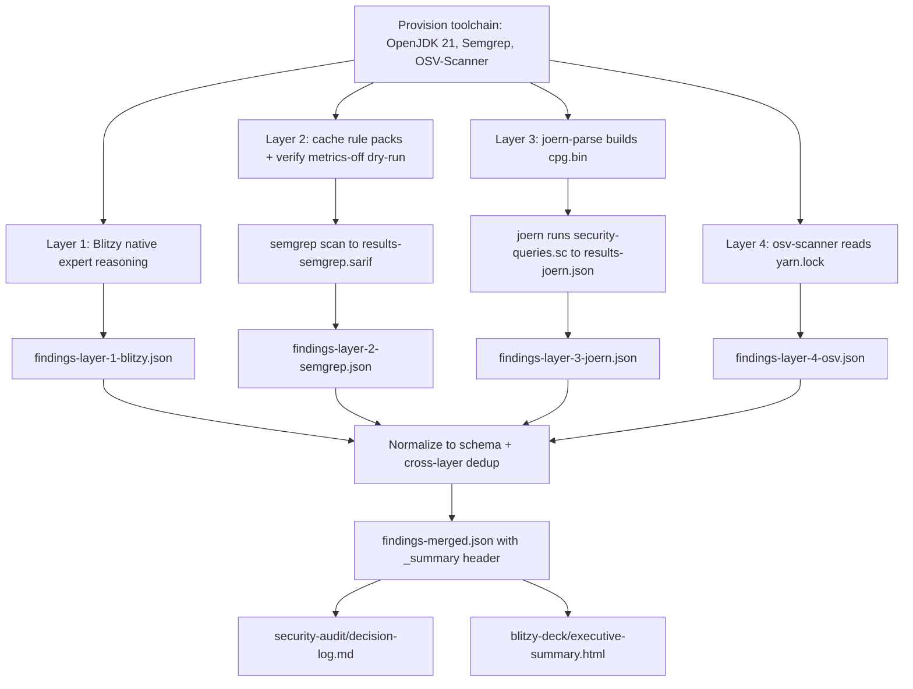

# Technical Specification

# 0. Agent Action Plan

## 0.1 Intent Clarification

Based on the provided requirements, the Blitzy platform understands that the objective is to perform a **non-invasive, four-layer security assessment** of the `blitzy-cal` codebase (the `calcom-monorepo` Cal.com parity fork) and to emit normalized, machine-readable findings — **without modifying any application source code**. The task is a measurement/audit exercise: it reads the entire codebase across four complementary scanning techniques and produces isolated, net-new artifact files that quantify the project's security posture.

### 0.1.1 Core Objective

The platform understands that the work decomposes into four **complementary** scanning layers (different vulnerability classes by design, not redundant passes) whose outputs are normalized to a common schema and then merged into a single cross-layer report.

| Layer | Tool | Detection Method | Primary Vulnerability Classes | Output Artifact |
|-------|------|------------------|-------------------------------|-----------------|
| 1 | Blitzy native expert audit | Context-aware reasoning over code + config + architecture | Fail-open logic, protocol abuse, composite multi-step attack chains, configuration defaults, business-logic flaws, cross-file key/secret reuse | `findings-layer-1-blitzy.json` |
| 2 | Semgrep | AST pattern matching with curated rule packs | CI/CD injection, committed secrets, container misconfiguration, crypto anti-patterns, template XSS, insecure transport | `findings-layer-2-semgrep.json` |
| 3 | Joern (Apache 2.0) | Code Property Graph (AST + CFG + PDG) + JQL dataflow/taint queries | Multi-step taint propagation (source → sink across 4+ functions), SQL injection via ORM, deserialization chains, authorization bypass | `findings-layer-3-joern.json` |
| 4 | OSV-Scanner | Lockfile/SBOM matching against the OSV database | Known CVEs in declared dependencies | `findings-layer-4-osv.json` |

The explicit requirements, restated with enhanced clarity and mapped to the eight directives in the prompt, are:

- **R1 (Directive 1 — Layer 1):** Execute the Blitzy native security audit using expert reasoning, classifying every finding by its **most specific CWE**, and emit `findings-layer-1-blitzy.json`.
- **R2 (Directive 2 — Install Semgrep):** Install Semgrep (pip or apt), download the `p/security-audit`, `p/secrets`, and `p/owasp` rule packs to a **local** directory, and confirm telemetry suppression. Pass/fail gate (preserved verbatim): `semgrep scan --metrics=off --config=/path/to/local-rules --dry-run` exits `0` with no network calls.
- **R3 (Directive 3 — Run Semgrep):** Execute `semgrep scan --config=/path/to/local-rules --sarif -o results-semgrep.sarif --metrics=off /path/to/blitzy-cal`; record exit code, wall-clock duration, and files scanned; apply the severity map `error→critical, warning→high, note→medium, info→low`; derive CWE from rule metadata (infer if absent); emit `findings-layer-2-semgrep.json`.
- **R4 (Directive 4 — Install Joern):** Install Joern and build the Code Property Graph: `joern-parse /path/to/blitzy-cal --output cpg.bin`. Pass/fail gate: `joern-parse` exits `0` and `cpg.bin` is produced with **> 0** source files indexed.
- **R5 (Directive 5 — Run Joern):** Execute `joern --script /path/to/security-queries.sc --params cpgFile=cpg.bin --out results-joern.json` using JQL queries (preserved verbatim): `sink.reachableByFlows(source)`; `cpg.call.name("exec.*|eval|spawn")`; `cpg.method.filter(_.annotation.name(".*Route.*")).parameter`. Apply the severity map `high→critical, medium→high, low→medium, info→low`; emit `findings-layer-3-joern.json`.
- **R6 (Directive 6 — Run OSV-Scanner):** Execute `osv-scanner --lockfile=... --format json > results-osv.json` against **all** lockfiles; record total CVEs, packages affected, and severity distribution; emit `findings-layer-4-osv.json`.
- **R7 (Directive 7 — Normalize):** Normalize every layer to the fixed single-line minified JSON schema `[{"file","line","severity","cwe","description"(max 200 chars),"layer"(1-4),"tool"},...]`; deduplicate across layers by `file + line + CWE` (keep higher severity, annotate `corroborated_by`); deduplicate OSV by `(package_name, CVE_ID)`. Pass/fail gate (preserved verbatim): `cat findings-layer-*.json | wc -l` returns `4`.
- **R8 (Directive 8 — Merged report):** Emit `findings-merged.json` (single line) with a `_summary` header object containing `total_findings`, `unique_findings`, `corroborated`, `by_layer`, and `by_severity`, and highlight corroboration pairs (Layer 1 ∩ Layer 2/3 on the same pattern = highest confidence).

**Implicit requirements and hidden dependencies surfaced during analysis:**

- **Toolchain prerequisites:** Joern requires a JVM and Java is **not installed** in the environment, so a JDK must be installed first; OSV-Scanner is a Go binary and Go is **not installed**, so the prebuilt release binary is required; Semgrep requires Python, which is present (`Python 3.12.3`).
- **Offline / hermetic operation:** `--metrics=off` plus a local rule-pack directory imply downloading the packs once and then scanning with no telemetry; OSV-Scanner requires OSV-database access (network, or an offline downloaded database) — a connectivity consideration to document.
- **Language coverage realism:** the codebase is **100% TypeScript/JavaScript**, so Joern uses its JS/TS frontend, Semgrep applies TS/JS + YAML (CI) + Dockerfile rules, and OSV scans the npm ecosystem only (a single `yarn.lock` in Yarn Berry v8 format) [yarn.lock:__metadata.version].
- **Output determinism:** single-line minified JSON (no pretty-printing), description truncation to ≤ 200 characters, a stable severity mapping, and deterministic dedup keys.
- **Read-only guarantee:** zero modification of `blitzy-cal` source or configuration; every output is a net-new artifact; the existing `.github/workflows/security-audit.yml` is **not** edited [.github/workflows/security-audit.yml].
- **Intermediate artifacts implied by the directives:** `results-semgrep.sarif`, `cpg.bin`, `results-joern.json`, `results-osv.json`, the `security-queries.sc` JQL script, and the local Semgrep rules directory.

### 0.1.2 Task Categorization

- **Primary task type:** Security enhancement (security audit/measurement) with a strong Tooling dimension (installing and running scanners).
- **Secondary aspects:** Build/Deploy analysis (inspecting `Dockerfile`, `docker-compose*.yml`, and 59 CI workflows for misconfiguration and injection); Documentation (a decision log and an executive presentation mandated by the user-specified rules).
- **Scope classification:** Cross-cutting **analysis** (every file is a potential scan input) but **isolated** net-new **output** (no existing source or configuration is mutated). The net effect on the existing codebase is non-invasive — consistent with the prompt's `~0 files modified` banner.

### 0.1.3 Special Instructions and Constraints

- **CRITICAL — Read-only measurement:** the prompt's metadata banner states `~0 files modified`. The platform interprets this as a directive to **measure, not remediate** — the audit must not patch vulnerabilities or alter any application source/config. The only writes are net-new artifact files.
- **Local rule packs + telemetry off:** Semgrep must run with `--metrics=off` against a locally cached rule directory; the dry-run gate must exit `0` with no network calls.
- **Deterministic output contract:** all findings normalized to the exact schema, single-line minified, descriptions ≤ 200 characters.
- **Severity mapping (preserved verbatim):** Semgrep `error→critical, warning→high, note→medium, info→low`; Joern `high→critical, medium→high, low→medium, info→low`.
- **Deduplication rules (preserved verbatim):** cross-layer dedup by `file+line+CWE` keeping the higher severity and annotating `corroborated_by`; OSV dedup by `(package_name, CVE_ID)`.
- **User-specified rules (mandatory deliverables, additive to the eight directives):**
  - *Explainability* — every non-trivial decision must be captured in a Markdown **decision log** (what was decided, alternatives, rationale, risks); rationale must not be embedded in code comments.
  - *Executive Presentation* — a single self-contained **reveal.js HTML deck** (12–18 slides, target 16) using the Blitzy brand, pinned CDN versions (reveal.js 5.1.0, Mermaid 11.4.0, Lucide 0.460.0), and an inline theme.

### 0.1.4 Technical Interpretation

These requirements translate to the following technical implementation strategy:

- To **establish the toolchain**, we will provision OpenJDK 21 (Joern's JVM prerequisite), Semgrep (via pip into an isolated environment), and the OSV-Scanner prebuilt binary, because the environment ships Python 3.12.3 but neither Java nor Go.
- To **produce Layer 1**, we will reason over the code, configuration, and architecture to identify logic/configuration/key-reuse classes that pattern and dependency scanners structurally cannot see, and write each finding (CWE-classified) into `findings-layer-1-blitzy.json`.
- To **produce Layer 2**, we will cache the three rule packs locally, validate `--metrics=off` via the dry-run gate, scan the repository to `results-semgrep.sarif`, and transform the SARIF into `findings-layer-2-semgrep.json` using the specified severity map.
- To **produce Layer 3**, we will build `cpg.bin` with `joern-parse`, author `security-queries.sc` (taint reachability, command-execution sinks, route-parameter taint, ORM raw-SQL, authorization bypass), run it to `results-joern.json`, and transform into `findings-layer-3-joern.json`.
- To **produce Layer 4**, we will run OSV-Scanner against the single `yarn.lock`, capture `results-osv.json`, and transform into `findings-layer-4-osv.json`.
- To **deliver the cross-layer view**, we will normalize and deduplicate all four layers and emit `findings-merged.json` with the `_summary` header and corroboration annotations.
- To **satisfy the user rules**, we will additionally create a Markdown decision log and a self-contained reveal.js executive-summary deck.

## 0.2 Repository Scope Discovery

A repository-wide discovery pass established the exact scan-target surfaces for each layer. The repository root is the `calcom-monorepo` (a Cal.com parity fork): a Yarn Berry + Turborepo monorepo with `packageManager: "yarn@4.12.0"` and root engines `npm >=7.0.0, yarn >=4.12.0` [package.json:engines]. The codebase is **100% TypeScript/JavaScript** (~7,433 `.ts/.tsx/.js/.jsx` source files, excluding `node_modules`/`.git`) spread across 110 workspace manifests; there are **no** `.py`, `.go`, `.rb`, or `.java` source files.

### 0.2.1 Comprehensive File Analysis

The discovery confirmed that every scan input is a **read-only REFERENCE**; the audit creates no modifications to these files. Inputs are grouped by the layer that consumes them.

**Layer 4 (OSV-Scanner) — dependency lockfiles:**

- `yarn.lock` — the **sole** lockfile in the repository (Yarn Berry format: `__metadata` version 8, 1.43 MB) [yarn.lock:__metadata.version]. No `package-lock.json`, `pnpm-lock.yaml`, `go.mod`, `requirements.txt`, `Gemfile.lock`, `Cargo.lock`, `poetry.lock`, or `composer.lock` exists anywhere — so OSV scans the npm ecosystem exclusively via this one file.

**Layer 2 (Semgrep) — patterns over source, IaC, CI, and secrets:**

- **Container files (7):** `Dockerfile` [Dockerfile:L1], `docker-compose.yml`, `apps/api/v2/Dockerfile`, `packages/prisma/docker-compose.yml`, `packages/emails/docker-compose.yml`, `apps/api/v1/test/docker-compose.yml`, `apps/web/test/docker-compose.yml` — container misconfiguration rules.
- **CI/CD surface:** 59 workflow files under `.github/workflows/` plus 9 composite actions under `.github/actions/` (`cache-build`, `cache-build-key`, `cache-checkout`, `cache-db`, `cache-db-key`, `devin-session`, `docker-build-and-test`, `yarn-install`, `yarn-playwright-install`) — CI/CD injection rules (`pull_request_target`, script injection, token scope).
- **Secrets/config templates:** `.env.example` (21 KB) and `.env.appStore.example` — committed-secret pattern rules.
- **Application source:** `apps/web`, `apps/api/v1`, `apps/api/v2`, and the 20 `packages/*` workspaces — TS/JS rule packs.

**Layer 3 (Joern) — Code Property Graph over JS/TS, taint queries against high-value sinks:**

- The CPG spans `apps/**` and `packages/**` (~7,433 files) via Joern's JS/TS (`jssrc2cpg`) frontend.
- **Command-execution sink candidates (20 files):** files referencing `child_process`/`exec`/`spawn`/`eval`/`new Function` — targets for `cpg.call.name("exec.*|eval|spawn")`.
- **ORM raw-SQL candidates (28 files):** files using Prisma `$queryRaw`/`$executeRaw`/`queryRawUnsafe`/`executeRawUnsafe` — targets for SQL-injection-via-ORM taint flows. ORM schema: `packages/prisma/schema.prisma` [packages/prisma/schema.prisma].
- **Authorization-bypass candidates:** the NestJS guard layer under `apps/api/v2/src/modules/auth/guards/` and route-annotated parameters — targets for route-parameter taint.

**Layer 1 (Blitzy native) — logic/config/key-reuse classes that scanners miss.** Discovery surfaced concrete candidate patterns (illustrative targets for expert reasoning, **not** pre-judged findings):

- Fail-open authorization: `getBlockedUsersMap` returns users as unblocked when the watchlist service errors [packages/features/watchlist/operations/check-user-blocking.ts] (CWE-636 class).
- Cross-file key reuse: `CALENDSO_ENCRYPTION_KEY` reused as an AES-256 key, a TOTP/JWT secret, and an HMAC-SHA1 secret [apps/web/app/api/sync/helpscout/route.ts].
- Weak algorithm: HMAC-SHA1 signature verification [apps/api/v2/src/vercel-webhook.guard.ts].
- Verification skip: Turnstile verification bypassed when the secret is unset or in E2E mode [packages/lib/server/checkCfTurnstileToken.ts].
- Content-Security-Policy weakness: production `script-src` includes `'unsafe-inline'` [apps/web/lib/csp.ts].
- Dual crypto stacks: legacy AES-256-CBC [packages/lib/crypto.ts] alongside a modern AES-256-GCM keyring with key-id rotation [packages/lib/crypto/keyring.ts].

### 0.2.2 Web Search Research Conducted

Research validated tool capabilities and current install paths for the execution environment (Node 22.x, Python 3.12.3, no Java, no Go):

- **Semgrep best practices and rule packs:** Confirmed Semgrep installs via pip/pipx (Python ≥ 3.8) and supports stacking multiple rulesets with repeated `--config` flags. <cite index="9-18">You can stack multiple rulesets in a single scan by passing multiple --config flags: semgrep --config p/default --config p/security-audit --config p/python</cite>. The prompt's three packs map to curated registry sets: `p/security-audit` is a broad security set, and <cite index="2-31">p/owasp-top-ten maps rules to the OWASP Top 10 vulnerability categories - injection, broken authentication, sensitive data exposure, and so on</cite>. Semgrep supports TS/JS plus IaC packs for Docker, matching the container/CI surface.
- **Joern installation and JDK requirement:** Confirmed Joern is JVM-based and the current line is 2.x. <cite index="12-1,12-17">JDK 21 (other versions might work, but have not been properly tested)</cite> is the documented prerequisite, and pre-built binaries install via `joern-install.sh` from the GitHub releases page. Joern's JavaScript frontend covers the TS/JS codebase. The decision is therefore to install **OpenJDK 21** before Joern.
- **OSV-Scanner support and offline mode:** Confirmed OSV-Scanner V2 supports the npm/yarn ecosystem and is distributed as a prebuilt binary. <cite index="21-1,21-2">The recommended method is to download a prebuilt binary for your platform. Alternatively, you can use go install github.com/google/osv-scanner/v2/cmd/osv-scanner@latest to build it from source.</cite> Because Go is absent, the prebuilt binary is the chosen path. For hermetic runs, <cite index="21-16,21-17">Scan your project against a local OSV database. No network connection is required after the initial database download.</cite> The tool transmits only metadata: <cite index="21-37,21-38">Data sent includes package names, versions, and ecosystems. No source code is transmitted.</cite>

### 0.2.3 Existing Infrastructure Assessment

- **Current project structure:** Yarn Berry 4.12.0 + Turborepo monorepo; deployable surfaces are `apps/web` (Next.js), `apps/api` (proxy), `apps/api/v1` (Next.js, deprecated), and `apps/api/v2` (NestJS); 20 shared `packages/*` (including `features`, `app-store`, `lib`, `prisma`, `platform`, `trpc`, `ui`, `ee`).
- **Existing security tooling (baseline — left unchanged):** `.github/workflows/security-audit.yml` is a reusable `workflow_call` job that runs `yarn npm audit --all --recursive` (report) plus a `--severity critical` gate [.github/workflows/security-audit.yml]. This is a yarn-native SCA check that **OSV-Scanner complements** by querying the broader OSV database; the four-layer task produces standalone findings and does **not** modify this workflow.
- **Disclosure policy:** `SECURITY.md` defines the disclosure process and an out-of-scope vulnerability-class list, and `.well-known/security.txt` is present [SECURITY.md]. The SAST/SCA audit focuses on first-party code, configuration, and dependency vulnerabilities.
- **No pre-existing scanner configs:** no Semgrep (`.semgrep*`), CodeQL, Snyk, Joern, or OSV configuration files are present, so all scanner configuration is introduced as net-new artifacts in an isolated output directory.
- **Conventions to follow:** existing Blitzy deliverables already live under `blitzy/` and `blitzy-docs/` directories, establishing the convention of placing generated artifacts under a dedicated top-level directory rather than intermixing them with source.

## 0.3 Scope Boundaries

The audit is a non-invasive measurement: it **reads** the entire repository and **writes** only net-new artifacts. The boundaries below distinguish what is produced (in scope) from what is deliberately excluded (out of scope).

### 0.3.1 Exhaustively In Scope

**Net-new audit outputs (CREATE) — colocated under a dedicated output directory `security-audit/`:**

- `security-audit/findings-layer-1-blitzy.json` — Layer 1 normalized findings.
- `security-audit/findings-layer-2-semgrep.json` — Layer 2 normalized findings.
- `security-audit/findings-layer-3-joern.json` — Layer 3 normalized findings.
- `security-audit/findings-layer-4-osv.json` — Layer 4 normalized findings.
- `security-audit/findings-merged.json` — cross-layer merged report with the `_summary` header.

**Net-new intermediate artifacts (CREATE):**

- `security-audit/results-semgrep.sarif` — raw Semgrep SARIF output.
- `security-audit/cpg.bin` — Joern Code Property Graph binary.
- `security-audit/results-joern.json` — raw Joern query output.
- `security-audit/results-osv.json` — raw OSV-Scanner JSON output.
- `security-audit/security-queries.sc` — the Joern JQL/Scala query script (the only net-new "code"-like artifact).
- `security-audit/semgrep-rules/**` — local cache of the `p/security-audit`, `p/secrets`, and `p/owasp` rule packs.
- `security-audit/.semgrepignore` — scan-exclusion list for vendored/build paths (`node_modules`, `.yarn`, `.next`, `dist`).

**Net-new rule-mandated deliverables (CREATE):**

- `security-audit/decision-log.md` — the Explainability decision log (Markdown table).
- `blitzy-deck/executive-summary.html` — the Executive Presentation reveal.js deck (self-contained, theme embedded inline).

**Read-only scan inputs (REFERENCE — read, never modified):**

- `yarn.lock` (Layer 4).
- `apps/**` and `packages/**` TypeScript/JavaScript source (Layers 2 and 3).
- 7 container files (`Dockerfile`, `docker-compose*.yml`, `apps/api/v2/Dockerfile`) (Layer 2).
- `.github/workflows/**` (59 files) and `.github/actions/**` (9 composite actions) (Layer 2).
- `.env.example`, `.env.appStore.example` (Layer 2 secrets).
- `packages/prisma/schema.prisma` (Layer 3 ORM context).

### 0.3.2 Explicitly Out of Scope

- **Vulnerability remediation / patching.** The audit measures and reports; it does **not** fix any finding. This honors the `~0 files modified` constraint.
- **Modification of any existing source, configuration, schema, or test file** in `apps/**`, `packages/**`, `.github/**`, `Dockerfile`, or `*.env*`.
- **Edits to the existing `.github/workflows/security-audit.yml` or `SECURITY.md`** — both are left intact [.github/workflows/security-audit.yml] [SECURITY.md].
- **CI/CD pipeline integration.** The four-layer scan is executed out-of-band; no new workflow is wired into the pipeline (none was requested).
- **Project dependency changes.** No additions, upgrades, or removals in `package.json` or `yarn.lock`; the audit installs scanners into the execution environment only, not into the repository manifests.
- **Triage beyond the directive-specified normalization and deduplication.** No manual false-positive suppression is performed beyond the schema/dedup rules; no severity is reinterpreted outside the specified maps.
- **Scope expansion to additional scanners or languages** not named in the prompt (e.g., CodeQL, Snyk), and no scanning of non-existent ecosystems (no Python/Go/Java/Ruby sources exist).
- **Production-system scanning.** Consistent with `SECURITY.md`, the audit targets the local source tree, not live infrastructure.

## 0.4 Dependency Inventory

This audit introduces **no changes to the project's dependency surface**. The only software added is the scanning toolchain, which is installed into the execution environment and is **not** registered in `package.json` or `yarn.lock`.

### 0.4.1 Audit Toolchain

The scanners and their runtime prerequisites are listed below. Exact patch versions are intentionally pinned-at-install and recorded in the decision log, because these are external scanning tools (not project dependencies) whose releases change frequently; inventing fixed patch numbers here would be inaccurate.

| Registry / Source | Tool | Version | Purpose |
|-------------------|------|---------|---------|
| PyPI (pip/pipx) | `semgrep` | Latest stable Semgrep CE (pinned + recorded at install) | Layer 2 pattern SAST (rule packs `p/security-audit`, `p/secrets`, `p/owasp`) |
| GitHub Releases (`joernio/joern`) | `joern` / `joern-parse` | Latest 2.x (Apache 2.0) | Layer 3 semantic/dataflow SAST (CPG + JQL) |
| Adoptium / OpenJDK | `openjdk` | JDK 21 | JVM prerequisite for Joern |
| GitHub Releases (`google/osv-scanner`) | `osv-scanner` | Latest V2.x (Apache 2.0, prebuilt SLSA3 binary) | Layer 4 dependency SCA against OSV.dev |
| Present in environment | `python` | 3.12.3 | Semgrep runtime (no install required) |

Reveal.js deck runtime dependencies (mandated by the Executive Presentation rule) are loaded at view time from pinned CDNs and are **not** installed locally:

| Source | Library | Version | Purpose |
|--------|---------|---------|---------|
| CDN | `reveal.js` | 5.1.0 | Slide framework for the executive deck |
| CDN | `mermaid` | 11.4.0 | Architecture/data-flow diagrams in the deck |
| CDN | `lucide` | 0.460.0 | SVG icons (no emoji per rule) |
| Google Fonts | Inter / Space Grotesk / Fira Code | n/a | Brand typography |

### 0.4.2 Project Dependency Changes

- **New dependencies to add:** None. The audit does not add any npm package to the project.
- **Dependencies to update:** None.
- **Dependencies to remove:** None.
- **Import / reference updates:** None. Because no source file is modified, there are no import statements to rewrite and no configuration references to update.

The project's own technology stack (Node 20.x runtime targeted by CI/Docker [Dockerfile:L1], TypeScript, Next.js, NestJS, Prisma, etc.) is documented in Sections 3.x of this specification and is unaffected by the audit. OSV-Scanner will, however, **report** any known CVEs found in the dependencies declared in `yarn.lock`; resolving those CVEs is explicitly out of scope (see Section 0.3.2).

## 0.5 Implementation Design

### 0.5.1 Technical Approach

The audit follows a logical (not time-boxed) flow: establish the toolchain, run the four layers independently against their read-only inputs, normalize and deduplicate, merge, and finally produce the rule-mandated documentation artifacts.

- **First, establish the toolchain** by provisioning OpenJDK 21 (Joern's JVM prerequisite), Semgrep into an isolated Python environment, and the OSV-Scanner prebuilt binary — chosen because the environment provides Python 3.12.3 but neither Java nor Go.
- **Next, run Layer 1 (Blitzy native)** by reasoning over code, configuration, and architecture to capture logic, configuration-default, and key-reuse classes that automated scanners structurally miss, writing each CWE-classified finding to `findings-layer-1-blitzy.json`.
- **Next, run Layer 2 (Semgrep)** by caching the three rule packs locally, validating telemetry suppression with the dry-run gate, scanning the repository to `results-semgrep.sarif`, then transforming SARIF into `findings-layer-2-semgrep.json` using the `error→critical, warning→high, note→medium, info→low` map.
- **Next, run Layer 3 (Joern)** by building `cpg.bin` with `joern-parse`, authoring `security-queries.sc`, executing it to `results-joern.json`, then transforming into `findings-layer-3-joern.json` using the `high→critical, medium→high, low→medium, info→low` map.
- **Next, run Layer 4 (OSV-Scanner)** by scanning the single `yarn.lock` to `results-osv.json`, then transforming into `findings-layer-4-osv.json`.
- **Then, normalize and deduplicate** all four layers to the fixed schema and emit `findings-merged.json` with the `_summary` header and corroboration annotations.
- **Finally, ensure explainability and communication** by writing `decision-log.md` and the self-contained `blitzy-deck/executive-summary.html` deck.

### 0.5.2 Component Impact Analysis

- **Direct modifications required:** None to existing components. The audit is read-only; no application file is changed.
- **New components introduced:**
  - The `security-audit/` output directory holding all findings, intermediates, and the decision log.
  - The `security-queries.sc` JQL/Scala script — the sole net-new "code"-like artifact, executed only inside the Joern shell and never linked into the running application.
  - The `blitzy-deck/` directory holding the executive-summary deck.
  - The `security-audit/semgrep-rules/` local rule cache.
- **Indirect impacts and dependencies:** None. Because no interface, schema, or behavior changes, there are no downstream components requiring test updates, configuration sync, or import rewrites. The audit consumes (reads) `apps/**`, `packages/**`, `.github/workflows/**`, `.github/actions/**`, `yarn.lock`, the 7 container files, `.env.example`/`.env.appStore.example`, and `packages/prisma/schema.prisma`.

### 0.5.3 Critical Implementation Details

- **Normalized schema:** every finding conforms to `{"file","line","severity","cwe","description","layer","tool"}`, with `description` truncated to ≤ 200 characters and each output file written as a single minified line (no pretty-printing) for deterministic, diffable artifacts.
- **Severity mapping:** applied verbatim per layer (Semgrep `error/warning/note/info`; Joern `high/medium/low/info`); raw tool-native severities are preserved in the intermediate artifacts (`results-*.sarif`/`results-*.json`) so no information is lost.
- **CWE classification:** Layer 1 assigns the most specific CWE by expert judgment; Layer 2 reads CWE from Semgrep rule metadata and infers when absent; Layer 3 maps query intent to its canonical CWE (e.g., command sinks → CWE-78, ORM raw SQL → CWE-89, route-parameter taint → CWE-20/CWE-862); Layer 4 carries the CVE/CWE supplied by the OSV record.
- **Deduplication and corroboration:** cross-layer findings are keyed on `file + line + CWE`; on collision the higher severity is retained and the lower-severity layer is recorded under `corroborated_by`. OSV findings are keyed on `(package_name, CVE_ID)`. Corroboration pairs that span Layer 1 ∩ Layer 2/3 are flagged as highest confidence in the merged report.
- **Joern query design (`security-queries.sc`):** combines taint reachability (`sink.reachableByFlows(source)`), command-execution sinks (`cpg.call.name("exec.*|eval|spawn")`) against the 20 candidate sink files, route-parameter taint over the NestJS/Next.js handlers, ORM raw-SQL flows over the 28 `$queryRaw`/`executeRawUnsafe` candidate files, and authorization-bypass checks over the guard layer.
- **Determinism and offline operation:** Semgrep runs with `--metrics=off` against the local rule cache (no telemetry); OSV-Scanner uses the prebuilt binary and may run against a downloaded offline database when network egress is restricted.
- **Edge cases and error handling:** Joern CPG construction is memory-intensive on a ~7,433-file monorepo, so the parse step is given an adequate JVM heap (`-J-Xmx`) and excludes vendored paths; an empty result set from any layer still produces a valid (empty-array) findings file so the `wc -l == 4` gate holds; OSV network failures fall back to the offline database; and the `.semgrepignore` excludes `node_modules`/`.yarn`/build output to avoid scanning vendored dependencies.

### 0.5.4 Decision Log (Explainability Rule)

Per the Explainability rule, every non-trivial decision is captured below; the full delivery decision log (`security-audit/decision-log.md`) expands these with execution-time specifics (pinned versions, timings, counts).

| Decision | Alternatives Considered | Rationale | Risk / Mitigation |
|----------|-------------------------|-----------|-------------------|
| Install OpenJDK 21 for Joern | JDK 19 (documented minimum) | Joern's main README recommends JDK 21; newer is a documented superset | Newer-JDK edge cases — mitigated by pinning 21 |
| Use the OSV-Scanner prebuilt binary | `go install` from source | Go is absent; the prebuilt binary is SLSA3 and needs no toolchain | OS/arch mismatch — mitigated by selecting the matching release asset |
| Install Semgrep via pip in an isolated env | apt, Docker image | Python 3.12.3 present; simplest path supporting `--metrics=off` | Global vs. isolated install — mitigated by using a venv |
| Colocate all outputs under `security-audit/` | Repo root; `blitzy-docs/` | The `cat findings-layer-*.json \| wc -l` gate requires colocation; isolates net-new artifacts from source | None material |
| Place the deck in `blitzy-deck/` with theme embedded inline | External theme `<link>` | Rule 2 mandates a self-contained file and cites `blitzy-deck/references/blitzy-reveal-theme.css`, which is absent in the repo | Theme drift — mitigated by embedding the full `:root` token set inline |
| Use Joern's JS/TS (`jssrc2cpg`) frontend | C/Java/other frontends | Codebase is 100% TypeScript/JavaScript | TS type-recovery limits — accepted; complemented by Layers 1/2 |
| Apply directive-specified severity and dedup keys verbatim | Custom/hash-based mapping | The directives fix the maps and keys; deviating would break determinism | Line drift across tools — mitigated by retaining raw intermediates |
| Read-only measurement (no remediation) | Auto-fix discovered issues | Prompt states `~0 files modified`; the task is assessment, not repair | Findings not auto-resolved — by design; out of scope |
| Preserve `security-audit.yml` and `SECURITY.md` unchanged | Extend the existing workflow | The four layers are standalone outputs; modifying CI was not requested | Duplication with `yarn npm audit` — accepted; OSV adds OSV.dev coverage |

## 0.6 File Transformation Mapping

### 0.6.1 File-by-File Execution Plan

Every file the audit touches is enumerated below with the target listed first. There are **no UPDATE and no DELETE** rows: the audit creates net-new artifacts and reads (REFERENCE) the existing tree. Transformation modes: **CREATE** (new file), **REFERENCE** (read-only scan input or external reference).

| Target File | Transformation | Source File / Reference | Purpose / Changes |
|-------------|----------------|-------------------------|-------------------|
| `security-audit/findings-layer-1-blitzy.json` | CREATE | `apps/**`, `packages/**`, config (REFERENCE) | Layer 1 normalized findings from native expert reasoning; CWE-classified; single-line minified |
| `security-audit/findings-layer-2-semgrep.json` | CREATE | `security-audit/results-semgrep.sarif` | Layer 2 normalized findings; severity map `error/warning/note/info`; single-line minified |
| `security-audit/findings-layer-3-joern.json` | CREATE | `security-audit/results-joern.json` | Layer 3 normalized findings; severity map `high/medium/low/info`; single-line minified |
| `security-audit/findings-layer-4-osv.json` | CREATE | `security-audit/results-osv.json` | Layer 4 normalized findings; dedup by `(package_name, CVE_ID)`; single-line minified |
| `security-audit/findings-merged.json` | CREATE | `security-audit/findings-layer-*.json` | Cross-layer merged report with `_summary` header + corroboration annotations; single line |
| `security-audit/results-semgrep.sarif` | CREATE | `apps/**`, `packages/**`, `.github/**`, `*.env*`, container files (REFERENCE) | Raw Semgrep SARIF (intermediate); produced by the `semgrep scan` directive |
| `security-audit/cpg.bin` | CREATE | `apps/**`, `packages/**` (REFERENCE) | Joern Code Property Graph (intermediate); produced by `joern-parse` |
| `security-audit/results-joern.json` | CREATE | `security-audit/cpg.bin` + `security-audit/security-queries.sc` | Raw Joern query output (intermediate) |
| `security-audit/results-osv.json` | CREATE | `yarn.lock` (REFERENCE) | Raw OSV-Scanner JSON (intermediate) |
| `security-audit/security-queries.sc` | CREATE | — (net-new JQL/Scala) | Joern taint/sink/route/ORM/authz query script |
| `security-audit/semgrep-rules/**` | CREATE | Semgrep Registry (`p/security-audit`, `p/secrets`, `p/owasp`) | Local rule-pack cache enabling `--metrics=off` offline scans |
| `security-audit/.semgrepignore` | CREATE | — (net-new) | Exclude `node_modules`, `.yarn`, `.next`, `dist` from the Semgrep scan |
| `security-audit/decision-log.md` | CREATE | — (net-new, Explainability rule) | Decision log: tool versions, query design, severity maps, dedup, output locations, deviations |
| `blitzy-deck/executive-summary.html` | CREATE | `blitzy-deck/references/blitzy-reveal-theme.css` (REFERENCE, absent → inlined) | Self-contained reveal.js executive deck (Executive Presentation rule) |
| `yarn.lock` | REFERENCE | self | Layer 4 dependency lockfile input (sole lockfile; Yarn Berry v8) |
| `apps/**/*.{ts,tsx,js,jsx}` | REFERENCE | self | Layers 2 & 3 application source input |
| `packages/**/*.{ts,tsx,js,jsx}` | REFERENCE | self | Layers 2 & 3 shared-package source input (20 workspaces) |
| `Dockerfile`, `docker-compose*.yml`, `apps/api/v2/Dockerfile` | REFERENCE | self | Layer 2 container-misconfiguration input (7 files) |
| `.github/workflows/**/*.yml` | REFERENCE | self | Layer 2 CI/CD-injection input (59 workflows) |
| `.github/actions/**` | REFERENCE | self | Layer 2 composite-action input (9 actions) |
| `.env.example`, `.env.appStore.example` | REFERENCE | self | Layer 2 committed-secret pattern input |
| `packages/prisma/schema.prisma` | REFERENCE | self | Layer 3 ORM context for SQL-injection-via-ORM flows |
| `.github/workflows/security-audit.yml` | REFERENCE | self | Existing yarn-native SCA baseline; read for context, **not** modified |

### 0.6.2 New Files Detail

- **`security-audit/findings-layer-{1..4}-*.json`** — content type: normalized findings data. Each is a single-line minified JSON array of `{file,line,severity,cwe,description,layer,tool}` objects. Layer 1 is authored from expert reasoning; Layers 2–4 are derived from their respective raw intermediates.
- **`security-audit/findings-merged.json`** — content type: aggregate report. A single-line JSON object whose `_summary` carries `total_findings`, `unique_findings`, `corroborated`, `by_layer`, and `by_severity`, followed by the deduplicated finding records with `corroborated_by` annotations.
- **`security-audit/security-queries.sc`** — content type: Joern JQL/Scala. Key query families: `sink.reachableByFlows(source)` taint reachability; `cpg.call.name("exec.*|eval|spawn")` command-execution sinks; route-parameter taint over request handlers; ORM raw-SQL flows; authorization-bypass checks across guards. Based on the patterns surfaced in Section 0.2.1.
- **`security-audit/results-semgrep.sarif` / `results-joern.json` / `results-osv.json` / `cpg.bin`** — content type: raw tool output (intermediates retained for traceability and re-normalization).
- **`security-audit/semgrep-rules/**`** — content type: cached YAML rule packs, enabling offline, telemetry-free scanning.
- **`security-audit/.semgrepignore`** — content type: scan-exclusion config based on the standard Semgrep ignore syntax.
- **`security-audit/decision-log.md`** — content type: documentation. A Markdown decision table (the canonical "why" per the Explainability rule), seeded by Section 0.5.4 and expanded with execution-time specifics.
- **`blitzy-deck/executive-summary.html`** — content type: presentation. A single self-contained reveal.js 5.1.0 deck (12–18 slides, target 16) with Mermaid 11.4.0 diagrams, Lucide 0.460.0 icons, the Blitzy brand palette/typography, and the theme embedded inline (the cited `blitzy-deck/references/blitzy-reveal-theme.css` does not exist in the repository, so its tokens are inlined to keep the file self-contained).

### 0.6.3 Cross-File Dependencies

- **Producer → consumer chain:** `cpg.bin` + `security-queries.sc` → `results-joern.json` → `findings-layer-3-joern.json`; `results-semgrep.sarif` → `findings-layer-2-semgrep.json`; `results-osv.json` → `findings-layer-4-osv.json`; all four `findings-layer-*.json` → `findings-merged.json`.
- **Documentation dependency:** `decision-log.md` and `executive-summary.html` both summarize `findings-merged.json` (counts, corroboration, risk narrative) and the decisions in Section 0.5.4.
- **No import/reference rewrites:** because no application file changes, there are no import updates, configuration syncs, or test fixtures to keep consistent across the repository.

## 0.7 Rules

Two user-specified rules apply to this task. Both mandate **additional net-new deliverables** that sit alongside the eight directives; neither conflicts with the read-only (`~0 files modified`) intent, because both produce new files and modify no source.

- **Rule 1 — Explainability.** Every non-trivial implementation decision must be documented with rationale, alternatives, and risk, delivered as a Markdown **decision log** (the single source of truth for "why"); rationale must **not** be embedded in code comments. Any deviation from a literal/obvious interpretation of the requirements must have an explicit decision-log entry.
  - *Compliance approach:* a compact decision log is embedded in Section 0.5.4, and the full delivery decision log is created at `security-audit/decision-log.md`, covering tool/version selection, Joern query design, severity mappings, deduplication strategy, output-directory choice, and the inline-theme decision. Because this task is an audit (not a migration/refactor), no source-to-target traceability matrix is required; the directive-to-requirement mapping (R1–R8) in Section 0.1.1 provides the equivalent coverage trace.

- **Rule 2 — Executive Presentation.** Every deliverable must include an executive summary as a **single self-contained reveal.js HTML file**, targeted at non-technical leadership, covering: what was done, why (business value), what changed architecturally (component/data-flow diagrams), risks and mitigations, and how the team onboards/continues. Constraints include 12–18 slides (target 16), four slide types (`slide-title`, `slide-divider`, default content, `slide-closing`), at least one non-text visual per slide, max 4 bullets / 40 words on content slides, zero emoji (Lucide SVG icons only), no fenced code blocks in slides, the Blitzy brand palette and typography (Inter / Space Grotesk / Fira Code), Mermaid diagrams via `<pre class="mermaid">` with `startOnLoad: false`, pinned CDNs (reveal.js 5.1.0, Mermaid 11.4.0, Lucide 0.460.0), the reveal.js config (`hash: true`, `transition: 'slide'`, `controlsTutorial: false`, `width: 1920`, `height: 1080`), and the full `:root` CSS custom-property set embedded inline.
  - *Compliance approach:* the deck is created at `blitzy-deck/executive-summary.html`. The rule references a canonical theme at `blitzy-deck/references/blitzy-reveal-theme.css`, which **does not exist** in the repository [blitzy-deck/references/blitzy-reveal-theme.css]; per the rule's own mandate to embed the full theme inline in a `<style>` tag, the `:root` tokens and slide/component classes are inlined so the file remains self-contained and verification-ready (renders all Mermaid/Lucide, 12–18 `<section>` elements, each with ≥ 1 non-text visual).

## 0.8 Special Instructions and Constraints

### 0.8.1 Special Execution Instructions

- **Measurement only, no remediation.** The audit must not patch or alter any application code; the `~0 files modified` banner governs all execution.
- **Telemetry off + local rules.** Semgrep runs with `--metrics=off` against the locally cached rule packs; the dry-run gate `semgrep scan --metrics=off --config=/path/to/local-rules --dry-run` must exit `0` with no network calls.
- **Record execution metadata.** For Semgrep, capture exit code, wall-clock duration, and files scanned; for Joern, capture query count and total alerts and confirm `cpg.bin` indexed `> 0` files; for OSV-Scanner, capture total CVEs, packages affected, and severity distribution.
- **Output contract.** All findings normalized to the fixed schema, single-line minified, descriptions ≤ 200 characters; the gate `cat findings-layer-*.json | wc -l` must return `4`.
- **Toolchain provisioning order.** Install OpenJDK 21 before Joern; use the OSV-Scanner prebuilt binary (Go absent); install Semgrep via pip into an isolated environment (Python 3.12.3 present).
- **Mandatory documentation artifacts.** Produce the decision log (Rule 1) and the executive-summary deck (Rule 2) as described in Section 0.7.

### 0.8.2 Constraints and Boundaries

- **Technical constraints:** the codebase is 100% TypeScript/JavaScript with a single `yarn.lock` (npm ecosystem) — Joern uses its JS/TS frontend, and OSV scans only the npm ecosystem; no other language frontends or ecosystems apply.
- **Process constraints:** do not modify existing source, configuration, schema, tests, the `.github/workflows/security-audit.yml` workflow, or `SECURITY.md`; do not wire the scan into CI.
- **Output constraints:** generate only the net-new artifacts enumerated in Section 0.6; do not emit pretty-printed JSON; do not exceed the 200-character description limit; the executive deck must remain a single self-contained file with pinned CDNs and an inline theme.
- **Connectivity considerations:** rule-pack download and OSV-database access require network egress on first run; where egress is restricted, use the cached rule packs and the OSV offline database. The tools transmit only dependency metadata (package name/version/ecosystem) and **no source code**.
- **Compatibility:** the audit assumes the project's documented runtime context (Node 20.x per CI/Docker [Dockerfile:L1]) but does not depend on building or running the application — it analyzes source statically and matches lockfile entries.

## 0.9 Attachments

No attachments were provided for this project.

- **Files:** none. `review_attachments` returned no PDFs or images, so there are no attached documents, screenshots, or diagrams to incorporate.
- **Figma screens:** none. No Figma frames or URLs were provided. Consequently, no Figma design analysis, design-to-system mapping, or Design System Compliance sub-section applies to this task (the work is a security audit, not a UI implementation, and no component library or design system is specified).

The only externally referenced asset cited anywhere in the inputs is the reveal.js theme path `blitzy-deck/references/blitzy-reveal-theme.css` named by the Executive Presentation rule; it is **not** an uploaded attachment and does not exist in the repository, and is handled by inlining the theme as described in Sections 0.6.2 and 0.7.

