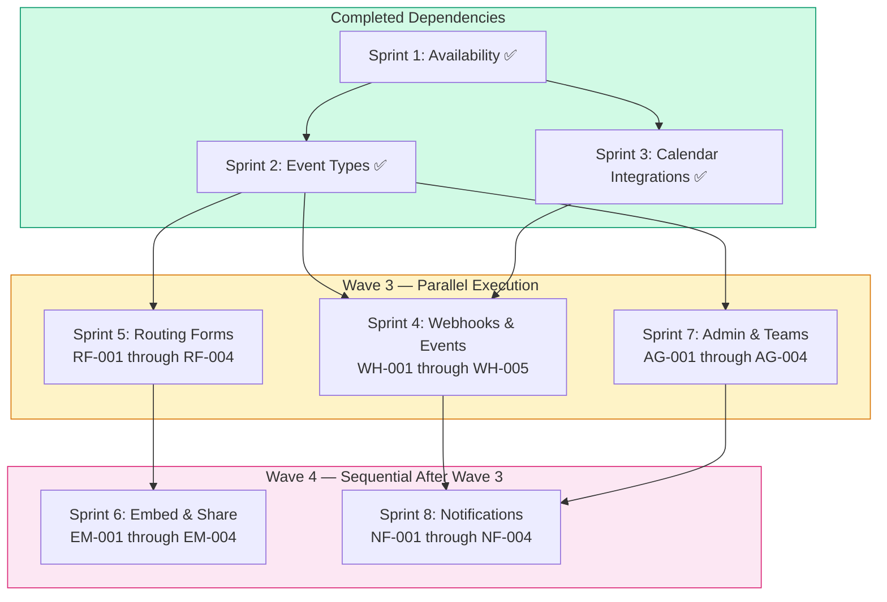

# Technical Specification

# 0. Agent Action Plan

## 0.1 Intent Clarification

### 0.1.1 Core Feature Objective

Based on the prompt, the Blitzy platform understands that the new feature requirement is to **complete five remaining Calendly parity sprints (Sprints 4–8) across two execution waves** in the Cal.com monorepo, bringing Cal.com to full feature parity with Calendly across five feature domains: Webhooks and Events, Routing Forms, Embed and Share flows, Admin and Teams governance, and Notifications and Workflows.

The feature requirements, with enhanced clarity, are:

- **Sprint 4 — Webhooks and Events (F-010, epics WH-001 through WH-005):** Align Cal.com's 20-event webhook system with Calendly's 3 webhook event semantics by implementing event mapping for `invitee.created` equivalents (WH-001), `invitee.canceled` equivalents (WH-002), `routing_form_submission.created` parity (WH-003), payload structure alignment with Calendly expectations (WH-004), and a webhook versioning strategy for gap closure additions using the existing `PayloadBuilderFactory` architecture (WH-005). All changes must preserve the existing `v2021-10-20` payload format without breaking changes.

- **Sprint 5 — Routing Forms (F-015, epics RF-001 through RF-004):** Achieve behavioral parity for routing form builder (RF-001), conditional routing logic alignment using the existing RAQB `jsonLogic` engine (RF-002), form field type parity with Calendly's question types (RF-003), and routing form API v2 endpoint parity through the existing NestJS `RoutingFormsController` (RF-004).

- **Sprint 6 — Embed and Share (F-008, epics EM-001 through EM-004):** Close embed parity gaps across inline embed behavioral parity (EM-001) via the `cal-inline` custom element, modal/popup embed parity (EM-002) via the `cal-modal-box` custom element, floating button embed parity (EM-003) via the `cal-floating-button` custom element, and share flow and link generation parity (EM-004) across the three-package embed suite (`embed-core`, `embed-react`, `embed-snippet`).

- **Sprint 7 — Admin and Teams (F-009, epics AG-001 through AG-004):** Achieve admin role model parity with Calendly's admin/owner/user structure (AG-001) by aligning Cal.com's PBAC model, team event routing behavioral parity with round-robin and collective scheduling (AG-002), managed event type push behavior parity (AG-003) for admin-templated event types via `SchedulingType.MANAGED`, and member invitation workflow parity (AG-004) through the existing `packages/features/membership/` system.

- **Sprint 8 — Notifications and Workflows (F-011, epics NF-001 through NF-004):** Implement email notification template parity with Calendly confirmations and reminders (NF-001), SMS/WhatsApp reminder parity via Twilio (NF-002), workflow automation trigger and action parity through the existing `packages/features/ee/workflows/` engine (NF-003), and in-app notification and activity feed parity (NF-004).

**Implicit requirements detected:**

- Design specs must be created in `specs/{domain}/` before any implementation, following the spec-first workflow documented in `specs/README.md`
- Every PR must be reviewable under 10 minutes — max 5–7 files changed (excluding tests), max 500 lines per PR, one focused change per PR
- Wave 3 gate (Sprints 4, 5, 7) must fully pass before Wave 4 sprints (6, 8) can begin
- All 5 validation dimensions must pass at each gate: behavioral testing, regression testing, data preservation, webhook compatibility, and cross-domain integration testing
- All referenced source-of-truth documents must be read in full before writing any code, including any documents they reference transitively

### 0.1.2 Special Instructions and Constraints

**Critical Directives:**

- **Read-all-docs-first mandate:** All documents listed under the Source of Truth section must be read in full — sprint roadmap (`docs/sprint-roadmap/overview.mdx`, `epic-catalog.mdx`, `validation-criteria.mdx`), gap reports (`docs/gap-report/webhooks-events.mdx`, `routing-forms.mdx`, `embed-share.mdx`, `admin-teams.mdx`, `notifications-workflows.mdx`, `overview.mdx`), migration safety (`docs/migration/zero-downtime-strategy.mdx`, `data-preservation.mdx`, `webhook-compatibility.mdx`), and the spec workflow (`specs/README.md`). If any referenced document cites additional documents, those must also be read before implementation.

- **Spec-first workflow:** Create a design spec in `specs/{domain}/` before implementing any code, following the template structure: `design.md`, `implementation.md`, `decisions.md`, `prompts.md`, `future-work.md`, `CLAUDE.md`, and `docs/README.md`. Use `cp -r specs/_templates specs/{feature-name}` to bootstrap each spec folder.

- **No schema migrations:** Only additive-only database changes per `docs/migration/zero-downtime-strategy.mdx`. No destructive schema changes, no column removals, no type changes to existing columns. All changes must be backward-compatible with the existing Prisma schema at `packages/prisma/schema.prisma`.

- **No breaking changes to existing webhook payloads:** The `v2021-10-20` payload structure must be preserved exactly. No field removals, renames, or type changes. New fields may be added (additive changes). New webhook trigger events require adding to the `WebhookTriggerEvents` Prisma enum and `TRIGGER_TO_BUILDER_CATEGORY` mapping.

- **Wave 3 gate must pass before Wave 4:** Sprints 4, 5, and 7 (Wave 3) execute in parallel, but all must pass their validation gates — zero regression test failures, zero data loss, unchanged `v2021-10-20` payloads, and cross-domain integration pass — before Sprint 6 and Sprint 8 (Wave 4) can begin.

**Architectural requirements:**

- Follow existing Cal.com patterns: dependency injection with symbol-based tokens, repository pattern for Prisma access, service layer for business logic
- Use the established `PayloadBuilderFactory` versioned builder architecture for any webhook changes
- Maintain RAQB (`react-awesome-query-builder` v5.1.2) with `jsonLogic` for routing form rule evaluation
- Use the three-package embed suite architecture (`embed-core`, `embed-react`, `embed-snippet`) for embed changes
- Use Cal.com's PBAC (Permission-Based Access Control) model for admin/teams permission enforcement
- Leverage the existing multi-provider email system (`packages/emails/email-manager.ts`) and SMS manager (`packages/sms/sms-manager.ts`) for notification changes

### 0.1.3 Technical Interpretation

These feature requirements translate to the following technical implementation strategy:

- To **implement Calendly webhook event mapping parity** (WH-001 through WH-005), we will extend the existing `PayloadBuilderFactory` at `packages/features/webhooks/lib/factory/versioned/` to ensure `BOOKING_CREATED`, `BOOKING_CANCELLED`, `BOOKING_RESCHEDULED`, and `FORM_SUBMITTED` events produce payloads that align with Calendly's `invitee.created`, `invitee.canceled`, and `routing_form_submission.created` semantics. We will create a new webhook version registration (e.g., `v2025-01-01`) if structural payload changes are needed, while preserving `v2021-10-20` unchanged.

- To **achieve routing form behavioral parity** (RF-001 through RF-004), we will modify the RAQB-based routing form builder at `packages/app-store/routing-forms/` and `packages/features/routing-forms/`, extend field type support in `zodNonRouterField`, enhance the conditional routing logic in `processRoute.tsx`, and extend the `RoutingFormsController` at `apps/api/v2/src/modules/routing-forms/` with API v2 endpoint parity.

- To **close embed and share gaps** (EM-001 through EM-004), we will modify the three embed packages at `packages/embeds/embed-core/`, `packages/embeds/embed-react/`, and `packages/embeds/embed-snippet/` to ensure inline, modal, and floating button embed behaviors match Calendly, and extend share flow link generation across the embed suite.

- To **implement admin and teams governance parity** (AG-001 through AG-004), we will modify the organization layer at `packages/features/ee/organizations/`, team management at `packages/features/ee/teams/`, and membership services at `packages/features/membership/` to align Cal.com's PBAC role model with Calendly's admin/owner/user structure, team event routing, managed event type push, and member invitation workflows.

- To **implement notification and workflow parity** (NF-001 through NF-004), we will modify email templates in `packages/emails/templates/`, extend SMS handling in `packages/sms/`, enhance workflow automation in `packages/features/ee/workflows/`, and create in-app notification capabilities that align with Calendly's notification lifecycle.

## 0.2 Repository Scope Discovery

### 0.2.1 Comprehensive File Analysis — Existing Modules to Modify

The Cal.com monorepo is a large-scale Yarn Berry workspace with Turborepo build orchestration spanning `apps/` and `packages/` directories. All five sprints touch feature packages under `packages/features/`, app-store entries under `packages/app-store/`, embed packages under `packages/embeds/`, API v2 modules under `apps/api/v2/`, and the shared Prisma schema at `packages/prisma/`.

**Sprint 4 — Webhooks and Events (WH-001 through WH-005)**

| File/Pattern | Purpose | Epic |
|---|---|---|
| `packages/features/webhooks/lib/factory/versioned/PayloadBuilderFactory.ts` | Version-aware factory routing triggers to builders | WH-001, WH-002, WH-004, WH-005 |
| `packages/features/webhooks/lib/factory/versioned/v2021-10-20/` | Current v2021-10-20 builder set — must be preserved | WH-004, WH-005 |
| `packages/features/webhooks/lib/factory/versioned/registry.ts` | Version registry for builder sets | WH-005 |
| `packages/features/webhooks/lib/dto/types.ts` | DTO types: `BaseEventDTO`, `BookingCreatedDTO`, `FormSubmittedDTO`, etc. | WH-001, WH-002, WH-003, WH-004 |
| `packages/features/webhooks/lib/sendPayload.ts` | Payload dispatch with HMAC signing and Handlebars templating | WH-004 |
| `packages/features/webhooks/lib/sendOrSchedulePayload.ts` | Synchronous/async delivery toggle | WH-004 |
| `packages/features/webhooks/lib/service/WebhookNotificationHandler.ts` | Webhook notification orchestrator | WH-001, WH-002, WH-003 |
| `packages/features/webhooks/lib/service/WebhookService.ts` | Subscriber discovery and processing | WH-001, WH-002 |
| `packages/features/webhooks/lib/constants.ts` | Version labels, trigger/group mappings | WH-005 |
| `packages/features/webhooks/lib/interface/IWebhookRepository.ts` | `WebhookVersion` enum, `DEFAULT_WEBHOOK_VERSION` | WH-005 |
| `packages/features/webhooks/lib/factory/base/BaseBookingPayloadBuilder.ts` | Base booking payload builder with existing tests | WH-004 |
| `packages/features/webhooks/lib/factory/base/BaseBookingPayloadBuilder.test.ts` | Existing payload builder regression tests | WH-004, WH-005 |
| `packages/features/bookings/lib/getWebhookPayloadForBooking.ts` | Booking-to-webhook payload transformer | WH-001, WH-002, WH-004 |
| `packages/prisma/schema.prisma` | `WebhookTriggerEvents` enum, `Webhook` model | WH-005 |

**Sprint 5 — Routing Forms (RF-001 through RF-004)**

| File/Pattern | Purpose | Epic |
|---|---|---|
| `packages/app-store/routing-forms/lib/processRoute.tsx` | `findMatchingRoute` function — core route evaluation | RF-002 |
| `packages/app-store/routing-forms/zod.ts` | Route, field, and action type Zod schemas (`zodNonRouterField`, `zodNonRouterRoute`, `RouteActionType`) | RF-001, RF-003 |
| `packages/app-store/routing-forms/components/**` | Form builder UI components (`FormInputFields.tsx`, `DynamicAppComponent.tsx`) | RF-001 |
| `packages/app-store/routing-forms/config.json` | App Store metadata configuration | RF-001 |
| `packages/app-store/routing-forms/lib/crmRouting/routerGetCrmContactOwnerEmail.ts` | CRM contact owner lookup for routing | RF-002 |
| `packages/app-store/routing-forms/playwright/tests/` | Playwright E2E tests (`basic.e2e.ts`, `attribute-routing.e2e.ts`) | RF-001, RF-002 |
| `packages/features/routing-forms/lib/getRoutedUrl.ts` | Complete routing pipeline orchestrator | RF-002 |
| `packages/features/routing-forms/lib/findTeamMembersMatchingAttributeLogic.ts` | Attribute-based team member routing | RF-002 |
| `packages/features/routing-forms/lib/handleResponse.ts` | Response handling with CRM/attribute evaluation | RF-001, RF-002 |
| `packages/features/routing-forms/lib/parseRoutingFormResponse.ts` | Response parsing utilities | RF-003 |
| `packages/features/routing-forms/lib/types.ts` | Shared TypeScript types | RF-001, RF-003 |
| `packages/features/routing-forms/lib/zod.ts` | Zod contracts for fields, options, responses | RF-003 |
| `packages/features/routing-forms/repositories/PrismaRoutingFormRepository.ts` | Prisma data access for forms | RF-004 |
| `packages/features/routing-forms/repositories/PrismaRoutingFormResponseRepository.ts` | Prisma data access for responses | RF-004 |
| `apps/api/v2/src/modules/routing-forms/controllers/routing-forms.controller.ts` | API v2 controller | RF-004 |
| `apps/api/v2/src/modules/routing-forms/services/routing-forms.service.ts` | API v2 service layer | RF-004 |
| `apps/api/v2/src/modules/routing-forms/routing-forms.repository.ts` | API v2 repository | RF-004 |
| `apps/api/v2/src/modules/routing-forms/outputs/response-slots.output.ts` | API v2 output DTO | RF-004 |

**Sprint 6 — Embed and Share (EM-001 through EM-004)**

| File/Pattern | Purpose | Epic |
|---|---|---|
| `packages/embeds/embed-core/src/embed.ts` | Core embed runtime: `Cal.inline()`, `Cal.modal()`, `Cal.floatingButton()` | EM-001, EM-002, EM-003 |
| `packages/embeds/embed-core/src/**` | Custom elements, action manager, message constants | EM-001, EM-002, EM-003 |
| `packages/embeds/embed-react/src/Cal.tsx` | React `Cal` component and `useEmbed` hook | EM-001, EM-004 |
| `packages/embeds/embed-snippet/src/index.ts` | Lightweight JS loader with command queue | EM-004 |
| `packages/embeds/LIFECYCLE.md` | postMessage handshake protocol documentation | EM-001, EM-002 |
| `packages/embeds/README.md` | Architecture and usage documentation | EM-001 through EM-004 |
| `packages/features/embed/` | Backend embed feature support | EM-004 |
| `apps/web/modules/embed/` | Frontend embed dialog and button components | EM-004 |

**Sprint 7 — Admin and Teams (AG-001 through AG-004)**

| File/Pattern | Purpose | Epic |
|---|---|---|
| `packages/features/ee/organizations/lib/` | Organization payment, permission, domain, onboarding services | AG-001 |
| `packages/features/ee/organizations/repositories/OrganizationRepository.ts` | Organization CRUD, domain management, branding | AG-001 |
| `packages/features/ee/organizations/types/schemas.ts` | `createOrganizationSchema` Zod validation | AG-001 |
| `packages/features/ee/organizations/context/` | `OrganizationBranding` context and provider | AG-001 |
| `packages/features/ee/organizations/di/` | DI tokens for repositories and services | AG-001 |
| `packages/features/ee/teams/repositories/TeamRepository.ts` | Team CRUD, membership checks, slug management | AG-002 |
| `packages/features/ee/teams/services/teamService.ts` | Team lifecycle service | AG-002 |
| `packages/features/ee/teams/components/TeamEventTypeForm.tsx` | Team event type form with `SchedulingType` integration | AG-002, AG-003 |
| `packages/features/ee/teams/lib/inviteMemberUtils.ts` | Team invite token generation, email dispatch, membership creation | AG-004 |
| `packages/features/ee/teams/lib/queries.ts` | Team member fetchers, membership predicates | AG-002 |
| `packages/features/membership/services/membershipService.ts` | Membership validation with `checkMembership` | AG-001, AG-004 |
| `packages/features/membership/repositories/MembershipRepository.ts` | Membership data access with acceptance checks | AG-004 |
| `packages/features/eventtypes/` | Event type repository for managed event push | AG-003 |
| `packages/prisma/schema.prisma` | `MembershipRole` enum, `Membership` model, `Team` model | AG-001, AG-004 |

**Sprint 8 — Notifications and Workflows (NF-001 through NF-004)**

| File/Pattern | Purpose | Epic |
|---|---|---|
| `packages/emails/email-manager.ts` | Central email dispatch orchestrator (15+ functions) | NF-001 |
| `packages/emails/email-types.ts` | `EmailType` enum for notification governance | NF-001 |
| `packages/emails/templates/` | All email template implementations | NF-001 |
| `packages/emails/src/renderEmail.ts` | Email rendering with react-dom/server | NF-001 |
| `packages/emails/src/components/` | Email layout primitives (BaseEmailHtml, CallToAction, etc.) | NF-001 |
| `packages/emails/lib/` | ICS generation, utility functions | NF-001 |
| `packages/emails/workflow-email-service.ts` | Workflow-triggered email dispatch | NF-003 |
| `packages/sms/sms-manager.ts` | SMS/WhatsApp delivery via Twilio | NF-002 |
| `packages/sms/attendee/` | Attendee-specific SMS templates | NF-002 |
| `packages/features/ee/workflows/lib/` | Workflow helpers, validators, schedulers | NF-003 |
| `packages/features/ee/workflows/repositories/` | Workflow and reminder Prisma repositories | NF-003 |
| `packages/features/ee/workflows/api/` | Workflow API routes (SMS/email reminder scheduling) | NF-003 |
| `packages/prisma/schema.prisma` | `Workflow`, `WorkflowStep`, `WorkflowsOnEventTypes` models | NF-003 |

### 0.2.2 Integration Point Discovery

- **API endpoints connecting to features:**
  - `apps/api/v2/src/modules/routing-forms/controllers/routing-forms.controller.ts` — `POST /v2/routing-forms/:routingFormId/calculate-slots`
  - `apps/api/v2/` — Webhook subscription management endpoints
  - `apps/web/` — Embed dialog, booking pages, admin settings pages

- **Database models and migrations affected:**
  - `packages/prisma/schema.prisma` — Potentially: `WebhookTriggerEvents` enum (additive only), `Webhook` model, `Workflow`, `WorkflowStep`, `Membership`, `Team`
  - `packages/prisma/migrations/` — Any new additive-only migrations following zero-downtime patterns

- **Service classes requiring updates:**
  - `WebhookService`, `WebhookNotificationHandler`, `PayloadBuilderFactory` — Webhook event mapping and payload alignment
  - `RoutingFormsService`, `PrismaRoutingFormRepository` — Routing form builder and API parity
  - `TeamService`, `MembershipService`, `OrganizationRepository` — Admin/team governance
  - `WorkflowEmailService`, email-manager dispatch functions — Notification parity

- **Middleware and interceptors impacted:**
  - Rate limiting in `getRoutedUrl.ts` for routing form submissions
  - PBAC permission enforcement in organization/team pages

### 0.2.3 New File Requirements

**New spec folders (one per sprint domain):**

- `specs/webhooks-events/` — Design spec for Sprint 4 (bootstrapped from `specs/_templates/`)
- `specs/routing-forms/` — Design spec for Sprint 5
- `specs/embed-share/` — Design spec for Sprint 6
- `specs/admin-teams/` — Design spec for Sprint 7
- `specs/notifications-workflows/` — Design spec for Sprint 8

Each spec folder contains: `design.md`, `implementation.md`, `decisions.md`, `prompts.md`, `future-work.md`, `CLAUDE.md`, `docs/README.md`

**New source files (potential):**

- `packages/features/webhooks/lib/factory/versioned/v2025-01-01/` — New versioned builder set if payload restructuring is needed (WH-005)
- `packages/features/webhooks/lib/mapping/` — Calendly-to-CalCom event mapping utilities (WH-001, WH-002)
- `packages/features/notifications/` — In-app notification and activity feed module (NF-004)

**New test files:**

- `packages/features/webhooks/lib/factory/versioned/PayloadBuilderFactory.test.ts` — Extended tests for event mapping (existing file to update)
- `packages/app-store/routing-forms/playwright/tests/field-type-parity.e2e.ts` — New E2E tests for field type parity (RF-003)
- `packages/embeds/embed-core/test/embed-parity.test.ts` — Embed behavioral parity tests (EM-001 through EM-003)
- `packages/features/ee/teams/services/teamService.test.ts` — Team event routing tests (AG-002)
- `packages/emails/email-manager.test.ts` — Extended notification parity tests (NF-001)

### 0.2.4 Web Search Research Conducted

No external web searches were required — all parity targets, behavioral specifications, and implementation guidance are comprehensively documented within the repository's gap reports (`docs/gap-report/*.mdx`), sprint roadmap (`docs/sprint-roadmap/*.mdx`), migration guides (`docs/migration/*.mdx`), and the Calendly API behavioral source of truth is referenced throughout those documents at `developer.calendly.com`.

## 0.3 Dependency Inventory

### 0.3.1 Key Packages Relevant to Feature Addition

The following table lists all key private (workspace) and public packages relevant across Sprints 4–8, with exact versions drawn from the repository's dependency manifests.

**Private Workspace Packages (Cal.com Monorepo)**

| Registry | Package Name | Version | Purpose |
|---|---|---|---|
| Workspace | `@calcom/features` | workspace:* | Core feature modules (webhooks, routing-forms, embeds, ee/organizations, ee/teams, ee/workflows, membership) |
| Workspace | `@calcom/app-store` | workspace:* | App Store entries including routing-forms |
| Workspace | `@calcom/embed-core` | workspace:* | Vanilla JS embed runtime with iframe bootstrap |
| Workspace | `@calcom/embed-react` | workspace:* | React wrapper for embed-core |
| Workspace | `@calcom/embed-snippet` | workspace:* | Lightweight JS loader snippet |
| Workspace | `@calcom/emails` | workspace:* | Email templates and dispatch orchestration |
| Workspace | `@calcom/prisma` | workspace:* | Prisma schema, client, and migration infrastructure |
| Workspace | `@calcom/lib` | workspace:* | Shared utility library |
| Workspace | `@calcom/types` | workspace:* | Shared type definitions |
| Workspace | `@calcom/ui` | workspace:* | Shared UI component library |
| Workspace | `@calcom/trpc` | workspace:* | tRPC router definitions |
| Workspace | `@calcom/sms` | workspace:* | SMS/WhatsApp delivery via Twilio |
| Workspace | `@calcom/testing` | workspace:* | Shared testing utilities |

**Public Dependencies (Key Versions)**

| Registry | Package Name | Version | Purpose |
|---|---|---|---|
| npm | `next` | 16.1.5 | Web application framework (apps/web) |
| npm | `react` | 18.2.0 | UI library |
| npm | `react-dom` | 18.2.0 | React DOM rendering (also used for email templates) |
| npm | `typescript` | 5.9.3 | Static type compiler |
| npm | `prisma` | 6.16.1 | ORM and migration tooling |
| npm | `@prisma/client` | 6.16.1 | Auto-generated database client |
| npm | `zod` | 3.25.76 | Runtime schema validation |
| npm | `react-awesome-query-builder` | 5.1.2 | RAQB rule engine for routing forms (RF-001, RF-002) |
| npm | `handlebars` | 4.7.7 | Template rendering for webhook payloads (WH-004) |
| npm | `tailwindcss` | 4.1.17 | Utility-first CSS framework |
| npm | `dayjs` | 1.11.4 (patched) | Date/time manipulation with custom Cal.com patch |
| npm | `nodemailer` | 7.0.12 | SMTP email delivery (NF-001) |
| npm | `ics` | 2.37.0 | ICS file generation for email attachments (NF-001) |
| npm | `ical.js` | 1.5.0 | iCalendar parsing |
| npm | `rrule` | 2.7.1 | Recurring event rule computation (NF-003) |
| npm | `vitest` | 4.0.16 | Unit testing framework |
| npm | `@playwright/test` | 1.57.0 | End-to-end browser testing |
| npm | `@biomejs/biome` | 2.3.10 | Linting and formatting |

### 0.3.2 Dependency Updates

No new public dependencies are expected to be added for Sprints 4–8. All required libraries are already installed in the monorepo. The implementation leverages existing infrastructure:

**Import Updates per Sprint:**

- **Sprint 4 (Webhooks):** Files in `packages/features/webhooks/**/*.ts` may require new internal imports for any new builder classes, DTO types, or version registrations. No external package additions needed — `handlebars`, `crypto` (for HMAC-SHA256), and the Prisma-generated `WebhookTriggerEvents` enum are already available.

- **Sprint 5 (Routing Forms):** Files in `packages/app-store/routing-forms/**/*.ts` and `packages/features/routing-forms/**/*.ts` operate with existing RAQB (`react-awesome-query-builder` v5.1.2) and `jsonLogic` imports. API v2 files at `apps/api/v2/src/modules/routing-forms/` use NestJS decorators already present.

- **Sprint 6 (Embed and Share):** Files in `packages/embeds/**/*.ts` use Vite for bundling with environment variables managed through `packages/embeds/vite.config.js`. No new external dependencies required.

- **Sprint 7 (Admin and Teams):** Files in `packages/features/ee/organizations/**/*.ts`, `packages/features/ee/teams/**/*.ts`, and `packages/features/membership/**/*.ts` use existing DI infrastructure with symbol-based tokens. No new external dependencies required.

- **Sprint 8 (Notifications):** Files in `packages/emails/**/*.ts`, `packages/sms/**/*.ts`, and `packages/features/ee/workflows/**/*.ts` use existing `nodemailer`, SendGrid/Resend providers, and Twilio SDK. No new external dependencies required.

**External Reference Updates (if applicable):**

- `packages/prisma/schema.prisma` — Potential additive enum extension for `WebhookTriggerEvents`
- `docs/sprint-roadmap/epic-catalog.mdx` — Status updates for completed epics
- `docs/gap-report/*.mdx` — Gap closure status updates
- `docs/sprint-roadmap/validation-criteria.mdx` — Validation evidence recording

## 0.4 Integration Analysis

### 0.4.1 Existing Code Touchpoints

**Direct Modifications Required:**

- **`packages/features/webhooks/lib/factory/versioned/PayloadBuilderFactory.ts`:** Extend the `TRIGGER_TO_BUILDER_CATEGORY` mapping to ensure all booking trigger events map correctly to Calendly equivalents. Verify `getBuilder(version, triggerEvent)` routing for `BOOKING_CREATED` → `invitee.created`, `BOOKING_CANCELLED` → `invitee.canceled`, and `FORM_SUBMITTED` → `routing_form_submission.created`.

- **`packages/features/webhooks/lib/dto/types.ts`:** Extend `BookingCreatedDTO` and `BookingCancelledDTO` with any additional Calendly-equivalent fields (UTM tracking parameters, rescheduling context references) while maintaining additive-only changes.

- **`packages/features/webhooks/lib/factory/versioned/v2021-10-20/`:** Preserve all existing payload builders and types. New Calendly-alignment fields are additive extensions to `V20211020BookingEventPayload`.

- **`packages/app-store/routing-forms/lib/processRoute.tsx`:** Enhance `findMatchingRoute` and `evaluateRaqbLogic` for conditional routing logic alignment with Calendly's answer-based matching patterns.

- **`packages/app-store/routing-forms/zod.ts`:** Extend `zodNonRouterField` with any additional field types needed for parity with Calendly's question types (multiple choice, dropdowns, checkboxes).

- **`packages/embeds/embed-core/src/embed.ts`:** Modify `Cal.inline()`, `Cal.modal()`, and `Cal.floatingButton()` implementations to ensure behavioral parity with Calendly's `initInlineWidget()`, `initPopupWidget()`, and `initBadgeWidget()` methods.

- **`packages/features/ee/organizations/lib/`:** Extend permission service and role model utilities to align with Calendly's admin/owner/user role structure.

- **`packages/features/ee/teams/services/teamService.ts`:** Enhance team event routing to ensure round-robin and collective scheduling behaviors match Calendly's team event distribution patterns.

- **`packages/features/membership/services/membershipService.ts`:** Extend `checkMembership` and invitation workflows to align with Calendly's member invitation acceptance/rejection lifecycle.

- **`packages/emails/email-manager.ts`:** Modify `sendScheduledEmailsAndSMS`, `sendCancelledEmailsAndSMS`, and `sendRescheduledEmailsAndSMS` to ensure email template content matches Calendly's confirmation, reminder, and cancellation notification patterns.

- **`packages/features/ee/workflows/lib/`:** Extend `scheduleWorkflowNotifications.ts` and `scheduleBookingReminders.ts` for workflow automation trigger and action parity.

### 0.4.2 Dependency Injection Touchpoints

- **`packages/features/webhooks/lib/service/`:** The `WebhookNotificationHandler`, `WebhookService`, and `WebhookNotifier` use DI wiring via interface contracts (`IWebhookRepository`, `IWebhookService`, `IWebhookScheduler`). Any new webhook services must register through the same token-based DI pattern.

- **`packages/features/routing-forms/di/tokens.ts`:** `ROUTING_FORM_DI_TOKENS` with `Symbol` identifiers for routing form response repository. New routing form services must bind through `createModule` and `bindModuleToClassOnToken`.

- **`packages/features/ee/organizations/di/`:** Organization DI tokens for repositories, membership services, and billing taskers. Admin role model changes must register through existing DI containers.

- **`packages/features/ee/workflows/lib/`:** Workflow constants, validators, and selectors are consumed by downstream schedulers and cron jobs. Changes must respect the existing `WorkflowAction`/`WorkflowTrigger` enum surface.

### 0.4.3 Cross-Domain Integration Map

The following diagram illustrates the integration dependencies between all five sprints in scope:

**Key integration touchpoints between sprints:**

- **S4 (Webhooks) ↔ S5 (Routing Forms):** The `FORM_SUBMITTED` webhook event (WH-003) fires when routing forms are submitted. Routing form parity (RF-001 through RF-004) directly affects the payload content of the `FORM_SUBMITTED` webhook.

- **S5 (Routing Forms) → S6 (Embed):** Routing forms can be embedded via the embed suite. Routing prerendering in `embed-core` uses `POST /api/router` to determine target booking links. EM-001 through EM-004 must work correctly with routing form navigation.

- **S4 (Webhooks) + S7 (Admin) → S8 (Notifications):** Notification triggers share booking lifecycle events with webhook triggers. Team and organization governance settings (AG-001) affect notification delivery rules and branding (NF-001 through NF-004). Webhook events fire in parallel with notification dispatch.

- **S7 (Admin) ↔ S4 (Webhooks):** Team-scoped and organization-scoped webhook subscriptions depend on the admin/team hierarchy. Admin role model changes (AG-001) may affect webhook subscriber discovery in `WebhookService.getSubscribers()`.

## 0.5 Technical Implementation

### 0.5.1 File-by-File Execution Plan

Every file listed below must be created or modified. Files are organized by sprint group and execution priority.

**Group 1 — Spec-First Design Documents (All Sprints, Before Implementation)**

- CREATE: `specs/webhooks-events/design.md` — Webhook event mapping spec, payload alignment strategy, versioning ADRs
- CREATE: `specs/webhooks-events/implementation.md` — Sprint 4 progress tracker
- CREATE: `specs/webhooks-events/decisions.md` — Versioning and backward compatibility ADRs
- CREATE: `specs/webhooks-events/CLAUDE.md` — Agent instructions for Sprint 4
- CREATE: `specs/routing-forms/design.md` — Routing form builder parity spec, field type mapping
- CREATE: `specs/routing-forms/implementation.md` — Sprint 5 progress tracker
- CREATE: `specs/routing-forms/decisions.md` — RAQB rule engine alignment ADRs
- CREATE: `specs/routing-forms/CLAUDE.md` — Agent instructions for Sprint 5
- CREATE: `specs/embed-share/design.md` — Embed behavioral parity spec for all three packages
- CREATE: `specs/embed-share/implementation.md` — Sprint 6 progress tracker
- CREATE: `specs/embed-share/decisions.md` — Embed architecture ADRs
- CREATE: `specs/embed-share/CLAUDE.md` — Agent instructions for Sprint 6
- CREATE: `specs/admin-teams/design.md` — Admin role model parity spec, team routing spec
- CREATE: `specs/admin-teams/implementation.md` — Sprint 7 progress tracker
- CREATE: `specs/admin-teams/decisions.md` — PBAC alignment ADRs
- CREATE: `specs/admin-teams/CLAUDE.md` — Agent instructions for Sprint 7
- CREATE: `specs/notifications-workflows/design.md` — Notification template parity spec, workflow trigger spec
- CREATE: `specs/notifications-workflows/implementation.md` — Sprint 8 progress tracker
- CREATE: `specs/notifications-workflows/decisions.md` — Multi-channel notification ADRs
- CREATE: `specs/notifications-workflows/CLAUDE.md` — Agent instructions for Sprint 8

**Group 2 — Sprint 4: Webhooks and Events Core Files**

- MODIFY: `packages/features/webhooks/lib/dto/types.ts` — Extend `BookingCreatedDTO`, `BookingCancelledDTO` with Calendly-equivalent fields (UTM tracking, reschedule URI references)
- MODIFY: `packages/features/webhooks/lib/factory/versioned/PayloadBuilderFactory.ts` — Verify and extend trigger-to-builder-category mappings for Calendly event semantics
- MODIFY: `packages/features/webhooks/lib/factory/versioned/v2021-10-20/` — Add Calendly-equivalent field population while preserving existing payload shape
- MODIFY: `packages/features/webhooks/lib/factory/versioned/registry.ts` — Register new version if payload restructuring is needed
- MODIFY: `packages/features/webhooks/lib/service/WebhookNotificationHandler.ts` — Ensure correct payload construction for `invitee.created`/`invitee.canceled` mapping
- MODIFY: `packages/features/webhooks/lib/constants.ts` — Add version labels and documentation URLs for new version
- MODIFY: `packages/features/webhooks/lib/interface/IWebhookRepository.ts` — Extend `WebhookVersion` if new version registered
- MODIFY: `packages/features/bookings/lib/getWebhookPayloadForBooking.ts` — Align payload transformer with Calendly expectations
- MODIFY: `packages/features/webhooks/lib/factory/base/BaseBookingPayloadBuilder.test.ts` — Extend with Calendly-mapping regression tests

**Group 3 — Sprint 5: Routing Forms Core Files**

- MODIFY: `packages/app-store/routing-forms/zod.ts` — Extend `zodNonRouterField` with additional field types for Calendly parity
- MODIFY: `packages/app-store/routing-forms/lib/processRoute.tsx` — Enhance `findMatchingRoute` for Calendly-equivalent conditional routing
- MODIFY: `packages/app-store/routing-forms/components/FormInputFields.tsx` — Add form builder field type UI components
- MODIFY: `packages/features/routing-forms/lib/getRoutedUrl.ts` — Enhance routing pipeline for parity behaviors
- MODIFY: `packages/features/routing-forms/lib/handleResponse.ts` — Extend response handling for new field types
- MODIFY: `apps/api/v2/src/modules/routing-forms/controllers/routing-forms.controller.ts` — Add API v2 endpoints for form management parity
- MODIFY: `apps/api/v2/src/modules/routing-forms/services/routing-forms.service.ts` — Extend service with parity operations
- MODIFY: `apps/api/v2/src/modules/routing-forms/routing-forms.repository.ts` — Extend repository for new operations

**Group 4 — Sprint 7: Admin and Teams Core Files**

- MODIFY: `packages/features/ee/organizations/lib/` — Extend `OrganizationPermissionService` for Calendly admin/owner/user role alignment
- MODIFY: `packages/features/ee/organizations/repositories/OrganizationRepository.ts` — Extend organization management for role model parity
- MODIFY: `packages/features/ee/teams/services/teamService.ts` — Enhance team event routing for round-robin and collective parity
- MODIFY: `packages/features/ee/teams/repositories/TeamRepository.ts` — Extend team member queries for routing parity
- MODIFY: `packages/features/ee/teams/components/TeamEventTypeForm.tsx` — Enhance managed event type push configuration UI
- MODIFY: `packages/features/ee/teams/lib/inviteMemberUtils.ts` — Extend invitation workflow for Calendly parity
- MODIFY: `packages/features/membership/services/membershipService.ts` — Enhance `checkMembership` for role model alignment
- MODIFY: `packages/features/membership/repositories/MembershipRepository.ts` — Extend invitation lifecycle queries

**Group 5 — Sprint 6: Embed and Share Files (After Sprint 5)**

- MODIFY: `packages/embeds/embed-core/src/embed.ts` — Enhance `Cal.inline()`, `Cal.modal()`, `Cal.floatingButton()` for behavioral parity
- MODIFY: `packages/embeds/embed-react/src/Cal.tsx` — Update React component for parity changes
- MODIFY: `packages/embeds/embed-snippet/src/index.ts` — Enhance loader for share flow improvements
- MODIFY: `packages/features/embed/` — Backend embed feature support for share flows
- MODIFY: `apps/web/modules/embed/` — Frontend embed dialog updates for link generation parity

**Group 6 — Sprint 8: Notifications and Workflows Files (After Sprints 4 + 7)**

- MODIFY: `packages/emails/email-manager.ts` — Enhance dispatch functions for Calendly confirmation/reminder parity
- MODIFY: `packages/emails/templates/` — Update email templates for content parity with Calendly
- MODIFY: `packages/emails/email-types.ts` — Extend `EmailType` enum if new notification types needed
- MODIFY: `packages/sms/sms-manager.ts` — Enhance SMS/WhatsApp reminder handling for Calendly parity
- MODIFY: `packages/features/ee/workflows/lib/scheduleWorkflowNotifications.ts` — Extend workflow trigger and action support
- MODIFY: `packages/features/ee/workflows/lib/scheduleBookingReminders.ts` — Enhance booking reminder scheduling
- MODIFY: `packages/features/ee/workflows/repositories/WorkflowRepository.ts` — Extend workflow data access for new trigger types
- MODIFY: `packages/features/ee/workflows/api/scheduleEmailReminders.ts` — Enhance email reminder cron handlers
- MODIFY: `packages/features/ee/workflows/api/scheduleSMSReminders.ts` — Enhance SMS reminder cron handlers

**Group 7 — Documentation and Gap Report Updates**

- MODIFY: `docs/sprint-roadmap/epic-catalog.mdx` — Update epic status for completed WH, RF, EM, AG, NF epics
- MODIFY: `docs/gap-report/webhooks-events.mdx` — Record gap closure evidence
- MODIFY: `docs/gap-report/routing-forms.mdx` — Record gap closure evidence
- MODIFY: `docs/gap-report/embed-share.mdx` — Record gap closure evidence
- MODIFY: `docs/gap-report/admin-teams.mdx` — Record gap closure evidence
- MODIFY: `docs/gap-report/notifications.mdx` — Record gap closure evidence
- MODIFY: `docs/sprint-roadmap/validation-criteria.mdx` — Record validation gate evidence

### 0.5.2 Implementation Approach per File

- **Establish foundations** by creating spec folders for all five sprints using `cp -r specs/_templates specs/{feature-name}` and populating `design.md` with architectural decisions based on the gap reports
- **Integrate with existing systems** by modifying webhook payload builders, routing form processors, embed custom elements, admin permission services, and notification dispatch functions following existing Cal.com patterns
- **Ensure quality** by extending existing test suites (`BaseBookingPayloadBuilder.test.ts`, Playwright routing form tests, embed lifecycle tests) with parity-specific test cases
- **Document and validate** by updating gap reports, epic catalogs, and validation criteria with closure evidence at each gate

### 0.5.3 User Interface Design

Although there are no Figma design URLs provided, the UI requirements are inferred from the gap reports and existing Cal.com patterns:

- **Routing Form Builder (RF-001):** The existing form builder in `packages/app-store/routing-forms/components/` must support Calendly-equivalent question types with a visual editor matching the current RAQB-based UI patterns
- **Embed Configuration (EM-001 through EM-004):** Embed dialog components in `apps/web/modules/embed/` must provide configuration options matching Calendly's embed customization (background color, text color, button color, hide event details)
- **Admin Panel (AG-001):** Organization settings pages must expose role management UI aligned with Calendly's admin/owner/user model while maintaining Cal.com's PBAC advantage
- **Notification Templates (NF-001):** Email templates in `packages/emails/templates/` must render booking confirmations, reminders, and cancellations with content matching Calendly's email format (attendee name, event title, date/time, location, timezone)

## 0.6 Scope Boundaries

### 0.6.1 Exhaustively In Scope

**All spec folders:**
- `specs/webhooks-events/**`
- `specs/routing-forms/**`
- `specs/embed-share/**`
- `specs/admin-teams/**`
- `specs/notifications-workflows/**`

**Sprint 4 — Webhooks and Events source files:**
- `packages/features/webhooks/**/*.ts`
- `packages/features/webhooks/lib/factory/versioned/**`
- `packages/features/webhooks/lib/dto/**`
- `packages/features/webhooks/lib/service/**`
- `packages/features/webhooks/lib/interface/**`
- `packages/features/bookings/lib/getWebhookPayloadForBooking.ts`

**Sprint 5 — Routing Forms source files:**
- `packages/features/routing-forms/**/*.ts`
- `packages/app-store/routing-forms/**/*.ts`
- `packages/app-store/routing-forms/**/*.tsx`
- `packages/app-store/routing-forms/components/**`
- `packages/app-store/routing-forms/lib/**`
- `packages/app-store/routing-forms/playwright/tests/**`
- `apps/api/v2/src/modules/routing-forms/**`

**Sprint 6 — Embed and Share source files:**
- `packages/embeds/embed-core/src/**`
- `packages/embeds/embed-react/src/**`
- `packages/embeds/embed-snippet/src/**`
- `packages/embeds/*.md`
- `packages/features/embed/**`
- `apps/web/modules/embed/**`

**Sprint 7 — Admin and Teams source files:**
- `packages/features/ee/organizations/**/*.ts`
- `packages/features/ee/organizations/lib/**`
- `packages/features/ee/organizations/repositories/**`
- `packages/features/ee/organizations/di/**`
- `packages/features/ee/teams/**/*.ts`
- `packages/features/ee/teams/services/**`
- `packages/features/ee/teams/repositories/**`
- `packages/features/ee/teams/lib/**`
- `packages/features/ee/teams/components/**`
- `packages/features/membership/**/*.ts`
- `packages/features/eventtypes/**` (for managed event type push — AG-003)

**Sprint 8 — Notifications and Workflows source files:**
- `packages/emails/**/*.ts`
- `packages/emails/templates/**`
- `packages/emails/src/**`
- `packages/emails/lib/**`
- `packages/sms/**/*.ts`
- `packages/sms/attendee/**`
- `packages/features/ee/workflows/**/*.ts`
- `packages/features/ee/workflows/lib/**`
- `packages/features/ee/workflows/repositories/**`
- `packages/features/ee/workflows/api/**`

**Shared infrastructure (potential additive changes only):**
- `packages/prisma/schema.prisma` — Additive-only enum extensions, no destructive changes
- `packages/prisma/migrations/` — New migration files using zero-downtime patterns

**Configuration and documentation:**
- `docs/sprint-roadmap/epic-catalog.mdx`
- `docs/sprint-roadmap/validation-criteria.mdx`
- `docs/gap-report/webhooks-events.mdx`
- `docs/gap-report/routing-forms.mdx`
- `docs/gap-report/embed-share.mdx`
- `docs/gap-report/admin-teams.mdx`
- `docs/gap-report/notifications.mdx`
- `docs/gap-report/overview.mdx`

**Test files:**
- `packages/features/webhooks/lib/factory/**/*.test.ts`
- `packages/app-store/routing-forms/playwright/tests/**`
- `packages/app-store/routing-forms/__tests__/**`
- `packages/features/routing-forms/lib/**/*.test.ts`
- `packages/embeds/embed-core/test/**`
- `packages/features/ee/teams/**/*.test.ts`
- `packages/features/ee/organizations/**/*.test.ts`
- `packages/features/membership/**/*.test.ts`
- `packages/emails/email-manager.test.ts`
- `packages/features/ee/workflows/repositories/**/*.test.ts`

### 0.6.2 Explicitly Out of Scope

- **Sprints 1–3 (Availability, Event Types, Calendar Integrations):** These are already completed (✅) and their code is not modified unless integration testing reveals a need
- **Performance optimizations** beyond feature requirements — no refactoring of the RAQB engine, Prisma query optimization, or embed prerendering performance improvements unless directly required for behavioral parity
- **Refactoring of existing code** unrelated to the five sprint domains — no changes to authentication, payment processing, or video conferencing modules
- **New third-party form integrations** (HubSpot, Marketo, Pardot form import — RF-GAP-003) — identified in the routing forms gap report as Medium severity but not included in the RF-001 through RF-004 epic scope
- **Data enrichment integration** (Clearbit/ZoomInfo — RF-GAP-004) — identified as Medium severity but not in the RF epic scope
- **Routing form response analytics dashboard** (RF-GAP-002) — not in the RF-001 through RF-004 epic scope
- **Platform-specific embed guides** (EMB-001 for WordPress, Shopify, Squarespace) — documentation-only item not in the EM epic scope
- **Pure iframe fallback documentation** (EMB-002) — documentation-only item
- **Skeleton loader expansion** to `week_view`/`column_view` layouts (EMB-003 through EMB-005) — Cal.com advantage refinement, not Calendly parity gap
- **SSO/SCIM provisioning enhancements** — not in the AG-001 through AG-004 epic scope
- **NF-005 (SMS reminder configuration parity)** — listed in the epic catalog but not included in the user's Sprint 8 scope (NF-001 through NF-004 only)
- **Any changes to `apps/web/` core application pages** beyond embed dialog and admin settings — the web application's booking flow, authentication, and payment pages are out of scope

## 0.7 Rules for Feature Addition

### 0.7.1 Spec-First Workflow

Every sprint domain must have a design specification created before any implementation code is written. The workflow defined in `specs/README.md` mandates:

- **Create the spec folder first:** Copy the template structure into the appropriate domain directory using the convention `specs/{domain-name}/` (e.g., `specs/webhooks-events/`, `specs/routing-forms/`, `specs/embed-share/`, `specs/admin-teams/`, `specs/notifications-workflows/`)
- **Required spec artifacts:** Each spec folder must contain at minimum an `implementation.md` tracking file and a `decisions.md` file for recording Architectural Decision Records (ADRs)
- **Track progress:** The `implementation.md` file must be kept current as implementation proceeds, documenting which epics and validation criteria have been completed
- **Document decisions:** Any non-obvious architectural choice made during implementation must be recorded as an ADR in `decisions.md` with context, considered alternatives, and rationale

### 0.7.2 Pull Request Discipline

All changes must follow strict PR hygiene rules to maintain review quality and minimize merge risk:

- **Maximum 5–7 files per pull request** — any change touching more files must be decomposed into smaller PRs
- **Maximum 500 lines changed per pull request** — PRs exceeding this threshold must be split
- **One focused change per PR** — a single PR must address one epic or one cohesive aspect of an epic; mixing concerns across sprints or domains in a single PR is not permitted
- **Meaningful commit messages** — each commit must reference the relevant epic identifier (e.g., `WH-001`, `RF-002`, `AG-004`)

### 0.7.3 Zero-Downtime Migration Rules

All database schema changes must follow the zero-downtime migration strategy documented in `docs/migration/zero-downtime-strategy.mdx`:

- **Additive-only changes** — new columns, new enum values, new tables, and new indexes are permitted
- **No destructive operations** — no column removal, no column renaming, no enum value removal, and no table drops
- **No NOT NULL without defaults** — any new column must have a default value or be nullable to avoid breaking existing rows
- **Backward-compatible Prisma schema** — the Prisma client must continue to operate correctly with both old and new data shapes during deployment rollout
- **Migration naming convention** — new migration files must follow the existing pattern under `packages/prisma/migrations/` with a timestamp prefix and descriptive name (e.g., `20250327000000_add_webhook_version_header`)
- **Test migrations independently** — every migration must be verified to apply cleanly against the current production schema without downtime

### 0.7.4 Webhook Backward Compatibility

Webhook payload integrity is a non-negotiable constraint documented in `docs/migration/webhook-compatibility.mdx`:

- **Never modify the v2021-10-20 payload structure** — existing consumers rely on the exact shape of `WebhookVersion.V_2021_10_20` payloads; no fields may be removed, renamed, or have their types changed
- **Additive-only payload changes** — new fields may be added to payloads but must not affect the parsing of existing fields
- **Preserve HTTP headers** — the `X-Cal-Webhook-Version` and `X-Cal-Signature-256` headers must continue to be sent with their current semantics
- **HMAC-SHA256 signing must be maintained** — the signing algorithm and secret derivation must not change
- **New webhook trigger events** (e.g., `FORM_SUBMITTED` for WH-003) must be registered in the `WebhookTriggerEvents` enum as new additive values without reordering existing values
- **Version envelope pattern** — any new payload versions (if introduced in WH-005) must coexist with the existing version via the `PayloadBuilderFactory` registry; the factory must continue to resolve `v2021-10-20` builders for existing subscriptions

### 0.7.5 Wave Execution Gating

The two-wave execution model requires strict gating between phases:

- **Wave 3 sprints (S4, S5, S7) execute in parallel** — no ordering dependency between Webhooks, Routing Forms, and Admin/Teams
- **Wave 3 gate must pass before any Wave 4 work begins** — all five gate dimensions must be verified:
  - All WH, RF, and AG behavioral acceptance criteria from `docs/sprint-roadmap/validation-criteria.mdx` are met
  - Zero regression test failures across all affected packages
  - Zero data loss verified — no destructive schema changes applied
  - All existing webhook consumers receive unchanged `v2021-10-20` payloads confirmed via integration tests
  - Cross-domain integration scenarios produce expected end-to-end results
- **Wave 4 sprints have specific dependency chains:**
  - Sprint 6 (Embed and Share) starts only after Sprint 5 (Routing Forms) completes — routing form embeddability depends on the completed form builder
  - Sprint 8 (Notifications and Workflows) starts only after both Sprint 4 (Webhooks) and Sprint 7 (Admin/Teams) complete — workflow triggers depend on webhook events, and notification routing depends on team membership resolution

### 0.7.6 Validation Criteria Compliance

Every epic implementation must satisfy all associated validation criteria from `docs/sprint-roadmap/validation-criteria.mdx`:

- **71 total validation criteria** across the 8 domains; the 5 in-scope domains account for WH-VAL (11), RF-VAL (7), EM-VAL (9), AG-VAL (8), and NF-VAL (10) — totaling 45 criteria
- **Each criterion must have a corresponding test** — unit, integration, or end-to-end depending on the criterion's nature
- **Behavioral parity is the benchmark** — Calendly's documented API behavior at `developer.calendly.com` is the source of truth for expected behavior
- **No criterion may be deferred** — all 45 criteria for the in-scope sprints must pass before the respective wave gate is considered cleared

### 0.7.7 Code Quality and Consistency Standards

All new code must follow existing Cal.com conventions:

- **TypeScript strict mode** — all new files must use strict TypeScript with no `any` type escapes
- **Dependency injection patterns** — new services must follow the existing DI patterns (symbol tokens in `di/` folders, repository/service separation) as observed in `packages/features/webhooks/`, `packages/features/routing-forms/di/`, and `packages/features/ee/organizations/di/`
- **Repository pattern** — data access must go through repository classes (e.g., `WebhookRepository`, `TeamRepository`, `MembershipRepository`, `OrganizationRepository`) rather than direct Prisma client calls
- **Biome linting** — all code must pass the Biome 2.3.10 linter configured in `biome.jsonc`
- **Test coverage** — Vitest for package-level unit and integration tests, Playwright 1.57.0 for end-to-end tests, Jest for NestJS API v2 modules
- **Prisma schema conventions** — model naming uses PascalCase, enum values use SCREAMING_SNAKE_CASE, all relations have explicit foreign key fields
- **Turbo pipeline** — all new packages and tasks must be registered in the Turborepo pipeline so that `turbo run build` and `turbo run test` include the new code

### 0.7.8 Data Preservation Mandate

As documented in `docs/migration/data-preservation.mdx`:

- **No data loss under any circumstance** — every existing record in the complete data inventory (Bookings, EventTypes, Schedules, Webhooks, Credentials, Users, Teams, Organizations, Payments, Workflows) must be preserved
- **Encrypted data integrity** — `CALENDSO_ENCRYPTION_KEY` is used for AES-256 encryption of credentials; any migration touching credential-adjacent tables must verify encrypted data remains intact
- **Idempotent migrations** — all migration scripts must be safe to re-run without side effects

## 0.8 References

### 0.8.1 Source-of-Truth Documents Reviewed

| Document Path | Description |
|---|---|
| `docs/sprint-roadmap/overview.mdx` | 8-sprint dependency-first sequencing strategy with validation gates per sprint |
| `docs/sprint-roadmap/epic-catalog.mdx` | 40 epics across 8 domains with priority distribution and completion status |
| `docs/sprint-roadmap/validation-criteria.mdx` | 71 validation criteria across all domains (AV-VAL, ET-VAL, CI-VAL, WH-VAL, RF-VAL, EM-VAL, AG-VAL, NF-VAL) |
| `docs/gap-report/webhooks-events.mdx` | Webhook gap analysis: Cal.com 20 events vs Calendly 3; WH-001 through WH-005 all Low severity |
| `docs/gap-report/routing-forms.mdx` | Routing form gap analysis: RAQB engine advantage; RF-GAP-001 through RF-GAP-004 Medium severity |
| `docs/gap-report/embed-share.mdx` | Embed suite gap analysis: 3-package architecture advantage; EMB-001 through EMB-006 Low severity |
| `docs/gap-report/admin-teams.mdx` | Admin and teams gap analysis: hierarchical org model with PBAC advantage |
| `docs/gap-report/notifications.mdx` | Notifications gap analysis: multi-channel infrastructure with 15+ dispatch functions |
| `docs/gap-report/overview.mdx` | Consolidated gap report overview across all domains |
| `docs/migration/zero-downtime-strategy.mdx` | Zero-downtime migration mandate; 584 existing migrations; safety guards |
| `docs/migration/data-preservation.mdx` | Data preservation rules; complete data inventory; AES-256 encryption for credentials |
| `docs/migration/webhook-compatibility.mdx` | Webhook compatibility rules; v2021-10-20 version; additive-only payload changes |
| `specs/README.md` | Spec-first development workflow; PR discipline (5–7 files, 500 lines max); ADR requirements |

### 0.8.2 Codebase Files and Folders Inspected

**Root and configuration:**
- `package.json` — Monorepo root; Node engines, Yarn 4.12.0, Turborepo 2.7.1
- `biome.jsonc` — Linter configuration (Biome 2.3.10)
- `packages/prisma/schema.prisma` — Database schema; WebhookTriggerEvents enum (20 events), MembershipRole enum, Webhook model, Workflow model

**Sprint 4 — Webhooks and Events:**
- `packages/features/webhooks/` — Folder structure: lib/, di/, repositories/
- `packages/features/webhooks/lib/factory/versioned/PayloadBuilderFactory.ts` — Versioned payload builder with IPayloadBuilder and IBookingPayloadBuilder interfaces
- `packages/features/webhooks/lib/factory/versioned/registry.ts` — Version-to-builder registry
- `packages/features/webhooks/lib/factory/versioned/v2021-10-20/` — Current version builders
- `packages/features/webhooks/lib/service/` — WebhookService implementation
- `packages/features/webhooks/lib/dto/` — Data transfer objects
- `packages/features/webhooks/lib/interface/` — Builder interface definitions

**Sprint 5 — Routing Forms:**
- `packages/features/routing-forms/` — Folder structure: di/, lib/, repositories/
- `packages/features/routing-forms/di/` — DI token definitions
- `packages/features/routing-forms/lib/` — getRoutedUrl, findTeamMembersMatchingAttributeLogic, handleResponse
- `packages/app-store/routing-forms/` — App store integration: components/, lib/, playwright/tests/
- `apps/api/v2/src/modules/routing-forms/` — NestJS API v2 module: controller, service, repository, output DTO, e2e spec

**Sprint 6 — Embed and Share:**
- `packages/embeds/` — LIFECYCLE.md, README.md, vite.config.js
- `packages/embeds/embed-core/` — Vanilla JS embed engine
- `packages/embeds/embed-react/` — React wrapper component
- `packages/embeds/embed-snippet/` — Loader snippet for external sites

**Sprint 7 — Admin and Teams:**
- `packages/features/ee/organizations/` — Folder structure: lib/, pages/, repositories/, types/, di/, context/, __mocks__/
- `packages/features/ee/organizations/README.md` — Organization architecture documentation
- `packages/features/ee/teams/` — Folder structure: components/, lib/, repositories/, services/
- `packages/features/ee/teams/components/TeamEventTypeForm.tsx` — Managed event type form component
- `packages/features/ee/teams/lib/` — inviteMemberUtils, payments, queries
- `packages/features/ee/teams/repositories/TeamRepository.ts` — Team data access
- `packages/features/ee/teams/services/TeamService.ts` — Team business logic
- `packages/features/membership/` — repositories/MembershipRepository, services/membershipService.ts

**Sprint 8 — Notifications and Workflows:**
- `packages/emails/` — email-manager.ts, email-types.ts, templates/, src/, lib/, 8 specialized service files
- `packages/sms/` — sms-manager.ts, attendee/ folder
- `packages/features/ee/workflows/` — Folder structure: lib/ (helpers, validators, schedulers), repositories/, style/, api/ (cron handlers), hooks/

**Documentation and specs:**
- `docs/` — Folder contents: sprint-roadmap/, gap-report/, migration/
- `specs/` — Folder contents: README.md, _templates/

### 0.8.3 Technical Specification Sections Referenced

| Section | Key Information Retrieved |
|---|---|
| 3.3 Frameworks and Libraries | Next.js 16.1.5, React 18.2.0, TypeScript 5.9.3, Prisma 6.16.1, NestJS (API v2), Tailwind CSS 4.1.17 |
| 3.4 Open Source Dependencies | Zod 3.25.76, react-awesome-query-builder 5.1.2, Vitest 4.0.16, Playwright 1.57.0, Biome 2.3.10 |

### 0.8.4 Attachments and External Resources

- **User attachments:** None provided (0 environments attached)
- **Figma URLs:** None provided
- **External URLs referenced in source documents:** `developer.calendly.com` — Calendly's public API documentation, referenced as the behavioral source of truth for parity validation

