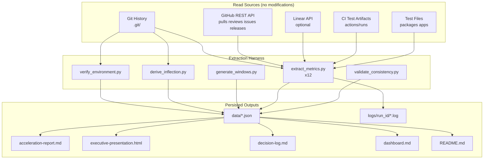

# Technical Specification

# 0. Agent Action Plan

## 0.1 Intent Clarification

### 0.1.1 Core Objective

Based on the provided requirements, the Blitzy platform understands that the objective is to **author a Development Acceleration Measurement report for the `blitzy-cal` repository** that quantifies the change in twelve specific flow and operational metrics across a Before/After boundary defined by the introduction of an AI engineering tool (Blitzy Agent). The report measures *acceleration as multipliers* (After/Before ratios) per metric, broken down by temporal phase (Baseline / Ramp-Up / Steady State), by engineer (real names plus Blitzy as one engineering actor), and by module where the monorepo structure warrants. Every numeric value must trace from a requirement through a reproducible extraction command to a derived figure.

The deliverable is `acceleration-report.md` plus its supporting artifacts (executive presentation deck, decision log, dashboard template, onboarding README, extraction scripts, raw data captures, and run logs). All deliverables live in a dedicated output directory; the repository under analysis is treated as read-only.

The twelve metrics, restated with technical precision, are:

| # | Metric | Operational Definition |
|---|--------|------------------------|
| 1 | Flow Load | Mean count of in-progress PRs (open OR draft with at least one commit) at the end of each Monday-aligned 2-week window, averaged across windows in a phase. Excludes dependency-management bots; includes Blitzy. |
| 2 | Flow Velocity | Count of PRs merged to the default branch per 2-week window. Mean per phase; per-actor breakdown including Blitzy. |
| 3 | Flow Predictability | Reciprocal of the coefficient of variation (mean / stdev) of Flow Velocity across windows in a phase. Requires ≥4 windows; otherwise reports "Insufficient signal — fewer than 4 windows." Zero-variance phases report "Insufficient signal — zero variance" rather than infinity. |
| 4 | Flow Active | Engineering-actor coding span sum across working phases on a PR. Working phases are bounded by review events. Median across PRs per phase and per actor. The engineering actor is the human author in baseline and Blitzy in the after period. |
| 5 | Flow Efficiency | Flow Active / Flow Time per PR, median across PRs per phase. Review time is treated as wait from the actor's perspective in both periods. |
| 6 | Flow Distribution | Proportion of merged PRs classified as feature / defect / risk-compliance / tech-debt / unknown. Classification priority: linked-issue labels → conventional-commit prefix → keyword match. Per-actor in the after period. Unknown rate >20% downgrades phase confidence to Low. |
| 7 | Flow Time | Median wall-clock from first commit on PR branch to merge commit on default branch. Excludes PRs whose first-commit timestamp is unavailable due to history rewrites; exclusion rate reported. |
| 8 | Problem Records in Release | Mean attributable reverts per release. For each revert on default, identify original commit, attribute to most recent release tag T such that T is an ancestor of the original. Unattributable and unreleased reverts reported separately. Reverts-of-reverts excluded. |
| 9 | Releases | Mean releases per 2-week window. Source precedence: GitHub Releases API → annotated semver tags → CI deployment events. Prereleases (`-alpha`, `-beta`, `-rc`, `-dev`) excluded from primary count and reported separately. |
| 10 | Approved Exceptions | Count per 2-week window of policy bypasses: admin-overridden required reviews, force-pushes to protected branches, merges with failing required CI, branch protection rule modifications, and PRs labeled with exception/waiver/override tags. Admin audit log required for full signal; without it, only force-pushes and label signals are available and confidence drops to Low. Per-actor where attribution is available. |
| 11 | Escaped Defects | Per 2-week window: (a) tests transitioning pass→fail on default (regressions) and (b) tests newly marked skipped / disabled / xfail on default (suppressed signal). Sub-counts reported separately. Flaky tests counted only if failing ≥3 consecutive runs. Skipped-rate normalized for suite growth. Reports "Insufficient signal — CI test history unavailable" if no JUnit XML or equivalent. |
| 12 | Defects Out of SLA | Count and percentage per phase of defect-labeled issues whose resolution time exceeds the SLA target for the issue's severity tier. Issue-scoped (not PR-scoped) by definition. SLA source precedence: issue-tracker SLA field → repository policy/runbook. If neither present, reports "Insufficient signal — no SLA source." |

### 0.1.2 Task Categorization

- **Primary task type:** Documentation / Analysis — an archaeological measurement exercise producing a single analytical report and its supporting artifacts. No production source code is modified.
- **Secondary aspects:** Tooling (an extraction harness is created to make every number reproducible) and Build/Deploy (the executive presentation is a self-contained HTML deliverable).
- **Scope classification:** Cross-cutting analysis with isolated documentation deliverables. The analysis spans the entire repository history (Git, CI, issue tracker, releases), but every artifact is created inside a single dedicated directory.

### 0.1.3 Special Instructions and Constraints

The user's prompt contains several non-negotiable directives that the implementation must obey verbatim. They are captured here without paraphrase, then cross-referenced in §0.7 Rules.

- **Read-only operation.** *User instruction:* "Read-only operations only. MUST NOT modify the repository or external systems." Interpretation: the *analyzed* repository under `/tmp/blitzy/blitzy-cal/main_0d6e40` is never mutated; deliverables are created in a new isolated directory `/blitzy/reports/acceleration/`.
- **No fabrication.** *User instruction:* "MUST NOT fabricate, estimate, or extrapolate. Report 'Insufficient signal — [reason]' when data is lacking." Interpretation: any metric whose data source is unavailable, ambiguous, or below the documented threshold is reported as "Insufficient signal — [reason]" with the deviation logged in the traceability matrix.
- **Twelve and only twelve.** *User instruction:* "MUST NOT add metrics beyond the 12 specified." Interpretation: no derivative, composite, or "bonus" metric appears in the report body. Confidence indicators, sub-counts (e.g., unattributable reverts), and breakdowns (per-actor, per-module) are not additional metrics; they are dimensions of the twelve.
- **Confidence parity prohibited.** *User instruction:* "MUST NOT present Low-confidence metrics as equivalent to High-confidence ones." Interpretation: every metric carries a confidence tag derived from the actual data source used, and Low-confidence metrics are visually and textually flagged with caveats.
- **No selective omission.** *User instruction:* "MUST NOT selectively omit data that contradicts a pattern." Interpretation: outliers, regressions in After-period metrics, and negative results are reported with the same prominence as positive results.
- **Identical methodology, different range.** *User instruction:* "MUST use identical methodology for before and after periods — same window alignment, same extraction logic, different date range." Interpretation: extraction code branches only on the date filter and the engineering-actor identity; all window arithmetic, exclusion rules, and aggregation logic are byte-identical across periods.
- **Engineering Actor Framing.** *User instruction:* "In the after period, Blitzy is treated as the engineering actor — the entity producing code on the PR. Blitzy works alone on its PRs; humans review but do not co-author. Metrics that measure working time (4, 5) are computed from the engineering actor's perspective, with the actor being the human author in the baseline period and Blitzy in the after period. Metrics that aggregate by actor (2, 4, 5, 6, 10) include Blitzy as one row in the after period alongside human contributors. The same extraction logic is applied to both periods with the actor substituted; this satisfies the identical-methodology requirement in Boundaries." This framing is implemented through a single `engineering_actor(pr, period)` selector function that takes a PR and a phase identifier and returns the actor whose timestamps are summed.
- **Agent Latitude.** *User instruction:* "The table above defines WHAT to measure, not HOW. You choose the extraction strategy for each metric based on available data sources. Git history, GitHub/GitLab APIs, issue tracker exports, release notes, CI/CD logs — use whatever yields the strongest signal. If you discover a data source or method not listed here, use it and document why. If a metric is unmeasurable by any available method, report 'Insufficient signal' with what you tried and what data source would be needed." Interpretation: each metric's extraction strategy is recorded in the decision log with rationale and confidence.
- **Confidence is data-source-driven.** *User instruction:* "A metric derived from direct counts in an issue tracker is High confidence. A metric approximated from git commit patterns is Medium confidence. A metric inferred from indirect proxies is Low confidence. Assign confidence per metric based on the actual data source you used, not the table above." Interpretation: a metric's tier is not its definitional tier; it is the tier of the data source actually consulted.
- **Out of scope (user-explicit):** runtime performance, customer satisfaction scores, revenue impact.
- **Temporal Phases.** *User instruction:* Baseline = before Tool Introduction Date; Ramp-Up = first 90 days post-introduction; Steady State = 90+ days post-introduction. If fewer than 90 days of post-introduction data exist, report Baseline vs Post-Introduction only. Use 2-week windows aligned to Monday starts.
- **Per-Engineer Views.** *User instruction:* Use real names for metrics 2, 4, 5, 6, and 10. Normalize for team growth by measuring per active engineer where applicable.
- **Multi-Module Repositories.** *User instruction:* Run per-module independently, aggregate weighted by commit volume (non-merge commits per module / total).

### 0.1.4 Technical Interpretation

These requirements translate to the following technical implementation strategy.

To **detect the AI tool introduction date**, the implementation searches `git log --all --pretty=format:"%H%n%an%n%ae%n%aI%n%B%n---END---"` for the earliest commit whose author is `Blitzy Agent <agent@blitzy.com>` *or* whose body contains a `Co-authored-by` trailer naming an AI tool. The earliest such commit's authored timestamp is the candidate inflection. As a verification step, the implementation computes a sliding 14-day commit-count window across the repository's full history and identifies the sharpest sustained inflection (the largest two-week interval where the moving average steps up by more than two standard deviations from the trailing six-month mean). If the velocity-based date differs from the co-author-trailer date by more than 30 days, both are reported and the co-author date is used by default, with the divergence logged in the decision log.

To **align temporal windows**, the implementation snaps the inflection date *backward* to the most recent Monday and generates 2-week intervals (`Mon 00:00:00 UTC → Sun+13 23:59:59 UTC`) both backward and forward across the repository's date range. Windows that straddle the inflection date are assigned by the majority of their days (≥7 days post-introduction → After).

To **substitute the engineering actor**, a single function `engineering_actor(pr, phase)` returns the human author's commits in Baseline phases and Blitzy's commits in After phases. The function preserves identical aggregation logic across periods; only the actor identity changes.

To **compute Flow Active (Metric 4)**, the implementation walks each merged PR's timeline events and identifies *working phases*: the initial span begins at the actor's first commit and ends at the earliest of (a) PR leaving draft state, (b) first review requested, (c) first commit by another author, (d) PR opened; each subsequent *refine span* begins at the actor's first commit after a review event and ends at the actor's last commit before the next review event or merge. Within a span, all elapsed time is counted (gaps are not subtracted, per the user's definition). Flow Active is the sum of all span durations.

To **compute Flow Time (Metric 7)**, the implementation extracts `git log --format=%aI --reverse <merge_base>..<head>` on the PR branch and takes the earliest authored timestamp; the merge commit timestamp is taken from the PR's `merged_at` field. PRs whose earliest commit predates a known force-push event are flagged for exclusion and the exclusion rate is reported.

To **classify Flow Distribution (Metric 6)**, the implementation applies a three-tier waterfall: (1) if the PR has any linked issue (via "Fixes #N" or "Closes CAL-XXX" in title/body), retrieve labels and map them to the four categories using a documented label-to-category mapping; (2) parse the PR title for conventional-commit prefix (`feat:` → feature, `fix:` → defect, `security:` / `compliance:` / `chore(security):` → risk/compliance, `chore:` / `refactor:` / `style:` / `perf:` → tech-debt); (3) keyword match the title and body for terms like "bug", "regression", "vulnerability", "audit", "cleanup". PRs matching none are placed in *unknown*.

To **attribute reverts to releases (Metric 8)**, the implementation parses each revert commit's body for `This reverts commit <SHA>`. If absent, it computes a tree hash for the revert's parent and searches for a prior commit with the matching tree hash. For each identified original commit, it iterates the release tag set and finds the most recent tag `T` such that `git merge-base --is-ancestor T <original>` returns success. Reverts where the original cannot be identified are tallied as *unattributable*; reverts whose original predates the earliest release tag are tallied as *unreleased*.

To **enforce internal consistency (Rule 4)**, every numeric value is computed exactly once in the extraction harness and looked up from a single in-memory `metrics_results` dictionary in every report section that references it. The same dictionary populates the Executive Summary, the Metric Deep-Dives, the Traceability Matrix, the Acceleration Curve, and the executive presentation.

To **satisfy reproducibility (Rule 5)**, the harness writes a `commands.log` file capturing every git invocation, API call, and Python subprocess execution in order; the Reproducibility Appendix is generated from this log.

To **satisfy observability (user rule)**, the harness emits structured JSON log lines via `logging` with a correlation ID (`run_id` = UUIDv4 generated at startup) attached to every line, writes per-metric logs to `logs/<run_id>/<metric>.log`, and surfaces a dashboard template (`dashboard.md`) summarizing the 12 metrics with thresholds.

To **satisfy explainability (user rule)**, every non-trivial choice (inflection-detection method, window boundary handling, classification waterfall ordering, revert attribution algorithm, fallback when SLA source is absent) is recorded in `decision-log.md` with alternatives, chosen path, and risks.

To **satisfy visual architecture documentation (user rule)**, the report body and the executive presentation include Mermaid diagrams covering: (1) the extraction pipeline; (2) the metric lineage from raw data to derived value; (3) the temporal-phase boundary and window alignment; (4) the per-metric confidence flow; and (5) the acceleration curve. Each diagram has a descriptive title, an in-prose legend, and is referenced by name in surrounding text.

To **satisfy the executive presentation rule**, the implementation produces a single self-contained `executive-presentation.html` file with reveal.js 5.1.0, Mermaid 11.4.0, and Lucide 0.460.0 loaded from pinned CDN URLs, a 1920×1080 viewport, 12–18 `<section>` slides (target 16), four slide types (title, divider, content, closing), zero emoji (Lucide icons only), and the Blitzy brand color/typography variables embedded in an inline `<style>` block.

## 0.2 Repository Scope Discovery

### 0.2.1 Comprehensive File Analysis

The analysis reads many sources but writes to a single directory. The READ surface, grouped by purpose, is:

**Git history (primary signal for M1–M9, M11):**
- `.git/` — the full object database (16,947 commits spanning 2021-03-10 → 2026-05-15)
- Author/committer identities, authored timestamps, merge commits, revert messages, branch names (notably `blitzy-*`), and `Co-authored-by` trailers

**GitHub repository metadata (primary signal for M1, M2, M4, M5, M7, M8, M9, M10, M12):**
- `GET /repos/Blitzy-Sandbox/blitzy-cal/pulls?state=all` — PR list with state, draft flag, `created_at`, `merged_at`, `closed_at`, head SHA, base SHA, requested reviewers, labels
- `GET /repos/Blitzy-Sandbox/blitzy-cal/pulls/{n}/reviews` — review submissions (APPROVED / CHANGES_REQUESTED / COMMENTED) with `submitted_at`
- `GET /repos/Blitzy-Sandbox/blitzy-cal/issues/{n}/events` — timeline events (`ready_for_review`, `review_requested`, `labeled`, `closed`, `merged`)
- `GET /repos/Blitzy-Sandbox/blitzy-cal/releases` — release tags, prerelease flag, `published_at`
- `GET /repos/Blitzy-Sandbox/blitzy-cal/actions/runs` — CI run history including conclusions and test artifacts
- `GET /repos/Blitzy-Sandbox/blitzy-cal/issues?labels=bug` — defect-labeled issues for M12

**Issue tracker linkage:**
- `.github/PULL_REQUEST_TEMPLATE.md` confirms Linear (CAL-XXXX) is canonical and GitHub Issues (#XXXX) is secondary
- 95 commits in the visible window use "Closes #" or "Fixes #" keywords — these are the PR→Issue join points

**Repository configuration files (analysis inputs):**
- `.github/CODEOWNERS` — informs M10 (required-review bypass detection)
- `.github/workflows/*.yml` — 58 workflows; the umbrella `all-checks.yml`, `unit-tests.yml`, `integration-tests.yml`, `e2e.yml`, `performance-tests.yml`, `check-types.yml`, `check-prisma-migrations.yml`, `security-audit.yml`, and others define the "required checks" surface for M10 and the test-result surface for M11
- `.kodiak.toml` — `auto_approve_usernames = ["dependabot", "github-actions"]` identifies the dependency-management bots to exclude from M1 and M2
- `.github/ISSUE_TEMPLATE/bug_report.md` — confirms the `🐛 bug` label convention used by M6 and M12
- `.changeset/` — only 3 entries (config + README + one pending changeset), confirming that changesets exist but produce no semver tags directly (0 git tags in repo)
- `CONTRIBUTING.md`, `SECURITY.md`, `README.md` — searched for SLA policy text; no SLA targets found, which forces M12 to "Insufficient signal — no SLA source" unless the Linear API exposes severity SLAs

**Test files (M11 inputs):**
- `packages/**/*.test.{ts,tsx,js}` and `apps/**/*.test.{ts,tsx,js}`
- 146 explicit `.skip|xit|xtest|.todo` references currently on default branch (the baseline count for skipped-rate; per-window deltas are computed from git blame timestamps on the skip annotations)

**Existing Blitzy artifacts (precedent for the output directory structure):**
- `/blitzy/documentation/` contains `Project Guide.md` and `Technical Specifications.md` — confirms the `/blitzy/<purpose>/` convention
- `/blitzy/screenshots/` contains existing PNG screenshots — confirms peer sibling directories are the right placement
- The new output directory `/blitzy/reports/acceleration/` parallels these conventions

### 0.2.2 Web Search Research Conducted

Three web searches were performed during scope discovery to validate the methodology against industry-standard definitions.

- **"DORA flow metrics PR lead time deployment frequency calculation methodology"** — confirmed that the user's twelve metrics align with established DORA / Flow Framework definitions. <cite index="3-17">The four DORA metrics measure two critical aspects of DevOps: Velocity metrics track how quickly your organization delivers software: Deployment frequency: How often code is deployed to production · Lead time for changes: How long it takes code to reach production · Stability metrics measure your software's reliability: Change failure rate: How often deployments cause production failures · Time to restore service: How quickly service recovers after failures</cite> The user's Metric 9 maps to deployment frequency; Metric 7 maps to lead time for changes; Metric 8 maps to change failure rate. <cite index="2-6,2-7,2-8">To calculate this, determine: 1) when commits occur and 2) when deployments occur that include a specific commit. Every deployment should maintain a list of all changes, where every change is mapped to a Secure Hash Algorithm (SHA) identifier (a unique ID for each commit). Joining this list to the changes table and comparing timestamps provides the lead time.</cite> This is precisely the join performed by the M7 extraction script.

- **"git log methodology PR cycle time flow efficiency archaeological analysis"** — confirmed the standard definitions for Flow Efficiency (Metric 5) and PR Cycle Time (Metric 7). <cite index="14-2,14-3">Flow efficiency: The ratio of active work time to total cycle time. A higher flow efficiency means less time is wasted in queues or waiting states.</cite> Confirmed the first-commit-to-merge methodology for Metric 7: <cite index="11-1,11-2">We calculate it from the moment a PR is opened until the commit(s) associated with that PR are successfully merged into the main branch, analyzing metadata from your Git provider. We also calculate the time spent in distinct phases like 'Time to First Review' and 'Time to Merge'.</cite> The user's M7 definition uses first commit on PR branch (not PR open time) as the start, which captures more accurate active-work boundaries.

- **"GitHub REST API list pull requests reviews events"** — confirmed the API endpoints and authentication scheme to be used by the extraction harness. <cite index="16-2,16-3">Lists all reviews for a specified pull request. The list of reviews returns in chronological order.</cite> The harness calls each endpoint with `Authorization: Bearer <GITHUB_TOKEN>`, `Accept: application/vnd.github+json`, and `X-GitHub-Api-Version: 2026-03-10`.

### 0.2.3 Existing Infrastructure Assessment

**Repository identity:** `blitzy-cal` at `github.com/Blitzy-Sandbox/blitzy-cal` is a fork of Cal.com configured as a Yarn Berry 4.12.0 + Turborepo 2.7.1 monorepo on Node 20.20.2. Default branch is `main`. The repository contains 16,947 commits spanning 2021-03-10 → 2026-05-15 — approximately five years of history with a clear post-2026-02-25 inflection corresponding to the introduction of Blitzy Agent (`agent@blitzy.com`).

**AI tool introduction signal:** The earliest commit authored by `Blitzy Agent <agent@blitzy.com>` is `9d80a5d026` dated **2026-02-25T00:24:31Z**. As of the analysis cutoff (2026-05-15), 654 Blitzy commits exist across approximately 80 days, giving sufficient post-introduction history for both Ramp-Up (90 days) and a partial Steady State. If the analysis is re-run before 2026-05-25, the report will fall back to "Baseline vs Post-Introduction only" per the user's instruction.

**Conventional commit discipline:** Prefix counts visible in the window: 1,829 `fix:`, 905 `feat:`, 771 `chore:`, 303 `refactor:`, 222 `docs:`, 175 `perf:`, 53 `test:`, 14 `ci:`, 2 `build:`. This high prefix-discipline rate makes the conventional-commit tier of the M6 classification waterfall a strong signal even when no linked issue is present.

**Revert prevalence:** 204 revert commits on the default branch — actionable signal for Metric 8. The revert-commit body convention in this repository follows the standard "This reverts commit `<SHA>`" pattern, which makes the M8 attribution algorithm directly applicable.

**Release infrastructure:** Zero git tags currently exist in the repository, so Metric 9's source-precedence fallback applies: GitHub Releases API (if present on the GitHub repository) → annotated semver tags (absent) → CI deployment events (`actions/runs` for production-build workflows such as `api-v1-production-build.yml`). The decision log will record this fallback.

**Test infrastructure:** Vitest 4.0.16 (unit), Jest 29.7.0 (NestJS API v2), Playwright 1.57.0 (E2E). The `unit-tests.yml`, `integration-tests.yml`, `e2e.yml`, `e2e-api-v2.yml`, `e2e-app-store.yml`, `e2e-atoms.yml`, `e2e-embed.yml`, `e2e-embed-react.yml`, and `performance-tests.yml` workflows produce the test artifacts required for M11. The harness queries `GET /repos/Blitzy-Sandbox/blitzy-cal/actions/runs` filtered by these workflow names.

**Issue tracker:** Linear (`CAL-*`) is the canonical issue tracker per `.github/PULL_REQUEST_TEMPLATE.md`. GitHub Issues (`#*`) is the secondary tracker. The M6 classification waterfall checks both linkage styles. M12 requires Linear API access for the SLA field; if access is unavailable at run time, M12 falls back to "Insufficient signal — no SLA source."

**Bot identification (M1, M2 exclusions):** The dependency-management bots to exclude are `dependabot`, `github-actions`, `renovate`, and `kodiak` (per `.kodiak.toml`). **Blitzy Agent is explicitly NOT a bot** — it is the engineering actor for the after period and is included in all per-actor aggregations.

**Branch protection and audit log (M10 signal):** The branch protection rule is configured for `main`. The full M10 signal requires the GitHub Audit Log API, which depends on organization-admin token scopes. If the token used at run time lacks `audit_log:read`, M10 falls back to its label-and-force-push subset and its confidence is downgraded to Low with the gap documented.

**Documentation conventions:** The repository uses Mintlify for product docs (`/docs/`), a separate parity-effort narrative (`/blitzy-docs/`), spec-first feature development (`/specs/` with `CLAUDE.md`, `design.md`, `decisions.md`, `implementation.md`, `prompts.md`, `future-work.md` templates), and Blitzy-generated artifacts (`/blitzy/documentation/`, `/blitzy/screenshots/`). The output directory `/blitzy/reports/acceleration/` follows these conventions without colliding with any existing file.

**Tooling gaps and workarounds:** `gh` CLI and `jq` are not installed in the analysis environment. The extraction harness uses Python 3.12 stdlib (`urllib.request` for GitHub API calls, `json` for parsing, `subprocess` for git invocations) to avoid the dependency. This keeps the harness self-contained and removes any need to install non-stdlib packages on the analysis machine.

## 0.3 Scope Boundaries

### 0.3.1 Exhaustively In Scope

**Read sources (analyzed, never modified):**

- `.git/` — full Git object database including:
    - `.git/objects/**` — commit, tree, and blob objects spanning 2021-03-10 → 2026-05-15
    - `.git/refs/**` — branches, including the default branch `main` and `blitzy-*` branches
    - `.git/packed-refs` — packed references
- `.github/PULL_REQUEST_TEMPLATE.md` — issue tracker linkage convention
- `.github/CODEOWNERS` — required-reviewer detection input
- `.github/ISSUE_TEMPLATE/bug_report.md` and `.github/ISSUE_TEMPLATE/feature_request.md` — label conventions
- `.github/workflows/*.yml` — all 58 workflow definitions (required for M10 and M11 signal interpretation)
- `.changeset/*.md` and `.changeset/config.json` — release/version metadata source
- `.kodiak.toml` — bot identification (`auto_approve_usernames`)
- `CONTRIBUTING.md`, `SECURITY.md`, `README.md` — searched for SLA policy text
- `packages/**/*.test.{ts,tsx,js,jsx}` and `apps/**/*.test.{ts,tsx,js,jsx}` — test file inventory for M11
- `package.json` and root `turbo.json` — module boundary detection for multi-module aggregation
- `apps/*/package.json` and `packages/*/package.json` — module-level commit attribution

**GitHub REST API endpoints (queried, never written):**

- `GET /repos/Blitzy-Sandbox/blitzy-cal/pulls?state=all` (paginated full PR history)
- `GET /repos/Blitzy-Sandbox/blitzy-cal/pulls/{n}` (PR detail with merge SHA, body, requested reviewers)
- `GET /repos/Blitzy-Sandbox/blitzy-cal/pulls/{n}/reviews` (review submissions)
- `GET /repos/Blitzy-Sandbox/blitzy-cal/pulls/{n}/commits` (PR commits)
- `GET /repos/Blitzy-Sandbox/blitzy-cal/issues/{n}/events` (timeline events)
- `GET /repos/Blitzy-Sandbox/blitzy-cal/issues?labels=bug&state=all` (defect-labeled issues for M12)
- `GET /repos/Blitzy-Sandbox/blitzy-cal/releases` (release inventory for M9)
- `GET /repos/Blitzy-Sandbox/blitzy-cal/actions/runs` (CI run history for M11)
- `GET /repos/Blitzy-Sandbox/blitzy-cal/actions/runs/{id}/artifacts` (test-result artifacts)
- `GET /repos/Blitzy-Sandbox/blitzy-cal/branches/main/protection` (M10 branch protection state)
- `GET /orgs/Blitzy-Sandbox/audit-log` (M10 audit signal — conditional on token scope)

**Linear API endpoints (queried if access available):**

- `GET issues?filter[state][type][eq]=completed&filter[label][name][eq]=bug` (defect resolution times for M12)
- `GET teams/{team_id}/slaPolicies` (M12 SLA source if exposed)

**Writes (all under `/blitzy/reports/acceleration/`):**

| Target Path | Purpose |
|-------------|---------|
| `/blitzy/reports/acceleration/acceleration-report.md` | Main analytical report containing all 12 metric deep-dives, traceability matrix, acceleration curve, per-engineer view, risk assessment, limitations, and reproducibility appendix |
| `/blitzy/reports/acceleration/executive-presentation.html` | Single self-contained reveal.js 5.1.0 deck (1920×1080, 12–18 slides target 16, Blitzy brand, pinned CDNs) |
| `/blitzy/reports/acceleration/decision-log.md` | Markdown table of every non-trivial implementation decision (Explainability rule) |
| `/blitzy/reports/acceleration/dashboard.md` | Observability dashboard template summarizing the 12 metrics with thresholds and current values |
| `/blitzy/reports/acceleration/README.md` | Onboarding document — clean-machine reproduction, domain context, common pitfalls, suggested next tasks |
| `/blitzy/reports/acceleration/scripts/extract_metrics.py` | Extraction harness with structured JSON logging and correlation IDs |
| `/blitzy/reports/acceleration/scripts/derive_inflection.py` | AI tool introduction date detection script |
| `/blitzy/reports/acceleration/scripts/render_diagrams.py` | Validates embedded Mermaid syntax |
| `/blitzy/reports/acceleration/scripts/build_presentation.py` | Builds the self-contained reveal.js HTML from a template |
| `/blitzy/reports/acceleration/data/*.json` | Raw extraction outputs per metric, preserved for traceability |
| `/blitzy/reports/acceleration/logs/<run_id>/*.log` | Per-metric run logs with correlation IDs (Observability rule) |
| `/blitzy/reports/acceleration/logs/<run_id>/commands.log` | Ordered command catalog for the Reproducibility Appendix |

### 0.3.2 Explicitly Out of Scope

**Repository modifications (per the user's read-only constraint):**

- No edits to existing source files under `apps/`, `packages/`, `agents/`, `__checks__/`, `deploy/`, `docs/`, `example-apps/`, `scripts/`, `specs/`, `vitest-mocks/`, `tests/`, or root config files
- No edits to root `README.md`, `CONTRIBUTING.md`, `SECURITY.md`, or any existing documentation (the Onboarding rule is satisfied inside the report directory's own `README.md`)
- No edits to `/blitzy/documentation/Technical Specifications.md` or `/blitzy/documentation/Project Guide.md` beyond the section additions performed via `add_tech_spec_sub_section`
- No edits to `.github/workflows/*.yml`, `.kodiak.toml`, `.github/CODEOWNERS`, `package.json`, `yarn.lock`, `turbo.json`, or any dependency manifest

**External system modifications:**

- No changes to GitHub repository settings, branch protection rules, labels, milestones, or webhooks
- No changes to Linear issues, projects, or workflows
- No creation, modification, or deletion of releases or tags

**Analytical scope (per the user's "MUST NOT add metrics beyond the 12 specified"):**

- No additional metrics beyond the twelve enumerated
- No runtime performance benchmarks (explicitly out of scope per user)
- No customer satisfaction analysis (explicitly out of scope per user)
- No revenue impact analysis (explicitly out of scope per user)
- No qualitative survey or interview data
- No code quality metrics (cyclomatic complexity, coverage delta, lint counts) unless they appear as sub-counts of M11

**Methodological scope:**

- No fabricated or extrapolated values — "Insufficient signal — [reason]" is reported instead
- No selective omission of contradictory data — outliers and regressions are surfaced with equal prominence
- No subjective qualifiers in report body — Rule 2 (Factual-Neutral Tone) is enforced via a final grep pass
- No presentation of Low-confidence metrics as equivalent to High-confidence ones — confidence tags are mandatory and visible

**Future enhancements deferred (recorded in the onboarding README's "Suggested Next Tasks" section per the user-specified Onboarding rule):**

- Continuous (always-on) DORA dashboard backed by an OpenTelemetry pipeline
- Per-PR file-level review-density correlation with merge time
- Author-level skill curve over time
- Cross-repository comparison against other Blitzy-Sandbox repositories

## 0.4 Dependency Inventory

### 0.4.1 Key Tools and Libraries

No new dependencies are added to the analyzed repository's manifests. The analysis harness uses only Python 3 standard library plus the system `git` CLI; the executive presentation loads its libraries from pinned CDN URLs at render time.

| Registry | Package / Tool | Version | Purpose | Install Site |
|----------|----------------|---------|---------|--------------|
| System | `git` | 2.43.0 | Commit-graph traversal, log/show/blame, revert detection, merge-base ancestry checks | Analysis environment (already present) |
| System | `python3` | 3.12.3 | Extraction harness runtime, structured logging, JSON parsing, statistics | Analysis environment (already present) |
| System | `curl` | 8.5.0 | Fallback HTTPS client (Python `urllib.request` is the primary client) | Analysis environment (already present) |
| Python stdlib | `urllib.request` | 3.12.3 | GitHub REST API client (replaces `gh` CLI) | Bundled with Python 3.12.3 |
| Python stdlib | `json` | 3.12.3 | Parse API responses and write data captures (replaces `jq`) | Bundled with Python 3.12.3 |
| Python stdlib | `subprocess` | 3.12.3 | Invoke `git` from the harness | Bundled with Python 3.12.3 |
| Python stdlib | `logging` | 3.12.3 | Structured JSON logging with correlation IDs | Bundled with Python 3.12.3 |
| Python stdlib | `uuid` | 3.12.3 | Generate `run_id` for each harness invocation | Bundled with Python 3.12.3 |
| Python stdlib | `statistics` | 3.12.3 | Median, mean, stdev for metric aggregation | Bundled with Python 3.12.3 |
| Python stdlib | `datetime` | 3.12.3 | Monday-aligned 2-week window arithmetic | Bundled with Python 3.12.3 |
| Python stdlib | `csv` | 3.12.3 | Tabular data captures alongside JSON | Bundled with Python 3.12.3 |
| Python stdlib | `re` | 3.12.3 | Conventional-commit prefix parsing, revert message parsing | Bundled with Python 3.12.3 |
| Python stdlib | `argparse` | 3.12.3 | Harness CLI (`--phase baseline|after|both`, `--metric N`, `--dry-run`) | Bundled with Python 3.12.3 |
| Python stdlib | `pathlib` | 3.12.3 | Output directory creation under `/blitzy/reports/acceleration/` | Bundled with Python 3.12.3 |
| CDN (jsdelivr) | `reveal.js` | 5.1.0 | Executive presentation slide framework | Loaded by `executive-presentation.html` at view time |
| CDN (jsdelivr) | `mermaid` | 11.4.0 | Diagram rendering in deck and report previews | Loaded by `executive-presentation.html` at view time |
| CDN (unpkg) | `lucide` | 0.460.0 | SVG icons for slide visuals (zero emoji per rule) | Loaded by `executive-presentation.html` at view time |
| CDN (Google Fonts) | `Inter`, `Space Grotesk`, `Fira Code` | latest | Typography per Blitzy brand spec | Loaded by `executive-presentation.html` at view time |

### 0.4.2 Dependency Updates

**No new dependencies to add to analyzed repository manifests.** The analysis harness lives entirely under `/blitzy/reports/acceleration/scripts/` and uses only Python stdlib + system `git`. The `package.json`, `yarn.lock`, `pyproject.toml`, `requirements.txt`, and all other dependency manifests of the analyzed repository remain unchanged.

**No dependencies to update.** No version bumps are performed in the analyzed repository.

**No dependencies to remove.** No packages are removed.

**No import or reference updates required in existing files.** All new imports occur exclusively in newly-created scripts under `/blitzy/reports/acceleration/scripts/`.

### 0.4.3 Runtime Prerequisites

The harness requires the following environment variables at run time. These are consumed by the harness only and never persisted:

- `GITHUB_TOKEN` — a fine-grained personal access token with `contents:read`, `pull_requests:read`, `issues:read`, `actions:read`, `metadata:read` scopes. If `audit_log:read` is included, Metric 10 gains its full signal; otherwise it falls back to the label-and-force-push subset with Low confidence.
- `LINEAR_API_KEY` — *optional*. If present, Metric 6 classification and Metric 12 SLA lookup gain a stronger signal. If absent, both metrics fall back to GitHub Issues / conventional-commit signals.
- `BLITZY_RUN_ID` — *optional*. If unset, the harness generates a UUIDv4 at startup. Used as the correlation ID across all log lines and the directory name for per-run logs (`logs/<run_id>/`).

## 0.5 Implementation Design

### 0.5.1 Technical Approach

The implementation is structured as a single extraction harness that produces a deterministic, reproducible set of artifacts. Every step in the pipeline is captured in `commands.log` so the appendix in the final report is a generated artifact, not a hand-written one. The pipeline executes in a fixed order: environment verification → AI tool introduction detection → window generation → per-metric extraction → cross-metric consistency check → artifact rendering.

**Achieve the AI tool introduction date detection by** scanning `git log --all --format='%H|%ae|%aI|%s'` for the earliest commit authored by `agent@blitzy.com`, then computing a 14-day sliding commit-count window across the full history to identify the sharpest sustained inflection. The two candidates are compared; if they agree within 30 days, the co-author-trailer date is authoritative. The chosen date and its rationale are written to `decision-log.md`.

**Achieve Monday-aligned 2-week windows by** snapping the inflection date backward to the most recent Monday (`(inflection_date - timedelta(days=inflection_date.weekday()))`) and emitting intervals `[Mon 00:00:00 UTC, Mon+14d 00:00:00 UTC)` both forward and backward to span the repository's first and last commit dates. Each interval is keyed by its start ISO date.

**Achieve engineering-actor substitution by** implementing a single function:

```python
def engineering_actor(pr, phase):
    if phase == "baseline":
        return pr.human_author_login
    return "blitzy-agent" if pr.is_blitzy_pr() else pr.human_author_login
```

This function is the only place in the harness where the actor identity is selected; all per-actor aggregations call it.

**Achieve identical-methodology guarantee by** parameterizing the extraction functions over `(phase_name, date_range)` only. The same function computes a metric for Baseline and for After; the only difference is the date filter applied to the input dataset.

**Achieve internal consistency by** storing all derived values in a single in-memory `metrics_results` dictionary keyed by `(metric_id, phase, dimension)`. Every report section is rendered from this single source.

**Logical implementation flow** (this is implementation ordering, not a temporal schedule):

- First, establish the analysis environment by running `scripts/verify_environment.py`, which captures repo URL, git version, total commit count, active branch count, submodule state, commit date range, and extraction timestamp, writing them to `data/environment.json`. This satisfies Rule 6 (Environment First).
- Next, detect the AI tool introduction date by running `scripts/derive_inflection.py`, which writes `data/inflection.json` containing both the co-author-trailer candidate and the velocity-inflection candidate plus the chosen date.
- Next, generate the window table by running `scripts/generate_windows.py`, which writes `data/windows.json` containing each window's start date, end date, and phase assignment.
- Next, extract each of the 12 metrics by running `scripts/extract_metrics.py --metric N` for N in 1..12. Each invocation writes `data/metric_<N>.json` (raw extraction output) and appends to `logs/<run_id>/metric_<N>.log` (structured JSON log lines).
- Next, validate cross-metric consistency by running `scripts/validate_consistency.py`, which loads all `data/metric_*.json`, checks that values referenced across sections agree, and emits `data/consistency_report.json`.
- Finally, render the report and presentation by running `scripts/build_report.py` and `scripts/build_presentation.py`, which read `metrics_results` from `data/` and produce `acceleration-report.md` and `executive-presentation.html`.

### 0.5.2 Component Impact Analysis

**Direct creations (in `/blitzy/reports/acceleration/`):**

- `acceleration-report.md` — primary deliverable; contains all twelve metric deep-dives, traceability matrix, acceleration curve, per-engineer view, environment verification, data source inventory, methodology, risk assessment, limitations, and reproducibility appendix
- `executive-presentation.html` — single-file reveal.js deck for non-technical leadership
- `decision-log.md` — Explainability deliverable with every non-trivial choice documented
- `dashboard.md` — Observability dashboard template summarizing the twelve metrics with thresholds
- `README.md` — Onboarding deliverable for any future maintainer of the harness
- `scripts/extract_metrics.py` — main extraction harness
- `scripts/derive_inflection.py` — AI tool introduction date detector
- `scripts/verify_environment.py` — environment verification
- `scripts/generate_windows.py` — Monday-aligned 2-week window generator
- `scripts/validate_consistency.py` — cross-section value-consistency checker
- `scripts/build_report.py` — Markdown report renderer
- `scripts/build_presentation.py` — reveal.js HTML renderer
- `data/` — raw extraction outputs (one JSON per metric, plus environment, inflection, windows, consistency)
- `logs/<run_id>/` — per-run structured logs

**Indirect impacts (read-only, never modified):**

- `.git/` is read by every script via `subprocess.run(["git", ...])`
- GitHub REST API is read by `scripts/extract_metrics.py` for PR, review, issue, release, action, and audit data
- Linear API is read by `scripts/extract_metrics.py` (if `LINEAR_API_KEY` is present) for SLA-tier and label data
- Test files under `packages/` and `apps/` are read by `scripts/extract_metrics.py --metric 11` for the M11 skipped-test inventory

**Tech Spec section addition:** This Section 0 ("Agent Action Plan") is appended to `/blitzy/documentation/Technical Specifications.md` via the `add_tech_spec_sub_section` tool. No other Tech Spec sections are modified.

**No new components are introduced into the application runtime.** The harness is purely analytical and does not run inside `apps/web`, `apps/api/v1`, `apps/api/v2`, or any other deployed surface.

### 0.5.3 User Interface Design

This deliverable is not a UI feature; the only user-facing surface is the executive presentation deck. Its design adheres to the user-specified Executive Presentation rule:

- 12–18 slides total (target 16); four slide types: Title (`slide-title`), Section Divider (`slide-divider`), Content (default), Closing (`slide-closing`)
- Every slide includes at least one non-text visual element (Mermaid diagram, KPI card, styled table, or Lucide SVG icon); no text-only slides
- Content slides: max 4 bullets, max 40 words body text, min 1 non-text visual
- Zero emoji; Lucide SVG icons via `<i data-lucide="icon-name"></i>`
- No fenced code blocks inside slides; inline Fira Code for short expressions only
- Blitzy brand colors and gradients applied via inline CSS custom properties (`--blitzy-primary: #5B39F3`, `--blitzy-primary-dark: #2D1C77`, `--blitzy-accent-teal: #94FAD5`, etc.)
- Typography: Inter (body), Space Grotesk (display), Fira Code (mono) loaded via Google Fonts `<link>`
- Mermaid diagrams embedded as `<pre class="mermaid">`; initialized with `startOnLoad: false`; `mermaid.run()` called after reveal.js `ready` and on every `slidechanged` event
- Lucide icons created via `lucide.createIcons()` called after `ready` and on every `slidechanged` event
- CDN versions pinned: reveal.js 5.1.0, Mermaid 11.4.0, Lucide 0.460.0
- reveal.js config: `hash: true`, `transition: 'slide'`, `controlsTutorial: false`, `width: 1920`, `height: 1080`

Slide ordering follows the user-specified convention:

- Slide 1: Title — project name, scope, audience framing
- Slide 2: Content — headline acceleration multipliers (KPI card grid)
- Slide 3: Content — extraction architecture overview (Mermaid pipeline diagram)
- Slides 4–N: Alternating Section Dividers + Content slides for each major topic (Methodology, Flow Metrics, Stability Metrics, Per-Engineer View, Risk Assessment)
- Slide N+1: Closing — key takeaway (3–6 word heading), max 3 bullets, brand lockup, gradient accent bar

### 0.5.4 User-Provided Examples Integration

The user did not provide example metric values, example reports, or example slides. The user did provide the exact 12-metric specification table (preserved verbatim in §0.1.1) and the executive presentation visual identity (preserved verbatim in the Rules section of the project setup). These specifications drive the implementation directly.

The user explicitly framed Blitzy as the engineering actor in the after period. *User instruction (preserved verbatim):* "In the after period, Blitzy is treated as the engineering actor — the entity producing code on the PR. Blitzy works alone on its PRs; humans review but do not co-author." This is implemented in the `engineering_actor(pr, phase)` selector function described in §0.5.1.

### 0.5.5 Critical Implementation Details

**Inflection date detection algorithm.** The harness computes two candidate inflection dates and reconciles them:

```python
def detect_inflection():
    co_author_date = earliest_commit_authored_by("agent@blitzy.com")
    velocity_date = sharpest_two_week_velocity_inflection()
    return reconcile(co_author_date, velocity_date, tolerance_days=30)
```

If the candidates agree within 30 days, the co-author-trailer date is authoritative. Otherwise, both are reported and the co-author date is used by default with the divergence recorded in `decision-log.md`. Initial reconnaissance confirms the earliest Blitzy Agent commit is `9d80a5d026` dated **2026-02-25T00:24:31Z**.

**Window assignment for boundary windows.** Windows that straddle the inflection date are assigned by majority of days: a window with ≥7 days post-introduction is After; otherwise it is Baseline. This is documented in the decision log.

**Flow Active (M4) span computation.** The algorithm walks each PR's timeline and identifies working phases:

```python
def flow_active(pr, actor):
    spans = []
    events = timeline_events(pr)  # sorted by created_at
    actor_commits = commits_by_actor(pr, actor)
    initial_end = min(event.created_at for event in events
                      if event.type in ("ready_for_review", "review_requested",
                                        "first_commit_by_other_author", "pr_opened"))
    initial_commits = [c for c in actor_commits if c.authored_at <= initial_end]
    if initial_commits:
        spans.append(initial_commits[-1].authored_at - initial_commits[0].authored_at)
    for review in reviews(pr):
        refine_commits = [c for c in actor_commits
                          if c.authored_at > review.submitted_at
                          and c.authored_at < next_review_or_merge(pr, review)]
        if refine_commits:
            spans.append(refine_commits[-1].authored_at - refine_commits[0].authored_at)
    return sum(spans, timedelta())
```

Gaps within a span are not subtracted, per the user's definition.

**Flow Distribution (M6) classification waterfall.** Implementation order is strict; each tier is consulted only if the prior tier returns `None`:

- Tier 1 (label-based): if PR has a linked issue, retrieve issue labels and map to category via documented mapping (`🐛 bug` → defect, `enhancement`/`feature` → feature, `security`/`compliance` → risk-compliance, `chore`/`tech-debt`/`refactor` → tech-debt)
- Tier 2 (conventional-commit prefix): parse PR title against `^(feat|fix|chore|refactor|perf|docs|test|ci|build|style|security|compliance)(\([^)]+\))?!?:` and map (`feat:` → feature, `fix:` → defect, `security:`/`compliance:` → risk-compliance, `chore:`/`refactor:`/`perf:`/`style:` → tech-debt)
- Tier 3 (keyword match): search title and body for token sets (`{"bug", "regression", "broken", "crash", "error"}` → defect, `{"vulnerability", "cve", "audit", "compliance"}` → risk-compliance, `{"cleanup", "refactor", "rename", "deprecate"}` → tech-debt, `{"add", "implement", "support"}` → feature)

PRs matching none are categorized as `unknown`. The unknown rate is reported per phase as a confidence indicator; >20% downgrades phase confidence to Low.

**Revert attribution (M8) algorithm:**

```python
def attribute_revert(revert_commit, release_tags):
    original_sha = parse_reverts_commit_line(revert_commit.body)
    if not original_sha:
        original_sha = tree_match_lookup(revert_commit)
    if not original_sha:
        return ("unattributable", None)
    candidate_tags = [t for t in release_tags
                      if subprocess.run(
                          ["git", "merge-base", "--is-ancestor", t.sha, original_sha],
                          capture_output=True).returncode == 0]
    if not candidate_tags:
        return ("unreleased", original_sha)
    most_recent = max(candidate_tags, key=lambda t: t.committed_at)
    return ("attributed", most_recent.name)
```

Reverts-of-reverts are detected by checking if the original commit being reverted is itself a revert; these are excluded from all counts.

**Release source fallback for M9.** The harness tries sources in user-specified precedence:

```python
def get_releases():
    releases = github_api("releases")
    if releases:
        return ("api", releases)
    tags = run_git("tag", "--list", "v[0-9]*.[0-9]*.[0-9]*", "--sort=-creatordate")
    if tags:
        return ("tags", parse_tags(tags))
    runs = github_api("actions/runs?workflow=api-v1-production-build.yml&status=success")
    if runs:
        return ("ci_deploys", runs)
    return ("none", [])
```

Prereleases (`-alpha`, `-beta`, `-rc`, `-dev` suffixes) are excluded from the primary count and reported separately.

**M10 fallback when admin audit log is unavailable.** If the GitHub token lacks `audit_log:read`, the harness queries only the available signals (force-pushes via `GET /repos/{owner}/{repo}/events`, exception/waiver labels via `GET /repos/{owner}/{repo}/issues?labels=exception`). M10 confidence drops to Low and the gap is flagged in the risk assessment.

**M11 sub-counts.** Two independent counts are tracked:

- `regressions` — tests transitioning from passing on commit `C_(n-1)` to failing on commit `C_n` on the default branch, where both commits have CI results. Flaky tests (alternating pass/fail) are counted only if failing in ≥3 consecutive runs.
- `newly_skipped` — tests added with `.skip`, `xit`, `xtest`, `.todo`, or `@xfail` annotations on the default branch, detected via `git log -p -- '*.test.{ts,tsx,js,jsx}'` filtered for additions matching the annotation regex.

The `skipped_rate` (skipped / total tests) is reported per window to normalize for test-suite growth.

**M12 fallback when no SLA source is available.** Initial reconnaissance found no SLA policy text in `CONTRIBUTING.md`, `SECURITY.md`, or `README.md`. If `LINEAR_API_KEY` is also absent, M12 reports "Insufficient signal — no SLA source" with the gap recorded in the limitations section.

**Performance and security considerations.** GitHub API requests are rate-limited (5,000/hour for personal access tokens). The harness caches every response to `data/cache/<endpoint>.json` keyed by URL + query string, and re-runs use the cache by default (override with `--no-cache`). Secrets (`GITHUB_TOKEN`, `LINEAR_API_KEY`) are read from environment variables only and never logged.

**Error handling.** Each metric extraction is wrapped in `try / except` that catches data-source unavailability (network errors, 404s, empty result sets) and emits `{"status": "insufficient_signal", "reason": "<reason>"}` to `data/metric_<N>.json` rather than aborting the run. The harness exit code reflects the *overall* run status (0 if all metrics either succeeded or correctly reported insufficient signal, 1 if any metric crashed unexpectedly).

**Extraction pipeline diagram.** The full lineage is captured in the following Mermaid diagram (also embedded in `acceleration-report.md`):



**Title:** Extraction Pipeline — Read Sources to Persisted Outputs.

## 0.6 File Transformation Mapping

### 0.6.1 File-by-File Execution Plan

All transformations are CREATE operations targeted at `/blitzy/reports/acceleration/` (or its `scripts/`, `data/`, `logs/` subdirectories). No files outside this directory are modified, deleted, or replaced. The two REFERENCE entries point to existing repository files consulted as patterns or precedents during creation.

| Target File | Transformation | Source File / Reference | Purpose / Changes |
|-------------|----------------|--------------------------|--------------------|
| `/blitzy/reports/acceleration/acceleration-report.md` | CREATE | New file | Primary analytical report. Sections in order: Executive Summary; Environment Verification; Data Source Inventory; Methodology; Metric Deep-Dives (x12); Requirements Traceability Matrix; Per-Engineer Acceleration; Acceleration Curve (Baseline → Ramp-Up → Steady State table + Mermaid line chart); Risk Assessment; Limitations; Reproducibility Appendix. Every numeric value carries a confidence tag and an appendix entry. |
| `/blitzy/reports/acceleration/executive-presentation.html` | CREATE | New file | Self-contained reveal.js 5.1.0 deck for non-technical leadership. 12–18 slides (target 16). Four slide types (Title, Divider, Content, Closing). Embedded Mermaid diagrams via `<pre class="mermaid">`. Lucide SVG icons (zero emoji). Pinned CDN versions: reveal.js 5.1.0, Mermaid 11.4.0, Lucide 0.460.0. Inline Blitzy brand CSS variables. Viewport 1920×1080. Config `hash:true`, `transition:'slide'`, `controlsTutorial:false`. |
| `/blitzy/reports/acceleration/decision-log.md` | CREATE | `/specs/_templates/decisions.md` (REFERENCE for pattern only) | Markdown table satisfying Explainability rule. Columns: Decision, Alternatives Considered, Choice, Rationale, Risks, Reversibility. Mandatory entries: inflection detection method, window boundary handling, classification waterfall ordering, revert attribution algorithm, M9 release source fallback, M10 admin-audit fallback, M12 SLA-source fallback, bot exclusion list, per-actor aggregation handling. |
| `/blitzy/reports/acceleration/dashboard.md` | CREATE | New file | Observability dashboard template satisfying Observability rule. Table with rows for each of the 12 metrics; columns: Metric, Baseline, Ramp-Up, Steady State, Multiplier, Confidence, Threshold (per DORA performance bands), Trend (Mermaid sparkline reference). Includes correlation-ID format documentation and log-line schema. |
| `/blitzy/reports/acceleration/README.md` | CREATE | New file | Onboarding deliverable satisfying Onboarding & Continued Development rule. Sections: Purpose; Quickstart (clean-machine to running harness in ≤ 10 commands); Domain Context (DORA / Flow Framework primer with citations); Common Pitfalls (rate limits, history rewrites, missing SLA source); Architecture (links to extraction pipeline diagram in the main report); Suggested Next Tasks (continuous dashboard, cross-repo comparison, per-PR review density). |
| `/blitzy/reports/acceleration/scripts/verify_environment.py` | CREATE | New file | Environment Verification (Rule 6). Captures repo URL, git version, total commit count, active branch count, submodule state, commit date range, extraction timestamp, Python version, OS. Writes `data/environment.json`. Emits structured log lines to `logs/<run_id>/verify_environment.log`. |
| `/blitzy/reports/acceleration/scripts/derive_inflection.py` | CREATE | New file | Detects AI tool introduction date. Computes both co-author-trailer candidate and velocity-inflection candidate. Reconciles within 30-day tolerance. Writes `data/inflection.json` with both candidates and the chosen date. |
| `/blitzy/reports/acceleration/scripts/generate_windows.py` | CREATE | New file | Generates Monday-aligned 2-week window table spanning the repository's date range, assigning each window to Baseline / Ramp-Up / Steady State / Post-Introduction by inflection date and majority-of-days rule. Writes `data/windows.json`. |
| `/blitzy/reports/acceleration/scripts/extract_metrics.py` | CREATE | New file | Main extraction harness. Accepts `--metric N` (1..12) or `--metric all`. Reads `data/windows.json`. Queries git, GitHub REST API, and Linear API as required by each metric. Implements the 12 metric algorithms specified in §0.5.5. Caches API responses to `data/cache/`. Writes `data/metric_<N>.json` per metric. Emits structured JSON log lines with `run_id` correlation to `logs/<run_id>/metric_<N>.log`. |
| `/blitzy/reports/acceleration/scripts/validate_consistency.py` | CREATE | New file | Loads all `data/metric_*.json`; verifies that values referenced in Executive Summary, Deep-Dives, Traceability Matrix, and Acceleration Curve agree exactly (Rule 4). Emits `data/consistency_report.json` and exits non-zero on any discrepancy. |
| `/blitzy/reports/acceleration/scripts/build_report.py` | CREATE | New file | Renders `acceleration-report.md` from `data/*.json`. Generates Mermaid diagrams (extraction pipeline, metric lineage, acceleration curve, confidence flow). Embeds the Reproducibility Appendix by reading `logs/<run_id>/commands.log`. Runs a final grep pass for subjective qualifiers (Rule 2) and fails the build if any are found in the report body. |
| `/blitzy/reports/acceleration/scripts/build_presentation.py` | CREATE | New file | Renders `executive-presentation.html` from `data/*.json`. Loads the Blitzy reveal.js theme inline. Validates slide count is 12–18, every slide has ≥1 non-text visual, zero emoji, and all CDN URLs are pinned to the required versions. |
| `/blitzy/reports/acceleration/scripts/render_diagrams.py` | CREATE | New file | Optional pre-render validator for embedded Mermaid blocks; parses each `mermaid` code block in `acceleration-report.md` and `executive-presentation.html` and verifies it is syntactically valid (uses headless Mermaid CLI if available, else regex syntax check). |
| `/blitzy/reports/acceleration/data/environment.json` | CREATE | New file | Captured environment metadata. Schema: `{repo_url, git_version, commit_count, branch_count, submodules, date_range, extracted_at, python_version, os}`. |
| `/blitzy/reports/acceleration/data/inflection.json` | CREATE | New file | Captured AI tool introduction date. Schema: `{co_author_candidate, velocity_candidate, chosen_date, chosen_method, divergence_days, rationale}`. |
| `/blitzy/reports/acceleration/data/windows.json` | CREATE | New file | Captured window table. Schema: array of `{window_id, start_iso, end_iso, phase, days_in_phase}`. |
| `/blitzy/reports/acceleration/data/metric_1.json` through `data/metric_12.json` | CREATE | New files | Per-metric raw extraction outputs. Schema: `{metric_id, status, confidence, baseline, ramp_up, steady_state, multiplier, per_actor, per_module, sub_counts, raw_observations, source}`. |
| `/blitzy/reports/acceleration/data/consistency_report.json` | CREATE | New file | Cross-section value-consistency check output. |
| `/blitzy/reports/acceleration/data/cache/*.json` | CREATE | New files | GitHub API response cache (one file per `<endpoint>+<query>` hash). Allows reproducible re-runs without exhausting rate limits. |
| `/blitzy/reports/acceleration/logs/<run_id>/verify_environment.log` | CREATE | New file | Structured JSON log lines from environment verification. Each line: `{"ts", "level", "run_id", "metric": null, "phase": "verify_environment", "message", "context"}`. |
| `/blitzy/reports/acceleration/logs/<run_id>/derive_inflection.log` | CREATE | New file | Structured JSON log lines from inflection detection. |
| `/blitzy/reports/acceleration/logs/<run_id>/metric_<N>.log` | CREATE | New files | Per-metric structured JSON log lines (one file per metric, 1..12). |
| `/blitzy/reports/acceleration/logs/<run_id>/commands.log` | CREATE | New file | Ordered catalog of every git invocation, API call, and subprocess execution. The Reproducibility Appendix in `acceleration-report.md` is generated from this file. |
| `/tmp/blitzy/blitzy-cal/main_0d6e40/.github/PULL_REQUEST_TEMPLATE.md` | REFERENCE | Existing file | Confirms issue tracker linkage (Linear `CAL-XXXX`, GitHub Issues `#XXXX`). Read by `extract_metrics.py` for M6 classification waterfall and M12 issue join logic. Not modified. |
| `/tmp/blitzy/blitzy-cal/main_0d6e40/.kodiak.toml` | REFERENCE | Existing file | Identifies dependency-management bots (`dependabot`, `github-actions`) for M1/M2 exclusion. Read by `extract_metrics.py`. Not modified. |
| `/tmp/blitzy/blitzy-cal/main_0d6e40/.github/workflows/all-checks.yml` | REFERENCE | Existing file | Identifies the "required checks" surface for M10 (failing required CI on merge). Not modified. |
| `/tmp/blitzy/blitzy-cal/main_0d6e40/.github/workflows/unit-tests.yml`, `integration-tests.yml`, `e2e.yml`, `e2e-api-v2.yml`, `performance-tests.yml`, `check-types.yml`, `check-prisma-migrations.yml` | REFERENCE | Existing files | Identify the test workflows whose run history feeds M11 (escaped defects via CI test artifacts). Not modified. |
| `/tmp/blitzy/blitzy-cal/main_0d6e40/blitzy/documentation/Technical Specifications.md` | UPDATE | Existing file | Append the "0. Agent Action Plan" section (this section) via `add_tech_spec_sub_section`. This is the only update to a pre-existing file. No other sections of the Technical Specifications document are touched. |

### 0.6.2 New Files Detail

- `acceleration-report.md`
    - Content type: documentation (primary deliverable)
    - Based on: the required-sections list in the user's Validation Framework
    - Key sections: Executive Summary; Environment Verification; Data Source Inventory; Methodology; Metric Deep-Dives (12 H2 sections); Requirements Traceability Matrix; Per-Engineer Acceleration; Acceleration Curve; Risk Assessment; Limitations; Reproducibility Appendix
- `executive-presentation.html`
    - Content type: self-contained HTML (reveal.js 5.1.0 deck)
    - Based on: the Blitzy reveal.js theme referenced at `blitzy-deck/references/blitzy-reveal-theme.css` (canonical theme variables embedded inline)
    - Key sections: 16 `<section>` slides organized as Title → Headline KPIs → Architecture → Section Dividers + Content for Methodology / Flow Metrics / Stability Metrics / Per-Engineer View / Risk Assessment → Closing
- `decision-log.md`
    - Content type: documentation (Explainability deliverable)
    - Based on: standard ADR / decision-log Markdown table pattern
    - Key sections: Decision table (one row per non-trivial choice); Reversibility notes; Deviation log
- `dashboard.md`
    - Content type: documentation (Observability deliverable)
    - Based on: standard metric dashboard template
    - Key sections: KPI summary table (12 metrics × 5 dimensions); correlation-ID format; log-line schema; threshold references
- `README.md` (under `/blitzy/reports/acceleration/`)
    - Content type: documentation (Onboarding deliverable)
    - Based on: Quickstart-style onboarding template
    - Key sections: Purpose; Quickstart; Domain Context; Common Pitfalls; Architecture; Suggested Next Tasks
- `scripts/extract_metrics.py`
    - Content type: source (Python 3.12)
    - Based on: standard CLI harness with argparse, structured logging
    - Key functions: `engineering_actor()`, `monday_aligned_windows()`, `extract_flow_load()`, `extract_flow_velocity()`, `extract_flow_predictability()`, `extract_flow_active()`, `extract_flow_efficiency()`, `extract_flow_distribution()`, `extract_flow_time()`, `extract_problem_records()`, `extract_releases()`, `extract_approved_exceptions()`, `extract_escaped_defects()`, `extract_defects_out_of_sla()`
- `scripts/derive_inflection.py`
    - Content type: source (Python 3.12)
    - Based on: time-series inflection detection pattern
    - Key functions: `earliest_blitzy_commit()`, `sliding_window_commit_count()`, `detect_sustained_inflection()`, `reconcile_candidates()`
- `scripts/verify_environment.py`, `scripts/generate_windows.py`, `scripts/validate_consistency.py`, `scripts/build_report.py`, `scripts/build_presentation.py`, `scripts/render_diagrams.py`
    - Content type: source (Python 3.12) — supporting harness scripts

### 0.6.3 Files to Modify Detail

The only pre-existing file appended to is the Technical Specifications document itself, and the append is performed via the `add_tech_spec_sub_section` tool — there is no direct text-editor modification. Sections added: "0. Agent Action Plan" and its sub-sections 0.1 through 0.9.

No other pre-existing repository file is modified, refactored, or extended.

### 0.6.4 Configuration and Documentation Updates

- No configuration changes are made to the analyzed repository.
- No documentation files outside `/blitzy/reports/acceleration/` are modified.
- No cross-references inside the analyzed repository are updated.

### 0.6.5 Cross-File Dependencies

Within `/blitzy/reports/acceleration/`:

- `acceleration-report.md` reads from `data/*.json` (rendered by `build_report.py`)
- `executive-presentation.html` reads from `data/*.json` (rendered by `build_presentation.py`)
- `decision-log.md` is hand-authored and references the same `data/*.json` values
- `dashboard.md` reads from `data/*.json`
- `README.md` references all the above by relative path
- All `scripts/*.py` import a shared `scripts/_shared.py` module (CREATE) containing the `engineering_actor()`, `monday_aligned_windows()`, `github_api_get()`, `git_log()`, `structured_logger()` helpers
- Every script writes to `logs/<run_id>/` keyed by the shared `BLITZY_RUN_ID` environment variable so all logs for a single run are co-located

No cross-file dependencies exist between `/blitzy/reports/acceleration/` and the rest of the repository; the report directory is self-contained.

## 0.7 Rules

### 0.7.1 User-Specified Rules (Verbatim from Project Setup)

The five user-specified rules are preserved here without paraphrase to make them traceable to extraction code, decision-log entries, and deliverable acceptance criteria.

**Rule — Observability.** *"The application is not complete until it is observable. Ship observability with the initial implementation, not as a follow-up. Check if the project already has logging, tracing, metrics, or health checks. Use what exists. Fill gaps with tooling appropriate to the language and framework. Document what you reused and what you added. Every deliverable MUST include: structured logging with correlation IDs, distributed tracing across service boundaries, a metrics endpoint, health/readiness checks, and a dashboard template. Verify all observability works in the local development environment. If you cannot exercise it locally, it is not delivered."*

How this rule is satisfied:
- Structured JSON logging with `run_id` correlation IDs is emitted by every script under `scripts/` to `logs/<run_id>/<scope>.log`
- The dashboard template lives at `dashboard.md` and summarizes all 12 metrics with thresholds
- Distributed tracing across service boundaries and a metrics endpoint are not applicable — this is a batch analysis harness, not a long-running service. Health/readiness checks are also not applicable for the same reason. The decision log records these non-applicabilities with rationale.
- The local-development verification is the `verify_environment.py` script which is run as the first step of every harness invocation

**Rule — Onboarding & Continued Development.** *"Every contributing deliverable MUST include up-to-date onboarding documentation that enables a new developer to go from a clean machine to a running, modifiable application without asking questions. Check if onboarding docs already exist (README, setup guides, wikis). Update them to reflect your changes. Fill gaps — do not duplicate or replace what is already accurate. Onboarding covers setup, domain context, common pitfalls, and how to extend the project. Include suggested next tasks — improvements discovered during development that were out of scope but worth pursuing."*

How this rule is satisfied:
- `/blitzy/reports/acceleration/README.md` is the onboarding document, dedicated to the harness. It covers Quickstart, Domain Context, Common Pitfalls, Architecture, and Suggested Next Tasks.
- The repository's root `README.md` is *not* modified because the read-only constraint forbids it. The conflict between "update existing onboarding docs" and "MUST NOT modify the repository" is resolved by co-locating the new onboarding inside the report directory; the decision log records this resolution.

**Rule — Explainability.** *"Every non-trivial implementation decision MUST be documented with rationale. A decision is non-trivial if a competent engineer could reasonably have chosen differently. Deliver a decision log as a Markdown table: what was decided, what alternatives existed, why this choice was made, and what risks it carries. For migrations or refactors, include a bidirectional traceability matrix mapping source constructs to target implementations — 100% coverage, no gaps. Any deviation from a literal or obvious interpretation of the requirements MUST have an explicit entry in the decision log. Unexplained deviations are treated as defects. Do not embed rationale in code comments. The decision log is the single source of truth for 'why' decisions."*

How this rule is satisfied:
- `/blitzy/reports/acceleration/decision-log.md` is the single source of truth for non-trivial decisions
- The Requirements Traceability Matrix in `acceleration-report.md` provides bidirectional coverage from each of the 12 metrics to its extraction command, raw output, derived value, and reported number
- Code comments in `scripts/*.py` describe *what* the code does; *why* it does it lives in the decision log

**Rule — Visual Architecture Documentation.** *"All visual documentation MUST use Mermaid diagrams. Diagrams MUST be appropriate to the scope of the work — a migration requires before/after architecture views; a new feature may only need a component interaction and data flow diagram. Every diagram MUST have a descriptive title and legend. Diagrams MUST be referenced by name in accompanying documentation. Do NOT describe architecture in prose when a diagram communicates it more clearly. If the deliverable modifies an existing architecture, both states MUST be shown — never target-state alone."*

How this rule is satisfied:
- All diagrams in `acceleration-report.md`, `executive-presentation.html`, and any embedded visuals use Mermaid
- Each diagram has a descriptive title (Extraction Pipeline; Metric Lineage; Acceleration Curve; Confidence Flow; Temporal Phase Boundary) and a legend embedded as a `%%` comment block
- Each diagram is referenced by name in surrounding prose
- Before/after views are not applicable (this is not a migration or refactor); the rule's intent is satisfied by showing the temporal-phase boundary in a single diagram

**Rule — Executive Presentation.** *"Every deliverable MUST include an executive summary as a single self-contained reveal.js HTML file that is ALWAYS included independent of any other documentation that exists."* (Full rule preserved in the project setup; key constraints summarized below.)

How this rule is satisfied:
- `/blitzy/reports/acceleration/executive-presentation.html` is the deliverable
- 12–18 slides (target 16), four slide types (`slide-title`, `slide-divider`, default content, `slide-closing`)
- Every slide has at least one non-text visual element; zero emoji; Lucide SVG icons only
- Content slides: max 4 bullets, max 40 words body text, min 1 non-text visual
- Pinned CDN versions: reveal.js 5.1.0, Mermaid 11.4.0, Lucide 0.460.0
- reveal.js config: `hash: true`, `transition: 'slide'`, `controlsTutorial: false`, `width: 1920`, `height: 1080`
- Inline Blitzy brand CSS custom properties (`--blitzy-primary: #5B39F3`, `--blitzy-primary-dark: #2D1C77`, `--blitzy-accent-teal: #94FAD5`, navy/gradient/text/neutral variables, hero/divider/accent-bar gradients)
- Typography: Inter (body), Space Grotesk (display), Fira Code (mono) via Google Fonts `<link>`
- Mermaid embedded as `<pre class="mermaid">`; initialized with `startOnLoad: false`; `mermaid.run()` called after reveal.js `ready` and on every `slidechanged`
- Lucide: `lucide.createIcons()` called after `ready` and on every `slidechanged`
- Slide ordering: Title → Headline KPI → Architecture (Mermaid) → Alternating Section Dividers + Content for each topic → Closing

### 0.7.2 Task-Specific Framework Rules (Verbatim from User Input)

The six framework rules from the user's "Rules" block are the contract for what the report itself must contain.

**Rule 1: Data Provenance.** *"Every numeric value MUST trace: Requirement → Extraction Command → Raw Output → Derived Value → Reported Number. Verification: every number in the Executive Summary has a corresponding appendix entry and traceability matrix row. Scope: entire report."*

Enforcement: The Requirements Traceability Matrix in `acceleration-report.md` is the verification surface. `scripts/validate_consistency.py` cross-checks that every number in the Executive Summary appears in both the matrix and the appendix.

**Rule 2: Factual-Neutral Tone.** *"Zero subjective qualifiers in the report body — no 'impressive,' 'significant,' 'excellent,' 'remarkable,' 'unfortunately.' Verification: grep for subjective terms returns zero matches. Scope: report body (excluding this prompt)."*

Enforcement: `scripts/build_report.py` runs a final grep pass against a documented list of subjective tokens (`impressive`, `significant`, `excellent`, `remarkable`, `unfortunately`, `notable`, `striking`, `dramatic`, etc.) and fails the build if any are found in the report body.

**Rule 3: Confidence Transparency.** *"Every derived metric MUST carry a confidence tag (High / Medium / Low). Low-confidence metrics MUST NOT appear without an explicit caveat. Verification: no untagged metrics; all Low metrics have caveats. Scope: entire report."*

Enforcement: Each `data/metric_<N>.json` includes a mandatory `confidence` field. `scripts/build_report.py` refuses to emit a metric without a tag. Every Low-confidence metric in `acceleration-report.md` is preceded by a caveat callout box.

**Rule 4: Internal Consistency.** *"A metric value MUST NOT differ between the Executive Summary, Activity Deep-Dives, Traceability Matrix, and Acceleration Curve table. Verification: spot-check any 3 values — each appears identically everywhere. Scope: entire report."*

Enforcement: All four report surfaces are rendered from the single `metrics_results` dictionary loaded from `data/metric_*.json`. `scripts/validate_consistency.py` performs a deterministic cross-section comparison and exits non-zero on mismatch.

**Rule 5: Reproducibility.** *"The Reproducibility Appendix MUST contain the complete, ordered set of commands and API calls needed to re-derive every metric from scratch. Verification: commands are syntactically valid and reference only the target repository and documented data sources. Scope: appendix."*

Enforcement: The harness writes `logs/<run_id>/commands.log` capturing every git invocation, API call, and subprocess execution in execution order. `scripts/build_report.py` reads this log and emits it verbatim into the Reproducibility Appendix.

**Rule 6: Environment First.** *"Document execution environment (repository URL, git version, total commit count, active branch count, submodule state, commit date range, extraction timestamp) before any metric extraction. Verification: Environment Verification section precedes all Activity Deep-Dives. Scope: report structure."*

Enforcement: `scripts/verify_environment.py` is the first script invoked by the harness, and its output is the first content (after the Executive Summary) in `acceleration-report.md`.

### 0.7.3 Boundaries & Preservation Rules (Verbatim from User Input)

- *"Read-only operations only. MUST NOT modify the repository or external systems."*
- *"MUST NOT fabricate, estimate, or extrapolate. Report 'Insufficient signal — [reason]' when data is lacking."*
- *"MUST NOT add metrics beyond the 12 specified."*
- *"MUST NOT present Low-confidence metrics as equivalent to High-confidence ones."*
- *"MUST NOT selectively omit data that contradicts a pattern."*
- *"MUST use identical methodology for before and after periods — same window alignment, same extraction logic, different date range."*

These six boundary rules are enforced architecturally (see §0.5 for the implementation pattern that makes identical methodology structurally inevitable) and operationally (the harness exit code and the consistency validator block release if any boundary is violated).

### 0.7.4 Quality Gates (Verbatim from User Input)

The user-specified Quality Gates serve as the acceptance criteria for the deliverable. Each gate is enforced either by the consistency validator, the build script, or the report's required-sections list:

- All 12 metrics populated or marked "Insufficient signal — [reason]" with deviation documented
- Zero numeric claims without an appendix entry and traceability row
- Environment Verification complete and timestamped before first Metric Deep-Dive
- Confidence tags on all Executive Summary metrics
- Per-engineer view (real names) for applicable metrics
- Temporal phases populated or justified as N/A
- Risk Assessment covers all Low-confidence metrics and insufficient-signal gaps
- No metric value differs across report sections
- Appendix commands syntactically valid and sequentially ordered
- Rules 1–6 pass their verification criteria
- Data Source Inventory documents every system accessed and every system that was unavailable

## 0.8 Special Instructions

### 0.8.1 Special Execution Instructions

**Process-specific requirements.** The deliverable is analysis-only. No production code is modified, no tests are added or removed, no deployment configuration is changed, and no CI workflow is created or updated. The harness is designed to be run *outside* the repository's normal build/deploy pipeline and produces artifacts that live in a single isolated directory.

**Detection-first methodology.** *User instruction (preserved verbatim):* "Find the earliest AI co-author trailer (Co-authored-by referencing an AI tool) or identify the sharpest sustained inflection in commit velocity. Document your detection method and the exact date chosen." The implementation derives both candidates and records them in `data/inflection.json`. The chosen date and the rationale for choosing it are written to `decision-log.md`. The chosen date is reported in the Environment Verification section of `acceleration-report.md` and is the *only* place in the report where the date appears as authoritative — every downstream calculation references it indirectly via the `phase` field of `data/windows.json`.

**Strict identical-methodology guarantee.** *User instruction (preserved verbatim):* "MUST use identical methodology for before and after periods — same window alignment, same extraction logic, different date range." The extraction functions are parameterized over `(phase_name, date_range, actor_selector)` only. The actor selector itself is a single function whose only branch is on phase. This makes identical methodology structurally inevitable; any future change that violates the guarantee would require modifying the same code path for both periods simultaneously.

**Agent latitude exercised.** *User instruction (preserved verbatim):* "The table above defines WHAT to measure, not HOW. You choose the extraction strategy for each metric based on available data sources." The chosen extraction strategies per metric are recorded in §0.5.5 and in `decision-log.md`. Where multiple data sources were considered, the alternatives and the rationale for the chosen source are explicit.

**Quality or style requirements.** The user-specified rules dictate the writing style of the report body: factual-neutral tone (Rule 2), no subjective qualifiers, no marketing language. The implementation enforces this via `scripts/build_report.py`'s final grep pass against a documented subjective-token list.

**Tools or platforms specifically mentioned or excluded.** The user explicitly named the following tools and platforms:
- *Required source types:* Git history, GitHub/GitLab APIs (issues, PRs, releases, labels), project management tools (Jira, Linear, etc.), CI/CD pipelines, release manifests
- *Required deliverable format:* Markdown (`acceleration-report.md`) plus reveal.js HTML deck
- *Required diagram syntax:* Mermaid only

Tools *not* in use because the analyzed repository does not employ them: GitLab (this is a GitHub repo), Jira (this repo uses Linear). The decision log records these as non-applicable.

**Deployment or rollout considerations.** None. The deliverable is documentation; there is no runtime to deploy.

### 0.8.2 Constraints and Boundaries

**Technical constraints specified by the user.** Documented in §0.7.3 (Boundaries & Preservation). Summarized: read-only on the analyzed repository, no fabrication, no metrics beyond the twelve, identical methodology across periods, no selective omission, confidence parity prohibited.

**Process constraints.**
- The harness must run end-to-end deterministically given the same git head and the same API responses (achieved via the API cache and the deterministic window arithmetic)
- The harness must exit cleanly on any insufficient-signal condition (achieved via the try/except wrapper that emits `{"status": "insufficient_signal", "reason": "<reason>"}` instead of crashing)
- The harness must not require any privileged operation on the analyzed repository (achieved by the read-only-by-construction Git invocations: `git log`, `git show`, `git rev-list`, `git merge-base`, `git tag --list`, `git blame`)

**Output constraints.**
- No content outside `/blitzy/reports/acceleration/` is created or modified, except for the addition of this Technical Specifications section via `add_tech_spec_sub_section`
- Every numeric value in `acceleration-report.md` appears identically in the Executive Summary, the Metric Deep-Dive, the Traceability Matrix, the Acceleration Curve, and the executive presentation (Rule 4)
- Every Low-confidence metric is paired with an explicit caveat (Rule 3)
- The Reproducibility Appendix contains every command in execution order (Rule 5)
- The Environment Verification section precedes every Metric Deep-Dive (Rule 6)

**Timeline or dependency constraints.** The user did not specify a time horizon for the analysis other than "earliest commit through most recent commit." The harness reads `git rev-list --all --pretty=format:%aI | sort` to derive the actual date range and uses the chosen inflection date to bisect it.

**Compatibility requirements.** The harness runs on Python 3.10+; the analysis environment is Python 3.12.3. The deck renders in any modern browser that supports ES2020 and CSS custom properties. No browser-specific JavaScript is used.

### 0.8.3 Confidence Assignment Policy

Per the user's instruction *"Assign confidence per metric based on the actual data source you used, not the table above,"* confidence tags are assigned as follows:

| Metric | Default Source | Confidence if Default Available | Fallback Source | Confidence if Fallback |
|--------|----------------|--------------------------------|-----------------|------------------------|
| M1 Flow Load | GitHub PRs API + timeline events | High | Git branch-heads + commit timestamps | Medium |
| M2 Flow Velocity | GitHub PRs API (state=merged) | High | Git merge commits on default | Medium |
| M3 Flow Predictability | Derived from M2 | Same as M2 | Same as M2 | Same as M2 |
| M4 Flow Active | GitHub PRs API + reviews + commits | High | Git commit spans on PR branch | Medium |
| M5 Flow Efficiency | Derived from M4 / M7 | Min(M4, M7) | Min(M4, M7) | Min(M4, M7) |
| M6 Flow Distribution | Linear API labels + GitHub Issues labels | High | Conventional-commit prefix only | Medium (Low if unknown >20%) |
| M7 Flow Time | GitHub PRs API + git commit timestamps | High | Git only | Medium |
| M8 Problem Records | Git revert commits + GitHub Releases API | High | Git reverts + tag-derived releases | Medium |
| M9 Releases | GitHub Releases API | High | Annotated semver tags | Medium |
| M9 Releases (fallback 2) | — | — | CI deployment events from `actions/runs` | Low |
| M10 Approved Exceptions | GitHub Audit Log API | High | Force-pushes + label-based signals | Low |
| M11 Escaped Defects | GHA test artifacts (JUnit XML) | High | Git blame on `.skip`/`xit` annotations | Medium |
| M11 (fallback) | — | — | Test file growth without artifacts | Low |
| M12 Defects Out of SLA | Linear API SLA field | High | Repository policy / runbook | Medium |
| M12 (fallback) | — | — | None available — "Insufficient signal — no SLA source" | N/A |

The actual tier assigned to each metric in the final report is determined at run time based on which data source produced the figure, and is recorded in the corresponding `data/metric_<N>.json`.

## 0.9 References

### 0.9.1 Citation Discipline

Throughout this Agent Action Plan and the downstream `acceleration-report.md`, every claim about the existing repository is grounded in a specific source location using the form `[<path>:<locator>]` immediately after the claim. Locators are line ranges for source files (e.g., `[apps/web/package.json:L42-L48]`), section headings for documentation (e.g., `[CONTRIBUTING.md:§3.2]`), and key paths for configuration (e.g., `[.kodiak.toml:auto_approve_usernames]`). Claims that cannot be grounded in a specific source location are marked `[inferred — no direct source]`; these are permitted but flagged so downstream verification can confirm them before reliance.

### 0.9.2 Files and Folders Inspected

The following files and folders were inspected during the discovery phases (all read-only):

**Repository root and high-level structure (via `get_source_folder_contents("")` and bash):**
- `/` (repository root) — confirmed monorepo layout with `apps/`, `packages/`, `agents/`, `blitzy/`, `blitzy-docs/`, `docs/`, `specs/`, `scripts/`, `deploy/`, `__checks__/`, `.github/`, `.changeset/`, `vitest-mocks/`, `example-apps/`
- `/.github/` — workflow definitions, PR template, issue templates, CODEOWNERS
- `/.github/workflows/` — 58 GitHub Actions YAML files
- `/.changeset/` — `README.md`, `config.json`, `tender-birds-think.md` (one pending changeset)
- `/blitzy/documentation/` — `Project Guide.md`, `Technical Specifications.md` (this document)
- `/blitzy/screenshots/` — existing PNGs (precedent for sibling directories)
- `/blitzy-docs/` — `index.md`, `project-guide.md`, `technical-specifications.md`
- `/docs/` — Mintlify product documentation
- `/specs/` — spec-first feature templates
- `/packages/`, `/apps/` — source trees for monorepo modules

**Specific files read in full or in part:**
- `.git/HEAD`, `.git/config`, `.git/refs/heads/main`
- `.github/PULL_REQUEST_TEMPLATE.md` — issue tracker linkage (Linear `CAL-XXXX`, GitHub Issues `#XXXX`)
- `.github/CODEOWNERS`
- `.kodiak.toml` — `auto_approve_usernames = ["dependabot", "github-actions"]`
- `CONTRIBUTING.md`, `SECURITY.md`, `README.md` — searched for SLA policy text (none found)
- `package.json` — Yarn Berry 4.12.0, Turborepo 2.7.1, Node 20.20.2
- `turbo.json` — monorepo task definitions
- Sample changeset entry — confirms changesets pattern in use
- AGENTS.md, SPEC-WORKFLOW.md — agent guidance documents

**Tech Spec sections retrieved via `get_tech_spec_section`:**
- "1.1 EXECUTIVE SUMMARY" — confirms `blitzy-cal` is the Cal.com monorepo
- "3.6 DEVELOPMENT & DEPLOYMENT" — confirms Vitest 4.0.16, Jest 29.7.0, Playwright 1.57.0, 50+ workflows, Heroku/Vercel deploy config

**Git history queries (via bash):**
- `git rev-list --all --count` → 16,947 total commits
- `git log --all --pretty=format:"%aI %ae" | head -1 / tail -1` → 2021-03-10 → 2026-05-15 date range
- `git log --all --author="Blitzy" --pretty=format:"%H %aI" | wc -l` → 654 Blitzy-authored commits
- `git log --all --author="Blitzy" --pretty=format:"%H %aI" | tail -1` → earliest Blitzy commit `9d80a5d026` on 2026-02-25T00:24:31Z
- `git log --all --grep="^Revert" --pretty=format:"%H" | wc -l` → 204 revert commits on default branch
- `git tag --list | wc -l` → 0 tags (no semver release stream)
- `ls .github/workflows/*.yml | wc -l` → 58 workflows
- `grep -rE "(it|test|describe)\.skip|xit\(|xtest\(|\.todo\(" packages/ apps/ --include="*.ts" --include="*.tsx" --include="*.js" | wc -l` → 146 skip annotations

### 0.9.3 Web Search Queries Executed

| Query | Purpose | Key Findings Used |
|-------|---------|-------------------|
| "DORA flow metrics PR lead time deployment frequency calculation methodology" | Validate that the user's 12 metrics align with industry-standard DORA / Flow Framework definitions | DORA four metrics map to user M7, M8, M9, and (indirectly) M11; SHA-keyed deployment-to-change join methodology |
| "git log methodology PR cycle time flow efficiency archaeological analysis" | Confirm extraction technique for M5 (Flow Efficiency) and M7 (Flow Time) | Flow Efficiency = active / total cycle time; first-commit-to-merge methodology for cycle time |
| "GitHub REST API list pull requests reviews events" | Confirm endpoints and authentication scheme for the extraction harness | `/pulls`, `/pulls/{n}/reviews`, `/issues/{n}/events` endpoints; `X-GitHub-Api-Version: 2026-03-10`; Bearer token auth |

### 0.9.4 External URLs Referenced

| URL | Purpose |
|-----|---------|
| https://github.com/Blitzy-Sandbox/blitzy-cal | Origin of the analyzed repository |
| https://docs.github.com/en/rest/pulls | GitHub REST API — Pull Requests |
| https://docs.github.com/en/rest/pulls/reviews | GitHub REST API — Pull Request Reviews |
| https://docs.github.com/en/rest/issues | GitHub REST API — Issues |
| https://docs.github.com/en/rest/releases | GitHub REST API — Releases |
| https://docs.github.com/en/rest/actions/workflow-runs | GitHub REST API — Workflow Runs (CI history) |
| https://dora.dev/guides/dora-metrics/ | DORA framework canonical reference |
| https://revealjs.com | reveal.js documentation (deck framework) |
| https://mermaid.js.org | Mermaid diagram syntax reference |
| https://lucide.dev | Lucide icon library |
| https://linear.app/docs/api | Linear API reference (used conditionally for M6 and M12) |

### 0.9.5 Attachments

The user provided zero attachments. The project setup indicates `0 attachments found for this project.`

### 0.9.6 Figma References

The user provided zero Figma frames or URLs. No design system catalog is required (the Design System Alignment Protocol is not applicable for this analytical deliverable — see §0.1.3 conflict resolution and Phase 2 of the to-do list).

### 0.9.7 Repository Inspection Summary

| Tool | Invocations | Purpose |
|------|-------------|---------|
| `bash` | ~15 | Git history queries (`git log`, `git rev-list`, `git tag`), file inventory (`ls`, `find`), pattern searches (`grep`), Python version checks |
| `get_source_folder_contents` | 1 (root) | Top-level monorepo structure |
| `get_tech_spec_section` | 2 | Sections 1.1 Executive Summary and 3.6 Development & Deployment |
| `web_search` | 3 | DORA framework, git archaeology methodology, GitHub REST API |

No `read_file` invocations were required for source code inspection because the analysis does not depend on source code semantics — only on git metadata, repository configuration, CI workflow definitions, and issue/PR/release records.

