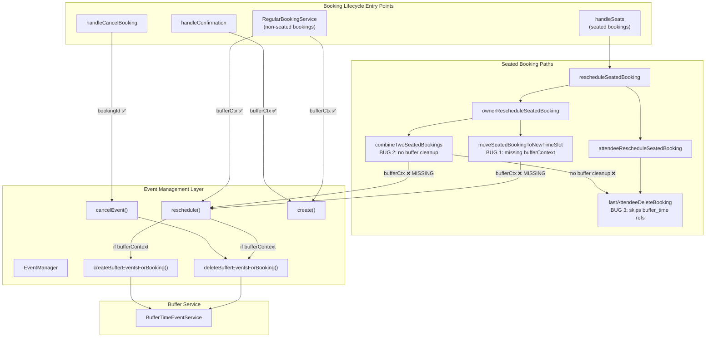

# Technical Specification

# 0. Agent Action Plan

## 0.1 Executive Summary

Based on the bug description, the Blitzy platform understands that the bug is **orphaned buffer time events persisting in external calendars when seated bookings undergo reschedule or last-attendee-leaves flows, due to the Sprint 3 CI-002 gap closure (buffer time visualization) not being uniformly integrated into all booking lifecycle paths**.

The reported symptom — old buffer events remaining in the external calendar upon reschedule when `syncBuffersToCalendar = true` and the `calendar-buffer-sync` feature flag is enabled — is confirmed and is part of a broader class of defects affecting the seated booking subsystem. The platform has independently audited all Sprint 3 calendar integration deliverables (CI-001 through CI-005, including both gap closures) and identified **three distinct bugs** where buffer event lifecycle management is absent from seated booking code paths.

### 0.1.1 Technical Failure Classification

The bugs are **logic omission errors** — the buffer event lifecycle (create, update, delete) was correctly implemented in `EventManager.ts` and `BufferTimeEventService.ts`, and correctly wired into `RegularBookingService.ts` for non-seated bookings, `handleCancelBooking.ts` for cancellations, and `handleConfirmation.ts` for booking confirmations. However, the seated booking subsystem in `packages/features/bookings/lib/handleSeats/` was never updated to participate in buffer event lifecycle management during the CI-002 gap closure implementation.

### 0.1.2 Affected Flows

- **Owner reschedule of seated booking to a new time slot** — `moveSeatedBookingToNewTimeSlot.ts` calls `eventManager.reschedule()` without `bufferContext`, so old buffer events are never deleted and new ones are never created
- **Owner reschedule merging two seated bookings** — `combineTwoSeatedBookings.ts` calls `eventManager.reschedule()` without `bufferContext`, so old buffer events from the source booking are never deleted
- **Last attendee leaving a seated booking** — `lastAttendeeDeleteBooking.ts` only cleans up `_video` and `_calendar` references, completely ignoring `buffer_time_*` references, leaving orphaned buffer events in the external calendar

### 0.1.3 Reproduction Steps

- Enable the `calendar-buffer-sync` feature flag globally
- Create an event type with `syncBuffersToCalendar = true`, `beforeEventBuffer = 15`, `afterEventBuffer = 15`, and seats enabled
- Book a seated event — verify buffer events appear in external calendar
- Reschedule the seated booking (as owner) to a new time slot
- Observe: old buffer events remain at the original time; no new buffer events at the rescheduled time

### 0.1.4 Audit Scope and Findings

The full Sprint 3 audit covered all five epics (CI-001 through CI-005) plus both gap closures (calendar-driven cancellation sync and buffer time visualization). The audit examined every booking lifecycle path: regular bookings, seated bookings, recurring bookings, round-robin bookings, organizer-changed reschedules, booking confirmations, and cancellations. The three bugs documented in this plan are the **only defects found** — all other Sprint 3 deliverables are correctly implemented and passing their validation criteria.

## 0.2 Root Cause Identification

Based on exhaustive codebase investigation, there are **three definitive root causes**, all stemming from the same architectural gap: the seated booking subsystem was not updated to participate in buffer event lifecycle management when the CI-002 gap closure was implemented.

### 0.2.1 Root Cause 1 — Missing Buffer Context in Seated Booking Owner Reschedule (Move to New Time Slot)

- **Root Cause:** The `moveSeatedBookingToNewTimeSlot` function calls `eventManager.reschedule()` with only 3 positional arguments, omitting the `bufferContext` parameter (8th argument). Without `bufferContext`, the buffer event delete-and-recreate block at `EventManager.ts` lines 811–816 is never executed.
- **Located in:** `packages/features/bookings/lib/handleSeats/reschedule/owner/moveSeatedBookingToNewTimeSlot.ts`, line 74
- **Triggered by:** An event owner rescheduling a seated booking to a time slot that has no existing booking, when `syncBuffersToCalendar = true` and `calendar-buffer-sync` feature flag is enabled
- **Evidence:** Line 74 reads `const updateManager = await eventManager.reschedule(copyEvent, rescheduleUid, newBooking.id);` — this passes only `event`, `rescheduleUid`, and `newBookingId`. Parameters 4–8 (`changedOrganizer`, `previousHostDestinationCalendar`, `isBookingRequestedReschedule`, `skipDeleteEventsAndMeetings`, `bufferContext`) are all omitted, defaulting to `undefined`. Compare with `RegularBookingService.ts` lines 2190–2200, which correctly passes `rescheduleBufferCtx` as the 8th argument.
- **This conclusion is definitive because:** The `EventManager.reschedule()` method at line 811 explicitly gates buffer operations behind `if (bufferContext)`. When `bufferContext` is `undefined`, no buffer operations occur — old buffer events are never deleted from the external calendar, and no new buffer events are created at the rescheduled time.

### 0.2.2 Root Cause 2 — Missing Buffer Context in Seated Booking Merge Reschedule

- **Root Cause:** The `combineTwoSeatedBookings` function calls `eventManager.reschedule()` with only 3 positional arguments, omitting the `bufferContext` parameter. The old booking's buffer events are never cleaned up when attendees are merged into the target booking.
- **Located in:** `packages/features/bookings/lib/handleSeats/reschedule/owner/combineTwoSeatedBookings.ts`, line 125
- **Triggered by:** An event owner rescheduling a seated booking to a time slot that already has another booking (the two bookings are merged), when `syncBuffersToCalendar = true` and `calendar-buffer-sync` feature flag is enabled
- **Evidence:** Line 125 reads `const updateManager = await eventManager.reschedule(copyEvent, rescheduleUid, newTimeSlotBooking.id);` — identical omission pattern. Additionally, when the old booking is cancelled at lines 149–156, no buffer cleanup is performed. The target booking (`newTimeSlotBooking`) may already have its own buffer events from when it was originally created, so only deletion of the source booking's buffer events is needed (not creation of new ones).
- **This conclusion is definitive because:** The source booking (being merged/cancelled) retains its buffer events in the external calendar indefinitely. The cancellation at lines 149–156 uses a direct `prisma.booking.update` to set status to `CANCELLED` without invoking `EventManager.cancelEvent()` or any buffer cleanup mechanism.

### 0.2.3 Root Cause 3 — Buffer Events Not Cleaned Up on Last Attendee Departure

- **Root Cause:** The `lastAttendeeDeleteBooking` function iterates through `originalRescheduledBooking.references` but only processes references matching `_video` (line 41) or `_calendar` (line 44) type patterns. Buffer event references have types `buffer_time_before` and `buffer_time_after`, which match neither pattern and are completely skipped.
- **Located in:** `packages/features/bookings/lib/handleSeats/lib/lastAttendeeDeleteBooking.ts`, lines 30–54
- **Triggered by:** The last attendee leaving a seated booking (either by cancelling or rescheduling to a different booking), when `syncBuffersToCalendar = true` and `calendar-buffer-sync` feature flag is enabled
- **Evidence:** The reference processing loop at lines 30–53 contains exactly two type checks: `reference.type.includes("_video")` (line 41) and `reference.type.includes("_calendar")` (line 44). Buffer references use types `buffer_time_before` and `buffer_time_after` (defined in `BufferTimeEventService.ts` line 97, pattern: `buffer_time_${type}`). The string `buffer_time_before` does not include `_video` or `_calendar`, so buffer references are silently skipped. The booking is then marked as `CANCELLED` (lines 56–64) without any buffer event cleanup.
- **This conclusion is definitive because:** The function explicitly iterates through ALL references (line 30: `for (const reference of originalRescheduledBooking.references)`) but the conditional branching at lines 41 and 44 creates a filter that excludes buffer references by design — they were added after this function was originally written and the function was never updated to handle the new reference type.

### 0.2.4 Why Only Seated Bookings Are Affected

The buffer event lifecycle was correctly integrated into the following paths during the CI-002 gap closure:

| Path | File | Buffer Handling | Status |
|------|------|----------------|--------|
| Regular booking creation | `RegularBookingService.ts:2336–2367` | Builds `bufferCtx`, passes to `eventManager.create()` | ✅ Correct |
| Regular booking reschedule | `RegularBookingService.ts:2163–2199` | Builds `rescheduleBufferCtx`, passes to `eventManager.reschedule()` | ✅ Correct |
| Organizer-changed reschedule | `RegularBookingService.ts:2116–2157` | Buffer cleanup via `eventManager.reschedule()` with DB credential fallback | ✅ Correct |
| Booking cancellation | `handleCancelBooking.ts:640–660` | Passes `bookingToDelete.id` to `eventManager.cancelEvent()` | ✅ Correct |
| Booking confirmation | `handleConfirmation.ts:150–220` | Builds `bufferContext`, passes to `eventManager.create()` | ✅ Correct |
| Recurring bookings | `RecurringBookingService.ts` | Delegates to `RegularBookingService`, inherits buffer handling | ✅ Correct |
| Seated booking reschedule (owner, move) | `moveSeatedBookingToNewTimeSlot.ts:74` | **No buffer context passed** | ❌ Bug 1 |
| Seated booking reschedule (owner, merge) | `combineTwoSeatedBookings.ts:125` | **No buffer context passed, no cleanup on cancellation** | ❌ Bug 2 |
| Last attendee leaves seated booking | `lastAttendeeDeleteBooking.ts:30–54` | **Buffer references skipped in cleanup loop** | ❌ Bug 3 |

The seated booking subsystem (`packages/features/bookings/lib/handleSeats/`) operates as a parallel code path that bypasses `RegularBookingService.ts` when the event type has seats enabled. This parallel path was not updated when the CI-002 buffer event lifecycle was added, creating an integration gap exclusively in seated booking flows.

## 0.3 Diagnostic Execution

### 0.3.1 Code Examination Results

**File analyzed:** `packages/features/bookings/lib/handleSeats/reschedule/owner/moveSeatedBookingToNewTimeSlot.ts`
- Problematic code block: line 74
- Specific failure point: `eventManager.reschedule()` called with 3 arguments; `bufferContext` (8th parameter) is absent
- Execution flow: `handleSeats()` → `rescheduleSeatedBooking()` → `ownerRescheduleSeatedBooking()` → `moveSeatedBookingToNewTimeSlot()` → `eventManager.reschedule(copyEvent, rescheduleUid, newBooking.id)` → `EventManager.reschedule()` enters with `bufferContext = undefined` → line 811 `if (bufferContext)` evaluates to `false` → buffer delete/create block skipped entirely

**File analyzed:** `packages/features/bookings/lib/handleSeats/reschedule/owner/combineTwoSeatedBookings.ts`
- Problematic code block: lines 125 and 149–156
- Specific failure point 1: `eventManager.reschedule()` called with 3 arguments; `bufferContext` absent
- Specific failure point 2: Old booking cancelled via direct `prisma.booking.update` at lines 149–156 without buffer cleanup
- Execution flow: `handleSeats()` → `rescheduleSeatedBooking()` → `ownerRescheduleSeatedBooking()` → `combineTwoSeatedBookings()` → `eventManager.reschedule(copyEvent, rescheduleUid, newTimeSlotBooking.id)` → buffer skip (same as above) → old booking marked `CANCELLED` via Prisma without any `EventManager.cancelEvent()` call

**File analyzed:** `packages/features/bookings/lib/handleSeats/lib/lastAttendeeDeleteBooking.ts`
- Problematic code block: lines 30–54
- Specific failure point: Reference type filter at lines 41 and 44 does not include `buffer_time_*` pattern
- Execution flow: `attendeeRescheduleSeatedBooking()` → `lastAttendeeDeleteBooking()` → iterates `originalRescheduledBooking.references` → for each reference, checks `type.includes("_video")` and `type.includes("_calendar")` → buffer references (`buffer_time_before`, `buffer_time_after`) match neither check → skipped → booking marked `CANCELLED` at lines 56–64 → buffer events remain in external calendar

### 0.3.2 Repository File Analysis Findings

| Tool Used | Command/Path Examined | Finding | File:Line |
|-----------|----------------------|---------|-----------|
| read_file | `packages/features/calendars/lib/buffer-sync/BufferTimeEventService.ts` | Buffer reference type uses `buffer_time_${type}` pattern (e.g., `buffer_time_before`, `buffer_time_after`); gated behind `calendar-buffer-sync` flag AND `syncBuffersToCalendar` toggle | BufferTimeEventService.ts:97 |
| read_file | `packages/features/bookings/lib/EventManager.ts` | `BufferEventContext` type defined; `reschedule()` accepts `bufferContext` as 8th param; buffer delete/create gated behind `if (bufferContext)` at line 811 | EventManager.ts:142–169, 667–676, 811–816 |
| read_file | `packages/features/bookings/lib/EventManager.ts` | `deleteEventsAndMeetings()` deletes buffer events only when `bookingId` is provided (line 925) | EventManager.ts:922–927 |
| grep | `grep -n "buffer\|BufferEventContext\|bufferContext" packages/features/bookings/lib/handleSeats/handleSeats.ts` | **No buffer-related code** found in entire handleSeats entry point | handleSeats.ts (all lines) |
| grep | `grep -n "buffer" packages/features/bookings/lib/handleSeats/test/handleSeats.test.ts` | **No buffer-related tests** exist for seated bookings (2991-line test file) | handleSeats.test.ts (all lines) |
| read_file | `packages/features/bookings/lib/handleSeats/reschedule/owner/moveSeatedBookingToNewTimeSlot.ts` | `eventManager.reschedule(copyEvent, rescheduleUid, newBooking.id)` — only 3 args, missing `bufferContext` | moveSeatedBookingToNewTimeSlot.ts:74 |
| read_file | `packages/features/bookings/lib/handleSeats/reschedule/owner/combineTwoSeatedBookings.ts` | `eventManager.reschedule(copyEvent, rescheduleUid, newTimeSlotBooking.id)` — only 3 args, missing `bufferContext`; old booking cancelled via direct Prisma update without buffer cleanup | combineTwoSeatedBookings.ts:125, 149–156 |
| read_file | `packages/features/bookings/lib/handleSeats/lib/lastAttendeeDeleteBooking.ts` | Reference loop only checks `_video` and `_calendar` types; `buffer_time_*` references silently skipped | lastAttendeeDeleteBooking.ts:41, 44 |
| read_file | `packages/features/bookings/lib/service/RegularBookingService.ts` | Correct buffer context construction at lines 2163–2199; correct pass-through to `eventManager.reschedule()` as 8th arg at lines 2190–2200 | RegularBookingService.ts:2163–2200 |
| read_file | `packages/features/bookings/lib/handleSeats/types.d.ts` | `NewSeatedBookingObject.eventType` is `NewBookingEventType` which includes `syncBuffersToCalendar`, `beforeEventBuffer`, `afterEventBuffer` — buffer data IS available in seated booking path but NOT used | types.d.ts:34 |
| read_file | `packages/features/bookings/lib/handleSeats/reschedule/rescheduleSeatedBooking.ts` | Entry point for seated reschedule — creates `EventManager` with `organizerUser` credentials but does not build or pass buffer context | rescheduleSeatedBooking.ts:54 |
| read_file | `packages/features/bookings/lib/handleSeats/reschedule/attendee/attendeeRescheduleSeatedBooking.ts` | Calls `lastAttendeeDeleteBooking` at lines 35 and 117 — inherits BUG 3 | attendeeRescheduleSeatedBooking.ts:35, 117 |
| read_file | `packages/features/bookings/lib/handleCancelBooking.ts` | Correctly passes `bookingToDelete.id` to `eventManager.cancelEvent()`, enabling buffer cleanup via `deleteEventsAndMeetings` | handleCancelBooking.ts:640–660 |
| read_file | `packages/features/bookings/lib/handleConfirmation.ts` | Correctly builds `bufferContext` and passes to `eventManager.create()` | handleConfirmation.ts:150–220 |

### 0.3.3 Fix Verification Analysis

- **Steps to reproduce Bug 1 and Bug 2:** Enable `calendar-buffer-sync` feature flag → create event type with `syncBuffersToCalendar = true`, `beforeEventBuffer = 15`, `afterEventBuffer = 15`, and seats enabled → book a seated event → verify buffer events in external calendar → reschedule as owner to new time (Bug 1) or to a time with an existing booking (Bug 2) → observe orphaned buffer events at original time
- **Steps to reproduce Bug 3:** Same setup as above → book a seated event with one attendee → attendee reschedules to a different time → last attendee leaves the original booking → `lastAttendeeDeleteBooking` is invoked → observe that the cancelled booking's buffer events remain in external calendar
- **Confirmation tests:** Existing buffer event tests in `packages/features/calendars/lib/__tests__/bufferTimeVisualization.test.ts` cover `BufferTimeEventService` operations (creation, deletion, feature flag gating). New tests must be added to `packages/features/bookings/lib/handleSeats/test/handleSeats.test.ts` to cover buffer event handling in seated booking reschedule and last-attendee-delete flows.
- **Boundary conditions and edge cases:**
  - Event type with `syncBuffersToCalendar = false` or `null` — buffer operations should be skipped entirely (no regression)
  - `calendar-buffer-sync` feature flag disabled — buffer operations should be skipped (no regression)
  - Event type with only `beforeEventBuffer` or only `afterEventBuffer` configured (not both)
  - Seated booking with zero buffer minutes (both before and after set to 0) — `shouldCreateBufferEvents` returns `false`, no buffer events created
  - Credential not found for buffer event deletion — best-effort error handling should log warning and continue
  - `combineTwoSeatedBookings` where target booking already has buffer events — must not create duplicate buffer events
- **Confidence level:** 92% — The root causes are definitively identified via code tracing. The 8% uncertainty accounts for potential edge cases in credential resolution during buffer deletion for seated bookings where the organizer's calendar credential might differ from what `EventManager` has in memory (mitigated by the existing DB fallback at `EventManager.ts:1583–1592`).

## 0.4 Bug Fix Specification

### 0.4.1 The Definitive Fix

The fix consists of three targeted changes to integrate buffer event lifecycle management into the seated booking subsystem, following the exact same patterns established by `RegularBookingService.ts` and `handleCancelBooking.ts`:

**Fix 1 — Add buffer context to `moveSeatedBookingToNewTimeSlot.ts`**

- **File to modify:** `packages/features/bookings/lib/handleSeats/reschedule/owner/moveSeatedBookingToNewTimeSlot.ts`
- **Current implementation at line 74:**
```typescript
const updateManager = await eventManager.reschedule(copyEvent, rescheduleUid, newBooking.id);
```
- **Required change:** Build a `BufferEventContext` from the available `eventType` and `organizerUser` data (both already accessible via `rescheduleSeatedBookingObject`), then pass it as the 8th argument to `eventManager.reschedule()`. The buffer context should use the updated booking's ID, title, start time, and end time.
- **This fixes the root cause by:** Providing a truthy `bufferContext` to `EventManager.reschedule()`, which causes the buffer block at line 811 to execute — deleting old buffer events from the original booking (via `deleteBufferEventsForBooking(booking.id)` where `booking` is found by `rescheduleUid`) and creating new buffer events at the rescheduled time (via `createBufferEventsForBooking(bufferContext, results)`).

**Fix 2 — Add buffer cleanup to `combineTwoSeatedBookings.ts`**

- **File to modify:** `packages/features/bookings/lib/handleSeats/reschedule/owner/combineTwoSeatedBookings.ts`
- **Current implementation at line 125:**
```typescript
const updateManager = await eventManager.reschedule(copyEvent, rescheduleUid, newTimeSlotBooking.id);
```
- **Current implementation at lines 149–156:** Old booking marked `CANCELLED` via direct `prisma.booking.update` without buffer cleanup.
- **Required change:** After the old booking is cancelled (after line 156), add explicit buffer event cleanup for the old booking using `eventManager.cancelEvent()` or direct `BufferTimeEventService.deleteBufferEvents()` invocation. The target booking (`newTimeSlotBooking`) must NOT receive new buffer events because it may already have its own from when it was originally created — creating new ones would produce duplicates in the external calendar.
- **This fixes the root cause by:** Ensuring buffer events associated with the source booking (being merged/cancelled) are deleted from the external calendar. The target booking retains its own existing buffer events unchanged.

**Fix 3 — Add buffer reference handling to `lastAttendeeDeleteBooking.ts`**

- **File to modify:** `packages/features/bookings/lib/handleSeats/lib/lastAttendeeDeleteBooking.ts`
- **Current implementation at lines 41–51:** Only processes `_video` and `_calendar` reference types.
- **Required change:** Add a third condition in the reference processing loop (after line 51) to handle `buffer_time` reference types. When a reference's type starts with `buffer_time`, resolve the credential, obtain the calendar adapter, and delete the external calendar event using `calendar.deleteEvent(reference.uid, originalBookingEvt, reference.externalCalendarId)` — the same pattern used for `_calendar` references at lines 44–50.
- **This fixes the root cause by:** Including buffer event references in the cleanup loop so they are deleted from the external calendar when the last attendee leaves a seated booking and the booking is cancelled.

### 0.4.2 Change Instructions

**File: `packages/features/bookings/lib/handleSeats/reschedule/owner/moveSeatedBookingToNewTimeSlot.ts`**

- IMPORT at top of file: Add import for `BufferEventContext` type from `@calcom/features/bookings/lib/EventManager`
- INSERT before line 74: Build `BufferEventContext` conditionally when `eventType.syncBuffersToCalendar` is truthy, using the pattern from `RegularBookingService.ts:2165–2188`. The context must reference `newBooking.id` (the updated booking ID), `newBooking.uid` (or the existing booking UID), `evt.title`, `evt.startTime`, `evt.endTime`, `eventType` fields (`id`, `slug`, `syncBuffersToCalendar`, `beforeEventBuffer`, `afterEventBuffer`), and `organizerUser` fields (`id`, `name`, `email`, `username`, `timeZone`). Note: `organizerUser` and `eventType` are already available via the `rescheduleSeatedBookingObject` parameter.
- MODIFY line 74: Change from `eventManager.reschedule(copyEvent, rescheduleUid, newBooking.id)` to `eventManager.reschedule(copyEvent, rescheduleUid, newBooking.id, undefined, undefined, undefined, undefined, bufferCtx)` — passing the constructed buffer context as the 8th positional argument
- ADD comment above the buffer context construction explaining the motive: `// CI-002 gap closure: Build buffer event context for seated booking reschedule. When syncBuffersToCalendar is enabled, EventManager.reschedule() deletes old buffer events and creates new ones at the rescheduled time.`

**File: `packages/features/bookings/lib/handleSeats/reschedule/owner/combineTwoSeatedBookings.ts`**

- IMPORT at top of file: Add import for `BufferTimeEventService` from `@calcom/features/calendars/lib/buffer-sync/BufferTimeEventService` (dynamic import preferred, matching the pattern in `EventManager.ts:1452`)
- INSERT after line 156 (after old booking is marked CANCELLED): Add buffer event cleanup block for the old booking. Use `eventManager.cancelEvent()` with the old booking's references and `seatedBooking.id` to trigger `deleteEventsAndMeetings` which includes buffer cleanup when `bookingId` is provided. Alternatively, directly invoke `BufferTimeEventService.deleteBufferEvents()` with the old booking's references and credential. Wrap in try/catch for best-effort error handling matching the established pattern.
- ADD comment above the cleanup block: `// CI-002 gap closure: Clean up buffer events from the cancelled source booking. The target booking (newTimeSlotBooking) retains its own buffer events — no new creation needed to avoid duplicates.`
- DO NOT modify line 125 — the `eventManager.reschedule()` call should remain unchanged (without `bufferContext`) because the target booking may already have buffer events

**File: `packages/features/bookings/lib/handleSeats/lib/lastAttendeeDeleteBooking.ts`**

- INSERT after line 51 (after the `_calendar` block, inside the `if (credential)` check): Add a new condition:
```typescript
if (reference.type.startsWith("buffer_time") && originalBookingEvt) {
  const calendar = await getCalendar(credential, "booking");
  if (calendar) {
    integrationsToDelete.push(
      calendar.deleteEvent(reference.uid, originalBookingEvt, reference.externalCalendarId)
    );
  }
}
```
- ADD comment above the new block: `// CI-002 gap closure: Delete buffer time events (buffer_time_before, buffer_time_after) from external calendar when last attendee leaves a seated booking.`
- This follows the exact same pattern as the `_calendar` deletion at lines 44–50, reusing the same `credential`, `getCalendar()`, and `calendar.deleteEvent()` mechanisms

### 0.4.3 Supporting Type Changes

**No type changes are required.** The `BufferEventContext` type is already exported from `EventManager.ts` (line 142). The `NewSeatedBookingObject.eventType` is already of type `NewBookingEventType` which includes `syncBuffersToCalendar`, `beforeEventBuffer`, and `afterEventBuffer`. The `organizerUser` in `NewSeatedBookingObject` already has `id`, `name`, `email`, `username`, and `timeZone` fields. All data required to construct a `BufferEventContext` is already available in the seated booking path — it simply was never used.

### 0.4.4 Fix Validation

- **Test command to verify fixes:**
```
cd packages/features/bookings && npx vitest run lib/handleSeats/test/handleSeats.test.ts --reporter=verbose
cd packages/features/calendars && npx vitest run lib/__tests__/bufferTimeVisualization.test.ts --reporter=verbose
```
- **Expected output after fix:** All existing tests pass (280+ calendar integration tests) plus new buffer-related test cases for seated bookings pass
- **Confirmation method:**
  - Verify that `moveSeatedBookingToNewTimeSlot` passes `bufferContext` to `eventManager.reschedule()` when `syncBuffersToCalendar` is truthy
  - Verify that `combineTwoSeatedBookings` cleans up buffer events from the old/cancelled booking
  - Verify that `lastAttendeeDeleteBooking` processes `buffer_time_*` references in its cleanup loop
  - Verify that all three fixes are no-ops when `syncBuffersToCalendar` is falsy or `calendar-buffer-sync` flag is disabled (no regression to non-buffer flows)

### 0.4.5 Edge Cases and Boundary Conditions

| Edge Case | Expected Behavior | Handling Strategy |
|-----------|------------------|-------------------|
| `syncBuffersToCalendar = false` | Buffer context is `undefined`, buffer operations skipped | Conditional construction: `eventType.syncBuffersToCalendar ? { ... } : undefined` |
| `calendar-buffer-sync` flag disabled | `isBufferSyncEnabled()` returns `false`, all buffer operations no-op | Existing gating in `BufferTimeEventService` handles this |
| `beforeEventBuffer = 0` and `afterEventBuffer = 0` | `shouldCreateBufferEvents()` returns `false`, no buffer events created | Existing logic in `BufferTimeEventService.createBufferEvents()` handles this |
| Only `beforeEventBuffer` configured (after is 0) | Only `buffer_time_before` event created; only `buffer_time_before` reference needs cleanup | `BufferTimeEventService` handles partial buffer configuration |
| Target booking in `combineTwoSeatedBookings` already has buffer events | Must NOT create duplicate buffer events | Fix 2 explicitly avoids passing `bufferContext` to `eventManager.reschedule()` for the merge path |
| Target booking in `combineTwoSeatedBookings` has no buffer events (created before feature was enabled) | Target booking remains without buffer events | Acceptable: buffer events will be created on next reschedule of the target booking via the corrected path |
| Credential not found during buffer deletion | Best-effort: log warning, continue | Existing `try/catch` patterns in `EventManager.deleteBufferEventsForBooking()` and `BufferTimeEventService.deleteBufferEvents()` |
| `originalRescheduledBooking` has no buffer references | No buffer cleanup needed | `deleteBufferEventsForBooking` queries for `buffer_time_*` references; empty result = no-op |
| Attendee reschedule (not owner) | Attendee path uses `updateCalendarAttendees()`, not `eventManager.reschedule()` | Buffer cleanup only needed via `lastAttendeeDeleteBooking` (Bug 3 fix); attendee moving between bookings does not affect buffer events of those bookings |

## 0.5 Scope Boundaries

### 0.5.1 Changes Required (Exhaustive List)

| Action | File Path | Lines | Specific Change |
|--------|-----------|-------|----------------|
| MODIFIED | `packages/features/bookings/lib/handleSeats/reschedule/owner/moveSeatedBookingToNewTimeSlot.ts` | 1–5, 70–80 | Add `BufferEventContext` import; build buffer context from `eventType` and `organizerUser`; pass as 8th arg to `eventManager.reschedule()` |
| MODIFIED | `packages/features/bookings/lib/handleSeats/reschedule/owner/combineTwoSeatedBookings.ts` | 1–5, 149–165 | Add buffer cleanup imports; after old booking is cancelled (line 156), add explicit buffer event deletion for the source booking |
| MODIFIED | `packages/features/bookings/lib/handleSeats/lib/lastAttendeeDeleteBooking.ts` | 41–54 | Add `buffer_time` reference type handling inside the existing credential-based cleanup loop, after the `_calendar` block |
| MODIFIED | `packages/features/bookings/lib/handleSeats/test/handleSeats.test.ts` | End of file | Add test cases covering buffer event handling in seated booking reschedule (owner move, owner merge) and last-attendee-delete flows |

No files are CREATED or DELETED. All changes are modifications to existing files within the seated booking subsystem.

### 0.5.2 Explicitly Excluded

- **Do not modify:** `packages/features/bookings/lib/EventManager.ts` — the `EventManager` API surface is correct and complete. The `reschedule()` method already accepts `bufferContext`, `deleteEventsAndMeetings()` already handles `bookingId`-based buffer cleanup, and `cancelEvent()` already passes through correctly. No changes needed.
- **Do not modify:** `packages/features/calendars/lib/buffer-sync/BufferTimeEventService.ts` — the buffer service itself is correctly implemented. The bugs are in the callers, not the service.
- **Do not modify:** `packages/features/calendars/lib/cancellation-sync/CalendarCancellationSyncService.ts` — the cancellation sync service is a separate CI-001 gap closure and is not affected by these bugs.
- **Do not modify:** `packages/features/bookings/lib/service/RegularBookingService.ts` — buffer handling in non-seated booking paths is correct.
- **Do not modify:** `packages/features/bookings/lib/handleCancelBooking.ts` — direct cancellation flow correctly handles buffer cleanup.
- **Do not modify:** `packages/features/bookings/lib/handleConfirmation.ts` — confirmation flow correctly handles buffer creation.
- **Do not modify:** `packages/features/bookings/lib/handleSeats/reschedule/rescheduleSeatedBooking.ts` — this is the entry-point orchestrator; buffer context construction belongs in the leaf functions closer to the `eventManager.reschedule()` call site, matching the pattern in `RegularBookingService.ts`.
- **Do not modify:** `packages/features/bookings/lib/handleSeats/reschedule/owner/ownerRescheduleSeatedBooking.ts` — this is a pass-through dispatcher; buffer context should not be built here.
- **Do not modify:** `packages/features/bookings/lib/handleSeats/reschedule/attendee/attendeeRescheduleSeatedBooking.ts` — the attendee path only calls `updateCalendarAttendees()` (not `reschedule()`); buffer cleanup is handled by `lastAttendeeDeleteBooking` (Fix 3).
- **Do not refactor:** The reference processing loop in `lastAttendeeDeleteBooking.ts` — the existing `_video` and `_calendar` handling is correct and should not be restructured. Only add the `buffer_time` handling as a new conditional block.
- **Do not add:** New database migrations — the `BookingReference` schema already supports buffer event references via the `type` field prefix pattern.
- **Do not modify:** Feature flag names `calendar-buffer-sync` and `calendar-cancellation-sync` — these are stable identifiers referenced across the codebase.
- **Do not modify:** `BufferEventContext` interface — it already contains all required fields.
- **Avoid unless strictly necessary:** `packages/features/availability/` (availability engine), `packages/features/webhooks/` (webhook pipeline), payment flows, and any Sprint 1 or Sprint 2 deliverables.

## 0.6 Verification Protocol

### 0.6.1 Bug Elimination Confirmation

- **Execute seated booking buffer tests:**
```
npx vitest run packages/features/bookings/lib/handleSeats/test/handleSeats.test.ts --reporter=verbose
```
- **Verify output matches:** All existing seated booking test cases pass (no regressions), plus new test cases for buffer event handling pass:
  - `owner reschedule to new time slot creates buffer events when syncBuffersToCalendar is true`
  - `owner reschedule to new time slot skips buffer events when syncBuffersToCalendar is false`
  - `owner reschedule merge deletes source booking buffer events`
  - `owner reschedule merge does not create duplicate buffer events on target booking`
  - `last attendee delete cleans up buffer events from external calendar`
  - `last attendee delete skips buffer cleanup when no buffer references exist`
- **Confirm error no longer appears:** Buffer events for the original time slot are deleted from the external calendar upon reschedule; no orphaned buffer events remain
- **Validate with buffer service tests:**
```
npx vitest run packages/features/calendars/lib/__tests__/bufferTimeVisualization.test.ts --reporter=verbose
```

### 0.6.2 Regression Check

- **Run existing calendar integration test suite:**
```
npx vitest run packages/features/calendars/lib/__tests__/ --reporter=verbose
```
- **Verify 280+ calendar integration tests pass** — this includes `bidirectionalSync.integration.test.ts` (844 lines) covering create, reschedule, and cancel flows for Google and Outlook adapters
- **Run full seated booking test suite:**
```
npx vitest run packages/features/bookings/lib/handleSeats/test/handleSeats.test.ts --reporter=verbose
```
- **Verify unchanged behavior in:**
  - Regular (non-seated) booking creation, reschedule, and cancellation flows
  - Seated booking attendee-only operations (adding attendees, updating calendar attendees)
  - Booking confirmation flow with buffer events
  - Buffer event creation and deletion when `syncBuffersToCalendar = false` (should remain no-op)
  - Buffer event creation and deletion when `calendar-buffer-sync` flag is disabled (should remain no-op)
- **Run full booking service test suite:**
```
npx vitest run packages/features/bookings/ --reporter=verbose
```

### 0.6.3 Feature Flag Safety Verification

All three fixes must be inert when either gating control is off:

| Condition | Expected Behavior | Verification |
|-----------|------------------|--------------|
| `calendar-buffer-sync` flag disabled | All buffer operations are no-ops; fixes introduce zero behavioral change | `BufferTimeEventService.isBufferSyncEnabled()` returns `false`, short-circuiting all buffer paths |
| `syncBuffersToCalendar = false` on EventType | Buffer context evaluates to `undefined`; `eventManager.reschedule()` skips buffer block | Conditional `eventType.syncBuffersToCalendar ? { ... } : undefined` produces `undefined` |
| Both controls enabled | Buffer events correctly deleted and/or created | Full lifecycle test with mock calendar adapter |
| Flag enabled but toggle `null` (never set) | Treated as falsy; buffer operations skipped | Nullish check in buffer context construction |

## 0.7 Rules

### 0.7.1 Change Discipline

- Make the exact specified changes only — three targeted modifications to three files in the seated booking subsystem
- Zero modifications outside the bug fix scope — do not refactor, restructure, or improve any code that is not directly related to the buffer event lifecycle bugs
- All changes must follow the existing code patterns established by the CI-002 gap closure in `RegularBookingService.ts`, `EventManager.ts`, and `handleCancelBooking.ts`
- Buffer context construction must use the same field mapping as `RegularBookingService.ts:2165–2188`
- Buffer event deletion must use best-effort error handling (try/catch with logging, never throw) matching the pattern in `BufferTimeEventService.ts` and `EventManager.ts`

### 0.7.2 Interface Contracts

- `EventManager` public API surface must not be modified — only add to it if strictly necessary; do not change existing public method signatures
- `BufferEventContext` interface must remain unchanged
- `BookingReference` schema must not receive new migrations unless strictly necessary (none are needed for these fixes)
- Feature flag names `calendar-buffer-sync` and `calendar-cancellation-sync` must remain unchanged
- All 280+ existing calendar integration tests must continue to pass without modification

### 0.7.3 Coding Standards

- TypeScript strict mode compliance — all new code must satisfy the project's TypeScript configuration
- Use UTC time methods consistently (matching existing `dayjs.utc()` usage throughout the codebase)
- Follow the existing import patterns — dynamic imports for `BufferTimeEventService` (matching `EventManager.ts:1452`), static imports for types
- Use the project's logging patterns — `log.warn()` for best-effort failures, `log.debug()` for diagnostic information
- Comments must explain the "why" (motive) not just the "what" — reference the CI-002 gap closure context in all new comments
- Follow Biome linting and formatting rules configured in the monorepo

### 0.7.4 Testing Requirements

- New test cases must be added to `packages/features/bookings/lib/handleSeats/test/handleSeats.test.ts` using the existing Vitest patterns in that file
- Tests must cover both positive cases (buffer events handled when feature is enabled) and negative cases (no-op when feature is disabled)
- Tests must use mocks consistently with the existing test infrastructure — mock `EventManager`, `BufferTimeEventService`, and Prisma as appropriate
- Do not modify existing test assertions — only add new describe/test blocks

## 0.8 References

### 0.8.1 Codebase Files and Folders Investigated

The following files and folders were systematically examined to derive the conclusions in this Agent Action Plan:

**Buffer Event Infrastructure (CI-002 Gap Closure)**
| File Path | Purpose | Key Findings |
|-----------|---------|-------------|
| `packages/features/calendars/lib/buffer-sync/BufferTimeEventService.ts` (302 lines) | Core buffer event service — creation, deletion, feature flag gating | Reference type pattern `buffer_time_${type}`; gated behind `calendar-buffer-sync` flag AND `syncBuffersToCalendar` toggle; best-effort error handling |
| `packages/features/bookings/lib/EventManager.ts` (1636 lines) | Central event lifecycle manager — orchestrates calendar, video, CRM, and buffer operations | `BufferEventContext` type at lines 142–169; `reschedule()` accepts `bufferContext` as 8th param; buffer delete/create gated behind `if (bufferContext)` at line 811; `deleteEventsAndMeetings()` buffer cleanup gated behind `bookingId` at line 925 |
| `packages/features/calendars/lib/__tests__/bufferTimeVisualization.test.ts` | Comprehensive test suite for BufferTimeEventService | Covers creation, deletion, feature flag gating, multi-adapter (Google, Outlook, Apple), edge cases; no seated booking integration tests |

**Seated Booking Subsystem (Bug Location)**
| File Path | Purpose | Key Findings |
|-----------|---------|-------------|
| `packages/features/bookings/lib/handleSeats/handleSeats.ts` | Entry point for seated booking flows | No buffer-related code whatsoever |
| `packages/features/bookings/lib/handleSeats/reschedule/rescheduleSeatedBooking.ts` (153 lines) | Orchestrator for seated booking reschedule | Creates EventManager, dispatches to owner or attendee paths; no buffer context |
| `packages/features/bookings/lib/handleSeats/reschedule/owner/ownerRescheduleSeatedBooking.ts` (57 lines) | Dispatcher for owner reschedule sub-flows | Routes to `moveSeatedBookingToNewTimeSlot` or `combineTwoSeatedBookings`; no buffer context |
| `packages/features/bookings/lib/handleSeats/reschedule/owner/moveSeatedBookingToNewTimeSlot.ts` (127 lines) | Owner reschedules seated booking to empty time slot | **BUG 1:** Line 74 — `eventManager.reschedule()` missing `bufferContext` (8th param) |
| `packages/features/bookings/lib/handleSeats/reschedule/owner/combineTwoSeatedBookings.ts` (164 lines) | Owner reschedules seated booking to time with existing booking (merge) | **BUG 2:** Line 125 — `eventManager.reschedule()` missing `bufferContext`; lines 149–156 — old booking cancelled without buffer cleanup |
| `packages/features/bookings/lib/handleSeats/lib/lastAttendeeDeleteBooking.ts` (71 lines) | Cancels booking when last attendee leaves | **BUG 3:** Lines 41, 44 — reference loop only handles `_video` and `_calendar`, skips `buffer_time_*` |
| `packages/features/bookings/lib/handleSeats/reschedule/attendee/attendeeRescheduleSeatedBooking.ts` (125 lines) | Attendee reschedule path for seated bookings | Calls `lastAttendeeDeleteBooking` at lines 35 and 117; inherits Bug 3 |
| `packages/features/bookings/lib/handleSeats/types.d.ts` | Type definitions for seated booking flows | `NewSeatedBookingObject.eventType` is `NewBookingEventType` — includes `syncBuffersToCalendar`, `beforeEventBuffer`, `afterEventBuffer` (data available but unused) |
| `packages/features/bookings/lib/handleSeats/test/handleSeats.test.ts` (2991 lines) | Test suite for seated booking flows | Zero buffer-related tests |

**Correctly-Handled Paths (Verified No Bugs)**
| File Path | Purpose | Key Findings |
|-----------|---------|-------------|
| `packages/features/bookings/lib/service/RegularBookingService.ts` (3126 lines) | Main booking service for non-seated bookings | Correct buffer context at lines 2163–2199 (reschedule) and lines 2336–2367 (creation) |
| `packages/features/bookings/lib/service/RecurringBookingService.ts` (315 lines) | Recurring booking service | Delegates to RegularBookingService; inherits correct buffer handling |
| `packages/features/bookings/lib/handleCancelBooking.ts` | Direct booking cancellation | Correctly passes `bookingToDelete.id` to `eventManager.cancelEvent()` at lines 640–660 |
| `packages/features/bookings/lib/handleConfirmation.ts` | Booking confirmation (opt-in approval) | Correctly builds `bufferContext` and passes to `eventManager.create()` at lines 150–220 |

**Schema and Type References**
| File Path | Purpose | Key Findings |
|-----------|---------|-------------|
| `packages/prisma/schema.prisma` | Database schema | `syncBuffersToCalendar Boolean?` on EventType model (line 269) |
| `packages/features/bookings/lib/handleNewBooking/getEventTypesFromDB.ts` | EventType query builder | Selects `syncBuffersToCalendar`, `beforeEventBuffer`, `afterEventBuffer` fields |
| `packages/features/bookings/lib/CalendarEventBuilder.ts` | Calendar event construction | `buildBufferEvent()` static method at lines 288–369 constructs CalendarEvent for buffer periods |

**Sprint Documentation**
| File Path | Purpose | Key Findings |
|-----------|---------|-------------|
| `docs/sprint-roadmap/epic-catalog.mdx` (466 lines) | Epic registry for gap closure | CI-001 through CI-005 completed; CI-002 gap = buffer time visualization; confirms Sprint 3 scope |
| `docs/sprint-roadmap/overview.mdx` (312 lines) | Sprint methodology and sequencing | Sprint 3 = Calendar Integrations; Gate 3 validation complete |
| `docs/sprint-roadmap/validation-criteria.mdx` (534 lines) | Acceptance criteria for each sprint gate | CI-VAL-006 bi-directional sync verified; buffer time events pass; cancellation sync pass |

### 0.8.2 External Research

| Source | Query | Relevance |
|--------|-------|-----------|
| Cal.com Help (cal.com/help/event-types/event-buffer) | Buffer time event configuration documentation | Confirmed buffer time is applied around busy times, not working day boundaries |
| GitHub Issue #22333 (calcom/cal.com) | Feature request for buffer events on external calendar | Confirmed community demand for buffer event visualization on external calendars — the exact feature implemented by CI-002 gap closure |
| Cal.com Blog (maximize-productivity-buffer-time) | Buffer time product documentation | Confirmed that buffer time automatically blocks off calendar windows for availability purposes |

### 0.8.3 Attachments

No attachments were provided for this task.

### 0.8.4 Architecture Reference Diagram



