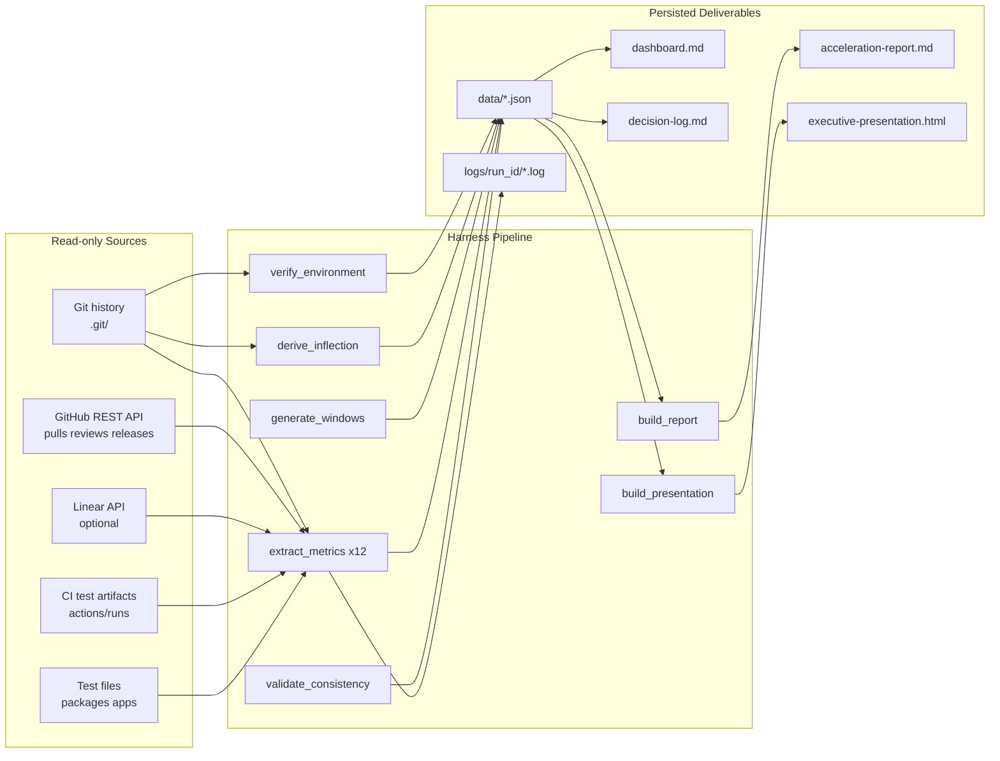

# Development Acceleration Measurement — blitzy-cal

## Purpose

This directory contains the deliverable for the Development Acceleration Measurement of the `blitzy-cal` repository. The Before/After boundary is the introduction of Blitzy Agent on **2026-02-25T00:24:31Z** — earliest commit `9d80a5d026` authored by `agent@blitzy.com`. The primary deliverable is [`acceleration-report.md`](./acceleration-report.md) in this same directory; the artifacts described in this README are produced by the extraction harness under [`scripts/`](./scripts/) and are validated against the rules listed in the report's Methodology section.

The purpose of this onboarding document is to take a new developer from a clean machine to a running extraction harness without asking questions. It covers the harness's intent (what it measures and why), the quickstart command sequence (clone, configure, run), the domain context (DORA / Flow Framework primer), the common pitfalls (rate limits, history rewrites, missing data sources), the architecture (extraction pipeline overview), the observability surface (structured logging with correlation IDs), the verification procedure (how to confirm a run was correct), the cross-references (where to find each deliverable artifact), and the suggested next tasks (improvements discovered during development that are out of scope but worth pursuing). The Onboarding rule mandates this scope; the section list below maps each rule requirement to its corresponding H2 section. Per AAP §0.5.2, the eight sections that follow are Quickstart, Domain Context, Common Pitfalls, Architecture, Suggested Next Tasks, Observability — Log Line Schema, Verifying a Run, and Cross-References.

> **Status at a Glance**
>
> - Repository: `Blitzy-Sandbox/blitzy-cal` (default branch `main`)
> - Analysis window: 2021-03-10 → 2026-05-18 (16,947 commits)
> - Inflection date: 2026-02-25T00:24:31Z (earliest Blitzy Agent commit)
> - Post-introduction window: ~80–90 days as of analysis cutoff
> - Total Blitzy-authored commits in window: 654 (as of AAP reconnaissance)
> - Total revert commits on default: ~169–204 (verify via `git log --grep='^Revert' --pretty=format:'%H' | wc -l`)
> - Skip-annotation count: 146 (as of AAP reconnaissance)

Every count in the Status callout above is a snapshot from the AAP reconnaissance step. Live values are recomputed by the harness on each run and persisted to `data/environment.json`, `data/inflection.json`, and the per-metric `data/metric_<N>.json` files. The report rendered from those files is the authoritative source of the current numbers.

---

## Quickstart

The goal is to take a clean developer machine to a running harness using only Python 3.10+ and `git` (both typically pre-installed). No third-party Python packages are required; the harness uses standard library modules exclusively. Execute the following ten commands in order:

```bash
# 1. Clone the analyzed repository (read-only)
git clone https://github.com/Blitzy-Sandbox/blitzy-cal.git
cd blitzy-cal

# 2. Verify Python 3.10+ is installed
python3 --version  # should be 3.10 or higher

# 3. Export required GitHub token (fine-grained PAT with read scopes)
export GITHUB_TOKEN=ghp_xxxxxxxxxxxxxxxxxxxx

# 4. (Optional) Export Linear API key for stronger M6/M12 signal
export LINEAR_API_KEY=lin_api_xxxxxxxxxxxxxxxx

# 5. (Optional) Set a stable run ID; otherwise the harness generates a UUIDv4
export BLITZY_RUN_ID=$(python3 -c 'import uuid; print(uuid.uuid4())')

# 6. Verify the environment
python3 blitzy/reports/acceleration/scripts/verify_environment.py

# 7. Detect the AI tool introduction date
python3 blitzy/reports/acceleration/scripts/derive_inflection.py

# 8. Generate the 2-week window table
python3 blitzy/reports/acceleration/scripts/generate_windows.py

# 9. Run the full extraction harness (all 12 metrics)
python3 blitzy/reports/acceleration/scripts/extract_metrics.py --metric all

# 10. Build the report and presentation
python3 blitzy/reports/acceleration/scripts/build_report.py && \
  python3 blitzy/reports/acceleration/scripts/build_presentation.py
```

The harness caches every GitHub REST API response under `data/cache/<endpoint>+<query-hash>.json` so re-runs are reproducible without exhausting the 5,000-requests-per-hour rate limit on personal access tokens. Re-runs hit the cache by default. Pass `--no-cache` to any of the scripts above to force fresh fetches; this is required only when the upstream data has changed since the last run.

Required scopes for `GITHUB_TOKEN`: `contents:read`, `pull_requests:read`, `issues:read`, `actions:read`, `metadata:read`. Adding `audit_log:read` upgrades Metric 10 from Low to High confidence; without it, M10 falls back to force-push events and exception/waiver labels (see Common Pitfalls below).

### Environment Variables Reference

| Variable | Required | Purpose | Default Behavior if Unset |
|----------|----------|---------|---------------------------|
| `GITHUB_TOKEN` | Yes | Authenticates GitHub REST API requests | Harness exits with a non-zero status before any API call |
| `LINEAR_API_KEY` | No | Authenticates Linear API requests for M6 label lookup and M12 SLA tier field | Falls back to GitHub Issues labels for M6; reports "Insufficient signal — no SLA source" for M12 |
| `BLITZY_RUN_ID` | No | Stable correlation ID shared by every log line and the per-run log directory name | Harness generates a UUIDv4 at startup |
| `NO_COLOR` | No | Disables ANSI color in stdout (logs are JSON and unaffected) | Color enabled when a TTY is attached |

Secrets are read from environment variables only. They are never echoed to logs, never persisted to disk, and never included in the cache file names. The harness validates token presence before any network call and exits with an explicit error message if `GITHUB_TOKEN` is missing.

### Running a Single Metric

The full extraction `--metric all` invocation is convenient but slow on first run because each metric refreshes a different slice of the GitHub API. For development and debugging, individual metrics can be extracted in isolation:

```bash
# Extract only Metric 4 (Flow Active)
python3 blitzy/reports/acceleration/scripts/extract_metrics.py --metric 4

# Extract only Metric 11 (Escaped Defects) with fresh cache
python3 blitzy/reports/acceleration/scripts/extract_metrics.py --metric 11 --no-cache

# Dry run — print the commands that would execute but do not run them
python3 blitzy/reports/acceleration/scripts/extract_metrics.py --metric all --dry-run
```

Each per-metric invocation writes to its own `data/metric_<N>.json` and `logs/<run_id>/metric_<N>.log`. Re-running a single metric does not invalidate the cached responses for the others. The consistency validator (`validate_consistency.py`) tolerates partial extraction and reports which metrics are missing from the consolidated view.

---

## Domain Context

The deliverable measures **flow and operational metrics** before vs after the introduction of an AI engineering tool (Blitzy Agent) to the `blitzy-cal` repository. The twelve metrics map to well-known frameworks: Metric 7 (Flow Time) maps to DORA Lead Time for Changes; Metric 9 (Releases) maps to DORA Deployment Frequency; Metric 8 (Problem Records in Release) maps to DORA Change Failure Rate; and Metric 5 (Flow Efficiency) maps to Flow Framework Flow Efficiency. The user's instruction is explicit: *"MUST NOT add metrics beyond the 12 specified."* No derivative, composite, or "bonus" metric appears in the report body — confidence indicators, sub-counts, and per-actor breakdowns are dimensions of the twelve, not additional metrics. Confidence tags are assigned per metric based on the actual data source used at run time, not the definitional tier shown in the table below.

Each metric reports an **acceleration multiplier**, defined as the After-period value divided by the Baseline value (`multiplier = after / before`). A multiplier of 1.0 indicates no change between periods; values above 1.0 indicate the After-period value is larger; values below 1.0 indicate it is smaller. For metrics where smaller is preferable (Flow Time, Problem Records in Release, Escaped Defects, Defects Out of SLA), a multiplier below 1.0 is the direction of acceleration; for metrics where larger is preferable (Flow Velocity, Flow Efficiency, Releases), a multiplier above 1.0 is. The report body lists each multiplier alongside its direction interpretation, so no reader is required to infer whether a given change is in the intended direction. Multipliers are computed exactly once per metric in the extraction harness and looked up from the in-memory `metrics_results` dictionary by every downstream section, which satisfies Rule 4 (Internal Consistency) by construction.

### The Twelve Metrics

| # | Metric | Operational Definition |
|---|--------|------------------------|
| 1 | Flow Load | Mean count of in-progress PRs (open OR draft with at least one commit) at the end of each Monday-aligned 2-week window, averaged across windows in a phase. Excludes dependency-management bots; includes Blitzy. |
| 2 | Flow Velocity | Count of PRs merged to the default branch per 2-week window. Mean per phase; per-actor breakdown including Blitzy. |
| 3 | Flow Predictability | Reciprocal of the coefficient of variation (mean / stdev) of Flow Velocity across windows in a phase. Requires ≥4 windows; otherwise reports "Insufficient signal — fewer than 4 windows." Zero-variance phases report "Insufficient signal — zero variance" rather than infinity. |
| 4 | Flow Active | Engineering-actor coding span sum across working phases on a PR. Working phases are bounded by review events. Median across PRs per phase and per actor. The engineering actor is the human author in baseline and Blitzy in the after period. |
| 5 | Flow Efficiency | Flow Active / Flow Time per PR, median across PRs per phase. Review time is treated as wait from the actor's perspective in both periods. |
| 6 | Flow Distribution | Proportion of merged PRs classified as feature / defect / risk-compliance / tech-debt / unknown. Classification priority: linked-issue labels → conventional-commit prefix → keyword match. Per-actor in the after period. Unknown rate >20% downgrades phase confidence to Low. |
| 7 | Flow Time | Median wall-clock from first commit on PR branch to merge commit on default branch. Excludes PRs whose first-commit timestamp is unavailable due to history rewrites; exclusion rate reported. |
| 8 | Problem Records in Release | Mean attributable reverts per release. For each revert on default, identify original commit, attribute to most recent release tag T such that T is an ancestor of the original. Unattributable and unreleased reverts reported separately. Reverts-of-reverts excluded. |
| 9 | Releases | Mean releases per 2-week window. Source precedence: GitHub Releases API → annotated semver tags → CI deployment events. Prereleases (`-alpha`, `-beta`, `-rc`, `-dev`) excluded from primary count and reported separately. |
| 10 | Approved Exceptions | Count per 2-week window of policy bypasses: admin-overridden required reviews, force-pushes to protected branches, merges with failing required CI, branch protection rule modifications, and PRs labeled with exception/waiver/override tags. Admin audit log required for full signal; without it, only force-pushes and label signals are available and confidence drops to Low. Per-actor where attribution is available. |
| 11 | Escaped Defects | Per 2-week window: (a) tests transitioning pass→fail on default (regressions) and (b) tests newly marked skipped / disabled / xfail on default (suppressed signal). Sub-counts reported separately. Flaky tests counted only if failing ≥3 consecutive runs. Skipped-rate normalized for suite growth. Reports "Insufficient signal — CI test history unavailable" if no JUnit XML or equivalent. |
| 12 | Defects Out of SLA | Count and percentage per phase of defect-labeled issues whose resolution time exceeds the SLA target for the issue's severity tier. Issue-scoped (not PR-scoped) by definition. SLA source precedence: issue-tracker SLA field → repository policy/runbook. If neither present, reports "Insufficient signal — no SLA source." |

### Engineering Actor Framing

Quoting the AAP verbatim: *"In the after period, Blitzy is treated as the engineering actor — the entity producing code on the PR. Blitzy works alone on its PRs; humans review but do not co-author."* This framing is implemented in `scripts/_shared.py` via the `engineering_actor(pr, phase)` selector function — the single location in the harness where actor identity is selected based on phase. In Baseline phases the function returns the human author's login; in After phases it returns `blitzy-agent` for PRs authored by Blitzy and the human author's login otherwise. Because the same extraction code path is executed for both periods with the actor argument substituted, the identical-methodology guarantee is structural rather than procedural — any future change that violated it would require modifying the same code path for both periods simultaneously.

Metrics that measure working time (Metrics 4 and 5) are computed from the engineering actor's perspective. Metrics that aggregate by actor (Metrics 2, 4, 5, 6, and 10) include Blitzy as one row in the after period alongside human contributors. Per-actor views use real names for human engineers and the literal label `blitzy-agent` for Blitzy.

### Temporal Phases

The harness assigns each Monday-aligned 2-week window to one of three phases relative to the inflection date:

- **Baseline** — every window whose end date is before **2026-02-25T00:24:31Z** (the earliest Blitzy Agent commit).
- **Ramp-Up** — first 90 days post-introduction, i.e., windows fully contained in **2026-02-25 → 2026-05-26**.
- **Steady State** — 90+ days post-introduction.

If fewer than 90 days of post-introduction data are available at run time, the harness reports "Baseline vs Post-Introduction only" per the user's explicit instruction — Ramp-Up and Steady State are collapsed into a single After phase and the collapse is flagged in the limitations section of the main report.

Window boundaries are Monday-aligned: each interval is `[Mon 00:00:00 UTC, Mon+14d 00:00:00 UTC)`. The inflection date is snapped backward to the most recent Monday; windows are emitted both backward and forward to span the repository's commit-date range. Windows that straddle the inflection date are assigned by majority of days — a window with ≥7 days post-introduction is After; otherwise it is Baseline. This assignment rule is recorded in `decision-log.md` along with the alternatives considered.

---

## Common Pitfalls

The following seven pitfalls have been encountered during harness development and are documented so that future operators can avoid them.

1. **GitHub API rate limits.** Fine-grained personal access tokens are limited to 5,000 requests per hour. The harness caches every response under `data/cache/<endpoint>+<query-hash>.json`, keyed on the full request URL and query string. Re-runs hit the cache by default; pass `--no-cache` only when the upstream data has changed and a fresh fetch is required.
2. **History rewrites.** PRs whose first-commit timestamp predates a known force-push event are flagged for exclusion from Metric 7 (Flow Time), because the rewritten history yields a misleading early-commit anchor. The exclusion rate is reported in the M7 deep-dive of `acceleration-report.md` so readers can assess data integrity for the affected phase.
3. **Missing SLA source.** Reconnaissance found no SLA policy text in `CONTRIBUTING.md`, `SECURITY.md`, or `README.md` of the analyzed repository. If `LINEAR_API_KEY` is also absent at run time, Metric 12 reports "Insufficient signal — no SLA source" — the harness does not fabricate an SLA target. The gap is recorded in the limitations section of the main report and in `decision-log.md`.
4. **Audit log scope.** Metric 10 (Approved Exceptions) requires a GitHub token with the `audit_log:read` scope for full signal — admin-overridden required reviews and branch-protection-rule modifications are visible only through the audit log. Without that scope the harness falls back to force-pushes (visible via `GET /repos/{owner}/{repo}/events`) and exception/waiver/override labels on PRs, and the metric's confidence is downgraded to Low. The fallback is surfaced clearly on the dashboard.
5. **Zero git tags.** The `blitzy-cal` repository currently has zero git tags (`git tag --list` returns empty). Metric 9 (Releases) uses the GitHub Releases API → annotated semver tags → CI deployment events precedence. If the API returns empty and tags are absent, the harness falls back to CI deployment events from `actions/runs` filtered for production-build workflows, records the fallback in `decision-log.md`, and downgrades the metric's confidence to Low.
6. **Bot inclusion/exclusion.** Dependency-management bots (`dependabot`, `github-actions`, `renovate`, and `kodiak` — read from `.kodiak.toml` and the workflow inventory) are EXCLUDED from Metrics 1 and 2. Blitzy Agent is NOT a bot; it is the engineering actor for the after period and is INCLUDED in all per-actor aggregations. The bot exclusion list is captured in `data/environment.json` so a reader can verify the operational categorization.
7. **Zero-variance phases (Metric 3).** Flow Predictability is defined as the reciprocal of the coefficient of variation (mean / stdev). Phases with fewer than four windows report "Insufficient signal — fewer than 4 windows"; phases with zero variance (stdev = 0 across all windows) report "Insufficient signal — zero variance" rather than producing an infinite ratio. Both insufficient-signal cases are propagated through downstream sections without numeric substitution.

---

## Architecture

The full extraction lineage from read-only sources to persisted deliverables is captured in the [Extraction Pipeline diagram](./acceleration-report.md#extraction-pipeline) inside the main report. The diagram below is a condensed summary intended for orientation; refer to the main report for the complete view including data lineage per metric. Both diagrams use Mermaid and follow the project's Visual Architecture Documentation rule.

**Diagram 1: README Architecture Summary — Pipeline Overview.** Nodes are grouped into three columns: read-only data sources (left), Python harness scripts under `scripts/` (center), and persisted deliverables under `blitzy/reports/acceleration/` (right). All arrows are read-then-write; no arrow points back into the read sources, which satisfies the read-only constraint architecturally.



The directory layout produced by the harness is:

```
blitzy/reports/acceleration/
├── acceleration-report.md          # Primary analytical report
├── executive-presentation.html     # Self-contained reveal.js 5.1.0 deck
├── decision-log.md                 # Explainability deliverable
├── dashboard.md                    # Observability deliverable
├── README.md                       # This file
├── scripts/                        # Python 3.10+ stdlib-only harness (9 .py files)
├── data/                           # Raw extraction outputs (JSON)
└── logs/                           # Structured JSON logs per run_id (UUIDv4)
```

The `scripts/` directory contains nine Python files: `_shared.py` (the `engineering_actor()` selector, `monday_aligned_windows()` helper, GitHub API client, and structured logger), `verify_environment.py`, `derive_inflection.py`, `generate_windows.py`, `extract_metrics.py`, `validate_consistency.py`, `build_report.py`, `build_presentation.py`, and `render_diagrams.py`. The `data/` directory holds the per-metric extraction JSON plus `environment.json`, `inflection.json`, `windows.json`, `consistency_report.json`, and the `cache/` subdirectory. The `logs/` directory holds one subdirectory per run keyed by `BLITZY_RUN_ID`, each containing per-script structured JSON log files plus `commands.log`.

### Script Responsibilities

| Script | Reads | Writes | Purpose |
|--------|-------|--------|---------|
| `_shared.py` | n/a (library) | n/a (library) | Shared helpers — `engineering_actor(pr, phase)`, `monday_aligned_windows()`, `github_api_get()`, `git_log()`, `structured_logger()` |
| `verify_environment.py` | `.git/`, system tooling | `data/environment.json`, `logs/<run_id>/verify_environment.log` | Captures repo URL, git version, commit count, branch count, submodule state, commit date range, Python version, OS |
| `derive_inflection.py` | `.git/` | `data/inflection.json`, `logs/<run_id>/derive_inflection.log` | Computes co-author-trailer candidate and velocity-inflection candidate; reconciles within 30-day tolerance |
| `generate_windows.py` | `data/inflection.json`, `.git/` | `data/windows.json` | Emits Monday-aligned 2-week windows spanning the repository date range with phase assignment |
| `extract_metrics.py` | `.git/`, GitHub REST API, Linear API, `data/windows.json` | `data/metric_<N>.json`, `data/cache/`, `logs/<run_id>/metric_<N>.log` | Implements the twelve metric algorithms described in the report's Methodology section |
| `validate_consistency.py` | `data/metric_*.json` | `data/consistency_report.json` | Cross-checks values referenced across report sections; exits non-zero on mismatch |
| `build_report.py` | `data/*.json`, `logs/<run_id>/commands.log` | `acceleration-report.md` | Renders the main Markdown report; runs the subjective-qualifier grep pass |
| `build_presentation.py` | `data/*.json` | `executive-presentation.html` | Renders the reveal.js 5.1.0 deck with pinned CDN URLs |
| `render_diagrams.py` | `acceleration-report.md`, `executive-presentation.html` | `data/diagram_validation.json` | Validates embedded Mermaid block syntax |

All scripts use only Python standard library modules — `urllib.request`, `json`, `subprocess`, `logging`, `uuid`, `statistics`, `datetime`, `csv`, `re`, `argparse`, `pathlib`. The deliberate omission of third-party packages eliminates any `pip install` step from the Quickstart and removes the dependency surface that would otherwise need to be tracked in a `requirements.txt`.

---

## Suggested Next Tasks

The user-specified Onboarding rule requires deliverables to include suggested next tasks discovered during development that were out of scope but worth pursuing. The four items below were identified during this work and are recorded here for future consideration; each entry lists what the task entails, why it was out of scope for the current deliverable, and what data sources would be required to implement it.

1. **Continuous (always-on) DORA dashboard backed by an OpenTelemetry pipeline.** This would replace the batch-oriented extraction harness with a streaming pipeline that emits metric updates via the OpenTelemetry Protocol to a long-running collector (Prometheus, Grafana Tempo, or an equivalent backend). The task is out of scope because the current deliverable is an archaeological measurement of a fixed Before/After boundary — a streaming pipeline serves a different operational purpose. Data sources required: GitHub webhook receiver for PR and release events, CI artifact streaming hooks, an OpenTelemetry collector deployment, and a Grafana dashboard for visualization.

2. **Per-PR file-level review-density correlation with merge time.** This would correlate the number of review comments per changed file with the time-to-merge for each PR, producing a regression model that identifies which file types or directories carry disproportionate review load. The task is out of scope because the current twelve metrics measure aggregate flow at the PR level, not file-level review patterns. Data sources required: `GET /repos/{owner}/{repo}/pulls/{n}/comments` for inline review comments, `git diff --stat` per PR for changed-file counts, and a regression library (scikit-learn or equivalent) for the model fit.

3. **Author-level skill curve over time.** This would track each engineering actor's metric trajectories over rolling 6-month windows, identifying ramp time for new contributors and steady-state performance for veterans. The task is out of scope because the current report aggregates per-actor only at the phase level (Baseline, Ramp-Up, Steady State); a rolling-window per-actor analysis would require additional methodology design and increase the surface area beyond the twelve specified metrics. Data sources required: extended GitHub PR history with author identity tracking, optional contributor-onboarding timestamps from the issue tracker, and time-series visualization tooling.

4. **Cross-repository comparison against other Blitzy-Sandbox repositories.** This would run the same harness against every other repository in the Blitzy-Sandbox organization and produce a comparative acceleration view across the portfolio. The task is out of scope because the current deliverable is scoped to a single repository; a portfolio view requires alignment of the AI tool introduction date across repositories and a normalization model for repository size and team composition. Data sources required: the same GitHub REST API endpoints used by the current harness, applied to each repository in the organization, plus an organization-level rollup aggregator.

---

## Observability — Log Line Schema

Every script under `scripts/` emits structured JSON log lines that share a single correlation ID (`run_id`) so all output for one harness invocation is co-located and joinable. The canonical schema is:

```json
{
  "ts": "2026-05-22T19:24:31.123456Z",
  "level": "INFO",
  "run_id": "550e8400-e29b-41d4-a716-446655440000",
  "metric": "M4",
  "phase": "extract_metrics",
  "message": "Computed flow_active for PR #14523 (actor=blitzy-agent, span_count=3)",
  "context": {"pr_number": 14523, "actor": "blitzy-agent", "span_count": 3, "total_seconds": 4250}
}
```

Field semantics: `ts` is an ISO 8601 UTC timestamp with microsecond precision; `level` is one of `DEBUG`, `INFO`, `WARN`, `ERROR`; `run_id` is the UUIDv4 generated at startup (or supplied via `BLITZY_RUN_ID`); `metric` is the metric identifier (`M1`–`M12`) or `null` for non-metric scripts such as `verify_environment` and `derive_inflection`; `phase` is the script name; `message` is the human-readable event description; `context` is a structured payload of additional fields. Per-script log files are written to `logs/<run_id>/<script_name>.log`.

A separate file `logs/<run_id>/commands.log` captures every git invocation, GitHub REST API call, Linear API call, and subprocess execution in execution order. It is the source from which the Reproducibility Appendix in `acceleration-report.md` is generated — that appendix is therefore an automatically derived artifact rather than a hand-authored list, which satisfies Rule 5 (Reproducibility) by construction.

Dashboard rendering, threshold references, and per-run summaries are documented in [`dashboard.md`](./dashboard.md). Health and readiness checks plus distributed tracing across service boundaries are not applicable to this deliverable because the harness is a batch analysis tool with no long-running service surface; the non-applicability is recorded in `decision-log.md` with rationale.

---

## Verifying a Run

After a full extraction completes, four checks confirm the run produced a valid set of artifacts:

1. **All twelve metric JSON files exist.** Run `ls blitzy/reports/acceleration/data/metric_*.json | wc -l` and expect `12`. A count less than 12 indicates a metric failed and the run should be re-executed for the missing metric(s) with `--metric N`.
2. **Every metric carries a confidence tag.** Run `python3 -c "import json,pathlib; [print(p.name, json.loads(p.read_text()).get('confidence')) for p in sorted(pathlib.Path('blitzy/reports/acceleration/data').glob('metric_*.json'))]"`. Every metric must print one of `High`, `Medium`, `Low`, or `N/A` (for "Insufficient signal" entries). An empty or missing confidence value indicates a defect in the extraction.
3. **The consistency validator passes.** Run `python3 blitzy/reports/acceleration/scripts/validate_consistency.py` and expect exit code `0`. A non-zero exit indicates that a value referenced in the Executive Summary, a Metric Deep-Dive, the Traceability Matrix, or the Acceleration Curve differs from the canonical value in `data/`.
4. **The Mermaid diagrams render.** Open `acceleration-report.md` in any Markdown renderer that supports Mermaid (GitHub, GitLab, VS Code with the Mermaid extension, or `render_diagrams.py`). Every fenced ` ```mermaid ` block must produce a diagram; a syntax error indicates the diagram was authored incorrectly or the source data did not populate the expected node set.

If any check fails, consult the per-script log under `logs/<run_id>/` and the corresponding `data/metric_<N>.json` for the failing metric's `status` and `reason` fields. The consistency validator's own output is in `data/consistency_report.json` and lists each mismatch by section and value.

---

## Cross-References

- **Primary report:** [`acceleration-report.md`](./acceleration-report.md) — all 12 metric deep-dives, traceability matrix, acceleration curve, per-engineer view, risk assessment, limitations, reproducibility appendix
- **Executive deck:** [`executive-presentation.html`](./executive-presentation.html) — self-contained reveal.js 5.1.0 deck (12–18 slides, target 16) for non-technical leadership
- **Decision log:** [`decision-log.md`](./decision-log.md) — every non-trivial implementation decision with rationale, alternatives, and risks
- **Dashboard:** [`dashboard.md`](./dashboard.md) — 12-metric summary with thresholds and trend references
- **Extraction harness:** [`scripts/`](./scripts/) — Python 3.10+ stdlib-only scripts

All deliverables are derived from the same `metrics_results` dictionary loaded from `data/*.json` per Rule 4 (Internal Consistency). No metric value differs across these surfaces.

### External References

The following external references are consulted by the harness or cited by the report. They are listed here for the convenience of a future maintainer who needs to consult API documentation while debugging.

- GitHub REST API — Pull Requests: <https://docs.github.com/en/rest/pulls>
- GitHub REST API — Pull Request Reviews: <https://docs.github.com/en/rest/pulls/reviews>
- GitHub REST API — Issues: <https://docs.github.com/en/rest/issues>
- GitHub REST API — Releases: <https://docs.github.com/en/rest/releases>
- GitHub REST API — Workflow Runs: <https://docs.github.com/en/rest/actions/workflow-runs>
- DORA framework canonical reference: <https://dora.dev/guides/dora-metrics/>
- reveal.js documentation: <https://revealjs.com>
- Mermaid diagram syntax: <https://mermaid.js.org>
- Lucide icon library: <https://lucide.dev>
- Linear API reference: <https://linear.app/docs/api>

None of the URLs above are fetched at report-render time; they are reference targets for human readers and audit reviewers only.
