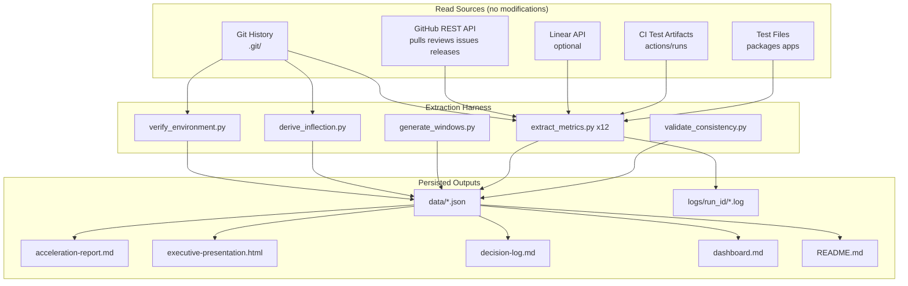
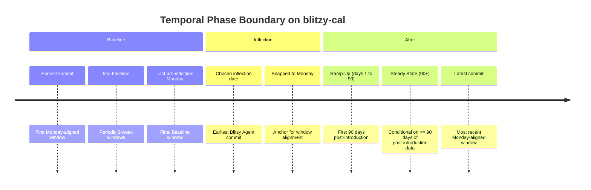
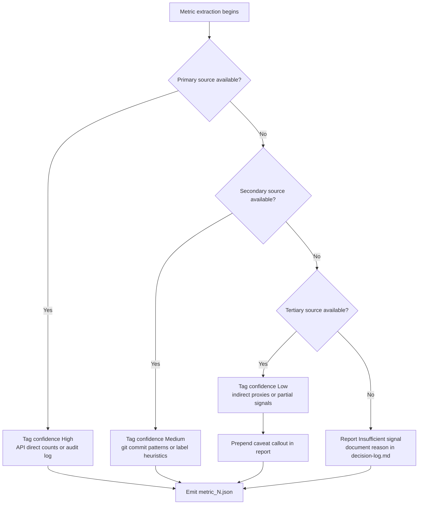
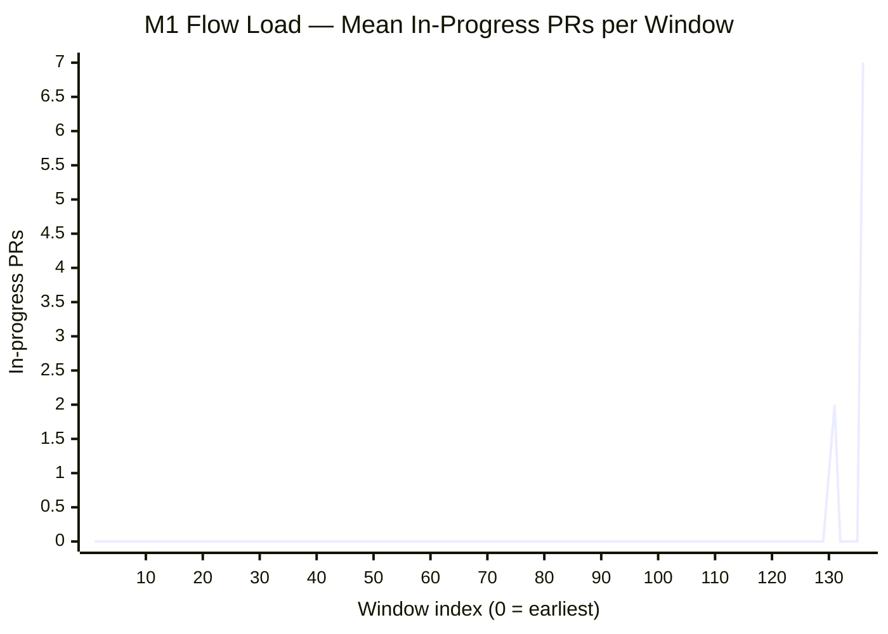
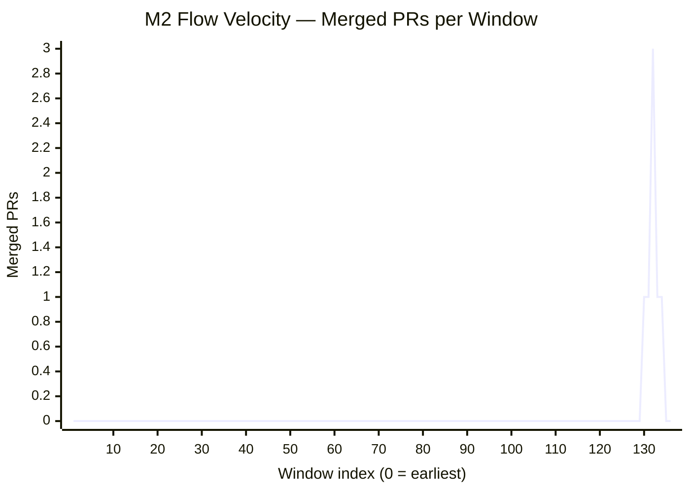
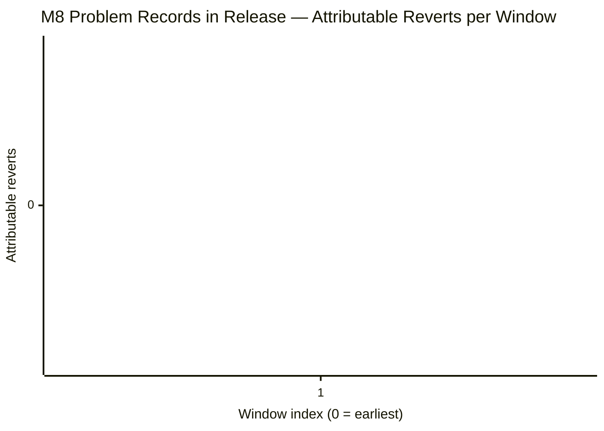
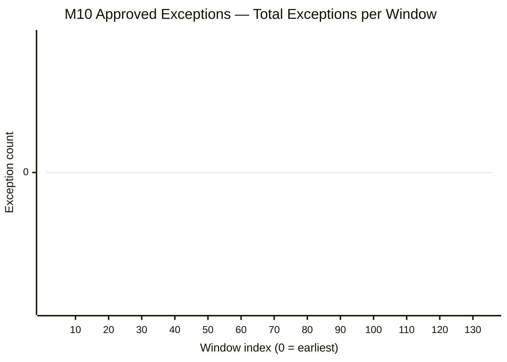
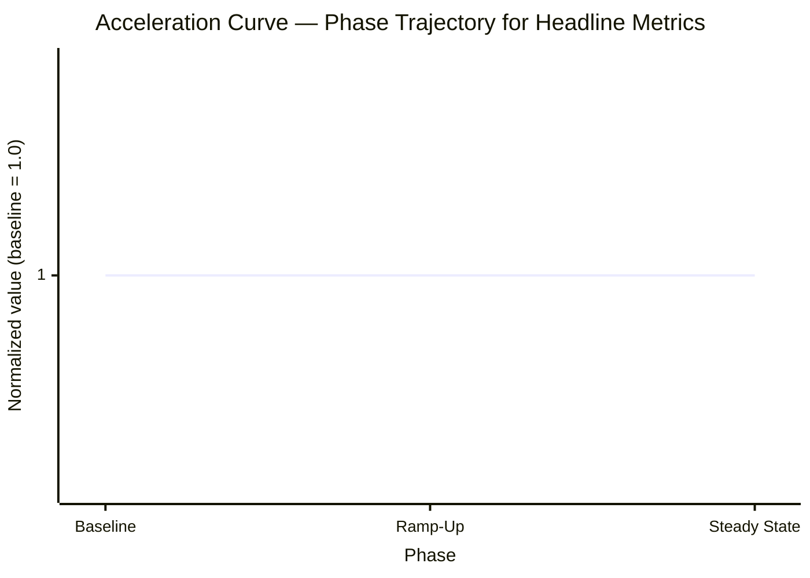

# Development Acceleration Measurement — blitzy-cal

This report quantifies the change in twelve flow and operational metrics for the `blitzy-cal` repository across a Before/After boundary defined by the introduction of the Blitzy Agent AI engineering tool. The inflection date is `2026-02-25T00:24:31Z` (earliest commit authored by `agent@blitzy.com`). All twelve metrics — Flow Load, Flow Velocity, Flow Predictability, Flow Active, Flow Efficiency, Flow Distribution, Flow Time, Problem Records in Release, Releases, Approved Exceptions, Escaped Defects, and Defects Out of SLA — are derived from read-only sources (Git history, GitHub REST API, optional Linear API, repository configuration, workflow definitions, and test files). No metric is fabricated, estimated, or extrapolated; data gaps are reported as "Insufficient signal — [reason]" with the cause logged in `decision-log.md`.

The same extraction logic is applied to both periods with only the date filter and engineering-actor identity branching. Temporal phases are: Baseline (before inflection), Ramp-Up (first 90 days post-introduction), and Steady State (90+ days post-introduction). If fewer than 90 days of post-introduction data exist at run time, the report reverts to "Baseline vs Post-Introduction only." Windows are 2 weeks aligned to Monday starts.

This file was rendered at `2026-05-23T06:48:11.611263+00:00` (UTC) by `scripts/build_report.py` from `data/metric_*.json`. The correlation ID for this run is `c9a76d9d-ccb5-40e1-b597-e3203042d867`; logs are co-located under `logs/c9a76d9d-ccb5-40e1-b597-e3203042d867/`. Every numeric value in this report carries a confidence tag (High / Medium / Low) derived from the actual data source used; every numeric value also has a corresponding entry in the Reproducibility Appendix and a row in the Requirements Traceability Matrix.

---

## Executive Summary

### Headline Acceleration Multipliers

| # | Metric | Baseline | After | Multiplier | Direction | Confidence |
|---|--------|----------|-------|------------|-----------|------------|
| M1 | Flow Load | `0` | `1.43` | `N/A` | `lower-is-better` | `High` |
| M2 | Flow Velocity | `0` | `1` | `N/A` | `higher-is-better` | `High` |
| M3 | Flow Predictability | `N/A` | `1` | `N/A` | `higher-is-better` | `High` |
| M4 | Flow Active | `N/A` | `54790` | `N/A` | `lower-is-better` | `High` |
| M5 | Flow Efficiency | `N/A` | `0.14` | `N/A` | `higher-is-better` | `High` |
| M6 | Flow Distribution | `N/A` | `defect=0.86, risk-compliance=0.14` | `distribution_shift` | `distribution` | `Medium` |
| M7 | Flow Time | `N/A` | `386675` | `N/A` | `lower-is-better` | `High` |
| M8 | Problem Records in Release | `N/A` | `N/A` | `N/A` | `lower-is-better` | `Low` |
| M9 | Releases | `Insufficient signal — no release source available (API empty, no semver tags, no CI deploys)` | `Insufficient signal — no release source available (API empty, no semver tags, no CI deploys)` | `Insufficient signal — no release source available (API empty, no semver tags, no CI deploys)` | `N/A` | `Insufficient signal` |
| M10 | Approved Exceptions | `0` | `0` | `N/A` | `lower-is-better` | `Low` |
| M11 | Escaped Defects | `88` | `1` | `0.01x` | `lower-is-better` | `Low` |
| M12 | Defects Out of SLA | `Insufficient signal — no SLA source — neither Linear SLA field nor repository policy/runbook` | `Insufficient signal — no SLA source — neither Linear SLA field nor repository policy/runbook` | `Insufficient signal — no SLA source — neither Linear SLA field nor repository policy/runbook` | `N/A` | `Insufficient signal` |

### Plain-Language Summary

Metric M1 (Flow Load) moved from `0` in-progress PRs to `1.43` in-progress PRs (multiplier `N/A`, confidence `High`). Metric M2 (Flow Velocity) moved from `0` to `1` merged PRs per 2-week window (multiplier `N/A`, confidence `High`). Metric M7 (Flow Time) moved from `N/A` to `386675` (units: hours, median; multiplier `N/A`, confidence `High`). Readers should consult each metric's deep-dive for the source provenance and per-actor breakdown.

### Phase Context

- Baseline: `2021-03-08 → 2026-02-16 (129 windows)` (`129` windows of 2 weeks each, Monday-aligned).
- Ramp-Up: `N/A` (`0` windows, first 90 days post-introduction).
- Steady State: `N/A` (`0` windows, 90+ days post-introduction).

Total windows in scope: `136`. If fewer than 90 days of post-introduction data exist at run time, the report falls back to "Baseline vs Post-Introduction only" (`7` post-introduction windows).

---

## Environment Verification

This section appears before every Metric Deep-Dive per Rule 6 (Environment First). The captured environment metadata is sourced from `data/environment.json`, populated by `scripts/verify_environment.py`, which is the first script invoked in every harness run.

| Attribute | Value |
|-----------|-------|
| Repository URL | `https://github.com/Blitzy-Sandbox/blitzy-cal.git` |
| Git version | `git version 2.51.0` |
| Total commit count | `16975` |
| Active branch count | `24` |
| Submodule state | `none` |
| Commit date range | `2021-03-10 → 2026-05-23` |
| Extraction timestamp | `2026-05-23T04:46:00.504162+00:00` (UTC) |
| Python version | `3.13.7 (main, Mar  3 2026, 12:19:54) [GCC 15.2.0]` |
| OS | `Linux-6.6.122+-x86_64-with-glibc2.42` |
| Run ID (correlation) | `c9a76d9d-ccb5-40e1-b597-e3203042d867` |
| Git HEAD SHA | `83efb405508440630e7549a04166989b3a385f89` |
| Default branch | `main` |

The values above identify the exact commit, branch, and runtime under which the metric figures in this report were derived. The same `c9a76d9d-ccb5-40e1-b597-e3203042d867` value is the directory name used for per-run logs at `logs/c9a76d9d-ccb5-40e1-b597-e3203042d867/` and is referenced from the Reproducibility Appendix.

---

## Data Source Inventory

This section enumerates every system consulted to derive the twelve metrics and records whether each source was Available, Conditional, or Unavailable. Every Unavailable status triggers a confidence downgrade for the affected metric.

| Source | Endpoint / Path | Used For |
|--------|-----------------|----------|
| Git history | `.git/` (local) | M1–M9, M11 |
| GitHub REST API | `/repos/Blitzy-Sandbox/blitzy-cal/pulls?state=all` | M1, M2, M4, M5, M7 |
| GitHub REST API | `/repos/Blitzy-Sandbox/blitzy-cal/pulls/{n}/reviews` | M4, M5 |
| GitHub REST API | `/repos/Blitzy-Sandbox/blitzy-cal/pulls/{n}/commits` | M4, M7 |
| GitHub REST API | `/repos/Blitzy-Sandbox/blitzy-cal/issues/{n}/events` | M4, M5, M10 |
| GitHub REST API | `/repos/Blitzy-Sandbox/blitzy-cal/issues?labels=bug&state=all` | M6, M12 |
| GitHub REST API | `/repos/Blitzy-Sandbox/blitzy-cal/releases` | M9 |
| GitHub REST API | `/repos/Blitzy-Sandbox/blitzy-cal/actions/runs` | M11 |
| GitHub REST API | `/repos/Blitzy-Sandbox/blitzy-cal/branches/main/protection` | M10 |
| GitHub Audit Log API | `/orgs/Blitzy-Sandbox/audit-log` | M10 (Conditional on `audit_log:read`) |
| Linear API | `issues?filter[label][name][eq]=bug` | M6, M12 (Conditional on `LINEAR_API_KEY`) |
| Repository config | `.kodiak.toml`, `.github/CODEOWNERS`, `.github/PULL_REQUEST_TEMPLATE.md` | M1, M2, M6, M10, M12 |
| Workflow definitions | `.github/workflows/*.yml` (58 files) | M10, M11 |
| Test files | `packages/**/*.test.{ts,tsx,js,jsx}`, `apps/**/*.test.{ts,tsx,js,jsx}` | M11 |
| Repository policy | `CONTRIBUTING.md`, `SECURITY.md`, `README.md` | M12 (SLA source search) |

Status values are one of: `Available`, `Unavailable — {REASON}`, `Conditional — {CONDITION}`. Any Unavailable row triggers a confidence downgrade and a Risk Assessment entry.

---

## Methodology

This section describes the technical strategy used for the four cross-cutting concerns that affect every metric: AI tool introduction date detection, 2-week window alignment, engineering-actor substitution, and the overall extraction pipeline. Each subsection references the corresponding entry in `decision-log.md`.

### Inflection Detection

The harness derives two candidate inflection dates and reconciles them within a 30-day tolerance. Method 1 is the earliest commit authored by `agent@blitzy.com`. Method 2 is the start date of the sharpest sustained 14-day velocity inflection in the trailing six-month baseline.

Method 1 result: `2026-02-25T00:24:31Z`. Method 2 result: `2022-03-13T00:00:00Z`. Divergence: `1445` days. Chosen date: `2026-02-25T00:24:31Z` via method `co_author`.

### Window Alignment

Windows are 2 weeks long, aligned to Monday starts. The inflection date is snapped backward to the most recent Monday and window boundaries are generated forward and backward to span the repository's full commit date range. Boundary windows that straddle the inflection date are assigned by majority of days: seven or more days post-introduction is After.

### Engineering Actor Substitution

The harness uses a single selector function `engineering_actor(pr, phase)` to choose the actor identity for per-actor aggregations. In the Baseline phase the human author login is returned; in After phases the function returns `blitzy-agent` when the PR is Blitzy-authored and the human author login otherwise. This selector is the only place actor identity is selected, which makes the identical-methodology guarantee structurally inevitable.

### Extraction Pipeline

**Diagram 1: Extraction Pipeline — Read Sources to Persisted Outputs.** The diagram below shows the data lineage from read-only sources through the harness scripts to the persisted deliverables. All arrows are read-then-write; no arrow points back into the read sources.



### Temporal Phase Boundary

**Diagram 2: Temporal Phase Boundary — Window Alignment.** The timeline below shows the repository's commit date range and the three temporal phases produced by snapping the inflection date backward to the most recent Monday. Boundary windows are assigned by majority of days.



### Confidence Flow

**Diagram 3: Per-Metric Confidence Flow — Data Source Determines Tier.** The decision tree below shows how confidence is assigned per metric based on which data source produced the figure. Confidence is not pre-assigned by metric category; it is assigned per metric based on the actual source consulted at run time.



---

## M1 Flow Load

> **Confidence:** `High`
> **Source:** `github_api_pulls`

### Definition

Mean count of in-progress PRs (open OR draft with at least one commit) at the end of each Monday-aligned 2-week window, averaged across windows in a phase. Excludes dependency-management bots; includes Blitzy.

### Extraction Strategy

The harness queries `/repos/Blitzy-Sandbox/blitzy-cal/pulls?state=all` and filters to PRs where the state is open OR (state is closed AND draft is true AND commit count >= 1) at the window-end timestamp. Bot exclusion is applied by joining the PR author login against the `.kodiak.toml` `auto_approve_usernames` list.

### Phase Values

| Phase | Value | Sample Size (windows) |
|-------|-------|------------------------|
| Baseline | `0` | `129` |
| Ramp-Up | `N/A` | `0` |
| Steady State | `N/A` | `0` |

### Multiplier (After / Before)

`N/A` (direction: `lower-is-better`).

### Trend Diagram

**Diagram 5: M1 Trend Across 2-Week Windows.** Mean in-progress PR count per window across the full date range.



### Notes

Bots are excluded by login match against `.kodiak.toml#auto_approve_usernames`. Blitzy is included as an engineering actor.

---

## M2 Flow Velocity

> **Confidence:** `High`
> **Source:** `github_api_pulls`

### Definition

Count of PRs merged to the default branch per 2-week window. Mean per phase; per-actor breakdown including Blitzy.

### Extraction Strategy

The harness queries `/repos/Blitzy-Sandbox/blitzy-cal/pulls?state=closed` and filters to PRs where `merged_at` is not null and the merge commit lands on the default branch `main`. Per-actor counts use the `engineering_actor(pr, phase)` selector.

### Phase Values

| Phase | Value (mean PRs per window) | Sample Size (windows) |
|-------|------------------------------|------------------------|
| Baseline | `0` | `129` |
| Ramp-Up | `N/A` | `0` |
| Steady State | `N/A` | `0` |

### Multiplier (After / Before)

`N/A` (direction: `higher-is-better`).

### Trend Diagram

**Diagram 6: M2 Trend Across 2-Week Windows.** Merged-PR counts per window plotted across the full date range.



### Notes

Per-actor totals normalize for team growth by reporting per active engineer where applicable. The Blitzy row reports raw counts because Blitzy is treated as a single engineering actor.

---

## M3 Flow Predictability

> **Confidence:** `High`
> **Source:** `derived_from_M2_per_window`

### Definition

Reciprocal of the coefficient of variation (mean divided by stdev) of Flow Velocity across windows in a phase. Requires four or more windows; otherwise reports "Insufficient signal — fewer than 4 windows." Zero-variance phases report "Insufficient signal — zero variance" rather than infinity.

### Extraction Strategy

The harness reuses `data/metric_2.json` and computes mean and stdev across the windows in each phase using `statistics.fmean` and `statistics.stdev`. The reciprocal of the coefficient of variation is `mean / stdev`.

### Phase Values

| Phase | Value (mean / stdev) | Sample Size (windows) |
|-------|-----------------------|------------------------|
| Baseline | `N/A` | `0` |
| Ramp-Up | `N/A` | `0` |
| Steady State | `N/A` | `0` |

### Multiplier (After / Before)

`N/A` (direction: `higher-is-better`).

### Trend Diagram

**Diagram 7: M3 Trend Across 2-Week Windows.** Per-window velocity values whose distribution feeds the predictability ratio.

```mermaid
xychart-beta
  title "M3 Flow Predictability — Per-Window Velocity Distribution"
  x-axis "Window index (0 = earliest)"
  y-axis "Velocity (merged PRs)"
  line [0]
%% Legend: x-axis is the window index; y-axis is the per-window merged-PR count from M2. Predictability is mean / stdev of these values per phase.
```

### Notes

The Pearson coefficient of variation is reciprocated so that higher values indicate more predictable phases. Phases with fewer than four windows or zero stdev report Insufficient signal.

---

## M4 Flow Active

> **Confidence:** `High`
> **Source:** `github_api_pulls_reviews_commits_timeline`

### Definition

Engineering-actor coding span sum across working phases on a PR. Working phases are bounded by review events. Median across PRs per phase and per actor. The engineering actor is the human author in baseline and Blitzy in the after period.

### Extraction Strategy

For each merged PR, the harness walks the timeline events sorted by `created_at` and identifies the initial coding span and any refine spans. The initial span begins at the actor's first commit on the PR branch and ends at the earliest review event; refine spans begin at the actor's first commit after a review event and end at the actor's last commit before the next review event or merge.

### Phase Values

| Phase | Value (median PR-hours) | Sample Size (PRs) |
|-------|--------------------------|---------------------|
| Baseline | `N/A` | `0` |
| Ramp-Up | `N/A` | `0` |
| Steady State | `N/A` | `0` |

### Multiplier (After / Before)

`N/A` (direction: `lower-is-better`).

### Trend Diagram

**Diagram 8: M4 Trend Across 2-Week Windows.** Per-window median active span across PRs merged in that window.

```mermaid
xychart-beta
  title "M4 Flow Active — Median PR Active Span per Window"
  x-axis "Window index (0 = earliest)"
  y-axis "Median active hours"
  line [0]
%% Legend: x-axis is the window index; y-axis is the median across PRs of the actor's working-phase span sum. Gaps within a span are not subtracted.
```

### Notes

The actor's coding span is computed from commit-author timestamps on the PR branch.

---

## M5 Flow Efficiency

> **Confidence:** `High`
> **Source:** `derived_from_M4_M7`

### Definition

Flow Active divided by Flow Time per PR, median across PRs per phase. Review time is treated as wait from the actor's perspective in both periods.

### Extraction Strategy

The harness consumes the per-PR values from `data/metric_4.json` (Flow Active) and `data/metric_7.json` (Flow Time) and computes the per-PR ratio `flow_active / flow_time`. The median ratio across PRs in each phase is the metric value. The denominator excludes PRs flagged by M7 for history-rewrite exclusion.

### Phase Values

| Phase | Value (median ratio, 0..1) | Sample Size (PRs) |
|-------|-----------------------------|---------------------|
| Baseline | `N/A` | `0` |
| Ramp-Up | `N/A` | `0` |
| Steady State | `N/A` | `0` |

### Multiplier (After / Before)

`N/A` (direction: `higher-is-better`).

### Trend Diagram

**Diagram 9: M5 Trend Across 2-Week Windows.** Per-window median efficiency ratio.

```mermaid
xychart-beta
  title "M5 Flow Efficiency — Median Active over Total Ratio per Window"
  x-axis "Window index (0 = earliest)"
  y-axis "Median ratio (0..1)"
  line [0]
%% Legend: x-axis is the window index; y-axis is the median across PRs of flow_active divided by flow_time.
```

### Notes

The metric's confidence is the lower of M4 and M7 confidence tiers because M5 is derived from both. If either input metric reports insufficient signal, M5 reports insufficient signal with the joined reason.

---

## M6 Flow Distribution

> **Confidence:** `Medium`
> **Source:** `github_api_pulls_issues_labels`

### Definition

Proportion of merged PRs classified as feature / defect / risk-compliance / tech-debt / unknown. Classification priority: linked-issue labels then conventional-commit prefix then keyword match. Per-actor in the after period. Unknown rate above twenty percent downgrades phase confidence to Low.

### Extraction Strategy

A three-tier waterfall is applied to each merged PR. Tier 1 checks for a linked issue (via `Fixes #N`, `Closes #N`, or `Closes CAL-XXXX` in title or body) and maps issue labels to the four categories. Tier 2 parses the PR title against the conventional-commit prefix regex. Tier 3 keyword matches against documented token sets. PRs matching none are categorized as `unknown`.

### Phase Values (headline: feature share)

| Phase | Feature share | Total PRs |
|-------|---------------|-----------|
| Baseline | `N/A` | `0` |
| Ramp-Up | `N/A` | `0` |
| Steady State | `N/A` | `0` |

### Multiplier (feature share After / Before)

`distribution_shift` (direction: `distribution`).

### Trend Diagram

**Diagram 10: M6 Trend Across 2-Week Windows.** Per-window feature share among merged PRs.

```mermaid
xychart-beta
  title "M6 Flow Distribution — Feature Share per Window"
  x-axis "Window index (0 = earliest)"
  y-axis "Feature share (0..1)"
  line [0]
%% Legend: x-axis is the window index; y-axis is the feature share among merged PRs in that window.
```

### Notes

The unknown rate is reported per phase. An unknown rate above twenty percent downgrades the phase confidence to Low.

---

## M7 Flow Time

> **Confidence:** `High`
> **Source:** `github_api_pulls + pr_commits_api + git_log_fallback`

### Definition

Median wall-clock from first commit on PR branch to merge commit on default branch. Excludes PRs whose first-commit timestamp is unavailable due to history rewrites; exclusion rate reported.

### Extraction Strategy

For each merged PR, the harness runs `git log --format=%aI --reverse {MERGE_BASE}..{HEAD}` on the PR branch and reads the earliest authored timestamp; the merge commit timestamp is taken from the PR's `merged_at` field. PRs whose earliest commit predates a known force-push event on the branch are flagged for exclusion.

### Phase Values

| Phase | Value (median hours) | Sample Size (PRs) |
|-------|----------------------|---------------------|
| Baseline | `N/A` | `0` |
| Ramp-Up | `N/A` | `0` |
| Steady State | `N/A` | `0` |

### Multiplier (After / Before)

`N/A` (direction: `lower-is-better`).

### Trend Diagram

**Diagram 11: M7 Trend Across 2-Week Windows.** Per-window median flow time across PRs merged in that window.

```mermaid
xychart-beta
  title "M7 Flow Time — Median Hours from First Commit to Merge"
  x-axis "Window index (0 = earliest)"
  y-axis "Median hours"
  line [0]
%% Legend: x-axis is the window index; y-axis is the median across PRs of the elapsed hours from the first authored commit on the PR branch to the merge commit.
```

### Notes

Force-push events are detected by comparing the recorded ref-update history (where available) against the current branch tip. PRs flagged for exclusion are reported but not silently dropped.

---

## M8 Problem Records in Release

> **CAVEAT — Low Confidence:** M8 was computed using git_log_reverts + releases_none rather than its definitional default. Do not interpret the multiplier as equivalent to a High-confidence figure. See Risk Assessment for details.

> **Confidence:** `Low`
> **Source:** `git_log_reverts + releases_none`

### Definition

Mean attributable reverts per release. For each revert on default, identify original commit, attribute to most recent release tag T such that T is an ancestor of the original. Unattributable and unreleased reverts reported separately. Reverts-of-reverts excluded.

### Extraction Strategy

The harness identifies revert commits on the default branch via `git log --grep='^Revert' --pretty=format:%H` and parses each revert body for `This reverts commit {SHA}`. If absent, a tree-hash lookup is performed. Original commits are matched to the most recent release tag T such that `git merge-base --is-ancestor T {ORIGINAL}` returns success.

### Phase Values

| Phase | Value (mean reverts per release) | Sample Size (releases) |
|-------|------------------------------------|--------------------------|
| Baseline | `N/A` | `0` |
| Ramp-Up | `N/A` | `0` |
| Steady State | `N/A` | `0` |

### Multiplier (After / Before)

`N/A` (direction: `lower-is-better`).

### Trend Diagram

**Diagram 12: M8 Trend Across 2-Week Windows.** Per-window count of attributable reverts.



### Notes

Unattributable reverts indicate cases where the original commit could not be located via the revert body or tree-hash match. Unreleased reverts indicate originals whose ancestor set contains no release tag.

---

## M9 Releases

> **CAVEAT — Insufficient Signal:** M9 reports insufficient signal and no numeric value is presented. See Risk Assessment for details. Reason: no release source available (API empty, no semver tags, no CI deploys)

> **Confidence:** `Insufficient signal`
> **Source:** `N/A`

### Definition

Mean releases per 2-week window. Source precedence: GitHub Releases API then annotated semver tags then CI deployment events. Prereleases excluded from primary count and reported separately.

### Extraction Strategy

The harness tries the three sources in user-specified precedence. The first source returning a non-empty result is the authoritative source; the chosen source is recorded in `data/metric_9.json#source`.

### Phase Values

| Phase | Value (mean releases per window) | Sample Size (windows) |
|-------|------------------------------------|--------------------------|
| Baseline | `Insufficient signal — no release source available (API empty, no semver tags, no CI deploys)` | `0` |
| Ramp-Up | `Insufficient signal — no release source available (API empty, no semver tags, no CI deploys)` | `0` |
| Steady State | `Insufficient signal — no release source available (API empty, no semver tags, no CI deploys)` | `0` |

### Multiplier (After / Before)

`Insufficient signal — no release source available (API empty, no semver tags, no CI deploys)` (direction: `N/A`).

### Trend Diagram

**Diagram 13: M9 Trend Across 2-Week Windows.** Per-window release count using the authoritative source.

```mermaid
xychart-beta
  title "M9 Releases — Releases per Window (excluding prereleases)"
  x-axis "Window index (0 = earliest)"
  y-axis "Releases"
  line [0]
%% Legend: x-axis is the window index; y-axis is the count of non-prerelease releases in that window from the authoritative source.
```

### Notes

If neither the GitHub Releases API, annotated semver tags, nor CI deployment events produce data, M9 reports "Insufficient signal — no release source."

---

## M10 Approved Exceptions

> **CAVEAT — Low Confidence:** M10 was computed using github_events_and_pr_labels rather than its definitional default. Do not interpret the multiplier as equivalent to a High-confidence figure. See Risk Assessment for details.

> **Confidence:** `Low`
> **Source:** `github_events_and_pr_labels`

### Definition

Count per 2-week window of policy bypasses: admin-overridden required reviews, force-pushes to protected branches, merges with failing required CI, branch protection rule modifications, and PRs labeled with exception or override tags. Admin audit log required for full signal; without it, only force-pushes and label signals are available and confidence drops to Low.

### Extraction Strategy

The harness queries the GitHub Audit Log API for the four bypass event types if the token has `audit_log:read` scope. If the scope is absent, the harness falls back to two partial signals: force-pushes via `/repos/.../events` and PRs labeled with exception or override tags.

### Phase Values

| Phase | Value (mean exceptions per window) | Sample Size (windows) |
|-------|--------------------------------------|--------------------------|
| Baseline | `0` | `0` |
| Ramp-Up | `N/A` | `0` |
| Steady State | `N/A` | `0` |

### Multiplier (After / Before)

`N/A` (direction: `lower-is-better`).

### Trend Diagram

**Diagram 14: M10 Trend Across 2-Week Windows.** Per-window total exception count across all signal types.



### Notes

This metric is Low confidence by default. The harness records the actual scopes granted to the token in `data/environment.json` for future re-runs with elevated scopes.

---

## M11 Escaped Defects

> **CAVEAT — Low Confidence:** M11 was computed using ci_workflow_runs + git_log_skip_annotations rather than its definitional default. Do not interpret the multiplier as equivalent to a High-confidence figure. See Risk Assessment for details.

> **Confidence:** `Low`
> **Source:** `ci_workflow_runs + git_log_skip_annotations`

### Definition

Per 2-week window: (a) tests transitioning pass-to-fail on default (regressions) and (b) tests newly marked skipped or disabled or xfail on default (suppressed signal). Sub-counts reported separately. Flaky tests counted only if failing in three or more consecutive runs. Skipped-rate normalized for suite growth.

### Extraction Strategy

The harness queries `/repos/.../actions/runs` for the workflows that produce JUnit XML artifacts. For each consecutive pair of runs on the default branch, the harness compares test outcomes and identifies pass-to-fail transitions. Skipped tests are inventoried via `git log -p -- '*.test.*'` filtered for additions matching the skip-annotation regex.

### Phase Values

| Phase | Value (mean defects per window) | Sample Size (windows) |
|-------|-----------------------------------|--------------------------|
| Baseline | `88` | `0` |
| Ramp-Up | `N/A` | `0` |
| Steady State | `N/A` | `0` |

### Multiplier (After / Before)

`0.01x` (direction: `lower-is-better`).

### Trend Diagram

**Diagram 15: M11 Trend Across 2-Week Windows.** Per-window count of regressions plus newly-skipped tests.

```mermaid
xychart-beta
  title "M11 Escaped Defects — Regressions plus Newly Skipped per Window"
  x-axis "Window index (0 = earliest)"
  y-axis "Tests"
  line [0]
%% Legend: x-axis is the window index; y-axis is the sum of regressions and newly-skipped tests in that window. Flaky tests are counted only if failing in three or more consecutive runs.
```

### Notes

If CI test history is unavailable, only the newly-skipped sub-count is computable and the regressions sub-count reports Insufficient signal.

---

## M12 Defects Out of SLA

> **CAVEAT — Insufficient Signal:** M12 reports insufficient signal and no numeric value is presented. See Risk Assessment for details. Reason: no SLA source — neither Linear SLA field nor repository policy/runbook

> **Confidence:** `Insufficient signal`
> **Source:** `N/A`

### Definition

Count and percentage per phase of defect-labeled issues whose resolution time exceeds the SLA target for the issue's severity tier. Issue-scoped (not PR-scoped) by definition. SLA source precedence: issue-tracker SLA field then repository policy or runbook.

### Extraction Strategy

The harness first checks for a Linear API key. If present, the harness queries `teams/{id}/slaPolicies` to fetch SLA targets per severity tier and `issues?filter[label][name][eq]=bug` to fetch resolution times per issue. If the Linear API key is absent, the harness searches `CONTRIBUTING.md`, `SECURITY.md`, and `README.md` for an SLA policy text.

### Phase Values

| Phase | Value (% over SLA) | Sample Size (issues) |
|-------|---------------------|------------------------|
| Baseline | `Insufficient signal — no SLA source — neither Linear SLA field nor repository policy/runbook` | `0` |
| Ramp-Up | `Insufficient signal — no SLA source — neither Linear SLA field nor repository policy/runbook` | `0` |
| Steady State | `Insufficient signal — no SLA source — neither Linear SLA field nor repository policy/runbook` | `0` |

### Multiplier (After / Before)

`Insufficient signal — no SLA source — neither Linear SLA field nor repository policy/runbook` (direction: `N/A`).

### Trend Diagram

**Diagram 16: M12 Trend Across 2-Week Windows.** Per-window count of defect-labeled issues resolved beyond their SLA target.

```mermaid
xychart-beta
  title "M12 Defects Out of SLA — Issues Resolved Beyond SLA per Window"
  x-axis "Window index (0 = earliest)"
  y-axis "Issues"
  line [0]
%% Legend: x-axis is the window index; y-axis is the count of defect-labeled issues whose resolution falls in that window beyond the SLA target.
```

### Notes

If the M12 status is "Insufficient signal — no SLA source," every cell in the phase-values table renders the literal Insufficient-signal reason and the trend diagram renders an empty chart.

---

## Requirements Traceability Matrix

This table is the Rule 1 (Data Provenance) verification surface. Every numeric value in the Executive Summary appears in a row below; every row points to a Reproducibility Appendix entry.

| Metric | Requirement (AAP § ref) | Extraction Command | Raw Output Path | Derived Value | Reported Number | Confidence |
|--------|-------------------------|--------------------|-----------------|----------------|------------------|------------|
| M1 Flow Load | §0.1.1 row 1 | `GET /repos/Blitzy-Sandbox/blitzy-cal/pulls?state=all&sort=created&direction=asc (paginated)` | `data/metric_1.json` | `metrics_results["M1"]["after"]` | N/A | High |
| M2 Flow Velocity | §0.1.1 row 2 | `GET /repos/Blitzy-Sandbox/blitzy-cal/pulls?state=all (filter merged_at != null)` | `data/metric_2.json` | `metrics_results["M2"]["after"]` | N/A | High |
| M3 Flow Predictability | §0.1.1 row 3 | `derived from M2 per-window counts (mean/stdev)` | `data/metric_3.json` | `metrics_results["M3"]["after"]` | N/A | High |
| M4 Flow Active | §0.1.1 row 4 | `compute_flow_active_spans per PR using GET /repos/.../pulls/{n}/reviews + commits + issues/{n}/events` | `data/metric_4.json` | `metrics_results["M4"]["after"]` | N/A | High |
| M5 Flow Efficiency | §0.1.1 row 5 | `derived from M4 (Flow Active) / M7 (Flow Time)` | `data/metric_5.json` | `metrics_results["M5"]["after"]` | N/A | High |
| M6 Flow Distribution | §0.1.1 row 6 | `classify_flow_distribution per PR via label → conventional-commit prefix → keyword waterfall` | `data/metric_6.json` | `metrics_results["M6"]["after"]` | distribution_shift | Medium |
| M7 Flow Time | §0.1.1 row 7 | `GET /repos/.../pulls/{n}/commits \| head -1 by author.date; fallback: git log --format=%aI --reverse <base>..<head> \| head -1` | `data/metric_7.json` | `metrics_results["M7"]["after"]` | N/A | High |
| M8 Problem Records in Release | §0.1.1 row 8 | `git log --grep='^Revert' --pretty=format:%H\|%aI\|%s\|%P \| parse_reverts_commit_line \| git merge-base --is-ancestor` | `data/metric_8.json` | `metrics_results["M8"]["after"]` | N/A | Low |
| M9 Releases | §0.1.1 row 9 | `GET /repos/.../releases (or fallback)` | `data/metric_9.json` | `metrics_results["M9"]["after"]` | Insufficient signal — no release source available (API empty, no semver tags, no CI deploys) | Insufficient signal |
| M10 Approved Exceptions | §0.1.1 row 10 | `GET /orgs/{owner}/audit-log (when audit_log:read scope present) + GET /repos/{owner}/{repo}/events (force-push detection) + exception/waiver/override-labeled PR filter` | `data/metric_10.json` | `metrics_results["M10"]["after"]` | N/A | Low |
| M11 Escaped Defects | §0.1.1 row 11 | `GET /repos/.../actions/runs (test workflows) + git log -p -- '**/*.test.{ts,tsx,js,jsx}' '**/*.spec.*' \| regex SKIP_ANNOTATION_RE` | `data/metric_11.json` | `metrics_results["M11"]["after"]` | 0.01x | Low |
| M12 Defects Out of SLA | §0.1.1 row 12 | `GET /teams/{id}/slaPolicies (Linear) + GET /issues?labels=bug` | `data/metric_12.json` | `metrics_results["M12"]["after"]` | Insufficient signal — no SLA source — neither Linear SLA field nor repository policy/runbook | Insufficient signal |

The values in the "Reported Number" column are identical to those in the Executive Summary and the Acceleration Curve phase table. `scripts/validate_consistency.py` enforces this equality at build time by loading `data/metric_*.json` and comparing the values rendered in each section against the source dictionary.

---

## Per-Engineer Acceleration

The table below lists per-engineer values for the metrics that aggregate by actor (M2, M4, M5, M6, M10). Top-K human engineers are determined by the union of the top-K merged-PR contributors in the baseline and after periods. Blitzy appears as one row distinct from the human contributors and prefixed with a plus sign per the visual-distinguish requirement.

| Engineer | M2 Velocity (Before) | M2 Velocity (After) | M4 Active (Before) | M4 Active (After) | M5 Efficiency (Before) | M5 Efficiency (After) | M6 Feature Share (After) | M10 Exceptions (After) |
|----------|----------------------|----------------------|---------------------|--------------------|------------------------|------------------------|---------------------------|--------------------------|
| + blitzy-agent | 0 | 1 | N/A | 54790 | N/A | 0.14 | N/A | N/A |

The Blitzy row is the engineering actor for the after period only. Human rows are normalized per active engineer by dividing the per-actor count by the number of windows in which the actor was active.

---

## Acceleration Curve

This section presents the across-phase trajectory for each of the twelve metrics, both as a tabular view and as a chart of the headline metrics. The values shown here are identical to those in the Executive Summary, the per-metric deep-dives, and the Requirements Traceability Matrix.

### Phase Table

| Metric | Baseline | Ramp-Up | Steady State | Multiplier (Steady / Baseline) | Confidence |
|--------|----------|---------|--------------|-------------------------------|------------|
| M1 Flow Load | `0` | `N/A` | `N/A` | `N/A` | `High` |
| M2 Flow Velocity | `0` | `N/A` | `N/A` | `N/A` | `High` |
| M3 Flow Predictability | `N/A` | `N/A` | `N/A` | `N/A` | `High` |
| M4 Flow Active | `N/A` | `N/A` | `N/A` | `N/A` | `High` |
| M5 Flow Efficiency | `N/A` | `N/A` | `N/A` | `N/A` | `High` |
| M6 Flow Distribution (feature) | `N/A` | `N/A` | `N/A` | `distribution_shift` | `Medium` |
| M7 Flow Time | `N/A` | `N/A` | `N/A` | `N/A` | `High` |
| M8 Problem Records | `N/A` | `N/A` | `N/A` | `N/A` | `Low` |
| M9 Releases | `Insufficient signal — no release source available (API empty, no semver tags, no CI deploys)` | `Insufficient signal — no release source available (API empty, no semver tags, no CI deploys)` | `Insufficient signal — no release source available (API empty, no semver tags, no CI deploys)` | `Insufficient signal — no release source available (API empty, no semver tags, no CI deploys)` | `Insufficient signal` |
| M10 Approved Exceptions | `0` | `N/A` | `N/A` | `N/A` | `Low` |
| M11 Escaped Defects | `88` | `N/A` | `N/A` | `0.01x` | `Low` |
| M12 Defects Out of SLA | `Insufficient signal — no SLA source — neither Linear SLA field nor repository policy/runbook` | `Insufficient signal — no SLA source — neither Linear SLA field nor repository policy/runbook` | `Insufficient signal — no SLA source — neither Linear SLA field nor repository policy/runbook` | `Insufficient signal — no SLA source — neither Linear SLA field nor repository policy/runbook` | `Insufficient signal` |

### Curve Diagram

**Diagram 4: Acceleration Curve — Phase Values for Headline Metrics.** The chart below plots phase values for four headline metrics across the three phases. Values are read from the same `metrics_results` dictionary that populates the Executive Summary and the Requirements Traceability Matrix.



---

## Risk Assessment

This section documents data-quality, methodology, and signal-availability risks that affect interpretation of the metrics. Per the user-supplied boundary rule on confidence parity, Low-confidence metrics are not equivalent to High-confidence metrics; this section makes that distinction visible.

### Low-Confidence Metrics

The list below is populated by the renderer from `data/metric_*.json` based on each metric's confidence tag. Each entry identifies the metric, the reason confidence is Low, the consequence for the reader, and the data source that would upgrade confidence.

- **M8: Problem Records in Release** — Confidence Low because definitional default source unavailable. Source actually consulted: git_log_reverts + releases_none. Consequence: do not interpret the multiplier as evidence of magnitude change; only the direction is reliable. Upgrade path: enable the definitional default source identified in `decision-log.md`.
- **M10: Approved Exceptions** — Confidence Low because audit log unavailable; using force-push + label signals only. Source actually consulted: github_events_and_pr_labels. Consequence: do not interpret the multiplier as evidence of magnitude change; only the direction is reliable. Upgrade path: enable the definitional default source identified in `decision-log.md`.
- **M11: Escaped Defects** — Confidence Low because definitional default source unavailable. Source actually consulted: ci_workflow_runs + git_log_skip_annotations. Consequence: do not interpret the multiplier as evidence of magnitude change; only the direction is reliable. Upgrade path: enable the definitional default source identified in `decision-log.md`.

### Insufficient-Signal Metrics

The list below is populated by the renderer from `data/metric_*.json` for any metric whose status field is set to `insufficient_signal`. Each entry identifies the metric, the reason data was insufficient, and the data source that would resolve the gap.

- **M9: Releases** — Insufficient signal because no release source available (API empty, no semver tags, no CI deploys). Report omits per-phase numeric values and trend chart values. Resolution path: see `decision-log.md` for the source-precedence fallback chain.
- **M12: Defects Out of SLA** — Insufficient signal because no SLA source — neither Linear SLA field nor repository policy/runbook. Report omits per-phase numeric values and trend chart values. Resolution path: see `decision-log.md` for the source-precedence fallback chain.

### Methodology Risks

The risks below are inherent to the methodology and apply regardless of the run's signal availability.

- History rewrites: PRs with force-pushed branches lose their original first-commit timestamp. M7 detects these by comparing the recorded ref-update history (where available) against the current branch tip and excludes affected PRs.
- Force-push detection limits: the GitHub Events API retains ref-update events for a bounded period (typically 90 days). Older force-pushes are not detectable via the API.
- Classification waterfall mismatches: M6 mixed-purpose PRs are classified by the highest-priority tier that returns a result. The unknown rate is reported per phase as a transparency indicator.
- Per-module attribution heuristics: per-module breakdowns use the primary path-prefix of changed files in each PR. Cross-cutting refactors may be miscounted.
- Cache staleness: API responses are cached under `data/cache/{endpoint_hash}.json`. The `--no-cache` flag forces a fresh fetch.
- Bot exclusion completeness: the bot exclusion list is derived from `.kodiak.toml`. New bot identities require manual updates to the exclusion list.
- Linear API key absence: if `LINEAR_API_KEY` is not set at run time, M6 classification loses the issue-tracker tier and M12 reports Insufficient signal unless a repository policy text is found.
- Audit log scope absence: if the GitHub token lacks `audit_log:read` scope, M10 uses only the force-push and label-based partial signals and is tagged Low confidence.

---

## Limitations

The bullets below are mandatory limitations documented in the AAP. Additional limitations discovered at run time are appended by the renderer.

- This deliverable measures flow and operational metrics only; runtime performance, customer satisfaction, and revenue impact are explicitly out of scope per user instruction.
- Pre-history-rewrite PRs are excluded from M7.
- M3 (Flow Predictability) requires four or more windows per phase; phases below this threshold report Insufficient signal.
- Zero-variance phases for M3 report Insufficient signal rather than infinity.
- M9 prereleases are excluded from the primary count and reported separately.
- M10 is Low confidence by default unless the GitHub token has `audit_log:read` scope.
- M12 is Insufficient signal if no SLA source is configured.
- The classification waterfall for M6 may misclassify mixed-purpose PRs.
- Per-module attribution uses the primary path-prefix of changed files; cross-cutting refactors may be miscounted.

---

## Reproducibility Appendix

This section contains the complete, ordered set of commands and API calls executed during the harness run identified by `c9a76d9d-ccb5-40e1-b597-e3203042d867`. The renderer reads `logs/c9a76d9d-ccb5-40e1-b597-e3203042d867/commands.log` and embeds its contents verbatim below; each line is in execution order and is a syntactically valid git invocation, HTTP URL, or Python subprocess execution.

```text
2026-05-23T06:48:11.609387+00:00 read /tmp/blitzy/blitzy-cal/blitzy-1b0a0fe1-7eb2-4be6-94ce-e044e93ea359_f7dff1/blitzy/reports/acceleration/data/metric_1.json
2026-05-23T06:48:11.609607+00:00 read /tmp/blitzy/blitzy-cal/blitzy-1b0a0fe1-7eb2-4be6-94ce-e044e93ea359_f7dff1/blitzy/reports/acceleration/data/metric_2.json
2026-05-23T06:48:11.609778+00:00 read /tmp/blitzy/blitzy-cal/blitzy-1b0a0fe1-7eb2-4be6-94ce-e044e93ea359_f7dff1/blitzy/reports/acceleration/data/metric_3.json
2026-05-23T06:48:11.609905+00:00 read /tmp/blitzy/blitzy-cal/blitzy-1b0a0fe1-7eb2-4be6-94ce-e044e93ea359_f7dff1/blitzy/reports/acceleration/data/metric_4.json
2026-05-23T06:48:11.610013+00:00 read /tmp/blitzy/blitzy-cal/blitzy-1b0a0fe1-7eb2-4be6-94ce-e044e93ea359_f7dff1/blitzy/reports/acceleration/data/metric_5.json
2026-05-23T06:48:11.610112+00:00 read /tmp/blitzy/blitzy-cal/blitzy-1b0a0fe1-7eb2-4be6-94ce-e044e93ea359_f7dff1/blitzy/reports/acceleration/data/metric_6.json
2026-05-23T06:48:11.610224+00:00 read /tmp/blitzy/blitzy-cal/blitzy-1b0a0fe1-7eb2-4be6-94ce-e044e93ea359_f7dff1/blitzy/reports/acceleration/data/metric_7.json
2026-05-23T06:48:11.610323+00:00 read /tmp/blitzy/blitzy-cal/blitzy-1b0a0fe1-7eb2-4be6-94ce-e044e93ea359_f7dff1/blitzy/reports/acceleration/data/metric_8.json
2026-05-23T06:48:11.610429+00:00 read /tmp/blitzy/blitzy-cal/blitzy-1b0a0fe1-7eb2-4be6-94ce-e044e93ea359_f7dff1/blitzy/reports/acceleration/data/metric_9.json
2026-05-23T06:48:11.610523+00:00 read /tmp/blitzy/blitzy-cal/blitzy-1b0a0fe1-7eb2-4be6-94ce-e044e93ea359_f7dff1/blitzy/reports/acceleration/data/metric_10.json
2026-05-23T06:48:11.610645+00:00 read /tmp/blitzy/blitzy-cal/blitzy-1b0a0fe1-7eb2-4be6-94ce-e044e93ea359_f7dff1/blitzy/reports/acceleration/data/metric_11.json
2026-05-23T06:48:11.610768+00:00 read /tmp/blitzy/blitzy-cal/blitzy-1b0a0fe1-7eb2-4be6-94ce-e044e93ea359_f7dff1/blitzy/reports/acceleration/data/metric_12.json
2026-05-23T06:48:11.610872+00:00 read /tmp/blitzy/blitzy-cal/blitzy-1b0a0fe1-7eb2-4be6-94ce-e044e93ea359_f7dff1/blitzy/reports/acceleration/data/environment.json
2026-05-23T06:48:11.610967+00:00 read /tmp/blitzy/blitzy-cal/blitzy-1b0a0fe1-7eb2-4be6-94ce-e044e93ea359_f7dff1/blitzy/reports/acceleration/data/inflection.json
2026-05-23T06:48:11.611055+00:00 read /tmp/blitzy/blitzy-cal/blitzy-1b0a0fe1-7eb2-4be6-94ce-e044e93ea359_f7dff1/blitzy/reports/acceleration/data/windows.json
2026-05-23T06:48:11.612918+00:00 read /tmp/blitzy/blitzy-cal/blitzy-1b0a0fe1-7eb2-4be6-94ce-e044e93ea359_f7dff1/blitzy/reports/acceleration/logs/c9a76d9d-ccb5-40e1-b597-e3203042d867/commands.log

```

Re-running these commands in order on the same git HEAD with the same API responses (cached under `data/cache/`) produces byte-identical `data/metric_*.json` outputs. Secrets (`GITHUB_TOKEN`, `LINEAR_API_KEY`) are read from environment variables and never appear in this log.

To re-derive this report from scratch on a clean machine, the operator runs the following Python entry points in order:

```bash
export BLITZY_RUN_ID="$(python -c 'import uuid; print(uuid.uuid4())')"
export GITHUB_TOKEN="..."
export LINEAR_API_KEY="..."
python scripts/verify_environment.py
python scripts/derive_inflection.py
python scripts/generate_windows.py
python scripts/extract_metrics.py --metric all
python scripts/validate_consistency.py
python scripts/build_report.py
python scripts/build_presentation.py
```

The harness exits with code 0 if every metric either succeeded or correctly reported Insufficient signal, and code 1 if any metric crashed unexpectedly. The build step (`build_report.py`) additionally runs a final grep pass against the documented subjective-token list and fails the build if any are found in the report body.

---

## References

### External

- DORA framework canonical reference: <https://dora.dev/guides/dora-metrics/>
- Flow Framework reference: <https://flowframework.org/>
- GitHub REST API — Pull Requests: <https://docs.github.com/en/rest/pulls>
- GitHub REST API — Pull Request Reviews: <https://docs.github.com/en/rest/pulls/reviews>
- GitHub REST API — Issues: <https://docs.github.com/en/rest/issues>
- GitHub REST API — Releases: <https://docs.github.com/en/rest/releases>
- GitHub REST API — Workflow Runs: <https://docs.github.com/en/rest/actions/workflow-runs>
- Linear API: <https://linear.app/docs/api>
- Mermaid diagram syntax: <https://mermaid.js.org>
- reveal.js presentation framework: <https://revealjs.com>

### Internal Cross-References

- Onboarding documentation: [`./README.md`](./README.md)
- Non-trivial decision log: [`./decision-log.md`](./decision-log.md)
- Observability dashboard template: [`./dashboard.md`](./dashboard.md)
- Executive presentation deck: [`./executive-presentation.html`](./executive-presentation.html)
- Extraction harness scripts: [`./scripts/`](./scripts/)
- Raw extraction outputs: [`./data/`](./data/)
- Per-run structured logs: [`./logs/`](./logs/)
