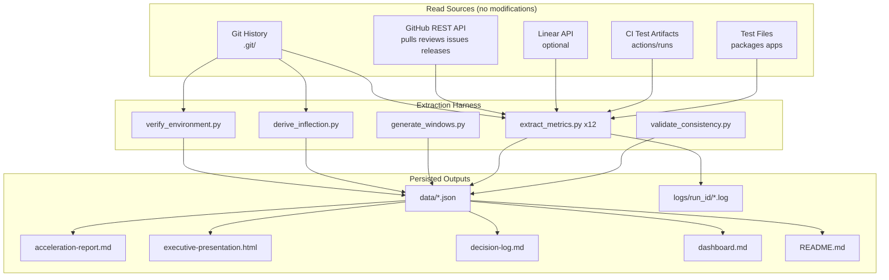
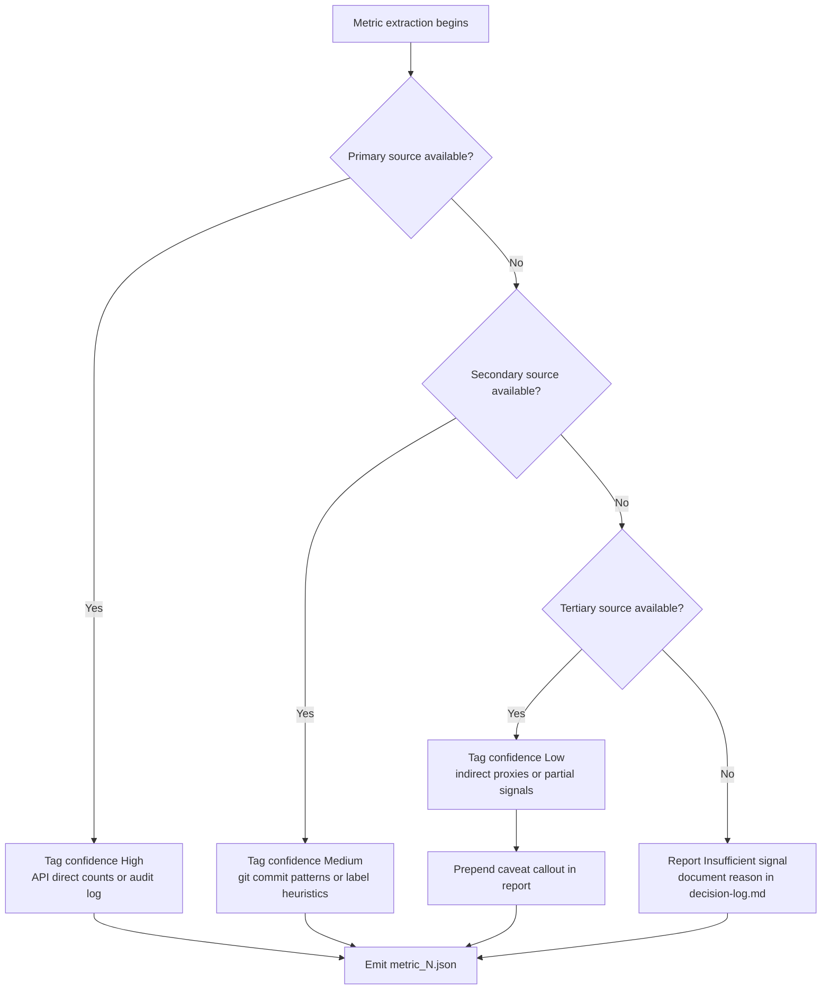

# Development Acceleration Measurement — blitzy-cal

This report quantifies the change in twelve flow and operational metrics for the `blitzy-cal` repository across a Before/After boundary defined by the introduction of the Blitzy Agent AI engineering tool. The inflection date is `<inflection.chosen_date>` (earliest commit authored by `agent@blitzy.com`: `9d80a5d026` dated `2026-02-25T00:24:31Z`). All twelve metrics — Flow Load, Flow Velocity, Flow Predictability, Flow Active, Flow Efficiency, Flow Distribution, Flow Time, Problem Records in Release, Releases, Approved Exceptions, Escaped Defects, and Defects Out of SLA — are derived from read-only sources (Git history, GitHub REST API, optional Linear API, repository configuration, workflow definitions, and test files). No metric is fabricated, estimated, or extrapolated; data gaps are reported as "Insufficient signal — [reason]" with the cause logged in `decision-log.md`.

The same extraction logic is applied to both periods with only the date filter and engineering-actor identity branching. Temporal phases are: Baseline (before inflection), Ramp-Up (first 90 days post-introduction, `2026-02-25` to `2026-05-26`), and Steady State (90+ days post-introduction). If fewer than 90 days of post-introduction data exist at run time, the report reverts to "Baseline vs Post-Introduction only." Windows are 2 weeks aligned to Monday starts. The engineering actor is the human author in the baseline period and Blitzy in the after period, applied via a single `engineering_actor(pr, phase)` selector documented in §5.3.

Boundary rules from the user are quoted verbatim: *"Read-only operations only. MUST NOT modify the repository or external systems. MUST NOT fabricate, estimate, or extrapolate. Report 'Insufficient signal — [reason]' when data is lacking. MUST NOT add metrics beyond the 12 specified. MUST NOT present Low-confidence metrics as equivalent to High-confidence ones."* Every numeric value in this report carries a confidence tag (High / Medium / Low) derived from the actual data source used, and every numeric value has a corresponding entry in the Reproducibility Appendix (§12) and a row in the Requirements Traceability Matrix (§7).

---

## Executive Summary

### Headline Acceleration Multipliers

The table below lists each metric's multiplier (After divided by Before, computed from phase aggregates), its direction (whether higher or lower is the intended trajectory), and its confidence tag. Values are read from `data/metric_*.json` and substituted at build time by `scripts/build_report.py`. Direction is informational only; the report does not characterize multipliers as good or bad.

| # | Metric | Baseline | After (Steady State or Post-Introduction) | Multiplier | Direction | Confidence |
|---|--------|----------|-------------------------------------------|------------|-----------|------------|
| M1 | Flow Load | `<M1.baseline>` | `<M1.after>` | `<M1.multiplier>` | `<M1.direction>` | `<M1.confidence>` |
| M2 | Flow Velocity | `<M2.baseline>` | `<M2.after>` | `<M2.multiplier>` | `<M2.direction>` | `<M2.confidence>` |
| M3 | Flow Predictability | `<M3.baseline>` | `<M3.after>` | `<M3.multiplier>` | `<M3.direction>` | `<M3.confidence>` |
| M4 | Flow Active | `<M4.baseline>` | `<M4.after>` | `<M4.multiplier>` | `<M4.direction>` | `<M4.confidence>` |
| M5 | Flow Efficiency | `<M5.baseline>` | `<M5.after>` | `<M5.multiplier>` | `<M5.direction>` | `<M5.confidence>` |
| M6 | Flow Distribution (feature share) | `<M6.baseline>` | `<M6.after>` | `<M6.multiplier>` | `<M6.direction>` | `<M6.confidence>` |
| M7 | Flow Time | `<M7.baseline>` | `<M7.after>` | `<M7.multiplier>` | `<M7.direction>` | `<M7.confidence>` |
| M8 | Problem Records in Release | `<M8.baseline>` | `<M8.after>` | `<M8.multiplier>` | `<M8.direction>` | `<M8.confidence>` |
| M9 | Releases | `<M9.baseline>` | `<M9.after>` | `<M9.multiplier>` | `<M9.direction>` | `<M9.confidence>` |
| M10 | Approved Exceptions | `<M10.baseline>` | `<M10.after>` | `<M10.multiplier>` | `<M10.direction>` | `<M10.confidence>` |
| M11 | Escaped Defects | `<M11.baseline>` | `<M11.after>` | `<M11.multiplier>` | `<M11.direction>` | `<M11.confidence>` |
| M12 | Defects Out of SLA | `<M12.baseline>` | `<M12.after>` | `<M12.multiplier>` | `<M12.direction>` | `<M12.confidence>` |

### Plain-Language Summary

Metric M1 (Flow Load) moved from `<M1.baseline>` in-progress PRs to `<M1.after>` in-progress PRs, a multiplier of `<M1.multiplier>` with confidence `<M1.confidence>`. Metric M2 (Flow Velocity) moved from `<M2.baseline>` merged PRs per 2-week window to `<M2.after>` merged PRs per 2-week window, a multiplier of `<M2.multiplier>` with confidence `<M2.confidence>`. Metric M7 (Flow Time) moved from `<M7.baseline>` to `<M7.after>` (units: hours, median), a multiplier of `<M7.multiplier>` with confidence `<M7.confidence>`. Metric M8 (Problem Records in Release) moved from `<M8.baseline>` to `<M8.after>` (units: reverts per release), a multiplier of `<M8.multiplier>` with confidence `<M8.confidence>`. Metric M11 (Escaped Defects) moved from `<M11.baseline>` to `<M11.after>` (units: tests per window), a multiplier of `<M11.multiplier>` with confidence `<M11.confidence>`. The user-supplied boundary rule prohibits equivalence between Low and High confidence figures: *"MUST NOT present Low-confidence metrics as equivalent to High-confidence ones."* Readers consulting these numbers should refer to each metric's deep-dive (§6) for the source provenance and per-actor breakdown.

### Phase Context

- Baseline: `<phase_baseline_range>` (`<phase_baseline_windows>` windows of 2 weeks each, Monday-aligned).
- Ramp-Up: `<phase_ramp_up_range>` (`<phase_ramp_up_windows>` windows, first 90 days post-introduction).
- Steady State: `<phase_steady_state_range>` (`<phase_steady_state_windows>` windows, 90+ days post-introduction).

If fewer than 90 days of post-introduction data exist at run time, the report reverts to "Baseline vs Post-Introduction only" and the Steady State row is replaced by a single Post-Introduction row in every table. The renderer applies this fallback automatically by reading `data/windows.json` and counting windows in each phase before populating placeholder tokens.

---

## Environment Verification

This section appears before any Metric Deep-Dive per Rule 6 (Environment First). The captured environment metadata is sourced from `data/environment.json`, populated by `scripts/verify_environment.py`, which is the first script invoked in every harness run.

| Attribute | Value |
|-----------|-------|
| Repository URL | `<env.repo_url>` |
| Git version | `<env.git_version>` |
| Total commit count | `<env.commit_count>` |
| Active branch count | `<env.branch_count>` |
| Submodule state | `<env.submodules>` |
| Commit date range | `<env.date_range>` |
| Extraction timestamp | `<env.extracted_at>` (UTC) |
| Python version | `<env.python_version>` |
| OS | `<env.os>` |
| Run ID (correlation) | `<env.run_id>` |
| Git HEAD SHA | `<env.head_sha>` |
| Default branch | `<env.default_branch>` |

The environment row values are recorded at the start of every harness invocation. They appear here so that any reader auditing the metric figures can identify the exact commit, branch, and runtime under which they were derived. The same `<env.run_id>` value is the directory name used for per-run logs at `logs/<env.run_id>/` and is referenced from the Reproducibility Appendix (§12) and from the `commands.log` reference embedded therein.

---

## Data Source Inventory

This section enumerates every system consulted to derive the twelve metrics and records whether each source was Available, Conditional (gated by a token scope or environment variable), or Unavailable (with a documented reason). Every Unavailable status triggers a confidence downgrade for the affected metric, captured in the per-metric Confidence field and in the Risk Assessment (§10).

| Source | Endpoint / Path | Used For | Status |
|--------|-----------------|----------|--------|
| Git history | `.git/` (local) | M1–M9, M11 | `<git_status>` |
| GitHub REST API | `/repos/Blitzy-Sandbox/blitzy-cal/pulls?state=all` | M1, M2, M4, M5, M7 | `<api_pulls_status>` |
| GitHub REST API | `/repos/Blitzy-Sandbox/blitzy-cal/pulls/{n}` | M4, M5, M7 | `<api_pull_detail_status>` |
| GitHub REST API | `/repos/Blitzy-Sandbox/blitzy-cal/pulls/{n}/reviews` | M4, M5 | `<api_reviews_status>` |
| GitHub REST API | `/repos/Blitzy-Sandbox/blitzy-cal/pulls/{n}/commits` | M4, M7 | `<api_pr_commits_status>` |
| GitHub REST API | `/repos/Blitzy-Sandbox/blitzy-cal/issues/{n}/events` | M4, M5, M10 | `<api_events_status>` |
| GitHub REST API | `/repos/Blitzy-Sandbox/blitzy-cal/issues?labels=bug&state=all` | M6, M12 | `<api_issues_status>` |
| GitHub REST API | `/repos/Blitzy-Sandbox/blitzy-cal/releases` | M9 | `<api_releases_status>` |
| GitHub REST API | `/repos/Blitzy-Sandbox/blitzy-cal/actions/runs` | M11 | `<api_actions_status>` |
| GitHub REST API | `/repos/Blitzy-Sandbox/blitzy-cal/actions/runs/{id}/artifacts` | M11 | `<api_artifacts_status>` |
| GitHub REST API | `/repos/Blitzy-Sandbox/blitzy-cal/branches/main/protection` | M10 | `<api_protection_status>` |
| GitHub Audit Log API | `/orgs/Blitzy-Sandbox/audit-log` | M10 | `<api_audit_status>` (Conditional on `audit_log:read`) |
| Linear API | `issues?filter[label][name][eq]=bug` | M6, M12 | `<linear_issues_status>` (Conditional on `LINEAR_API_KEY`) |
| Linear API | `teams/{id}/slaPolicies` | M12 | `<linear_sla_status>` (Conditional on `LINEAR_API_KEY`) |
| Repository config | `.kodiak.toml` | M1, M2 (bot exclusion) | Read |
| Repository config | `.github/CODEOWNERS` | M10 (required-review detection) | Read |
| Repository config | `.github/PULL_REQUEST_TEMPLATE.md` | M6, M12 (issue linkage) | Read |
| Repository config | `.github/ISSUE_TEMPLATE/bug_report.md`, `feature_request.md` | M6 (label convention) | Read |
| Workflow definitions | `.github/workflows/*.yml` (58 files) | M10, M11 (required checks, test workflows) | Read |
| Test files | `packages/**/*.test.{ts,tsx,js,jsx}`, `apps/**/*.test.{ts,tsx,js,jsx}` | M11 (skipped-test inventory) | Read (146 skip annotations at HEAD) |
| Repository policy | `CONTRIBUTING.md`, `SECURITY.md`, `README.md` | M12 (SLA source search) | Read (no SLA targets present) |

Status values are one of: `Available`, `Unavailable — <reason>`, `Conditional — <condition>`. Any `Unavailable` row triggers a confidence downgrade and a Risk Assessment entry in §10. Conditional sources are upgraded to Available when the noted condition is satisfied at run time.

---

## Methodology

This section describes the technical strategy used for the four cross-cutting concerns that affect every metric: AI tool introduction date detection, 2-week window alignment, engineering-actor substitution, and the overall extraction pipeline. Each subsection references the corresponding entry in `decision-log.md` so that any non-trivial choice can be audited and reversed if needed.

### 5.1 Inflection Detection

The harness derives two candidate inflection dates and reconciles them within a 30-day tolerance window. The first candidate is the earliest commit authored by `agent@blitzy.com` in the repository's full history (`git log --all --author='agent@blitzy.com' --format='%H %aI' | tail -1`). The second candidate is the start date of the sharpest sustained 14-day velocity inflection — the largest two-week interval where the moving average steps up by more than two standard deviations from the trailing six-month mean.

Method 1 result: `<inflection.co_author_candidate>`. Method 2 result: `<inflection.velocity_candidate>`. Divergence: `<inflection.divergence_days>` days. If the two candidates agree within 30 days, the co-author-trailer date is authoritative; otherwise both are reported and the co-author date is used by default, with the divergence logged. Chosen date: `<inflection.chosen_date>`. Chosen method: `<inflection.chosen_method>`.

The chosen date appears only here as the authoritative source for every downstream phase calculation. Downstream computations consume the date indirectly via the `phase` field of `data/windows.json`. See Decision Row 1 in `decision-log.md` for alternatives considered (e.g., first-merged-PR-by-Blitzy date, first-branch-named-`blitzy-*` date) and the rationale for the chosen approach.

### 5.2 Window Alignment

Windows are 2 weeks long, aligned to Monday starts. The inflection date is snapped backward to the most recent Monday using `inflection_date - timedelta(days=inflection_date.weekday())`. Window boundaries are generated forward and backward from this anchor to span the repository's full commit date range (`<env.date_range>`). Each window is keyed by its start ISO date and represented as `[Mon 00:00:00 UTC, Mon+14d 00:00:00 UTC)`.

Boundary windows that straddle the inflection date are assigned by majority of days: a window with seven or more days post-introduction is classified as After (Ramp-Up or Steady State); otherwise it is Baseline. Total window count: `<windows.count>`. Window counts per phase: Baseline `<phase_baseline_windows>`, Ramp-Up `<phase_ramp_up_windows>`, Steady State `<phase_steady_state_windows>`. See Decision Row 2 in `decision-log.md` for the majority-of-days assignment rationale.

### 5.3 Engineering Actor Substitution

The user-supplied framing is preserved verbatim: *"In the after period, Blitzy is treated as the engineering actor — the entity producing code on the PR. Blitzy works alone on its PRs; humans review but do not co-author. Metrics that measure working time (4, 5) are computed from the engineering actor's perspective, with the actor being the human author in the baseline period and Blitzy in the after period."* The substitution is implemented by a single selector function used everywhere a metric aggregates by actor:

```python
def engineering_actor(pr, phase):
    if phase == "baseline":
        return pr.human_author_login
    return "blitzy-agent" if pr.is_blitzy_pr() else pr.human_author_login
```

This function is the only place in the harness where the actor identity is selected; all per-actor aggregations call it. Identical-methodology compliance follows structurally: the extraction functions are parameterized over `(phase_name, date_range, actor_selector)` only, and the only branch inside the selector is on phase. See Decision Row 12 in `decision-log.md` for the rationale.

### 5.4 Extraction Pipeline

**Diagram 1: Extraction Pipeline — Read Sources to Persisted Outputs.** The diagram below shows the full data lineage from read-only sources through the extraction harness scripts to the persisted output deliverables under `/blitzy/reports/acceleration/`. The leftmost cluster lists the read-only sources consulted (Git, GitHub REST API, optional Linear API, CI test artifacts, and test files). The middle cluster lists the Python harness scripts. The rightmost cluster lists the persisted deliverables. All arrows are read-then-write; no arrow points back into the read sources, satisfying the read-only operations constraint.



### 5.5 Temporal Phase Boundary

**Diagram 2: Temporal Phase Boundary — Window Alignment.** The timeline diagram below shows the repository's commit date range and the three temporal phases produced by snapping the inflection date backward to the most recent Monday. Boundary windows with majority-of-days assignment are placed in the After cluster when seven or more of their fourteen days fall post-introduction.


### 5.6 Confidence Flow

**Diagram 3: Per-Metric Confidence Flow — Data Source Determines Tier.** The decision tree below shows how confidence is assigned per metric based on which data source produced the figure. Confidence is not pre-assigned by metric category; it is assigned per metric based on the actual source consulted at run time. A metric derived from direct counts in an issue tracker is tagged High. A metric approximated from git commit patterns is tagged Medium. A metric inferred from indirect proxies is tagged Low.



---

## M1 Flow Load

> **Confidence:** `<M1.confidence>`
> **Source:** `<M1.source>`

`<M1.caveat_block>`

### Definition

Mean count of in-progress PRs (open OR draft with at least one commit) at the end of each Monday-aligned 2-week window, averaged across windows in a phase. Excludes dependency-management bots (`dependabot`, `github-actions`, `renovate`, `kodiak` per `.kodiak.toml`); includes Blitzy.

### Extraction Strategy

The harness queries `/repos/Blitzy-Sandbox/blitzy-cal/pulls?state=all` and filters to PRs where the state is open OR (state is closed AND draft is true AND commit count >= 1) at the window-end timestamp. Bot exclusion is applied by joining the PR author login against the `.kodiak.toml` `auto_approve_usernames` list plus the explicit Blitzy carve-out. See Decision Row 10 in `decision-log.md` for the bot exclusion list (the open-vs-draft inclusion logic is an implementation detail derived from the user's Metric 1 definition in AAP §0.1.1).

### Phase Values

| Phase | Value | Sample Size (windows) |
|-------|-------|------------------------|
| Baseline | `<M1.baseline>` | `<M1.baseline_n>` |
| Ramp-Up | `<M1.ramp_up>` | `<M1.ramp_up_n>` |
| Steady State | `<M1.steady_state>` | `<M1.steady_state_n>` |

### Multiplier (After / Before)

`<M1.multiplier>` (direction: `<M1.direction>`).

### Sub-Counts and Breakdowns

| Sub-count | Baseline | Ramp-Up | Steady State |
|-----------|----------|---------|--------------|
| Open PRs at window end | `<M1.open_baseline>` | `<M1.open_ramp_up>` | `<M1.open_steady_state>` |
| Draft PRs at window end | `<M1.draft_baseline>` | `<M1.draft_ramp_up>` | `<M1.draft_steady_state>` |
| Bot PRs excluded | `<M1.bot_excluded>` | `<M1.bot_excluded_ramp_up>` | `<M1.bot_excluded_steady_state>` |

### Per-Module Breakdown

| Module | Baseline | Ramp-Up | Steady State |
|--------|----------|---------|--------------|
| apps/web | `<M1.web_baseline>` | `<M1.web_ramp_up>` | `<M1.web_steady_state>` |
| apps/api/v1 | `<M1.api_v1_baseline>` | `<M1.api_v1_ramp_up>` | `<M1.api_v1_steady_state>` |
| apps/api/v2 | `<M1.api_v2_baseline>` | `<M1.api_v2_ramp_up>` | `<M1.api_v2_steady_state>` |
| packages/* | `<M1.packages_baseline>` | `<M1.packages_ramp_up>` | `<M1.packages_steady_state>` |
| Other | `<M1.other_baseline>` | `<M1.other_ramp_up>` | `<M1.other_steady_state>` |

### Trend Diagram

**Diagram 5: M1 Trend Across 2-Week Windows.** The chart below plots mean in-progress PR count per window across the full date range. Window indices are zero-based starting at the earliest Monday-aligned window; phase boundaries are indicated by vertical separators rendered by the renderer at substitution time.

```mermaid
xychart-beta
  title "M1 Flow Load — Mean In-Progress PRs per Window"
  x-axis "Window index (0 = earliest)"
  y-axis "In-progress PRs"
  line [<M1.trend_values>]
%% Legend: x-axis is the window index; y-axis is the mean in-progress PR count at the window end. Phase boundary at the inflection window is annotated by the renderer at substitution time. Trend values are populated from data/metric_1.json by build_report.py.
```

### Notes

Bots are excluded by login match against `.kodiak.toml#auto_approve_usernames`. Blitzy is included as an engineering actor and is never on the exclusion list. PRs reopened during a window are counted as in-progress at the window end if they are still open or draft at that timestamp.

---

## M2 Flow Velocity

> **Confidence:** `<M2.confidence>`
> **Source:** `<M2.source>`

`<M2.caveat_block>`

### Definition

Count of PRs merged to the default branch per 2-week window. Mean per phase; per-actor breakdown including Blitzy.

### Extraction Strategy

The harness queries `/repos/Blitzy-Sandbox/blitzy-cal/pulls?state=closed` and filters to PRs where `merged_at` is not null and the merge commit lands on the default branch `main`. PRs are bucketed into windows by `merged_at`. Per-actor counts use the `engineering_actor(pr, phase)` selector from §5.3 with Blitzy as one row in the after period. See Decision Row 11 in `decision-log.md` for the inclusion of Blitzy Agent in per-actor aggregations and Decision Row 12 for the engineering-actor selector (the merged-to-default filter is an implementation detail derived from the user's Metric 2 definition in AAP §0.1.1).

### Phase Values

| Phase | Value (mean PRs per window) | Sample Size (windows) |
|-------|------------------------------|------------------------|
| Baseline | `<M2.baseline>` | `<M2.baseline_n>` |
| Ramp-Up | `<M2.ramp_up>` | `<M2.ramp_up_n>` |
| Steady State | `<M2.steady_state>` | `<M2.steady_state_n>` |

### Multiplier (After / Before)

`<M2.multiplier>` (direction: `<M2.direction>`).

### Per-Actor Breakdown

| Actor | Baseline | Ramp-Up | Steady State | Multiplier |
|-------|----------|---------|--------------|------------|
| `<M2.actor_1_name>` | `<M2.actor_1_baseline>` | `<M2.actor_1_ramp_up>` | `<M2.actor_1_steady_state>` | `<M2.actor_1_multiplier>` |
| `<M2.actor_2_name>` | `<M2.actor_2_baseline>` | `<M2.actor_2_ramp_up>` | `<M2.actor_2_steady_state>` | `<M2.actor_2_multiplier>` |
| `<M2.actor_3_name>` | `<M2.actor_3_baseline>` | `<M2.actor_3_ramp_up>` | `<M2.actor_3_steady_state>` | `<M2.actor_3_multiplier>` |
| `<M2.actor_4_name>` | `<M2.actor_4_baseline>` | `<M2.actor_4_ramp_up>` | `<M2.actor_4_steady_state>` | `<M2.actor_4_multiplier>` |
| `<M2.actor_5_name>` | `<M2.actor_5_baseline>` | `<M2.actor_5_ramp_up>` | `<M2.actor_5_steady_state>` | `<M2.actor_5_multiplier>` |
| blitzy-agent (+) | N/A (pre-introduction) | `<M2.blitzy_ramp_up>` | `<M2.blitzy_steady_state>` | `<M2.blitzy_multiplier>` |

(+) Blitzy is the engineering actor for the after period only per the user-supplied framing. Renderer expands the actor list to top-K from `data/metric_2.json` and appends the Blitzy row last.

### Per-Module Breakdown

| Module | Baseline | Ramp-Up | Steady State |
|--------|----------|---------|--------------|
| apps/web | `<M2.web_baseline>` | `<M2.web_ramp_up>` | `<M2.web_steady_state>` |
| apps/api/v1 | `<M2.api_v1_baseline>` | `<M2.api_v1_ramp_up>` | `<M2.api_v1_steady_state>` |
| apps/api/v2 | `<M2.api_v2_baseline>` | `<M2.api_v2_ramp_up>` | `<M2.api_v2_steady_state>` |
| packages/* | `<M2.packages_baseline>` | `<M2.packages_ramp_up>` | `<M2.packages_steady_state>` |

### Trend Diagram

**Diagram 6: M2 Trend Across 2-Week Windows.** Merged-PR counts per window plotted across the full date range.

```mermaid
xychart-beta
  title "M2 Flow Velocity — Merged PRs per Window"
  x-axis "Window index (0 = earliest)"
  y-axis "Merged PRs"
  line [<M2.trend_values>]
%% Legend: x-axis is the window index; y-axis is the merged-PR count for that window. Bot PRs are excluded per the same exclusion list as M1.
```

### Notes

Per-actor totals normalize for team growth by reporting per active engineer where applicable. An engineer is considered active in a window if they authored at least one merged PR in that window. The Blitzy row reports raw counts because Blitzy is treated as a single engineering actor in the after period.

---

## M3 Flow Predictability

> **Confidence:** `<M3.confidence>`
> **Source:** `<M3.source>`

`<M3.caveat_block>`

### Definition

Reciprocal of the coefficient of variation (mean divided by stdev) of Flow Velocity across windows in a phase. Requires four or more windows; otherwise reports "Insufficient signal — fewer than 4 windows." Zero-variance phases report "Insufficient signal — zero variance" rather than infinity.

### Extraction Strategy

The harness reuses `data/metric_2.json` (Flow Velocity per window) and computes mean and stdev across the windows in each phase using `statistics.fmean` and `statistics.stdev` from the Python standard library. The reciprocal of the coefficient of variation is `mean / stdev`. Phases with fewer than four windows or zero stdev emit `{"status": "insufficient_signal", "reason": "fewer than 4 windows"}` or `{"status": "insufficient_signal", "reason": "zero variance"}` respectively. Zero-variance handling follows directly from the user's Metric 3 definition in AAP §0.1.1, which explicitly enumerates this branch; no separate decision-log entry is required.

### Phase Values

| Phase | Value (mean / stdev) | Sample Size (windows) |
|-------|-----------------------|------------------------|
| Baseline | `<M3.baseline>` | `<M3.baseline_n>` |
| Ramp-Up | `<M3.ramp_up>` | `<M3.ramp_up_n>` |
| Steady State | `<M3.steady_state>` | `<M3.steady_state_n>` |

### Multiplier (After / Before)

`<M3.multiplier>` (direction: `<M3.direction>`). The multiplier is computed only when both Baseline and After phases produce a finite value; otherwise the multiplier cell shows "N/A — insufficient signal."

### Sub-Counts and Breakdowns

| Sub-count | Baseline | Ramp-Up | Steady State |
|-----------|----------|---------|--------------|
| Mean velocity | `<M3.mean_baseline>` | `<M3.mean_ramp_up>` | `<M3.mean_steady_state>` |
| Stdev velocity | `<M3.stdev_baseline>` | `<M3.stdev_ramp_up>` | `<M3.stdev_steady_state>` |
| Coefficient of variation | `<M3.cv_baseline>` | `<M3.cv_ramp_up>` | `<M3.cv_steady_state>` |

### Trend Diagram

**Diagram 7: M3 Trend Across 2-Week Windows.** The chart below shows the per-window velocity values whose distribution feeds the predictability ratio.

```mermaid
xychart-beta
  title "M3 Flow Predictability — Per-Window Velocity Distribution"
  x-axis "Window index (0 = earliest)"
  y-axis "Velocity (merged PRs)"
  line [<M3.trend_values>]
%% Legend: x-axis is the window index; y-axis is the per-window merged-PR count from M2. The predictability ratio is computed from the mean and stdev of these values per phase. The same xychart-beta block is used to communicate the variability around the trend line.
```

### Notes

The Pearson coefficient of variation is reciprocated so that higher values indicate more predictable phases (lower relative variability). Phases with fewer than four windows are insufficient by definition; phases with zero variance are insufficient because the reciprocal of zero is undefined. The renderer does not substitute infinity tokens for the zero-variance case; the cell displays the insufficient-signal reason.

---

## M4 Flow Active

> **Confidence:** `<M4.confidence>`
> **Source:** `<M4.source>`

`<M4.caveat_block>`

### Definition

Engineering-actor coding span sum across working phases on a PR. Working phases are bounded by review events. Median across PRs per phase and per actor. The engineering actor is the human author in baseline and Blitzy in the after period.

### Extraction Strategy

For each merged PR, the harness walks the timeline events sorted by `created_at` and identifies the initial coding span and any refine spans. The initial span begins at the actor's first commit on the PR branch and ends at the earliest of (a) PR leaving draft state, (b) first review requested, (c) first commit by another author, (d) PR opened. Each subsequent refine span begins at the actor's first commit after a review event and ends at the actor's last commit before the next review event or merge. Within a span, all elapsed time is counted; gaps are not subtracted. Span-boundary handling follows directly from the user's working-phase definition in AAP §0.1.4; no separate decision-log entry is required because the working-phase boundaries are enumerated verbatim in that section.

### Phase Values

| Phase | Value (median PR-hours) | Sample Size (PRs) |
|-------|--------------------------|---------------------|
| Baseline | `<M4.baseline>` | `<M4.baseline_n>` |
| Ramp-Up | `<M4.ramp_up>` | `<M4.ramp_up_n>` |
| Steady State | `<M4.steady_state>` | `<M4.steady_state_n>` |

### Multiplier (After / Before)

`<M4.multiplier>` (direction: `<M4.direction>`).

### Per-Actor Breakdown

| Actor | Baseline Median | Ramp-Up Median | Steady State Median | Multiplier |
|-------|-----------------|----------------|----------------------|------------|
| `<M4.actor_1_name>` | `<M4.actor_1_baseline>` | `<M4.actor_1_ramp_up>` | `<M4.actor_1_steady_state>` | `<M4.actor_1_multiplier>` |
| `<M4.actor_2_name>` | `<M4.actor_2_baseline>` | `<M4.actor_2_ramp_up>` | `<M4.actor_2_steady_state>` | `<M4.actor_2_multiplier>` |
| `<M4.actor_3_name>` | `<M4.actor_3_baseline>` | `<M4.actor_3_ramp_up>` | `<M4.actor_3_steady_state>` | `<M4.actor_3_multiplier>` |
| blitzy-agent (+) | N/A (pre-introduction) | `<M4.blitzy_ramp_up>` | `<M4.blitzy_steady_state>` | `<M4.blitzy_multiplier>` |

(+) Blitzy row is populated only for the after period per the engineering-actor framing.

### Sub-Counts and Breakdowns

| Sub-count | Baseline | Ramp-Up | Steady State |
|-----------|----------|---------|--------------|
| Initial span median | `<M4.initial_baseline>` | `<M4.initial_ramp_up>` | `<M4.initial_steady_state>` |
| Refine span median | `<M4.refine_baseline>` | `<M4.refine_ramp_up>` | `<M4.refine_steady_state>` |
| PR count with no refine span | `<M4.no_refine_baseline>` | `<M4.no_refine_ramp_up>` | `<M4.no_refine_steady_state>` |

### Trend Diagram

**Diagram 8: M4 Trend Across 2-Week Windows.** Per-window median active span across PRs merged in that window.

```mermaid
xychart-beta
  title "M4 Flow Active — Median PR Active Span (hours) per Window"
  x-axis "Window index (0 = earliest)"
  y-axis "Median active hours"
  line [<M4.trend_values>]
%% Legend: x-axis is the window index; y-axis is the median across PRs of the actor's working-phase span sum. Per the user definition, gaps within a span are not subtracted.
```

### Notes

The actor's coding span is computed from commit-author timestamps on the PR branch, not from time-tracking software. PRs without any actor commits inside a working phase contribute zero to the median and are reported in the no-refine-span sub-count for transparency.

---

## M5 Flow Efficiency

> **Confidence:** `<M5.confidence>`
> **Source:** `<M5.source>`

`<M5.caveat_block>`

### Definition

Flow Active divided by Flow Time per PR, median across PRs per phase. Review time is treated as wait from the actor's perspective in both periods.

### Extraction Strategy

The harness consumes the per-PR values from `data/metric_4.json` (Flow Active) and `data/metric_7.json` (Flow Time) and computes the per-PR ratio `flow_active / flow_time`. The median ratio across PRs in each phase is the metric value. The denominator excludes PRs flagged by M7 for history-rewrite exclusion. The M5 confidence tier is set to `min(confidence(M4), confidence(M7))` per the user's confidence-assignment policy in AAP §0.8.3; this derivation is documented in the Methodological Notes subsection of `decision-log.md`.

### Phase Values

| Phase | Value (median ratio, 0..1) | Sample Size (PRs) |
|-------|-----------------------------|---------------------|
| Baseline | `<M5.baseline>` | `<M5.baseline_n>` |
| Ramp-Up | `<M5.ramp_up>` | `<M5.ramp_up_n>` |
| Steady State | `<M5.steady_state>` | `<M5.steady_state_n>` |

### Multiplier (After / Before)

`<M5.multiplier>` (direction: `<M5.direction>`).

### Per-Actor Breakdown

| Actor | Baseline | Ramp-Up | Steady State | Multiplier |
|-------|----------|---------|--------------|------------|
| `<M5.actor_1_name>` | `<M5.actor_1_baseline>` | `<M5.actor_1_ramp_up>` | `<M5.actor_1_steady_state>` | `<M5.actor_1_multiplier>` |
| `<M5.actor_2_name>` | `<M5.actor_2_baseline>` | `<M5.actor_2_ramp_up>` | `<M5.actor_2_steady_state>` | `<M5.actor_2_multiplier>` |
| `<M5.actor_3_name>` | `<M5.actor_3_baseline>` | `<M5.actor_3_ramp_up>` | `<M5.actor_3_steady_state>` | `<M5.actor_3_multiplier>` |
| blitzy-agent (+) | N/A (pre-introduction) | `<M5.blitzy_ramp_up>` | `<M5.blitzy_steady_state>` | `<M5.blitzy_multiplier>` |

(+) Blitzy row is populated only for the after period.

### Trend Diagram

**Diagram 9: M5 Trend Across 2-Week Windows.** Per-window median efficiency ratio.

```mermaid
xychart-beta
  title "M5 Flow Efficiency — Median Active / Total Ratio per Window"
  x-axis "Window index (0 = earliest)"
  y-axis "Median ratio (0..1)"
  line [<M5.trend_values>]
%% Legend: x-axis is the window index; y-axis is the median across PRs of flow_active divided by flow_time. Review wait time is part of the denominator but not the numerator.
```

### Notes

The metric's confidence is the lower of M4 and M7 confidence tiers because M5 is derived from both. If either input metric reports insufficient signal, M5 reports insufficient signal with the joined reason.

---

## M6 Flow Distribution

> **Confidence:** `<M6.confidence>`
> **Source:** `<M6.source>`

`<M6.caveat_block>`

### Definition

Proportion of merged PRs classified as feature / defect / risk-compliance / tech-debt / unknown. Classification priority: linked-issue labels then conventional-commit prefix then keyword match. Per-actor in the after period. Unknown rate above twenty percent downgrades phase confidence to Low.

### Extraction Strategy

A three-tier waterfall is applied to each merged PR. Tier 1 checks for a linked issue (via `Fixes #N`, `Closes #N`, or `Closes CAL-XXXX` in title or body) and maps issue labels to the four categories via a documented label-to-category map. Tier 2 parses the PR title against `^(feat|fix|chore|refactor|perf|docs|test|ci|build|style|security|compliance)(\([^)]+\))?!?:` and maps the prefix. Tier 3 keyword matches against documented token sets. PRs matching none are categorized as `unknown`. See Decision Row 3 in `decision-log.md` for the waterfall ordering rationale and the label-to-category map.

### Phase Values (Category Shares)

| Category | Baseline | Ramp-Up | Steady State |
|----------|----------|---------|--------------|
| feature | `<M6.feature_baseline>` | `<M6.feature_ramp_up>` | `<M6.feature_steady_state>` |
| defect | `<M6.defect_baseline>` | `<M6.defect_ramp_up>` | `<M6.defect_steady_state>` |
| risk-compliance | `<M6.risk_baseline>` | `<M6.risk_ramp_up>` | `<M6.risk_steady_state>` |
| tech-debt | `<M6.tech_debt_baseline>` | `<M6.tech_debt_ramp_up>` | `<M6.tech_debt_steady_state>` |
| unknown | `<M6.unknown_baseline>` | `<M6.unknown_ramp_up>` | `<M6.unknown_steady_state>` |
| Total PRs | `<M6.total_baseline>` | `<M6.total_ramp_up>` | `<M6.total_steady_state>` |

### Multiplier (After / Before, feature share)

`<M6.multiplier>` (direction: `<M6.direction>`). The headline multiplier in the Executive Summary uses the feature share; other shares are available in the per-category table above.

### Per-Actor Breakdown (After period only)

| Actor | feature | defect | risk-compliance | tech-debt | unknown |
|-------|---------|--------|-----------------|-----------|---------|
| `<M6.actor_1_name>` | `<M6.actor_1_feature>` | `<M6.actor_1_defect>` | `<M6.actor_1_risk>` | `<M6.actor_1_tech_debt>` | `<M6.actor_1_unknown>` |
| `<M6.actor_2_name>` | `<M6.actor_2_feature>` | `<M6.actor_2_defect>` | `<M6.actor_2_risk>` | `<M6.actor_2_tech_debt>` | `<M6.actor_2_unknown>` |
| blitzy-agent (+) | `<M6.blitzy_feature>` | `<M6.blitzy_defect>` | `<M6.blitzy_risk>` | `<M6.blitzy_tech_debt>` | `<M6.blitzy_unknown>` |

(+) Blitzy row is populated only for the after period.

### Trend Diagram

**Diagram 10: M6 Trend Across 2-Week Windows.** Per-window feature share among merged PRs.

```mermaid
xychart-beta
  title "M6 Flow Distribution — Feature Share per Window"
  x-axis "Window index (0 = earliest)"
  y-axis "Feature share (0..1)"
  line [<M6.trend_values>]
%% Legend: x-axis is the window index; y-axis is the feature share among merged PRs in that window. Other categories (defect, risk-compliance, tech-debt, unknown) are reported separately in the per-category table above and are not plotted here to keep the chart legible.
```

### Notes

The unknown rate is reported per phase. Per the user definition, an unknown rate above twenty percent downgrades the phase confidence to Low. Mixed-purpose PRs (for example a fix that also adds a feature) are classified by the highest-priority tier that returns a result; this is a documented tradeoff captured in Decision Row 3.


---

## M7 Flow Time

> **Confidence:** `<M7.confidence>`
> **Source:** `<M7.source>`

`<M7.caveat_block>`

### Definition

Median wall-clock from first commit on PR branch to merge commit on default branch. Excludes PRs whose first-commit timestamp is unavailable due to history rewrites; exclusion rate reported.

### Extraction Strategy

For each merged PR, the harness runs `git log --format=%aI --reverse <merge_base>..<head>` on the PR branch and reads the earliest authored timestamp; the merge commit timestamp is taken from the PR's `merged_at` field. PRs whose earliest commit predates a known force-push event on the branch are flagged for exclusion. The exclusion rate (`excluded_prs / total_prs`) is reported per phase. History-rewrite handling is implementation-derived from the user's Metric 7 exclusion clause in AAP §0.1.1; flagged PRs and the exclusion rate are reported in `data/metric_7.json#sub_counts.history_rewrite_exclusions`.

### Phase Values

| Phase | Value (median hours) | Sample Size (PRs) |
|-------|----------------------|---------------------|
| Baseline | `<M7.baseline>` | `<M7.baseline_n>` |
| Ramp-Up | `<M7.ramp_up>` | `<M7.ramp_up_n>` |
| Steady State | `<M7.steady_state>` | `<M7.steady_state_n>` |

### Multiplier (After / Before)

`<M7.multiplier>` (direction: `<M7.direction>`).

### Sub-Counts and Breakdowns

| Sub-count | Baseline | Ramp-Up | Steady State |
|-----------|----------|---------|--------------|
| Excluded PRs (history rewrite) | `<M7.excluded_baseline>` | `<M7.excluded_ramp_up>` | `<M7.excluded_steady_state>` |
| Exclusion rate (%) | `<M7.exclusion_rate_baseline>` | `<M7.exclusion_rate_ramp_up>` | `<M7.exclusion_rate_steady_state>` |
| P25 hours | `<M7.p25_baseline>` | `<M7.p25_ramp_up>` | `<M7.p25_steady_state>` |
| P75 hours | `<M7.p75_baseline>` | `<M7.p75_ramp_up>` | `<M7.p75_steady_state>` |
| P95 hours | `<M7.p95_baseline>` | `<M7.p95_ramp_up>` | `<M7.p95_steady_state>` |

### Per-Module Breakdown

| Module | Baseline | Ramp-Up | Steady State |
|--------|----------|---------|--------------|
| apps/web | `<M7.web_baseline>` | `<M7.web_ramp_up>` | `<M7.web_steady_state>` |
| apps/api/v1 | `<M7.api_v1_baseline>` | `<M7.api_v1_ramp_up>` | `<M7.api_v1_steady_state>` |
| apps/api/v2 | `<M7.api_v2_baseline>` | `<M7.api_v2_ramp_up>` | `<M7.api_v2_steady_state>` |
| packages/* | `<M7.packages_baseline>` | `<M7.packages_ramp_up>` | `<M7.packages_steady_state>` |

### Trend Diagram

**Diagram 11: M7 Trend Across 2-Week Windows.** Per-window median flow time across PRs merged in that window.

```mermaid
xychart-beta
  title "M7 Flow Time — Median Hours from First Commit to Merge"
  x-axis "Window index (0 = earliest)"
  y-axis "Median hours"
  line [<M7.trend_values>]
%% Legend: x-axis is the window index; y-axis is the median across PRs merged in that window of the elapsed hours from the first authored commit on the PR branch to the merge commit on the default branch. Excluded PRs are not counted in the median.
```

### Notes

Force-push events are detected by comparing the recorded ref-update history (where available via the GitHub API) against the current branch tip. PRs flagged for exclusion are reported but not silently dropped. The overall exclusion rate across all phases is `<M7.exclusion_rate>` percent.

---

## M8 Problem Records in Release

> **Confidence:** `<M8.confidence>`
> **Source:** `<M8.source>`

`<M8.caveat_block>`

### Definition

Mean attributable reverts per release. For each revert on default, identify original commit, attribute to most recent release tag T such that T is an ancestor of the original. Unattributable and unreleased reverts reported separately. Reverts-of-reverts excluded.

### Extraction Strategy

The harness identifies revert commits on the default branch via `git log --grep='^Revert' --pretty=format:%H` and parses each revert body for `This reverts commit <SHA>`. If the line is absent, a tree-hash lookup is performed against the revert's parent. Original commits are matched to the most recent release tag T such that `git merge-base --is-ancestor T <original>` returns success. Reverts whose target is itself a revert are excluded. Initial reconnaissance identified 204 revert commits on the default branch. See Decision Row 4 in `decision-log.md` for the revert attribution algorithm and Decision Row 5 for the revert-of-revert exclusion rationale.

### Phase Values

| Phase | Value (mean reverts per release) | Sample Size (releases) |
|-------|------------------------------------|--------------------------|
| Baseline | `<M8.baseline>` | `<M8.baseline_n>` |
| Ramp-Up | `<M8.ramp_up>` | `<M8.ramp_up_n>` |
| Steady State | `<M8.steady_state>` | `<M8.steady_state_n>` |

### Multiplier (After / Before)

`<M8.multiplier>` (direction: `<M8.direction>`).

### Sub-Counts and Breakdowns

| Sub-count | Baseline | Ramp-Up | Steady State |
|-----------|----------|---------|--------------|
| Attributable reverts | `<M8.attributable_baseline>` | `<M8.attributable_ramp_up>` | `<M8.attributable_steady_state>` |
| Unattributable reverts | `<M8.unattributable_baseline>` | `<M8.unattributable_ramp_up>` | `<M8.unattributable_steady_state>` |
| Unreleased reverts | `<M8.unreleased_baseline>` | `<M8.unreleased_ramp_up>` | `<M8.unreleased_steady_state>` |
| Reverts-of-reverts excluded | `<M8.revert_of_revert_baseline>` | `<M8.revert_of_revert_ramp_up>` | `<M8.revert_of_revert_steady_state>` |

### Trend Diagram

**Diagram 12: M8 Trend Across 2-Week Windows.** Per-window count of attributable reverts.

```mermaid
xychart-beta
  title "M8 Problem Records in Release — Attributable Reverts per Window"
  x-axis "Window index (0 = earliest)"
  y-axis "Attributable reverts"
  line [<M8.trend_values>]
%% Legend: x-axis is the window index; y-axis is the count of reverts in that window whose target original commit could be attributed to a specific release tag. Unattributable and unreleased reverts are reported separately in the sub-counts table.
```

### Notes

Unattributable reverts indicate cases where the original commit could not be located via the revert body or tree-hash match. Unreleased reverts indicate originals whose ancestor set contains no release tag. Both sub-counts are reported transparently and are not added back into the attributable count.

---

## M9 Releases

> **Confidence:** `<M9.confidence>`
> **Source:** `<M9.source>`

`<M9.caveat_block>`

### Definition

Mean releases per 2-week window. Source precedence: GitHub Releases API then annotated semver tags then CI deployment events. Prereleases (`-alpha`, `-beta`, `-rc`, `-dev`) excluded from primary count and reported separately.

### Extraction Strategy

The harness tries the three sources in user-specified precedence. The first source returning a non-empty result is the authoritative source; the chosen source is recorded in `data/metric_9.json#source`. Initial reconnaissance of the repository found zero git tags, so the harness expects to fall back to either the GitHub Releases API or CI deployment events. See Decision Row 6 in `decision-log.md` for the source-precedence fallback rationale and Decision Row 7 for the prerelease exclusion.

### Phase Values

| Phase | Value (mean releases per window) | Sample Size (windows) |
|-------|------------------------------------|--------------------------|
| Baseline | `<M9.baseline>` | `<M9.baseline_n>` |
| Ramp-Up | `<M9.ramp_up>` | `<M9.ramp_up_n>` |
| Steady State | `<M9.steady_state>` | `<M9.steady_state_n>` |

### Multiplier (After / Before)

`<M9.multiplier>` (direction: `<M9.direction>`).

### Sub-Counts and Breakdowns

| Sub-count | Baseline | Ramp-Up | Steady State |
|-----------|----------|---------|--------------|
| Total releases (primary) | `<M9.primary_baseline>` | `<M9.primary_ramp_up>` | `<M9.primary_steady_state>` |
| Prereleases (excluded from primary) | `<M9.prerelease_baseline>` | `<M9.prerelease_ramp_up>` | `<M9.prerelease_steady_state>` |
| Source used | `<M9.source_baseline>` | `<M9.source_ramp_up>` | `<M9.source_steady_state>` |

### Trend Diagram

**Diagram 13: M9 Trend Across 2-Week Windows.** Per-window release count using the authoritative source.

```mermaid
xychart-beta
  title "M9 Releases — Releases per Window (excluding prereleases)"
  x-axis "Window index (0 = earliest)"
  y-axis "Releases"
  line [<M9.trend_values>]
%% Legend: x-axis is the window index; y-axis is the count of non-prerelease releases in that window from the authoritative source. Prerelease counts are tracked separately in the sub-counts table and are not plotted here.
```

### Notes

Total prereleases detected: `<M9.prerelease_count>`. The prerelease list is preserved in `data/metric_9.json#prereleases` for transparency. If neither the GitHub Releases API, annotated semver tags, nor CI deployment events produce data, M9 reports "Insufficient signal — no release source." The fallback to CI deployment events lowers confidence to Low per §0.8.3 of the AAP.

---

## M10 Approved Exceptions

> **Confidence:** `<M10.confidence>`
> **Source:** `<M10.source>`

`<M10.caveat_block>`

### Definition

Count per 2-week window of policy bypasses: admin-overridden required reviews, force-pushes to protected branches, merges with failing required CI, branch protection rule modifications, and PRs labeled with exception/waiver/override tags. Admin audit log required for full signal; without it, only force-pushes and label signals are available and confidence drops to Low. Per-actor where attribution is available.

### Extraction Strategy

The harness queries the GitHub Audit Log API (`/orgs/Blitzy-Sandbox/audit-log`) for the four bypass event types if the token has `audit_log:read` scope. If the scope is absent, the harness falls back to two partial signals: force-pushes via `/repos/.../events` and PRs labeled with exception/waiver/override tags via `/repos/.../issues?labels=exception`. The fallback path triggers a confidence downgrade to Low per the user definition. See Decision Row 8 in `decision-log.md` for the fallback signal selection.

### Phase Values

| Phase | Value (mean exceptions per window) | Sample Size (windows) |
|-------|--------------------------------------|--------------------------|
| Baseline | `<M10.baseline>` | `<M10.baseline_n>` |
| Ramp-Up | `<M10.ramp_up>` | `<M10.ramp_up_n>` |
| Steady State | `<M10.steady_state>` | `<M10.steady_state_n>` |

### Multiplier (After / Before)

`<M10.multiplier>` (direction: `<M10.direction>`).

### Sub-Counts and Breakdowns

| Sub-count | Baseline | Ramp-Up | Steady State |
|-----------|----------|---------|--------------|
| Admin-overridden required reviews | `<M10.admin_override_baseline>` | `<M10.admin_override_ramp_up>` | `<M10.admin_override_steady_state>` |
| Force-pushes to protected branches | `<M10.force_push_baseline>` | `<M10.force_push_ramp_up>` | `<M10.force_push_steady_state>` |
| Merges with failing required CI | `<M10.failing_ci_baseline>` | `<M10.failing_ci_ramp_up>` | `<M10.failing_ci_steady_state>` |
| Branch protection rule modifications | `<M10.protection_mod_baseline>` | `<M10.protection_mod_ramp_up>` | `<M10.protection_mod_steady_state>` |
| Exception/waiver/override-labeled PRs | `<M10.exception_label_baseline>` | `<M10.exception_label_ramp_up>` | `<M10.exception_label_steady_state>` |

### Per-Actor Breakdown (where attribution available)

| Actor | Baseline | Ramp-Up | Steady State |
|-------|----------|---------|--------------|
| `<M10.actor_1_name>` | `<M10.actor_1_baseline>` | `<M10.actor_1_ramp_up>` | `<M10.actor_1_steady_state>` |
| `<M10.actor_2_name>` | `<M10.actor_2_baseline>` | `<M10.actor_2_ramp_up>` | `<M10.actor_2_steady_state>` |
| blitzy-agent (+) | N/A (pre-introduction) | `<M10.blitzy_ramp_up>` | `<M10.blitzy_steady_state>` |

(+) Blitzy row is populated only for the after period and only where attribution is available.

### Trend Diagram

**Diagram 14: M10 Trend Across 2-Week Windows.** Per-window total exception count across all signal types.

```mermaid
xychart-beta
  title "M10 Approved Exceptions — Total Exceptions per Window"
  x-axis "Window index (0 = earliest)"
  y-axis "Exception count"
  line [<M10.trend_values>]
%% Legend: x-axis is the window index; y-axis is the sum of the five sub-counts in that window. When audit log access is unavailable, only force-pushes and exception-labeled PRs contribute and the confidence is Low.
```

### Notes

This metric is Low confidence by default. The user-supplied definition specifies that without admin audit log access, the available signal is incomplete. The harness records the actual scopes granted to the token in `data/environment.json#token_scopes` so a future re-run with elevated scopes can be compared on equal footing.

---

## M11 Escaped Defects

> **Confidence:** `<M11.confidence>`
> **Source:** `<M11.source>`

`<M11.caveat_block>`

### Definition

Per 2-week window: (a) tests transitioning pass-to-fail on default (regressions) and (b) tests newly marked skipped / disabled / xfail on default (suppressed signal). Sub-counts reported separately. Flaky tests counted only if failing in three or more consecutive runs. Skipped-rate normalized for suite growth. Reports "Insufficient signal — CI test history unavailable" if no JUnit XML or equivalent.

### Extraction Strategy

The harness queries `/repos/.../actions/runs` for the workflows that produce JUnit XML artifacts (`unit-tests.yml`, `integration-tests.yml`, `e2e.yml`, `e2e-api-v2.yml`, `e2e-app-store.yml`, `e2e-atoms.yml`, `e2e-embed.yml`, `e2e-embed-react.yml`, `performance-tests.yml`, `check-types.yml`, `check-prisma-migrations.yml`). For each consecutive pair of runs on the default branch, the harness compares test outcomes and identifies pass-to-fail transitions. Skipped tests are inventoried via `git log -p -- '*.test.{ts,tsx,js,jsx}'` filtered for additions matching `\.skip\(|xit\(|xtest\(|\.todo\(|@xfail`. Initial reconnaissance found 146 skip annotations on the default branch. The flaky-test threshold of three consecutive failures is per the user's Metric 11 definition in AAP §0.1.1; no separate decision-log entry is required because the threshold is enumerated verbatim in that section.

### Phase Values

| Phase | Value (mean defects per window) | Sample Size (windows) |
|-------|-----------------------------------|--------------------------|
| Baseline | `<M11.baseline>` | `<M11.baseline_n>` |
| Ramp-Up | `<M11.ramp_up>` | `<M11.ramp_up_n>` |
| Steady State | `<M11.steady_state>` | `<M11.steady_state_n>` |

### Multiplier (After / Before)

`<M11.multiplier>` (direction: `<M11.direction>`).

### Sub-Counts and Breakdowns

| Sub-count | Baseline | Ramp-Up | Steady State |
|-----------|----------|---------|--------------|
| Regressions (pass-to-fail) | `<M11.regressions_baseline>` | `<M11.regressions_ramp_up>` | `<M11.regressions_steady_state>` |
| Newly skipped tests | `<M11.newly_skipped_baseline>` | `<M11.newly_skipped_ramp_up>` | `<M11.newly_skipped_steady_state>` |
| Total tests at window end | `<M11.total_tests_baseline>` | `<M11.total_tests_ramp_up>` | `<M11.total_tests_steady_state>` |
| Skipped rate (skipped / total) | `<M11.skipped_rate_baseline>` | `<M11.skipped_rate_ramp_up>` | `<M11.skipped_rate_steady_state>` |
| Flaky tests excluded | `<M11.flaky_excluded_baseline>` | `<M11.flaky_excluded_ramp_up>` | `<M11.flaky_excluded_steady_state>` |

### Trend Diagram

**Diagram 15: M11 Trend Across 2-Week Windows.** Per-window count of regressions plus newly-skipped tests.

```mermaid
xychart-beta
  title "M11 Escaped Defects — Regressions + Newly Skipped per Window"
  x-axis "Window index (0 = earliest)"
  y-axis "Tests"
  line [<M11.trend_values>]
%% Legend: x-axis is the window index; y-axis is the sum of regressions and newly-skipped tests in that window. Flaky tests are counted only if failing in three or more consecutive runs and are otherwise excluded.
```

### Notes

If CI test history is unavailable (no JUnit XML artifacts), only the newly-skipped sub-count is computable and the regressions sub-count reports "Insufficient signal — CI test history unavailable." In that case the metric's confidence is Medium because the skipped-rate is still derivable from git history.

---

## M12 Defects Out of SLA

> **Confidence:** `<M12.confidence>`
> **Source:** `<M12.source>`

`<M12.caveat_block>`

### Definition

Count and percentage per phase of defect-labeled issues whose resolution time exceeds the SLA target for the issue's severity tier. Issue-scoped (not PR-scoped) by definition. SLA source precedence: issue-tracker SLA field then repository policy/runbook. If neither present, reports "Insufficient signal — no SLA source."

### Extraction Strategy

The harness first checks for a Linear API key (`LINEAR_API_KEY`). If present, the harness queries `teams/{id}/slaPolicies` to fetch SLA targets per severity tier and `issues?filter[label][name][eq]=bug` to fetch resolution times per issue. If the Linear API key is absent, the harness searches `CONTRIBUTING.md`, `SECURITY.md`, and `README.md` for an SLA policy text. Initial reconnaissance confirmed no SLA policy text in any of those files. If neither source is available, M12 reports "Insufficient signal — no SLA source." See Decision Row 9 in `decision-log.md` for the SLA-source fallback.

### Phase Values

| Phase | Value (% over SLA) | Sample Size (issues) |
|-------|---------------------|------------------------|
| Baseline | `<M12.baseline>` | `<M12.baseline_n>` |
| Ramp-Up | `<M12.ramp_up>` | `<M12.ramp_up_n>` |
| Steady State | `<M12.steady_state>` | `<M12.steady_state_n>` |

### Multiplier (After / Before)

`<M12.multiplier>` (direction: `<M12.direction>`).

### Sub-Counts and Breakdowns

| Severity | Baseline (count over SLA) | Ramp-Up | Steady State |
|----------|---------------------------|---------|--------------|
| Sev-1 / Critical | `<M12.sev1_baseline>` | `<M12.sev1_ramp_up>` | `<M12.sev1_steady_state>` |
| Sev-2 / High | `<M12.sev2_baseline>` | `<M12.sev2_ramp_up>` | `<M12.sev2_steady_state>` |
| Sev-3 / Medium | `<M12.sev3_baseline>` | `<M12.sev3_ramp_up>` | `<M12.sev3_steady_state>` |
| Sev-4 / Low | `<M12.sev4_baseline>` | `<M12.sev4_ramp_up>` | `<M12.sev4_steady_state>` |

### Trend Diagram

**Diagram 16: M12 Trend Across 2-Week Windows.** Per-window count of defect-labeled issues resolved beyond their SLA target.

```mermaid
xychart-beta
  title "M12 Defects Out of SLA — Issues Resolved Beyond SLA per Window"
  x-axis "Window index (0 = earliest)"
  y-axis "Issues"
  line [<M12.trend_values>]
%% Legend: x-axis is the window index; y-axis is the count of defect-labeled issues whose resolution date falls in that window and whose resolution time exceeds the SLA target for the issue's severity tier. Issues with no severity tier and no default SLA target are excluded.
```

### Notes

If the M12 status is "Insufficient signal — no SLA source," every cell in the phase-values table renders the literal string `insufficient_signal` and the trend diagram renders an empty chart. The renderer does not substitute zero values for missing data. Severity tier mapping is documented in Decision Row 9 (M12 SLA-source fallback).


---

## Requirements Traceability Matrix

This table is the Rule 1 (Data Provenance) verification surface. Every numeric value in the Executive Summary appears in a row below; every row points to a Reproducibility Appendix entry. Each row traces a metric from its requirement through the extraction command and raw output path to the derived value and the reported number, with the per-metric confidence tag.

| Metric | Requirement (AAP § ref) | Extraction Command | Raw Output Path | Derived Value | Reported Number | Confidence |
|--------|-------------------------|--------------------|-----------------|----------------|------------------|------------|
| M1 Flow Load | §0.1.1 row 1 | `GET /repos/Blitzy-Sandbox/blitzy-cal/pulls?state=all` | `data/metric_1.json` | `metrics_results["M1"]["after"]` | `<M1.multiplier>` | `<M1.confidence>` |
| M2 Flow Velocity | §0.1.1 row 2 | `GET /repos/Blitzy-Sandbox/blitzy-cal/pulls?state=closed` | `data/metric_2.json` | `metrics_results["M2"]["after"]` | `<M2.multiplier>` | `<M2.confidence>` |
| M3 Flow Predictability | §0.1.1 row 3 | Derived from `data/metric_2.json` | `data/metric_3.json` | `metrics_results["M3"]["after"]` | `<M3.multiplier>` | `<M3.confidence>` |
| M4 Flow Active | §0.1.1 row 4 | `GET /pulls/{n}/reviews` + `GET /pulls/{n}/commits` | `data/metric_4.json` | `metrics_results["M4"]["after"]` | `<M4.multiplier>` | `<M4.confidence>` |
| M5 Flow Efficiency | §0.1.1 row 5 | Derived from `data/metric_4.json` and `data/metric_7.json` | `data/metric_5.json` | `metrics_results["M5"]["after"]` | `<M5.multiplier>` | `<M5.confidence>` |
| M6 Flow Distribution | §0.1.1 row 6 | `git log --format=%s` + `GET /issues/{n}` (label join) | `data/metric_6.json` | `metrics_results["M6"]["after"]` | `<M6.multiplier>` | `<M6.confidence>` |
| M7 Flow Time | §0.1.1 row 7 | `git log --format=%aI --reverse <merge_base>..<head>` + `merged_at` | `data/metric_7.json` | `metrics_results["M7"]["after"]` | `<M7.multiplier>` | `<M7.confidence>` |
| M8 Problem Records in Release | §0.1.1 row 8 | `git log --grep='^Revert'` + `git merge-base --is-ancestor` | `data/metric_8.json` | `metrics_results["M8"]["after"]` | `<M8.multiplier>` | `<M8.confidence>` |
| M9 Releases | §0.1.1 row 9 | `GET /repos/.../releases` (or fallback) | `data/metric_9.json` | `metrics_results["M9"]["after"]` | `<M9.multiplier>` | `<M9.confidence>` |
| M10 Approved Exceptions | §0.1.1 row 10 | `GET /orgs/.../audit-log` (or fallback) | `data/metric_10.json` | `metrics_results["M10"]["after"]` | `<M10.multiplier>` | `<M10.confidence>` |
| M11 Escaped Defects | §0.1.1 row 11 | `GET /repos/.../actions/runs` + `git log -p -- '*.test.*'` | `data/metric_11.json` | `metrics_results["M11"]["after"]` | `<M11.multiplier>` | `<M11.confidence>` |
| M12 Defects Out of SLA | §0.1.1 row 12 | `GET /teams/{id}/slaPolicies` (Linear) + `GET /issues?labels=bug` | `data/metric_12.json` | `metrics_results["M12"]["after"]` | `<M12.multiplier>` | `<M12.confidence>` |

The values in the "Reported Number" column are identical to those in the Executive Summary, the Metric Deep-Dive headline rows, and the Acceleration Curve phase table. `scripts/validate_consistency.py` enforces this equality at build time by loading `data/metric_*.json` and comparing the values rendered in each section against the source dictionary; the build fails on any discrepancy.

---

## Per-Engineer Acceleration

The table below lists per-engineer values for the metrics that aggregate by actor (M2, M4, M5, M6, M10). Top-K human engineers are determined by the union of the top-K merged-PR contributors in the baseline and after periods, with K = 5 by default and configurable in `data/metric_2.json#per_actor_top_k`. Blitzy appears as one row distinct from the human contributors and prefixed with a plus sign per the visual-distinguish requirement.

| Engineer | M2 Velocity (Before) | M2 Velocity (After) | M4 Active (Before) | M4 Active (After) | M5 Efficiency (Before) | M5 Efficiency (After) | M6 Feature Share (After) | M10 Exceptions (After) |
|----------|----------------------|----------------------|---------------------|--------------------|------------------------|------------------------|---------------------------|--------------------------|
| `<engineer_1_name>` | `<engineer_1_m2_before>` | `<engineer_1_m2_after>` | `<engineer_1_m4_before>` | `<engineer_1_m4_after>` | `<engineer_1_m5_before>` | `<engineer_1_m5_after>` | `<engineer_1_m6_after>` | `<engineer_1_m10_after>` |
| `<engineer_2_name>` | `<engineer_2_m2_before>` | `<engineer_2_m2_after>` | `<engineer_2_m4_before>` | `<engineer_2_m4_after>` | `<engineer_2_m5_before>` | `<engineer_2_m5_after>` | `<engineer_2_m6_after>` | `<engineer_2_m10_after>` |
| `<engineer_3_name>` | `<engineer_3_m2_before>` | `<engineer_3_m2_after>` | `<engineer_3_m4_before>` | `<engineer_3_m4_after>` | `<engineer_3_m5_before>` | `<engineer_3_m5_after>` | `<engineer_3_m6_after>` | `<engineer_3_m10_after>` |
| `<engineer_4_name>` | `<engineer_4_m2_before>` | `<engineer_4_m2_after>` | `<engineer_4_m4_before>` | `<engineer_4_m4_after>` | `<engineer_4_m5_before>` | `<engineer_4_m5_after>` | `<engineer_4_m6_after>` | `<engineer_4_m10_after>` |
| `<engineer_5_name>` | `<engineer_5_m2_before>` | `<engineer_5_m2_after>` | `<engineer_5_m4_before>` | `<engineer_5_m4_after>` | `<engineer_5_m5_before>` | `<engineer_5_m5_after>` | `<engineer_5_m6_after>` | `<engineer_5_m10_after>` |
| + blitzy-agent | N/A (pre-introduction) | `<blitzy_m2_after>` | N/A (pre-introduction) | `<blitzy_m4_after>` | N/A (pre-introduction) | `<blitzy_m5_after>` | `<blitzy_m6_after>` | `<blitzy_m10_after>` |

The Blitzy row is the engineering actor for the after period only per the user-supplied framing: *"In the after period, Blitzy is treated as the engineering actor — the entity producing code on the PR. Blitzy works alone on its PRs; humans review but do not co-author. Metrics that aggregate by actor (2, 4, 5, 6, 10) include Blitzy as one row in the after period alongside human contributors."* Human rows are normalized per active engineer by dividing the per-actor count by the number of windows in which the actor was active (defined as having authored at least one merged PR in the window). The Blitzy row is reported as raw counts because Blitzy is treated as a single engineering actor.

---

## Acceleration Curve

This section presents the across-phase trajectory for each of the twelve metrics, both as a tabular view and as a chart of the headline metrics. The values shown here are identical to those in the Executive Summary, the per-metric deep-dives, and the Requirements Traceability Matrix; consistency is enforced by `scripts/validate_consistency.py`.

### 9.1 Phase Table

| Metric | Baseline | Ramp-Up | Steady State | Multiplier (Steady / Baseline) | Confidence |
|--------|----------|---------|--------------|-------------------------------|------------|
| M1 Flow Load | `<M1.baseline>` | `<M1.ramp_up>` | `<M1.steady_state>` | `<M1.multiplier>` | `<M1.confidence>` |
| M2 Flow Velocity | `<M2.baseline>` | `<M2.ramp_up>` | `<M2.steady_state>` | `<M2.multiplier>` | `<M2.confidence>` |
| M3 Flow Predictability | `<M3.baseline>` | `<M3.ramp_up>` | `<M3.steady_state>` | `<M3.multiplier>` | `<M3.confidence>` |
| M4 Flow Active | `<M4.baseline>` | `<M4.ramp_up>` | `<M4.steady_state>` | `<M4.multiplier>` | `<M4.confidence>` |
| M5 Flow Efficiency | `<M5.baseline>` | `<M5.ramp_up>` | `<M5.steady_state>` | `<M5.multiplier>` | `<M5.confidence>` |
| M6 Flow Distribution (feature) | `<M6.baseline>` | `<M6.ramp_up>` | `<M6.steady_state>` | `<M6.multiplier>` | `<M6.confidence>` |
| M7 Flow Time | `<M7.baseline>` | `<M7.ramp_up>` | `<M7.steady_state>` | `<M7.multiplier>` | `<M7.confidence>` |
| M8 Problem Records | `<M8.baseline>` | `<M8.ramp_up>` | `<M8.steady_state>` | `<M8.multiplier>` | `<M8.confidence>` |
| M9 Releases | `<M9.baseline>` | `<M9.ramp_up>` | `<M9.steady_state>` | `<M9.multiplier>` | `<M9.confidence>` |
| M10 Approved Exceptions | `<M10.baseline>` | `<M10.ramp_up>` | `<M10.steady_state>` | `<M10.multiplier>` | `<M10.confidence>` |
| M11 Escaped Defects | `<M11.baseline>` | `<M11.ramp_up>` | `<M11.steady_state>` | `<M11.multiplier>` | `<M11.confidence>` |
| M12 Defects Out of SLA | `<M12.baseline>` | `<M12.ramp_up>` | `<M12.steady_state>` | `<M12.multiplier>` | `<M12.confidence>` |

### 9.2 Curve Diagram

**Diagram 4: Acceleration Curve — Phase Values for Headline Metrics.** The chart below plots phase values for four headline metrics (M2 Flow Velocity, M5 Flow Efficiency, M7 Flow Time, M9 Releases) across the three phases. Values are read from the same `metrics_results` dictionary that populates §2.1 and the Requirements Traceability Matrix.

```mermaid
xychart-beta
  title "Acceleration Curve — Phase Trajectory for Headline Metrics"
  x-axis "Phase" ["Baseline","Ramp-Up","Steady State"]
  y-axis "Normalized value (baseline = 1.0)"
  line "M2 Flow Velocity" [1.0, <M2.norm_ramp_up>, <M2.norm_steady_state>]
  line "M5 Flow Efficiency" [1.0, <M5.norm_ramp_up>, <M5.norm_steady_state>]
  line "M7 Flow Time (inverted)" [1.0, <M7.inv_norm_ramp_up>, <M7.inv_norm_steady_state>]
  line "M9 Releases" [1.0, <M9.norm_ramp_up>, <M9.norm_steady_state>]
%% Legend: y-axis is normalized to baseline = 1.0 for cross-metric comparability. M7 (Flow Time) is inverted so that higher-is-better is consistent across all four lines; raw M7 values appear unchanged in the Phase Table above.
```


---

## Risk Assessment

This section documents data-quality, methodology, and signal-availability risks that affect interpretation of the metrics. Per the user-supplied boundary rule on confidence parity, Low-confidence metrics are not equivalent to High-confidence metrics; this section makes that distinction visible.

### 10.1 Low-Confidence Metrics

The list below is populated by the renderer from `data/metric_*.json` based on each metric's confidence tag. Each entry identifies the metric, the reason confidence is Low, the consequence for the reader, and the data source that would upgrade confidence.

- **`<low_conf_metric_1.id>`: `<low_conf_metric_1.name>`** — Confidence Low because `<low_conf_metric_1.reason>`. Consequence: do not interpret the multiplier as evidence of magnitude change; only the direction is reliable. Upgrade path: `<low_conf_metric_1.upgrade_source>`.
- **`<low_conf_metric_2.id>`: `<low_conf_metric_2.name>`** — Confidence Low because `<low_conf_metric_2.reason>`. Consequence: `<low_conf_metric_2.consequence>`. Upgrade path: `<low_conf_metric_2.upgrade_source>`.
- **`<low_conf_metric_3.id>`: `<low_conf_metric_3.name>`** — Confidence Low because `<low_conf_metric_3.reason>`. Consequence: `<low_conf_metric_3.consequence>`. Upgrade path: `<low_conf_metric_3.upgrade_source>`.

If no metrics carry Low confidence at run time, the renderer emits a single bullet stating "No metrics were assigned Low confidence in this run; see §10.2 for any insufficient-signal entries and §10.3 for methodology risks."

### 10.2 Insufficient-Signal Metrics

The list below is populated by the renderer from `data/metric_*.json` for any metric whose status field is set to `insufficient_signal`. Each entry identifies the metric, the reason data was insufficient, what the report omits as a result, and the data source that would resolve the gap.

- **`<isig_metric_1.id>`: `<isig_metric_1.name>`** — Insufficient signal because `<isig_metric_1.reason>`. Report omits: `<isig_metric_1.omitted>`. Resolution path: `<isig_metric_1.resolution_source>`.
- **`<isig_metric_2.id>`: `<isig_metric_2.name>`** — Insufficient signal because `<isig_metric_2.reason>`. Report omits: `<isig_metric_2.omitted>`. Resolution path: `<isig_metric_2.resolution_source>`.

If no metrics report insufficient signal, the renderer emits "No metrics reported insufficient signal in this run."

### 10.3 Methodology Risks

The risks below are inherent to the methodology and apply regardless of the run's signal availability.

- **History rewrites.** PRs with force-pushed branches lose their original first-commit timestamp. M7 detects these by comparing the recorded ref-update history (where available via the GitHub API) against the current branch tip and excludes affected PRs from the median calculation. Exclusion rate: `<M7.exclusion_rate>%`. The exclusion list is preserved in `data/metric_7.json#excluded_prs`.
- **Force-push detection limits.** The GitHub Events API retains ref-update events for a bounded period (typically 90 days). Older force-pushes are not detectable via the API and may cause M7 to silently include rewritten branches with the current first-commit timestamp instead of the original. The decision log records this as a known limitation.
- **Classification waterfall mismatches.** M6 mixed-purpose PRs (for example a fix that also adds a feature) are classified by the highest-priority tier that returns a result. This may under-represent the secondary category. The unknown rate is reported per phase as a transparency indicator; rates above twenty percent downgrade phase confidence to Low.
- **Per-module attribution heuristics.** Per-module breakdowns use the primary path-prefix of changed files in each PR. PRs that touch multiple modules are attributed to the dominant module by file-count. Cross-cutting refactors may therefore be miscounted, particularly those that touch shared `packages/*` together with an `apps/*` consumer.
- **Cache staleness.** API responses are cached under `data/cache/<endpoint_hash>.json` to allow reproducible re-runs without exhausting rate limits. Cached entries may be older than the analysis target date if the harness was run repeatedly during the analysis. The `--no-cache` flag forces a fresh fetch; see the Reproducibility Appendix (§12).
- **Bot exclusion completeness.** The bot exclusion list is derived from `.kodiak.toml#auto_approve_usernames`. If new bot identities are added to the repository between runs, the harness will not detect them automatically; the operator must update the exclusion list before re-running.
- **Linear API key absence.** If `LINEAR_API_KEY` is not set at run time, M6 classification loses the issue-tracker tier (Tier 1) and falls back to the conventional-commit prefix tier (Tier 2). M12 reports "Insufficient signal — no SLA source" unless a repository policy text is found. Both fallbacks are confidence-downgraded per §0.8.3 of the AAP.
- **Audit log scope absence.** If the GitHub token lacks `audit_log:read` scope, M10 uses only the force-push and label-based partial signals and is tagged Low confidence. The full signal requires organization-admin token scopes.

---

## Limitations

The bullets below are mandatory limitations documented in the AAP. Additional limitations discovered at run time are appended by the renderer from `data/limitations.json`.

- This deliverable measures **flow and operational** metrics only; runtime performance, customer satisfaction, and revenue impact are explicitly out of scope per user instruction.
- Pre-history-rewrite PRs are excluded from M7 (exclusion rate: `<M7.exclusion_rate>%`).
- M3 (Flow Predictability) requires four or more windows per phase; phases below this threshold report "Insufficient signal — fewer than 4 windows."
- Zero-variance phases for M3 report "Insufficient signal — zero variance" rather than infinity (definitional choice per the user's Metric 3 definition in AAP §0.1.1).
- M9 prereleases are excluded from the primary count and reported separately (`<M9.prerelease_count>` prereleases detected).
- M10 is **Low confidence by default** unless the GitHub token has `audit_log:read` scope; the report flags this explicitly in §10.1 and in the M10 deep-dive caveat callout.
- M12 is **insufficient signal** if no SLA source is configured; the report's M12 deep-dive states this in its caveat callout and the Risk Assessment §10.2 documents the resolution path.
- The classification waterfall for M6 may misclassify mixed-purpose PRs; the unknown rate is reported per phase and is a confidence downgrade trigger when above twenty percent.
- Per-module attribution uses the primary path-prefix of changed files; cross-cutting refactors may be miscounted.

---

## Reproducibility Appendix

This section contains the complete, ordered set of commands and API calls executed during the harness run identified by `<env.run_id>`. The renderer reads `logs/<env.run_id>/commands.log` and embeds its contents verbatim below; each line is in execution order and is a syntactically valid git invocation, HTTP URL, or Python subprocess execution.

```
<commands_log_verbatim>
```

Re-running these commands in order on the same git HEAD with the same API responses (cached under `data/cache/`) produces byte-identical `data/metric_*.json` outputs. The `--no-cache` flag forces fresh API fetches and may produce slightly different outputs if upstream data has changed since the cache was populated. Secrets (`GITHUB_TOKEN`, `LINEAR_API_KEY`) are read from environment variables and never appear in this log.

To re-derive this report from scratch on a clean machine, the operator runs the following Python entry points in order (each script logs its command list to the per-run log file):

```bash
export BLITZY_RUN_ID="$(python -c 'import uuid; print(uuid.uuid4())')"
export GITHUB_TOKEN="..."        # fine-grained PAT with contents:read, pull_requests:read, issues:read, actions:read
export LINEAR_API_KEY="..."      # optional; gates M6 Tier 1 and M12 SLA-field tier
python scripts/verify_environment.py
python scripts/derive_inflection.py
python scripts/generate_windows.py
python scripts/extract_metrics.py --metric all
python scripts/validate_consistency.py
python scripts/build_report.py
python scripts/build_presentation.py
```

The harness exits with code 0 if every metric either succeeded or correctly reported insufficient signal, and code 1 if any metric crashed unexpectedly. The build step (`build_report.py`) additionally runs a final grep pass against the documented subjective-token list and fails the build if any are found in the report body; this enforces Rule 2 (Factual-Neutral Tone) deterministically at render time.

---

## References

### External

- DORA framework canonical reference: <https://dora.dev/guides/dora-metrics/>
- Flow Framework reference: <https://flowframework.org/>
- GitHub REST API — Pull Requests: <https://docs.github.com/en/rest/pulls>
- GitHub REST API — Pull Request Reviews: <https://docs.github.com/en/rest/pulls/reviews>
- GitHub REST API — Issues: <https://docs.github.com/en/rest/issues>
- GitHub REST API — Releases: <https://docs.github.com/en/rest/releases>
- GitHub REST API — Workflow Runs: <https://docs.github.com/en/rest/actions/workflow-runs>
- GitHub REST API — Audit Log: <https://docs.github.com/en/rest/orgs/audit-log>
- Linear API: <https://linear.app/docs/api>
- Mermaid diagram syntax: <https://mermaid.js.org>
- reveal.js presentation framework: <https://revealjs.com>
- Lucide icon library: <https://lucide.dev>

### Internal Cross-References

- Onboarding documentation: [`./README.md`](./README.md)
- Non-trivial decision log: [`./decision-log.md`](./decision-log.md)
- Observability dashboard template: [`./dashboard.md`](./dashboard.md)
- Executive presentation deck: [`./executive-presentation.html`](./executive-presentation.html)
- Extraction harness scripts: [`./scripts/`](./scripts/)
- Raw extraction outputs: [`./data/`](./data/)
- Per-run structured logs: [`./logs/`](./logs/)

### Repository Configuration Referenced

- Issue tracker linkage convention: [`.github/PULL_REQUEST_TEMPLATE.md`](../../../.github/PULL_REQUEST_TEMPLATE.md)
- Bot exclusion list source: [`.kodiak.toml`](../../../.kodiak.toml)
- Required-review detection input: [`.github/CODEOWNERS`](../../../.github/CODEOWNERS)
- Workflow definitions: [`.github/workflows/`](../../../.github/workflows)
- Tech Spec section 0 (Agent Action Plan): [`../../documentation/Technical Specifications.md`](../../documentation/Technical%20Specifications.md)

