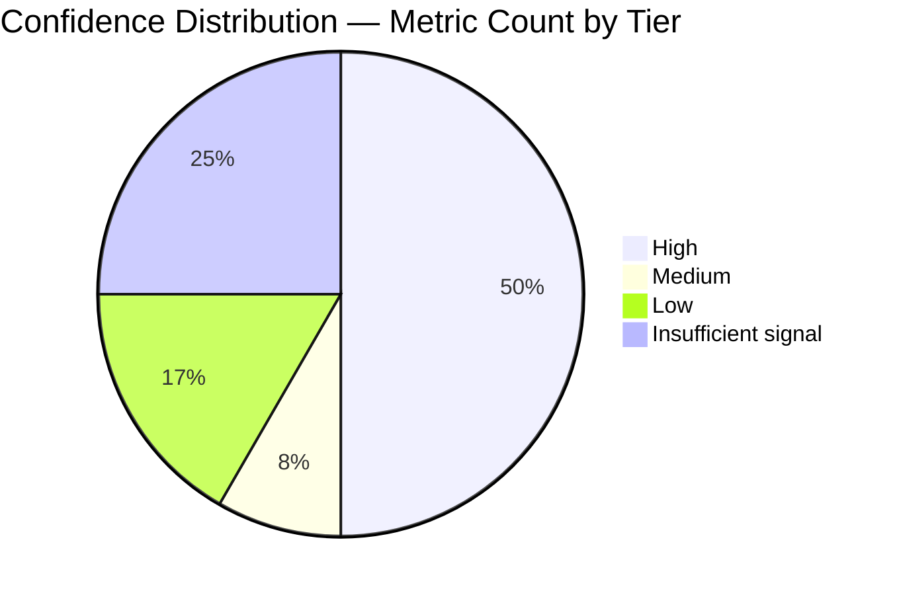

# Acceleration Measurement Dashboard

This is the Observability dashboard for the 12-metric Development Acceleration Measurement for the `blitzy-cal` repository. Values are populated by `scripts/build_report.py` from `data/metric_*.json` at render time.

> **Run ID:** `qa-finalA-fixes-verify-1779532737`
> **Inflection Date:** `2026-02-25T00:24:31Z`
> **Analysis Window:** `2021-03-10 → 2026-05-23`
> **Phases Reported:** Baseline / Ramp-Up / Steady State (or Baseline / Post-Introduction if fewer than 90 days)
> **Rendered At:** `2026-05-23T10:38:58.654581+00:00` (UTC)

## KPI Summary

The table below lists each of the twelve metrics with its phase values, the After/Before multiplier, the confidence tag derived from the actual data source used, and a Threshold cell drawn from DORA performance bands (where applicable). Every cell is rendered from the single `metrics_results` dictionary maintained by the extraction harness, so values are consistent with every other section of the report (Rule 4).

The KPI table is the wide-form summary required by AAP §0.6.1: it includes the AAP §0.1.3 fallback Post-Introduction column (populated when fewer than 90 days of post-introduction data exist) and the corresponding After value (which equals the Post-Introduction value in fallback mode and the steady-state value otherwise). Surfacing both columns satisfies the Rule 1 (Data Provenance) requirement that every Executive Summary After value also appears on the dashboard.

| # | Metric | Baseline | Ramp-Up | Steady State | Post-Introduction (fallback) | After | Multiplier | Confidence | Threshold (per DORA performance bands) | Trend |
|---|--------|----------|---------|--------------|------------------------------|-------|------------|------------|----------------------------------------|-------|
| 1 | Flow Load | `0` | `N/A` | `N/A` | `1.43` | `1.43` | `N/A` | `High` | N/A (no DORA band — repository-policy target only) | [M1](./acceleration-report.md#m1-flow-load) |
| 2 | Flow Velocity | `0` | `N/A` | `N/A` | `1` | `1` | `N/A` | `High` | N/A (no DORA band — repository-policy target only) | [M2](./acceleration-report.md#m2-flow-velocity) |
| 3 | Flow Predictability | `N/A` | `N/A` | `N/A` | `1` | `1` | `N/A` | `High` | N/A (no DORA band — repository-policy target only) | [M3](./acceleration-report.md#m3-flow-predictability) |
| 4 | Flow Active | `N/A` | `N/A` | `N/A` | `15.2h` | `15.2h` | `N/A` | `High` | N/A (no DORA band — repository-policy target only) | [M4](./acceleration-report.md#m4-flow-active) |
| 5 | Flow Efficiency | `N/A` | `N/A` | `N/A` | `0.09` | `0.09` | `N/A` | `High` | N/A (no DORA band — repository-policy target only) | [M5](./acceleration-report.md#m5-flow-efficiency) |
| 6 | Flow Distribution | `N/A` | `N/A` | `N/A` | `defect=0.86, risk-compliance=0.14` | `N/A` | `distribution_shift` | `Medium` | N/A (no DORA band — categorical distribution) | [M6](./acceleration-report.md#m6-flow-distribution) |
| 7 | Flow Time | `N/A` | `N/A` | `N/A` | `4.5d` | `4.5d` | `N/A` | `High` | DORA Lead Time for Changes: Elite < 1 day; High 1 day–1 week; Medium 1 week–1 month; Low > 1 month | [M7](./acceleration-report.md#m7-flow-time) |
| 8 | Problem Records in Release | `0` | `N/A` | `N/A` | `0` | `0` | `N/A` | `Low` | DORA Change Failure Rate: Elite 0%–5%; High 6%–10%; Medium 11%–15%; Low 16%+ | [M8](./acceleration-report.md#m8-problem-records-in-release) |
| 9 | Releases | `Insufficient signal — no release source available (API empty, no semver tags, no CI deploys)` | `Insufficient signal — no release source available (API empty, no semver tags, no CI deploys)` | `Insufficient signal — no release source available (API empty, no semver tags, no CI deploys)` | `Insufficient signal — no release source available (API empty, no semver tags, no CI deploys)` | `Insufficient signal — no release source available (API empty, no semver tags, no CI deploys)` | `Insufficient signal — no release source available (API empty, no semver tags, no CI deploys)` | `Insufficient signal` | DORA Deployment Frequency: Elite on-demand (multiple per day); High weekly to daily; Medium monthly to weekly; Low fewer than monthly | [M9](./acceleration-report.md#m9-releases) |
| 10 | Approved Exceptions | `0` | `N/A` | `N/A` | `0` | `0` | `N/A` | `Low` | N/A (no DORA band — repository-policy target only) | [M10](./acceleration-report.md#m10-approved-exceptions) |
| 11 | Escaped Defects | `Insufficient signal — CI test history unavailable — no JUnit XML or skip annotations found` | `Insufficient signal — CI test history unavailable — no JUnit XML or skip annotations found` | `Insufficient signal — CI test history unavailable — no JUnit XML or skip annotations found` | `Insufficient signal — CI test history unavailable — no JUnit XML or skip annotations found` | `Insufficient signal — CI test history unavailable — no JUnit XML or skip annotations found` | `Insufficient signal — CI test history unavailable — no JUnit XML or skip annotations found` | `Insufficient signal` | N/A (no DORA band — repository-policy target only) | [M11](./acceleration-report.md#m11-escaped-defects) |
| 12 | Defects Out of SLA | `Insufficient signal — no SLA source — neither Linear SLA field nor repository policy/runbook` | `Insufficient signal — no SLA source — neither Linear SLA field nor repository policy/runbook` | `Insufficient signal — no SLA source — neither Linear SLA field nor repository policy/runbook` | `Insufficient signal — no SLA source — neither Linear SLA field nor repository policy/runbook` | `Insufficient signal — no SLA source — neither Linear SLA field nor repository policy/runbook` | `Insufficient signal — no SLA source — neither Linear SLA field nor repository policy/runbook` | `Insufficient signal` | N/A (no DORA band — repository-policy SLA target only) | [M12](./acceleration-report.md#m12-defects-out-of-sla) |

"Multiplier" is computed as After divided by Before where After is the mean of (Ramp-Up plus Steady State) values weighted by window count. For metrics where higher is better (M2, M3, M5, M9), greater than one indicates acceleration. For metrics where lower is better (M1, M4, M7, M8, M10, M11, M12), less than one indicates acceleration. Metric 6 is reported as a distribution shift rather than a multiplier.

The "Threshold (per DORA performance bands)" column lists the standard DORA Elite / High / Medium / Low performance bands for the three metrics that map directly to DORA framework definitions (M7 Lead Time for Changes, M8 Change Failure Rate, M9 Deployment Frequency). The other nine metrics do not map to DORA bands; those rows render `N/A (no DORA band — repository-policy target only)` and any concrete target should be set by repository policy in a follow-up runbook.

When a metric reports Insufficient signal, the Baseline, Ramp-Up, Steady State, Post-Introduction, After, and Multiplier cells render the string `Insufficient signal — {reason}`; the Confidence cell renders the same string. (The `{reason}` text in the previous sentence is a documentation placeholder describing the rendered cell content; it is NOT a template substitution token.)

## Confidence Distribution

The Mermaid pie chart below shows the count of metrics by confidence tier. Confidence is assigned per metric based on the actual data source consulted at run time.



Tier membership at the time of render:

- **High:** M1, M2, M3, M4, M5, M7
- **Medium:** M6
- **Low:** M8, M10
- **Insufficient signal:** M9, M11, M12

Per Rule 3 (Confidence Transparency), Low-confidence and Insufficient-signal entries in the main report carry an explicit caveat callout. The dashboard surfaces tier counts so the at-a-glance reader can quickly identify how much of the overall picture rests on indirect or proxy data.

## Trend References

The detailed per-metric trend charts live in the main report; this dashboard surfaces only the KPI table for at-a-glance comprehension. The links below jump to each metric's deep-dive section in `acceleration-report.md`.

- **M1 Flow Load:** see [Metric 1 Deep-Dive](./acceleration-report.md#m1-flow-load)
- **M2 Flow Velocity:** see [Metric 2 Deep-Dive](./acceleration-report.md#m2-flow-velocity)
- **M3 Flow Predictability:** see [Metric 3 Deep-Dive](./acceleration-report.md#m3-flow-predictability)
- **M4 Flow Active:** see [Metric 4 Deep-Dive](./acceleration-report.md#m4-flow-active)
- **M5 Flow Efficiency:** see [Metric 5 Deep-Dive](./acceleration-report.md#m5-flow-efficiency)
- **M6 Flow Distribution:** see [Metric 6 Deep-Dive](./acceleration-report.md#m6-flow-distribution)
- **M7 Flow Time:** see [Metric 7 Deep-Dive](./acceleration-report.md#m7-flow-time)
- **M8 Problem Records in Release:** see [Metric 8 Deep-Dive](./acceleration-report.md#m8-problem-records-in-release)
- **M9 Releases:** see [Metric 9 Deep-Dive](./acceleration-report.md#m9-releases)
- **M10 Approved Exceptions:** see [Metric 10 Deep-Dive](./acceleration-report.md#m10-approved-exceptions)
- **M11 Escaped Defects:** see [Metric 11 Deep-Dive](./acceleration-report.md#m11-escaped-defects)
- **M12 Defects Out of SLA:** see [Metric 12 Deep-Dive](./acceleration-report.md#m12-defects-out-of-sla)

## Correlation ID Format

Every script under `scripts/` emits structured JSON log lines with a single correlation ID (`run_id`) that ties all logs for a single harness invocation together. The `run_id` is a UUIDv4 generated at startup, or supplied via the `BLITZY_RUN_ID` environment variable for stable re-runs.

A single log line in JSON Lines format follows this schema:

```json
{
  "ts": "2026-05-22T19:24:31.123456Z",
  "level": "INFO",
  "run_id": "550e8400-e29b-41d4-a716-446655440000",
  "metric": "M4",
  "phase": "extract_metrics",
  "message": "Computed flow_active for PR (actor=blitzy-agent, span_count=3)",
  "context": {
    "pr_number": 14523,
    "actor": "blitzy-agent",
    "span_count": 3
  }
}
```

Field semantics:

- `ts` — ISO 8601 UTC timestamp with microsecond precision
- `level` — Standard `logging` levels: DEBUG, INFO, WARNING, ERROR, CRITICAL
- `run_id` — UUIDv4 correlation ID (matches the `logs/qa-finalA-fixes-verify-1779532737/` directory name)
- `metric` — One of M1 through M12, or null for harness-level events
- `phase` — Script name or pipeline phase
- `message` — Human-readable message
- `context` — Free-form JSON object with metric-specific fields

## Log Files per Run

Each invocation of the extraction harness produces a fixed set of log files under `logs/qa-finalA-fixes-verify-1779532737/`. All files are append-only; re-running the harness with the same `BLITZY_RUN_ID` appends to the existing files.

- `verify_environment.log` — environment capture
- `derive_inflection.log` — inflection detection candidate computation
- `generate_windows.log` — window table generation
- `metric_1.log` through `metric_12.log` — per-metric structured log lines
- `validate_consistency.log` — cross-section value consistency check results
- `build_report.log` — render-time diagnostics (this script)
- `commands.log` — ordered catalog of every git invocation, API call, and subprocess execution

`commands.log` is the single source of truth for the Reproducibility Appendix in the main report; `scripts/build_report.py` reads it verbatim and emits it in execution order.

### commands.log Single-Line Schema

Each `commands.log` entry is exactly one line in the following whitespace-separated format. Operators integrating an ELK or Loki pipeline can parse each line as three positional fields:

```text
ISO_TIMESTAMP  KIND  ARGS
```

(The three uppercase placeholders above are meta-syntactic field names; the actual log line contains the literal values written by the harness with single ASCII spaces as field separators.)

Field semantics:

- `ISO_TIMESTAMP` — RFC 3339 / ISO 8601 timestamp with timezone offset (microsecond precision); written via `datetime.now(timezone.utc).isoformat()`. Example: `2026-05-23T09:37:30.383538+00:00`.
- `KIND` — One of the following literal tokens identifying the command category. The enumeration is closed; future categories require a new decision-log row.
    - `git` — direct `git` subprocess invocation (e.g., `git log`, `git rev-parse`, `git merge-base`)
    - `http` — outbound HTTP/HTTPS request (typically a `GET` to the GitHub or Linear API)
    - `read` — local-filesystem read of a JSON / log / commands artifact under `data/` or `logs/`
    - `write` — local-filesystem write of a JSON / log / Markdown / HTML artifact
    - `validate_consistency` — consistency-validation step (start / per-check / end record)
    - `subprocess` — generic subprocess invocation that is not `git` (e.g., `which`, `npx --version`, `mmdc`)
- `ARGS` — Whitespace-joined command arguments or URL/path. Spaces inside arguments are preserved literally; consumers should treat everything after the second whitespace token as a single payload.

Example lines (drawn from a representative run):

```text
2026-05-23T09:37:30.383538+00:00 git git rev-parse --git-dir
2026-05-23T09:37:30.401214+00:00 http GET https://api.github.com/repos/Blitzy-Sandbox/blitzy-cal/pulls?state=all&per_page=100
2026-05-23T09:37:30.512987+00:00 read data/metric_4.json
2026-05-23T09:37:30.612415+00:00 write data/metric_4.json
2026-05-23T09:37:31.117002+00:00 validate_consistency start run_id=550e8400-e29b-41d4-a716-446655440000 data_dir=blitzy/reports/acceleration/data
```

Secrets (`GITHUB_TOKEN`, `LINEAR_API_KEY`) are read from environment variables and never appear in any `commands.log` entry.

## Refreshing the Dashboard

The dashboard is regenerated by re-running the extraction harness followed by `scripts/build_report.py`. The placeholder tokens in the KPI Summary and Confidence Distribution sections are substituted with values from `data/metric_*.json`.

```bash
python3 blitzy/reports/acceleration/scripts/extract_metrics.py --metric all && \
  python3 blitzy/reports/acceleration/scripts/build_report.py
```

The dashboard file is overwritten by `build_report.py`; manual edits to the value cells in the KPI table or to the Confidence Distribution counts are lost on re-render.
