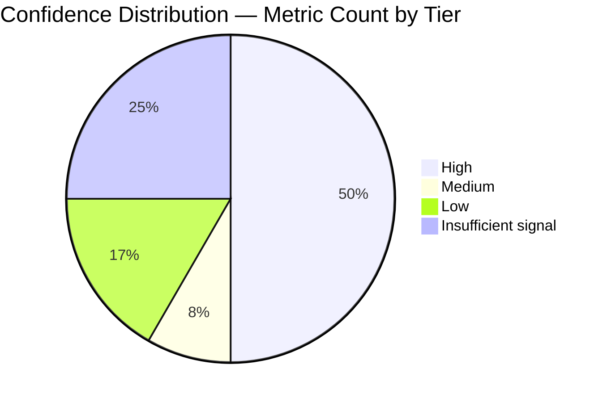

# Acceleration Measurement Dashboard

This is the Observability dashboard for the 12-metric Development Acceleration Measurement for the `blitzy-cal` repository. Values are populated by `scripts/build_report.py` from `data/metric_*.json` at render time.

> **Run ID:** `test_no_commands`
> **Inflection Date:** `2026-02-25T00:24:31Z`
> **Analysis Window:** `2021-03-10 → 2026-05-23`
> **Phases Reported:** Baseline / Ramp-Up / Steady State (or Baseline / Post-Introduction if fewer than 90 days)
> **Rendered At:** `2026-05-23T09:19:56.749449+00:00` (UTC)

## KPI Summary

The table below lists each of the twelve metrics with its phase values, the After/Before multiplier, and the confidence tag derived from the actual data source used. Every cell is rendered from the single `metrics_results` dictionary maintained by the extraction harness, so values are consistent with every other section of the report (Rule 4).

| # | Metric | Baseline | Ramp-Up | Steady State | Multiplier | Confidence | Trend |
|---|--------|----------|---------|--------------|------------|------------|-------|
| 1 | Flow Load | `0` | `N/A` | `N/A` | `N/A` | `High` | [M1](./acceleration-report.md#m1-flow-load) |
| 2 | Flow Velocity | `0` | `N/A` | `N/A` | `N/A` | `High` | [M2](./acceleration-report.md#m2-flow-velocity) |
| 3 | Flow Predictability | `N/A` | `N/A` | `N/A` | `N/A` | `High` | [M3](./acceleration-report.md#m3-flow-predictability) |
| 4 | Flow Active | `N/A` | `N/A` | `N/A` | `N/A` | `High` | [M4](./acceleration-report.md#m4-flow-active) |
| 5 | Flow Efficiency | `N/A` | `N/A` | `N/A` | `N/A` | `High` | [M5](./acceleration-report.md#m5-flow-efficiency) |
| 6 | Flow Distribution | `N/A` | `N/A` | `N/A` | `distribution_shift` | `Medium` | [M6](./acceleration-report.md#m6-flow-distribution) |
| 7 | Flow Time | `N/A` | `N/A` | `N/A` | `N/A` | `High` | [M7](./acceleration-report.md#m7-flow-time) |
| 8 | Problem Records in Release | `0` | `N/A` | `N/A` | `N/A` | `Low` | [M8](./acceleration-report.md#m8-problem-records-in-release) |
| 9 | Releases | `Insufficient signal — no release source available (API empty, no semver tags, no CI deploys)` | `Insufficient signal — no release source available (API empty, no semver tags, no CI deploys)` | `Insufficient signal — no release source available (API empty, no semver tags, no CI deploys)` | `Insufficient signal — no release source available (API empty, no semver tags, no CI deploys)` | `Insufficient signal` | [M9](./acceleration-report.md#m9-releases) |
| 10 | Approved Exceptions | `0` | `N/A` | `N/A` | `N/A` | `Low` | [M10](./acceleration-report.md#m10-approved-exceptions) |
| 11 | Escaped Defects | `Insufficient signal — CI test history unavailable — no JUnit XML or skip annotations found` | `Insufficient signal — CI test history unavailable — no JUnit XML or skip annotations found` | `Insufficient signal — CI test history unavailable — no JUnit XML or skip annotations found` | `Insufficient signal — CI test history unavailable — no JUnit XML or skip annotations found` | `Insufficient signal` | [M11](./acceleration-report.md#m11-escaped-defects) |
| 12 | Defects Out of SLA | `Insufficient signal — no SLA source — neither Linear SLA field nor repository policy/runbook` | `Insufficient signal — no SLA source — neither Linear SLA field nor repository policy/runbook` | `Insufficient signal — no SLA source — neither Linear SLA field nor repository policy/runbook` | `Insufficient signal — no SLA source — neither Linear SLA field nor repository policy/runbook` | `Insufficient signal` | [M12](./acceleration-report.md#m12-defects-out-of-sla) |

"Multiplier" is computed as After divided by Before where After is the mean of (Ramp-Up plus Steady State) values weighted by window count. For metrics where higher is better (M2, M3, M5, M9), greater than one indicates acceleration. For metrics where lower is better (M1, M4, M7, M8, M10, M11, M12), less than one indicates acceleration. Metric 6 is reported as a distribution shift rather than a multiplier.

When a metric reports Insufficient signal, the Baseline, Ramp-Up, Steady State, and Multiplier cells render the string `Insufficient signal — {reason}`; the Confidence cell renders the same string. (The `{reason}` text in the previous sentence is a documentation placeholder describing the rendered cell content; it is NOT a template substitution token.)

## Confidence Distribution

The Mermaid pie chart below shows the count of metrics by confidence tier. Confidence is assigned per metric based on the actual data source consulted at run time.



Tier membership at the time of render:

- **High:** M1, M2, M3, M4, M5, M7
- **Medium:** M6
- **Low:** M8, M10
- **Insufficient signal:** M9, M11, M12

Per Rule 3 (Confidence Transparency), Low-confidence and Insufficient-signal entries in the main report carry an explicit caveat callout. The dashboard surfaces tier counts so the at-a-glance reader can quickly identify how much of the overall picture rests on indirect or proxy data.

## Trend References

The detailed per-metric trend charts live in the main report; this dashboard surfaces only the KPI table for at-a-glance comprehension. The links below jump to each metric's deep-dive section in `acceleration-report.md`.

- **M1 Flow Load:** see [Metric 1 Deep-Dive](./acceleration-report.md#m1-flow-load)
- **M2 Flow Velocity:** see [Metric 2 Deep-Dive](./acceleration-report.md#m2-flow-velocity)
- **M3 Flow Predictability:** see [Metric 3 Deep-Dive](./acceleration-report.md#m3-flow-predictability)
- **M4 Flow Active:** see [Metric 4 Deep-Dive](./acceleration-report.md#m4-flow-active)
- **M5 Flow Efficiency:** see [Metric 5 Deep-Dive](./acceleration-report.md#m5-flow-efficiency)
- **M6 Flow Distribution:** see [Metric 6 Deep-Dive](./acceleration-report.md#m6-flow-distribution)
- **M7 Flow Time:** see [Metric 7 Deep-Dive](./acceleration-report.md#m7-flow-time)
- **M8 Problem Records in Release:** see [Metric 8 Deep-Dive](./acceleration-report.md#m8-problem-records-in-release)
- **M9 Releases:** see [Metric 9 Deep-Dive](./acceleration-report.md#m9-releases)
- **M10 Approved Exceptions:** see [Metric 10 Deep-Dive](./acceleration-report.md#m10-approved-exceptions)
- **M11 Escaped Defects:** see [Metric 11 Deep-Dive](./acceleration-report.md#m11-escaped-defects)
- **M12 Defects Out of SLA:** see [Metric 12 Deep-Dive](./acceleration-report.md#m12-defects-out-of-sla)

## Correlation ID Format

Every script under `scripts/` emits structured JSON log lines with a single correlation ID (`run_id`) that ties all logs for a single harness invocation together. The `run_id` is a UUIDv4 generated at startup, or supplied via the `BLITZY_RUN_ID` environment variable for stable re-runs.

A single log line in JSON Lines format follows this schema:

```json
{
  "ts": "2026-05-22T19:24:31.123456Z",
  "level": "INFO",
  "run_id": "550e8400-e29b-41d4-a716-446655440000",
  "metric": "M4",
  "phase": "extract_metrics",
  "message": "Computed flow_active for PR (actor=blitzy-agent, span_count=3)",
  "context": {
    "pr_number": 14523,
    "actor": "blitzy-agent",
    "span_count": 3
  }
}
```

Field semantics:

- `ts` — ISO 8601 UTC timestamp with microsecond precision
- `level` — Standard `logging` levels: DEBUG, INFO, WARNING, ERROR, CRITICAL
- `run_id` — UUIDv4 correlation ID (matches the `logs/test_no_commands/` directory name)
- `metric` — One of M1 through M12, or null for harness-level events
- `phase` — Script name or pipeline phase
- `message` — Human-readable message
- `context` — Free-form JSON object with metric-specific fields

## Log Files per Run

Each invocation of the extraction harness produces a fixed set of log files under `logs/test_no_commands/`. All files are append-only; re-running the harness with the same `BLITZY_RUN_ID` appends to the existing files.

- `verify_environment.log` — environment capture
- `derive_inflection.log` — inflection detection candidate computation
- `generate_windows.log` — window table generation
- `metric_1.log` through `metric_12.log` — per-metric structured log lines
- `validate_consistency.log` — cross-section value consistency check results
- `build_report.log` — render-time diagnostics (this script)
- `commands.log` — ordered catalog of every git invocation, API call, and subprocess execution

`commands.log` is the single source of truth for the Reproducibility Appendix in the main report; `scripts/build_report.py` reads it verbatim and emits it in execution order.

## Refreshing the Dashboard

The dashboard is regenerated by re-running the extraction harness followed by `scripts/build_report.py`. The placeholder tokens in the KPI Summary and Confidence Distribution sections are substituted with values from `data/metric_*.json`.

```bash
python3 blitzy/reports/acceleration/scripts/extract_metrics.py --metric all && \
  python3 blitzy/reports/acceleration/scripts/build_report.py
```

The dashboard file is overwritten by `build_report.py`; manual edits to the value cells in the KPI table or to the Confidence Distribution counts are lost on re-render.
