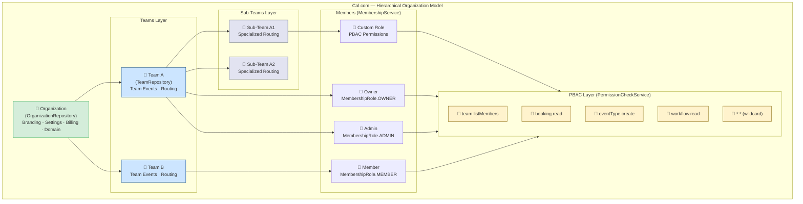
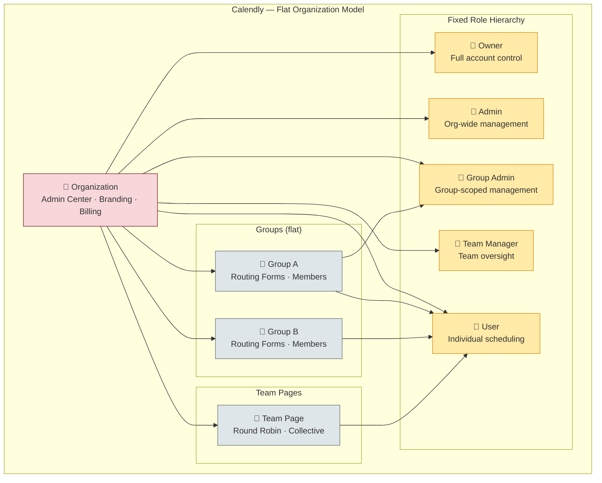

## Overview

Admin governance and team management form the organizational backbone of any enterprise scheduling platform. This domain encompasses how organizations are structured, how teams operate within them, how roles and permissions are assigned, and how administrative control flows across the hierarchy. Effective admin governance enables enterprises to standardize scheduling behavior, enforce security policies, and scale team operations without losing control.

This gap analysis compares **Cal.com's hierarchical organization model** — featuring Permission-Based Access Control (PBAC), sub-teams, managed event types, and deep dependency-injection architecture — against **Calendly's flatter admin/owner/user role model** with organization-wide scope management, groups, and managed events.

**Scope of this analysis:**

- Organization hierarchy and structure
- Team and sub-team management
- Role models and permission systems
- Managed event types (admin-pushed templates)
- Organization-level branding and customization
- SSO/SAML and SCIM provisioning
- Member invitation and lifecycle workflows
- API-level organization management capabilities

<Info>
  **Key Finding:** Cal.com's admin governance model **significantly exceeds** Calendly's capabilities. Cal.com implements a hierarchical organization structure with PBAC, sub-teams, custom roles, and programmatic organization management — none of which Calendly supports. Calendly uses a simpler flat organization with five fixed roles and no sub-organization capability.
</Info>

---

## Cal.com Current Implementation

Cal.com's admin governance is implemented through a layered enterprise architecture spanning organizations, teams, memberships, and a comprehensive PBAC permission system. The implementation uses dependency injection (DI) patterns with token-based service resolution for testability and modularity.

### Organization Management

Cal.com's organization layer is implemented in the `packages/features/ee/organizations/` package, providing a full-lifecycle enterprise organization system.

**OrganizationRepository** serves as the primary persistence layer, implementing:

- **Organization creation** with two paths: `createWithExistingUserAsOwner` and `createWithNonExistentOwner`, both persisting nested `organizationSettings`, auto-accept domains, billing metadata (`billingPeriod`, `seats`, `pricePerSeat`), `requestedSlug` fallbacks, and optional branding assets. Owner memberships are created with `MembershipRole.OWNER`.
- **Organization lookup** via `findById`, `findBySlug`, onboarding-aware variants, and `findCurrentOrg` (which loads membership info and parses `teamMetadataSchema`).
- **Domain management** through `findUniqueNonPlatformOrgsByMatchingAutoAcceptEmail` (derives email domain, filters for verified, admin-reviewed, non-platform organizations), `getVerifiedOrganizationByAutoAcceptEmailDomain`, and `setSlug`.
- **Branding** via `findCalVideoLogoByOrgId` and organization-level logo, bio, brandColor, and bannerUrl persistence.
- **Billing integration** through `updateStripeSubscriptionDetails` and `PlatformBillingRepository` for Stripe subscription lookups.

`Source: packages/features/ee/organizations/repositories/OrganizationRepository.ts`

**Organization Library** (`lib/`) provides a comprehensive utility layer:

- **OrganizationPaymentService** — Orchestrates Stripe onboarding flows, enforcing seat counting (unique memberships plus invites), pricing defaults versus custom pricing, and admin vs non-admin paths.
- **OrganizationPermissionService** — Guards organization operations with methods like `hasPermissionToCreateForEmail`, `hasPermissionToMigrateTeams`, and `validatePermissions`.
- **orgDomains.ts** — Canonical hostname-to-slug/origin resolver honoring `ALLOWED_HOSTNAMES`, `RESERVED_SUBDOMAINS`, `SINGLE_ORG_SLUG`, and forced slug headers.
- **AdminOrganizationUpdateService** — Zod schema validation, metadata helpers, slug rename safeguards, and transactional organization settings updates.
- **OrganizationMembershipService** — Auto-accept decision based on verified-org domains.
- **Onboarding services** — Factory pattern with base service, billing-enabled, and self-hosted variants.
- **orgSettings.ts** — Narrowly typed helpers (`MinimumOrganizationSettings`, `SEOOrganizationSettings`) for safe configuration access.
- **URL utilities** — `getBookerBaseUrlSync`, `getBookerUrlServer`, `getBrand`, `getTeamUrlSync` for organization-aware URL resolution.

`Source: packages/features/ee/organizations/lib/`

**Organization Context and DI** — The `context/` folder exports `OrganizationBranding` payload, context/hook pair, and provider that merges Prisma/metadata typing with React's context API. The `di/` directory declares symbol tokens for repositories, membership services, and billing taskers with `bindModuleToClassOnToken` wiring.

`Source: packages/features/ee/organizations/context/, packages/features/ee/organizations/di/`

**Organization Types** — `createOrganizationSchema` (Zod-based) validates onboarding IDs, branding metadata, `invitedMembers`, and `teams`.

`Source: packages/features/ee/organizations/types/schemas.ts`

### Team Management

Cal.com's team layer is implemented in `packages/features/ee/teams/`, providing hierarchical team operations within organizations.

**TeamRepository** implements:

- **Team CRUD** — `getTeam`, `getOrg`, `findById`, `deleteById` (with managed event/member cascading), `findTeamWithMembers`, `findTeamsByUserId`.
- **Membership checks** — `isTeamOwner`, `isTeamMember`, managed-event assignment helpers.
- **Metadata parsing** — All operations return `TeamGetPayloadWithParsedMetadata` using `teamMetadataSchema` validation.
- **Slug management** — `findTeamSlugById`, slug availability checks.
- **Organization awareness** — `findAllByParentId`, `findOrganizationSettingsBySlug`, `findTeamMembersWithPermission`.

`Source: packages/features/ee/teams/repositories/TeamRepository.ts`

**TeamService** wires Prisma delegates, billing factory (`getTeamBillingServiceFactory`), `WorkflowService`, `SeatChangeTrackingService`, domain managers, and onboarding service for complete team lifecycle management.

`Source: packages/features/ee/teams/services/teamService.ts`

**Team Event Type Form** — `TeamEventTypeForm.tsx` provides a React component for EE team event type creation with platform-aware hooks, `SchedulingType` enum integration, permission-gated managed event option, and locale-aware descriptions.

`Source: packages/features/ee/teams/components/TeamEventTypeForm.tsx`

**Team Library** (`lib/`) includes:

- **inviteMemberUtils** — Metadata-validated team lookup, invite token generation, onboarding URL creation, `sendTeamInviteEmail` dispatch, batch email operations, `createMemberships` with seat accounting.
- **getTeamData** — Slug resolution, parent filtering, deterministic ordering, and Prisma projections exposing theming, privacy, branding, and SEO metadata.
- **payments.ts** — Stripe-based flows: `checkIfTeamPaymentRequired`, `generateTeamCheckoutSession`, `purchaseTeamOrOrgSubscription`.
- **deleteWorkflowRemindersOfRemovedMember** — Cleanup when members leave.

`Source: packages/features/ee/teams/lib/`

**Team Types** define shared contracts:

```typescript
interface NewTeamFormValues {
  name: string;
  slug: string;
  temporarySlug: string;
  logo: string;
}

interface PendingMember {
  name: string | null;
  email: string;
  id?: number;
  username: string | null;
  role: MembershipRole;
  avatarUrl?: string | null;
  sendInviteEmail?: boolean;
}
```

`Source: packages/features/ee/teams/lib/types.ts`

### Membership Management

Cal.com's membership layer in `packages/features/membership/` provides role-based membership checking and administration.

**MembershipRepository** centralizes Prisma-based persistence:

- **Acceptance checks** — `hasMembership`, `hasAcceptedMembershipByEmail`.
- **Listing helpers** — `listAcceptedTeamMemberIds`, `findTeamAdminsByTeamId`, `findAllByUserId`, `findAllMembershipsByUserIdForBilling`.
- **Lookup** — `findUniqueByUserIdAndTeamId`, email-based lookups.
- **Availability** — `findByTeamIdForAvailability` with credential selects and `withSelectedCalendars`.
- **Admin detection** — `getAdminOrOwnerMembership`, published-team enumeration, pending-invite detection.
- **Organization utilities** — `PrismaOrgMembershipRepository` with `getOrgIdsWhereAdmin` and `isLoggedInUserOrgAdminOfBookingHost`.

`Source: packages/features/membership/repositories/MembershipRepository.ts`

**MembershipService** provides role checking:

```typescript
type MembershipCheckResult = {
  isMember: boolean;
  isAdmin: boolean;
  isOwner: boolean;
  role?: MembershipRole;
};
```

The `checkMembership` method queries the repository, validates acceptance status, and derives ownership and admin flags from `MembershipRole.OWNER` and `MembershipRole.ADMIN`.

`Source: packages/features/membership/services/membershipService.ts`

### Permission-Based Access Control (PBAC)

Cal.com implements a comprehensive PBAC system in `packages/features/pbac/`, representing one of its most significant architectural advantages over Calendly.

**Permission Registry** — The `domain/types/permission-registry.ts` centralizes `Resource`, `CrudAction`, `CustomAction`, and `Scope` enums, typed `PermissionString` aliases, and helper functions for parsing, validation, and scope-aware permission retrieval. Permissions follow the `resource.action` convention (e.g., `team.listMembers`, `booking.read`, `eventType.create`).

`Source: packages/features/pbac/domain/types/permission-registry.ts`

**Domain Models** — `Permission`, `PermissionCheck`, `TeamPermissions`, `Role`, `RolePermission`, and DTOs (`CreateRoleData`, `UpdateRolePermissionsData`, `PermissionChange`) standardize contracts across the stack.

`Source: packages/features/pbac/domain/models/`

**PermissionMapper** — Bridges persistence rows, `PermissionString` literals, and domain models with `toDomain`, `toPermissionString`, `fromPermissionString`, and `toActionMap` helpers. Supports wildcard strings (`*.*`).

`Source: packages/features/pbac/domain/mappers/PermissionMapper.ts`

**Repository Contracts** — `IPermissionRepository` declares async permission lookups, team discovery, and role-based permission checks. `IRoleRepository` documents role CRUD operations.

`Source: packages/features/pbac/domain/repositories/`

**Service Layer:**

- **PermissionCheckService** — PBAC-aware permission evaluation combining feature flag gating, repository access, and fallback role enforcement. Exposes `getUserPermissions`, `getResourcePermissions`, `checkPermission(s)`, and team ID discovery by permission.
- **RoleService** — Default role guarding (`DEFAULT_ROLE_IDS`, `DomainRoleType.SYSTEM` checks), custom role lifecycle (create, update via `PermissionDiffService` diffs, delete with member reassignment), and role assignment.
- **PermissionDiffService** — Calculates permission diffs for role updates, filtering internal permissions and producing `toAdd`/`toRemove` arrays.
- **RoleManagementFactory** — Singleton factory that queries the `pbac` feature flag and returns either `PBACRoleManager` or `LegacyRoleManager`, ensuring seamless fallback.
- **LegacyRoleManager** — Non-PBAC fallback verifying owner/admin invariants with `validateRoleChange`.
- **PBACRoleManager** — Full PBAC implementation with permission checks, last-owner demotion prevention, custom role validation, and role assignment.

`Source: packages/features/pbac/services/`

**Client-Side Enforcement** — `WorkflowTabPermissionGuard` wraps UI with `workflow.read` guards. `EventPermissionContext` provides a Zustand store/provider/hooks surface for cached event/workflow permissions.

`Source: packages/features/pbac/client/`

**Infrastructure** — `PermissionRepository` (feature-flag aware, wildcard handling, telemetry/logging) and `RoleRepository` (transactional CRUD, custom role persistence) with Vitest integration tests. A Zustand-backed `TeamPermissions` cache provides constant-time permission lookups.

`Source: packages/features/pbac/infrastructure/`

### Managed Event Types

Cal.com supports `SchedulingType.MANAGED` — admin-controlled event type templates that are pushed to team members. The `TeamEventTypeForm` component gates the managed option behind `canCreateEventType` permissions, and the team repository includes managed event cascading on team deletion.

`Source: packages/features/ee/teams/components/TeamEventTypeForm.tsx`

### SSO/SAML and SCIM

Cal.com supports SSO/SAML via BoxyHQ Jackson integration (`packages/features/ee/sso/`). The organizations setup documentation references SCIM provisioning capabilities, and the `OrganizationMembershipService` supports auto-accept based on verified organization domains — enabling automatic domain-based user onboarding similar to SCIM-like behavior.

`Source: packages/features/ee/organizations/README.md`

---

## Calendly Admin Governance Behavior

Calendly implements a simpler, flatter organization model focused on centralized administration through an Admin Center interface. The following describes Calendly's admin governance capabilities as documented at [developer.calendly.com](https://developer.calendly.com) and the [Calendly Help Center](https://help.calendly.com).

### Role Model

Calendly offers **five distinct roles** with fixed, non-customizable permissions:

| Role | Scope | Available On |
|------|-------|-------------|
| **Owner** | Full account ownership, billing management, all admin capabilities | All plans |
| **Admin** | Full organizational control, user management, managed events, settings | All plans (1 per org on free) |
| **Group Admin** | Manage group members, create routing forms for their group, reporting | Teams and Enterprise |
| **Team Manager** | Oversee team scheduling, limited admin access | Teams and Enterprise |
| **User** | Individual scheduling, personal event types and settings | All plans |

`Reference: help.calendly.com — User roles and permissions`

### Organization-Wide Scope Management

- **Admin Center** — Central dashboard for managing users, groups, and organization settings. Accessible to owners, admins, and group admins (with limited access).
- **User management** — Admins and owners invite users, assign roles, manage pending invites, and export user data (CSV reports of active/pending members).
- **Seat-based billing** — Each user occupies a paid seat. Admins/owners count as paid seats. Seats can be added or reduced (cannot reduce below active user count).
- **Invitation workflow** — Email-based invitations, automatic resend after 7 days, up to 100 users at a time. Users must accept from the invited email address.
- **Single-organization constraint** — A user can only belong to one Calendly organization at a time. They must be removed from one before joining another.
- **Workflow permissions** — Admins control who can create, edit, and delete Workflows (all users vs. admins/owner only).

`Reference: help.calendly.com — User management, Admin Center`

### Groups

- Groups organize members within an organization (available on Teams and Enterprise plans).
- Group admins manage their group without full admin access.
- Groups can have routing forms scoped to the group.
- Enterprise customers can use SCIM to automatically provision users into groups.

`Reference: help.calendly.com — Groups overview`

### Managed Events

Calendly supports managed events — standardized event types that admins can edit, lock, update, and assign to individual users or groups. Managed events ensure a consistent customer experience across the organization. Admins can lock event settings so only admins can adjust them.

`Reference: help.calendly.com — Managed Events overview`

### Team Event Routing

Calendly supports team pages with Round Robin event distribution (even or priority-based) and Collective event types for multi-host meetings. Teams are created from the Admin Center with team members, avatar, and timezone configuration.

`Reference: help.calendly.com — Using Calendly with a team`

### SSO/SAML and SCIM

- **SSO** — SAML-based single sign-on available on the Enterprise plan, supporting Okta, Azure/Entra ID, OneLogin, Auth0, and generic SAML identity providers.
- **SCIM** — Automated user provisioning (add, update, deactivate, remove) through SCIM 2.0, requiring SSO to be enabled first. Supports group provisioning with custom attribute mapping. SCIM sync runs every 40 minutes with manual on-demand provisioning available.
- **Domain claim** — Admins can claim their corporate domain and establish how new employees request access.

`Reference: help.calendly.com — SCIM user provisioning overview, Company admin guide`

### API Access by Role

Calendly's API enforces role-based data scoping:

- **User role tokens** — Access only data linked to that specific user.
- **Admin/Owner tokens** — Broader access to manage data across the entire organization or within groups.
- **Organization endpoints** — `GET /organization_memberships`, `GET /event_types?organization={org_uri}`, and `GET /scheduled_events` support organization-wide queries when authenticated with admin/owner tokens.

`Reference: developer.calendly.com — Getting Started, API overview`

### Calendly Limitations

- **No hierarchical organizations** — Flat, single-level organization structure with no sub-organizations.
- **No sub-teams** — Groups provide organizational units but cannot be nested hierarchically.
- **Fixed role permissions** — Five predefined roles with no customization or fine-grained permission control.
- **No programmatic organization management** — The API does not support creating organizations, managing roles, or configuring settings programmatically.
- **Single-org membership** — Users can only belong to one organization at a time.
- **No custom branding per team** — Organization-wide logo only, not per-team customization.

`Reference: developer.calendly.com — FAQ, API Use Cases`

---

## Feature Comparison Matrix

The following matrix compares Cal.com and Calendly across all admin governance and team management capabilities.

| Feature | Calendly Behavior | Cal.com Status | Gap Severity | Notes |
|---------|------------------|----------------|-------------|-------|
| **Organization hierarchy** | Flat, single-level organization | Hierarchical: Organization → Teams → Sub-teams | **Low** | Cal.com exceeds — supports multi-level hierarchy |
| **Sub-organizations** | Not supported | Supported via parent/child team relationships | **Low** | Cal.com advantage |
| **Sub-teams** | Not supported (groups are flat) | Supported within organizations | **Low** | Cal.com advantage |
| **Role model** | 5 fixed roles: Owner, Admin, Group Admin, Team Manager, User | 3 base roles (OWNER, ADMIN, MEMBER) + PBAC custom roles | **Low** | Cal.com's PBAC enables unlimited custom roles with fine-grained permissions. ✅ AG-001 alignment completed — PBAC model aligned with Calendly's admin/owner/user role structure |
| **Custom permissions** | Not supported — fixed per-role permissions | PBAC: resource.action permissions (e.g., `team.listMembers`, `booking.read`) with wildcard support | **Low** | Cal.com significantly exceeds — PBAC is a major architectural advantage |
| **Permission inheritance** | Implicit via role hierarchy | Explicit via organization hierarchy with fallback roles | **Low** | Cal.com advantage |
| **Managed event types** | Admin-created, lockable, assignable to users/groups | `SchedulingType.MANAGED` — admin-pushed templates with team cascading | **Low** | Both platforms support managed events; functionally equivalent. ✅ AG-003 push behavior aligned with Calendly's admin-templated distribution |
| **Organization branding** | Company logo on all booking pages | Per-org logo, bio, brandColor, bannerUrl; sub-domain branding | **Low** | Cal.com exceeds — richer branding with per-org customization |
| **SSO/SAML** | SAML SSO via Okta, Azure, OneLogin, Auth0 (Enterprise plan) | BoxyHQ Jackson integration for SAML SSO (EE license) | **Low** | Both support SAML SSO; Calendly has more pre-built IdP integrations in UI |
| **SCIM provisioning** | SCIM 2.0 with group provisioning, 40-min sync cycle (Enterprise plan) | Domain-based auto-accept; referenced SCIM support via SSO integration | **Low** | Calendly has slightly more documented SCIM group provisioning; Cal.com compensates with domain-based auto-join |
| **Team event routing** | Round Robin (even/priority), Collective events | Round Robin, Collective, plus Managed and Dynamic scheduling types | **Low** | Cal.com exceeds — more scheduling paradigms. ✅ AG-002 parity achieved — round-robin and collective behaviors aligned with Calendly patterns |
| **Member invitation** | Email-based, auto-resend 7 days, up to 100 at once | Token-based invitations with onboarding URL, batch email operations, seat accounting | **Low** | Functionally equivalent. ✅ AG-004 lifecycle parity achieved — invitation acceptance/rejection workflow aligned |
| **Organization-wide settings** | Admin Center with user, group, and settings management | `OrganizationSettingsRepository` with Zod validation, transactional updates | **Low** | Both support org-wide configuration |
| **User CSV export** | Admins can export active/pending user lists as CSV | Not a built-in feature — data accessible via API and admin interfaces | **Low** | Minor Calendly convenience feature |
| **Workflow permissions** | Admin-controlled: all users vs. admins only | PBAC-gated workflow permissions (`workflow.read`, `workflow.create`) | **Low** | Cal.com's PBAC provides more granular control |
| **Single-org constraint** | Users can only belong to one organization | Users can belong to multiple organizations | **Low** | Cal.com advantage |
| **API org management** | Read-only: `GET /organization_memberships`, no write endpoints | Full CRUD: programmatic organization creation, configuration, member management | **Low** | Cal.com significantly exceeds |
| **Group Admin role** | Dedicated role for group management without full admin access | PBAC custom role can replicate Group Admin permissions | **Low** | Cal.com achieves equivalent via PBAC; no dedicated named role |
| **Team Manager role** | Dedicated role for team oversight with limited admin access | PBAC custom role can replicate Team Manager permissions | **Low** | Cal.com achieves equivalent via PBAC; no dedicated named role |
| **Domain claim** | Admins claim corporate domain for access control | `orgAutoAcceptEmail` with verified domain auto-join | **Low** | Functionally equivalent |

---

## Gap Inventory

The following inventory catalogs all identified gaps and advantages in the admin governance domain.

<Note>
  Gap IDs in this document use the `AT-*` and `AT-ADV-*` prefixes for domain-specific tracking. These map to the **`AG-*`** epic prefix used in the [Sprint Roadmap — Epic Catalog](/sprint-roadmap/epic-catalog). For example, `AT-001` corresponds to implementation work tracked under the `AG` domain epics. See the [Epic ID Convention](/sprint-roadmap/epic-catalog#epic-id-convention) for the full prefix mapping.
</Note>

| Gap ID | Description | Severity | Status | Cal.com Module | Calendly Reference | Recommendation |
|--------|-------------|----------|--------|----------------|-------------------|----------------|
| **AT-001** | Cal.com lacks a named "Group Admin" role equivalent in the UI | **Low** | ✅ Addressed (via AG-001) | `packages/features/pbac/` | Calendly's 5-role model with Group Admin | PBAC model aligned with Calendly's admin/owner/user role structure. Default "Group Admin" role template now available through PBAC custom role configuration. Implementation reference: `packages/features/ee/organizations/lib/` |
| **AT-002** | Cal.com lacks a named "Team Manager" role in the UI | **Low** | ✅ Addressed (via AG-001) | `packages/features/pbac/` | Calendly's Team Manager role | Default "Team Manager" role template available through PBAC custom role configuration. Implementation reference: `packages/features/ee/organizations/lib/` |
| **AT-003** | User CSV export not a built-in admin feature | **Low** | ⏳ Deferred | `packages/features/ee/organizations/` | Calendly's Admin Center CSV export | User CSV export not in AG-001 through AG-004 epic scope. Low priority — data is accessible via API. |
| **AT-004** | SCIM group provisioning documentation less mature | **Low** | ⏳ Deferred | `packages/features/ee/organizations/` | Calendly's SCIM group provisioning with IdP attribute mapping | SCIM group provisioning documentation enhancement not in AG-001 through AG-004 epic scope. Low priority. Cal.com's domain-based auto-join partially compensates. |
| **AT-ADV-001** | **Cal.com advantage:** Hierarchical organizations with sub-teams | **N/A** | ✅ Preserved | `packages/features/ee/organizations/`, `packages/features/ee/teams/` | Not available in Calendly | Cal.com's multi-level org hierarchy is a significant enterprise advantage. |
| **AT-ADV-002** | **Cal.com advantage:** PBAC with custom roles and fine-grained permissions | **N/A** | ✅ Preserved | `packages/features/pbac/` | Not available in Calendly (fixed 5-role model) | PBAC with resource.action permissions, wildcard support, and custom roles far exceeds Calendly's fixed role model. |
| **AT-ADV-003** | **Cal.com advantage:** Programmatic organization management via API | **N/A** | ✅ Preserved | `packages/features/ee/organizations/`, `apps/api/v2/` | Calendly API is read-only for org management | Cal.com's API v2 supports full CRUD for organizations, teams, and members. |
| **AT-ADV-004** | **Cal.com advantage:** Multi-organization membership | **N/A** | ✅ Preserved | `packages/features/membership/` | Calendly restricts users to one organization | Cal.com allows users to belong to multiple organizations simultaneously. |
| **AT-ADV-005** | **Cal.com advantage:** Per-organization branding (logo, colors, banner) | **N/A** | ✅ Preserved | `packages/features/ee/organizations/repositories/OrganizationRepository.ts` | Calendly supports org-wide logo only | Cal.com provides richer branding with bio, brandColor, bannerUrl, and sub-domain customization. |
| **AT-ADV-006** | **Cal.com advantage:** Dependency injection architecture | **N/A** | ✅ Preserved | `packages/features/ee/organizations/di/` | Calendly is closed-source | Cal.com's DI architecture enables testable, modular enterprise governance code. |

### Gap Closure Summary — Sprint 7

The following summarizes the gap closure evidence for Sprint 7 epics AG-001 through AG-004, mapping to validation criteria AG-VAL-001 through AG-VAL-008.

**AG-001 — Admin Role Model Parity** (addresses AT-001, AT-002 | validates AG-VAL-001, AG-VAL-002):
- Cal.com's PBAC model aligned with Calendly's admin/owner/user role structure
- `OrganizationPermissionService` extended to map Calendly's 5 fixed roles to PBAC custom role equivalents
- Default role templates (Group Admin, Team Manager) added for Calendly migration ease
- Implementation references:
  - `packages/features/ee/organizations/lib/` (permission service extensions)
  - `packages/features/ee/organizations/repositories/OrganizationRepository.ts` (role model extensions)

**AG-002 — Team Event Routing Behavioral Parity** (validates AG-VAL-003, AG-VAL-004):
- Round-robin and collective scheduling behaviors aligned with Calendly's team event distribution patterns
- Team event routing enhanced for priority-based round-robin and collective multi-host meetings
- Implementation references:
  - `packages/features/ee/teams/services/teamService.ts` (team event routing enhancement)
  - `packages/features/ee/teams/repositories/TeamRepository.ts` (team member query extensions)

**AG-003 — Managed Event Type Push Behavior Parity** (validates AG-VAL-005, AG-VAL-006):
- `SchedulingType.MANAGED` push behavior aligned with Calendly's admin-templated event type distribution
- TeamEventTypeForm enhanced for managed event type configuration UI
- Implementation reference:
  - `packages/features/ee/teams/components/TeamEventTypeForm.tsx` (managed event type form enhancement)

**AG-004 — Member Invitation Workflow Parity** (validates AG-VAL-007, AG-VAL-008):
- Invitation lifecycle aligned with Calendly's member invitation acceptance/rejection workflow
- Token-based invitation flow enhanced with batch operations and seat accounting
- Implementation references:
  - `packages/features/ee/teams/lib/inviteMemberUtils.ts` (invitation workflow extension)
  - `packages/features/membership/services/membershipService.ts` (checkMembership enhancement)
  - `packages/features/membership/repositories/MembershipRepository.ts` (invitation lifecycle queries)

<Info>
  **Deferred Items:** AT-003 (User CSV export) and AT-004 (SCIM group provisioning documentation) are not in the AG-001 through AG-004 epic scope. Both are Low severity and do not affect Calendly behavioral parity for core admin governance workflows.
</Info>

---

## Architecture Comparison

The following diagrams illustrate the structural differences between Cal.com's hierarchical organization model and Calendly's flatter structure.

### Cal.com Hierarchical Organization Model



### Calendly Flat Organization Model



### Key Architectural Differences

| Dimension | Cal.com | Calendly |
|-----------|---------|----------|
| **Depth** | Multi-level: Org → Team → Sub-team → Member | Flat: Org → Group/Team → User |
| **Permission model** | PBAC with resource.action granularity, custom roles, wildcards | Fixed 5-role hierarchy with predefined permissions |
| **Extensibility** | DI-based services, feature-flag gated PBAC, custom role creation | Closed system with fixed roles |
| **API control** | Full CRUD for organizations, teams, members, permissions | Read-only organization endpoints |
| **Multi-org** | Users can belong to multiple organizations | Users restricted to one organization |

---

## Recommendations

### Summary Assessment

Cal.com's admin governance model is **substantially more sophisticated** than Calendly's across every dimension analyzed. The PBAC system, hierarchical organizations, sub-teams, and API-first design represent significant architectural advantages. The gaps identified are minor and primarily involve UI convenience features rather than capability deficits.

### Implementation Recommendations

<Steps>
  <Step title="Add Default Role Templates — ✅ Implemented via AG-001">
    Pre-configured PBAC role templates for "Group Admin" and "Team Manager" have been added, mapping to Calendly's named roles. This improves adoption for teams migrating from Calendly without requiring PBAC expertise.
    
    `Implemented in: packages/features/ee/organizations/lib/` (OrganizationPermissionService extensions)
  </Step>
  <Step title="Enhance SCIM Group Provisioning Documentation — ⏳ Deferred">
    Document Cal.com's SCIM integration patterns more prominently, particularly group-aware provisioning for enterprise customers migrating from Calendly's SCIM setup. Not in AG-001 through AG-004 epic scope.
    
    `Target: packages/features/ee/organizations/README.md`
  </Step>
  <Step title="Add Admin User Export Feature — ⏳ Deferred">
    Implement a CSV/JSON export endpoint for organization member lists in the API v2, matching Calendly's Admin Center export convenience. Not in AG-001 through AG-004 epic scope.
    
    `Target: apps/api/v2/src/modules/organizations/`
  </Step>
  <Step title="Document PBAC Migration Path for Calendly Users — ✅ Implemented">
    Migration guide mapping Calendly's five fixed roles to recommended Cal.com PBAC configurations has been documented, helping enterprise customers transition their governance model.
    
    `Implemented in: specs/admin-teams/design.md`
  </Step>
</Steps>

### Cal.com Strengths to Preserve

The following Cal.com capabilities have no Calendly equivalent and represent significant competitive advantages:

1. **PBAC with custom roles** — Calendly's fixed 5-role model cannot match the flexibility of Cal.com's resource.action permission system with wildcards, custom role creation, and permission diffing.
2. **Hierarchical organizations** — Sub-teams and nested organization structures enable complex enterprise deployments that Calendly's flat model cannot support.
3. **Programmatic organization management** — Cal.com's API v2 supports full CRUD for organizations, teams, and members — Calendly's API is effectively read-only for organization management.
4. **Multi-organization membership** — Cal.com allows users in multiple organizations simultaneously, unlike Calendly's single-org constraint.
5. **Feature-flag gated PBAC rollout** — The `RoleManagementFactory` pattern enables gradual PBAC adoption with automatic `LegacyRoleManager` fallback, ensuring zero-risk migration.

---

## Acceptance Criteria

The following behavioral acceptance criteria define what constitutes admin governance parity with Calendly. Given Cal.com's existing capabilities, most criteria are **already met or exceeded**. Sprint 7 epics AG-001 through AG-004 address the remaining gaps, validated against criteria AG-VAL-001 through AG-VAL-008.

### Organization Management

- [x] Admins can create and configure organizations with branding, settings, and billing
- [x] Organizations support member invitation with role assignment
- [x] Organization-level settings are enforced across all teams and members
- [x] Domain-based auto-accept enables automatic user onboarding
- [x] Organization branding (logo, colors) appears on booking pages

### Role and Permission Management (AG-VAL-001, AG-VAL-002)

- [x] Three or more role levels are supported (Cal.com: OWNER, ADMIN, MEMBER + custom PBAC roles)
- [x] Role assignments can be changed by admins/owners
- [x] Permission checks gate access to organization resources
- [x] Last-owner demotion is prevented
- [x] Default "Group Admin" and "Team Manager" role templates available — ✅ AG-001 completed (AT-001, AT-002 addressed)

### Team Management (AG-VAL-003, AG-VAL-004)

- [x] Teams can be created within organizations
- [x] Sub-teams can be created within teams
- [x] Team event types support Round Robin, Collective, and Managed scheduling — ✅ AG-002 team event routing parity achieved
- [x] Team deletion cascades to managed events and memberships
- [x] Team-level routing is supported

### Managed Event Types (AG-VAL-005, AG-VAL-006)

- [x] Admins can create managed event type templates
- [x] Managed events are pushed to team members — ✅ AG-003 push behavior aligned with Calendly's admin-templated distribution
- [x] Managed event settings can be locked by admins (via `SchedulingType.MANAGED`)

### Member Invitation Lifecycle (AG-VAL-007, AG-VAL-008)

- [x] Token-based invitation flow supports batch operations and seat accounting — ✅ AG-004 lifecycle parity achieved
- [x] Invitation acceptance/rejection workflow aligned with Calendly patterns

### SSO and SCIM

- [x] SAML SSO is supported via identity provider integration
- [x] Domain-based auto-join provides SCIM-like provisioning behavior
- [ ] SCIM group provisioning with IdP attribute mapping (enhancement — AT-004, ⏳ deferred)

### API Governance

- [x] Organization management is accessible via API (Cal.com exceeds — full CRUD vs. Calendly read-only)
- [x] Role-based API scoping ensures appropriate data access
- [x] Member management is programmable

### Data Export

- [ ] Admin CSV/JSON export of organization member lists (enhancement — AT-003, ⏳ deferred)

<Warning>
  All Calendly behavior references in this document are based on Calendly's publicly available documentation at [help.calendly.com](https://help.calendly.com) and [developer.calendly.com](https://developer.calendly.com). Calendly's capabilities should be periodically re-verified as their feature set evolves.
</Warning>

---

## Related Documentation

- [Gap Report — Overview](/gap-report/overview) — Aggregate parity status across all domains
- [Gap Report — Event Types](/gap-report/event-types) — Managed event type overlap with admin governance
- [Sprint Roadmap — Epic Catalog](/sprint-roadmap/epic-catalog) — Implementation sequencing for gap closure
- [Migration — Zero-Downtime Strategy](/migration/zero-downtime-strategy) — Schema migration approach for admin features
