## Overview

This document provides a comprehensive gap analysis of the **availability and scheduling rules** domain, comparing Cal.com's availability engine against Calendly's scheduling availability behaviors. Availability rules form the foundation of any scheduling platform — they determine when a host can be booked and how time slots are generated for invitees.

### Scope

This analysis covers the following capabilities:

- **Weekly schedules** — recurring availability hours per day of week
- **Date overrides** — one-off availability changes for specific dates
- **Holiday blocking** — automatic blocking of public holidays
- **Travel timezone overrides** — dynamic timezone adjustment during travel
- **DST normalization** — daylight saving time transition handling
- **Buffer times** — padding before and after events
- **Minimum notice** — lead time required before a booking can be made
- **Maximum advance booking** — how far into the future invitees can book
- **Slot generation** — the algorithm that produces bookable time slots
- **Busy time aggregation** — calendar conflict detection across connected calendars

<Info>
  **Behavioral Source of Truth:** All Calendly behavior references in this document are verified against the Calendly Developer Portal at [developer.calendly.com](https://developer.calendly.com) and the Calendly Help Center. Where the Calendly API does not expose a capability programmatically, the UI-level behavior documented in the Help Center is referenced.
</Info>

### Domain Verdict

Cal.com's availability engine **exceeds Calendly's capabilities** in nearly every sub-domain. Cal.com offers programmatic availability management, advanced DST normalization, travel timezone overrides, country-based holiday blocking with per-user opt-out, multi-host aggregated availability, and a highly configurable slot generation pipeline — none of which have direct equivalents in Calendly's API or UI.

---

## Cal.com Current Implementation

Cal.com's availability system is built as a **multi-layered pipeline** spanning several packages. Each layer contributes to the final set of bookable time slots presented to an invitee.

### Schedule Management

The `ScheduleService` class provides schedule update operations, accepting weekly availability arrays (7 days, each with start/end time pairs) and date override arrays. The `ScheduleRepository` handles persistence and retrieval, supporting default schedule management, detailed schedule queries (returning working hours, availability windows, date overrides, and timezone), and atomic transforms for API consumption.

`Source: packages/features/schedules/services/ScheduleService.ts`
`Source: packages/features/schedules/repositories/ScheduleRepository.ts`

Key capabilities:
- **Multiple named schedules** per user with a designated default
- **Per-schedule timezone** independent of user profile timezone
- **Weekly availability** as day-indexed arrays of `{ start, end }` time pairs
- **Date overrides** as specific-date `{ start, end }` ranges that supersede weekly rules
- **Fallback logic** — if no default schedule is set, the system falls back to the user's first schedule

```typescript
// Schedule update input shape (simplified)
{
  scheduleId: number;
  timeZone: string;
  name: string;
  isDefault: boolean;
  schedule: Array<Array<{ start: Date; end: Date }>>; // 7-day array
  dateOverrides: Array<{ start: Date; end: Date }>;
}
```

### Date Ranges and DST Normalization

The `date-ranges.ts` module is the **core availability calculation engine**. It processes working hours into concrete date ranges while handling DST transitions and travel timezone overrides.

`Source: packages/features/schedules/lib/date-ranges.ts`

Key functions:
- **`processWorkingHours`** — converts weekly availability rules into date ranges with DST correction by calculating the UTC offset difference between a slot's start time and the beginning of that day in the adjusted timezone
- **`getAdjustedTimezone`** — checks whether a given date falls within any active travel schedule and returns the overridden timezone if applicable
- **`buildDateRanges`** — orchestrates the full pipeline, returning both `dateRanges` (bookable windows) and `oooExcludedDateRanges` (out-of-office blocked ranges)
- **`intersect`** — computes the intersection of multiple users' availability for collective/team scheduling, with early-exit optimization
- **`subtract`** — removes excluded ranges (busy times, OOO) from available ranges
- **`mergeOverlappingRanges`** — consolidates adjacent or overlapping availability windows

```typescript
// DST normalization logic (conceptual)
const offsetDiff =
  startTimeInAdjustedTz.utcOffset() - startOfDayInAdjustedTz.utcOffset();
// Apply correction to prevent slots from shifting during DST transitions
```

### Slot Generation

The `slots.ts` module transforms date ranges into discrete bookable time slots using configurable frequency, event length, and alignment rules.

`Source: packages/features/schedules/lib/slots.ts`

Key behaviors:
- **`buildSlotsWithDateRanges`** — the primary slot builder that iterates over date ranges producing fixed-interval slots
- **Minimum booking notice** enforcement — slots before `now + minimumBookingNotice` are excluded
- **Interval calculation** — uses the `NEXT_PUBLIC_AVAILABILITY_SCHEDULE_INTERVAL` environment variable with smart divisor fallback (60 → 30 → 20 → 15 → 10 → 5 minutes)
- **Optimized slot alignment** — `getCorrectedSlotStartTime` rounds slot starts to natural boundaries (nearest hour, 15-min, or 5-min mark) based on available time, improving UX
- **Out-of-office overlay** — slots falling on OOO dates are marked but may still be shown depending on configuration
- **Offset start** — supports custom start-time offsets for staggered scheduling

```typescript
// GetSlots input shape
{
  inviteeDate: Dayjs;
  frequency: number;       // slot interval in minutes
  dateRanges: DateRange[];
  minimumBookingNotice: number;
  eventLength: number;
  offsetStart: number;
  showOptimizedSlots: boolean;
}
```

### Holiday Blocking

Cal.com provides **country-based holiday blocking** with per-user customization, managed through the `HolidayRepository` and consumed by `UserAvailabilityService.calculateHolidayBlockedDates`.

`Source: packages/features/holidays/repositories/HolidayRepository.ts`
`Source: packages/features/availability/lib/getUserAvailability.ts`

Key capabilities:
- **Country-specific holiday calendars** cached in the `HolidayCache` Prisma model
- **Per-user settings** — users select their country and can disable specific holidays via `disabledIds`
- **Working-day filtering** — holidays are only applied on days that fall within the user's working schedule
- **OOO pattern matching** — holiday blocked dates follow the same `IOutOfOfficeData` structure as manual out-of-office entries, including reason and emoji display
- **Transactional cache refresh** — `HolidayRepository.refreshCache` performs atomic delete-and-recreate operations

### Travel Timezone Overrides

Cal.com supports **dynamic timezone overrides** for users who travel, ensuring their availability is displayed in the correct local timezone during trips.

`Source: packages/features/travelSchedule/repositories/TravelScheduleRepository.ts`
`Source: packages/features/schedules/lib/date-ranges.ts`

Key capabilities:
- **Travel schedule records** with `startDate`, `endDate`, and `timeZone` fields
- **Automatic timezone switching** — `getAdjustedTimezone` in `date-ranges.ts` checks whether a given date falls within any travel schedule and overrides the user's default timezone
- **DST-aware integration** — travel timezone overrides are applied *before* DST normalization, ensuring correct offset calculation during transitions

### Busy Time Aggregation

The `BusyTimesService` aggregates calendar conflicts from all connected calendars, existing bookings, and booking/duration limits.

`Source: packages/features/busyTimes/services/getBusyTimes.ts`
`Source: packages/features/busyTimes/lib/getBusyTimesFromLimits.ts`

Key capabilities:
- **Multi-calendar conflict detection** — queries all connected calendars marked for conflict checking
- **Buffer time application** — `beforeEventBuffer` and `afterEventBuffer` parameters extend busy periods around existing events
- **Booking and duration limits** — `getBusyTimesFromLimits` enforces daily/weekly/monthly booking count caps and total duration caps
- **Seated event handling** — special logic for events with limited seats
- **Multiple fetch modes** — `slots`, `overlay`, `booking`, and `none` modes for different UI contexts
- **Reschedule awareness** — excludes the booking being rescheduled from busy time calculations

### Aggregated Team Availability

For team events, `getAggregatedAvailability` computes a unified availability window from multiple hosts.

`Source: packages/features/availability/lib/getAggregatedAvailability/getAggregatedAvailability.ts`

Key capabilities:
- **Fixed host intersection** — for collective events, availability is the intersection of all fixed hosts' schedules
- **Round-robin grouping** — RR hosts are grouped by `groupId`; at least one host per group must be available
- **Optimized merge** — uses `mergeOverlappingDateRanges` and `filterRedundantDateRanges` to produce a clean availability set

### Orchestration Layer

The `UserAvailabilityService` class orchestrates the entire availability pipeline, combining all the layers above into a single coherent result.

`Source: packages/features/availability/lib/getUserAvailability.ts`

The service:
1. Retrieves the user's schedule (weekly hours + date overrides)
2. Fetches travel schedules for timezone adjustment
3. Builds date ranges with DST normalization
4. Queries busy times from connected calendars
5. Calculates holiday blocked dates
6. Applies out-of-office entries
7. Enforces booking and duration limits
8. Returns working hours, busy slots, date ranges, and timezone information

---

## Calendly Availability Behavior

Calendly's availability management is configured primarily through the **web UI**, with limited read-only API access. The following describes Calendly's availability capabilities as documented at [developer.calendly.com](https://developer.calendly.com) and the Calendly Help Center.

### Weekly Hours

Calendly users configure weekly availability hours from the **Availability page**. A default schedule applies automatically to new event types, and users can create additional named schedules or set custom hours per event type. Each schedule defines available time windows per day of the week.

### Date-Specific Overrides

Calendly supports **date overrides** that modify availability for specific dates, allowing users to add extra hours or block time on particular days. These are managed through the Availability page UI.

### Buffer Times

Calendly provides **before-event and after-event buffer settings** configured per event type under "Limits and buffers." Buffers create mandatory gaps between meetings — for example, a 30-minute event with 15-minute buffers before and after requires 60 minutes of free time for a slot to appear.

<Warning>
  **Calendly limitation:** Buffers only apply to meetings booked through Calendly. External calendar events imported via conflict checking do not receive buffer padding. Users must manually create buffer blocks on their connected calendars to achieve similar protection around non-Calendly events.
</Warning>

### Minimum Scheduling Notice

Calendly's **minimum scheduling notice** setting prevents last-minute bookings by requiring a configurable lead time (in hours) between the moment of booking and the meeting start time. The setting is found under the event type's Availability → Date-range section. Calendly counts this in hours (e.g., "2 days" equals 48 hours, not calendar days).

### Maximum Advance Booking Window

Calendly offers three options for controlling how far into the future invitees can book:

1. **Number of days into the future** — specify calendar days or business days (excluding weekends)
2. **Within a date range** — select a specific start and end date window
3. **Indefinitely into the future** — no upper bound on booking date

### Start Time Increments

Calendly allows configuration of **start time increments** that control how frequently time slots appear on the booking page. For example, a 30-minute increment shows slots at 9:00, 9:30, 10:00, etc.

### Meeting Limits

Calendly supports **maximum meeting limits** per event type on daily, weekly, and monthly intervals. Users on paid plans can also set cross-event-type limits to cap total bookings regardless of meeting type.

### Timezone Detection

Calendly automatically detects the invitee's timezone and displays availability accordingly. For in-person events, hosts can lock the timezone to the event location.

### API Access

Calendly exposes **read-only** availability data through two endpoints:

- **`/user_availability_schedules`** — returns a user's availability schedules including weekly hours and date overrides
- **`/user_busy_times`** — returns busy time ranges for a specific user within a 7-day maximum window
- **`/event_type_available_times`** — returns computed available time slots for a specific event type

<Note>
  **Critical Calendly limitation:** Calendly's API does **not** support programmatic creation, modification, or deletion of availability schedules. As stated in Calendly's FAQ: "our API endpoints do not support setting or managing availability." Users must configure availability through the Calendly web UI. This represents a significant **Cal.com advantage**, as Cal.com provides full CRUD API access to schedules, availability rules, and date overrides.
</Note>

### Absent Capabilities

The following availability features are **not available** in Calendly:

- **Holiday blocking** — no built-in country-based holiday calendar; users must manually block holidays
- **Travel timezone overrides** — no automatic timezone switching during travel periods
- **DST normalization** — handled implicitly but not exposed or configurable
- **Multi-host aggregated availability** — the API does not expose per-host availability for team events
- **Optimized slot alignment** — no configurable smart-rounding of slot start times
- **Booking/duration limits via API** — limits are UI-only, not queryable or settable through the API

---

## Feature Comparison Matrix

The following table provides a feature-by-feature comparison of availability and scheduling capabilities between Cal.com and Calendly.

| Feature | Calendly Behavior | Cal.com Status | Gap Severity | Notes |
|---|---|---|---|---|
| **Weekly hours** | Configurable per schedule via UI; default schedule auto-applies to new event types | ✅ Full parity — `ScheduleService` supports 7-day availability arrays with multiple time ranges per day | **Low** | Both platforms support named schedules with a designated default |
| **Date overrides** | Configurable per schedule via UI; allows adding or removing hours on specific dates | ✅ Full parity — date overrides stored as `{ start, end }` pairs per specific date | **Low** | Cal.com also supports travel-aware date override processing |
| **Holiday blocking** | ❌ Not available — users must manually block holidays on their calendar | ✅ **Cal.com advantage** — country-based holiday calendars with per-user opt-out via `HolidayRepository` | **Low** | Cal.com advantage — exceeds Calendly with automatic holiday detection and blocking |
| **Travel timezone overrides** | ❌ Not available — users must manually adjust timezone or create date overrides | ✅ **Cal.com advantage** — `TravelScheduleRepository` with automatic `getAdjustedTimezone` integration | **Low** | Cal.com advantage — unique feature with no Calendly equivalent |
| **DST normalization** | Handled implicitly; not user-configurable | ✅ **Cal.com advantage** — explicit UTC offset diff calculation in `processWorkingHours` prevents slot drift during DST transitions | **Low** | Cal.com advantage — explicit handling is more robust and auditable |
| **Buffer times (before/after)** | Configurable per event type; applies only to Calendly-booked meetings | ✅ Full parity — `beforeEventBuffer`/`afterEventBuffer` in `BusyTimesService`; applies to all calendar events | **Low** | Cal.com advantage — buffers apply universally, not just to platform-booked events |
| **Minimum scheduling notice** | Configurable per event type in hours; "2 days" = 48 hours | ✅ Full parity — `minimumBookingNotice` enforced in `buildSlotsWithDateRanges` | **Low** | Both platforms enforce minimum notice before slot start time |
| **Maximum advance booking** | Three options: days into future (calendar/business), date range, indefinitely | ✅ Full parity — booking period enforcement via `isBookingWithinPeriod` in limit utilities | **Low** | Cal.com supports equivalent options through event type configuration |
| **Slot duration** | Fixed per event type (15, 30, 45, 60 min, or custom) | ✅ Full parity — configurable `frequency` and `eventLength` in slot generation | **Low** | Both platforms support custom durations |
| **Slot interval / start time increments** | Configurable increments (e.g., 15, 30, 60 min) | ✅ Full parity — `NEXT_PUBLIC_AVAILABILITY_SCHEDULE_INTERVAL` env var + smart divisor fallback | **Low** | Cal.com adds smart divisor logic for optimal interval selection |
| **Optimized slot alignment** | ❌ Not available — slots start at fixed increments from schedule start | ✅ **Cal.com advantage** — `getCorrectedSlotStartTime` rounds to natural hour/15-min/5-min boundaries | **Low** | Cal.com advantage — improves UX by showing cleaner start times |
| **Busy time aggregation** | Conflict checking from connected calendars; `/user_busy_times` endpoint (7-day max window) | ✅ Full parity — multi-calendar aggregation with buffer awareness | **Low** | Cal.com has no window limitation on busy time queries |
| **Meeting limits** | Daily/weekly/monthly caps per event type; cross-event-type limits on paid plans | ✅ Full parity — `getBusyTimesFromLimits` with `LimitManager` for booking and duration caps | **Low** | Both platforms support similar limit enforcement |
| **Multi-host team availability** | Collective events pool availability; API does not expose per-host data | ✅ **Cal.com advantage** — `getAggregatedAvailability` with fixed-host intersection and RR grouping | **Low** | Cal.com advantage — provides programmatic access to team availability logic |
| **Programmatic availability management** | ❌ **Read-only** — API only supports `GET` for schedules and busy times | ✅ **Cal.com advantage** — full CRUD via `ScheduleService` and `ScheduleRepository` | **Low** | Cal.com advantage — major API capability gap in Calendly |
| **Seated events** | Group events with attendee limits | ✅ Full parity — `seatedEvent` handling in `BusyTimesService` with remaining seat calculation | **Low** | Both support capacity-limited group bookings |
| **Free/busy rules** | Calendar events can be marked as "free" to allow booking over them | ✅ Full parity — `bypassBusyCalendarTimes` mode in availability queries | **Low** | Both platforms support selective busy override |

---

## Gap Inventory

The following table catalogs all identified gaps and advantages in the availability domain.

| Gap ID | Description | Severity | Cal.com Module | Calendly Reference | Recommendation |
|---|---|---|---|---|---|
| **AVL-ADV-001** | Cal.com provides **programmatic CRUD** for availability schedules; Calendly API is read-only (Cal.com advantage) | **Low** | `packages/features/schedules/` | [Calendly FAQ](https://developer.calendly.com/frequently-asked-questions) | Document as key differentiator; promote in API developer guides |
| **AVL-ADV-002** | Cal.com offers **country-based holiday blocking** with per-user opt-out; Calendly has no equivalent (Cal.com advantage) | **Low** | `packages/features/holidays/` | N/A — feature absent from Calendly | No action needed; maintain and enhance holiday support |
| **AVL-ADV-003** | Cal.com supports **travel timezone overrides** with automatic timezone switching; Calendly does not (Cal.com advantage) | **Low** | `packages/features/travelSchedule/` | N/A — feature absent from Calendly | No action needed; consider exposing via public API v2 |
| **AVL-ADV-004** | Cal.com implements **explicit DST normalization** with UTC offset diff correction; Calendly handles DST implicitly (Cal.com advantage) | **Low** | `packages/features/schedules/lib/date-ranges.ts` | N/A — internal to Calendly | No action needed; DST handling is a correctness advantage |
| **AVL-ADV-005** | Cal.com buffers apply to **all calendar events** including external ones; Calendly buffers only apply to Calendly-booked meetings (Cal.com advantage) | **Low** | `packages/features/busyTimes/` | [Calendly Buffer Help](https://help.calendly.com/hc/en-us/articles/14048208107287) | No action needed; document as a parity advantage |
| **AVL-ADV-006** | Cal.com provides **optimized slot alignment** rounding to natural time boundaries; Calendly does not (Cal.com advantage) | **Low** | `packages/features/schedules/lib/slots.ts` | N/A — feature absent from Calendly | No action needed; enhances booking page UX |
| **AVL-ADV-007** | Cal.com provides **programmatic team availability** with fixed-host intersection and RR grouping; Calendly API does not expose per-host data (Cal.com advantage) | **Low** | `packages/features/availability/lib/getAggregatedAvailability/` | [Calendly Community](https://community.calendly.com) | No action needed; maintain team availability engine |
| **AVL-GAP-001** | Calendly supports **business-day-only booking windows** (excluding weekends) in addition to calendar days; Cal.com should verify equivalent support | Low | `packages/features/eventtypes/` | [Calendly Date Range Help](https://help.calendly.com/hc/en-us/articles/1500004754122) | Verify Cal.com's advance booking window supports business-day calculation; add if missing |
| **AVL-GAP-002** | Calendly provides a **troubleshooting tool** with diagnostic codes (BUFFER, TOOSOON, UNFAIR, EVENT, NOCAL) explaining why slots are unavailable; Cal.com lacks equivalent user-facing diagnostics | Low | `packages/features/availability/` | [Calendly Glossary](https://help.calendly.com/hc/en-us/articles/17852922399383) | Consider adding slot unavailability reason codes to improve debugging and support experience |
| **AVL-GAP-003** | Calendly allows **syncing buffer blocks to connected calendars** so teammates see buffer time as busy; Cal.com buffers exist only within the platform | Low | `packages/features/busyTimes/` | [Calendly Buffer Help](https://help.calendly.com/hc/en-us/articles/14048208107287) | Consider adding optional buffer-to-calendar sync feature |

---

## Slot Generation Pipeline

The following diagram illustrates Cal.com's end-to-end slot generation pipeline, from schedule lookup through final slot output.

```mermaid
flowchart TD
    A["📅 Schedule Lookup<br/><i>ScheduleRepository</i><br/>Retrieve weekly hours + date overrides"] --> B["🌍 Travel Timezone Check<br/><i>getAdjustedTimezone</i><br/>Override timezone if travel schedule active"]
    B --> C["🕐 DST Normalization<br/><i>processWorkingHours</i><br/>Calculate UTC offset diff & apply correction"]
    C --> D["📋 Build Date Ranges<br/><i>buildDateRanges</i><br/>Convert working hours → concrete date ranges"]
    D --> E["📆 Apply Date Overrides<br/><i>processDateOverride</i><br/>Replace/extend ranges for specific dates"]
    E --> F["🏖️ Holiday Blocking<br/><i>calculateHolidayBlockedDates</i><br/>Block country-specific holidays"]
    F --> G["🚫 Out-of-Office Exclusion<br/><i>subtract(oooRanges)</i><br/>Remove OOO-blocked periods"]
    G --> H["📆 Busy Time Subtraction<br/><i>subtract(busyTimes)</i><br/>Remove calendar conflicts & existing bookings"]
    H --> I["⏱️ Buffer Application<br/><i>beforeEventBuffer / afterEventBuffer</i><br/>Extend busy periods by buffer durations"]
    I --> J["📊 Booking & Duration Limits<br/><i>getBusyTimesFromLimits</i><br/>Enforce daily/weekly/monthly caps"]
    J --> K["🎰 Slot Generation<br/><i>buildSlotsWithDateRanges</i><br/>Generate fixed-interval time slots"]
    K --> L["⏰ Minimum Notice Filter<br/>Exclude slots before<br/>now + minimumBookingNotice"]
    L --> M["✨ Optimized Alignment<br/><i>getCorrectedSlotStartTime</i><br/>Round to natural time boundaries"]
    M --> N["✅ Final Slot Output<br/>Bookable time slots for invitee"]

    style A fill:#e1f5fe,stroke:#0288d1
    style B fill:#f3e5f5,stroke:#7b1fa2
    style C fill:#f3e5f5,stroke:#7b1fa2
    style D fill:#e8f5e9,stroke:#388e3c
    style E fill:#e8f5e9,stroke:#388e3c
    style F fill:#fff3e0,stroke:#f57c00
    style G fill:#fce4ec,stroke:#c62828
    style H fill:#fce4ec,stroke:#c62828
    style I fill:#fce4ec,stroke:#c62828
    style J fill:#fff3e0,stroke:#f57c00
    style K fill:#e1f5fe,stroke:#0288d1
    style L fill:#e1f5fe,stroke:#0288d1
    style M fill:#e1f5fe,stroke:#0288d1
    style N fill:#c8e6c9,stroke:#2e7d32
```



### Pipeline Comparison with Calendly

| Pipeline Stage | Cal.com | Calendly |
|---|---|---|
| Schedule lookup | `ScheduleRepository` with multiple named schedules | Single default schedule per user with optional overrides |
| Travel timezone | `getAdjustedTimezone` — automatic per-trip override | ❌ Not supported — manual timezone adjustment required |
| DST normalization | Explicit UTC offset diff calculation | Implicit — no user-facing control |
| Date overrides | Stored per schedule, processed with travel awareness | Stored per schedule, basic override support |
| Holiday blocking | Country-based with per-user opt-out | ❌ Not available — manual blocking only |
| OOO exclusion | Native `IOutOfOfficeData` integration | ❌ Not available via API |
| Busy time check | Multi-calendar with universal buffer padding | Multi-calendar but buffers limited to Calendly events |
| Booking limits | `LimitManager` with booking count + duration caps | UI-only daily/weekly/monthly caps |
| Slot generation | Configurable interval with smart divisor fallback | Fixed increment slots |
| Optimized alignment | `getCorrectedSlotStartTime` smart rounding | ❌ Not available |

---

## Recommendations

### Priority 1 — Verify Business-Day Booking Windows (AVL-GAP-001)

**Severity:** Low
**Effort:** Small

Calendly allows users to specify booking windows in **business days** (excluding weekends) in addition to calendar days. Verify that Cal.com's event type booking period configuration provides an equivalent option. If not present, add a `businessDaysOnly` flag to the advance booking period configuration.

**Affected module:** `packages/features/eventtypes/`

### Priority 2 — Slot Unavailability Diagnostics (AVL-GAP-002)

**Severity:** Low
**Effort:** Medium

Calendly provides a troubleshooting system with diagnostic codes (BUFFER, TOOSOON, UNFAIR, EVENT, NOCAL, GROUP) that explain *why* a particular time slot is unavailable. This is valuable for both end-user support and developer debugging.

Consider adding a `slotUnavailabilityReason` field to the slot generation response that categorizes each excluded slot by reason (buffer conflict, minimum notice, holiday, OOO, calendar busy, booking limit).

**Affected module:** `packages/features/schedules/lib/slots.ts`, `packages/features/availability/lib/getUserAvailability.ts`

### Priority 3 — Buffer-to-Calendar Sync (AVL-GAP-003)

**Severity:** Low
**Effort:** Medium

Calendly allows users to optionally sync buffer blocks to their connected calendars, making buffer time visible to teammates and other scheduling tools. Consider adding an opt-in feature that creates "busy" blocks on connected calendars for buffer periods around Cal.com bookings.

**Affected module:** `packages/features/busyTimes/`, `packages/app-store/` (calendar adapters)

### Maintain & Promote Advantages

The following Cal.com advantages should be **actively promoted** in developer documentation and marketing materials:

- **Full CRUD API for schedules** — a major differentiator over Calendly's read-only API
- **Holiday blocking** — unique automated holiday management with per-user customization
- **Travel timezone overrides** — seamless timezone switching for traveling hosts
- **Universal buffer application** — buffers apply to all events, not just platform-booked ones
- **Programmatic team availability** — full control over multi-host scheduling logic
- **Optimized slot alignment** — cleaner time slot presentation for invitees

---

## Acceptance Criteria

The following behavioral acceptance criteria define what **full parity** means for the availability and scheduling domain. These should be verified after any gap closure implementation.

### Core Scheduling

- [ ] **AC-AVL-001:** A user can create, update, and delete multiple named availability schedules via API and UI
- [ ] **AC-AVL-002:** Weekly hours support 0-to-many time ranges per day, with validation preventing overlapping ranges
- [ ] **AC-AVL-003:** Date overrides for a specific date fully replace that day's weekly hours
- [ ] **AC-AVL-004:** A default schedule is automatically applied to new event types unless explicitly overridden

### Timezone and DST

- [ ] **AC-AVL-005:** Slots generated during DST transitions (spring forward / fall back) do not shift, duplicate, or disappear
- [ ] **AC-AVL-006:** A user with a travel schedule set for a different timezone sees their availability reflected in the travel timezone for the travel period
- [ ] **AC-AVL-007:** An invitee in a different timezone sees all slots correctly converted to their local time

### Buffers and Limits

- [ ] **AC-AVL-008:** Buffer time (before and after) is enforced for all events, including external calendar events
- [ ] **AC-AVL-009:** Minimum scheduling notice prevents any booking closer than the configured threshold to the current time
- [ ] **AC-AVL-010:** Maximum advance booking window prevents bookings beyond the configured number of days, date range, or indefinite setting
- [ ] **AC-AVL-011:** Daily, weekly, and monthly booking limits are enforced, blocking additional slots once limits are reached

### Holiday and OOO

- [ ] **AC-AVL-012:** Country-based holidays are automatically blocked from availability on working days
- [ ] **AC-AVL-013:** A user can disable specific holidays from their blocked list without affecting other holidays
- [ ] **AC-AVL-014:** Out-of-office entries fully block availability for the specified date ranges

### Team Scheduling

- [ ] **AC-AVL-015:** Collective event availability shows only time slots where **all** fixed hosts are available
- [ ] **AC-AVL-016:** Round-robin event availability shows time slots where **at least one** host per group is available
- [ ] **AC-AVL-017:** Team availability correctly aggregates individual members' schedules, buffers, and busy times

### Slot Generation

- [ ] **AC-AVL-018:** Slot intervals are configurable and respect the configured start time increment
- [ ] **AC-AVL-019:** Optimized slot alignment rounds slot starts to the nearest natural time boundary when enabled
- [ ] **AC-AVL-020:** The slot generation pipeline produces identical results regardless of the timezone of the server executing the calculation

### Gap Closure Validation

- [ ] **AC-AVL-021:** Business-day booking windows (excluding weekends) are supported in addition to calendar-day windows *(AVL-GAP-001)*
- [ ] **AC-AVL-022:** Slot unavailability reason codes are available in the API response for debugging *(AVL-GAP-002)*
- [ ] **AC-AVL-023:** Buffer blocks can optionally be synced to connected calendars *(AVL-GAP-003)*

---

<CardGroup cols={2}>
  <Card title="Overview" icon="chart-pie" href="/gap-report/overview">
    Return to the gap report overview and feature domain matrix
  </Card>
  <Card title="Event Types" icon="calendar-check" href="/gap-report/event-types">
    Continue to the event type configuration gap analysis
  </Card>
</CardGroup>
