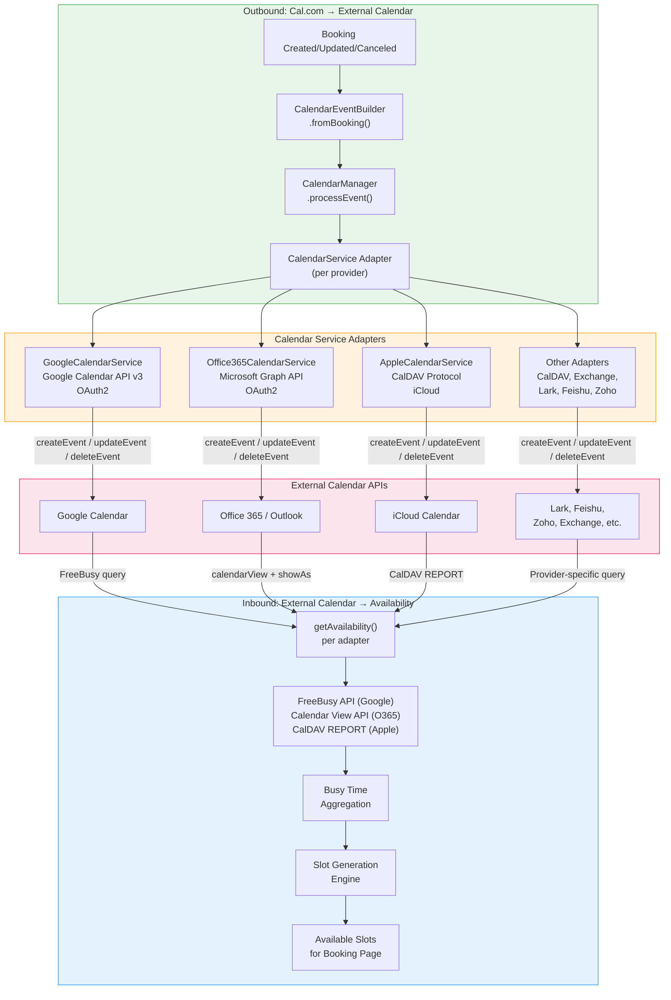

## Overview

Calendar integrations form the **foundational infrastructure** of any scheduling platform. Without reliable bi-directional calendar connectivity, a scheduling tool cannot accurately determine host availability, create events in external calendars, or prevent double-bookings. This domain analysis compares Cal.com's calendar integration architecture against Calendly's native calendar connections.

**Scope of this analysis:**

- **Google Calendar** — OAuth2-based integration with Google Calendar API v3
- **Outlook / Office 365** — OAuth2-based integration with Microsoft Graph API
- **Apple Calendar / iCal** — CalDAV protocol-based integration with iCloud
- **Bi-directional sync** — Event creation in external calendars and busy time reading for conflict detection
- **Conflict detection** — How each platform determines host unavailability from connected calendars
- **Credential management** — How OAuth tokens and calendar credentials are stored and secured
- **Multi-calendar support** — Connecting and checking multiple calendars per user
- **Calendar selection** — Assigning calendars to specific event types or users

<Info>
  **Key Finding:** Cal.com **significantly exceeds** Calendly in calendar integration breadth and flexibility. Cal.com provides **11+ calendar adapters** with bi-directional sync, per-event-type calendar selection, and AES-256 credential encryption. Calendly currently supports **3 calendar providers** (Google, Office 365/Outlook, Exchange) and dropped iCloud support for new connections in August 2024. Two previously identified Medium-severity gaps (calendar-driven cancellation sync and buffer time visualization) are **in progress** during Sprint 3 — integration points (schema, DI tokens, feature flags) are ready with core service implementation pending.
</Info>

---

## Cal.com Current Implementation

### Calendar Adapter Ecosystem

Cal.com implements a **pluggable calendar adapter architecture** through `packages/app-store/`, where each calendar provider is an independent adapter package implementing the shared `Calendar` interface from `@calcom/types/Calendar`. This interface defines a consistent contract for event CRUD operations, availability queries, and calendar listing across all providers.

`Source: packages/app-store/googlecalendar/lib/CalendarService.ts`
`Source: packages/app-store/office365calendar/lib/CalendarService.ts`
`Source: packages/app-store/applecalendar/lib/CalendarService.ts`

**Cal.com's 11+ calendar adapters:**

| Adapter | Package Path | Protocol / API | Authentication |
|---------|-------------|---------------|----------------|
| **Google Calendar** | `packages/app-store/googlecalendar/` | Google Calendar API v3 | OAuth2 |
| **Office 365** | `packages/app-store/office365calendar/` | Microsoft Graph API v1.0 | OAuth2 |
| **Apple Calendar** | `packages/app-store/applecalendar/` | CalDAV (caldav.icloud.com) | App-specific password |
| **CalDAV** | `packages/app-store/caldavcalendar/` | CalDAV protocol | Basic auth / OAuth |
| **Exchange 2013** | `packages/app-store/exchange2013calendar/` | Exchange Web Services (EWS) | Basic / NTLM |
| **Exchange 2016** | `packages/app-store/exchange2016calendar/` | Exchange Web Services (EWS) | Basic / NTLM |
| **Lark Calendar** | `packages/app-store/larkcalendar/` | Lark Open API | OAuth2 |
| **Feishu Calendar** | `packages/app-store/feishucalendar/` | Feishu Open API | OAuth2 |
| **Zoho Calendar** | `packages/app-store/zohocalendar/` | Zoho Calendar API | OAuth2 |
| **ICS Feed** | `packages/app-store/ics-feedcalendar/` | ICS/iCalendar subscription | URL-based feed |
| **Exchange (Generic)** | `packages/app-store/exchangecalendar/` | Exchange Web Services | OAuth2 / Basic |

`Source: packages/app-store/ (calendar adapter directories)`

### The `Calendar` Interface Contract

Every calendar adapter implements the `Calendar` TypeScript interface, which defines the following core operations:

- **`createEvent(event, credentialId, externalCalendarId?)`** — Creates a calendar event in the external provider, returning a `NewCalendarEventType` with the external event ID, iCalUID, and additional metadata.
- **`updateEvent(uid, event, externalCalendarId?)`** — Updates an existing event by its external UID, supporting rescheduling, attendee changes, and location updates.
- **`deleteEvent(uid, event, externalCalendarId?)`** — Removes an event from the external calendar by its UID, with graceful handling for already-deleted events (e.g., Google returns 410 for already-deleted events).
- **`getAvailability(params)`** — Queries the external calendar for busy times within a date range, returning `EventBusyDate[]` for conflict detection during slot generation.
- **`listCalendars()`** — Returns all calendars accessible via the connected credential as `IntegrationCalendar[]`, including metadata such as name, primary status, read-only flag, and external ID.

`Source: packages/app-store/googlecalendar/lib/CalendarService.ts`

### Google Calendar Adapter

The `GoogleCalendarService` class implements the `Calendar` interface using **Google Calendar API v3**. Key implementation details include:

- **OAuth2 authentication** via `CalendarAuth` with automatic token refresh through `OAuthManager`
- **FreeBusy API** for efficient availability queries — supports chunking into 90-day windows when the date range exceeds Google's API limit
- **Recurring event support** — creates events with `RRule` recurrence rules and locates specific instances within recurring series
- **Team attendee management** — adds team members from `event.team.members` as calendar attendees with their respective destination calendar email addresses
- **Google Meet integration** — patches events with `conferenceData` and `hangoutLink` when the location type is `MeetLocationType`
- **System calendar filtering** — automatically excludes Google system calendars (holidays, birthdays/contacts) from calendar listings via `GOOGLE_SYSTEM_CALENDAR_SUFFIXES`
- **Custom reminders** — supports per-credential custom reminder duration via `DestinationCalendarRepository.getCustomReminderByCredentialId`
- **Delegation credentials** — supports Google Workspace domain-wide delegation for service account-based calendar access
- **Per-event-type calendar selection** — `upsertSelectedCalendarsForEventTypeIds` enables assigning specific calendars to individual event types
- **Paginated calendar listing** — `getAllCalendars` handles Google's paginated `calendarList.list` API to retrieve all accessible calendars

`Source: packages/app-store/googlecalendar/lib/CalendarService.ts`

### Office 365 / Outlook Adapter

The `Office365CalendarService` class implements the `Calendar` interface using **Microsoft Graph API v1.0**. Key implementation details include:

- **OAuth2 authentication** with automatic token refresh via `OAuthManager` — supports both user-level OAuth and service account delegation via `client_credentials` grant
- **Calendar View API** for availability — uses `calendarView` endpoint with `showAs` filtering to identify busy, tentative, away, and out-of-office events
- **Batch API requests** — groups multiple calendar view requests into a single Microsoft Graph `$batch` call for performance optimization
- **Retry-after handling** — detects HTTP 429 rate limiting responses and automatically retries with `Retry-After` delay
- **Paginated responses** — recursively follows `@odata.nextLink` pagination for both calendar listings and calendar view results
- **Microsoft Teams integration** — preserves existing online meeting body content when rescheduling Teams meetings to prevent breaking the meeting join blob
- **Windows timezone conversion** — uses `windows-iana` library to convert Windows timezone identifiers to IANA format
- **Delegation credential support** — resolves Azure AD user IDs via Microsoft Graph `/users` endpoint for service account delegation scenarios
- **Maximum page size optimization** — requests 999 items per page (Microsoft Graph maximum) to minimize pagination rounds

`Source: packages/app-store/office365calendar/lib/CalendarService.ts`

### Apple Calendar Adapter

The `AppleCalendarService` class extends `BaseCalendarService` (a generic CalDAV implementation) targeting **Apple's iCloud CalDAV endpoint** at `https://caldav.icloud.com`. This adapter:

- Inherits all CalDAV operations from the base class: event CRUD, availability queries, and calendar listing
- Requires an **app-specific password** for authentication (Apple's security model for third-party access)
- Supports the full CalDAV protocol for interoperability with iCloud Calendar

`Source: packages/app-store/applecalendar/lib/CalendarService.ts`

### CalendarEventBuilder Pipeline

The `CalendarEventBuilder` class in `packages/features/CalendarEventBuilder.ts` provides a **fluent builder pattern** for constructing `CalendarEvent` objects from booking data. This builder serves as the central pipeline that transforms internal booking records into the standardized `CalendarEvent` format consumed by all calendar adapters.

**Builder capabilities:**
- **`fromBooking(booking, meta)`** — Static factory method that constructs a complete `CalendarEvent` from a database booking record
- **Organizer and attendee construction** — Builds `Person` objects with locale-aware translations, timezone information, and time format preferences
- **Video call data extraction** — Identifies video conference references from booking references and attaches call metadata
- **Recurring event parsing** — Converts stored recurrence configuration into `RecurringEvent` objects
- **Event type metadata** — Attaches scheduling type, seats configuration, custom reply-to email, and visibility settings
- **Platform variables** — Supports platform-specific URLs for reschedule, cancel, and booking pages
- **Team member resolution** — Resolves team hosts assigned to the booking from the attendee list and destination calendars
- **App status tracking** — Builds `AppsStatus` array from booking references, mapping app types to human-readable names

`Source: packages/features/CalendarEventBuilder.ts`

### CalendarManager — Credential and Event Orchestration

The `CalendarManager` module in `packages/features/calendars/lib/CalendarManager.ts` orchestrates credential resolution, event processing, and availability aggregation across all connected calendar providers:

- **`getCalendarCredentials(credentials)`** — Filters credentials to calendar-type integrations and instantiates the appropriate `CalendarService` adapter for each credential
- **`processEvent(calEvent)`** — Transforms a `CalendarEvent` into a `CalendarServiceEvent` by generating rich descriptions, handling seats privacy (clearing responses/notes for seated events), and conditionally masking attendees when `hideOrganizerEmail` is enabled
- **`cleanIntegrationKeys(appIntegration)`** — Strips credential secrets from integration objects before exposing them to the client
- **Delegation credential support** — Builds non-delegation credential sets via `buildNonDelegationCredentials` for scenarios requiring direct user authentication

`Source: packages/features/calendars/lib/CalendarManager.ts`

### Bi-Directional Sync Architecture

Cal.com implements **true bi-directional calendar sync** across all adapters:

**Outbound (Cal.com → External Calendar):**
1. When a booking is created, `CalendarEventBuilder.fromBooking()` constructs the `CalendarEvent`
2. `CalendarManager.processEvent()` generates the calendar description and handles attendee privacy
3. The appropriate `CalendarService.createEvent()` is called on each connected destination calendar
4. On rescheduling, `CalendarService.updateEvent()` modifies the existing external event
5. On cancellation, `CalendarService.deleteEvent()` removes the external calendar event

**Inbound (External Calendar → Cal.com):**
1. During slot generation, `CalendarService.getAvailability()` queries each connected calendar for busy times within the booking window
2. Busy times are aggregated across all connected calendars for conflict detection
3. The slot generation engine (see [Availability & Scheduling](/gap-report/availability-scheduling)) subtracts busy periods from the host's available hours to produce bookable slots
4. Google Calendar uses the **FreeBusy API** for efficient batch availability queries
5. Office 365 uses the **Calendar View API** with `showAs` status filtering and batch requests

### Credential Encryption

Cal.com encrypts stored OAuth tokens and calendar credentials using **AES-256 encryption**. This ensures that even if the database is compromised, calendar credentials remain protected. Credential decryption occurs at runtime when calendar operations are performed.

`Source: packages/app-store/_utils/oauth/OAuthManager (credential encryption utilities)`

### Per-User Calendar Selection

The `packages/features/selectedCalendar/` package provides **per-user and per-event-type calendar selection**:

- `SelectedCalendarRepository` manages the `SelectedCalendar` Prisma model, supporting find, create, upsert, and delete operations
- Users can select which calendars to check for conflicts on a per-credential basis
- The Google Calendar adapter supports `upsertSelectedCalendarsForEventTypeIds` — enabling **per-event-type calendar assignment**, where different event types can write to different destination calendars
- Subscription-based sync with batch processing via `findNextSubscriptionBatch` for scalable calendar watching

`Source: packages/features/selectedCalendar/repositories/SelectedCalendarRepository`

### Calendar Tasker Infrastructure

The `packages/features/calendars/di/` directory implements dependency injection for calendar-related background tasks:

- **CalendarsTaskService** — Core service for calendar task operations
- **CalendarsSyncTasker** — Handles background synchronization of calendar data
- **CalendarsTriggerTasker** — Triggers calendar operations based on events
- **CalendarsTasker** — Composite tasker coordinating sync and trigger operations

`Source: packages/features/calendars/di/`

---

## Calendly Calendar Integration Behavior

Calendly's calendar integration model is more constrained than Cal.com's, supporting fewer calendar providers with a simpler connection model. The following behavior is documented from Calendly's Help Center and developer documentation at [developer.calendly.com](https://developer.calendly.com).

### Supported Calendar Providers

Calendly currently supports the following calendar providers:

- **Google Calendar** — OAuth2-based direct integration with bi-directional sync
- **Office 365 / Outlook.com** — OAuth2-based direct integration via Microsoft identity platform
- **Exchange** — Direct connection for on-premises Exchange environments (requires server URL and credentials)

<Warning>
  **iCloud Calendar Discontinued:** As of August 20, 2024, Calendly no longer supports new iCloud Calendar connections. Existing connections continue functioning, but new users cannot set up iCloud Calendar integration. This is a significant limitation for Apple ecosystem users.
</Warning>

Calendly does **not** support:
- **CalDAV protocol** — No generic CalDAV server connectivity
- **Lark, Feishu, Zoho** — No East Asian or regional calendar provider support
- **ICS Feed subscriptions** — No URL-based calendar feed import
- **Exchange 2013/2016 via EWS** — Only Exchange via modern authentication

### Calendar Connection Model

Calendly's connection model has the following characteristics:

- **Plan-based limits:** Free plan allows **1 calendar connection**; paid plans allow **up to 6 calendar connections**
- **Account-wide scope:** Connected calendars apply to **all event types** in the account — you cannot assign different calendars to individual event types
- **Single add-to calendar:** Calendly events are added to **one primary calendar only**. If multiple calendars are connected, the user selects which single calendar receives new bookings
- **Multiple conflict-check calendars:** Users can select multiple connected calendars for conflict checking (up to 4 sub-calendars for Outlook)

### Conflict Detection

Calendly determines host unavailability by reading event status from connected calendars:

- Events marked as **Busy** always block availability
- Events marked as **Tentative**, **Away / Out of Office**, and **Working Elsewhere** block availability by default (configurable for Outlook)
- Users can customize which statuses affect availability via the "What's considered unavailable?" dropdown
- Outlook limits conflict checking to the **first 10 sub-calendars** Microsoft shares, with a maximum of **4 selectable sub-calendars**

### Calendar Event Creation

When an invitee books through Calendly:

- The meeting is automatically added to the host's designated **add-to calendar**
- Location details (including video conferencing links for Zoom, Webex, GoTo Meeting) are included automatically
- For Outlook connections, optional settings include:
  - **Buffer time sync** — Buffer periods before/after meetings are added as separate calendar events
  - **Calendar-driven cancellation** — Declining or deleting a Calendly event in Outlook also cancels it in Calendly

### Calendly API Limitations

Calendly's API at [developer.calendly.com](https://developer.calendly.com) does **not** support:
- Programmatic calendar connection management
- Programmatic availability management or override via API
- Reading calendar busy times via API
- Creating or modifying calendar events directly via API

Calendar operations in Calendly are exclusively managed through the web UI.

---

## Feature Comparison Matrix

The following table provides a feature-by-feature comparison of calendar integration capabilities between Cal.com and Calendly.

| Feature | Calendly Behavior | Cal.com Status | Gap Severity | Notes |
|---------|------------------|---------------|-------------|-------|
| **Google Calendar sync** | Direct OAuth2 integration with bi-directional sync | ✅ `GoogleCalendarService` — OAuth2, Google Calendar API v3, FreeBusy API, recurring events, Meet integration | **Low** | Cal.com matches and extends with delegation credentials, per-event-type selection |
| **Outlook / Office 365 sync** | Direct OAuth2 integration via Microsoft identity platform | ✅ `Office365CalendarService` — Microsoft Graph API, batch requests, retry handling, Teams integration | **Low** | Cal.com adds batch API optimization, delegation credentials, and 999-item page size |
| **iCloud / Apple Calendar sync** | Discontinued for new connections (Aug 2024); existing connections use iCloud credentials | ✅ `AppleCalendarService` — Native CalDAV protocol via `caldav.icloud.com` | **Low** | **Cal.com advantage** — maintains full Apple Calendar support via CalDAV |
| **Exchange support** | Exchange via modern authentication | ✅ Exchange 2013, Exchange 2016, and generic Exchange adapters via EWS | **Low** | **Cal.com advantage** — supports legacy Exchange 2013/2016 via EWS |
| **CalDAV protocol** | Not supported | ✅ `caldavcalendar` — generic CalDAV for any compliant server (Nextcloud, Radicale, Baikal) | **Low** | **Cal.com advantage** — enables self-hosted calendar connectivity |
| **Bi-directional sync** | Reads conflicts from connected calendars; writes events to add-to calendar | ✅ Full bi-directional: creates/updates/deletes events in external calendars; reads busy times for slot generation | **Low** | Equivalent core behavior; Cal.com adds update and delete propagation |
| **Conflict detection** | Reads Busy/Tentative/Away/Working Elsewhere statuses; configurable per Outlook | ✅ Reads busy times via FreeBusy (Google) and Calendar View with `showAs` filtering (Office 365) | **Low** | Equivalent conflict detection; Calendly offers more granular Outlook status options |
| **Multi-calendar support** | Free: 1 calendar; Paid: up to 6 calendars | ✅ Unlimited calendar connections per user; no plan-based restrictions on OSS | **Low** | **Cal.com advantage** — no artificial limit on connected calendars |
| **Per-event-type calendar selection** | Not supported — connected calendars apply to all event types | ✅ `upsertSelectedCalendarsForEventTypeIds` — assign different destination calendars per event type | **Low** | **Cal.com advantage** — granular calendar routing per event type |
| **Credential encryption** | OAuth2 tokens stored securely; iCloud passwords encrypted | ✅ AES-256 encryption for all stored OAuth tokens and credentials | **Low** | Both platforms encrypt credentials; Cal.com uses AES-256 standard |
| **Lark Calendar** | Not supported | ✅ `larkcalendar` — Lark Open API with OAuth2 | **Low** | **Cal.com advantage** — East Asian enterprise calendar support |
| **Feishu Calendar** | Not supported | ✅ `feishucalendar` — Feishu Open API with OAuth2 | **Low** | **Cal.com advantage** — Chinese enterprise calendar support |
| **Zoho Calendar** | Not supported | ✅ `zohocalendar` — Zoho Calendar API with OAuth2 | **Low** | **Cal.com advantage** — Zoho ecosystem integration |
| **ICS Feed subscription** | Not supported | ✅ `ics-feedcalendar` — URL-based ICS/iCalendar subscription for read-only feeds | **Low** | **Cal.com advantage** — read-only calendar feed import |
| **Busy time aggregation** | Aggregates conflicts across selected calendars (max 4 for Outlook sub-calendars) | ✅ Aggregates busy times across all connected calendars with no sub-calendar limit | **Low** | Cal.com imposes no per-provider sub-calendar limit |
| **Event creation in external calendar** | Adds event to one designated add-to calendar | ✅ Creates events in destination calendar per credential; supports multiple destination calendars per booking | **Low** | Cal.com supports writing to multiple calendars simultaneously |
| **Calendar-driven cancellation** | Outlook: declining/deleting event in calendar cancels in Calendly | 🔄 In Progress — Integration points ready: `handleCancelBooking` accepts `source: "external_calendar"` parameter, DI tokens defined, feature flag `calendar-cancellation-sync` inserted, schema column `externalCancellationSyncEnabled` added to Credential model. Service implementation (`CalendarCancellationSyncService`, `GoogleCancellationHandler`, `OutlookCancellationHandler`) pending. | **Medium** | Gated behind `calendar-cancellation-sync` feature flag (disabled by default). Service files pending implementation. |
| **Buffer time calendar sync** | Outlook: buffer periods added as separate calendar events | 🔄 In Progress — Integration points ready: schema column `syncBuffersToCalendar` added to EventType model, feature flag `calendar-buffer-sync` inserted, DI tokens defined. Service implementation (`BufferTimeEventService`) and `CalendarEventBuilder.buildBufferEvent()` method pending. | **Medium** | Gated behind `calendar-buffer-sync` feature flag (disabled by default). Service files pending implementation. |
| **Delegation credentials** | Not documented | ✅ Google Workspace domain-wide delegation and Microsoft Azure AD service account delegation | **Low** | **Cal.com advantage** — enterprise-grade service account support |

---

## Gap Inventory

The following table catalogs all identified gaps, including areas where Cal.com exceeds Calendly's capabilities (negative gaps / advantages).

| Gap ID | Description | Severity | Cal.com Module | Calendly Reference | Recommendation |
|--------|------------|----------|---------------|-------------------|----------------|
| **CI-001** | Calendar-driven cancellation sync: Integration points ready — `handleCancelBooking` accepts `source: "external_calendar"` parameter, DI tokens defined, feature flag inserted, schema column added. Core service files (`CalendarCancellationSyncService`, `GoogleCancellationHandler`, `OutlookCancellationHandler`) pending implementation. Gated behind `calendar-cancellation-sync` feature flag (disabled by default). | **Medium** | `packages/app-store/googlecalendar/`, `packages/app-store/office365calendar/` | [Calendly Outlook Setup](https://help.calendly.com/hc/en-us/articles/360000586634) | Sprint 3 in progress. Integration hooks and schema ready. Service implementation pending in upcoming checkpoint. Feature flag: `calendar-cancellation-sync` (disabled by default). |
| **CI-002** | Buffer time visualization in external calendar: Integration points ready — schema column `syncBuffersToCalendar` added to EventType model, feature flag inserted, DI tokens defined. Core service (`BufferTimeEventService`) and `CalendarEventBuilder.buildBufferEvent()` method pending implementation. Gated behind `calendar-buffer-sync` feature flag (disabled by default). | **Medium** | `packages/app-store/googlecalendar/`, `packages/app-store/office365calendar/` | [Calendly Outlook Setup](https://help.calendly.com/hc/en-us/articles/360000586634) | Sprint 3 in progress. Integration hooks and schema ready. Service implementation pending in upcoming checkpoint. Feature flag: `calendar-buffer-sync` (disabled by default). |
| **CI-ADV-001** | Cal.com supports 11+ calendar adapters vs Calendly's 3 active integrations (Google, Office 365, Exchange) | **Low** (advantage) | `packages/app-store/` | N/A | Document as a competitive advantage; maintain adapter ecosystem |
| **CI-ADV-002** | Cal.com maintains native Apple Calendar / iCloud support via CalDAV, while Calendly discontinued iCloud for new users in August 2024 | **Low** (advantage) | `packages/app-store/applecalendar/` | [Calendly Security & Compliance](https://help.calendly.com/hc/en-us/articles/360009867334) | Maintain and promote CalDAV-based Apple Calendar support as differentiator |
| **CI-ADV-003** | Cal.com supports generic CalDAV for self-hosted calendars (Nextcloud, Radicale, Baikal); Calendly has no CalDAV support | **Low** (advantage) | `packages/app-store/caldavcalendar/` | Community requests for CalDAV on Calendly forums | Maintain CalDAV adapter; this is a frequently requested Calendly feature |
| **CI-ADV-004** | Cal.com supports per-event-type calendar selection; Calendly applies calendars account-wide with no per-event-type assignment | **Low** (advantage) | `packages/features/selectedCalendar/`, `packages/app-store/googlecalendar/` | [Calendly Help Center](https://help.calendly.com/hc/en-us/articles/115002939274) | Maintain per-event-type calendar selection; promote in documentation |
| **CI-ADV-005** | Cal.com imposes no limit on connected calendars; Calendly limits free plan to 1 and paid plans to 6 | **Low** (advantage) | `packages/features/calendars/` | [Calendly Help Center](https://help.calendly.com/hc/en-us/articles/115002939274) | Maintain unlimited calendar connections in OSS |
| **CI-ADV-006** | Cal.com supports delegation credentials for Google Workspace and Microsoft Azure AD service accounts; Calendly has no documented delegation support | **Low** (advantage) | `packages/app-store/googlecalendar/`, `packages/app-store/office365calendar/` | N/A | Maintain delegation credential infrastructure for enterprise customers |
| **CI-ADV-007** | Cal.com supports Lark, Feishu, and Zoho calendars for East Asian and regional enterprise markets; Calendly does not | **Low** (advantage) | `packages/app-store/larkcalendar/`, `packages/app-store/feishucalendar/`, `packages/app-store/zohocalendar/` | N/A | Maintain regional calendar adapters for market differentiation |
| **CI-ADV-008** | Cal.com supports ICS feed subscriptions for read-only calendar import; Calendly does not | **Low** (advantage) | `packages/app-store/ics-feedcalendar/` | N/A | Maintain ICS feed adapter for read-only calendar data sources |

---

## Bi-Directional Sync Architecture Diagram

The following diagram illustrates Cal.com's complete bi-directional calendar sync pipeline, showing both the outbound flow (booking → external calendar) and the inbound flow (external calendar → availability).

`Source: packages/features/CalendarEventBuilder.ts`
`Source: packages/features/calendars/lib/CalendarManager.ts`
`Source: packages/app-store/googlecalendar/lib/CalendarService.ts`
`Source: packages/app-store/office365calendar/lib/CalendarService.ts`
`Source: packages/app-store/applecalendar/lib/CalendarService.ts`

---

## Recommendations

### Priority 1 — Medium-Severity Gaps (In Progress 🔄)

Both Medium-severity gaps identified in this report have integration points established during Sprint 3, with core service implementation pending.

**CI-001: Calendar-Driven Cancellation Sync**

**Status: In Progress 🔄 — Integration points ready, service implementation pending**

Integration hooks completed: `handleCancelBooking` accepts `source: "external_calendar"` parameter for calendar-driven cancellations, DI tokens defined for cancellation-sync services, feature flag `calendar-cancellation-sync` inserted (disabled by default), and `externalCancellationSyncEnabled` nullable Boolean column added to the Credential model.

Pending implementation:
- `CalendarCancellationSyncService` (`packages/features/calendars/lib/cancellation-sync/CalendarCancellationSyncService.ts`)
- `GoogleCancellationHandler` (`packages/features/calendars/lib/cancellation-sync/handlers/GoogleCancellationHandler.ts`)
- `OutlookCancellationHandler` (`packages/features/calendars/lib/cancellation-sync/handlers/OutlookCancellationHandler.ts`)

Implementation plan:

1. **Microsoft Graph Change Notifications** — Subscribe to calendar event change notifications via the Microsoft Graph webhooks API to detect event deletions and status changes in Office 365 calendars
2. **Google Calendar Push Notifications** — Use Google Calendar's push notification channel to receive updates when events are modified or deleted
3. **Cancellation propagation** — When an external calendar deletion is detected, trigger the Cal.com booking cancellation flow, including attendee notifications and webhook dispatch

`Source: packages/app-store/office365calendar/lib/CalendarService.ts`
`Source: packages/app-store/googlecalendar/lib/CalendarService.ts`

**CI-002: Buffer Time Calendar Visualization**

**Status: In Progress 🔄 — Integration points ready, service implementation pending**

Integration hooks completed: `syncBuffersToCalendar` nullable Boolean column added to the EventType model, feature flag `calendar-buffer-sync` inserted (disabled by default), and DI tokens defined for buffer-sync services.

Pending implementation:
- `BufferTimeEventService` (`packages/features/calendars/lib/buffer-sync/BufferTimeEventService.ts`)
- `CalendarEventBuilder.buildBufferEvent()` method

Implementation plan:

1. Add a user-configurable toggle: "Include buffers on external calendar"
2. When enabled, create additional calendar events for pre-event and post-event buffer periods alongside the main booking event
3. Implement corresponding cleanup: when the main booking is canceled, also delete buffer events

`Source: packages/app-store/googlecalendar/lib/CalendarService.ts`
`Source: packages/app-store/office365calendar/lib/CalendarService.ts`

### Priority 2 — Maintain and Promote Advantages

Cal.com **significantly exceeds** Calendly in calendar integration breadth and flexibility. The following advantages should be maintained and promoted:

- **11+ calendar adapters** vs Calendly's 3 — support the broadest range of calendar providers on any scheduling platform
- **Native Apple Calendar / CalDAV support** — maintained while Calendly has discontinued iCloud for new users
- **Per-event-type calendar selection** — enables sophisticated multi-calendar workflows that Calendly cannot replicate
- **Unlimited calendar connections** — no plan-based artificial limits in the OSS version
- **Delegation credentials** — enterprise-grade service account support for Google Workspace and Microsoft Azure AD
- **Regional calendar providers** — Lark, Feishu, and Zoho support for East Asian and global enterprise markets
- **AES-256 credential encryption** — industry-standard encryption for stored OAuth tokens

### Priority 3 — Documentation and Ecosystem

- Maintain comprehensive adapter-level documentation for each calendar provider
- Document the `Calendar` interface contract for community adapter development
- Cross-reference this gap analysis with [Availability & Scheduling](/gap-report/availability-scheduling) for busy time aggregation and slot generation overlap
- Update the [Sprint Roadmap — Epic Catalog](/sprint-roadmap/epic-catalog) with CI-001 and CI-002 implementation epics

---

## Acceptance Criteria

The following behavioral acceptance criteria define when Calendly parity is confirmed for calendar integrations.

### Core Parity Criteria

| ID | Criterion | Verification Method |
|----|----------|-------------------|
| **CI-AC-001** | Google Calendar events are created bi-directionally when bookings are made, updated when rescheduled, and deleted when canceled | Create a booking → verify event appears in Google Calendar → reschedule → verify event updated → cancel → verify event removed |
| **CI-AC-002** | Office 365 / Outlook events are created, updated, and deleted through bi-directional sync | Same verification as CI-AC-001 using an Office 365 calendar |
| **CI-AC-003** | Apple Calendar events are created via CalDAV when bookings are made | Create a booking with Apple Calendar as destination → verify event appears in iCloud |
| **CI-AC-004** | Busy times from Google Calendar are correctly read and block availability on the booking page | Create a busy event in Google Calendar → verify that time slot is unavailable on Cal.com booking page |
| **CI-AC-005** | Busy times from Office 365 are correctly read, respecting Busy/Tentative/Away statuses | Create events with different `showAs` statuses in Outlook → verify correct availability blocking |
| **CI-AC-006** | Multiple calendars can be connected simultaneously without plan-based restrictions | Connect 7+ calendars to a single user → verify all are checked for conflicts |
| **CI-AC-007** | Per-event-type calendar selection routes bookings to the correct destination calendar | Configure event type A → Calendar 1 and event type B → Calendar 2 → book each → verify correct routing |

### Gap Closure Criteria

| ID | Criterion | Verification Method |
|----|----------|-------------------|
| **CI-AC-008** | (CI-001) Declining or deleting a Cal.com-created event in Outlook triggers cancellation in Cal.com | **⬜ Pending** — Create booking → delete event in Outlook → verify booking is canceled in Cal.com with attendee notifications. **Status: Pending** — Integration hooks ready (`handleCancelBooking` source parameter, DI tokens, feature flag). Service implementation (`CalendarCancellationSyncService`, `GoogleCancellationHandler`, `OutlookCancellationHandler`) pending. |
| **CI-AC-009** | (CI-002) Buffer times are optionally written as separate calendar events when the toggle is enabled | **⬜ Pending** — Enable buffer sync → create booking with 15-min buffers → verify 3 events appear in calendar (pre-buffer, booking, post-buffer). **Status: Pending** — Schema ready (`syncBuffersToCalendar` column, feature flag). Service implementation (`BufferTimeEventService`, `CalendarEventBuilder.buildBufferEvent()`) pending. |

### Regression Prevention

| ID | Criterion | Verification Method |
|----|----------|-------------------|
| **CI-AC-010** | Existing calendar credentials remain functional after any migration | Verify all connected calendars continue reading busy times and creating events without requiring re-authentication |
| **CI-AC-011** | AES-256 credential encryption is maintained for all stored OAuth tokens | Inspect database credential storage → verify tokens are encrypted, not stored in plaintext |
| **CI-AC-012** | Calendar adapter interfaces remain backward-compatible | Run existing CalendarManager and CalendarService test suites → all tests pass |

---

## Related Documentation

- [Gap Report — Overview](/gap-report/overview) — Aggregate parity status across all domains
- [Gap Report — Availability & Scheduling](/gap-report/availability-scheduling) — Busy time aggregation and slot generation (overlaps with calendar integration inbound sync)
- [Sprint Roadmap — Epic Catalog](/sprint-roadmap/epic-catalog) — Implementation epics for CI-001 and CI-002
- [Migration — Data Preservation](/migration/data-preservation) — Credential encryption and existing calendar data preservation
