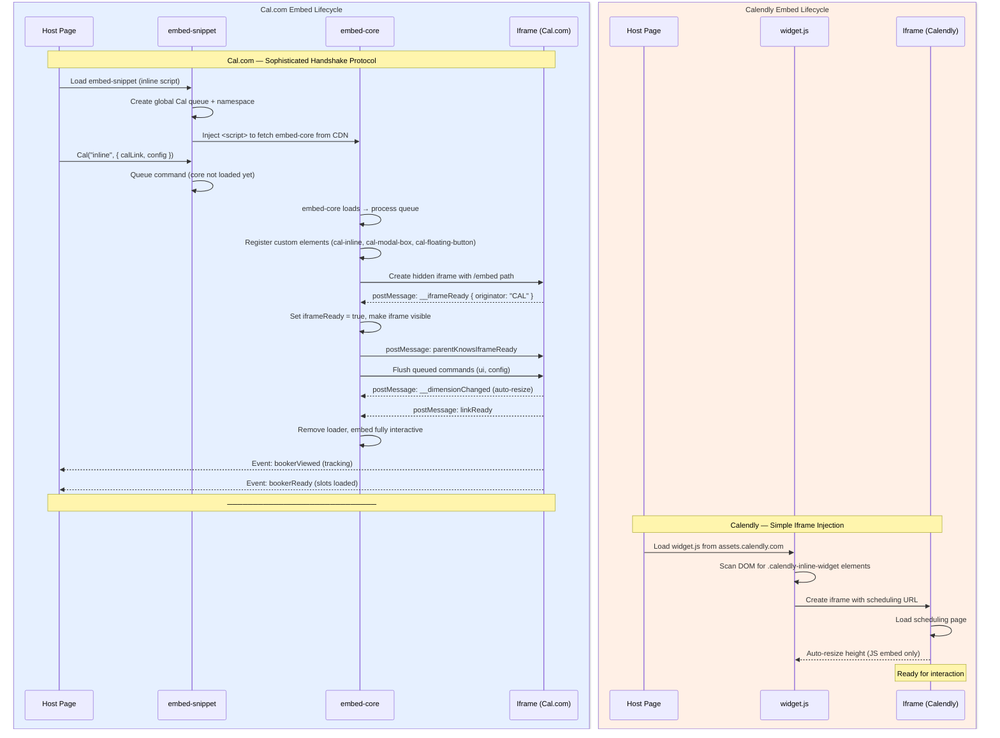
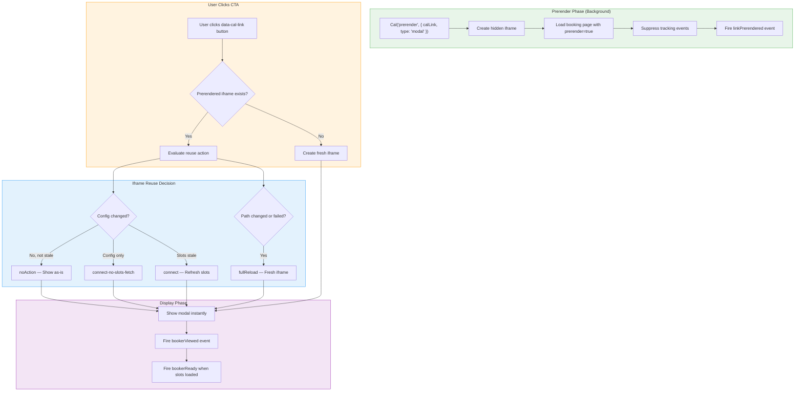

## Overview

Embed and share flows represent a critical integration surface for scheduling platforms. They determine how easily organizations can add booking capabilities to their existing websites, applications, and marketing pages without redirecting visitors to an external scheduling page. A robust embed system directly impacts conversion rates, user experience, and developer adoption.

This gap analysis compares **Cal.com's three-package embed suite** — `embed-core`, `embed-react`, and `embed-snippet` — against **Calendly's embed widget options** (inline embed, popup widget, and popup text). The analysis covers inline embeds, modal embeds, floating buttons, React wrappers, vanilla JS snippets, the `postMessage` handshake protocol, prefill capabilities, prerendering, skeleton loaders, event tracking, and share flows.

<Info>
  **Key Finding:** Cal.com's embed architecture **significantly exceeds** Calendly's embed capabilities. Cal.com provides a modular three-package suite with prerendering, skeleton loaders, a sophisticated `postMessage` handshake protocol, namespace-based multi-embed support, and a first-party React component — none of which Calendly offers natively.
</Info>

**Behavioral Reference:** Calendly's embed behavior is documented at the [Calendly Help Center — Embed Options](https://help.calendly.com/hc/en-us/articles/223147027-Embed-options-overview) and the [Calendly Developer Portal](https://developer.calendly.com/how-to-display-the-scheduling-page-for-users-of-your-app).

---

## Cal.com Current Implementation

Cal.com implements embedding through a **three-package modular architecture** within the `packages/embeds/` workspace. Each package serves a distinct role, enabling granular integration from lightweight script injection to full React component usage.

`Source: packages/embeds/README.md`

### Package Architecture

<CardGroup cols={3}>
  <Card title="embed-core" icon="cube">
    **Vanilla JS core** with iframe bootstrap, custom elements, and the full embed API. Defines `Cal.inline()`, `Cal.modal()`, `Cal.floatingButton()`, and the `CalApi` class for programmatic control.

    `Source: packages/embeds/embed-core/src/embed.ts`
  </Card>
  <Card title="embed-react" icon="react">
    **React wrapper** providing a `Cal` component and `useEmbed` hook. Delegates to `embed-core` under the hood while exposing a declarative React interface with `calLink`, `namespace`, and `config` props.

    `Source: packages/embeds/embed-react/src/Cal.tsx`
  </Card>
  <Card title="embed-snippet" icon="code">
    **Lightweight JS loader** snippet that can be inlined on any webpage. Auto-fetches `embed-core` from CDN, sets up the global `Cal` queue, and ensures commands execute in order even before the core library loads.

    `Source: packages/embeds/embed-snippet/src/index.ts`
  </Card>
</CardGroup>

### Embedding Methods

Cal.com supports three primary embedding methods, all managed through custom HTML elements registered by `embed-core`:

**1. Inline Embedding** — Embeds the calendar directly within the page flow using the `cal-inline` custom element:

```typescript
Cal("inline", {
  elementOrSelector: "#my-cal-inline",
  calLink: "organization/event-type",
  config: { theme: "dark" }
});
```

`Source: packages/embeds/embed-core/src/embed.ts (Inline custom element)`

**2. Modal Embedding** — Creates a modal dialog overlay using the `cal-modal-box` custom element:

```typescript
Cal("modal", {
  calLink: "organization/event-type",
  config: { layout: "month_view" }
});
```

`Source: packages/embeds/embed-core/src/embed.ts (ModalBox custom element)`

**3. Floating Button Embedding** — Adds a floating action button using the `cal-floating-button` custom element that opens the calendar in a modal:

```typescript
Cal("floatingButton", {
  calLink: "organization/event-type",
  buttonText: "Book meeting",
  buttonPosition: "bottom-right"
});
```

`Source: packages/embeds/embed-core/src/embed.ts (FloatingButton custom element)`

### React Component Integration

The `embed-react` package provides a first-party `Cal` React component that wraps `embed-core` with React lifecycle management:

```tsx
import Cal from "@calcom/embed-react";

<Cal
  calLink="organization/event-type"
  namespace="my-booking"
  config={{ name: "John Doe", email: "john@example.com" }}
/>
```

The component initializes the embed through `useEmbed` hook, supports namespace isolation, and handles cleanup through React's `useEffect` lifecycle. It delegates inline embedding to `embed-core` via `Cal("inline", ...)`.

`Source: packages/embeds/embed-react/src/Cal.tsx`

### postMessage Handshake Protocol

Cal.com implements a sophisticated bidirectional communication protocol between the parent page and the embedded iframe. All messages use the `originator: "CAL"` identifier to distinguish Cal.com embed messages from other postMessage traffic.

**Handshake sequence:**

1. **Parent creates iframe** (hidden) with embed parameters
2. **Iframe fires `__iframeReady`** via `postMessage` when ready to receive commands
3. **Parent acknowledges** by sending `parentKnowsIframeReady` back to iframe
4. **Iframe makes body visible** and fires `linkReady` (or `linkPrerendered`)
5. **Parent flushes queued commands** that were buffered before handshake completion

`Source: packages/embeds/LIFECYCLE.md`

**Available parent-to-iframe commands:**

| Method | Purpose |
|--------|---------|
| `ui` | Apply styles, theme, branding configuration |
| `parentKnowsIframeReady` | Acknowledge handshake completion |
| `connect` | Activate a prerendered embed with new configuration |

`Source: packages/embeds/LIFECYCLE.md (Command Queue System)`

### Command Queue System

Commands sent before the iframe is ready are queued in `iframeDoQueue` and automatically flushed once the `__iframeReady` event fires. This ensures that embed configuration (theme, prefill data, UI settings) is never lost due to race conditions between script loading and iframe initialization.

```
doInIframe(cmd) → iframeReady? → No → Push to iframeDoQueue
                               → Yes → postMessage to iframe

On __iframeReady: Flush queue → forEach → postMessage → Clear queue
```

UI commands (`ui`) persist across iframe resets, ensuring that theme and styling configuration is automatically reapplied when the iframe reloads.

`Source: packages/embeds/embed-core/src/embed.ts (doInIframe, resetQueue methods)`

### Prerendering vs Preloading

Cal.com distinguishes between two performance optimization strategies:

- **Preloading**: Loads the `calLink` in a hidden iframe solely to cache static assets (JS, CSS, fonts). When the embed actually opens, it uses cached assets from the browser cache for faster rendering.

- **Prerendering**: Continues over the preloaded iframe so the user books on the prerendered iframe itself. This is more complex than preloading but provides significantly better performance since the booking page is already rendered when the user opens the modal.

```typescript
Cal("prerender", {
  calLink: "organization/event-type",
  type: "modal",
  pageType: "team.event.booking.slots"
});
```

The prerendering system implements intelligent iframe reuse with four possible actions on modal reopen:

| Action | Condition | Behavior |
|--------|-----------|----------|
| `noAction` | Config unchanged, no staleness | Show modal as-is |
| `connect-no-slots-fetch` | Only embed config or query params changed | Connect with new config, skip slot refresh |
| `connect` | Slots are stale (exceeded `EMBED_MODAL_IFRAME_SLOT_STALE_TIME`) | Connect and refresh slots |
| `fullReload` | Different path, failed state, or exceeded `EMBED_MODAL_IFRAME_FORCE_RELOAD_THRESHOLD_MS` | Full iframe reload |

`Source: packages/embeds/README.md (Prerendering vs Preloading, Modalbox re-opening)`

### Routing Prerendering

For routing-form-based embeds, Cal.com supports a specialized prerendering flow:

1. API prerender request loads a modal with skeleton loader
2. When the user clicks the CTA, a `POST /api/router` request determines the target booking link
3. The already-rendered iframe updates its URL via `history.replaceState` without reloading

This enables instant modal display even when the final booking URL depends on routing form logic.

`Source: packages/embeds/README.md (How Routing Prerendering works)`

### Skeleton Loader Support

Cal.com provides skeleton loaders for perceived performance while the embed content loads:

**Supported layouts:**
- ✅ Responsive layout
- ✅ Mobile layout
- ✅ `month_view` layout
- ⬜ `week_view` layout (not yet supported)
- ⬜ `column_view` layout (not yet supported)

**Supported page types:**
- ✅ `user.event.booking.slots`
- ✅ `team.event.booking.slots`
- ⚠️ `user.event.booking.form` (partial — shows slots skeleton)
- ⚠️ `team.event.booking.form` (partial — shows slots skeleton)
- ⬜ `user.profile`
- ⬜ `team.profile`

**Theming:** Skeleton loaders support both dark and light themes, with automatic system theme change detection without page refresh.

`Source: packages/embeds/README.md (Skeleton Loader)`

### Event Tracking System

Cal.com's embed tracks a comprehensive set of lifecycle events:

| Event | Fired By | Purpose |
|-------|----------|---------|
| `__iframeReady` | Iframe | Embed ready to receive messages |
| `__dimensionChanged` | Iframe | Content size changed — parent adjusts iframe |
| `__windowLoadComplete` | Iframe | Page fully loaded, dimensions reliable |
| `linkReady` | Iframe | Content fully ready for user interaction |
| `linkPrerendered` | Iframe | Prerendered embed ready in background |
| `bookerViewed` | Iframe | Booker viewed for first time |
| `bookerReopened` | Iframe | Modal reopened after close |
| `bookerReloaded` | Iframe | Full page reload within modal |
| `bookerReady` | Iframe | Slots fully loaded, ready for selection |
| `linkFailed` | Iframe | Page load error with error code |
| `__routeChanged` | Iframe | Internal navigation within embed |
| `__scrollByDistance` | Iframe | Scroll request from iframe |
| `__connectInitiated` | Iframe | Prerendered embed being connected |
| `__connectCompleted` | Iframe | Connect flow finished |

`Source: packages/embeds/LIFECYCLE.md (Event Details)`

### Prefill and Configuration

Cal.com supports prefilling booking form fields through the embed configuration:

```typescript
Cal("inline", {
  elementOrSelector: "#cal",
  calLink: "org/event",
  config: {
    name: "John Doe",
    email: "john@example.com",
    notes: "Initial discussion",
    guests: ["guest@example.com"],
    theme: "dark",
    layout: "month_view",
    useSlotsViewOnSmallScreen: "true"
  }
});
```

Additional configuration capabilities include:
- **Query parameter forwarding**: `Cal.config.forwardQueryParams = true` automatically forwards parent page query parameters to the iframe
- **Color scheme auto-detection**: The embed automatically matches the parent page's `color-scheme` CSS property to prevent opaque iframe backgrounds
- **Debug logging**: Enable via `?cal.embed.logging=1` on the parent page URL
- **Custom iframe attributes**: Pass `iframeAttrs.id` for DOM identification
- **Namespace isolation**: Multiple embeds on the same page use distinct namespaces to prevent interference

`Source: packages/embeds/embed-core/src/embed.ts (withColorScheme, config handling)`

### Additional Architecture References

- **Backend embed logic**: `packages/features/embed/` — server-side embed feature support
- **Frontend embed UI**: `apps/web/modules/embed/` — embed dialog and button components in the Cal.com web application

---

## Calendly Embed Behavior

Calendly provides three embed types through a single JavaScript widget file (`widget.js`) hosted at `assets.calendly.com`. The embed system uses a straightforward iframe-based approach without the sophisticated handshake protocol or prerendering optimizations found in Cal.com.

### Embed Types

**1. Inline Embed** — Displays the scheduling page directly within the page flow:

```html
<div class="calendly-inline-widget"
     data-url="https://calendly.com/YOUR_LINK"
     style="min-width:320px;height:630px;">
</div>
<script src="https://assets.calendly.com/assets/external/widget.js"></script>
```

**2. Popup Widget (Floating Button)** — A floating button that stays visible and opens the scheduling page in a popup overlay. Initialized via `Calendly.initBadgeWidget()` with configurable text, color, and text color.

**3. Popup Text** — A clickable text link that opens the scheduling page in a popup overlay. Initialized via `Calendly.initPopupWidget()` triggered by an `onclick` handler.

### JavaScript API

Calendly provides three initialization methods:

| Method | Purpose |
|--------|---------|
| `Calendly.initInlineWidget()` | Initialize inline embed with `parentElement` target |
| `Calendly.initPopupWidget()` | Open popup overlay programmatically |
| `Calendly.initBadgeWidget()` | Initialize floating badge/button widget |

### Prefill and UTM Support

Calendly supports prefilling invitee information through the JavaScript API:

- **Prefill fields**: `name`, `firstName`, `lastName`, `email`, `customAnswers` (a1–a10)
- **UTM parameters**: `utmSource`, `utmMedium`, `utmCampaign`, `utmContent`, `utmTerm`
- **Limitation**: Calendly does not support arbitrary custom parameters — only standard UTM fields are accepted for hidden data passing

### Customization Options

- Background color, text color, button color (paid plans)
- Button label text (popup widget only)
- Hide event details option (removes avatar, event name, location, description)
- Responsive design with minimum width of 320px
- Branding removal available on paid plans

### React Integration

Calendly offers React support through the third-party `react-calendly` npm package (community-maintained, not first-party). It provides `InlineWidget`, `PopupText`, `PopupButton`, and `PopupWidget` components.

### Limitations

- No prerendering or preloading capability
- No skeleton loader during content loading
- No `postMessage` handshake protocol — basic iframe communication
- No namespace-based multi-embed isolation
- No command queue system for pre-ready operations
- No native event tracking beyond `Calendly.closePopupWidget()` callback
- Plain iframe embed option available but lacks prefill, event tracking, auto-resize, and hide-details support
- Static height requirements (typically 630–700px) without dynamic dimension adjustment

---

## Feature Comparison Matrix

The following table provides a comprehensive feature-by-feature comparison of Cal.com and Calendly embed capabilities.

| Feature | Calendly Behavior | Cal.com Status | Gap Severity | Notes |
|---------|-------------------|---------------|-------------|-------|
| **Inline embed** | `calendly-inline-widget` div with `data-url`; `Calendly.initInlineWidget()` JS API | ✅ `Cal("inline", {...})` with `cal-inline` custom element | **None** | Cal.com uses Web Components (custom elements) for cleaner DOM integration |
| **Modal/popup embed** | `Calendly.initPopupWidget()` opens overlay | ✅ `Cal("modal", {...})` with `cal-modal-box` custom element | **None** | Cal.com adds prerendering and iframe reuse for superior performance |
| **Floating button** | `Calendly.initBadgeWidget()` with text, color, textColor | ✅ `Cal("floatingButton", {...})` with `cal-floating-button` custom element | **None** | Both support configurable button text and position |
| **Popup text link** | `onclick="Calendly.initPopupWidget({url: ...})"` | ✅ Achievable via `data-cal-link` attribute on any element | **None** | Cal.com's `data-cal-link` approach is more declarative |
| **React wrapper** | Third-party `react-calendly` package | ✅ First-party `@calcom/embed-react` with `Cal` component | **None — Cal.com advantage** | Cal.com's React wrapper is first-party, maintained in-monorepo |
| **Vanilla JS snippet** | Single `widget.js` from CDN | ✅ `@calcom/embed-snippet` with queue system | **None — Cal.com advantage** | Cal.com's snippet queues commands before core loads |
| **postMessage protocol** | Basic iframe — no structured handshake | ✅ Full bidirectional handshake with `CAL` originator | **None — Cal.com advantage** | Cal.com's protocol ensures reliable parent-iframe communication |
| **Prerendering** | Not supported | ✅ Prerender modal in background for instant display | **None — Cal.com advantage** | Unique Cal.com capability for perceived performance |
| **Preloading** | Not supported | ✅ Preload static assets in hidden iframe | **None — Cal.com advantage** | Caches JS/CSS/fonts for faster subsequent load |
| **Skeleton loaders** | Not supported — blank/spinner during load | ✅ Theme-aware skeleton for responsive, mobile, month_view | **None — Cal.com advantage** | Reduces perceived load time significantly |
| **Prefill support** | `prefill: { name, email, customAnswers }` via JS API | ✅ `config: { name, email, notes, guests }` via embed config | **None** | Both support name/email prefill; Cal.com adds notes and guests natively |
| **UTM tracking** | `utm` object in JS init; URL query params | ✅ `Cal.config.forwardQueryParams = true` forwards all params | **None** | Cal.com forwards all query params; Calendly limited to 5 UTM fields |
| **Custom styling** | Background, text, button colors (paid); hide event details | ✅ Full theme control via `ui` command (dark/light/auto) | **None** | Cal.com offers programmatic theme control; Calendly requires code editing |
| **Event tracking** | Limited — popup close callback only | ✅ 14+ lifecycle events (bookerViewed, bookerReady, linkFailed, etc.) | **None — Cal.com advantage** | Cal.com provides comprehensive embed lifecycle observability |
| **Multiple embeds per page** | Possible but no namespace isolation; may interfere | ✅ Namespace-based isolation (`Cal.ns.myNamespace(...)`) | **None — Cal.com advantage** | Cal.com guarantees multi-embed isolation |
| **Dynamic dimension adjustment** | JS embed auto-resizes; plain iframe does not | ✅ `__dimensionChanged` event auto-adjusts iframe height | **None** | Both auto-resize via JS; Cal.com's approach is event-driven |
| **Color scheme detection** | Manual CSS customization | ✅ Auto-detects parent page `color-scheme` CSS property | **None — Cal.com advantage** | Prevents opaque iframe background mismatches |
| **Debug/logging mode** | Not available | ✅ `?cal.embed.logging=1` enables parent and iframe logging | **None — Cal.com advantage** | Developer-friendly debugging for integration issues |
| **Command queuing** | Not supported — commands lost if widget not ready | ✅ `iframeDoQueue` buffers commands until handshake completes | **None — Cal.com advantage** | Eliminates race conditions during initialization |
| **Platform embed guides** | WordPress, Squarespace, Shopify, Wix, Webflow, Weebly, Joomla, Angular | Partial — documentation focuses on generic JS/React integration | **Low** | Calendly has more platform-specific integration guides |
| **Iframe-only embed** | Supported as basic fallback (no JS features) | Not documented as a standalone option | **Low** | Cal.com could document a pure iframe fallback for restricted platforms |

---

## Gap Inventory

The following table catalogs all identified gaps between Cal.com and Calendly embed capabilities, including areas where Cal.com significantly exceeds Calendly.

<Note>
  Gap IDs in this document use the `EMB-*` and `EMB-ADV-*` prefixes for domain-specific tracking. These map to the **`EM-*`** epic prefix used in the [Sprint Roadmap — Epic Catalog](/sprint-roadmap/epic-catalog). For example, `EMB-001` corresponds to implementation work tracked under the `EM` domain epics. See the [Epic ID Convention](/sprint-roadmap/epic-catalog#epic-id-convention) for the full prefix mapping.
</Note>

| Gap ID | Description | Severity | Cal.com Module | Calendly Reference | Recommendation |
|--------|-------------|----------|---------------|-------------------|----------------|
| **EMB-001** | Platform-specific embed integration guides (WordPress, Shopify, Squarespace, Wix, Webflow, etc.) are not as extensive as Calendly's documentation | **Low** | `docs/developing/guides/` | [Calendly Embed Options Help Center](https://help.calendly.com/hc/en-us/sections/4411773255959-Embed-Options) | Create platform-specific embed guides in Mintlify documentation covering WordPress, Shopify, and Squarespace at minimum |
| **EMB-002** | No documented pure iframe fallback option for platforms that restrict JavaScript execution | **Low** | `packages/embeds/embed-core/` | [Calendly iframe embed](https://help.calendly.com/hc/en-us/articles/31645309248791-How-to-embed-Calendly-with-an-iframe) | Document a basic `<iframe>` embed approach as a fallback for restricted environments |
| **EMB-003** | Skeleton loader not supported for `week_view` and `column_view` layouts | **Low** | `packages/embeds/embed-core/` | N/A — Calendly has no skeleton loaders | Implement skeleton loaders for remaining layout types to complete coverage |
| **EMB-004** | Skeleton loader not supported for `user.profile` and `team.profile` page types | **Low** | `packages/embeds/embed-core/` | N/A — Calendly has no skeleton loaders | Extend skeleton loader to profile pages for consistent loading experience |
| **EMB-005** | Booking form skeleton shows slots skeleton instead of form-specific skeleton | **Low** | `packages/embeds/embed-core/` | N/A — Calendly has no skeleton loaders | Create a form-specific skeleton loader for `*.event.booking.form` page types |
| **EMB-006** | ModalBox iframe reuse optimization currently disabled due to stale UI issues | **Low** | `packages/embeds/embed-core/` | N/A — Calendly has no modal reuse | Resolve stale UI issues to re-enable ModalBox iframe reuse for faster modal reopening |
| **EMB-ADV-001** | Cal.com **advantage**: Prerendering and preloading not available in Calendly | **N/A — Advantage** | `packages/embeds/embed-core/` | Not supported | Maintain and enhance prerendering capabilities |
| **EMB-ADV-002** | Cal.com **advantage**: postMessage handshake protocol with reliable command queuing | **N/A — Advantage** | `packages/embeds/embed-core/` | Not supported | Continue leveraging structured communication protocol |
| **EMB-ADV-003** | Cal.com **advantage**: First-party React component maintained in monorepo | **N/A — Advantage** | `packages/embeds/embed-react/` | Third-party `react-calendly` | Maintain first-party React support with TypeScript types |
| **EMB-ADV-004** | Cal.com **advantage**: Skeleton loaders for perceived performance | **N/A — Advantage** | `packages/embeds/embed-core/` | Not supported | Extend skeleton coverage to remaining layouts and page types |
| **EMB-ADV-005** | Cal.com **advantage**: Namespace-based multi-embed isolation | **N/A — Advantage** | `packages/embeds/embed-snippet/` | Not supported | Document multi-embed patterns in public developer docs |
| **EMB-ADV-006** | Cal.com **advantage**: 14+ embed lifecycle events for observability | **N/A — Advantage** | `packages/embeds/embed-core/` | Limited callback support | Promote event tracking capabilities in embed documentation |
| **EMB-ADV-007** | Cal.com **advantage**: Routing prerendering for form-based embed flows | **N/A — Advantage** | `packages/embeds/embed-core/` | Not supported | Document routing prerendering workflow for developers |

---

## Embed Lifecycle Comparison

The following diagram illustrates Cal.com's sophisticated embed initialization lifecycle compared to Calendly's simpler iframe approach.



### Key Architectural Differences

| Aspect | Cal.com | Calendly |
|--------|---------|----------|
| **Initialization** | Queue-based: commands buffer before core loads | Immediate: widget.js scans DOM on load |
| **Communication** | Structured `postMessage` with `originator: "CAL"` | Basic iframe resize events |
| **Visibility** | Hidden until handshake + color-scheme set | Visible immediately (may flash) |
| **Error handling** | `linkFailed` event with error code | No structured error reporting |
| **Prerendering** | Background iframe with connect flow | Not supported |
| **Multi-embed** | Namespace isolation per embed instance | Shared global state |
| **Custom elements** | `cal-inline`, `cal-modal-box`, `cal-floating-button` | Standard `<div>` with CSS class |

---

## Prerendering Flow Detail

Cal.com's prerendering capability is a significant architectural advantage. The following diagram illustrates the prerendering flow for modal embeds:



`Source: packages/embeds/README.md (Prerendering vs Preloading, Modalbox re-opening)`

---

## Recommendations

### Maintain and Enhance Cal.com Advantages

Cal.com's embed architecture is **substantially more sophisticated** than Calendly's offering. The following existing advantages should be maintained and enhanced:

1. **Prerendering pipeline** — Continue investing in the prerender/preload distinction. This is a unique competitive advantage that provides near-instant modal display.
   `Source: packages/embeds/embed-core/src/embed.ts`

2. **First-party React component** — Maintain `@calcom/embed-react` as a first-party package with full TypeScript types, unlike Calendly's reliance on the community-maintained `react-calendly`.
   `Source: packages/embeds/embed-react/src/Cal.tsx`

3. **Event tracking system** — The 14+ lifecycle events provide superior observability for integrators. Consider promoting these in public developer documentation.
   `Source: packages/embeds/LIFECYCLE.md`

4. **Namespace isolation** — Multi-embed support via namespaces is critical for complex integrations. Document patterns for multiple embeds on a single page.
   `Source: packages/embeds/embed-snippet/src/index.ts`

### Address Minor Gaps

The following low-severity items should be addressed to maximize embed completeness:

1. **Platform-specific guides** (EMB-001) — Create embed integration guides for WordPress, Shopify, and Squarespace to match Calendly's platform coverage. These can reference the existing `embed-snippet` package.

2. **Pure iframe fallback documentation** (EMB-002) — Document a basic `<iframe src="https://app.cal.com/user/event/embed">` approach for platforms that restrict JavaScript execution.

3. **Skeleton loader expansion** (EMB-003, EMB-004, EMB-005) — Extend skeleton loaders to cover `week_view`, `column_view` layouts and `user.profile`, `team.profile` page types. Create a form-specific skeleton for booking form pages.

4. **ModalBox reuse re-enablement** (EMB-006) — Investigate and resolve the stale UI issues that caused ModalBox iframe reuse to be disabled. This optimization would further improve repeat modal opening performance.

### Cross-Domain Considerations

- **Webhook integration**: Embed event tracking (e.g., `bookerViewed`, `bookerReady`) complements the webhook system documented in the [Webhooks & Events gap analysis](/gap-report/webhooks-events). Consider firing webhook events when embed-tracked bookings complete.
- **Routing forms**: Routing prerendering connects to the routing forms feature documented in the [Routing Forms gap analysis](/gap-report/routing-forms). The `POST /api/router` endpoint used during routing prerendering should align with routing form enhancements.
- **Notifications**: Booking confirmations triggered through embedded bookings follow the same notification pipeline documented in the [Notifications gap analysis](/gap-report/notifications).

---

## Acceptance Criteria

The following behavioral acceptance criteria define parity for embed and share flows:

### Core Embed Functionality

- [ ] **AC-EMB-01**: Inline embed renders a fully functional booking widget within a host page container element
- [ ] **AC-EMB-02**: Modal embed opens a booking overlay when triggered by button click or programmatic API call
- [ ] **AC-EMB-03**: Floating button embed displays a persistent button that opens the modal on click
- [ ] **AC-EMB-04**: All three embed types support prefilling name, email, and custom fields
- [ ] **AC-EMB-05**: Embed auto-resizes to match content height without host page scrollbars

### Performance and Reliability

- [ ] **AC-EMB-06**: Prerendered modal displays within 100ms of CTA click (no network wait)
- [ ] **AC-EMB-07**: Skeleton loader displays within 50ms of embed initialization for supported page types
- [ ] **AC-EMB-08**: Command queue ensures zero commands are lost when API calls precede iframe readiness
- [ ] **AC-EMB-09**: postMessage handshake completes reliably across Chrome, Firefox, Safari, and Edge

### Multi-Embed and Isolation

- [ ] **AC-EMB-10**: Multiple embeds on the same page operate independently via namespace isolation
- [ ] **AC-EMB-11**: Each namespace maintains separate command queues, event listeners, and iframe references

### Tracking and Observability

- [ ] **AC-EMB-12**: `bookerViewed` event fires on first embed display (not during prerendering)
- [ ] **AC-EMB-13**: `bookerReady` event fires only when slots are fully loaded and selectable
- [ ] **AC-EMB-14**: `linkFailed` event fires with error code on page load failure
- [ ] **AC-EMB-15**: Tracking events are suppressed during prerendering phase

### Platform Compatibility

- [ ] **AC-EMB-16**: Embed functions correctly when loaded via embed-snippet on static HTML pages
- [ ] **AC-EMB-17**: React component (`@calcom/embed-react`) integrates correctly in Next.js, Remix, and Vite React applications
- [ ] **AC-EMB-18**: Embed functions with Content Security Policy (CSP) headers allowing the Cal.com origin

---

## Related Documentation

- [Gap Report — Overview](/gap-report/overview) — Aggregate parity status across all domains
- [Webhooks & Events Gap Analysis](/gap-report/webhooks-events) — Webhook event lifecycle and payload comparison
- [Routing Forms Gap Analysis](/gap-report/routing-forms) — Routing form conditional logic and API
- [Notifications Gap Analysis](/gap-report/notifications) — Notification flows triggered by embedded bookings
- [Sprint Roadmap — Epic Catalog](/sprint-roadmap/epic-catalog) — Implementation sequencing for gap closure
