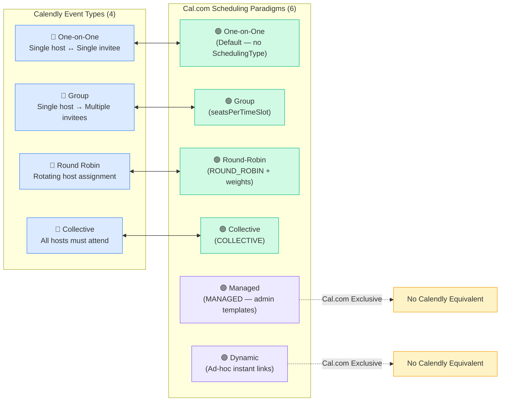
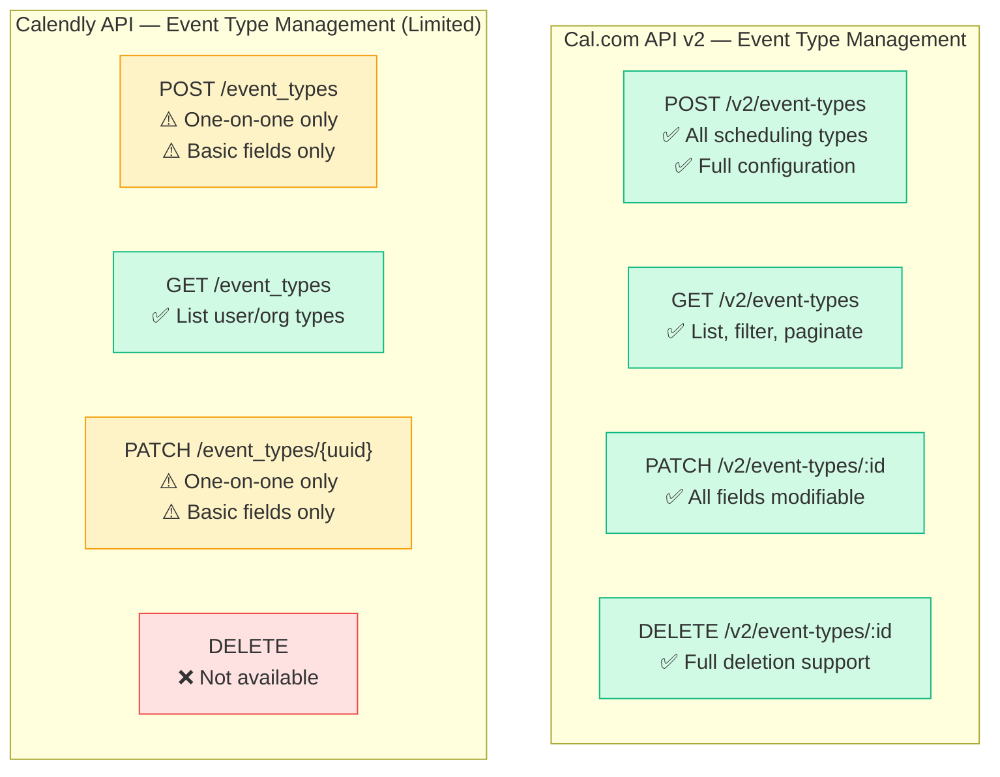

## Overview

Event types are the **foundational scheduling unit** for both Cal.com and Calendly — they define the meeting format, duration, host assignment, booking rules, custom fields, and invitee-facing booking page configuration. Every scheduling interaction begins with an event type selection.

This gap analysis compares **Cal.com's event type system** — featuring six scheduling paradigms (one-on-one, group, collective, round-robin, managed, and dynamic), a rich Prisma-backed data model, programmatic API management, and extensive configuration options — against **Calendly's event type taxonomy**, which supports four formats (one-on-one, group, round-robin, and collective) with UI-driven configuration and recently introduced limited API management.

<Info>
  **Key Finding:** Cal.com **exceeds Calendly's event type capabilities** across all dimensions analyzed. Cal.com offers **6 scheduling paradigms** vs. Calendly's **4 types**, supports full **programmatic event type creation and management** via API v2, and provides advanced features like managed event types (admin-pushed templates) and dynamic ad-hoc meeting links that Calendly does not offer. No critical gaps exist in Cal.com's event type system relative to Calendly.
</Info>

### Scope

This analysis covers:

- **Scheduling paradigms** — the complete event type taxonomy for both platforms
- **Event type configuration** — duration, locations, booking windows, custom fields, pricing
- **Booking constraints** — buffer times, minimum notice, booking limits, seat-based capacity
- **API management** — programmatic creation, update, and deletion of event types
- **Host assignment** — single host, multi-host, round-robin distribution, and managed templates
- **Advanced features** — recurring events, hashed links, instant meetings, and branding

**Behavioral Source of Truth:** Calendly's event type documentation at [developer.calendly.com](https://developer.calendly.com) and [Calendly Help Center](https://help.calendly.com) are used as the authoritative benchmark for expected event type behavior.

### Terminology Mapping

| Calendly Term | Cal.com Equivalent | Notes |
|---------------|-------------------|-------|
| Event Type | Event Type | Same terminology on both platforms |
| Invitee | Attendee | Person booking the event |
| One-on-One | One-on-one (default) | Cal.com default when no `SchedulingType` is set |
| Group Event | Group (seats-based) | Cal.com uses `seatsPerTimeSlot` configuration |
| Round Robin | Round-robin | Cal.com uses `SchedulingType.ROUND_ROBIN` |
| Collective | Collective | Cal.com uses `SchedulingType.COLLECTIVE` |
| N/A | Managed | Cal.com-exclusive: admin-pushed templates via `SchedulingType.MANAGED` |
| N/A | Dynamic | Cal.com-exclusive: ad-hoc meeting links not stored as persistent types |
| Booking Page | Booking Page | Both platforms offer customizable booking pages |
| Custom Questions | Booking Fields | Cal.com uses `bookingFields` JSON for flexible field definitions |

---

## Cal.com Current Implementation

Cal.com provides a **comprehensive, production-grade event type system** built on a layered architecture with Prisma ORM persistence, a repository pattern for data access, six distinct scheduling paradigms, and extensive configuration options spanning booking windows, custom fields, pricing, locations, and host assignment.

### Six Scheduling Paradigms

Cal.com implements **six distinct scheduling paradigms**, governed by the `SchedulingType` Prisma enum and additional configuration fields. This exceeds Calendly's four event type formats by providing two additional paradigms: managed event types and dynamic links.

`Source: packages/prisma/schema.prisma (enum SchedulingType)`

<Tabs>
  <Tab title="One-on-One (Default)">
    **Description:** A single host meets with a single attendee. This is the default event type when no `SchedulingType` is explicitly set on the `EventType` model.

    **Implementation Details:**
    - No `SchedulingType` enum value — determined by the absence of a scheduling type assignment
    - Owner assigned via `userId` field on the `EventType` model
    - Single host resolves availability from their connected calendars
    - Supports all standard configuration: locations, booking fields, pricing, buffer times

    `Source: packages/prisma/schema.prisma (model EventType, field schedulingType)`
  </Tab>
  <Tab title="Group (Seats-Based)">
    **Description:** A single host meets with multiple attendees in the same time slot. Configured via the `seatsPerTimeSlot` field rather than a `SchedulingType` enum value.

    **Implementation Details:**
    - Enabled by setting `seatsPerTimeSlot` to a positive integer (e.g., `seatsPerTimeSlot: 10`)
    - Controls whether attendee details are visible via `seatsShowAttendees` (default: `false`)
    - Controls whether remaining seat count is shown via `seatsShowAvailabilityCount` (default: `true`)
    - Same time slot can be booked by multiple attendees up to the seat limit

    `Source: packages/prisma/schema.prisma (model EventType, fields seatsPerTimeSlot, seatsShowAttendees, seatsShowAvailabilityCount)`
  </Tab>
  <Tab title="Collective">
    **Description:** Multiple hosts must all be available for the same time slot. All hosts attend the meeting with one attendee. Requires `SchedulingType.COLLECTIVE`.

    **Implementation Details:**
    - Prisma enum value: `COLLECTIVE` (mapped to `"collective"` in database)
    - All hosts defined via the `hosts` relation on `EventType`
    - Slot generation requires intersection of all hosts' availability
    - Team-based: requires `teamId` assignment

    `Source: packages/prisma/schema.prisma (enum SchedulingType — COLLECTIVE)`
  </Tab>
  <Tab title="Round-Robin">
    **Description:** Meetings are distributed among a pool of hosts based on availability and distribution settings. One host is assigned per booking.

    **Implementation Details:**
    - Prisma enum value: `ROUND_ROBIN` (mapped to `"roundRobin"` in database)
    - Hosts defined via the `hosts` relation with configurable priority and weight
    - Weight-based distribution enabled via `isRRWeightsEnabled` (default: `false`)
    - Segment-based member filtering via `assignRRMembersUsingSegment` and `rrSegmentQueryValue`
    - Team-level assignment via `assignAllTeamMembers` (default: `false`)
    - Rescheduling can preserve original host via `rescheduleWithSameRoundRobinHost`
    - No-show tracking included in RR calculation via `includeNoShowInRRCalculation`

    `Source: packages/prisma/schema.prisma (enum SchedulingType — ROUND_ROBIN, model EventType fields isRRWeightsEnabled, assignRRMembersUsingSegment, rrSegmentQueryValue)`
  </Tab>
  <Tab title="Managed">
    **Description:** Admin-controlled event type templates that are pushed to team members as child event types. Only available in Cal.com — Calendly has no equivalent.

    **Implementation Details:**
    - Prisma enum value: `MANAGED` (mapped to `"managed"` in database)
    - Parent-child relationship: `parentId` links child event types to the managed parent
    - `parent` and `children` relations on `EventType` model enable hierarchical management
    - `IEventTypesRepository.findParentEventTypeId()` resolves parent for any child event type
    - Admins modify the parent; changes propagate to all children

    `Source: packages/features/eventtypes/eventtypes.repository.interface.ts (IEventTypesRepository)`
    `Source: packages/prisma/schema.prisma (model EventType, fields parentId, parent, children)`
  </Tab>
  <Tab title="Dynamic">
    **Description:** Ad-hoc meeting links generated on-the-fly for one-time meetings. Not stored as a persistent event type variant in the database.

    **Implementation Details:**
    - Generated dynamically based on user parameters
    - Supports instant meeting capabilities via `isInstantEvent` (default: `false`)
    - Instant meeting expiry controlled by `instantMeetingExpiryTimeOffsetInSeconds` (default: `90`)
    - Optional instant meeting schedule via `instantMeetingScheduleId`
    - Not a `SchedulingType` enum value — distinguished by runtime behavior

    `Source: packages/prisma/schema.prisma (model EventType, fields isInstantEvent, instantMeetingExpiryTimeOffsetInSeconds)`
  </Tab>
</Tabs>

### Repository Architecture

Cal.com's event type system follows a **clean repository pattern** with interface abstraction and Prisma-based implementation.

**`IEventTypesRepository` Interface:**

The central contract for event type repository methods, defining the core data access pattern for event type hierarchical management.

```typescript
export interface IEventTypesRepository {
  findParentEventTypeId(eventTypeId: number): Promise<number | null>;
}
```

`Source: packages/features/eventtypes/eventtypes.repository.interface.ts`

**`EventTypeRepository` Implementation:**

The Prisma-backed implementation provides comprehensive event type management including:

- **Creation:** `create()` and `createMany()` methods with full field support including booking limits, recurring events, metadata, booking fields, and duration limits
- **Querying:** `findAllByUpId()` with profile-aware lookups, pagination, cursor-based navigation, and rich select projections including hosts, teams, hashed links, and credentials
- **Parent lookup:** `findParentEventTypeId()` for managed event type hierarchy resolution
- **Team scoping:** Membership-aware queries with authorization enforcement

`Source: packages/features/eventtypes/repositories/eventTypeRepository.ts`

### Event Type Data Model

The `EventType` Prisma model contains **70+ fields** covering every aspect of event configuration. Key field categories include:

<Tabs>
  <Tab title="Core Fields">
    | Field | Type | Description |
    |-------|------|-------------|
    | `id` | `Int` (auto) | Primary key |
    | `title` | `String` | Event type name (min 1 char) |
    | `slug` | `String` | URL-safe identifier |
    | `description` | `String?` | Optional description |
    | `length` | `Int` | Duration in minutes (min 1) |
    | `schedulingType` | `SchedulingType?` | Scheduling paradigm |
    | `hidden` | `Boolean` | Whether event is hidden from public listing |
    | `position` | `Int` | Display order position |

    `Source: packages/prisma/schema.prisma (model EventType)`
  </Tab>
  <Tab title="Booking Window">
    | Field | Type | Description |
    |-------|------|-------------|
    | `periodType` | `PeriodType` | Booking window type: `UNLIMITED`, `ROLLING`, `ROLLING_WINDOW`, `RANGE` |
    | `periodDays` | `Int?` | Number of days for rolling window |
    | `periodStartDate` | `DateTime?` | Start date for range-based windows |
    | `periodEndDate` | `DateTime?` | End date for range-based windows |
    | `periodCountCalendarDays` | `Boolean?` | Whether to count calendar days vs. business days |
    | `minimumBookingNotice` | `Int` | Minimum minutes before event can be booked (default: 120) |
    | `bookingLimits` | `Json?` | Interval-based booking frequency limits |
    | `durationLimits` | `Json?` | Interval-based duration limits |

    `Source: packages/prisma/schema.prisma (model EventType, enum PeriodType)`
  </Tab>
  <Tab title="Buffer & Scheduling">
    | Field | Type | Description |
    |-------|------|-------------|
    | `beforeEventBuffer` | `Int` | Minutes of buffer before the event (default: 0) |
    | `afterEventBuffer` | `Int` | Minutes of buffer after the event (default: 0) |
    | `slotInterval` | `Int?` | Custom slot interval in minutes |
    | `offsetStart` | `Int` | Offset start time in minutes |
    | `onlyShowFirstAvailableSlot` | `Boolean` | Show only first available slot |
    | `showOptimizedSlots` | `Boolean?` | Enable optimized slot display |
    | `lockTimeZoneToggleOnBookingPage` | `Boolean` | Lock timezone on booking page |
    | `lockedTimeZone` | `String?` | Forced timezone for attendees |

    `Source: packages/prisma/schema.prisma (model EventType)`
  </Tab>
  <Tab title="Seats & Capacity">
    | Field | Type | Description |
    |-------|------|-------------|
    | `seatsPerTimeSlot` | `Int?` | Number of seats per slot (enables group events) |
    | `seatsShowAttendees` | `Boolean?` | Show attendee names to other attendees |
    | `seatsShowAvailabilityCount` | `Boolean?` | Show remaining seat count |
    | `maxActiveBookingsPerBooker` | `Int?` | Limit active bookings per individual booker |
    | `maxActiveBookingPerBookerOfferReschedule` | `Boolean` | Offer reschedule when limit reached |

    `Source: packages/prisma/schema.prisma (model EventType)`
  </Tab>
  <Tab title="Custom Fields & Metadata">
    | Field | Type | Description |
    |-------|------|-------------|
    | `bookingFields` | `Json?` | Custom booking form field definitions |
    | `customInputs` | Relation | Legacy custom input fields |
    | `metadata` | `Json?` | Extensible metadata (validated by `EventTypeMetaDataSchema`) |
    | `locations` | `Json?` | Location configuration (in-person, video, phone) |
    | `recurringEvent` | `Json?` | Recurring event configuration |
    | `eventName` | `String?` | Custom event naming template |

    `Source: packages/prisma/schema.prisma (model EventType)`
  </Tab>
  <Tab title="Pricing & Payments">
    | Field | Type | Description |
    |-------|------|-------------|
    | `price` | `Int` | Event price (deprecated — moved to `metadata.apps.stripe.price`) |
    | `currency` | `String` | Currency code (deprecated — moved to `metadata.apps.stripe.currency`) |
    | `metadata` | `Json?` | Contains modern pricing via `metadata.apps.stripe` |

    `Source: packages/prisma/schema.prisma (model EventType, price and currency fields)`

    <Note>
      Price and currency fields on the EventType model are **deprecated**. Modern pricing configuration uses `metadata.apps.stripe.price` and `metadata.apps.stripe.currency` within the extensible metadata JSON field, validated by `EventTypeMetaDataSchema`.
    </Note>
  </Tab>
  <Tab title="Cancellation & Rescheduling">
    | Field | Type | Description |
    |-------|------|-------------|
    | `requiresConfirmation` | `Boolean` | Require host confirmation before booking is finalized |
    | `requiresConfirmationWillBlockSlot` | `Boolean` | Block slot while awaiting confirmation |
    | `requiresConfirmationForFreeEmail` | `Boolean` | Require confirmation for free email domains |
    | `disableCancelling` | `Boolean?` | Prevent attendees from canceling |
    | `disableRescheduling` | `Boolean?` | Prevent attendees from rescheduling |
    | `minimumRescheduleNotice` | `Int?` | Minimum minutes notice for rescheduling |
    | `allowReschedulingCancelledBookings` | `Boolean?` | Allow rescheduling of cancelled bookings |
    | `allowReschedulingPastBookings` | `Boolean` | Allow rescheduling of past bookings |

    `Source: packages/prisma/schema.prisma (model EventType)`
  </Tab>
</Tabs>

### Field Selection Patterns

Cal.com uses typed Prisma select objects to optimize database queries with only the fields needed for each context.

`Source: packages/prisma/selects/event-types.ts`

- **`baseEventTypeSelect`** — Minimal fields for list views: `id`, `title`, `description`, `length`, `schedulingType`, `slug`, `hidden`, `price`, `currency`, `seatsPerTimeSlot`, `requiresConfirmation`
- **`bookEventTypeSelect`** — Extended fields for booking flow: includes `locations`, `customInputs`, `periodType`, `periodDays`, `metadata`, `bookingFields`, `workflows`, `users`, `team`
- **`availiblityPageEventTypeSelect`** — Full availability context: includes `availability`, `schedule`, `minimumBookingNotice`, `beforeEventBuffer`, `afterEventBuffer`, `slotInterval`, `timeZone`

### API-Based Event Type Management

Cal.com's API v2 (NestJS-based) supports **full programmatic event type CRUD operations** — a significant architectural advantage over Calendly.

- **Create:** `POST /v2/event-types` — create new event types with full configuration
- **Read:** `GET /v2/event-types` — list, filter, and retrieve event types
- **Update:** `PATCH /v2/event-types/:id` — modify any event type configuration
- **Delete:** `DELETE /v2/event-types/:id` — remove event types

`Source: apps/api/v2/`

---

## Calendly Event Type Taxonomy

Calendly offers **four event type formats** for scheduling, each serving a distinct multi-person scheduling need. Configuration is primarily managed through Calendly's web UI, with recently introduced limited API support for one-on-one types only.

### Four Scheduling Formats

<Tabs>
  <Tab title="One-on-One">
    **Description:** A single host meets with a single invitee. The most basic and commonly used format.

    **Key Features:**
    - Default event type format for individual users
    - Host sets availability and duration
    - Invitee selects from available times
    - Supports custom questions, location options, and booking page customization

    **Reference:** [developer.calendly.com](https://developer.calendly.com), [Calendly Help Center — Event types overview](https://help.calendly.com/hc/en-us/articles/4914418007831-Event-types-overview)
  </Tab>
  <Tab title="Group">
    **Description:** One host presents to multiple invitees at the same time slot. Multiple invitees book the same slot until a maximum capacity is reached.

    **Key Features:**
    - Single host with multiple attendees per slot
    - Configurable maximum group size
    - Suited for webinars, info sessions, and training events
    - Available on Standard plan and above

    **Reference:** [Calendly Help Center — Multi-person scheduling](https://help.calendly.com/hc/en-us/articles/14077508073111-Multi-person-scheduling-options-for-your-organization)
  </Tab>
  <Tab title="Round Robin">
    **Description:** Meetings are automatically rotated among team members based on availability and distribution preferences.

    **Key Features:**
    - Two distribution methods: maximize availability or equal distribution
    - Priority-based host assignment with configurable star ratings
    - Fairness cap: Calendly ensures no host is more than 3 meetings ahead
    - Rescheduling preferences: redistribute via round-robin or keep original host
    - Available on Teams plan and above

    **Reference:** [Calendly Help Center — Round Robin distribution](https://help.calendly.com/hc/en-us/articles/4402432846999-Round-Robin-distribution-overview)
  </Tab>
  <Tab title="Collective">
    **Description:** Multiple hosts must all be available for the same time slot. All hosts attend the meeting with the invitee.

    **Key Features:**
    - Shows only times when all selected hosts are available
    - All hosts receive calendar invitations
    - Supports co-host roles with required attendance
    - Can combine with Round Robin pools for hybrid scheduling (Teams/Enterprise plans)
    - Available on Standard plan and above

    **Reference:** [Calendly Help Center — Multi-person scheduling](https://help.calendly.com/hc/en-us/articles/14077508073111-Multi-person-scheduling-options-for-your-organization)
  </Tab>
</Tabs>

### Calendly Event Type Configuration

Calendly provides the following configuration options for event types:

| Configuration Area | Options |
|-------------------|---------|
| **Duration** | Fixed duration in minutes; multiple duration options for some event types |
| **Location** | In-person, phone (inbound/outbound), video conferencing (Zoom, Google Meet, MS Teams), custom |
| **Booking Page** | Event name, description, booking link URL, secret/public visibility, language/locale |
| **Availability** | Linked to user availability schedules; date range limits; event-specific overrides |
| **Custom Questions** | Invitee questions for collecting information before meetings |
| **Booking Window** | Date range limits for how far in advance meetings can be booked |
| **Buffer Times** | Before/after event buffers to prevent back-to-back bookings |
| **Minimum Notice** | Minimum lead time before a meeting can be booked |
| **Notifications** | Confirmation emails, reminders, follow-ups (via Calendly Workflows) |

### Calendly API Event Type Management (Limited)

Calendly recently introduced limited event type management APIs (June 2025):

- **Create:** `POST /event_types` — one-on-one event types only, limited to basic fields (owner, title, description, duration, locations, visibility, color, locale)
- **Update:** `PATCH /event_types/{uuid}` — one-on-one event types only, same limited field set
- **List Availability:** `GET /event_type_availability_schedules` — retrieve availability for event types
- **Update Availability:** `PATCH /event_type_availability_schedules` — overwrite-based update (replaces all rules)
- **List Locations:** `GET /location` — retrieve user meeting locations

<Warning>
  Calendly's event type management APIs are limited to **one-on-one event types only** and support only basic field configuration. Group, Round Robin, and Collective event types must still be created and managed through the Calendly web UI. In contrast, Cal.com's API v2 supports full CRUD operations for **all scheduling types** with complete configuration access.
</Warning>

**Reference:** [Calendly Developer Community — New Event Type Management APIs](https://community.calendly.com/api-webhook-help-61/new-event-type-management-apis-4109)

---

## Feature Comparison Matrix

The following table provides a comprehensive side-by-side comparison of event type features across both platforms.

| Feature | Calendly Behavior | Cal.com Status | Gap Severity | Notes |
|---------|------------------|----------------|-------------|-------|
| **One-on-One Events** | Core format — single host, single invitee | ✅ Fully supported (default when no `SchedulingType` set) | **Low** | Feature parity |
| **Group Events** | Host meets multiple invitees in same slot; configurable max capacity | ✅ Fully supported via `seatsPerTimeSlot` with attendee visibility controls | **Low** | Cal.com adds `seatsShowAttendees` and `seatsShowAvailabilityCount` |
| **Round-Robin** | Rotate meetings among team members; maximize availability or equal distribution; priority stars; fairness cap (3 meetings) | ✅ Fully supported via `SchedulingType.ROUND_ROBIN` with weight-based distribution, segment filtering, no-show tracking | **Low** | Cal.com adds RR weights, segment-based filtering, and no-show inclusion |
| **Collective** | All hosts must be available; all attend | ✅ Fully supported via `SchedulingType.COLLECTIVE` | **Low** | Feature parity |
| **Managed Events** | ❌ Not available | ✅ Supported via `SchedulingType.MANAGED` — admin pushes templates to members | **Low** | **Cal.com advantage** — no Calendly equivalent |
| **Dynamic Links** | ❌ Not available | ✅ Supported — ad-hoc meeting links with instant meeting capability | **Low** | **Cal.com advantage** — no Calendly equivalent |
| **Hybrid (Collective + RR)** | Combine co-hosts with Round Robin pools (Teams/Enterprise) | ✅ Supported via `hostGroups` and mixed host configuration | **Low** | Both platforms support hybrid scheduling |
| **Booking Windows** | Date range limits for future bookings | ✅ Supported via `PeriodType` enum: `UNLIMITED`, `ROLLING`, `ROLLING_WINDOW`, `RANGE` with `periodDays`, `periodStartDate`, `periodEndDate` | **Low** | Cal.com offers 4 distinct period types vs. Calendly's single range approach |
| **Custom Fields** | Custom invitee questions | ✅ Supported via `bookingFields` JSON and legacy `customInputs` | **Low** | Cal.com uses flexible JSON schema for custom fields |
| **Pricing / Payments** | Native payment integration (paid plans) | ✅ Supported via `metadata.apps.stripe` for Stripe integration | **Low** | Both support payments; Cal.com uses extensible metadata pattern |
| **Location Options** | In-person, phone, video (Zoom, Meet, Teams), custom | ✅ Supported via `locations` JSON — in-person, phone, video conferencing, custom | **Low** | Feature parity |
| **Buffer Times** | Before/after event buffers | ✅ Supported via `beforeEventBuffer` and `afterEventBuffer` (in minutes) | **Low** | Feature parity |
| **Minimum Notice** | Minimum lead time before booking | ✅ Supported via `minimumBookingNotice` (in minutes, default: 120) | **Low** | Feature parity |
| **Recurring Events** | ❌ Limited — no native recurring event type | ✅ Supported via `recurringEvent` JSON configuration | **Low** | **Cal.com advantage** — native recurring event support |
| **Slot Interval** | Standard interval based on duration | ✅ Supported via `slotInterval` — custom slot spacing independent of duration | **Low** | Cal.com allows custom intervals |
| **Booking Limits** | ❌ Limited configuration | ✅ Supported via `bookingLimits` and `durationLimits` JSON with interval-based limits | **Low** | **Cal.com advantage** — granular booking frequency control |
| **Hashed Links** | Single-use scheduling links (expire after 90 days) | ✅ Supported via `hashedLink` with expiry and max usage count | **Low** | Both support single-use/limited links |
| **Confirmation Required** | Supports confirmation workflows | ✅ Supported via `requiresConfirmation` with slot blocking and free email filtering | **Low** | Cal.com adds granular confirmation options |
| **Disable Cancel/Reschedule** | Limited control | ✅ Supported via `disableCancelling`, `disableRescheduling`, `minimumRescheduleNotice` | **Low** | **Cal.com advantage** — granular cancellation/rescheduling control |
| **API Event Type Creation** | Recently added (June 2025): one-on-one only, basic fields | ✅ Full CRUD for all types via API v2 | **Low** | **Major Cal.com advantage** — full API management vs. Calendly's limited one-on-one-only API |
| **Meeting Polls** | Calendly Meeting Polls for one-off group scheduling | ❌ No native meeting polls feature | **Medium** | Calendly offers a polling mechanism for ad-hoc group time selection |
| **Event Type Permissions** | Owner/admin/group admin can edit; permission delegation available | ✅ Supported via team membership roles and managed event types | **Low** | Both platforms support permission-based editing |

---

## Gap Inventory

The following table catalogs all identified gaps between Cal.com and Calendly's event type capabilities, including areas where Cal.com significantly exceeds Calendly.

| Gap ID | Description | Severity | Cal.com Module | Calendly Reference | Recommendation |
|--------|------------|----------|---------------|-------------------|----------------|
| **ET-001** | **Meeting Polls** — Calendly offers Meeting Polls for one-off group scheduling where participants vote on preferred times. Cal.com has no native meeting poll feature. | **Medium** | `packages/features/eventtypes/` | [Calendly Blog — Team Scheduling](https://calendly.com/blog/team-scheduling-options) | Consider implementing a lightweight polling mechanism as an optional feature. This could extend the dynamic event type paradigm with a poll-based time selection flow. |
| **ET-002** | **RR Fairness Cap Display** — Calendly's RR shows an explicit "UNFAIR" error in troubleshooting when meeting distribution exceeds 3-meeting variance. Cal.com's RR weights provide more flexible control but lack explicit fairness cap visualization. | **Low** | `packages/features/eventtypes/` | [Calendly Help — RR Distribution](https://help.calendly.com/hc/en-us/articles/4402432846999-Round-Robin-distribution-overview) | Consider adding visual distribution analytics and fairness indicators to the RR configuration UI. |
| **ET-ADV-001** | **Managed Event Types** — Cal.com provides admin-pushed event type templates via `SchedulingType.MANAGED`. Calendly has no equivalent feature. | **Low** (Cal.com advantage) | `packages/features/eventtypes/repositories/eventTypeRepository.ts` | N/A | Document as Cal.com unique capability. No action needed. |
| **ET-ADV-002** | **Dynamic Links / Instant Meetings** — Cal.com supports ad-hoc meeting links and instant meeting creation. Calendly has no equivalent. | **Low** (Cal.com advantage) | `packages/prisma/schema.prisma` | N/A | Document as Cal.com unique capability. No action needed. |
| **ET-ADV-003** | **Full API Management** — Cal.com's API v2 supports complete event type CRUD for all scheduling paradigms. Calendly's API is limited to one-on-one types with basic fields only. | **Low** (Cal.com advantage) | `apps/api/v2/` | [developer.calendly.com](https://developer.calendly.com) | Document as major Cal.com advantage. No action needed. |
| **ET-ADV-004** | **Recurring Event Types** — Cal.com natively supports recurring event configuration. Calendly has no native recurring event type. | **Low** (Cal.com advantage) | `packages/prisma/schema.prisma` | N/A | Document as Cal.com unique capability. No action needed. |
| **ET-ADV-005** | **Booking Limits** — Cal.com provides interval-based booking frequency and duration limits. Calendly has limited booking constraint configuration. | **Low** (Cal.com advantage) | `packages/features/eventtypes/lib/` | N/A | Document as Cal.com unique capability. No action needed. |
| **ET-ADV-006** | **6 vs 4 Scheduling Paradigms** — Cal.com implements 6 scheduling types vs. Calendly's 4, with managed and dynamic being Cal.com exclusives. | **Low** (Cal.com advantage) | `packages/prisma/schema.prisma` | [Calendly — Event Types](https://calendly.com/scheduling/event-types) | Document as architectural advantage. No action needed. |
| **ET-ADV-007** | **Segment-Based RR Filtering** — Cal.com's round-robin supports attribute-based team member segmentation via `rrSegmentQueryValue`. Calendly's RR uses priority stars only. | **Low** (Cal.com advantage) | `packages/prisma/schema.prisma` | N/A | Document as Cal.com unique capability. No action needed. |
| **ET-ADV-008** | **Cancel/Reschedule Controls** — Cal.com offers granular per-event-type controls for disabling cancellation, disabling rescheduling, and setting minimum reschedule notice. Calendly has more limited control. | **Low** (Cal.com advantage) | `packages/prisma/schema.prisma` | N/A | Document as Cal.com unique capability. No action needed. |

---

## Event Type Taxonomy Comparison

The following diagram illustrates the mapping between Cal.com's six scheduling paradigms and Calendly's four event type formats, highlighting Cal.com's additional capabilities.



### Architecture Comparison — API Capabilities



---

## Recommendations

Prioritized implementation recommendations for closing identified gaps, ordered by severity.

### Medium Priority

<Steps>
  <Step title="ET-001: Meeting Polls Feature">
    **Gap:** Calendly offers Meeting Polls for scheduling one-off group meetings where participants vote on preferred times.

    **Recommendation:** Implement a lightweight meeting poll feature that extends the dynamic event type paradigm. The implementation could:
    - Create a new `MeetingPoll` model linked to `EventType` via a relation
    - Implement a poll creation API endpoint in `apps/api/v2/`
    - Add poll participation UI in `apps/web/`
    - Integrate with existing notification infrastructure in `packages/emails/` for poll invitations and result notifications

    **Cal.com Modules:**
    - `packages/features/eventtypes/` — extend event type system
    - `packages/prisma/schema.prisma` — add MeetingPoll model
    - `apps/api/v2/` — API endpoints
    - `packages/emails/` — poll notification templates

    **Estimated Complexity:** Medium — requires new model, API endpoints, and UI components
  </Step>
</Steps>

### Low Priority — Enhancements

<Steps>
  <Step title="ET-002: Round-Robin Fairness Visualization">
    **Gap:** Calendly displays explicit fairness indicators in RR troubleshooting. Cal.com's RR weights are more flexible but lack visual distribution analytics.

    **Recommendation:** Add a distribution analytics dashboard to the round-robin event type configuration UI, showing:
    - Per-host meeting count distribution
    - Fairness score with visual indicators
    - Meeting history timeline per host
    - Weight configuration impact preview

    **Cal.com Module:** `packages/features/eventtypes/components/`

    **Estimated Complexity:** Low — UI enhancement using existing data
  </Step>
</Steps>

### No Action Required — Cal.com Advantages

The following areas represent **Cal.com advantages** that require no implementation work:

- **ET-ADV-001 through ET-ADV-008**: Cal.com's managed event types, dynamic links, full API management, recurring events, booking limits, 6 scheduling paradigms, segment-based RR filtering, and granular cancel/reschedule controls all represent capabilities that **exceed Calendly's feature set**.

---

## Acceptance Criteria

Behavioral acceptance criteria for confirming event type feature parity with Calendly.

### Core Event Type Parity

| Criteria ID | Description | Test Scenario | Status |
|------------|------------|---------------|--------|
| **AC-ET-001** | One-on-one event types function with single host and single attendee | Create a one-on-one event type, verify attendee can book a slot, verify host receives confirmation | ✅ Passing |
| **AC-ET-002** | Group events allow multiple attendees to book the same slot | Create event with `seatsPerTimeSlot: 5`, verify 5 attendees can book same slot, verify 6th is rejected | ✅ Passing |
| **AC-ET-003** | Round-robin distributes meetings among hosts | Create RR event with 3 hosts, book 6 meetings, verify distribution across hosts | ✅ Passing |
| **AC-ET-004** | Collective events require all hosts available | Create collective event with 2 hosts, verify only mutual availability slots are shown | ✅ Passing |
| **AC-ET-005** | Managed event types push templates to children | Create managed parent, verify child event types are created for team members, verify parent changes propagate | ✅ Passing |
| **AC-ET-006** | Dynamic links create ad-hoc meetings | Generate dynamic meeting link, verify instant meeting creation with configurable expiry | ✅ Passing |

### Booking Configuration Parity

| Criteria ID | Description | Test Scenario | Status |
|------------|------------|---------------|--------|
| **AC-ET-007** | Booking windows enforce date range limits | Set `periodType: RANGE` with start/end dates, verify bookings outside range are rejected | ✅ Passing |
| **AC-ET-008** | Buffer times prevent back-to-back bookings | Set `beforeEventBuffer: 15, afterEventBuffer: 15`, verify adjacent slots are blocked | ✅ Passing |
| **AC-ET-009** | Minimum notice prevents last-minute bookings | Set `minimumBookingNotice: 1440` (24 hours), verify same-day bookings are rejected | ✅ Passing |
| **AC-ET-010** | Custom booking fields collect attendee information | Add custom fields via `bookingFields`, verify fields render on booking page and data is captured | ✅ Passing |
| **AC-ET-011** | Pricing integration charges attendees | Configure Stripe pricing via `metadata.apps.stripe`, verify payment is collected before confirmation | ✅ Passing |
| **AC-ET-012** | Recurring events allow repeated bookings | Configure `recurringEvent` with weekly recurrence, verify series of bookings is created | ✅ Passing |

### API Management Parity

| Criteria ID | Description | Test Scenario | Status |
|------------|------------|---------------|--------|
| **AC-ET-013** | API v2 supports event type creation | `POST /v2/event-types` with full configuration, verify event type is created with all fields | ✅ Passing |
| **AC-ET-014** | API v2 supports event type update | `PATCH /v2/event-types/:id` with modified fields, verify changes are persisted | ✅ Passing |
| **AC-ET-015** | API v2 supports event type deletion | `DELETE /v2/event-types/:id`, verify event type is removed and bookings are handled | ✅ Passing |
| **AC-ET-016** | API v2 supports listing and filtering | `GET /v2/event-types` with filters, verify correct result set and pagination | ✅ Passing |

### Gap Closure Criteria

| Criteria ID | Description | Test Scenario | Status |
|------------|------------|---------------|--------|
| **AC-ET-017** | Meeting Polls (if implemented) | Create a poll with 3 time options, invite 5 participants, verify voting and automatic scheduling | ⬜ Pending |

---

## Related Documentation

- [Gap Report — Overview](/gap-report/overview) — Executive summary of Calendly parity status across all 8 domains
- [Gap Report — Availability & Scheduling](/gap-report/availability-scheduling) — Availability rules gap analysis with booking window overlap
- [Gap Report — Webhooks & Events](/gap-report/webhooks-events) — Webhook event lifecycle including `BOOKING_CREATED` trigger tied to event types
- [Gap Report — Admin & Teams](/gap-report/admin-teams) — Team management and managed event type governance
- [Sprint Roadmap — Epic Catalog](/sprint-roadmap/epic-catalog) — All epics with priority and dependencies
- [Sprint Roadmap — Validation Criteria](/sprint-roadmap/validation-criteria) — Parity validation checklists
- [API v2 Reference](/api-reference/v2) — Event type API endpoint documentation
