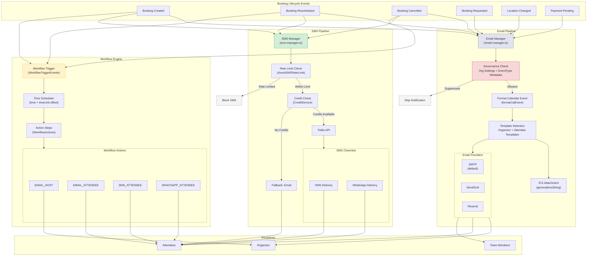

## Overview

Notifications are the critical communication backbone of any scheduling platform. Every booking, cancellation, reschedule, and reminder depends on reliable, timely delivery of messages to both organizers and attendees across multiple channels. This domain analysis compares **Cal.com's multi-channel notification infrastructure** against **Calendly's notification lifecycle**, covering email dispatch, SMS/WhatsApp delivery, workflow automation, ICS calendar attachments, and notification governance controls.

**Scope of analysis:**

- **Email infrastructure** — Multi-provider support (SMTP, SendGrid, Resend), 9 specialized email types, 20+ email templates, organization-level email governance
- **SMS infrastructure** — Twilio-powered SMS and WhatsApp delivery, rate limiting, credit gating, attendee-specific messaging
- **Workflow automation** — Trigger-action pipelines for scheduled reminders, follow-ups, and cancellation notices with time-based scheduling
- **ICS attachments** — Calendar invite generation for booking confirmations
- **Notification governance** — Organization-level and event-type-level controls for suppressing or customizing notification delivery

<Info>
  **Key Finding:** Cal.com's notification infrastructure **significantly exceeds** Calendly's capabilities. Cal.com provides multi-provider email dispatch (SMTP, SendGrid, Resend), SMS and WhatsApp via Twilio with rate limiting and credit gating, 9 specialized email service domains, and a workflow automation engine — compared to Calendly's single-provider email and SMS-only Workflow system available only on paid plans.
</Info>

**Behavioral source of truth:** Calendly's notification behaviors are referenced from [Calendly Help Center — Scheduling Notifications](https://help.calendly.com/hc/en-us/articles/14078580813335-Calendly-scheduling-notifications) and [Calendly Workflows Overview](https://help.calendly.com/hc/en-us/articles/360051017814-Workflows-overview).

---

## Cal.com Current Implementation

Cal.com implements a comprehensive multi-channel notification system spanning three primary packages: `packages/emails/` for email dispatch, `packages/sms/` for SMS and WhatsApp delivery, and `packages/features/ee/workflows/` for automated workflow-triggered communications.

### Email Infrastructure

The email system is orchestrated through a centralized **Email Manager** that coordinates dispatch across all booking lifecycle events, with organization-level and event-type-level governance controls.

**Central Orchestrator — `email-manager.ts`**

The `email-manager.ts` module is the primary entry point for all calendar-related notification emails. It exports over 15 specialized dispatch functions that handle every booking lifecycle event:

- `sendScheduledEmailsAndSMS` — Confirmation emails and SMS for new bookings
- `sendRescheduledEmailsAndSMS` — Reschedule notifications to organizers and attendees
- `sendCancelledEmailsAndSMS` — Cancellation notifications with event name formatting
- `sendOrganizerRequestEmail` — Booking request emails for approval-required event types
- `sendAttendeeRequestEmailAndSMS` — Attendee notification for pending requests
- `sendDeclinedEmailsAndSMS` — Declined booking notifications
- `sendAwaitingPaymentEmailAndSMS` — Payment-pending notifications
- `sendLocationChangeEmailsAndSMS` — Location change notifications
- `sendRequestRescheduleEmailAndSMS` — Reschedule request notifications
- `sendAddGuestsEmailsAndSMS` — Guest addition notifications
- `sendAddAttendeeEmailsAndSMS` — Attendee addition notifications
- `sendReassignedScheduledEmailsAndSMS` — Round-robin reassignment notifications
- `sendRoundRobinRescheduledEmailsAndSMS` — Round-robin reschedule notifications
- `sendRoundRobinCancelledEmailsAndSMS` — Round-robin cancellation notifications
- `sendScheduledSeatsEmailsAndSMS` — Seated event confirmation notifications
- `sendCancelledSeatEmailsAndSMS` — Seated event cancellation notifications
- `sendOrganizerRequestReminderEmail` — Organizer request reminder notifications

Each dispatch function follows a consistent pattern: format the calendar event via `formatCalEvent`, evaluate organization-level and event-type-level suppression rules, queue appropriate organizer and attendee email templates, and dispatch SMS notifications in parallel.

`Source: packages/emails/email-manager.ts`

**Email Type Governance — `email-types.ts`**

The `EmailType` enum defines 9 notification categories that can be individually suppressed at the organization or event-type level:

| Email Type | Description |
|-----------|-------------|
| `CONFIRMATION` | Booking confirmation emails |
| `CANCELLATION` | Booking cancellation emails |
| `RESCHEDULED` | Reschedule notification emails |
| `REQUEST` | Booking request emails (for approval-required events) |
| `REASSIGNED` | Host reassignment emails |
| `AWAITING_PAYMENT` | Payment pending emails |
| `RESCHEDULE_REQUEST` | Reschedule request emails |
| `LOCATION_CHANGE` | Location change emails |
| `NEW_EVENT` | New event notification emails |

Organization-level settings can disable each email type individually via `OrganizationSettingsRepository`, and event-type-level metadata can suppress all attendee or host emails globally through the `disableStandardEmails` configuration.

`Source: packages/emails/email-types.ts`

**Specialized Email Services**

Beyond the central email manager, Cal.com provides 8 domain-specific email services for non-booking notifications:

| Service | File | Responsibilities |
|---------|------|-----------------|
| **Auth Email Service** | `auth-email-service.ts` | Password reset, email verification links/codes, change-of-email verification |
| **Billing Email Service** | `billing-email-service.ts` | Refund failures, no-show fees, credit balance warnings, proration invoices and reminders |
| **Integration Email Service** | `integration-email-service.ts` | Broken integration alerts, disabled app notifications |
| **Organization Email Service** | `organization-email-service.ts` | Team invites, monthly digest emails, organization-level communications |
| **Recording Email Service** | `recording-email-service.ts` | Daily video recording availability, transcript notifications |
| **Workflow Email Service** | `workflow-email-service.ts` | Workflow-triggered email dispatch with custom templates |
| **Daily Video Emails** | `daily-video-emails.ts` | Video meeting recording and transcript broadcast to organizers and attendees |
| **OAuth Email Service** | `oauth-email-service.ts` | Admin OAuth client notifications |

`Source: packages/emails/auth-email-service.ts, packages/emails/billing-email-service.ts, packages/emails/integration-email-service.ts, packages/emails/organization-email-service.ts, packages/emails/recording-email-service.ts, packages/emails/workflow-email-service.ts, packages/emails/daily-video-emails.ts, packages/emails/oauth-email-service.ts`

**Multi-Provider Email Delivery**

Cal.com supports three email providers, configurable via environment variables:

- **SMTP** (default) — Standard SMTP transport for self-hosted and custom email server deployments
- **SendGrid** — Cloud email delivery via SendGrid API integration
- **Resend** — Modern email delivery via Resend API integration

Template rendering is handled through `packages/emails/src/renderEmail.ts`, which dynamically resolves template components, renders server-side React to HTML, sanitizes output (removing `RawHtml` scripts, adding Outlook namespace compatibility), and returns production-safe HTML. Local development email testing is supported through a Docker Compose configuration providing MailHog (SMTP on port 1025, UI on port 8025).

`Source: packages/emails/src/renderEmail.ts, packages/emails/docker-compose.yml`

**ICS Calendar Attachments**

Email confirmations include ICS file attachments for calendar invites, generated through `packages/emails/lib/` utilities (`generateIcsString`, `createIcsFile`). These attachments enable one-click calendar addition for attendees using any calendar client.

`Source: packages/emails/lib/`

### SMS Infrastructure

The SMS system is built around the abstract `SMSManager` class, providing Twilio-powered delivery with comprehensive rate limiting and credit gating.

**Central SMS Dispatcher — `SMSManager`**

The `SMSManager` class (`packages/sms/sms-manager.ts`) serves as the abstract base for all SMS notification types. Key capabilities include:

- **Twilio Integration** — All SMS messages are dispatched via Twilio's messaging API through the `sendSmsOrFallbackEmail` helper, which attempts SMS delivery and falls back to email if SMS delivery fails
- **Hierarchical Rate Limiting** — Rate limits are enforced at three levels: team-scoped (`team-{id}`), organizer-scoped (`org-user-{id}`), and phone-number-scoped (hashed) via `checkSMSRateLimit`
- **Credit Gating** — SMS delivery requires available credits, verified through `CreditService.hasAvailableCredits()` before dispatch
- **Organization-Level Controls** — SMS notifications can be disabled at the organization level via `organizationSettings.disablePhoneOnlySMSNotifications`
- **Attendee Eligibility Filtering** — Only phone-only bookings (attendees with `@sms.cal.com` email addresses) receive SMS notifications, enforced by the `isSmsCalEmail` guard
- **Alphanumeric Sender ID** — Sender identification resolved through `getSenderId` with country-aware alphanumeric support
- **Localized Date Formatting** — Date and time formatting via `dayjs` with timezone, locale, and 12-hour format support

`Source: packages/sms/sms-manager.ts`

**SMS Notification Types**

Cal.com provides 9 specialized SMS notification subclasses, each overriding `SMSManager.getMessage()` to produce localized copy:

| SMS Type | Class | Trigger |
|----------|-------|---------|
| Booking Confirmation | `EventSuccessfullyScheduledSMS` | New booking created |
| Booking Rescheduled | `EventSuccessfullyReScheduledSMS` | Booking rescheduled |
| Booking Cancelled | `EventCancelledSMS` | Booking cancelled |
| Booking Declined | `EventDeclinedSMS` | Booking request declined |
| Booking Request | `EventRequestSMS` | Booking request submitted |
| Reschedule Request | `EventRequestToRescheduleSMS` | Reschedule requested |
| Location Changed | `EventLocationChangedSMS` | Event location updated |
| Awaiting Payment | `AwaitingPaymentSMS` | Payment pending |
| Seat Cancelled | `CancelledSeatSMS` | Seat removed from group event |

Each SMS subclass includes the localized booking date/time, attendee/organizer names, and a booking details link.

`Source: packages/sms/attendee/`

### Workflow Automation

Cal.com's enterprise workflow engine (`packages/features/ee/workflows/`) provides automated trigger-action pipelines for scheduling communication before, during, and after booking events.

**Workflow Architecture**

Each workflow consists of a **trigger event**, a **time offset** (before or after the trigger), and one or more **action steps**:

- **Trigger Events** — Workflows fire on booking lifecycle events via `WorkflowTriggerEvents` (from Prisma enums): before event starts, after event ends, when event is booked, when event is cancelled, when event is rescheduled, and when a routing form is submitted
- **Time Scheduling** — Actions can be scheduled at precise time offsets using `time` and `timeUnit` (minutes, hours, days) relative to the trigger event
- **Action Types** — The `WorkflowActions` enum supports: `EMAIL_HOST`, `EMAIL_ATTENDEE`, `EMAIL_ADDRESS` (arbitrary email), `SMS_ATTENDEE`, `SMS_NUMBER` (arbitrary phone number), `WHATSAPP_ATTENDEE`, `WHATSAPP_NUMBER`, and additional voice/AI actions
- **Custom Templates** — Each workflow step supports custom `reminderBody`, `emailSubject`, and `sender` fields via `WorkflowTemplates`
- **Calendar Event Inclusion** — Steps can optionally include the full calendar event via `includeCalendarEvent` for ICS attachment support
- **Scope** — Workflows can be scoped to individual users (`userId`) or teams (`teamId`), and applied to specific event types

`Source: packages/features/ee/workflows/lib/types.ts`

**Workflow-to-Booking Integration**

The email manager's dispatch functions (e.g., `sendScheduledEmailsAndSMS`, `sendCancelledEmailsAndSMS`) handle transactional notifications, while the workflow engine handles scheduled and conditional notifications. Both systems coordinate through the booking lifecycle — transactional emails fire immediately at booking time, while workflow-triggered notifications fire at configured time offsets.

`Source: packages/emails/email-manager.ts, packages/features/ee/workflows/`

---

## Calendly Notification Behavior

Calendly provides a two-tier notification system: **basic scheduling notifications** (sent automatically) and **Workflow notifications** (customizable, available on paid plans).

### Basic Scheduling Notifications

Calendly automatically sends notifications when meetings are scheduled, with two delivery modes:

- **Calendar Invitations** — When connected to Google, Office 365, Outlook.com, or Exchange calendars, Calendly prompts the connected calendar to send invitations directly from the host's calendar email address. Calendar invitations automatically include updates when event details change (time, location).
- **Email Confirmations** — For iCloud, Outlook Plugin, or no-calendar users, Calendly sends confirmation emails from `notifications@calendly.com` with an `.ics` file attachment. These do not automatically send updates for event changes.

Host notifications are always sent from `notifications@calendly.com` when a meeting is scheduled, regardless of the invitee notification method.

Cancellation notifications are sent to both host and invitee when a booking is cancelled. These basic notifications cannot be disabled.

*Reference: [Calendly Help Center — Scheduling Notifications](https://help.calendly.com/hc/en-us/articles/14078580813335-Calendly-scheduling-notifications)*

### Workflow Notifications (Paid Plans Only)

Calendly Workflows provide customizable automated communications, available on Standard, Teams, and Enterprise plans. Key capabilities:

- **Trigger Types** — Before event starts, after event ends, when event is booked, when event is cancelled, when invitee is marked as no-show
- **Communication Channels** — Email and SMS text messages
- **Recipients** — Invitees, hosts, and third-party stakeholders ("someone else")
- **Templates** — Pre-built templates for reminders, reconfirmations, thank-you messages, follow-ups, no-show prompts, and cancellation notices
- **Customization** — Custom subject lines, message bodies, signatures, and variable insertion (invitee name, event details, reschedule/cancel links)
- **Timing** — Configurable time offsets (minutes, hours, days before or after events)
- **Email Sending Address** — Can send from `notifications@calendly.com` or from connected Gmail/Outlook accounts
- **SMS Delivery** — SMS via Twilio with 180-character limit; requires invitee opt-in for GDPR compliance; not available in Singapore, Russia, or Iran
- **Managed Workflows** — Admin-controlled workflows for teams (Managed Events), ensuring consistent reminders across team members
- **No-Show Handling** — Marking invitees as no-shows halts follow-up workflows and triggers no-show-specific workflows
- **Reconfirmation** — Dedicated reconfirmation workflow template requesting invitees to confirm attendance
- **Limit** — Up to 50 workflows per user or team

*Reference: [Calendly Workflows Overview](https://help.calendly.com/hc/en-us/articles/360051017814-Workflows-overview)*

### Calendly SMS Capabilities

Calendly provides SMS text message delivery through Twilio integration, available only on paid plans:

- SMS reminders can be sent to both invitees and hosts
- Messages do not include reschedule/cancel links by default (must be added via custom variables)
- SMS messages are no-reply — invitee responses are not received
- Phone number field cannot be made mandatory in workflows (privacy regulations)
- SMS delivery follows Twilio's Acceptable Use Policy

*Reference: [Calendly Help Center — Text Messages with Workflows](https://help.calendly.com/hc/en-us/articles/1500000432021-How-to-send-text-messages-with-Workflows)*

---

## Feature Comparison Matrix

| Feature | Calendly Behavior | Cal.com Status | Gap Severity | Notes |
|---------|------------------|---------------|-------------|-------|
| **Confirmation emails** | Automatic on booking via calendar invitation or email confirmation from `notifications@calendly.com` | ✅ `AttendeeScheduledEmail` + `OrganizerScheduledEmail` via `sendScheduledEmailsAndSMS` | **Low** | Cal.com sends from configurable provider (SMTP/SendGrid/Resend) |
| **Reminder emails** | Via Workflows (paid plans): configurable time offsets before event | ✅ Via workflow engine: `EMAIL_HOST`, `EMAIL_ATTENDEE`, `EMAIL_ADDRESS` actions with time offsets | **Low** | Both platforms use workflow-based reminders with custom timing |
| **Follow-up emails** | Via Workflows (paid plans): after event ends, thank-you templates, resource sharing | ✅ Via workflow engine: after-event triggers with custom templates | **Low** | Both support post-event follow-up automation |
| **Cancellation emails** | Automatic on cancellation; basic notifications cannot be disabled | ✅ `AttendeeCancelledEmail` + `OrganizerCancelledEmail` via `sendCancelledEmailsAndSMS` | **Low** | Cal.com additionally supports org-level suppression of cancellation emails |
| **Reschedule notifications** | Calendar invitations auto-update; email confirmations do not send updates | ✅ `AttendeeRescheduledEmail` + `OrganizerRescheduledEmail` via `sendRescheduledEmailsAndSMS` | **Low** | Cal.com sends explicit reschedule notifications regardless of calendar type |
| **SMS reminders** | Via Workflows (paid plans only); Twilio-powered; 180-char limit; no-reply | ✅ Via `SMSManager` + workflow engine; Twilio-powered; no character limit documented | **Low** | Cal.com SMS available with credit gating; Calendly requires paid plan |
| **WhatsApp notifications** | ❌ Not supported | ✅ `WHATSAPP_ATTENDEE` and `WHATSAPP_NUMBER` workflow actions via Twilio | **Low** | **Cal.com advantage** — WhatsApp channel not available in Calendly |
| **ICS calendar attachments** | Included with email confirmations (`.ics` file) | ✅ ICS generation via `packages/emails/lib/` utilities with `generateIcsString` | **Low** | Both platforms generate ICS attachments for calendar invites |
| **Email template customization** | Workflow emails: custom subject, body, signature, variables | ✅ React-based JSX templates via `packages/emails/templates/` + workflow custom templates | **Low** | Cal.com templates are code-level customizable; Calendly offers UI-level customization |
| **Multi-provider email support** | Single provider: Calendly-managed email delivery or connected Gmail/Outlook | ✅ Three providers: SMTP (default), SendGrid, Resend — configurable via environment variables | **Low** | **Cal.com advantage** — flexible email delivery provider selection |
| **Workflow-triggered notifications** | Workflows on paid plans: 5 trigger types, email + SMS channels, up to 50 per user/team | ✅ Enterprise workflow engine: 6+ trigger events, email + SMS + WhatsApp channels, user/team scoping | **Low** | Cal.com supports WhatsApp and custom email addresses; Calendly has UI-based workflow builder |
| **Rate limiting** | Not documented in Calendly's public documentation | ✅ Hierarchical rate limiting: team, organizer, and phone-number scoped via `checkSMSRateLimit` | **Low** | **Cal.com advantage** — explicit rate limiting protects against SMS abuse |
| **Credit gating** | Not applicable — SMS included in paid plan pricing | ✅ `CreditService.hasAvailableCredits()` check before SMS dispatch; fallback to email | **Low** | **Cal.com advantage** — credit-based SMS governance with email fallback |
| **Attendee-specific messaging** | Workflow variable insertion for invitee-specific details | ✅ Localized per-attendee SMS and email with timezone, language, and name personalization | **Low** | Both support personalized attendee messaging |
| **Reconfirmation requests** | Dedicated reconfirmation Workflow template (paid plans) | ⚠️ Not a first-class feature; achievable via workflow custom templates | **Medium** | Calendly has a dedicated reconfirmation template; Cal.com would need custom workflow setup |
| **No-show workflow handling** | Mark as no-show halts follow-ups; triggers no-show-specific workflows | ⚠️ No-show detection exists (via webhooks) but no dedicated no-show workflow template | **Medium** | Calendly's no-show workflow integration is more streamlined |
| **Email sending from user's address** | Can send Workflow emails from connected Gmail/Outlook accounts | ⚠️ Emails sent from configured SMTP/provider address; no per-user calendar-connected sending | **Medium** | Calendly allows sending from the user's own email address via connected accounts |
| **Organization-level email governance** | Limited: notification types chosen per event type; cannot globally suppress categories | ✅ `OrganizationSettingsRepository` with per-category suppression (9 email types independently controllable) | **Low** | **Cal.com advantage** — granular org-level email suppression |
| **Booking request notifications** | Implicit via confirmation flow | ✅ Dedicated `sendOrganizerRequestEmail` + `sendAttendeeRequestEmailAndSMS` for approval-required event types | **Low** | **Cal.com advantage** — explicit request/approval notification flow |
| **Location change notifications** | Calendar invitations auto-update (email confirmations do not) | ✅ Dedicated `sendLocationChangeEmailsAndSMS` with `AttendeeLocationChangeEmail` | **Low** | **Cal.com advantage** — explicit location change emails regardless of calendar type |
| **Guest/attendee addition notifications** | Not documented | ✅ `sendAddGuestsEmailsAndSMS` + `sendAddAttendeeEmailsAndSMS` | **Low** | **Cal.com advantage** — dedicated guest addition notifications |
| **Payment-related notifications** | Not available (payments handled by external integrations) | ✅ `sendAwaitingPaymentEmailAndSMS` + billing email service (refund failures, credit warnings, no-show fees) | **Low** | **Cal.com advantage** — integrated payment notification lifecycle |
| **Recording/transcript notifications** | Not documented | ✅ `recording-email-service.ts` for video recording and transcript broadcast | **Low** | **Cal.com advantage** — recording notification emails |

---

## Gap Inventory

The following table catalogs all identified behavioral gaps between Cal.com and Calendly's notification systems, including areas where Cal.com exceeds Calendly.

| Gap ID | Description | Severity | Cal.com Module | Calendly Reference | Recommendation |
|--------|-------------|----------|---------------|-------------------|----------------|
| NF-001 | **Reconfirmation workflow template** — Calendly provides a dedicated reconfirmation Workflow template that requests invitees to confirm attendance; Cal.com can achieve this via custom workflows but lacks a first-class reconfirmation template | Medium | `packages/features/ee/workflows/` | [Workflows Overview](https://help.calendly.com/hc/en-us/articles/360051017814-Workflows-overview) | Add a pre-built "Reconfirmation" workflow template to the workflow template library |
| NF-002 | **No-show workflow integration** — Calendly allows marking invitees as no-shows, which halts follow-up workflows and triggers no-show-specific workflows; Cal.com detects no-shows (via webhook events) but lacks integrated no-show workflow management | Medium | `packages/features/ee/workflows/` | [Workflows Overview](https://help.calendly.com/hc/en-us/articles/360051017814-Workflows-overview) | Add `INVITEE_NO_SHOW` as a workflow trigger event and integrate no-show status with workflow execution |
| NF-003 | **User-address email sending** — Calendly Workflows can send emails from the user's connected Gmail or Outlook account; Cal.com sends from the configured SMTP/provider address | Medium | `packages/emails/` | [Calendly Workflows Blog](https://calendly.com/blog/3-new-workflows-improvements) | Evaluate integration with connected calendar OAuth tokens for email sending on behalf of users |
| NF-004 | **Cal.com advantage: WhatsApp channel** — Cal.com supports WhatsApp delivery via `WHATSAPP_ATTENDEE` and `WHATSAPP_NUMBER` workflow actions; Calendly does not offer WhatsApp | Low | `packages/features/ee/workflows/` | N/A | Maintain and document this advantage |
| NF-005 | **Cal.com advantage: Multi-provider email** — Cal.com supports SMTP, SendGrid, and Resend as email providers; Calendly uses a single managed email delivery system | Low | `packages/emails/` | N/A | Maintain and document this advantage |
| NF-006 | **Cal.com advantage: Credit gating with SMS fallback** — Cal.com enforces credit-based SMS governance with automatic email fallback via `sendSmsOrFallbackEmail`; Calendly includes SMS in plan pricing | Low | `packages/sms/sms-manager.ts` | N/A | Maintain and document this advantage |
| NF-007 | **Cal.com advantage: Hierarchical rate limiting** — Cal.com implements team, organizer, and phone-number-scoped SMS rate limiting; not documented in Calendly | Low | `packages/sms/sms-manager.ts` | N/A | Maintain and document this advantage |
| NF-008 | **Cal.com advantage: Granular email governance** — Cal.com provides 9 independently controllable email type suppressions at organization and event-type levels; Calendly offers limited per-event-type notification configuration | Low | `packages/emails/email-types.ts` | N/A | Maintain and document this advantage |
| NF-009 | **Cal.com advantage: Payment notification lifecycle** — Cal.com includes dedicated billing email service for refund failures, no-show fees, credit warnings, and proration; Calendly has no integrated payment notifications | Low | `packages/emails/billing-email-service.ts` | N/A | Maintain and document this advantage |
| NF-010 | **Cal.com advantage: Location change notifications** — Cal.com sends dedicated location change emails and SMS to all attendees; Calendly relies on calendar invitation auto-updates (only available with calendar invitation mode) | Low | `packages/emails/email-manager.ts` | N/A | Maintain and document this advantage |
| NF-011 | **Cal.com advantage: Recording/transcript notifications** — Cal.com sends automated recording and transcript availability emails; Calendly does not offer this notification type | Low | `packages/emails/recording-email-service.ts` | N/A | Maintain and document this advantage |

---

## Notification Dispatch Architecture

The following diagram illustrates Cal.com's multi-channel notification dispatch pipeline, showing how booking events flow through the email manager, SMS manager, and workflow engine to reach organizers and attendees via email, SMS, and WhatsApp.

---

## Recommendations

### Priority 1: Reconfirmation Workflow Template (NF-001)

Add a pre-built "Reconfirmation" workflow template to Cal.com's workflow template library. This template should:

- Trigger before event starts (configurable time offset, e.g., 24 hours)
- Send an email or SMS requesting the attendee to confirm attendance
- Include a one-click confirmation link, plus reschedule and cancel links
- Track confirmation status on the bookings page

This aligns Cal.com with Calendly's dedicated reconfirmation workflow feature while leveraging the existing workflow engine infrastructure in `packages/features/ee/workflows/`.

`Source: packages/features/ee/workflows/lib/types.ts`

### Priority 2: No-Show Workflow Integration (NF-002)

Integrate no-show detection with the workflow engine by:

- Adding `INVITEE_NO_SHOW` as a `WorkflowTriggerEvents` enum value
- Creating a no-show workflow template that fires when an invitee is marked as no-show
- Implementing logic to halt pending follow-up workflows when no-show status is set
- Including a "reschedule prompt" action in the no-show workflow template

Cal.com already detects no-shows via the `NO_SHOW_HOST` webhook trigger event. Extending this to the workflow engine would provide a streamlined no-show management experience.

`Source: packages/features/ee/workflows/lib/types.ts`

### Priority 3: User-Address Email Sending (NF-003)

Evaluate allowing workflow emails to be sent from the user's connected calendar email address (Gmail or Outlook) by:

- Leveraging existing OAuth tokens from connected calendars in `packages/app-store/googlecalendar/` and `packages/app-store/office365calendar/`
- Adding a "Send from my email" option in workflow step configuration
- Implementing delegated email sending through the calendar provider's API (Gmail API `users.messages.send` or Microsoft Graph `sendMail`)

This feature requires careful handling of OAuth scopes and token refresh. It should be evaluated against the security implications of email impersonation.

`Source: packages/app-store/googlecalendar/, packages/app-store/office365calendar/`

### Cal.com Notification Advantages to Preserve

Cal.com's notification infrastructure provides significant advantages over Calendly in multiple areas. These should be maintained and highlighted:

- **WhatsApp channel** — A unique differentiator not available in Calendly
- **Multi-provider email delivery** — SMTP, SendGrid, and Resend support gives self-hosted users complete email infrastructure control
- **Credit gating with SMS fallback** — Sophisticated SMS cost management with automatic email fallback
- **Hierarchical rate limiting** — Protection against SMS abuse at team, organizer, and phone-number levels
- **Granular email governance** — 9 independently controllable email categories at organization and event-type levels
- **Payment notification lifecycle** — Integrated billing emails for refund failures, credit warnings, and no-show fees
- **Recording/transcript notifications** — Automated recording availability and transcript broadcast

For overlap with webhook-triggered notifications, see the [Webhooks & Events gap analysis](/gap-report/webhooks-events), which covers the `WebhookTriggerEvents` that fire during the booking notification lifecycle.

---

## Acceptance Criteria

The following behavioral acceptance criteria define when Cal.com achieves full notification parity with Calendly:

### Reconfirmation Workflow (NF-001)
- [ ] A pre-built "Reconfirmation" workflow template exists in the workflow template library
- [ ] The template sends an email or SMS with a confirmation link before the event starts
- [ ] Confirmation status is visible on the bookings management page
- [ ] The template supports configurable time offsets (e.g., 24 hours, 1 hour before event)

### No-Show Workflow Integration (NF-002)
- [ ] Marking an invitee as no-show triggers a `NO_SHOW` workflow event
- [ ] Pending follow-up workflows are halted when no-show status is set
- [ ] A pre-built "No-Show Reschedule" workflow template sends a rescheduling prompt to the no-show invitee
- [ ] No-show invitees do not receive standard post-meeting workflows (thank-you, follow-up)

### User-Address Email Sending (NF-003)
- [ ] Workflow email steps include a "Send from my email" option
- [ ] Emails sent via this option use the user's connected Gmail or Outlook account
- [ ] OAuth token refresh is handled transparently
- [ ] Delivery failures fall back to the default SMTP/provider address

### Regression Prevention
- [ ] All existing notification types (9 `EmailType` values) continue to function correctly
- [ ] Organization-level email suppression settings are preserved
- [ ] SMS rate limiting and credit gating remain functional
- [ ] WhatsApp delivery continues to operate through Twilio
- [ ] ICS calendar attachments are included in all confirmation and reschedule emails
- [ ] Workflow-triggered notifications fire at configured time offsets
- [ ] Email template rendering produces valid HTML across all providers (SMTP, SendGrid, Resend)
- [ ] The `sendSmsOrFallbackEmail` fallback mechanism continues to operate when SMS delivery fails or credits are exhausted
