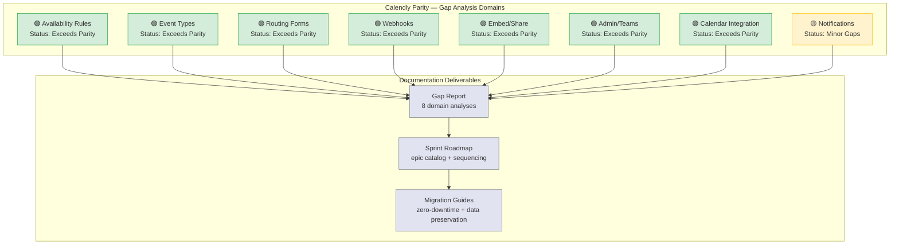

## Executive Summary

This gap report provides a systematic comparison of **Cal.com's open-source scheduling platform** against **Calendly's commercial scheduling capabilities** across eight critical feature domains. The analysis uses Calendly's API documentation at [developer.calendly.com](https://developer.calendly.com) as the behavioral source of truth for expected scheduling platform behavior.

<Info>
  **Key Finding:** Cal.com provides **comparable or superior capabilities** in the majority of analyzed domains. In several areas — webhooks, calendar integrations, scheduling paradigms, embed architecture, and routing forms — Cal.com **significantly exceeds** Calendly's feature surface.
</Info>

### Aggregate Parity Assessment

Cal.com's modular monorepo architecture, spanning 60+ feature packages in `packages/features/` and 80+ integration adapters in `packages/app-store/`, delivers a scheduling platform that matches or exceeds Calendly across all eight analyzed domains. The platform's API-first design enables **programmatic event type creation and availability management** — capabilities Calendly's API explicitly does not support.

**Highlights at a glance:**

- **Webhooks:** Cal.com supports **20 trigger events** vs. Calendly's **3 events**, with versioned payloads and cryptographic signature verification.
  `Source: packages/prisma/schema.prisma (enum WebhookTriggerEvents)`
- **Calendar Adapters:** Cal.com offers **11+ calendar adapters** with bi-directional sync vs. Calendly's **3 native integrations** (Google, Outlook, iCloud).
  `Source: packages/app-store/ (calendar adapter directories)`
- **Scheduling Paradigms:** Cal.com implements **6 scheduling types** (one-on-one, group, collective, round-robin, managed, dynamic) vs. Calendly's **4 types** (1:1, group, round-robin, collective).
  `Source: packages/prisma/schema.prisma (enum SchedulingType)`
- **Embed Architecture:** Cal.com provides a **3-package embed suite** with prerendering, skeleton loaders, and a `postMessage` handshake protocol.
  `Source: packages/embeds/ (embed-core, embed-react, embed-snippet)`

Where minor behavioral gaps exist, they are documented in the domain-specific analyses linked below, with severity ratings and implementation recommendations.

---

## Feature Domain Matrix

The following matrix summarizes Cal.com's parity status across all eight analyzed feature domains. Each domain links to its dedicated gap analysis page with detailed findings.

| Domain | Cal.com Status | Calendly Equivalent | Gap Severity | Report |
|--------|---------------|---------------------|-------------|--------|
| **Availability & Scheduling** | `ScheduleService`, `ScheduleRepository`, slot generation, DST normalization, holiday blocking, travel timezone overrides | Weekly hours, date overrides, buffer times, minimum notice | **Low** | [View Analysis](/gap-report/availability-scheduling) |
| **Event Types** | 6 paradigms via `SchedulingType` enum: one-on-one, group, collective, round-robin, managed, dynamic | 4 types: 1:1, group, round-robin, collective | **Low** | [View Analysis](/gap-report/event-types) |
| **Routing Forms** | RAQB engine with `jsonLogic`, attribute-based routing, CRM lookups, API v2 controller | Basic routing form builder with `routing_form_submission.created` webhook | **Low** | [View Analysis](/gap-report/routing-forms) |
| **Webhooks & Events** | 20 `WebhookTriggerEvents`, `PayloadBuilderFactory` with versioned builders, `X-Cal-Signature-256` | 3 events: `invitee.created`, `invitee.canceled`, `routing_form_submission.created` | **Low** | [View Analysis](/gap-report/webhooks-events) |
| **Embed & Share** | 3-package suite: `embed-core`, `embed-react`, `embed-snippet` with prerendering and skeleton loaders | Inline embed, popup widget, floating button | **Low** | [View Analysis](/gap-report/embed-share) |
| **Admin & Teams** | Hierarchical organizations, PBAC, sub-teams, managed event types, SSO/SCIM | Admin/owner/user roles, organization-wide scope management | **Low** | [View Analysis](/gap-report/admin-teams) |
| **Calendar Integrations** | 11+ adapters (Google, Outlook, Apple, CalDAV, Exchange, Lark, Feishu, Zoho, ICS Feed) with bi-directional sync | 3 native integrations: Google, Outlook, iCloud | **Low** | [View Analysis](/gap-report/calendar-integrations) |
| **Notifications** | Multi-provider email (SMTP, SendGrid, Resend), SMS/WhatsApp via Twilio, workflow automation | Email confirmations, reminders, follow-ups; SMS reminders | **Medium** | [View Analysis](/gap-report/notifications) |

<Note>
  Gap severity uses a 4-level scale: **Critical** (blocks parity), **High** (significant behavioral gap), **Medium** (minor behavioral difference), **Low** (cosmetic or edge case). See the [Methodology](#methodology) section for detailed definitions.
</Note>

---

## Parity Status Overview

The following diagram illustrates all eight gap analysis domains, their current parity status, and how they feed into the downstream documentation deliverables.

---

## Priority Ranking

Domains are ranked by gap severity and implementation priority. Cal.com's extensive feature surface means most domains already **meet or exceed** Calendly's capabilities.

### No Critical Gaps

No feature domain presents a critical gap that blocks Calendly parity. Cal.com's scheduling infrastructure is architecturally complete across all analyzed domains.

### Medium Priority — Minor Behavioral Differences

| Domain | Gap Summary | Cal.com Advantage |
|--------|------------|-------------------|
| **Notifications** | Minor differences in reminder/follow-up email lifecycle compared to Calendly's streamlined notification flow | Multi-provider email (SMTP, SendGrid, Resend), SMS/WhatsApp via Twilio, workflow-triggered automation, ICS attachments, credit gating |

### Low Priority — Cosmetic or Edge Case Differences

| Domain | Gap Summary | Cal.com Advantage |
|--------|------------|-------------------|
| **Availability & Scheduling** | Negligible behavioral differences in slot generation edge cases | Travel timezone overrides, holiday blocking, DST normalization, programmatic availability management via API |
| **Event Types** | Cal.com has 2 additional scheduling paradigms beyond Calendly's taxonomy | Managed event types, dynamic links, 6 vs 4 paradigms, programmatic event type creation via API |
| **Routing Forms** | Cal.com's RAQB-based routing far exceeds Calendly's basic form builder | Attribute-based routing, CRM lookups, `jsonLogic` conditional rules, API v2 management |
| **Webhooks & Events** | Cal.com's webhook system is substantially more capable | 20 vs 3 trigger events, versioned payloads via `PayloadBuilderFactory`, `X-Cal-Signature-256` verification, Handlebars templates, Tasker async delivery |
| **Embed & Share** | Cal.com's embed architecture is more sophisticated | 3-package suite, prerendering, skeleton loaders, `postMessage` handshake protocol, React component wrapper |
| **Admin & Teams** | Cal.com's hierarchical org model is more feature-rich | PBAC, sub-teams, managed event types, organization hierarchy, SSO/SCIM integration |
| **Calendar Integrations** | Cal.com supports 8 more calendar providers than Calendly | 11+ adapters vs 3, CalDAV protocol, Exchange 2013/2016 support, AES-256 credential encryption |

---

## Cal.com Advantages Summary

Cal.com **exceeds Calendly's capabilities** across multiple dimensions. This section catalogs the areas of significant advantage.

<CardGroup cols={2}>
  <Card title="Webhooks: 20 vs 3 Events" icon="webhook">
    Cal.com fires 20 distinct `WebhookTriggerEvents` covering bookings, payments, forms, meetings, recordings, OOO, delegation errors, and no-show detection. Calendly supports only 3 events: `invitee.created`, `invitee.canceled`, and `routing_form_submission.created`. Cal.com also provides versioned payloads via `PayloadBuilderFactory` and cryptographic signature verification (`X-Cal-Signature-256`).

    `Source: packages/features/webhooks/lib/factory/versioned/PayloadBuilderFactory.ts`
  </Card>
  <Card title="Calendar Adapters: 11+ vs 3" icon="calendar">
    Cal.com integrates with 11+ calendar providers — Google Calendar, Office 365, Apple Calendar, CalDAV, Exchange 2013, Exchange 2016, Lark, Feishu, Zoho, ICS Feed, and more — all with bi-directional sync. Calendly natively supports only Google, Outlook, and iCloud. Cal.com encrypts stored credentials with AES-256.

    `Source: packages/app-store/ (calendar adapter directories)`
  </Card>
  <Card title="Scheduling Paradigms: 6 vs 4" icon="calendar-check">
    Cal.com implements 6 scheduling paradigms — one-on-one, group, collective, round-robin, managed, and dynamic — compared to Calendly's 4 (1:1, group, round-robin, collective). Managed event types allow admin-pushed templates; dynamic links enable ad-hoc meeting creation.

    `Source: packages/prisma/schema.prisma (enum SchedulingType)`
  </Card>
  <Card title="Embed Architecture" icon="code">
    Cal.com's 3-package embed suite (`embed-core`, `embed-react`, `embed-snippet`) provides prerendering, skeleton loaders, a `postMessage` handshake protocol, and a React component wrapper — significantly more sophisticated than Calendly's inline/popup/floating embed widgets.

    `Source: packages/embeds/README.md, packages/embeds/LIFECYCLE.md`
  </Card>
  <Card title="Routing Forms: RAQB Engine" icon="route">
    Cal.com's routing forms use React Awesome Query Builder (RAQB) with `jsonLogic` for conditional routing, attribute-based team matching, and CRM lookups. Calendly's routing forms offer basic form-to-event-type routing without advanced rule evaluation.

    `Source: packages/app-store/routing-forms/lib/processRoute.tsx`
  </Card>
  <Card title="Admin Governance: Hierarchical Orgs" icon="building">
    Cal.com supports hierarchical organizations with sub-teams, Permission-Based Access Control (PBAC), managed event types pushed to members, and SSO/SCIM integration. Calendly uses a flatter admin/owner/user role model with organization-wide scope management.

    `Source: packages/features/ee/organizations/, packages/features/ee/teams/`
  </Card>
  <Card title="Notifications: Multi-Channel" icon="bell">
    Cal.com provides multi-provider email dispatch (SMTP, SendGrid, Resend), SMS and WhatsApp delivery via Twilio, workflow-triggered automation, ICS calendar attachments, rate limiting, and credit gating. Calendly offers email confirmations, reminders, and follow-ups with SMS reminders.

    `Source: packages/emails/email-manager.ts, packages/sms/sms-manager.ts`
  </Card>
  <Card title="API-First Design" icon="server">
    Cal.com's API v2 (NestJS-based) supports **programmatic event type creation, availability management, and webhook subscription** — capabilities that Calendly's API explicitly does not offer. This enables full automation and headless scheduling workflows.

    `Source: apps/api/v2/`
  </Card>
</CardGroup>

---

## Quick Reference — Domain Analyses

Navigate directly to each domain-specific gap analysis for detailed findings, feature comparison matrices, and implementation recommendations.

<CardGroup cols={2}>
  <Card title="Availability & Scheduling" icon="clock" href="/gap-report/availability-scheduling">
    Weekly schedules, date overrides, holiday blocking, DST normalization, buffer times, minimum notice, slot generation
  </Card>
  <Card title="Event Types" icon="calendar-plus" href="/gap-report/event-types">
    Six scheduling paradigms, booking windows, custom fields, pricing, managed event types, dynamic links
  </Card>
  <Card title="Routing Forms" icon="route" href="/gap-report/routing-forms">
    RAQB conditional routing, attribute-based matching, CRM lookups, form field types, API v2 management
  </Card>
  <Card title="Webhooks & Events" icon="webhook" href="/gap-report/webhooks-events">
    20 trigger events, versioned payloads, signature verification, retry policy, Tasker async delivery
  </Card>
  <Card title="Embed & Share" icon="code" href="/gap-report/embed-share">
    Inline, modal, and floating button embeds; React wrapper; prerendering; skeleton loaders; postMessage protocol
  </Card>
  <Card title="Admin & Teams" icon="building" href="/gap-report/admin-teams">
    Hierarchical organizations, PBAC, sub-teams, managed event types, SSO/SCIM, branding
  </Card>
  <Card title="Calendar Integrations" icon="calendar" href="/gap-report/calendar-integrations">
    11+ calendar adapters, bi-directional sync, conflict detection, credential encryption, CalDAV/Exchange support
  </Card>
  <Card title="Notifications" icon="bell" href="/gap-report/notifications">
    Multi-provider email, SMS/WhatsApp, workflow automation, ICS attachments, rate limiting, credit gating
  </Card>
</CardGroup>

### Related Documentation

- [Sprint Roadmap — Overview](/sprint-roadmap/overview) — Implementation sequencing for gap closure
- [Sprint Roadmap — Epic Catalog](/sprint-roadmap/epic-catalog) — All epics with priority and dependencies
- [Sprint Roadmap — Validation Criteria](/sprint-roadmap/validation-criteria) — Parity validation checklists
- [Migration — Zero-Downtime Strategy](/migration/zero-downtime-strategy) — Schema migration approach
- [Migration — Data Preservation](/migration/data-preservation) — Existing data guarantees
- [Migration — Webhook Compatibility](/migration/webhook-compatibility) — Backward compatibility guide

---

## Methodology

### Analysis Approach

This gap analysis was conducted through four complementary investigation methods:

1. **Source Code Inspection** — Systematic review of Cal.com's `packages/features/` modules, `packages/app-store/` adapters, `packages/embeds/` suite, `packages/emails/` and `packages/sms/` communication packages, and `packages/prisma/` schema definitions.

2. **Calendly API Documentation Review** — Comprehensive analysis of Calendly's REST API v2, webhook events, and scheduling behaviors as documented at [developer.calendly.com](https://developer.calendly.com) and the [Calendly API reference](https://developer.calendly.com/api-docs).

3. **Feature Catalog Reference** — Cross-referencing against the technical specification's feature catalog (F-001 through F-021) to ensure all in-scope domains are covered.

4. **Behavioral Comparison** — Direct comparison of scheduling behaviors using Calendly's API as the behavioral source of truth, identifying where Cal.com matches, exceeds, or falls short of expected behavior.

### Gap Severity Classification

All gaps identified across the eight domain analyses use a consistent 4-level severity scale:

| Severity | Definition | Action Required |
|----------|-----------|-----------------|
| **Critical** | Blocks parity — Calendly has a core capability that Cal.com completely lacks | Immediate implementation required |
| **High** | Significant behavioral gap — feature exists in Cal.com but behavior differs materially from Calendly | High-priority implementation in sprint roadmap |
| **Medium** | Minor behavioral difference — feature exists with slight behavioral deviations from Calendly | Scheduled for medium-priority sprint |
| **Low** | Cosmetic or edge case — negligible difference in user experience; often Cal.com exceeds Calendly | Address opportunistically or document as intentional |

### Terminology Mapping

Consistent terminology is used throughout all gap analysis documents:

| Calendly Term | Cal.com Equivalent | Notes |
|---------------|-------------------|-------|
| Invitee | Attendee | Person booking the event |
| Event Type | Event Type | Same terminology |
| Organization | Organization | Cal.com adds hierarchical sub-teams |
| Webhook Subscription | Webhook | Cal.com supports event-type-scoped subscriptions |
| Routing Form | Routing Form | Cal.com uses RAQB rule engine |

---

## How to Use This Report

### Navigation Guide

Each domain-specific gap analysis is **self-contained and independently updatable**. You can read any domain analysis in isolation without requiring context from other domains. Every domain analysis includes:

- **Overview** — scope and context for the domain
- **Cal.com Current Implementation** — detailed documentation of existing capabilities with source citations
- **Calendly Behavior** — expected behavior from Calendly's API documentation
- **Feature Comparison Matrix** — side-by-side capability comparison table
- **Gap Inventory** — all identified gaps with severity, module references, and recommendations
- **Mermaid Diagram** — visual architecture or flow comparison
- **Recommendations** — prioritized implementation guidance
- **Acceptance Criteria** — behavioral criteria for confirming parity

### Recommended Reading Order

1. Start with this **Overview** page for aggregate parity status
2. Review domain analyses in priority order (see [Priority Ranking](#priority-ranking))
3. Consult the [Sprint Roadmap](/sprint-roadmap/overview) for implementation sequencing
4. Reference [Migration Guides](/migration/zero-downtime-strategy) for schema change strategies

### Updating This Report

As gaps are closed through sprint execution, update the corresponding domain analysis page independently. The feature domain matrix on this page and the parity status diagram should be updated to reflect the new status after each sprint completion. Epic IDs in the [Sprint Roadmap — Epic Catalog](/sprint-roadmap/epic-catalog) cross-reference gaps identified in each domain analysis.

<Warning>
  All gap analysis documents reference Calendly's API documentation at [developer.calendly.com](https://developer.calendly.com) as the behavioral source of truth. Claims about Calendly's capabilities should be periodically re-verified as Calendly's feature set evolves.
</Warning>
