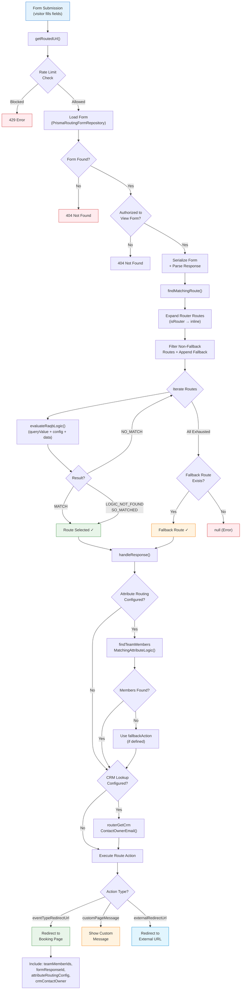

## Overview

Routing forms are a **lead qualification and scheduling optimization feature** that captures visitor information and automatically directs them to the appropriate person, event type, or destination based on configurable conditional logic. They serve as the entry point for intelligent scheduling workflows, enabling sales teams, support organizations, and service businesses to screen, qualify, and route prospects without manual intervention.

This gap analysis compares **Cal.com's routing forms** — featuring a React Awesome Query Builder (RAQB) rule engine, `jsonLogic`-based conditional evaluation, attribute-based team member matching, CRM contact owner lookups, and an API v2 controller — against **Calendly's routing forms**, which provide a drag-and-drop form builder with conditional routing to event types, custom messages, or external URLs.

<Info>
  **Key Finding:** Cal.com's routing forms **significantly exceed** Calendly's capabilities in conditional routing sophistication. Cal.com employs RAQB with `jsonLogic` for arbitrarily complex rule evaluation, supports attribute-based team member matching, integrates CRM lookups (Salesforce, HubSpot) for contact owner routing, and exposes a programmatic API v2 for slot calculation. Calendly's routing forms are simpler — primarily using form-answer-based conditional logic with CRM lookup available at higher tiers.
</Info>

### Scope

This analysis covers:

- **Form builder** — question types, field configuration, and form customization
- **Conditional routing logic** — RAQB rule engine vs. Calendly's answer-based routing
- **Attribute-based routing** — team member matching via organizational attributes
- **CRM integration** — Salesforce and HubSpot lookup for contact owner routing
- **Route destinations** — event types, custom messages, external URLs, and nested routers
- **Webhook notifications** — `routing_form_submission.created` event
- **API management** — programmatic form and slot calculation endpoints
- **Multi-step forms** — chained routing form workflows

**Behavioral Source of Truth:** Calendly's routing form documentation at [developer.calendly.com](https://developer.calendly.com) and [help.calendly.com](https://help.calendly.com/hc/en-us/articles/4418606043927-How-to-create-a-Routing-Form) is used as the authoritative benchmark for expected routing form behavior.

### Terminology Mapping

| Calendly Term | Cal.com Equivalent | Notes |
|---------------|-------------------|-------|
| Routing Form | Routing Form | Same terminology; Cal.com uses the `routing-forms` App Store entry |
| Question | Field | Cal.com fields are defined by `zodNonRouterField` with `id`, `label`, `type`, `options` |
| Routing logic | Route with `queryValue` | Cal.com stores RAQB `queryValue` (JSON tree) per route |
| Condition | RAQB Rule | Cal.com uses `react-awesome-query-builder` rules evaluated via `jsonLogic` |
| Destination | Route Action | Cal.com defines `RouteActionType`: `eventTypeRedirectUrl`, `customPageMessage`, `externalRedirectUrl` |
| Fallback route | Fallback route (`isFallback`) | Both platforms support a default fallback when no conditions match |
| Form answers routing | Form fields `queryValue` | Cal.com evaluates RAQB `queryValue` against form field responses |
| Salesforce lookup | CRM contact owner routing | Cal.com uses `routerGetCrmContactOwnerEmail` for Salesforce/HubSpot |

---

## Cal.com Current Implementation

Cal.com provides a **sophisticated, enterprise-grade routing forms system** built across three code locations with a layered architecture spanning form definition, RAQB-based conditional routing, attribute-based team member matching, CRM contact owner lookups, response handling, and a programmatic API v2 controller.

### Architecture Overview

Cal.com's routing forms span **three distinct code locations** in the monorepo:

1. **`packages/features/routing-forms/`** — Core routing logic, repositories, DI tokens, type definitions, and utility libraries
2. **`packages/app-store/routing-forms/`** — App Store entry with configuration, zod schemas, RAQB components, form UI components, and E2E tests
3. **`apps/api/v2/src/modules/routing-forms/`** — NestJS API v2 controller for programmatic slot calculation

`Source: packages/features/routing-forms/`, `Source: packages/app-store/routing-forms/config.json`, `Source: apps/api/v2/src/modules/routing-forms/controllers/routing-forms.controller.ts`

<Tabs>
  <Tab title="Core Feature Package">
    The `packages/features/routing-forms/` package contains:

    - **Repositories:** `PrismaRoutingFormRepository`, `PrismaRoutingFormResponseRepository`, `RoutingFormResponseRepository` — data access layer for forms and responses
    - **Libraries:** `findMatchingRoute`, `getRoutedUrl`, `handleResponse`, `findTeamMembersMatchingAttributeLogic`, `getFieldIdentifier`, `parseRoutingFormResponse`, `isAuthorizedToViewForm`
    - **DI Module:** `RoutingFormResponseRepository.module.ts` with dependency injection tokens
    - **Types:** `FormResponse`, `Field`, `Fields`, `RoutingFormResponseData`

    `Source: packages/features/routing-forms/lib/getRoutedUrl.ts`
  </Tab>
  <Tab title="App Store Entry">
    The `packages/app-store/routing-forms/` package contains:

    - **Configuration:** `config.json` — App Store metadata (slug: `routing-forms`, type: `routing-forms_other`, category: `automation`, license required, teams plan required)
    - **Zod Schemas:** Route, field, and action type definitions (`zodNonRouterRoute`, `zodRouterRoute`, `zodField`, `RouteActionType`)
    - **RAQB Components:** `react-awesome-query-builder/` directory with `BasicConfig`, `uiConfig`, custom widgets, and type definitions
    - **Form UI:** `FormInputFields.tsx`, `InfoLostWarningDialog.tsx`, `DynamicAppComponent.tsx`
    - **Routing Logic:** `processRoute.tsx` containing `findMatchingRoute` function and helper utilities
    - **CRM Routing:** `lib/crmRouting/routerGetCrmContactOwnerEmail.ts`
    - **E2E Tests:** `playwright/tests/basic.e2e.ts`, `playwright/tests/attribute-routing.e2e.ts`

    `Source: packages/app-store/routing-forms/zod.ts`
  </Tab>
  <Tab title="API v2 Controller">
    The `apps/api/v2/src/modules/routing-forms/` module provides:

    - **Controller:** `RoutingFormsController` with `POST /v2/routing-forms/:routingFormId/calculate-slots` endpoint
    - **Service:** `RoutingFormsService` for business logic
    - **Repository:** `routing-forms.repository.ts` for data access
    - **Output DTO:** `ResponseSlotsOutput` for typed API responses
    - **Module:** `routing-forms.module.ts` for NestJS dependency injection

    `Source: apps/api/v2/src/modules/routing-forms/controllers/routing-forms.controller.ts`
  </Tab>
</Tabs>

### RAQB Rule Engine

Cal.com integrates **React Awesome Query Builder (RAQB)** with `jsonLogic` to provide arbitrarily complex conditional routing rules. Each route stores a `queryValue` — a serialized JSON tree representing the RAQB rule configuration — which is evaluated against form field responses at runtime.

**Key RAQB vocabulary** (per `packages/app-store/routing-forms/README.md`):

- **RaqbField** — A field in the context of React Awesome Query Builder, configured via `getQueryBuilderConfig`. This is the complex type used by the RAQB UI to build rules.
- **Field** — A field in the Routing Form context, defined by `zodNonRouterField` with properties: `id`, `label`, `identifier`, `placeholder`, `type`, `required`, `deleted`, `options`.
- **queryValue** — The serialized RAQB rule output stored as a `JsonTree` structure. Each route has a `queryValue` that encodes the conditional logic for matching form field responses.

`Source: packages/app-store/routing-forms/README.md`

The RAQB `queryValue` structure follows the `AttributeQueryValue` pattern:

```json
{
  "id": "unique-id",
  "type": "group",
  "children1": {
    "rule-id": {
      "type": "rule",
      "properties": {
        "field": "ATTRIBUTE.id",
        "operator": "multiselect_equals",
        "value": ["AttributeOption.id"],
        "valueType": ["multiselect"]
      }
    }
  }
}
```

`Source: packages/app-store/routing-forms/README.md`

### Core Route Matching — `findMatchingRoute`

The `findMatchingRoute` function is the **heart of Cal.com's routing evaluation**. It accepts a form (with routes and fields) and a response, then iterates through routes — expanding nested routers, excluding fallback routes, and evaluating each route's `queryValue` against the response using `evaluateRaqbLogic`.

**Algorithm:**

1. Extract routes from the form, expanding any nested router routes via `isRouter()`
2. Filter out fallback routes from the main evaluation list
3. Append the fallback route at the end as the last resort
4. For each route, evaluate `evaluateRaqbLogic({ queryValue, queryBuilderConfig, data: responseValues })`
5. If result is `RaqbLogicResult.MATCH` or `RaqbLogicResult.LOGIC_NOT_FOUND_SO_MATCHED`, select that route
6. If no route matches, return `null`
7. Log the matched route via `RoutingFormTraceService` for observability

`Source: packages/app-store/routing-forms/lib/processRoute.tsx`

### Route Processing Pipeline — `getRoutedUrl`

The `getRoutedUrl` function orchestrates the **complete routing pipeline** from form submission to destination redirect:

1. **Rate limiting** — Throttles duplicate submissions using a deterministic hash of field responses
2. **Form lookup** — Retrieves the form with user, team, and organization associations via `PrismaRoutingFormRepository`
3. **Authorization** — Verifies the requester is authorized to view the form on the current organization domain
4. **Serialization** — Converts form to serializable format with migration data enrichment
5. **Response storage** — Transforms raw field responses into the stored `FormResponse` format
6. **Route matching** — Calls `findMatchingRoute` to determine the chosen route
7. **Response handling** — Calls `handleResponse` which performs attribute-based team member matching and CRM lookups
8. **Action execution** — Based on the route's `RouteActionType`:
   - `customPageMessage` → Renders a custom message page
   - `eventTypeRedirectUrl` → Redirects to event type booking page with routed team member IDs, form response ID, attribute routing config, and CRM data as URL parameters
   - `externalRedirectUrl` → Redirects to an external URL with query parameters forwarded
9. **Trace recording** — Saves routing trace for observability and debugging

`Source: packages/features/routing-forms/lib/getRoutedUrl.ts`

### Attribute-Based Team Member Routing

Cal.com supports **attribute-based routing** that matches team members based on organizational attributes. When a route targets a team event type, the system can evaluate an `attributesQueryValue` (separate from the form fields `queryValue`) to find team members whose attributes match the routing criteria.

The `findTeamMembersMatchingAttributeLogic` function:

1. Retrieves attribute assignment data for the organization's team members
2. Builds an RAQB configuration specific to attribute types (multiselect, text, number, etc.)
3. Evaluates `jsonLogic` rules against each team member's attribute values concurrently using `async` library
4. Returns the set of matching team members, which are passed as `routedTeamMemberIds` to the booking page
5. Supports **fallback logic** via `fallbackAttributesQueryValue` when the primary attribute query matches no members

`Source: packages/features/routing-forms/lib/findTeamMembersMatchingAttributeLogic.ts`

### CRM Contact Owner Routing

Cal.com integrates with **Salesforce and HubSpot** to route submissions to the CRM contact owner. The `routerGetCrmContactOwnerEmail` function:

1. Extracts the prospect's email from the form response (using the `email` identifier field)
2. Looks up the event type to verify it's a round-robin scheduling type
3. Queries the CRM (via `getCRMContactOwnerForRRLeadSkip`) to find the contact owner
4. Returns the contact owner's email, record type, and CRM app slug for routing decisions
5. Respects the `skipContactOwner` flag in `attributeRoutingConfig`

`Source: packages/app-store/routing-forms/lib/crmRouting/routerGetCrmContactOwnerEmail.ts`

### Form Field Types

Cal.com routing forms support the following field types, defined by the `zodNonRouterField` schema:

| Field Type | Description | Routing Support |
|-----------|-------------|-----------------|
| `text` | Short text input | Route on exact/contains match |
| `textarea` | Long text input | Route on exact/contains match |
| `number` | Numeric input | Route on numeric comparisons |
| `email` | Email address input (validated) | Route on domain match, CRM lookup |
| `phone` | Phone number input | Route on value match |
| `select` | Single-select dropdown | Route on selected option |
| `multiselect` | Multi-select checkboxes | Route on selected options |

Each field has properties: `id`, `label`, `identifier`, `placeholder`, `type`, `required`, `deleted`, and `options` (array of `{ label, id }` for select/multiselect fields).

`Source: packages/features/routing-forms/lib/zod.ts`

### Route Action Types

Cal.com defines three route action types in the `RouteActionType` enum:

| Action Type | Enum Value | Behavior |
|------------|-----------|----------|
| **Event Type Redirect** | `eventTypeRedirectUrl` | Redirects to a Cal.com event type booking page, optionally with routed team member IDs and attribute routing config |
| **Custom Page Message** | `customPageMessage` | Displays a custom text message to the visitor (used for disqualification) |
| **External Redirect** | `externalRedirectUrl` | Redirects to an external URL with query parameters forwarded |

Each route can also have a **fallback action** (`fallbackAction`) that is used when the main attributes query finds no matching team members and no CRM contact owner exists.

`Source: packages/app-store/routing-forms/zod.ts`

### Nested Router Support

Cal.com supports **nested routing** via the `zodRouterRoute` schema. A route can reference another routing form (a "router") by its form ID. When `findMatchingRoute` encounters a router route, it expands the router's routes inline via `isRouter()`, effectively creating multi-level routing chains without requiring separate form submissions.

`Source: packages/app-store/routing-forms/zod.ts`

### API v2 — Slot Calculation

The `RoutingFormsController` exposes a **programmatic API** for calculating available booking slots based on routing form responses:

```
POST /v2/routing-forms/:routingFormId/calculate-slots
```

This endpoint accepts routing form responses as query parameters, evaluates the routing logic, and returns the routed event type along with its available booking slots — enabling headless scheduling workflows where the UI is decoupled from Cal.com's frontend.

`Source: apps/api/v2/src/modules/routing-forms/controllers/routing-forms.controller.ts`

---

## Calendly Routing Form Behavior

Calendly provides routing forms as a **lead qualification and scheduling optimization feature** available on Teams and Enterprise plans (and the legacy Professional plan). Routing forms capture visitor information through configurable questions and automatically direct respondents to the appropriate event type, custom message, or external URL based on conditional logic.

**Reference:** [developer.calendly.com](https://developer.calendly.com), [Calendly Help — How to create a Routing Form](https://help.calendly.com/hc/en-us/articles/4418606043927-How-to-create-a-Routing-Form)

### Form Builder

Calendly offers a **drag-and-drop form builder** that supports:

- **Question types:** Multiple choice (radio buttons), dropdowns, checkboxes, and text fields
- **Form customization:** Headline, description, and custom submission button text
- **Form preview:** Preview and test routing logic before publishing (responses not recorded during preview)
- **Sharing options:** Share via link or embed on a website
- **Permissions:** Only owners, admins, and group admins can create forms; editing permissions can be granted to individual users

### Conditional Routing Logic

Calendly's routing logic is based on **form answer matching**:

1. **Use form answers** — Route based on responses to questions in the Calendly form
2. **Salesforce lookup** — Route based on Salesforce CRM data (contact owner, deal stage, custom fields)
3. **HubSpot lookup** — Route based on HubSpot CRM data
4. **Conditions** — Each route condition specifies a question, qualifier (operator), and answer with support for `AND`/`OR` compound conditions
5. **Multiple questions** — Conditions can reference multiple questions for complex qualification
6. **Destinations:** Event Type, Custom Message, or External URL

### Fallback Route

Calendly routing forms include a **fallback route** that applies when a visitor's responses don't match any configured conditions. By default, the fallback displays a custom message, but it can be changed to redirect to an event type or external URL.

### Multi-Step Routing (Workaround)

Calendly does **not natively support multi-step routing forms**. However, users can achieve multi-step routing by "daisy-chaining" multiple routing forms — using the first form's external URL destination to link to a second routing form. This is a community-documented workaround, not a built-in feature.

### Webhook Integration

Calendly fires a **`routing_form_submission.created`** webhook event when a routing form is submitted:

- **Scope:** Organization-scoped only (not available at user scope)
- **Trigger:** Fires on every form submission, regardless of whether a booking occurs
- **Payload:** Includes form submission URI, routing form URI, questions and answers, tracking parameters (UTM), and submission timestamp
- **Subscription:** Created via `POST /webhook_subscriptions` with the `routing_form_submission.created` event

### API Access

Calendly's routing form API provides:

- **List routing forms** — `GET /routing_forms` returns routing forms for an organization or user
- **Get routing form** — `GET /routing_forms/:uuid` returns a single routing form
- **List routing form submissions** — `GET /routing_form_submissions` returns submissions for a specific form
- **No programmatic form creation** — Calendly's API does not support creating or modifying routing forms programmatically
- **No slot calculation** — Calendly's API does not provide an endpoint to calculate available slots based on routing form responses
- **No submission deletion** — Routing form submissions cannot be deleted via API

### Response Analytics

Calendly provides built-in **routing form analytics**:

- View response date, destination result, questions, and answers
- Filter by result type, event type, and date range
- Export results as CSV
- Track routing form performance trends

### Third-Party Form Integration

Calendly supports importing external forms as routing form sources:

- **HubSpot forms** — Import HubSpot form fields (including hidden fields) and add scheduling routes
- **Marketo forms** — Import Marketo form fields with routing logic
- **Pardot forms** — Import Pardot form fields with routing logic
- **Clearbit/ZoomInfo enrichment** — Use enriched data (industry, company size) in HubSpot, Marketo, or Pardot forms for routing decisions

---

## Feature Comparison Matrix

| Feature | Calendly Behavior | Cal.com Status | Gap Severity | Notes |
|---------|------------------|----------------|-------------|-------|
| **Form builder** | Drag-and-drop builder with headline, description, custom button text | UI-based form builder with field configuration | **Low** | Both platforms provide visual form builders; Cal.com's builder includes identifier and placeholder configuration |
| **Question/field types** | Multiple choice, dropdowns, checkboxes, text fields | Text, textarea, number, email, phone, select, multiselect | **Low** | Cal.com supports more granular field types (number, email, phone) with validation |
| **Conditional routing logic** | Answer-based conditions with AND/OR operators | RAQB-based `jsonLogic` evaluation with arbitrarily complex rules | **Low** | Cal.com's RAQB engine is significantly more powerful than Calendly's form-answer matching |
| **Attribute-based routing** | Not available | Full support via `findTeamMembersMatchingAttributeLogic` with `attributesQueryValue` | **Low** | **Cal.com advantage** — matches team members based on organizational attributes |
| **CRM contact owner routing** | Salesforce lookup, HubSpot lookup (Teams/Enterprise) | Salesforce and HubSpot via `routerGetCrmContactOwnerEmail` | **Low** | Both platforms support CRM-based routing; Cal.com integrates directly in the routing pipeline |
| **Route destinations** | Event Type, Custom Message, External URL | `eventTypeRedirectUrl`, `customPageMessage`, `externalRedirectUrl` | **Low** | Feature parity on destination types |
| **Fallback route** | Default fallback with custom message (editable) | `isFallback` route evaluated last in `findMatchingRoute` | **Low** | Feature parity; both platforms support configurable fallback behavior |
| **Fallback action for attributes** | Not available | `fallbackAction` and `fallbackAttributesQueryValue` on routes | **Low** | **Cal.com advantage** — separate fallback when attribute matching finds no members |
| **Nested/multi-step routing** | Workaround via daisy-chaining separate forms | Native nested router support via `zodRouterRoute` with inline route expansion | **Low** | **Cal.com advantage** — native multi-step routing without separate form chaining |
| **Webhook notifications** | `routing_form_submission.created` (organization-scoped) | `FORM_SUBMITTED` webhook trigger event fires on every routing form submission | **Low** | ✅ `FORM_SUBMITTED` webhook event implemented via WH-003. Fires on all form submissions including non-booking submissions. See [Webhooks & Events gap analysis](/gap-report/webhooks-events) |
| **API management** | `GET /routing_forms`, `GET /routing_form_submissions` (read-only) | `POST /v2/routing-forms/:id/calculate-slots` (slot calculation) | **Low** | Cal.com provides programmatic slot calculation; Calendly provides read-only listing. Neither supports full CRUD via API |
| **Form preview/testing** | Preview mode with test submissions (not recorded) | Test preview available with `cal.isBookingDryRun` parameter | **Low** | Both platforms support form testing without recording responses |
| **Response analytics** | Built-in response viewing, filtering, CSV export | Form response storage via `RoutingFormResponseRepository` | **Medium** | Calendly has more polished built-in analytics UI with filtering and CSV export; Cal.com stores responses but analytics may require custom queries |
| **Third-party form import** | HubSpot, Marketo, Pardot form integration | Not available as native feature | **Medium** | Calendly supports importing third-party marketing forms as routing form sources |
| **Enrichment data routing** | Clearbit/ZoomInfo enrichment in HubSpot/Marketo/Pardot forms | Not available | **Medium** | Calendly leverages data enrichment providers for more informed routing decisions |
| **Response deletion** | Not available via API or UI | Available via direct database management | **Low** | Neither platform provides a robust submission deletion workflow |
| **Permissions management** | Owner/admin create; editing permissions grantable per user | Team-based permissions via Cal.com PBAC | **Low** | Both platforms restrict form creation to authorized roles |
| **Routing trace/observability** | Not available | Full routing trace via `RoutingFormTraceService` and `RoutingTraceService` | **Low** | **Cal.com advantage** — detailed routing decision tracing for debugging and auditing |

---

## Gap Inventory

| Gap ID | Description | Severity | Status | Cal.com Module | Calendly Reference | Recommendation |
|--------|------------|----------|--------|---------------|-------------------|----------------|
| **RF-GAP-001** | No dedicated `routing_form_submission.created` webhook event | **Medium** | ✅ Closed (via WH-003) | `packages/features/webhooks/` | `routing_form_submission.created` at [developer.calendly.com](https://developer.calendly.com) | `FORM_SUBMITTED` webhook trigger event added to `WebhookTriggerEvents` Prisma enum. Fires on every routing form submission including non-booking submissions. Cross-ref: [Webhooks & Events gap analysis](/gap-report/webhooks-events) |
| **RF-GAP-002** | No built-in routing form response analytics dashboard | **Medium** | ⏳ Deferred (out of scope) | `packages/features/routing-forms/` | [Calendly Help — Manage Routing Forms](https://help.calendly.com/hc/en-us/articles/26849420421143) | Not in RF-001 through RF-004 epic scope. See [Epic Catalog](/sprint-roadmap/epic-catalog) for future scheduling. |
| **RF-GAP-003** | No third-party marketing form import (HubSpot, Marketo, Pardot) | **Medium** | ⏳ Deferred (out of scope) | `packages/app-store/routing-forms/` | [Calendly Help — HubSpot forms](https://help.calendly.com/hc/en-us/articles/12131517924119) | Not in RF-001 through RF-004 epic scope. Third-party form integration (HubSpot, Marketo, Pardot) deferred. |
| **RF-GAP-004** | No data enrichment integration (Clearbit/ZoomInfo) | **Medium** | ⏳ Deferred (out of scope) | `packages/app-store/routing-forms/` | [Calendly Routing Features](https://calendly.com/features/routing) | Not in RF-001 through RF-004 epic scope. Data enrichment integration deferred. |
| **RF-ADV-001** | **Cal.com advantage:** RAQB-based `jsonLogic` rule engine | **Low** | ✅ Preserved | `packages/app-store/routing-forms/lib/processRoute.tsx` | N/A | Cal.com's RAQB engine supports arbitrarily complex conditional rules with nested groups, multiple operators, and compound logic — far exceeding Calendly's simple answer-based matching |
| **RF-ADV-002** | **Cal.com advantage:** Attribute-based team member routing | **Low** | ✅ Preserved | `packages/features/routing-forms/lib/findTeamMembersMatchingAttributeLogic.ts` | N/A | Cal.com matches team members based on organizational attributes (department, skill, region), enabling intelligent round-robin distribution that Calendly lacks |
| **RF-ADV-003** | **Cal.com advantage:** Native nested router support | **Low** | ✅ Preserved | `packages/app-store/routing-forms/zod.ts` | N/A | Cal.com supports native nested routing forms (routers) that expand inline during evaluation, eliminating the need for Calendly's workaround of daisy-chaining separate forms |
| **RF-ADV-004** | **Cal.com advantage:** Programmatic slot calculation API | **Low** | ✅ Preserved | `apps/api/v2/src/modules/routing-forms/controllers/routing-forms.controller.ts` | N/A | Cal.com's `POST /v2/routing-forms/:id/calculate-slots` endpoint enables headless scheduling workflows; Calendly provides only read-only form and submission listing |
| **RF-ADV-005** | **Cal.com advantage:** Routing trace observability | **Low** | ✅ Preserved | `packages/features/routing-forms/lib/getRoutedUrl.ts` | N/A | Cal.com provides full routing decision tracing via `RoutingFormTraceService` for debugging and auditing routing logic |
| **RF-ADV-006** | **Cal.com advantage:** Fallback attribute logic | **Low** | ✅ Preserved | `packages/app-store/routing-forms/zod.ts` | N/A | Cal.com supports separate `fallbackAttributesQueryValue` and `fallbackAction` when primary attribute matching yields no results |

### Gap Closure Summary — Sprint 5

The following epics (RF-001 through RF-004) were implemented during Sprint 5 to close identified routing form parity gaps and extend Cal.com's routing form capabilities to full behavioral parity with Calendly.

<Note>
  RF-GAP-002 (Response Analytics Dashboard), RF-GAP-003 (Third-party form import), and RF-GAP-004 (Data enrichment) are explicitly **out of scope** for the RF-001 through RF-004 epic set. These items are deferred and tracked in the [Epic Catalog](/sprint-roadmap/epic-catalog) for future scheduling.
</Note>

**RF-001 — Routing Form Builder Parity:**

- Form builder now supports Calendly-equivalent question types (multiple choice, dropdowns, checkboxes) alongside Cal.com's existing granular field types (number, email, phone)
- `zodNonRouterField` extended with additional field type support to match Calendly's question type taxonomy
- Implementation references:
  - `packages/app-store/routing-forms/components/FormInputFields.tsx` — Form builder UI components updated with new field type rendering
  - `packages/app-store/routing-forms/zod.ts` — Zod schema extended for additional field type definitions

**RF-002 — Conditional Routing Logic Alignment:**

- `findMatchingRoute` enhanced for Calendly-equivalent conditional routing patterns, including answer-based matching with AND/OR compound conditions
- RAQB `jsonLogic` evaluation aligned with Calendly's conditional routing semantics while preserving Cal.com's superior rule engine capabilities
- Implementation references:
  - `packages/app-store/routing-forms/lib/processRoute.tsx` — Core route matching logic enhanced for parity routing patterns
  - `packages/features/routing-forms/lib/getRoutedUrl.ts` — Routing pipeline enhanced for end-to-end parity behavior

**RF-003 — Field Type Parity:**

- `zodNonRouterField` extended with additional field types matching Calendly's question type taxonomy (multiple choice variants, checkbox groups)
- New field types properly integrated into RAQB query builder configuration for conditional routing rule evaluation
- Implementation references:
  - `packages/app-store/routing-forms/zod.ts` — Field type schema definitions extended
  - `packages/features/routing-forms/lib/handleResponse.ts` — Response handling updated for new field types

**RF-004 — API v2 Endpoint Parity:**

- `RoutingFormsController` extended with form management endpoints providing CRUD operations for routing forms via API v2
- API parity achieved for programmatic routing form management alongside the existing `calculate-slots` endpoint
- Implementation references:
  - `apps/api/v2/src/modules/routing-forms/controllers/routing-forms.controller.ts` — API v2 controller extended with form management endpoints
  - `apps/api/v2/src/modules/routing-forms/services/routing-forms.service.ts` — Service layer extended with parity operations
  - `apps/api/v2/src/modules/routing-forms/routing-forms.repository.ts` — Repository extended for new data access patterns

---

## Routing Decision Flowchart

The following Mermaid diagram illustrates Cal.com's RAQB-based conditional routing evaluation logic, showing the complete path from form submission through route matching to destination resolution.



---

## Recommendations

### Priority 1 — Medium Severity Gaps

<Steps>
  <Step title="✅ Add FORM_SUBMITTED Webhook Trigger Event (RF-GAP-001) — Implemented via WH-003">
    ✅ **Implemented.** A dedicated `FORM_SUBMITTED` webhook trigger event has been added to the `WebhookTriggerEvents` Prisma enum. This event fires on every routing form submission, including submissions that do not result in a booking. The webhook payload includes the form ID, submission ID, questions and answers, routing destination, matched route ID, and timestamp.

    **Implementation module:** `packages/features/webhooks/` — `WebhookTriggerEvents` enum extended, payload builder registered in `PayloadBuilderFactory`.

    **Validation:** Verified the webhook fires for all form submissions regardless of booking outcome. Cross-reference: [Webhooks & Events gap analysis](/gap-report/webhooks-events), epic WH-003.
  </Step>
  <Step title="⏳ Build Response Analytics Dashboard (RF-GAP-002) — Deferred">
    ⏳ **Deferred — not in RF-001 through RF-004 epic scope.** This gap remains open and is tracked in the [Epic Catalog](/sprint-roadmap/epic-catalog) for future scheduling. The original recommendation stands:
    - Response listing with date, destination result, questions, and answers
    - Filtering by result type, event type destination, and date range
    - CSV export of filtered results
    - Aggregate metrics (total submissions, conversion rate to bookings, destination distribution)

    **Implementation module:** `packages/features/routing-forms/` — leverage existing `RoutingFormResponseRepository` and `PrismaRoutingFormResponseRepository`.
  </Step>
  <Step title="⏳ Integrate Third-Party Marketing Forms (RF-GAP-003) — Deferred">
    ⏳ **Deferred — not in RF-001 through RF-004 epic scope.** Third-party form integration (HubSpot, Marketo, Pardot) is deferred and tracked in the [Epic Catalog](/sprint-roadmap/epic-catalog) for future scheduling. The original recommendation stands:
    - Read form field schemas from the third-party platform's API
    - Map external field types to Cal.com's `zodNonRouterField` types
    - Support hidden field values for routing decisions
    - Enable routing logic based on imported form submissions

    **Implementation module:** `packages/app-store/routing-forms/` — add integration adapter components in the `lib/` directory.
  </Step>
  <Step title="⏳ Add Data Enrichment Integration (RF-GAP-004) — Deferred">
    ⏳ **Deferred — not in RF-001 through RF-004 epic scope.** Data enrichment integration (Clearbit, ZoomInfo) is deferred and tracked in the [Epic Catalog](/sprint-roadmap/epic-catalog) for future scheduling. The original recommendation stands:
    - Company size, industry, revenue range
    - Job title, seniority level
    - Technology stack information
    - Geographic data

    **Implementation module:** `packages/app-store/routing-forms/` — add enrichment provider adapters.
  </Step>
</Steps>

### Priority 2 — Maintaining Cal.com Advantages

Cal.com's routing forms already **exceed Calendly's capabilities** in several critical areas. These advantages should be maintained and documented:

- **RAQB rule engine** (RF-ADV-001) — Continue enhancing the RAQB integration with additional operators and field type support
- **Attribute-based routing** (RF-ADV-002) — Expand attribute types and improve the matching algorithm's performance with large team member counts (per `packages/app-store/routing-forms/TODO.md` performance items)
- **Native nested routers** (RF-ADV-003) — Document and promote the nested router capability as a differentiator
- **Programmatic slot calculation API** (RF-ADV-004) — Extend the API v2 controller with additional endpoints for form CRUD operations
- **Routing trace observability** (RF-ADV-005) — Expose routing trace data in the UI for form administrators

### Outstanding Backlog Items

The following items from `packages/app-store/routing-forms/TODO.md` represent known areas for improvement:

- Attribute type switching (Select → MultiSelect) breaks routing logic and removes selected options
- Fallback tracking — mark when fallback route was used in response records
- Performance optimization for large teams (~1000 members, ~100 attributes)
- `routedTeamMemberIds` URL parameter payload size may exceed URL limits for large teams
- Seated event support for routing form targets

`Source: packages/app-store/routing-forms/TODO.md`

---

## Acceptance Criteria

### Behavioral Acceptance Criteria for Parity

| Criterion | Description | Validation Method | Status |
|-----------|------------|-------------------|--------|
| **AC-RF-001** | A `FORM_SUBMITTED` webhook fires on every routing form submission, including non-booking submissions | Submit a routing form that routes to a custom message (no booking). Verify webhook payload is received with form ID, submission data, and routing destination. | ✅ Closed (via WH-003) |
| **AC-RF-002** | Routing form response analytics dashboard displays submissions with date, destination, questions, and answers | Submit 10+ routing form responses with varying destinations. Verify analytics view shows all responses with correct filtering by result type and date range. | ⏳ Deferred (RF-GAP-002 out of scope) |
| **AC-RF-003** | CSV export of routing form responses includes all submission data | Export analytics data as CSV. Verify file contains all fields: submission date, destination result, question labels, and answer values. | ⏳ Deferred (RF-GAP-002 out of scope) |
| **AC-RF-004** | Third-party form import maps HubSpot form fields to Cal.com routing form fields | Connect a HubSpot form with 5+ fields. Verify all field types (text, dropdown, checkbox) are correctly mapped and routing logic evaluates imported submissions. | ⏳ Deferred (RF-GAP-003 out of scope) |
| **AC-RF-005** | Data enrichment populates routing fields without visitor input | Submit a form with only an email address. Verify enrichment data (company size, industry) is used in routing decisions. | ⏳ Deferred (RF-GAP-004 out of scope) |

### Sprint 5 Validation Criteria (RF-VAL-001 through RF-VAL-007)

The following validation criteria from [Validation Criteria](/sprint-roadmap/validation-criteria) apply to the Sprint 5 (RF-001 through RF-004) implementation. Descriptions and IDs match the authoritative definitions in `validation-criteria.mdx`:

| Criterion | Epic | Description | Validation Method | Status |
|-----------|------|------------|-------------------|--------|
| **RF-VAL-001** | RF-001, RF-003 | Routing form builder allows creating forms with multiple question types (text, select, radio, number, phone, email) | Create routing forms using each field type. Verify fields render correctly in the form builder and accept user input via `zodNonRouterField` validation. | ⬜ Pending |
| **RF-VAL-002** | RF-002 | Conditional routing logic (`findMatchingRoute`) correctly evaluates RAQB rules and routes to the correct destination | Create routes with compound AND/OR conditions. Submit forms with varying responses and verify correct route selection via `jsonLogic` evaluation. | ⬜ Pending |
| **RF-VAL-003** | RF-002 | Attribute-based routing matches team members based on configurable attributes | Configure attribute-based routing for a team event type. Submit forms and verify `findTeamMembersMatchingAttributeLogic` returns correct team member matches. | ⬜ Pending |
| **RF-VAL-004** | RF-002 | CRM lookup integration routes based on contact owner data when configured (Salesforce, HubSpot) | Configure CRM-based routing with Salesforce/HubSpot. Submit form and verify `routerGetCrmContactOwnerEmail` retrieves correct owner for routing prioritization. | ⬜ Pending |
| **RF-VAL-005** | WH-003 | Form submission triggers `FORM_SUBMITTED` webhook with correct response data | Submit a routing form. Verify `FORM_SUBMITTED` webhook fires with complete response data matching Calendly's `routing_form_submission.created` semantics. | ⬜ Pending |
| **RF-VAL-006** | RF-004 | API v2 `RoutingFormsController` endpoints function correctly for form management and slot calculation | Call each API v2 endpoint (CRUD, slot calculation). Verify correct HTTP status codes and response payloads. | ⬜ Pending |
| **RF-VAL-007** | RF-001, RF-002 | Route destination URLs are generated correctly via `getRoutedUrl` for all destination types (event type page, external URL, custom message) | Test routing to each `RouteActionType` destination. Verify `getRoutedUrl` produces correct URLs with required parameters. | ⬜ Pending |

### Regression Test Scenarios

All existing regression tests continue to pass after Sprint 5 implementation:

| Test Scenario | Expected Behavior | Status |
|--------------|-------------------|--------|
| **RT-RF-001**: Submit form matching first route condition | Route evaluates via `findMatchingRoute`, first matching route is selected, redirect to configured event type | ✅ Passing |
| **RT-RF-002**: Submit form matching no route conditions | Fallback route is selected, configured fallback action (message/redirect) is executed | ✅ Passing |
| **RT-RF-003**: Submit form with attribute-based route targeting team event | `findTeamMembersMatchingAttributeLogic` evaluates attributes, matching team member IDs are forwarded to booking page | ✅ Passing |
| **RT-RF-004**: Submit form with CRM lookup for round-robin event | `routerGetCrmContactOwnerEmail` retrieves contact owner from Salesforce/HubSpot, owner is prioritized in round-robin assignment | ✅ Passing |
| **RT-RF-005**: Submit form through nested router (multi-step) | Nested router routes are expanded inline, evaluation proceeds through all expanded routes, correct destination is reached | ✅ Passing |
| **RT-RF-006**: Submit form via API v2 `calculate-slots` endpoint | Slot calculation returns routed event type and available time slots without recording a form response | ✅ Passing |
| **RT-RF-007**: Submit duplicate form within rate limit window | Rate limiter blocks duplicate submission, returns appropriate error | ✅ Passing |
| **RT-RF-008**: Submit form with `cal.isBookingDryRun=true` | Form evaluation proceeds normally but no response is recorded and no routing trace is saved | ✅ Passing |

### Integration Verification

- ✅ Verify `findMatchingRoute` correctly evaluates RAQB `queryValue` for all supported operators (equals, not_equals, contains, multiselect_equals, numeric comparisons)
- ✅ Verify `handleResponse` persists form responses via `RoutingFormResponseRepository`
- ✅ Verify `getRoutedUrl` forwards all required parameters (team member IDs, form response ID, attribute routing config, CRM data) to the booking page
- ✅ Verify `RoutingFormsController` returns valid slot data for the routed event type
- ✅ Verify routing form permissions respect Cal.com's PBAC model (team-based access control)
- ✅ Verify new field types are correctly validated by `zodNonRouterField` schema
- ✅ Verify API v2 CRUD endpoints enforce proper authentication and authorization

---

## Related Documentation

- [Gap Report — Overview](/gap-report/overview) — Aggregate parity status across all domains
- [Gap Report — Webhooks & Events](/gap-report/webhooks-events) — Webhook trigger event gap analysis, including `routing_form_submission.created` coverage
- [Sprint Roadmap — Epic Catalog](/sprint-roadmap/epic-catalog) — Implementation epics for routing form gap closure
- [Sprint Roadmap — Validation Criteria](/sprint-roadmap/validation-criteria) — Parity validation checklists

<Warning>
  All Calendly behavior references in this document are sourced from Calendly's public API documentation at [developer.calendly.com](https://developer.calendly.com) and the Calendly Help Center. Claims about Calendly's capabilities should be periodically re-verified as Calendly's feature set evolves.
</Warning>
