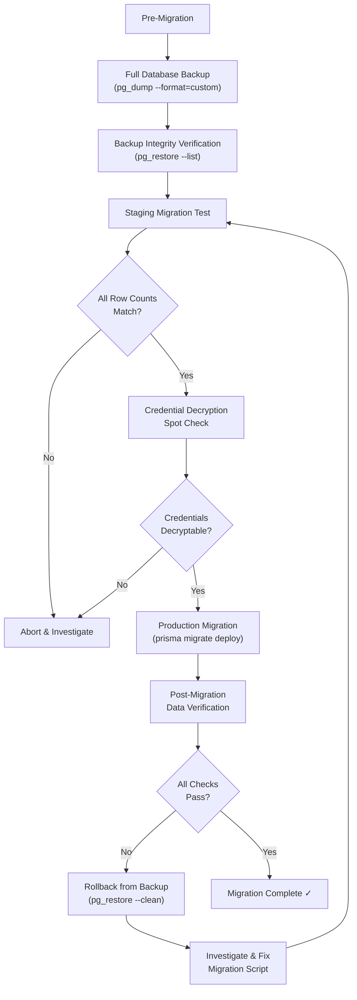

## Overview

The foundational principle governing every database migration during the Calendly gap closure initiative is **no data loss**. Every migration script, schema change, and data transformation must preserve all existing Cal.com user data — including bookings, event types, availability schedules, webhook subscriptions, calendar credentials, team and organization configurations, payment records, and notification preferences.

This guide documents the complete data inventory that must be preserved, the encryption key handling procedures that protect sensitive credentials, the step-by-step migration safeguards that prevent data loss, and the formal preservation guarantees for each data entity.

All migrations must also follow the deployment patterns described in the [Zero-Downtime Migration Strategy](/migration/zero-downtime-strategy), which ensures schema changes are backward-compatible and deployable without application downtime.

<Warning>
  Every migration script must be validated against a production-representative dataset before deployment. Zero data loss is a non-negotiable requirement.
</Warning>

---

## Existing User Data Inventory

The following table documents all data entities in the Cal.com platform that must be preserved through gap closure migrations. The key fields are derived from the Prisma select projections used throughout the codebase, which define the authoritative data model for each entity.

| Data Entity | Prisma Model | Key Fields | Encryption Status | Preservation Priority |
|---|---|---|---|---|
| **Bookings** | `Booking` | id, uid, title, userPrimaryEmail, description, customInputs, startTime, endTime, attendees, metadata, createdAt, status, responses, rescheduled, fromReschedule, tracking (utm_source, utm_medium, utm_campaign, utm_term, utm_content) | Unencrypted | Critical |
| **Event Types** | `EventType` | id, title, slug, description, length, schedulingType, locations, customInputs, periodType, periodDays, periodStartDate, periodEndDate, recurringEvent, price, currency, bookingFields, metadata, seatsPerTimeSlot, minimumBookingNotice, beforeEventBuffer, afterEventBuffer, slotInterval, lockTimeZoneToggleOnBookingPage, requiresConfirmation, successRedirectUrl | Unencrypted | Critical |
| **Availability Schedules** | `Schedule` + `Availability` | schedule.id, schedule.timeZone, availability.date, availability.startTime, availability.endTime, availability.days | Unencrypted | Critical |
| **Webhook Subscriptions** | `Webhook` | id, subscriberUrl, triggerEvents, active, secret, version, payloadTemplate, appId | Secret field sensitive | High |
| **Calendar Credentials** | `Credential` | id, type, key (encrypted), encryptedKey, userId, teamId, appId, invalid, delegationCredentialId | **AES-256 Encrypted** (`key`, `encryptedKey`) | Critical |
| **Users** | `User` | id, uuid, email, username, name, timeZone, locale, bufferTime, timeFormat, defaultScheduleId, metadata, isPlatformManaged, destinationCalendar, selectedCalendars, travelSchedules, hideBranding, theme, brandColor, darkBrandColor, allowDynamicBooking, locked | Unencrypted | Critical |
| **Teams** | `Team` | id, name, slug, logoUrl, hideBranding, members, managed event types, parent org reference | Unencrypted | High |
| **Organizations** | `Team` (parent) | Organization settings, branding, SSO configuration, child teams, member roles | Unencrypted | High |
| **Payments** | `Payment` | data, success, uid, refunded, bookingId, appId, amount, currency, paymentOption, associated booking details | Unencrypted | Critical |
| **Workflows** | `Workflow` + `WorkflowStep` | Workflow definitions, trigger configurations, action steps, notification templates | Unencrypted | High |
| **Selected Calendars** | `SelectedCalendar` | Per-user calendar selection for availability checking | Unencrypted | High |
| **Destination Calendars** | `DestinationCalendar` | Target calendar for new booking creation per user/event type | Unencrypted | High |

`Source: packages/prisma/selects/booking.ts` — `bookingMinimalSelect` defines id, title, userPrimaryEmail, description, customInputs, startTime, endTime, attendees, metadata, createdAt. `bookingDetailsSelect` adds uid, rescheduled, fromReschedule, and tracking with UTM parameters.

`Source: packages/prisma/selects/event-types.ts` — `bookEventTypeSelect` defines the comprehensive event type projection including locations, customInputs, periodType, recurringEvent, metadata, price, currency, bookingFields, workflows, and team references. `availiblityPageEventTypeSelect` adds scheduling fields: minimumBookingNotice, beforeEventBuffer, afterEventBuffer, slotInterval, and schedule with availability and timeZone.

`Source: packages/prisma/selects/user.ts` — `availabilityUserSelect` defines id, uuid, timeZone, email, bufferTime, username, timeFormat, defaultScheduleId, isPlatformManaged, schedules (with availability date/startTime/endTime/days and timeZone), selectedCalendars, and travelSchedules. `userSelect` extends this with name, allowDynamicBooking, destinationCalendar, locale, hideBranding, theme, brandColor, darkBrandColor, metadata, and locked.

`Source: packages/prisma/selects/payment.ts` — `paymentDataSelect` defines data, success, uid, refunded, bookingId, appId, amount, currency, paymentOption, and a deep booking relation including attendees, eventType, user, and status fields.

`Source: packages/prisma/selects/credential.ts` — `credentialForCalendarServiceSelect` includes id, appId, type, userId, teamId, key, encryptedKey, invalid, delegationCredentialId, and user email.

---

## Encryption Key Handling

Calendar credentials in the Cal.com platform are encrypted at rest using AES-256 symmetric encryption. Preserving the encryption keys during migration is **critical** — without the correct key, all encrypted calendar credentials become permanently unreadable.

### `CALENDSO_ENCRYPTION_KEY`

The primary encryption key is a **32-byte key** used for AES-256 symmetric encryption of calendar credentials. It is configured via the `CALENDSO_ENCRYPTION_KEY` environment variable.

```
# Application Key for symmetric encryption and decryption
# must be 32 bytes for AES256 encryption algorithm
# You can use: `openssl rand -base64 24` to generate a 32-character key
CALENDSO_ENCRYPTION_KEY=
```

`Source: .env.example` (lines 88–91)

This key is used by the `symmetricEncrypt` and `symmetricDecrypt` functions across all `packages/app-store/` calendar adapters. For example, the Apple Calendar adapter encrypts and decrypts credentials as follows:

```ts
// Decrypting existing credentials for verification
const decryptedCredential = JSON.parse(
  symmetricDecrypt(credential.key?.toString() || "", process.env.CALENDSO_ENCRYPTION_KEY || "")
);

// Encrypting new credentials for storage
const data = {
  type: "apple_calendar",
  key: symmetricEncrypt(
    JSON.stringify({ username, password }),
    process.env.CALENDSO_ENCRYPTION_KEY || ""
  ),
  userId: user.id,
  teamId: null,
  appId: "apple-calendar",
  invalid: false,
};
```

`Source: packages/app-store/applecalendar/api/add.ts` (lines 32–33, 47–56)

<Warning>
  The `CALENDSO_ENCRYPTION_KEY` MUST NOT be rotated during migration. If the key is lost or changed, all encrypted calendar credentials become unreadable. Ensure this key is backed up before any migration.
</Warning>

### Service Account Encryption Key

A separate **24-byte key** is used for encrypting service account keys, configured via the `CALCOM_SERVICE_ACCOUNT_ENCRYPTION_KEY` environment variable.

```
# Service Account Encryption Key for encrypting/decrypting service account keys
# You can use: `openssl rand -base64 24` to generate one
CALCOM_SERVICE_ACCOUNT_ENCRYPTION_KEY=
```

`Source: .env.example` (lines 487–489)

An additional credential sync key (`CALCOM_APP_CREDENTIAL_ENCRYPTION_KEY`) is used for self-hosters implementing Cal.com into applications with existing integrations.

```
# Key should match on Cal.com and your application
# must be 24 bytes for AES256 encryption algorithm
CALCOM_APP_CREDENTIAL_ENCRYPTION_KEY=""
```

`Source: .env.example` (lines 370–372)

### Credential Select Safety Patterns

The codebase enforces credential data safety through two distinct Prisma select projections:

**Backend use** — `credentialForCalendarServiceSelect` **includes** both `key: true` and `encryptedKey: true` because backend calendar services need to decrypt credentials for API calls:

```ts
export const credentialForCalendarServiceSelect = {
  id: true,
  appId: true,
  type: true,
  userId: true,
  user: { select: { email: true } },
  teamId: true,
  key: true,
  encryptedKey: true,
  invalid: true,
  delegationCredentialId: true,
} satisfies Prisma.CredentialSelect;
```

**Frontend use** — `safeCredentialSelect` explicitly **omits** `key` and `encryptedKey` to prevent credential leakage to the browser:

```ts
export const safeCredentialSelect = {
  id: true,
  type: true,
  /** Omitting to avoid frontend leaks */
  // key: true,
  // encryptedKey: true,
  userId: true,
  user: { select: { email: true } },
  teamId: true,
  appId: true,
  invalid: true,
  delegationCredentialId: true,
} satisfies Prisma.CredentialSelect;
```

`Source: packages/prisma/selects/credential.ts` (lines 3–18 for backend, lines 20–36 for frontend)

Similarly, `safeAppSelect` in `packages/prisma/selects/app.ts` omits the `keys` field from App model queries to prevent frontend leakage of app-level secrets.

`Source: packages/prisma/selects/app.ts`

---

## Migration Safeguards

Every gap closure migration must pass through the following safeguard pipeline before reaching production. These steps ensure data integrity is verified at every stage.

<Steps>
  <Step title="Pre-Migration Backup">
    Create a full PostgreSQL backup before any migration execution:

    - Full database dump using `pg_dump` with `--format=custom` for efficient, compressed, parallel-restorable backups
    - Verify backup integrity immediately with `pg_restore --list`
    - Store the backup file with a timestamp identifier in a secure, geographically redundant location
    - Test the backup by restoring it to a separate, isolated database instance and verifying connectivity

    ```bash
    pg_dump --format=custom --file=backup_$(date +%Y%m%d_%H%M%S).dump "$DATABASE_URL"
    pg_restore --list backup_*.dump | head -20
    ```
  </Step>
  <Step title="Migration Script Validation">
    Validate the migration against a staging environment before production:

    - Run the migration against a staging database populated with production-representative data
    - Verify row counts for all affected tables before and after migration execution
    - Validate that encrypted credentials can still be decrypted after migration by running a spot-check decryption test
    - Confirm that all Prisma select projections in `packages/prisma/selects/` still function correctly — compile and run a query for each select
  </Step>
  <Step title="Data Integrity Verification">
    Execute systematic data integrity checks after the staging migration:

    ```sql
    -- Row count verification queries
    SELECT 'Booking' AS entity, COUNT(*) AS row_count FROM "Booking"
    UNION ALL
    SELECT 'EventType', COUNT(*) FROM "EventType"
    UNION ALL
    SELECT 'Credential', COUNT(*) FROM "Credential"
    UNION ALL
    SELECT 'Webhook', COUNT(*) FROM "Webhook"
    UNION ALL
    SELECT 'User', COUNT(*) FROM "User"
    UNION ALL
    SELECT 'Schedule', COUNT(*) FROM "Schedule"
    UNION ALL
    SELECT 'Payment', COUNT(*) FROM "Payment"
    UNION ALL
    SELECT 'Workflow', COUNT(*) FROM "Workflow";
    ```

    - Run foreign key consistency checks across all related tables
    - Verify nullable field compliance — no unexpected `NULL` values in previously non-nullable columns
    - Compare row counts against the pre-migration snapshot to confirm zero record loss
  </Step>
  <Step title="Post-Migration Validation">
    After production migration, verify the system is fully operational:

    - Execute `SELECT 1` via the Prisma client to confirm database connectivity — this mirrors the `isPrismaAvailableCheck()` guard used in the auto-migration system
    - Verify Prisma client generation succeeds: `yarn prisma generate`
    - Run application health checks to confirm all features function (booking creation, calendar sync, webhook delivery)
    - Spot-check specific booking records for data completeness — verify attendees, metadata, and custom inputs are intact
    - Verify at least one encrypted credential decrypts successfully with the existing `CALENDSO_ENCRYPTION_KEY`
  </Step>
</Steps>

---

## Backup Verification Procedures

### Backup Strategies

<Tabs>
  <Tab title="Logical Backup (pg_dump)">
    The primary backup method for gap closure migrations uses PostgreSQL's `pg_dump` utility with custom format for maximum flexibility:

    ```bash
    # Create a timestamped backup in custom format
    pg_dump --format=custom --file=backup_$(date +%Y%m%d_%H%M%S).dump "$DATABASE_URL"

    # Verify the backup contains expected tables
    pg_restore --list backup_*.dump | head -20

    # Test restore on a separate database
    createdb cal_restore_test
    pg_restore --dbname=cal_restore_test backup_*.dump
    psql -d cal_restore_test -c "SELECT COUNT(*) FROM \"Booking\";"
    dropdb cal_restore_test
    ```

    Custom format (`--format=custom`) is preferred because it supports parallel restore, selective table restoration, and compression.
  </Tab>
  <Tab title="Point-in-Time Recovery (Managed PostgreSQL)">
    If using a managed PostgreSQL provider (Neon, Supabase, AWS RDS, Google Cloud SQL), leverage their built-in point-in-time recovery (PITR) capabilities:

    - **Neon**: Branching-based recovery — create a branch from any point in the last 7–30 days (depending on plan)
    - **Supabase**: Daily automated backups with PITR available on Pro plans, recoverable to any second within the retention window
    - **AWS RDS**: Automated backups with PITR, configurable retention period (1–35 days)
    - **Google Cloud SQL**: Automated backups with PITR, configurable retention

    PITR provides a safety net beyond manual `pg_dump` backups, allowing recovery to the exact moment before a migration was executed.
  </Tab>
</Tabs>

<Note>
  For self-hosted deployments using Docker, the database runs on PostgreSQL 13+ (from `packages/prisma/docker-compose.yml` with port 5450 mapped to internal 5432 and a persistent `db_data` volume). Ensure `pg_dump` version matches the PostgreSQL server version to avoid compatibility issues.
</Note>

### Database Connection Environment Variables

The following environment variables configure database connectivity for Cal.com. All must be preserved and verified during migrations.

| Variable | Purpose | Source |
|---|---|---|
| `DATABASE_URL` | Primary connection string (may use connection pooler such as PgBouncer) | `.env.example` line 30 |
| `DATABASE_DIRECT_URL` | Direct connection (bypasses pooler, **required** for Prisma migrations) | `.env.example` line 33 |
| `INSIGHTS_DATABASE_URL` | Read-only replica connection for analytics queries | `.env.example` line 34 |
| `DATABASE_CHUNK_SIZE` | Batch processing chunk size for large data operations | `.env.example` line 485 |
| `SKIP_DB_MIGRATIONS` | Set to `"1"` to skip auto-migrations during deployment | `packages/prisma/auto-migrations.ts` line 17 |

`Source: packages/prisma/auto-migrations.ts`, `Source: .env.example`

<Note>
  The `DATABASE_DIRECT_URL` is mandatory for running Prisma migrations because connection poolers like PgBouncer do not support the transactional DDL operations that migrations require. If only `DATABASE_URL` is set (pointing to a pooler) without `DATABASE_DIRECT_URL`, the auto-migration system will skip migrations and log a warning.
</Note>

---

## Prisma Migration Safety Patterns

### Migration Infrastructure

Cal.com's Prisma migration system is mature and battle-tested, with **585+ chronological migrations** in `packages/prisma/migrations/` spanning from `20210605225044_init` to `20260213000000_enable_onboarding_v3_globally`.

The auto-migration system in `packages/prisma/auto-migrations.ts` executes `yarn prisma migrate deploy` during deployment and application startup, with the following safety guards:

1. **`SKIP_DB_MIGRATIONS === "1"`** — Operators can skip migrations entirely for debugging or staged rollouts
2. **`DATABASE_URL` check** — Verifies the primary connection string is present
3. **`DATABASE_DIRECT_URL` check** — Verifies the direct connection is available (required for DDL operations)
4. **`isPrismaAvailableCheck()`** — Executes `SELECT 1` via the Prisma client to verify database connectivity

Only when all four guards pass does the system execute `yarn prisma migrate deploy`. On failure, the process exits with code 1 and logs the error.

`Source: packages/prisma/auto-migrations.ts`

The migration provider is locked to PostgreSQL via `migration_lock.toml`, preventing accidental execution against incompatible database engines.

### Safe Migration Patterns for Data Preservation

The following patterns have been proven safe across hundreds of Cal.com migrations. Each pattern ensures that **existing rows are never invalidated** by new schema changes.

**Pattern 1: Additive Columns with Defaults**

New columns with `NOT NULL` constraints include a `DEFAULT` value so existing rows are automatically populated:

```sql
-- Source: migration 20260210000000_add_billing_mode
ALTER TABLE "TeamBilling" ADD COLUMN "billingMode" "BillingMode" NOT NULL DEFAULT 'SEATS';
```

Existing rows receive the default value. Old application code continues to function because it does not reference the new column.

**Pattern 2: Nullable Columns**

New columns without a `NOT NULL` constraint are metadata-only changes — no existing rows are rewritten:

```sql
-- Source: migration 20260130100000_add_high_water_mark_fields
ALTER TABLE "TeamBilling" ADD COLUMN "highWaterMark" INTEGER;
ALTER TABLE "TeamBilling" ADD COLUMN "highWaterMarkPeriodStart" TIMESTAMP(3);
```

`NULL` is the implicit default. Old application code ignores these columns entirely.

**Pattern 3: Nullable Text Columns**

Optional text/string configuration fields follow the nullable column pattern:

```sql
-- Source: migration 20260201053520_add_redirect_url_on_no_routing_form_response
ALTER TABLE "public"."EventType" ADD COLUMN "redirectUrlOnNoRoutingFormResponse" TEXT;
```

All existing `EventType` rows receive `NULL`. Application code handles the `NULL` case gracefully.

**Pattern 4: Feature Flag Gating**

New features are gated behind disabled-by-default flags with idempotent inserts:

```sql
-- Source: migration 20260210000000_add_billing_mode
INSERT INTO "Feature" ("slug", "enabled", "type", "description", "createdAt", "updatedAt")
VALUES ('active-user-billing', false, 'OPERATIONAL', 'Enable active-user-based billing',
        CURRENT_TIMESTAMP, CURRENT_TIMESTAMP)
ON CONFLICT ("slug") DO NOTHING;
```

The `ON CONFLICT DO NOTHING` clause ensures re-deployments do not fail on duplicate entries. Features remain disabled until explicitly enabled.

<Note>
  These patterns ensure that no existing data is modified, deleted, or invalidated by gap closure migrations. Every new column either has a safe default value or accepts NULL, and every new feature is gated behind a disabled flag. For the complete catalog of safe migration patterns, see the [Zero-Downtime Migration Strategy](/migration/zero-downtime-strategy).
</Note>

---

## Data Preservation Guarantees

The following formal guarantees apply to every migration executed during the Calendly gap closure initiative. Each guarantee is independently verifiable using the data integrity checks described in the Migration Safeguards section above.

<AccordionGroup>
  <Accordion title="Booking Records — Critical">
    All existing bookings — confirmed, pending, cancelled, and rescheduled — retain their complete data including:

    - Core fields: `id`, `uid`, `title`, `startTime`, `endTime`, `status`
    - Attendee data: full attendee list with email, name, and timezone
    - Custom data: `customInputs`, `responses`, `metadata`
    - Tracking parameters: UTM source, medium, campaign, term, and content
    - Rescheduling chain: `rescheduled`, `fromReschedule` references
    - Associated records: payments, workflow triggers, calendar events

    No migration may alter, delete, or reformat any of these fields. New booking-related columns must follow the additive-only pattern.

    `Source: packages/prisma/selects/booking.ts` — `bookingMinimalSelect`, `bookingDetailsSelect`
  </Accordion>
  <Accordion title="Event Type Configurations — Critical">
    All existing event types retain their complete configuration including:

    - Identity: `id`, `title`, `slug`, `description`
    - Scheduling: `schedulingType` (one-on-one, group, collective, roundRobin, managed, dynamic), `length`, `recurringEvent`
    - Availability: `periodType`, `periodDays`, `periodStartDate`, `periodEndDate`, `minimumBookingNotice`, `beforeEventBuffer`, `afterEventBuffer`, `slotInterval`
    - Customization: `locations`, `customInputs`, `bookingFields`, `metadata`
    - Pricing: `price`, `currency`
    - Display: `hidden`, `lockTimeZoneToggleOnBookingPage`, `requiresConfirmation`, `seatsPerTimeSlot`
    - Relationships: associated users, team references, workflow bindings

    `Source: packages/prisma/selects/event-types.ts` — `bookEventTypeSelect`, `availiblityPageEventTypeSelect`
  </Accordion>
  <Accordion title="Availability Schedules — Critical">
    All existing availability schedules retain their weekly hours, date-specific overrides, timezone settings, and buffer time configurations:

    - Schedule: `id`, `timeZone`
    - Availability rules: `date` (for date-specific overrides), `startTime`, `endTime`, `days` (for weekly recurring rules)
    - User defaults: `defaultScheduleId`, `bufferTime`
    - Travel schedules: `travelSchedules` for timezone-override support

    `Source: packages/prisma/selects/user.ts` — `availabilityUserSelect`
  </Accordion>
  <Accordion title="Calendar Credentials — Critical (Encrypted)">
    All encrypted calendar credentials remain decryptable with the existing `CALENDSO_ENCRYPTION_KEY`. The AES-256 symmetric encryption mechanism is not modified during any gap closure migration.

    - The `key` field (encrypted JSON containing provider-specific credentials) remains intact
    - The `encryptedKey` field (alternative encrypted storage) remains intact
    - The `invalid` flag preserves its current state — credentials marked invalid are not silently deleted
    - The `delegationCredentialId` reference chain is preserved for shared credential scenarios

    No migration may alter the encryption algorithm, key derivation, or storage format for credential data.

    `Source: packages/prisma/selects/credential.ts` — `credentialForCalendarServiceSelect`
  </Accordion>
  <Accordion title="Webhook Subscriptions — High">
    All existing webhook subscriptions retain their subscriber URLs, trigger events, secrets, payload templates, and version settings:

    - Subscriber configuration: `subscriberUrl`, `active`, `secret`
    - Event configuration: `triggerEvents` (array of subscribed events)
    - Payload configuration: `payloadTemplate` (Handlebars template), `version` (payload version)
    - Association: `appId`, `userId`, `teamId`

    Existing consumers continue to receive payloads in their subscribed version format. New trigger events may be added, but existing trigger event payloads are not modified. See [Webhook Backward Compatibility](/migration/webhook-compatibility) for the full payload versioning strategy.
  </Accordion>
  <Accordion title="User Profiles — Critical">
    All user profiles retain their timezone, locale, theme, branding, and schedule preferences:

    - Identity: `id`, `uuid`, `email`, `username`, `name`
    - Preferences: `timeZone`, `locale`, `timeFormat`, `bufferTime`
    - Display: `hideBranding`, `theme`, `brandColor`, `darkBrandColor`
    - Scheduling: `defaultScheduleId`, `allowDynamicBooking`
    - State: `metadata`, `locked`, `isPlatformManaged`
    - Relationships: `destinationCalendar`, `selectedCalendars`, `travelSchedules`

    `Source: packages/prisma/selects/user.ts` — `userSelect`, `baseUserSelect`
  </Accordion>
  <Accordion title="Team & Organization Structure — High">
    All team memberships, organization hierarchies, role assignments, and managed event types are preserved:

    - Team identity: name, slug, logo, branding configuration
    - Membership: member list with role assignments (OWNER, ADMIN, MEMBER)
    - Organization hierarchy: parent-child team relationships
    - Managed event types: team-level event type configurations and member assignments
    - SSO configuration: SAML/OIDC settings for enterprise organizations
  </Accordion>
  <Accordion title="Payment Records — Critical">
    All payment records and their associations with bookings are preserved:

    - Payment data: `data` (provider-specific payment object), `success`, `uid`, `refunded`
    - Financial: `amount`, `currency`, `paymentOption`
    - Association: `bookingId`, `appId`
    - Linked booking: full booking details including attendees, event type, status, and cancellation/rejection reasons

    `Source: packages/prisma/selects/payment.ts` — `paymentDataSelect`
  </Accordion>
</AccordionGroup>

---

## Data Preservation Verification Flow

The following diagram illustrates the end-to-end verification pipeline that every gap closure migration must pass through before being considered complete. Each decision point acts as a gate — if any check fails, the migration is aborted or rolled back before data integrity can be compromised.



The pipeline ensures that:
1. A backup always exists before any production change
2. The migration is validated in staging before production
3. Both row count integrity and credential decryption are verified
4. Rollback is always possible if post-migration checks fail

---

## Rollback Procedures

If data integrity issues are detected after a production migration, execute the following rollback procedure immediately.

<Steps>
  <Step title="Stop the Application">
    Halt all application instances to prevent new data from being written to the database. This is critical because a backup restore will overwrite any data created after the backup was taken.

    ```bash
    # For Docker deployments
    docker compose down

    # For Kubernetes deployments
    kubectl scale deployment cal-web --replicas=0
    kubectl scale deployment cal-api --replicas=0
    ```
  </Step>
  <Step title="Restore from Backup">
    Restore the pre-migration backup using `pg_restore`:

    ```bash
    pg_restore --clean --if-exists --dbname="$DATABASE_URL" backup_YYYYMMDD_HHMMSS.dump
    ```

    The `--clean` flag drops existing objects before recreating them. The `--if-exists` flag prevents errors if objects do not exist.
  </Step>
  <Step title="Verify Restoration">
    Confirm the restore was successful:

    ```sql
    -- Verify row counts match pre-migration values
    SELECT 'Booking' AS entity, COUNT(*) AS row_count FROM "Booking"
    UNION ALL
    SELECT 'EventType', COUNT(*) FROM "EventType"
    UNION ALL
    SELECT 'User', COUNT(*) FROM "User"
    UNION ALL
    SELECT 'Credential', COUNT(*) FROM "Credential";
    ```

    Verify at least one encrypted credential decrypts successfully to confirm the encryption key is intact.
  </Step>
  <Step title="Restart the Application">
    Bring the application back online:

    ```bash
    # Set SKIP_DB_MIGRATIONS=1 to prevent the auto-migration system
    # from re-running the failed migration on startup
    export SKIP_DB_MIGRATIONS=1

    # For Docker deployments
    docker compose up -d

    # For Kubernetes deployments
    kubectl scale deployment cal-web --replicas=3
    kubectl scale deployment cal-api --replicas=2
    ```

    Setting `SKIP_DB_MIGRATIONS=1` prevents the auto-migration system from attempting to re-apply the rolled-back migration on startup. Once the migration issue is resolved, remove this flag.

    `Source: packages/prisma/auto-migrations.ts` (line 17)
  </Step>
  <Step title="Investigate and Re-attempt">
    After restoring service:

    1. Analyze the migration failure root cause using staging environment logs
    2. Fix the migration script to address the data integrity issue
    3. Re-run the full verification pipeline (staging test → row count check → credential check → production)
    4. Only proceed to production after all verification gates pass
  </Step>
</Steps>

<Warning>
  Rollback must be performed before any new data is written after the failed migration. Once new bookings are created post-migration, a simple backup restore would lose those new records. If new data has been created, a more targeted rollback strategy (reverting only the schema change while preserving new data) must be designed and tested before execution.
</Warning>

---

## Summary

Data preservation is the non-negotiable foundation of the Calendly gap closure initiative. Every migration must:

1. **Back up** the database before execution using `pg_dump --format=custom`
2. **Validate** in staging with production-representative data before production deployment
3. **Verify** row counts, foreign key integrity, and credential decryption after execution
4. **Roll back** immediately if any verification check fails
5. **Preserve** all encryption keys — especially `CALENDSO_ENCRYPTION_KEY` — without rotation or modification

For the complete migration deployment strategy, see [Zero-Downtime Migration Strategy](/migration/zero-downtime-strategy). For webhook-specific backward compatibility guarantees, see [Webhook Backward Compatibility](/migration/webhook-compatibility).
